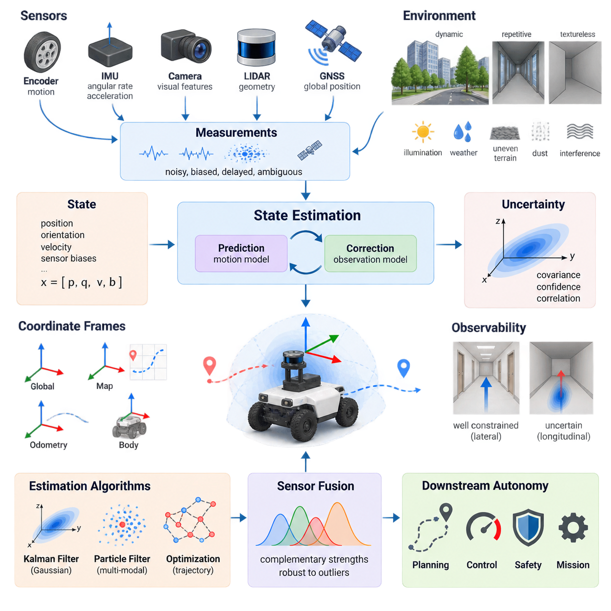
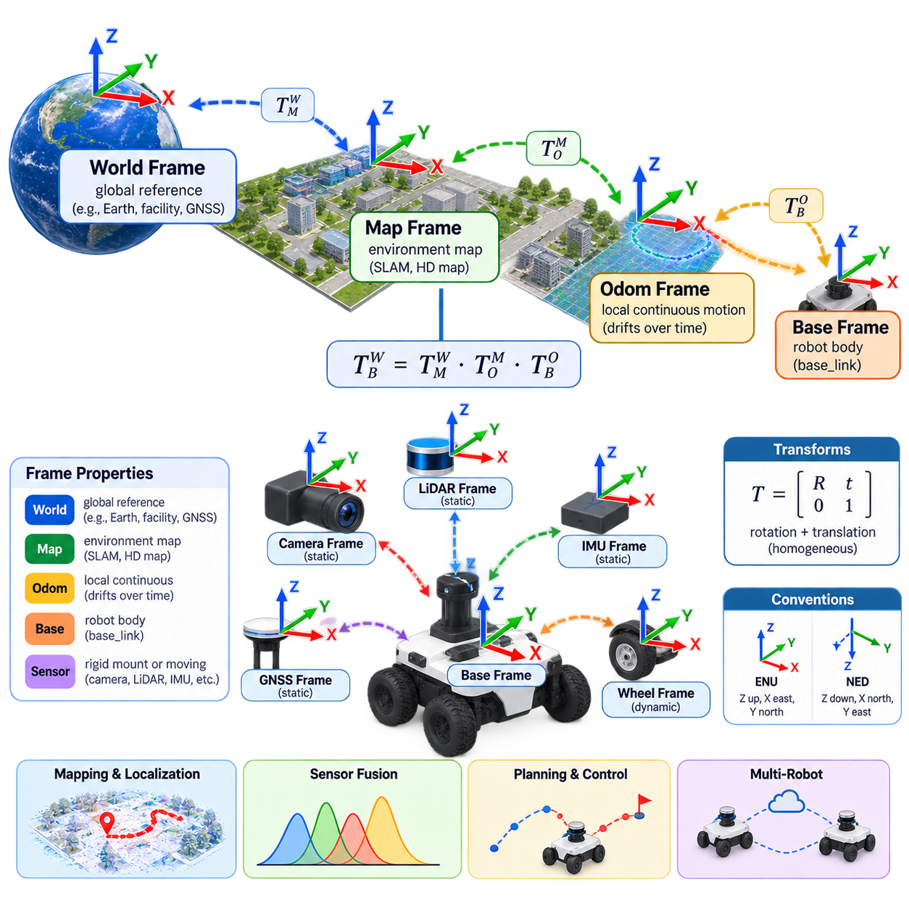
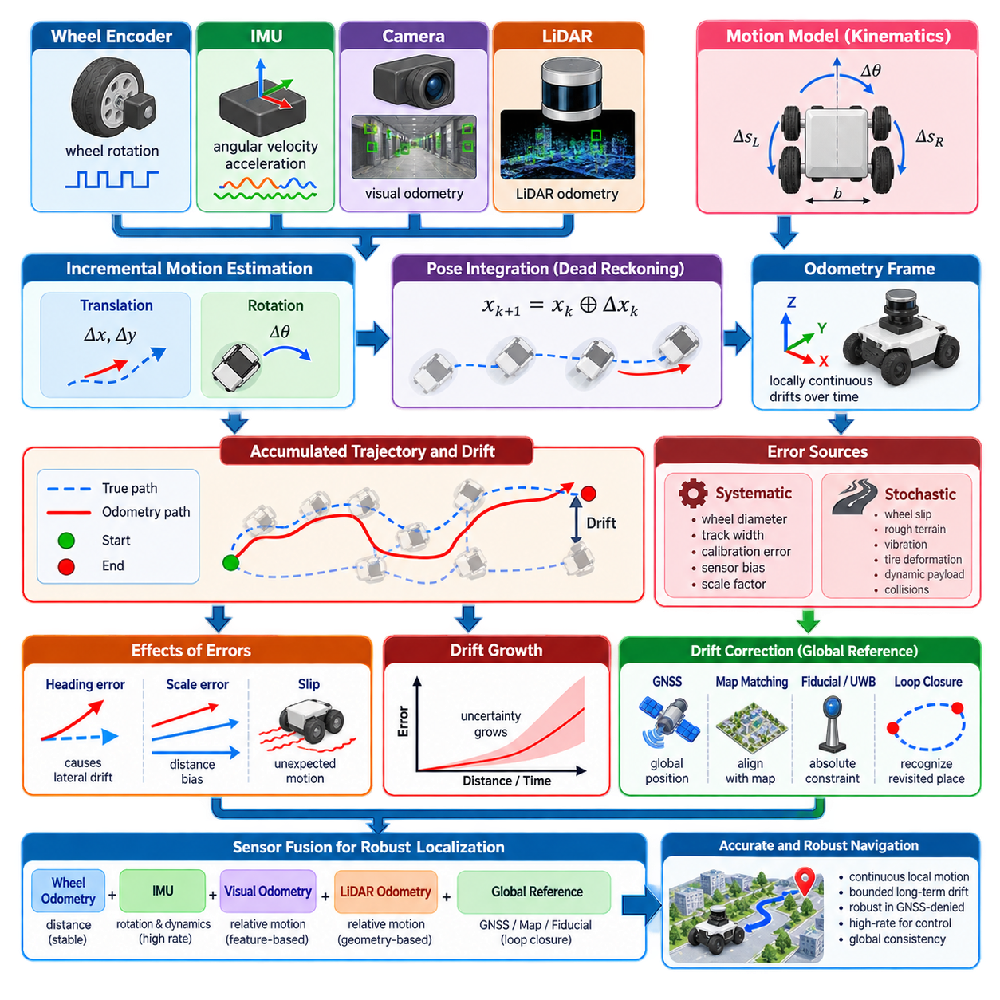
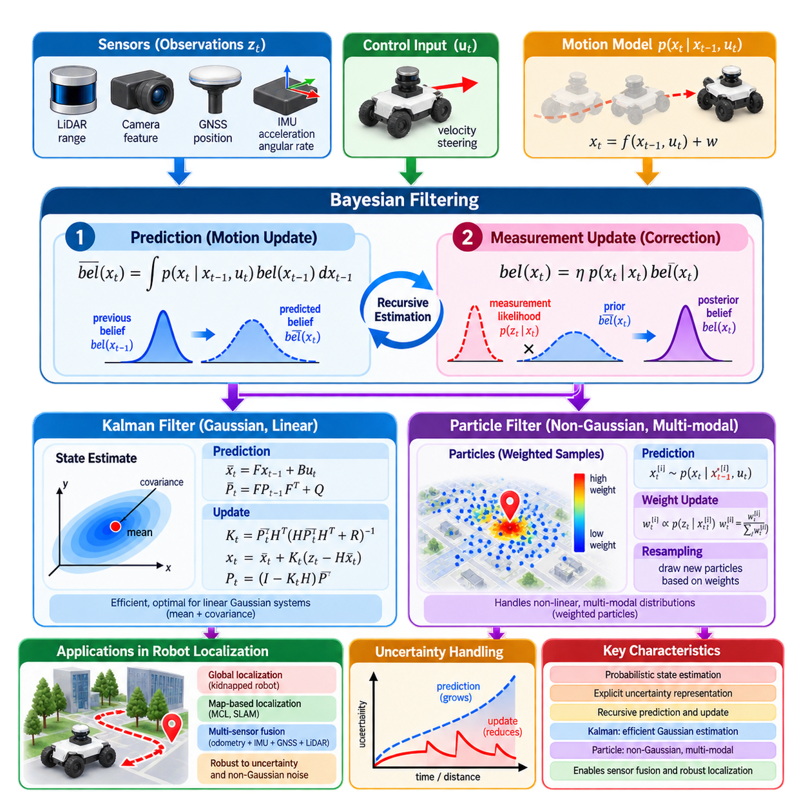
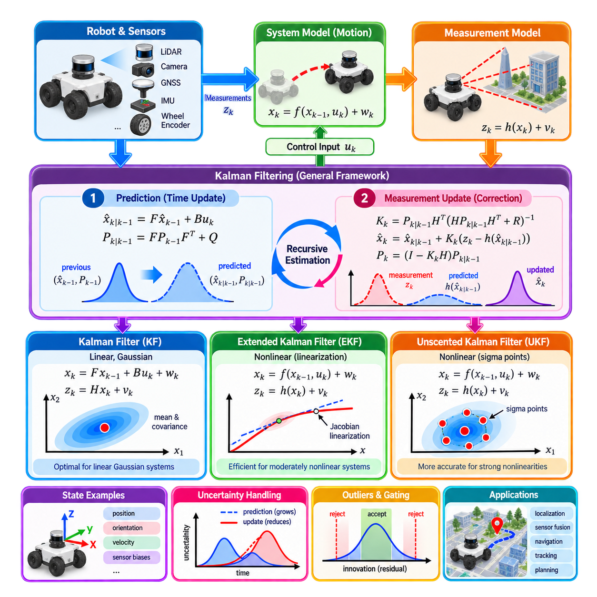
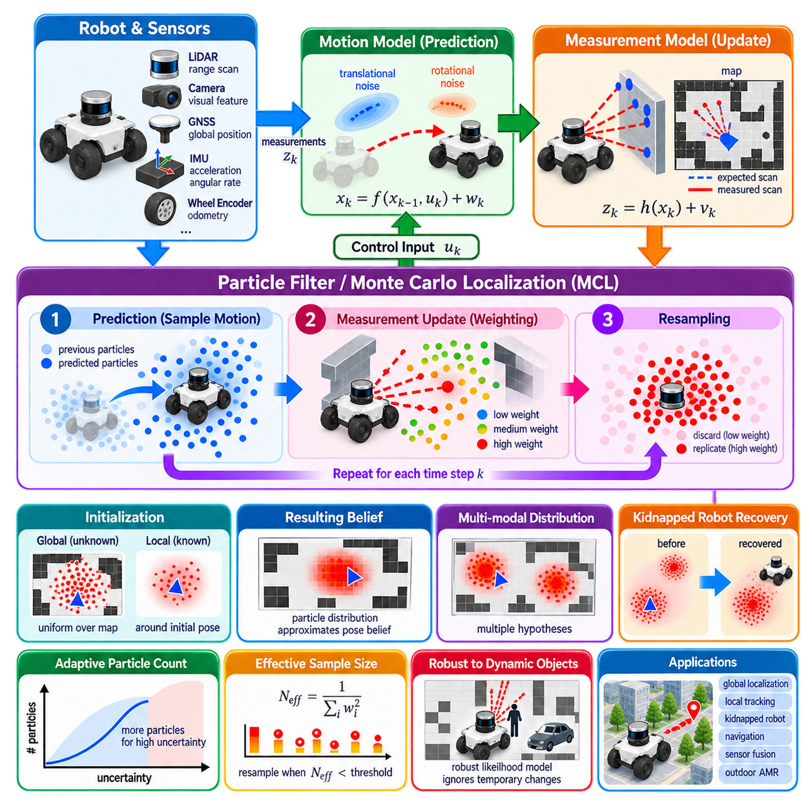
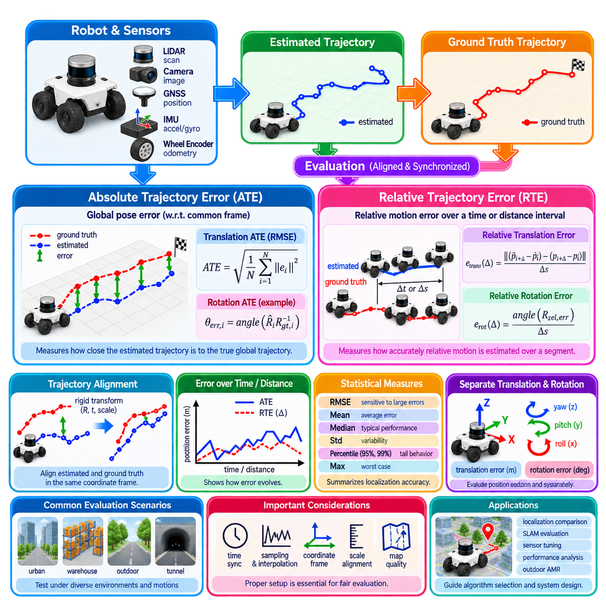
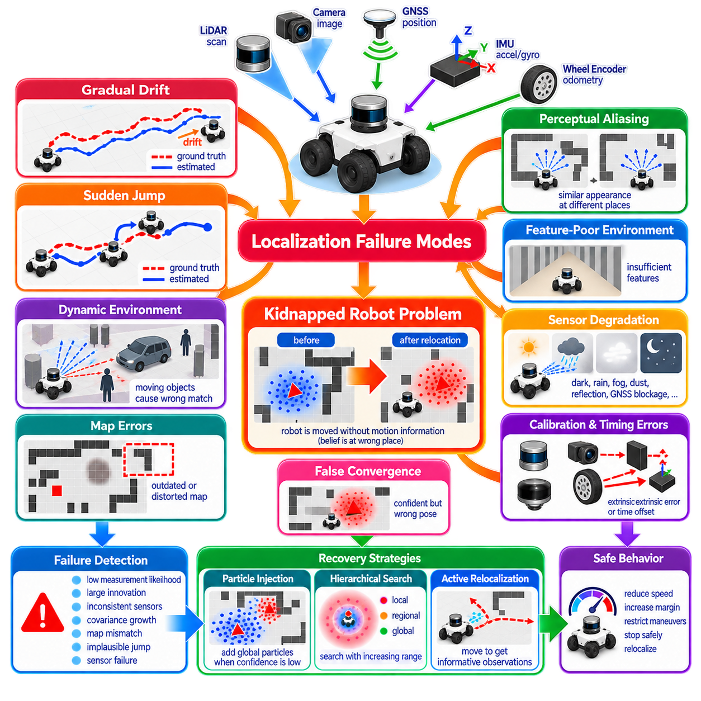
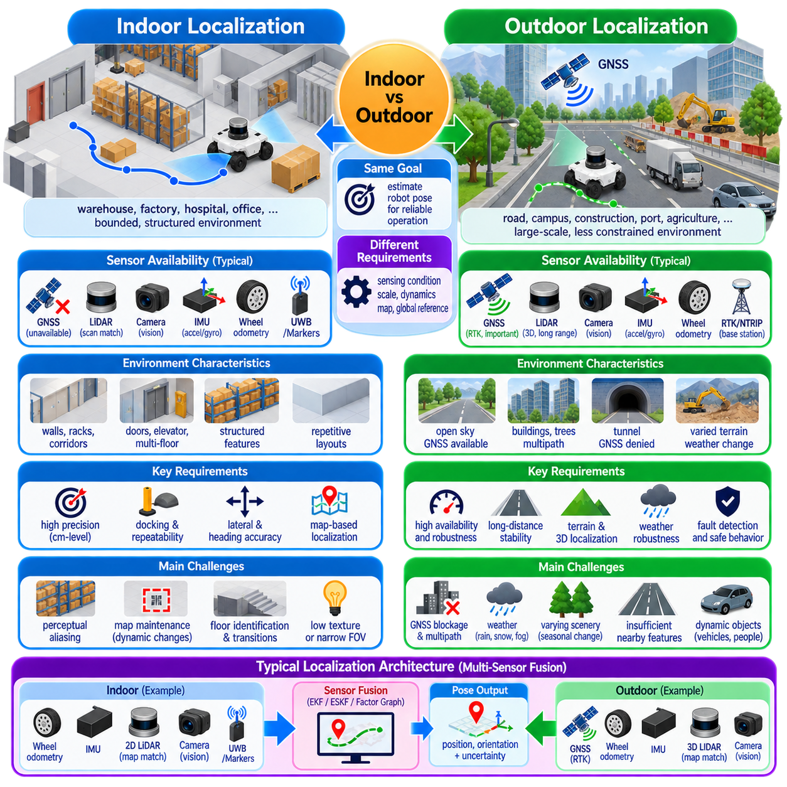
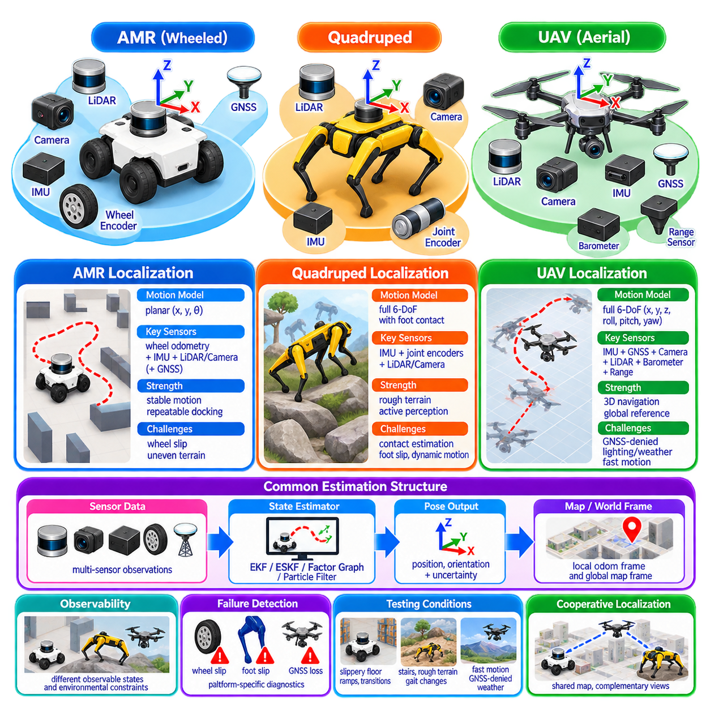

**Volume 13. Mapping Localization and SLAM**

# Chapter 01. Localization Fundamentals

## 01.01. Localization Problem State Estimation and Uncertainty

{width="7.268055555555556in" height="7.268055555555556in"}

Localization is the process by which a robot estimates its own state relative to a reference frame while operating in an environment. For a mobile robot, this state usually includes position and orientation, but it may also contain velocity, acceleration, sensor biases, wheel-slip variables, or other quantities required by the navigation system. Localization therefore extends beyond simply determining coordinates; it continuously reconstructs the robot state from incomplete and noisy observations.

The localization problem exists because the true physical state of a robot cannot normally be measured directly and perfectly. Encoders report wheel motion, inertial sensors measure angular velocity and acceleration, cameras observe visual features, LiDAR measures surrounding geometry, and GNSS provides global position information. Each measurement represents only part of the state and contains noise, bias, delay, ambiguity, or environmental interference that prevents direct recovery of the exact robot pose.

A useful mathematical description represents the robot state at time t by a state vector such as xₜ = [x, y, θ] for planar motion or xₜ = [p, q, v, b] for a richer three-dimensional system containing position, orientation, velocity, and sensor biases. Instead of assuming that xₜ is exactly known, localization estimates a probability distribution over possible states. The distribution expresses both the most plausible state and the uncertainty associated with that estimate.

State estimation is fundamentally a recursive inference problem. The robot begins with a prior belief about its state and predicts how that belief changes according to commanded motion or measured dynamics. When new sensor observations become available, the predicted belief is corrected according to how consistent those observations are with possible states. This prediction-and-correction cycle is repeatedly executed as the robot moves, producing a continuously updated estimate of its state.

The motion model describes how a previous state evolves into a new state under control inputs and physical dynamics. For an AMR, these inputs may include wheel velocities, steering commands, or measured inertial motion. Real motion never follows the mathematical model perfectly because of wheel slip, uneven terrain, actuator errors, compliance, and disturbances. Consequently, the prediction step normally increases uncertainty as the robot propagates its state forward through time.

The observation model relates the hidden robot state to measurements that sensors are expected to produce. A LiDAR localization system may predict geometric ranges from a candidate pose, while a visual system may predict the locations of landmarks in an image. GNSS relates geographic position to satellite-derived observations, and wheel encoders constrain relative motion. Localization compares actual measurements with these predictions to determine which candidate states are more plausible.

Uncertainty is not merely an undesirable side effect of localization; it is an explicit component of the estimation problem. A robot must represent how strongly it should trust its current pose and how uncertainty is distributed among state variables. In Gaussian estimators, this information is commonly represented by a covariance matrix. Large covariance indicates weak confidence, while correlations reveal how uncertainty in one state variable is related to uncertainty in another.

Uncertainty originates from several fundamentally different sources. Measurement noise introduces random variation, systematic sensor bias creates persistent errors, imperfect calibration distorts relationships among sensors, and uncertain dynamics cause errors during state propagation. Environmental effects add further uncertainty through changing illumination, reflective surfaces, repetitive geometry, GNSS multipath, dust, rain, vibration, or wheel slip. A practical localization architecture must account for several of these effects simultaneously.

Two major forms of localization error are often distinguished as relative drift and absolute error. Odometry and inertial integration can estimate short-term motion smoothly, but small errors accumulate as distance and time increase. Global references such as GNSS, mapped landmarks, fiducials, or previously constructed maps can constrain this drift. Robust systems therefore combine locally accurate relative measurements with observations capable of restoring consistency with a persistent global reference.

Localization also depends on the choice of coordinate frames. A robot may simultaneously operate with a body frame, odometry frame, local map frame, and globally referenced frame. Transformations among these frames determine how sensor measurements, maps, trajectories, and control commands are interpreted. Maintaining consistent timestamps and frame transformations is especially important in multi-sensor systems because spatial or temporal misalignment can appear to the estimator as physical motion.

Observability determines whether the available measurements contain enough information to estimate particular state variables. A robot traveling through a long featureless corridor may accurately constrain lateral position while remaining uncertain along the corridor direction. Visual localization may degrade in textureless environments, and LiDAR localization can become ambiguous in geometrically repetitive spaces. Adding sensors does not automatically solve these problems unless their measurements provide complementary observable information.

Different estimation algorithms represent uncertainty in different ways. Kalman-filter families approximate the state distribution using statistical moments and are efficient when uncertainty is reasonably well behaved. Particle filters represent multiple hypotheses using weighted samples and can preserve multimodal beliefs when several poses are plausible. Optimization-based estimators instead construct constraints over states and measurements, solving for trajectories that best satisfy the accumulated information.

The Bayesian viewpoint provides a common conceptual foundation for these approaches. Prediction applies the motion model to transform the previous belief into a prior distribution for the next state. Measurement updating multiplies this prior information by the likelihood of the new observation and produces a posterior belief. Localization can therefore be understood as repeated Bayesian inference in which motion spreads uncertainty and informative observations reduce or reshape it.

Sensor fusion becomes necessary because individual sensing modalities possess complementary strengths and failure modes. Encoders provide inexpensive high-rate relative motion but suffer from slip. IMUs capture rapid dynamics but accumulate integration error. Cameras contain rich semantic and geometric information but depend on visibility and illumination. LiDAR provides reliable geometric structure, while GNSS offers global referencing outdoors but may become unreliable near buildings, vegetation, tunnels, or interference sources.

A well-designed localization system does not simply average these measurements. It evaluates measurements according to uncertainty, timing, consistency, and expected sensor behavior. Measurements that strongly disagree with the current state may represent genuine corrective information or may instead be outliers caused by sensor failure or environmental disturbance. Innovation tests, robust loss functions, gating, redundancy, and fault detection can prevent isolated erroneous observations from destabilizing the complete state estimate.

Time synchronization is therefore closely connected to state-estimation accuracy. Sensors operating at different rates observe the robot at different physical times, and even small timestamp errors can create significant spatial errors when the robot moves quickly or rotates rapidly. Hardware timestamps, synchronized clocks, deterministic acquisition pipelines, and correct latency models become increasingly important as vehicle speed, sensor count, and localization precision requirements increase.

Initialization presents another important localization challenge. When the initial pose is approximately known, an estimator can begin with a concentrated prior distribution and rapidly refine the state. When the pose is unknown, the system must solve global localization by considering many possible hypotheses. A previously localized robot may also become lost after severe sensor degradation or map inconsistency, requiring relocalization rather than ordinary incremental pose tracking.

Localization quality should consequently be evaluated using more than a single position-error number. Relevant measures include translational and rotational error, covariance consistency, drift per traveled distance, relocalization success, initialization time, update latency, failure frequency, and robustness under degraded sensing. For autonomous robots, the practical question is whether the estimated state remains sufficiently accurate, timely, and trustworthy for planning and control throughout the intended operating domain.

State uncertainty also affects downstream autonomy directly. A planner that assumes an uncertain pose is exact may select trajectories with insufficient obstacle clearance, while a controller may react incorrectly to apparent tracking errors created by localization noise. Advanced systems can propagate localization confidence into planning, speed control, safety margins, and mission management. The robot can then reduce speed, seek better observations, switch localization sources, or stop safely when confidence becomes inadequate.

For outdoor AMRs, localization is particularly challenging because operating conditions change continuously across pavement, gravel, slopes, vegetation, buildings, open sky, and GNSS-denied regions. Wheel slip may invalidate odometry, vibration may degrade inertial measurements, and environmental geometry may provide inconsistent map constraints. Reliable deployment therefore requires adaptive fusion of local motion estimation, geometric or visual localization, and globally referenced measurements rather than dependence on a single sensor.

Ultimately, localization should be treated as continuous probabilistic state estimation rather than a mechanism that outputs one unquestioned coordinate. Every pose estimate is supported by models, observations, assumptions, and a measurable degree of uncertainty. Designing autonomous robots around this principle creates a foundation for sensor fusion, SLAM, map-based localization, GNSS integration, multi-robot coordination, and safety-aware navigation in increasingly complex physical environments.

## 01.02. Coordinate Frames and Transforms World Map Odom Base

{width="7.268055555555556in" height="7.268055555555556in"}

Autonomous robots cannot describe position and motion meaningfully without coordinate frames. Every sensor measurement, robot pose, map feature, velocity, and trajectory is expressed relative to some reference frame. A coordinate frame defines an origin and oriented axes from which quantities are interpreted. Localization systems therefore require not only estimates of where the robot is, but also an explicit definition of the reference frame in which each estimate is represented.

A mobile robot commonly uses several coordinate frames simultaneously because no single frame satisfies every navigation requirement. A world frame can represent a persistent global reference, a map frame represents localization relative to a constructed or predefined map, an odom frame provides locally continuous motion, and a base frame is rigidly attached to the robot. Sensors and actuators introduce additional frames connected to this hierarchy through calibrated transformations.

The world frame is the highest-level reference when the robot must operate in a globally meaningful coordinate system. It may correspond to a facility coordinate system, engineering survey frame, geographic reference, or Earth-fixed convention. In outdoor systems, GNSS and surveyed landmarks can connect localization to this frame. The world frame is especially useful when multiple maps, robots, buildings, or geographically separated operational areas must share a common spatial reference.

The map frame usually represents the coordinate system of the environment model used for localization and navigation. A SLAM-generated occupancy map, LiDAR point-cloud map, visual landmark map, or HD map may define its own map frame. Robot localization determines the transformation between the robot and this map. Unlike the world frame, the map frame does not necessarily correspond directly to geographic coordinates unless explicit georeferencing has been performed.

The odom frame represents a locally smooth and continuous estimate of robot motion. It is typically generated from wheel odometry, visual-inertial odometry, LiDAR odometry, or fused dead reckoning. Because these measurements accumulate error, the odom frame gradually drifts relative to the map or world frame. Its major advantage is continuity: short-term robot motion normally remains smooth even when global localization performs corrections that would otherwise create discontinuities in the estimated pose.

The base frame, often called base_link in robotic software architectures, is rigidly associated with the physical robot body. Its origin is selected according to a defined mechanical convention, such as the geometric center, axle center, or another stable reference point. Motion planners, controllers, collision models, and sensor transforms use this frame to describe quantities relative to the robot. Consistent base-frame definition is essential because changing its origin changes the mathematical interpretation of robot motion.

The relationship among these frames can be expressed as a chain of rigid-body transformations. A common navigation hierarchy is world → map → odom → base. The robot pose in the world frame can therefore be obtained by composing the transformations between adjacent frames. Mathematically, if Tᴬ_B describes frame B relative to frame A, then Tᵂ_B can be obtained by multiplying the required transformations along the frame tree in the correct order.

A rigid transformation contains both translation and rotation. In planar mobile robotics, a pose can often be represented by x, y, and heading θ, while three-dimensional systems require three-dimensional translation together with an orientation representation. Rotation matrices, Euler angles, axis-angle representations, and quaternions are commonly used. Homogeneous transformation matrices combine rotation and translation into one representation and make transformation composition convenient.

Transformation direction must always be handled carefully. A transformation that describes frame B relative to frame A is not numerically equivalent to the transformation describing A relative to B. The inverse transformation is required to reverse direction. Many localization and sensor-fusion errors arise not from sophisticated algorithms but from incorrectly interpreted frame conventions, transformation direction, axis orientation, or multiplication order.

Orientation conventions introduce another source of potential inconsistency. Robotics systems may use right-handed coordinate systems, while sensors or external software can follow different axis conventions. A vehicle frame might define x forward, y left, and z upward, whereas a camera may use an optical frame with different directions. GNSS, aerospace, computer vision, and geographic information systems also employ conventions such as ENU, NED, or image coordinates that must be converted explicitly.

Static transforms describe relationships that remain fixed during normal operation. The transformation from the base frame to a rigidly mounted LiDAR, camera, GNSS antenna, or IMU is an example. These transformations are determined by mechanical design or extrinsic calibration. Even small errors can become significant: an angular calibration error at a sensor can produce increasing spatial error with measurement distance and can degrade mapping, localization, and multi-sensor fusion.

Dynamic transforms change as the robot moves or as articulated components change configuration. The transformation between odom and base varies continuously with vehicle motion, while a pan-tilt camera, manipulator joint, steering mechanism, or suspension system can create additional dynamic frame relationships. The transform system must therefore distinguish fixed geometric relationships from time-dependent states and update dynamic transforms at rates appropriate for downstream algorithms.

The separation between map and odom frames solves an important architectural problem. Global localization algorithms may periodically correct accumulated drift after recognizing landmarks, matching a map, closing a SLAM loop, or receiving GNSS information. Applying these corrections directly to the locally integrated robot pose could cause sudden jumps. Instead, the odom-to-base transform remains continuous while the map-to-odom transform absorbs global corrections.

This separation allows control and global navigation to operate with different but compatible spatial properties. A low-level controller can use the smooth odom frame for stable velocity and trajectory tracking, while a global planner can reason about the robot in the map frame. The transformation system connects both representations so that global goals can be converted into locally executable commands without forcing every component to use the same reference behavior.

When a world frame is added above the map frame, another level of spatial organization becomes possible. Individual maps can retain convenient local coordinates while their relationship to a global facility or geographic frame is maintained separately. This is useful for campuses, factories, ports, logistics centers, and outdoor robot fleets where several local maps may need to be integrated into one operational environment without rebuilding every map in a single enormous coordinate system.

Multi-robot systems make frame management even more important. Each robot may maintain its own odom and base frames while sharing a common map or world frame. Collaborative mapping, fleet coordination, task allocation, and collision avoidance require transformations that allow information generated by one robot to be interpreted correctly by another. Unique frame naming, synchronized clocks, shared georeferencing, and consistent calibration become fundamental infrastructure for scalable fleet autonomy.

Coordinate transforms must also be associated with time. A sensor measurement captured at time t should be transformed using the robot pose and sensor configuration corresponding to that same time rather than the newest available transform. If a LiDAR scan, camera image, or IMU sample is combined with a transform from another instant, robot motion creates apparent spatial distortion. This problem becomes increasingly severe as vehicle speed, rotational rate, and processing latency increase.

Transform buffering and interpolation are therefore essential in asynchronous robotic systems. Sensors operate at different frequencies, network packets experience variable delay, and localization estimates may arrive after the observations that produced them. A transform framework can maintain a time-indexed history of frame relationships and retrieve or interpolate the appropriate transformation for each measurement timestamp. Correct temporal alignment is as important as correct spatial calibration.

Uncertainty should also be considered when interpreting frame transformations. Some transforms, such as a carefully calibrated rigid sensor mount, can be treated as nearly fixed, while localization-derived transforms contain significant statistical uncertainty. The map-to-odom relationship may become less certain when environmental features disappear or GNSS quality deteriorates. A frame tree defines geometric relationships, but estimation systems must separately maintain confidence, covariance, or other uncertainty information associated with those relationships.

Errors in frame management often propagate across the entire autonomy stack. An incorrect sensor extrinsic transform can distort a map, produce false obstacle positions, bias localization, and ultimately affect planning and control. A reversed transform may place objects behind the robot, while an incorrect timestamp can rotate or translate measurements artificially. Frame errors can therefore resemble perception, localization, mapping, or controller failures even though the underlying algorithms are functioning correctly.

Practical validation should verify each transformation independently before the complete navigation system is trusted. Engineers can inspect whether sensor data aligns with physical geometry, whether a stationary robot produces stable transforms, whether forward motion corresponds to the expected axis, and whether map corrections preserve local odometry continuity. Known landmarks and surveyed reference points can further reveal translation, rotation, scale, or timing errors that may otherwise remain hidden.

For outdoor AMRs, the world--map--odom--base hierarchy provides a powerful foundation for combining GNSS, inertial navigation, wheel odometry, LiDAR localization, and map-based navigation. GNSS can anchor the system to a geographic or surveyed world frame, local maps can provide precise environmental structure, odometry can maintain smooth short-term motion, and the base frame can support vehicle control. The hierarchy isolates different error characteristics while preserving a consistent spatial relationship among them.

Ultimately, coordinate frames form the spatial language through which autonomous robot components communicate. World, map, odom, and base frames are not redundant representations of the same pose; each provides a distinct reference with properties suited to global consistency, map localization, local continuity, or robot-relative computation. Correctly designed transformations, calibration, timing, and frame conventions create the geometric foundation required for reliable localization, SLAM, sensor fusion, planning, control, and multi-robot autonomy.

## 01.03. Dead Reckoning Odometry Accumulation and Drift

{width="7.268055555555556in" height="7.268055555555556in"}

Dead reckoning is the process of estimating a robot's current state by integrating motion from a previously known state without continuously relying on an external absolute reference. Starting from an initial pose, the robot measures incremental translation and rotation and repeatedly updates its position and orientation. Wheel encoders, inertial sensors, visual odometry, LiDAR odometry, and combinations of these sources can provide the relative motion information required for this process.

The fundamental advantage of dead reckoning is that it provides continuous local motion estimates even when global references are unavailable. A robot inside a building, tunnel, warehouse, underground facility, or GNSS-denied outdoor region can still estimate how it has moved relative to its starting point. Because measurements can be generated at high frequency, dead reckoning is especially useful for control, short-term trajectory tracking, motion compensation, and maintaining localization between slower global observations.

Odometry is a practical implementation of dead reckoning in which incremental robot motion is estimated from onboard sensing. For a wheeled mobile robot, encoder measurements describe wheel rotation over a sampling interval. Given wheel radius, axle geometry, and vehicle kinematics, these rotations can be converted into translational and rotational displacement. The resulting increments are integrated over time to produce an evolving estimate of the robot pose in an odometry coordinate frame.

For a differential-drive robot, differences between left and right wheel travel determine the change in heading, while their average approximately determines forward displacement. Ackermann-steered, omnidirectional, skid-steer, tracked, and multi-axle vehicles require different kinematic relationships. The underlying principle remains the same: locally measured actuator or body motion is transformed into incremental changes of robot pose and accumulated from one time step to the next.

Pose accumulation is inherently recursive. If the estimated pose at time k is known, the measured motion between k and k+1 is transformed according to the current orientation and added to the previous state. The next estimate therefore depends on all earlier estimates. This dependency is important because an error introduced at one step becomes part of the reference from which subsequent motion is integrated, allowing small local errors to become substantial global errors over long trajectories.

Dead-reckoning errors can be divided conceptually into systematic and stochastic components. Systematic errors arise from persistent model imperfections such as incorrect wheel diameter, unequal wheel radii, inaccurate track width, steering calibration error, or sensor scale-factor error. Because these errors are repeated consistently, they can create predictable biases in distance or heading. Careful mechanical measurement and calibration can substantially reduce them.

Stochastic errors are produced by effects that cannot be represented as fixed calibration parameters. Wheel slip, surface irregularity, vibration, tire deformation, loose terrain, collisions, actuator disturbances, and rapidly changing payload conditions can alter the relationship between measured wheel motion and actual vehicle displacement. These errors vary with operating conditions and are often more difficult to compensate because the same command can produce different physical motion in different environments.

Orientation error is particularly important because it influences future position estimates. A small heading error initially produces only a minor angular discrepancy, but every subsequent forward displacement is then projected in a slightly incorrect direction. Over long travel distances, this creates substantial lateral position error. For this reason, improving rotational estimation often produces a disproportionately large improvement in the long-term accuracy of mobile-robot dead reckoning.

The accumulation of these errors is commonly described as drift. Drift means that the estimated trajectory gradually diverges from the robot's true trajectory even if the incremental measurements appear locally smooth and reasonable. Unlike random instantaneous noise, drift persists and grows because dead reckoning contains no inherent mechanism for recovering the correct global position. Without external correction, sufficiently long operation will eventually produce an unacceptable pose error.

Different odometry technologies exhibit different drift characteristics. Wheel odometry can perform well on flat, high-friction surfaces but deteriorates during slipping, skidding, curb crossing, or aggressive turning. Inertial odometry directly measures angular velocity and acceleration but suffers from sensor bias and integration error. Visual and LiDAR odometry estimate motion from environmental observations and reduce dependence on wheel contact, but they can fail when visual texture or geometric structure becomes insufficient.

Inertial dead reckoning demonstrates the importance of error accumulation particularly clearly. Gyroscope measurements are integrated to estimate orientation, while accelerometer measurements can be integrated once to obtain velocity and again to estimate position. Small constant biases therefore grow through integration and can rapidly dominate the estimated state. High-quality calibration, bias estimation, gravity compensation, temperature modeling, and fusion with other sensors are essential for useful inertial navigation.

Wheel and inertial measurements are frequently combined because their error characteristics are complementary. Wheel encoders provide stable estimates of traveled distance under normal traction, while an IMU provides rapid rotational and dynamic information. Sensor fusion can reduce short-term noise and improve robustness, but it does not fundamentally eliminate global drift if every fused source provides only relative motion. An absolute or map-referenced observation is ultimately required to bound long-term error.

Visual odometry estimates camera motion by tracking image features, optical flow, or learned representations across consecutive frames. Stereo or depth cameras can provide metric scale directly, whereas monocular systems may require additional constraints to resolve scale. Visual odometry can produce accurate relative trajectories in information-rich environments, but illumination changes, motion blur, textureless surfaces, dynamic objects, and repetitive visual patterns can introduce drift or complete tracking failure.

LiDAR odometry estimates relative motion by aligning geometric observations between successive scans or local submaps. Scan matching can provide accurate translation and rotation when the environment contains sufficient geometric structure and the initial alignment is reasonable. Performance can degrade in long corridors, open fields, repetitive structures, vegetation, dust, or environments containing many moving objects. Like visual odometry, LiDAR odometry remains fundamentally relative unless connected to persistent map constraints.

Drift is not necessarily constant with time or distance. A robot may travel hundreds of meters with little error on a predictable surface and then accumulate a large error during a single severe slip event. Error growth therefore depends on trajectory geometry, vehicle dynamics, terrain, sensor quality, calibration, environmental observability, and operating speed. Characterizing odometry using only an average percentage error can hide rare but operationally important failure modes.

Uncertainty propagation provides a more informative representation of accumulated error. Each incremental motion estimate has associated uncertainty, and this uncertainty is propagated as the robot pose is updated. Covariance can grow with traveled distance and can become directionally asymmetric depending on vehicle motion. During straight travel, lateral uncertainty may be strongly influenced by heading uncertainty, while turning maneuvers can couple translational and rotational errors in more complex ways.

The odom coordinate frame is designed specifically to accommodate this behavior. It provides a locally continuous reference in which robot motion can be integrated without abrupt global corrections. The transformation from odom to the robot base evolves smoothly, while a separate map-to-odom transformation can be adjusted when global localization corrects accumulated drift. This architecture preserves the continuity needed by controllers while allowing the complete navigation system to remain globally consistent.

Drift correction requires observations that provide information independent of the accumulated relative trajectory. GNSS can provide outdoor global position, while map matching can align LiDAR or camera observations with previously constructed environmental models. Fiducial markers, UWB anchors, surveyed landmarks, magnetic references, or loop closures can provide additional absolute or quasi-absolute constraints. These measurements do not replace odometry; instead, they periodically constrain its accumulated error.

Loop closure in SLAM is a particularly important example. When a robot returns to a previously observed location, recognizing that location introduces a constraint between states that may be separated by a long period of dead reckoning. Optimization can then redistribute accumulated error across the estimated trajectory and restore global consistency. The resulting correction may significantly alter the map-frame trajectory even though the local odometry trajectory remains continuous.

Slip detection can improve dead-reckoning reliability before large errors accumulate. A localization system can compare wheel-derived velocity with inertial acceleration, visual motion, LiDAR motion, motor current, or vehicle dynamics to identify inconsistent behavior. When slip is detected, the estimator can reduce confidence in wheel odometry rather than treating encoder rotation as actual ground displacement. Adaptive measurement weighting is particularly valuable for outdoor AMRs operating across changing surfaces.

Calibration must also be treated as an operational process rather than a one-time laboratory activity. Tire wear, inflation pressure, payload, suspension deflection, mechanical repair, temperature, and drivetrain aging can change effective odometry parameters. Periodic calibration and automated parameter estimation can maintain accuracy over the vehicle lifetime. Monitoring residuals between independent motion sources can reveal gradual calibration degradation before it causes severe localization problems.

Evaluating dead reckoning requires trajectories that expose different error mechanisms. Straight paths reveal scale and heading bias, repeated rotations expose angular calibration errors, and closed loops reveal accumulated position and orientation mismatch. Tests should include different speeds, payloads, surfaces, slopes, turns, and slip conditions. Metrics such as relative pose error, drift per traveled distance, heading drift, and loop-closure error provide more insight than a single final-position measurement.

For outdoor AMRs, dead reckoning remains essential even when RTK-GNSS or map localization is available. Buildings, trees, bridges, tunnels, electromagnetic interference, multipath, and intentional GNSS disruption can temporarily remove or degrade global references. High-rate wheel, inertial, visual, or LiDAR odometry allows the vehicle to continue estimating local motion during these intervals. The quality of this local estimate determines how long the robot can operate safely before global correction becomes necessary.

A robust autonomy architecture therefore treats dead reckoning as a high-rate local motion backbone rather than as a permanently accurate global localization source. Odometry supplies continuity, responsiveness, and short-term precision, while global measurements provide long-term consistency. Sensor fusion connects these complementary roles and tracks their uncertainty so that the navigation system can determine when accumulated drift remains acceptable and when corrective observations are required.

Ultimately, dead reckoning illustrates a fundamental principle of robotic localization: accurate incremental motion does not guarantee accurate global position. Every relative estimate contains some error, and recursive integration transforms these small errors into accumulated drift. Reliable autonomous navigation therefore depends not on eliminating dead-reckoning error completely, but on modeling its uncertainty, detecting abnormal degradation, combining complementary motion sensors, and periodically anchoring the estimate to trustworthy external references.

## 01.04. Bayesian Filtering Theory Kalman Particle Basis

{width="7.268055555555556in" height="7.268055555555556in"}

Bayesian filtering provides a mathematical framework for estimating the hidden state of a dynamic system from uncertain motion and noisy observations. In robot localization, the true pose cannot normally be observed directly, so the robot maintains a probability distribution over possible states. As the robot moves and receives new measurements, this distribution is recursively predicted and corrected, allowing uncertainty to be represented explicitly rather than treating each pose estimate as an exact value.

The central quantity in Bayesian filtering is the belief, commonly written as bel(xₜ), which represents the probability distribution of the robot state xₜ given all controls and observations available up to time t. Instead of asking only where the robot is, Bayesian estimation asks how probable each possible state is. A concentrated belief indicates high confidence, whereas a broad or multimodal belief represents greater uncertainty or several competing localization hypotheses.

A Bayesian filter operates recursively because the complete history of measurements does not need to be processed from the beginning at every update. Under the Markov assumption, the current state contains the information needed to predict the next state when the current control is known. Similarly, the current observation is modeled as depending primarily on the current state. These assumptions make continuous probabilistic state estimation computationally practical for autonomous robots.

The first stage of the recursion is prediction. Given the previous posterior belief and a control input uₜ, the motion model p(xₜ\|xₜ₋₁,uₜ) predicts how probability should propagate into the new state space. Because robot motion is uncertain, the predicted distribution normally becomes broader. Wheel slip, actuator error, imperfect dynamics, and process disturbances are represented through process uncertainty rather than assuming that commanded motion produces an exact deterministic displacement.

Mathematically, prediction integrates over all possible previous states. Each previous state contributes probability to possible new states according to the transition model. The result is the prior belief before the latest sensor observation is incorporated. This operation captures an important localization principle: even if the previous state was accurately known, uncertain motion causes confidence to decrease as the robot moves without receiving informative external measurements.

The second stage is measurement correction, or Bayesian update. A sensor observation zₜ is evaluated using the likelihood model p(zₜ\|xₜ), which describes how probable that measurement would be if the robot occupied a candidate state. Candidate states that explain the measurement well receive increased probability, while inconsistent states are suppressed. After normalization, the resulting posterior becomes the belief used as the starting point for the next prediction cycle.

Bayes' rule provides the conceptual foundation for this correction. The posterior probability is proportional to the product of the predicted prior and the measurement likelihood. The prior expresses what the robot believed before observing the new sensor data, while the likelihood expresses what the new measurement says about possible states. Their combination provides a principled mechanism for balancing accumulated knowledge with newly acquired evidence.

The behavior of a Bayesian filter depends strongly on the quality of its probabilistic models. If process noise is underestimated, the estimator may become excessively confident in its motion prediction and reject useful corrective observations. If measurement noise is underestimated, noisy sensor readings may cause unstable state changes. Correct uncertainty modeling is therefore not merely a mathematical detail; it determines how strongly different information sources influence the estimated robot state.

The Kalman filter is a computationally efficient realization of Bayesian filtering for linear systems with Gaussian uncertainty. It represents the belief using a mean vector and covariance matrix rather than storing the complete probability distribution. The mean describes the estimated state, while the covariance describes uncertainty and correlation among state variables. Under its assumptions, the Kalman filter produces an optimal minimum-variance estimate from the available information.

During Kalman prediction, the state estimate is propagated through the system model and the covariance is increased according to process uncertainty. During correction, the predicted measurement is compared with the actual measurement to form an innovation, or residual. The Kalman gain determines how strongly this residual modifies the state estimate. Its value depends on the relative uncertainty of the prediction and measurement rather than on a manually selected fixed weighting.

The covariance update is as important as the state update. A measurement that strongly observes a particular state variable can reduce uncertainty in that variable and, through correlation, may also improve other state variables. Conversely, weak or noisy observations produce smaller reductions in uncertainty. This mechanism enables the estimator to maintain not only a best estimate but also a quantitative representation of how trustworthy that estimate is.

Real robotic systems are rarely perfectly linear, leading to extensions such as the Extended Kalman Filter and Unscented Kalman Filter. The Extended Kalman Filter linearizes nonlinear motion and observation models around the current estimate using Jacobian matrices. The Unscented Kalman Filter instead propagates carefully selected sigma points through nonlinear functions. Both preserve the Gaussian belief representation while addressing nonlinear dynamics and sensing.

The Extended Kalman Filter has historically been important in mobile-robot localization because many common models are moderately nonlinear yet computational resources are limited. Wheel odometry, IMU measurements, GNSS observations, and landmark measurements can be combined within a common state estimator. However, strong nonlinearities, poor initialization, inaccurate Jacobians, or severely non-Gaussian uncertainty can cause inconsistency or divergence.

Particle filters provide a different approximation to Bayesian filtering. Instead of representing the belief with a single Gaussian distribution, they approximate it using a collection of weighted samples called particles. Each particle represents a possible robot state, and its weight represents how well that hypothesis explains the observations. This representation can preserve arbitrary, nonlinear, and multimodal probability distributions that cannot be described adequately by one mean and covariance.

During particle-filter prediction, every particle is propagated through the motion model with sampled process noise. During measurement updating, each particle receives a weight according to the likelihood of the sensor observation at that state. Particles consistent with the measurement receive larger weights, while unlikely hypotheses receive smaller weights. The resulting weighted population approximates the posterior distribution of the robot state.

Resampling is a defining operation of particle filtering. After repeated updates, probability may become concentrated in a small number of high-weight particles while most particles contribute almost nothing. Resampling generates a new population by preferentially duplicating particles with large weights and discarding low-weight particles. This focuses computational resources on plausible regions of the state space but can also reduce diversity if performed excessively.

Particle filters are especially useful for global localization and kidnapped-robot problems. When the initial robot pose is unknown, many widely separated positions may initially be plausible. A Gaussian estimator cannot naturally represent these competing hypotheses with a single distribution, whereas particles can occupy multiple regions of the map simultaneously. As sensor observations accumulate, inconsistent hypotheses disappear and probability concentrates around the correct location.

Monte Carlo Localization is a well-known application of particle filtering to map-based robot localization. Particles represent candidate poses within a known map, the motion model propagates them according to odometry, and sensor observations such as LiDAR ranges determine their likelihood. Adaptive variants can change the number of particles according to localization uncertainty, using more hypotheses when ambiguity is high and fewer after the pose becomes well constrained.

Particle filtering introduces computational tradeoffs. A larger number of particles can represent complex distributions more accurately but increases processing cost. High-dimensional state spaces are particularly challenging because the number of particles required for adequate coverage can grow rapidly. Particle impoverishment, poor proposal distributions, inaccurate likelihood models, and insufficient particle counts can cause the estimator to lose the correct hypothesis.

Kalman and particle filters therefore address different uncertainty structures rather than representing universally competing solutions. Kalman-family methods are efficient when the state distribution remains approximately Gaussian and a good local estimate exists. Particle filters are more suitable when multiple distinct hypotheses must be maintained or uncertainty is strongly non-Gaussian. Practical localization systems may combine both approaches at different levels of the architecture.

For example, a particle filter can determine the robot's global pose within a map while an Extended Kalman Filter continuously fuses IMU, wheel odometry, and GNSS measurements for high-rate local state estimation. Once global localization becomes reliable, its result can provide a correction to the local estimator or update the map-to-odom relationship. Such hierarchical estimation separates global ambiguity from high-frequency continuous motion estimation.

Measurement association is another fundamental challenge in Bayesian localization. Before a landmark observation can update the state, the estimator may need to determine which mapped landmark generated it. Incorrect association can create a highly confident but incorrect estimate. Probabilistic gating, geometric consistency checks, descriptor matching, robust statistics, and multiple-hypothesis reasoning are therefore closely connected to the practical performance of Bayesian filters.

Sensor failures and outliers also challenge the assumptions of standard filtering models. GNSS multipath, LiDAR reflections, visual mismatches, encoder slip, or IMU saturation can produce measurements far outside the expected Gaussian noise distribution. Robust filters can reject, down-weight, or explicitly model these observations. Innovation monitoring and adaptive covariance adjustment allow the estimator to modify sensor trust when operating conditions change.

Bayesian filtering also provides a natural basis for sensor fusion because every information source can be represented through a probabilistic model. High-rate odometry predicts motion, an IMU constrains dynamics, GNSS provides global position, and LiDAR or camera observations constrain the pose relative to environmental structure. The filter combines these sources according to their modeled uncertainty and produces a unified state estimate together with confidence information.

For outdoor AMRs, this probabilistic interpretation is essential because sensing quality changes continuously. GNSS may transition from RTK-level accuracy to multipath or complete denial, wheel odometry may degrade on gravel or mud, and visual or LiDAR localization may become ambiguous in feature-poor regions. An estimator should therefore adapt the influence of each measurement source rather than assuming fixed reliability across the entire operating environment.

Ultimately, Bayesian filtering transforms localization from deterministic coordinate calculation into sequential probabilistic inference. Prediction explains how uncertainty evolves through motion, measurement correction incorporates new evidence, and the posterior belief summarizes current knowledge about the robot state. Kalman filters provide efficient Gaussian estimation, while particle filters represent complex and multimodal uncertainty, together forming a fundamental theoretical basis for modern robotic localization and sensor fusion.

## 01.05. Kalman Filter Extended and Unscented Variants [w/Code]

{width="7.268055555555556in" height="7.268055555555556in"}

The Kalman filter is a recursive state-estimation method that combines uncertain system predictions with noisy sensor measurements. Instead of treating either source as perfectly reliable, it represents the estimated state with a mean and covariance and continuously balances prediction against observation. This structure makes Kalman filtering fundamental to robot localization, navigation, tracking, sensor fusion, and many other dynamic estimation problems.

The classical Kalman filter assumes that the system dynamics and measurement relationships can be represented by linear models and that relevant uncertainties are Gaussian. The state transition model predicts how the state evolves, while the observation model predicts what sensors should measure from that state. Process noise represents uncertainty in the dynamics, and measurement noise represents uncertainty associated with sensing.

A typical state vector may contain position, orientation, velocity, acceleration-related terms, and sensor biases. At time k, the filter maintains an estimate x̂ₖ and covariance Pₖ. The covariance is not simply an error magnitude; it describes uncertainty in individual state variables and correlations between them. This allows information obtained about one variable to influence other variables when their uncertainties are statistically coupled.

The Kalman filtering cycle begins with prediction. The previous state estimate is propagated through the system model using available control information, producing a predicted state before the next observation is processed. The covariance is propagated simultaneously and enlarged according to process-noise covariance Q. Consequently, uncertain motion naturally reduces confidence in the predicted state even when the mathematical trajectory itself appears smooth.

The measurement update begins by predicting what the sensor should observe from the predicted state. The difference between the actual and predicted measurement is called the innovation or residual. Its covariance describes how surprising this difference should be considering both state and sensor uncertainty. Innovation analysis is therefore useful not only for correction but also for detecting inconsistent measurements, model errors, or sensor degradation.

The Kalman gain determines how strongly the innovation changes the state estimate. When the predicted state is uncertain and the measurement is accurate, the gain gives greater influence to the observation. When the sensor measurement is noisy but the prediction is reliable, the correction becomes smaller. This adaptive weighting is one of the most important properties of Kalman filtering because fusion strength emerges mathematically from uncertainty models.

After correction, the covariance is also updated to reflect the information gained from the measurement. A highly informative observation can significantly reduce uncertainty, whereas a weak measurement provides only a small improvement. Prediction and correction therefore create a repeating pattern in which motion tends to increase uncertainty and useful observations reduce it. The posterior state and covariance then become the starting point for the next cycle.

Most practical robot localization problems, however, are nonlinear. Vehicle motion contains trigonometric relationships between heading and displacement, IMU models involve nonlinear orientation dynamics, and sensors often observe range, bearing, or projected image coordinates. These relationships violate the assumptions of the classical linear Kalman filter, motivating nonlinear variants such as the Extended Kalman Filter and Unscented Kalman Filter.

The Extended Kalman Filter, or EKF, preserves the basic prediction-and-correction structure but applies it to nonlinear functions. The state is propagated through a nonlinear motion model, and measurements are predicted through a nonlinear observation model. To propagate covariance and calculate the update, the EKF approximates these functions locally using first-order linearization around the current estimated state.

This linearization is performed using Jacobian matrices containing partial derivatives of the nonlinear models with respect to the state and, when required, noise variables. The Jacobian describes how small perturbations around the current estimate propagate through the nonlinear function. The EKF can therefore reuse much of the Kalman-filter mathematics while operating with nonlinear robotic motion and sensor models.

The EKF is widely used because it offers a favorable balance between computational efficiency and practical accuracy. Robot systems can use it to fuse wheel odometry, IMU data, GNSS position, magnetometer measurements, visual observations, or LiDAR-derived pose information. It is particularly effective when the estimate remains close to the true state and nonlinearities are moderate over the uncertainty region represented by the covariance.

The approximation underlying the EKF also creates important limitations. A first-order linear model may poorly represent a strongly nonlinear function when uncertainty is large. If the initial estimate is inaccurate, covariance is underestimated, or measurements produce large corrections, linearization around the wrong state can generate inconsistent updates. In severe cases, the filter can become overconfident or diverge from the true trajectory.

Orientation estimation requires particular care because rotations do not behave like ordinary Euclidean vectors. Directly filtering Euler angles can introduce singularities and discontinuities, while quaternions must maintain a unit-norm constraint. Modern inertial localization systems therefore often use error-state formulations in which a nominal pose is propagated separately and the filter estimates small local errors that correct the nominal state.

The Error-State Extended Kalman Filter is especially common in inertial navigation. IMU measurements propagate position, velocity, orientation, and sensor biases at high frequency, while GNSS, LiDAR, camera, or other observations periodically correct accumulated error. Representing orientation error locally improves numerical behavior and allows the estimator to handle high-rate nonlinear inertial dynamics while maintaining a compact uncertainty representation.

The Unscented Kalman Filter, or UKF, addresses nonlinear estimation without explicitly calculating Jacobian matrices. Instead of linearizing the nonlinear function itself, it approximates the probability distribution using a carefully selected set of deterministic samples called sigma points. These points are distributed around the current mean according to the covariance and are propagated directly through the original nonlinear model.

After sigma points pass through the nonlinear transformation, their transformed locations and weights are used to reconstruct the predicted mean and covariance. This procedure is known as the unscented transform. The central idea is that approximating how a probability distribution changes through a nonlinear function can be more accurate than approximating the nonlinear function with a local linear expansion.

During UKF prediction, sigma points representing the current state distribution are propagated through the nonlinear motion model. Their transformed distribution produces the predicted state and covariance. During measurement updating, sigma points are transformed through the nonlinear observation model to calculate the predicted measurement, measurement covariance, and cross-covariance required for the Kalman-style correction.

The UKF can provide better accuracy than an EKF when nonlinearities are significant and the state distribution remains reasonably represented by a Gaussian. It also avoids the implementation burden and potential errors associated with deriving analytical Jacobians. This can be valuable for complex robotic models where maintaining correct derivatives is difficult or where system equations change frequently during development.

These advantages do not make the UKF universally superior. Propagating multiple sigma points requires more model evaluations than propagating one nominal state, so computational cost generally increases with state dimension. Sigma-point parameters must also be selected appropriately, and the method still represents the belief primarily through a mean and covariance. Strongly multimodal uncertainty therefore remains outside its natural representation.

Choosing between KF, EKF, and UKF depends on the structure of the estimation problem rather than on a simple ranking of algorithms. The classical KF is appropriate when models are linear or can genuinely be treated as linear. The EKF is often preferred for embedded robotic systems with well-understood nonlinear models and strict computational constraints. The UKF becomes attractive when nonlinear effects are stronger and additional computation is acceptable.

The process-noise covariance Q and measurement-noise covariance R are critical in all Kalman-family estimators. Q describes uncertainty not captured by the state-transition model, while R represents uncertainty in sensor observations. Incorrect values can produce poor behavior even when the equations are implemented correctly. Excessively small covariances cause overconfidence, whereas excessively large values can make the estimator unnecessarily slow or insensitive.

Filter consistency means that the reported uncertainty should statistically agree with the actual estimation error. A filter can appear smooth and accurate during ordinary operation while still being inconsistent if its covariance is unrealistically small. Innovation statistics, normalized residual tests, covariance analysis, Monte Carlo simulation, and comparison against high-quality ground truth can be used to evaluate whether uncertainty estimates remain credible.

Robust sensor fusion also requires handling measurements that violate the assumed noise model. GNSS multipath, wheel slip, visual mismatches, LiDAR registration failures, and magnetic interference can create large outliers. Innovation gating can reject measurements whose residuals are statistically implausible, while adaptive covariance methods can reduce the influence of degraded sensors. Without such mechanisms, one faulty measurement can cause a significant state-estimation error.

Asynchronous sensing adds another practical requirement. IMUs may operate at hundreds of hertz, wheel encoders at lower rates, cameras and LiDAR at tens of hertz, and GNSS at still different frequencies. A filter must associate each observation with the appropriate state time, account for latency, and often propagate the state between measurement events. Accurate timestamps and synchronization are therefore inseparable from high-quality Kalman-based fusion.

For outdoor AMRs, a common architecture uses high-rate IMU and wheel odometry for continuous prediction while GNSS, LiDAR localization, or visual localization supplies lower-rate corrections. When GNSS becomes unreliable, its measurement covariance can be increased or measurements can be rejected, allowing local sensors to dominate temporarily. When trustworthy global observations return, they constrain accumulated drift and restore global consistency.

Kalman-family filters should ultimately be understood as uncertainty-management systems rather than simple averaging algorithms. Their strength comes from jointly propagating state and uncertainty, comparing predicted and observed information, and adjusting correction strength according to confidence. The KF provides the linear foundation, the EKF extends this framework through local linearization, and the UKF propagates sigma points to handle nonlinear transformations more directly.

Together, these variants form a central foundation for modern robotic state estimation. Selecting the appropriate filter requires understanding system dynamics, sensor characteristics, nonlinearities, computational resources, and expected failure conditions. When models, calibration, timing, covariance tuning, and outlier handling are carefully engineered, Kalman-family estimators can provide the continuous, uncertainty-aware state information required for reliable localization, navigation, planning, and control.

## 01.06. Particle Filter Monte Carlo Localization MCL [w/Code]

{width="7.268055555555556in" height="7.268055555555556in"}

Particle filtering is a probabilistic state-estimation method that represents uncertainty using a collection of weighted samples rather than a single mean and covariance. Each sample, called a particle, represents one possible robot state, while its weight expresses how well that hypothesis agrees with available observations. This representation allows localization systems to maintain complex, nonlinear, and multimodal probability distributions.

In robot localization, a particle commonly represents a candidate pose such as xₜ = [x, y, θ] in a two-dimensional environment. Hundreds or thousands of particles may simultaneously represent different possible robot locations and orientations. Their spatial distribution approximates the belief over the robot pose. Dense clusters indicate highly probable regions, whereas widely scattered particles represent uncertainty or ambiguity about the robot's actual location.

Particle filters implement Bayesian filtering through sampling. The theoretical Bayesian filter propagates an entire probability distribution through motion and measurement models, which can be computationally difficult for realistic state spaces. Particle filtering replaces this continuous distribution with a finite population of samples. Prediction, measurement evaluation, and resampling then recursively approximate how the posterior distribution changes as the robot moves and senses its environment.

The prediction stage propagates every particle according to the robot motion model. Wheel odometry, visual odometry, LiDAR odometry, or other relative-motion information can determine the nominal displacement. Random samples representing motion uncertainty are added during propagation. Consequently, particles that initially occupy similar poses spread apart as uncertain motion accumulates, naturally representing increasing localization uncertainty.

The motion model must reflect realistic robot behavior rather than merely adding arbitrary noise. Translational uncertainty, rotational uncertainty, wheel slip, steering error, and motion-dependent disturbances can influence the particle distribution differently. A robot traveling straight may accumulate uncertainty differently from one executing a sharp turn. Accurate motion-noise modeling therefore strongly affects whether the true pose remains represented within the particle population.

After prediction, the measurement update evaluates how well each particle explains the current sensor observation. Given a particle pose and a known map, the localization system predicts what the robot should observe from that location. The predicted observation is compared with the actual sensor data, and a likelihood is calculated. Particles whose predicted measurements agree strongly with reality receive higher weights.

LiDAR is frequently used for particle-filter localization because range measurements can be compared efficiently with geometric maps. For each candidate pose, measured ranges or scan endpoints are evaluated against occupied structures in an occupancy grid or distance field. A particle located near the true pose should normally produce sensor observations consistent with walls and environmental geometry, while incorrect hypotheses accumulate lower likelihood.

Measurement models must tolerate imperfect sensing and imperfect maps. Real environments contain people, vehicles, movable equipment, doors, vegetation, reflections, and structures that may differ from the stored map. If every mismatch is treated as impossible, a few dynamic obstacles can incorrectly eliminate good particles. Robust likelihood models therefore preserve localization performance by limiting the influence of measurements that disagree with static map assumptions.

Once particle weights have been calculated, they are normalized so that the population forms a discrete probability distribution. A small number of particles may receive most of the total probability when measurements strongly distinguish the correct region. Conversely, similar-looking environments may leave many hypotheses with comparable weights. The weight distribution therefore provides information about both estimated pose and localization ambiguity.

Repeated weighting creates particle degeneracy, in which most particles have extremely small weights and contribute almost nothing to the estimate. Resampling addresses this problem by generating a new particle population according to the normalized weights. High-probability particles are likely to be selected multiple times, while low-probability particles disappear. Computational effort is consequently concentrated around hypotheses supported by sensor evidence.

Resampling must be applied carefully because excessive resampling can produce particle impoverishment. When many copies of a few particles dominate the population, diversity decreases and the filter may become unable to recover if the dominant hypothesis is incorrect. Motion noise, selective resampling, improved proposal distributions, random particle injection, and adaptive sampling techniques can preserve sufficient diversity while still concentrating particles around plausible states.

The effective sample size provides a practical indication of particle degeneracy. It is estimated from the distribution of normalized particle weights and becomes small when probability is concentrated in only a few particles. Instead of resampling after every sensor update, a system can trigger resampling only when the effective sample size falls below a selected threshold. This reduces unnecessary loss of diversity and computation.

Monte Carlo Localization, commonly abbreviated MCL, applies particle filtering specifically to the problem of estimating a robot pose within a known map. Particles represent candidate poses, the motion model propagates them according to robot movement, and the sensor model assigns likelihood according to agreement with the map. The resulting recursive process approximates the posterior probability of robot pose given accumulated motion and sensor observations.

One major advantage of MCL is its ability to perform global localization. If the initial robot pose is unknown, particles can be distributed across the entire valid map instead of being initialized around one assumed position. As the robot observes the environment and moves, hypotheses inconsistent with measurements gradually lose probability. The particle population eventually converges toward regions that explain the accumulated observations.

This capability distinguishes MCL from estimators that assume a single approximately Gaussian pose distribution. In a symmetric warehouse, for example, several aisles may initially produce nearly identical LiDAR observations. A particle filter can preserve hypotheses in each aisle rather than averaging them into a physically meaningless intermediate position. Additional movement and observations can later resolve the ambiguity and select the correct hypothesis.

MCL can also address the kidnapped-robot problem, in which a robot is unexpectedly moved to another location without the localization system being informed. A filter concentrated entirely around the old pose may otherwise fail permanently because no local correction explains the observations. Recovery mechanisms introduce particles at alternative map locations so that a new hypothesis can gain probability when the previous localization becomes inconsistent.

Adaptive Monte Carlo Localization, or AMCL, improves computational efficiency by adjusting sampling behavior according to localization conditions. When the pose is well constrained, relatively few particles may be sufficient. During global uncertainty, recovery, or ambiguous sensing, more particles can be used to represent competing hypotheses. Adaptive strategies allow computational resources to follow the complexity of the localization belief rather than maintaining a fixed particle population.

KLD-sampling is one method for adapting particle count. It estimates how many samples are required to approximate the current distribution within specified statistical bounds. A concentrated distribution occupying only a small region of state space can be represented with fewer particles, while a broad or multimodal distribution requires more. This approach is particularly useful when localization uncertainty changes substantially during operation.

Particle-filter performance depends strongly on map quality and resolution. A map that is outdated, geometrically distorted, poorly aligned, or excessively detailed can reduce measurement likelihood even at the correct pose. Conversely, an overly simplified map may fail to distinguish similar locations. Map representation, sensor resolution, likelihood-field parameters, obstacle treatment, and environmental dynamics must therefore be engineered together with the localization algorithm.

Initialization strategy also affects convergence. When a reliable approximate starting pose is available, particles can be sampled around that pose with uncertainty reflecting prior knowledge. This enables rapid local convergence with relatively few samples. When no prior pose exists, global initialization requires particles over a much larger region, increasing computational demand and often requiring robot motion before observations become sufficiently distinctive.

Particle count introduces a fundamental tradeoff between representation quality and computational cost. Too few particles may fail to cover the true state or maintain competing hypotheses, while excessively many particles increase motion propagation, sensor-likelihood evaluation, memory use, and latency. The required population depends on map size, environmental ambiguity, sensor information content, uncertainty, and whether the system performs local tracking or global localization.

Sensor likelihood calculation often dominates the computational cost of MCL. Evaluating every beam of a dense LiDAR scan for every particle can be expensive, especially with large particle populations. Practical systems may subsample beams, precompute distance transforms, use likelihood fields, parallelize calculations, or exploit hardware acceleration. Efficiency improvements must preserve enough measurement information to distinguish nearby or ambiguous poses reliably.

MCL can incorporate information from multiple sensors, although the probabilistic assumptions must be handled carefully. LiDAR, depth sensing, visual landmarks, magnetic features, or other map-referenced observations can contribute likelihood information. Wheel odometry and IMU information typically support motion prediction. Combining complementary observations can improve robustness when one sensing modality becomes weak, ambiguous, or temporarily unavailable.

Localization confidence should not be inferred only from the highest-weight particle. A narrow, dominant cluster usually indicates stronger localization than several separated clusters with similar total probability. Covariance calculated around a selected cluster, particle dispersion, effective sample size, likelihood statistics, and hypothesis structure can provide additional confidence indicators. These measures can be communicated to planning and safety systems.

Incorrect convergence is one of the most important failure modes. In repetitive environments, particles can collapse around a geometrically plausible but incorrect location. Once diversity has disappeared, subsequent observations may not easily recover the true pose. Maintaining recovery particles, monitoring observation likelihood, using semantic or globally distinctive features, and detecting sudden inconsistency can reduce the probability of persistent false localization.

For outdoor AMRs, particle filtering can complement GNSS and continuous odometry when map-based global localization is required. GNSS may provide a coarse prior, while LiDAR or visual observations refine pose relative to a local map. In areas affected by multipath or GNSS denial, MCL can preserve map-referenced localization. When global satellite information becomes reliable again, it can constrain the search region and assist recovery from ambiguous map geometry.

A practical architecture can therefore separate continuous local state estimation from global map localization. An EKF or ESKF may fuse IMU and wheel odometry at high frequency in the odom frame, while MCL estimates the robot pose relative to the map at a lower rate. The particle-filter result can update the map-to-odom transformation, preserving smooth local motion while correcting accumulated drift and maintaining global map consistency.

Ultimately, particle filtering provides a powerful localization framework because it represents uncertainty through explicit competing hypotheses rather than forcing every belief into one Gaussian approximation. Monte Carlo Localization applies this capability to map-based pose estimation, supporting local tracking, global initialization, ambiguity resolution, and recovery from localization failure. Its effectiveness depends on realistic motion models, robust sensor likelihoods, controlled resampling, sufficient particle diversity, and careful computational design.

## 01.07. Localization Accuracy Metrics ATE RTE Definition

{width="7.268055555555556in" height="7.268055555555556in"}

Localization accuracy must be evaluated quantitatively because a trajectory that appears visually reasonable may still contain significant position, orientation, scale, or drift errors. Evaluation compares an estimated robot trajectory with a trusted reference trajectory, usually called ground truth. Metrics transform these differences into numerical measures that allow localization algorithms, sensors, parameter settings, and operating conditions to be compared objectively.

Before calculating localization error, the estimated trajectory and reference trajectory must correspond in time and coordinate representation. Measurements may be produced at different frequencies or timestamps, requiring temporal association or interpolation. Coordinate frames must also be consistent. An apparent localization error can otherwise originate from timestamp offset, axis convention, origin mismatch, or an incorrect rigid transformation rather than from the localization algorithm itself.

Trajectory alignment is often necessary because an estimated trajectory may be expressed in a coordinate frame different from the ground truth. A rigid transformation can align translation and rotation between trajectories before evaluation. Monocular visual odometry may additionally require scale alignment because metric scale is not inherently observable. Evaluation protocols must clearly state which alignment freedoms are allowed, since alignment can remove errors that would otherwise be operationally significant.

Absolute Trajectory Error, commonly abbreviated ATE, measures the difference between estimated and reference poses with respect to a common global frame. After appropriate trajectory association and alignment, the estimated pose at each timestamp is compared with the corresponding ground-truth pose. ATE therefore characterizes how accurately the complete estimated trajectory reproduces the robot's actual global trajectory.

For poses represented by rigid transformations, an error transformation can be computed between the aligned estimated pose and reference pose at each timestamp. Its translational component gives the absolute position error, while its rotational component can be used to quantify orientation error. This formulation naturally extends from planar localization to full six-degree-of-freedom trajectories containing three-dimensional translation and rotation.

ATE is frequently summarized using root mean square error, or RMSE. If eᵢ denotes the translational error magnitude at sample i, translational ATE RMSE is calculated as the square root of the mean of eᵢ² over all samples. Squaring gives larger errors greater influence, making RMSE sensitive to occasional severe localization failures. Mean, median, standard deviation, minimum, maximum, and percentile values can provide complementary information.

A low ATE indicates that the estimated trajectory remains close to the reference trajectory in the selected global coordinate system. However, a single ATE number does not explain how the error developed. Two localization systems can have similar ATE values even if one experiences gradual drift while another remains accurate for most of the route but suffers one large failure. Error-versus-time and error-versus-distance plots therefore remain important.

Relative Trajectory Error, abbreviated RTE, evaluates the accuracy of relative motion over a specified temporal or spatial interval rather than absolute global pose. The relative transformation between two estimated poses is compared with the relative transformation between the corresponding reference poses. RTE therefore measures how accurately the localization system estimates motion over a segment and is particularly useful for characterizing local drift.

RTE is closely related to Relative Pose Error, or RPE, a term widely used in SLAM and odometry evaluation. Depending on the evaluation convention, relative error may be computed between consecutive poses, over a fixed time interval, over a fixed traveled distance, or across multiple segment lengths. The chosen interval fundamentally changes the interpretation, so an RTE result is incomplete unless the segment definition is reported.

Short-interval RTE emphasizes local motion-estimation quality. It can reveal encoder noise, scan-matching error, visual tracking instability, or inertial integration problems even when global corrections keep ATE relatively small. Longer-interval RTE captures accumulated drift across larger trajectory sections. Evaluating several interval lengths provides a useful picture of how estimation error grows from short-term motion uncertainty into longer-term localization drift.

Relative translational error can be expressed in meters, but normalizing it by traveled distance often makes comparisons more meaningful. A system might report translation drift as a percentage of segment length, such as meters of position error per 100 meters traveled. Rotational drift can similarly be normalized by distance, for example in degrees per meter or degrees per 100 meters, depending on the application and benchmark convention.

ATE and RTE therefore describe complementary properties. ATE answers how far the estimated trajectory is from the correct global trajectory, while RTE asks how accurately motion is estimated between separated poses. A system with excellent local odometry can exhibit low short-term RTE but increasing ATE if no global correction is available. Conversely, periodic map or GNSS corrections can maintain low ATE despite noticeable local relative-motion error.

This distinction is particularly important when evaluating SLAM. Loop closure can substantially reduce global trajectory error by redistributing accumulated drift across earlier poses. ATE measured after global optimization may therefore become very small even though the underlying odometry accumulated significant local errors. Reporting RTE alongside ATE helps distinguish accurate incremental motion estimation from successful global trajectory correction.

Translation and rotation should generally be evaluated separately because they represent different failure mechanisms. A robot can maintain accurate position while accumulating orientation error, or vice versa. Heading error is especially important for mobile robots because a small angular error can generate large lateral position error after subsequent forward motion. Three-dimensional systems may additionally require separate analysis of roll, pitch, yaw, and vertical position.

Endpoint error is another simple but limited metric. It measures the difference between estimated and true pose at the end of a trajectory. Although useful for closed-loop tests or rapid checks, it ignores errors occurring earlier in the route. A trajectory can deviate severely and later return close to the correct endpoint. Endpoint error should therefore supplement rather than replace full-trajectory metrics such as ATE and RTE.

Loop-closure error is useful when a robot follows a route that returns to a previously visited physical location. The discrepancy between the estimated start and end poses indicates accumulated inconsistency before loop correction. Translational and rotational closure errors can reveal systematic odometry bias and long-term drift. However, a small closure error alone does not guarantee that intermediate sections of the trajectory were estimated accurately.

Statistical summaries must be interpreted carefully because localization errors are often non-Gaussian and contain outliers. RMSE emphasizes large failures, while median error better represents typical performance when a small number of severe events occur. The 95th or 99th percentile can describe tail behavior relevant to safety. Maximum error identifies the worst observed event but may be sensitive to isolated measurement or ground-truth anomalies.

Localization evaluation also requires reliable ground truth. Indoor experiments may use motion-capture systems, laser trackers, surveyed landmarks, or high-quality reference maps. Outdoor testing may use survey-grade GNSS/INS, total stations, or other independently validated positioning systems. Ground-truth uncertainty should be significantly smaller than the localization errors being measured; otherwise the benchmark begins to evaluate reference-system noise rather than the algorithm under test.

Ground truth must also be independent enough to avoid circular evaluation. If the localization algorithm and reference trajectory depend heavily on the same GNSS receiver or map constraints, their errors may be correlated. Agreement between them can then overstate actual accuracy. Independent sensing, higher-grade reference equipment, or carefully surveyed environments provide stronger evidence of localization performance.

Time synchronization is a major source of evaluation error. If the reference trajectory and estimated trajectory are shifted by even a small time offset, a moving robot appears spatially displaced despite correct localization. The resulting error increases with vehicle speed and angular velocity. Accurate hardware timestamps, clock synchronization, latency compensation, and validation of temporal alignment are therefore essential before interpreting ATE or RTE.

Trajectory sampling also affects metric results. Comparing a dense estimate against sparse ground truth may require interpolation, while uneven sampling can cause some trajectory sections to contribute more heavily to aggregate statistics. Distance-based resampling can sometimes provide a more balanced evaluation for mobile robots. The sampling and interpolation strategy should be documented so that experiments can be reproduced and compared fairly.

Evaluation should cover representative operating conditions rather than a single favorable trajectory. Straight motion, sharp turns, low-speed maneuvers, high-speed travel, slopes, repetitive environments, open spaces, dynamic obstacles, wheel slip, GNSS degradation, and sensor occlusion can expose different localization weaknesses. Outdoor AMRs should additionally be tested across pavement, gravel, vegetation, buildings, tunnels, and transitions between localization modes.

Segment-based analysis can identify where localization performance deteriorates. A long route can be divided according to distance, terrain, environment type, sensor availability, or localization mode. ATE and RTE can then be analyzed for each segment. This approach helps distinguish whether error originates from general estimator limitations or specific events such as GNSS multipath, LiDAR degeneracy, visual degradation, or severe wheel slip.

Accuracy must also be distinguished from precision and consistency. Accuracy describes closeness to ground truth, precision describes repeatability or dispersion, and consistency describes whether the estimator's reported uncertainty agrees statistically with actual errors. A localization system can produce repeatable but biased estimates, or accurate average estimates with poorly calibrated covariance. Complete evaluation should therefore consider both trajectory error and uncertainty quality.

Application requirements determine what error is acceptable. A warehouse AMR moving through narrow aisles may require centimeter-level lateral accuracy, while a large outdoor platform in open terrain may tolerate greater absolute position error. Docking, manipulation, convoy operation, and high-speed navigation impose different requirements. Localization metrics become useful engineering tools only when connected to functional safety margins and mission requirements.

For multi-robot systems, evaluation may additionally consider relative localization between robots. Even when each robot has moderate global error, accurate relative pose can support formation control, cooperative perception, and collision avoidance. Conversely, individually accurate robots referenced to inconsistent global frames may fail to coordinate correctly. Global ATE, local RTE, and inter-robot relative error can therefore describe different layers of fleet localization quality.

A rigorous benchmark should report enough information to make metric values interpretable. This includes trajectory duration and length, sensor configuration, ground-truth source, coordinate alignment method, scale treatment, temporal association, ATE statistic, RTE interval, translation and rotation units, and relevant environmental conditions. Without these details, two apparently identical numerical results may represent fundamentally different levels of localization performance.

Ultimately, ATE and RTE provide complementary views of localization quality. ATE measures global trajectory consistency with ground truth, while RTE measures the accuracy of relative motion and the growth of local drift. Used together with rotational error, percentile statistics, uncertainty consistency, and representative scenario testing, they provide a systematic foundation for comparing localization algorithms and validating autonomous robots under real operating conditions.

## 01.08. Localization Failure Modes Kidnapped Robot Problem

{width="7.268055555555556in" height="7.268055555555556in"}

Localization failure occurs when a robot's estimated pose no longer represents its true position and orientation with sufficient accuracy for reliable operation. Failure may develop gradually through accumulated drift or occur suddenly after an incorrect measurement, map association, or external disturbance. Because navigation, planning, and obstacle interpretation depend on pose, localization failure can propagate rapidly into broader autonomous-system errors.

A localization system can fail even while continuing to output numerically valid poses. This condition is particularly dangerous because downstream modules may have no immediate indication that the estimate is incorrect. The trajectory may remain smooth, covariance may appear small, and sensor updates may continue normally while the robot is actually localized at the wrong place. Detecting incorrect confidence is therefore as important as estimating pose itself.

Gradual drift is one of the most common failure modes. Wheel odometry accumulates errors from slip, tire deformation, calibration uncertainty, and imperfect vehicle models. IMU integration accumulates bias and noise, while visual and LiDAR odometry can accumulate small registration errors. Without reliable absolute or map-referenced corrections, these incremental errors progressively separate the estimated trajectory from the robot's true trajectory.

Sudden localization jumps represent a different class of failure. An incorrect scan match, false visual correspondence, corrupted GNSS observation, or erroneous loop closure can move the estimated pose abruptly to an incorrect location. Such jumps may be especially harmful to controllers because the robot itself has not physically moved accordingly. Discontinuity monitoring and consistency checks between independent motion estimates can help identify these events.

Perceptual aliasing occurs when different physical locations produce similar sensor observations. Repetitive warehouse aisles, identical corridors, repeated building façades, parking areas, and regularly spaced structures can create this ambiguity. A localization algorithm may confidently associate current observations with the wrong map region. Geometric similarity is therefore a major cause of false convergence in map-based localization and loop-closure systems.

Feature-poor environments create the opposite problem. Long blank corridors, open fields, smooth walls, large paved areas, or environments with limited geometric variation may not provide enough information to constrain all pose dimensions. LiDAR scan matching can become degenerate, while visual localization can fail when texture or illumination is insufficient. The estimator may continue propagating motion while uncertainty grows in weakly observable directions.

Dynamic environments violate the assumption that the stored map represents the currently observed world. People, vehicles, pallets, doors, temporary structures, vegetation, construction equipment, and rearranged furniture can dominate sensor measurements. If dynamic objects are interpreted as permanent map features, scan matching or visual association may produce biased pose estimates. Robust localization must distinguish persistent environmental structure from temporary changes.

Environmental conditions can directly degrade sensors. Cameras are affected by darkness, glare, shadows, rain, fog, dust, lens contamination, and motion blur. LiDAR measurements can be influenced by precipitation, reflective surfaces, dust, and unfavorable geometry. GNSS can degrade near buildings, trees, bridges, tunnels, and other structures through blockage and multipath. Localization reliability must therefore be evaluated as a time-varying property rather than a fixed sensor specification.

Mechanical effects also contribute to localization failure. Wheel wear, tire-pressure changes, suspension movement, payload variation, encoder faults, steering backlash, chassis deformation, and wheel slip alter the relationship between measured actuator motion and actual vehicle displacement. A calibrated odometry model may gradually become inaccurate as the platform changes, making health monitoring and periodic recalibration important for long-term autonomous operation.

Timing errors can produce localization faults even when individual sensors are accurate. Incorrect timestamps, network latency, clock drift, buffering, and synchronization errors cause observations to be associated with the wrong robot state. During fast translation or rotation, small temporal offsets can create large spatial inconsistencies. Multi-sensor localization therefore depends on accurate timing architecture as strongly as it depends on spatial calibration.

Extrinsic calibration errors between sensors create systematic inconsistencies. If the transformation between the IMU, LiDAR, camera, GNSS antenna, and robot base is incorrect, measurements cannot be interpreted in a common physical frame. Small angular calibration errors can become significant at long sensing ranges. Mechanical movement after maintenance or collision can invalidate previously accurate calibration and produce persistent localization bias.

Map errors are another important source of failure. A map may contain geometric distortion, outdated structures, incorrect coordinate references, inconsistent resolution, or artifacts from the original mapping process. Localization against such a map can produce apparently stable but biased poses. Long-term autonomous systems therefore require map validation, version control, change detection, and mechanisms for deciding when an existing map is no longer trustworthy.

Incorrect initialization can cause a localization algorithm to converge to the wrong hypothesis. Local estimators such as EKF-based systems normally assume that the initial state is reasonably close to the true state. Scan matching can also converge to a local minimum when initialized too far from the correct pose. Global localization methods are required when initial uncertainty spans multiple physically separated regions of the environment.

False convergence occurs when an estimator becomes highly confident in an incorrect pose. This is more serious than simple uncertainty because the system may stop searching for alternatives. Particle filters may lose the correct hypothesis through insufficient diversity, while optimization-based systems may accept an incorrect association. Confidence must therefore be evaluated using observation consistency and hypothesis quality rather than covariance or particle concentration alone.

The kidnapped robot problem is a canonical example of catastrophic localization loss. The robot is assumed to be physically moved from its current location to another position without the localization system receiving corresponding motion information. The internal belief remains concentrated around the old pose even though the robot is now elsewhere. Sensor observations suddenly become inconsistent with the predicted observations associated with that belief.

Although the name suggests physically lifting a robot, the same problem occurs whenever the estimated state becomes severely disconnected from reality. A major wheel-slip event, incorrect map transition, false loop closure, estimator reset, GNSS jump, mechanical transport, or software fault can produce an equivalent condition. The kidnapped robot problem therefore represents the broader requirement for autonomous recovery from large localization errors.

A conventional local Gaussian estimator has difficulty recovering from this condition because it represents uncertainty around one dominant state estimate. If the true pose lies far outside that distribution, normal measurement corrections may be insufficient to move the estimate toward reality. Increasing covariance can expand uncertainty, but it does not naturally represent several distant pose hypotheses. Global relocalization mechanisms are therefore often required.

Particle filters are well suited to kidnapped-robot recovery because they can represent multiple separated hypotheses. When observation likelihood around the current particle population becomes persistently poor, new particles can be injected at alternative map locations. If some of these particles explain the sensor observations better, their weights increase through subsequent updates and the population can migrate toward the robot's actual location.

Random particle injection must balance recovery speed against normal tracking stability. Introducing too many global particles continuously wastes computation and can reduce local precision, while introducing too few may make recovery excessively slow. Adaptive methods increase exploration when sensor likelihood deteriorates and reduce it after localization becomes confident again. This allows the estimator to switch between tracking and recovery behavior according to evidence.

Failure detection should precede or accompany recovery. Useful indicators include unexpectedly low observation likelihood, large innovations, inconsistent sensor residuals, rapid covariance growth, disagreement between odometry and map localization, implausible pose jumps, and persistent map mismatch. No single indicator is universally reliable, so practical systems often combine several independent signals to estimate localization health.

Cross-sensor consistency provides particularly valuable evidence. Wheel odometry, IMU, GNSS, LiDAR, and visual localization have different failure mechanisms. If LiDAR localization reports a large displacement while IMU and wheel measurements indicate almost no motion, the observation should be treated cautiously. Conversely, agreement among independent modalities can increase confidence even when one sensor temporarily becomes unreliable.

Innovation gating and outlier rejection can prevent individual faulty observations from corrupting the state estimate. Measurements whose residuals are statistically inconsistent with predicted uncertainty can be rejected or down-weighted. However, excessive rejection is also dangerous because the estimator may ignore legitimate observations after its own prediction has become incorrect. Robust localization must distinguish sensor outliers from evidence that the current state hypothesis itself has failed.

Localization health should therefore be represented explicitly rather than reduced to a binary valid-or-invalid flag. A system may classify its state as nominal tracking, degraded tracking, uncertain, relocalizing, or lost. Each state can trigger different behaviors in planning and control. As confidence decreases, the robot may reduce speed, increase obstacle margins, restrict maneuver complexity, stop safely, or initiate an active relocalization procedure.

Active relocalization uses robot motion deliberately to obtain more informative observations. If several map locations look similar from the current viewpoint, rotating the robot, moving toward a distinctive structure, or changing viewpoint can reduce ambiguity. Localization and planning are therefore coupled: the best motion for reaching the destination is not always the best motion for reducing pose uncertainty when the system is close to losing localization.

Recovery may use multiple levels of spatial search. A small local search can correct moderate drift, a wider regional search can recover from larger errors, and full-map global localization can address complete loss of pose. Hierarchical recovery reduces computation because the system does not immediately search the entire environment after every inconsistency. The search region can also be constrained by GNSS, mission context, topology, or known traversable areas.

For outdoor AMRs, localization failure management is especially important because operating conditions can change rapidly. A robot may transition from open sky with RTK-GNSS into an urban canyon, tree-covered road, warehouse entrance, or tunnel. Wheel slip can increase on gravel, mud, snow, or slopes while camera and LiDAR quality may change simultaneously. Robust autonomy requires graceful transitions between localization sources rather than dependence on one permanently reliable modality.

A practical architecture can combine continuous local estimation with independent global localization and health supervision. IMU and wheel odometry may maintain smooth high-rate motion in the odom frame, while GNSS, LiDAR, vision, or map matching constrain global pose. A localization supervisor monitors consistency and decides when global corrections are trusted, when uncertainty should increase, and when relocalization or a safety response is required.

Testing localization recovery requires intentionally creating failure conditions rather than evaluating only nominal accuracy. Experiments should include incorrect initialization, temporary sensor loss, GNSS jumps, artificial map mismatch, severe wheel slip, repetitive environments, false associations, timestamp disturbances, and deliberate relocation of the robot. Recovery time, traveled distance before recovery, false-recovery rate, pose error after recovery, and safety behavior during uncertainty should be measured.

Ultimately, reliable localization requires the ability to recognize when the pose estimate may be wrong, not merely the ability to produce accurate poses under favorable conditions. Drift, perceptual ambiguity, sensor degradation, map changes, calibration faults, timing errors, and catastrophic state displacement can all break localization assumptions. The kidnapped robot problem captures the essential requirement that an autonomous robot must detect loss of localization, preserve safety, search for alternative hypotheses, and recover a trustworthy pose without external intervention.

## 01.09. Indoor vs Outdoor Localization Requirements Comparison

{width="7.268055555555556in" height="7.268055555555556in"}

Indoor and outdoor localization share the same fundamental objective: estimating robot position and orientation with sufficient accuracy, continuity, and confidence for autonomous operation. Their engineering requirements differ substantially because sensing conditions, environmental scale, vehicle dynamics, map characteristics, and available global references change across domains. A localization architecture should therefore be designed around operating conditions rather than a single universal sensor configuration.

Indoor mobile robots commonly operate within warehouses, factories, hospitals, offices, laboratories, or logistics facilities where the environment is physically bounded. Operating areas may range from individual rooms to large industrial buildings, but they usually contain structured features such as walls, columns, racks, doors, corridors, and equipment. These structures provide geometric constraints that can support LiDAR, camera, and map-based localization.

Outdoor robots operate across less constrained environments including roads, industrial sites, campuses, ports, construction areas, agricultural fields, and mixed paved and unpaved terrain. Routes can extend over kilometers and may contain long sections with limited nearby structure. Localization must therefore remain stable across substantially larger spatial scales and through transitions among open sky, buildings, vegetation, tunnels, and other sensing conditions.

A major distinction is the availability of GNSS. Conventional satellite positioning is usually unavailable or unreliable indoors because building structures attenuate and reflect satellite signals. Indoor localization therefore depends primarily on onboard relative sensing and local infrastructure or maps. Wheel odometry, IMU, LiDAR localization, visual localization, fiducial markers, UWB, and other local references can be combined according to the required accuracy and facility configuration.

Outdoor environments can use GNSS as an important global reference. RTK-GNSS can provide high-accuracy positioning when satellite visibility, correction data, and signal geometry are favorable. However, GNSS cannot be treated as continuously reliable. Buildings, trees, bridges, containers, industrial structures, tunnels, interference, and multipath can degrade accuracy or completely remove availability, requiring independent localization methods to bridge or replace satellite positioning.

Indoor localization often emphasizes repeatability and precise lateral positioning. Warehouse robots may need to travel through narrow aisles, align with shelves, enter elevators, pass through doors, or dock with charging and material-handling stations. Even when the operating area is small, centimeter-scale local accuracy can be important. Stable orientation is equally significant because heading errors create lateral displacement during subsequent forward motion.

Outdoor localization requirements are strongly related to speed, stopping distance, route geometry, and safety margins. A position error that is acceptable at low speed in an open area may become unacceptable near road boundaries, pedestrians, infrastructure, or other vehicles. Outdoor localization therefore needs not only absolute accuracy but also predictable error bounds, high availability, fault detection, and sufficient update rates to support dynamic navigation.

Indoor environments frequently provide strong geometric structure for two-dimensional LiDAR localization. Walls, rack edges, columns, and corridors can produce repeatable scan patterns that are matched against occupancy or feature maps. However, highly repetitive warehouses may create perceptual aliasing, where several aisles appear geometrically similar. Feature-rich structure does not automatically guarantee globally unique localization.

Outdoor LiDAR localization encounters a different combination of challenges. Buildings, curbs, poles, barriers, and other persistent structures can provide useful map features, but open roads or fields may contain insufficient nearby geometry. Vegetation changes shape, vehicles move, and long sensing ranges amplify calibration errors. Three-dimensional LiDAR and richer geometric maps are therefore often more important outdoors than in planar indoor environments.

Camera-based localization also behaves differently across the two domains. Indoor illumination may be artificial and relatively controlled, but reflective floors, repeated textures, narrow fields of view, and low-light areas can cause difficulty. Outdoor vision must handle sunlight, shadows, nighttime operation, weather, seasonal changes, glare, and large brightness transitions. Cameras can provide rich semantic information, but their reliability varies strongly with environmental conditions.

Wheel odometry is valuable in both environments because it provides high-rate relative motion without requiring external infrastructure. Indoors, smooth floors and predictable traction can allow relatively stable odometry. Outdoors, gravel, mud, grass, slopes, curbs, potholes, loose surfaces, and aggressive steering can generate substantially greater slip. Motion-model uncertainty should therefore adapt to terrain and vehicle behavior rather than remain fixed.

IMUs provide high-rate rotational and acceleration information in both indoor and outdoor localization. Their short-term continuity is particularly valuable when external references become unavailable. However, inertial measurements accumulate bias through integration and cannot independently provide indefinitely stable global position. Outdoor platforms experiencing vibration, terrain impacts, suspension motion, and higher speeds may require more careful mounting, calibration, and dynamic modeling.

Indoor systems can deploy localization infrastructure because the operating environment is usually controlled by the facility owner. Fiducial markers, reflectors, UWB anchors, magnetic markers, QR-like landmarks, or dedicated beacons can provide strong references at critical locations. Infrastructure increases installation and maintenance requirements but can deliver highly repeatable localization where docking or precise interaction is more important than infrastructure independence.

Outdoor infrastructure is generally more difficult to deploy continuously over large areas. A campus or industrial site may support selected anchors or surveyed landmarks, but long routes cannot always depend on dedicated installations. Outdoor localization consequently benefits from globally available references such as GNSS and from natural-feature map localization. Infrastructure may instead be concentrated around critical zones such as docking stations, gates, loading areas, or GNSS-denied passages.

Map requirements also differ. Indoor maps often cover bounded spaces and can be maintained with relatively high geometric detail. Changes such as moved racks, temporary pallets, doors, or construction still require map management, but the map size is manageable. Outdoor maps may cover much larger areas and include elevation, road geometry, terrain, buildings, vegetation boundaries, semantic landmarks, and multiple coordinate systems.

Global coordinate referencing becomes more important outdoors because robot maps must often connect with geographic information, surveyed infrastructure, fleet routes, or GNSS coordinates. Frames such as latitude-longitude-altitude, Earth-centered coordinates, or local ENU frames may interact with map and odometry frames. Indoor systems can often operate entirely within a facility-specific Cartesian frame, although multi-building or campus deployments eventually require hierarchical frame management.

Vertical position is frequently less critical for conventional indoor planar AMRs operating on known floors, although elevators, ramps, and multi-floor buildings require explicit floor identification and vertical transitions. Outdoor platforms encounter slopes, uneven terrain, bridges, ramps, and elevation changes continuously. Full three-dimensional pose estimation therefore becomes increasingly important as terrain complexity and vehicle dynamics increase.

Map observability changes with environment geometry. Indoor corridors may strongly constrain lateral position while providing weak information along the corridor direction. Large outdoor roads may similarly provide strong lateral constraints from boundaries but weak longitudinal information when distinctive landmarks are absent. Localization performance should therefore be evaluated directionally rather than represented only by one scalar position-error value.

Environmental dynamics are significant in both domains but occur differently. Indoor warehouses may contain workers, forklifts, pallets, carts, and changing inventory. Outdoor systems encounter vehicles, pedestrians, vegetation movement, construction activity, weather, and seasonal changes. Localization algorithms should avoid allowing transient objects to dominate map matching and should favor persistent geometric or semantic features.

Weather is predominantly an outdoor localization requirement. Rain, snow, fog, dust, water on sensor windows, temperature variation, and direct sunlight can simultaneously affect several sensors. Snow can also alter the visible geometry of the ground and landmarks, while rain or dust may introduce LiDAR returns. Outdoor localization therefore requires environmental robustness that may be unnecessary for many controlled indoor installations.

Localization availability is often more important than peak accuracy. A system capable of centimeter accuracy only under ideal conditions may be less useful than one maintaining slightly lower accuracy continuously. Indoor systems can sometimes guarantee sensing conditions through infrastructure and controlled maps. Outdoor systems generally require greater redundancy because the availability of GNSS, vision, LiDAR features, and wheel traction can change independently along a route.

Sensor redundancy should be based on failure diversity rather than simply increasing sensor count. GNSS and map-based LiDAR fail for different reasons, as do vision and wheel odometry. Combining sensors with complementary failure mechanisms allows one source to support localization when another becomes unreliable. Two sensors affected by the same environmental condition may provide less redundancy than their numerical count suggests.

Indoor localization architectures commonly use wheel odometry and IMU for continuous local motion, with 2D LiDAR or visual map localization providing global correction. UWB or landmarks may be added around critical zones. The resulting architecture can be computationally efficient and highly repeatable because the environment is bounded and the expected operating conditions are relatively constrained.

Outdoor AMRs generally benefit from a broader multi-sensor architecture. Wheel odometry and IMU provide high-rate continuity, RTK-GNSS supplies global geographic position when available, and 3D LiDAR or vision provides map-relative localization when satellite information degrades. Sensor fusion through EKF, ESKF, factor graphs, or related estimators maintains a common state while tracking uncertainty and changing sensor reliability.

Transition management is a defining outdoor requirement. A robot may begin under open sky with accurate RTK-GNSS, approach a building where multipath increases, enter a covered loading area, pass through a tunnel, and later return outdoors. Localization should degrade gracefully rather than switch abruptly between unrelated estimates. Consistent coordinate frames, covariance management, and cross-sensor validation are essential during these transitions.

Indoor systems also experience transitions, particularly across elevators, floors, rooms, or separately mapped zones. The challenge is often discrete map management rather than satellite availability. The localization system must identify the correct floor or zone, load or activate the appropriate map, preserve pose relationships across transitions, and avoid confusing geometrically similar regions in different parts of the facility.

Failure recovery requirements differ in scale. Indoor global relocalization can often search a bounded map using LiDAR or visual observations, and infrastructure landmarks may accelerate recovery. Outdoor global recovery may involve much larger search areas. GNSS can dramatically reduce the hypothesis space when available, while semantic landmarks, road topology, prior route information, or hierarchical maps can constrain recovery when satellite positioning is unavailable.

Accuracy metrics should reflect these domain differences. Indoor evaluation may emphasize lateral error, docking repeatability, heading error, and map-relative ATE in constrained spaces. Outdoor evaluation should additionally examine long-distance drift, GNSS-denied performance, transition behavior, terrain-dependent RTE, vertical error, recovery time, and localization availability over long missions. Average error alone is insufficient for either domain.

Safety behavior must be connected to localization confidence. Indoors, loss of localization near people, racks, or narrow passages may require immediate speed reduction or stopping. Outdoors, stopping may itself require greater distance because of vehicle speed and terrain. The navigation system should therefore consume uncertainty and localization-health information rather than assuming every reported pose has equal reliability.

Indoor and outdoor localization should not be treated as completely separate technologies because the underlying probabilistic estimation principles remain the same. Both require motion prediction, observation updates, calibration, synchronization, uncertainty management, failure detection, and recovery. The primary difference lies in which observations are available, how rapidly their quality changes, and what level of redundancy is needed to maintain operational continuity.

A robot designed to operate across both domains should therefore use a layered localization architecture. A continuous local estimator can maintain smooth motion independent of global references, while multiple global localization sources constrain long-term drift. Sensor-health monitoring can adjust measurement trust, and a supervisory layer can manage transitions, relocalization, and safe degradation as the robot moves between indoor and outdoor environments.

Ultimately, indoor localization prioritizes precise and repeatable navigation within bounded, structured environments where infrastructure and detailed maps can often be controlled. Outdoor localization must tolerate larger scale, changing terrain, weather, higher dynamics, and intermittent global references. Reliable autonomous systems achieve both by combining complementary sensors, explicit uncertainty estimation, robust map management, and graceful recovery from changing localization conditions.

## 01.10. Platform Specific Localization AMR Quadruped UAV

{width="7.268055555555556in" height="7.268055555555556in"}

Localization requirements change significantly with robot platform because each mobility mechanism produces different motion constraints, disturbances, sensing viewpoints, and failure modes. An autonomous mobile robot, quadruped, and unmanned aerial vehicle may use similar sensors and estimation algorithms, but their state models cannot be treated identically. Platform-specific localization begins by matching estimation assumptions to the physical dynamics of the robot.

An autonomous mobile robot, or AMR, usually moves while maintaining continuous contact with the ground. Conventional wheeled platforms are approximately constrained to planar motion, so their primary localization state often emphasizes horizontal position x and y together with heading θ. Roll, pitch, and vertical displacement may still matter on outdoor terrain, but indoor AMRs can often exploit the strong motion constraints created by flat floors.

Wheel odometry is particularly valuable for AMRs because encoder measurements provide direct information about wheel rotation and therefore approximate vehicle displacement. Differential-drive, skid-steer, Ackermann, and omnidirectional platforms require different kinematic models. When wheel-ground contact remains predictable, odometry provides smooth high-rate relative motion that can be fused with IMU, LiDAR, vision, or global position measurements.

The primary weakness of wheel odometry is the assumption that wheel rotation corresponds predictably to ground displacement. Slip, tire deformation, uneven terrain, steering backlash, payload variation, and aggressive acceleration violate this assumption. Skid-steer vehicles can experience substantial lateral slip during turning. Outdoor AMRs therefore require motion uncertainty to increase dynamically when terrain or maneuvering conditions make encoder-derived displacement less trustworthy.

AMRs benefit strongly from map-relative sensing because their sensor height and orientation are usually stable. A 2D LiDAR can provide effective localization in structured indoor environments, while outdoor platforms often benefit from 3D LiDAR, cameras, and GNSS. Stable mounting makes repeated geometric observations easier to compare with maps, although suspension movement and chassis attitude must be considered when operating over rough terrain.

Indoor AMRs frequently require precise lateral positioning and repeatable docking rather than unrestricted six-degree-of-freedom estimation. Localization architectures may therefore combine wheel odometry and IMU for continuous motion with LiDAR map matching for global correction. Fiducial markers, reflectors, UWB, or docking sensors can provide additional local references where centimeter-level repeatability is operationally important.

Outdoor AMRs require a broader state representation because terrain introduces roll, pitch, vertical motion, suspension dynamics, and larger wheel slip. RTK-GNSS can constrain global position under open sky, while IMU, wheel odometry, LiDAR, and vision maintain continuity when satellite information degrades. A layered estimator can preserve smooth local odometry while independently correcting long-term global drift relative to a geographic or mapped frame.

Quadruped robots present a fundamentally different localization problem because locomotion is generated through intermittent foot contacts rather than continuously rolling wheels. The body undergoes periodic translation, rotation, vertical oscillation, and impact as legs alternate between stance and swing phases. Localization must estimate the motion of the robot body while accounting for changing contact conditions and rapidly varying dynamics.

Leg odometry provides motion information by combining joint encoder measurements with robot kinematics and assumptions about which feet are stationary relative to the ground. During a stable stance phase, a contacting foot can act as a temporary reference point. By tracking body motion relative to one or more contact feet, the estimator can obtain short-term displacement information analogous to wheel odometry but based on articulated leg kinematics.

The reliability of leg odometry depends strongly on contact estimation. A foot assumed to be stationary may actually slip on gravel, mud, ice, wet surfaces, loose soil, or inclined terrain. Incorrect contact classification introduces direct errors into body motion estimation. Force sensors, joint torque estimates, inertial measurements, contact probability models, and terrain information can therefore be used to determine whether each foot should constrain the state estimator.

Quadruped localization usually requires full six-degree-of-freedom pose estimation because roll, pitch, yaw, and vertical motion are intrinsic to normal locomotion. The body may tilt while climbing stairs, stepping over obstacles, traversing slopes, or placing feet at different elevations. A planar localization model suitable for many indoor AMRs is therefore insufficient for general quadruped operation.

IMU information is central to quadruped state estimation because it captures high-rate body angular velocity and specific force through dynamic motion. Joint encoders and contact constraints can limit inertial drift, while LiDAR or visual-inertial odometry provides environmental motion references. The estimator must remain robust to impact vibration and rapid orientation changes generated by gait transitions and foot-ground interaction.

LiDAR and cameras on quadrupeds experience greater viewpoint motion than sensors on conventional AMRs. Walking creates periodic body oscillation, while stairs and rough terrain continuously change sensor orientation and height. Motion distortion can therefore become important, especially for scanning LiDAR. Accurate timestamps, IMU-based deskewing, rigid extrinsic calibration, and high-rate pose estimation help maintain geometric consistency.

Quadrupeds also create opportunities unavailable to wheeled robots. They can intentionally change body pose, climb to obtain better viewpoints, or reposition when localization becomes geometrically degenerate. Active perception can exploit this mobility by selecting body or walking motions that expose distinctive environmental features. Localization and locomotion planning can therefore cooperate to reduce uncertainty rather than treating sensing as completely passive.

Unmanned aerial vehicles, or UAVs, impose another localization regime because they move freely through three-dimensional space without persistent ground contact. A UAV can translate along three axes and rotate in roll, pitch, and yaw, requiring continuous six-degree-of-freedom estimation. Small orientation errors can rapidly affect position because vehicle acceleration and thrust direction depend directly on attitude estimation.

The IMU forms the high-rate core of most UAV state estimators. Gyroscopes provide angular-rate information and accelerometers measure specific force, allowing rapid propagation of orientation, velocity, and position. However, inertial integration accumulates bias and noise quickly. UAV localization therefore requires frequent corrections from GNSS, cameras, LiDAR, barometers, range sensors, or other external observations.

Under open outdoor conditions, GNSS provides an important global reference for UAV navigation. RTK-GNSS can support high-accuracy applications when signal conditions are favorable. Nevertheless, flight near buildings, under bridges, beneath vegetation, inside industrial structures, or indoors can degrade or eliminate satellite positioning. A UAV intended for robust autonomous operation must therefore support GNSS-denied localization rather than treating GNSS as an unconditional dependency.

Visual-inertial odometry, or VIO, is particularly important for UAVs because cameras are lightweight and provide rich motion constraints when combined with an IMU. Feature-based or direct visual methods can estimate relative motion at high rates, while inertial measurements improve short-term observability. VIO performance can deteriorate in darkness, texture-poor areas, glare, rapid motion, repetitive scenes, or when image blur becomes severe.

LiDAR-inertial localization offers complementary advantages for UAVs operating in geometrically structured environments. LiDAR can provide reliable depth independent of visible texture and can support navigation in low-light conditions. However, payload mass, power consumption, sensing range, vibration, and motion distortion must be considered. Small UAVs face much tighter sensor mass and computational constraints than most ground robots.

Altitude estimation deserves explicit attention in UAV localization. Barometric pressure can provide useful relative altitude but is affected by weather, airflow, and pressure changes. Downward range sensors can estimate height above nearby surfaces but may fail at long range or over difficult materials. GNSS altitude, visual geometry, LiDAR, and inertial information can be combined to maintain vertical-state observability across changing flight conditions.

UAV localization failures can develop much faster than comparable failures on slow ground robots. A ground robot may safely stop when localization confidence decreases, while an aircraft must continue stabilizing itself and avoiding collision. State-estimation latency, update rate, and fault detection are therefore tightly coupled to flight control. Degraded localization must trigger controlled fallback behavior without destabilizing the vehicle.

Despite their differences, AMRs, quadrupeds, and UAVs share a common estimation structure. Each platform requires a high-rate local motion estimate, lower-drift external observations, uncertainty propagation, calibration, synchronization, outlier rejection, and failure detection. The sensors may overlap, but the relative importance assigned to wheel constraints, foot contacts, inertial dynamics, visual information, LiDAR geometry, and GNSS differs substantially.

The motion model is one of the clearest platform-specific distinctions. Wheeled AMRs can exploit nonholonomic or wheel-kinematic constraints, quadrupeds can exploit temporary foot-contact constraints, and UAVs rely primarily on inertial dynamics and aerodynamic control inputs without ground constraints. Applying an inappropriate constraint may make an estimator appear precise while introducing systematic inconsistency when the physical platform violates that assumption.

Observability also differs by platform and operating condition. A planar AMR can obtain strong heading and lateral constraints from nearby walls, while a quadruped may gain vertical and attitude information from terrain contact and environmental geometry. A UAV may require visual parallax, depth structure, gravity, and external position references to constrain its full state. Localization design should therefore consider which state variables are observable at each phase of motion.

Estimator selection follows these physical requirements. EKF and ESKF architectures are widely applicable for high-rate fusion, particularly when inertial sensing is central. Factor graphs can optimize information across longer time windows and incorporate delayed or asynchronous constraints. Particle filters remain useful for multimodal global localization. The estimator should be selected according to state dimensionality, nonlinear dynamics, uncertainty structure, and computational resources.

Coordinate-frame architecture should remain consistent across platforms even when state complexity differs. A local odometry frame can provide continuous motion, while a map or world frame provides long-term global consistency. Sensor frames and the robot base or body frame are connected through calibrated rigid transformations. Maintaining this separation allows global corrections to occur without unnecessarily introducing discontinuities into local control estimates.

Failure detection must also reflect platform-specific hazards. An AMR should detect wheel slip, false map matches, and GNSS degradation. A quadruped additionally requires foot-contact and leg-kinematic consistency monitoring. A UAV must detect visual tracking loss, inertial anomalies, altitude inconsistency, and rapid global-reference degradation. Generic localization-health indicators should therefore be augmented by mobility-specific diagnostics.

Testing must reproduce the disturbances characteristic of each platform. AMRs should be evaluated on slippery surfaces, sharp turns, slopes, and transitions between indoor and outdoor references. Quadrupeds require tests involving stairs, loose terrain, foot slip, gait changes, and body impacts. UAV testing should include rapid rotations, altitude changes, GNSS loss, low-texture scenes, lighting transitions, and aggressive three-dimensional maneuvers.

Multi-platform robotic systems create an additional requirement for shared spatial understanding. An AMR, quadruped, and UAV may observe the same environment from dramatically different heights and viewpoints. Their local maps and sensor signatures may not match directly. Common geographic references, shared landmarks, semantic maps, or cross-platform map representations can support cooperative localization and information exchange.

Platform diversity can also become an advantage. A UAV can provide global overhead observations, a quadruped can inspect terrain inaccessible to wheels, and an AMR can provide stable ground-based sensing and persistent payload capacity. Cooperative localization can exploit these complementary viewpoints so that one robot provides spatial constraints when another platform experiences degraded localization or limited environmental observability.

Ultimately, platform-specific localization is not simply a matter of attaching different sensors to the same estimation algorithm. AMRs derive valuable constraints from wheels and structured ground motion, quadrupeds from leg kinematics and changing foot contacts, and UAVs from high-rate inertial dynamics combined with three-dimensional environmental observations. Reliable localization emerges when sensing, state representation, motion constraints, uncertainty models, and failure recovery are designed around the physical behavior of each platform.
