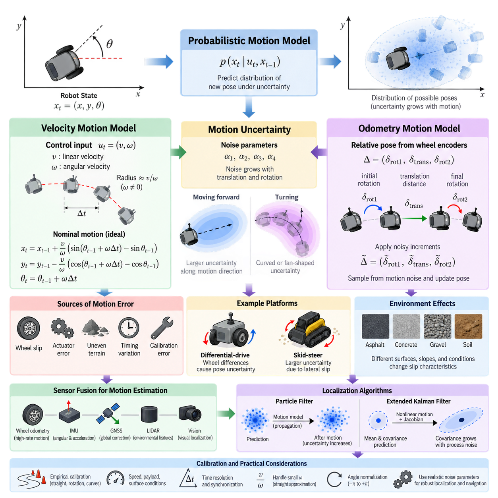
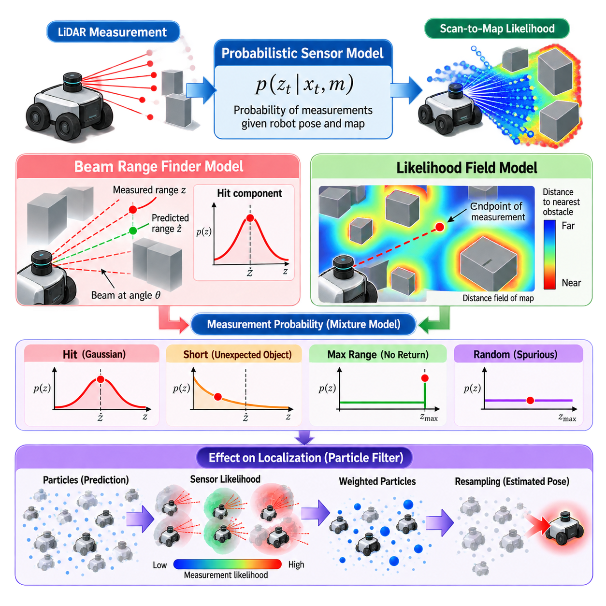
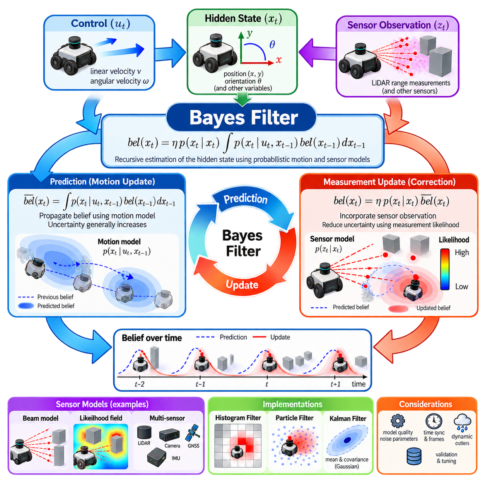
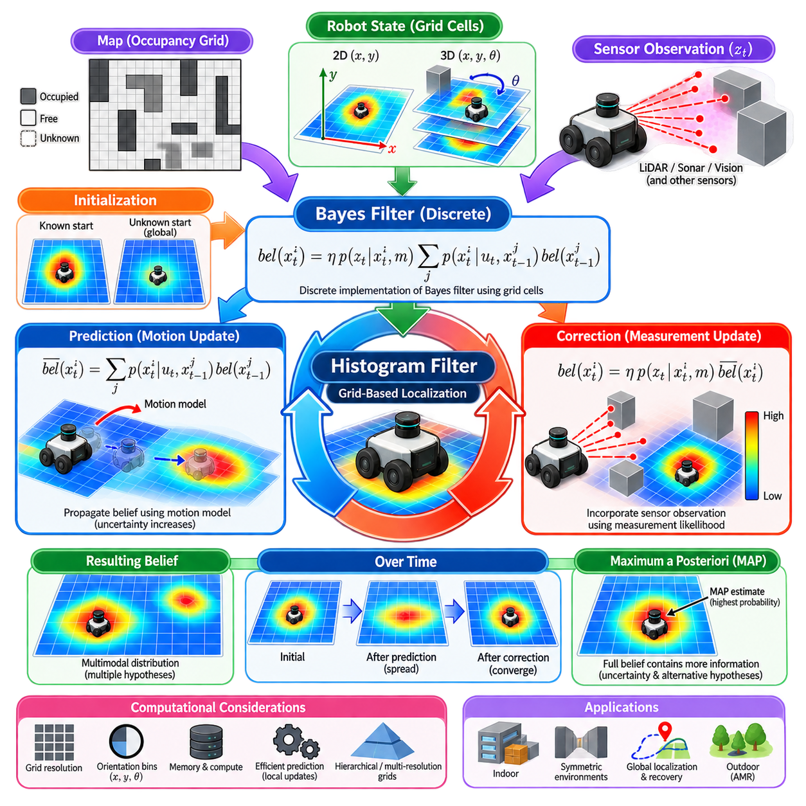
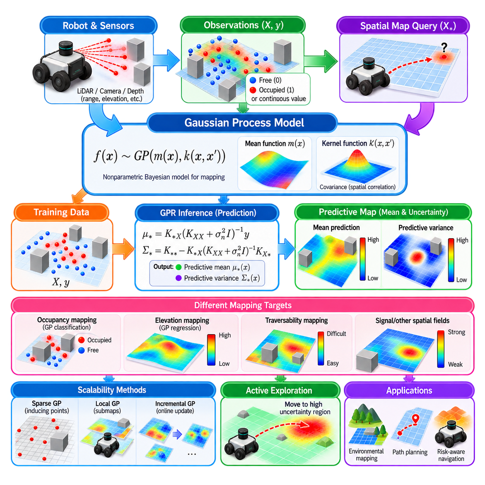
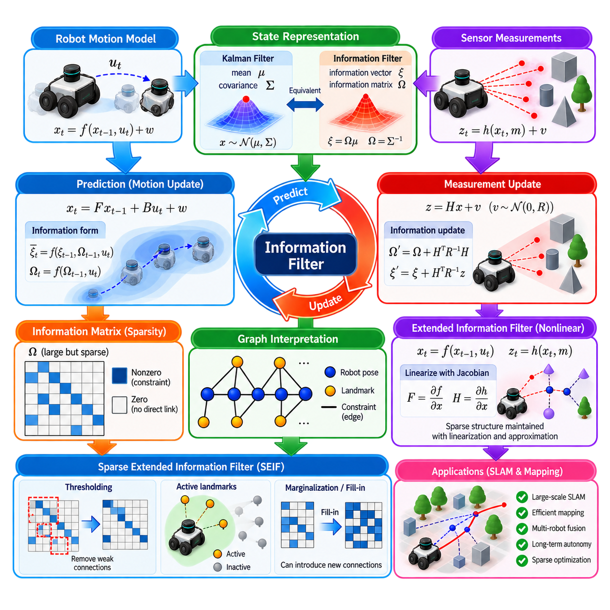
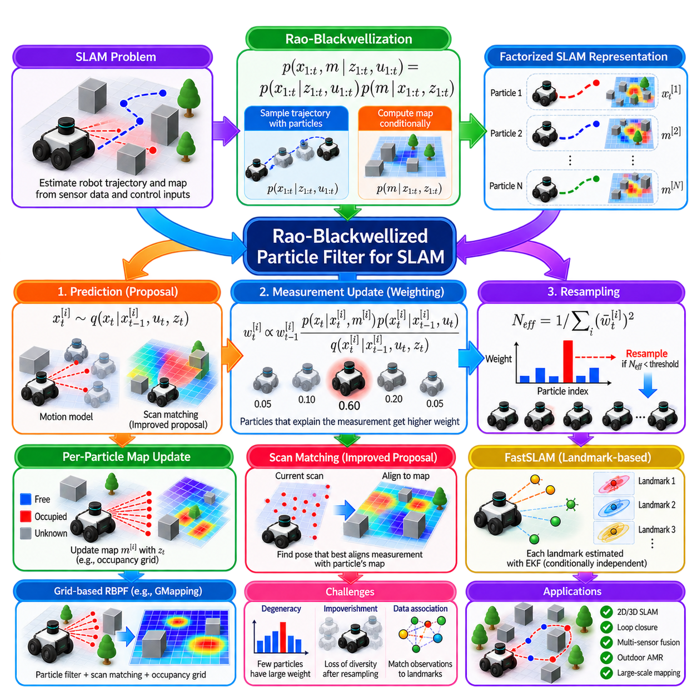
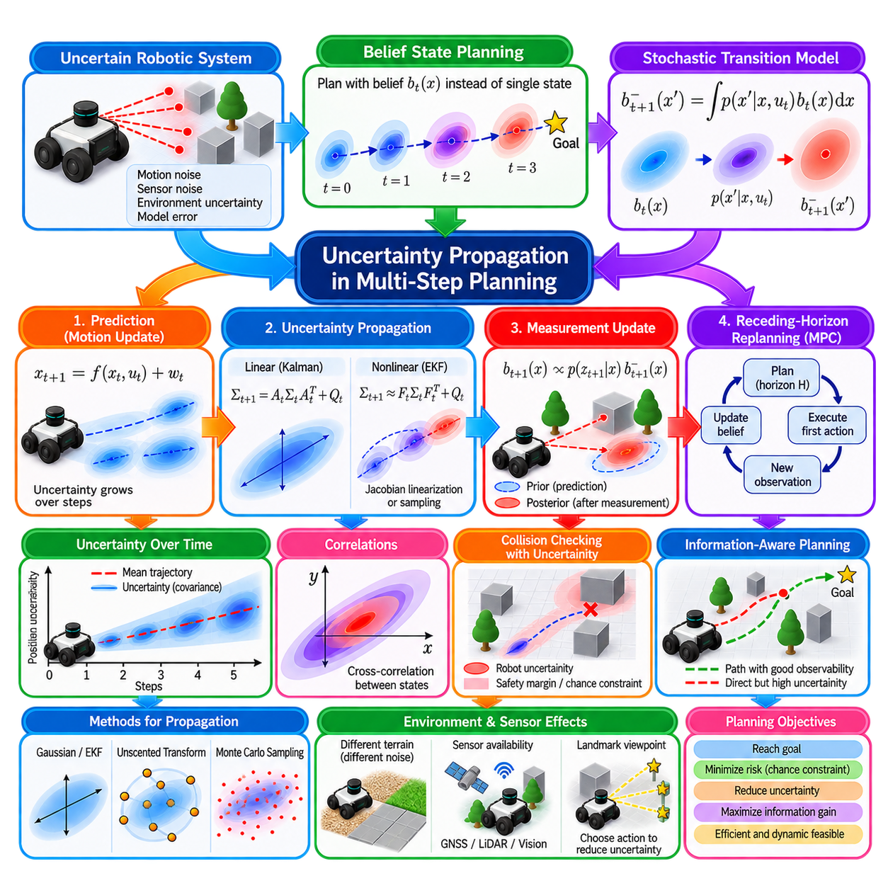
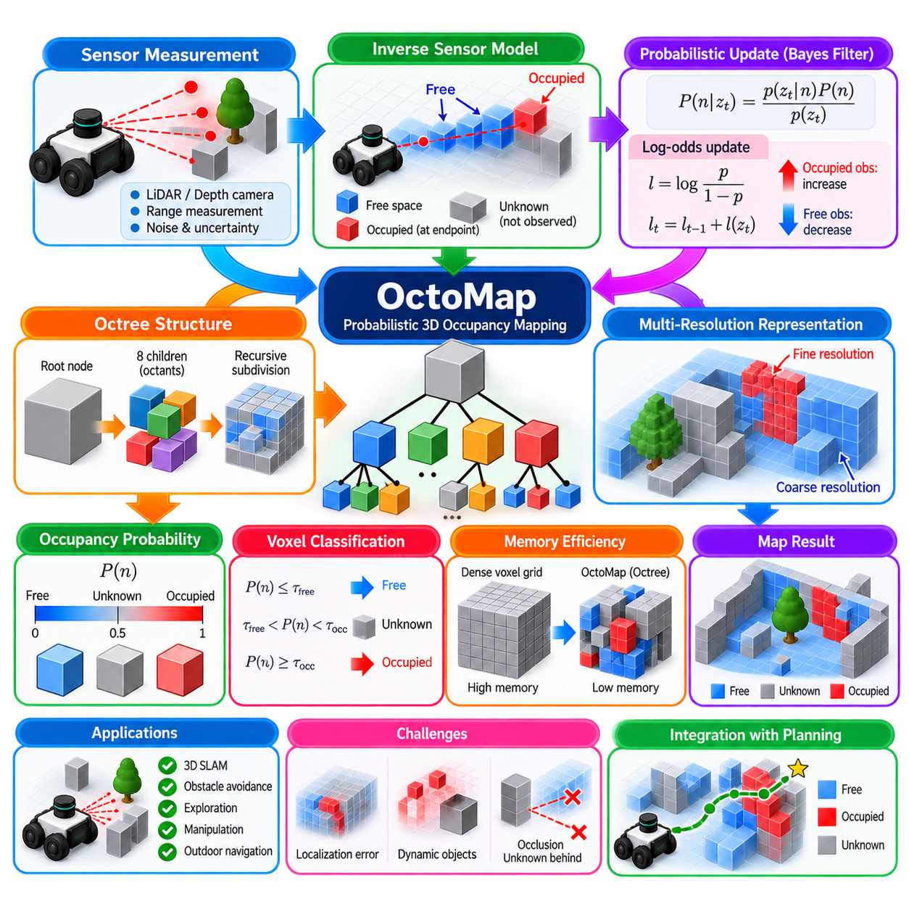
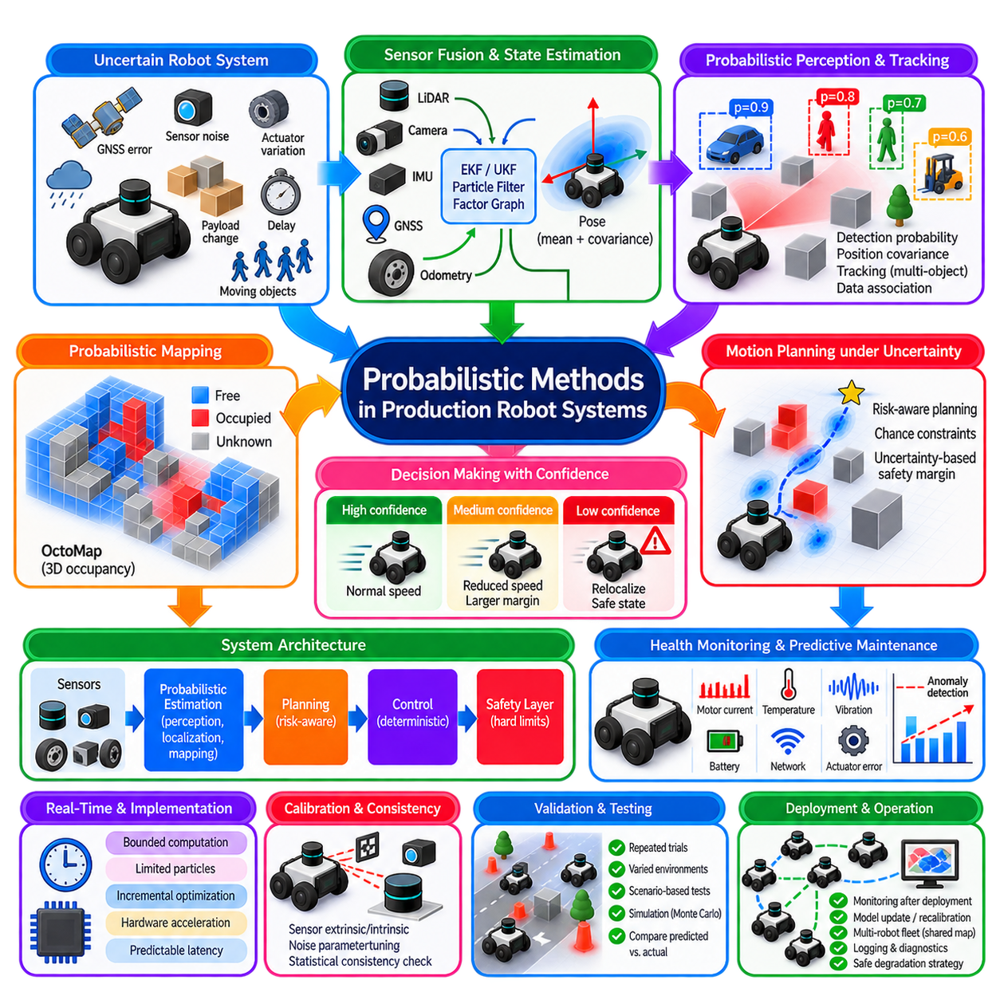

**Volume 13. Mapping Localization and SLAM**

# Chapter 02. Probabilistic Robotics

## 02.01. Probabilistic Motion Models Velocity Odometry [w/Code]

{width="7.268055555555556in" height="7.268055555555556in"}

Probabilistic motion models describe how a robot's state changes when control commands are executed under uncertainty. Instead of assuming that a commanded motion produces one exact pose, the model represents a probability distribution over possible resulting poses. This treatment is essential because real robots experience wheel slip, actuator errors, uneven terrain, timing variations, and imperfect mechanical calibration.

For a mobile robot, the state is commonly expressed as a planar pose \\(x_t=(x,y,\\theta)\\), where \\(x\\) and \\(y\\) represent position and \\(\\theta\\) represents heading. A probabilistic transition model estimates \\(p(x_t \\mid u_t,x_{t-1})\\), describing the probability of reaching a new state \\(x_t\\) from the previous state \\(x_{t-1}\\) after applying control input \\(u_t\\). This distribution becomes the prediction mechanism used by probabilistic localization and SLAM algorithms.

The velocity motion model assumes that the robot receives commanded or measured translational and rotational velocities. A typical control vector can be represented as \\(u_t=(v,\\omega)\\), where \\(v\\) is linear velocity and \\(\\omega\\) is angular velocity. Over a time interval \\(\\Delta t\\), these values define a nominal trajectory. When \\(\\omega\\) is nonzero, the ideal planar motion follows a circular arc whose radius is approximately \\(v/\\omega\\).

For ideal deterministic motion, integrating the velocity command produces a single predicted pose. Real motion, however, deviates from this prediction because the effective translational and angular velocities differ from their commanded values. A probabilistic velocity model therefore introduces noise into \\(v\\), \\(\\omega\\), and sometimes an additional heading-drift component. Sampling these noisy variables produces a distribution of plausible robot poses rather than one deterministic endpoint.

Motion uncertainty is often parameterized using coefficients that relate noise magnitude to translational and rotational motion. Faster translation may increase both translational error and heading disturbance, while stronger rotation can introduce rotational error as well as lateral displacement. Parameters such as \\(\\alpha_1,\\alpha_2,\\alpha_3,\\alpha_4\\) are frequently used to express these relationships, allowing the stochastic model to approximate the physical behavior of a particular platform.

The resulting probability distribution is generally anisotropic rather than circular. During forward travel, uncertainty often stretches primarily along the direction of motion while heading uncertainty gradually expands the lateral position distribution. During turning, translational and rotational uncertainties interact and can produce curved or fan-shaped pose distributions. This geometry explains why uncertainty propagation cannot usually be represented adequately by a fixed position-error radius.

The odometry motion model takes a different perspective. Instead of modeling the original velocity commands directly, it uses the relative pose displacement reported by wheel encoders or another odometric source between two time steps. The observed displacement is commonly decomposed into an initial rotation, a translation, and a final rotation. These components form a compact representation of the robot's measured incremental motion.

Given two odometry poses, the first rotation describes how much the robot turns toward the direction of displacement. The translation component represents the traveled distance, while the second rotation accounts for the remaining heading change. The probabilistic model perturbs these three components according to estimated motion noise. The sampled noisy increments are then applied to a particle or state hypothesis to obtain a predicted robot pose.

Odometry is valuable because it directly reflects executed motion, but it should not be interpreted as ground truth. Encoder quantization, incorrect wheel diameter, unequal wheel calibration, backlash, tire deformation, wheel slip, and surface irregularities all accumulate into odometric error. Systematic errors may create repeatable bias, while nonsystematic effects such as slip can produce sudden deviations that are difficult to predict from encoder measurements alone.

Velocity and odometry models therefore represent related but distinct sources of motion information. A velocity model is useful when the control interface provides meaningful linear and angular velocities, particularly for simulation and command-level prediction. An odometry model is often convenient when the robot controller already integrates encoder measurements into relative poses. The appropriate choice depends on the sensing architecture, controller interface, and characteristics of the mobile platform.

Differential-drive robots provide a common example. Left and right wheel velocities determine forward and rotational motion, but even small differences between expected and actual wheel behavior create pose uncertainty. Straight travel can accumulate heading error, and rotation can amplify errors caused by unequal wheel radii or traction. Skid-steer platforms typically exhibit even stronger uncertainty because turning inherently involves tire or track slip against the ground.

For an outdoor AMR, the assumptions behind simple planar models require particular attention. Asphalt, concrete, gravel, soil, slopes, curbs, wet surfaces, and loose material can generate dramatically different slip characteristics. A motion model calibrated indoors may therefore underestimate uncertainty outdoors. Terrain-dependent parameters, adaptive covariance estimation, or learned residual models can improve prediction when operating conditions vary significantly across the mission environment.

Probabilistic motion models play a central role in particle-filter localization. Each particle represents one possible robot pose, and the motion model propagates particles according to the latest control or odometry information. Sampling motion noise causes the particle population to spread in proportion to expected uncertainty. Sensor observations subsequently assign higher likelihood to hypotheses that better explain measurements, allowing the distribution to contract around plausible poses.

Gaussian estimators such as the Extended Kalman Filter use the same underlying concept but propagate a state mean and covariance rather than a large collection of particles. The nonlinear motion function predicts the new mean, while its Jacobians and process-noise representation determine how covariance evolves. Correct process-noise modeling is critical: underestimated uncertainty makes the estimator overconfident, whereas excessive uncertainty weakens the predictive value of robot motion.

Calibration should therefore be based on empirical robot behavior rather than arbitrary noise values. Repeated straight-line runs, rotations, curved trajectories, and mixed-motion sequences can be compared against accurate reference measurements. The residual distributions reveal how translation and rotation errors scale with commanded or measured motion. Experiments should cover representative speeds, payloads, surfaces, tire conditions, and environmental situations expected during deployment.

A practical implementation also needs to handle special numerical conditions. When angular velocity approaches zero, equations based directly on \\(v/\\omega\\) can become unstable even though the physical trajectory simply approaches a straight line. Implementations commonly introduce a small angular-rate threshold and use a straight-motion approximation below it. Angle normalization is equally important so that heading values remain consistent across the \\(-\\pi\\) and \\(+\\pi\\) boundary.

Temporal resolution influences prediction quality as well. Long integration intervals can magnify modeling errors because the assumption of constant velocity becomes less realistic, while extremely short intervals increase computational load and expose timestamp inconsistencies. Reliable localization therefore depends not only on mathematical equations but also on synchronized control, encoder, IMU, and sensor timestamps. Accurate time alignment is part of the motion-model interface.

Modern robotic systems increasingly combine classical kinematic models with inertial sensing and data-driven corrections. Wheel odometry can provide high-rate local motion, while an IMU constrains angular dynamics and short-term acceleration. GNSS, LiDAR, or visual localization can periodically correct accumulated drift. Learned models may estimate slip or residual motion errors, but maintaining an explicit probabilistic representation remains important for downstream state estimation.

The key engineering principle is that a motion model should represent what the robot could realistically have done, not merely what it was commanded to do. Velocity and odometry models convert physical motion uncertainty into mathematical transition probabilities that localization algorithms can reason about. When their parameters reflect the actual vehicle, terrain, timing, and operating regime, they provide a robust prediction foundation for localization, SLAM, navigation, and autonomous AMR operation.

## 02.02. Probabilistic Sensor Models Beam Likelihood Field [w/Code]

{width="7.268055555555556in" height="7.268055555555556in"}

Probabilistic sensor models describe the relationship between a robot pose, an environmental map, and the measurements produced by a sensor. Rather than treating a LiDAR range measurement as perfectly accurate, the model evaluates how probable an observation is under a hypothesized robot state. This relationship is commonly expressed as \\(p(z_t \\mid x_t,m)\\), where \\(z_t\\) is the current measurement, \\(x_t\\) is the robot pose, and \\(m\\) is the map.

In localization and SLAM, the sensor model performs a fundamentally different role from the motion model. The motion model predicts where the robot may have moved, while the sensor model evaluates whether each predicted pose is consistent with the observed environment. A good sensor model therefore converts geometric agreement between sensor data and the map into likelihood values that can update particles, state estimates, or optimization objectives.

Range sensors such as 2D LiDAR measure the distance from the sensor origin to surrounding surfaces along multiple directions. For an ideal map and sensor, a beam emitted at angle \\(\\theta\\) would intersect the nearest obstacle and return the exact corresponding distance. Real measurements deviate from this ideal behavior because of sensor noise, unexpected objects, missing returns, reflections, occlusion, map errors, and limitations of the maximum sensing range.

The beam range finder model explicitly represents several causes of range measurements. A measurement close to the map-predicted distance is modeled as a hit component, typically using a Gaussian distribution centered around the expected range. This component represents ordinary measurement uncertainty when the mapped obstacle is correctly observed. Its standard deviation controls how rapidly likelihood decreases as the measured range differs from the predicted value.

Unexpected objects create another important measurement mode. A person, vehicle, pallet, box, or temporary obstacle may appear between the sensor and the mapped surface, producing a range shorter than predicted. The beam model can represent this condition with a short-reading component that assigns probability to measurements occurring before the expected obstacle. This prevents dynamic or unmapped objects from immediately invalidating an otherwise plausible robot pose.

Range sensors can also generate measurements near their maximum detectable distance. This may occur when no obstacle is detected, when a return is too weak, or when the sensor reports its configured maximum range. A maximum-range component assigns explicit probability to such observations. A random-measurement component is additionally used to represent unexplained readings, typically with a broad or uniform probability across the valid sensor range.

These components can be combined as a mixture model. Conceptually, the probability of a range observation is expressed as a weighted combination of hit, short, maximum-range, and random components. Parameters such as \\(z_{\\text{hit}}\\), \\(z_{\\text{short}}\\), \\(z_{\\text{max}}\\), and \\(z_{\\text{rand}}\\) control their relative contributions. The weights should form a valid probability mixture and should ideally be calibrated using measurements collected from the actual sensor and operating environment.

The classical beam model evaluates each range measurement by predicting the corresponding distance from the hypothesized robot pose through ray casting. For every selected LiDAR beam, a ray is projected into the occupancy map until it intersects an occupied cell or reaches the sensor limit. The predicted range is then compared with the measured range. Repeating this operation across many beams produces the likelihood associated with the complete scan.

Although physically intuitive, repeated ray casting can become computationally expensive. Particle-filter localization may maintain hundreds or thousands of pose hypotheses, and each hypothesis may require evaluation of many LiDAR beams. If every beam requires traversal through a large occupancy grid, sensor evaluation can dominate computation. Beam subsampling, efficient ray tracing, parallel processing, and alternative likelihood formulations are therefore important for real-time robotic systems.

The likelihood field model provides a widely used alternative. Instead of explicitly ray casting every measurement against the map, it evaluates how close the endpoint of each observed LiDAR beam lies to an obstacle. Before localization begins, the occupancy map is transformed into a distance field in which each free cell stores its distance to the nearest occupied cell. This preprocessing allows obstacle proximity to be retrieved efficiently during scan evaluation.

For a hypothesized robot pose, each measured range is transformed from the sensor coordinate frame into the map frame. The resulting beam endpoint is located in the distance field, and its nearest-obstacle distance is obtained. Endpoints close to mapped obstacles receive high likelihood, while endpoints farther away receive progressively lower likelihood. A Gaussian-like function of obstacle distance is commonly used to convert geometric distance into measurement probability.

This formulation eliminates much of the repeated ray-casting cost and is often more tolerant of small map and pose errors. A scan endpoint does not need to land exactly on an occupied grid cell to receive meaningful probability. Instead, the surrounding likelihood field creates a smooth region of decreasing probability around obstacles. This property is particularly useful for particle-filter localization because nearby pose hypotheses can receive gradually varying weights rather than abrupt binary penalties.

However, the likelihood field model is less explicit about the physical process that generated a particular range measurement. It primarily evaluates endpoint consistency and does not naturally model all occlusion relationships along the beam path. An endpoint may be geometrically close to an obstacle even when the corresponding beam should have encountered another obstacle earlier. Consequently, the model gains computational efficiency and robustness while sacrificing some physical fidelity compared with detailed beam simulation.

Sensor likelihoods across a complete scan are often treated as conditionally independent given the robot pose and map. Under this approximation, individual beam probabilities can be multiplied to obtain a scan likelihood. In practice, multiplying many small probabilities can cause numerical underflow, so implementations frequently accumulate log-likelihoods instead. The independence assumption is imperfect because neighboring LiDAR beams are correlated, but it provides a practical approximation for real-time localization.

Using every beam is not always desirable. Dense modern LiDAR sensors can generate hundreds or thousands of measurements per scan, many of which contain redundant geometric information. Subsampling beams reduces computation and can also limit excessive confidence caused by treating strongly correlated measurements as independent. The sampling strategy should preserve useful angular coverage and important structural information rather than selecting only a narrow region of the scan.

Dynamic environments require additional robustness. People, forklifts, vehicles, doors, movable racks, vegetation, and temporary construction objects can disagree with a static map even when localization is correct. Robust sensor models assign limited influence to individual inconsistent measurements through random components, outlier rejection, beam skipping, or capped likelihood contributions. The objective is to preserve localization when a portion of the observed environment has changed.

Beam skipping is particularly useful when many particles predict similar mapped structures but some measured beams consistently disagree with the map. Instead of penalizing all particles for these observations, the localization system can identify measurements likely caused by dynamic or unmapped objects and exclude them from the update. Careful thresholds are necessary because excessive beam rejection can remove genuinely informative evidence and allow incorrect pose hypotheses to survive.

Map resolution directly influences sensor-model behavior. A coarse occupancy grid may remove narrow structures and quantize obstacle boundaries, while an extremely fine grid increases memory and computational requirements. The distance field should therefore be generated at a resolution appropriate for the LiDAR accuracy, robot localization target, and environmental geometry. Inflation used for navigation should also be distinguished from the occupancy representation used for localization whenever possible.

Sensor extrinsic calibration is equally important. The transformation between the LiDAR frame and the robot base frame determines where every beam endpoint appears in the map. Even a small translational or angular calibration error can create systematic scan-to-map disagreement, especially at long ranges. Timestamp offsets between LiDAR, odometry, and IMU measurements can produce similar effects when the robot is moving, making spatial and temporal calibration inseparable from sensor-model quality.

For outdoor AMRs, sensor models must accommodate longer ranges, sparse structures, changing weather, reflective surfaces, vegetation, dust, and moving traffic. A likelihood model calibrated for structured indoor corridors may behave poorly in an open yard or industrial site. Multi-sensor localization can combine LiDAR likelihoods with GNSS, IMU, wheel odometry, vision, or radar so that localization does not depend on a single sensing modality under all environmental conditions.

In Monte Carlo Localization, the sensor model converts each particle's predicted compatibility with the latest scan into a weight. Particles whose transformed measurements align well with mapped obstacles receive larger weights, while inconsistent particles receive smaller weights. Normalization and resampling then concentrate computational resources around more plausible regions of the state space. The quality of the measurement model therefore directly affects convergence, recovery, and resistance to localization failure.

Practical tuning should be performed using recorded data rather than arbitrary parameters. Logs containing LiDAR scans, reference poses, maps, dynamic objects, and representative environmental conditions can be replayed while varying hit variance, mixture weights, maximum obstacle distance, beam count, and rejection thresholds. Useful parameters should provide strong discrimination between incorrect and correct poses without making the estimator unrealistically confident in imperfect measurements.

The beam model and likelihood field model should therefore be viewed as complementary probabilistic representations rather than universally superior alternatives. Beam models provide a physically interpretable description of range-generation mechanisms, while likelihood fields offer efficient and smooth scan-to-map evaluation. Understanding their assumptions, computational costs, calibration requirements, and failure modes enables engineers to construct reliable observation models for localization, SLAM, navigation, and autonomous mobile robot operation.

## 02.03. Bayes Filter Algorithm Derivation and Implementation [w/Code]

{width="7.268055555555556in" height="7.268055555555556in"}

The Bayes filter provides a general mathematical framework for recursively estimating the hidden state of a dynamic system from uncertain controls and noisy sensor observations. In mobile robotics, the hidden state may represent robot position, orientation, velocity, landmarks, or other variables that cannot be measured perfectly. The filter maintains a probability distribution over possible states instead of committing to one exact estimate.

At time \\(t\\), the robot state is denoted by \\(x_t\\), the control or motion information by \\(u_t\\), and the sensor observation by \\(z_t\\). The Bayes filter represents knowledge about the current state using the belief distribution \\(bel(x_t)\\). This belief summarizes all relevant information contained in previous controls and observations and becomes the probabilistic state representation used for subsequent prediction and measurement updates.

The recursive formulation depends on the Markov assumption. The current state \\(x_t\\) is assumed to depend on the previous state \\(x_{t-1}\\) and the latest control \\(u_t\\), rather than on the complete historical trajectory once \\(x_{t-1}\\) is known. Similarly, the current observation \\(z_t\\) is assumed to depend primarily on the current state and the environment. These assumptions make sequential state estimation computationally manageable.

Before incorporating the latest sensor observation, the Bayes filter performs a prediction step. The predicted belief is commonly written as \\(\\overline{bel}(x_t)\\). It is obtained by integrating the previous belief over every possible previous state and applying the probabilistic transition model \\(p(x_t\\mid u_t,x_{t-1})\\). Conceptually, each possible previous state contributes probability mass to states that the robot could reach after executing the control.

The prediction equation can be expressed as \\(\\overline{bel}(x_t)=\\int p(x_t\\mid u_t,x_{t-1})bel(x_{t-1})dx_{t-1}\\). For discrete state spaces, the integral becomes a summation. This equation captures uncertainty propagation: even if the previous belief is concentrated, noisy motion can spread probability across a larger region. The transition model therefore determines how control uncertainty changes the state distribution over time.

After prediction, the measurement update incorporates the new observation \\(z_t\\). The sensor model \\(p(z_t\\mid x_t)\\) evaluates how likely the measurement would be if the robot were actually at state \\(x_t\\). The posterior belief is then computed as \\(bel(x_t)=\\eta p(z_t\\mid x_t)\\overline{bel}(x_t)\\), where \\(\\eta\\) is a normalization constant that ensures the resulting probability distribution integrates or sums to one.

This update is an application of Bayes' rule. The predicted belief acts as the prior probability of the current state, while the measurement likelihood describes compatibility between each state hypothesis and the sensor observation. Their product produces an unnormalized posterior. States that are both plausible according to motion and consistent with sensing gain probability, while hypotheses contradicted by the observation lose probability.

The normalization constant can be written as \\(\\eta=1/p(z_t)\\), where the evidence \\(p(z_t)\\) accounts for the total probability of receiving the current observation under all state hypotheses. In many robotic implementations, the evidence does not need to be calculated independently. The unnormalized state probabilities or particle weights are first computed and then divided by their total sum to obtain a valid normalized distribution.

The complete Bayes filter therefore forms a repeating prediction--correction cycle. Motion information propagates the belief forward and generally increases uncertainty, while informative observations constrain the distribution and often reduce uncertainty. This interaction explains a fundamental principle of robotic state estimation: motion alone causes localization uncertainty to accumulate, whereas environmental observations provide information capable of correcting accumulated drift.

The derivation begins from the posterior \\(p(x_t\\mid z_{1:t},u_{1:t})\\), where \\(z_{1:t}\\) represents all observations up to the current time and \\(u_{1:t}\\) represents the control history. Applying Bayes' rule separates the current measurement likelihood from the prior state probability. The Markov assumptions then allow the historical information to be compressed into the previous belief \\(bel(x_{t-1})\\), producing the recursive equations used in practical filters.

This recursive structure is important because a robot may operate for hours, days, or longer while continuously receiving measurements. Retaining and repeatedly processing the entire sensor and control history would become increasingly expensive. The belief acts as a sufficient probabilistic summary of the relevant history under the model assumptions, allowing each new update to depend primarily on the previous belief, current control, and current measurement.

The Bayes filter is an abstract algorithm rather than one specific computational implementation. Different state representations and probability assumptions produce familiar estimation algorithms. When distributions are Gaussian and system dynamics are linear, the framework leads to the Kalman Filter. Nonlinear models motivate the Extended Kalman Filter or Unscented Kalman Filter, while arbitrary and multimodal distributions can be represented using particle filters.

Histogram filters provide another direct implementation. The state space is divided into discrete cells, and each cell stores the probability that the robot occupies the corresponding state. Prediction redistributes probability among cells according to the motion model, and correction multiplies each cell by its sensor likelihood. This representation is conceptually simple and can represent multiple hypotheses, but memory and computation grow rapidly as state dimensionality and resolution increase.

Particle filters approximate the belief with a finite collection of weighted samples. During prediction, each particle is propagated through the probabilistic motion model. During correction, its weight is calculated using the sensor likelihood. Resampling then generates a new particle population concentrated around high-probability hypotheses. Monte Carlo Localization applies this implementation of the Bayes filter specifically to robot pose estimation.

For continuous Gaussian implementations, prediction and correction operate on compact statistical parameters rather than explicit probability grids or samples. A mean vector represents the estimated state and a covariance matrix represents uncertainty and correlations. This approach can be highly efficient when the distribution is approximately unimodal and Gaussian, but it may struggle when several distinct pose hypotheses must coexist, as can occur during global localization or kidnapped-robot recovery.

Numerical implementation requires careful handling of very small probabilities. Multiplying likelihoods from many sensor measurements can quickly produce values smaller than floating-point arithmetic can represent. Log-probability calculations convert multiplication into addition and improve numerical stability. For particle methods, weights must also be normalized carefully, and degenerate situations in which nearly all particles receive negligible weights require robust recovery or resampling strategies.

The choice of update frequency influences both accuracy and computational load. Processing every high-rate encoder or IMU sample individually may be unnecessary, while updates that are too infrequent can allow motion uncertainty and linearization errors to grow. Practical systems often predict at a high rate using odometry or inertial measurements and perform more expensive corrections when LiDAR, vision, GNSS, or other informative observations become available.

Coordinate frames and timestamps are part of the probabilistic implementation rather than merely software details. A sensor observation must correspond to the robot state at the time the measurement was captured. Delayed packets, unsynchronized clocks, incorrect frame transformations, or uncompensated sensor motion can cause observations to appear inconsistent with otherwise correct hypotheses. Such errors are frequently misinterpreted as poor filter tuning.

Model quality is equally important. If the motion model underestimates uncertainty, the predicted belief becomes excessively narrow and the filter may reject correct sensor information. If the sensor model is too confident, individual measurements can dominate the posterior and destabilize estimation when outliers occur. Conversely, excessively broad models reduce useful information. Covariances and probability parameters should therefore reflect measured system behavior.

For outdoor AMRs, the Bayesian framework provides a natural method for combining heterogeneous sensors. Wheel odometry may provide continuous local motion, IMU measurements constrain orientation and dynamics, GNSS supplies global position information, and LiDAR, vision, or radar relate the robot to surrounding structures. Each observation contributes through an appropriate likelihood model while uncertainty determines how strongly it affects the posterior belief.

Sensor failures and environmental changes can also be handled probabilistically. GNSS may become unreliable near buildings, LiDAR returns may degrade in rain or dust, cameras may suffer from darkness or glare, and wheel odometry may deteriorate on loose terrain. Adaptive noise models, measurement gating, fault detection, and modality-specific confidence can modify the likelihood or covariance so that unreliable observations exert less influence on state estimation.

A robust implementation should be validated with controlled and representative datasets. Estimated trajectories can be compared with reference ground truth while monitoring innovation statistics, covariance consistency, particle diversity, and recovery behavior. Testing should include straight motion, turns, high dynamics, sensor dropouts, ambiguous geometry, dynamic obstacles, and transitions between indoor and outdoor environments to expose assumptions that fail outside nominal conditions.

The central value of the Bayes filter is its disciplined treatment of uncertainty. Prediction answers where the robot could be after motion, correction evaluates which possibilities agree with new evidence, and normalization produces the updated belief used in the next cycle. This recursive probabilistic architecture forms the conceptual foundation of localization, sensor fusion, tracking, SLAM, and many autonomous robotic estimation systems.

## 02.04. Grid Based Localization Histogram Filter [w/Code]

{width="7.268055555555556in" height="7.268055555555556in"}

Grid-based localization represents the possible robot states using a discrete collection of cells rather than a continuous probability distribution. Each cell corresponds to a region of the state space and stores the probability that the robot occupies that state. When applied to planar localization, the grid may represent position \\((x,y)\\), or position and orientation \\((x,y,\\theta)\\), depending on the required accuracy and computational resources.

The histogram filter is a discrete implementation of the Bayes filter. Instead of integrating probability over continuous states, it approximates the belief distribution using a finite set of bins. If the state space contains cells \\(x\^1,\\ldots,x\^N\\), the filter maintains probabilities \\(bel(x\^i)\\) whose sum equals one. This explicit representation makes uncertainty directly observable and allows several competing localization hypotheses to coexist naturally.

Initialization determines the prior belief before recursive localization begins. If the approximate starting pose is known, probability can be concentrated around that region. If the initial pose is completely unknown, probability may be distributed uniformly over all valid free-space cells. This capability makes grid-based localization suitable for global localization because the algorithm does not require a single Gaussian approximation around a predefined starting pose.

The prediction stage propagates the discrete belief according to the robot motion model. For each destination cell \\(x_t\^i\\), the predicted probability is computed from all possible previous cells using \\(\\overline{bel}(x_t\^i)=\\sum_j p(x_t\^i\\mid u_t,x_{t-1}\^j)bel(x_{t-1}\^j)\\). The transition probability describes how likely the robot is to move from one grid state to another after executing control \\(u_t\\).

Motion uncertainty causes probability to spread across neighboring cells. A commanded forward motion may shift the dominant probability mass in the travel direction while distributing smaller probabilities around the expected destination. Rotational uncertainty can spread belief across orientation bins and subsequently increase positional uncertainty. Repeated prediction without informative measurements therefore produces an increasingly diffuse distribution, reflecting accumulated uncertainty in robot motion.

The correction stage incorporates the latest sensor observation. For each grid cell, the sensor model calculates \\(p(z_t\\mid x_t\^i,m)\\), representing the likelihood of observing measurement \\(z_t\\) if the robot were located at that state in map \\(m\\). The posterior is obtained from \\(bel(x_t\^i)=\\eta p(z_t\\mid x_t\^i,m)\\overline{bel}(x_t\^i)\\), followed by normalization across all cells.

Sensor measurements reshape the grid according to consistency with the environment. Cells whose predicted LiDAR, sonar, visual, or other observations match the actual measurement receive higher probability. Cells that poorly explain the observation lose probability. After repeated prediction and correction cycles, probability generally concentrates around states that simultaneously agree with the robot's motion history and environmental measurements.

One major advantage of the histogram filter is its ability to represent multimodal distributions explicitly. In a symmetric corridor, warehouse aisle, or repetitive industrial environment, several distant poses may initially produce similar sensor observations. A Gaussian estimator may have difficulty representing these separated possibilities, whereas a histogram can maintain distinct probability peaks until additional motion or sensing provides enough information to eliminate incorrect hypotheses.

This property is particularly useful for global localization and localization recovery. During global localization, the robot may begin without knowing its position, so the belief is initially distributed over a large region. As observations accumulate, incompatible cells lose probability and plausible regions survive. If the robot becomes lost, the belief can again be expanded or reset, allowing the estimator to search the map rather than remaining trapped near an incorrect pose.

The main limitation is computational complexity. A two-dimensional grid with fine spatial resolution may already contain millions of cells, and adding orientation introduces another dimension. For example, dividing heading into many angular bins multiplies the state count by the number of orientation intervals. Increasing resolution improves representation accuracy but also increases memory consumption and the cost of prediction and sensor evaluation.

This relationship illustrates the discretization trade-off. Large cells reduce computation but quantize the estimated pose and may remove important geometric distinctions. Small cells provide finer localization but increase resource requirements dramatically. The appropriate resolution should therefore be selected according to robot size, sensor accuracy, map structure, localization requirements, available compute, and expected operational area rather than chosen solely for maximum numerical precision.

Orientation discretization deserves separate consideration. Two states with nearly identical positions but different headings can produce significantly different range measurements. If angular bins are too coarse, the predicted sensor geometry may become inaccurate and localization quality can degrade. If they are unnecessarily fine, computation grows without proportional benefit. Spatial and angular resolutions should therefore be tuned jointly for the robot and sensing configuration.

Efficient prediction can exploit structure in the motion model. Instead of evaluating transitions between every pair of cells, implementations can restrict updates to a local neighborhood where transition probability is meaningful. Convolution-like operations, sparse transition kernels, separable approximations, and parallel computation can further reduce processing cost. These optimizations preserve the probabilistic interpretation while avoiding impossible or negligible state transitions.

Measurement updates are often the most expensive part when each cell requires simulated sensor observations. Precomputed likelihood fields, distance transforms, reduced beam sets, hierarchical maps, or cached geometric information can accelerate scan-to-map evaluation. Cells with negligible prior probability may also be excluded temporarily from expensive calculations, although aggressive pruning must be designed carefully to avoid removing hypotheses needed for global recovery.

Normalization is necessary after each correction so that the probabilities across the grid sum to one. In large grids, many cells may contain extremely small values, creating numerical precision problems. Log-domain computation can improve stability for likelihood calculations, while probability floors can prevent complete numerical elimination of potentially recoverable states. However, artificial floors should remain small enough that they do not overwhelm genuine sensor evidence.

The map and localization grid are related but conceptually different structures. An occupancy grid describes the probability or classification of environmental space as free, occupied, or unknown. The localization grid describes probability over robot states. A single localization state may include position and orientation and is evaluated using the environmental map. Confusing these two grids can lead to incorrect assumptions about resolution, memory requirements, and sensor-model computation.

Grid-based localization also depends strongly on map quality. Incorrect walls, moved racks, temporary objects, vegetation, construction changes, or outdated outdoor structures can reduce measurement likelihood at the correct robot pose. Robust sensor models should tolerate partial disagreement with the map. In industrial deployments, maintaining map versions and identifying long-term structural changes can be as important as improving the localization algorithm itself.

For outdoor AMRs, a dense three-dimensional or large-area histogram representation is usually expensive, but grid concepts remain useful for bounded problems. A robot may use a coarse global grid to represent several location hypotheses and then activate a higher-resolution local estimator around promising regions. GNSS can restrict the initial search area, while LiDAR, vision, radar, or map features refine the probability distribution.

Hierarchical and multi-resolution grids provide a practical extension. Large regions with low probability can be represented coarsely, while high-probability regions are refined into smaller cells. This allocation concentrates computational resources where localization precision matters most. Similar principles appear in adaptive spatial structures, coarse-to-fine localization, and hybrid systems that transition from global discrete search to continuous local estimation.

The maximum a posteriori estimate can be obtained by selecting the cell with the highest posterior probability, but the complete belief often contains more information than this single result. The probability mass surrounding the peak indicates localization confidence, while secondary peaks reveal unresolved ambiguity. Applications should therefore consider both the estimated pose and the shape of the distribution when making navigation or safety decisions.

A practical implementation typically repeats a simple recursive sequence. The previous grid belief is propagated using odometry or control information, sensor likelihoods are evaluated for candidate states, predicted probabilities are multiplied by those likelihoods, and the resulting grid is normalized. The cycle continues whenever new motion and observation information arrives, maintaining a discrete approximation of the robot's posterior state distribution.

Validation should examine more than average position error. Experiments should test convergence from unknown initial poses, behavior in symmetric environments, robustness to incorrect observations, recovery after deliberate pose displacement, and sensitivity to grid resolution. Runtime, memory consumption, update frequency, and probability concentration should also be measured because a theoretically accurate configuration may be impractical for real-time deployment.

The histogram filter demonstrates the Bayes filter in one of its most transparent computational forms. Prediction moves and spreads probability, measurement updates reinforce states supported by observations, and normalization maintains a valid belief distribution. Although dense grids can become expensive in large state spaces, their explicit treatment of uncertainty and multiple hypotheses makes grid-based localization an important conceptual and practical foundation for probabilistic robotics.

## 02.05. Gaussian Process for Robot Mapping [w/Code]

{width="7.268055555555556in" height="7.268055555555556in"}

A Gaussian Process is a nonparametric Bayesian model that represents an unknown function as a probability distribution over possible functions. In robot mapping, the unknown function may describe occupancy, terrain elevation, surface properties, traversability, signal strength, or another spatial quantity. Instead of storing only discrete measurements, a Gaussian Process predicts values at unobserved locations together with uncertainty.

A Gaussian Process is commonly written as \\(f(\\mathbf{x})\\sim GP(m(\\mathbf{x}),k(\\mathbf{x},\\mathbf{x\'}))\\), where \\(m(\\mathbf{x})\\) is the mean function and \\(k(\\mathbf{x},\\mathbf{x\'})\\) is the covariance or kernel function. The input \\(\\mathbf{x}\\) usually represents a spatial coordinate, while \\(f(\\mathbf{x})\\) represents the mapped quantity. The kernel determines how strongly observations at different locations influence one another.

The mean function represents the expected value before observations are incorporated. In many applications it is initialized to zero or another simple prior because the spatial structure is primarily encoded by the covariance function. More informative priors can also be used when physical knowledge is available. For example, expected terrain elevation, known floor geometry, or previously generated maps may provide a meaningful initial mean.

The kernel is central to Gaussian Process mapping because it defines assumptions about spatial correlation. Locations that are close together generally receive higher covariance than distant locations, although the exact relationship depends on the selected kernel. Common choices include the squared exponential and Matérn kernels. Their hyperparameters control properties such as characteristic length scale, signal variance, and the smoothness of the inferred spatial field.

Suppose the robot collects measurements \\(\\mathbf{y}\\) at training locations \\(X\\). Sensor noise can be represented by adding a noise variance \\(\\sigma_n\^2\\) to the covariance matrix. For query locations \\(X_\*\\), Gaussian Process regression computes a posterior predictive distribution conditioned on the observations. The result is not only a predicted mean value but also a predictive variance describing how uncertain the model is at each query location.

The predictive mean can be expressed as \\(\\boldsymbol{\\mu}_\*=K_{\*X}(K_{XX}+\\sigma_n\^2I)\^{-1}\\mathbf{y}\\). The predictive covariance is \\(\\Sigma_\*=K_{**}-K_{\*X}(K_{XX}+\\sigma_n\^2I)\^{-1}K_{X\*}\\). These equations show how observed data influence predictions through kernel relationships while simultaneously quantifying the uncertainty remaining after conditioning on the measurements.

This uncertainty representation is one of the strongest advantages of Gaussian Processes for robotics. Regions densely covered by reliable measurements generally exhibit lower posterior variance, while unexplored or weakly observed regions retain higher uncertainty. A robot can therefore distinguish between areas that appear safe because they were measured confidently and areas that merely lack evidence. This distinction is valuable for autonomous exploration and risk-aware planning.

Gaussian Process mapping differs fundamentally from conventional occupancy-grid mapping. An occupancy grid divides space into independent or locally updated cells, whereas a Gaussian Process models correlations between spatial locations through a kernel. Measurements can therefore influence nearby unobserved locations continuously. This produces smooth probabilistic maps and can reduce discretization artifacts, although the computational requirements are usually greater than those of simple grid updates.

For occupancy mapping, the underlying latent function can represent whether a spatial location tends toward free or occupied space. Because occupancy observations are binary rather than Gaussian continuous measurements, Gaussian Process classification is often more appropriate than ordinary regression. A link function transforms the latent GP value into an occupancy probability, allowing the model to represent smooth spatial correlations while preserving probabilistic free-space and obstacle estimates.

Range measurements require careful conversion into training information. A LiDAR beam provides evidence that locations along the beam before the return are free, while the endpoint provides evidence of an occupied surface. These observations can be sampled into training points or processed through specialized Gaussian Process occupancy mapping formulations. The sampling strategy affects computational cost, map detail, and the balance between free-space and occupied-space evidence.

Gaussian Processes are particularly natural for terrain and elevation mapping. Inputs may consist of horizontal coordinates \\((x,y)\\), while the target \\(f(x,y)\\) represents surface height. LiDAR, stereo vision, depth cameras, or other ranging sensors provide observations from which a continuous elevation surface can be inferred. Predictive variance identifies terrain regions where elevation is poorly known and where additional sensing may be required.

The same framework can estimate traversability-related quantities. Terrain roughness, slope, compliance, friction, vegetation density, or expected wheel slip can be modeled as spatial functions when suitable observations are available. A robot can combine the predicted value and uncertainty when planning motion. A route with moderate predicted difficulty but low uncertainty may be preferable to an apparently easy route whose properties are largely unknown.

Kernel design strongly influences the resulting map. A long length scale produces smooth predictions that can suppress small environmental structures, whereas a short length scale preserves local variation but may become sensitive to noise and require denser observations. Isotropic kernels assume similar spatial behavior in every direction, while anisotropic kernels can represent different correlation scales along different axes. Kernel selection should therefore reflect the physical properties being mapped.

Hyperparameters can be selected manually from engineering knowledge or learned from data by maximizing the marginal likelihood. The marginal likelihood balances agreement with observations against model complexity and provides a principled mechanism for tuning kernel parameters. However, optimization can converge to unsuitable local solutions when datasets are limited or poorly distributed, so learned parameters should still be checked against expected physical behavior and validation data.

A major limitation of standard Gaussian Processes is computational scaling. Exact GP inference typically requires approximately \\(O(N\^3)\\) computation and \\(O(N\^2)\\) memory for \\(N\\) training observations because operations on the covariance matrix become increasingly expensive. Robotic mapping can generate thousands or millions of measurements, making direct exact inference impractical for large environments or long-duration missions.

Sparse Gaussian Process methods address this problem by representing the dataset using a smaller collection of inducing points. Rather than allowing every observation to participate equally in the full covariance computation, the model summarizes important spatial information through these representative locations. The number and placement of inducing points determine the trade-off between computational efficiency and approximation accuracy.

Local Gaussian Process mapping provides another scalable strategy. The environment is divided into spatial regions, and separate or partially overlapping GP models are maintained locally. A robot evaluates only the models relevant to its current neighborhood instead of processing the complete global dataset. This approach can support online mapping while limiting memory growth, although boundaries and consistency between local models require careful management.

Incremental mapping is important because autonomous robots continuously acquire new observations. Recomputing an entire Gaussian Process from the beginning after every measurement is inefficient. Online approximations, sliding local datasets, sparse updates, and active selection of informative samples can reduce this burden. Redundant measurements may be discarded or compressed while observations that significantly reduce uncertainty are retained.

Gaussian Process uncertainty can directly support active exploration. Instead of navigating only toward geometrically unexplored space, a robot can identify regions where predictive variance is high and select actions expected to reduce map uncertainty. Information gain, posterior entropy reduction, or variance reduction can become planning objectives. This connects probabilistic mapping with active perception and autonomous data acquisition.

Sensor and pose uncertainty must also be considered. Standard GP regression often assumes that training input locations are known accurately, but robot poses used to place measurements in the map are themselves uncertain. Localization errors can blur spatial relationships and create misleading confidence. More advanced formulations can propagate uncertain inputs, jointly optimize trajectories and maps, or inflate observation uncertainty according to pose covariance.

Dynamic environments introduce another challenge. A standard spatial Gaussian Process assumes that the mapped function is relatively stable, yet obstacles, vegetation, traffic, weather, or surface conditions can change over time. Extending the input with time creates a spatiotemporal Gaussian Process in which covariance depends on both spatial and temporal separation. Such models can distinguish persistent environmental structure from changes that evolve during operation.

For outdoor AMRs, Gaussian Process maps can complement conventional occupancy and geometric maps rather than replace them. An occupancy grid may represent hard obstacle geometry efficiently, while GP layers estimate continuous quantities such as terrain height, roughness, slip risk, radio connectivity, or localization quality. Combining these layers provides richer environmental information for route selection, speed planning, and risk-aware autonomous operation.

Practical implementation requires attention to normalization, numerical stability, and covariance matrix conditioning. Kernel matrices can become nearly singular when observations are extremely close or hyperparameters are poorly selected. Adding a small diagonal jitter term, using stable matrix decompositions such as Cholesky factorization, scaling input coordinates, and monitoring condition numbers can prevent numerical failures during training and prediction.

Validation should examine both prediction accuracy and uncertainty calibration. A map is not probabilistically reliable merely because its mean prediction appears accurate. Regions assigned low uncertainty should actually exhibit smaller errors than regions assigned high uncertainty. Cross-validation, held-out spatial regions, negative log predictive density, calibration analysis, and field experiments can reveal whether the GP uncertainty meaningfully represents real mapping errors.

Gaussian Process mapping provides a powerful connection between spatial interpolation, Bayesian inference, and uncertainty-aware robotics. Measurements define evidence, kernels encode assumptions about spatial relationships, posterior inference predicts unobserved regions, and predictive variance quantifies what remains unknown. With sparse, local, or incremental approximations, this framework can support mapping, exploration, terrain assessment, and risk-aware navigation in autonomous robotic systems.

## 02.06. Information Filter and Sparse Extended Information [w/Code]

{width="7.268055555555556in" height="7.268055555555556in"}

The Information Filter is an alternative representation of Gaussian Bayesian state estimation in which uncertainty is expressed through information rather than covariance. While the Kalman Filter maintains a state mean \\(\\mu\\) and covariance \\(\\Sigma\\), the Information Filter uses an information vector \\(\\xi\\) and information matrix \\(\\Omega\\). The two representations are mathematically equivalent when the relevant matrices are nonsingular.

The relationship between the two forms is defined by \\(\\Omega=\\Sigma\^{-1}\\) and \\(\\xi=\\Omega\\mu\\). Conversely, the state estimate can be recovered through \\(\\Sigma=\\Omega\^{-1}\\) and \\(\\mu=\\Sigma\\xi\\). The information matrix therefore represents inverse uncertainty, or precision. Large information values correspond to strongly constrained state variables, whereas weak information corresponds to greater uncertainty.

This representation provides an intuitive interpretation of measurement fusion. Independent measurements contribute additional information about the state, and their contributions can often be added directly to the information vector and matrix. If a measurement supplies information increments \\(\\Delta\\xi\\) and \\(\\Delta\\Omega\\), the update can conceptually be written as \\(\\xi\'=\\xi+\\Delta\\xi\\) and \\(\\Omega\'=\\Omega+\\Delta\\Omega\\).

For a linear measurement model \\(z=Hx+v\\), with Gaussian measurement noise covariance \\(R\\), the measurement contribution is expressed through \\(H\^TR\^{-1}H\\) and \\(H\^TR\^{-1}z\\). The information matrix update becomes \\(\\Omega\'=\\Omega+H\^TR\^{-1}H\\), while the information vector becomes \\(\\xi\'=\\xi+H\^TR\^{-1}z\\). This additive structure is especially attractive when many independent observations must be combined.

The prediction step is less straightforward than the measurement update. Motion introduces correlations between state variables, and propagating information through a dynamic model may require matrix inversions or algebra that is less convenient than covariance-form prediction. Consequently, the Information Filter is not universally faster than a Kalman Filter. Its advantages become important when the information matrix exhibits useful sparse structure.

Sparsity is particularly significant in robotic mapping and SLAM. A robot typically observes only a small subset of all landmarks or map variables at any given time. Measurements therefore create direct constraints between limited groups of variables rather than connecting every state to every other state. In information form, these conditional dependencies can appear as zero or near-zero blocks in the information matrix.

The graphical interpretation is closely related to probabilistic graphical models. State variables can be viewed as nodes, while nonzero off-diagonal information terms represent direct probabilistic constraints between variables. A sparse information matrix therefore corresponds to a graph containing relatively few edges. This connection provides a bridge between recursive Bayesian filtering, graphical models, and modern sparse optimization methods used in SLAM.

The Extended Information Filter applies the information representation to nonlinear systems. As in the Extended Kalman Filter, nonlinear motion and measurement functions are approximated locally through linearization. Jacobian matrices describe how small changes in the state affect predicted motion and observations. The resulting locally linear Gaussian approximation allows information vectors and matrices to be updated recursively.

Linearization introduces the same fundamental limitations encountered in the Extended Kalman Filter. If the current estimate is far from the true state or the nonlinear function has strong curvature, the local approximation may become inaccurate. In SLAM, errors in robot orientation can have especially large effects because they influence the estimated positions of many landmarks. Consistent initialization and controlled linearization are therefore important.

Sparse Extended Information Filters were developed to exploit the structure of large SLAM problems. The state may include a robot pose together with hundreds or thousands of landmarks, making dense covariance matrices expensive to store and update. The information matrix can remain substantially sparser because only variables linked by direct or important conditional dependencies need explicit nonzero entries.

A central difficulty is that exact SLAM information matrices do not always remain sufficiently sparse during all operations. Eliminating variables or marginalizing past robot poses can introduce new dependencies between previously unrelated variables. This phenomenon, often called fill-in, creates additional nonzero matrix entries and gradually reduces computational benefits. Maintaining useful sparsity therefore requires approximation or careful variable ordering.

The Sparse Extended Information Filter, commonly associated with SEIF, deliberately approximates weak dependencies to preserve a sparse representation. The idea is not that all correlations disappear, but that only the most significant relationships are maintained explicitly. By removing or approximating weaker links, the algorithm can limit the number of active connections and reduce computational complexity for large-scale mapping.

This approximation introduces a trade-off between efficiency and statistical accuracy. Aggressive sparsification reduces memory use and computation but can distort the underlying probability distribution. Insufficient sparsification preserves more accurate dependencies but allows the information matrix to become dense. The design of a sparse estimator must therefore balance map size, computational resources, required accuracy, and acceptable approximation error.

Active landmarks provide one mechanism for controlling this structure. Only landmarks currently observed or strongly connected to the robot may participate in expensive updates, while inactive landmarks remain represented in the map without being processed at full cost during every cycle. As the robot moves, landmarks can enter or leave the active set according to visibility, proximity, information value, or other criteria.

This strategy is well suited to environments where a robot interacts locally with a much larger map. During any single observation cycle, cameras or LiDAR-derived features normally constrain only nearby environmental structures. The full map may contain thousands of variables, but the measurement update touches only a limited neighborhood. Sparse representations exploit this locality instead of repeatedly processing every map variable.

Information-form estimation also supports decentralized and multi-robot systems conceptually well. If different robots collect conditionally independent observations, each platform can generate local information contributions that may later be combined. Information vectors and matrices can provide a convenient representation for additive fusion, although unknown correlations between robots must be handled carefully to avoid double counting information.

The relationship between information filtering and factor graphs is important for understanding modern SLAM. A measurement factor adds a probabilistic constraint between selected state variables, similar to adding information to corresponding blocks of an information matrix. Factor-graph optimization, sparse least squares, and information-form estimation therefore share common mathematical structure even though their computational procedures and update strategies may differ.

Modern graph-based SLAM often favors smoothing and sparse optimization over classical SEIF implementations. Rather than maintaining only the current recursive posterior, smoothing methods optimize a collection of robot poses, landmarks, and constraints simultaneously. Sparse Cholesky or QR factorization can exploit graph structure efficiently, while variable ordering techniques reduce fill-in. Nevertheless, the Information Filter remains valuable for understanding why sparsity matters.

Numerical implementation requires careful matrix handling. Explicitly computing a full matrix inverse should generally be avoided when linear solves or matrix factorizations can produce the required result more efficiently and accurately. Sparse Cholesky decomposition, sparse QR methods, iterative solvers, and structured block operations can significantly improve performance when the information matrix is large but contains relatively few nonzero elements.

Positive definiteness and matrix conditioning are also important. Poor sensor models, duplicated constraints, incorrect noise assumptions, or numerical approximations can produce unstable systems. Regularization, careful covariance modeling, robust factorization, and monitoring of matrix conditioning help maintain reliable estimation. Sparsification procedures must also avoid destroying essential constraints required to keep the state observable.

Observability has a direct physical meaning in SLAM. Without sufficient external constraints, absolute position or orientation may remain unobservable even when relative relationships are accurately estimated. Gauge freedom must be handled by fixing a reference frame or introducing an appropriate prior. An information matrix with deficient rank can indicate directions in the state space that available measurements cannot determine uniquely.

For outdoor AMRs, sparse information concepts become useful when maps contain large numbers of landmarks, repeated trajectories, or long-duration observations. LiDAR features, visual landmarks, GNSS constraints, wheel odometry, and IMU information can create a large but locally connected estimation problem. Exploiting sparsity allows computational effort to follow the actual connectivity of the environment instead of scaling directly with every stored variable.

Long-term autonomy further increases the importance of managing information growth. Continuously adding poses and landmarks eventually makes any unrestricted estimator impractical. Marginalization, keyframe selection, submapping, landmark management, sparsification, and hierarchical representations can limit problem size. Each technique removes or compresses information and must therefore preserve the constraints most important for localization and map consistency.

Validation should examine both estimation accuracy and structural efficiency. Trajectory error and landmark error reveal geometric performance, while matrix density, number of nonzero entries, factorization time, memory consumption, and update latency reveal whether sparsity provides practical benefit. Consistency tests are also important because an estimator can appear accurate on one trajectory while becoming systematically overconfident.

The Information Filter provides a complementary view of probabilistic estimation in which certainty is accumulated rather than uncertainty propagated directly. Its information vector and information matrix expose conditional structure that can become sparse in large robotic problems. Sparse Extended Information methods extend this idea to nonlinear SLAM, demonstrating how probabilistic dependencies, graph structure, approximation, and computational efficiency are tightly connected in scalable robot state estimation.

## 02.07. Rao Blackwellized Particle Filter for SLAM [w/Code]

{width="7.268055555555556in" height="7.268055555555556in"}

The Rao-Blackwellized Particle Filter is a probabilistic framework for solving SLAM by separating robot trajectory estimation from map estimation. Instead of sampling every variable in the complete SLAM state, it samples robot trajectories with particles and computes the map conditionally for each trajectory. This decomposition reduces the dimensionality of the sampling problem and exploits structure in the SLAM posterior.

The key factorization follows from conditioning the map on the complete robot trajectory. The posterior can be expressed conceptually as \\(p(x_{1:t},m\\mid z_{1:t},u_{1:t})=p(x_{1:t}\\mid z_{1:t},u_{1:t})p(m\\mid x_{1:t},z_{1:t})\\). The particle filter represents the trajectory distribution, while each particle carries a map constructed under its own trajectory hypothesis.

This decomposition is known as Rao-Blackwellization. Some uncertain variables are sampled explicitly, while other variables are integrated or estimated analytically after conditioning on the sampled variables. In SLAM, sampling the robot trajectory resolves much of the dependence between robot poses and map variables. Mapping then becomes considerably simpler because sensor observations can be inserted relative to a specific hypothesized trajectory.

Each particle represents a possible history \\(x_{1:t}\^{[i]}\\) rather than only the current pose. Associated with this trajectory is a map \\(m\^{[i]}\\) and a particle weight \\(w_t\^{[i]}\\). Particles therefore represent competing explanations of both robot motion and accumulated observations. If two trajectory hypotheses diverge, their maps may also evolve differently because identical sensor measurements are inserted at different estimated locations.

At each time step, particles must first be propagated using a proposal distribution. A basic implementation samples the new pose from the probabilistic motion model \\(p(x_t\\mid x_{t-1},u_t)\\). Odometry uncertainty therefore spreads particles around the expected motion. This approach is straightforward, but it ignores the newest sensor observation while proposing states and can waste particles in regions that receive very low measurement likelihood.

An improved proposal distribution incorporates the latest observation when generating the new pose. Instead of relying only on odometry, scan matching or another local registration method can identify poses that align the current measurement with the particle's map. Motion uncertainty and observation information are then combined to construct a proposal concentrated in more plausible regions. This can substantially reduce particle dispersion and improve computational efficiency.

After propagation, the importance weight measures how well each particle explains the latest observation. Conceptually, particles whose predicted sensor data agree strongly with the actual measurement receive larger weights. The exact importance-weight expression depends on the chosen proposal distribution. When the proposal already incorporates the current observation, the weighting calculation must account for that proposal rather than simply applying a sensor likelihood without correction.

Normalization converts the particle weights into a probability distribution over the particle population. Over time, a small number of particles may accumulate most of the total weight while others become almost irrelevant. This phenomenon is known as particle degeneracy. Continuing to propagate many negligible particles wastes computation and reduces the effective representation of uncertainty, motivating the use of resampling.

The effective sample size is commonly approximated by \\(N_{\\text{eff}}=1/\\sum_i(\\tilde{w}_t\^{[i]})\^2\\), where \\(\\tilde{w}_t\^{[i]}\\) are normalized weights. A value near the total particle count indicates relatively balanced weights, while a small value indicates severe concentration. Resampling can be triggered only when \\(N_{\\text{eff}}\\) falls below a threshold, avoiding unnecessary resampling when the particle population remains healthy.

During resampling, particles are selected according to their normalized weights. High-weight particles may be copied several times, while low-weight particles may disappear. Systematic or low-variance resampling is commonly preferred over naive independent sampling because it provides lower sampling variance. After resampling, particle weights are usually reset uniformly before the next recursive update begins.

Resampling solves degeneracy but introduces another problem known as particle impoverishment. Repeatedly copying a small number of successful particles can eliminate diversity, especially when motion noise is small or observations are highly informative. Once useful alternative hypotheses disappear, they cannot easily be recovered. Selective resampling, improved proposal distributions, sufficient motion uncertainty, and recovery mechanisms help preserve meaningful diversity.

Following pose estimation and weighting, the map associated with each particle is updated using the newest sensor measurement. In occupancy-grid SLAM, laser beams provide evidence of free space along their paths and occupied space near their endpoints. Because every particle has a different trajectory hypothesis, each particle can theoretically maintain a different occupancy map. This is statistically powerful but potentially expensive in memory.

Efficient implementations avoid copying an entire large map whenever a particle is duplicated. Shared map structures, copy-on-write techniques, hierarchical grids, submaps, or tree-based representations can allow particles with common ancestry to share unchanged map regions. Only portions modified by later observations need to diverge. Such data structures can greatly reduce the memory cost of maintaining particle-specific maps.

Scan matching is particularly important in practical Rao-Blackwellized SLAM. The current LiDAR scan can be aligned against a particle's existing map to refine the predicted pose before weighting. This allows precise sensor geometry to correct short-term odometry error and produces a proposal distribution narrower than the raw motion model. Accurate scan matching can therefore reduce the number of particles required for reliable operation.

However, scan matching must not be treated as infallible. Repetitive corridors, sparse outdoor scenes, moving objects, poor geometric structure, or inaccurate initial predictions can create incorrect local alignments. The probabilistic framework should preserve enough uncertainty to represent alternative solutions rather than collapsing immediately onto a single registration result. Robust scoring and motion priors are important safeguards.

FastSLAM is a major example of Rao-Blackwellized filtering. In landmark-based FastSLAM, particles represent robot trajectories, while individual landmark estimates become conditionally independent given the trajectory. Each landmark can then be estimated using a compact local estimator such as an Extended Kalman Filter. This transforms one large joint estimation problem into particle-based trajectory estimation plus many smaller landmark estimation problems.

FastSLAM 1.0 commonly samples new poses primarily from the motion model and subsequently weights particles using observations. FastSLAM 2.0 improves the proposal by incorporating the current measurement when sampling the robot pose. The improved proposal can significantly reduce sampling inefficiency, particularly when sensors are accurate relative to motion uncertainty, because particles are generated closer to regions supported by both motion and sensing.

Grid-based Rao-Blackwellized SLAM follows the same general principle but maintains occupancy maps rather than independent point landmarks. Algorithms such as GMapping became influential because they combine particle filtering, scan matching, adaptive proposals, selective resampling, and occupancy-grid updates. These techniques made accurate 2D laser-based SLAM practical on mobile robots with comparatively limited computing resources.

Loop closure emerges naturally when a robot returns to a previously mapped region and current observations strongly favor trajectory hypotheses consistent with earlier measurements. Particles whose accumulated trajectories create inconsistent maps receive lower likelihood, while particles maintaining better global consistency can dominate. However, if the correct trajectory hypothesis was eliminated much earlier, later observations cannot recover it automatically without additional mechanisms.

This reveals a fundamental limitation of particle-based trajectory estimation. The number of possible trajectories grows rapidly with time, while only a finite number of particles can be maintained. Long missions, severe ambiguity, weak sensing, and large accumulated drift can therefore require many particles or stronger proposal mechanisms. Particle filters are powerful for multimodal uncertainty, but their computational requirements increase when many competing histories remain plausible.

Data association is another important challenge in landmark-based implementations. The estimator must determine which observed feature corresponds to which previously mapped landmark. Incorrect associations can corrupt both particle weights and landmark estimates. Multiple particles can preserve alternative association histories to some extent, but highly ambiguous environments still require robust gating, descriptor matching, consistency checks, or explicit treatment of association uncertainty.

For outdoor AMRs, Rao-Blackwellized methods can combine wheel odometry, IMU, LiDAR, GNSS, vision, or radar information. Accurate global observations can restrict trajectory uncertainty, while local scan matching provides detailed relative motion. On loose terrain, wheel slip may broaden the motion proposal, whereas strong LiDAR or GNSS evidence can concentrate it again. Sensor confidence should therefore adapt to environmental and operating conditions.

Parameter tuning strongly affects performance. Motion noise controls particle dispersion, scan-matching parameters affect proposal quality, sensor-model parameters determine weighting sensitivity, and the resampling threshold controls diversity. Too little uncertainty can eliminate valid hypotheses, while excessive uncertainty requires more particles. Parameters should be calibrated using representative trajectories, speeds, surfaces, sensor conditions, and map geometries rather than only short laboratory runs.

Validation should examine trajectory accuracy, map consistency, particle diversity, effective sample size, resampling frequency, memory use, and runtime. Tests should include long loops, repeated structures, temporary obstacles, sensor degradation, odometry drift, and deliberate localization disturbances. Visual map quality alone is insufficient because an apparently clean map can hide an inconsistent trajectory or an estimator that has become dangerously overconfident.

The Rao-Blackwellized Particle Filter demonstrates how probabilistic structure can transform an otherwise enormous SLAM estimation problem. Sampling is concentrated on the difficult trajectory variables, while conditional mapping is solved more efficiently once a trajectory is specified. Through improved proposals, scan matching, selective resampling, and efficient map representations, RBPF methods provide an important bridge between Bayesian filtering, Monte Carlo estimation, and practical robot mapping.

## 02.08. Uncertainty Propagation in Multi Step Planning [w/Code]

{width="7.268055555555556in" height="7.268055555555556in"}

Autonomous robots rarely execute only one isolated action. Navigation, manipulation, exploration, and inspection require sequences of decisions whose consequences extend into the future. Because the current robot state, motion response, environment, and sensor observations are uncertain, every predicted future state is also uncertain. Multi-step planning must therefore propagate uncertainty together with the nominal trajectory rather than planning only with deterministic states.

A deterministic planner predicts a sequence \\(x_0,x_1,\\ldots,x_T\\) from controls \\(u_0,u_1,\\ldots,u_{T-1}\\). A probabilistic planner instead reasons about belief states \\(b_t(x)\\), where each belief represents a probability distribution over possible states. The planning problem becomes the prediction of how these distributions evolve under actions, process noise, observations, and future estimation updates.

For a stochastic transition model \\(p(x_{t+1}\\mid x_t,u_t)\\), uncertainty propagation follows the Bayesian prediction principle. The future belief before receiving a new observation is \\(b\^-_{t+1}(x_{t+1})=\\int p(x_{t+1}\\mid x_t,u_t)b_t(x_t)dx_t\\). Each possible current state contributes probability to multiple possible future states, causing uncertainty to evolve according to the system dynamics and motion noise.

When states are represented approximately by a Gaussian distribution, uncertainty can be summarized by a mean \\(\\mu_t\\) and covariance \\(\\Sigma_t\\). For linear dynamics \\(x_{t+1}=A_tx_t+B_tu_t+w_t\\), with process-noise covariance \\(Q_t\\), the covariance propagates as \\(\\Sigma_{t+1}=A_t\\Sigma_tA_t\^T+Q_t\\). This equation shows that existing uncertainty is transformed by the dynamics while new uncertainty is introduced by process noise.

Nonlinear robotic systems require local approximations or sampling methods. If \\(x_{t+1}=f(x_t,u_t)+w_t\\), an Extended Kalman style approximation linearizes the dynamics around the nominal trajectory using the Jacobian \\(F_t=\\partial f/\\partial x\\). Covariance can then be approximated by \\(\\Sigma_{t+1}\\approx F_t\\Sigma_tF_t\^T+Q_t\\), allowing uncertainty to be propagated efficiently along a planned trajectory.

Repeated propagation can produce rapid uncertainty growth. A small heading uncertainty may initially appear harmless, but after several meters of forward travel it creates substantial lateral position uncertainty. Similarly, uncertain velocity or wheel slip can accumulate over many planning steps. The geometry of uncertainty therefore changes with motion, and the future distribution may become elongated, rotated, or strongly correlated across state dimensions.

Correlations are essential because state variables do not evolve independently. Position uncertainty may depend on orientation uncertainty, velocity errors may influence future position, and terrain-induced slip may simultaneously affect translation and heading. A covariance matrix captures these cross-correlations through off-diagonal terms. Ignoring them can significantly underestimate the region that the robot may occupy later in the planned trajectory.

Future observations can reduce uncertainty, so planning should distinguish open-loop prediction from closed-loop belief evolution. Open-loop propagation assumes no informative measurements will correct the estimate and generally produces increasing uncertainty. Closed-loop planning predicts that LiDAR, vision, GNSS, landmarks, or other observations will become available and incorporates their expected information into future belief states.

This distinction creates the concept of belief-space planning. Instead of planning only through physical configuration space, the robot plans through a space whose states include both estimated state and uncertainty. Two trajectories reaching the same geometric destination can therefore have very different quality. One may pass through feature-rich regions and remain accurately localized, while another crosses an ambiguous area and accumulates large uncertainty.

Observation models determine how much uncertainty can potentially be reduced. A planned viewpoint containing distinctive landmarks may provide a highly informative measurement, whereas a long featureless corridor may offer little localization information. Consequently, an uncertainty-aware planner can deliberately select actions that improve future observability rather than merely minimize geometric distance or travel time.

The future measurement itself is unknown during planning. Therefore, exact future posterior beliefs generally cannot be computed without considering many possible observations. Practical algorithms approximate this problem by using expected observations, maximum-likelihood observations, predicted Fisher information, covariance evolution, sampled measurement scenarios, or other representations of expected sensing quality.

Monte Carlo propagation provides an alternative when Gaussian assumptions are inadequate. Samples are drawn from the current belief and propagated through stochastic dynamics, producing a collection of possible future trajectories. The resulting sample distribution can represent nonlinear transformations, asymmetry, and multiple modes. However, computational cost grows with the number of samples, planning horizon, candidate actions, and environmental complexity.

Unscented transformations and sigma-point methods provide an intermediate approach. A small deterministic set of representative points captures the mean and covariance of the current distribution. These points are propagated through nonlinear dynamics, and the resulting states are recombined to estimate the future mean and covariance. This can provide better nonlinear approximation than first-order linearization without requiring a large Monte Carlo population.

Planning horizon strongly influences uncertainty. Short-horizon planning may underestimate risks that emerge only after repeated uncertain transitions, while very long horizons increase prediction error and computational burden. Receding-horizon approaches address this problem by planning several steps ahead, executing only an initial portion, incorporating new observations, updating the belief, and then replanning from the improved state estimate.

Model Predictive Control naturally supports this principle. At each control cycle, an optimization problem predicts future states and uncertainty over a finite horizon. The controller selects an action sequence, executes the first action or short segment, receives new sensor information, and solves the problem again. This repeated feedback limits the consequences of long-term prediction errors and changing environmental conditions.

Collision checking must account for the distribution of possible robot states rather than only the nominal trajectory. A nominal path may clear an obstacle while a significant portion of its uncertainty distribution intersects the obstacle boundary. Safety margins can therefore be expanded according to covariance, or probabilistic collision constraints can explicitly limit the probability that the robot enters an unsafe region.

Chance-constrained planning expresses this requirement mathematically. A constraint such as \\(P(x_t\\in\\mathcal{X}_{safe})\\geq1-\\epsilon\\) requires the robot to remain in a safe region with a specified probability. The risk tolerance \\(\\epsilon\\) determines how conservative the planner is. Smaller values demand greater confidence but may produce longer paths or make narrow passages infeasible under high uncertainty.

Uncertainty also affects dynamic feasibility. If terrain friction, payload, actuator response, or wheel-ground interaction is uncertain, the planner cannot assume that every commanded acceleration or turn will be executed exactly. Robust or stochastic trajectory optimization can account for these variations by evaluating multiple realizations, tightening constraints, or optimizing expected performance together with variance and worst-case behavior.

Outdoor AMRs encounter particularly strong state-dependent uncertainty. Asphalt may support predictable motion, while gravel, mud, grass, slopes, curbs, or wet surfaces can increase slip and model error. A terrain-aware planner can assign different process-noise models to different regions. Consequently, a slightly longer route over stable pavement may produce a lower-risk future belief than a shorter route across uncertain terrain.

Sensor availability is similarly location dependent. GNSS quality may deteriorate near buildings, vegetation, tunnels, or covered structures, while LiDAR localization may weaken in open spaces with few geometric features. Vision can degrade in darkness, glare, rain, or repetitive scenes. Multi-step planning can anticipate these changes and avoid trajectories where motion uncertainty grows while observation quality simultaneously decreases.

The cost function can combine conventional planning objectives with uncertainty penalties. A trajectory cost may include distance, travel time, energy consumption, smoothness, collision risk, terminal covariance, and expected information gain. The weighting between these terms determines whether the robot favors efficiency, localization quality, safety, or exploration. These weights should reflect mission requirements rather than arbitrary numerical convenience.

Information-seeking behavior emerges when uncertainty reduction itself becomes valuable. During exploration, a robot may intentionally move toward a viewpoint that is not directly closer to the destination but provides better observations of landmarks or unknown terrain. The temporary detour can reduce uncertainty sufficiently to enable safer and more efficient decisions later. This principle connects planning with active perception and active SLAM.

Multi-modal uncertainty creates a more difficult problem. When several distinct robot poses, obstacle motions, or environmental hypotheses remain plausible, a single Gaussian covariance cannot represent the belief accurately. Particle-based belief planning, mixture models, scenario trees, or hypothesis-dependent planning may be required. The planner must sometimes choose actions specifically designed to distinguish competing hypotheses before committing to a route.

Computational complexity is a major practical limitation. Every candidate action sequence may require repeated state prediction, covariance or particle propagation, sensor-information estimation, collision evaluation, and optimization. Real-time systems therefore use approximations such as reduced-order beliefs, limited horizons, sparse uncertainty representations, parallel computation, trajectory libraries, or hierarchical planning to focus computation on decisions that matter most.

Validation should evaluate whether predicted uncertainty corresponds to actual execution error. Repeated trials of the same planned trajectory can be compared with predicted covariance envelopes or collision probabilities. Tests should include sensor dropouts, wheel slip, terrain changes, localization degradation, dynamic obstacles, and model mismatch. A planner is trustworthy only when its uncertainty estimates remain reasonably calibrated under representative operating conditions.

Uncertainty propagation transforms planning from geometric path generation into probabilistic decision making. Every action changes not only where the robot is expected to move but also what it will know about its future state and environment. By propagating motion uncertainty, anticipating observations, evaluating probabilistic safety, and repeatedly replanning from new evidence, multi-step planners can produce autonomous behavior that remains reliable despite imperfect models, sensors, and environmental knowledge.

## 02.09. Probabilistic Map Representations OctoMap [w/Code]

{width="7.268055555555556in" height="7.268055555555556in"}

Probabilistic map representations describe the environment while explicitly preserving uncertainty about whether space is free, occupied, or unknown. Instead of treating every measurement as an absolute geometric fact, they accumulate evidence from repeated observations. This is important for autonomous robots because range sensors contain noise, viewpoints change, objects move, and large portions of the environment may remain unobserved.

OctoMap is a widely used framework for probabilistic three-dimensional occupancy mapping. It represents space with an octree, a hierarchical data structure that recursively divides a cubic region into eight smaller cubic regions called octants. Each leaf node represents a volume of space and stores occupancy information. This structure provides a compact alternative to maintaining every voxel of a large 3D environment at a uniform resolution.

The octree begins with a root node covering the complete mapped volume. When additional spatial detail is required, a node is subdivided into eight children. These children may themselves be subdivided recursively until the desired map resolution is reached. Regions requiring detailed representation can therefore contain fine voxels, while large homogeneous or unexplored regions remain represented by much larger nodes.

This hierarchical representation is particularly valuable because three-dimensional grids grow rapidly with environment size and resolution. A dense voxel grid allocates memory for every cell regardless of whether useful information exists there. An octree allocates detailed nodes primarily where observations require them. Large areas having identical occupancy states can also be compressed, reducing memory consumption while preserving fine geometric information where necessary.

Each observed voxel is associated with an occupancy probability \\(P(n)\\), where \\(n\\) denotes an octree node. The probability represents the current belief that the corresponding volume contains an obstacle. A value near one indicates strong occupied evidence, while a value near zero indicates strong free-space evidence. Intermediate values represent uncertainty, and completely unobserved regions can remain explicitly classified as unknown.

OctoMap commonly performs occupancy updates using a binary Bayes filter. Given a new sensor observation \\(z_t\\), the previous occupancy belief is combined with an inverse sensor model describing whether the measurement provides occupied or free-space evidence for a voxel. Repeated measurements therefore accumulate probabilistically rather than overwriting the previous state with the latest individual observation.

For computational convenience, occupancy probabilities are often represented using log-odds. If \\(p\\) is an occupancy probability, its log-odds value is \\(l=\\log(p/(1-p))\\). Bayesian updates can then be implemented approximately as additions rather than repeated probability multiplications and normalization. Occupied observations increase the log-odds value, while free-space observations decrease it.

The inverse sensor model determines how a range measurement updates space. For a LiDAR or depth-sensor ray, voxels traversed before the measured endpoint provide evidence of free space, while the region around the endpoint provides evidence of an occupied surface. Ray casting therefore allows a single range measurement to update both obstacle occupancy and the free space between the sensor and the detected object.

Sensor models should not assign absolute certainty from a single observation. A LiDAR return can contain range error, reflective artifacts, multipath effects, or measurements from temporary objects. Likewise, a ray apparently passing through a voxel does not guarantee that the region will always remain free. Probabilistic updates allow contradictory observations to modify the accumulated belief gradually rather than causing immediate binary changes.

Occupancy values are usually clamped between predefined minimum and maximum log-odds limits. Without clamping, a voxel repeatedly observed as occupied could accumulate such extreme confidence that many later free-space measurements would be required to change its classification. Bounding the confidence allows maps to adapt when objects move, observations were initially incorrect, or the environment changes during long-term operation.

Thresholding converts the continuous occupancy belief into classifications needed by planning systems. Voxels above an occupancy threshold can be treated as obstacles, while sufficiently low probabilities indicate free space. Unknown space remains distinct from both categories. This distinction is critical because a region with no obstacle observations is not necessarily free; it may simply never have been sensed.

Unknown-space handling directly affects autonomous behavior. A conservative robot may treat unknown voxels as potentially occupied when executing safety-critical navigation. An exploration robot may instead regard unknown regions as targets for information gathering. The same probabilistic map can therefore support different behaviors depending on mission objectives, safety requirements, robot dynamics, and sensing capabilities.

OctoMap supports multi-resolution queries because different octree depths correspond to different voxel sizes. A planner may use coarse nodes for long-range reasoning and finer nodes for local obstacle avoidance. This allows computation to be allocated according to the required spatial detail. However, algorithms using multiple resolutions must carefully interpret occupancy information aggregated from child nodes.

Resolution selection remains an important engineering trade-off. Fine voxels represent narrow obstacles, surface boundaries, and small passages accurately but require more memory and processing. Coarse voxels reduce computational cost but may inflate obstacles or remove navigable gaps. Appropriate resolution depends on robot dimensions, stopping distance, sensor accuracy, environment geometry, and the purpose for which the map will be used.

Three-dimensional occupancy maps are particularly useful when obstacles cannot be represented adequately by a two-dimensional projection. Overhanging structures, ramps, stairs, vegetation, loading docks, shelves, tunnels, and uneven terrain can occupy different heights at the same horizontal position. A 3D probabilistic representation allows the robot to reason about these structures according to its own physical envelope.

For outdoor AMRs, this becomes important when traversability depends on both occupancy and terrain geometry. A voxel classified as occupied may correspond to a wall, curb, branch, vehicle, or terrain surface. Occupancy alone does not determine whether the region is traversable. OctoMap can therefore be combined with elevation maps, semantic labels, surface normals, slope estimates, or terrain classifications to support richer navigation decisions.

Sensor pose accuracy strongly affects map quality. Every range measurement must be transformed from the sensor frame into the map frame using the estimated robot pose. If localization contains significant translation or orientation error, repeated observations of the same surface may be inserted into different voxels. The resulting map becomes blurred, thickened, or internally inconsistent even when the range sensor itself is accurate.

Temporal dynamics create another limitation. Standard occupancy mapping primarily represents accumulated spatial evidence and does not inherently distinguish static structures from moving objects. Vehicles, people, doors, vegetation, or temporary equipment can therefore leave outdated occupancy evidence. Dynamic filtering, temporal decay, object tracking, map layers, or explicit time-dependent occupancy models may be required in changing environments.

Map updating must also consider sensor visibility and occlusion. A measurement of an obstacle endpoint does not provide information about the space behind that obstacle. Ray-based updates correctly mark only the visible portion of the ray as free. Treating unobserved space behind surfaces as free would introduce dangerous assumptions and could cause a planner to select paths through regions for which no evidence actually exists.

Efficient insertion is important for high-rate LiDAR and depth sensors that may generate hundreds of thousands or millions of points. Directly processing every point independently can repeat many identical ray updates. Point-cloud filtering, voxel downsampling, maximum-range handling, ray-key computation, and batched updates can reduce redundant work while preserving the information required for occupancy estimation.

Memory efficiency depends not only on the octree itself but also on map extent and observed complexity. Large outdoor environments containing detailed vegetation or irregular surfaces may still generate many leaf nodes. Pruning can merge child nodes with equivalent states into their parent, while bounded local maps, submaps, or region-of-interest strategies can prevent unlimited growth during long-duration missions.

OctoMap can serve as an interface between perception and planning. LiDAR, stereo cameras, RGB-D sensors, or reconstructed point clouds provide spatial measurements, localization determines their global placement, and probabilistic occupancy integration produces a persistent environmental representation. Collision checkers and path planners can then query whether robot-sized regions are occupied, free, or unknown.

For safety-aware navigation, occupancy probability should not be confused with collision probability. Occupancy represents belief about environmental space, whereas collision risk also depends on robot pose uncertainty, dimensions, predicted motion, and obstacle dynamics. A planner may therefore inflate occupied regions according to robot geometry or combine occupancy maps with propagated state uncertainty and chance constraints.

Map validation should evaluate more than visual appearance. Occupied and free-space classification can be compared with reference geometry, while completeness measures how much relevant space has been observed. Memory usage, insertion rate, query latency, node count, and map size reveal computational performance. Tests should also include contradictory measurements, moving objects, localization drift, occlusions, and sensor degradation.

Probabilistic 3D mapping provides a disciplined way to distinguish what the robot has observed, what it believes to be occupied or free, and what remains unknown. OctoMap combines Bayesian occupancy updates with hierarchical octree storage, allowing detailed environmental evidence to be represented without requiring a dense uniform 3D grid. This makes it a foundational representation for perception, mapping, exploration, collision checking, and autonomous navigation in complex three-dimensional environments.

## 02.10. Probabilistic Methods in Production Robot Systems

{width="7.268055555555556in" height="7.268055555555556in"}

:::

Production robot systems operate under uncertainty that cannot be eliminated completely through better sensors or deterministic control. Sensor noise, actuator variation, localization error, changing payloads, surface conditions, communication delays, and moving objects all affect operation. Probabilistic methods provide a systematic way to represent these uncertainties and convert imperfect observations into decisions with measurable confidence.

The objective in production robotics is not to implement probability theory everywhere, but to apply probabilistic estimation where uncertainty materially affects performance or safety. A practical architecture therefore combines deterministic real-time control with probabilistic perception, localization, prediction, and planning. Fast inner control loops remain predictable, while higher-level modules reason about uncertain states and environmental conditions.

State estimation is one of the most mature applications. Wheel odometry, inertial measurements, GNSS, LiDAR, cameras, encoders, and other sensors provide incomplete and noisy information about robot motion. Kalman filters, Extended Kalman Filters, Unscented Kalman Filters, particle filters, and factor-graph estimators combine these observations to estimate position, orientation, velocity, sensor biases, and associated uncertainty.

Covariance is operationally important because a pose estimate without confidence information is insufficient for robust autonomy. A robot localized within several centimeters should not behave identically to one whose position uncertainty has expanded to several meters. Production systems can use covariance thresholds to reduce speed, increase obstacle margins, request relocalization, change localization sources, or enter a controlled safe state.

Sensor fusion should account for sensor validity rather than assuming every measurement is equally reliable. GNSS can degrade near buildings or inside tunnels, cameras can fail under glare or darkness, wheel odometry can deteriorate during slip, and LiDAR matching can become ambiguous in repetitive environments. Innovation tests, residual statistics, quality indicators, and consistency checks can determine whether measurements should be accepted, down-weighted, or rejected.

Probabilistic perception extends the same principle to objects and environmental properties. Detection systems can produce class probabilities, position covariance, tracking confidence, and existence probability rather than only categorical outputs. A detected object with high spatial uncertainty requires a different safety response from a precisely tracked obstacle. Confidence therefore becomes part of the interface between perception and downstream planning.

Multi-object tracking commonly maintains uncertain estimates of position, velocity, and sometimes acceleration for pedestrians, vehicles, robots, or equipment. Kalman-family filters, interacting multiple-model estimators, particle methods, or probabilistic data-association techniques can predict object motion between observations. The resulting distributions allow planners to reason about where an object may be rather than assuming a single future trajectory.

Data association is critical in production environments containing repeated structures or many similar objects. The system must determine whether a new observation corresponds to an existing track, a new object, or clutter. Hard nearest-neighbor association is computationally simple but can fail in ambiguous situations. Gating and probabilistic association reduce the likelihood that incorrect matches corrupt tracking or mapping.

Probabilistic occupancy mapping provides another important production interface. Occupancy grids and three-dimensional representations such as OctoMap accumulate evidence that regions are free, occupied, or unknown. Repeated observations strengthen or weaken occupancy belief instead of permanently assigning a state from one measurement. This supports persistent mapping while remaining tolerant of noise and occasional contradictory observations.

Unknown space must remain distinct from confirmed free space. This distinction is especially important for safety because absence of evidence is not evidence that a robot can safely travel through an area. Production planners may prohibit motion into unknown regions during normal transport while allowing controlled exploration under a different operating mode with reduced speed and additional sensing requirements.

Localization, mapping, and perception uncertainty ultimately affect motion planning. A geometrically collision-free path may still be unsafe when robot pose uncertainty, obstacle uncertainty, or tracking error is considered. Safety margins can be adjusted according to uncertainty, while chance-constrained or risk-aware planners can explicitly limit the probability of violating collision or operational constraints.

Motion uncertainty is strongly dependent on operating conditions. An AMR traveling over smooth concrete may have predictable odometry, whereas gravel, wet pavement, slopes, grass, or loose surfaces can increase slip and heading error. Production systems can associate terrain classes or operating regions with different process-noise parameters so that localization and planning become more conservative where motion is less predictable.

Probabilistic models can also support health monitoring and predictive maintenance. Motor current, temperature, vibration, battery behavior, braking response, network latency, and actuator tracking error vary during normal operation. Statistical models can distinguish expected variation from unusual behavior and estimate the likelihood of degradation. This allows maintenance decisions to use trends and confidence rather than fixed thresholds alone.

However, probabilistic output should not automatically trigger safety-critical actions without deterministic safeguards. A learned model may estimate that a condition is unlikely, but functional safety requires clearly defined responses when critical limits are exceeded. Production architectures therefore separate probabilistic performance optimization from deterministic safety enforcement, with independent limits capable of overriding uncertain autonomous decisions.

This separation can be implemented through a layered architecture. Probabilistic perception and estimation provide state distributions and confidence measures. Planning selects actions using these estimates and associated risk. Deterministic motion control executes validated commands, while an independent safety layer monitors speed, obstacle distance, emergency inputs, communication health, and other critical conditions capable of forcing a safe response.

Real-time constraints determine which probabilistic methods are practical. Exact inference may be mathematically attractive but unusable if computation exceeds the control deadline. Production systems therefore use bounded state dimensions, sparse matrices, local maps, limited particle counts, fixed planning horizons, incremental optimization, hardware acceleration, and asynchronous processing to maintain predictable latency.

Timing itself should be treated as part of estimation quality. A highly accurate perception result that arrives too late may be less useful than a slightly less accurate estimate delivered consistently. Sensor timestamps, synchronization, processing delay, communication latency, and prediction-to-current-time mechanisms are therefore essential. State estimates should correspond to the time at which decisions are actually executed.

Calibration quality directly influences probabilistic consistency. Incorrect camera intrinsics, LiDAR-camera extrinsics, wheel diameter, IMU alignment, GNSS lever arms, or timestamp offsets create systematic errors that cannot be represented correctly as random noise. Production systems need controlled calibration procedures, parameter versioning, validation checks, and mechanisms for detecting calibration drift during operation.

Noise parameters must also be based on measured behavior. Arbitrarily chosen covariance values can make an estimator appear stable while producing misleading confidence. Process and measurement noise should be characterized from representative operational data, including different speeds, payloads, surfaces, temperatures, lighting conditions, and sensor configurations. Residual analysis can then verify whether the assumed uncertainty matches observed errors.

Estimator consistency is as important as average accuracy. A system that reports small covariance while producing large errors is overconfident and potentially dangerous because downstream modules trust incorrect certainty. Statistical consistency tests compare normalized estimation errors or innovations against expected distributions. Persistent mismatch indicates incorrect models, underestimated noise, calibration problems, or unmodeled environmental effects.

Production robots also require explicit degradation strategies. When localization confidence deteriorates, the system should not continue normal operation indefinitely. Defined states may include normal autonomy, degraded autonomy, reduced speed, localization recovery, remote assistance, controlled stop, and emergency stop. Transition criteria should use both probabilistic confidence and deterministic health indicators so behavior remains understandable and testable.

Redundancy improves robustness when failures are sufficiently independent. Wheel odometry and IMU can maintain short-term motion estimates when GNSS disappears, while LiDAR or vision may provide environmental corrections. GNSS can restore global position outdoors after local localization drift. Probabilistic fusion provides a mathematical mechanism for combining these sources, but system engineering must still identify common-mode failures.

Multi-robot fleets introduce additional uncertainty involving shared maps, localization frames, network availability, and observations exchanged between robots. Information from another robot should include quality metadata rather than being accepted as unquestioned truth. Correlations are particularly important because two robots may indirectly depend on the same map or measurements, creating a risk of double counting information during decentralized fusion.

Logging is essential for diagnosing probabilistic systems. Production logs should preserve not only final poses and commands but also covariance, sensor quality indicators, residuals, rejected measurements, localization modes, planner risk metrics, safety interventions, and estimator resets. These records allow engineers to reconstruct why the robot believed a particular state and why it selected a particular behavior.

Validation requires repeated statistical testing rather than a few successful demonstrations. Routes should be executed many times under varied payloads, speeds, lighting, weather, surface conditions, sensor degradation, network disturbances, and dynamic obstacles. Predicted confidence intervals can then be compared with actual errors. The objective is to verify both operational performance and whether reported uncertainty is properly calibrated.

Scenario-based testing is particularly useful for rare but consequential events. GNSS outages, temporary LiDAR obstruction, camera saturation, wheel slip, moving crowds, map changes, localization jumps, delayed packets, and partial sensor failures can be introduced systematically. The robot should demonstrate not only recovery performance but also appropriate confidence degradation and safe behavioral transitions while uncertainty is elevated.

Simulation and digital twins can extend testing beyond conditions that are practical to reproduce physically. Monte Carlo experiments can vary sensor noise, friction, latency, obstacle motion, and component parameters across thousands of trials. Simulation does not replace field validation, but it can reveal combinations of uncertainty that deterministic nominal testing may miss and help prioritize expensive physical tests.

Probability values must eventually be converted into operational decisions. This requires explicit policies defining what uncertainty levels are acceptable for different actions. High-speed travel, docking, narrow-passage navigation, manipulation, and human interaction may require different confidence thresholds. The same estimator output can therefore produce different behavior depending on the risk and precision requirements of the current mission.

Monitoring these thresholds after deployment is equally important. Environmental conditions and hardware characteristics change over time, so models calibrated during development may become less accurate. Fleet data can reveal shifts in residual distributions, localization confidence, intervention frequency, and sensor reliability. Such evidence supports controlled recalibration and model updates rather than unverified parameter changes.

Probabilistic methods provide the greatest production value when uncertainty becomes an explicit engineering signal shared across system boundaries. Sensors provide measurements and quality indicators, estimators produce state and covariance, perception reports confidence, planners evaluate risk, and safety mechanisms enforce hard limits. This creates traceable behavior from uncertain physical observations to robot actions.

A production-ready probabilistic architecture therefore combines mathematical estimation with deterministic engineering discipline. The objective is not maximum probabilistic sophistication, but calibrated uncertainty, bounded computation, observable failure modes, validated thresholds, and safe degradation. When these principles are integrated throughout perception, localization, mapping, planning, control, and fleet operation, uncertainty becomes a manageable system property rather than an uncontrolled source of failure.
