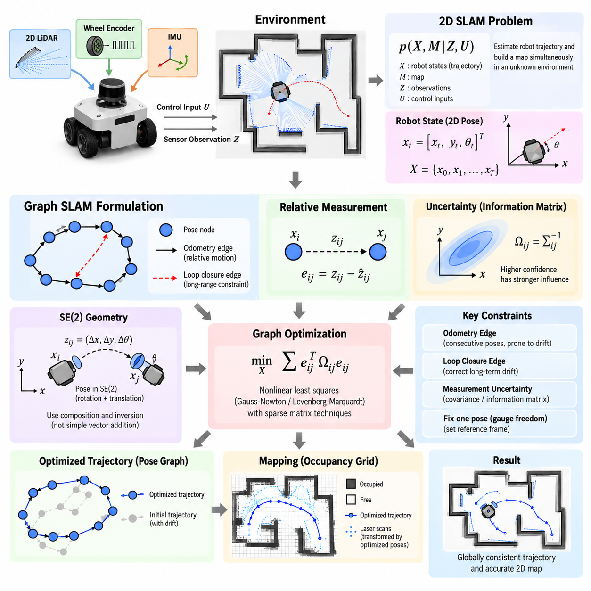
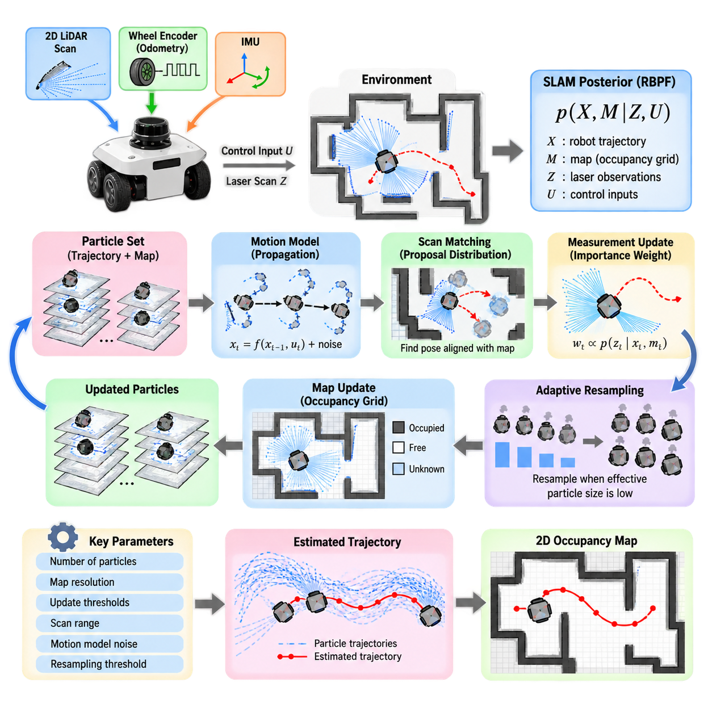
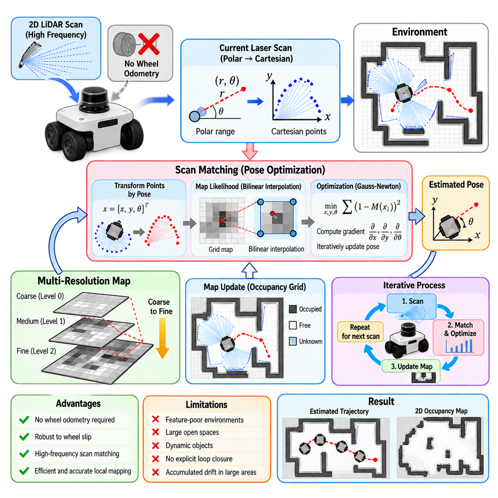
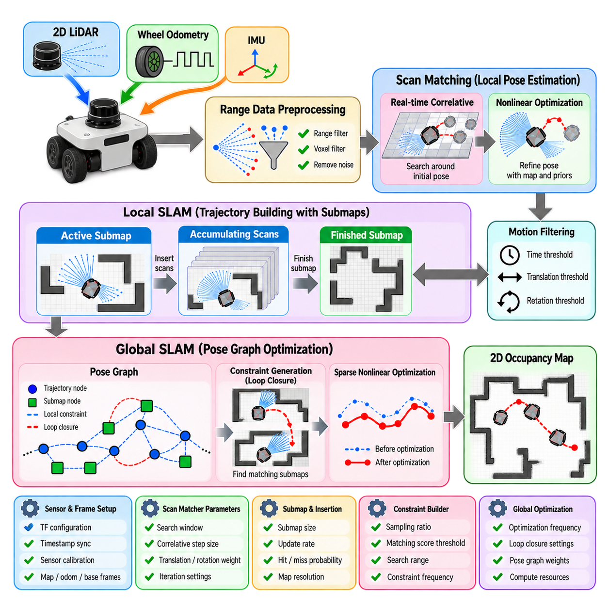
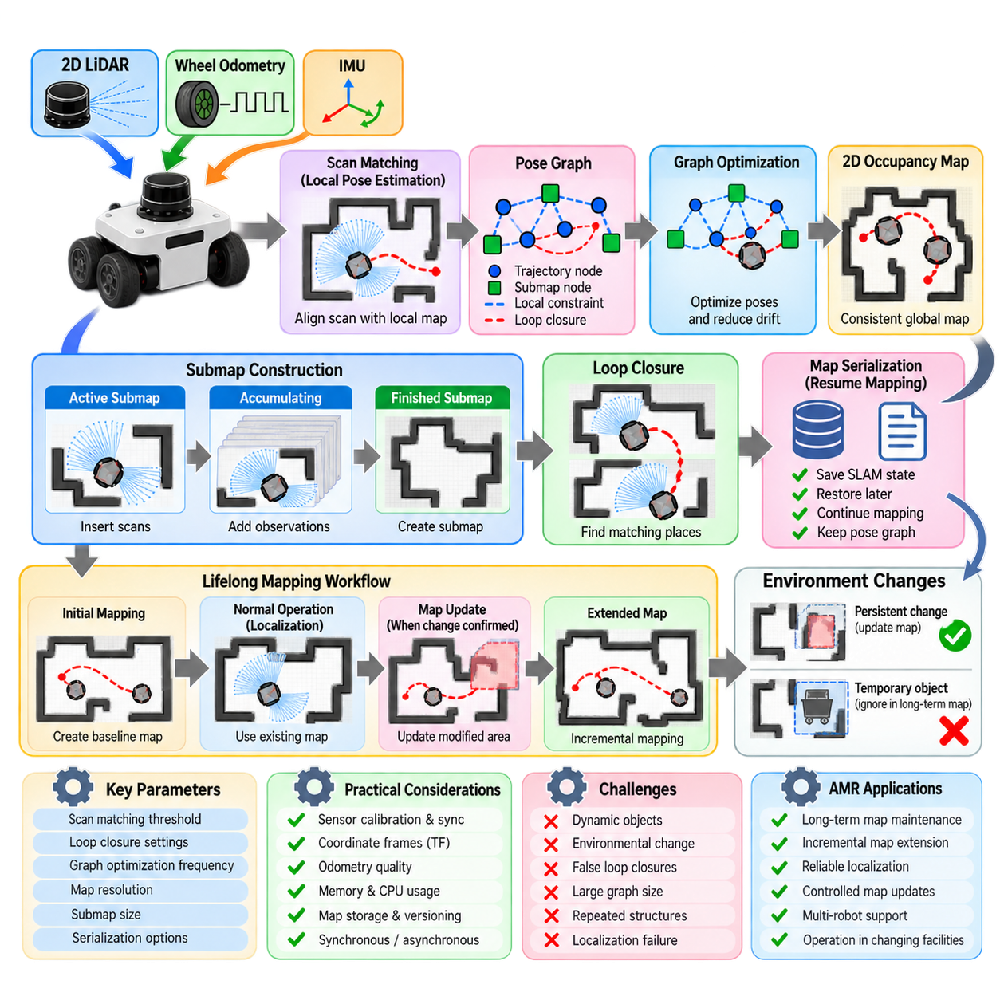
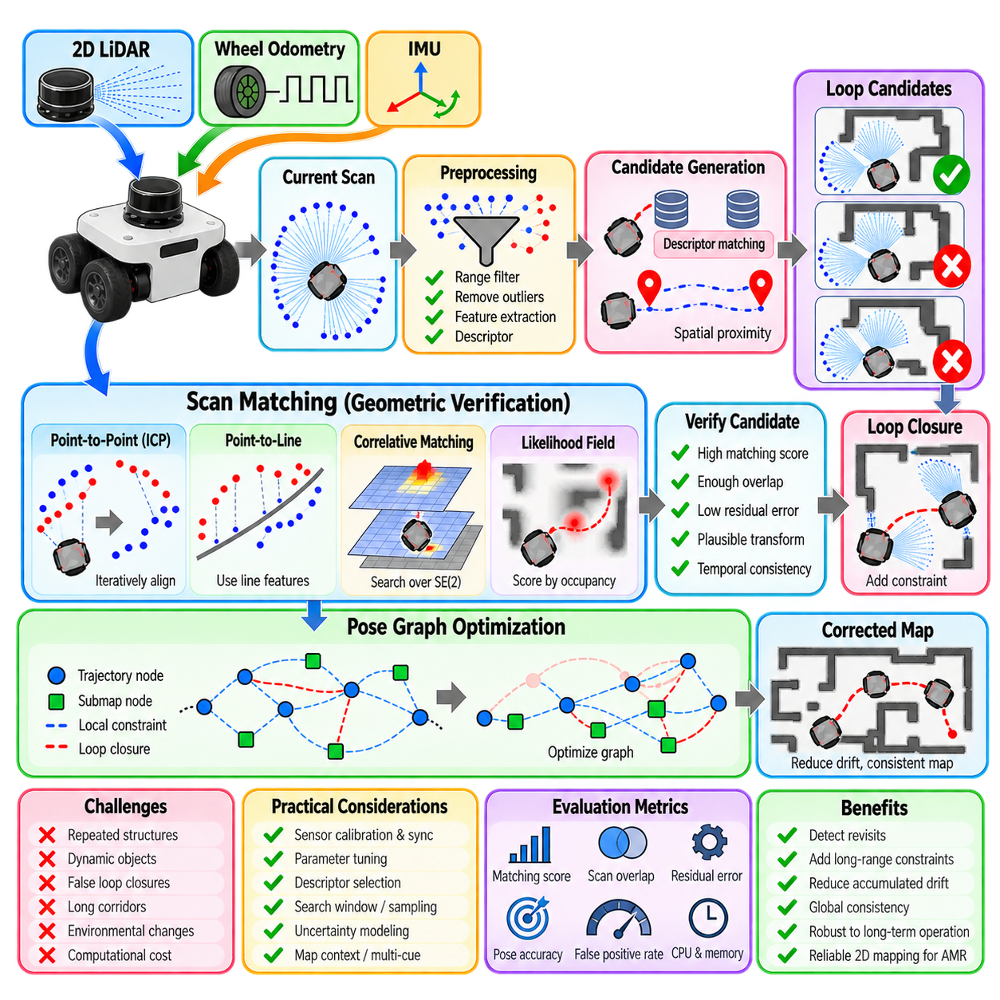
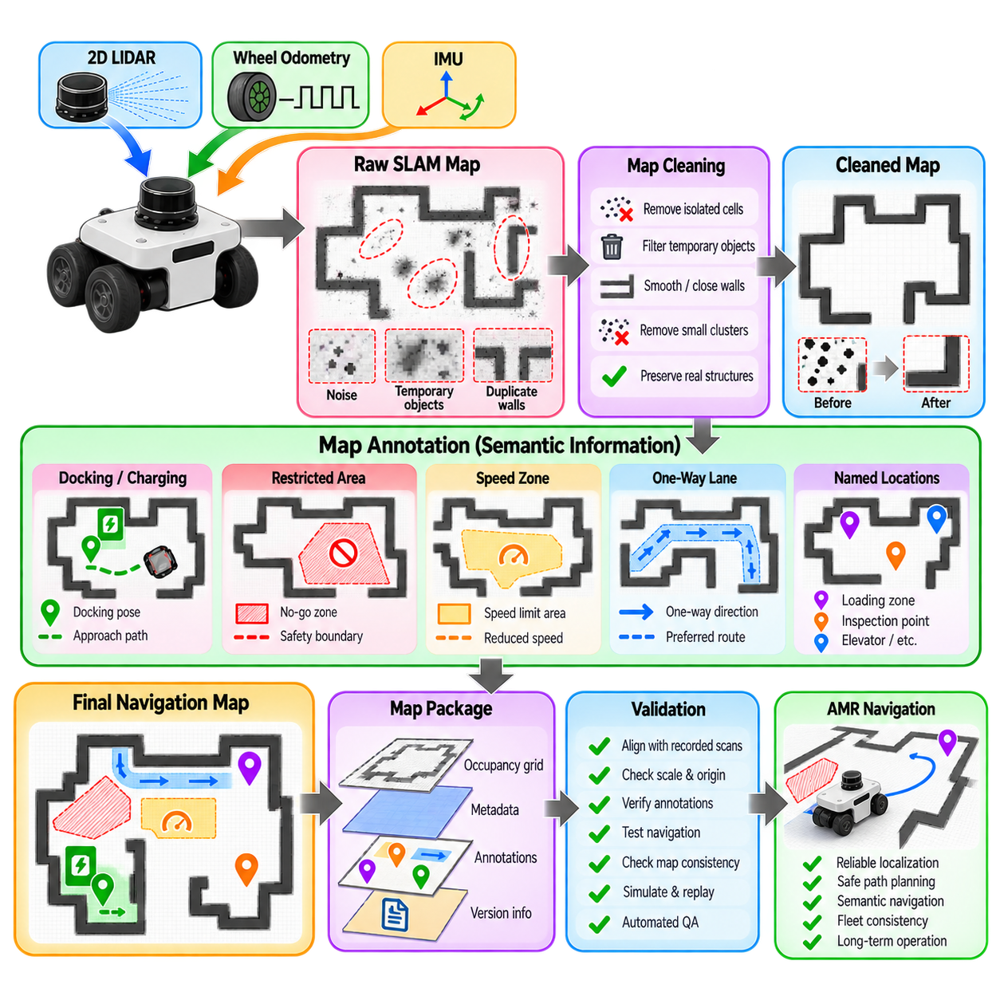
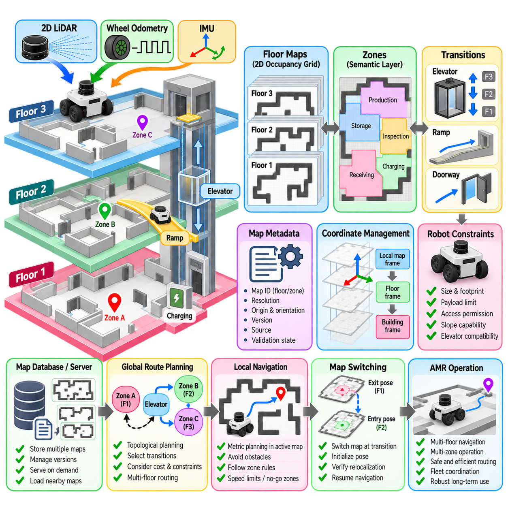
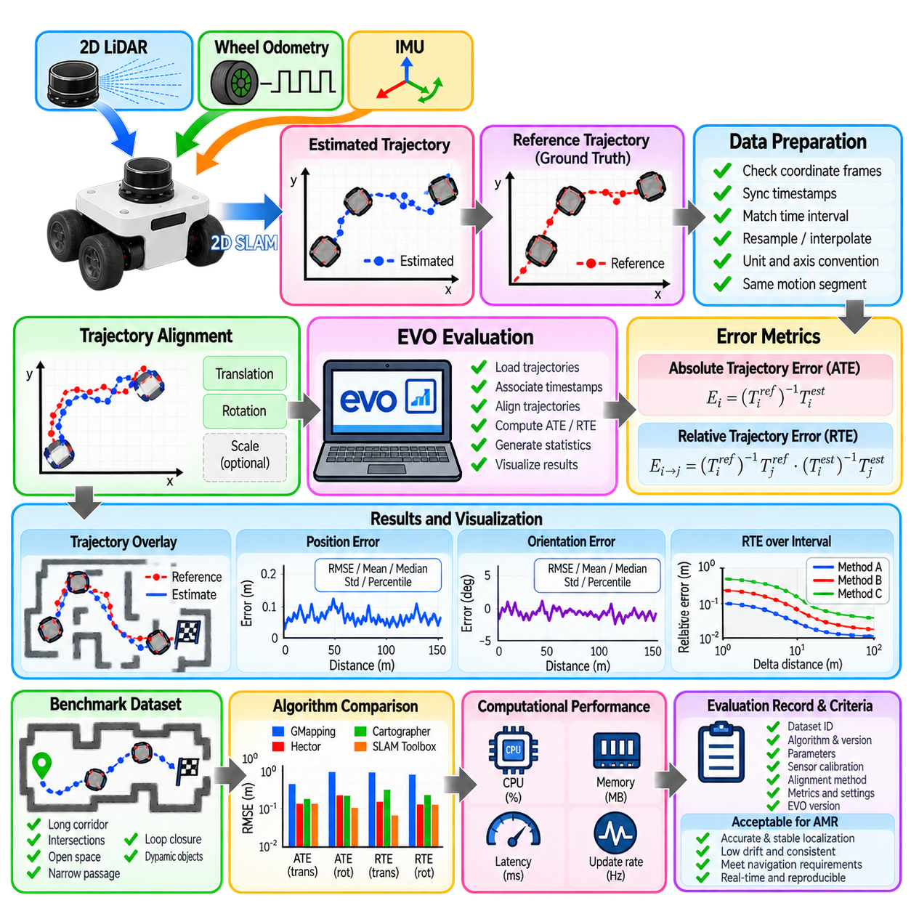
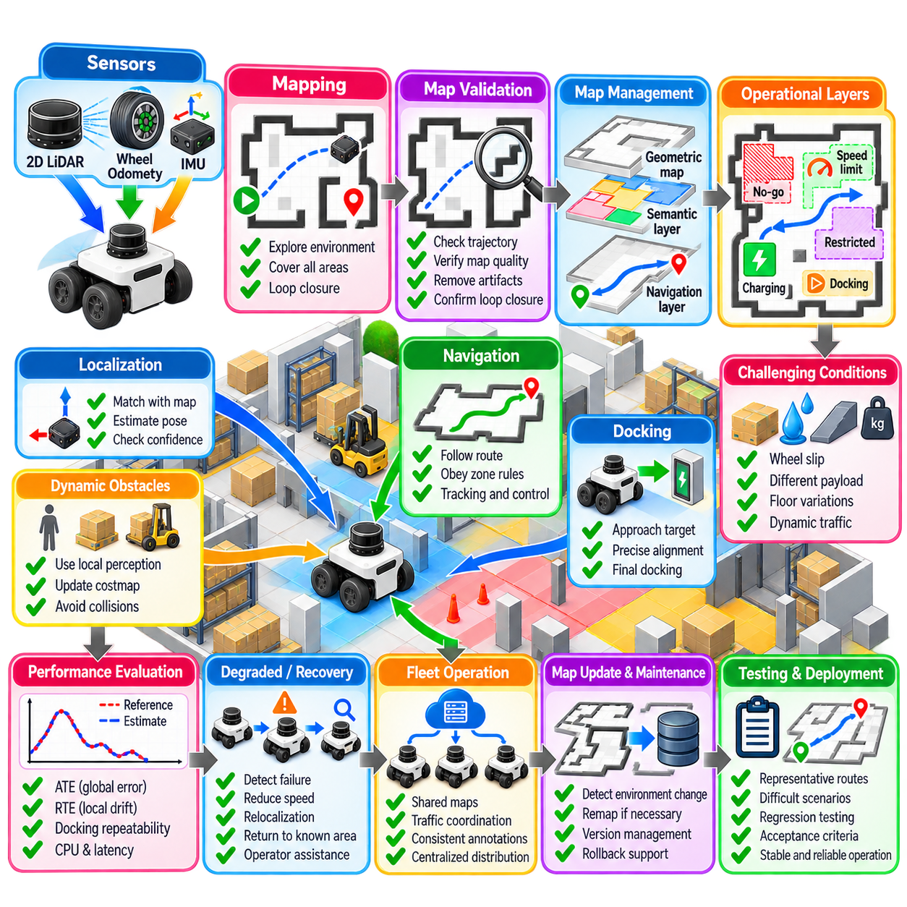

**Volume 13. Mapping Localization and SLAM**

# Chapter 03. 2D SLAM

## 03.01. 2D SLAM Problem Formulation and Graph SLAM Theory

{width="7.268055555555556in" height="7.268055555555556in"}

Two-dimensional simultaneous localization and mapping, or 2D SLAM, addresses the problem of estimating a mobile robot's trajectory while simultaneously constructing a map of an initially unknown environment. The robot observes only partial and noisy information through sensors such as wheel encoders, inertial sensors, and 2D LiDAR. Because localization depends on the map while map construction depends on localization, the two estimation problems are inherently coupled.

A typical 2D SLAM state represents the robot pose as \\(x_t=[x_t,y_t,\\theta_t]\^T\\), where \\(x_t\\) and \\(y_t\\) describe planar position and \\(\\theta_t\\) represents heading. Over time, the complete trajectory becomes \\(X=\\{x_0,x_1,\\ldots,x_T\\}\\). Measurements collected along this trajectory provide geometric constraints that relate different robot poses and observable structures in the environment.

The probabilistic formulation of SLAM seeks the posterior distribution of robot states and map variables conditioned on control inputs and sensor observations. Conceptually, this can be written as \\(p(X,M\|Z,U)\\), where \\(X\\) denotes the trajectory, \\(M\\) the map, \\(Z\\) the observations, and \\(U\\) the motion information. Practical systems approximate this distribution because directly maintaining the complete joint probability becomes computationally expensive as the trajectory grows.

Graph SLAM transforms this estimation problem into a structured optimization problem. Robot poses are represented as nodes in a graph, while spatial relationships derived from odometry, scan matching, landmarks, or loop closures become edges. Each edge expresses a relative-pose measurement between two nodes together with information describing its uncertainty. The resulting pose graph provides a compact representation of accumulated spatial constraints.

An odometry edge normally connects consecutive poses and describes the relative motion estimated between time steps. Wheel encoders, visual odometry, LiDAR odometry, or fused inertial measurements may provide this constraint. Since every measurement contains error, repeated integration produces drift. The pose graph does not assume that the initial trajectory is correct; instead, it retains measurements as constraints that can later be jointly optimized.

For poses \\(x_i\\) and \\(x_j\\), an edge measurement \\(z_{ij}\\) represents the observed relative transformation between them. A prediction \\(\\hat{z}_{ij}\\) can be calculated from the current pose estimates. Their difference defines an error vector \\(e_{ij}\\). Graph optimization adjusts the poses so that the collection of predicted relative transformations becomes as consistent as possible with the measured transformations.

Measurement uncertainty is represented through a covariance matrix or its inverse, the information matrix \\(\\Omega_{ij}\\). Highly reliable measurements therefore exert stronger influence on optimization than uncertain measurements. The global objective is commonly expressed as a weighted nonlinear least-squares problem, minimizing a cost such as \\(\\sum e_{ij}\^{T}\\Omega_{ij}e_{ij}\\) over all edges in the graph.

Because planar robot poses belong to the rigid-body transformation group SE(2), pose operations cannot be treated exactly like ordinary vector addition. A pose combines translation and rotation, and relative transformations require composition and inversion operations. Graph SLAM implementations therefore apply appropriate SE(2) geometry when computing residuals, Jacobians, pose updates, and coordinate transformations between robot frames and the global map frame.

The optimization problem is nonlinear because rotational components affect the transformation of translational coordinates. Algorithms such as Gauss-Newton and Levenberg-Marquardt iteratively linearize the error functions around the current estimate, solve the resulting sparse linear system, and update the poses. A sufficiently reasonable initial trajectory is important because nonlinear optimization may otherwise converge slowly or settle into an incorrect local solution.

Sparsity is one of the major computational advantages of Graph SLAM. Each measurement normally relates only a small number of states, so the resulting Hessian or information matrix contains many zero-valued blocks. Sparse matrix techniques exploit this structure to optimize trajectories containing thousands or even millions of constraints more efficiently than methods that manipulate dense representations of the complete estimation problem.

Loop closure is particularly important because it introduces constraints between poses that may be widely separated in time. When the robot recognizes a previously visited location, the new edge can expose accumulated trajectory drift. Global graph optimization then distributes the correction over many poses rather than applying a discontinuous correction at a single location, producing a trajectory and map that are geometrically more consistent.

Loop closures must nevertheless be verified carefully. A false loop closure can introduce a strong but incorrect constraint and deform the entire pose graph. Practical systems therefore combine place recognition with geometric verification using scan alignment, feature consistency, transformation plausibility, or other tests. Robust loss functions can further reduce the influence of measurements whose residuals become inconsistent with the majority of constraints.

In LiDAR-based 2D SLAM, scan matching frequently supplies relative-pose constraints. Consecutive or nearby laser scans are aligned by estimating the transformation that maximizes geometric agreement between observed surfaces. Methods based on point-to-point distance, point-to-line distance, correlation, likelihood fields, or occupancy representations can be used. The estimated transformation and its uncertainty can then become an edge in the pose graph.

The pose graph and the environmental map should be conceptually distinguished. The graph represents relationships among robot states, whereas an occupancy grid represents the probability that spatial cells are occupied or free. After trajectory optimization, stored laser observations can be transformed using the corrected poses and integrated again into the grid. Consequently, improved trajectory consistency directly produces sharper walls and better aligned environmental structures.

Gauge freedom arises because relative measurements alone cannot determine an absolute global coordinate system. Translating or rotating every pose together leaves all relative constraints unchanged. A practical optimizer therefore fixes one pose, commonly the initial pose, or introduces a suitable prior constraint. This establishes the reference frame and prevents the optimization problem from becoming mathematically underdetermined.

The quality of a 2D SLAM system depends not only on the optimizer but also on the quality and observability of its constraints. Long corridors, repetitive structures, large open spaces, moving objects, wheel slip, sparse geometry, and rapid rotation can weaken localization. Sensor fusion, motion priors, scan-quality evaluation, robust estimation, and careful loop-closure validation are therefore essential parts of a reliable system.

Graph SLAM naturally separates front-end perception from back-end estimation. The front end processes sensor data, performs scan matching, detects loop candidates, and generates constraints. The back end maintains the graph and solves the global optimization problem. This separation allows different sensors and matching algorithms to feed a common estimation architecture while preserving a mathematically consistent framework for trajectory correction.

For autonomous mobile robots, this formulation provides an effective bridge between local motion estimation and globally consistent navigation. Short-term odometry enables continuous movement, local scan matching limits incremental error, and loop closures constrain long-term drift. Graph optimization combines these sources according to their uncertainty, creating a trajectory that can support occupancy mapping, localization, path planning, and repeated autonomous operation.

In industrial deployments, the theoretical formulation must ultimately operate under bounded computing resources and real-time constraints. Keyframes may be selected instead of creating a node for every sensor frame, redundant constraints can be reduced, and optimization can run incrementally or asynchronously. These engineering choices preserve the essential Graph SLAM structure while controlling memory consumption, latency, and computational complexity.

The central idea of 2D Graph SLAM is therefore not simply to integrate robot motion forward in time, but to retain spatial relationships as revisable constraints. New observations can alter the interpretation of earlier motion, and loop closures can correct errors accumulated over long trajectories. By representing uncertainty explicitly and optimizing all relevant constraints together, Graph SLAM provides the theoretical foundation for globally consistent planar mapping and localization.

## 03.02. GMapping Particle Filter SLAM Implementation [w/Code]

{width="7.268055555555556in" height="7.268055555555556in"}

GMapping is a widely used 2D SLAM approach designed primarily for mobile robots equipped with planar laser range sensors. Its core algorithm is based on Rao-Blackwellized Particle Filters, or RBPFs, which estimate the robot trajectory using particles while maintaining a separate occupancy-grid map associated with each trajectory hypothesis. This decomposition makes the SLAM problem computationally manageable and historically important for practical indoor robot mapping.

The theoretical basis of GMapping begins by factorizing the SLAM posterior into a probability distribution over robot trajectories and a conditional distribution over maps. Instead of estimating every robot pose and map cell jointly, the particle filter samples possible trajectories. Given a particular trajectory and the corresponding laser observations, the occupancy map can then be estimated conditionally, reducing the dimensionality of the stochastic estimation problem.

Each particle represents a hypothesis about the robot's complete trajectory and contains an associated map constructed from observations collected along that trajectory. As the robot moves, particles are propagated according to a motion model using odometry information. Laser scans are then evaluated against each particle's map, producing likelihood values that indicate how well each trajectory hypothesis explains the current sensor observation.

A straightforward particle filter that relies primarily on the odometry motion model can require a large number of particles because wheel odometry accumulates uncertainty rapidly. GMapping addresses this problem by incorporating the latest laser observation into the proposal distribution. Scan matching is used to find poses that better align the current scan with the existing map, concentrating particles around regions of high measurement likelihood rather than distributing them broadly according to odometry uncertainty alone.

This improved proposal distribution is one of the most important characteristics of GMapping. The algorithm combines the motion estimate, the current laser scan, and the existing map to construct a locally informed pose proposal. Consequently, fewer particles are typically required to represent plausible trajectories. This substantially reduces computational cost while maintaining useful mapping accuracy for many structured indoor and moderately sized environments.

Scan matching searches for a robot pose that maximizes the agreement between measured laser endpoints and occupied structures already represented in the map. The odometry estimate usually provides the initial search location, while nearby translational and rotational alternatives are evaluated. A successful match produces an improved pose estimate and also contributes information about local pose uncertainty that can be incorporated into particle sampling.

After a new pose has been proposed, each particle receives an importance weight reflecting the probability of the current observation under that hypothesis. Conceptually, particles whose predicted maps agree strongly with the measured laser scan receive larger weights, while inconsistent hypotheses receive smaller weights. Normalizing these weights creates a discrete approximation of the posterior distribution represented by the current particle population.

Repeated weighting eventually causes particle degeneracy, where most particles have negligible weights and only a small number meaningfully represent the posterior. Particle-filter SLAM therefore requires resampling, in which highly weighted particles are replicated while low-weight particles disappear. However, resampling too frequently can eliminate useful trajectory diversity and lead to particle impoverishment, particularly when observations provide limited geometric information.

GMapping uses adaptive resampling to reduce this problem. A common criterion is the effective sample size, typically related to the inverse of the sum of squared normalized particle weights. When weights remain relatively balanced, resampling can be postponed. When the effective particle population falls below a threshold, resampling is performed. This preserves diversity longer while avoiding unnecessary computational work and excessive duplication of particles.

The occupancy-grid map associated with each particle divides the environment into discrete cells representing free, occupied, or unknown space. Laser beams provide evidence about these states: cells traversed by a valid beam are generally updated toward free space, while the endpoint corresponding to an obstacle is updated toward occupied space. Repeated observations progressively refine the probabilistic representation of walls, furniture, equipment, and navigable regions.

Map resolution strongly affects both accuracy and computational requirements. Smaller grid cells can represent environmental geometry more precisely but require more memory and increase the cost of scan matching and map updates. Larger cells reduce computational demand but may blur narrow passages, wall boundaries, and small obstacles. Practical GMapping configurations therefore select resolution according to LiDAR characteristics, environment size, navigation requirements, and available computing resources.

Odometry remains important even though laser scan matching corrects substantial motion error. The motion model provides a prior estimate of translation and rotation between scans and determines how uncertainty spreads during particle propagation. Parameters describing translational noise, rotational noise, and their coupling must approximately reflect the physical platform. Poorly tuned motion uncertainty can produce either excessive particle dispersion or unjustified confidence in inaccurate odometry.

Laser sensor quality also directly influences mapping performance. Reliable angular calibration, accurate range measurements, appropriate minimum and maximum range limits, and correct sensor-to-base transformation are essential. Incorrect extrinsic calibration between the LiDAR and robot coordinate frame can systematically distort scan alignment. Similarly, timestamps that are inconsistent with robot motion can create apparent geometric errors, particularly during rapid translation or rotation.

The frequency at which laser scans are incorporated into SLAM must balance map responsiveness and computational cost. Processing every available scan may be unnecessary when the robot moves slowly or the sensor operates at high frequency. GMapping implementations commonly use linear and angular update thresholds so that a new mapping update occurs only after sufficient robot motion. Temporal thresholds can additionally ensure updates when the robot remains nearly stationary.

GMapping performs particularly well in environments containing stable geometric structures such as walls, corridors, rooms, shelves, and fixed equipment. These structures provide strong scan-matching constraints and help distinguish alternative particle trajectories. Performance can degrade in long feature-poor corridors, large open areas, highly symmetric spaces, glass-rich environments, or locations dominated by moving people and objects because laser observations provide weaker or misleading localization information.

Unlike pose-graph SLAM systems that explicitly create loop-closure constraints and later perform global graph optimization, GMapping represents historical uncertainty through its particle trajectories. When a robot revisits a known region, scan likelihoods can favor particles whose trajectories align the new observation with the existing map. However, large accumulated errors or insufficient particle diversity can prevent recovery, making long-term and very large-scale mapping more difficult than with modern graph-based approaches.

Implementation requires consistent coordinate frames. A typical mobile robot distinguishes the global map frame, an odometry frame representing locally continuous motion, the robot base frame, and the laser sensor frame. Transformations between these frames must be available with correct timing. The SLAM system estimates the relationship between the map and odometry frames so that local odometry can remain smooth while global localization corrections modify the robot's position within the map.

In ROS-based systems, GMapping has historically been integrated through components that subscribe to laser scans and obtain robot motion through the transform system. Parameters control particle count, map resolution, update distances, scan ranges, matching behavior, resampling thresholds, and motion-model noise. Successful deployment requires these parameters to be tuned as a coherent system rather than independently, because changes in one component affect particle distribution, scan matching, and map quality.

Practical debugging should begin with raw sensing and coordinate geometry before modifying particle-filter parameters. Laser scans should appear correctly aligned with the robot, odometry should move continuously in the expected direction, timestamps should be coherent, and static structures should remain stable during motion. If these fundamentals are incorrect, increasing particle count or changing resampling thresholds usually consumes additional computation without addressing the actual source of mapping error.

For an autonomous mobile robot, GMapping provides an intuitive example of probabilistic SLAM operating as a complete pipeline. Odometry predicts motion, scan matching improves the proposal, particles represent alternative trajectories, measurement likelihoods assign importance, adaptive resampling manages the particle population, and occupancy updates construct the map. These operations repeatedly transform uncertain sensor observations into a spatial representation suitable for navigation.

Although newer graph-optimization and LiDAR-inertial methods often provide better scalability and long-term consistency, GMapping remains valuable for understanding and implementing probabilistic 2D SLAM. Its architecture clearly demonstrates Bayesian state estimation, sampling, importance weighting, resampling, scan matching, motion modeling, and occupancy mapping within one system. These principles remain relevant even when modern SLAM frameworks implement them using different mathematical and computational structures.

## 03.03. Hector SLAM Scan Matching Based No Odometry [w/Code]

{width="7.268055555555556in" height="7.268055555555556in"}

Hector SLAM is a 2D mapping and localization approach designed around high-frequency laser scan matching rather than explicit dependence on wheel odometry. It estimates robot motion by continuously aligning incoming 2D LiDAR scans with an evolving occupancy-grid map. This architecture is particularly useful when reliable wheel encoders are unavailable, difficult to integrate, or affected by wheel slip and other forms of poor ground contact.

The central assumption is that successive laser observations contain sufficient geometric information to estimate changes in robot pose. Instead of predicting motion primarily from wheel rotation, Hector SLAM searches for the planar pose \\(x=[x,y,\\theta]\^T\\) that best aligns the current scan with structures already represented in the map. Accurate pose estimation therefore depends strongly on scan frequency, environmental geometry, sensor quality, and the magnitude of motion between consecutive observations.

Laser measurements are converted from polar range observations into Cartesian endpoints in the sensor coordinate frame. For a candidate robot pose, these points are transformed into the map coordinate frame and compared with the occupancy representation. Pose estimation seeks the transformation that places observed obstacle points in locations with high occupancy probability, effectively converting localization into a continuous optimization problem over planar translation and rotation.

A key component of Hector SLAM is its occupancy-grid representation. The environment is divided into cells containing estimates related to occupancy, and laser observations continuously update these values. Unlike methods that depend primarily on discrete feature extraction, the scan matcher can directly exploit geometric information distributed across many laser endpoints. Walls, corners, pillars, machinery, and other stable surfaces collectively contribute to estimating robot motion.

To support continuous scan alignment, Hector SLAM uses interpolation of occupancy values between discrete grid cells. A transformed laser endpoint rarely falls exactly at the center of a grid cell, so evaluating only the nearest cell would produce a discontinuous objective function. Bilinear interpolation creates a smoother map response, allowing small changes in robot position to produce meaningful changes in the scan-matching score and enabling gradient-based pose optimization.

The scan-matching objective measures how well transformed laser endpoints correspond to occupied regions of the map. Starting from an initial pose estimate, the algorithm calculates how the matching score changes with respect to \\(x\\), \\(y\\), and \\(\\theta\\). These derivatives provide a direction in which the pose estimate should move to improve alignment. Iterative optimization then refines the pose until the scan and local map reach a sufficiently consistent configuration.

Hector SLAM commonly employs a Gauss-Newton-style optimization process. The nonlinear relationship between robot pose and transformed laser points is locally approximated, producing a small system associated with the three planar pose variables. Because only a compact pose state is optimized during each scan match, the method can operate efficiently at relatively high update rates when computational resources and LiDAR frequency are sufficient.

A strong initial estimate remains important even when wheel odometry is not used. In many operating conditions, the previously estimated pose serves as the starting point for matching the next scan because motion between high-frequency observations is expected to be small. If the robot moves too far or rotates too rapidly between scans, the initial estimate may fall outside the convergence region and the matcher can converge to an incorrect alignment.

One distinctive feature of Hector SLAM is its multi-resolution map representation. Several occupancy maps are maintained at different spatial resolutions, forming a map pyramid. Scan matching can begin at a coarser level where the optimization has a wider effective capture region and then continue at progressively finer levels. This coarse-to-fine strategy improves convergence and allows the system to combine larger-scale alignment with accurate local refinement.

The multi-resolution structure is especially valuable because scan matching can otherwise become trapped by local geometric ambiguity. At coarse resolution, small map details are suppressed and dominant environmental structures guide the optimization. Finer levels subsequently restore geometric detail and improve pose precision. The approach resembles multi-scale optimization techniques used in computer vision, where progressively refined representations improve both robustness and accuracy.

Operating without wheel odometry does not mean operating without motion assumptions or external information. Hector SLAM can benefit from inertial measurements, particularly orientation information, when available. An IMU can help constrain attitude or rapid rotational motion and improve robustness on platforms whose motion cannot be described perfectly by planar wheel kinematics. Nevertheless, the core planar localization mechanism remains laser-to-map scan matching.

The absence of mandatory wheel odometry provides advantages for robots that experience substantial wheel slip. Conventional encoder-based odometry can become misleading on smooth floors, loose surfaces, ramps, or platforms with skid-steer motion. Since Hector SLAM estimates displacement from environmental geometry, wheel rotation errors do not directly accumulate into the pose estimate. However, this advantage exists only when the laser observations themselves contain adequate and stable geometric constraints.

Feature-poor environments remain a fundamental limitation. In a long straight corridor, for example, laser measurements may constrain lateral position and orientation strongly while providing limited information about displacement along the corridor. Large open spaces can similarly provide too few nearby surfaces for reliable alignment. Repetitive geometry can create several plausible alignments, increasing the possibility of incorrect convergence or sudden localization errors.

Dynamic objects also influence scan matching because Hector SLAM assumes that most observed geometry belongs to a static environment. Moving people, vehicles, doors, equipment, or other transient objects can introduce laser returns that disagree with the persistent map. If dynamic observations dominate a scan, the optimizer may be attracted toward an incorrect pose. Range filtering, environmental design, sensor placement, and additional sensing can reduce this problem.

LiDAR characteristics strongly affect performance. A high scan rate reduces the displacement between consecutive observations and therefore improves the probability that the previous pose is a useful initialization. Wide angular coverage and sufficient range provide more environmental constraints. Accurate sensor calibration is equally important because systematic angular or range errors distort the geometry used by the optimizer and can generate inconsistent map structures over repeated observations.

Timing is another critical implementation concern. Laser measurements are acquired over a finite scan interval rather than at a single instantaneous moment. If the robot moves rapidly while a scan is being captured, different beams correspond to slightly different sensor poses, creating motion distortion. Without compensation, the resulting scan may not correspond to any rigid transformation and can reduce matching accuracy, particularly during rapid rotation.

Map resolution must be selected according to the environment and sensor characteristics. Fine resolution can represent narrow structures and precise wall boundaries but increases memory consumption and may make optimization more sensitive to measurement noise. Coarser maps reduce computational requirements and smooth local variations but sacrifice geometric detail. The multi-resolution architecture allows Hector SLAM to exploit several scales while maintaining a useful balance between convergence robustness and final precision.

Unlike modern pose-graph SLAM systems, Hector SLAM is primarily focused on local scan-to-map alignment and incremental map construction rather than explicit global loop-closure optimization. It does not fundamentally rely on creating a graph of historical poses and later distributing loop-closure corrections across the trajectory. Consequently, accumulated errors over large environments may remain difficult to correct when the robot returns to a previously visited region.

This characteristic makes Hector SLAM particularly suitable for applications where fast local mapping is more important than globally optimized long-term consistency. Examples include small indoor robots, experimental platforms, handheld mapping systems, or robots without trustworthy wheel encoders. For extensive facilities, repeated long-duration missions, or environments requiring strong loop-closure correction, graph-based SLAM or systems combining local scan matching with global optimization may provide greater scalability.

In a ROS implementation, correct coordinate transformations remain essential even without wheel odometry. The LiDAR frame must be accurately related to the robot base frame, and the SLAM system must publish a consistent relationship between the map and robot pose. Sensor timestamps, frame identifiers, laser angle conventions, valid range limits, and update frequencies should be verified before scan-matching parameters are tuned.

Practical debugging should therefore begin by visualizing raw laser scans and their transformation into the robot coordinate system. Static walls should retain stable geometry as the platform moves, and successive scans should overlap reasonably before mapping begins. If scans appear rotated, displaced, delayed, or geometrically distorted, optimization tuning cannot reliably compensate for the underlying calibration or synchronization error.

For autonomous mobile robots, Hector SLAM demonstrates an important principle: robot motion can be estimated directly from environmental observations without requiring wheel displacement as the primary source of localization. High-rate LiDAR sensing, occupancy-grid gradients, iterative scan matching, and multi-resolution optimization together create a complete local SLAM pipeline. This makes the method an instructive contrast to particle-filter and graph-based approaches.

The broader significance of Hector SLAM lies in showing how strong environmental sensing can substitute for unreliable proprioceptive motion estimation under appropriate conditions. Its performance emerges from the interaction of sensor frequency, geometric observability, map representation, interpolation, optimization, and multi-scale processing. Understanding these mechanisms provides a foundation for more advanced LiDAR odometry and scan-matching systems used in modern autonomous robots.

## 03.04. Cartographer 2D SLAM Configuration and Tuning [w/Code]

{width="7.268055555555556in" height="7.268055555555556in"}

Cartographer 2D SLAM is a graph-based mapping and localization framework designed to combine high-frequency local pose estimation with globally consistent trajectory optimization. Rather than relying on a single estimation mechanism, it separates SLAM into local trajectory building and global pose-graph optimization. This architecture allows a mobile robot to maintain responsive real-time localization while periodically correcting accumulated drift through loop-closure constraints.

The local SLAM component processes range observations from 2D LiDAR or compatible range sensors and estimates successive robot poses relative to nearby map data. Incoming scans are accumulated, filtered, and aligned against local submaps. The resulting pose estimates provide smooth short-term motion tracking, while completed submaps and selected trajectory nodes later become elements of the global optimization problem.

Cartographer represents the environment using submaps rather than continuously modifying one monolithic global occupancy grid. Each submap is constructed from a limited sequence of range observations collected while the robot moves through a local region. New scans are inserted into active submaps, and once sufficient observations have accumulated, older submaps are finished and preserved for later constraint generation and global optimization.

The use of submaps provides both computational and estimation advantages. Scan matching only needs to operate against a limited local representation instead of an increasingly large global map. At the same time, previously completed submaps provide stable references that can be compared with later trajectory nodes. This creates a natural structure for detecting revisited areas and introducing loop-closure constraints between spatially related observations.

Before scan matching, Cartographer applies range-data preprocessing to reduce noise and computational load. Measurements outside configured minimum and maximum ranges can be discarded or handled separately, while accumulated scans may be voxel filtered. Correct settings should reflect the LiDAR's reliable operating range, environmental scale, expected obstacle density, and robot velocity rather than simply using the sensor manufacturer's theoretical maximum range.

Local pose estimation typically combines a pose prediction with scan matching. Prediction can incorporate odometry, inertial measurements, or previously estimated motion depending on the robot configuration. A real-time correlative scan matcher may search around the predicted pose to obtain a robust initial alignment, after which nonlinear scan matching refines translation and rotation by optimizing agreement with the active submap and available motion priors.

The real-time correlative scan matcher improves robustness when the initial pose prediction contains uncertainty, but its search introduces computational cost. Increasing linear or angular search windows may help recover from larger prediction errors while substantially increasing the number of candidate poses evaluated. Configuration therefore requires balancing robustness against latency, particularly on embedded computers where mapping must coexist with perception, planning, and control workloads.

Nonlinear scan matching refines the pose using weighted objectives associated with occupied-space agreement, translation deviation, and rotation deviation. These weights determine how strongly the solution follows map geometry versus the predicted pose. Excessively strong motion priors may prevent correction of inaccurate odometry, whereas weak priors can allow ambiguous environmental geometry to pull the solution toward an incorrect alignment.

Range data insertion determines how local submaps are constructed. Laser rays provide information about free space along the beam and occupied space near valid endpoints. Parameters controlling hit and miss probabilities influence how quickly occupancy evidence accumulates. Aggressive updates may produce sharp maps rapidly but can reinforce transient measurements, while conservative updates require repeated observations and may produce more stable maps in noisy environments.

Motion filtering can reduce unnecessary computation by avoiding insertion of nearly identical observations. Cartographer can compare elapsed time, translation, and rotation since the previous accepted observation and discard updates that contain little new spatial information. Thresholds should be selected according to robot speed and sensor frequency because overly aggressive filtering can remove useful geometry, whereas weak filtering can create redundant nodes and increase optimization cost.

Global SLAM constructs a pose graph containing trajectory nodes, submap poses, and constraints between them. Local constraints connect observations to nearby submaps that contributed directly to local mapping. Additional constraints can be generated when the system identifies plausible matches between trajectory nodes and previously constructed submaps. These nonlocal relationships provide the mechanism for loop closure and long-term drift correction.

Constraint generation is one of the most influential aspects of Cartographer tuning. Searching too broadly or too frequently for candidate constraints increases CPU consumption and can create more opportunities for false matches. Searching too conservatively may prevent valid loop closures from being discovered. Parameters associated with sampling ratios, matching scores, search ranges, and constraint-builder behavior therefore affect both computational scalability and global map consistency.

Loop-closure candidates are commonly evaluated using scan matching against existing submaps. Candidate matches must achieve sufficient agreement before they are accepted as constraints. A threshold that is too low can admit incorrect matches and distort the global trajectory, while an excessively high threshold may reject legitimate closures under viewpoint changes, sensor noise, or environmental modification. Threshold selection should therefore be validated using representative operational data.

Once constraints have been collected, Cartographer periodically solves a sparse nonlinear optimization problem over trajectory nodes and submap poses. The optimizer attempts to satisfy local scan-matching relationships, odometry information, inertial constraints, and loop closures simultaneously. When a valid loop closure is introduced, correction is distributed across the trajectory, improving global consistency instead of abruptly shifting only the current robot pose.

The frequency of global optimization affects both responsiveness and computing demand. Optimizing very frequently can increase CPU load without producing meaningful changes when few new constraints have been added. Optimizing too rarely allows global inconsistency to persist longer and delays loop-closure correction. Practical configuration must account for trajectory length, processor capability, expected loop frequency, and whether mapping operates continuously over large facilities.

Odometry can significantly improve Cartographer when it provides locally smooth motion estimates, even if long-term drift is present. The SLAM system can use odometry as a short-term motion constraint while laser observations and loop closures correct accumulated errors. However, inaccurate coordinate conventions, scale errors, discontinuities, or excessive encoder noise can degrade scan matching. Odometry quality should therefore be verified independently before its influence is increased through configuration weights.

Inertial measurement units can provide valuable rotational information, especially during rapid turns or on platforms where wheel-based yaw estimates are unreliable. Correct IMU orientation, timestamp synchronization, and frame transformation are essential. Although planar 2D SLAM ultimately estimates motion primarily in \\(x\\), \\(y\\), and yaw, incorrect inertial data can still introduce inconsistent motion priors and reduce localization quality.

Coordinate-frame configuration is fundamental to a reliable deployment. The map frame, published tracking frame, robot base frame, odometry frame, and individual sensor frames must form a consistent transformation tree. Cartographer relies on time-dependent transformations to place sensor observations correctly. Missing transforms, incorrect frame directions, or delayed transform publication can appear as scan-matching failures even when the SLAM parameters themselves are reasonable.

Sensor synchronization becomes increasingly important as robot speed increases. A LiDAR scan, odometry update, and IMU measurement may correspond to different physical times if timestamps or clocks are inconsistent. Such temporal errors create apparent spatial disagreement between sensors. Before tuning scan-matching weights, developers should verify clock synchronization, timestamp semantics, transform availability, and sensor latency throughout the complete data pipeline.

Map resolution influences geometric detail, memory use, and scan-matching behavior. A finer resolution represents walls and narrow structures accurately but increases map size and can make alignment sensitive to noise. A coarser resolution is computationally cheaper but may merge nearby structures. Resolution should be selected according to LiDAR accuracy, minimum environmental feature size, robot dimensions, and the precision required by downstream navigation.

A disciplined tuning process changes parameter groups according to observable failure modes rather than modifying many values simultaneously. Local scan alignment should first be stabilized using correct sensor geometry, filtering, motion prediction, and scan-matching settings. Submap construction should then be inspected, followed by constraint generation and global optimization. This staged approach makes it easier to distinguish local estimation errors from global loop-closure problems.

Recorded sensor datasets are especially valuable for configuration because identical trajectories can be replayed repeatedly while parameters are changed. Developers can compare trajectory smoothness, wall alignment, loop-closure behavior, CPU utilization, and optimization latency under controlled conditions. Representative datasets should include normal operation as well as difficult situations such as narrow corridors, open areas, rapid rotations, dynamic objects, and long loops.

For autonomous mobile robots, successful Cartographer tuning is ultimately a system-level engineering task rather than a search for one universally optimal parameter set. Sensor quality, robot kinematics, processor performance, environment geometry, operating speed, and navigation accuracy requirements interact strongly. Configuration must therefore be validated on the actual platform and environment while maintaining sufficient computational margin for the rest of the autonomy stack.

Cartographer 2D SLAM demonstrates how local scan matching and global graph optimization can be combined within a scalable architecture. Local trajectory building provides responsive pose estimates, submaps organize range observations, constraint generation discovers spatial relationships, and pose-graph optimization distributes corrections over the complete trajectory. Proper configuration aligns these components so that real-time localization and long-term map consistency reinforce rather than conflict with each other.

## 03.05. SLAM Toolbox Lifelong Mapping for AMR [w/Code]

{width="7.268055555555556in" height="7.268055555555556in"}

SLAM Toolbox is a ROS-oriented 2D SLAM framework designed for mapping, localization, map refinement, and long-term operation of mobile robots. Its lifelong mapping capability is especially relevant to autonomous mobile robots operating repeatedly in facilities that change over time. Instead of treating mapping as a one-time commissioning task, the system can preserve mapping sessions and continue improving or extending spatial knowledge during later missions.

The fundamental challenge of lifelong mapping is that a deployed environment is rarely completely static. Shelves can move, production equipment can be relocated, corridors can be reconfigured, and previously inaccessible areas may become available. At the same time, temporary objects such as people, carts, pallets, and vehicles should not automatically redefine the permanent map. A useful lifelong SLAM system must distinguish persistent spatial changes from transient observations.

SLAM Toolbox follows a pose-graph-oriented architecture in which robot poses and associated laser observations contribute to a graph of spatial constraints. Consecutive poses are connected through local motion and scan-matching relationships, while loop closures can connect observations acquired at locations visited at different times. Optimization adjusts the graph so that these constraints become globally consistent and accumulated trajectory drift can be reduced.

Laser scan matching provides the principal geometric relationship between observations and the evolving map. Incoming 2D LiDAR data are compared with previously stored spatial information to estimate the robot pose and generate constraints. Odometry supplies valuable short-term motion information, while scan matching corrects drift relative to environmental geometry. Reliable performance therefore depends on consistent LiDAR calibration, stable odometry, coordinate transforms, and synchronized timestamps.

A major advantage of SLAM Toolbox is the ability to serialize mapping information rather than preserving only a final occupancy-grid image. A conventional map image captures the resulting spatial representation but discards much of the estimation structure that produced it. Serialized SLAM data can preserve information needed to resume mapping and optimize the pose graph, enabling later sessions to continue from an existing mapping state instead of rebuilding the environment from the beginning.

When a stored mapping session is restored, the robot can continue adding observations and constraints as it explores. New regions can extend the existing map, while revisited regions provide opportunities to align current observations with previously mapped geometry. This behavior supports facilities that expand incrementally or require periodic remapping without discarding all earlier spatial information.

Lifelong mapping introduces a more difficult problem than simple map extension because the system must handle environmental change. If a wall or fixed installation has genuinely moved, new observations may conflict with historical measurements. Conversely, a temporary pallet or parked cart should not necessarily become permanent geometry. Operational policies, repeated observations, filtering, and controlled map-update procedures are therefore important complements to the SLAM algorithm itself.

Loop closure remains essential for maintaining consistency across long trajectories and repeated visits. When current observations correspond to an earlier mapped location, a loop-closure constraint can connect distant parts of the pose graph. Graph optimization then distributes the resulting correction across related poses. Reliable loop detection is particularly important in warehouses and factories where long aisles and repeated structural patterns can create perceptual ambiguity.

False loop closures can severely distort a lifelong map because incorrect constraints may connect geometrically similar but physically different locations. Industrial environments often contain repeated racks, doors, columns, or production cells. Scan-matching thresholds and loop-search parameters should therefore be tuned conservatively enough to reject ambiguous matches while remaining permissive enough to recognize genuine revisits under moderate environmental change.

Pose-graph optimization converts the collection of local and loop-closure constraints into a globally consistent trajectory estimate. Because only related poses are directly connected, the resulting optimization problem has a sparse structure that can be solved efficiently. Nevertheless, lifelong operation can continually increase the number of poses and constraints, making graph size, memory consumption, optimization frequency, and computational latency important engineering considerations.

SLAM Toolbox can operate in synchronous or asynchronous processing configurations depending on deployment requirements. Synchronous behavior can simplify deterministic processing of sensor information, while asynchronous operation can help accommodate real-time systems where sensor acquisition and optimization workloads occur at different rates. The appropriate configuration depends on LiDAR frequency, robot velocity, available CPU resources, and the computational demands of the broader autonomy stack.

Localization against an existing map differs conceptually from continuously modifying that map. During normal production operation, an AMR may primarily require stable localization rather than unrestricted mapping. Allowing every observation to modify long-term spatial knowledge can cause temporary objects to contaminate the map. A practical architecture can therefore separate routine localization, controlled map updates, and dedicated remapping procedures according to operational requirements.

For AMR deployment, this distinction supports a useful map lifecycle. An initial commissioning mission can create a validated baseline map, routine missions can use that map for localization, and authorized maintenance sessions can update selected areas when persistent environmental changes are confirmed. Such governance prevents the concept of lifelong mapping from becoming uncontrolled continuous map mutation and makes spatial changes traceable within industrial operations.

Map quality depends strongly on the relationship between grid resolution and sensor accuracy. Fine occupancy grids can preserve detailed walls, narrow passages, and equipment boundaries but consume more memory and may expose small alignment errors. Coarser grids are more tolerant of noise and computationally cheaper but can remove navigation-relevant detail. Resolution should therefore reflect LiDAR accuracy, robot footprint, clearance requirements, and environmental feature size.

Odometry quality remains important even when scan matching and loop closure provide correction. Smooth local odometry gives the optimizer a useful prediction between consecutive observations and reduces the search required for scan alignment. Wheel slip, encoder scale errors, discontinuities, or incorrect kinematic parameters can increase matching difficulty. The odometry subsystem should therefore be calibrated and evaluated independently before SLAM parameters are aggressively tuned.

Coordinate-frame consistency is another fundamental requirement. The map, odometry, robot base, and laser frames must be connected through correct transformations, and those transformations must be available at the appropriate sensor timestamps. An incorrect LiDAR mounting transform can cause systematic map deformation, while delayed transforms can create apparent motion errors. These infrastructure problems should be eliminated before modifying scan-matching or optimization parameters.

Long-term deployment also requires attention to map storage and version management. A serialized SLAM state represents valuable operational data and should be treated as a controlled artifact rather than an disposable temporary file. Baseline maps, updated maps, validation status, creation dates, robot configurations, and rollback points can be maintained so that a problematic update does not permanently replace a known-good operational map.

Multi-robot facilities introduce an additional architectural consideration. Several AMRs may operate within the same physical environment, but independently allowing every robot to modify one shared map can introduce inconsistent observations and uncontrolled changes. A safer strategy is to define an authoritative map lifecycle in which robots contribute observations or mapping sessions while map validation, merging, and release remain controlled system-level processes.

Dynamic environments also require careful interpretation of occupancy observations. A warehouse aisle may temporarily contain pallets or workers while its structural boundaries remain unchanged. Filtering individual scans is helpful, but persistence across time is often a stronger indicator of structural change. Long-term mapping can therefore benefit from separating short-lived obstacle information used by navigation from persistent geometry intended for the global SLAM map.

Recorded datasets and repeatable routes provide an effective basis for tuning lifelong mapping behavior. The same sensor data can be replayed while scan-matching thresholds, loop-closure settings, graph optimization parameters, and map resolution are adjusted. Evaluation should consider trajectory consistency, wall alignment, loop-closure correctness, CPU utilization, memory growth, and the ability to resume mapping from serialized states.

Failure recovery is particularly important for production AMRs. A robot may lose localization because of sensor obstruction, rapid displacement, environmental modification, or incorrect initialization. The system should detect degraded localization rather than silently continuing to corrupt the map. Recovery may involve relocalization against known geometry, operator-assisted initialization, returning to a known region, or temporarily preventing long-term map updates until confidence is restored.

Computational scalability must also be considered because lifelong operation can span months or years. Continuously retaining every observation at maximum detail is not always desirable. Practical systems may use node selection, graph maintenance, scheduled optimization, archived sessions, or controlled remapping to prevent historical data from overwhelming available resources. The objective is persistent spatial knowledge, not unlimited accumulation of redundant measurements.

For an AMR fleet, the long-term value of SLAM Toolbox therefore extends beyond generating an occupancy map. It provides a framework for treating spatial knowledge as a maintainable asset that can be saved, restored, extended, optimized, validated, and versioned. This is important in industrial facilities where robots must continue operating while layouts, equipment, storage patterns, and accessible regions gradually evolve.

A robust lifelong mapping strategy ultimately combines SLAM algorithms with operational governance. Scan matching and pose-graph optimization provide geometric consistency, serialization preserves mapping state, localization modes support routine operation, and controlled updates accommodate persistent environmental change. Together these mechanisms allow an AMR to maintain useful spatial knowledge across repeated missions without assuming that either the robot's estimate or the environment will remain permanently unchanged.

## 03.06. Loop Closure Detection 2D Scan Matching [w/Code]

{width="7.268055555555556in" height="7.268055555555556in"}

Loop closure detection is the process of recognizing that a robot has returned to a location visited earlier and establishing a reliable spatial constraint between the current pose and the historical trajectory. In 2D LiDAR SLAM, this function is essential because incremental odometry and local scan matching inevitably accumulate drift. A valid loop closure allows the SLAM system to correct this accumulated error and recover global consistency.

The difficulty is not simply recognizing similar laser scans, but determining whether two observations truly correspond to the same physical location. Corridors, shelves, doors, columns, and repeated industrial structures can produce geometrically similar measurements at different places. Loop closure therefore requires both candidate generation and geometric verification before a new constraint is allowed to influence the global map.

A 2D laser scan represents surrounding geometry as a sequence of range measurements indexed by angle. Before matching, invalid returns, measurements outside useful range limits, and obvious sensor artifacts can be removed. Depending on the algorithm, scans may then be converted into Cartesian points, line features, occupancy representations, descriptors, or other compact structures that facilitate comparison with previously observed locations.

Candidate generation reduces the number of historical scans that must undergo expensive geometric matching. Spatial proximity predicted from the current trajectory can provide candidates when drift remains moderate, while appearance-like scan descriptors can retrieve geometrically similar places even when the estimated positions are far apart. A robust SLAM system often combines multiple cues rather than relying on one retrieval mechanism.

Scan descriptors summarize the geometric structure of an observation in a form that can be searched efficiently. They may encode angular range patterns, radial occupancy distributions, histograms, spectral properties, or relationships between extracted geometric features. Descriptor matching does not normally prove loop closure by itself; its primary role is to identify promising historical observations that deserve more precise geometric verification.

Once a candidate has been selected, scan matching estimates the relative transformation between the current scan and the historical scan or submap. In 2D, this transformation consists of translation in \\(x\\) and \\(y\\) together with rotation \\(\\theta\\). The matcher searches for the SE(2) transformation that maximizes geometric consistency or minimizes an alignment error between the two observations.

Several matching formulations can be used for this verification stage. Point-to-point methods minimize distances between corresponding points, while point-to-line approaches exploit locally planar structures such as walls. Correlative scan matching evaluates candidate transformations against an occupancy representation, and likelihood-field methods score transformed endpoints according to their proximity to occupied map regions. Each formulation offers different tradeoffs between speed, capture range, and robustness.

Iterative Closest Point, or ICP, provides an intuitive example of geometric scan alignment. Correspondences are estimated between points in two observations, a transformation is computed to reduce their disagreement, and the process is repeated. ICP can provide accurate local alignment when initialization is sufficiently close, but it can converge to an incorrect local minimum when scans overlap poorly or repeated structures create ambiguous correspondences.

Correlative scan matching is often attractive for loop closure because it can search a broader region of translation and rotation than purely local optimization. Candidate poses are evaluated against a discretized map or probability grid, producing a matching score. The disadvantage is computational cost, which grows as the search window, angular range, resolution, and number of candidates increase. Coarse-to-fine search can reduce this burden.

A loop candidate must be evaluated using more than a single matching score. Useful tests include the amount of scan overlap, residual alignment error, transformation magnitude, consistency with local geometry, and estimated uncertainty. A candidate producing a numerically high score but requiring an implausible transformation may still be incorrect. Verification should therefore combine geometric evidence with motion and map context.

The estimated relative transformation also requires an uncertainty model. A match constrained by several perpendicular walls can provide strong information in translation and rotation, whereas alignment inside a long straight corridor may constrain lateral displacement and heading but provide weak information along the corridor. The resulting covariance or information matrix should reflect this anisotropic observability when the loop constraint is inserted into the pose graph.

Repeated environments are among the most difficult cases for 2D loop closure. Two warehouse aisles can contain nearly identical racks, while office corridors may repeat the same doors and wall geometry. A local scan matcher can produce an excellent alignment even though the candidate represents the wrong physical location. Larger spatial context, sequential consistency, additional sensors, or multiple neighboring observations can reduce this perceptual aliasing.

Sequential consistency exploits the fact that genuine revisits usually persist across several consecutive observations. If the current robot trajectory matches a historical region, neighboring scans should produce compatible transformations as the robot continues moving. A single isolated candidate that cannot be supported by surrounding observations is more suspicious. This temporal reasoning can substantially reduce false positive loop closures.

Dynamic objects create another source of mismatch. People, forklifts, carts, pallets, parked vehicles, or movable equipment may occupy different locations during separate visits. Robust matching should emphasize persistent environmental structure rather than requiring every laser return to agree. Outlier rejection, occupancy probabilities, robust loss functions, range filtering, and aggregation over multiple scans can reduce sensitivity to transient objects.

A correct loop closure is usually added to a pose graph as a nonlocal constraint connecting poses or a pose and a submap that are separated in trajectory time. The back-end optimizer then adjusts the trajectory to satisfy this constraint together with odometry, local scan matching, and other measurements. The correction is distributed over the graph, reducing accumulated drift without creating an artificial discontinuity at the current pose.

Incorrect loop closures are particularly dangerous because graph optimization assumes accepted constraints contain meaningful information. A strongly weighted false constraint can fold corridors together, rotate sections of the map, or collapse physically separate areas. For this reason, precision is often more important than maximizing the raw number of detected loops. It is generally preferable to miss an uncertain closure than to accept a destructive false positive.

Robust graph optimization provides an additional defense but should not replace front-end verification. Robust loss functions can reduce the influence of constraints with unusually large residuals, and switchable or consistency-aware mechanisms can suppress incompatible edges. However, a false loop that is internally plausible may initially have a small residual. Reliable systems therefore combine conservative detection with back-end robustness.

Loop closure frequency also affects computational scalability. Comparing every new scan with every historical scan leads to increasing computational cost as a mission grows. Candidate indexing, descriptor databases, submap representations, spatial search structures, and sampling policies are used to limit comparisons. Long-term AMR operation requires these mechanisms so that loop detection remains practical as stored mapping data increase.

Threshold tuning should be performed using representative positive and negative examples. Genuine revisits should include changes in viewpoint, moderate environmental modification, and different traffic conditions, while negative examples should deliberately include visually or geometrically repetitive areas. Matching thresholds can then be selected by examining the tradeoff between missed closures and false acceptances rather than optimizing performance on a single convenient route.

Recorded datasets are particularly useful because the same trajectory can be processed repeatedly while candidate-search ranges, descriptor thresholds, scan-matching parameters, and acceptance criteria are changed. Evaluation should consider not only the number of detected loops but also relative-pose accuracy, false-positive rate, global trajectory error, map consistency, CPU load, memory consumption, and optimization latency.

Sensor calibration and synchronization remain prerequisites for reliable loop detection. A systematic LiDAR mounting error changes observed geometry as the robot rotates, while timing errors distort the apparent relationship between scans and robot motion. These problems can lower genuine matching scores or create misleading alignments. Loop-closure thresholds should not be used to compensate for incorrect sensor geometry or timestamps.

For autonomous mobile robots, loop closure should be viewed as a confidence-controlled process rather than a binary pattern-recognition event. Candidate retrieval proposes where the robot may have returned, geometric scan matching estimates how the observations align, verification determines whether the relationship is credible, and pose-graph optimization applies the accepted correction to the trajectory.

The overall objective is not to maximize the number of loop closures, but to introduce enough trustworthy long-range constraints to maintain global consistency. Effective 2D loop closure combines efficient candidate search, accurate SE(2) scan matching, observability-aware uncertainty, rejection of ambiguous geometry, temporal consistency, and robust graph optimization. Together these mechanisms transform repeated environmental observations into reliable corrections for long-term SLAM.

## 03.07. Map Post Processing Cleaning and Annotation [w/Code]

{width="7.268055555555556in" height="7.268055555555556in"}

A raw 2D SLAM map is an estimation product rather than a finished navigation asset. Even when localization and scan matching perform well, the occupancy grid may contain isolated noise, duplicated wall edges, temporary obstacles, uncertain cells, or artifacts produced by sensor reflections and trajectory error. Map post-processing converts this probabilistic output into a cleaner and more controlled representation suitable for autonomous mobile robot navigation.

Post-processing should begin only after the underlying SLAM quality has been evaluated. Cleaning cannot reliably repair major trajectory deformation, incorrect loop closures, systematic LiDAR calibration errors, or severe timing problems. If walls are globally misaligned or repeated structures appear doubled across large regions, the appropriate solution is to correct the SLAM pipeline and regenerate the map rather than cosmetically editing the resulting occupancy image.

An occupancy grid represents the environment as discrete cells whose values indicate occupied, free, or unknown space. When exported for navigation, these probabilities are often converted into grayscale image values together with metadata describing map resolution, origin, and occupancy thresholds. Post-processing must preserve this geometric relationship because changing image dimensions, resolution, orientation, or origin without corresponding metadata changes can invalidate physical coordinates.

Map cleaning commonly begins with removal of isolated occupied cells and small clusters that do not correspond to persistent structures. Such artifacts can originate from dust, moving objects, range noise, glass reflections, or occasional scan-matching errors. Connected-component analysis, neighborhood filtering, morphological operations, or carefully controlled manual editing can remove these regions while preserving walls, columns, and other navigation-relevant structures.

Temporary objects require special attention because they may have been present during the mapping mission but should not necessarily become part of the permanent map. Pallets, carts, chairs, vehicles, open doors, and people can leave occupied traces. Their removal should be based on knowledge of the operational environment or repeated observations, since automatically deleting small objects can also erase genuine fixed infrastructure.

Wall cleanup often aims to produce continuous and geometrically stable boundaries. Small gaps can cause costmap inflation or planning behavior to leak through regions that should be treated as closed, while thick or duplicated walls can unnecessarily reduce navigable space. Morphological closing, line fitting, contour processing, and manual correction can improve boundaries, but excessive regularization may remove real geometric features needed for localization.

Unknown space should not automatically be converted to free space. An unknown cell indicates that the mapping sensor did not provide sufficient evidence about that region, whereas a free cell represents observed traversable space. Treating unexplored areas as free can allow a global planner to generate routes through unverified regions. The distinction between unknown and free space must therefore remain consistent with the robot's navigation and safety policy.

Map cropping can reduce storage and processing overhead by removing large unused margins around the mapped environment. However, cropping changes the image coordinate system and therefore requires corresponding adjustment of the map origin or related metadata. A map that looks visually correct can still be spatially wrong if its pixel coordinates no longer correspond to the expected metric coordinates used by localization and navigation components.

Resolution must also remain controlled during image editing. Rescaling a map with ordinary graphics software can change the relationship between pixels and physical distance and can introduce interpolated grayscale values that have no intended occupancy meaning. If map resolution must change, the operation should be performed deliberately with occupancy-aware resampling and updated metadata rather than as an accidental consequence of image manipulation.

Annotation adds semantic or operational information that cannot be represented adequately by occupancy alone. A navigation map may need to identify loading zones, docking stations, elevators, charging locations, restricted areas, inspection points, intersections, or named production cells. These annotations should normally be maintained in structured data layers rather than painted directly into the occupancy grid unless they intentionally represent physical obstacles.

Semantic annotations can be represented as points, polygons, line segments, regions, or named coordinate frames. A docking station may be stored as a target pose containing position and orientation, while a restricted area may be represented as a polygon. A preferred travel corridor can be encoded as a route or lane structure. Separating semantics from occupancy makes it possible to update operational rules without altering the geometric map.

No-go zones are particularly important in industrial AMR operation. A physically open area may still be prohibited because of human workspaces, hazardous equipment, security boundaries, floor-loading limits, or process requirements. Representing such restrictions in a dedicated navigation layer allows the physical occupancy map to remain geometrically accurate while planning policies independently define where the robot is permitted to travel.

Speed zones provide another example of operational annotation. An AMR may be required to reduce speed near pedestrian crossings, blind corners, doors, work cells, or docking areas even though these regions are geometrically traversable. Storing speed restrictions as spatial metadata enables the planner or controller to apply context-dependent motion limits without modifying the underlying SLAM representation.

One-way lanes and preferred routes can improve traffic flow in warehouses and factories containing multiple robots. The occupancy grid describes where movement is physically possible but does not express directional traffic rules. Graph or lane annotations can supplement the grid with permitted directions, preferred paths, intersection priorities, and route costs. These layers become increasingly important as navigation evolves from a single robot to fleet-level coordination.

Docking and charging annotations require higher precision than general area labels. A charger location should normally include a reference pose, approach direction, alignment tolerance, and possibly a staged approach path. If these annotations are derived from a map, their coordinates must remain valid after every map edit. Changes to map origin, rotation, or resolution therefore require systematic verification of all stored operational landmarks.

Map post-processing should also consider localization requirements. Features that appear visually unnecessary may still contribute valuable LiDAR geometry. Removing a small pillar, recess, or wall irregularity can make a map look cleaner while reducing the distinctiveness required for scan-based localization. Cleaning should therefore optimize navigation usability without transforming the map into an idealized floor plan that no longer matches sensor observations.

A useful principle is to distinguish a localization map from an operational navigation layer. The localization map should retain stable physical structures that the robot can observe, while navigation layers can contain inflated obstacles, restricted regions, speed limits, semantic zones, and fleet rules. Maintaining this separation prevents operational policies from corrupting the geometric reference used by localization.

Validation after editing should include both geometric and operational checks. The processed map can be overlaid with recorded laser scans to verify that walls and fixed structures remain aligned. Known distances between landmarks can confirm scale, while selected reference coordinates can verify origin and orientation. Navigation tests should then confirm that planners respect obstacles, restricted zones, and annotated operational areas.

Simulation and recorded-data replay provide efficient ways to test a processed map before deployment. Previously recorded robot trajectories can be localized against the cleaned map, allowing developers to compare pose stability and scan alignment with the original version. Planning scenarios can test narrow passages, docking approaches, route restrictions, and boundary conditions without immediately exposing a physical robot to an incorrect map.

Map version control is essential once post-processing introduces manual or semantic modifications. Each released map should have an identifiable version, creation source, resolution, coordinate reference, editing history, validation status, and compatible annotation set. The original SLAM output should remain archived so that later changes can be traced and incorrect edits can be reversed without remapping the entire facility.

For facilities that change over time, map maintenance should follow a controlled update process. Small operational changes may require only annotation updates, while permanent structural changes may require local remapping or regeneration of the SLAM map. Separating these cases prevents unnecessary remapping and also avoids forcing major geometric changes into a map through increasingly complex manual edits.

Multi-robot systems require especially strict map consistency. Every AMR using the same operational environment should interpret map resolution, origin, coordinate frames, restricted regions, and semantic landmarks identically. A robot running an outdated map or annotation version can plan differently from the rest of the fleet. Map distribution should therefore be treated as a managed configuration release rather than an informal file copy.

Quality assurance can include automated checks for disconnected free-space regions, unexpected openings in walls, isolated obstacle clusters, invalid grayscale values, inconsistent metadata, annotation coordinates outside map boundaries, and overlapping policy zones. Automated validation does not replace visual inspection, but it can detect common editing mistakes before a map is approved for robot operation.

The final navigation asset is therefore better understood as a coordinated map package rather than a single image. It may contain the occupancy grid, metadata, semantic landmarks, no-go polygons, speed zones, route information, docking poses, version identifiers, and validation records. These components should share one consistent coordinate reference and be released together so that localization, planning, control, and fleet management interpret the environment consistently.

Effective map post-processing preserves the distinction between estimated geometry and operational knowledge. Cleaning removes artifacts without hiding fundamental SLAM errors, geometric editing preserves metric consistency, and annotation adds structured meaning without unnecessarily altering occupancy. Through disciplined validation and version management, a raw 2D SLAM result can become a reliable, maintainable navigation asset for long-term AMR deployment.

## 03.08. Multi Floor and Multi Zone 2D Map Management [w/Code]

{width="7.268055555555556in" height="7.268055555555556in"}

Multi-floor and multi-zone 2D map management extends conventional SLAM beyond a single continuous occupancy grid. Large buildings, factories, hospitals, warehouses, campuses, and logistics facilities often contain floors or operational areas that cannot be represented conveniently as one planar map. A practical AMR system therefore manages multiple local maps together with the spatial and operational relationships that connect them.

A floor is usually represented as an independent 2D metric map because planar SLAM assumes that robot motion occurs primarily in \\(x\\), \\(y\\), and yaw. Different floors may overlap when projected onto the horizontal plane even though they are physically separated in height. Maintaining separate floor maps prevents this overlap from creating false geometric relationships and allows each level to use its own validated occupancy representation.

Zones provide another level of decomposition within a floor. A large warehouse can be divided into receiving, storage, production, inspection, charging, and shipping zones, while a hospital may contain public corridors, restricted clinical areas, elevators, and service regions. Zone boundaries can reflect geometry, navigation policy, traffic management, localization quality, or administrative ownership rather than physical walls alone.

Each map should have an explicit identifier and coordinate reference. Metadata commonly includes map resolution, origin, orientation, floor or zone identity, version, creation source, and validation state. These attributes allow navigation software to determine which spatial representation is active and prevent coordinates from one map from being interpreted accidentally in another map with a different origin or scale.

A hierarchical map model provides a useful abstraction for large facilities. The highest level represents the building or site, the next level identifies floors, and lower levels contain zones or local maps. Connections between these regions are represented separately as transitions. This structure allows route planning to reason first about which regions must be traversed and then perform detailed metric planning inside each selected 2D map.

Transitions are critical because separate maps become operationally useful only when the robot knows how to move between them. A transition may represent an elevator, ramp, doorway, airlock, transfer station, or controlled passage. Each transition should define entry and exit poses, permitted travel direction, robot compatibility, operational conditions, and the relationship between coordinate systems on both sides.

Elevator transitions require more than a geometric connection. The robot may need to approach a waiting pose, request the elevator, verify arrival, enter, position itself safely, select or request a destination floor, detect door opening, and exit at a predefined pose. During elevator motion, normal 2D localization may become unreliable, so the navigation system must explicitly manage the transition between floor-specific localization contexts.

When the robot exits an elevator, localization should not simply continue using the previous floor map. The system should activate the destination map and initialize the robot near a known exit pose. LiDAR observations can then refine the pose relative to the destination geometry. Confidence checks should verify successful relocalization before normal autonomous navigation resumes, preventing an incorrect floor hypothesis from propagating into route execution.

Ramps differ from elevators because the robot can remain physically continuous while its elevation changes. A purely 2D map may represent the ramp as a transition between floor maps or as part of one extended navigation region depending on geometry and localization requirements. The selected representation should avoid duplicated horizontal coordinates and maintain a clear relationship between the entry and exit locations.

Multi-zone operation does not always require switching occupancy maps. Several logical zones can share one geometric floor map while separate semantic layers define their boundaries and policies. This approach is useful when localization geometry is continuous across the floor but navigation behavior changes between regions. Speed limits, access permissions, preferred routes, traffic direction, and safety margins can then vary without duplicating the underlying occupancy grid.

Some facilities benefit from local map switching even within the same floor. Very large environments can make one high-resolution map expensive to store, distribute, and process. Dividing the facility into overlapping local maps can limit active memory and computational load. The robot then loads or activates maps according to its current region while transition areas provide sufficient geometric overlap for reliable localization handover.

Map overlap should be designed deliberately. If two neighboring local maps meet at a boundary with little common geometry, localization uncertainty can increase during switching. An overlap region containing stable walls, columns, or other distinctive structures provides observations that are valid in both map contexts. This allows the system to verify the transformation between maps and reduce discontinuity during handover.

Coordinate transformations are central to multi-map management. Each local map may define its own origin, but higher-level planning may require a common building or site reference frame. Known transformations can relate floor and zone coordinates to this global reference. The system must distinguish carefully between physically meaningful transformations and arbitrary map origins created during separate SLAM sessions.

Independent mapping sessions can produce maps with different rotations, translations, or accumulated errors. Two maps should not be connected merely because their images appear visually aligned. Their relationship should be established using surveyed landmarks, known transition poses, reliable scan matching, fiducial references, or other validated registration methods. Incorrect registration can produce routing errors even when each individual map is internally accurate.

Global route planning across multiple maps is naturally hierarchical. A topological planner can determine a sequence such as Zone A, Elevator 2, Floor 3, and Zone D. Within each region, a metric planner generates collision-free motion using the active occupancy grid and local costmaps. Separating topological and metric planning prevents a single enormous occupancy grid from carrying information that is fundamentally discrete.

Transition edges can contain operational costs in addition to geometric connectivity. An elevator may have an expected waiting time, a doorway may be available only during certain periods, and a narrow passage may be unsuitable for large robots. Route planning can use these costs and constraints to choose among several possible transitions instead of assuming that the shortest geometric route is always the best operational route.

Robot capability must also be represented. A small AMR may pass through a narrow door that a larger payload robot cannot use, while some robots may be authorized for freight elevators but not passenger elevators. Transition and zone metadata can include dimensions, payload restrictions, slope limits, access classes, and required interfaces so that route generation considers platform compatibility before execution.

Localization confidence should influence map switching. A robot approaching a zone boundary or floor transition should know whether its current pose estimate is reliable enough to execute the handover. After switching, the destination localization system should reach an acceptable confidence level before the robot proceeds. If confidence remains low, recovery behavior can request repositioning, additional scanning, or operator assistance.

Failure recovery becomes more complex in multi-map environments because the system must determine not only the robot pose but also the correct map identity. A robot restarted near an elevator lobby, for example, may observe similar geometry on several floors. Floor information from elevator state, barometric sensing, infrastructure communication, visual markers, or mission context can help resolve this ambiguity before geometric localization is attempted.

Repeated architectural patterns are especially problematic in multi-floor buildings. Elevator lobbies and corridors may be nearly identical across levels, allowing scan matching to produce plausible poses on the wrong map. Map identity should therefore be treated as a discrete state rather than inferred solely from local LiDAR geometry. Combining environmental sensing with infrastructure and mission information provides a safer localization strategy.

Map version management is essential because floors and zones may be updated independently. Renovation on one floor should not require rebuilding every other map, but the facility-level map database must record which versions are compatible with transition definitions and semantic annotations. Updating an elevator exit geometry, for example, may require updating both the destination map and its associated transition poses.

A map server or map-management service can maintain the catalog of available maps and deliver the appropriate resources when requested. The catalog can include occupancy grids, metadata, semantic zones, transition definitions, localization parameters, and version information. Preloading nearby maps can reduce switching latency, while less frequently used maps can remain unloaded until a route requires them.

Fleet systems add another coordination layer. When several AMRs share elevators, doors, narrow corridors, or transfer zones, transition resources may need reservation and scheduling. The map describes where transitions exist, while fleet management determines when a robot may use them. Keeping these responsibilities separate allows spatial representation and traffic coordination to evolve without tightly coupling every function.

Validation should include complete cross-map missions rather than testing each occupancy grid independently. A robot should be commanded from one zone or floor to another and evaluated through approach, transition, map switching, relocalization, and final navigation. Tests should also cover unavailable elevators, blocked transitions, localization failure, outdated maps, communication loss, and recovery from interrupted transitions.

Simulation and recorded mission replay are useful for verifying hierarchical routing and transition logic before physical deployment. Virtual faults can test whether the planner selects alternative elevators or routes, while recorded sensor data can verify destination-map relocalization. These tests expose system-level failures that cannot be detected by examining individual map images alone.

For autonomous mobile robots, multi-floor and multi-zone mapping is therefore not simply a method for storing several occupancy grids. It is a spatial management architecture combining metric maps, semantic zones, topological connectivity, coordinate transformations, transition procedures, localization handover, map versions, and robot capabilities. Each layer addresses a different aspect of large-scale navigation.

A robust implementation preserves local 2D SLAM where planar geometry is appropriate while adding higher-level structures for relationships that a single occupancy grid cannot express. Floor maps provide metric localization, zones encode operational meaning, transitions connect separated spaces, and hierarchical planning coordinates movement across them. Together these mechanisms allow AMRs to navigate complex facilities without forcing the entire environment into one artificial planar map.

## 03.09. 2D SLAM Benchmark EVO ATE RTE Evaluation [w/Code]

{width="7.268055555555556in" height="7.268055555555556in"}

Benchmarking 2D SLAM requires more than visually inspecting whether an occupancy map appears clean. A SLAM system estimates a time-varying robot trajectory, and its accuracy should be compared quantitatively with a trusted reference trajectory. Tools such as EVO provide a standardized workflow for trajectory synchronization, alignment, error computation, statistical analysis, and visualization across different algorithms and experimental configurations.

A benchmark normally contains an estimated trajectory and a ground-truth or reference trajectory expressed as timestamped poses. For planar SLAM, the primary state consists of \\(x\\), \\(y\\), and yaw, although trajectory files may store full SE(3) poses. Ground truth may originate from motion-capture systems, surveyed landmarks, high-grade GNSS/INS, reference SLAM systems, or other measurement infrastructure whose accuracy exceeds that of the system under test.

Before computing an error metric, both trajectories must represent the same physical motion and use compatible coordinate conventions. Differences in origin, orientation, timestamp definition, axis direction, or units can produce large apparent errors unrelated to SLAM performance. Benchmark preparation therefore includes checking coordinate frames, timestamp monotonicity, trajectory duration, sampling frequency, and whether both datasets cover the same motion interval.

Timestamp association is particularly important because estimated and reference poses are rarely recorded at identical frequencies. Evaluation software associates poses according to their timestamps, typically using a maximum allowable time difference and, where appropriate, interpolation. A poor temporal offset can make an accurate spatial trajectory appear incorrect, especially when the robot moves quickly or rotates sharply. Clock synchronization should therefore be verified before interpreting geometric errors.

Trajectory alignment removes coordinate-frame differences that are not part of the localization error being evaluated. Depending on the experiment, trajectories may be aligned using translation and rotation, or using a more general similarity transformation that also estimates scale. For metric 2D LiDAR SLAM, arbitrary scale correction should normally be avoided because the system is expected to estimate motion in physically meaningful metric units.

Absolute Trajectory Error, commonly evaluated through Absolute Pose Error in EVO, measures the difference between the aligned estimated trajectory and the reference trajectory at corresponding timestamps. If \\(T_i\^{ref}\\) and \\(T_i\^{est}\\) denote reference and estimated poses, an error transform can be written conceptually as \\(E_i=(T_i\^{ref})\^{-1}T_i\^{est}\\) after the selected alignment convention has been applied.

The translational component of absolute error indicates how far the estimated robot position deviates from the reference position over the complete trajectory. Common summary statistics include root mean square error, mean, median, standard deviation, minimum, maximum, and selected percentiles. RMSE is useful as a compact benchmark value because larger errors are weighted strongly, but it should not be reported without additional statistics and trajectory plots.

Absolute rotational error can also be important even when the navigation problem is primarily planar. A small yaw error can create increasing lateral position disagreement as the robot travels forward and can produce visibly distorted walls during mapping. Translation and rotation should therefore be evaluated separately when possible, particularly when comparing algorithms that use different scan-matching, odometry, or inertial constraints.

Absolute error is valuable for measuring global trajectory consistency, but it does not explain how error accumulates locally. A trajectory can have moderate global error while still containing periods of poor short-term motion estimation. Conversely, local tracking may be accurate while long-term drift grows steadily. Relative Trajectory Error or Relative Pose Error addresses this limitation by comparing motion increments over selected temporal or spatial intervals.

For two trajectory indices \\(i\\) and \\(j\\), the relative motion of the reference can be compared with the relative motion of the estimate. Conceptually, the metric evaluates the disagreement between \\((T_i\^{ref})\^{-1}T_j\^{ref}\\) and \\((T_i\^{est})\^{-1}T_j\^{est}\\). This emphasizes local drift rather than dependence on one global coordinate frame and is particularly useful for evaluating odometry-like behavior and scan-matching stability.

Relative error depends strongly on the selected interval. Evaluating consecutive poses measures very short-term consistency but can be dominated by measurement noise. Longer intervals reveal accumulated drift over distances or times that are more relevant to navigation. A rigorous benchmark should therefore document whether relative errors are computed per frame, per second, per meter, or over another fixed delta.

For AMRs, distance-normalized drift can provide an intuitive engineering measure. Translational error may be expressed relative to distance traveled, while rotational drift can be reported per meter or over a fixed path length. Such measures make trajectories of different lengths easier to compare. However, normalization definitions must remain identical across experiments so that reported values represent the same physical quantity.

EVO supports common trajectory formats and provides tools for inspecting, aligning, comparing, and plotting estimated and reference trajectories. A typical workflow converts or exports SLAM poses into a supported representation, verifies timestamps and coordinate conventions, performs trajectory association, applies the intended alignment method, and then calculates absolute and relative pose errors with consistent options across all experimental runs.

Alignment settings must be reported because they can substantially change benchmark results. Aligning an entire trajectory using all reference poses can remove a constant initial coordinate difference, which is often appropriate when only trajectory shape is being evaluated. Aligning only an initial segment answers a different question because subsequent drift remains uncompensated. Similarity alignment can additionally hide scale errors and should only be used when scale ambiguity is intrinsic to the evaluated method.

Trajectory plots remain important even when numerical metrics are available. Overlaying estimated and reference paths can reveal where divergence begins, whether errors occur near sharp turns, whether loop closure corrects accumulated drift, or whether an incorrect closure creates a sudden global deformation. Error-versus-time and error-versus-distance plots can expose failure modes that a single RMSE value cannot identify.

Loop closure deserves explicit analysis in SLAM benchmarking. A system may accumulate substantial drift during exploration and then correct the trajectory when a previously visited region is recognized. The final absolute error can therefore be low even though online localization was poor before loop closure. For real-time AMR operation, evaluation should distinguish online trajectory quality from retrospectively optimized trajectory quality whenever both are available.

Map quality and trajectory accuracy are related but are not identical. A visually sharp occupancy grid can be generated from a trajectory containing systematic error, while a quantitatively accurate trajectory may still produce a noisy map because of poor sensor calibration or occupancy parameters. A comprehensive 2D SLAM benchmark should therefore evaluate trajectory metrics alongside map consistency and navigation-relevant geometric quality.

Ground-truth uncertainty places a lower bound on meaningful evaluation. If the reference system has centimeter-level uncertainty, differences smaller than that scale should not be interpreted as definitive algorithm improvements. The reference trajectory should therefore be characterized by its own accuracy, update rate, coverage, and failure conditions. Benchmark precision cannot exceed the reliability of the measurement system used as truth.

Repeatability is another critical requirement. One successful run does not establish robust SLAM performance because dynamic objects, initialization, CPU scheduling, sensor noise, and algorithmic randomness can change results. Multiple runs over identical or comparable routes should be evaluated, and aggregate statistics should report both central tendency and variability across trials.

Benchmark routes should contain representative operational challenges rather than only easy open loops. Useful test segments include long corridors, intersections, open spaces, repeated structures, narrow passages, rapid turns, dynamic traffic, and loop closures. The dataset should also contain enough trajectory length to reveal cumulative drift and enough revisitation to evaluate whether global optimization successfully restores consistency.

Algorithm comparison requires identical input conditions whenever possible. GMapping, Hector SLAM, Cartographer, SLAM Toolbox, or other systems should process the same sensor dataset, calibration, time interval, and reference trajectory. Differences in preprocessing, LiDAR range limits, or excluded trajectory sections must be documented because otherwise the benchmark may measure experimental configuration differences rather than algorithmic capability.

Computational performance should be evaluated together with geometric accuracy. CPU utilization, memory consumption, processing latency, update frequency, and real-time factor can determine whether an algorithm is practical for an embedded AMR computer. A method with slightly better ATE but excessive latency may be less useful than a marginally less accurate system that maintains deterministic real-time operation.

Benchmark automation improves consistency when many parameter sets or algorithms are compared. Scripts can apply identical trajectory conversion, timestamp association, alignment, EVO commands, statistical extraction, and plot generation to every run. Results can then be stored with configuration files and software versions so that an observed improvement can be traced to a specific parameter or implementation change.

A useful evaluation record should preserve the dataset identifier, SLAM algorithm and version, parameter configuration, sensor calibration, trajectory format, alignment method, association tolerance, metric definition, and EVO version. Without this metadata, numerical results are difficult to reproduce and comparisons made months later can become ambiguous even when the original trajectory files remain available.

For production AMRs, acceptance thresholds should be derived from navigation requirements rather than selected solely from academic benchmark conventions. Localization accuracy must be sufficient for corridor clearance, docking, obstacle avoidance, and route execution. Maximum errors and high-percentile behavior can therefore matter as much as average RMSE because a short but large localization excursion may create greater operational risk than small persistent drift.

A disciplined 2D SLAM benchmark combines ATE for global accuracy, RTE or relative pose error for local drift, trajectory and error plots for failure interpretation, repeated trials for robustness, and computational metrics for deployability. EVO provides a practical framework for much of this trajectory analysis, but meaningful conclusions still depend on correct synchronization, alignment, reference quality, and experimental design.

The final objective is not to produce the smallest isolated error number but to determine whether a SLAM configuration provides accurate, stable, reproducible, and computationally sustainable localization for the intended robot. Quantitative trajectory evaluation turns SLAM tuning from visual judgment into measurable engineering, allowing algorithms and parameter sets to be compared using repeatable evidence rather than subjective map appearance.

## 03.10. Indoor AMR Production 2D SLAM Deployment Case

{width="7.268055555555556in" height="7.268055555555556in"}

Deploying 2D SLAM on a production indoor autonomous mobile robot requires a different engineering perspective from demonstrating mapping in a laboratory. The objective is not merely to generate an accurate occupancy grid, but to maintain reliable localization throughout daily missions under changing traffic, payload, lighting, floor conditions, and network availability. Production deployment therefore treats SLAM as part of an integrated navigation and operational system.

A typical indoor AMR combines a 2D LiDAR with wheel encoders, motor feedback, and an inertial measurement unit. The LiDAR provides stable geometric observations of walls, columns, racks, and equipment, while wheel odometry supplies high-rate short-term motion estimates. The IMU can improve rotational estimation during acceleration or turning. Their measurements must share accurate timestamps and calibrated coordinate transformations before SLAM tuning begins.

Sensor placement strongly influences localization quality. A LiDAR mounted too low may observe wheels, pallets, or temporary floor-level obstacles rather than stable facility geometry, while a sensor mounted where payloads or robot structures obstruct its field of view can lose useful features. Production design should provide sufficient horizontal visibility, mechanical rigidity, protection from impacts, and repeatable mounting geometry after maintenance or sensor replacement.

The initial mapping mission should be performed under controlled conditions whenever possible. Major doors should be placed in representative operating states, temporary obstacles should be minimized, and the robot should traverse all navigation-relevant corridors and intersections. The mapping route should include revisits so that loop closure can correct accumulated drift and provide evidence that distant parts of the facility are geometrically consistent.

A production map should not be released immediately after the SLAM run. The resulting trajectory and occupancy grid should first be inspected for doubled walls, distorted corridors, incorrect loop closures, unexplained discontinuities, and temporary obstacles. Map post-processing can remove limited artifacts, but systematic deformation should trigger calibration, synchronization, or SLAM configuration correction followed by remapping rather than manual cosmetic repair.

After validation, the geometric map becomes a controlled localization reference. Operational information such as no-go zones, speed-limited regions, charging stations, docking poses, preferred routes, and restricted work cells should normally be managed in separate navigation or semantic layers. This separation allows traffic rules and production policies to change without modifying the physical geometry used by scan-based localization.

During routine production operation, the AMR generally uses localization against the validated map rather than continuously rewriting it. Incoming LiDAR scans are matched with stored geometry while odometry predicts short-term motion between observations. This architecture protects the reference map from temporary pallets, workers, carts, forklifts, and other dynamic objects that frequently appear in industrial facilities.

Localization initialization is a critical operational step. At startup, the robot may use a known charging position, docking station, manually supplied initial pose, or a global relocalization procedure. The system should verify that observed LiDAR geometry agrees sufficiently with the initialized pose before autonomous motion begins. A numerically valid pose estimate should not automatically be considered trustworthy without a localization confidence check.

Production environments frequently contain repetitive geometry. Long warehouse aisles, repeated racks, identical columns, and similar production cells can create several plausible scan-matching locations. Odometry history, known startup regions, mission context, restricted initialization areas, fiducial infrastructure, or additional sensing can reduce this ambiguity. Preventing a confident but incorrect localization is often more important than minimizing nominal pose error.

Dynamic obstacles should be handled primarily by local perception and costmaps rather than incorporated into the static SLAM map. A worker or forklift may temporarily block a mapped corridor while the structural map remains correct. The navigation system can combine the persistent localization map with live obstacle observations so that path planning responds to current conditions without allowing short-lived objects to contaminate long-term spatial knowledge.

Wheel slip is a common source of production localization degradation. Dust, wet floors, expansion joints, ramps, uneven surfaces, rapid acceleration, or payload changes can alter the relationship between wheel rotation and actual motion. LiDAR scan matching can correct moderate odometry drift, but severe slip increases the scan matcher's search requirement. Motion control and localization should therefore be designed together rather than treating odometry as an independent perfect input.

Payload variation can also affect SLAM indirectly. A heavily loaded AMR may experience different tire deformation, suspension compression, acceleration response, or wheel slip compared with an unloaded platform. If the sensor mast or chassis flexes, the effective LiDAR transform may also change. Production validation should therefore include representative payload conditions instead of evaluating localization only with an unloaded development vehicle.

Localization performance should be measured along complete operational routes. Useful indicators include absolute and relative trajectory error where ground truth is available, scan-matching quality, localization covariance or confidence, recovery frequency, CPU utilization, and processing latency. Docking repeatability and path-tracking behavior provide additional application-level evidence because a localization system is valuable only when its accuracy supports the robot's required tasks.

The compute platform must maintain sufficient real-time margin. SLAM or localization competes with obstacle detection, global and local planning, fleet communication, safety monitoring, logging, and application software for processor resources. Average CPU utilization alone is insufficient; engineers should examine worst-case latency and scheduling behavior during loop closure, map loading, dense LiDAR scenes, communication bursts, and other computational peaks.

A degraded-localization state should be explicitly detectable. Indicators may include persistent scan-matching failure, rapidly increasing uncertainty, disagreement between odometry and map-based pose, implausible pose jumps, or repeated inability to align observations. When confidence falls below an operational threshold, continuing normal navigation can be more dangerous than stopping. The robot should enter a defined recovery state rather than silently trusting a failing estimate.

Recovery behavior can be staged according to severity. The robot may first reduce speed and attempt additional scan matching, then stop and perform a broader relocalization search. If confidence remains insufficient, it can return to a known localization region when safely possible or request operator assistance. Long-term map updates should remain disabled while localization identity is uncertain to prevent a temporary failure from corrupting persistent map data.

Docking requires special treatment because its final accuracy may exceed the accuracy required for ordinary corridor navigation. Global 2D localization can guide the AMR near a charger, conveyor, workstation, or material-transfer interface, while the final approach may use reflective markers, visual fiducials, local LiDAR features, mechanical guides, or another high-precision relative sensing method. This layered strategy avoids demanding unnecessary global-map precision everywhere.

Map changes should follow a controlled maintenance process. Moving a pallet does not justify remapping, whereas relocating a wall, production machine, or permanent rack may create persistent disagreement between the stored map and current observations. Repeated evidence of structural change should trigger map review, followed by local map correction or a new mapping session depending on the scale and safety significance of the modification.

Every production map should have a managed version and compatibility record. The map version should remain associated with its resolution, origin, SLAM configuration, localization parameters, semantic layers, docking poses, and validation results. When a new map is released, rollback to the previous validated version should remain possible. Map deployment should therefore follow configuration-management discipline similar to software release management.

Fleet operation makes map consistency more important. Multiple AMRs operating in the same facility should use compatible geometric maps and operational annotations. If different robots use mismatched origins, outdated no-go zones, or inconsistent docking coordinates, fleet-level traffic coordination can fail even when each robot localizes correctly within its own map. Map and annotation distribution should therefore be centrally controlled.

A production fleet can also provide valuable evidence about map quality. Repeated localization residuals from many robots can reveal regions where geometry has changed, where LiDAR observations are consistently ambiguous, or where wheel slip frequently occurs. Such data should be analyzed as maintenance information rather than automatically modifying the authoritative map. Human or controlled automated validation can determine whether an update is justified.

Network loss should not immediately eliminate localization capability. Core map-based localization and safety-relevant local navigation should preferably remain available on the robot when communication with the fleet server is interrupted. Fleet commands, traffic reservations, or remote monitoring may degrade during an outage, but the AMR should retain enough onboard spatial capability to stop safely or execute a defined recovery policy.

Testing should reproduce difficult production conditions rather than only nominal operation. Validation routes should include narrow aisles, open spaces, repeated structures, intersections, dynamic traffic, sharp turns, temporary occlusions, different payloads, long missions, and repeated loop-like routes. Restart, sensor interruption, localization loss, map mismatch, compute overload, and network failure should also be tested as explicit scenarios.

Recorded sensor data are useful for regression testing after software or parameter changes. A validated set of representative LiDAR, odometry, IMU, and reference data can be replayed through each candidate configuration. Trajectory metrics, localization failures, CPU load, and map alignment can then be compared automatically. This prevents apparently small parameter changes from introducing unnoticed degradation in previously reliable operating conditions.

Production acceptance criteria should originate from mission requirements. A robot transporting material through wide corridors may tolerate greater localization error than an AMR that must dock precisely to automated equipment. Requirements should therefore connect localization performance to minimum clearance, stopping behavior, docking tolerance, route availability, operating speed, and safety architecture rather than defining one universal SLAM accuracy target.

The production deployment cycle consequently becomes continuous engineering rather than a one-time mapping exercise. Mapping establishes the geometric reference, validation proves its suitability, localization uses it during operation, fleet data reveal recurring weaknesses, controlled maintenance handles environmental changes, and regression testing protects performance during updates. Each stage contributes to long-term navigation reliability.

A successful indoor AMR 2D SLAM deployment is ultimately characterized not by the appearance of its map but by operational stability. The robot must know where it is, recognize when that knowledge becomes unreliable, recover without corrupting persistent spatial information, and continue meeting navigation requirements as the facility evolves. Production-grade SLAM therefore combines geometric estimation, sensor engineering, validation, configuration management, recovery logic, and operational governance into one maintainable localization system.
