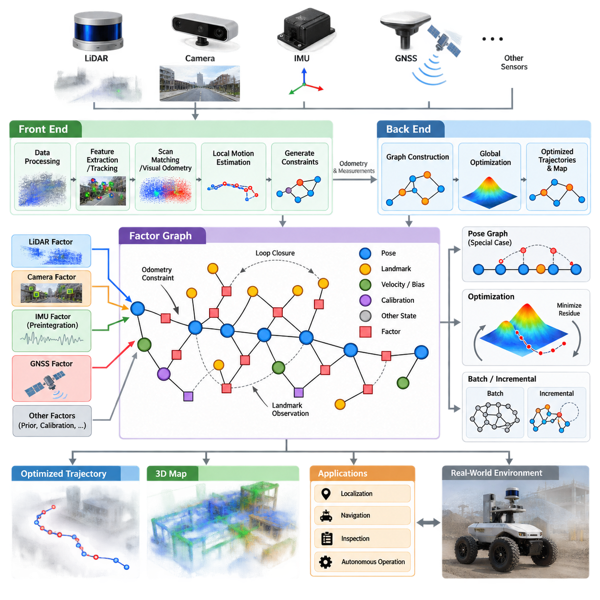
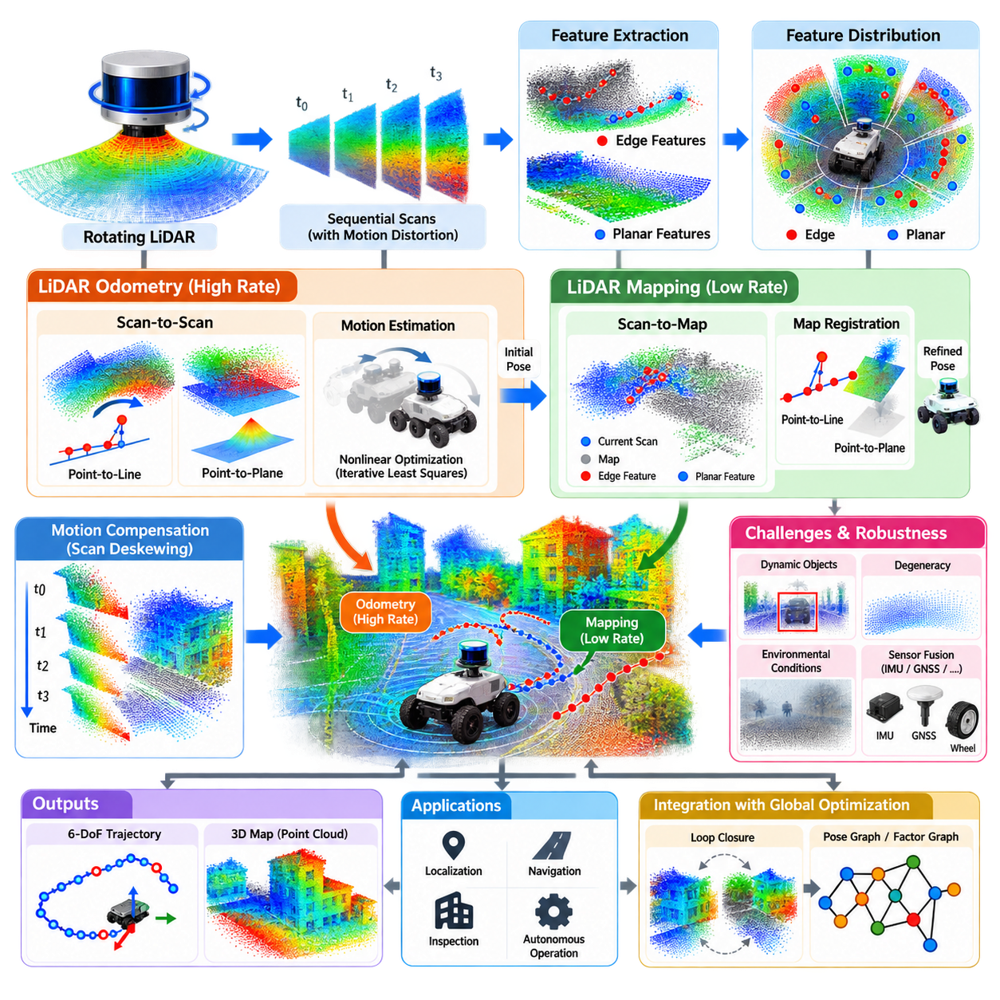
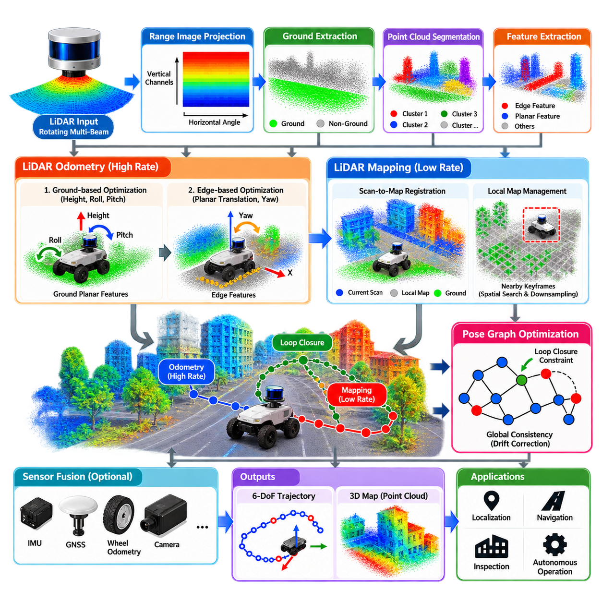
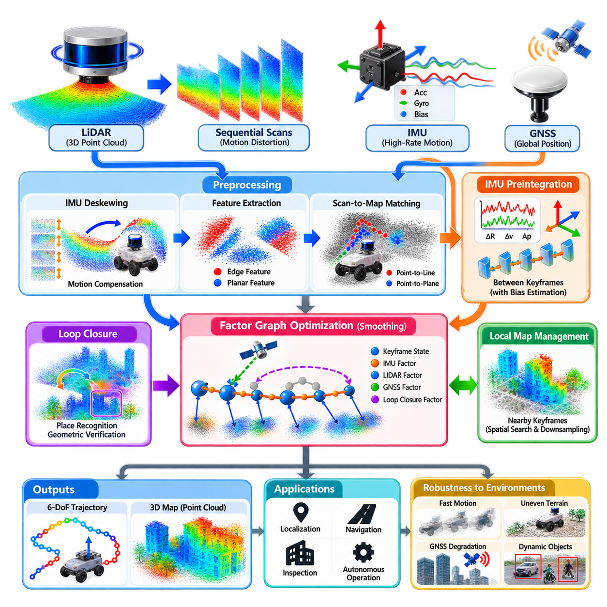
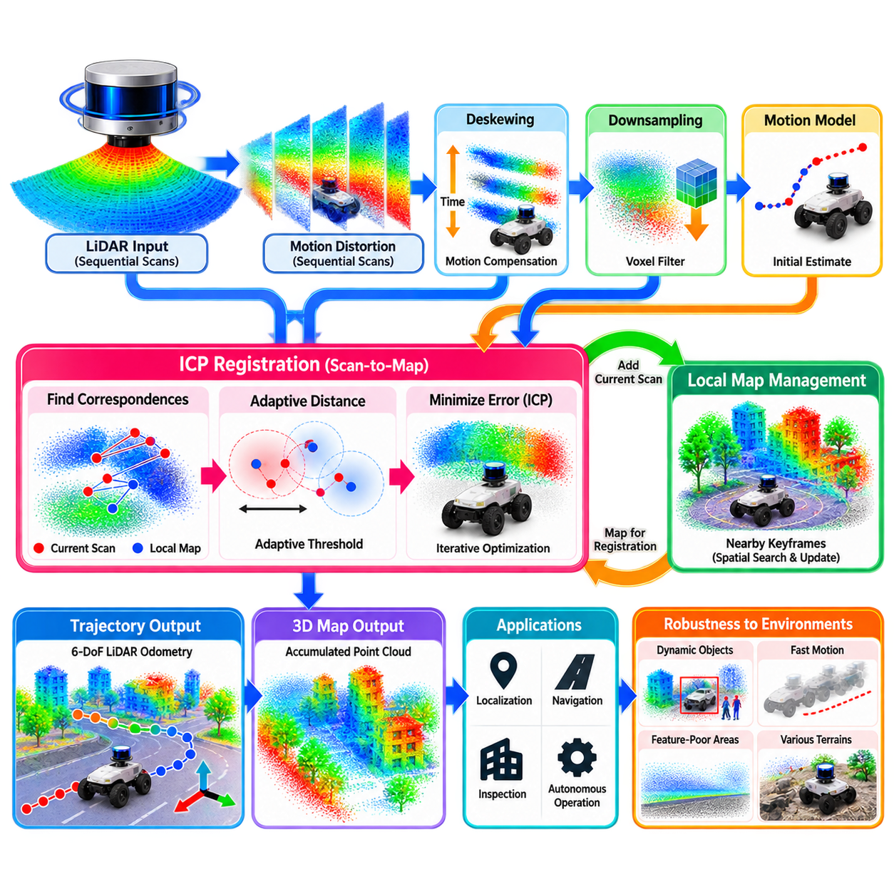
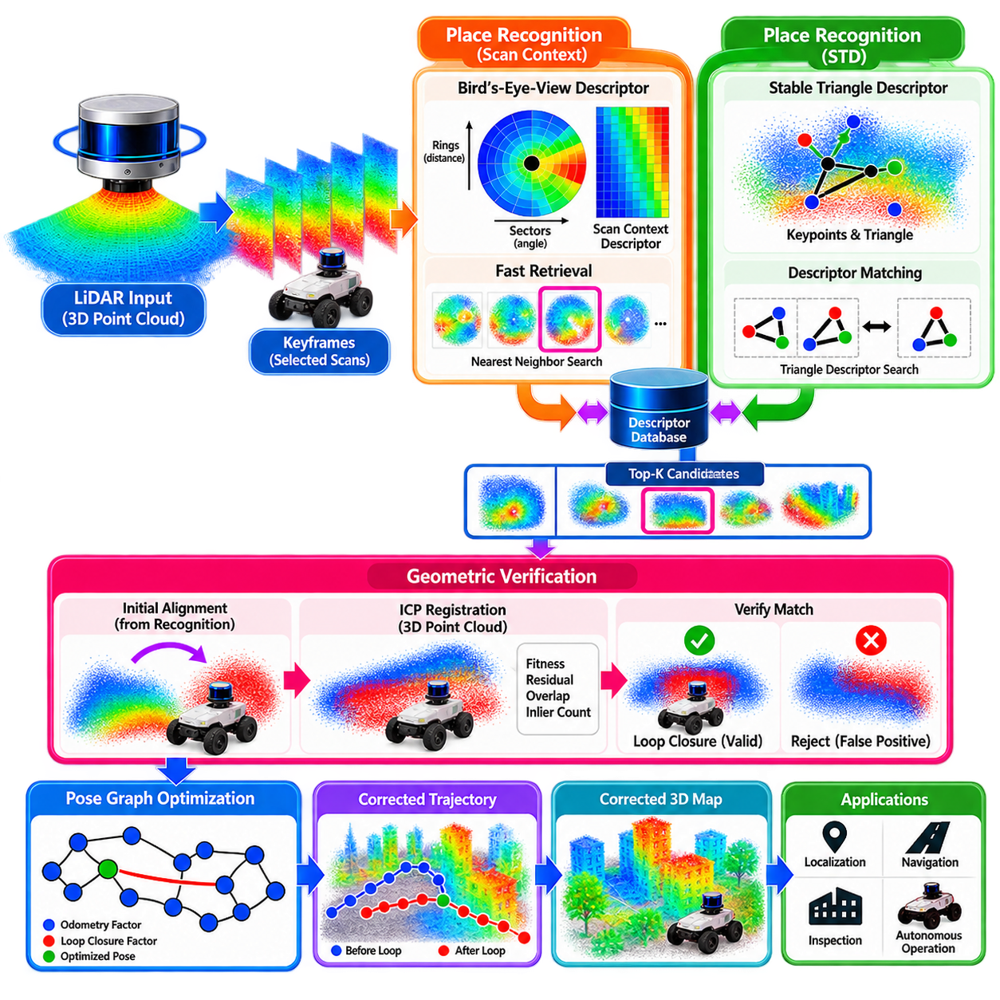
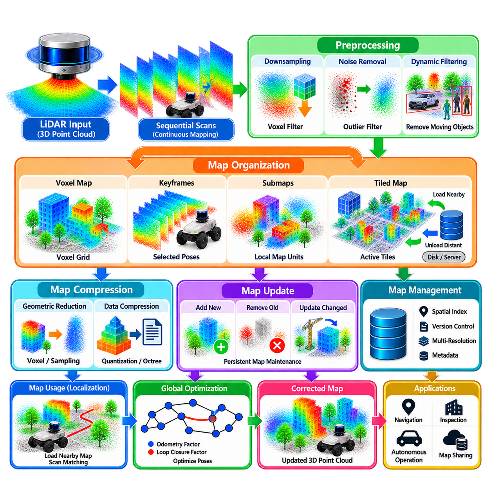
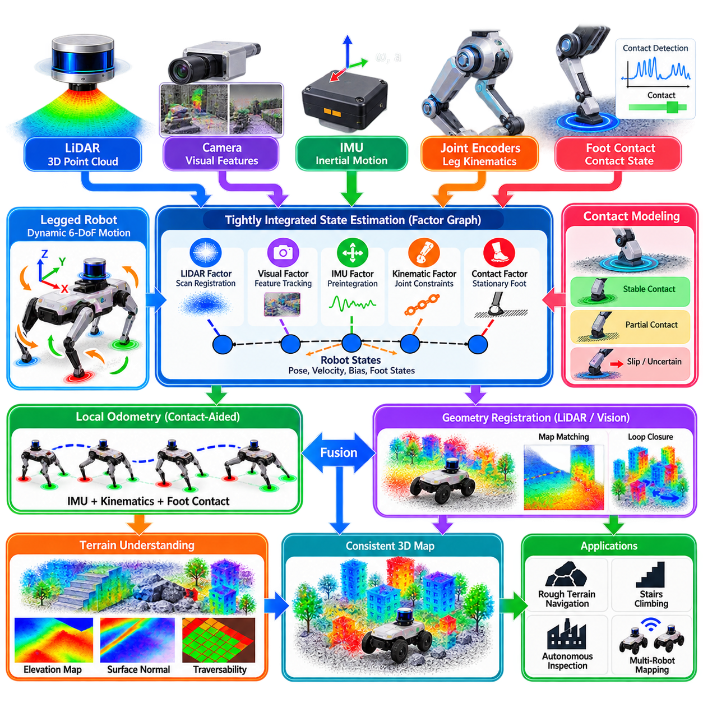
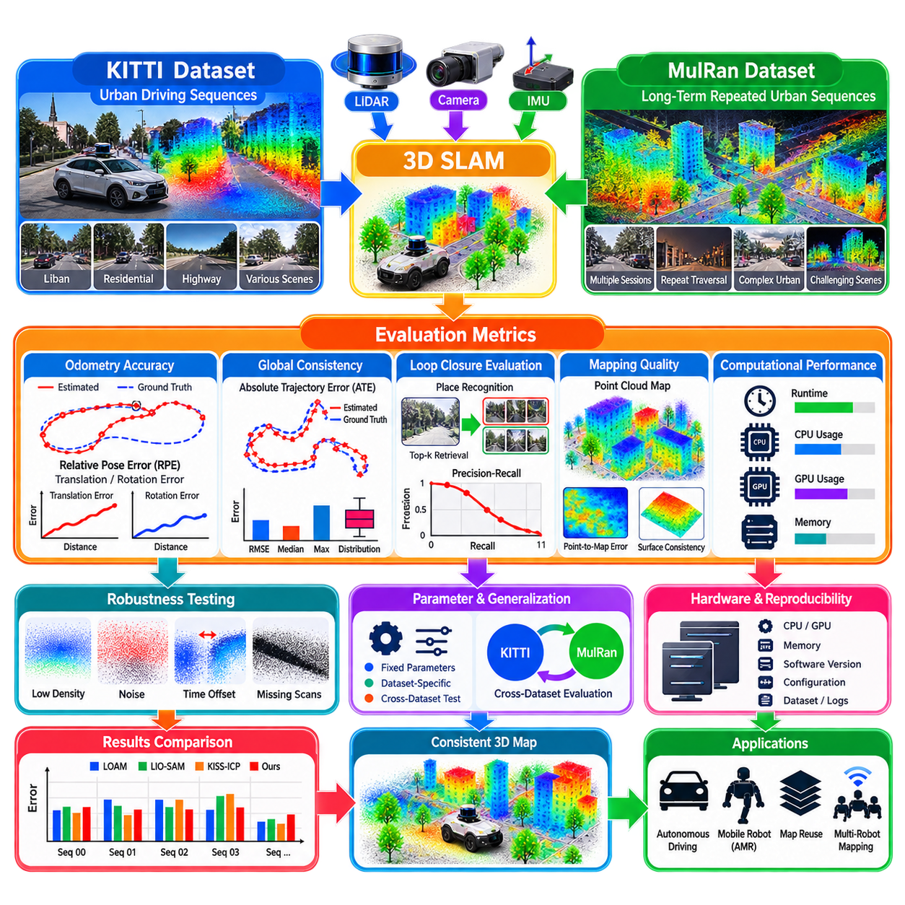
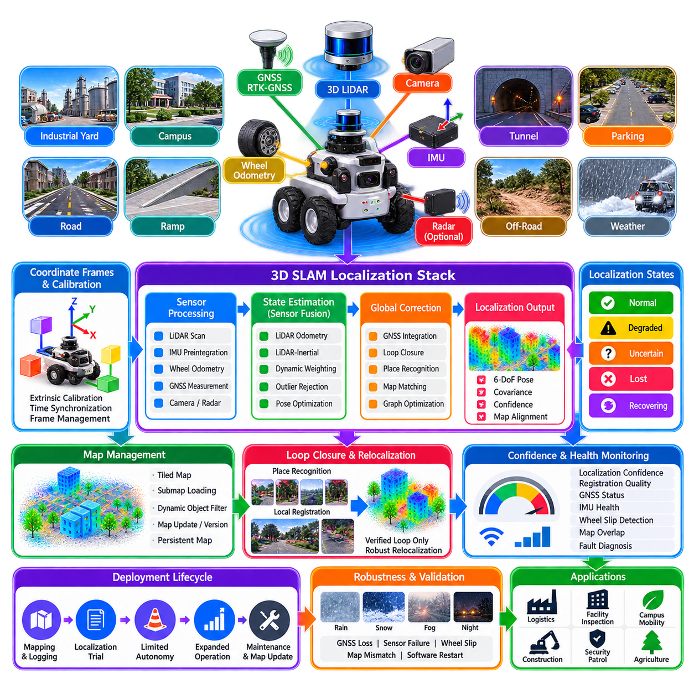

**Volume 13. Mapping Localization and SLAM**


# Chapter 04. 3D SLAM

##  

## 04.01. 3D SLAM Architectures Pose Graph Factor Graph

{width="7.268055555555556in" height="7.268055555555556in"}

Three-dimensional simultaneous localization and mapping extends the SLAM problem from planar motion into environments where position, orientation, and geometry must be estimated in full 3D space. A typical 3D SLAM architecture continuously estimates the six-degree-of-freedom pose of a robot while constructing a spatial representation from LiDAR, cameras, depth sensors, inertial measurements, or combinations of these sensing modalities.

Most practical 3D SLAM systems separate computation into a front end and a back end. The front end processes incoming sensor measurements, extracts geometric or visual information, estimates short-term relative motion, and generates constraints between robot states. The back end collects these constraints over longer trajectories and performs global optimization to obtain a mutually consistent estimate of robot poses, landmarks, and sometimes calibration parameters.

The front end commonly performs scan matching, visual feature tracking, visual-inertial odometry, LiDAR-inertial odometry, or direct image alignment. Its primary objective is not necessarily to produce a globally correct trajectory, but to generate reliable local motion estimates and observations. Errors inevitably accumulate through noise, imperfect correspondence, dynamic objects, vibration, and environmental ambiguity, producing drift that must later be corrected.

A pose graph provides one of the most widely used representations for correcting this accumulated drift. Each node in the graph represents a robot pose at a particular time, keyframe, or selected spatial location. Edges encode relative transformations or constraints between pairs of poses. Consecutive nodes are normally connected by odometry constraints, while nonconsecutive nodes can become connected when the system detects that the robot has revisited a previously observed location.

In three dimensions, a pose is normally represented as an element of the rigid-body transformation group SE(3), combining translation in three axes with rotation in three dimensions. Relative measurements therefore constrain transformations between SE(3) states rather than simple planar coordinates. Optimization must respect this nonlinear geometry, particularly because rotations cannot generally be manipulated correctly as ordinary Euclidean vectors over large orientation changes.

Loop closure is a critical mechanism in pose-graph SLAM. When a robot returns to a previously visited area, place recognition proposes a potential correspondence and geometric verification determines whether the observation is consistent with the existing map. A validated loop closure creates an additional graph edge connecting distant portions of the trajectory, allowing accumulated localization drift to be redistributed through global optimization.

Pose-graph optimization typically minimizes the disagreement between predicted relative transformations and measured constraints. Each edge contributes a residual describing how strongly the current pose estimates violate its measurement. An information matrix or covariance model represents measurement confidence. Nonlinear least-squares algorithms iteratively modify the graph states until the weighted collection of residuals reaches a locally consistent solution.

The factor graph generalizes this representation by explicitly separating unknown variables from measurement or model constraints. Variable nodes may represent robot poses, velocities, landmarks, IMU biases, sensor extrinsics, calibration parameters, or other latent states. Factor nodes represent probabilistic relationships generated by odometry, inertial measurements, visual observations, LiDAR registration, GNSS, loop closures, priors, and additional sources of information.

This separation makes factor graphs particularly suitable for multi-sensor 3D SLAM. A LiDAR factor can constrain relative geometry between scans, an IMU factor can constrain motion across high-rate measurements, a camera factor can relate poses to visual landmarks, and a GNSS factor can anchor selected states to a global coordinate system. These heterogeneous observations can coexist within one probabilistic estimation framework without requiring every sensor to operate at the same rate.

From a probabilistic perspective, factor-graph SLAM seeks the state configuration that maximizes the posterior probability conditioned on available measurements. Under commonly used Gaussian noise assumptions, maximum a posteriori estimation can be transformed into a nonlinear weighted least-squares problem. This connection allows probabilistic sensor models and numerical optimization techniques to be integrated within a common mathematical formulation.

IMU preintegration is especially important in modern 3D factor-graph architectures. Instead of introducing every high-frequency inertial sample as a separate state transition, many IMU measurements collected between selected keyframes are summarized into a compact relative-motion constraint. Preintegration preserves essential inertial information while reducing computational complexity and permits accelerometer and gyroscope bias states to be estimated together with trajectory variables.

The distinction between a pose graph and a factor graph is therefore mainly one of modeling scope rather than completely different SLAM philosophies. A pose graph focuses primarily on relationships among poses and can itself be interpreted as a specialized factor graph. A more general factor graph exposes additional variables and sensor relationships, enabling tightly coupled estimation architectures in which motion, calibration, landmarks, biases, and global references are jointly optimized.

Optimization can be performed in batch or incrementally. Batch optimization periodically solves a large portion of the accumulated graph and can provide strong global consistency, but its computational requirements increase as the trajectory grows. Incremental methods update only affected portions of the estimation problem when new measurements arrive, making them attractive for long-duration robots that must maintain localization and mapping continuously.

Graph sparsity is fundamental to computational scalability. Although a robot may operate for hours and accumulate enormous numbers of raw sensor measurements, individual factors normally involve only a small subset of state variables. This local dependency creates sparse linear systems during optimization. Efficient sparse matrix techniques, variable ordering strategies, marginalization, and incremental inference exploit this structure to make large-scale SLAM computationally practical.

Keyframe selection further controls graph growth. Rather than adding a state for every camera frame or LiDAR scan, the system creates nodes only when sufficient translation, rotation, elapsed time, information gain, or environmental change has occurred. Intermediate measurements may contribute to odometry or preintegrated constraints without becoming permanent graph states. This reduces memory consumption while retaining information necessary for accurate trajectory estimation.

Robust estimation is required because graph optimization can be severely damaged by incorrect constraints. False loop closures are particularly dangerous because they may force geographically unrelated regions into artificial alignment. Robust loss functions, switchable constraints, consistency tests, geometric verification, and outlier rejection can reduce the influence of erroneous measurements before or during optimization and improve reliability in repetitive industrial environments.

The optimized trajectory is only one component of a complete 3D SLAM system. Dense point clouds, voxel maps, surfel representations, signed-distance fields, occupancy structures, or semantic maps are often maintained separately from the optimization graph. After pose estimates are corrected, sensor observations can be transformed using the updated trajectory so that the geometric map becomes globally aligned rather than preserving accumulated odometric distortion.

This architectural separation is valuable for autonomous mobile robots because localization, optimization, and map representation have different computational requirements. High-rate local odometry must respond rapidly enough for motion control, whereas global graph optimization can operate at a lower frequency. Dense mapping may consume substantial GPU or memory resources, while the navigation stack may require only a compact representation derived from the optimized 3D map.

Industrial outdoor robots add further constraints to the architecture. Uneven terrain produces significant roll, pitch, and vertical motion, making planar assumptions inadequate. LiDAR and cameras may suffer from dust, rain, illumination changes, vibration, or repetitive structures, while GNSS can alternate between centimeter-level RTK accuracy and complete unavailability. Factor graphs allow these changing information sources to be fused according to availability and uncertainty.

A robust 3D SLAM architecture therefore behaves as a hierarchy of complementary estimation processes. Fast local estimation maintains continuous motion tracking, graph construction preserves relationships accumulated over time, loop closure introduces long-range corrections, and nonlinear optimization enforces global consistency. The resulting trajectory supports reconstruction of a spatially coherent map that can be reused for localization, navigation, inspection, and autonomous operation.

For long-term Physical AI and autonomous robotic systems, the graph can also become an interface between geometric perception and higher-level reasoning. Optimized poses provide stable spatial references for semantic objects, traversability observations, inspection results, and environmental changes. As robots revisit the same environment, graph-based estimation can support persistent maps in which geometry, localization confidence, temporal information, and task-related knowledge remain spatially associated.

Pose graphs and factor graphs consequently form a central mathematical and architectural foundation of modern 3D SLAM. They transform streams of uncertain local observations into a structured global estimation problem, provide mechanisms for correcting accumulated drift, and support systematic fusion of heterogeneous sensors. Their modularity and sparsity make them suitable for systems ranging from compact AMRs to large outdoor autonomous platforms operating over extensive environments.

3차원 동시적 위치추정 및 지도작성(3D Simultaneous Localization and Mapping, 3D SLAM)은 평면 운동을 대상으로 하는 SLAM 문제를 위치(Position), 자세(Orientation), 기하 구조(Geometry)를 완전한 3차원 공간에서 추정해야 하는 환경으로 확장한다. 일반적인 3D SLAM 아키텍처(Architecture)는 라이다(LiDAR), 카메라(Camera), 깊이 센서(Depth Sensor), 관성 측정(Inertial Measurement) 또는 이들을 조합한 센서로 공간 표현(Spatial Representation)을 구축하면서 로봇의 6자유도 자세(Six-Degree-of-Freedom Pose)를 지속적으로 추정한다.

대부분의 실용적인 3D SLAM 시스템은 연산 과정을 프런트엔드(Front End)와 백엔드(Back End)로 구분한다. 프런트엔드는 입력되는 센서 측정값을 처리하고 기하학적 또는 시각적 정보를 추출하며 단기 상대 운동(Relative Motion)을 추정하여 로봇 상태 사이의 제약조건(Constraint)을 생성한다. 백엔드는 장시간의 궤적(Trajectory)에 걸쳐 이러한 제약조건을 수집하고 전역 최적화(Global Optimization)를 수행하여 로봇 자세, 랜드마크(Landmark), 경우에 따라 보정 매개변수(Calibration Parameter)에 대해 상호 일관된 추정값을 얻는다.

프런트엔드는 일반적으로 스캔 정합(Scan Matching), 시각 특징 추적(Visual Feature Tracking), 시각-관성 오도메트리(Visual-Inertial Odometry), 라이다-관성 오도메트리(LiDAR-Inertial Odometry), 직접 영상 정렬(Direct Image Alignment)을 수행한다. 주요 목적은 반드시 전역적으로 정확한 궤적을 생성하는 것이 아니라 신뢰할 수 있는 국부 운동 추정(Local Motion Estimation)과 관측값을 생성하는 것이다. 잡음, 불완전한 대응 관계, 동적 객체, 진동, 환경적 모호성으로 인해 오차가 필연적으로 누적되며, 이는 이후 보정해야 하는 드리프트(Drift)를 발생시킨다.

포즈 그래프(Pose Graph)는 누적된 드리프트를 보정하기 위해 가장 널리 사용되는 표현 방식 중 하나이다. 그래프의 각 노드(Node)는 특정 시간, 키프레임(Keyframe), 또는 선택된 공간 위치에서의 로봇 자세를 나타낸다. 에지(Edge)는 자세 쌍 사이의 상대 변환(Relative Transformation) 또는 제약조건을 표현한다. 연속된 노드는 일반적으로 오도메트리 제약조건(Odometry Constraint)으로 연결되며, 로봇이 이전에 관측한 위치를 다시 방문한 것으로 판단되면 서로 연속되지 않은 노드 사이에도 연결이 생성될 수 있다.

3차원에서 자세(Pose)는 일반적으로 3축 방향의 병진(Translation)과 3차원 회전(Rotation)을 결합한 강체 변환군(Rigid-Body Transformation Group) SE(3)의 원소로 표현된다. 따라서 상대 측정값은 단순한 평면 좌표가 아니라 SE(3) 상태 사이의 변환을 제약한다. 특히 큰 자세 변화가 발생하는 경우 회전을 일반적인 유클리드 벡터(Euclidean Vector)처럼 처리할 수 없기 때문에 최적화 과정에서는 이러한 비선형 기하 구조(Nonlinear Geometry)를 올바르게 고려해야 한다.

루프 폐쇄(Loop Closure)는 포즈 그래프 SLAM(Pose-Graph SLAM)의 핵심 메커니즘이다. 로봇이 이전에 방문했던 영역으로 돌아오면 장소 인식(Place Recognition)이 잠재적인 대응 위치를 제안하고, 기하 검증(Geometric Verification)을 통해 해당 관측이 기존 지도와 일관되는지를 판단한다. 검증된 루프 폐쇄는 궤적에서 멀리 떨어진 부분을 연결하는 추가 그래프 에지를 생성하며, 이를 통해 누적된 위치추정 드리프트를 전역 최적화 과정에서 전체 궤적에 걸쳐 재분배하고 보정할 수 있다.

포즈 그래프 최적화(Pose-Graph Optimization)는 일반적으로 예측된 상대 변환과 측정된 제약조건 사이의 불일치를 최소화한다. 각 에지는 현재 자세 추정값이 해당 측정값을 얼마나 위반하는지를 나타내는 잔차(Residual)를 생성한다. 정보 행렬(Information Matrix) 또는 공분산 모델(Covariance Model)은 측정값의 신뢰도를 표현한다. 비선형 최소제곱(Nonlinear Least-Squares) 알고리즘은 가중된 잔차들의 집합이 국부적으로 일관된 해에 도달할 때까지 그래프 상태를 반복적으로 수정한다.

팩터 그래프(Factor Graph)는 미지의 변수(Unknown Variable)와 측정 또는 모델 제약조건을 명시적으로 분리함으로써 이러한 표현을 일반화한다. 변수 노드(Variable Node)는 로봇 자세, 속도, 랜드마크, 관성측정장치 편향(IMU Bias), 센서 외부 보정값(Sensor Extrinsics), 보정 매개변수 또는 기타 잠재 상태(Latent State)를 표현할 수 있다. 팩터 노드(Factor Node)는 오도메트리, 관성 측정, 시각 관측, 라이다 정합, 위성항법시스템(GNSS), 루프 폐쇄, 사전정보(Prior) 및 기타 정보원으로 생성되는 확률적 관계를 표현한다.

이러한 분리 구조는 팩터 그래프를 다중 센서 3D SLAM(Multi-Sensor 3D SLAM)에 특히 적합하게 만든다. 라이다 팩터(LiDAR Factor)는 스캔 사이의 상대 기하 구조를 제약할 수 있고, 관성측정장치 팩터(IMU Factor)는 고속 측정값을 이용해 운동을 제약할 수 있다. 카메라 팩터(Camera Factor)는 자세와 시각 랜드마크 사이의 관계를 설정하며, GNSS 팩터(GNSS Factor)는 선택된 상태를 전역 좌표계(Global Coordinate System)에 고정할 수 있다. 서로 다른 센서가 동일한 주기로 작동하지 않더라도 이러한 이질적인 관측값을 하나의 확률적 추정 프레임워크(Probabilistic Estimation Framework)에서 통합할 수 있다.

확률론적 관점에서 팩터 그래프 SLAM(Factor-Graph SLAM)은 사용 가능한 측정값을 조건으로 사후 확률(Posterior Probability)을 최대화하는 상태 구성을 찾는다. 일반적으로 사용되는 가우시안 잡음(Gaussian Noise) 가정에서는 최대 사후 확률 추정(Maximum A Posteriori Estimation, MAP Estimation)을 비선형 가중 최소제곱 문제(Nonlinear Weighted Least-Squares Problem)로 변환할 수 있다. 이러한 관계를 통해 확률적 센서 모델과 수치 최적화(Numerical Optimization) 기법을 공통된 수학적 구조 안에서 통합할 수 있다.

관성측정장치 사전적분(IMU Preintegration)은 현대적인 3D 팩터 그래프 아키텍처에서 특히 중요하다. 모든 고주파 관성 샘플을 각각 별도의 상태 전이(State Transition)로 추가하는 대신, 선택된 키프레임 사이에서 수집된 다수의 IMU 측정값을 압축된 상대 운동 제약조건으로 요약한다. 사전적분은 핵심 관성 정보를 유지하면서 계산 복잡도를 감소시키며, 가속도계(Accelerometer)와 자이로스코프(Gyroscope)의 편향 상태를 궤적 변수와 함께 추정할 수 있도록 한다.

따라서 포즈 그래프와 팩터 그래프의 차이는 완전히 다른 SLAM 철학이라기보다 주로 모델링 범위(Modeling Scope)의 차이이다. 포즈 그래프는 주로 자세 사이의 관계에 집중하며, 그 자체를 특수화된 팩터 그래프로 해석할 수 있다. 보다 일반적인 팩터 그래프는 추가적인 변수와 센서 관계를 명시적으로 표현함으로써 운동, 보정, 랜드마크, 편향, 전역 기준 정보를 공동으로 최적화하는 강결합 추정 아키텍처(Tightly Coupled Estimation Architecture)를 구현할 수 있다.

최적화(Optimization)는 일괄 방식(Batch) 또는 증분 방식(Incremental)으로 수행할 수 있다. 일괄 최적화(Batch Optimization)는 누적된 그래프의 상당 부분을 주기적으로 한 번에 해결하여 높은 전역 일관성(Global Consistency)을 제공할 수 있지만, 궤적이 증가함에 따라 계산 요구량도 증가한다. 증분 방식(Incremental Method)은 새로운 측정값이 추가될 때 영향을 받는 추정 문제의 일부만 갱신하므로 장시간 지속적으로 위치추정과 지도작성을 수행해야 하는 로봇에 적합하다.

그래프 희소성(Graph Sparsity)은 계산 확장성(Computational Scalability)을 확보하는 데 핵심적인 요소이다. 로봇이 수 시간 동안 작동하면서 방대한 양의 원시 센서 측정값을 축적하더라도 개별 팩터는 일반적으로 소수의 상태 변수에만 연결된다. 이러한 국부적 의존 관계(Local Dependency)는 최적화 과정에서 희소 선형 시스템(Sparse Linear System)을 형성한다. 효율적인 희소 행렬(Sparse Matrix) 기법, 변수 순서화(Variable Ordering), 주변화(Marginalization), 증분 추론(Incremental Inference)은 이러한 구조를 활용하여 대규모 SLAM을 계산적으로 실용화한다.

키프레임 선택(Keyframe Selection)은 그래프의 증가를 추가적으로 제어한다. 모든 카메라 프레임이나 라이다 스캔에 대해 상태를 추가하는 대신, 충분한 병진 이동, 회전, 경과 시간, 정보 이득(Information Gain), 또는 환경 변화가 발생했을 때만 노드를 생성한다. 중간 측정값은 영구적인 그래프 상태가 되지 않으면서 오도메트리 또는 사전적분 제약조건에 기여할 수 있다. 이를 통해 정확한 궤적 추정에 필요한 정보를 유지하면서 메모리 소비를 감소시킨다.

강건 추정(Robust Estimation)이 필요한 이유는 잘못된 제약조건이 그래프 최적화를 심각하게 손상시킬 수 있기 때문이다. 특히 잘못된 루프 폐쇄(False Loop Closure)는 실제로 서로 다른 공간 영역을 인위적으로 정렬하도록 강제할 수 있어 매우 위험하다. 강건 손실 함수(Robust Loss Function), 전환 가능 제약조건(Switchable Constraint), 일관성 검사(Consistency Test), 기하 검증, 이상치 제거(Outlier Rejection)는 최적화 전후에 잘못된 측정값의 영향을 감소시키고 반복적인 구조를 가진 산업 환경에서 신뢰성을 향상시킨다.

최적화된 궤적은 완전한 3D SLAM 시스템을 구성하는 요소 중 하나일 뿐이다. 밀집 포인트 클라우드(Dense Point Cloud), 복셀 지도(Voxel Map), 서펠 표현(Surfel Representation), 부호 거리장(Signed-Distance Field), 점유 구조(Occupancy Structure), 의미론적 지도(Semantic Map)는 최적화 그래프와 별도로 유지되는 경우가 많다. 자세 추정값이 보정된 이후 센서 관측값을 갱신된 궤적에 따라 다시 변환하면 누적된 오도메트리 왜곡을 유지하지 않고 전역적으로 정렬된 기하 지도를 구성할 수 있다.

이러한 아키텍처 분리는 위치추정(Localization), 최적화, 지도 표현(Map Representation)이 서로 다른 계산 요구사항을 가지기 때문에 자율이동로봇(Autonomous Mobile Robot, AMR)에 특히 유용하다. 고속 국부 오도메트리(High-Rate Local Odometry)는 모션 제어(Motion Control)에 충분히 빠르게 응답해야 하지만, 전역 그래프 최적화는 상대적으로 낮은 주기로 수행될 수 있다. 밀집 지도작성(Dense Mapping)은 상당한 GPU 또는 메모리 자원을 소비할 수 있는 반면, 내비게이션 스택(Navigation Stack)은 최적화된 3D 지도에서 파생된 압축 표현만 사용할 수도 있다.

산업용 야외 로봇(Industrial Outdoor Robot)은 아키텍처에 추가적인 제약조건을 요구한다. 불규칙한 지형은 상당한 롤(Roll), 피치(Pitch), 수직 운동을 발생시키므로 평면 가정만으로는 충분하지 않다. 라이다와 카메라는 먼지, 비, 조명 변화, 진동 또는 반복적인 구조의 영향을 받을 수 있으며, GNSS는 센티미터 수준의 실시간 이동측위(RTK) 정확도와 완전한 신호 단절 상태 사이를 오갈 수 있다. 팩터 그래프는 이러한 정보원의 가용성과 불확실성(Uncertainty)에 따라 다양한 센서 정보를 융합할 수 있도록 한다.

따라서 강건한 3D SLAM 아키텍처는 상호 보완적인 추정 과정이 계층적으로 결합된 구조로 동작한다. 빠른 국부 추정(Local Estimation)은 연속적인 운동 추적을 유지하고, 그래프 구성(Graph Construction)은 시간에 따라 축적되는 관계를 보존하며, 루프 폐쇄는 장거리 보정(Long-Range Correction)을 제공하고, 비선형 최적화(Nonlinear Optimization)는 전역 일관성을 확보한다. 이렇게 생성된 궤적은 위치추정, 내비게이션, 검사(Inspection), 자율 운용에 재사용할 수 있는 공간적으로 일관된 지도의 구축을 지원한다.

장기적으로 운용되는 피지컬 인공지능(Physical AI) 및 자율 로봇 시스템에서 그래프는 기하학적 인지(Geometric Perception)와 상위 수준 추론(Higher-Level Reasoning)을 연결하는 인터페이스로 확장될 수 있다. 최적화된 자세는 의미론적 객체(Semantic Object), 주행 가능성 관측(Traversability Observation), 검사 결과, 환경 변화에 안정적인 공간 기준을 제공한다. 로봇이 동일한 환경을 반복적으로 방문하면 그래프 기반 추정(Graph-Based Estimation)을 통해 기하 구조, 위치추정 신뢰도, 시간 정보, 작업 관련 지식이 공간적으로 연결된 지속형 지도(Persistent Map)를 구축할 수 있다.

결과적으로 포즈 그래프(Pose Graph)와 팩터 그래프(Factor Graph)는 현대 3D SLAM의 핵심적인 수학적·아키텍처적 기반을 구성한다. 이들은 불확실한 국부 관측의 연속적인 흐름을 구조화된 전역 추정 문제(Global Estimation Problem)로 변환하고, 누적된 드리프트를 보정하는 메커니즘을 제공하며, 이질적인 센서의 체계적인 융합을 지원한다. 또한 모듈성(Modularity)과 희소성(Sparsity)을 바탕으로 소형 AMR부터 광범위한 환경에서 운용되는 대형 야외 자율 플랫폼까지 다양한 시스템에 적용할 수 있다.

##  

## 04.02. LOAM LiDAR Odometry and Mapping Principles [w/Code]

{width="7.268055555555556in" height="7.268055555555556in"}

LOAM, or LiDAR Odometry and Mapping, is a foundational approach to three-dimensional localization and mapping using sequential LiDAR scans. Its central idea is to divide motion estimation and environmental mapping into complementary processes operating at different frequencies. Instead of solving every localization and mapping problem simultaneously, LOAM separates fast short-term pose tracking from slower, more accurate map refinement.

A rotating 3D LiDAR measures ranges while the sensor and robot are moving, producing a point cloud distributed across a scan period rather than captured at one instantaneous moment. Consequently, raw measurements contain motion-induced distortion. LOAM must interpret points according to their acquisition time and estimated sensor motion so that geometric structures in successive scans can be compared consistently.

The original LOAM architecture contains two principal estimation threads: LiDAR odometry and LiDAR mapping. The odometry process operates at a relatively high rate and estimates motion between consecutive scans. The mapping process runs at a lower rate and registers accumulated observations against a persistent map. This division allows rapid pose updates for robot motion while reserving more computationally expensive optimization for improving global geometric consistency.

LOAM does not normally use every LiDAR point equally during motion estimation. Instead, it extracts geometric features according to local surface characteristics. Points located on sharp structural changes are classified as edge-like features, while points belonging to locally smooth surfaces become planar features. Points with unreliable geometry, occlusion effects, or insufficient information can be rejected or assigned lower importance.

Feature extraction is commonly based on a local smoothness or curvature measure calculated from neighboring LiDAR points. A point whose neighborhood changes sharply may represent an edge or corner feature, whereas a region with small geometric variation may represent a planar surface. Selecting informative points substantially reduces the number of correspondences required for optimization while preserving the geometric constraints needed to estimate six-degree-of-freedom motion.

The scan is typically divided into spatial or angular regions before feature selection. This prevents a small highly structured portion of the environment from dominating the optimization. Edge and planar features can therefore be distributed across different viewing directions. Such spatial diversity improves observability because translation and rotation are constrained more effectively when measurements originate from multiple geometrically distinct regions.

LiDAR odometry estimates the relative transformation between the current scan and the preceding scan or a nearby reference. For an edge feature in the current scan, the algorithm searches for corresponding edge points that define a line in the reference data. The pose is adjusted to minimize the point-to-line distance. Multiple line constraints collectively restrict the relative translation and rotation of the LiDAR.

Planar features provide a complementary geometric constraint. A planar point from the current scan is associated with suitable neighboring points defining a local plane in the reference scan. The optimization minimizes the point-to-plane distance between the transformed feature and this plane. Combining point-to-line and point-to-plane residuals gives the estimator strong geometric information without requiring exact point-to-point correspondence.

The resulting motion estimation is formulated as a nonlinear optimization problem over the LiDAR pose. Starting from an initial transformation estimate, the algorithm repeatedly transforms current features, establishes or updates correspondences, computes geometric residuals, and modifies the pose to reduce those residuals. Iterative least-squares methods provide an efficient mechanism for obtaining a locally consistent relative transformation.

Motion distortion is particularly important for spinning LiDAR sensors because a complete scan can require tens of milliseconds or longer. During that interval, a moving robot changes position and orientation, so points measured near the beginning and end of the scan belong to different sensor poses. LOAM compensates for this effect by using estimated motion to transform measurements toward a common temporal reference, often described as scan deskewing.

After the high-rate odometry process generates an approximate pose, the mapping process refines it using a larger collection of previously accumulated map features. Current edge and planar features are transformed into the map coordinate frame and matched against nearby map structures. Registration against this broader spatial context reduces the short-term drift that would otherwise accumulate from repeatedly matching only consecutive scans.

Map-based registration follows geometric principles similar to odometry but uses richer reference information. Edge features are constrained against line structures estimated from neighboring map points, while planar features are constrained against locally fitted map surfaces. Because the reference map combines observations from multiple scans, its geometric structures are generally more stable than those available from a single preceding scan.

The mapping process does not necessarily optimize the entire historical point cloud. Practical implementations maintain a local map surrounding the current robot position and retrieve only spatially relevant features. Spatial indexing structures such as voxel partitions or tree-based nearest-neighbor searches can accelerate correspondence discovery. This strategy bounds computational cost as the robot explores progressively larger environments.

LOAM\'s dual-rate architecture represents an important engineering compromise. High-frequency odometry provides sufficiently rapid state estimates for navigation and control, while lower-frequency mapping performs more expensive geometric registration. The system therefore avoids requiring full map optimization for every incoming scan. This principle influenced many later LiDAR SLAM systems designed for real-time operation on mobile computing platforms.

The accuracy of LOAM depends strongly on environmental geometry. Buildings, poles, walls, curbs, machinery, and other structured objects provide useful edge and surface constraints. In contrast, long corridors, tunnels, open fields, or environments dominated by a single plane may not constrain every degree of freedom adequately. Such conditions can create geometric degeneracy in which different robot motions produce similar LiDAR observations.

Degeneracy can be understood through the observability of the optimization problem. If the measured geometry does not provide independent constraints along a particular translation or rotation direction, the corresponding state becomes weakly observable. Modern descendants of LOAM may analyze the optimization structure, incorporate inertial sensing, or reject unreliable updates to reduce the effects of such geometrically underconstrained situations.

Dynamic objects introduce another challenge. Vehicles, pedestrians, machinery, vegetation, and other moving structures can produce feature correspondences that violate the static-world assumption used by geometric registration. Feature filtering, temporal consistency analysis, semantic segmentation, or robust loss functions can reduce their influence. Reliable outdoor deployment therefore requires distinguishing persistent environmental geometry from transient observations whenever possible.

Pure LOAM primarily derives motion from LiDAR geometry and therefore differs from tightly coupled LiDAR-inertial systems. Adding an IMU provides high-rate angular velocity and acceleration information that can improve initialization, deskewing, and motion estimation during rapid movement or geometrically weak observations. This extension has led to numerous LiDAR-inertial odometry and mapping architectures inspired by the original LOAM decomposition.

Loop closure is another capability that is not the central mechanism of basic LOAM. Local scan-to-map registration can greatly reduce drift, but small errors may still accumulate during long trajectories. Extended systems therefore combine LOAM-style front-end estimation with place recognition, loop-closure detection, pose graphs, or factor graphs. Global optimization can then distribute correction across previously estimated poses after a revisited location is recognized.

For autonomous mobile robots, the output of LOAM can provide both a continuously updated six-degree-of-freedom trajectory and a geometrically consistent 3D representation of the environment. The trajectory supports localization and motion estimation, while the accumulated point cloud can be transformed into occupancy maps, voxel structures, elevation maps, or other representations required by planning and navigation components.

Outdoor AMRs particularly benefit from full 3D LiDAR estimation because uneven terrain introduces roll, pitch, and vertical displacement that cannot be represented accurately by purely planar localization. However, vibration, dust, rain, sparse distant returns, vegetation, high vehicle velocity, and rapid rotational motion can degrade registration. Sensor mounting rigidity, timing synchronization, calibration, and motion compensation therefore become essential system-level requirements.

LOAM also illustrates a broader principle in robotic perception: computational resources should be concentrated on measurements that provide useful geometric information. Feature extraction reduces redundant point processing, odometry provides immediate local motion estimates, and mapping uses accumulated geometry for more accurate correction. This hierarchy balances latency, accuracy, memory consumption, and computational complexity in a real-time robotic system.

Modern implementations can further integrate GNSS, IMU, wheel odometry, cameras, and prior maps around a LOAM-derived LiDAR front end. LiDAR supplies strong local geometric constraints, while complementary sensors improve robustness when environmental structure becomes insufficient. These measurements may subsequently enter a factor graph or other optimization framework, creating a multi-sensor architecture capable of maintaining both local precision and global consistency.

The enduring importance of LOAM lies not only in one specific algorithm but also in its architectural decomposition. Separating high-rate LiDAR odometry from lower-rate map registration, selecting edge and planar constraints, compensating for scan motion, and refining pose through geometric optimization established a reusable framework for real-time 3D SLAM. These principles continue to influence LiDAR localization systems for indoor robots, outdoor AMRs, autonomous vehicles, inspection platforms, and other Physical AI systems.

라이다 오도메트리 및 지도작성(LiDAR Odometry and Mapping, LOAM)은 연속적인 라이다(LiDAR) 스캔을 이용하여 3차원 위치추정(Localization)과 지도작성(Mapping)을 수행하는 대표적인 접근 방식이다. 핵심 개념은 운동 추정(Motion Estimation)과 환경 지도작성(Environmental Mapping)을 서로 다른 주기로 동작하는 상호 보완적인 과정으로 분리하는 것이다. 모든 문제를 동시에 해결하는 대신 빠른 단기 자세 추적(Pose Tracking)과 상대적으로 느리지만 정확한 지도 정제(Map Refinement)를 분리한다.

회전식 3D 라이다(Rotating 3D LiDAR)는 센서와 로봇이 움직이는 동안 거리를 측정하므로 포인트 클라우드(Point Cloud)는 하나의 순간에 동시에 획득되는 것이 아니라 일정한 스캔 시간에 걸쳐 생성된다. 따라서 원시 측정값에는 운동으로 인한 왜곡(Motion-Induced Distortion)이 포함된다. LOAM은 연속 스캔의 기하 구조를 일관되게 비교하기 위해 각 포인트의 획득 시간과 추정된 센서 운동을 고려하여 측정값을 해석해야 한다.

기본적인 LOAM 아키텍처(Architecture)는 라이다 오도메트리(LiDAR Odometry)와 라이다 지도작성(LiDAR Mapping)이라는 두 가지 주요 추정 과정으로 구성된다. 오도메트리 과정은 상대적으로 높은 주기로 동작하면서 연속된 스캔 사이의 운동을 추정한다. 지도작성 과정은 낮은 주기로 동작하며 누적된 관측값을 지속적으로 유지되는 지도와 정합한다. 이러한 분리는 로봇 운동에 필요한 빠른 자세 갱신을 제공하면서 계산 비용이 높은 최적화는 전역 기하 일관성(Global Geometric Consistency)을 향상하는 데 집중하도록 한다.

LOAM은 일반적으로 운동 추정 과정에서 모든 라이다 포인트를 동일하게 사용하지 않는다. 대신 국부적인 표면 특성(Local Surface Characteristics)에 따라 기하 특징(Geometric Feature)을 추출한다. 급격한 구조 변화에 위치한 포인트는 에지 특징(Edge Feature)으로 분류되고, 국부적으로 매끄러운 표면에 속하는 포인트는 평면 특징(Planar Feature)으로 분류된다. 신뢰할 수 없는 기하 구조, 가림 현상(Occlusion), 또는 정보가 부족한 포인트는 제거하거나 낮은 중요도를 부여할 수 있다.

특징 추출(Feature Extraction)은 일반적으로 인접한 라이다 포인트를 이용해 계산한 국부 평활도(Local Smoothness) 또는 곡률(Curvature) 측정값을 기반으로 한다. 주변 영역이 급격하게 변화하는 포인트는 에지 또는 코너 특징(Corner Feature)을 나타낼 수 있으며, 기하 변화가 작은 영역은 평면을 나타낼 가능성이 높다. 정보성이 높은 포인트만 선택하면 6자유도 운동(Six-Degree-of-Freedom Motion) 추정에 필요한 기하 제약조건을 유지하면서 최적화에 필요한 대응점 수를 크게 감소시킬 수 있다.

일반적으로 특징을 선택하기 전에 스캔을 공간적 또는 각도 영역(Angular Region)으로 나눈다. 이를 통해 환경에서 구조가 복잡한 일부 영역만 최적화를 지배하는 것을 방지할 수 있다. 따라서 에지 특징과 평면 특징을 서로 다른 관측 방향에 분산하여 선택할 수 있다. 다양한 방향에서 측정된 기하 구조가 사용되면 병진(Translation)과 회전(Rotation)을 보다 효과적으로 제약할 수 있기 때문에 관측 가능성(Observability)이 향상된다.

라이다 오도메트리는 현재 스캔과 이전 스캔 또는 인접한 기준 스캔 사이의 상대 변환(Relative Transformation)을 추정한다. 현재 스캔의 에지 특징에 대해 알고리즘은 기준 데이터에서 하나의 선(Line)을 정의할 수 있는 대응 에지 포인트를 검색한다. 이후 포즈(Pose)를 조정하여 점-선 거리(Point-to-Line Distance)를 최소화한다. 여러 개의 선 제약조건(Line Constraint)이 결합되면서 라이다의 상대적인 병진과 회전을 제약한다.

평면 특징은 에지 특징을 보완하는 기하 제약조건을 제공한다. 현재 스캔의 평면 포인트는 기준 스캔에서 국부 평면(Local Plane)을 정의할 수 있는 적절한 인접 포인트들과 대응된다. 최적화 과정은 변환된 특징 포인트와 해당 평면 사이의 점-평면 거리(Point-to-Plane Distance)를 최소화한다. 점-선 잔차(Point-to-Line Residual)와 점-평면 잔차(Point-to-Plane Residual)를 결합하면 정확한 점-점 대응(Point-to-Point Correspondence)에 의존하지 않고도 강력한 기하 정보를 확보할 수 있다.

이렇게 생성된 운동 추정 문제는 라이다 포즈에 대한 비선형 최적화 문제(Nonlinear Optimization Problem)로 표현된다. 초기 변환 추정값에서 시작하여 알고리즘은 현재 특징을 반복적으로 변환하고, 대응 관계를 생성하거나 갱신하며, 기하 잔차(Geometric Residual)를 계산하고, 잔차가 감소하도록 포즈를 수정한다. 반복 최소제곱법(Iterative Least-Squares Method)은 국부적으로 일관된 상대 변환을 효율적으로 계산할 수 있는 방법을 제공한다.

운동 왜곡(Motion Distortion)은 회전식 라이다에서 특히 중요하다. 하나의 완전한 스캔을 생성하는 데 수십 밀리초 이상의 시간이 필요할 수 있기 때문이다. 이 시간 동안 움직이는 로봇의 위치와 자세가 변화하므로 스캔 시작과 종료 시점에 측정된 포인트는 서로 다른 센서 포즈에서 획득된다. LOAM은 추정된 운동을 이용하여 측정값을 공통된 시간 기준(Common Temporal Reference)으로 변환함으로써 이러한 영향을 보정하며, 이를 일반적으로 스캔 디스큐잉(Scan Deskewing)이라고 한다.

고주기 오도메트리 과정이 근사적인 포즈를 생성한 이후 지도작성 과정은 이전에 누적된 보다 넓은 범위의 지도 특징(Map Feature)을 사용하여 이를 정제한다. 현재의 에지 및 평면 특징은 지도 좌표계(Map Coordinate Frame)로 변환되고 주변 지도 구조와 정합된다. 이렇게 보다 넓은 공간적 문맥(Spatial Context)을 이용해 정합하면 연속된 스캔만 반복적으로 비교할 때 발생할 수 있는 단기 드리프트(Short-Term Drift)를 감소시킬 수 있다.

지도 기반 정합(Map-Based Registration)은 오도메트리와 유사한 기하학적 원리를 사용하지만 더 풍부한 기준 정보를 활용한다. 에지 특징은 주변 지도 포인트에서 추정된 선 구조(Line Structure)에 대해 제약되며, 평면 특징은 국부적으로 적합된 지도 표면(Map Surface)에 대해 제약된다. 기준 지도는 여러 스캔의 관측값을 결합하여 구성되므로 일반적으로 단일 이전 스캔에서 얻을 수 있는 기하 구조보다 안정적인 정보를 제공한다.

지도작성 과정에서 전체 과거 포인트 클라우드를 항상 최적화할 필요는 없다. 실제 구현에서는 현재 로봇 위치 주변의 국부 지도(Local Map)를 유지하고 공간적으로 관련된 특징만 검색한다. 복셀 분할(Voxel Partition)이나 트리 기반 최근접 이웃 탐색(Tree-Based Nearest-Neighbor Search)과 같은 공간 인덱싱 구조(Spatial Indexing Structure)를 사용하면 대응점 검색을 가속할 수 있다. 이러한 방법은 로봇이 더 넓은 환경을 탐색하더라도 계산 비용이 지속적으로 증가하는 것을 억제한다.

LOAM의 이중 주기 아키텍처(Dual-Rate Architecture)는 중요한 공학적 절충(Engineering Compromise)을 나타낸다. 고주기 오도메트리는 내비게이션(Navigation)과 제어(Control)에 필요한 빠른 상태 추정값을 제공하고, 저주기 지도작성은 계산 비용이 높은 기하 정합을 수행한다. 따라서 모든 입력 스캔마다 전체 지도 최적화를 수행할 필요가 없다. 이러한 원리는 모바일 컴퓨팅 플랫폼에서 실시간으로 동작하도록 설계된 이후의 다양한 라이다 SLAM 시스템에 큰 영향을 주었다.

LOAM의 정확도는 환경의 기하 구조(Environmental Geometry)에 크게 의존한다. 건물, 기둥, 벽, 연석, 기계 장비 및 기타 구조물은 유용한 에지와 표면 제약조건을 제공한다. 반면 긴 복도, 터널, 개방된 평지 또는 하나의 평면이 지배적인 환경에서는 모든 자유도를 충분히 제약하지 못할 수 있다. 이러한 조건에서는 서로 다른 로봇 운동이 유사한 라이다 관측값을 생성하는 기하학적 퇴화(Geometric Degeneracy)가 발생할 수 있다.

퇴화(Degeneracy)는 최적화 문제의 관측 가능성을 통해 이해할 수 있다. 측정된 기하 구조가 특정 병진 또는 회전 방향에 대해 독립적인 제약조건을 제공하지 못하면 해당 상태는 약한 관측 가능성(Weak Observability)을 갖게 된다. 현대적인 LOAM 계열 시스템은 최적화 구조를 분석하거나 관성 센싱(Inertial Sensing)을 통합하고, 신뢰성이 낮은 갱신을 제거하는 방법 등을 통해 이러한 기하학적으로 불충분한 제약 상황의 영향을 감소시킬 수 있다.

동적 객체(Dynamic Object)는 또 다른 중요한 문제를 발생시킨다. 차량, 보행자, 기계 장비, 식생(Vegetation) 및 기타 움직이는 구조는 기하 정합에서 사용하는 정적 환경 가정(Static-World Assumption)에 위배되는 특징 대응 관계를 생성할 수 있다. 특징 필터링(Feature Filtering), 시간적 일관성 분석(Temporal Consistency Analysis), 의미론적 분할(Semantic Segmentation), 강건 손실 함수(Robust Loss Function)를 이용하여 이러한 영향을 감소시킬 수 있다. 따라서 신뢰할 수 있는 야외 운용을 위해서는 지속적인 환경 구조와 일시적인 관측값을 가능한 한 구분해야 한다.

순수 LOAM(Pure LOAM)은 주로 라이다 기하 구조에서 운동을 추정하므로 강결합 라이다-관성 시스템(Tightly Coupled LiDAR-Inertial System)과 차이가 있다. 관성측정장치(Inertial Measurement Unit, IMU)를 추가하면 고주기 각속도(Angular Velocity)와 가속도(Acceleration) 정보를 제공하여 빠른 운동이나 기하 구조가 부족한 관측 조건에서 초기화(Initialization), 디스큐잉(Deskewing), 운동 추정을 향상할 수 있다. 이러한 확장은 기본 LOAM 구조에서 발전한 다양한 라이다-관성 오도메트리 및 지도작성(LiDAR-Inertial Odometry and Mapping) 아키텍처로 이어졌다.

루프 폐쇄(Loop Closure) 역시 기본 LOAM의 핵심 메커니즘은 아니다. 국부적인 스캔-지도 정합(Scan-to-Map Registration)은 드리프트를 크게 감소시킬 수 있지만 장거리 궤적에서는 작은 오차가 지속적으로 누적될 수 있다. 따라서 확장된 시스템에서는 LOAM 방식의 프런트엔드 추정(Front-End Estimation)에 장소 인식(Place Recognition), 루프 폐쇄 검출, 포즈 그래프(Pose Graph), 팩터 그래프(Factor Graph)를 결합한다. 이후 이전에 방문했던 위치가 인식되면 전역 최적화(Global Optimization)를 통해 기존에 추정된 포즈 전체에 보정량을 분배할 수 있다.

자율이동로봇(Autonomous Mobile Robot, AMR)에서 LOAM의 출력은 지속적으로 갱신되는 6자유도 궤적(Six-Degree-of-Freedom Trajectory)과 기하학적으로 일관된 3D 환경 표현을 동시에 제공할 수 있다. 궤적은 위치추정과 운동 추정을 지원하고, 누적된 포인트 클라우드는 점유 지도(Occupancy Map), 복셀 구조(Voxel Structure), 고도 지도(Elevation Map) 또는 경로 계획(Planning)과 내비게이션 구성요소에서 요구하는 다른 표현으로 변환할 수 있다.

야외 자율이동로봇(Outdoor AMR)은 불규칙한 지형에서 롤(Roll), 피치(Pitch), 수직 변위(Vertical Displacement)가 발생하기 때문에 완전한 3D 라이다 기반 추정의 이점을 크게 얻을 수 있다. 그러나 진동, 먼지, 비, 희박한 원거리 반사점, 식생, 높은 차량 속도, 급격한 회전 운동은 정합 성능을 저하시킬 수 있다. 따라서 센서 장착 강성(Sensor Mounting Rigidity), 시간 동기화(Time Synchronization), 보정(Calibration), 운동 보상(Motion Compensation)은 중요한 시스템 수준의 요구사항이 된다.

LOAM은 로봇 인지(Robotic Perception)의 보다 일반적인 원리도 보여준다. 즉 계산 자원은 유용한 기하 정보를 제공하는 측정값에 집중되어야 한다. 특징 추출은 중복된 포인트 처리를 감소시키고, 오도메트리는 즉각적인 국부 운동 추정을 제공하며, 지도작성은 누적된 기하 구조를 사용하여 더욱 정확한 보정을 수행한다. 이러한 계층 구조는 실시간 로봇 시스템에서 지연시간(Latency), 정확도(Accuracy), 메모리 사용량(Memory Consumption), 계산 복잡도(Computational Complexity) 사이의 균형을 제공한다.

현대적인 구현에서는 LOAM에서 파생된 라이다 프런트엔드(LiDAR Front End)를 중심으로 GNSS, IMU, 휠 오도메트리(Wheel Odometry), 카메라, 사전 지도(Prior Map)를 추가적으로 통합할 수 있다. 라이다는 강력한 국부 기하 제약조건을 제공하고, 보완 센서는 환경 구조가 충분하지 않은 상황에서 강건성(Robustness)을 향상한다. 이러한 측정값은 이후 팩터 그래프 또는 다른 최적화 프레임워크로 전달되어 국부 정밀도(Local Precision)와 전역 일관성을 동시에 유지할 수 있는 다중 센서 아키텍처(Multi-Sensor Architecture)를 구성할 수 있다.

LOAM의 지속적인 중요성은 특정 알고리즘 자체뿐만 아니라 그 아키텍처적 분해(Architectural Decomposition)에 있다. 고주기 라이다 오도메트리와 저주기 지도 정합을 분리하고, 에지 및 평면 제약조건을 선택하며, 스캔 운동을 보상하고, 기하 최적화를 통해 포즈를 정제하는 방식은 실시간 3D SLAM을 위한 재사용 가능한 프레임워크를 확립하였다. 이러한 원리는 실내 로봇, 야외 AMR, 자율주행차(Autonomous Vehicle), 검사 플랫폼(Inspection Platform) 및 다양한 피지컬 인공지능(Physical AI) 시스템을 위한 라이다 위치추정 기술에 계속 영향을 주고 있다.

##  

## 04.03. LeGO LOAM Lightweight Ground Vehicle SLAM [w/Code]

{width="7.268055555555556in" height="7.268055555555556in"}

LeGO-LOAM, or Lightweight and Ground-Optimized LiDAR Odometry and Mapping, is a real-time 3D SLAM framework designed primarily for ground vehicles equipped with multi-beam LiDAR. It inherits the geometric feature-based philosophy of LOAM while introducing point-cloud segmentation, explicit ground extraction, and a computationally efficient optimization structure. These modifications make it particularly suitable for mobile robots operating on roads, campuses, industrial sites, and moderately uneven outdoor terrain.

The central assumption of LeGO-LOAM is that a ground vehicle observes substantial ground structure during normal operation. Instead of treating every LiDAR return equally, the framework identifies ground points and separates them from non-ground structures before performing feature extraction. This organization reduces unnecessary computation and allows the estimator to exploit the geometric relationship between vehicle motion and the supporting terrain.

Incoming LiDAR measurements are first projected into a range image according to the sensor\'s vertical channels and horizontal scanning angles. Each pixel represents a measured range associated with a particular laser beam and azimuth direction. This structured representation preserves the neighborhood relationships of the original scan and enables efficient processing without repeatedly searching an unorganized three-dimensional point cloud.

Ground extraction is performed by comparing neighboring measurements from vertically adjacent LiDAR channels. The inclination formed between corresponding points is examined to determine whether the local surface is consistent with the expected ground orientation. Points satisfying the ground condition are marked as ground observations, while other points remain available for subsequent segmentation and geometric feature extraction.

This ground model does not imply that the vehicle must always operate on a perfectly horizontal plane. Local road slopes and moderately uneven surfaces can still be represented because classification is based on relationships among nearby measurements. However, severe terrain discontinuities, large vehicle attitude changes, vegetation-covered ground, or irregular off-road surfaces can challenge assumptions originally intended for structured ground-vehicle environments.

After ground identification, LeGO-LOAM performs point-cloud segmentation to divide the remaining measurements into geometrically connected components. Neighboring range-image points are evaluated according to their spatial relationship, and points likely to belong to the same physical object or surface are grouped together. Very small or unreliable segments can be removed, reducing noise before odometry optimization begins.

Segmentation offers an important advantage over processing an entire raw scan. Measurements from isolated artifacts, unstable returns, and geometrically insignificant structures can be filtered early. At the same time, meaningful surfaces such as buildings, poles, vehicles, vegetation, curbs, and other objects remain represented as coherent clusters. This improves both computational efficiency and the quality of features supplied to later stages.

Geometric features are extracted from the segmented point cloud using local smoothness information. Points with strong geometric variation become edge features, while sufficiently smooth regions produce planar features. Ground points provide a particularly abundant source of planar constraints, whereas vertical structures and object boundaries often provide useful edge information. The estimator therefore obtains complementary constraints from different portions of the environment.

One of the distinctive ideas in LeGO-LOAM is its two-step feature association for LiDAR odometry. Instead of solving the complete six-degree-of-freedom transformation simultaneously from all features, different feature categories are used to constrain subsets of the vehicle motion. Ground-derived planar features are particularly useful for estimating vertical displacement, roll, and pitch because these states directly affect the orientation and distance of the observed ground surface.

After the ground-related motion components have been estimated, edge features are used to constrain the remaining horizontal motion components, especially planar translation and yaw. This decomposition exploits the motion characteristics of ground vehicles and reduces the dimensionality of individual optimization stages. As a result, LeGO-LOAM can achieve efficient pose estimation without performing the full computational workload associated with a more general unconstrained 3D platform.

Feature correspondence follows geometric principles inherited from LOAM. Edge points are associated with neighboring points that form line-like structures, producing point-to-line residuals. Planar features are matched to suitable surface structures, producing point-to-plane residuals. Iterative nonlinear optimization modifies the estimated transformation so that these residuals are minimized across the selected feature correspondences.

The resulting LiDAR odometry provides a high-rate estimate of relative vehicle motion, but repeated local registration inevitably accumulates drift. LeGO-LOAM therefore includes a mapping process that aligns current features against a surrounding map assembled from previous observations. Scan-to-map registration uses a larger geometric context than scan-to-scan matching and consequently provides more stable corrections to the estimated vehicle trajectory.

To keep mapping computationally manageable, only relevant portions of the global point cloud are used during local registration. Nearby keyframes and their associated features form a local map around the current vehicle position. Spatial search structures accelerate correspondence discovery, while downsampling limits point density. This design allows the map to expand without forcing every optimization cycle to process the complete history of LiDAR measurements.

LeGO-LOAM also incorporates a pose-graph-based mechanism for maintaining trajectory consistency. Selected vehicle poses become graph nodes, while relative transformations obtained from odometry and mapping create constraints between them. When the system recognizes that the vehicle has returned to a previously visited region, an additional loop-closure constraint can connect distant parts of the trajectory and initiate graph optimization.

Loop closure helps correct drift that cannot be eliminated through local scan-to-map registration alone. Candidate historical poses can be selected using spatial proximity, after which point-cloud registration determines whether the current observation geometrically matches the previous map region. A validated transformation becomes a loop constraint, allowing accumulated error to be redistributed over the trajectory rather than producing a discontinuous local correction.

The lightweight nature of LeGO-LOAM results from several architectural decisions rather than from a single optimization technique. Range-image projection simplifies neighborhood access, segmentation eliminates unreliable measurements, ground extraction provides informative motion constraints, feature selection reduces point count, and decomposed odometry avoids unnecessary optimization dimensions. Together, these mechanisms make real-time operation practical on comparatively limited onboard computing resources.

The framework is especially effective when the environment contains both visible ground and sufficient three-dimensional structure. Roads surrounded by buildings, industrial facilities, parking areas, campuses, logistics yards, and similar environments often provide this combination. Ground observations constrain vehicle attitude while walls, poles, curbs, equipment, and other structures constrain horizontal translation and heading, producing complementary geometric information.

Performance can deteriorate when this geometric diversity disappears. A large flat open field may provide abundant ground observations but few distinctive vertical features for horizontal localization. Long corridors or repetitive industrial structures can produce ambiguous correspondences. Conversely, dense vegetation or rough terrain may make reliable ground segmentation difficult. These cases demonstrate that computational efficiency obtained through environmental assumptions can also introduce operating-domain limitations.

Dynamic objects represent another source of uncertainty. Moving vehicles, pedestrians, forklifts, construction machinery, and vegetation can generate features that do not belong to the persistent environment. Because geometric SLAM generally assumes that matched structures remain stationary, such observations can introduce incorrect constraints. Robust correspondence filtering, semantic processing, temporal consistency checks, and dynamic-object removal can improve deployment in active industrial environments.

Sensor calibration and timing remain important even though LeGO-LOAM is computationally lightweight. Errors in LiDAR mounting orientation directly influence ground extraction and estimated vehicle attitude. Mechanical vibration can perturb individual scans, while inaccurate timestamps complicate integration with IMU, GNSS, wheel odometry, or other sensors. Reliable robotic deployment therefore requires rigid mounting, coordinate-frame calibration, and consistent time synchronization.

Although LeGO-LOAM can operate primarily from LiDAR information, complementary sensors can improve robustness. IMU measurements can assist attitude estimation and scan motion compensation, wheel odometry can stabilize short-term planar motion, and GNSS or RTK-GNSS can provide global position references outdoors. These measurements can be fused loosely or incorporated into more general pose-graph and factor-graph architectures built around the LiDAR front end.

For outdoor autonomous mobile robots, LeGO-LOAM provides an important middle ground between purely planar localization and fully unconstrained 3D SLAM. Ground vehicles commonly experience substantial horizontal translation and yaw while roll, pitch, and vertical motion remain linked to terrain geometry. Exploiting these characteristics can reduce computation while still representing ramps, slopes, road undulations, and moderate terrain changes that cannot be handled accurately by strict 2D assumptions.

Modern outdoor AMRs operating on highly irregular terrain may require extensions beyond the original ground assumptions. Long-travel suspension, large wheel articulation, steep slopes, and off-road obstacles can generate rapid roll, pitch, and height changes. In such environments, adaptive ground models, IMU-assisted estimation, terrain classification, robust LiDAR-inertial fusion, and less restrictive six-degree-of-freedom optimization may be necessary to preserve localization accuracy.

The significance of LeGO-LOAM therefore extends beyond being a lighter version of LOAM. It demonstrates how knowledge of robot embodiment and operating environment can be incorporated directly into a SLAM architecture. By exploiting ground geometry, structured LiDAR organization, segmentation, feature specialization, and graph-based correction, the system allocates computational effort according to the motion characteristics of the platform rather than treating every 3D SLAM problem identically.

This principle is particularly relevant to Physical AI systems. Perception algorithms can be designed around the physical constraints, sensing configuration, terrain interaction, and mobility characteristics of the robot itself. LeGO-LOAM illustrates how such embodiment-aware design can transform a general 3D localization problem into a more efficient estimation architecture while retaining the ability to construct useful three-dimensional maps for navigation and autonomous operation.

경량 지상 최적화 라이다 오도메트리 및 지도작성(Lightweight and Ground-Optimized LiDAR Odometry and Mapping, LeGO-LOAM)은 다중 빔 라이다(Multi-Beam LiDAR)를 장착한 지상 차량을 주된 대상으로 설계된 실시간 3차원 SLAM 프레임워크(Framework)이다. LOAM의 기하 특징 기반 접근 방식을 계승하면서 포인트 클라우드 분할(Point-Cloud Segmentation), 명시적인 지면 추출(Ground Extraction), 계산 효율적인 최적화 구조를 도입한다. 이러한 특성으로 도로, 캠퍼스, 산업 현장 및 중간 수준의 불규칙한 야외 지형에서 운용되는 이동 로봇에 특히 적합하다.

LeGO-LOAM의 핵심 가정은 지상 차량이 일반적인 운용 과정에서 상당한 지면 구조(Ground Structure)를 관측한다는 것이다. 모든 라이다 반환점(LiDAR Return)을 동일하게 처리하는 대신, 특징 추출 이전에 지면 포인트(Ground Point)를 식별하여 비지면 구조(Non-Ground Structure)와 분리한다. 이러한 구성은 불필요한 계산을 감소시키고 차량 운동과 차량을 지지하는 지형 사이의 기하학적 관계를 추정기가 활용할 수 있도록 한다.

입력되는 라이다 측정값은 먼저 센서의 수직 채널(Vertical Channel)과 수평 스캔 각도(Horizontal Scanning Angle)에 따라 거리 영상(Range Image)으로 투영된다. 각각의 픽셀(Pixel)은 특정 레이저 빔(Laser Beam)과 방위각 방향(Azimuth Direction)에 해당하는 거리 측정값을 나타낸다. 이러한 구조화된 표현은 원래 스캔의 이웃 관계(Neighborhood Relationship)를 보존하여 비구조화된 3차원 포인트 클라우드를 반복적으로 검색하지 않고도 효율적인 처리를 가능하게 한다.

지면 추출은 수직 방향으로 인접한 라이다 채널에서 얻어진 측정값을 비교하여 수행한다. 서로 대응되는 포인트 사이에 형성되는 경사각(Inclination)을 분석하여 국부 표면(Local Surface)이 예상되는 지면 방향과 일치하는지를 판단한다. 지면 조건을 만족하는 포인트는 지면 관측값(Ground Observation)으로 표시되고, 나머지 포인트는 이후의 분할 및 기하 특징 추출 과정에 사용된다.

이러한 지면 모델(Ground Model)이 차량이 항상 완벽하게 수평인 평면에서 운행해야 한다는 것을 의미하지는 않는다. 분류가 인접한 측정값 사이의 관계를 기반으로 이루어지므로 국부적인 도로 경사와 중간 수준의 불규칙한 표면도 표현할 수 있다. 그러나 심각한 지형 단절(Terrain Discontinuity), 큰 차량 자세 변화, 식생으로 덮인 지면 또는 불규칙한 오프로드 표면은 구조화된 지상 차량 환경을 대상으로 한 기본 가정을 어렵게 만들 수 있다.

지면을 식별한 이후 LeGO-LOAM은 포인트 클라우드 분할을 수행하여 나머지 측정값을 기하학적으로 연결된 구성요소(Connected Component)로 구분한다. 거리 영상에서 서로 인접한 포인트들의 공간적 관계를 평가하고 동일한 물리적 객체 또는 표면에 속할 가능성이 높은 포인트를 하나의 그룹으로 구성한다. 매우 작거나 신뢰성이 낮은 세그먼트(Segment)는 제거할 수 있으므로 오도메트리 최적화가 시작되기 전에 잡음을 감소시킬 수 있다.

분할(Segmentation)은 전체 원시 스캔을 그대로 처리하는 방식에 비해 중요한 장점을 제공한다. 고립된 이상 측정값, 불안정한 반환점, 기하학적으로 중요하지 않은 구조를 초기 단계에서 필터링할 수 있다. 동시에 건물, 기둥, 차량, 식생, 연석 및 기타 객체와 같은 의미 있는 표면은 일관된 클러스터(Cluster)로 유지된다. 이를 통해 계산 효율성과 이후 단계에 제공되는 특징의 품질을 동시에 향상할 수 있다.

기하 특징(Geometric Feature)은 국부 평활도(Local Smoothness) 정보를 사용하여 분할된 포인트 클라우드에서 추출한다. 강한 기하 변화가 존재하는 포인트는 에지 특징(Edge Feature)이 되고, 충분히 매끄러운 영역에서는 평면 특징(Planar Feature)을 추출한다. 지면 포인트는 특히 풍부한 평면 제약조건(Planar Constraint)을 제공하며, 수직 구조와 객체의 경계는 유용한 에지 정보를 제공한다. 따라서 추정기는 환경의 서로 다른 부분으로부터 상호 보완적인 제약조건을 확보한다.

LeGO-LOAM의 특징적인 개념 중 하나는 라이다 오도메트리(LiDAR Odometry)를 위한 2단계 특징 연관(Two-Step Feature Association)이다. 모든 특징을 이용하여 전체 6자유도 변환(Six-Degree-of-Freedom Transformation)을 동시에 해결하는 대신 서로 다른 특징 범주를 이용해 차량 운동 상태의 일부를 각각 제약한다. 지면에서 추출된 평면 특징은 지면의 방향과 거리에 직접적인 영향을 주는 수직 변위(Vertical Displacement), 롤(Roll), 피치(Pitch)를 추정하는 데 특히 유용하다.

지면과 관련된 운동 성분을 추정한 이후 에지 특징을 이용하여 나머지 수평 운동 성분(Horizontal Motion Component), 특히 평면 병진(Planar Translation)과 요(Yaw)를 제약한다. 이러한 분해는 지상 차량의 운동 특성을 활용하여 각각의 최적화 단계에서 문제의 차원을 감소시킨다. 결과적으로 LeGO-LOAM은 일반적인 비제약 3차원 플랫폼에서 요구되는 전체 계산량을 수행하지 않고도 효율적인 포즈 추정(Pose Estimation)을 구현할 수 있다.

특징 대응(Feature Correspondence)은 LOAM에서 계승된 기하학적 원리를 따른다. 에지 포인트는 선 형태의 구조를 형성하는 주변 포인트와 대응되어 점-선 잔차(Point-to-Line Residual)를 생성한다. 평면 특징은 적절한 표면 구조와 정합되어 점-평면 잔차(Point-to-Plane Residual)를 생성한다. 반복적 비선형 최적화(Iterative Nonlinear Optimization)는 선택된 특징 대응 관계 전체에서 이러한 잔차가 최소화되도록 추정 변환값을 수정한다.

이렇게 생성된 라이다 오도메트리는 상대적인 차량 운동에 대한 고주기 추정값(High-Rate Estimate)을 제공하지만 반복적인 국부 정합(Local Registration)에서는 필연적으로 드리프트(Drift)가 누적된다. 따라서 LeGO-LOAM은 현재 특징을 이전 관측으로 구성된 주변 지도와 정렬하는 지도작성 과정(Mapping Process)을 포함한다. 스캔-지도 정합(Scan-to-Map Registration)은 스캔-스캔 정합(Scan-to-Scan Matching)보다 넓은 기하학적 문맥을 활용하므로 추정된 차량 궤적을 더욱 안정적으로 보정할 수 있다.

지도작성의 계산량을 관리 가능한 수준으로 유지하기 위해 국부 정합에서는 전역 포인트 클라우드(Global Point Cloud) 중 관련된 영역만 사용한다. 주변 키프레임(Nearby Keyframe)과 이에 연결된 특징으로 현재 차량 위치 주변의 국부 지도(Local Map)를 구성한다. 공간 탐색 구조(Spatial Search Structure)는 대응점 검색을 가속하고, 다운샘플링(Downsampling)은 포인트 밀도를 제한한다. 이를 통해 지도가 확장되더라도 모든 최적화 주기에서 전체 라이다 측정 이력을 처리하지 않아도 된다.

LeGO-LOAM은 궤적의 일관성을 유지하기 위한 포즈 그래프 기반 메커니즘(Pose-Graph-Based Mechanism)도 포함한다. 선택된 차량 포즈는 그래프 노드(Graph Node)가 되고, 오도메트리와 지도작성에서 얻어진 상대 변환은 노드 사이의 제약조건을 생성한다. 시스템이 차량이 이전에 방문한 영역으로 돌아온 것을 인식하면 추가적인 루프 폐쇄 제약조건(Loop-Closure Constraint)이 궤적의 서로 멀리 떨어진 부분을 연결하고 그래프 최적화(Graph Optimization)를 수행할 수 있다.

루프 폐쇄(Loop Closure)는 국부적인 스캔-지도 정합만으로 제거할 수 없는 드리프트를 보정하는 데 도움이 된다. 공간적 근접성(Spatial Proximity)을 기반으로 과거의 후보 포즈를 선택한 다음 포인트 클라우드 정합을 이용하여 현재 관측이 이전 지도 영역과 기하학적으로 일치하는지를 판단할 수 있다. 검증된 변환은 루프 제약조건(Loop Constraint)이 되어 누적된 오차가 불연속적인 국부 보정을 발생시키는 대신 전체 궤적에 걸쳐 재분배되도록 한다.

LeGO-LOAM의 경량성(Lightweight Nature)은 하나의 특정 최적화 기법이 아니라 여러 아키텍처적 결정에서 비롯된다. 거리 영상 투영은 이웃 포인트 접근을 단순화하고, 분할은 신뢰성이 낮은 측정값을 제거하며, 지면 추출은 정보성이 높은 운동 제약조건을 제공한다. 특징 선택은 처리해야 할 포인트 수를 감소시키고, 분해된 오도메트리는 불필요한 최적화 차원을 줄인다. 이러한 메커니즘을 결합하여 비교적 제한된 온보드 컴퓨팅 자원에서도 실시간 동작을 가능하게 한다.

이 프레임워크는 환경에 관측 가능한 지면과 충분한 3차원 구조가 동시에 존재할 때 특히 효과적이다. 건물로 둘러싸인 도로, 산업 시설, 주차장, 캠퍼스, 물류 야드(Logistics Yard) 및 유사한 환경은 이러한 조건을 제공하는 경우가 많다. 지면 관측은 차량의 자세를 제약하고, 벽, 기둥, 연석, 장비 및 기타 구조는 수평 병진과 헤딩(Heading)을 제약하여 상호 보완적인 기하 정보를 제공한다.

이러한 기하학적 다양성이 사라지면 성능이 저하될 수 있다. 넓고 평탄한 개방 공간에서는 지면 관측은 풍부하지만 수평 위치추정에 필요한 특징적인 수직 구조가 부족할 수 있다. 긴 복도나 반복적인 산업 구조에서는 모호한 대응 관계(Ambiguous Correspondence)가 발생할 수 있다. 반대로 밀집된 식생이나 거친 지형에서는 신뢰할 수 있는 지면 분할이 어려워질 수 있다. 이는 환경 가정을 이용해 얻은 계산 효율성이 동시에 운용 영역(Operating Domain)의 제한을 발생시킬 수 있음을 보여준다.

동적 객체(Dynamic Object)는 또 다른 불확실성의 원인이 된다. 이동 차량, 보행자, 지게차, 건설 장비 및 식생은 지속적으로 유지되는 환경에 속하지 않는 특징을 생성할 수 있다. 기하 기반 SLAM은 일반적으로 대응되는 구조가 정지해 있다고 가정하므로 이러한 관측값은 잘못된 제약조건을 발생시킬 수 있다. 강건한 대응점 필터링(Robust Correspondence Filtering), 의미론적 처리(Semantic Processing), 시간적 일관성 검사(Temporal Consistency Check), 동적 객체 제거(Dynamic-Object Removal)는 활동이 많은 산업 환경에서 성능을 향상할 수 있다.

LeGO-LOAM은 계산적으로 경량이지만 센서 보정(Sensor Calibration)과 시간 동기화(Timing Synchronization)는 여전히 중요하다. 라이다 장착 방향의 오차는 지면 추출과 차량 자세 추정에 직접적인 영향을 준다. 기계적 진동은 개별 스캔을 교란할 수 있으며 부정확한 타임스탬프(Timestamp)는 IMU, GNSS, 휠 오도메트리(Wheel Odometry) 및 다른 센서와의 통합을 어렵게 만든다. 따라서 신뢰할 수 있는 로봇 운용을 위해서는 견고한 센서 장착, 좌표계 보정(Coordinate-Frame Calibration), 일관된 시간 동기화가 필요하다.

LeGO-LOAM은 주로 라이다 정보만으로 동작할 수 있지만 보완 센서를 이용하면 강건성을 더욱 향상할 수 있다. 관성측정장치(Inertial Measurement Unit, IMU)는 자세 추정과 스캔 운동 보상(Scan Motion Compensation)을 지원하고, 휠 오도메트리는 단기 평면 운동을 안정화할 수 있으며, GNSS 또는 실시간 이동측위 위성항법시스템(RTK-GNSS)은 야외에서 전역 위치 기준(Global Position Reference)을 제공할 수 있다. 이러한 측정값은 느슨한 결합(Loosely Coupled) 방식으로 융합하거나 라이다 프런트엔드를 중심으로 보다 일반적인 포즈 그래프 및 팩터 그래프(Factor Graph)에 통합할 수 있다.

야외 자율이동로봇(Outdoor Autonomous Mobile Robot, Outdoor AMR)에서 LeGO-LOAM은 순수한 평면 위치추정과 완전히 비제약적인 3D SLAM 사이의 중요한 중간 영역을 제공한다. 지상 차량은 일반적으로 큰 수평 병진과 요 운동을 수행하지만 롤, 피치 및 수직 운동은 지형의 기하 구조와 밀접하게 연결된다. 이러한 특성을 활용하면 계산량을 감소시키면서도 엄격한 2차원 가정으로 정확하게 처리하기 어려운 경사로, 도로 경사, 노면 굴곡 및 중간 수준의 지형 변화를 표현할 수 있다.

매우 불규칙한 지형에서 운용되는 현대적인 야외 AMR에는 기본적인 지면 가정을 넘어서는 확장이 필요할 수 있다. 롱 트래블 서스펜션(Long-Travel Suspension), 큰 휠 아티큘레이션(Wheel Articulation), 급경사 및 오프로드 장애물은 빠른 롤, 피치 및 높이 변화를 발생시킬 수 있다. 이러한 환경에서는 위치추정 정확도를 유지하기 위해 적응형 지면 모델(Adaptive Ground Model), IMU 보조 추정(IMU-Assisted Estimation), 지형 분류(Terrain Classification), 강건한 라이다-관성 융합(Robust LiDAR-Inertial Fusion), 제약이 완화된 6자유도 최적화가 필요할 수 있다.

따라서 LeGO-LOAM의 중요성은 단순히 LOAM의 경량화 버전이라는 점을 넘어선다. 이는 로봇의 신체 구조(Embodiment)와 운용 환경에 대한 지식을 SLAM 아키텍처에 직접 통합할 수 있음을 보여준다. 지면 기하 구조, 구조화된 라이다 데이터 구성, 분할, 특징 전문화(Feature Specialization), 그래프 기반 보정(Graph-Based Correction)을 활용하여 모든 3D SLAM 문제를 동일하게 처리하지 않고 플랫폼의 운동 특성에 따라 계산 자원을 배분한다.

이러한 원리는 피지컬 인공지능(Physical AI) 시스템에서 특히 중요하다. 인지 알고리즘(Perception Algorithm)은 로봇 자체의 물리적 제약조건, 센싱 구성(Sensing Configuration), 지형 상호작용(Terrain Interaction), 이동 특성(Mobility Characteristics)을 중심으로 설계할 수 있다. LeGO-LOAM은 이러한 신체 특성 인식형 설계(Embodiment-Aware Design)를 통해 일반적인 3차원 위치추정 문제를 더욱 효율적인 추정 아키텍처로 변환하면서도 내비게이션과 자율 운용에 필요한 유용한 3차원 지도를 구축할 수 있음을 보여준다.

##  

## 04.04. LIO SAM Tightly Coupled LiDAR IMU SLAM [w/Code]

{width="7.268055555555556in" height="7.268055555555556in"}

LIO-SAM, or LiDAR Inertial Odometry via Smoothing and Mapping, is a tightly coupled LiDAR-inertial SLAM architecture designed for accurate real-time state estimation and 3D mapping. It combines geometric constraints from LiDAR with high-frequency motion information from an inertial measurement unit within a factor-graph framework. This structure provides greater robustness than relying on either LiDAR registration or inertial integration alone.

The key architectural idea of LIO-SAM is to formulate sensor fusion as a graph-based smoothing problem. Robot states are represented at selected keyframes, while measurements generate factors that constrain relationships among those states. LiDAR odometry, IMU preintegration, GNSS observations, and loop closures can therefore contribute to one consistent optimization framework rather than being processed as independent localization systems.

LiDAR and IMU provide complementary information. LiDAR observes external environmental geometry and can constrain accumulated position and orientation drift through scan registration. An IMU measures angular velocity and linear acceleration at much higher frequency, capturing rapid motion that occurs between LiDAR scans. Tightly coupling these sources allows geometric observations to correct inertial drift while inertial estimates improve LiDAR motion compensation and registration.

Time synchronization is fundamental because LiDAR points within one scan are acquired at different moments. During vehicle motion, the sensor changes position and orientation throughout the scan, creating motion distortion. LIO-SAM uses high-rate inertial information to estimate this continuous motion and deskew the point cloud so that individual measurements are transformed toward a consistent temporal reference before feature extraction and scan matching.

Reliable deskewing requires accurate timestamps for individual LiDAR points or sufficient timing information to infer their acquisition sequence. It also requires correct spatial calibration between the LiDAR and IMU coordinate frames. Errors in temporal alignment or extrinsic calibration can appear as artificial geometric deformation, degrading feature correspondence and ultimately producing biased state estimates even when both sensors individually provide high-quality measurements.

After deskewing, LIO-SAM extracts geometric features from the LiDAR scan. Similar to LOAM-derived systems, points with strong local geometric variation can provide edge features, while smoother regions provide planar features. These selected points reduce computational load while retaining useful constraints for registration. Current features are then compared with features stored in a surrounding local map to refine the current pose.

Scan-to-map registration estimates the transformation that best aligns current LiDAR features with previously accumulated map features. Edge points generate point-to-line constraints and planar points generate point-to-plane constraints. Nonlinear optimization minimizes these geometric residuals. Because the initial pose estimate is informed by inertial motion, correspondence search can begin closer to the correct solution, improving convergence during fast or rotational vehicle motion.

The IMU subsystem does more than provide a simple orientation estimate. LIO-SAM uses IMU preintegration to summarize many high-rate inertial measurements between keyframes into compact motion constraints. Rather than introducing every accelerometer and gyroscope sample independently into the graph, preintegration captures their accumulated effect while preserving sensitivity to estimated IMU biases and changes in the state variables.

A typical inertial state includes orientation, position, velocity, accelerometer bias, and gyroscope bias. Bias estimation is essential because even small systematic IMU errors accumulate rapidly when acceleration and angular velocity are integrated over time. By estimating biases together with vehicle motion, the factor graph allows external geometric observations from LiDAR to continuously constrain inertial drift and maintain a more stable trajectory.

LIO-SAM uses keyframes to control computational complexity. A new graph state is not necessarily created for every incoming LiDAR scan. Instead, keyframes are selected when the platform has moved or rotated sufficiently relative to the previous stored state. This strategy limits graph growth while retaining the spatial information required for mapping, loop closure, and optimization over long robot trajectories.

Each selected keyframe contributes measurements and constraints to the factor graph. IMU preintegration factors encode motion between successive states, LiDAR-derived factors provide relative geometric pose information, and prior factors establish initial references. When available, GNSS factors can provide global position information, while loop-closure factors connect states that correspond to the same physical location but occur at widely separated times.

The factor graph represents these heterogeneous constraints within a common probabilistic structure. Optimization searches for the state trajectory that best satisfies all measurements according to their uncertainty models. Because the graph is sparse, efficient incremental smoothing techniques can update the solution as new keyframes and factors arrive without repeatedly solving the entire historical estimation problem from the beginning.

Incremental smoothing is especially valuable for long-duration autonomous operation. Local odometry must be updated rapidly enough to support navigation and control, while global corrections may involve states distributed over a much longer trajectory. Incremental graph optimization preserves previous computation where possible and updates affected portions of the solution, allowing real-time estimation to coexist with progressively improving global consistency.

GNSS integration provides an additional mechanism for controlling long-term drift in outdoor environments. Rather than replacing LiDAR-inertial estimation, GNSS measurements can be introduced as factors associated with selected graph states. Their uncertainty can be represented explicitly, allowing high-quality observations to influence global position strongly while noisy or degraded measurements contribute less to the optimized trajectory.

This formulation is useful because GNSS quality varies dramatically in real environments. Open-sky RTK-GNSS may provide highly accurate global positioning, while buildings, vegetation, tunnels, industrial structures, multipath, or interference can reduce accuracy or eliminate availability. A factor-graph architecture can continue operating from LiDAR and IMU constraints during GNSS degradation and reintroduce global measurements when reliable observations return.

Loop closure provides another source of long-term correction. When the robot revisits a previously mapped region, candidate historical keyframes can be identified and geometrically compared with the current observation. If registration confirms a valid correspondence, a loop-closure factor is added between distant graph states. Subsequent optimization distributes the resulting correction across the trajectory and reduces accumulated drift.

Loop-closure validation is important because an incorrect constraint can deform a previously consistent map. Repetitive corridors, similar building facades, warehouse aisles, or industrial structures may produce ambiguous place matches. Geometric verification, fitness thresholds, spatial consistency tests, and robust optimization techniques can reduce the probability that a false loop closure introduces a damaging global correction.

The local map used for LiDAR registration is constructed from nearby keyframes rather than the entire accumulated point cloud. Spatial indexing and downsampling reduce correspondence-search cost, while selected historical observations provide sufficient geometric context for stable scan-to-map matching. This local-map strategy keeps computation bounded while the global factor graph maintains relationships among poses over a much larger spatial extent.

Compared with LiDAR-only SLAM, LIO-SAM is generally better equipped to handle rapid rotation, short periods of weak geometry, and motion distortion because the IMU provides continuous dynamic information. Compared with inertial navigation alone, LiDAR supplies external geometric references that prevent unrestricted drift. The tightly coupled architecture therefore uses the strengths of each sensor to compensate for limitations of the other.

However, tightly coupled fusion introduces stronger calibration requirements. Incorrect LiDAR-IMU extrinsic parameters, timestamp offsets, inconsistent coordinate conventions, vibration, or inaccurate IMU noise models can propagate through multiple components of the estimator. Successful deployment therefore requires careful sensor mounting, intrinsic and extrinsic calibration, clock synchronization, noise characterization, and verification of coordinate-frame transformations.

Environmental geometry remains important even with inertial assistance. Feature-poor open spaces, long tunnels, repeated structures, heavy vegetation, dust, rain, and dynamic objects can weaken LiDAR constraints. The IMU can bridge short periods of poor geometry but cannot indefinitely prevent drift without external observations. Robust operation consequently depends on maintaining sufficient information across multiple sensing modalities over time.

For outdoor autonomous mobile robots, the architecture is well suited to terrain that generates significant roll, pitch, and vertical motion. Ramps, uneven roads, construction areas, logistics yards, and moderate off-road terrain require full six-degree-of-freedom estimation. High-rate inertial measurements capture rapid body motion, while LiDAR registration anchors the vehicle to persistent three-dimensional environmental structures.

More demanding off-road platforms can extend the same architecture with wheel odometry, RTK-GNSS, terrain constraints, cameras, radar, or additional vehicle-motion models. These measurements can be represented as new factors or incorporated through complementary estimation layers. The graph-based formulation therefore provides a natural path from a LiDAR-IMU SLAM system toward a broader multi-sensor localization architecture.

The output of LIO-SAM includes a continuously estimated trajectory and a globally corrected three-dimensional map. These outputs can support localization, path planning, obstacle representation, inspection, map reuse, and autonomous navigation. Because keyframe poses can be updated after loop closures or GNSS corrections, associated point clouds can also be transformed again to produce a geometrically improved global map.

LIO-SAM demonstrates an important transition in modern SLAM from isolated sensor pipelines toward tightly integrated probabilistic estimation. LiDAR registration, inertial dynamics, global positioning, and loop closure are treated as complementary constraints on shared robot states. This makes the architecture both modular at the measurement level and strongly integrated at the estimation level.

For Physical AI systems, this approach provides a useful foundation for persistent spatial intelligence. Accurate state estimation establishes a stable reference for semantic objects, traversability information, inspection observations, and temporal map changes. By combining high-rate inertial dynamics with geometric mapping and graph-based correction, LIO-SAM illustrates how heterogeneous sensing can be transformed into a coherent spatial representation for long-duration autonomous operation.

평활화 및 지도작성을 이용한 라이다 관성 오도메트리(LiDAR Inertial Odometry via Smoothing and Mapping, LIO-SAM)는 정확한 실시간 상태 추정(State Estimation)과 3차원 지도작성(3D Mapping)을 위해 설계된 강결합 라이다-관성 SLAM(Tightly Coupled LiDAR-Inertial SLAM) 아키텍처이다. 라이다(LiDAR)의 기하학적 제약조건과 관성측정장치(Inertial Measurement Unit, IMU)의 고주기 운동 정보를 팩터 그래프(Factor Graph) 프레임워크에서 결합한다. 이러한 구조는 라이다 정합이나 관성 적분 중 하나에만 의존하는 방식보다 높은 강건성(Robustness)을 제공한다.

LIO-SAM의 핵심 아키텍처 개념은 센서 융합(Sensor Fusion)을 그래프 기반 평활화 문제(Graph-Based Smoothing Problem)로 구성하는 것이다. 로봇 상태는 선택된 키프레임(Keyframe)에서 표현되고, 측정값은 이러한 상태 사이의 관계를 제약하는 팩터(Factor)를 생성한다. 따라서 라이다 오도메트리(LiDAR Odometry), IMU 사전적분(IMU Preintegration), GNSS 관측, 루프 폐쇄(Loop Closure)를 독립적인 위치추정 시스템으로 처리하지 않고 하나의 일관된 최적화 프레임워크에 통합할 수 있다.

라이다와 IMU는 상호 보완적인 정보를 제공한다. 라이다는 외부 환경의 기하 구조(Environmental Geometry)를 관측하며 스캔 정합(Scan Registration)을 통해 누적된 위치와 자세 드리프트를 제약할 수 있다. IMU는 훨씬 높은 주기로 각속도(Angular Velocity)와 선형 가속도(Linear Acceleration)를 측정하여 라이다 스캔 사이에서 발생하는 빠른 운동을 포착한다. 두 센서를 강결합하면 기하 관측을 통해 관성 드리프트를 보정하는 동시에 관성 추정값으로 라이다 운동 보상과 정합을 향상할 수 있다.

하나의 라이다 스캔에 포함된 포인트는 서로 다른 시점에 획득되기 때문에 시간 동기화(Time Synchronization)는 매우 중요하다. 차량이 움직이는 동안 센서의 위치와 자세가 스캔 전체에 걸쳐 변화하면서 운동 왜곡(Motion Distortion)이 발생한다. LIO-SAM은 고주기 관성 정보를 이용해 이러한 연속적인 운동을 추정하고 포인트 클라우드를 디스큐잉(Deskewing)하여 특징 추출과 스캔 정합 이전에 개별 측정값을 일관된 시간 기준(Temporal Reference)으로 변환한다.

신뢰할 수 있는 디스큐잉을 위해서는 개별 라이다 포인트의 정확한 타임스탬프(Timestamp) 또는 획득 순서를 추론할 수 있는 충분한 시간 정보가 필요하다. 또한 라이다와 IMU 좌표계 사이의 정확한 외부 보정(Extrinsic Calibration)이 요구된다. 시간 정렬이나 외부 보정의 오차는 인위적인 기하 왜곡으로 나타날 수 있으며, 두 센서가 각각 고품질 측정값을 제공하더라도 특징 대응을 저하시키고 결과적으로 편향된 상태 추정을 발생시킬 수 있다.

디스큐잉 이후 LIO-SAM은 라이다 스캔에서 기하 특징(Geometric Feature)을 추출한다. LOAM 계열 시스템과 유사하게 국부적인 기하 변화가 큰 포인트는 에지 특징(Edge Feature)을 제공하고, 매끄러운 영역은 평면 특징(Planar Feature)을 제공한다. 이렇게 선택된 포인트는 유용한 정합 제약조건을 유지하면서 계산 부하를 감소시킨다. 이후 현재 특징을 주변 국부 지도(Local Map)에 저장된 특징과 비교하여 현재 포즈(Pose)를 정제한다.

스캔-지도 정합(Scan-to-Map Registration)은 현재 라이다 특징을 이전에 누적된 지도 특징과 가장 잘 정렬하는 변환을 추정한다. 에지 포인트는 점-선 제약조건(Point-to-Line Constraint)을 생성하고 평면 포인트는 점-평면 제약조건(Point-to-Plane Constraint)을 생성한다. 비선형 최적화(Nonlinear Optimization)는 이러한 기하 잔차를 최소화한다. 초기 포즈 추정에 관성 운동 정보가 반영되므로 빠른 이동이나 회전 상황에서도 대응점 검색을 정확한 해에 가까운 위치에서 시작하여 수렴성을 향상할 수 있다.

IMU 하위 시스템은 단순한 자세 추정값만 제공하는 것이 아니다. LIO-SAM은 IMU 사전적분을 사용하여 키프레임 사이의 다수의 고주기 관성 측정값을 압축된 운동 제약조건(Motion Constraint)으로 요약한다. 모든 가속도계(Accelerometer)와 자이로스코프(Gyroscope) 샘플을 각각 독립적으로 그래프에 추가하는 대신 사전적분을 통해 누적된 효과를 표현하면서 추정된 IMU 편향(Bias)과 상태 변수 변화에 대한 민감도를 유지한다.

일반적인 관성 상태(Inertial State)는 자세(Orientation), 위치(Position), 속도(Velocity), 가속도계 편향(Accelerometer Bias), 자이로스코프 편향(Gyroscope Bias)을 포함한다. 작은 체계적 IMU 오차도 가속도와 각속도를 시간에 따라 적분하면 빠르게 누적되므로 편향 추정은 매우 중요하다. 차량 운동과 편향을 함께 추정함으로써 팩터 그래프는 라이다에서 얻은 외부 기하 관측을 이용하여 관성 드리프트를 지속적으로 제약하고 보다 안정적인 궤적을 유지한다.

LIO-SAM은 계산 복잡도(Computational Complexity)를 제어하기 위해 키프레임을 사용한다. 모든 입력 라이다 스캔에 대해 새로운 그래프 상태를 생성하는 것은 아니다. 대신 플랫폼이 이전에 저장된 상태에 비해 충분히 이동하거나 회전했을 때 키프레임을 선택한다. 이러한 방식은 장거리 로봇 궤적에서 지도작성, 루프 폐쇄, 최적화에 필요한 공간 정보를 유지하면서 그래프의 증가를 제한한다.

선택된 각각의 키프레임은 팩터 그래프에 측정값과 제약조건을 제공한다. IMU 사전적분 팩터(IMU Preintegration Factor)는 연속된 상태 사이의 운동을 표현하고, 라이다 기반 팩터(LiDAR-Derived Factor)는 상대적인 기하 포즈 정보를 제공하며, 사전 팩터(Prior Factor)는 초기 기준을 설정한다. GNSS를 사용할 수 있는 경우 GNSS 팩터(GNSS Factor)가 전역 위치 정보를 제공하며, 루프 폐쇄 팩터(Loop-Closure Factor)는 동일한 물리적 위치에 대응하지만 시간적으로 멀리 떨어진 상태들을 연결한다.

팩터 그래프는 이러한 이질적인 제약조건을 공통된 확률적 구조(Probabilistic Structure) 안에서 표현한다. 최적화는 각 측정값의 불확실성 모델(Uncertainty Model)을 고려하여 모든 측정 조건을 가장 잘 만족하는 상태 궤적(State Trajectory)을 탐색한다. 그래프가 희소 구조(Sparse Structure)를 가지므로 효율적인 증분 평활화(Incremental Smoothing) 기법을 이용하여 새로운 키프레임과 팩터가 추가될 때마다 전체 과거 추정 문제를 처음부터 반복적으로 해결하지 않고 해를 갱신할 수 있다.

증분 평활화는 장시간 자율 운용(Long-Duration Autonomous Operation)에서 특히 중요하다. 국부 오도메트리는 내비게이션과 제어를 지원할 수 있을 만큼 빠르게 갱신되어야 하지만 전역 보정(Global Correction)은 훨씬 긴 궤적에 분산된 상태에 영향을 줄 수 있다. 증분 그래프 최적화(Incremental Graph Optimization)는 가능한 경우 이전 계산 결과를 유지하면서 영향을 받는 부분만 갱신하므로 실시간 추정과 점진적으로 향상되는 전역 일관성을 동시에 확보할 수 있다.

GNSS 통합은 야외 환경에서 장기적인 드리프트를 제어하기 위한 추가적인 메커니즘을 제공한다. GNSS 측정값은 라이다-관성 추정을 대체하는 것이 아니라 선택된 그래프 상태와 연결된 팩터로 추가할 수 있다. 측정값의 불확실성을 명시적으로 표현할 수 있으므로 품질이 높은 관측값은 전역 위치에 강하게 영향을 주고, 잡음이 많거나 품질이 저하된 측정값은 최적화된 궤적에 상대적으로 작은 영향을 주도록 구성할 수 있다.

이러한 구성은 실제 환경에서 GNSS 품질이 크게 변화하기 때문에 유용하다. 개방된 환경의 실시간 이동측위 위성항법시스템(RTK-GNSS)은 매우 정확한 전역 위치를 제공할 수 있지만 건물, 식생, 터널, 산업 구조물, 다중경로(Multipath) 또는 간섭(Interference)은 정확도를 저하시키거나 GNSS를 완전히 사용할 수 없게 만들 수 있다. 팩터 그래프 아키텍처는 GNSS 성능이 저하되는 동안 라이다와 IMU 제약조건을 기반으로 계속 동작하고, 신뢰할 수 있는 관측값이 복구되면 전역 측정값을 다시 통합할 수 있다.

루프 폐쇄는 장기적인 보정을 위한 또 다른 정보원을 제공한다. 로봇이 이전에 지도화한 영역을 다시 방문하면 과거의 후보 키프레임을 식별하고 현재 관측과 기하학적으로 비교할 수 있다. 정합을 통해 유효한 대응 관계가 확인되면 서로 멀리 떨어진 그래프 상태 사이에 루프 폐쇄 팩터가 추가된다. 이후 최적화 과정에서 보정량을 전체 궤적에 분배하여 누적된 드리프트를 감소시킨다.

잘못된 제약조건은 기존에 일관성을 유지하던 지도를 변형시킬 수 있으므로 루프 폐쇄 검증(Loop-Closure Validation)이 중요하다. 반복적인 복도, 유사한 건물 외벽, 창고 통로 또는 산업 구조물에서는 모호한 장소 대응(Ambiguous Place Match)이 발생할 수 있다. 기하 검증(Geometric Verification), 적합도 임계값(Fitness Threshold), 공간적 일관성 검사(Spatial Consistency Test), 강건 최적화(Robust Optimization)를 이용하여 잘못된 루프 폐쇄가 전역 지도를 손상시킬 가능성을 감소시킬 수 있다.

라이다 정합에 사용되는 국부 지도는 전체 누적 포인트 클라우드가 아니라 주변 키프레임으로 구성된다. 공간 인덱싱(Spatial Indexing)과 다운샘플링(Downsampling)은 대응점 검색 비용을 줄이고, 선택된 과거 관측은 안정적인 스캔-지도 정합에 충분한 기하학적 문맥을 제공한다. 이러한 국부 지도 전략(Local-Map Strategy)은 계산량을 제한하면서 전역 팩터 그래프가 훨씬 넓은 공간 범위에 걸쳐 포즈 사이의 관계를 유지할 수 있도록 한다.

라이다 전용 SLAM(LiDAR-Only SLAM)과 비교하면 LIO-SAM은 IMU가 연속적인 동적 정보를 제공하므로 빠른 회전, 짧은 시간 동안의 불충분한 기하 구조, 운동 왜곡에 보다 효과적으로 대응할 수 있다. 관성항법(Inertial Navigation)만 사용하는 방식과 비교하면 라이다는 제한 없이 증가하는 드리프트를 억제하는 외부 기하 기준을 제공한다. 따라서 강결합 아키텍처는 각 센서의 장점을 이용하여 다른 센서의 한계를 보완한다.

그러나 강결합 융합(Tightly Coupled Fusion)은 더욱 엄격한 보정 요구사항을 발생시킨다. 잘못된 라이다-IMU 외부 매개변수(Extrinsic Parameter), 타임스탬프 오프셋(Timestamp Offset), 일관되지 않은 좌표계 규칙, 진동 또는 부정확한 IMU 잡음 모델(Noise Model)은 추정기의 여러 구성요소를 통해 전파될 수 있다. 따라서 성공적인 적용을 위해서는 세심한 센서 장착, 내부 및 외부 보정(Intrinsic and Extrinsic Calibration), 클록 동기화(Clock Synchronization), 잡음 특성화(Noise Characterization), 좌표계 변환 검증이 필요하다.

관성 센서의 지원이 있더라도 환경의 기하 구조는 여전히 중요하다. 특징이 부족한 개방 공간, 긴 터널, 반복적인 구조, 밀집된 식생, 먼지, 비, 동적 객체는 라이다 제약조건을 약화시킬 수 있다. IMU는 짧은 시간 동안 부족한 기하 정보를 보완할 수 있지만 외부 관측 없이 드리프트를 무기한 억제할 수는 없다. 따라서 강건한 운용을 위해서는 시간에 걸쳐 여러 센싱 모달리티(Sensing Modality)에서 충분한 정보를 유지해야 한다.

야외 자율이동로봇(Outdoor Autonomous Mobile Robot, Outdoor AMR)의 경우 LIO-SAM 아키텍처는 상당한 롤(Roll), 피치(Pitch), 수직 운동(Vertical Motion)을 발생시키는 지형에 적합하다. 경사로, 불규칙한 도로, 건설 현장, 물류 야드(Logistics Yard), 중간 수준의 오프로드 지형에서는 완전한 6자유도 추정(Six-Degree-of-Freedom Estimation)이 필요하다. 고주기 관성 측정은 빠른 차체 운동을 포착하고, 라이다 정합은 차량을 지속적인 3차원 환경 구조에 고정한다.

보다 높은 수준의 오프로드 플랫폼(Off-Road Platform)은 동일한 아키텍처에 휠 오도메트리(Wheel Odometry), RTK-GNSS, 지형 제약조건(Terrain Constraint), 카메라, 레이더(Radar), 추가적인 차량 운동 모델(Vehicle Motion Model)을 결합할 수 있다. 이러한 측정값은 새로운 팩터로 표현하거나 보완적인 추정 계층을 통해 통합할 수 있다. 따라서 그래프 기반 구성은 라이다-IMU SLAM에서 보다 광범위한 다중 센서 위치추정 아키텍처(Multi-Sensor Localization Architecture)로 확장할 수 있는 자연스러운 경로를 제공한다.

LIO-SAM의 출력은 지속적으로 추정되는 궤적(Trajectory)과 전역적으로 보정된 3차원 지도(Global 3D Map)를 포함한다. 이러한 출력은 위치추정(Localization), 경로 계획(Path Planning), 장애물 표현(Obstacle Representation), 검사(Inspection), 지도 재사용(Map Reuse), 자율 내비게이션(Autonomous Navigation)을 지원할 수 있다. 루프 폐쇄 또는 GNSS 보정 이후 키프레임 포즈가 갱신될 수 있으므로 관련 포인트 클라우드 역시 다시 변환하여 기하학적으로 향상된 전역 지도를 생성할 수 있다.

LIO-SAM은 현대적인 SLAM이 독립적인 센서 파이프라인(Isolated Sensor Pipeline)에서 강하게 통합된 확률적 추정(Tightly Integrated Probabilistic Estimation)으로 전환되는 중요한 흐름을 보여준다. 라이다 정합, 관성 동역학(Inertial Dynamics), 전역 위치측정(Global Positioning), 루프 폐쇄를 공유된 로봇 상태에 대한 상호 보완적인 제약조건으로 처리한다. 이를 통해 측정 수준에서는 모듈성(Modularity)을 유지하면서 추정 수준에서는 강한 통합성을 확보할 수 있다.

피지컬 인공지능(Physical AI) 시스템에서 이러한 접근 방식은 지속적인 공간 지능(Persistent Spatial Intelligence)을 구축하기 위한 유용한 기반을 제공한다. 정확한 상태 추정은 의미론적 객체(Semantic Object), 주행 가능성 정보(Traversability Information), 검사 관측(Inspection Observation), 시간에 따른 지도 변화(Temporal Map Change)에 안정적인 공간 기준을 제공한다. LIO-SAM은 고주기 관성 동역학과 기하 지도작성, 그래프 기반 보정을 결합하여 이질적인 센싱 정보를 장시간 자율 운용을 위한 일관된 공간 표현(Coherent Spatial Representation)으로 변환하는 방법을 보여준다.

##  

## 04.05. KISS ICP Simple Robust LiDAR Odometry [w/Code]

{width="7.268055555555556in" height="7.268055555555556in"}

KISS-ICP is a LiDAR odometry framework built around the principle that accurate and robust motion estimation does not always require a highly complicated processing pipeline. Its name reflects the "Keep It Small and Simple" philosophy. Instead of relying on elaborate feature extraction or many sensor-specific heuristics, it combines carefully selected preprocessing, adaptive correspondence control, and efficient Iterative Closest Point registration.

The primary objective of KISS-ICP is odometry rather than a complete globally optimized SLAM system. Given sequential 3D LiDAR scans, it estimates the six-degree-of-freedom motion of the sensor through the environment. The resulting trajectory can serve directly as a local motion estimate or become the front end of a larger SLAM architecture containing loop closure, pose-graph optimization, GNSS constraints, or other global correction mechanisms.

At the center of the method is Iterative Closest Point, or ICP, a classical geometric registration technique. ICP seeks the rigid transformation that best aligns a source point cloud with a target point cloud. It repeatedly transforms the current scan, finds corresponding points in the reference representation, evaluates geometric residuals, and updates the estimated transformation until convergence or another termination condition is reached.

The apparent simplicity of ICP can be misleading because practical performance depends strongly on preprocessing, correspondence selection, map representation, and initialization. Raw LiDAR scans contain redundant measurements, varying point density, moving objects, measurement noise, and potentially large motion between frames. KISS-ICP focuses on managing these factors with a compact set of robust mechanisms rather than constructing a complex hierarchy of specialized features.

A typical processing cycle begins by receiving a new LiDAR point cloud and compensating for motion distortion when suitable timing information is available. Because different points in a spinning or scanning LiDAR are acquired at different times, vehicle motion can distort the observed geometry. Deskewing reduces this effect so that the scan more closely represents measurements expressed at a consistent sensor pose.

The point cloud is then downsampled to reduce computational cost and control spatial density. Voxel-based filtering is particularly useful because dense clusters of nearby measurements contribute limited additional geometric information while increasing nearest-neighbor search cost. A more uniform spatial distribution allows registration to focus on the overall shape of the environment instead of being dominated by extremely dense regions close to the sensor.

Unlike feature-based LOAM architectures, KISS-ICP does not require explicit classification of points into edge and planar feature sets as a fundamental stage. This avoids curvature thresholds, scan-line-specific feature rules, and extensive sensor-dependent tuning. The registration process can operate directly on filtered geometric measurements, making the pipeline applicable to a broad range of LiDAR configurations with relatively few assumptions.

Before registration, the system requires an initial estimate of the current motion. A motion model can predict the next pose from recent trajectory behavior, providing ICP with a transformation close to the expected solution. Good initialization reduces the correspondence search error and lowers the probability of convergence to an incorrect local minimum, especially when the robot moves significantly between consecutive scans.

One of the important ideas in KISS-ICP is adaptive control of the maximum correspondence distance. A fixed threshold may work poorly across different motion conditions because slow motion and rapid motion produce very different initial alignment errors. The system estimates an appropriate threshold from recent registration behavior, allowing correspondence acceptance to adapt to the current uncertainty and motion characteristics.

When the motion estimate is reliable, a relatively tight correspondence threshold rejects unrelated points and improves registration precision. When prediction error becomes larger, the threshold can expand sufficiently to recover valid associations. This adaptive mechanism reduces the need for manually tuned environment-specific distance parameters and contributes significantly to the practical robustness associated with the KISS-ICP design philosophy.

Registration is performed between the current scan and a local map rather than relying only on the immediately preceding scan. Scan-to-map alignment provides a more stable geometric reference because the map contains information accumulated from multiple previous observations. It also reduces the tendency for small scan-to-scan errors to propagate directly through every relative transformation and accumulate rapidly as trajectory drift.

The local map is maintained around the current sensor position and contains spatially relevant historical measurements. Points far behind the robot or outside the useful registration region can be removed, keeping memory consumption and nearest-neighbor search bounded. This local-map strategy is particularly effective for continuous odometry because it provides sufficient geometric context without requiring a complete global map to participate in every registration cycle.

Efficient spatial data structures are essential because correspondence search is one of the dominant costs in ICP. Voxel-based representations and neighborhood lookup mechanisms allow nearby map points to be retrieved quickly for each transformed scan point. The objective is not merely to store a dense reconstruction but to maintain a computationally efficient geometric reference that supports high-rate pose estimation.

During ICP optimization, correspondences generate residuals describing the misalignment between the transformed current scan and the local map. Robust estimation can reduce the influence of associations affected by dynamic objects, measurement noise, partial overlap, or incorrect nearest neighbors. The transformation is iteratively updated until the scan becomes geometrically consistent with the surrounding map according to the registration objective.

Dynamic objects remain an important challenge for LiDAR odometry. Cars, pedestrians, forklifts, machinery, vegetation, and other moving structures violate the assumption that the reference environment is static. KISS-ICP does not depend on a heavy semantic perception pipeline to solve every such case. Instead, local mapping, correspondence filtering, robust registration, and the dominance of persistent geometry can limit the influence of many transient observations.

The method is also designed to reduce the amount of parameter tuning normally associated with LiDAR odometry. Complex systems may expose thresholds for numerous feature types, neighborhoods, optimization stages, and sensor-specific conditions. KISS-ICP intentionally minimizes such dependencies. Fewer parameters simplify deployment across different datasets and platforms and reduce the risk that performance results from extensive manual tuning to a particular environment.

This simplicity is especially valuable when evaluating odometry algorithms objectively. A compact pipeline makes it easier to determine which mechanisms actually contribute to accuracy and robustness. It also improves reproducibility because fewer hidden assumptions and tuned thresholds must be transferred between implementations. KISS-ICP therefore demonstrates that strong LiDAR odometry can emerge from disciplined geometric estimation rather than algorithmic complexity alone.

Environmental geometry still determines how much information is available to the estimator. Urban streets, industrial facilities, buildings, poles, walls, and structured vegetation usually provide rich three-dimensional constraints. In contrast, long featureless tunnels, open fields, highly repetitive structures, or scenes with limited overlap between scans can weaken registration and increase uncertainty even when the ICP implementation itself is robust.

Rapid motion creates another challenge because consecutive scans may have reduced overlap and larger initial displacement. Accurate timestamps, scan deskewing, an effective motion model, and adaptive correspondence thresholds become increasingly important under these conditions. If the initial estimate becomes too inaccurate or the scene changes too much between observations, geometric registration can converge to an incorrect transformation regardless of algorithmic simplicity.

KISS-ICP is fundamentally a LiDAR-centric odometry approach, so long-term drift remains possible. Local scan-to-map registration can provide highly accurate incremental motion estimates, but small errors accumulate over sufficiently long trajectories. A complete SLAM system can therefore use KISS-ICP as a front end and add loop closure, pose graphs, factor graphs, GNSS, or other absolute and relative constraints to achieve global consistency.

This separation between local odometry and global correction is architecturally useful. The odometry component can remain small, fast, and predictable, while global SLAM functions can evolve independently according to application requirements. A warehouse robot may require loop closure against a persistent indoor map, while an outdoor AMR may combine the same local LiDAR odometry with RTK-GNSS and a factor graph.

Compared with LOAM-derived approaches, KISS-ICP illustrates a different design philosophy. LOAM emphasizes explicit edge and planar feature extraction and specialized geometric residuals, whereas KISS-ICP demonstrates that carefully engineered direct geometric registration can achieve strong odometry without such feature engineering. The comparison highlights that reliable SLAM front ends can be constructed through multiple architectural choices rather than a single universally optimal pipeline.

For outdoor autonomous mobile robots, the method is attractive because a relatively simple LiDAR odometry module can provide full six-degree-of-freedom motion estimation across roads, ramps, industrial yards, and moderately irregular terrain. It does not require the strict planar assumptions of 2D localization. At the same time, its compact architecture makes integration with existing navigation, sensor-fusion, and mapping software comparatively straightforward.

More demanding off-road environments can benefit from combining KISS-ICP with complementary sensing. IMU measurements can improve motion prediction and deskewing, wheel odometry can provide short-term vehicle-motion constraints, and GNSS can establish a global reference. Cameras or radar may add information when LiDAR geometry becomes weak. These sensors need not destroy the simplicity of the LiDAR front end if fusion is handled in a separate estimation layer.

The broader significance of KISS-ICP is its demonstration that robustness can result from carefully chosen abstractions rather than continuously adding algorithmic modules. Adaptive thresholds, efficient local mapping, sensible downsampling, reliable initialization, and straightforward ICP registration address several practical failure sources directly. The architecture therefore offers a useful reference for designing maintainable robotic perception systems.

For Physical AI platforms, this simplicity can have system-level advantages. A localization component with predictable computation, limited tuning requirements, and clear interfaces is easier to validate, deploy, and combine with higher-level perception and reasoning. KISS-ICP can provide a geometric motion backbone while semantic mapping, world modeling, planning, and global optimization operate as separate but connected layers.

KISS-ICP ultimately represents a minimalist approach to modern 3D LiDAR odometry: preserve the essential geometry, remove unnecessary processing, adapt correspondence behavior to actual motion uncertainty, and maintain an efficient local reference map. Its success illustrates that a well-designed ICP pipeline can remain highly competitive as a practical front end for autonomous robots, vehicles, mapping systems, and broader 3D SLAM architectures.

KISS-ICP는 정확하고 강건한 운동 추정(Motion Estimation)을 위해 반드시 복잡한 처리 파이프라인이 필요한 것은 아니라는 원칙을 기반으로 구축된 라이다 오도메트리(LiDAR Odometry) 프레임워크이다. 명칭은 단순성을 유지한다(Keep It Small and Simple)는 설계 철학을 반영한다. 복잡한 특징 추출이나 다수의 센서별 휴리스틱(Heuristic)에 의존하는 대신 신중하게 선택된 전처리(Preprocessing), 적응형 대응점 제어(Adaptive Correspondence Control), 효율적인 반복 최근접점(Iterative Closest Point, ICP) 정합을 결합한다.

KISS-ICP의 주요 목적은 완전한 전역 최적화 SLAM(Global Optimized SLAM)이 아니라 오도메트리(Odometry)이다. 연속적인 3차원 라이다 스캔이 입력되면 환경을 통과하는 센서의 6자유도 운동(Six-Degree-of-Freedom Motion)을 추정한다. 생성된 궤적(Trajectory)은 직접 국부 운동 추정값으로 사용할 수도 있고, 루프 폐쇄(Loop Closure), 포즈 그래프 최적화(Pose-Graph Optimization), GNSS 제약조건 또는 다른 전역 보정 메커니즘을 포함하는 더 큰 SLAM 아키텍처의 프런트엔드(Front End)로 활용할 수도 있다.

이 방법의 중심에는 고전적인 기하 정합(Geometric Registration) 기법인 반복 최근접점(Iterative Closest Point, ICP)이 있다. ICP는 소스 포인트 클라우드(Source Point Cloud)를 타깃 포인트 클라우드(Target Point Cloud)에 가장 잘 정렬하는 강체 변환(Rigid Transformation)을 찾는다. 현재 스캔을 반복적으로 변환하고 기준 표현에서 대응점을 찾은 다음 기하 잔차(Geometric Residual)를 평가하고 수렴 또는 다른 종료 조건에 도달할 때까지 추정 변환을 갱신한다.

ICP의 외형적인 단순성은 실제 성능이 전처리, 대응점 선택(Correspondence Selection), 지도 표현(Map Representation), 초기화(Initialization)에 크게 의존한다는 사실을 가릴 수 있다. 원시 라이다 스캔에는 중복 측정값, 변화하는 포인트 밀도, 동적 객체(Dynamic Object), 측정 잡음, 프레임 사이의 큰 운동이 포함될 수 있다. KISS-ICP는 복잡한 특수 특징 계층을 구성하기보다 소수의 간결하고 강건한 메커니즘으로 이러한 요소를 관리하는 데 초점을 둔다.

일반적인 처리 주기는 새로운 라이다 포인트 클라우드를 입력받고 적절한 시간 정보가 제공되는 경우 운동 왜곡(Motion Distortion)을 보상하는 것으로 시작한다. 회전식 또는 스캐닝 라이다(Scanning LiDAR)의 서로 다른 포인트는 각기 다른 시점에 획득되므로 차량 운동으로 인해 관측된 기하 구조가 왜곡될 수 있다. 디스큐잉(Deskewing)은 이러한 영향을 감소시켜 하나의 스캔이 보다 일관된 센서 포즈에서 측정된 것처럼 표현되도록 한다.

이후 포인트 클라우드는 계산 비용을 감소시키고 공간 밀도(Spatial Density)를 제어하기 위해 다운샘플링(Downsampling)된다. 복셀 기반 필터링(Voxel-Based Filtering)은 서로 가까이 밀집된 다수의 측정값이 추가적인 기하 정보를 거의 제공하지 않으면서 최근접 이웃 탐색(Nearest-Neighbor Search)의 계산 비용을 증가시키기 때문에 특히 유용하다. 보다 균일한 공간 분포는 센서에 가까운 고밀도 영역에 정합이 지배되는 것을 방지하고 환경의 전체적인 형태에 집중할 수 있도록 한다.

특징 기반 LOAM 아키텍처와 달리 KISS-ICP는 포인트를 에지 특징(Edge Feature)과 평면 특징(Planar Feature)으로 명시적으로 분류하는 과정을 핵심 단계로 요구하지 않는다. 따라서 곡률 임계값(Curvature Threshold), 스캔 라인별 특징 규칙, 광범위한 센서 의존적 튜닝을 줄일 수 있다. 정합 과정은 필터링된 기하 측정값에 직접 적용될 수 있으므로 비교적 적은 가정을 사용하면서 다양한 라이다 구성에 적용할 수 있다.

정합을 수행하기 전에 시스템은 현재 운동에 대한 초기 추정값(Initial Estimate)을 필요로 한다. 운동 모델(Motion Model)은 최근 궤적의 움직임을 이용하여 다음 포즈를 예측함으로써 ICP가 예상되는 해에 가까운 변환값에서 시작하도록 한다. 적절한 초기화는 대응점 탐색 오차를 감소시키며, 특히 로봇이 연속된 스캔 사이에서 크게 이동할 때 잘못된 국부 최솟값(Local Minimum)으로 수렴할 가능성을 줄인다.

KISS-ICP의 중요한 개념 중 하나는 최대 대응 거리(Maximum Correspondence Distance)의 적응형 제어이다. 고정된 임계값은 느린 운동과 빠른 운동에서 초기 정렬 오차가 크게 다르기 때문에 다양한 운동 조건에 적절하게 대응하지 못할 수 있다. 시스템은 최근 정합 결과를 이용하여 적절한 임계값을 추정함으로써 현재의 불확실성(Uncertainty)과 운동 특성에 따라 대응점 허용 범위를 조절한다.

운동 추정이 신뢰할 수 있을 때는 상대적으로 작은 대응 거리 임계값을 사용하여 관련 없는 포인트를 제거하고 정합 정밀도를 향상할 수 있다. 반대로 예측 오차가 증가하면 유효한 대응 관계를 다시 확보할 수 있을 정도로 임계값을 확장할 수 있다. 이러한 적응형 메커니즘은 환경별 거리 매개변수를 수동으로 조정해야 하는 필요성을 줄이며 KISS-ICP의 실용적인 강건성에 크게 기여한다.

정합은 바로 이전 스캔에만 의존하지 않고 현재 스캔과 국부 지도(Local Map) 사이에서 수행된다. 스캔-지도 정합(Scan-to-Map Registration)은 여러 이전 관측에서 누적된 정보를 포함하는 지도를 사용하므로 보다 안정적인 기하 기준(Geometric Reference)을 제공한다. 또한 작은 스캔-스캔 오차가 모든 상대 변환을 통해 직접 전달되어 궤적 드리프트(Trajectory Drift)로 빠르게 누적되는 현상을 줄일 수 있다.

국부 지도는 현재 센서 위치 주변에서 유지되며 공간적으로 관련된 과거 측정값을 포함한다. 로봇의 뒤쪽으로 멀리 떨어졌거나 유용한 정합 영역을 벗어난 포인트는 제거할 수 있으므로 메모리 사용량과 최근접 이웃 탐색 비용을 제한할 수 있다. 이러한 국부 지도 전략(Local-Map Strategy)은 전체 전역 지도를 모든 정합 주기에 참여시키지 않고도 충분한 기하 문맥(Geometric Context)을 제공하므로 연속적인 오도메트리에 특히 효과적이다.

대응점 탐색은 ICP에서 가장 많은 계산 비용이 필요한 과정 중 하나이므로 효율적인 공간 데이터 구조(Spatial Data Structure)가 중요하다. 복셀 기반 표현(Voxel-Based Representation)과 이웃 탐색 메커니즘(Neighborhood Lookup Mechanism)을 이용하면 변환된 각각의 스캔 포인트에 대해 주변 지도 포인트를 빠르게 검색할 수 있다. 목표는 단순히 고밀도 재구성을 저장하는 것이 아니라 고주기 포즈 추정을 지원하는 계산 효율적인 기하 기준을 유지하는 것이다.

ICP 최적화 과정에서 대응점은 변환된 현재 스캔과 국부 지도 사이의 정렬 오차를 표현하는 잔차(Residual)를 생성한다. 강건 추정(Robust Estimation)은 동적 객체, 측정 잡음, 부분적인 중첩(Partial Overlap), 잘못된 최근접 이웃의 영향을 받은 대응 관계의 영향력을 감소시킬 수 있다. 정합 목적 함수에 따라 스캔이 주변 지도와 기하학적으로 일관성을 갖게 될 때까지 변환값을 반복적으로 갱신한다.

동적 객체는 라이다 오도메트리에서 여전히 중요한 문제이다. 차량, 보행자, 지게차, 기계 장비, 식생 및 기타 움직이는 구조는 기준 환경이 정적이라는 가정(Static-World Assumption)을 위반한다. KISS-ICP는 모든 상황을 해결하기 위해 복잡한 의미론적 인지 파이프라인(Semantic Perception Pipeline)에 의존하지 않는다. 대신 국부 지도, 대응점 필터링, 강건 정합, 지속적인 기하 구조의 우세성을 이용하여 많은 일시적 관측값의 영향을 제한한다.

이 방법은 라이다 오도메트리에서 일반적으로 요구되는 매개변수 튜닝(Parameter Tuning)의 양을 감소시키도록 설계되었다. 복잡한 시스템은 다양한 특징 유형, 이웃 영역, 최적화 단계, 센서별 조건을 위한 많은 임계값을 제공할 수 있다. KISS-ICP는 의도적으로 이러한 의존성을 최소화한다. 적은 수의 매개변수는 서로 다른 데이터셋과 플랫폼에 대한 적용을 단순화하고 특정 환경에 대한 광범위한 수동 튜닝에 의해 성능이 좌우될 위험을 감소시킨다.

이러한 단순성은 오도메트리 알고리즘을 객관적으로 평가할 때 특히 유용하다. 간결한 파이프라인은 실제로 어떤 메커니즘이 정확도와 강건성에 기여하는지 파악하기 쉽게 한다. 또한 구현 사이에서 전달해야 하는 숨겨진 가정과 조정된 임계값이 적기 때문에 재현성(Reproducibility)이 향상된다. 따라서 KISS-ICP는 알고리즘 복잡성만이 아니라 체계적인 기하 추정(Geometric Estimation)을 통해서도 높은 성능의 라이다 오도메트리를 구현할 수 있음을 보여준다.

환경의 기하 구조(Environmental Geometry)는 여전히 추정기가 사용할 수 있는 정보량을 결정한다. 도시 도로, 산업 시설, 건물, 기둥, 벽, 구조화된 식생은 일반적으로 풍부한 3차원 제약조건을 제공한다. 반면 특징이 부족한 긴 터널, 개방된 평지, 매우 반복적인 구조 또는 스캔 사이의 중첩 영역이 제한적인 장면에서는 ICP 구현 자체가 강건하더라도 정합 제약이 약해지고 불확실성이 증가할 수 있다.

빠른 운동(Rapid Motion)은 연속된 스캔의 중첩 영역을 감소시키고 초기 변위를 증가시키기 때문에 또 다른 어려움을 발생시킨다. 이러한 조건에서는 정확한 타임스탬프, 스캔 디스큐잉, 효과적인 운동 모델, 적응형 대응 거리 임계값이 더욱 중요해진다. 초기 추정값의 오차가 지나치게 커지거나 관측 사이에서 장면이 너무 많이 변화하면 알고리즘이 단순하더라도 기하 정합이 잘못된 변환값으로 수렴할 수 있다.

KISS-ICP는 기본적으로 라이다 중심 오도메트리(LiDAR-Centric Odometry) 방식이므로 장기적인 드리프트가 발생할 수 있다. 국부적인 스캔-지도 정합은 매우 정확한 증분 운동 추정값을 제공할 수 있지만 작은 오차는 충분히 긴 궤적에서 누적된다. 따라서 완전한 SLAM 시스템에서는 KISS-ICP를 프런트엔드로 사용하고 루프 폐쇄, 포즈 그래프(Pose Graph), 팩터 그래프(Factor Graph), GNSS 또는 기타 절대·상대 제약조건을 추가하여 전역 일관성(Global Consistency)을 확보할 수 있다.

이러한 국부 오도메트리(Local Odometry)와 전역 보정(Global Correction)의 분리는 아키텍처 측면에서 유용하다. 오도메트리 구성요소는 작고 빠르며 예측 가능한 구조를 유지할 수 있고, 전역 SLAM 기능은 응용 요구사항에 따라 독립적으로 발전시킬 수 있다. 창고 로봇은 지속적인 실내 지도에 대한 루프 폐쇄가 필요할 수 있으며, 야외 AMR은 동일한 국부 라이다 오도메트리에 RTK-GNSS와 팩터 그래프를 결합할 수 있다.

LOAM 계열 접근 방식과 비교하면 KISS-ICP는 다른 설계 철학을 보여준다. LOAM은 명시적인 에지 및 평면 특징 추출과 특수화된 기하 잔차를 강조하지만 KISS-ICP는 신중하게 설계된 직접 기하 정합(Direct Geometric Registration)을 통해 이러한 특징 공학(Feature Engineering) 없이도 높은 성능의 오도메트리를 구현할 수 있음을 보여준다. 이러한 비교는 신뢰할 수 있는 SLAM 프런트엔드가 하나의 보편적인 최적 파이프라인이 아니라 다양한 아키텍처 선택을 통해 구성될 수 있음을 보여준다.

야외 자율이동로봇(Outdoor Autonomous Mobile Robot, Outdoor AMR)에서 이 방식은 비교적 단순한 라이다 오도메트리 모듈을 이용하여 도로, 경사로, 산업 야드(Industrial Yard), 중간 수준의 불규칙한 지형에서 완전한 6자유도 운동 추정을 제공할 수 있다는 점에서 매력적이다. 2차원 위치추정의 엄격한 평면 가정을 요구하지 않으면서도 간결한 아키텍처를 유지하기 때문에 기존 내비게이션, 센서 융합, 지도작성 소프트웨어와 비교적 쉽게 통합할 수 있다.

보다 까다로운 오프로드 환경에서는 KISS-ICP와 보완 센싱(Complementary Sensing)을 결합함으로써 성능을 향상할 수 있다. IMU 측정값은 운동 예측과 디스큐잉을 개선하고, 휠 오도메트리는 단기 차량 운동 제약조건을 제공하며, GNSS는 전역 기준을 설정할 수 있다. 카메라나 레이더(Radar)는 라이다 기하 구조가 부족할 때 추가 정보를 제공할 수 있다. 센서 융합을 별도의 추정 계층(Estimation Layer)에서 처리하면 라이다 프런트엔드의 단순성을 유지하면서 이러한 센서를 통합할 수 있다.

KISS-ICP가 가지는 보다 광범위한 의미는 알고리즘 모듈을 지속적으로 추가하지 않고도 신중하게 선택된 추상화(Abstraction)를 통해 강건성을 확보할 수 있음을 보여준다는 것이다. 적응형 임계값(Adaptive Threshold), 효율적인 국부 지도, 적절한 다운샘플링, 신뢰할 수 있는 초기화, 단순한 ICP 정합은 여러 실질적인 실패 원인을 직접적으로 해결한다. 따라서 이 아키텍처는 유지보수가 용이한 로봇 인지 시스템(Robotic Perception System)을 설계하기 위한 유용한 참고 모델을 제공한다.

피지컬 인공지능(Physical AI) 플랫폼에서는 이러한 단순성이 시스템 수준의 장점을 제공할 수 있다. 예측 가능한 계산량, 제한된 튜닝 요구사항, 명확한 인터페이스를 갖춘 위치추정 구성요소는 검증, 배포 및 상위 수준 인지와 추론 시스템과의 통합이 용이하다. KISS-ICP는 기하학적 운동 추정의 기반을 제공하고, 의미론적 지도작성(Semantic Mapping), 월드 모델링(World Modeling), 경로 계획(Planning), 전역 최적화는 별도의 계층으로 동작하면서 서로 연결될 수 있다.

궁극적으로 KISS-ICP는 현대적인 3차원 라이다 오도메트리에 대한 최소주의적 접근(Minimalist Approach)을 나타낸다. 핵심적인 기하 구조를 보존하고 불필요한 처리를 제거하며 실제 운동 불확실성에 맞추어 대응점 동작을 적응시키고 효율적인 국부 기준 지도를 유지하는 것이 핵심이다. KISS-ICP는 잘 설계된 ICP 파이프라인이 자율 로봇, 차량, 지도작성 시스템 및 보다 광범위한 3D SLAM 아키텍처를 위한 실용적인 프런트엔드로서 높은 경쟁력을 유지할 수 있음을 보여준다.

##  

## 04.06. 3D Loop Closure Scan Context STD Methods [w/Code]

{width="7.268055555555556in" height="7.268055555555556in"}

Loop closure is the mechanism that allows a 3D SLAM system to recognize that the robot has returned to a previously visited place and to use that recognition to correct accumulated trajectory drift. Local LiDAR odometry may remain highly accurate over short distances, yet small registration errors continuously accumulate. A reliable loop closure introduces a long-range constraint between historical and current poses and restores global consistency.

A complete loop-closure pipeline normally contains two distinct problems: place recognition and geometric verification. Place recognition searches a potentially large database of previous observations to identify likely revisited locations. Geometric verification then determines whether the current and historical point clouds actually represent the same physical place and estimates the relative transformation required to connect their poses.

These stages have different computational requirements. Place recognition must rapidly compare a current observation against hundreds, thousands, or even more historical scans. It therefore relies on compact descriptors and efficient retrieval methods rather than full point-cloud registration. Geometric verification is more computationally expensive but is performed only on a small number of candidates returned by the recognition stage.

A naïve approach would compare the current point cloud directly with every historical cloud using ICP or another registration algorithm. Such exhaustive comparison becomes impractical as the map grows and can generate unreliable matches when the initial alignment is poor. Modern 3D loop-closure systems instead transform raw point clouds into representations designed to capture distinctive spatial structure while supporting fast similarity search.

Scan Context is a widely used global LiDAR descriptor developed specifically for place recognition. It represents a 3D scan using a bird\'s-eye-view polar structure centered on the sensor. The surrounding environment is divided into radial rings and angular sectors, and each bin stores a representative geometric quantity, commonly related to the maximum observed height of points within that spatial region.

The resulting Scan Context descriptor can be viewed as a compact matrix encoding the spatial distribution of surrounding structures. Buildings, trees, poles, walls, and other objects produce characteristic patterns across rings and sectors. Because the representation summarizes an entire scan rather than relying on individual point correspondences, it can compare places efficiently even when the raw point clouds contain many thousands of measurements.

The polar representation provides a natural mechanism for handling vehicle yaw. When the robot revisits the same place with a different heading, the descriptor changes primarily as a circular shift along its angular dimension. Similarity can therefore be evaluated over shifted descriptor columns to identify both the best place correspondence and an approximate relative yaw between the current and historical observations.

Scan Context can further reduce retrieval cost by constructing compact keys from the descriptor. A ring-based summary can serve as a rotation-invariant search key for identifying candidate historical scans, after which the complete descriptor is used for more precise comparison. Efficient nearest-neighbor search over these compact representations makes large-scale loop candidate retrieval practical for long robot trajectories.

Despite its efficiency, a global descriptor does not itself prove that two scans represent the same physical place. Different locations can produce similar spatial layouts, particularly in repetitive environments such as warehouses, parking structures, tunnels, campuses, or industrial facilities. Consequently, Scan Context is best understood as a candidate-generation mechanism that should be followed by geometric verification before a loop constraint is accepted.

Geometric verification commonly aligns the candidate point clouds using ICP, generalized ICP, feature matching, or related registration methods. The place-recognition result can provide an approximate yaw and candidate location that improve initialization. Registration then estimates the full six-degree-of-freedom relative transformation and evaluates whether sufficient geometric agreement exists between the two observations.

Verification criteria may include registration fitness, residual error, overlap, correspondence count, transformation plausibility, and consistency with the existing trajectory. A candidate that satisfies these tests can be converted into a loop-closure constraint. Candidates with poor geometric consistency are rejected even when their global descriptors appear similar, greatly reducing the risk of catastrophic false loop closures.

False positive loop closures are particularly dangerous because they introduce incorrect long-range constraints into the SLAM graph. A single strong erroneous constraint can deform a large portion of an otherwise accurate map. Conservative acceptance thresholds, robust loss functions, consistency checks, switchable constraints, and multi-stage verification are therefore essential when loop closure is deployed in repetitive or changing environments.

False negatives present a different problem. If the system fails to recognize a genuine revisit, the SLAM system simply loses an opportunity to correct drift. The map can remain locally accurate but progressively inconsistent at large scale. Loop-closure design therefore requires a balance between high recall for detecting true revisits and high precision for preventing incorrect global constraints.

STD, commonly referring to Stable Triangle Descriptor, represents another approach to 3D LiDAR loop detection. Instead of describing the complete scan as one global polar representation, STD constructs local geometric descriptors from stable keypoints and triangle structures. The relative geometry among three selected points provides a compact structural signature that can be searched and matched across observations.

Triangle-based representations are attractive because internal geometric relationships can remain informative under changes in sensor pose. Distances and structural relationships among triangle vertices can provide transformation-invariant information for candidate retrieval. Once corresponding triangle descriptors are identified, they can also supply geometric hypotheses for estimating the relative transformation between current and historical observations.

An STD-style pipeline therefore shifts emphasis from global scene appearance toward combinations of distinctive local structures. Stable keypoints are first extracted from the point cloud, and selected combinations form triangle descriptors. These descriptors are indexed for efficient retrieval. Matching triangles vote for potential historical locations, and consistent geometric correspondences can then be used to verify a loop and recover relative pose.

This local geometric strategy can provide advantages when the sensor viewpoint changes significantly or when only part of a previously observed environment is visible. A global descriptor may change when the field of view or surrounding scene composition differs substantially, whereas sufficiently stable local structures can remain matchable. The actual performance, however, depends strongly on the availability and repeatability of informative keypoints.

Scan Context and STD therefore represent complementary philosophies rather than merely competing implementations. Scan Context compresses an entire LiDAR observation into a global descriptor optimized for rapid place retrieval and yaw handling. STD uses local geometric relationships to create distinctive structural descriptors that can support both retrieval and geometric reasoning. Hybrid systems can exploit strengths from both categories.

Temporal exclusion is another important component of loop detection. Recent neighboring scans naturally resemble the current observation but do not represent meaningful loop closures. Candidate search therefore usually excludes observations within a temporal or spatial neighborhood of the current pose. This prevents the retrieval system from repeatedly returning immediately adjacent keyframes and allows it to focus on genuinely distant revisits.

Keyframe selection also influences loop-closure scalability. Storing descriptors for every LiDAR scan can create unnecessary redundancy because consecutive observations are often extremely similar. By generating loop descriptors only for selected keyframes, the system reduces database size and retrieval cost while maintaining sufficient spatial coverage. The selection interval can depend on translation, rotation, elapsed time, or information change.

Long-term operation introduces environmental change. Parked vehicles move, vegetation grows, equipment is relocated, construction modifies structures, and weather can alter LiDAR observations. Robust loop detection should therefore rely on persistent geometry rather than expecting exact point-level repetition. Descriptor design, geometric verification, temporal reasoning, and map management all contribute to recognizing places despite moderate environmental changes.

Dynamic objects can also contaminate both global and local descriptors. Large trucks, crowds, machinery, or temporary storage may occupy substantial portions of a scan. Semantic filtering can remove known dynamic classes, while persistence analysis can identify structures that remain stable across repeated observations. Even without semantic processing, geometric verification can reject many candidate matches that lack sufficient static correspondence.

After a loop is verified, the estimated relative pose becomes an edge or factor connecting two distant states in a pose graph or factor graph. Global optimization then adjusts the trajectory to satisfy both local odometry constraints and the new loop constraint. Rather than simply moving the current pose, the correction is distributed across the historical trajectory according to measurement uncertainties and graph structure.

The corrected poses can subsequently be used to rebuild or transform the 3D map. Point clouds associated with affected keyframes are repositioned according to their optimized poses, reducing duplicated walls, misaligned roads, or discontinuities created by accumulated drift. Loop closure therefore affects not only localization accuracy but also the geometric quality and long-term usability of the reconstructed environment.

For outdoor AMRs, loop closure becomes especially valuable when GNSS is intermittent or unavailable. Industrial complexes, tunnels, covered logistics areas, urban canyons, and vegetation can degrade satellite positioning. LiDAR-based place recognition provides an independent mechanism for recovering global consistency by recognizing previously mapped geometry, while GNSS can serve as an additional constraint when reliable measurements are available.

Large-scale multi-robot systems can extend the same concept to inter-robot loop closure. A descriptor generated by one robot can be searched against observations collected by another robot. A verified match establishes a spatial relationship between their maps and coordinate frames. This allows independently constructed local maps to be aligned and merged without requiring the robots to begin from the same known position.

Such multi-robot operation places even greater demands on descriptor invariance because robots may use different trajectories, headings, viewpoints, and observation times. Efficient descriptor databases, geometric verification, uncertainty management, and communication-aware map exchange become important. Global and local 3D descriptors can act as compact interfaces for determining which observations deserve expensive cross-robot registration.

For Physical AI systems, loop closure is more than a geometric correction mechanism. Recognizing a previously visited place establishes persistent spatial identity, allowing current observations to be associated with earlier semantic information, inspection records, terrain conditions, and environmental changes. Reliable place recognition therefore becomes a foundation for long-term spatial memory and repeated autonomous operation.

Scan Context, STD, and related 3D loop-closure methods ultimately solve a common architectural problem: how to search large spatial histories efficiently while preventing incorrect global associations. Compact descriptors generate candidates, geometric verification establishes physical consistency, and graph optimization converts confirmed revisits into trajectory corrections. Together, these processes transform locally accurate LiDAR odometry into globally coherent, reusable 3D SLAM.

루프 폐쇄(Loop Closure)는 3D SLAM 시스템이 로봇이 이전에 방문했던 장소로 다시 돌아왔음을 인식하고, 이를 이용하여 누적된 궤적 드리프트(Trajectory Drift)를 보정할 수 있도록 하는 메커니즘이다. 국부 라이다 오도메트리(Local LiDAR Odometry)는 짧은 거리에서는 높은 정확도를 유지할 수 있지만 작은 정합 오차가 지속적으로 누적된다. 신뢰할 수 있는 루프 폐쇄는 과거 포즈와 현재 포즈 사이에 장거리 제약조건(Long-Range Constraint)을 추가하여 전역 일관성(Global Consistency)을 복원한다.

완전한 루프 폐쇄 파이프라인(Loop-Closure Pipeline)은 일반적으로 장소 인식(Place Recognition)과 기하 검증(Geometric Verification)이라는 두 가지 서로 다른 문제를 포함한다. 장소 인식은 잠재적으로 매우 큰 과거 관측 데이터베이스에서 다시 방문했을 가능성이 높은 위치를 검색한다. 이후 기하 검증은 현재 포인트 클라우드와 과거 포인트 클라우드가 실제로 동일한 물리적 장소를 나타내는지 판단하고 두 포즈를 연결하는 데 필요한 상대 변환(Relative Transformation)을 추정한다.

이 두 단계는 서로 다른 계산 요구사항을 가진다. 장소 인식은 현재 관측을 수백, 수천 또는 그 이상의 과거 스캔과 빠르게 비교해야 한다. 따라서 전체 포인트 클라우드 정합보다 압축된 기술자(Compact Descriptor)와 효율적인 검색 방법을 사용한다. 기하 검증은 계산 비용이 더 높지만 장소 인식 단계에서 반환된 소수의 후보에 대해서만 수행된다.

단순한 접근 방식은 반복 최근접점(Iterative Closest Point, ICP)이나 다른 정합 알고리즘을 사용하여 현재 포인트 클라우드를 모든 과거 포인트 클라우드와 직접 비교하는 것이다. 그러나 이러한 전수 비교(Exhaustive Comparison)는 지도가 커질수록 비현실적이며 초기 정렬이 좋지 않으면 신뢰할 수 없는 대응을 생성할 수 있다. 현대적인 3D 루프 폐쇄 시스템은 원시 포인트 클라우드를 빠른 유사도 검색을 지원하면서 특징적인 공간 구조를 포착하도록 설계된 표현으로 변환한다.

스캔 컨텍스트(Scan Context)는 장소 인식을 위해 특별히 개발된 대표적인 전역 라이다 기술자(Global LiDAR Descriptor)이다. 센서를 중심으로 하는 조감도 기반 극좌표 구조(Bird\'s-Eye-View Polar Structure)를 이용하여 3D 스캔을 표현한다. 주변 환경을 방사형 링(Radial Ring)과 각도 섹터(Angular Sector)로 분할하며, 각 빈(Bin)에는 해당 공간 영역에 존재하는 포인트의 최대 높이와 관련된 대표적인 기하학적 값을 저장하는 방식이 일반적으로 사용된다.

생성된 스캔 컨텍스트 기술자는 주변 구조물의 공간적 분포를 부호화한 압축 행렬(Compact Matrix)로 볼 수 있다. 건물, 나무, 기둥, 벽 및 기타 객체는 링과 섹터 전체에 걸쳐 특징적인 패턴을 생성한다. 개별 포인트 대응에 의존하지 않고 전체 스캔을 요약하여 표현하므로 원시 포인트 클라우드가 수천 개 이상의 측정값을 포함하더라도 장소를 효율적으로 비교할 수 있다.

극좌표 표현(Polar Representation)은 차량의 요(Yaw) 변화를 처리하기 위한 자연스러운 방법을 제공한다. 로봇이 다른 헤딩(Heading)으로 동일한 장소를 다시 방문하면 기술자는 주로 각도 방향을 따라 순환 이동(Circular Shift)된 형태로 변화한다. 따라서 기술자 열(Descriptor Column)을 이동시키면서 유사도를 평가하면 최적의 장소 대응뿐만 아니라 현재 관측과 과거 관측 사이의 대략적인 상대 요(Relative Yaw)도 추정할 수 있다.

스캔 컨텍스트는 기술자로부터 압축 키(Compact Key)를 생성하여 검색 비용을 추가적으로 감소시킬 수 있다. 링 기반 요약(Ring-Based Summary)은 회전 불변 검색 키(Rotation-Invariant Search Key)로 사용하여 과거 후보 스캔을 식별할 수 있으며, 이후 전체 기술자를 사용하여 보다 정밀한 비교를 수행한다. 이러한 압축 표현에 효율적인 최근접 이웃 탐색(Nearest-Neighbor Search)을 적용하면 장거리 로봇 궤적에서도 대규모 루프 후보 검색을 실용적으로 수행할 수 있다.

그러나 전역 기술자가 효율적이라고 해서 두 스캔이 실제로 동일한 물리적 장소를 나타낸다는 것이 증명되는 것은 아니다. 특히 창고, 주차 구조물, 터널, 캠퍼스 또는 산업 시설처럼 반복적인 환경에서는 서로 다른 장소가 유사한 공간 배치를 가질 수 있다. 따라서 스캔 컨텍스트는 루프 제약조건을 승인하기 전에 기하 검증이 뒤따라야 하는 후보 생성 메커니즘(Candidate-Generation Mechanism)으로 이해하는 것이 적절하다.

기하 검증은 일반적으로 ICP, 일반화 반복 최근접점(Generalized ICP, GICP), 특징 정합(Feature Matching) 또는 관련 정합 방법을 이용하여 후보 포인트 클라우드를 정렬한다. 장소 인식 결과는 대략적인 요와 후보 위치를 제공하여 초기화를 개선할 수 있다. 이후 정합 과정에서 완전한 6자유도 상대 변환(Six-Degree-of-Freedom Relative Transformation)을 추정하고 두 관측 사이에 충분한 기하학적 일치가 존재하는지 평가한다.

검증 기준에는 정합 적합도(Registration Fitness), 잔차 오차(Residual Error), 중첩 영역(Overlap), 대응점 수(Correspondence Count), 변환의 타당성(Transformation Plausibility), 기존 궤적과의 일관성 등이 포함될 수 있다. 이러한 검사를 만족하는 후보는 루프 폐쇄 제약조건으로 변환할 수 있다. 반면 전역 기술자가 유사하더라도 기하학적 일관성이 낮은 후보는 제거함으로써 치명적인 잘못된 루프 폐쇄(False Loop Closure)의 위험을 크게 감소시킨다.

거짓 양성 루프 폐쇄(False Positive Loop Closure)는 SLAM 그래프에 잘못된 장거리 제약조건을 추가하기 때문에 특히 위험하다. 하나의 강한 잘못된 제약조건만으로도 기존에 정확했던 지도의 상당 부분이 변형될 수 있다. 따라서 반복적이거나 변화하는 환경에서 루프 폐쇄를 적용할 때는 보수적인 승인 임계값(Conservative Acceptance Threshold), 강건 손실 함수(Robust Loss Function), 일관성 검사(Consistency Check), 전환 가능 제약조건(Switchable Constraint), 다단계 검증(Multi-Stage Verification)이 중요하다.

거짓 음성(False Negative)은 다른 문제를 발생시킨다. 시스템이 실제 재방문을 인식하지 못하면 SLAM 시스템은 드리프트를 보정할 기회를 하나 잃게 된다. 지도는 국부적으로 정확한 상태를 유지할 수 있지만 대규모 공간에서는 점차 일관성이 저하될 수 있다. 따라서 루프 폐쇄 설계에서는 실제 재방문을 검출하는 높은 재현율(Recall)과 잘못된 전역 제약조건을 방지하는 높은 정밀도(Precision) 사이의 균형이 필요하다.

STD는 일반적으로 안정 삼각형 기술자(Stable Triangle Descriptor)를 의미하며 3D 라이다 루프 검출을 위한 또 다른 접근 방식을 나타낸다. 전체 스캔을 하나의 전역 극좌표 표현으로 기술하는 대신 안정적인 키포인트(Stable Keypoint)와 삼각형 구조(Triangle Structure)를 이용하여 국부 기하 기술자(Local Geometric Descriptor)를 구성한다. 선택된 세 포인트 사이의 상대적인 기하 관계는 관측 사이에서 검색하고 정합할 수 있는 압축된 구조적 특징을 제공한다.

삼각형 기반 표현(Triangle-Based Representation)이 유용한 이유는 센서 포즈가 변화하더라도 내부의 기하학적 관계가 유용한 정보를 유지할 수 있기 때문이다. 삼각형 꼭짓점(Vertex) 사이의 거리와 구조적 관계는 변환 불변 정보(Transformation-Invariant Information)를 제공하여 후보 검색에 활용할 수 있다. 대응되는 삼각형 기술자가 확인되면 현재 관측과 과거 관측 사이의 상대 변환을 추정하기 위한 기하학적 가설(Geometric Hypothesis)을 제공할 수도 있다.

따라서 STD 방식의 파이프라인은 전역 장면의 외형보다 특징적인 국부 구조의 조합에 중점을 둔다. 먼저 포인트 클라우드에서 안정적인 키포인트를 추출하고 선택된 키포인트 조합으로 삼각형 기술자를 생성한다. 이러한 기술자는 효율적인 검색을 위해 인덱싱(Indexing)된다. 서로 일치하는 삼각형들은 잠재적인 과거 위치에 대해 투표(Voting)하며, 일관된 기하 대응 관계를 이용하여 루프를 검증하고 상대 포즈를 복원할 수 있다.

이러한 국부 기하 전략(Local Geometric Strategy)은 센서 시점(Viewpoint)이 크게 변화하거나 이전에 관측했던 환경의 일부만 보이는 상황에서 장점을 제공할 수 있다. 시야(Field of View)나 주변 장면 구성이 크게 달라지면 전역 기술자는 상당히 변화할 수 있지만 충분히 안정적인 국부 구조는 여전히 정합할 수 있다. 그러나 실제 성능은 정보성이 높은 키포인트의 존재와 반복적으로 검출되는 정도에 크게 의존한다.

따라서 스캔 컨텍스트와 STD는 단순히 경쟁하는 구현이라기보다 상호 보완적인 철학을 나타낸다. 스캔 컨텍스트는 전체 라이다 관측을 빠른 장소 검색과 요 변화 처리에 최적화된 전역 기술자로 압축한다. STD는 국부적인 기하 관계를 이용하여 검색과 기하 추론(Geometric Reasoning)을 모두 지원할 수 있는 특징적인 구조 기술자를 생성한다. 하이브리드 시스템(Hybrid System)은 두 범주의 장점을 함께 활용할 수 있다.

시간적 제외(Temporal Exclusion) 역시 루프 검출의 중요한 구성요소이다. 시간적으로 가까운 최근 스캔은 자연스럽게 현재 관측과 유사하지만 의미 있는 루프 폐쇄를 나타내지는 않는다. 따라서 후보 검색에서는 일반적으로 현재 포즈와 시간적 또는 공간적으로 가까운 관측을 제외한다. 이를 통해 검색 시스템이 바로 인접한 키프레임만 반복적으로 반환하는 것을 방지하고 실제로 멀리 떨어진 재방문 위치에 집중할 수 있다.

키프레임 선택(Keyframe Selection)도 루프 폐쇄의 확장성(Scalability)에 영향을 준다. 모든 라이다 스캔에 대해 기술자를 저장하면 연속된 관측이 매우 유사하기 때문에 불필요한 중복이 발생할 수 있다. 선택된 키프레임에 대해서만 루프 기술자를 생성하면 충분한 공간적 범위를 유지하면서 데이터베이스 크기와 검색 비용을 감소시킬 수 있다. 선택 간격은 병진, 회전, 경과 시간 또는 정보 변화량에 따라 결정할 수 있다.

장기적인 운용(Long-Term Operation)에서는 환경 변화가 발생한다. 주차 차량은 이동하고, 식생은 성장하며, 장비는 재배치되고, 건설 작업은 구조물을 변경하며, 날씨는 라이다 관측에 영향을 줄 수 있다. 따라서 강건한 루프 검출은 포인트 수준에서 완벽하게 동일한 관측을 기대하기보다 지속적으로 유지되는 기하 구조(Persistent Geometry)에 의존해야 한다. 기술자 설계, 기하 검증, 시간적 추론(Temporal Reasoning), 지도 관리(Map Management)는 모두 환경 변화에도 장소를 인식하는 데 기여한다.

동적 객체(Dynamic Object)는 전역 및 국부 기술자를 모두 오염시킬 수 있다. 대형 트럭, 군중, 기계 장비 또는 임시 적재물은 스캔의 상당 부분을 차지할 수 있다. 의미론적 필터링(Semantic Filtering)은 알려진 동적 클래스를 제거할 수 있고, 지속성 분석(Persistence Analysis)은 반복 관측에서 안정적으로 유지되는 구조를 식별할 수 있다. 의미론적 처리를 사용하지 않더라도 기하 검증을 통해 충분한 정적 대응 관계가 존재하지 않는 많은 후보를 제거할 수 있다.

루프가 검증되면 추정된 상대 포즈는 포즈 그래프(Pose Graph) 또는 팩터 그래프(Factor Graph)에서 서로 멀리 떨어진 두 상태를 연결하는 에지(Edge) 또는 팩터(Factor)가 된다. 이후 전역 최적화(Global Optimization)는 국부 오도메트리 제약조건과 새롭게 추가된 루프 제약조건을 모두 만족하도록 궤적을 조정한다. 단순히 현재 포즈만 이동시키는 것이 아니라 측정 불확실성과 그래프 구조에 따라 과거 궤적 전체에 보정량을 분배한다.

보정된 포즈는 이후 3차원 지도를 재구성하거나 변환하는 데 사용할 수 있다. 영향을 받는 키프레임과 연결된 포인트 클라우드를 최적화된 포즈에 따라 다시 배치하면 누적 드리프트로 인해 발생한 중복된 벽, 정렬되지 않은 도로 또는 불연속성을 감소시킬 수 있다. 따라서 루프 폐쇄는 위치추정 정확도뿐만 아니라 재구성된 환경의 기하학적 품질과 장기적인 지도 활용성에도 영향을 준다.

야외 자율이동로봇(Outdoor AMR)에서는 GNSS가 간헐적으로 사용 가능하거나 완전히 사용할 수 없는 환경에서 루프 폐쇄의 가치가 특히 커진다. 산업단지, 터널, 지붕이 있는 물류 구역, 도심 협곡(Urban Canyon), 식생이 밀집된 지역에서는 위성 위치측정 성능이 저하될 수 있다. 라이다 기반 장소 인식은 이전에 지도화한 기하 구조를 인식하여 전역 일관성을 복원할 수 있는 독립적인 메커니즘을 제공하며, GNSS가 신뢰할 수 있을 때는 추가적인 제약조건으로 활용할 수 있다.

대규모 다중 로봇 시스템(Multi-Robot System)은 동일한 개념을 로봇 간 루프 폐쇄(Inter-Robot Loop Closure)로 확장할 수 있다. 한 로봇이 생성한 기술자를 다른 로봇이 수집한 관측 데이터에서 검색할 수 있다. 검증된 일치는 두 로봇의 지도와 좌표계 사이에 공간적 관계를 설정한다. 이를 통해 로봇들이 동일한 알려진 위치에서 출발하지 않더라도 독립적으로 생성한 국부 지도를 정렬하고 병합할 수 있다.

이러한 다중 로봇 운용은 로봇마다 이동 궤적, 헤딩, 시점, 관측 시간이 다를 수 있기 때문에 기술자의 불변성(Descriptor Invariance)에 더욱 높은 요구사항을 가진다. 효율적인 기술자 데이터베이스, 기하 검증, 불확실성 관리(Uncertainty Management), 통신을 고려한 지도 교환(Communication-Aware Map Exchange)이 중요해진다. 전역 및 국부 3D 기술자는 어떤 관측에 계산 비용이 높은 로봇 간 정합을 수행할 가치가 있는지를 판단하는 압축 인터페이스로 활용할 수 있다.

피지컬 인공지능(Physical AI) 시스템에서 루프 폐쇄는 단순한 기하 보정 메커니즘 이상의 의미를 가진다. 이전에 방문했던 장소를 인식한다는 것은 지속적인 공간 정체성(Persistent Spatial Identity)을 설정한다는 의미이며, 이를 통해 현재 관측을 과거의 의미론적 정보(Semantic Information), 검사 기록(Inspection Record), 지형 상태(Terrain Condition), 환경 변화와 연결할 수 있다. 따라서 신뢰할 수 있는 장소 인식은 장기 공간 기억(Long-Term Spatial Memory)과 반복적인 자율 운용을 위한 기반이 된다.

궁극적으로 스캔 컨텍스트, STD 및 관련 3D 루프 폐쇄 방법은 공통된 아키텍처 문제를 해결한다. 즉 잘못된 전역 연관(Global Association)을 방지하면서 대규모 공간 이력(Spatial History)을 얼마나 효율적으로 검색할 것인가의 문제이다. 압축 기술자는 후보를 생성하고, 기하 검증은 물리적 일관성을 확인하며, 그래프 최적화는 검증된 재방문을 궤적 보정으로 변환한다. 이러한 과정이 결합됨으로써 국부적으로 정확한 라이다 오도메트리를 전역적으로 일관되고 재사용 가능한 3D SLAM으로 확장할 수 있다.

##  

## 04.07. Point Cloud Map Management Compression Update [w/Code]

{width="7.268055555555556in" height="7.268055555555556in"}

Point cloud map management is the process of organizing, storing, retrieving, compressing, updating, and maintaining the three-dimensional geometric information accumulated by a SLAM system. A robot operating for minutes may generate millions of LiDAR points, while long-term autonomous operation can produce billions. Without deliberate management, memory usage, storage requirements, search latency, and map-update cost can grow beyond practical limits.

A point cloud map is not simply a permanent collection of every measurement ever observed. Raw scans contain redundant samples, measurement noise, moving objects, overlapping observations, and geometry that may later change. Practical map management therefore transforms continuous sensor measurements into a structured spatial representation that preserves useful geometric information while controlling computational and storage complexity.

The first management decision concerns map organization. Large environments are commonly divided into spatial units such as voxels, tiles, submaps, or keyframe-associated point clouds. Instead of loading an entire city, factory, campus, or logistics facility into memory, the localization system can retrieve only the regions surrounding the current robot pose. Spatial partitioning therefore becomes fundamental to scalable 3D mapping.

Voxel representations divide three-dimensional space into regularly sized cells. Multiple LiDAR measurements falling within the same voxel can be represented by one point, a centroid, statistical parameters, occupancy information, or a more detailed local distribution. Voxelization limits point density and provides a direct spatial index, making neighborhood queries, map updates, collision checking, and map compression substantially more efficient.

Voxel size determines an important trade-off between geometric fidelity and resource consumption. Small voxels preserve fine structures such as curbs, poles, edges, machinery, and narrow obstacles but require more memory and processing. Large voxels provide stronger compression and faster search but may remove localization-relevant detail. Practical systems may therefore maintain different resolutions according to map purpose and operating scale.

Downsampling provides another fundamental form of point cloud compression. Voxel-grid filtering can replace many nearby points with a representative sample, reducing redundant measurements accumulated during repeated passes. Because LiDAR density is often much higher near the sensor than at long range, controlled downsampling can produce a more uniform map while preserving sufficient structure for scan registration and navigation.

Map compression can operate at several levels. Geometric compression reduces the number or precision of stored points, while data-format compression reduces file size without necessarily changing the reconstructed geometry. Quantized coordinates, reduced numerical precision, spatial coding, octrees, compressed point-cloud formats, and lossless file compression can be combined depending on whether the priority is real-time access, archival storage, transmission, or reconstruction quality.

Lossy compression is acceptable when removed information does not materially affect localization or navigation. A dense planar wall, for example, may contain thousands of nearly redundant measurements and can often be represented with substantially fewer points. In contrast, aggressive compression around narrow structural features may degrade scan matching. Compression policy should therefore consider geometric information value rather than point count alone.

Keyframes provide another level of map organization. Instead of retaining every raw scan as an independent map element, selected observations can represent significant robot poses along the trajectory. Point clouds associated with keyframes can be stored, transformed, retrieved, or rebuilt after graph optimization. This creates a useful separation between the optimized trajectory structure and the geometric measurements attached to it.

Submaps extend this principle by grouping multiple nearby observations into locally consistent map units. Each submap can maintain its own coordinate frame and internal geometry, while a higher-level pose graph describes relationships among submaps. When loop closure or global optimization modifies the trajectory, the system can adjust submap poses rather than reconstructing every individual measurement immediately.

Tiled map architectures are especially useful for large-scale autonomous systems. The environment can be divided into fixed or adaptive geographic regions, with each tile containing point clouds, voxels, descriptors, metadata, or semantic information. Tiles near the robot are loaded into active memory, while distant tiles remain on disk, network storage, or a map server. This creates a working set whose size is largely independent of total mapped area.

Efficient map loading requires a spatial index connecting robot position to stored map regions. Grid coordinates, hierarchical trees, geohashes, bounding volumes, or database indexes can identify relevant tiles quickly. Prefetching neighboring regions before the robot reaches them can hide storage latency, while cache eviction removes distant data from memory when resources become constrained.

Map management must also distinguish between an active localization map and an archival map. The localization map should be compact, quickly searchable, and optimized for scan matching. The archival map may retain denser geometry, original keyframes, sensor metadata, uncertainty, and historical versions. Maintaining these roles separately avoids forcing real-time localization to process data intended primarily for reconstruction or later analysis.

Updating a persistent map is more difficult than simply adding new observations. A newly measured difference may indicate sensor noise, a temporary object, a moving vehicle, relocated equipment, construction, vegetation growth, or a genuine permanent environmental change. A robust update system therefore requires evidence accumulated across time before modifying geometry that previously served as a stable localization reference.

Temporal persistence can be represented by observation counts, timestamps, confidence values, occupancy probabilities, or change histories attached to spatial elements. Geometry repeatedly observed over long periods receives higher persistence confidence, while transient measurements can remain provisional. This prevents a parked truck or temporary pallet from immediately becoming part of the permanent map used for future localization.

Map updating can follow additive, subtractive, and replacement operations. Additive updates introduce newly discovered persistent structures. Subtractive updates remove geometry that is repeatedly confirmed to have disappeared. Replacement updates modify existing regions when structures have moved or changed shape. Treating these operations explicitly provides better long-term behavior than continually accumulating all measurements into one irreversible point cloud.

Dynamic-object handling is closely related to map maintenance. Vehicles, pedestrians, forklifts, robots, machinery, and vegetation motion can contaminate a static map. Semantic segmentation may identify known movable classes, while temporal consistency and occupancy history can detect unstable geometry without explicit object labels. Removing transient structures improves both map compactness and future localization reliability.

Long-term maps can also benefit from multi-session organization. Instead of forcing observations collected on different days into one immediately merged model, each mapping session can initially retain its own keyframes and geometry. Cross-session place recognition and registration establish relationships among sessions, after which stable structures can be consolidated while meaningful environmental changes remain represented explicitly.

Loop closure and pose-graph optimization create another map-management requirement. When optimized keyframe poses change, point clouds previously inserted using old poses may no longer align correctly. Systems can rebuild affected map regions, transform stored keyframe clouds according to updated poses, or maintain submaps whose global transforms can be changed efficiently. Map representation should therefore support geometric correction rather than assuming poses never change.

Uncertainty should also accompany map updates. A point observed once at long range should not necessarily have the same authority as geometry repeatedly observed from multiple viewpoints. Measurement range, incidence angle, registration quality, sensor noise, pose covariance, and observation frequency can contribute to confidence estimates. Confidence-aware maps support more conservative updates and more reliable localization references.

Multi-resolution mapping allows different robotic functions to consume representations appropriate to their needs. Fine-resolution geometry may support precise localization and inspection, medium-resolution voxels may support obstacle reasoning, and coarse representations may support global planning. Maintaining hierarchical resolutions can be more efficient than forcing every subsystem to process the highest-density point cloud available.

Semantic information can further improve map management. A geometric structure identified as a permanent building wall can be treated differently from vegetation, parked vehicles, doors, movable racks, or construction equipment. Semantic labels do not replace geometry, but they provide context for deciding what should be compressed aggressively, retained precisely, monitored for change, or excluded from persistent localization maps.

For outdoor AMRs, map scale can become very large because a single robot may repeatedly traverse campuses, factories, roads, tunnels, logistics yards, and industrial complexes. A monolithic point cloud eventually becomes impractical. Tile-based storage, local caching, hierarchical resolution, keyframes, submaps, and persistent-change management allow the robot to operate using a bounded active map while maintaining a much larger spatial memory.

Networked robots introduce additional requirements. Multiple robots may generate updates to overlapping map regions, requiring version control, coordinate consistency, conflict resolution, and efficient synchronization. Robots should exchange only relevant map changes rather than repeatedly transferring complete point clouds. Tile identifiers, timestamps, map versions, checksums, and update metadata can support distributed map maintenance.

Bandwidth-aware compression becomes important when maps are shared between edge robots and on-premise or cloud infrastructure. Dense raw point clouds can consume substantial communication capacity, especially for fleets. Transmitting compressed submaps, changed tiles, descriptors, or incremental geometric updates can reduce network load while preserving the information required for collaborative localization and fleet-level map management.

Map versioning is essential for safety and reproducibility. A robot should know which map version was used for localization, when a region was updated, and whether a newer map has been validated. Production systems may distinguish between candidate, validated, and deployed map versions. If a problematic update is detected, rollback to a previously verified map should be possible without reconstructing the entire environment.

Storage design must therefore be considered together with SLAM architecture. Fast local solid-state storage can hold active tiles and caches, while larger network or archival storage can retain dense historical data. Metadata databases can track spatial extents, versions, timestamps, descriptors, and dependencies. Separating geometry from metadata allows large map collections to remain searchable without loading the underlying point clouds.

A practical map lifecycle can be understood as continuous acquisition, filtering, registration, compression, persistence evaluation, spatial indexing, validation, deployment, and eventual replacement or archival. These stages do not need to run at identical rates. Real-time localization may update the active map immediately, while permanent-map changes can undergo slower validation before becoming part of the trusted reference.

The broader goal is to prevent map size from growing directly with operating time. A mature autonomous system should increasingly represent persistent environmental knowledge rather than an unlimited history of sensor measurements. Compression removes redundancy, spatial partitioning bounds active computation, temporal reasoning separates stable and transient geometry, and controlled updating keeps the representation aligned with the real environment.

For Physical AI systems, point cloud map management forms part of persistent spatial memory. Geometry can provide the coordinate foundation for semantic objects, traversability, inspection records, infrastructure states, and observed environmental changes. A well-managed map therefore evolves from a passive 3D reconstruction into a structured world representation that supports repeated perception, reasoning, planning, and autonomous action.

Scalable 3D SLAM ultimately depends as much on map lifecycle engineering as on pose estimation accuracy. An excellent odometry algorithm cannot support indefinite operation if every measurement remains permanently active. Efficient compression, tiling, caching, keyframes, submaps, confidence-aware updates, dynamic filtering, version control, and hierarchical storage transform continuously growing point clouds into maintainable maps suitable for long-duration autonomous robots and large Physical AI fleets.

포인트 클라우드 지도 관리(Point Cloud Map Management)는 SLAM 시스템이 누적한 3차원 기하 정보를 구성하고, 저장하고, 검색하고, 압축하고, 갱신하며, 유지관리하는 과정이다. 몇 분 동안 동작하는 로봇도 수백만 개의 라이다(LiDAR) 포인트를 생성할 수 있으며, 장기간 자율 운용(Long-Term Autonomous Operation)에서는 수십억 개의 포인트가 생성될 수 있다. 체계적으로 관리하지 않으면 메모리 사용량, 저장 공간 요구량, 검색 지연시간(Search Latency), 지도 갱신 비용이 실용적인 한계를 넘어설 수 있다.

포인트 클라우드 지도(Point Cloud Map)는 지금까지 관측한 모든 측정값을 단순히 영구적으로 모아 놓은 집합이 아니다. 원시 스캔(Raw Scan)에는 중복 샘플, 측정 잡음, 동적 객체(Dynamic Object), 중첩 관측(Overlapping Observation), 그리고 이후 변화할 수 있는 기하 구조가 포함된다. 따라서 실용적인 지도 관리는 연속적인 센서 측정값을 계산 및 저장 복잡도를 제어하면서 유용한 기하 정보를 보존하는 구조화된 공간 표현(Structured Spatial Representation)으로 변환한다.

첫 번째 지도 관리 결정은 지도를 어떻게 구성할 것인가에 관한 것이다. 대규모 환경은 일반적으로 복셀(Voxel), 타일(Tile), 서브맵(Submap), 키프레임 연계 포인트 클라우드(Keyframe-Associated Point Cloud)와 같은 공간 단위로 분할된다. 도시, 공장, 캠퍼스 또는 물류 시설 전체를 메모리에 적재하는 대신 위치추정 시스템은 현재 로봇 포즈 주변 영역만 검색하여 사용할 수 있다. 따라서 공간 분할(Spatial Partitioning)은 확장 가능한 3D 지도작성의 기본 요소가 된다.

복셀 표현(Voxel Representation)은 3차원 공간을 일정한 크기의 셀(Cell)로 분할한다. 동일한 복셀에 포함된 여러 라이다 측정값은 하나의 포인트, 중심점(Centroid), 통계적 매개변수(Statistical Parameter), 점유 정보(Occupancy Information), 또는 더욱 상세한 국부 분포(Local Distribution)로 표현할 수 있다. 복셀화(Voxelization)는 포인트 밀도를 제한하면서 직접적인 공간 인덱스(Spatial Index)를 제공하므로 이웃 검색, 지도 갱신, 충돌 검사(Collision Checking), 지도 압축을 훨씬 효율적으로 수행할 수 있다.

복셀 크기(Voxel Size)는 기하학적 충실도(Geometric Fidelity)와 자원 사용량 사이의 중요한 절충 관계를 결정한다. 작은 복셀은 연석, 기둥, 에지, 기계 장비, 좁은 장애물과 같은 미세 구조를 보존하지만 더 많은 메모리와 계산량을 요구한다. 큰 복셀은 높은 압축률과 빠른 검색을 제공하지만 위치추정에 중요한 세부 구조를 제거할 수 있다. 따라서 실제 시스템에서는 지도의 목적과 운용 규모에 따라 서로 다른 해상도를 유지할 수 있다.

다운샘플링(Downsampling)은 포인트 클라우드 압축의 또 다른 기본적인 방법이다. 복셀 그리드 필터링(Voxel-Grid Filtering)은 반복적인 주행 과정에서 누적된 다수의 인접 포인트를 대표 샘플로 대체하여 중복 측정값을 감소시킬 수 있다. 라이다 포인트 밀도는 일반적으로 원거리보다 센서 주변에서 훨씬 높기 때문에 제어된 다운샘플링을 이용하면 스캔 정합(Scan Registration)과 내비게이션에 충분한 구조를 보존하면서 보다 균일한 지도를 생성할 수 있다.

지도 압축(Map Compression)은 여러 수준에서 수행할 수 있다. 기하 압축(Geometric Compression)은 저장되는 포인트의 수 또는 정밀도를 감소시키며, 데이터 형식 압축(Data-Format Compression)은 반드시 복원된 기하 구조를 변경하지 않으면서 파일 크기를 감소시킨다. 양자화 좌표(Quantized Coordinate), 감소된 수치 정밀도(Reduced Numerical Precision), 공간 부호화(Spatial Coding), 옥트리(Octree), 압축 포인트 클라우드 형식, 무손실 파일 압축(Lossless File Compression)을 실시간 접근, 아카이브 저장, 전송 또는 재구성 품질과 같은 목적에 따라 조합할 수 있다.

손실 압축(Lossy Compression)은 제거되는 정보가 위치추정이나 내비게이션에 실질적인 영향을 주지 않는 경우 사용할 수 있다. 예를 들어 조밀한 평면 벽(Dense Planar Wall)은 거의 중복되는 수천 개의 측정값을 포함할 수 있으므로 훨씬 적은 포인트로 표현할 수 있다. 반면 좁은 구조적 특징 주변을 과도하게 압축하면 스캔 정합 성능이 저하될 수 있다. 따라서 압축 정책은 단순한 포인트 수뿐만 아니라 기하 정보 가치(Geometric Information Value)를 고려해야 한다.

키프레임(Keyframe)은 또 다른 수준의 지도 구성을 제공한다. 모든 원시 스캔을 독립적인 지도 요소로 유지하는 대신 선택된 관측값을 궤적을 따라 존재하는 중요한 로봇 포즈의 대표로 사용할 수 있다. 키프레임에 연결된 포인트 클라우드는 그래프 최적화(Graph Optimization) 이후 저장, 변환, 검색 또는 재구성할 수 있다. 이를 통해 최적화된 궤적 구조와 여기에 연결된 기하 측정값을 효과적으로 분리할 수 있다.

서브맵(Submap)은 여러 개의 인접한 관측값을 국부적으로 일관된 지도 단위로 그룹화하여 이러한 개념을 확장한다. 각각의 서브맵은 자체 좌표계(Coordinate Frame)와 내부 기하 구조를 유지할 수 있으며, 상위 수준 포즈 그래프(Pose Graph)는 서브맵 사이의 관계를 표현한다. 루프 폐쇄(Loop Closure)나 전역 최적화(Global Optimization)가 궤적을 수정하면 모든 개별 측정값을 즉시 재구성하는 대신 서브맵 포즈를 조정할 수 있다.

타일 기반 지도 아키텍처(Tiled Map Architecture)는 특히 대규모 자율 시스템에 유용하다. 환경을 고정형 또는 적응형 지리 영역으로 분할할 수 있으며, 각 타일은 포인트 클라우드, 복셀, 기술자(Descriptor), 메타데이터(Metadata), 의미론적 정보(Semantic Information)를 포함할 수 있다. 로봇 주변의 타일은 활성 메모리(Active Memory)에 적재하고, 먼 타일은 디스크, 네트워크 저장장치 또는 지도 서버(Map Server)에 유지한다. 이를 통해 전체 지도 영역과 거의 독립적인 크기의 작업 집합(Working Set)을 구성할 수 있다.

효율적인 지도 로딩(Map Loading)을 위해서는 로봇 위치와 저장된 지도 영역을 연결하는 공간 인덱스가 필요하다. 그리드 좌표(Grid Coordinate), 계층형 트리(Hierarchical Tree), 지오해시(Geohash), 경계 볼륨(Bounding Volume), 데이터베이스 인덱스(Database Index)를 이용하여 관련 타일을 빠르게 식별할 수 있다. 로봇이 해당 영역에 도달하기 전에 주변 영역을 미리 불러오는 프리페칭(Prefetching)은 저장장치 지연을 숨길 수 있으며, 자원이 부족해지면 캐시 제거(Cache Eviction)를 통해 멀리 떨어진 데이터를 메모리에서 제거할 수 있다.

지도 관리는 활성 위치추정 지도(Active Localization Map)와 아카이브 지도(Archival Map)를 구분해야 한다. 위치추정 지도는 압축되어 있고 빠르게 검색할 수 있으며 스캔 정합에 최적화되어야 한다. 반면 아카이브 지도는 더 조밀한 기하 구조, 원본 키프레임, 센서 메타데이터, 불확실성(Uncertainty), 과거 버전을 보존할 수 있다. 이러한 역할을 분리하면 실시간 위치추정 시스템이 재구성이나 이후 분석을 목적으로 저장된 데이터까지 처리해야 하는 문제를 방지할 수 있다.

지속형 지도(Persistent Map)를 갱신하는 작업은 단순히 새로운 관측값을 추가하는 것보다 훨씬 어렵다. 새롭게 측정된 차이는 센서 잡음, 임시 객체, 이동 차량, 재배치된 장비, 건설 작업, 식생 성장 또는 실제로 영구적인 환경 변화를 의미할 수 있다. 따라서 강건한 지도 갱신 시스템은 이전에 안정적인 위치추정 기준으로 사용되던 기하 구조를 수정하기 전에 시간에 걸쳐 누적된 증거(Evidence)를 요구한다.

시간적 지속성(Temporal Persistence)은 공간 요소에 연결된 관측 횟수, 타임스탬프(Timestamp), 신뢰도(Confidence), 점유 확률(Occupancy Probability), 변화 이력(Change History)으로 표현할 수 있다. 장기간 반복적으로 관측되는 기하 구조에는 높은 지속성 신뢰도를 부여하고, 일시적인 측정값은 임시 상태(Provisional State)로 유지할 수 있다. 이를 통해 주차된 트럭이나 임시 팔레트가 향후 위치추정에 사용되는 영구 지도에 즉시 포함되는 것을 방지한다.

지도 갱신은 추가(Additive), 삭제(Subtractive), 교체(Replacement) 연산으로 구성할 수 있다. 추가 갱신은 새롭게 발견된 지속적인 구조를 지도에 도입한다. 삭제 갱신은 반복적인 관측을 통해 사라진 것으로 확인된 기하 구조를 제거한다. 교체 갱신은 구조물이 이동하거나 형태가 변화한 경우 기존 영역을 수정한다. 이러한 연산을 명시적으로 처리하면 모든 측정값을 하나의 되돌릴 수 없는 포인트 클라우드에 계속 누적하는 방식보다 장기적으로 우수한 동작을 제공한다.

동적 객체 처리는 지도 유지관리(Map Maintenance)와 밀접하게 관련된다. 차량, 보행자, 지게차, 로봇, 기계 장비 및 움직이는 식생은 정적 지도(Static Map)를 오염시킬 수 있다. 의미론적 분할(Semantic Segmentation)을 이용하여 알려진 이동 가능 클래스를 식별할 수 있으며, 시간적 일관성과 점유 이력을 이용하면 명시적인 객체 라벨 없이도 불안정한 기하 구조를 검출할 수 있다. 일시적 구조를 제거하면 지도 압축성과 향후 위치추정 신뢰성을 모두 향상할 수 있다.

장기 지도(Long-Term Map)는 다중 세션 구성(Multi-Session Organization)을 통해서도 이점을 얻을 수 있다. 서로 다른 날짜에 수집된 관측값을 즉시 하나의 모델로 강제 병합하는 대신 각각의 지도작성 세션이 자체 키프레임과 기하 구조를 우선 유지하도록 할 수 있다. 세션 간 장소 인식(Cross-Session Place Recognition)과 정합을 통해 세션 사이의 관계를 설정한 이후 안정적인 구조는 통합하고 의미 있는 환경 변화는 명시적으로 유지할 수 있다.

루프 폐쇄와 포즈 그래프 최적화는 또 다른 지도 관리 요구사항을 발생시킨다. 최적화된 키프레임 포즈가 변경되면 이전 포즈를 사용하여 지도에 삽입했던 포인트 클라우드는 더 이상 정확하게 정렬되지 않을 수 있다. 시스템은 영향을 받은 지도 영역을 다시 구성하거나, 갱신된 포즈에 따라 저장된 키프레임 포인트 클라우드를 변환하거나, 전역 변환을 효율적으로 변경할 수 있는 서브맵을 유지할 수 있다. 따라서 지도 표현은 포즈가 절대로 변하지 않는다고 가정하기보다 기하 보정(Geometric Correction)을 지원해야 한다.

불확실성 역시 지도 갱신 과정에 포함되어야 한다. 먼 거리에서 한 번 관측된 포인트가 여러 시점과 방향에서 반복적으로 관측된 기하 구조와 동일한 신뢰도를 가져야 하는 것은 아니다. 측정 거리, 입사각(Incidence Angle), 정합 품질, 센서 잡음, 포즈 공분산(Pose Covariance), 관측 빈도 등이 신뢰도 추정에 사용될 수 있다. 신뢰도 인식형 지도(Confidence-Aware Map)는 더욱 보수적인 갱신과 신뢰성 높은 위치추정 기준을 제공한다.

다중 해상도 지도작성(Multi-Resolution Mapping)은 서로 다른 로봇 기능이 각자의 목적에 적합한 표현을 사용할 수 있도록 한다. 고해상도 기하 구조는 정밀 위치추정과 검사에 사용하고, 중간 해상도의 복셀은 장애물 판단에 활용하며, 저해상도 표현은 전역 경로 계획(Global Planning)에 사용할 수 있다. 계층적인 해상도를 유지하는 방식은 모든 하위 시스템이 최고 밀도의 포인트 클라우드를 처리하도록 강제하는 것보다 효율적일 수 있다.

의미론적 정보는 지도 관리를 더욱 향상할 수 있다. 영구적인 건물 벽으로 식별된 기하 구조는 식생, 주차 차량, 문, 이동 가능한 랙(Rack), 건설 장비와 다르게 처리할 수 있다. 의미론적 라벨(Semantic Label)은 기하 정보를 대체하지 않지만 어떤 구조를 적극적으로 압축할 것인지, 정밀하게 유지할 것인지, 변화 여부를 감시할 것인지 또는 지속형 위치추정 지도에서 제외할 것인지 판단하기 위한 문맥을 제공한다.

야외 자율이동로봇(Outdoor Autonomous Mobile Robot, Outdoor AMR)에서는 하나의 로봇이 캠퍼스, 공장, 도로, 터널, 물류 야드, 산업단지를 반복적으로 주행할 수 있기 때문에 지도 규모가 매우 커질 수 있다. 단일 거대 포인트 클라우드(Monolithic Point Cloud)는 결국 실용적이지 않게 된다. 타일 기반 저장, 국부 캐싱(Local Caching), 계층적 해상도, 키프레임, 서브맵, 지속적 변화 관리를 사용하면 훨씬 큰 공간 기억을 유지하면서도 제한된 크기의 활성 지도를 이용하여 로봇을 운용할 수 있다.

네트워크로 연결된 로봇(Networked Robot)은 추가적인 요구사항을 발생시킨다. 여러 로봇이 서로 중첩되는 지도 영역에 갱신을 생성할 수 있으므로 버전 관리(Version Control), 좌표 일관성(Coordinate Consistency), 충돌 해결(Conflict Resolution), 효율적인 동기화가 필요하다. 로봇은 전체 포인트 클라우드를 반복적으로 전송하는 대신 관련된 지도 변경 사항만 교환해야 한다. 타일 식별자(Tile Identifier), 타임스탬프, 지도 버전, 체크섬(Checksum), 갱신 메타데이터를 이용하여 분산 지도 유지관리(Distributed Map Maintenance)를 지원할 수 있다.

대역폭 인식형 압축(Bandwidth-Aware Compression)은 엣지 로봇(Edge Robot)과 온프레미스(On-Premise) 또는 클라우드 인프라 사이에서 지도를 공유할 때 중요하다. 고밀도 원시 포인트 클라우드는 특히 다수의 로봇으로 구성된 플릿(Fleet)에서 상당한 통신 용량을 소비할 수 있다. 압축된 서브맵, 변경된 타일, 기술자 또는 증분 기하 갱신(Incremental Geometric Update)을 전송하면 협력 위치추정(Collaborative Localization)과 플릿 수준 지도 관리에 필요한 정보를 유지하면서 네트워크 부하를 감소시킬 수 있다.

지도 버전 관리(Map Versioning)는 안전성과 재현성(Reproducibility)을 위해 필수적이다. 로봇은 위치추정에 어떤 지도 버전을 사용했는지, 특정 영역이 언제 갱신되었는지, 더 새로운 지도가 검증되었는지를 알 수 있어야 한다. 실제 운영 시스템은 후보(Candidate), 검증 완료(Validated), 배포(Deployed) 지도 버전을 구분할 수 있다. 문제가 있는 갱신이 발견되면 전체 환경을 다시 구성하지 않고도 이전에 검증된 지도 버전으로 롤백(Rollback)할 수 있어야 한다.

따라서 저장장치 설계(Storage Design)는 SLAM 아키텍처와 함께 고려되어야 한다. 빠른 로컬 솔리드 스테이트 저장장치(Local Solid-State Storage)는 활성 타일과 캐시를 보관하고, 더 큰 네트워크 또는 아카이브 저장장치는 조밀한 과거 데이터를 보존할 수 있다. 메타데이터 데이터베이스(Metadata Database)는 공간 범위, 버전, 타임스탬프, 기술자 및 종속 관계를 추적할 수 있다. 기하 데이터와 메타데이터를 분리하면 실제 포인트 클라우드를 불러오지 않고도 대규모 지도 컬렉션을 검색할 수 있다.

실용적인 지도 생명주기(Map Lifecycle)는 지속적인 획득(Acquisition), 필터링(Filtering), 정합(Registration), 압축(Compression), 지속성 평가(Persistence Evaluation), 공간 인덱싱(Spatial Indexing), 검증(Validation), 배포(Deployment), 그리고 최종적인 교체 또는 아카이브 과정으로 이해할 수 있다. 이러한 단계가 모두 동일한 주기로 동작할 필요는 없다. 실시간 위치추정은 활성 지도를 즉시 갱신할 수 있지만 영구 지도 변경은 신뢰할 수 있는 기준에 포함되기 전에 보다 느린 검증 과정을 거칠 수 있다.

보다 넓은 관점에서의 목표는 지도 크기가 운용 시간에 직접 비례하여 증가하는 것을 방지하는 것이다. 성숙한 자율 시스템은 무제한적인 센서 측정 이력보다 지속적인 환경 지식(Persistent Environmental Knowledge)을 점차적으로 표현해야 한다. 압축은 중복성을 제거하고, 공간 분할은 활성 계산량을 제한하며, 시간적 추론은 안정적인 기하 구조와 일시적인 기하 구조를 분리하고, 제어된 갱신은 지도 표현을 실제 환경과 일치하도록 유지한다.

피지컬 인공지능(Physical AI) 시스템에서 포인트 클라우드 지도 관리는 지속적인 공간 기억(Persistent Spatial Memory)의 일부를 구성한다. 기하 구조는 의미론적 객체(Semantic Object), 주행 가능성(Traversability), 검사 기록(Inspection Record), 인프라 상태(Infrastructure State), 관측된 환경 변화에 대한 좌표 기반을 제공할 수 있다. 따라서 잘 관리된 지도는 수동적인 3차원 재구성에서 반복적인 인지, 추론, 계획, 자율 행동을 지원하는 구조화된 월드 표현(Structured World Representation)으로 발전한다.

확장 가능한 3D SLAM(Scalable 3D SLAM)은 궁극적으로 포즈 추정 정확도만큼이나 지도 생명주기 엔지니어링(Map Lifecycle Engineering)에 의존한다. 모든 측정값이 영구적으로 활성 상태에 남는다면 뛰어난 오도메트리 알고리즘도 무기한 운용을 지원할 수 없다. 효율적인 압축, 타일링(Tiling), 캐싱(Caching), 키프레임, 서브맵, 신뢰도 인식형 갱신, 동적 객체 필터링, 버전 관리, 계층적 저장(Hierarchical Storage)을 통해 지속적으로 증가하는 포인트 클라우드를 장시간 자율 로봇과 대규모 피지컬 인공지능 플릿에 적합한 유지관리 가능한 지도로 변환할 수 있다.

##  

## 04.08. 3D SLAM on Legged Robots Foot Contact Integration [w/Code]

{width="7.268055555555556in" height="7.268055555555556in"}

Legged robots create a distinctive 3D SLAM problem because their sensors move with the full dynamics of the body rather than with a relatively smooth wheeled platform. Walking produces repeated vertical motion, roll, pitch, yaw, impact, and vibration while the robot traverses stairs, slopes, rocks, debris, and discontinuous terrain. Reliable localization therefore requires estimation methods that explicitly account for six-degree-of-freedom body motion.

LiDAR, cameras, and IMUs remain important sources of spatial information, but legged robots possess an additional sensing mechanism unavailable to conventional wheeled platforms: physical contact with the environment. When a foot is firmly planted on the ground, its contact state creates a temporary kinematic relationship between the robot body and the world. This information can become a valuable constraint within state estimation and SLAM.

Foot-contact integration begins with reliable contact detection. Contact may be inferred from force or torque sensors, joint effort, motor current, foot pressure sensors, estimated ground reaction forces, or combinations of these signals. A binary contact state is conceptually simple, but practical systems often estimate contact confidence because touchdown, liftoff, impact, partial support, and uncertain terrain can make contact ambiguous.

When a foot is in stable contact and does not slip, its position relative to the world can be approximated as stationary over a short interval. Joint encoders and the robot\'s kinematic model determine the transformation between the body and the contacting foot. Consequently, a stationary-foot assumption constrains body translation and orientation and can reduce drift in an inertial state estimator.

This principle resembles a temporary zero-velocity constraint, but it must be interpreted carefully. The robot body may continue moving while the stance foot remains fixed relative to the terrain. The kinematic chain between body and foot therefore converts joint motion into information about body displacement. Multiple simultaneous contacts can provide even stronger constraints because several contact points restrict the allowable body motion.

Legged state estimation commonly combines IMU propagation with joint kinematics and contact information. The IMU provides high-rate angular velocity and linear acceleration, enabling continuous prediction of orientation, velocity, and position. Joint encoders describe limb configuration, while contact states indicate which kinematic chains can currently be treated as anchored to the environment. Their combination improves short-term motion estimation between exteroceptive sensor updates.

IMU bias remains a fundamental challenge. Small accelerometer and gyroscope biases accumulate through integration and produce growing velocity, orientation, and position errors. Contact constraints provide an external physical reference that can help limit this drift. Repeated stance phases create frequent opportunities to correct inertial estimates, particularly during slow walking or periods when visual and LiDAR geometry is temporarily weak.

Foot contact does not eliminate the need for LiDAR or visual SLAM. Contact information is primarily local and does not independently identify where the robot is within a large environment. Exteroceptive sensing observes persistent environmental structure and provides spatial references beyond the robot\'s immediate support polygon. A robust system therefore combines contact-aided state estimation with geometric registration and global map constraints.

LiDAR is particularly valuable for legged robots operating in poorly illuminated, textureless, or geometrically complex environments. Three-dimensional scans can provide constraints from walls, rocks, vegetation, industrial structures, tunnels, and building interiors. However, rapid body motion can strongly distort a LiDAR scan, making accurate timing and IMU-assisted deskewing especially important for walking and dynamically moving platforms.

Visual sensing provides complementary information but is sensitive to lighting, blur, texture, and occlusion. During locomotion, repeated body oscillation can create substantial camera motion even when the robot\'s average forward velocity is low. Visual-inertial estimation can compensate for some of these effects, while foot-contact constraints provide another independent source of motion information when visual tracking becomes unreliable.

A tightly integrated estimator can represent IMU, LiDAR, vision, joint kinematics, and foot contacts within a common probabilistic framework. Factor graphs are particularly suitable because each sensing modality can generate a different factor connecting robot states. IMU preintegration constrains motion between states, LiDAR or visual registration provides environmental constraints, and contact factors encode relationships implied by stable foot support.

Contact factors require an appropriate mathematical representation. One approach introduces foot positions as latent states and constrains a contacting foot to remain approximately stationary. Another directly formulates relative body-motion constraints from forward kinematics. The uncertainty assigned to these factors should reflect contact confidence, kinematic calibration, joint encoder noise, structural compliance, and the possibility of foot slip.

Slip detection is therefore essential. A foot may be classified as contacting the ground while sliding over mud, gravel, ice, loose soil, metal surfaces, or debris. Treating a slipping foot as perfectly stationary creates an incorrect constraint that can corrupt the state estimate. Robust systems estimate slip likelihood and reduce, modify, or reject contact constraints when measured and predicted motion become inconsistent.

Terrain compliance introduces a related problem. Soft soil, vegetation, snow, rubber surfaces, or deformable material can move under load even without classical sliding. The effective contact point may shift as the foot sinks, rotates, or deforms the terrain. Contact should therefore be modeled probabilistically rather than as an infinitely rigid world constraint when the robot operates outside controlled indoor environments.

Multiple contacts provide useful redundancy. A quadruped may have two, three, or four feet simultaneously supporting the body depending on gait and phase. Consistent constraints from several feet can improve state observability and provide evidence for detecting slip at an individual contact. If one foot produces motion inconsistent with the others, the estimator can reduce its confidence while retaining constraints from more stable contacts.

Contact geometry can also contribute information about the local terrain. The positions of supporting feet define samples of the surface beneath the robot. Multiple contact points can provide estimates of local slope, support plane orientation, height variation, and terrain roughness. This information can complement LiDAR-based elevation maps and improve the relationship between geometric mapping and physical traversability.

For a legged robot, a map should therefore represent more than obstacle geometry. The robot must determine where it can place its feet, whether a surface can support load, how steep the terrain is, and whether contact is likely to remain stable. High-resolution elevation maps, traversability maps, surface-normal estimates, semantic terrain labels, and uncertainty can be connected to the underlying 3D SLAM coordinate frame.

Localization and locomotion consequently become strongly coupled. The SLAM system estimates the robot pose needed to interpret terrain geometry, while the locomotion system selects footholds and body trajectories based on that map. Successful contacts then provide new constraints that improve state estimation. This creates a closed perception-action-estimation loop in which physical interaction contributes directly to spatial understanding.

Stairs provide a representative example. LiDAR or vision can reconstruct step geometry and establish the robot\'s location relative to the staircase. The locomotion planner chooses footholds, and each stable foot contact supplies local kinematic information about body motion. Contact height and foot placement can also validate or refine the estimated stair surface, linking external perception with direct physical measurement.

Highly irregular terrain makes this integration even more valuable. Rocks, rubble, slopes, gaps, and discontinuous surfaces generate large body attitude changes and intermittent sensor visibility. IMU propagation maintains high-rate motion estimation, contact constraints stabilize short-term state estimates, and LiDAR or visual registration anchors the robot to persistent environmental geometry. No single sensing modality is sufficient under all such conditions.

Contact information can also support failure detection. If LiDAR odometry predicts motion that strongly disagrees with kinematically inferred body motion during several stable contacts, the system may identify registration failure. Conversely, disagreement between contact constraints, inertial estimates, and external perception may indicate foot slip, calibration error, structural deformation, or timing problems rather than a SLAM failure alone.

Accurate calibration is therefore critical. The transformations among LiDAR, cameras, IMU, robot base, joints, and feet must be represented consistently. Joint zero offsets, link dimensions, mechanical compliance, sensor mounting errors, and timestamp offsets can all create systematic inconsistencies. A tightly coupled estimator may expose these errors more clearly because independent sensing paths repeatedly constrain the same body motion.

Loop closure remains necessary for long-term global consistency. Contact constraints and inertial estimation improve local motion accuracy but cannot fully prevent drift over large trajectories. Place recognition and geometric verification can identify revisited locations, after which pose-graph or factor-graph optimization distributes corrections across the trajectory. Contact-aided odometry therefore complements rather than replaces global SLAM mechanisms.

GNSS or RTK-GNSS can provide another global reference for outdoor legged robots when satellite visibility is available. In forests, urban canyons, tunnels, industrial facilities, or disaster environments, GNSS may become intermittent or unreliable. A multi-modal architecture can continue using LiDAR, vision, IMU, kinematics, and contacts during these outages and incorporate global positioning again when reliable measurements return.

The benefits extend to multi-robot operation. Quadrupeds exploring industrial plants, tunnels, mines, construction sites, or disaster areas can create independent local maps and later align them through inter-robot loop closure. Contact-derived terrain information can be attached to shared map regions, allowing one robot\'s physical interaction with a surface to inform traversability reasoning for other robots.

Computational architecture is important because legged locomotion requires low-latency state estimates for balance and control. High-rate proprioceptive estimation using IMU, encoders, and contacts may operate much faster than LiDAR mapping or global optimization. A hierarchical system can provide rapid local state estimates to the controller while slower mapping and graph optimization continuously refine the globally consistent trajectory.

This separation of rates resembles other modern SLAM architectures but is especially important for dynamic legged platforms. Balance control cannot wait for a large point-cloud optimization, while mapping does not need to execute at motor-control frequency. Carefully designed interfaces allow high-rate contact-aided odometry, medium-rate exteroceptive registration, and lower-rate global optimization to contribute to one coherent state estimate.

For Physical AI, foot-contact integration demonstrates a broader concept: perception does not need to be limited to remote sensing. Physical interaction itself produces information about the world. A robot can infer geometry, support, compliance, stability, and motion through contact, combining these observations with vision and LiDAR to construct a representation grounded in both appearance and physical experience.

Three-dimensional SLAM on legged robots therefore evolves from pure geometric mapping into embodied state estimation. IMU propagation captures dynamics, joint kinematics describes body configuration, stable contacts constrain local motion, LiDAR and vision anchor the robot to environmental structure, and global factors correct long-term drift. Their integration enables localization that remains useful while the robot actively interacts with complex terrain.

The long-term objective is a robot that not only knows where surfaces exist but also understands how those surfaces relate to its own physical capabilities. By associating globally consistent 3D geometry with contact stability, terrain properties, foothold history, and traversability, legged SLAM can become a foundation for persistent spatial intelligence. This integration connects mapping, locomotion, perception, and physical interaction within a unified autonomous system.

보행 로봇(Legged Robot)은 비교적 부드럽게 이동하는 휠 기반 플랫폼과 달리 센서가 로봇 몸체의 전체 동역학(Body Dynamics)에 따라 움직이기 때문에 독특한 3D SLAM 문제를 발생시킨다. 보행 과정에서는 계단, 경사면, 암석, 잔해 및 불연속 지형을 이동하면서 반복적인 수직 운동, 롤(Roll), 피치(Pitch), 요(Yaw), 충격 및 진동이 발생한다. 따라서 신뢰할 수 있는 위치추정(Localization)을 위해서는 6자유도 차체 운동(Six-Degree-of-Freedom Body Motion)을 명시적으로 고려하는 추정 방법이 필요하다.

라이다(LiDAR), 카메라(Camera), 관성측정장치(Inertial Measurement Unit, IMU)는 여전히 중요한 공간 정보원으로 사용되지만, 보행 로봇은 일반적인 휠 기반 플랫폼에서는 사용할 수 없는 추가적인 센싱 메커니즘인 환경과의 물리적 접촉(Physical Contact)을 가진다. 발이 지면에 안정적으로 접촉하면 접촉 상태(Contact State)는 로봇 몸체와 실제 환경 사이에 일시적인 운동학적 관계(Kinematic Relationship)를 형성한다. 이러한 정보는 상태 추정(State Estimation)과 SLAM에서 유용한 제약조건으로 활용될 수 있다.

발 접촉 통합(Foot-Contact Integration)은 신뢰할 수 있는 접촉 검출(Contact Detection)에서 시작한다. 접촉 여부는 힘 또는 토크 센서(Force or Torque Sensor), 관절 작용력(Joint Effort), 모터 전류(Motor Current), 발 압력 센서(Foot Pressure Sensor), 추정된 지면 반력(Ground Reaction Force), 또는 이러한 신호의 조합을 이용하여 추론할 수 있다. 이진 접촉 상태(Binary Contact State)는 개념적으로 단순하지만 실제 시스템에서는 착지(Touchdown), 이지(Liftoff), 충격, 부분 지지, 불확실한 지형으로 인해 접촉 상태가 모호할 수 있으므로 접촉 신뢰도(Contact Confidence)를 함께 추정하는 경우가 많다.

발이 안정적으로 접촉하고 미끄러짐이 발생하지 않는 경우 짧은 시간 동안 해당 발의 실제 환경에 대한 위치를 정지 상태로 근사할 수 있다. 관절 엔코더(Joint Encoder)와 로봇의 운동학 모델(Kinematic Model)은 몸체와 접촉 중인 발 사이의 변환 관계를 결정한다. 따라서 정지 발 가정(Stationary-Foot Assumption)은 몸체의 병진과 자세를 제약하여 관성 상태 추정기(Inertial State Estimator)의 드리프트를 감소시킬 수 있다.

이 원리는 일시적인 영속도 제약조건(Zero-Velocity Constraint)과 유사하지만 주의해서 해석해야 한다. 지지 발(Stance Foot)이 지형에 대해 고정되어 있는 동안에도 로봇 몸체는 계속 움직일 수 있다. 따라서 몸체와 발 사이의 운동학적 체인(Kinematic Chain)은 관절 운동을 몸체 변위에 관한 정보로 변환한다. 여러 발이 동시에 접촉하면 다수의 접촉점이 허용 가능한 몸체 운동을 제약하기 때문에 더욱 강력한 제약조건을 제공할 수 있다.

보행 로봇의 상태 추정은 일반적으로 IMU 전파(IMU Propagation), 관절 운동학(Joint Kinematics), 접촉 정보를 결합한다. IMU는 고주기 각속도(Angular Velocity)와 선형 가속도(Linear Acceleration)를 제공하여 자세, 속도, 위치를 지속적으로 예측할 수 있도록 한다. 관절 엔코더는 다리의 구성을 나타내며, 접촉 상태는 현재 어떤 운동학적 체인을 환경에 고정된 것으로 취급할 수 있는지를 나타낸다. 이들을 결합하면 외부 센서 갱신 사이의 단기 운동 추정을 향상할 수 있다.

IMU 편향(IMU Bias)은 여전히 중요한 문제이다. 작은 가속도계(Accelerometer) 및 자이로스코프(Gyroscope) 편향도 적분을 통해 누적되면서 속도, 자세, 위치 오차를 증가시킨다. 접촉 제약조건(Contact Constraint)은 이러한 드리프트를 제한할 수 있는 외부의 물리적 기준을 제공한다. 반복되는 지지 단계(Stance Phase)는 특히 느린 보행이나 시각 및 라이다 기하 정보가 일시적으로 부족한 상황에서 관성 추정값을 보정할 수 있는 빈번한 기회를 제공한다.

발 접촉이 라이다 또는 비주얼 SLAM(Visual SLAM)의 필요성을 제거하는 것은 아니다. 접촉 정보는 주로 국부적이며 로봇이 대규모 환경에서 어디에 위치하는지를 독립적으로 식별할 수 없다. 외부수용 센싱(Exteroceptive Sensing)은 지속적인 환경 구조를 관측하고 로봇의 즉각적인 지지 다각형(Support Polygon)을 넘어서는 공간 기준을 제공한다. 따라서 강건한 시스템은 접촉 보조 상태 추정(Contact-Aided State Estimation)을 기하 정합 및 전역 지도 제약조건과 결합한다.

라이다는 조명이 부족하거나 텍스처(Texture)가 적고 기하학적으로 복잡한 환경에서 운용되는 보행 로봇에 특히 유용하다. 3차원 스캔은 벽, 암석, 식생, 산업 구조물, 터널, 건물 내부 등으로부터 제약조건을 제공할 수 있다. 그러나 빠른 몸체 운동은 라이다 스캔을 크게 왜곡할 수 있으므로 보행 및 동적 이동 플랫폼에서는 정확한 시간 정보와 IMU 보조 디스큐잉(IMU-Assisted Deskewing)이 특히 중요하다.

시각 센싱(Visual Sensing)은 상호 보완적인 정보를 제공하지만 조명, 모션 블러(Motion Blur), 텍스처, 가림(Occlusion)에 민감하다. 이동 과정에서 로봇의 평균 전진 속도가 낮더라도 반복적인 몸체 진동으로 인해 상당한 카메라 운동이 발생할 수 있다. 시각-관성 추정(Visual-Inertial Estimation)은 이러한 영향의 일부를 보상할 수 있으며, 시각 추적이 불안정해질 때 발 접촉 제약조건은 또 다른 독립적인 운동 정보원을 제공한다.

강결합 추정기(Tightly Integrated Estimator)는 IMU, 라이다, 비전(Vision), 관절 운동학, 발 접촉을 공통된 확률적 프레임워크(Probabilistic Framework) 안에서 표현할 수 있다. 팩터 그래프(Factor Graph)는 각 센싱 모달리티가 로봇 상태를 연결하는 서로 다른 팩터(Factor)를 생성할 수 있기 때문에 특히 적합하다. IMU 사전적분(IMU Preintegration)은 상태 사이의 운동을 제약하고, 라이다 또는 시각 정합은 환경 제약조건을 제공하며, 접촉 팩터(Contact Factor)는 안정적인 발 지지로부터 발생하는 관계를 표현한다.

접촉 팩터에는 적절한 수학적 표현이 필요하다. 한 가지 접근 방식은 발 위치를 잠재 상태(Latent State)로 도입하고 접촉 중인 발이 거의 정지 상태를 유지하도록 제약하는 것이다. 다른 방법은 순운동학(Forward Kinematics)을 이용하여 상대적인 몸체 운동 제약조건을 직접 구성하는 것이다. 이러한 팩터에 할당되는 불확실성은 접촉 신뢰도, 운동학 보정(Kinematic Calibration), 관절 엔코더 잡음, 구조적 유연성(Structural Compliance), 발 미끄러짐 가능성을 반영해야 한다.

따라서 미끄러짐 검출(Slip Detection)은 필수적이다. 발이 지면과 접촉한 것으로 분류되더라도 진흙, 자갈, 얼음, 느슨한 토양, 금속 표면 또는 잔해 위에서 미끄러질 수 있다. 미끄러지는 발을 완전히 정지된 것으로 처리하면 잘못된 제약조건이 생성되어 상태 추정값을 손상시킬 수 있다. 강건한 시스템은 미끄러짐 가능성(Slip Likelihood)을 추정하고 측정 운동과 예측 운동이 일치하지 않을 경우 접촉 제약조건을 약화하거나 수정하거나 제거한다.

지형 순응성(Terrain Compliance)은 이와 관련된 또 다른 문제를 발생시킨다. 연약한 토양, 식생, 눈, 고무 표면 또는 변형 가능한 재료는 전형적인 미끄러짐이 발생하지 않더라도 하중에 의해 움직일 수 있다. 발이 지면으로 침하하거나 회전하거나 지형을 변형하면 유효 접촉점(Effective Contact Point)이 이동할 수 있다. 따라서 통제된 실내 환경을 벗어나 운용하는 경우 접촉을 무한히 강체인 실제 환경 제약조건으로 취급하기보다 확률적으로 모델링해야 한다.

다중 접촉(Multiple Contact)은 유용한 중복성(Redundancy)을 제공한다. 사족보행 로봇(Quadruped Robot)은 보행 패턴(Gait)과 단계에 따라 두 개, 세 개 또는 네 개의 발이 동시에 몸체를 지지할 수 있다. 여러 발에서 얻어진 일관된 제약조건은 상태 관측 가능성(State Observability)을 향상시키고 개별 접촉에서 발생하는 미끄러짐을 검출하기 위한 근거를 제공한다. 특정 발의 운동이 다른 발들과 일치하지 않으면 해당 발의 신뢰도를 낮추면서 안정적인 다른 접촉의 제약조건은 유지할 수 있다.

접촉 기하(Contact Geometry)는 국부 지형에 관한 정보도 제공할 수 있다. 몸체를 지지하는 발의 위치는 로봇 아래의 표면에 대한 샘플을 형성한다. 여러 접촉점은 국부 경사(Local Slope), 지지 평면 방향(Support Plane Orientation), 높이 변화, 지형 거칠기(Terrain Roughness)를 추정하는 데 활용할 수 있다. 이러한 정보는 라이다 기반 고도 지도(Elevation Map)를 보완하고 기하 지도작성과 물리적 주행 가능성(Physical Traversability) 사이의 관계를 향상할 수 있다.

따라서 보행 로봇에서 지도는 단순한 장애물 기하 구조 이상의 정보를 표현해야 한다. 로봇은 발을 어디에 놓을 수 있는지, 특정 표면이 하중을 지지할 수 있는지, 지형이 얼마나 가파른지, 접촉이 안정적으로 유지될 가능성이 있는지를 판단해야 한다. 고해상도 고도 지도(High-Resolution Elevation Map), 주행 가능성 지도(Traversability Map), 표면 법선 추정(Surface-Normal Estimation), 의미론적 지형 라벨(Semantic Terrain Label), 불확실성 정보를 기본 3D SLAM 좌표계와 연결할 수 있다.

결과적으로 위치추정과 보행(Locomotion)은 강하게 결합된다. SLAM 시스템은 지형 기하 구조를 해석하는 데 필요한 로봇 포즈를 추정하고, 보행 시스템은 해당 지도를 기반으로 발 디딤 위치(Foothold)와 몸체 궤적을 선택한다. 이후 성공적인 접촉은 상태 추정을 개선하는 새로운 제약조건을 제공한다. 이를 통해 물리적 상호작용이 공간 이해에 직접 기여하는 폐루프 인지-행동-추정(Perception-Action-Estimation Loop)이 형성된다.

계단(Stairs)은 대표적인 사례를 제공한다. 라이다 또는 비전을 이용하여 계단의 기하 구조를 재구성하고 계단에 대한 로봇의 상대 위치를 설정할 수 있다. 보행 계획기(Locomotion Planner)는 발 디딤 위치를 선택하고, 안정적인 각각의 발 접촉은 몸체 운동에 대한 국부적인 운동학 정보를 제공한다. 접촉 높이와 발 위치는 추정된 계단 표면을 검증하거나 정제하는 데에도 사용될 수 있어 외부 인지와 직접적인 물리 측정을 연결한다.

매우 불규칙한 지형에서는 이러한 통합의 가치가 더욱 커진다. 암석, 잔해, 경사면, 틈, 불연속 표면은 큰 몸체 자세 변화를 발생시키고 센서 가시성을 간헐적으로 저하시킨다. IMU 전파는 고주기 운동 추정을 유지하고, 접촉 제약조건은 단기 상태 추정을 안정화하며, 라이다 또는 시각 정합은 로봇을 지속적인 환경 기하 구조에 고정한다. 이러한 조건에서는 하나의 센싱 모달리티만으로 모든 상황을 안정적으로 처리하기 어렵다.

접촉 정보는 고장 검출(Failure Detection)에도 활용할 수 있다. 여러 개의 안정적인 접촉이 유지되는 동안 라이다 오도메트리에서 예측한 운동이 운동학적으로 추론된 몸체 운동과 크게 불일치하면 시스템은 정합 실패(Registration Failure)를 식별할 수 있다. 반대로 접촉 제약조건, 관성 추정값, 외부 인지 사이의 불일치는 SLAM 자체의 실패가 아니라 발 미끄러짐, 보정 오차, 구조적 변형 또는 시간 동기화 문제를 나타낼 수 있다.

따라서 정확한 보정(Calibration)은 매우 중요하다. 라이다, 카메라, IMU, 로봇 베이스(Robot Base), 관절, 발 사이의 변환 관계를 일관되게 표현해야 한다. 관절 영점 오프셋(Joint Zero Offset), 링크 치수(Link Dimension), 기계적 순응성(Mechanical Compliance), 센서 장착 오차, 타임스탬프 오프셋은 모두 체계적인 불일치를 발생시킬 수 있다. 강결합 추정기는 독립적인 센싱 경로가 동일한 몸체 운동을 반복적으로 제약하기 때문에 이러한 오차를 더욱 명확하게 드러낼 수 있다.

장기적인 전역 일관성을 확보하기 위해서는 여전히 루프 폐쇄(Loop Closure)가 필요하다. 접촉 제약조건과 관성 추정은 국부적인 운동 정확도를 향상하지만 장거리 궤적에서 드리프트를 완전히 방지할 수는 없다. 장소 인식(Place Recognition)과 기하 검증(Geometric Verification)을 이용하여 재방문 위치를 식별한 후 포즈 그래프 또는 팩터 그래프 최적화를 통해 보정량을 전체 궤적에 분배할 수 있다. 따라서 접촉 보조 오도메트리(Contact-Aided Odometry)는 전역 SLAM 메커니즘을 대체하는 것이 아니라 보완한다.

GNSS 또는 실시간 이동측위 위성항법시스템(RTK-GNSS)은 위성 가시성이 확보되는 경우 야외 보행 로봇을 위한 또 다른 전역 기준을 제공할 수 있다. 숲, 도심 협곡(Urban Canyon), 터널, 산업 시설 또는 재난 환경에서는 GNSS가 간헐적으로 동작하거나 신뢰성이 저하될 수 있다. 다중 모달 아키텍처(Multi-Modal Architecture)는 이러한 구간에서 라이다, 비전, IMU, 운동학 및 접촉 정보를 이용하여 계속 동작하고 신뢰할 수 있는 GNSS 측정값이 다시 확보되면 전역 위치 정보를 재통합할 수 있다.

이러한 장점은 다중 로봇 운용(Multi-Robot Operation)으로도 확장된다. 산업 플랜트, 터널, 광산, 건설 현장 또는 재난 지역을 탐색하는 사족보행 로봇은 독립적인 국부 지도를 생성하고 이후 로봇 간 루프 폐쇄(Inter-Robot Loop Closure)를 통해 이를 정렬할 수 있다. 접촉으로부터 얻어진 지형 정보를 공유 지도 영역에 연결하면 한 로봇이 특정 표면과 물리적으로 상호작용하여 얻은 정보를 다른 로봇의 주행 가능성 판단에 활용할 수 있다.

보행 로봇의 균형 및 제어를 위해서는 낮은 지연시간(Low Latency)의 상태 추정이 필요하므로 계산 아키텍처(Computational Architecture)가 중요하다. IMU, 엔코더, 접촉을 이용하는 고주기 고유수용성 추정(Proprioceptive Estimation)은 라이다 지도작성이나 전역 최적화보다 훨씬 높은 주기로 동작할 수 있다. 계층적 시스템(Hierarchical System)은 제어기에 빠른 국부 상태 추정값을 제공하면서 상대적으로 느린 지도작성 및 그래프 최적화가 전역적으로 일관된 궤적을 지속적으로 정제하도록 구성할 수 있다.

이러한 주기 분리(Rate Separation)는 다른 현대적인 SLAM 아키텍처에서도 사용되지만 동적인 보행 플랫폼에서 특히 중요하다. 균형 제어(Balance Control)는 대규모 포인트 클라우드 최적화가 완료될 때까지 기다릴 수 없으며, 지도작성은 모터 제어 주기로 실행될 필요가 없다. 신중하게 설계된 인터페이스를 통해 고주기 접촉 보조 오도메트리, 중간 주기의 외부수용 정합(Exteroceptive Registration), 저주기 전역 최적화가 하나의 일관된 상태 추정에 기여하도록 할 수 있다.

피지컬 인공지능(Physical AI)의 관점에서 발 접촉 통합은 보다 광범위한 개념을 보여준다. 인지(Perception)는 반드시 원격 센싱(Remote Sensing)에만 제한될 필요가 없다. 물리적 상호작용 자체가 환경에 관한 정보를 생성할 수 있다. 로봇은 접촉을 통해 기하 구조, 지지 특성(Support), 순응성(Compliance), 안정성(Stability), 운동 정보를 추론하고 이를 비전 및 라이다 정보와 결합하여 외형뿐만 아니라 실제 물리적 경험에 기반한 표현을 구축할 수 있다.

따라서 보행 로봇의 3차원 SLAM은 순수한 기하 지도작성에서 체화된 상태 추정(Embodied State Estimation)으로 발전한다. IMU 전파는 동역학을 포착하고, 관절 운동학은 몸체 구성을 표현하며, 안정적인 접촉은 국부 운동을 제약한다. 라이다와 비전은 로봇을 환경 구조에 고정하고, 전역 팩터(Global Factor)는 장기적인 드리프트를 보정한다. 이러한 정보의 통합을 통해 로봇이 복잡한 지형과 능동적으로 상호작용하는 동안에도 유용한 위치추정을 유지할 수 있다.

장기적인 목표는 단순히 표면이 어디에 존재하는지를 아는 것을 넘어 이러한 표면이 로봇 자신의 물리적 능력과 어떤 관계를 가지는지 이해하는 로봇을 구현하는 것이다. 전역적으로 일관된 3차원 기하 구조에 접촉 안정성(Contact Stability), 지형 특성(Terrain Property), 발 디딤 이력(Foothold History), 주행 가능성을 연결함으로써 보행 로봇 SLAM은 지속적인 공간 지능(Persistent Spatial Intelligence)의 기반으로 발전할 수 있다. 이러한 통합은 지도작성, 보행, 인지, 물리적 상호작용을 하나의 통합된 자율 시스템 안에서 연결한다.

##  

## 04.09. 3D SLAM Benchmark KITTI MulRan Evaluation [w/Code]

{width="7.268055555555556in" height="7.268055555555556in"}

Benchmarking is essential for determining whether a 3D SLAM system is genuinely accurate, robust, and computationally practical rather than merely successful on a small demonstration. A meaningful evaluation uses standardized datasets, reference trajectories, repeatable metrics, and clearly defined experimental conditions. KITTI and MulRan provide complementary environments for evaluating LiDAR odometry, localization, loop closure, and mapping.

The KITTI Odometry Benchmark has become one of the most influential references for evaluating autonomous-vehicle localization and 3D LiDAR odometry. Its sequences contain synchronized measurements collected from a vehicle driving through urban roads, residential areas, highways, and other outdoor scenes. The dataset enables different algorithms to process the same sensor observations and compare estimated trajectories against reference motion.

KITTI is particularly valuable because it represents substantial vehicle motion over realistic road environments rather than isolated laboratory trajectories. Long straight segments, intersections, turns, vegetation, buildings, moving vehicles, and varying traffic conditions expose algorithms to different geometric structures. These sequences have therefore been widely used to evaluate LOAM-derived methods, ICP-based odometry, LiDAR-inertial systems, and learning-based approaches.

A benchmark must distinguish local odometry accuracy from global SLAM consistency. Odometry evaluates how accurately incremental motion is estimated as the platform travels, while complete SLAM may additionally use loop closure or global constraints to correct accumulated drift. Comparing a globally optimized trajectory against an odometry-only method without clearly identifying these differences can produce misleading conclusions about algorithm quality.

KITTI commonly evaluates trajectory error over multiple path segments rather than considering only the final displacement between start and end. Relative translation and rotation errors are calculated over segments of different lengths, allowing the benchmark to measure how rapidly estimation error grows with traveled distance. This provides a useful indication of drift characteristics and makes comparisons less dependent on a single trajectory endpoint.

Translational error can be expressed as a percentage of traveled distance, while rotational error describes accumulated orientation deviation over distance. These metrics are particularly meaningful for vehicle odometry because small orientation errors can produce substantial lateral position drift over long trajectories. An estimator that appears accurate over short intervals may therefore reveal significant weaknesses when evaluated across longer segments.

Absolute Trajectory Error, or ATE, provides another widely used evaluation perspective. Estimated and reference trajectories are first aligned according to an appropriate transformation, after which position differences are measured across corresponding timestamps or poses. Root Mean Square Error, median error, maximum error, and distribution statistics can summarize the global discrepancy between the estimated trajectory and the reference.

Relative Pose Error, or RPE, focuses on local motion consistency by comparing relative transformations over selected temporal or spatial intervals. Unlike ATE, which reflects accumulated global trajectory disagreement, RPE can expose short-term translational and rotational estimation errors. Using ATE and RPE together provides a more complete understanding of whether failure originates from local odometry or long-term drift.

Trajectory alignment must be handled carefully because different systems may estimate motion in coordinate frames with different origins and orientations. Rigid SE(3) alignment is appropriate when scale is observable, as in metric LiDAR SLAM. Similarity alignment including scale can be useful for monocular systems, but applying scale correction to a metric LiDAR algorithm can conceal genuine estimation errors and produce an unfair comparison.

Timestamp association is equally important. Reference poses and estimated poses may be produced at different frequencies, and inaccurate temporal matching can introduce apparent trajectory errors unrelated to SLAM quality. Evaluation software should therefore perform explicit timestamp association or justified interpolation while recording synchronization assumptions. This becomes especially important when comparing LiDAR, visual, and inertial pipelines with different output rates.

MulRan complements KITTI by emphasizing long-term and repeated traversal in complex urban environments. It contains sequences collected across multiple locations and sessions, making it useful not only for odometry but also for place recognition, loop closure, map reuse, and long-term localization. Repeated observations of related environments allow researchers to evaluate whether algorithms remain effective beyond a single mapping session.

Repeated traversal is important because real autonomous robots rarely operate only once in an environment. Illumination, traffic, parked vehicles, vegetation, pedestrians, and temporary structures change between sessions. A SLAM system intended for persistent operation should recognize stable geometry despite these variations. MulRan therefore provides useful conditions for testing long-term place recognition and cross-session map consistency.

MulRan also contains challenging urban geometry in which large roads, intersections, buildings, tunnels, bridges, and surrounding structures produce changing levels of LiDAR observability. Some regions provide rich constraints, while others may contain repetitive or weak geometry. Such variation helps reveal whether an algorithm depends excessively on a particular scene structure or remains stable across diverse conditions.

Evaluation should therefore be organized by failure mode rather than reduced to one aggregate score. Straight roads can expose heading drift, rapid turns test registration initialization, open areas reveal geometric degeneracy, dynamic traffic challenges correspondence robustness, and repeated locations test loop detection. Examining performance by scenario provides more engineering value than reporting only the average trajectory error.

Loop-closure evaluation requires metrics different from pure odometry. Candidate retrieval can be evaluated using precision, recall, precision-recall curves, and top-k retrieval performance. Precision measures how many detected loop candidates are correct, while recall measures how many true revisits are successfully detected. High precision is especially important because a false loop constraint can severely deform an otherwise accurate map.

For methods such as Scan Context or Stable Triangle Descriptor, place-recognition performance should be separated from geometric verification performance. A descriptor may retrieve the correct historical region but fail to estimate a sufficiently accurate transformation, or it may produce ambiguous candidates that are later rejected successfully. Separating retrieval, verification, and final graph optimization reveals which stage actually limits system performance.

Mapping quality also deserves independent evaluation. A trajectory can achieve relatively low pose error while still generating blurred walls, duplicated surfaces, or inconsistent structures because of timing errors, motion distortion, calibration problems, or local registration noise. Visual inspection is useful, but quantitative measures such as point-to-map distance, surface consistency, map entropy, or overlap statistics can provide stronger evidence.

Benchmarking should include computational performance because an algorithm that produces excellent offline accuracy may be unsuitable for an autonomous robot. Processing time per scan, average and worst-case latency, CPU utilization, GPU utilization, memory consumption, and map growth should be recorded. Real-time capability should be judged against the actual sensor rate rather than simply describing an implementation as fast.

Hardware configuration must accompany runtime results. CPU model, number of threads, GPU type, memory capacity, operating system, software version, compiler settings, and acceleration libraries can materially affect performance. Without this information, runtime comparisons across publications or implementations may be meaningless. Reproducible benchmarking requires accuracy metrics and computing conditions to be reported together.

Parameter tuning is another potential source of unfair comparison. An algorithm tuned separately for every benchmark sequence may appear stronger than a method using one configuration across all environments. A robust evaluation should identify which parameters are fixed, which are sensor-specific, and which are adjusted per dataset. Methods requiring minimal environment-specific tuning have practical advantages that trajectory error alone does not capture.

Sensor characteristics should also be considered when transferring conclusions between datasets. LiDAR channel count, scan pattern, field of view, measurement range, point density, scan frequency, and motion profile affect registration difficulty. Strong performance on one sensor configuration does not guarantee equivalent performance on a solid-state LiDAR, a lower-resolution scanner, or a rapidly moving legged robot.

A useful benchmark protocol therefore evaluates generalization. Parameters can be selected on designated development sequences and then frozen before testing on unseen trajectories. Algorithms can also be evaluated across both KITTI and MulRan without dataset-specific redesign. Performance degradation under domain change provides information about whether the method has learned or encoded assumptions that are too closely tied to one benchmark.

Robustness testing should extend beyond nominal sequences. Artificially reducing point density, introducing timestamp offsets, adding pose initialization error, removing selected scans, or injecting measurement noise can reveal sensitivity to degraded sensing. Although such perturbations must be clearly distinguished from the official benchmark, they provide valuable engineering evidence about how the SLAM system may behave under real sensor faults.

For LiDAR-inertial SLAM, evaluation should additionally examine sensitivity to IMU noise, bias, synchronization, and extrinsic calibration. An algorithm may achieve excellent results with carefully calibrated research data but degrade sharply when timing or mounting parameters are imperfect. Controlled calibration perturbation experiments can therefore complement trajectory metrics and expose practical integration requirements.

Outdoor AMR evaluation should include operating conditions that reflect the target platform rather than relying entirely on passenger-vehicle datasets. KITTI provides valuable road-driving references and MulRan adds repeated urban traversal, but an AMR may encounter lower speeds, tighter turns, ramps, rough surfaces, industrial yards, vegetation, narrow passages, and frequent stops. Public benchmarks should therefore form a baseline rather than the complete validation program.

A strong development process can use public datasets for algorithm selection before progressing to platform-specific data. Candidate methods such as KISS-ICP, LIO-SAM, LOAM variants, or other LiDAR SLAM systems can first be tested using identical benchmark sequences and metrics. Promising methods can then be evaluated on robot-collected datasets containing the actual LiDAR, IMU, compute hardware, vibration, speed, and terrain characteristics.

Evaluation should preserve complete experiment records. Dataset sequence, software commit, configuration file, calibration, hardware, runtime logs, estimated trajectory, metric implementation, and random seed where applicable should be archived together. This converts benchmarking from an informal demonstration into a repeatable engineering process and makes regression testing possible as the SLAM software evolves.

Regression testing is particularly important for production robotics. A modification that improves one difficult sequence may unintentionally degrade ordinary environments or increase computational latency. Maintaining a fixed benchmark suite allows every major software change to be compared against a validated baseline. Accuracy, robustness, runtime, and memory can therefore become release criteria rather than subjective impressions.

For multi-robot and Physical AI systems, benchmarking can expand beyond the trajectory of a single platform. Evaluation may include inter-robot map alignment, shared-map consistency, communication volume, cross-session localization success, map update stability, and recovery after localization failure. These metrics better represent systems in which spatial intelligence is distributed across fleets and maintained over long periods.

The most useful benchmark is ultimately not the dataset on which an algorithm obtains the smallest published number, but an evaluation process that exposes where and why the system succeeds or fails. KITTI provides standardized vehicle odometry conditions, while MulRan contributes repeated and long-term urban observations. Together they support complementary examination of local accuracy, drift, place recognition, and global consistency.

A mature 3D SLAM evaluation framework therefore combines trajectory metrics, loop-closure precision and recall, mapping quality, computational cost, robustness testing, and reproducibility. Public datasets establish common reference conditions, while robot-specific datasets verify operational suitability. This layered approach turns benchmarking into an engineering instrument for selecting, validating, and continuously improving SLAM systems for long-duration autonomous operation.

벤치마킹(Benchmarking)은 3D SLAM 시스템이 단순히 소규모 시연에서 성공하는 수준을 넘어 실제로 정확하고 강건하며 계산 측면에서도 실용적인지를 판단하기 위해 필수적이다. 의미 있는 평가는 표준화된 데이터셋(Standardized Dataset), 기준 궤적(Reference Trajectory), 반복 가능한 평가 지표(Repeatable Metric), 명확하게 정의된 실험 조건을 사용한다. KITTI와 MulRan은 라이다 오도메트리(LiDAR Odometry), 위치추정(Localization), 루프 폐쇄(Loop Closure), 지도작성(Mapping)을 평가하기 위한 상호 보완적인 환경을 제공한다.

KITTI 오도메트리 벤치마크(KITTI Odometry Benchmark)는 자율주행 차량의 위치추정과 3D 라이다 오도메트리를 평가하는 가장 영향력 있는 기준 중 하나로 자리 잡았다. 각 시퀀스(Sequence)는 도시 도로, 주거 지역, 고속도로 및 기타 야외 환경을 주행하는 차량에서 수집된 동기화 측정값을 포함한다. 이를 통해 서로 다른 알고리즘이 동일한 센서 관측값을 처리하고 추정된 궤적을 기준 운동과 비교할 수 있다.

KITTI는 제한된 실험실 궤적이 아니라 실제 도로 환경에서 상당한 차량 운동을 포함한다는 점에서 특히 가치가 있다. 긴 직선 구간, 교차로, 회전, 식생, 건물, 이동 차량, 다양한 교통 조건은 알고리즘을 서로 다른 기하 구조에 노출시킨다. 따라서 이러한 시퀀스는 LOAM 계열 방법, ICP 기반 오도메트리, 라이다-관성 시스템(LiDAR-Inertial System), 학습 기반 접근법(Learning-Based Approach)을 평가하는 데 널리 사용되어 왔다.

벤치마크는 국부 오도메트리 정확도(Local Odometry Accuracy)와 전역 SLAM 일관성(Global SLAM Consistency)을 구분해야 한다. 오도메트리는 플랫폼이 이동하는 동안 증분 운동(Incremental Motion)을 얼마나 정확하게 추정하는지를 평가하는 반면, 완전한 SLAM은 누적 드리프트를 보정하기 위해 루프 폐쇄 또는 전역 제약조건(Global Constraint)을 추가로 사용할 수 있다. 이러한 차이를 명확히 하지 않고 전역 최적화된 궤적과 오도메트리 전용 방법을 비교하면 알고리즘 품질에 대해 잘못된 결론을 내릴 수 있다.

KITTI는 일반적으로 시작점과 종료점 사이의 최종 변위만 고려하지 않고 다양한 경로 구간에 걸쳐 궤적 오차를 평가한다. 서로 다른 길이의 구간에서 상대 병진 오차(Relative Translation Error)와 상대 회전 오차(Relative Rotation Error)를 계산함으로써 이동 거리에 따라 추정 오차가 얼마나 빠르게 증가하는지를 측정한다. 이러한 방식은 드리프트 특성을 파악하는 데 유용하며 단일 궤적 종료점에 지나치게 의존하지 않는 비교를 가능하게 한다.

병진 오차(Translational Error)는 이동 거리의 백분율로 표현할 수 있으며, 회전 오차(Rotational Error)는 거리에 따라 누적되는 방향 오차를 나타낸다. 이러한 지표는 작은 방향 오차가 긴 궤적에서 상당한 횡방향 위치 드리프트를 발생시킬 수 있기 때문에 차량 오도메트리 평가에서 특히 중요하다. 짧은 구간에서는 정확해 보이는 추정기도 더 긴 구간에서 평가하면 상당한 약점이 드러날 수 있다.

절대 궤적 오차(Absolute Trajectory Error, ATE)는 널리 사용되는 또 다른 평가 관점을 제공한다. 추정 궤적과 기준 궤적을 적절한 변환에 따라 먼저 정렬한 후 서로 대응되는 타임스탬프(Timestamp) 또는 포즈(Pose)에서 위치 차이를 측정한다. 평균 제곱근 오차(Root Mean Square Error, RMSE), 중앙값 오차(Median Error), 최대 오차(Maximum Error), 분포 통계(Distribution Statistics)를 이용하여 추정 궤적과 기준 궤적 사이의 전역적인 차이를 요약할 수 있다.

상대 포즈 오차(Relative Pose Error, RPE)는 선택된 시간 또는 공간 간격에서 상대 변환을 비교하여 국부 운동 일관성(Local Motion Consistency)에 초점을 맞춘다. 누적된 전역 궤적의 불일치를 반영하는 ATE와 달리 RPE는 단기적인 병진 및 회전 추정 오차를 드러낼 수 있다. ATE와 RPE를 함께 사용하면 문제가 국부 오도메트리에서 발생하는지 또는 장기적인 드리프트에서 발생하는지를 보다 완전하게 이해할 수 있다.

서로 다른 시스템은 원점과 방향이 다른 좌표계에서 운동을 추정할 수 있으므로 궤적 정렬(Trajectory Alignment)을 신중하게 처리해야 한다. 라이다 SLAM과 같이 스케일(Scale)을 직접 관측할 수 있는 미터 단위 시스템에서는 강체 SE(3) 정렬(Rigid SE(3) Alignment)이 적절하다. 단안 시스템(Monocular System)에는 스케일을 포함한 유사 변환 정렬(Similarity Alignment)이 유용할 수 있지만, 미터 단위 라이다 알고리즘에 스케일 보정을 적용하면 실제 추정 오차를 감추고 불공정한 비교를 만들 수 있다.

타임스탬프 연계(Timestamp Association)도 마찬가지로 중요하다. 기준 포즈와 추정 포즈는 서로 다른 주기로 생성될 수 있으며, 부정확한 시간 대응은 SLAM 성능과 관계없는 겉보기 궤적 오차를 발생시킬 수 있다. 따라서 평가 소프트웨어는 명시적인 타임스탬프 연계 또는 타당한 보간(Interpolation)을 수행하고 동기화 가정을 기록해야 한다. 이는 서로 다른 출력 주기를 가진 라이다, 비전, 관성 파이프라인을 비교할 때 특히 중요하다.

MulRan은 복잡한 도시 환경에서의 장기 운용(Long-Term Operation)과 반복 주행(Repeated Traversal)에 중점을 둔다는 점에서 KITTI를 보완한다. 여러 장소와 세션(Session)에서 수집된 시퀀스를 포함하므로 오도메트리뿐만 아니라 장소 인식(Place Recognition), 루프 폐쇄, 지도 재사용(Map Reuse), 장기 위치추정(Long-Term Localization)을 평가하는 데 유용하다. 관련된 환경을 반복적으로 관측한 데이터를 이용하면 알고리즘이 단일 지도작성 세션을 넘어 안정적으로 동작하는지 평가할 수 있다.

반복 주행은 실제 자율 로봇이 하나의 환경을 단 한 번만 운용하는 경우가 드물기 때문에 중요하다. 세션 사이에서 조명, 교통, 주차 차량, 식생, 보행자, 임시 구조물이 변화한다. 지속적인 운용을 목표로 하는 SLAM 시스템은 이러한 변화에도 안정적인 기하 구조를 인식할 수 있어야 한다. 따라서 MulRan은 장기 장소 인식(Long-Term Place Recognition)과 세션 간 지도 일관성(Cross-Session Map Consistency)을 시험하기 위한 유용한 조건을 제공한다.

MulRan은 대형 도로, 교차로, 건물, 터널, 교량 및 주변 구조물에 따라 라이다 관측 가능성(LiDAR Observability)이 변화하는 까다로운 도시 기하 구조도 포함한다. 일부 영역은 풍부한 제약조건을 제공하지만 다른 영역은 반복적이거나 기하 정보가 부족할 수 있다. 이러한 변화는 알고리즘이 특정 장면 구조에 지나치게 의존하는지 또는 다양한 조건에서도 안정성을 유지하는지를 확인하는 데 도움이 된다.

따라서 평가는 하나의 종합 점수로 축소하기보다 실패 유형(Failure Mode)에 따라 구성하는 것이 바람직하다. 직선 도로에서는 헤딩 드리프트(Heading Drift)를 확인할 수 있고, 급격한 회전에서는 정합 초기화(Registration Initialization)를 평가할 수 있으며, 개방 공간에서는 기하 퇴화(Geometric Degeneracy)가 나타날 수 있다. 동적 교통 환경은 대응점 강건성(Correspondence Robustness)을 시험하고 반복 장소는 루프 검출 성능을 평가한다. 시나리오별 성능 분석은 단순한 평균 궤적 오차보다 더 높은 공학적 가치를 제공한다.

루프 폐쇄 평가는 순수 오도메트리와 다른 지표를 필요로 한다. 후보 검색(Candidate Retrieval)은 정밀도(Precision), 재현율(Recall), 정밀도-재현율 곡선(Precision-Recall Curve), 상위 k개 검색 성능(Top-k Retrieval Performance)을 이용하여 평가할 수 있다. 정밀도는 검출된 루프 후보 중 실제로 올바른 후보의 비율을 나타내고, 재현율은 실제 재방문 중 성공적으로 검출된 비율을 나타낸다. 잘못된 루프 제약조건 하나가 정확했던 지도를 심각하게 변형할 수 있으므로 높은 정밀도가 특히 중요하다.

스캔 컨텍스트(Scan Context)나 안정 삼각형 기술자(Stable Triangle Descriptor, STD)와 같은 방법에서는 장소 인식 성능과 기하 검증(Geometric Verification) 성능을 분리하여 평가해야 한다. 기술자가 올바른 과거 영역을 검색하더라도 충분히 정확한 변환을 추정하지 못할 수 있으며, 반대로 모호한 후보를 생성했지만 후속 단계에서 성공적으로 제거할 수도 있다. 검색, 검증, 최종 그래프 최적화 성능을 분리하면 실제로 어느 단계가 시스템 성능을 제한하는지 파악할 수 있다.

지도 품질(Mapping Quality) 역시 독립적으로 평가할 필요가 있다. 궤적 포즈 오차가 비교적 낮더라도 시간 동기화 오차, 운동 왜곡(Motion Distortion), 보정 문제(Calibration Problem), 국부 정합 잡음으로 인해 흐릿한 벽, 중복된 표면 또는 일관되지 않은 구조가 생성될 수 있다. 시각적 검사는 유용하지만 점-지도 거리(Point-to-Map Distance), 표면 일관성(Surface Consistency), 지도 엔트로피(Map Entropy), 중첩 통계(Overlap Statistics)와 같은 정량적 지표를 함께 사용하면 더욱 강력한 근거를 제공할 수 있다.

벤치마킹에는 계산 성능(Computational Performance)도 포함되어야 한다. 오프라인에서 뛰어난 정확도를 제공하더라도 자율 로봇에서 사용할 수 없을 정도로 계산량이 많다면 실용적이지 않을 수 있다. 스캔당 처리 시간, 평균 및 최악 지연시간(Worst-Case Latency), CPU 사용률, GPU 사용률, 메모리 소비량, 지도 증가량(Map Growth)을 기록해야 한다. 실시간 성능은 단순히 구현이 빠르다고 표현하기보다 실제 센서 주기와 비교하여 판단해야 한다.

실행시간 결과에는 하드웨어 구성(Hardware Configuration)이 함께 제시되어야 한다. CPU 모델, 스레드 수, GPU 종류, 메모리 용량, 운영체제, 소프트웨어 버전, 컴파일러 설정, 가속 라이브러리는 성능에 실질적인 영향을 줄 수 있다. 이러한 정보가 없다면 서로 다른 논문이나 구현 사이의 실행시간 비교는 의미가 없을 수 있다. 재현 가능한 벤치마킹을 위해서는 정확도 지표와 계산 환경을 함께 기록해야 한다.

매개변수 튜닝(Parameter Tuning)은 불공정한 비교를 발생시킬 수 있는 또 다른 요인이다. 각 벤치마크 시퀀스마다 별도로 조정된 알고리즘은 모든 환경에서 하나의 설정을 사용하는 방법보다 더 우수해 보일 수 있다. 강건한 평가는 어떤 매개변수가 고정되어 있는지, 어떤 매개변수가 센서별로 설정되는지, 어떤 값이 데이터셋별로 조정되는지를 명확하게 해야 한다. 환경별 튜닝 요구가 적은 방법은 궤적 오차만으로는 드러나지 않는 실용적인 장점을 가진다.

데이터셋 사이에서 결론을 이전할 때는 센서 특성(Sensor Characteristic)도 고려해야 한다. 라이다 채널 수, 스캔 패턴(Scan Pattern), 시야각(Field of View), 측정 거리, 포인트 밀도, 스캔 주기, 운동 특성은 정합 난이도에 영향을 준다. 특정 센서 구성에서 우수한 성능을 보였다고 해서 솔리드 스테이트 라이다(Solid-State LiDAR), 저해상도 스캐너 또는 빠르게 움직이는 보행 로봇에서도 동일한 성능을 보장하는 것은 아니다.

따라서 유용한 벤치마크 프로토콜(Benchmark Protocol)은 일반화 성능(Generalization)을 평가해야 한다. 지정된 개발 시퀀스에서 매개변수를 선택한 후 새로운 시험 궤적을 평가하기 전에 해당 값을 고정할 수 있다. 또한 데이터셋별로 알고리즘을 다시 설계하지 않고 KITTI와 MulRan 모두에서 평가할 수 있다. 도메인 변화(Domain Change)에 따른 성능 저하는 특정 벤치마크에 지나치게 종속된 가정이나 학습이 포함되어 있는지를 보여준다.

강건성 시험(Robustness Testing)은 정상적인 시퀀스 이상의 조건을 포함해야 한다. 포인트 밀도를 인위적으로 낮추거나, 타임스탬프 오프셋을 추가하거나, 포즈 초기화 오차를 증가시키거나, 일부 스캔을 제거하거나, 측정 잡음을 주입하여 열화된 센싱(Degraded Sensing)에 대한 민감도를 평가할 수 있다. 이러한 실험은 공식 벤치마크 결과와 명확히 구분해야 하지만 실제 센서 고장 상황에서 SLAM 시스템이 어떻게 동작할지를 이해하는 데 유용한 공학적 근거를 제공한다.

라이다-관성 SLAM(LiDAR-Inertial SLAM)의 경우 IMU 잡음, 편향(Bias), 동기화, 외부 보정(Extrinsic Calibration)에 대한 민감도도 추가적으로 평가해야 한다. 신중하게 보정된 연구용 데이터에서는 뛰어난 결과를 제공하는 알고리즘이라도 시간 또는 장착 매개변수가 부정확하면 성능이 급격하게 저하될 수 있다. 따라서 제어된 보정 오차 실험(Calibration Perturbation Experiment)을 궤적 평가 지표와 함께 사용하면 실제 시스템 통합 요구사항을 확인할 수 있다.

야외 자율이동로봇(Outdoor Autonomous Mobile Robot, Outdoor AMR)의 평가는 승용차 기반 데이터셋에만 의존하지 않고 목표 플랫폼의 운용 조건을 포함해야 한다. KITTI는 유용한 도로 주행 기준을 제공하고 MulRan은 반복적인 도시 주행 조건을 추가하지만, AMR은 저속 주행, 급격한 회전, 경사로, 거친 노면, 산업 야드, 식생, 좁은 통로, 빈번한 정지 상황을 경험할 수 있다. 따라서 공개 벤치마크는 전체 검증 프로그램이 아니라 기본 기준선(Baseline)을 제공하는 역할로 사용하는 것이 적절하다.

강건한 개발 프로세스는 플랫폼 전용 데이터로 진행하기 전에 공개 데이터셋을 이용하여 알고리즘을 선별할 수 있다. KISS-ICP, LIO-SAM, LOAM 계열 또는 다른 라이다 SLAM 시스템과 같은 후보 방법을 동일한 벤치마크 시퀀스와 평가 지표를 이용하여 먼저 비교할 수 있다. 이후 유망한 방법을 실제 로봇의 라이다, IMU, 컴퓨팅 하드웨어, 진동, 속도, 지형 특성이 포함된 자체 수집 데이터셋에서 평가할 수 있다.

평가 과정에서는 완전한 실험 기록(Experiment Record)을 보존해야 한다. 데이터셋 시퀀스, 소프트웨어 커밋(Software Commit), 구성 파일(Configuration File), 보정값, 하드웨어, 실행시간 로그(Runtime Log), 추정 궤적, 평가 지표 구현, 필요한 경우 난수 시드(Random Seed)를 함께 보관해야 한다. 이를 통해 벤치마킹을 비공식적인 시연이 아니라 반복 가능한 공학 프로세스로 전환할 수 있으며 SLAM 소프트웨어가 발전함에 따라 회귀 시험(Regression Testing)을 수행할 수 있다.

회귀 시험은 실제 로봇 제품 개발에서 특히 중요하다. 하나의 어려운 시퀀스에서 성능을 개선한 수정 사항이 일반적인 환경의 성능을 저하시키거나 계산 지연시간을 증가시킬 수 있다. 고정된 벤치마크 시험군(Benchmark Suite)을 유지하면 주요 소프트웨어 변경 사항을 검증된 기준선과 비교할 수 있다. 따라서 정확도, 강건성, 실행시간, 메모리 사용량을 주관적인 평가가 아니라 소프트웨어 릴리스 기준(Release Criterion)으로 활용할 수 있다.

다중 로봇(Multi-Robot) 및 피지컬 인공지능(Physical AI) 시스템에서는 벤치마킹을 단일 플랫폼의 궤적 평가 이상으로 확장할 수 있다. 로봇 간 지도 정렬(Inter-Robot Map Alignment), 공유 지도 일관성(Shared-Map Consistency), 통신량, 세션 간 위치추정 성공률, 지도 갱신 안정성, 위치추정 실패 이후의 복구 성능 등을 평가할 수 있다. 이러한 지표는 공간 지능이 플릿(Fleet) 전체에 분산되고 장기간 유지되는 시스템을 더욱 현실적으로 표현한다.

가장 유용한 벤치마크는 단순히 알고리즘이 가장 작은 수치의 결과를 얻는 데이터셋이 아니라 시스템이 어디에서 그리고 왜 성공하거나 실패하는지를 드러내는 평가 과정이다. KITTI는 표준화된 차량 오도메트리 조건을 제공하고 MulRan은 반복적이고 장기적인 도시 관측 환경을 추가한다. 두 데이터셋을 함께 활용하면 국부 정확도, 드리프트, 장소 인식, 전역 일관성을 상호 보완적으로 평가할 수 있다.

성숙한 3D SLAM 평가 프레임워크는 따라서 궤적 평가 지표, 루프 폐쇄 정밀도와 재현율, 지도 품질, 계산 비용, 강건성 시험, 재현성(Reproducibility)을 함께 결합한다. 공개 데이터셋은 공통된 기준 조건을 제공하고 로봇 전용 데이터셋은 실제 운용 적합성을 검증한다. 이러한 계층적 접근 방식은 벤치마킹을 장시간 자율 운용을 위한 SLAM 시스템을 선택하고 검증하며 지속적으로 개선하기 위한 공학적 도구로 전환한다.

##  

## 04.10. Outdoor AMR 3D SLAM Production Deployment Case

{width="7.268055555555556in" height="7.268055555555556in"}

Deploying 3D SLAM on a production outdoor autonomous mobile robot requires a different engineering mindset from demonstrating an algorithm on a benchmark dataset. The localization system must operate continuously through weather, vibration, traffic, changing terrain, communication loss, sensor degradation, and repeated environmental change. Accuracy remains essential, but availability, diagnosability, recovery, and predictable behavior become equally important.

A representative outdoor AMR may operate across industrial yards, campuses, logistics facilities, roads, ramps, tunnels, parking areas, and moderately irregular terrain. Unlike an indoor robot moving primarily on a planar floor, the platform experiences roll, pitch, vertical displacement, slopes, curbs, drainage channels, and uneven surfaces. Production localization must therefore estimate full six-degree-of-freedom motion while remaining stable over large operating areas.

The production sensor architecture commonly combines 3D LiDAR, IMU, GNSS or RTK-GNSS, and wheel odometry, with cameras or radar available as complementary modalities. Each sensor addresses a different failure mode. LiDAR observes persistent geometry, IMU captures rapid body motion, wheel odometry constrains short-term vehicle motion, and GNSS supplies an absolute global reference when satellite positioning is reliable.

No single sensor should be treated as universally authoritative. RTK-GNSS can provide highly accurate positioning in open sky but can degrade near buildings, under structures, around vegetation, or inside tunnels. LiDAR registration performs well in structured environments but can weaken in open areas or repetitive geometry. Wheel odometry suffers from slip, while IMU integration accumulates drift. Production robustness emerges from managing these limitations explicitly.

The coordinate-frame architecture must be established before algorithm integration. The vehicle base, LiDAR, IMU, GNSS antenna, wheel odometry, cameras, local map, odometry frame, and global map require clearly defined transformations. Ambiguous frame conventions can create errors that appear to be SLAM failures. Extrinsic calibration, timestamp synchronization, axis definitions, and transformation ownership should therefore be treated as controlled system configuration.

Time synchronization is especially important because outdoor vehicles can move significantly during one LiDAR scan. A small temporal offset between LiDAR and IMU can produce incorrect deskewing, while GNSS latency can make an otherwise accurate global position appear inconsistent with local odometry. Hardware timestamps, synchronized clocks, measured communication delays, and explicit timestamp validation should be incorporated into the deployment architecture.

A practical localization stack can separate high-rate local estimation from lower-rate global correction. IMU, wheel odometry, and LiDAR registration provide a continuous local trajectory required by motion control. GNSS, loop closure, and persistent-map matching provide slower global constraints. This separation allows the controller to receive smooth poses while global corrections are incorporated without creating abrupt discontinuities in commanded vehicle motion.

LiDAR odometry can be implemented using approaches such as KISS-ICP, LOAM-derived registration, or LiDAR-inertial methods depending on sensor configuration and computational requirements. The production decision should not depend solely on the smallest benchmark error. Runtime stability, parameter sensitivity, map compatibility, recovery behavior, software maintainability, and performance on the actual vehicle are equally important selection criteria.

LiDAR-inertial integration becomes particularly useful when the vehicle traverses ramps, uneven pavement, off-road sections, or rapid turns. IMU measurements provide high-rate rotational and translational motion information that supports scan deskewing and registration initialization. LiDAR geometry then limits inertial drift. This complementary relationship allows the estimator to remain stable during vehicle attitudes that violate simplified planar-motion assumptions.

Wheel odometry remains useful even when a sophisticated 3D SLAM system is available. Encoder-derived motion can provide a low-cost short-term constraint and assist registration initialization. However, its uncertainty should increase when wheel slip is likely. Wet pavement, gravel, mud, grass, steep slopes, curb traversal, or aggressive acceleration can invalidate the assumption that wheel rotation corresponds directly to ground displacement.

A production estimator should therefore support dynamic sensor weighting or measurement rejection. GNSS covariance, LiDAR registration quality, wheel-slip indicators, IMU health, and map-matching confidence can influence how strongly each observation affects the estimated state. Measurements that violate expected consistency can be down-weighted or temporarily rejected rather than being allowed to destabilize the complete localization solution.

GNSS integration is most effective when it is treated as one factor within a multi-sensor estimator rather than as an unconditional replacement for SLAM. High-quality RTK-fixed measurements can strongly constrain global position, while degraded float or multipath-affected measurements should have less influence. During GNSS outages, the robot can continue using local LiDAR-inertial estimation and reconnect to the global frame when trustworthy satellite measurements return.

Persistent 3D maps must be engineered for operational scale. Loading an entire large industrial site as one dense point cloud wastes memory and increases search cost. The map can instead be divided into tiles, submaps, or spatially indexed regions. Only geometry surrounding the robot is loaded into the active localization map, while distant regions remain in persistent storage until required.

The localization map should also be distinguished from the archival reconstruction. A production localization map benefits from controlled density, stable structures, and removal of transient objects. Dense raw scans can be preserved separately for engineering analysis or reconstruction. This separation allows the online system to use a compact map optimized for registration without discarding higher-fidelity historical information.

Outdoor environments are not static. Parked vehicles move, containers and pallets are relocated, vegetation changes, construction modifies roads, and equipment may appear or disappear. A production system should not immediately overwrite its trusted map whenever new geometry is observed. Map changes should accumulate confidence over repeated observations before being promoted into the validated localization map.

Dynamic-object filtering further improves map persistence. Cars, trucks, pedestrians, forklifts, other robots, and temporary machinery can introduce incorrect correspondences if permanently stored. Semantic perception can identify known dynamic classes, while temporal persistence analysis can detect geometry that repeatedly appears and disappears. The objective is to preserve structures that remain reliable localization references over time.

Loop closure provides another mechanism for controlling long-term drift, especially where GNSS is unreliable. Place-recognition methods such as Scan Context or local geometric descriptors can retrieve previously visited areas, while geometric registration verifies the candidate. Only verified loops should enter the optimization graph because a false long-range constraint can deform a large production map and compromise subsequent localization.

Global corrections require careful interaction with navigation. If pose-graph optimization suddenly changes the estimated global pose by a significant amount, directly applying that jump to the controller can destabilize path tracking. Production architectures often maintain a smooth local odometry frame for control while updating the transformation between local and global frames. This preserves control continuity while gradually restoring global consistency.

Localization confidence should be exposed to the autonomy stack rather than hidden inside SLAM. Registration residuals, correspondence counts, GNSS quality, covariance, map overlap, IMU status, wheel-slip indicators, and loop-verification results can contribute to a health estimate. Planning and safety functions can then modify robot behavior according to the reliability of the current localization solution.

A localization system should define operational states such as normal, degraded, uncertain, lost, and recovering. When confidence falls below a threshold, the robot may reduce speed, avoid narrow passages, stop safely, request assistance, or execute a controlled relocalization procedure. Production autonomy requires explicit behavior for localization failure rather than assuming that the pose estimate will always remain valid.

Relocalization is therefore a core production capability. After startup, software restart, temporary sensor failure, or localization loss, the robot should recover its pose against the persistent map without requiring manual placement at a precisely known position. Global LiDAR descriptors, GNSS priors, visual place recognition, or combinations of these sources can generate candidates before local geometric registration refines the pose.

Recovery should be validated under realistic disturbances. Testing can include temporary GNSS loss, LiDAR packet dropout, IMU degradation, wheel slip, map mismatch, network interruption, software restart, and deliberate localization initialization error. The important metric is not only whether an error occurs but whether the system detects the condition, transitions safely, and returns to autonomous operation without corrupting the map.

Weather introduces additional production constraints. Rain, fog, snow, dust, water spray, and direct sunlight can influence different sensors in different ways. LiDAR may generate atmospheric or surface-related returns, cameras can lose contrast or become saturated, and wheel traction can change. Multi-sensor localization should therefore be validated across environmental conditions rather than assuming benchmark-quality sensing.

Mechanical installation also affects SLAM quality. Sensor brackets can vibrate, loosen, deform, or shift after impacts. LiDAR contamination, GNSS antenna obstruction, cable faults, and temperature-dependent behavior may gradually degrade localization. Calibration checks and sensor-health diagnostics should therefore become part of maintenance procedures, not merely activities performed once during prototype assembly.

Computational resources must be designed around worst-case operation rather than average benchmark runtime. Dense geometry, loop detection, map loading, perception workloads, logging, and communication can coincide during difficult scenes. CPU, GPU, memory, storage bandwidth, and thermal limits should retain sufficient margin so that localization deadlines continue to be met when the complete autonomy stack is active.

Logging is indispensable for field deployment. Sensor timestamps, raw or selectively retained measurements, localization states, transformations, covariance, registration statistics, GNSS status, map version, software version, and fault events should be recorded with synchronized time references. A field complaint that cannot be reconstructed from logs is difficult to convert into a reproducible engineering problem.

Map and software version control should be connected. Each mission should identify which localization map, calibration set, configuration, and software build were active. Candidate map updates can be validated before deployment and rolled back if problems appear. This prevents an unverified environmental update from silently becoming the reference for an entire robot fleet.

Fleet deployment adds another layer of map management. Multiple AMRs may observe the same environment and propose overlapping updates. A central or distributed map service can collect candidate changes, compare evidence, resolve conflicts, and distribute validated map versions. Robots should exchange changed tiles or submaps rather than repeatedly transferring complete high-density maps.

Production validation should combine public benchmarks with vehicle-specific testing. KITTI, MulRan, and other datasets can establish algorithmic baselines, but final qualification requires the actual robot, sensors, compute hardware, mounting configuration, speed range, terrain, and weather conditions. Repeated route testing is particularly valuable because it measures long-term drift, map persistence, environmental change, and relocalization performance.

Acceptance criteria should include more than mean trajectory error. Maximum localization deviation, heading error, relocalization success, time to recovery, false loop-closure rate, GNSS-outage performance, processing latency, dropped-frame rate, memory consumption, map growth, and system availability provide a more complete production picture. Safety-critical limits should be defined according to navigation and stopping requirements.

A staged deployment strategy reduces operational risk. Initial operation can use supervised mapping and logging, followed by localization-only trials, limited autonomous missions, and progressively larger operational areas. Failure cases discovered at each stage become regression scenarios. The system advances only after localization accuracy, recovery behavior, map quality, and computational stability satisfy predefined release criteria.

For outdoor Physical AI systems, production 3D SLAM becomes more than a pose-estimation component. The globally consistent map provides a spatial foundation for semantic objects, traversability, inspection events, infrastructure state, environmental change, and fleet knowledge. Localization connects every new observation and autonomous action to this persistent spatial memory.

A successful outdoor AMR deployment therefore depends on the complete localization lifecycle rather than a single SLAM algorithm. Sensor fusion, calibration, synchronization, local odometry, global correction, persistent maps, confidence estimation, failure detection, recovery, logging, validation, and version management must operate as one engineered system. This transformation from algorithm to dependable service is what turns 3D SLAM into production infrastructure for long-duration autonomous mobility.

실제 운영용 야외 자율이동로봇(Outdoor Autonomous Mobile Robot, Outdoor AMR)에 3D SLAM을 적용하려면 벤치마크 데이터셋에서 알고리즘을 시연하는 것과는 다른 공학적 접근이 필요하다. 위치추정 시스템(Localization System)은 날씨, 진동, 교통 상황, 변화하는 지형, 통신 단절, 센서 성능 저하, 반복적인 환경 변화 속에서도 지속적으로 동작해야 한다. 정확도는 여전히 필수적이지만 가용성(Availability), 진단 가능성(Diagnosability), 복구 능력(Recovery), 예측 가능한 동작 역시 동일하게 중요해진다.

대표적인 야외 AMR은 산업 야드(Industrial Yard), 캠퍼스, 물류 시설, 도로, 경사로, 터널, 주차 구역 및 어느 정도 불규칙한 지형을 운행할 수 있다. 주로 평면 바닥을 이동하는 실내 로봇과 달리 플랫폼은 롤(Roll), 피치(Pitch), 수직 변위, 경사면, 연석, 배수로 및 불규칙한 노면을 경험한다. 따라서 실제 운영용 위치추정 시스템은 대규모 운용 영역에서 안정성을 유지하면서 완전한 6자유도 운동(Six-Degree-of-Freedom Motion)을 추정해야 한다.

실제 운영용 센서 아키텍처(Sensor Architecture)는 일반적으로 3D 라이다(3D LiDAR), 관성측정장치(Inertial Measurement Unit, IMU), 위성항법시스템 또는 실시간 이동측위 위성항법시스템(GNSS or RTK-GNSS), 휠 오도메트리(Wheel Odometry)를 결합하며, 카메라나 레이더(Radar)를 보완적인 모달리티(Complementary Modality)로 사용할 수 있다. 각 센서는 서로 다른 실패 유형을 보완한다. 라이다는 지속적인 기하 구조를 관측하고, IMU는 빠른 차체 운동을 포착하며, 휠 오도메트리는 단기 차량 운동을 제약하고, GNSS는 위성 위치측정이 신뢰할 수 있을 때 절대적인 전역 기준(Global Reference)을 제공한다.

어떠한 단일 센서도 모든 상황에서 절대적으로 신뢰할 수 있는 기준으로 취급해서는 안 된다. RTK-GNSS는 개방된 하늘(Open Sky)에서는 매우 정확한 위치 정보를 제공할 수 있지만 건물 주변, 구조물 아래, 식생이 많은 지역 또는 터널 내부에서는 성능이 저하될 수 있다. 라이다 정합(LiDAR Registration)은 구조화된 환경에서 우수하지만 개방 공간이나 반복적인 기하 구조에서는 약해질 수 있다. 휠 오도메트리는 미끄러짐(Slip)의 영향을 받고, IMU 적분은 드리프트를 누적한다. 실제 운영의 강건성(Robustness)은 이러한 한계를 명시적으로 관리함으로써 확보된다.

좌표계 아키텍처(Coordinate-Frame Architecture)는 알고리즘 통합 전에 확립되어야 한다. 차량 베이스(Vehicle Base), 라이다, IMU, GNSS 안테나, 휠 오도메트리, 카메라, 국부 지도(Local Map), 오도메트리 좌표계(Odometry Frame), 전역 지도(Global Map) 사이의 변환 관계를 명확하게 정의해야 한다. 모호한 좌표계 규칙은 SLAM 실패처럼 보이는 오류를 발생시킬 수 있다. 따라서 외부 보정(Extrinsic Calibration), 타임스탬프 동기화(Timestamp Synchronization), 축 정의(Axis Definition), 변환 관계의 관리 주체(Transformation Ownership)를 통제된 시스템 구성으로 취급해야 한다.

시간 동기화(Time Synchronization)는 야외 차량이 하나의 라이다 스캔 동안에도 상당한 거리를 이동할 수 있기 때문에 특히 중요하다. 라이다와 IMU 사이의 작은 시간 오프셋도 잘못된 디스큐잉(Deskewing)을 발생시킬 수 있으며, GNSS 지연시간은 실제로 정확한 전역 위치가 국부 오도메트리와 일치하지 않는 것처럼 보이게 할 수 있다. 하드웨어 타임스탬프(Hardware Timestamp), 동기화된 클록(Synchronized Clock), 측정된 통신 지연시간, 명시적인 타임스탬프 검증을 배포 아키텍처에 포함해야 한다.

실용적인 위치추정 스택(Localization Stack)은 고주기 국부 추정(High-Rate Local Estimation)과 저주기 전역 보정(Lower-Rate Global Correction)을 분리할 수 있다. IMU, 휠 오도메트리, 라이다 정합은 모션 제어에 필요한 연속적인 국부 궤적을 제공한다. GNSS, 루프 폐쇄(Loop Closure), 지속형 지도 정합(Persistent-Map Matching)은 상대적으로 느린 전역 제약조건을 제공한다. 이러한 분리를 통해 제어기는 부드러운 포즈를 제공받으면서도 차량 명령에 갑작스러운 불연속을 발생시키지 않고 전역 보정을 통합할 수 있다.

라이다 오도메트리(LiDAR Odometry)는 센서 구성과 계산 요구사항에 따라 KISS-ICP, LOAM 계열 정합(LOAM-Derived Registration), 라이다-관성 방식(LiDAR-Inertial Method) 등을 이용하여 구현할 수 있다. 실제 운영용 알고리즘 선택은 단순히 벤치마크에서 가장 작은 오차를 기록한 방법에만 의존해서는 안 된다. 실행 안정성(Runtime Stability), 매개변수 민감도(Parameter Sensitivity), 지도 호환성(Map Compatibility), 복구 동작, 소프트웨어 유지관리성(Maintainability), 실제 차량에서의 성능 역시 동일하게 중요한 선택 기준이다.

라이다-관성 통합(LiDAR-Inertial Integration)은 차량이 경사로, 불규칙한 포장도로, 오프로드 구간 또는 급격한 회전을 통과할 때 특히 유용하다. IMU 측정값은 고주기 회전 및 병진 운동 정보를 제공하여 스캔 디스큐잉과 정합 초기화(Registration Initialization)를 지원한다. 이후 라이다 기하 정보가 관성 드리프트를 제한한다. 이러한 상호 보완 관계를 통해 단순화된 평면 운동 가정을 위반하는 차량 자세에서도 추정기의 안정성을 유지할 수 있다.

정교한 3D SLAM 시스템을 사용하는 경우에도 휠 오도메트리는 여전히 유용하다. 엔코더 기반 운동 정보는 저비용의 단기 제약조건을 제공하고 정합 초기화를 지원할 수 있다. 그러나 휠 미끄러짐이 발생할 가능성이 높을 때는 불확실성을 증가시켜야 한다. 젖은 포장도로, 자갈, 진흙, 잔디, 급경사, 연석 통과 또는 급격한 가속에서는 휠 회전량이 실제 지면 이동량과 직접 대응한다는 가정이 성립하지 않을 수 있다.

따라서 실제 운영용 추정기(Production Estimator)는 동적 센서 가중치(Dynamic Sensor Weighting) 또는 측정값 제거(Measurement Rejection)를 지원해야 한다. GNSS 공분산(Covariance), 라이다 정합 품질, 휠 미끄러짐 지표, IMU 상태, 지도 정합 신뢰도는 각각의 관측값이 추정 상태에 얼마나 강하게 영향을 미치는지를 결정하는 데 사용할 수 있다. 예상되는 일관성을 위반하는 측정값은 전체 위치추정 해를 불안정하게 만들도록 허용하기보다 가중치를 낮추거나 일시적으로 제거할 수 있다.

GNSS 통합은 SLAM을 무조건 대체하는 기준으로 사용하는 것보다 다중 센서 추정기(Multi-Sensor Estimator)의 하나의 팩터(Factor)로 처리할 때 가장 효과적이다. 품질이 높은 RTK 고정해(RTK-Fixed) 측정값은 전역 위치를 강하게 제약할 수 있지만 성능이 저하된 플로트 해(Float) 또는 다중경로(Multipath)의 영향을 받은 측정값은 영향력을 낮춰야 한다. GNSS 단절 중에는 국부 라이다-관성 추정을 계속 사용하고 신뢰할 수 있는 위성 측정값이 복구되면 전역 좌표계와 다시 연결할 수 있다.

지속형 3D 지도(Persistent 3D Map)는 실제 운용 규모를 고려하여 설계해야 한다. 대규모 산업 시설 전체를 하나의 고밀도 포인트 클라우드로 불러오면 메모리를 낭비하고 검색 비용을 증가시킨다. 대신 지도를 타일(Tile), 서브맵(Submap), 공간적으로 인덱싱된 영역(Spatially Indexed Region)으로 분할할 수 있다. 로봇 주변의 기하 정보만 활성 위치추정 지도에 불러오고 먼 영역은 필요할 때까지 지속형 저장장치에 유지한다.

위치추정 지도(Localization Map)는 아카이브 재구성(Archival Reconstruction)과도 구분해야 한다. 실제 운영용 위치추정 지도는 제어된 밀도, 안정적인 구조, 일시적인 객체 제거를 통해 이점을 얻는다. 고밀도 원시 스캔은 공학적 분석이나 재구성을 위해 별도로 보존할 수 있다. 이러한 분리를 통해 온라인 시스템은 고품질 과거 정보를 폐기하지 않으면서도 정합에 최적화된 압축 지도를 사용할 수 있다.

야외 환경은 정적이지 않다. 주차 차량은 이동하고, 컨테이너와 팔레트는 재배치되며, 식생은 변화하고, 건설 작업은 도로 구조를 변경하며, 장비가 새롭게 등장하거나 사라질 수 있다. 실제 운영 시스템은 새로운 기하 구조가 관측될 때마다 신뢰된 지도(Trusted Map)를 즉시 덮어써서는 안 된다. 지도 변경 사항은 검증된 위치추정 지도에 반영되기 전에 반복 관측을 통해 충분한 신뢰도를 축적해야 한다.

동적 객체 필터링(Dynamic-Object Filtering)은 지도의 지속성을 더욱 향상시킨다. 자동차, 트럭, 보행자, 지게차, 다른 로봇, 임시 기계 장비는 영구적으로 저장될 경우 잘못된 대응 관계를 발생시킬 수 있다. 의미론적 인지(Semantic Perception)는 알려진 동적 클래스를 식별할 수 있으며, 시간적 지속성 분석(Temporal Persistence Analysis)은 반복적으로 나타나고 사라지는 기하 구조를 검출할 수 있다. 목표는 장기간 신뢰할 수 있는 위치추정 기준으로 유지되는 구조를 보존하는 것이다.

루프 폐쇄는 특히 GNSS가 신뢰할 수 없는 영역에서 장기 드리프트를 제어하기 위한 또 다른 메커니즘을 제공한다. 스캔 컨텍스트(Scan Context) 또는 국부 기하 기술자(Local Geometric Descriptor)와 같은 장소 인식 방법을 이용하여 이전에 방문했던 영역을 검색하고, 기하 정합을 통해 후보를 검증할 수 있다. 잘못된 장거리 제약조건은 대규모 실제 운영 지도를 변형하고 이후 위치추정까지 손상시킬 수 있으므로 검증된 루프만 최적화 그래프에 추가해야 한다.

전역 보정(Global Correction)은 내비게이션과의 상호작용을 신중하게 관리해야 한다. 포즈 그래프 최적화(Pose-Graph Optimization)가 추정된 전역 포즈를 갑자기 크게 변경했을 때 이를 제어기에 직접 적용하면 경로 추종(Path Tracking)을 불안정하게 만들 수 있다. 실제 운영 아키텍처에서는 제어를 위한 부드러운 국부 오도메트리 좌표계를 유지하면서 국부 좌표계와 전역 좌표계 사이의 변환을 갱신할 수 있다. 이를 통해 제어의 연속성을 유지하면서 전역 일관성을 복원할 수 있다.

위치추정 신뢰도(Localization Confidence)는 SLAM 내부에 숨겨두기보다 자율주행 스택(Autonomy Stack)에 제공해야 한다. 정합 잔차(Registration Residual), 대응점 수, GNSS 품질, 공분산, 지도 중첩도(Map Overlap), IMU 상태, 휠 미끄러짐 지표, 루프 검증 결과 등을 이용하여 상태 건전성(Health)을 평가할 수 있다. 이후 계획 및 안전 기능은 현재 위치추정 해의 신뢰성에 따라 로봇의 동작을 변경할 수 있다.

위치추정 시스템은 정상(Normal), 성능 저하(Degraded), 불확실(Uncertain), 위치 상실(Lost), 복구 중(Recovering)과 같은 운용 상태를 정의해야 한다. 신뢰도가 임계값 이하로 떨어지면 로봇은 속도를 낮추고, 좁은 통로를 회피하거나, 안전하게 정지하고, 지원을 요청하거나, 통제된 재위치추정(Relocalization) 절차를 수행할 수 있다. 실제 운영용 자율 시스템에서는 포즈 추정값이 항상 유효할 것이라고 가정하는 대신 위치추정 실패에 대한 명시적인 동작을 정의해야 한다.

따라서 재위치추정은 실제 운영 시스템의 핵심 기능이다. 시작 시점, 소프트웨어 재시작, 일시적인 센서 고장 또는 위치추정 상실 이후 로봇은 정확히 알려진 위치에 수동으로 배치하지 않더라도 지속형 지도에 대해 자신의 포즈를 복구할 수 있어야 한다. 전역 라이다 기술자(Global LiDAR Descriptor), GNSS 사전정보(GNSS Prior), 시각 장소 인식(Visual Place Recognition) 또는 이들의 조합을 이용하여 후보 위치를 생성한 후 국부 기하 정합으로 포즈를 정밀화할 수 있다.

복구 기능은 실제적인 장애 조건에서 검증해야 한다. 일시적인 GNSS 단절, 라이다 패킷 손실, IMU 성능 저하, 휠 미끄러짐, 지도 불일치(Map Mismatch), 네트워크 단절, 소프트웨어 재시작, 의도적인 위치 초기화 오차 등을 시험에 포함할 수 있다. 중요한 평가 기준은 단순히 오류가 발생하는지 여부가 아니라 시스템이 해당 상태를 감지하고 안전하게 전환하며 지도를 손상시키지 않은 상태에서 다시 자율 운용으로 복귀할 수 있는지 여부이다.

날씨는 실제 운영에서 추가적인 제약조건을 발생시킨다. 비, 안개, 눈, 먼지, 물보라, 직사광선은 센서마다 서로 다른 방식으로 영향을 줄 수 있다. 라이다에는 대기 또는 표면으로 인한 반사점이 발생할 수 있고, 카메라는 대비를 잃거나 포화될 수 있으며, 휠의 접지력도 변화할 수 있다. 따라서 다중 센서 위치추정은 벤치마크 수준의 이상적인 센싱을 가정하기보다 다양한 환경 조건에서 검증해야 한다.

기계적 설치(Mechanical Installation) 역시 SLAM 품질에 영향을 준다. 센서 브래킷은 진동하거나 느슨해지거나 변형될 수 있으며 충격 이후 위치가 변할 수도 있다. 라이다 오염, GNSS 안테나 차폐, 케이블 고장, 온도에 따른 특성 변화는 위치추정 성능을 점진적으로 저하시킬 수 있다. 따라서 보정 점검(Calibration Check)과 센서 상태 진단(Sensor-Health Diagnostics)은 시제품 조립 시 한 번만 수행하는 작업이 아니라 정기적인 유지관리 절차에 포함되어야 한다.

컴퓨팅 자원(Computational Resource)은 평균 벤치마크 실행시간이 아니라 최악 조건의 실제 운용을 기준으로 설계해야 한다. 어려운 장면에서는 고밀도 기하 처리, 루프 검출, 지도 로딩, 인지 작업, 로깅, 통신이 동시에 발생할 수 있다. CPU, GPU, 메모리, 저장장치 대역폭, 열 설계 한계(Thermal Limit)에 충분한 여유를 확보하여 전체 자율주행 스택이 활성화된 상태에서도 위치추정 처리 기한을 지속적으로 만족해야 한다.

로깅(Logging)은 필드 배포에서 필수적이다. 센서 타임스탬프, 원시 또는 선택적으로 보존된 측정값, 위치추정 상태, 좌표 변환, 공분산, 정합 통계, GNSS 상태, 지도 버전, 소프트웨어 버전, 고장 이벤트를 동기화된 시간 기준과 함께 기록해야 한다. 로그를 이용해 재구성할 수 없는 필드 불만(Field Complaint)은 재현 가능한 공학 문제로 전환하기 어렵다.

지도와 소프트웨어 버전 관리(Version Control)는 서로 연결되어야 한다. 각 임무(Mission)에서 어떤 위치추정 지도, 보정 데이터셋(Calibration Set), 구성(Configuration), 소프트웨어 빌드(Software Build)가 사용되었는지를 식별할 수 있어야 한다. 후보 지도 갱신은 배포 전에 검증하고 문제가 발생하면 이전 버전으로 롤백(Rollback)할 수 있어야 한다. 이를 통해 검증되지 않은 환경 변화가 전체 로봇 플릿의 기준 지도로 조용히 확산되는 것을 방지할 수 있다.

플릿 배포(Fleet Deployment)는 지도 관리에 또 다른 계층을 추가한다. 여러 AMR이 동일한 환경을 관측하면서 서로 중첩되는 지도 갱신을 제안할 수 있다. 중앙집중형 또는 분산형 지도 서비스(Map Service)는 후보 변경 사항을 수집하고, 근거를 비교하며, 충돌을 해결하고, 검증된 지도 버전을 배포할 수 있다. 로봇은 전체 고밀도 지도를 반복적으로 전송하기보다 변경된 타일이나 서브맵만 교환해야 한다.

실제 운영 검증(Production Validation)은 공개 벤치마크와 차량 전용 시험을 결합해야 한다. KITTI, MulRan 및 기타 데이터셋은 알고리즘의 기본 성능을 확인하는 기준선을 제공할 수 있지만 최종 적합성 검증은 실제 로봇, 센서, 컴퓨팅 하드웨어, 장착 구성, 속도 범위, 지형 및 날씨 조건에서 수행해야 한다. 반복 경로 시험(Repeated Route Testing)은 장기 드리프트, 지도 지속성, 환경 변화, 재위치추정 성능을 평가할 수 있기 때문에 특히 중요하다.

승인 기준(Acceptance Criteria)은 평균 궤적 오차만 포함해서는 안 된다. 최대 위치추정 편차, 헤딩 오차(Heading Error), 재위치추정 성공률, 복구 시간(Time to Recovery), 잘못된 루프 폐쇄율(False Loop-Closure Rate), GNSS 단절 시 성능, 처리 지연시간, 프레임 손실률(Dropped-Frame Rate), 메모리 소비량, 지도 증가량, 시스템 가용성 등을 포함하면 실제 운영 성능을 보다 완전하게 평가할 수 있다. 안전 관련 한계는 내비게이션 및 정지 요구사항에 따라 정의해야 한다.

단계적 배포 전략(Staged Deployment Strategy)은 운용 위험을 감소시킨다. 초기 단계에서는 감독하에 지도작성과 로깅을 수행하고, 이후 위치추정 전용 시험(Localization-Only Trial), 제한된 자율 임무, 점진적으로 확대되는 운용 영역으로 발전시킬 수 있다. 각 단계에서 발견된 실패 사례는 회귀 시험(Regression Test) 시나리오로 전환한다. 위치추정 정확도, 복구 동작, 지도 품질, 계산 안정성이 사전에 정의된 릴리스 기준(Release Criteria)을 만족한 이후에만 다음 단계로 진행한다.

야외 피지컬 인공지능(Physical AI) 시스템에서 실제 운영용 3D SLAM은 단순한 포즈 추정 구성요소 이상의 역할을 수행한다. 전역적으로 일관된 지도는 의미론적 객체(Semantic Object), 주행 가능성(Traversability), 검사 이벤트(Inspection Event), 인프라 상태(Infrastructure State), 환경 변화, 플릿 지식(Fleet Knowledge)을 연결하기 위한 공간적 기반을 제공한다. 위치추정은 새롭게 관측되는 모든 정보와 자율 행동을 이러한 지속적인 공간 기억(Persistent Spatial Memory)에 연결한다.

성공적인 야외 AMR 배포는 따라서 하나의 SLAM 알고리즘이 아니라 전체 위치추정 생명주기(Localization Lifecycle)에 의존한다. 센서 융합(Sensor Fusion), 보정, 동기화, 국부 오도메트리, 전역 보정, 지속형 지도, 신뢰도 추정, 고장 검출, 복구, 로깅, 검증, 버전 관리가 하나의 공학적 시스템으로 동작해야 한다. 알고리즘을 신뢰할 수 있는 서비스로 전환하는 이러한 과정이 바로 3D SLAM을 장시간 자율 이동을 위한 실제 운영 인프라(Production Infrastructure)로 만드는 핵심이다.
