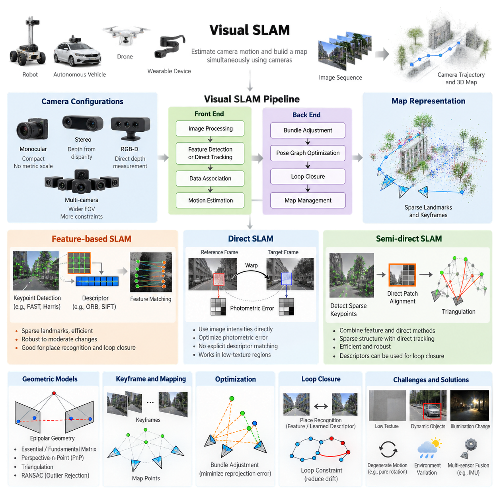
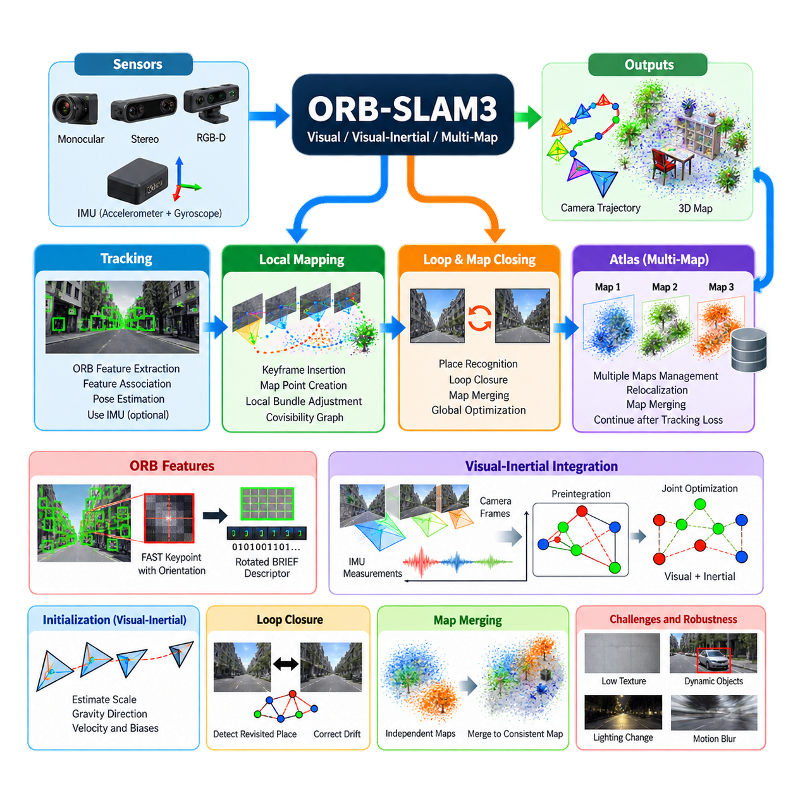
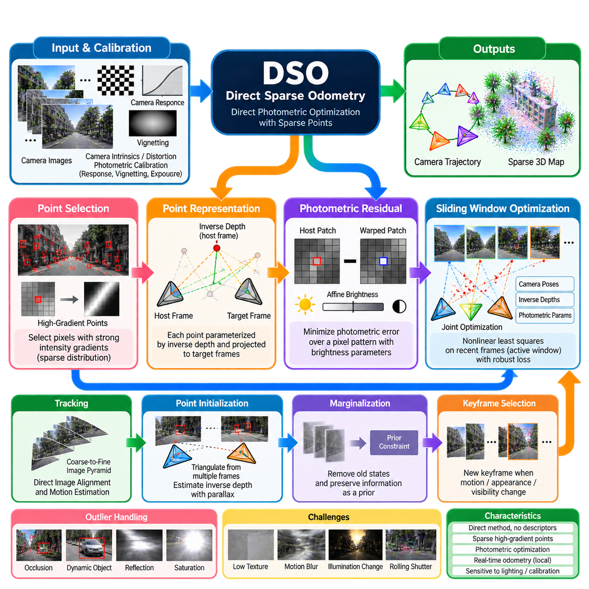
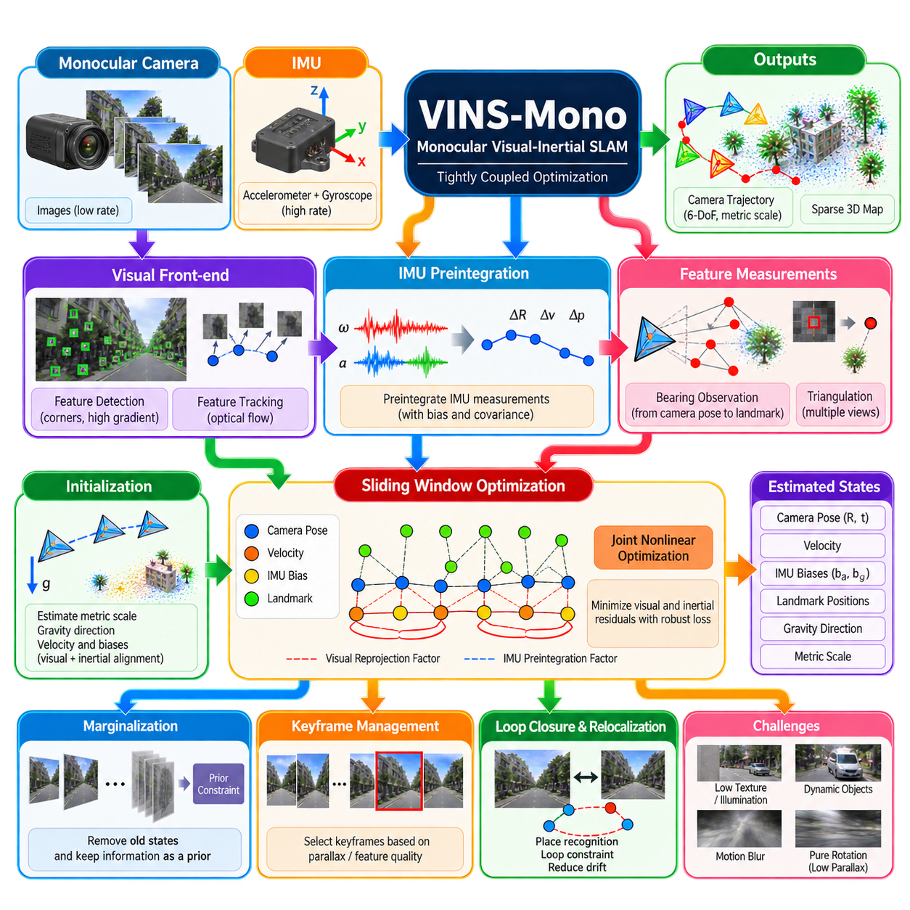
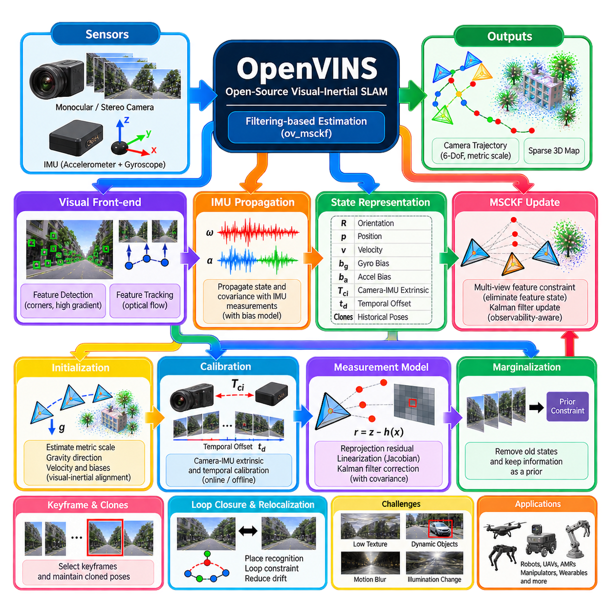
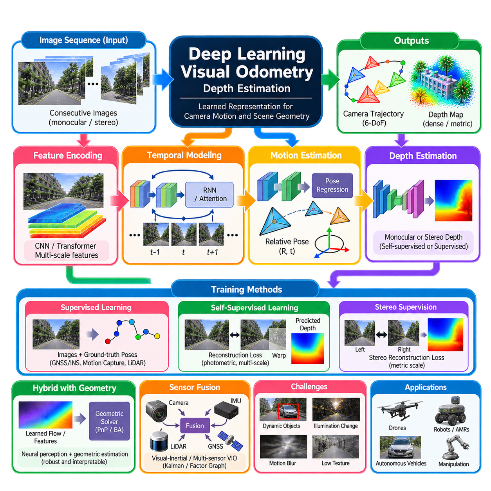
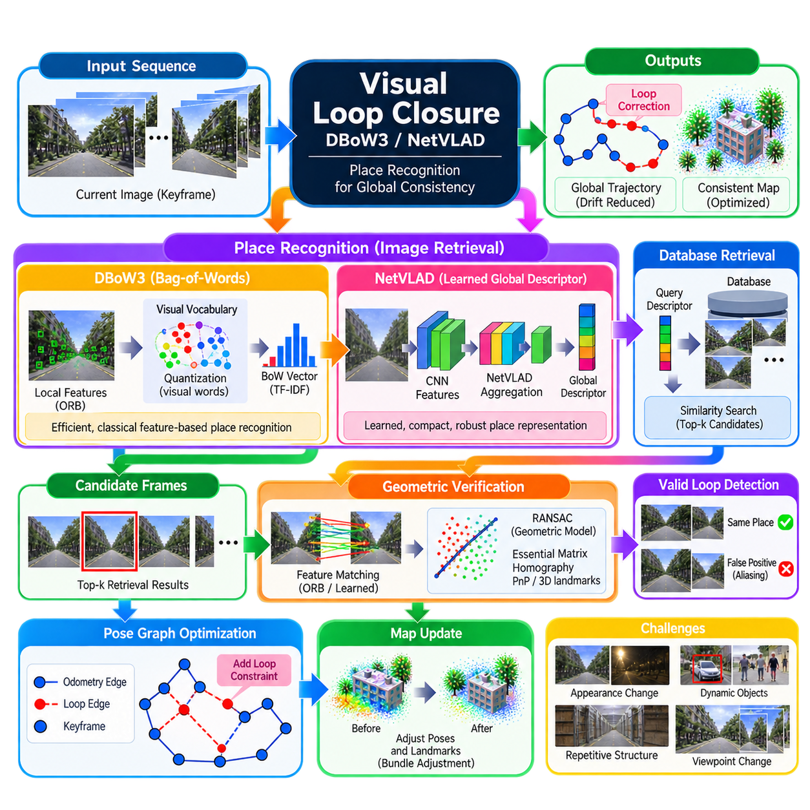
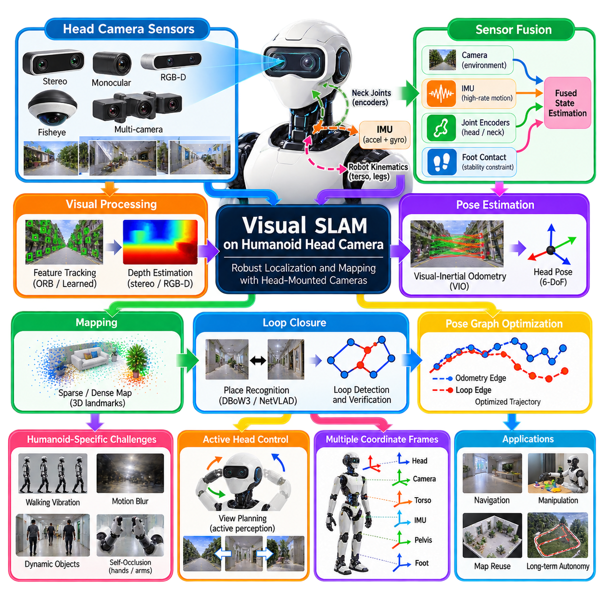
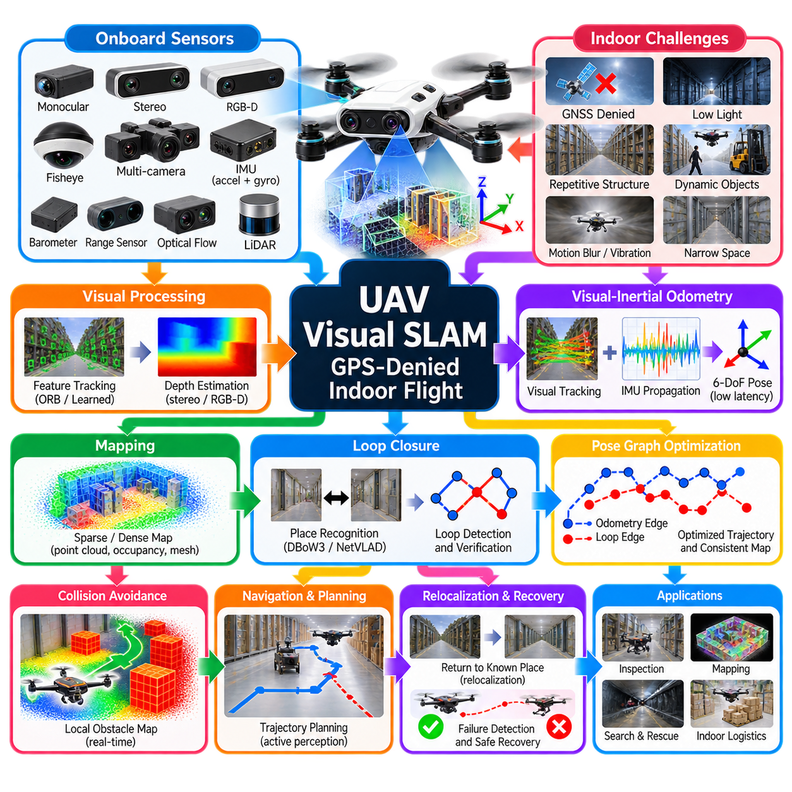
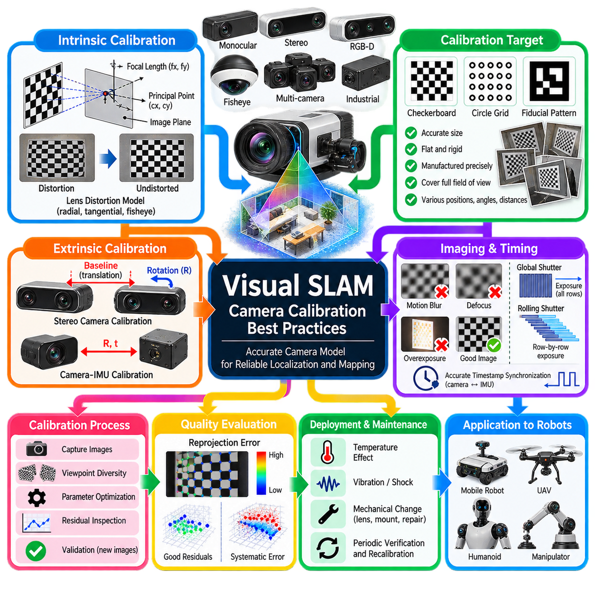

**Volume 13. Mapping Localization and SLAM**


# Chapter 05. Visual SLAM

##  

## 05.01. Visual SLAM Theory Feature Direct Semi Direct

{width="7.268055555555556in" height="7.268055555555556in"}

Visual Simultaneous Localization and Mapping (Visual SLAM) enables a mobile robot, autonomous vehicle, drone, or wearable device to estimate its motion while simultaneously constructing a representation of an unknown environment using cameras as the primary sensing modality. Unlike LiDAR-based SLAM, Visual SLAM extracts geometric and appearance information from image sequences, allowing compact and relatively inexpensive sensors to support rich environmental perception.

The fundamental Visual SLAM problem estimates a sequence of camera poses together with three-dimensional landmarks or another map representation from consecutive observations. A camera pose typically contains translation and orientation relative to a reference coordinate frame. Because both the robot trajectory and environmental structure are initially unknown, Visual SLAM must continuously infer them from temporal relationships between images while controlling accumulated estimation errors.

A typical Visual SLAM system contains a front end and a back end. The front end processes incoming images, detects useful visual information, establishes correspondences between frames, and estimates short-term camera motion. The back end optimizes poses and map variables over a longer temporal window. Bundle adjustment, pose graph optimization, loop closure, and map management are commonly integrated to maintain globally consistent estimates.

Camera configuration strongly affects the observability of the SLAM problem. Monocular cameras provide compact hardware and rich imagery but cannot directly determine absolute metric scale from geometry alone. Stereo cameras recover depth through disparity when sufficient texture and baseline are available. RGB-D cameras directly provide depth measurements over their operating range, while multi-camera systems increase field of view, robustness, and geometric constraints.

Feature-based Visual SLAM represents images through distinctive keypoints and descriptors. Corners, blobs, or other repeatable structures are detected using algorithms such as FAST, Harris, or learned detectors, while descriptors such as ORB, BRIEF, or SIFT characterize local image neighborhoods. Corresponding features are matched across successive frames, keyframes, or previously visited locations to create geometric constraints for pose estimation and mapping.

After correspondences are established, geometric models convert image relationships into motion estimates. Epipolar geometry, essential or fundamental matrices, Perspective-n-Point estimation, triangulation, and RANSAC are fundamental tools in this process. Outlier rejection is especially important because incorrect feature associations can severely distort pose estimation. Robust estimators therefore separate geometrically consistent observations from mismatches before optimization.

Feature-based methods provide several practical advantages. Sparse landmarks reduce computational requirements compared with processing every pixel, and carefully designed features can remain detectable under moderate viewpoint, scale, and illumination changes. Feature descriptors also support place recognition and loop closure efficiently. These properties contributed to influential systems such as PTAM and ORB-SLAM and remain valuable for long-duration robotic operation.

However, feature-based approaches depend on the existence of sufficiently distinctive visual structures. Large textureless walls, repetitive patterns, reflective surfaces, motion blur, severe illumination changes, or rapidly moving cameras can reduce the number and reliability of correspondences. Feature extraction and descriptor matching also introduce discrete processing stages whose errors propagate into later geometric estimation, particularly when the environment contains many dynamic objects.

Direct Visual SLAM follows a different principle by estimating camera motion directly from image intensity measurements rather than explicitly detecting and matching local feature descriptors. The method assumes that corresponding scene points should produce approximately consistent photometric observations between frames. Camera poses and, in many systems, scene depth are optimized by minimizing a photometric error defined over selected pixels or larger image regions.

Direct methods typically warp pixels from a reference frame into a target frame using estimated depth, camera calibration, and a candidate relative pose. The difference between the predicted and observed intensity becomes a residual used by nonlinear optimization. Image gradients provide information for updating pose parameters. Coarse-to-fine image pyramids are commonly employed so that relatively large motions can be handled before optimization proceeds toward finer spatial detail.

Because direct approaches can use image information without requiring conventional corner detection, they may operate effectively in regions containing weak but measurable intensity gradients. They also avoid the explicit descriptor computation and matching pipeline. Systems such as LSD-SLAM demonstrated large-scale direct monocular mapping, while Direct Sparse Odometry showed that carefully selected high-gradient pixels can provide accurate odometry without relying on traditional feature descriptors.

Direct methods nevertheless rely strongly on photometric consistency. Exposure changes, automatic gain control, nonlinear camera response, shadows, specular reflections, motion blur, rolling-shutter effects, and illumination variations can violate the brightness assumptions used by the optimization. Accurate camera calibration and photometric modeling therefore become important. Initialization must also provide estimates sufficiently close to the solution for iterative optimization to converge reliably.

Semi-direct Visual SLAM combines characteristics of feature-based and direct approaches. Instead of relying entirely on descriptor matching or optimizing all motion purely from photometric residuals, a semi-direct system can detect sparse geometric structures while tracking or aligning them through direct image measurements. This architecture attempts to preserve the computational efficiency and geometric robustness of sparse representations while exploiting richer local image information.

A representative semi-direct strategy detects corner-like points in selected keyframes, estimates their correspondence in subsequent frames through direct patch alignment, and reconstructs depth through triangulation or probabilistic filtering. Descriptors may be unnecessary for short-term tracking but can still be introduced for loop closure or global relocalization. SVO and related approaches illustrate how direct image alignment and sparse geometric mapping can be integrated within a high-rate estimation pipeline.

The distinction among feature-based, direct, and semi-direct methods should therefore be understood as a design spectrum rather than three completely isolated categories. Modern Visual SLAM systems frequently combine components from multiple paradigms. A system may use direct tracking for frame-to-frame motion, feature descriptors for loop detection, inertial measurements for motion prediction, and nonlinear geometric optimization for global consistency.

Keyframes are another central concept shared across many Visual SLAM architectures. Instead of preserving every captured image as an independent optimization state, selected frames are retained when they provide sufficient motion, viewpoint change, new scene information, or tracking quality. Keyframes constrain computational growth while maintaining useful geometric observations. Landmarks observed from multiple keyframes provide the connections required for local and global map optimization.

Bundle adjustment jointly refines camera poses and three-dimensional landmark positions by minimizing reprojection errors across multiple observations. It is one of the fundamental optimization mechanisms behind feature-based Visual SLAM and can also support hybrid systems. Local bundle adjustment restricts computation to an active neighborhood, while global bundle adjustment can refine a larger map after significant events such as loop closure, trading computational cost for improved consistency.

Loop closure addresses accumulated drift by recognizing that the camera has returned to a previously observed region. Feature descriptors and bag-of-words representations have traditionally provided efficient place recognition, although learned global descriptors are increasingly available. Once a candidate loop is geometrically verified, additional constraints are introduced into the pose graph or map optimization, allowing accumulated trajectory errors to be redistributed across the reconstructed environment.

Visual SLAM performance is fundamentally influenced by scene geometry and camera motion. Pure rotation, insufficient parallax, distant structures, narrow fields of view, or repeated textures can make depth and motion difficult to estimate reliably. Monocular systems are particularly sensitive to scale ambiguity and degenerate motion. Stereo, RGB-D, multi-camera, or visual-inertial configurations introduce additional measurements that improve observability under many practical operating conditions.

Dynamic environments introduce another major challenge because classical Visual SLAM commonly assumes that most observed structures belong to a static world. Vehicles, pedestrians, manipulators, moving machinery, vegetation, and changing objects can create inconsistent measurements. Robust estimation, semantic segmentation, motion detection, temporal filtering, and learned perception can identify or suppress dynamic regions so that localization relies primarily on stable environmental structures.

In industrial and outdoor autonomous robots, the choice between feature, direct, and semi-direct processing should reflect the operational domain rather than algorithmic preference alone. Lighting variation, vibration, vehicle speed, camera placement, available computing resources, texture distribution, weather, and required localization accuracy all influence system behavior. Multiple cameras and inertial sensors can further improve robustness when individual visual assumptions temporarily fail.

Visual SLAM is consequently best understood as a tightly coupled estimation architecture in which image measurements, camera geometry, temporal tracking, mapping, optimization, uncertainty, and place recognition interact continuously. Feature-based methods emphasize repeatable geometric landmarks, direct methods exploit photometric information, and semi-direct methods combine sparse structure with image alignment. Their underlying principles form the foundation for modern visual and visual-inertial localization systems used throughout Physical AI and autonomous robotics.

시각 동시적 위치추정 및 지도작성(Visual Simultaneous Localization and Mapping, Visual SLAM)은 이동 로봇(Mobile Robot), 자율주행 차량(Autonomous Vehicle), 드론(Drone), 웨어러블 장치(Wearable Device)가 카메라(Camera)를 주요 센서로 사용하여 자신의 움직임을 추정하는 동시에 미지 환경의 표현을 구축할 수 있도록 하는 기술이다. 라이다 기반 SLAM(LiDAR-based SLAM)과 달리 Visual SLAM은 연속 영상에서 기하학적 정보와 외형 정보를 추출하므로 비교적 작고 저렴한 센서를 이용하면서도 풍부한 환경 인식(Environmental Perception)을 수행할 수 있다.

Visual SLAM의 기본 문제는 연속적인 관측으로부터 카메라 자세(Camera Pose)의 시퀀스와 3차원 랜드마크(3D Landmark) 또는 다른 형태의 지도 표현(Map Representation)을 동시에 추정하는 것이다. 카메라 자세는 일반적으로 기준 좌표계(Reference Coordinate Frame)에 대한 이동(Translation)과 회전(Orientation)을 포함한다. 로봇 궤적과 환경 구조를 모두 처음에는 알 수 없기 때문에 Visual SLAM은 영상 사이의 시간적 관계(Temporal Relationship)를 이용하여 이들을 지속적으로 추론하면서 누적되는 추정 오차를 제어해야 한다.

일반적인 Visual SLAM 시스템은 프런트엔드(Front End)와 백엔드(Back End)로 구성된다. 프런트엔드는 입력 영상을 처리하고 유용한 시각 정보를 검출하며 프레임 사이의 대응관계(Correspondence)를 설정하고 단기적인 카메라 움직임을 추정한다. 백엔드는 더 긴 시간 구간에서 자세와 지도 변수를 최적화한다. 전역적으로 일관된 추정을 유지하기 위해 번들 조정(Bundle Adjustment), 자세 그래프 최적화(Pose Graph Optimization), 루프 폐쇄(Loop Closure), 지도 관리(Map Management) 등이 일반적으로 통합된다.

카메라 구성(Camera Configuration)은 SLAM 문제의 관측 가능성(Observability)에 큰 영향을 준다. 단안 카메라(Monocular Camera)는 하드웨어가 간결하고 풍부한 영상 정보를 제공하지만 기하학적 정보만으로 절대적인 미터 단위의 스케일(Metric Scale)을 직접 결정할 수 없다. 스테레오 카메라(Stereo Camera)는 충분한 텍스처와 베이스라인(Baseline)이 존재하면 시차(Disparity)를 이용하여 깊이를 복원한다. RGB-D 카메라(RGB-D Camera)는 동작 범위 내에서 깊이를 직접 제공하며, 다중 카메라 시스템(Multi-camera System)은 시야각, 강건성, 기하학적 제약을 향상시킨다.

특징 기반 Visual SLAM(Feature-based Visual SLAM)은 영상을 특징적인 키포인트(Keypoint)와 기술자(Descriptor)를 이용하여 표현한다. FAST, Harris 또는 학습 기반 검출기(Learned Detector)와 같은 알고리즘으로 코너(Corner), 블롭(Blob) 또는 반복적으로 검출 가능한 구조를 찾으며, ORB, BRIEF, SIFT 등의 기술자는 키포인트 주변의 국부 영상 영역을 표현한다. 대응 특징은 연속 프레임, 키프레임(Keyframe), 또는 이전에 방문한 위치 사이에서 정합되어 자세 추정과 지도 작성을 위한 기하학적 제약을 생성한다.

대응관계가 설정되면 기하학적 모델(Geometric Model)을 이용하여 영상 사이의 관계를 움직임 추정값으로 변환한다. 에피폴라 기하학(Epipolar Geometry), 본질 행렬(Essential Matrix), 기본 행렬(Fundamental Matrix), Perspective-n-Point(PnP) 추정, 삼각측량(Triangulation), RANSAC 등이 이 과정의 핵심 도구이다. 잘못된 특징 대응은 자세 추정을 심각하게 왜곡할 수 있기 때문에 이상치 제거(Outlier Rejection)가 특히 중요하다. 따라서 강건 추정기(Robust Estimator)를 이용하여 최적화 이전에 기하학적으로 일관된 관측과 잘못된 정합을 분리한다.

특징 기반 방법(Feature-based Method)은 여러 실용적인 장점을 제공한다. 희소 랜드마크(Sparse Landmark)는 모든 픽셀을 처리하는 방식에 비해 계산 요구량을 줄이며, 적절하게 설계된 특징은 어느 정도의 시점, 스케일, 조명 변화에서도 반복적으로 검출될 수 있다. 특징 기술자는 장소 인식(Place Recognition)과 루프 폐쇄를 효율적으로 지원한다. 이러한 특성은 PTAM과 ORB-SLAM과 같은 대표적인 시스템의 발전에 기여했으며 장시간 로봇 운용에서도 여전히 중요한 역할을 한다.

그러나 특징 기반 접근법은 충분히 구별 가능한 시각적 구조가 존재해야 한다. 넓고 텍스처가 없는 벽, 반복 패턴, 반사 표면, 모션 블러(Motion Blur), 심한 조명 변화 또는 빠른 카메라 움직임은 대응점의 수와 신뢰성을 감소시킬 수 있다. 특징 추출(Feature Extraction)과 기술자 정합(Descriptor Matching)은 서로 분리된 처리 단계를 추가하며, 특히 환경에 많은 동적 객체가 존재하는 경우 각 단계에서 발생한 오차가 이후의 기하학적 추정 과정으로 전파될 수 있다.

직접 Visual SLAM(Direct Visual SLAM)은 국부 특징 기술자를 명시적으로 검출하고 정합하는 대신 영상의 밝기 측정값(Image Intensity Measurement)으로부터 직접 카메라 움직임을 추정하는 다른 원리를 사용한다. 이 방법은 동일한 장면의 대응점이 프레임 사이에서 대략적으로 일관된 광도 관측(Photometric Observation)을 생성한다고 가정한다. 카메라 자세와 많은 시스템에서 장면 깊이는 선택된 픽셀 또는 더 넓은 영상 영역에서 정의된 광도 오차(Photometric Error)를 최소화하도록 최적화된다.

직접 방식(Direct Method)은 일반적으로 추정된 깊이, 카메라 보정(Camera Calibration), 후보 상대 자세(Relative Pose)를 이용하여 기준 프레임의 픽셀을 대상 프레임으로 워핑(Warping)한다. 예측된 밝기와 실제 관측된 밝기의 차이는 비선형 최적화(Nonlinear Optimization)에 사용되는 잔차(Residual)가 된다. 영상 그래디언트(Image Gradient)는 자세 매개변수를 갱신하기 위한 정보를 제공한다. 비교적 큰 움직임을 먼저 처리한 후 세밀한 공간 정보로 최적화를 진행하기 위해 거친 단계에서 세밀한 단계로 구성된 영상 피라미드(Image Pyramid)가 일반적으로 사용된다.

직접 접근법은 기존의 코너 검출에 의존하지 않고 영상 정보를 사용할 수 있기 때문에 약하지만 측정 가능한 밝기 그래디언트를 가진 영역에서도 효과적으로 동작할 수 있다. 또한 명시적인 기술자 계산과 정합 파이프라인을 생략할 수 있다. LSD-SLAM은 대규모 직접 단안 지도 작성(Direct Monocular Mapping)의 가능성을 보여주었으며, 직접 희소 오도메트리(Direct Sparse Odometry, DSO)는 신중하게 선택한 고그래디언트 픽셀을 이용하면 전통적인 특징 기술자 없이도 정확한 오도메트리(Odometry)를 수행할 수 있음을 보여주었다.

그러나 직접 방식은 광도 일관성(Photometric Consistency)에 크게 의존한다. 노출 변화, 자동 이득 제어(Automatic Gain Control), 비선형 카메라 응답, 그림자, 정반사(Specular Reflection), 모션 블러, 롤링 셔터(Rolling Shutter), 조명 변화 등은 최적화에서 사용하는 밝기 가정을 위반할 수 있다. 따라서 정확한 카메라 보정과 광도 모델링(Photometric Modeling)이 중요하다. 반복 최적화가 안정적으로 수렴하려면 초기화 과정에서도 실제 해에 충분히 가까운 추정값을 제공해야 한다.

준직접 Visual SLAM(Semi-direct Visual SLAM)은 특징 기반 방식과 직접 방식의 특성을 결합한다. 기술자 정합에 완전히 의존하거나 모든 움직임을 광도 잔차만으로 최적화하는 대신, 준직접 시스템은 희소 기하 구조(Sparse Geometric Structure)를 검출하면서 직접 영상 측정을 통해 이를 추적하거나 정렬할 수 있다. 이러한 구조는 희소 표현의 계산 효율성과 기하학적 강건성을 유지하면서 더 풍부한 국부 영상 정보를 활용하는 것을 목표로 한다.

대표적인 준직접 전략(Semi-direct Strategy)은 선택된 키프레임에서 코너 형태의 점을 검출하고, 직접 패치 정렬(Direct Patch Alignment)을 통해 이후 프레임에서 대응점을 추정하며, 삼각측량 또는 확률적 필터링(Probabilistic Filtering)을 이용하여 깊이를 복원한다. 단기 추적에는 기술자가 필요하지 않을 수 있지만 루프 폐쇄 또는 전역 재위치추정(Global Relocalization)을 위해 기술자를 추가할 수 있다. SVO와 관련 접근법은 직접 영상 정렬과 희소 기하 지도 작성이 고속 추정 파이프라인에 어떻게 통합될 수 있는지를 보여준다.

따라서 특징 기반, 직접, 준직접 방식의 차이는 완전히 분리된 세 가지 범주라기보다 하나의 설계 스펙트럼(Design Spectrum)으로 이해하는 것이 적절하다. 현대의 Visual SLAM 시스템은 여러 패러다임의 구성 요소를 조합하는 경우가 많다. 예를 들어 프레임 간 움직임에는 직접 추적(Direct Tracking)을 사용하고, 루프 검출에는 특징 기술자를 사용하며, 움직임 예측에는 관성 측정(Inertial Measurement)을 사용하고, 전역 일관성 확보에는 비선형 기하 최적화(Nonlinear Geometric Optimization)를 사용할 수 있다.

키프레임(Keyframe)은 다양한 Visual SLAM 구조에서 공통적으로 사용되는 또 하나의 핵심 개념이다. 촬영된 모든 영상을 독립적인 최적화 상태로 유지하는 대신 충분한 이동, 시점 변화, 새로운 장면 정보 또는 추적 품질을 제공하는 프레임을 선택하여 유지한다. 키프레임은 유용한 기하학적 관측을 보존하면서 계산량 증가를 제한한다. 여러 키프레임에서 관측된 랜드마크는 국부 및 전역 지도 최적화에 필요한 연결 관계를 제공한다.

번들 조정(Bundle Adjustment)은 여러 관측에서 발생하는 재투영 오차(Reprojection Error)를 최소화하여 카메라 자세와 3차원 랜드마크 위치를 공동으로 정제한다. 이는 특징 기반 Visual SLAM을 구성하는 핵심 최적화 메커니즘 가운데 하나이며 하이브리드 시스템(Hybrid System)에서도 활용될 수 있다. 국부 번들 조정(Local Bundle Adjustment)은 계산을 활성화된 주변 영역으로 제한하며, 전역 번들 조정(Global Bundle Adjustment)은 루프 폐쇄와 같은 중요한 사건 이후 더 넓은 지도를 정제하여 계산 비용과 전역 일관성 사이의 균형을 조정한다.

루프 폐쇄(Loop Closure)는 카메라가 이전에 관측했던 영역으로 다시 돌아왔다는 것을 인식하여 누적된 드리프트(Drift)를 보정한다. 전통적으로 특징 기술자와 단어 가방 표현(Bag-of-Words Representation)이 효율적인 장소 인식을 제공해 왔으며, 최근에는 학습 기반 전역 기술자(Learned Global Descriptor)도 활용되고 있다. 후보 루프가 기하학적으로 검증되면 자세 그래프 또는 지도 최적화에 새로운 제약이 추가되어 누적된 궤적 오차를 재구성된 환경 전체에 걸쳐 재분배할 수 있다.

Visual SLAM의 성능은 장면 기하(Scene Geometry)와 카메라 움직임(Camera Motion)의 영향을 근본적으로 받는다. 순수 회전(Pure Rotation), 불충분한 시차, 멀리 떨어진 구조, 좁은 시야각 또는 반복 텍스처는 깊이와 움직임을 안정적으로 추정하기 어렵게 만든다. 특히 단안 시스템은 스케일 모호성(Scale Ambiguity)과 퇴화 운동(Degenerate Motion)에 민감하다. 스테레오, RGB-D, 다중 카메라 또는 시각-관성 구성(Visual-Inertial Configuration)은 추가적인 측정 정보를 제공하여 다양한 실제 운용 조건에서 관측 가능성을 향상시킨다.

동적 환경(Dynamic Environment)은 또 다른 중요한 문제를 발생시킨다. 전통적인 Visual SLAM은 일반적으로 관측되는 구조 대부분이 정적인 세계(Static World)에 속한다고 가정하기 때문이다. 차량, 보행자, 매니퓰레이터(Manipulator), 이동 기계, 식생 또는 변화하는 객체는 일관되지 않은 측정값을 생성할 수 있다. 강건 추정(Robust Estimation), 의미론적 분할(Semantic Segmentation), 움직임 검출(Motion Detection), 시간적 필터링(Temporal Filtering), 학습 기반 인식(Learned Perception)을 이용하여 동적 영역을 식별하거나 억제함으로써 안정적인 환경 구조를 중심으로 위치추정을 수행할 수 있다.

산업용 및 야외 자율 로봇(Industrial and Outdoor Autonomous Robot)에서는 특징 기반, 직접, 준직접 처리 방식의 선택을 단순한 알고리즘 선호가 아니라 실제 운용 영역(Operational Domain)을 기준으로 결정해야 한다. 조명 변화, 진동, 차량 속도, 카메라 설치 위치, 사용 가능한 컴퓨팅 자원, 텍스처 분포, 기상 조건, 요구 위치 정확도 등이 시스템 동작에 영향을 준다. 다중 카메라와 관성 센서를 추가하면 개별 시각적 가정이 일시적으로 실패하는 상황에서도 강건성을 향상시킬 수 있다.

결과적으로 Visual SLAM은 영상 측정(Image Measurement), 카메라 기하(Camera Geometry), 시간적 추적(Temporal Tracking), 지도 작성(Mapping), 최적화(Optimization), 불확실성(Uncertainty), 장소 인식(Place Recognition)이 지속적으로 상호작용하는 긴밀하게 결합된 추정 아키텍처(Tightly Coupled Estimation Architecture)로 이해하는 것이 적절하다. 특징 기반 방식은 반복적으로 검출 가능한 기하학적 랜드마크를 강조하고, 직접 방식은 광도 정보를 활용하며, 준직접 방식은 희소 구조와 영상 정렬을 결합한다. 이러한 기본 원리는 피지컬 AI(Physical AI)와 자율 로보틱스(Autonomous Robotics) 전반에서 사용되는 현대적인 시각 및 시각-관성 위치추정(Visual-Inertial Localization) 시스템의 기반을 형성한다.

##  

## 05.02. ORB SLAM3 Multi Map Visual Inertial SLAM [w/Code]

{width="7.268055555555556in" height="7.268055555555556in"}

ORB-SLAM3 is a feature-based Simultaneous Localization and Mapping system designed to support visual, visual-inertial, and multi-map operation within a unified architecture. It extends the ORB-SLAM family beyond conventional single-map visual SLAM by combining ORB feature tracking, keyframe-based mapping, loop closing, map reuse, and inertial estimation. The system supports monocular, stereo, and RGB-D cameras, with inertial measurements available for monocular and stereo configurations.

The core visual representation relies on ORB features, which combine oriented FAST keypoints with rotated BRIEF descriptors. These features provide a computationally efficient mechanism for frame-to-frame tracking, landmark association, relocalization, and place recognition. Because the same feature representation is reused throughout the pipeline, ORB-SLAM3 can connect short-term camera tracking with longer-term map optimization without requiring separate visual representations for every subsystem.

Its architecture can be understood through several cooperating processes. Tracking estimates the current camera state from incoming images and, when available, inertial measurements. Local mapping creates and refines keyframes and map points within the active neighborhood. Loop and map-closing mechanisms detect previously observed places and correct accumulated drift. An atlas manages multiple maps so that localization can continue even after tracking failures, disconnected sessions, or transitions between separately constructed map regions.

During visual tracking, ORB features are extracted from each incoming frame and associated with existing map points or observations from recent frames. Motion models and reference keyframes provide candidate pose estimates, while geometric optimization refines the camera pose using consistent feature observations. Frames that contribute sufficient new geometric information can become keyframes, preventing every camera image from being inserted into the persistent map and limiting computational growth.

Keyframes form the structural backbone of the map. Each keyframe stores a selected camera observation, pose information, feature measurements, and relationships with other keyframes. Three-dimensional map points are reconstructed from observations across suitable viewpoints. A covisibility graph connects keyframes sharing significant numbers of landmarks, allowing the system to identify local neighborhoods efficiently and focus optimization on portions of the map that are most relevant to current tracking.

ORB-SLAM3 extends this visual formulation through tightly integrated inertial measurements from an Inertial Measurement Unit. Accelerometer and gyroscope data provide high-rate information about motion between camera frames, complementing visual observations when image information becomes weak or camera motion becomes rapid. Rather than treating inertial estimates as an independent localization stream, visual and inertial constraints are incorporated into a common estimation framework.

IMU preintegration summarizes many high-frequency inertial samples between selected visual states into compact motion constraints. This prevents optimization from having to process every raw IMU measurement independently. Preintegrated measurements describe relative changes associated with rotation, velocity, and position while accounting for sensor biases and uncertainty. These constraints are then combined with visual reprojection information during state estimation and optimization.

Visual-inertial initialization is particularly important because monocular vision alone cannot directly determine metric scale. Inertial observations introduce information related to acceleration and gravity, enabling the system to estimate metric scale together with gravity direction, velocity, and IMU biases when sufficient excitation is available. Reliable initialization therefore depends on informative camera and body motion rather than simply collecting a large number of stationary measurements.

Once initialized, visual-inertial SLAM can provide advantages during aggressive or temporarily difficult motion. The IMU offers rapid rotational and translational motion information between camera observations, while visual landmarks constrain long-term drift that would otherwise accumulate rapidly through inertial integration. The two sensing modalities therefore provide complementary information: vision supplies environmental references, whereas inertial sensing supplies high-frequency motion constraints.

The multi-map capability of ORB-SLAM3 is organized through an atlas representation. Instead of assuming that the complete operating history must belong to one continuously connected map, the atlas can contain multiple maps created at different times or after tracking interruptions. One map is active for current tracking and mapping, while previously created maps remain available for recognition, relocalization, and potential merging when sufficient visual evidence establishes a relationship between them.

This design is important when tracking is lost. A traditional SLAM pipeline may attempt to recover within the current map or restart mapping without preserving a structured relationship to previous experience. In a multi-map architecture, a new map can be initialized when necessary while older maps remain stored in the atlas. If the system later recognizes a location belonging to a previous map, geometric consistency can be evaluated and the maps can potentially be connected.

Map merging differs conceptually from ordinary loop closure. Loop closure generally identifies two locations already belonging to the same map and introduces constraints that correct accumulated drift. Map merging identifies a relationship between independently represented maps and transforms them into a common consistent representation. Both processes depend on place recognition and geometric verification, but their effects on the map structure and coordinate relationships are different.

Place recognition enables both relocalization and map-level association. ORB descriptors from keyframes provide a compact representation for retrieving candidate locations that resemble the current observation. Appearance similarity alone is not sufficient because repetitive environments can produce false candidates. Candidate matches therefore require geometric verification using feature correspondences and estimated transformations before they are accepted as valid loop, relocalization, or map-merging constraints.

When a valid loop is detected, accumulated trajectory error can be corrected across the affected map. Pose relationships are adjusted so that revisited locations become geometrically consistent, after which map points and keyframes can be further refined. Global or large-scale bundle adjustment may subsequently improve consistency by jointly optimizing camera poses and landmarks, although practical implementations must balance optimization quality against computational cost and real-time operation.

ORB-SLAM3 uses optimization at multiple spatial and temporal scales rather than relying on a single global optimization process. Current-frame pose optimization supports real-time tracking, local optimization refines recently active keyframes and landmarks, and larger graph or bundle adjustments correct accumulated global inconsistencies. In visual-inertial operation, state variables additionally include quantities such as velocity and inertial biases, increasing the dimensionality and coupling of the estimation problem.

The combination of camera and IMU measurements requires accurate temporal and geometric calibration. The rigid transformation between the camera and IMU coordinate frames must be known with sufficient precision, and timestamps must correspond accurately enough for visual observations and inertial integration to describe the same physical motion. Calibration errors can appear as persistent pose errors, incorrect scale, bias estimation problems, or degraded convergence during visual-inertial optimization.

Sensor synchronization becomes particularly significant on mobile robots experiencing vibration, rapid rotation, or high-speed motion. Even when the camera and IMU are individually accurate, timing offsets can cause the estimator to associate measurements with inconsistent robot states. Hardware synchronization, reliable timestamping, calibrated camera-IMU extrinsics, appropriate exposure control, and careful sensor mounting therefore become system-level requirements rather than secondary implementation details.

Feature-based tracking also retains the limitations associated with visual appearance. Low-texture surfaces, repetitive industrial structures, strong reflections, severe lighting transitions, motion blur, and occlusion can reduce the number of reliable ORB correspondences. Inertial sensing can bridge some short visual disturbances, but it does not eliminate the need for stable visual observations because inertial integration itself accumulates drift and sensor bias over time.

Dynamic environments introduce additional challenges. ORB features detected on pedestrians, vehicles, moving machinery, doors, or other changing objects may violate the static-world assumption underlying conventional map construction. Robust geometric estimation can reject many inconsistent measurements, but heavily dynamic scenes may require additional semantic or motion-based filtering. Long-term deployments may also require map maintenance strategies when previously stable environmental structures change permanently.

Multi-map SLAM is particularly relevant to long-duration autonomous robots because real deployments rarely consist of one uninterrupted mapping session. Robots may reboot, lose visual tracking, enter previously unseen regions, revisit known areas after long intervals, or operate across spatially disconnected zones. Maintaining an atlas allows these experiences to be represented as related mapping sessions rather than forcing every observation into a single continuously maintained trajectory.

For indoor AMRs, mobile manipulators, inspection robots, drones, and outdoor platforms, ORB-SLAM3 can serve as a visual or visual-inertial localization component within a larger navigation architecture. Its estimated pose and map information may be combined with wheel odometry, GNSS, LiDAR, or other sensors at the system level. Such integration requires explicit coordinate-frame management, timestamp consistency, uncertainty handling, and clear definitions of which estimator provides local motion versus global reference information.

In practical deployment, ORB-SLAM3 should therefore be viewed not merely as a feature tracker but as a complete keyframe-based estimation architecture. Its important concepts include ORB feature association, local mapping, bundle adjustment, place recognition, loop correction, inertial preintegration, visual-inertial initialization, atlas management, relocalization, and map merging. These mechanisms collectively address both short-term motion estimation and long-term spatial consistency.

The broader significance of ORB-SLAM3 is that modern Visual SLAM increasingly requires persistence across sensing modalities, interruptions, and mapping sessions. Visual features provide repeatable environmental references, inertial measurements strengthen motion estimation, optimization maintains geometric consistency, and the atlas preserves multiple spatial experiences. Together, these components illustrate how Visual-Inertial SLAM can evolve from single-session camera tracking toward persistent localization and mapping for autonomous Physical AI systems.

ORB-SLAM3는 통합된 아키텍처 내에서 시각(Visual), 시각-관성(Visual-Inertial), 다중 지도(Multi-Map) 운용을 지원하도록 설계된 특징 기반 동시적 위치추정 및 지도작성(Feature-based Simultaneous Localization and Mapping) 시스템이다. 기존의 단일 지도 기반 Visual SLAM을 넘어 ORB 특징 추적(ORB Feature Tracking), 키프레임 기반 지도작성(Keyframe-based Mapping), 루프 폐쇄(Loop Closing), 지도 재사용(Map Reuse), 관성 추정(Inertial Estimation)을 결합한다. 단안(Monocular), 스테레오(Stereo), RGB-D 카메라를 지원하며 단안 및 스테레오 구성에서는 관성 측정값(Inertial Measurement)을 함께 사용할 수 있다.

핵심 시각 표현(Visual Representation)은 방향성이 적용된 FAST 키포인트(Oriented FAST Keypoint)와 회전된 BRIEF 기술자(Rotated BRIEF Descriptor)를 결합한 ORB 특징(ORB Feature)을 기반으로 한다. 이러한 특징은 프레임 간 추적(Frame-to-frame Tracking), 랜드마크 연관(Landmark Association), 재위치추정(Relocalization), 장소 인식(Place Recognition)을 위한 계산 효율적인 방법을 제공한다. 동일한 특징 표현을 전체 파이프라인에서 재사용하므로 각 하위 시스템마다 별도의 시각 표현을 구성하지 않고도 단기 카메라 추적과 장기 지도 최적화를 연결할 수 있다.

ORB-SLAM3의 아키텍처는 여러 협력 프로세스(Cooperating Process)로 이해할 수 있다. 추적(Tracking)은 입력 영상과 가능한 경우 관성 측정값을 이용하여 현재 카메라 상태를 추정한다. 국부 지도작성(Local Mapping)은 활성 영역에서 키프레임과 지도점(Map Point)을 생성하고 정제한다. 루프 및 지도 폐쇄(Loop and Map Closing) 메커니즘은 이전에 관측한 장소를 검출하여 누적된 드리프트(Drift)를 보정한다. 아틀라스(Atlas)는 여러 지도를 관리하여 추적 실패, 분리된 운용 세션, 독립적으로 구축된 지도 영역 사이의 전환 이후에도 위치추정을 지속할 수 있도록 한다.

시각 추적(Visual Tracking) 과정에서는 각 입력 프레임에서 ORB 특징을 추출하고 기존 지도점 또는 최근 프레임의 관측과 연관시킨다. 움직임 모델(Motion Model)과 기준 키프레임(Reference Keyframe)은 후보 자세 추정값을 제공하며, 기하학적 최적화(Geometric Optimization)는 일관된 특징 관측을 이용하여 카메라 자세를 정제한다. 충분한 새로운 기하학적 정보를 제공하는 프레임은 키프레임으로 선택될 수 있으며, 이를 통해 모든 카메라 영상을 영구 지도에 삽입하는 것을 방지하고 계산량 증가를 제한한다.

키프레임(Keyframe)은 지도의 구조적 골격을 형성한다. 각 키프레임은 선택된 카메라 관측, 자세 정보(Pose Information), 특징 측정값(Feature Measurement), 다른 키프레임과의 관계를 저장한다. 3차원 지도점(3D Map Point)은 적절한 시점에서 획득된 여러 관측으로부터 복원된다. 공유 랜드마크가 많은 키프레임은 공가시성 그래프(Covisibility Graph)를 통해 연결되며, 이를 이용하여 국부 영역을 효율적으로 식별하고 현재 추적과 가장 관련성이 높은 지도 영역에 최적화를 집중할 수 있다.

ORB-SLAM3는 관성 측정 장치(Inertial Measurement Unit, IMU)의 측정값을 긴밀하게 통합하여 이러한 시각적 구성을 확장한다. 가속도계(Accelerometer)와 자이로스코프(Gyroscope)는 카메라 프레임 사이의 움직임에 대한 고주파 정보를 제공하여 영상 정보가 약해지거나 카메라가 빠르게 움직이는 상황에서 시각 관측을 보완한다. 관성 추정값을 독립적인 위치추정 스트림으로 처리하는 대신 시각 제약과 관성 제약을 공통 추정 프레임워크(Common Estimation Framework)에 통합한다.

IMU 사전적분(IMU Preintegration)은 선택된 시각 상태 사이에서 발생하는 다수의 고주파 관성 샘플을 압축된 움직임 제약(Motion Constraint)으로 요약한다. 이를 통해 최적화 과정에서 모든 원시 IMU 측정값을 개별적으로 처리할 필요가 없어진다. 사전적분된 측정값은 센서 바이어스(Sensor Bias)와 불확실성을 고려하면서 회전, 속도, 위치의 상대적 변화를 표현한다. 이러한 제약은 상태 추정 및 최적화 과정에서 시각적 재투영 정보(Visual Reprojection Information)와 결합된다.

시각-관성 초기화(Visual-Inertial Initialization)는 단안 시각만으로 절대적인 미터 단위 스케일(Metric Scale)을 직접 결정할 수 없기 때문에 특히 중요하다. 관성 관측은 가속도와 중력(Gravity)에 관한 정보를 제공하여 충분한 운동 자극(Motion Excitation)이 존재할 경우 중력 방향, 속도, IMU 바이어스와 함께 미터 단위 스케일을 추정할 수 있도록 한다. 따라서 신뢰성 높은 초기화에는 단순히 많은 정지 상태 측정값을 수집하는 것보다 충분한 정보를 포함하는 카메라 및 기체 움직임이 필요하다.

초기화가 완료되면 시각-관성 SLAM(Visual-Inertial SLAM)은 급격하거나 일시적으로 어려운 움직임 조건에서 장점을 제공할 수 있다. IMU는 카메라 관측 사이에서 빠른 회전 및 병진 운동 정보를 제공하며, 시각 랜드마크는 관성 적분(Inertial Integration)만 사용할 경우 빠르게 누적되는 장기 드리프트를 제한한다. 따라서 두 센싱 방식은 상호 보완적이며, 시각은 환경 기준(Environmental Reference)을 제공하고 관성 센싱은 고주파 움직임 제약을 제공한다.

ORB-SLAM3의 다중 지도 기능(Multi-Map Capability)은 아틀라스 표현(Atlas Representation)을 중심으로 구성된다. 전체 운용 이력이 하나의 연속적으로 연결된 지도에 포함되어야 한다고 가정하는 대신, 아틀라스는 서로 다른 시간에 생성되거나 추적 중단 이후 생성된 여러 지도를 포함할 수 있다. 하나의 지도는 현재 추적과 지도작성을 위한 활성 지도(Active Map)로 사용되며, 이전 지도는 인식, 재위치추정, 그리고 충분한 시각적 증거가 지도 간 관계를 확립했을 때 수행되는 잠재적인 지도 병합(Map Merging)을 위해 유지된다.

이러한 설계는 추적이 손실되었을 때 특히 중요하다. 전통적인 SLAM 파이프라인은 현재 지도 내에서 복구를 시도하거나 이전 경험과의 구조적인 관계를 유지하지 않은 채 새로운 지도 작성을 시작할 수 있다. 다중 지도 아키텍처에서는 필요한 경우 새로운 지도를 초기화하면서 기존 지도를 아틀라스에 그대로 보존할 수 있다. 이후 시스템이 이전 지도에 속하는 위치를 다시 인식하면 기하학적 일관성을 평가하고 두 지도를 연결할 수 있다.

지도 병합(Map Merging)은 일반적인 루프 폐쇄와 개념적으로 다르다. 루프 폐쇄는 일반적으로 동일한 지도에 이미 포함된 두 위치가 같은 장소임을 식별하고 누적 드리프트를 보정하기 위한 제약을 추가한다. 지도 병합은 독립적으로 표현된 지도 사이의 관계를 식별하고 이들을 공통의 일관된 표현으로 변환한다. 두 과정 모두 장소 인식과 기하학적 검증(Geometric Verification)을 사용하지만 지도 구조와 좌표 관계에 미치는 영향은 서로 다르다.

장소 인식(Place Recognition)은 재위치추정과 지도 수준의 연관(Map-level Association)을 모두 가능하게 한다. 키프레임의 ORB 기술자는 현재 관측과 유사한 후보 위치를 검색하기 위한 압축된 표현을 제공한다. 반복적인 환경에서는 잘못된 후보가 발생할 수 있으므로 외형 유사성(Appearance Similarity)만으로는 충분하지 않다. 따라서 후보 정합은 유효한 루프, 재위치추정 또는 지도 병합 제약으로 승인되기 전에 특징 대응과 추정 변환을 이용한 기하학적 검증을 거쳐야 한다.

유효한 루프가 검출되면 해당 지도에 누적된 궤적 오차(Trajectory Error)를 보정할 수 있다. 다시 방문한 위치가 기하학적으로 일관되도록 자세 관계를 조정한 후 지도점과 키프레임을 추가로 정제할 수 있다. 이후 전역 또는 대규모 번들 조정(Bundle Adjustment)을 이용하여 카메라 자세와 랜드마크를 공동 최적화함으로써 지도 일관성을 더욱 향상시킬 수 있지만, 실제 구현에서는 최적화 품질과 계산 비용 및 실시간 운용 사이의 균형이 필요하다.

ORB-SLAM3는 하나의 전역 최적화 과정에만 의존하지 않고 다양한 공간적·시간적 규모에서 최적화를 수행한다. 현재 프레임 자세 최적화(Current-frame Pose Optimization)는 실시간 추적을 지원하고, 국부 최적화(Local Optimization)는 최근 활성화된 키프레임과 랜드마크를 정제하며, 더 큰 규모의 그래프 또는 번들 조정은 누적된 전역 불일치를 보정한다. 시각-관성 운용에서는 상태 변수에 속도와 관성 바이어스 등이 추가되므로 추정 문제의 차원과 변수 간 결합도가 증가한다.

카메라와 IMU 측정값을 결합하려면 정확한 시간적·기하학적 보정(Temporal and Geometric Calibration)이 필요하다. 카메라와 IMU 좌표계 사이의 강체 변환(Rigid Transformation)을 충분한 정확도로 알아야 하며, 시각 관측과 관성 적분이 동일한 물리적 움직임을 표현할 수 있도록 타임스탬프(Timestamp) 역시 정확하게 대응해야 한다. 보정 오차는 지속적인 자세 오차, 잘못된 스케일, 바이어스 추정 문제 또는 시각-관성 최적화 과정의 수렴 성능 저하로 나타날 수 있다.

센서 동기화(Sensor Synchronization)는 진동, 빠른 회전 또는 고속 이동이 발생하는 이동 로봇에서 특히 중요하다. 카메라와 IMU가 각각 정확하더라도 시간 오프셋(Timing Offset)이 존재하면 추정기가 서로 다른 로봇 상태에 해당하는 측정값을 연관시킬 수 있다. 따라서 하드웨어 동기화(Hardware Synchronization), 신뢰할 수 있는 타임스탬핑(Timestamping), 카메라-IMU 외부 파라미터 보정(Camera-IMU Extrinsic Calibration), 적절한 노출 제어(Exposure Control), 안정적인 센서 장착은 부수적인 구현 요소가 아니라 시스템 수준의 요구사항이 된다.

특징 기반 추적은 시각적 외형(Visual Appearance)에 따른 한계를 여전히 가진다. 저텍스처 표면, 반복적인 산업 구조, 강한 반사, 급격한 조명 변화, 모션 블러(Motion Blur), 가림(Occlusion)은 신뢰할 수 있는 ORB 대응점의 수를 감소시킬 수 있다. 관성 센싱은 짧은 시간 동안 발생하는 일부 시각적 장애를 보완할 수 있지만, 관성 적분 자체도 시간에 따라 드리프트와 센서 바이어스를 누적하므로 안정적인 시각 관측의 필요성을 제거하지는 못한다.

동적 환경(Dynamic Environment)은 추가적인 문제를 발생시킨다. 보행자, 차량, 이동 기계, 문 또는 기타 변화하는 객체에서 검출된 ORB 특징은 기존 지도 작성에서 가정하는 정적 세계(Static World) 조건을 위반할 수 있다. 강건한 기하학적 추정(Robust Geometric Estimation)을 이용하여 많은 불일치 측정값을 제거할 수 있지만, 동적 객체가 많은 환경에서는 추가적인 의미론적 필터링(Semantic Filtering) 또는 움직임 기반 필터링(Motion-based Filtering)이 필요할 수 있다. 장기 운용에서는 기존의 안정적인 환경 구조가 영구적으로 변경될 경우 지도 유지관리(Map Maintenance) 전략도 요구된다.

다중 지도 SLAM(Multi-Map SLAM)은 실제 장기 자율 로봇 운용이 하나의 중단 없는 지도 작성 세션으로 이루어지는 경우가 드물기 때문에 특히 중요하다. 로봇은 재부팅될 수 있고, 시각 추적을 잃을 수 있으며, 이전에 관측하지 않은 영역으로 진입하거나 오랜 시간이 지난 후 기존 장소를 다시 방문할 수 있고, 공간적으로 분리된 여러 구역에서 운용될 수도 있다. 아틀라스를 유지하면 이러한 경험을 하나의 연속적인 궤적에 강제로 포함시키지 않고 서로 관련된 여러 지도 작성 세션으로 표현할 수 있다.

실내 자율이동로봇(Indoor AMR), 이동형 매니퓰레이터(Mobile Manipulator), 검사 로봇(Inspection Robot), 드론, 야외 플랫폼(Outdoor Platform)에서 ORB-SLAM3는 더 큰 내비게이션 아키텍처(Navigation Architecture)의 시각 또는 시각-관성 위치추정 구성 요소로 활용될 수 있다. 추정된 자세와 지도 정보는 시스템 수준에서 휠 오도메트리(Wheel Odometry), GNSS, LiDAR 또는 다른 센서와 결합될 수 있다. 이러한 통합에는 명확한 좌표계 관리(Coordinate-frame Management), 타임스탬프 일관성, 불확실성 처리(Uncertainty Handling), 그리고 어떤 추정기가 국부 움직임과 전역 기준 정보를 담당하는지에 대한 명확한 정의가 필요하다.

따라서 실제 배치 환경에서 ORB-SLAM3는 단순한 특징 추적기(Feature Tracker)가 아니라 완전한 키프레임 기반 추정 아키텍처(Keyframe-based Estimation Architecture)로 이해해야 한다. 주요 개념에는 ORB 특징 연관(ORB Feature Association), 국부 지도작성, 번들 조정, 장소 인식, 루프 보정(Loop Correction), 관성 사전적분(Inertial Preintegration), 시각-관성 초기화, 아틀라스 관리(Atlas Management), 재위치추정, 지도 병합 등이 포함된다. 이러한 메커니즘은 단기 움직임 추정과 장기적인 공간 일관성(Spatial Consistency)을 함께 처리한다.

ORB-SLAM3의 더 넓은 의미는 현대 Visual SLAM이 다양한 센싱 방식, 운용 중단, 여러 지도 작성 세션에 걸쳐 지속성(Persistence)을 확보해야 한다는 점에 있다. 시각 특징은 반복적으로 관측 가능한 환경 기준을 제공하고, 관성 측정은 움직임 추정을 강화하며, 최적화는 기하학적 일관성을 유지하고, 아틀라스는 여러 공간적 경험을 보존한다. 이러한 구성 요소의 결합은 Visual-Inertial SLAM이 단일 세션의 카메라 추적을 넘어 자율 피지컬 AI 시스템(Autonomous Physical AI System)을 위한 지속적인 위치추정 및 지도작성(Persistent Localization and Mapping)으로 발전하는 방식을 보여준다.

##  

## 05.03. DSO Direct Sparse Odometry Implementation [w/Code]

{width="7.268055555555556in" height="7.268055555555556in"}

Direct Sparse Odometry (DSO) is a visual odometry framework that estimates camera motion and scene structure directly from image intensities without relying on conventional keypoint descriptors and explicit feature matching. It combines the photometric principles of direct methods with a sparse selection of informative pixels, allowing accurate motion estimation while avoiding the computational expense of dense reconstruction. Its design emphasizes joint optimization of geometry and photometric parameters over a sliding window of recent frames.

The central principle of DSO is photometric consistency. A three-dimensional scene point observed from different camera poses should generate predictable image intensities after accounting for camera motion, projection geometry, exposure, and photometric response. Instead of minimizing geometric reprojection error between matched feature coordinates, DSO minimizes photometric residuals between corresponding image regions. Camera poses, inverse depths, and photometric parameters therefore become coupled variables in one nonlinear estimation problem.

DSO selects pixels that contain sufficient intensity gradients rather than detecting only conventional corners. Candidate points are distributed spatially across the image to maintain useful coverage while retaining pixels that provide strong photometric information. This strategy can exploit edges and textured regions that might not become distinctive feature keypoints. The resulting representation remains sparse, enabling the optimizer to process informative visual measurements without evaluating every image pixel.

Each selected point is represented relative to a host frame in which it was created. Its geometric state is commonly parameterized using inverse depth, which is convenient for points spanning both nearby and distant scene structures. The point can be projected from its host frame into another target frame using the estimated relative camera transformation and calibrated camera model. This projection establishes where its corresponding image intensity should be observed.

Rather than comparing only one pixel value, DSO evaluates a small pattern of neighboring pixels around each selected point. The photometric residual measures differences between the host observation and the warped target observation while considering affine brightness parameters. Using a local pattern increases the amount of image information contributing to each constraint and improves numerical behavior compared with relying on a single intensity sample.

Photometric calibration is a critical component of accurate direct estimation. Real cameras do not necessarily convert incoming irradiance linearly into recorded pixel intensity, and lens vignetting can cause spatial brightness variations. Exposure can also change between frames. DSO can incorporate camera response, vignette correction, exposure information, and affine brightness parameters so that residuals more closely represent actual scene consistency rather than artifacts introduced by the imaging pipeline.

Camera calibration is equally important because direct optimization depends on precise pixel projection. Intrinsic parameters such as focal length and principal point determine how three-dimensional rays correspond to image coordinates. Lens distortion must be modeled or removed consistently. Small calibration errors can produce systematic photometric residuals across thousands of measurements, causing the optimizer to compensate incorrectly through camera pose or depth estimates.

DSO operates over a limited active window containing selected recent frames rather than optimizing the complete trajectory continuously. These active frames jointly constrain camera poses, point inverse depths, and photometric variables. Maintaining a bounded window allows computational requirements to remain suitable for online operation while preserving enough temporal context for accurate estimation. Older states are removed through marginalization rather than simply discarded.

Marginalization preserves useful information from states that leave the active optimization window. When an old frame or point is removed, its influence on remaining variables is approximated and transferred into a prior constraint. This allows DSO to maintain information accumulated from earlier observations without retaining every historical variable. The process is mathematically important because careless state removal would cause information loss and degrade trajectory consistency.

New frames are tracked against the current model using direct image alignment and motion estimation. A coarse-to-fine image pyramid improves convergence by first solving motion at reduced image resolution and then refining it at finer levels. Large image displacements become smaller at coarse scales, increasing the convergence region of iterative optimization. The resulting pose estimate provides initialization before more complete windowed optimization is performed.

Point initialization requires estimating depth from multiple observations. Newly selected candidate points initially possess uncertain inverse depth and are tracked across subsequent frames. As camera motion creates sufficient parallax, repeated photometric observations reduce depth uncertainty. Points that become geometrically reliable can be activated within the optimization window, whereas candidates with poor observations, inconsistent intensity, or insufficient geometry can be rejected.

The optimization problem combines residuals from many point observations across multiple active frames. Nonlinear least-squares methods iteratively update camera poses, inverse depths, and photometric parameters to reduce the total robustified photometric error. Jacobians describe how residuals change with each state variable, allowing efficient construction of the normal equations. Robust weighting reduces the influence of measurements that violate the expected photometric model.

Outlier handling is essential because real scenes contain occlusions, reflections, dynamic objects, image saturation, and incorrect projections. A point that is geometrically valid in one frame may become hidden or may fall onto an independently moving object in another. Residual thresholds and robust loss mechanisms suppress inconsistent observations. Persistent or poorly conditioned points can eventually be removed from the active set to protect estimator stability.

Keyframe selection controls both geometric quality and computational cost. A new keyframe may be introduced when camera motion becomes sufficiently large, scene appearance changes, visibility of existing points decreases, or the current frame provides useful new spatial information. Too few keyframes weaken geometric constraints, while excessive insertion increases optimization cost. Practical DSO operation therefore depends on maintaining an informative but bounded active frame set.

DSO differs fundamentally from feature-based visual odometry in its data association strategy. Feature pipelines detect keypoints, compute descriptors, establish discrete correspondences, and then minimize geometric errors. DSO instead predicts correspondences through the current geometry and evaluates image intensities at projected locations. This eliminates descriptor matching from short-term tracking but makes accurate initialization and photometric consistency more important.

Compared with dense direct methods, DSO deliberately avoids optimizing every available pixel. Dense approaches can reconstruct richer scene surfaces but require substantially greater computation and may include many pixels that contribute little motion information. DSO concentrates computation on high-gradient points with useful spatial distribution. This sparse-direct formulation is one reason it can achieve strong odometry accuracy while remaining practical for real-time processing.

Several failure modes follow directly from the assumptions of the method. Severe motion blur reduces useful gradients, strong illumination changes violate photometric consistency, rolling-shutter distortion breaks the global camera-pose assumption, and textureless scenes provide insufficient informative pixels. Pure rotation or limited translational motion can also weaken depth estimation because triangulation requires parallax. Dynamic scenes introduce residuals that do not correspond to static-world geometry.

Exposure control and camera configuration therefore have significant practical consequences. Automatic exposure that changes aggressively between frames can make direct tracking more difficult, although affine brightness modeling compensates for moderate variations. Short exposure can reduce motion blur during fast motion but may increase image noise in low light. Camera frame rate, field of view, resolution, shutter type, and synchronization should consequently be selected as parts of the estimator design.

Implementation efficiency depends heavily on memory organization and repeated numerical operations. Image pyramids, gradients, calibrated intensity data, projected point patterns, Jacobians, and residual structures are accessed continuously during tracking and optimization. Efficient implementations minimize unnecessary allocation and repeated computation while exploiting the sparse structure of the estimation problem. Real-time performance therefore depends on software architecture as well as mathematical formulation.

DSO primarily provides odometry rather than a complete persistent SLAM architecture with global loop closure and long-term map management. Its active-window optimization produces locally accurate motion and structure estimates, but accumulated drift remains possible over long trajectories. A complete robotic localization system may therefore combine direct sparse odometry with loop detection, pose graph optimization, inertial sensing, GNSS, LiDAR, or another source of global constraints.

For autonomous mobile robots and Physical AI platforms, DSO demonstrates an important alternative to descriptor-centered perception. It shows that camera motion can be estimated directly from calibrated photometric information while retaining only a carefully selected sparse set of pixels. This is particularly valuable when conventional corner features are limited but useful gradients remain available, although operational robustness still depends strongly on camera quality and environmental conditions.

A practical DSO pipeline therefore connects calibrated image acquisition, gradient-based point selection, direct frame tracking, depth initialization, active point management, sliding-window optimization, robust residual evaluation, and marginalization. Each stage contributes to a common objective rather than operating as an isolated algorithm. Errors in calibration, timing, exposure, initialization, or point management can propagate through the tightly coupled estimator and reduce overall stability.

The broader importance of Direct Sparse Odometry lies in its balance between information usage and computational efficiency. By combining sparse geometric representation with direct photometric optimization, DSO occupies a distinctive position between classical feature-based and dense direct approaches. Its implementation illustrates how image formation, camera geometry, numerical optimization, uncertainty, and software efficiency must be designed together to produce accurate real-time visual odometry for autonomous systems.

직접 희소 오도메트리(Direct Sparse Odometry, DSO)는 기존의 키포인트 기술자(Keypoint Descriptor)와 명시적인 특징 정합(Feature Matching)에 의존하지 않고 영상 밝기(Image Intensity)로부터 직접 카메라 움직임과 장면 구조를 추정하는 시각 오도메트리(Visual Odometry) 프레임워크이다. 직접 방식(Direct Method)의 광도 원리(Photometric Principle)와 정보량이 높은 픽셀의 희소 선택(Sparse Selection)을 결합하여 밀집 복원(Dense Reconstruction)의 높은 계산 비용을 피하면서 정확한 움직임 추정을 수행한다. 최근 프레임의 슬라이딩 윈도우(Sliding Window)에서 기하 구조와 광도 매개변수를 공동 최적화하는 것이 핵심 설계 원리이다.

DSO의 중심 원리는 광도 일관성(Photometric Consistency)이다. 서로 다른 카메라 자세에서 관측된 동일한 3차원 장면점은 카메라 움직임, 투영 기하(Projection Geometry), 노출(Exposure), 광도 응답(Photometric Response)을 고려했을 때 예측 가능한 영상 밝기를 생성해야 한다. DSO는 정합된 특징 좌표 사이의 기하학적 재투영 오차(Geometric Reprojection Error)를 최소화하는 대신 대응되는 영상 영역 사이의 광도 잔차(Photometric Residual)를 최소화한다. 따라서 카메라 자세, 역깊이(Inverse Depth), 광도 매개변수가 하나의 비선형 추정 문제(Nonlinear Estimation Problem)에서 서로 결합된다.

DSO는 기존의 코너(Corner)만을 검출하는 대신 충분한 밝기 그래디언트(Intensity Gradient)를 포함하는 픽셀을 선택한다. 후보점(Candidate Point)은 영상 전체에서 유용한 공간적 분포를 유지하도록 배치되면서 강한 광도 정보를 제공하는 픽셀이 우선적으로 유지된다. 이러한 전략은 특징적인 키포인트로 선택되지 않을 수 있는 에지(Edge)와 텍스처 영역까지 활용할 수 있다. 결과적으로 표현은 희소하게 유지되며 모든 영상 픽셀을 평가하지 않고도 정보량이 높은 시각 측정값을 최적화에 사용할 수 있다.

각 선택점(Selected Point)은 해당 점이 생성된 호스트 프레임(Host Frame)을 기준으로 표현된다. 기하학적 상태는 일반적으로 역깊이를 사용하여 매개변수화되며, 이는 가까운 장면 구조와 먼 장면 구조를 함께 표현하는 데 유용하다. 추정된 상대 카메라 변환(Relative Camera Transformation)과 보정된 카메라 모델을 이용하면 점을 호스트 프레임에서 다른 대상 프레임(Target Frame)으로 투영할 수 있다. 이러한 투영을 통해 대응되는 영상 밝기가 어느 위치에서 관측되어야 하는지를 결정한다.

DSO는 하나의 픽셀값만 비교하는 대신 선택된 각 점 주변의 작은 픽셀 패턴(Pixel Pattern)을 평가한다. 광도 잔차는 아핀 밝기 매개변수(Affine Brightness Parameter)를 고려하면서 호스트 프레임의 관측값과 워핑된 대상 프레임의 관측값 사이의 차이를 측정한다. 국부 패턴(Local Pattern)을 사용하면 각 제약에 더 많은 영상 정보가 포함되며 단일 밝기 샘플에만 의존하는 방식보다 수치적 안정성(Numerical Behavior)을 향상시킬 수 있다.

광도 보정(Photometric Calibration)은 정확한 직접 추정에서 매우 중요한 요소이다. 실제 카메라는 입력 광량(Irradiance)을 기록되는 픽셀 밝기로 반드시 선형 변환하지 않으며, 렌즈 비네팅(Lens Vignetting)으로 인해 영상 위치에 따른 밝기 변화가 발생할 수 있다. 또한 프레임 사이에서 노출이 변할 수 있다. DSO는 카메라 응답(Camera Response), 비네팅 보정(Vignette Correction), 노출 정보, 아핀 밝기 매개변수를 포함하여 잔차가 영상 파이프라인에서 발생한 인공적인 변화보다 실제 장면의 일관성을 더 정확하게 표현하도록 할 수 있다.

카메라 보정(Camera Calibration) 역시 직접 최적화가 정확한 픽셀 투영에 의존하기 때문에 매우 중요하다. 초점거리(Focal Length)와 주점(Principal Point) 등의 내부 파라미터(Intrinsic Parameter)는 3차원 광선과 영상 좌표 사이의 대응 관계를 결정한다. 렌즈 왜곡(Lens Distortion)은 일관되게 모델링하거나 제거해야 한다. 작은 보정 오차라도 수천 개의 측정값에서 체계적인 광도 잔차를 발생시켜 최적화기가 카메라 자세나 깊이 추정값을 잘못 조정하도록 만들 수 있다.

DSO는 전체 궤적을 지속적으로 최적화하는 대신 선택된 최근 프레임으로 구성된 제한된 활성 윈도우(Active Window)에서 동작한다. 이러한 활성 프레임은 카메라 자세, 점의 역깊이, 광도 변수를 공동으로 제약한다. 제한된 크기의 윈도우를 유지하면 온라인 운용에 적합한 계산량을 유지하면서 정확한 추정에 필요한 시간적 문맥(Temporal Context)을 확보할 수 있다. 오래된 상태는 단순히 삭제하지 않고 주변화(Marginalization)를 통해 제거한다.

주변화(Marginalization)는 활성 최적화 윈도우에서 제거되는 상태의 유용한 정보를 보존한다. 오래된 프레임이나 점을 제거할 때 남아 있는 변수에 미치는 영향을 근사하여 사전 제약(Prior Constraint)으로 전달한다. 이를 통해 DSO는 모든 과거 변수를 계속 유지하지 않고도 이전 관측에서 누적된 정보를 활용할 수 있다. 상태를 부주의하게 제거하면 정보 손실이 발생하여 궤적 일관성이 저하되므로 주변화는 수학적으로 매우 중요한 과정이다.

새로운 프레임은 직접 영상 정렬(Direct Image Alignment)과 움직임 추정(Motion Estimation)을 이용하여 현재 모델에 대해 추적된다. 거친 단계에서 세밀한 단계로 구성된 영상 피라미드(Coarse-to-fine Image Pyramid)는 낮은 영상 해상도에서 먼저 움직임을 추정한 후 더 높은 해상도에서 정제하여 수렴성을 향상시킨다. 큰 영상 변위도 거친 스케일에서는 작아지기 때문에 반복 최적화의 수렴 영역이 확대된다. 이렇게 얻어진 자세 추정값은 보다 완전한 윈도우 최적화를 수행하기 위한 초기값으로 사용된다.

점 초기화(Point Initialization)를 위해서는 여러 관측으로부터 깊이를 추정해야 한다. 새롭게 선택된 후보점은 처음에는 불확실한 역깊이를 가지며 이후 프레임에 걸쳐 추적된다. 카메라 움직임으로 충분한 시차(Parallax)가 발생하면 반복적인 광도 관측을 통해 깊이 불확실성이 감소한다. 기하학적으로 신뢰할 수 있게 된 점은 최적화 윈도우의 활성점(Active Point)으로 전환되며, 관측 품질이 낮거나 밝기 일관성이 부족하거나 기하학적 조건이 충분하지 않은 후보점은 제거될 수 있다.

최적화 문제는 여러 활성 프레임에서 관측되는 다수의 점에 대한 잔차를 결합한다. 비선형 최소제곱법(Nonlinear Least Squares)은 전체 강건 광도 오차(Robustified Photometric Error)를 줄이도록 카메라 자세, 역깊이, 광도 매개변수를 반복적으로 갱신한다. 야코비안(Jacobian)은 각 상태 변수의 변화에 따라 잔차가 어떻게 변하는지를 표현하며 이를 통해 정규 방정식(Normal Equation)을 효율적으로 구성할 수 있다. 강건 가중치(Robust Weighting)는 예상된 광도 모델을 위반하는 측정값의 영향을 감소시킨다.

실제 장면에는 가림(Occlusion), 반사(Reflection), 동적 객체(Dynamic Object), 영상 포화(Image Saturation), 잘못된 투영 등이 존재하므로 이상치 처리(Outlier Handling)가 필수적이다. 한 프레임에서 기하학적으로 유효한 점도 다른 프레임에서는 가려지거나 독립적으로 움직이는 객체 위에 위치할 수 있다. 잔차 임계값(Residual Threshold)과 강건 손실 함수(Robust Loss Mechanism)는 일관되지 않은 관측을 억제한다. 지속적으로 품질이 낮거나 조건이 좋지 않은 점은 추정기의 안정성을 보호하기 위해 활성 집합에서 제거될 수 있다.

키프레임 선택(Keyframe Selection)은 기하학적 품질과 계산 비용을 동시에 제어한다. 카메라 움직임이 충분히 커지거나 장면 외형이 변하거나 기존 점의 가시성(Visibility)이 감소하거나 현재 프레임이 새로운 공간 정보를 제공할 때 새로운 키프레임을 추가할 수 있다. 키프레임이 너무 적으면 기하학적 제약이 약해지고 지나치게 많이 삽입하면 최적화 비용이 증가한다. 따라서 실제 DSO 운용에서는 정보량이 높으면서도 제한된 크기의 활성 프레임 집합을 유지해야 한다.

DSO는 데이터 연관(Data Association) 전략에서 특징 기반 시각 오도메트리(Feature-based Visual Odometry)와 근본적으로 다르다. 특징 기반 파이프라인은 키포인트를 검출하고 기술자를 계산하며 이산적인 대응관계를 설정한 다음 기하학적 오차를 최소화한다. 반면 DSO는 현재 기하 구조를 이용하여 대응 위치를 예측하고 투영된 위치의 영상 밝기를 평가한다. 따라서 단기 추적에서 기술자 정합을 제거할 수 있지만 정확한 초기화와 광도 일관성이 더욱 중요해진다.

밀집 직접 방식(Dense Direct Method)과 비교하면 DSO는 사용 가능한 모든 픽셀을 의도적으로 최적화하지 않는다. 밀집 접근법은 보다 풍부한 장면 표면을 복원할 수 있지만 훨씬 많은 계산량이 필요하며 움직임 추정에 거의 기여하지 않는 픽셀까지 포함할 수 있다. DSO는 유용한 공간적 분포를 가지는 고그래디언트 점(High-gradient Point)에 계산을 집중한다. 이러한 희소 직접 방식(Sparse-direct Formulation)은 실시간 처리에 적합한 계산량을 유지하면서 높은 오도메트리 정확도를 달성할 수 있는 중요한 이유이다.

DSO의 여러 실패 모드(Failure Mode)는 알고리즘의 기본 가정에서 직접적으로 발생한다. 심한 모션 블러(Motion Blur)는 유용한 그래디언트를 감소시키고, 강한 조명 변화는 광도 일관성을 위반하며, 롤링 셔터 왜곡(Rolling-shutter Distortion)은 하나의 전역 카메라 자세를 가정하는 모델을 위반한다. 텍스처가 부족한 장면은 정보량이 높은 픽셀을 충분히 제공하지 못한다. 순수 회전(Pure Rotation)이나 제한된 병진 운동도 삼각측량에 필요한 시차가 부족하기 때문에 깊이 추정을 약화시키며, 동적 장면은 정적 세계 기하와 일치하지 않는 잔차를 생성한다.

따라서 노출 제어(Exposure Control)와 카메라 구성(Camera Configuration)은 실제 운용 성능에 상당한 영향을 미친다. 프레임마다 자동 노출이 급격하게 변하면 직접 추적이 어려워질 수 있지만 아핀 밝기 모델링은 중간 정도의 변화를 보상할 수 있다. 짧은 노출 시간은 빠른 움직임에서 모션 블러를 감소시킬 수 있지만 저조도 환경에서는 영상 노이즈가 증가할 수 있다. 따라서 카메라 프레임률(Frame Rate), 시야각(Field of View), 해상도(Resolution), 셔터 방식(Shutter Type), 동기화(Synchronization)를 추정기 설계의 일부로 함께 결정해야 한다.

구현 효율성(Implementation Efficiency)은 메모리 구성과 반복적인 수치 연산에 크게 좌우된다. 영상 피라미드, 그래디언트, 보정된 밝기 데이터, 투영된 점 패턴, 야코비안, 잔차 구조는 추적과 최적화 과정에서 지속적으로 접근된다. 효율적인 구현은 불필요한 메모리 할당과 반복 계산을 최소화하면서 추정 문제의 희소 구조(Sparse Structure)를 활용한다. 따라서 실시간 성능은 수학적 공식뿐만 아니라 소프트웨어 아키텍처(Software Architecture)의 효율성에도 크게 의존한다.

DSO는 전역 루프 폐쇄(Global Loop Closure)와 장기 지도 관리(Long-term Map Management)를 포함하는 완전한 지속형 SLAM 아키텍처보다는 주로 오도메트리(Odometry)를 제공한다. 활성 윈도우 최적화는 국부적으로 정확한 움직임과 구조 추정값을 생성하지만 장거리 궤적에서는 누적 드리프트가 발생할 수 있다. 따라서 완전한 로봇 위치추정 시스템에서는 직접 희소 오도메트리를 루프 검출, 자세 그래프 최적화(Pose Graph Optimization), 관성 센싱, GNSS, LiDAR 또는 다른 전역 제약 정보와 결합할 수 있다.

자율이동로봇(Autonomous Mobile Robot)과 피지컬 AI 플랫폼(Physical AI Platform)에서 DSO는 기술자 중심 인식(Descriptor-centered Perception)에 대한 중요한 대안을 보여준다. 신중하게 선택된 희소 픽셀 집합만 유지하면서 보정된 광도 정보로부터 직접 카메라 움직임을 추정할 수 있음을 보여준다. 기존 코너 특징이 부족하지만 유용한 영상 그래디언트가 남아 있는 환경에서 특히 가치가 있을 수 있지만, 실제 운용 강건성(Operational Robustness)은 여전히 카메라 품질과 환경 조건에 크게 의존한다.

실용적인 DSO 파이프라인은 보정된 영상 획득(Calibrated Image Acquisition), 그래디언트 기반 점 선택(Gradient-based Point Selection), 직접 프레임 추적, 깊이 초기화(Depth Initialization), 활성점 관리(Active Point Management), 슬라이딩 윈도우 최적화, 강건 잔차 평가(Robust Residual Evaluation), 주변화를 하나의 연속적인 과정으로 연결한다. 각 단계는 독립된 알고리즘으로 작동하는 것이 아니라 공통된 추정 목표에 기여한다. 보정, 타이밍, 노출, 초기화 또는 점 관리에서 발생한 오차는 긴밀하게 결합된 추정기 전체로 전파되어 전체 안정성을 저하시킬 수 있다.

직접 희소 오도메트리의 더 넓은 중요성은 정보 활용과 계산 효율성 사이에서 균형을 제공한다는 점에 있다. DSO는 희소 기하 표현(Sparse Geometric Representation)과 직접 광도 최적화(Direct Photometric Optimization)를 결합하여 전통적인 특징 기반 방식과 밀집 직접 방식 사이에서 독특한 위치를 차지한다. DSO의 구현은 영상 형성(Image Formation), 카메라 기하(Camera Geometry), 수치 최적화(Numerical Optimization), 불확실성(Uncertainty), 소프트웨어 효율성을 함께 설계해야 자율 시스템을 위한 정확한 실시간 시각 오도메트리를 구현할 수 있음을 보여준다.

##  

## 05.04. VINS Mono Fusion Visual Inertial SLAM [w/Code]

{width="7.268055555555556in" height="7.268055555555556in"}

VINS-Mono is a tightly coupled monocular visual-inertial state estimation framework that combines camera observations with measurements from an Inertial Measurement Unit (IMU). It is designed to estimate six-degree-of-freedom motion while recovering metric scale, velocity, gravity direction, and inertial sensor biases. By exploiting complementary visual and inertial information, the system provides robust motion estimation for robots, drones, mobile devices, and other autonomous platforms.

A monocular camera provides rich geometric information about the surrounding environment but cannot independently observe absolute metric scale. An IMU measures angular velocity and specific force at a much higher frequency, providing short-term motion information but accumulating drift when integrated over time. VINS-Mono fuses these sensing modalities so that visual observations constrain inertial drift while inertial measurements improve motion prediction between relatively slow camera frames.

The processing architecture can be divided conceptually into visual measurement processing, IMU propagation, initialization, nonlinear optimization, marginalization, and loop closure. Camera images generate tracked visual features, while high-rate accelerometer and gyroscope samples describe motion between image timestamps. These observations are converted into residual constraints within a common optimization problem, allowing camera poses, velocity, feature geometry, and IMU biases to be estimated jointly.

Visual front-end processing begins by detecting and tracking salient image features across consecutive frames. Corner-like points with sufficient image gradient are suitable because their two-dimensional positions can be measured reliably. Instead of repeatedly computing heavy descriptors for every short-term association, optical-flow-based tracking can propagate features efficiently between frames. Geometric checks remove inconsistent tracks before they enter the estimator.

Feature observations provide bearing constraints from camera poses toward environmental landmarks. Because a single monocular observation does not determine depth, landmarks must be observed from multiple viewpoints before their geometry becomes well constrained. Camera translation generates parallax, enabling triangulation of feature depth. Insufficient translation, distant structures, or nearly pure rotation can therefore weaken visual geometry and make initialization or state estimation more difficult.

The IMU operates at a substantially higher rate than the camera and produces many measurements between consecutive image frames. Directly including every raw sample as an independent optimization state would be computationally expensive. VINS-Mono therefore employs IMU preintegration, which summarizes the relative rotation, velocity, and position changes between selected states while accounting for estimated accelerometer and gyroscope biases.

Preintegration is performed relative to a chosen linearization point so that the accumulated inertial constraint can be efficiently corrected when bias estimates change during optimization. The resulting preintegrated measurement links consecutive states without requiring reintegration of the complete raw sequence after every small parameter update. Covariance propagation represents uncertainty accumulated through IMU noise, allowing the estimator to weight inertial constraints appropriately.

Initialization is one of the most critical stages of monocular visual-inertial estimation. A purely visual structure-from-motion process can initially recover camera motion and scene structure only up to an unknown scale. Visual and inertial motion are then aligned to estimate metric scale, gravity direction, velocity, and inertial biases. Successful initialization requires sufficient excitation so that these variables become observable rather than remaining strongly correlated.

Gravity estimation is particularly important because accelerometers measure specific force rather than translational acceleration alone. The estimator must distinguish gravitational acceleration from motion-induced acceleration while simultaneously estimating sensor bias. Once gravity direction and scale have been established, the visual reconstruction can be transformed into a metric reference suitable for physical navigation, control, and trajectory estimation.

After initialization, VINS-Mono maintains a sliding window containing a limited number of recent camera states and associated feature observations. The state of each keyframe can include orientation, position, velocity, accelerometer bias, and gyroscope bias. Landmark depths and additional calibration variables may also participate in optimization. Limiting the active window controls computational growth while preserving enough temporal information for accurate local estimation.

The nonlinear estimator jointly minimizes visual reprojection residuals and inertial preintegration residuals. Visual residuals measure the disagreement between observed feature locations and locations predicted from the estimated camera poses and landmark geometry. Inertial residuals measure disagreement between estimated state transitions and transitions predicted by preintegrated IMU measurements. Joint optimization forces both sensing modalities to explain one physically consistent trajectory.

Robust loss functions are important because feature tracking can produce outliers through occlusion, repetitive texture, dynamic objects, reflections, or image noise. Measurements that strongly disagree with the current geometric model should not dominate optimization. Geometric verification and robust weighting therefore reduce their influence, while tracks that remain inconsistent can be removed entirely from subsequent estimation.

Marginalization allows the estimator to keep a fixed-size sliding window. When an old state leaves the active window, its information is not simply discarded. Instead, its influence on the remaining variables is transformed into a prior constraint through marginalization. This preserves much of the accumulated information while preventing the optimization problem from growing indefinitely as additional images and IMU measurements arrive.

Keyframe management determines which camera states should remain most informative for optimization. Frames with sufficient parallax and useful feature observations provide stronger geometric constraints than nearly redundant frames. Depending on motion and tracking conditions, a frame may be retained as a keyframe or marginalized while preserving relevant constraints. Effective selection balances estimation accuracy, feature geometry, and real-time computational requirements.

Camera-IMU extrinsic calibration defines the rigid transformation between the camera coordinate system and the IMU coordinate system. Errors in this transformation create systematic disagreement between visual and inertial motion. VINS-Mono can incorporate extrinsic parameters into the estimation framework under appropriate conditions, but reliable calibration remains highly important for practical deployment, especially when sensors experience fast rotational motion.

Temporal synchronization is equally significant. Camera frames and IMU samples must correspond to a consistent physical timeline. A timestamp offset means that visual and inertial measurements describe different platform poses even if both sensors are individually accurate. Visual-inertial systems may estimate temporal offset under suitable conditions, but hardware synchronization and reliable timestamps remain preferable when high-dynamic motion or strict accuracy requirements are involved.

Loop closure extends local visual-inertial odometry toward globally consistent trajectory estimation. When the camera revisits a previously observed location, visual place recognition can identify a loop candidate. Geometric verification confirms whether the candidate corresponds to the same physical place. The resulting loop constraint can correct drift accumulated during long trajectories and improve consistency between current and previously visited regions.

Relocalization also becomes possible when previously observed visual information is retained. If local tracking becomes unreliable or the system returns to a known environment, recognized landmarks or keyframes can provide global spatial constraints. This capability is important for persistent autonomous operation because visual-inertial odometry alone, despite strong local accuracy, cannot completely eliminate long-term drift without external or repeated environmental references.

Failure modes arise when both sensing modalities become weak simultaneously. Severe motion blur, darkness, repetitive texture, or strong illumination transitions can reduce reliable visual tracks. Excessive vibration, saturation, thermal bias variation, or poor-quality IMU measurements can degrade inertial information. Pure rotation and insufficient translational excitation can weaken scale observability, while long periods of nearly constant motion may make some calibration parameters difficult to estimate.

Dynamic objects present another challenge because conventional feature geometry assumes that tracked landmarks belong to a static environment. Features located on pedestrians, vehicles, manipulators, or moving machinery generate observations inconsistent with platform motion. Robust estimation can reject many such tracks, while semantic segmentation or motion consistency analysis can further prevent unstable objects from contaminating the visual-inertial state estimate.

For real robotic deployment, sensor placement and mechanical design affect estimator performance. A rigid camera-IMU assembly helps preserve extrinsic calibration, while vibration isolation must avoid introducing uncontrolled relative sensor motion. Camera exposure should limit motion blur, and the IMU measurement range should accommodate expected angular rates and accelerations without saturation. Sensor selection is therefore tightly connected to the expected platform dynamics.

VINS-Mono can operate as one component within a broader multi-sensor localization architecture. Wheel odometry can provide ground-vehicle motion constraints, GNSS can supply global position outdoors, and LiDAR can contribute geometry under visually difficult conditions. Fusion at a higher system level requires consistent coordinate frames, timestamp management, covariance interpretation, and clear separation between local high-rate state estimation and global drift correction.

Compared with purely visual monocular SLAM, VINS-Mono gains metric scale and high-frequency motion information through inertial sensing. Compared with pure inertial navigation, visual landmarks strongly constrain drift. Its strength therefore comes from complementary observability rather than simple measurement redundancy. Camera and IMU measurements constrain different aspects of the same motion, creating a more informative state estimation problem when calibration and synchronization are properly maintained.

A practical VINS-Mono implementation consequently forms a continuous pipeline from synchronized camera and IMU acquisition through feature tracking, IMU preintegration, visual-inertial initialization, sliding-window optimization, marginalization, and loop correction. Each component depends on the assumptions and outputs of neighboring stages. Calibration, timing, feature quality, initialization, and numerical optimization must therefore be engineered as one integrated estimation system.

The broader importance of VINS-Mono is its demonstration that compact, low-cost sensors can provide accurate metric motion estimation through tightly coupled probabilistic optimization. Visual observations anchor motion to environmental structure, inertial measurements describe rapid platform dynamics, and sliding-window estimation combines both within a computationally manageable framework. These principles remain fundamental to modern Visual-Inertial SLAM for drones, AMRs, mobile manipulators, wearable systems, and autonomous Physical AI platforms.

VINS-Mono는 카메라 관측(Camera Observation)과 관성 측정 장치(Inertial Measurement Unit, IMU)의 측정값을 결합하는 긴밀 결합 단안 시각-관성 상태 추정(Tightly Coupled Monocular Visual-Inertial State Estimation) 프레임워크이다. 6자유도(Six-Degree-of-Freedom, 6-DoF) 움직임을 추정하면서 미터 단위 스케일(Metric Scale), 속도(Velocity), 중력 방향(Gravity Direction), 관성 센서 바이어스(Inertial Sensor Bias)를 복원하도록 설계되었다. 상호 보완적인 시각 및 관성 정보를 활용하여 로봇, 드론, 모바일 장치 및 기타 자율 플랫폼의 강건한 움직임 추정을 제공한다.

단안 카메라(Monocular Camera)는 주변 환경에 대한 풍부한 기하학적 정보를 제공하지만 절대적인 미터 단위 스케일을 독립적으로 관측할 수 없다. IMU는 훨씬 높은 주파수로 각속도(Angular Velocity)와 비력(Specific Force)을 측정하여 단기 움직임 정보를 제공하지만 시간에 따라 적분하면 드리프트(Drift)가 누적된다. VINS-Mono는 시각 관측이 관성 드리프트를 제한하고 관성 측정이 상대적으로 느린 카메라 프레임 사이의 움직임 예측을 향상시키도록 두 센싱 방식을 융합한다.

처리 아키텍처(Processing Architecture)는 개념적으로 시각 측정 처리(Visual Measurement Processing), IMU 전파(IMU Propagation), 초기화(Initialization), 비선형 최적화(Nonlinear Optimization), 주변화(Marginalization), 루프 폐쇄(Loop Closure)로 구분할 수 있다. 카메라 영상에서는 추적된 시각 특징(Visual Feature)이 생성되고, 고주파 가속도계와 자이로스코프 샘플은 영상 타임스탬프 사이의 움직임을 표현한다. 이러한 관측은 공통 최적화 문제의 잔차 제약(Residual Constraint)으로 변환되어 카메라 자세, 속도, 특징 기하, IMU 바이어스를 공동으로 추정할 수 있게 한다.

시각 프런트엔드 처리(Visual Front-end Processing)는 연속 프레임에서 두드러진 영상 특징을 검출하고 추적하는 것으로 시작한다. 충분한 영상 그래디언트(Image Gradient)를 가진 코너 형태의 점은 2차원 위치를 안정적으로 측정할 수 있기 때문에 적합하다. 모든 단기 연관 과정에서 무거운 기술자(Descriptor)를 반복 계산하는 대신 광학 흐름 기반 추적(Optical-flow-based Tracking)을 이용하여 프레임 사이에서 특징을 효율적으로 전달할 수 있다. 기하학적 검사(Geometric Check)를 통해 일관성이 없는 추적 결과는 추정기에 입력되기 전에 제거된다.

특징 관측(Feature Observation)은 카메라 자세에서 환경 랜드마크(Environmental Landmark)를 향하는 방위 제약(Bearing Constraint)을 제공한다. 하나의 단안 관측만으로는 깊이를 결정할 수 없으므로 랜드마크의 기하 구조가 충분히 제약되려면 여러 시점에서 관측되어야 한다. 카메라의 병진 운동(Camera Translation)은 시차(Parallax)를 생성하여 특징 깊이의 삼각측량(Triangulation)을 가능하게 한다. 따라서 병진 이동이 부족하거나 구조물이 매우 멀리 있거나 거의 순수 회전(Pure Rotation)만 발생하는 경우 시각 기하가 약해져 초기화와 상태 추정이 어려워질 수 있다.

IMU는 카메라보다 훨씬 높은 주파수로 동작하며 연속된 영상 프레임 사이에서 다수의 측정값을 생성한다. 모든 원시 샘플을 독립적인 최적화 상태로 직접 포함하면 계산 비용이 크게 증가한다. 따라서 VINS-Mono는 IMU 사전적분(IMU Preintegration)을 사용하여 추정된 가속도계 및 자이로스코프 바이어스를 고려하면서 선택된 상태 사이의 상대적인 회전, 속도, 위치 변화를 압축된 형태로 요약한다.

사전적분(Preintegration)은 선택된 선형화 지점(Linearization Point)을 기준으로 수행되므로 최적화 과정에서 바이어스 추정값이 변경되더라도 누적된 관성 제약을 효율적으로 보정할 수 있다. 결과적인 사전적분 측정값은 작은 매개변수 갱신이 발생할 때마다 전체 원시 IMU 시퀀스를 다시 적분하지 않고도 연속 상태를 연결한다. 공분산 전파(Covariance Propagation)는 IMU 노이즈를 통해 누적된 불확실성을 표현하며 추정기가 관성 제약에 적절한 가중치를 적용하도록 한다.

초기화(Initialization)는 단안 시각-관성 추정에서 가장 중요한 단계 가운데 하나이다. 순수 시각 기반 운동으로부터의 구조 복원(Structure-from-Motion)은 처음에 알 수 없는 스케일까지의 카메라 움직임과 장면 구조만 복원할 수 있다. 이후 시각 움직임과 관성 움직임을 정렬하여 미터 단위 스케일, 중력 방향, 속도, 관성 바이어스를 추정한다. 성공적인 초기화를 위해서는 이러한 변수들이 강하게 상관된 상태로 남지 않고 관측 가능해질 수 있도록 충분한 운동 자극(Motion Excitation)이 필요하다.

중력 추정(Gravity Estimation)은 가속도계가 단순한 병진 가속도만이 아니라 비력을 측정하기 때문에 특히 중요하다. 추정기는 센서 바이어스를 동시에 추정하면서 중력 가속도(Gravitational Acceleration)와 움직임으로 발생한 가속도를 구분해야 한다. 중력 방향과 스케일이 확립되면 시각 복원 결과를 물리적 내비게이션, 제어, 궤적 추정에 적합한 미터 단위 기준(Metric Reference)으로 변환할 수 있다.

초기화 이후 VINS-Mono는 제한된 수의 최근 카메라 상태와 관련 특징 관측을 포함하는 슬라이딩 윈도우(Sliding Window)를 유지한다. 각 키프레임(Keyframe)의 상태에는 방향, 위치, 속도, 가속도계 바이어스, 자이로스코프 바이어스가 포함될 수 있다. 랜드마크 깊이와 추가적인 보정 변수도 최적화에 포함될 수 있다. 활성 윈도우의 크기를 제한함으로써 계산량 증가를 제어하면서 정확한 국부 추정에 필요한 시간적 정보를 유지한다.

비선형 추정기(Nonlinear Estimator)는 시각 재투영 잔차(Visual Reprojection Residual)와 관성 사전적분 잔차(Inertial Preintegration Residual)를 공동으로 최소화한다. 시각 잔차는 관측된 특징 위치와 추정된 카메라 자세 및 랜드마크 기하 구조에서 예측된 위치 사이의 차이를 측정한다. 관성 잔차는 추정된 상태 전이(State Transition)와 사전적분된 IMU 측정값으로 예측된 상태 전이 사이의 차이를 나타낸다. 공동 최적화를 통해 두 센싱 방식이 하나의 물리적으로 일관된 궤적을 설명하도록 강제한다.

특징 추적 과정에서는 가림(Occlusion), 반복 텍스처(Repetitive Texture), 동적 객체(Dynamic Object), 반사(Reflection), 영상 노이즈로 인해 이상치(Outlier)가 발생할 수 있으므로 강건 손실 함수(Robust Loss Function)가 중요하다. 현재 기하 모델과 크게 불일치하는 측정값이 최적화를 지배해서는 안 된다. 따라서 기하학적 검증과 강건 가중치(Robust Weighting)를 이용하여 이러한 측정의 영향을 줄이며 지속적으로 일관성이 없는 추적은 이후 추정 과정에서 완전히 제거할 수 있다.

주변화(Marginalization)는 추정기가 고정된 크기의 슬라이딩 윈도우를 유지할 수 있도록 한다. 오래된 상태가 활성 윈도우에서 제거될 때 해당 상태의 정보를 단순히 폐기하지 않는다. 대신 남아 있는 변수에 미치는 영향을 주변화를 통해 사전 제약(Prior Constraint)으로 변환한다. 이를 통해 새로운 영상과 IMU 측정값이 계속 입력되더라도 최적화 문제의 크기가 무한히 증가하는 것을 방지하면서 누적된 정보의 상당 부분을 보존한다.

키프레임 관리(Keyframe Management)는 어떤 카메라 상태가 최적화에 가장 유용한 정보로 유지되어야 하는지를 결정한다. 충분한 시차와 유용한 특징 관측을 가진 프레임은 거의 중복되는 프레임보다 강한 기하학적 제약을 제공한다. 움직임과 추적 조건에 따라 특정 프레임을 키프레임으로 유지하거나 관련 제약을 보존하면서 주변화할 수 있다. 효과적인 선택은 추정 정확도, 특징 기하, 실시간 계산 요구사항 사이의 균형을 맞춘다.

카메라-IMU 외부 파라미터 보정(Camera-IMU Extrinsic Calibration)은 카메라 좌표계와 IMU 좌표계 사이의 강체 변환(Rigid Transformation)을 정의한다. 이 변환에 오차가 존재하면 시각 움직임과 관성 움직임 사이에 체계적인 불일치가 발생한다. VINS-Mono는 적절한 조건에서 외부 파라미터를 추정 프레임워크에 포함할 수 있지만, 특히 센서가 빠른 회전 운동을 경험하는 실제 시스템에서는 신뢰성 높은 보정이 여전히 매우 중요하다.

시간 동기화(Temporal Synchronization) 역시 중요하다. 카메라 프레임과 IMU 샘플은 일관된 물리적 시간축(Physical Timeline)에 대응해야 한다. 타임스탬프 오프셋(Timestamp Offset)이 존재하면 두 센서가 각각 정확하더라도 시각 및 관성 측정값이 서로 다른 플랫폼 자세를 표현하게 된다. 적절한 조건에서는 시각-관성 시스템이 시간 오프셋을 추정할 수 있지만 고동적 움직임이나 높은 정확도가 요구되는 경우에는 하드웨어 동기화(Hardware Synchronization)와 신뢰할 수 있는 타임스탬프가 바람직하다.

루프 폐쇄(Loop Closure)는 국부 시각-관성 오도메트리(Local Visual-Inertial Odometry)를 전역적으로 일관된 궤적 추정으로 확장한다. 카메라가 이전에 관측했던 위치를 다시 방문하면 시각 장소 인식(Visual Place Recognition)을 이용하여 루프 후보를 식별할 수 있다. 기하학적 검증(Geometric Verification)은 해당 후보가 실제로 동일한 물리적 장소인지 확인한다. 생성된 루프 제약은 장거리 이동에서 누적된 드리프트를 보정하고 현재 영역과 과거 방문 영역 사이의 일관성을 향상시킨다.

이전에 관측한 시각 정보가 유지되어 있다면 재위치추정(Relocalization)도 가능하다. 국부 추적의 신뢰성이 낮아지거나 시스템이 알려진 환경으로 다시 돌아왔을 때 인식된 랜드마크 또는 키프레임이 전역 공간 제약(Global Spatial Constraint)을 제공할 수 있다. 강력한 국부 정확도를 가진 시각-관성 오도메트리도 외부 기준이나 반복적으로 관측되는 환경 기준 없이는 장기 드리프트를 완전히 제거할 수 없으므로 이러한 기능은 지속적인 자율 운용에 중요하다.

두 센싱 방식이 동시에 약해지는 경우 실패 모드(Failure Mode)가 발생할 수 있다. 심한 모션 블러(Motion Blur), 어두운 환경, 반복 텍스처, 급격한 조명 변화는 신뢰할 수 있는 시각 특징 추적을 감소시킨다. 과도한 진동, 센서 포화(Saturation), 온도에 따른 바이어스 변화, 저품질 IMU 측정은 관성 정보를 저하시킬 수 있다. 순수 회전이나 불충분한 병진 운동은 스케일 관측 가능성(Scale Observability)을 약화시키며, 장시간 거의 일정한 움직임이 지속되면 일부 보정 매개변수를 추정하기 어려워질 수 있다.

동적 객체는 기존의 특징 기하가 추적된 랜드마크가 정적인 환경에 속한다고 가정하기 때문에 또 다른 문제를 발생시킨다. 보행자, 차량, 매니퓰레이터(Manipulator), 이동 기계 위의 특징은 플랫폼 움직임과 일치하지 않는 관측값을 생성한다. 강건 추정(Robust Estimation)은 이러한 추적 결과의 상당 부분을 제거할 수 있으며, 의미론적 분할(Semantic Segmentation)이나 움직임 일관성 분석(Motion Consistency Analysis)을 추가하여 불안정한 객체가 시각-관성 상태 추정을 오염시키는 것을 더욱 효과적으로 방지할 수 있다.

실제 로봇 시스템에서는 센서 배치(Sensor Placement)와 기계 설계(Mechanical Design)도 추정기 성능에 영향을 준다. 강성 높은 카메라-IMU 조립체(Rigid Camera-IMU Assembly)는 외부 파라미터 보정을 안정적으로 유지하는 데 도움이 되며, 진동 절연(Vibration Isolation)은 제어되지 않은 센서 간 상대 움직임을 발생시키지 않아야 한다. 카메라 노출은 모션 블러를 제한해야 하며 IMU 측정 범위는 예상되는 각속도와 가속도를 포화 없이 측정할 수 있어야 한다. 따라서 센서 선택은 플랫폼의 예상 동역학과 긴밀하게 연결되어야 한다.

VINS-Mono는 보다 광범위한 다중 센서 위치추정 아키텍처(Multi-sensor Localization Architecture)의 하나의 구성 요소로 운용될 수 있다. 휠 오도메트리(Wheel Odometry)는 지상 차량의 움직임 제약을 제공할 수 있고, GNSS는 야외에서 전역 위치를 제공하며, LiDAR는 시각적으로 어려운 환경에서 기하학적 정보를 제공할 수 있다. 상위 시스템 수준의 융합에는 일관된 좌표계, 타임스탬프 관리, 공분산 해석(Covariance Interpretation), 국부 고주파 상태 추정과 전역 드리프트 보정 사이의 명확한 역할 구분이 필요하다.

순수 단안 Visual SLAM과 비교하면 VINS-Mono는 관성 센싱을 통해 미터 단위 스케일과 고주파 움직임 정보를 확보한다. 순수 관성 항법(Inertial Navigation)과 비교하면 시각 랜드마크가 드리프트를 강하게 제한한다. 따라서 VINS-Mono의 강점은 단순한 측정 중복(Measurement Redundancy)이 아니라 상호 보완적인 관측 가능성(Complementary Observability)에서 나온다. 카메라와 IMU 측정값은 동일한 움직임의 서로 다른 측면을 제약하여 보정과 동기화가 적절하게 유지될 경우 더 풍부한 상태 추정 문제를 구성한다.

실용적인 VINS-Mono 구현은 동기화된 카메라 및 IMU 데이터 획득에서 시작하여 특징 추적, IMU 사전적분, 시각-관성 초기화, 슬라이딩 윈도우 최적화, 주변화, 루프 보정(Loop Correction)으로 이어지는 연속적인 파이프라인을 구성한다. 각 구성 요소는 인접 단계의 가정과 출력에 의존한다. 따라서 보정, 타이밍, 특징 품질, 초기화, 수치 최적화(Numerical Optimization)를 하나의 통합된 추정 시스템(Integrated Estimation System)으로 설계해야 한다.

VINS-Mono의 더 넓은 중요성은 작고 비교적 저렴한 센서만으로도 긴밀 결합 확률적 최적화(Tightly Coupled Probabilistic Optimization)를 통해 정확한 미터 단위 움직임 추정이 가능함을 보여준다는 점에 있다. 시각 관측은 움직임을 환경 구조에 고정하고, 관성 측정은 빠른 플랫폼 동역학을 표현하며, 슬라이딩 윈도우 추정은 두 정보를 계산 가능한 규모의 프레임워크 안에서 결합한다. 이러한 원리는 드론, 자율이동로봇(AMR), 이동형 매니퓰레이터, 웨어러블 시스템, 자율 피지컬 AI 플랫폼(Autonomous Physical AI Platform)을 위한 현대적인 시각-관성 SLAM(Visual-Inertial SLAM)의 핵심 기반을 형성한다.

##  

## 05.05. OpenVINS Open Source Visual Inertial SLAM [w/Code]

{width="7.268055555555556in" height="7.268055555555556in"}

OpenVINS is an open-source visual-inertial estimation framework designed for research, education, benchmarking, and robotic deployment. Its core estimator, commonly associated with the OpenVINS ov_msckf architecture, combines camera observations and Inertial Measurement Unit data within a filtering-based state estimator. Unlike optimization-centered systems that retain a sliding window and repeatedly solve a nonlinear least-squares problem, OpenVINS emphasizes efficient recursive estimation while maintaining rigorous treatment of uncertainty and observability.

The fundamental objective of visual-inertial estimation is to recover the motion of a sensor platform from two complementary measurement sources. Cameras observe environmental structure and provide geometric constraints through tracked image features, while an IMU measures angular velocity and specific force at substantially higher frequency. Visual information limits long-term inertial drift, whereas inertial measurements propagate motion between camera observations and provide sensitivity to rapid platform dynamics.

OpenVINS typically maintains a state containing the current inertial navigation variables together with a collection of cloned historical poses. The inertial state includes orientation, position, velocity, gyroscope bias, and accelerometer bias. Depending on the configuration, additional variables such as camera-IMU extrinsic calibration and temporal calibration can be estimated. Pose clones preserve selected historical camera states so that multi-view feature constraints can be constructed without permanently inserting every landmark into the state.

Incoming IMU measurements drive the propagation stage of the estimator. Gyroscope measurements update orientation, while accelerometer measurements contribute to velocity and position propagation after gravity and sensor biases are considered. At the same time, the estimator propagates the covariance matrix, which represents uncertainty and correlations among state variables. IMU noise and bias random-walk models determine how uncertainty grows between visual measurement updates.

When a camera image arrives, the visual front end detects and tracks features across frames. OpenVINS can employ feature tracking strategies that maintain correspondences over multiple camera observations, providing feature tracks suitable for geometric constraints. Good spatial distribution of features is important because concentrating measurements within a small image region can produce weak geometry. Outlier rejection prevents incorrect tracks from introducing inconsistent information into the filter.

A defining concept behind the Multi-State Constraint Kalman Filter is that ordinary environmental features do not necessarily need to remain persistent state variables. A feature observed from several cloned camera poses provides a multi-view geometric constraint. Its three-dimensional position can be estimated temporarily, and the feature-state dependence can then be eliminated mathematically so that the resulting residual directly constrains the navigation state and historical pose clones.

This treatment reduces state growth compared with approaches that explicitly maintain a large number of landmarks inside the filter. The estimator can exploit feature geometry while keeping the principal state focused on platform motion and selected calibration variables. As features complete their tracks or leave the field of view, their accumulated observations can contribute measurement updates before the associated temporary information is discarded.

Feature triangulation is required to recover the geometry underlying multi-view observations. Measurements from different camera poses define viewing rays whose intersection determines a candidate landmark position. Sufficient parallax is essential for well-conditioned depth estimation. Features observed during nearly pure rotation, very small translation, or at extreme distances can have poorly constrained depth and must be treated carefully to avoid unstable updates.

The measurement update compares observed feature coordinates with image locations predicted from the current state and estimated feature geometry. The resulting reprojection residual contains information about errors in orientation, position, calibration, and other relevant state variables. Linearization produces a measurement Jacobian, and an Extended Kalman Filter style update uses this information together with covariance to correct the state and reduce uncertainty.

A central issue in visual-inertial estimation is consistency. Some degrees of freedom are fundamentally unobservable without external references, and an estimator must not incorrectly gain information along those directions. For typical visual-inertial odometry, absolute global position and global yaw are not directly observable. Improper linearization can introduce artificial information, causing covariance to become overconfident and eventually degrading estimator reliability.

OpenVINS places strong emphasis on observability-aware estimation and consistent linearization. First-estimate Jacobian concepts can be used so that linearization does not incorrectly alter the theoretical unobservable subspace as state estimates evolve. This is particularly important in filtering architectures because inconsistent covariance can make later measurements receive inappropriate weighting even when the nominal trajectory initially appears accurate.

Initialization establishes the relationship among inertial motion, gravity, biases, and visual measurements before reliable state estimation can continue. The system needs sufficient information to determine orientation relative to gravity and obtain useful estimates of velocity and sensor biases. Monocular configurations also require appropriate motion to establish scale through visual-inertial coupling. Weak excitation can leave several variables strongly correlated and delay reliable initialization.

Camera-IMU extrinsic calibration specifies the rigid transformation between the camera and inertial coordinate frames. Even small rotational or translational errors can create systematic disagreement between visual feature motion and IMU-predicted motion. OpenVINS can support calibration variables within the estimator, making it useful for studying online calibration behavior, although good initial calibration and mechanically rigid sensor mounting remain important in real robotic systems.

Temporal calibration addresses timing offsets between camera observations and IMU measurements. A small offset can become significant during rapid rotation or acceleration because the two sensors effectively describe different physical poses. Estimating timing parameters can improve robustness when synchronization is imperfect, but observability depends on platform motion. Hardware synchronization and accurate timestamps therefore remain preferable whenever the sensing platform permits them.

OpenVINS is especially valuable as a research framework because its modular architecture exposes many of the components that determine visual-inertial estimator behavior. Researchers can investigate feature tracking, propagation models, calibration, initialization, measurement updates, state augmentation, covariance behavior, and consistency within a common implementation. This makes the framework useful not only as an estimator but also as a reference for studying visual-inertial navigation theory.

Its filtering architecture provides a different computational tradeoff from nonlinear optimization-based VIO. Optimization methods repeatedly refine states over an active window and can relinearize measurements around updated estimates. A filter propagates a state and covariance recursively, applying measurement corrections as observations arrive. Filtering can provide predictable online computation, while careful linearization and covariance management become particularly important for maintaining consistency.

OpenVINS should primarily be understood as a visual-inertial odometry and state-estimation framework rather than assuming that every configuration automatically provides a complete persistent SLAM system. Local motion estimation can remain accurate while global position and yaw drift accumulate over long trajectories. Persistent mapping, large-scale loop closure, global relocalization, or multi-session map management may therefore require additional modules or external systems.

Stereo and multi-camera configurations can provide stronger geometric constraints than a single monocular camera. Multiple synchronized views improve depth observability and may reduce dependence on platform translation for triangulation. They also expand field of view and increase the probability that useful environmental features remain visible. The benefit, however, depends on accurate inter-camera calibration, synchronization, and sufficient overlap or complementary viewing geometry.

The estimator remains sensitive to the quality of visual measurements. Motion blur, low texture, repetitive patterns, strong reflections, image saturation, and severe illumination transitions can reduce reliable feature tracking. Dynamic objects can generate tracks that violate the static-world assumption. Geometric checks, robust residual processing, feature management, and appropriate camera exposure help prevent these measurements from destabilizing the navigation solution.

IMU quality introduces another set of practical constraints. Bias instability, vibration, temperature sensitivity, measurement noise, clipping, and limited sensor range affect propagation accuracy. Because IMU measurements operate continuously between camera updates, poor inertial data can quickly degrade state prediction during visually difficult intervals. Appropriate sensor range, sampling rate, mechanical mounting, and noise characterization are therefore important parts of system design.

For ground robots, drones, mobile manipulators, wearable devices, and other Physical AI systems, OpenVINS can serve as a high-rate local state estimator within a larger localization architecture. Wheel odometry, GNSS, LiDAR, barometers, magnetometers, or external positioning systems can provide additional constraints at another fusion layer. Integration requires disciplined coordinate-frame definitions, timestamp handling, uncertainty interpretation, and transformation management.

Evaluation of visual-inertial systems should consider more than trajectory error alone. Consistency between estimated uncertainty and actual error is important for downstream sensor fusion, planning, and control. An estimator that reports an accurate trajectory in one experiment but severely underestimates uncertainty can create problems when its output is fused with other sensors. OpenVINS provides a useful platform for examining both state accuracy and statistical consistency.

A practical OpenVINS pipeline therefore connects synchronized image and IMU acquisition, inertial propagation, feature tracking, pose cloning, feature triangulation, multi-state constraint construction, measurement updating, covariance correction, calibration, and state management. These components operate as a tightly coupled probabilistic estimator, meaning that errors in timing, calibration, feature geometry, noise modeling, or initialization can influence the entire state solution.

The broader significance of OpenVINS lies in making rigorous visual-inertial estimation accessible through an open and inspectable implementation. It demonstrates how camera geometry, inertial navigation, multi-view constraints, Kalman filtering, observability, calibration, and uncertainty propagation interact within one system. These principles provide a strong foundation for understanding and developing reliable visual-inertial localization for autonomous robots and modern Physical AI platforms.

OpenVINS는 연구, 교육, 벤치마킹(Benchmarking), 로봇 적용을 위해 설계된 오픈소스 시각-관성 추정(Open-source Visual-Inertial Estimation) 프레임워크이다. 일반적으로 OpenVINS의 ov_msckf 아키텍처와 연관된 핵심 추정기(Core Estimator)는 필터 기반 상태 추정기(Filtering-based State Estimator) 내에서 카메라 관측과 관성 측정 장치(Inertial Measurement Unit, IMU) 데이터를 결합한다. 슬라이딩 윈도우(Sliding Window)를 유지하면서 비선형 최소제곱 문제를 반복적으로 해결하는 최적화 중심 시스템과 달리 OpenVINS는 불확실성(Uncertainty)과 관측 가능성(Observability)을 엄밀하게 처리하면서 효율적인 재귀적 추정(Recursive Estimation)을 수행하는 데 중점을 둔다.

시각-관성 추정(Visual-Inertial Estimation)의 기본 목표는 상호 보완적인 두 가지 측정 정보로부터 센서 플랫폼의 움직임을 복원하는 것이다. 카메라는 주변 환경 구조를 관측하고 추적된 영상 특징을 통해 기하학적 제약(Geometric Constraint)을 제공하며, IMU는 훨씬 높은 주파수에서 각속도(Angular Velocity)와 비력(Specific Force)을 측정한다. 시각 정보는 장기적인 관성 드리프트(Inertial Drift)를 제한하고, 관성 측정은 카메라 관측 사이의 움직임을 전파하며 빠른 플랫폼 동역학(Platform Dynamics)에 대한 정보를 제공한다.

OpenVINS는 일반적으로 현재의 관성 항법 변수(Inertial Navigation Variable)와 복제된 과거 자세(Cloned Historical Pose)의 집합을 포함하는 상태(State)를 유지한다. 관성 상태에는 방향(Orientation), 위치(Position), 속도(Velocity), 자이로스코프 바이어스(Gyroscope Bias), 가속도계 바이어스(Accelerometer Bias)가 포함된다. 구성에 따라 카메라-IMU 외부 파라미터 보정(Camera-IMU Extrinsic Calibration) 및 시간 보정(Temporal Calibration)과 같은 추가 변수도 추정할 수 있다. 자세 복제본(Pose Clone)은 선택된 과거 카메라 상태를 보존하여 모든 랜드마크를 상태에 영구적으로 삽입하지 않고도 다중 시점 특징 제약(Multi-view Feature Constraint)을 구성할 수 있도록 한다.

입력되는 IMU 측정값은 추정기의 전파 단계(Propagation Stage)를 구동한다. 자이로스코프 측정값은 방향을 갱신하고, 가속도계 측정값은 중력과 센서 바이어스를 고려한 후 속도 및 위치 전파에 기여한다. 동시에 추정기는 상태 변수 사이의 불확실성과 상관관계를 표현하는 공분산 행렬(Covariance Matrix)을 전파한다. IMU 노이즈와 바이어스 랜덤 워크(Bias Random Walk) 모델은 시각 측정 갱신 사이에서 불확실성이 어떻게 증가하는지를 결정한다.

카메라 영상이 입력되면 시각 프런트엔드(Visual Front End)는 프레임 사이에서 특징을 검출하고 추적한다. OpenVINS는 여러 카메라 관측에 걸쳐 대응관계를 유지하는 특징 추적 전략(Feature Tracking Strategy)을 사용하여 기하학적 제약에 적합한 특징 트랙(Feature Track)을 생성할 수 있다. 특징이 영상의 작은 영역에 집중되면 기하 구조가 약해질 수 있으므로 특징의 적절한 공간적 분포가 중요하다. 이상치 제거(Outlier Rejection)는 잘못된 특징 트랙이 필터에 일관되지 않은 정보를 입력하는 것을 방지한다.

다중 상태 제약 칼만 필터(Multi-State Constraint Kalman Filter, MSCKF)의 핵심 개념은 일반적인 환경 특징을 반드시 지속적인 상태 변수(Persistent State Variable)로 유지할 필요가 없다는 것이다. 여러 복제 카메라 자세에서 관측된 하나의 특징은 다중 시점 기하학적 제약을 제공한다. 해당 특징의 3차원 위치를 일시적으로 추정한 후 특징 상태에 대한 의존성을 수학적으로 제거함으로써 결과적인 잔차(Residual)가 항법 상태와 과거 자세 복제본을 직접 제약하도록 만들 수 있다.

이러한 처리 방식은 많은 랜드마크를 필터 상태 내부에 명시적으로 유지하는 접근법과 비교하여 상태 크기의 증가를 줄인다. 추정기는 특징 기하를 활용하면서 주요 상태를 플랫폼 움직임과 선택된 보정 변수에 집중시킬 수 있다. 특징이 추적을 완료하거나 시야(Field of View)를 벗어나면 누적된 관측값을 측정 갱신(Measurement Update)에 사용한 후 관련된 임시 정보를 제거할 수 있다.

특징 삼각측량(Feature Triangulation)은 다중 시점 관측의 기반이 되는 기하 구조를 복원하기 위해 필요하다. 서로 다른 카메라 자세에서 획득한 측정값은 시선 광선(Viewing Ray)을 정의하며, 이들의 교차 관계를 이용하여 후보 랜드마크 위치를 결정한다. 안정적인 깊이 추정을 위해서는 충분한 시차(Parallax)가 필수적이다. 거의 순수 회전(Pure Rotation) 상태이거나 병진 이동이 매우 작거나 극도로 먼 위치에 있는 특징은 깊이가 충분히 제약되지 않을 수 있으므로 불안정한 갱신을 방지하기 위해 주의해서 처리해야 한다.

측정 갱신은 관측된 특징 좌표와 현재 상태 및 추정된 특징 기하로부터 예측된 영상 위치를 비교한다. 그 결과 생성되는 재투영 잔차(Reprojection Residual)는 방향, 위치, 보정 변수 및 기타 관련 상태 변수의 오차에 대한 정보를 포함한다. 선형화(Linearization)를 통해 측정 야코비안(Measurement Jacobian)을 생성하고, 확장 칼만 필터(Extended Kalman Filter, EKF) 방식의 갱신은 이 정보와 공분산을 이용하여 상태를 보정하고 불확실성을 감소시킨다.

시각-관성 추정에서 중요한 핵심 문제 가운데 하나는 일관성(Consistency)이다. 일부 자유도(Degree of Freedom)는 외부 기준이 없으면 근본적으로 관측할 수 없으며, 추정기가 이러한 방향에 존재하지 않는 정보를 잘못 획득해서는 안 된다. 일반적인 시각-관성 오도메트리(Visual-Inertial Odometry)에서는 절대적인 전역 위치(Global Position)와 전역 요(Global Yaw)를 직접 관측할 수 없다. 잘못된 선형화는 인위적인 정보를 추가하여 공분산이 지나치게 확신하는 상태(Overconfident)가 되고 결과적으로 추정기의 신뢰성을 저하시킬 수 있다.

OpenVINS는 관측 가능성을 고려한 추정(Observability-aware Estimation)과 일관된 선형화(Consistent Linearization)를 중요하게 다룬다. 최초 추정 야코비안(First-Estimate Jacobian, FEJ) 개념을 이용하면 상태 추정값이 변화하더라도 선형화 과정에서 이론적인 비관측 부분공간(Unobservable Subspace)이 잘못 변경되는 것을 방지할 수 있다. 필터 구조에서는 일관되지 않은 공분산이 이후 측정값에 부적절한 가중치를 부여할 수 있으므로 이러한 특성이 특히 중요하다.

초기화(Initialization)는 신뢰할 수 있는 상태 추정을 지속하기 전에 관성 움직임, 중력, 바이어스, 시각 측정 사이의 관계를 확립한다. 시스템은 중력에 대한 방향을 결정하고 속도 및 센서 바이어스의 유용한 초기 추정값을 확보할 수 있는 충분한 정보를 필요로 한다. 단안 구성(Monocular Configuration)에서는 시각-관성 결합을 통해 스케일을 확립하기 위한 적절한 움직임도 필요하다. 운동 자극(Motion Excitation)이 부족하면 여러 변수가 강하게 상관된 상태로 남아 신뢰성 있는 초기화가 지연될 수 있다.

카메라-IMU 외부 파라미터 보정(Camera-IMU Extrinsic Calibration)은 카메라 좌표계와 관성 좌표계 사이의 강체 변환(Rigid Transformation)을 정의한다. 작은 회전 또는 병진 오차도 시각 특징 움직임과 IMU가 예측한 움직임 사이에 체계적인 불일치를 발생시킬 수 있다. OpenVINS는 추정기 내부에서 보정 변수를 지원할 수 있으므로 온라인 보정(Online Calibration)의 동작을 연구하는 데 유용하지만, 실제 로봇 시스템에서는 정확한 초기 보정과 기계적으로 강성 높은 센서 장착이 여전히 중요하다.

시간 보정(Temporal Calibration)은 카메라 관측과 IMU 측정 사이의 시간 오프셋(Timing Offset)을 처리한다. 작은 시간 차이라도 빠른 회전이나 가속 상황에서는 두 센서가 서로 다른 물리적 자세를 관측하는 효과를 만들기 때문에 중요해질 수 있다. 시간 매개변수를 추정하면 동기화가 불완전한 경우 강건성을 향상시킬 수 있지만 그 관측 가능성은 플랫폼의 움직임에 따라 달라진다. 따라서 센싱 플랫폼에서 지원할 수 있다면 하드웨어 동기화(Hardware Synchronization)와 정확한 타임스탬프(Timestamp)를 사용하는 것이 바람직하다.

OpenVINS는 모듈형 아키텍처(Modular Architecture)를 통해 시각-관성 추정기의 동작을 결정하는 다양한 구성 요소를 명확하게 확인할 수 있기 때문에 연구 프레임워크로서 특히 가치가 있다. 연구자는 하나의 공통 구현에서 특징 추적, 전파 모델(Propagation Model), 보정, 초기화, 측정 갱신, 상태 확장(State Augmentation), 공분산 동작, 일관성을 조사할 수 있다. 따라서 OpenVINS는 단순한 추정기를 넘어 시각-관성 항법 이론을 연구하기 위한 기준 프레임워크로 활용될 수 있다.

필터 기반 아키텍처(Filtering Architecture)는 비선형 최적화 기반 VIO(Optimization-based Visual-Inertial Odometry)와 서로 다른 계산적 절충 관계를 제공한다. 최적화 방식은 활성 윈도우의 상태를 반복적으로 정제하고 갱신된 추정값을 기준으로 측정값을 다시 선형화할 수 있다. 반면 필터는 상태와 공분산을 재귀적으로 전파하고 새로운 관측이 입력될 때 측정 보정을 적용한다. 필터링은 예측 가능한 온라인 계산량을 제공할 수 있지만 일관성을 유지하기 위해 세심한 선형화와 공분산 관리가 특히 중요하다.

OpenVINS는 모든 구성이 자동으로 완전한 지속형 SLAM(Persistent SLAM) 시스템을 제공한다고 보기보다는 주로 시각-관성 오도메트리 및 상태 추정 프레임워크(Visual-Inertial Odometry and State-estimation Framework)로 이해하는 것이 적절하다. 국부 움직임 추정은 높은 정확도를 유지할 수 있지만 장거리 궤적에서는 전역 위치와 요 방향의 드리프트가 누적될 수 있다. 따라서 지속적인 지도 작성, 대규모 루프 폐쇄, 전역 재위치추정(Global Relocalization), 다중 세션 지도 관리(Multi-session Map Management)를 위해서는 추가 모듈이나 외부 시스템이 필요할 수 있다.

스테레오 및 다중 카메라 구성(Stereo and Multi-camera Configuration)은 단일 단안 카메라보다 강한 기하학적 제약을 제공할 수 있다. 동기화된 여러 시점은 깊이 관측 가능성(Depth Observability)을 향상시키고 삼각측량을 위한 플랫폼 병진 운동에 대한 의존성을 줄일 수 있다. 또한 시야각을 확장하고 유용한 환경 특징이 계속 관측될 가능성을 높인다. 그러나 이러한 장점은 정확한 카메라 간 보정(Inter-camera Calibration), 동기화, 충분한 중첩 영역 또는 상호 보완적인 시야 기하가 확보되어야 효과적으로 활용할 수 있다.

추정기는 시각 측정의 품질에 여전히 민감하다. 모션 블러(Motion Blur), 저텍스처(Low Texture), 반복 패턴(Repetitive Pattern), 강한 반사, 영상 포화(Image Saturation), 심한 조명 변화는 신뢰할 수 있는 특징 추적을 감소시킬 수 있다. 동적 객체(Dynamic Object)는 정적 세계 가정(Static-world Assumption)을 위반하는 특징 트랙을 생성할 수 있다. 기하학적 검사, 강건 잔차 처리(Robust Residual Processing), 특징 관리, 적절한 카메라 노출을 이용하여 이러한 측정값이 항법 해를 불안정하게 만드는 것을 방지해야 한다.

IMU 품질 역시 실용적인 제약을 발생시킨다. 바이어스 불안정성(Bias Instability), 진동, 온도 민감도, 측정 노이즈, 클리핑(Clipping), 제한된 센서 측정 범위는 전파 정확도에 영향을 준다. IMU 측정값은 카메라 갱신 사이에서 지속적으로 사용되기 때문에 시각적으로 어려운 구간에서 낮은 품질의 관성 데이터는 상태 예측을 빠르게 악화시킬 수 있다. 따라서 적절한 센서 측정 범위, 샘플링 주파수(Sampling Rate), 기계적 장착, 노이즈 특성화(Noise Characterization)가 시스템 설계의 중요한 부분이 된다.

지상 로봇(Ground Robot), 드론, 이동형 매니퓰레이터(Mobile Manipulator), 웨어러블 장치(Wearable Device) 및 기타 피지컬 AI 시스템(Physical AI System)에서 OpenVINS는 더 큰 위치추정 아키텍처 내부의 고주파 국부 상태 추정기(High-rate Local State Estimator)로 활용될 수 있다. 휠 오도메트리(Wheel Odometry), GNSS, LiDAR, 기압계(Barometer), 자력계(Magnetometer), 외부 위치추정 시스템(External Positioning System) 등을 다른 융합 계층에서 추가적인 제약으로 사용할 수 있다. 이러한 통합에는 엄격한 좌표계 정의, 타임스탬프 처리, 불확실성 해석, 좌표 변환 관리가 필요하다.

시각-관성 시스템의 평가는 단순한 궤적 오차(Trajectory Error)만을 고려해서는 안 된다. 추정된 불확실성과 실제 오차 사이의 일관성은 이후의 센서 융합, 경로 계획(Planning), 제어(Control)에 중요하다. 특정 실험에서 정확한 궤적을 출력하더라도 불확실성을 심각하게 과소평가하는 추정기는 다른 센서와 출력을 융합할 때 문제를 발생시킬 수 있다. OpenVINS는 상태 정확도(State Accuracy)와 통계적 일관성(Statistical Consistency)을 함께 분석하기 위한 유용한 플랫폼을 제공한다.

실용적인 OpenVINS 파이프라인은 동기화된 영상 및 IMU 데이터 획득, 관성 전파(Inertial Propagation), 특징 추적, 자세 복제(Pose Cloning), 특징 삼각측량, 다중 상태 제약 구성(Multi-state Constraint Construction), 측정 갱신, 공분산 보정(Covariance Correction), 보정, 상태 관리를 하나의 연속된 과정으로 연결한다. 이러한 구성 요소는 긴밀하게 결합된 확률적 추정기(Tightly Coupled Probabilistic Estimator)로 동작하므로 타이밍, 보정, 특징 기하, 노이즈 모델링 또는 초기화의 오차가 전체 상태 추정 결과에 영향을 미칠 수 있다.

OpenVINS의 더 넓은 중요성은 엄밀한 시각-관성 추정 기술을 공개되고 내부 구조를 확인할 수 있는 구현(Open and Inspectable Implementation)을 통해 접근 가능하게 한다는 점에 있다. OpenVINS는 카메라 기하(Camera Geometry), 관성 항법(Inertial Navigation), 다중 시점 제약, 칼만 필터링(Kalman Filtering), 관측 가능성, 보정, 불확실성 전파(Uncertainty Propagation)가 하나의 시스템 안에서 어떻게 상호작용하는지를 보여준다. 이러한 원리는 자율 로봇과 현대적인 피지컬 AI 플랫폼을 위한 신뢰성 높은 시각-관성 위치추정(Visual-Inertial Localization)을 이해하고 개발하는 데 중요한 기반을 제공한다.

##  

## 05.06. Deep Learning Based Visual Odometry Depth Estimation [w/Code]

{width="7.268055555555556in" height="7.268055555555556in"}

Deep learning-based visual odometry applies neural networks to estimate camera motion from image sequences, replacing or augmenting parts of the geometric pipelines used in classical visual odometry. Instead of relying exclusively on handcrafted feature detection, matching, and geometric optimization, a learned model extracts representations directly from visual data and predicts relative motion, depth, correspondence, or intermediate geometric quantities that support trajectory estimation.

The visual odometry problem estimates the transformation between successive camera poses and integrates these transformations into a trajectory. A six-degree-of-freedom pose contains three-dimensional translation and rotation. Classical systems infer this motion through explicit projective geometry, whereas learning-based systems can learn statistical relationships between image appearance, scene structure, and camera motion from training data while retaining geometric constraints where beneficial.

A typical neural visual odometry pipeline receives two or more consecutive images and processes them with convolutional networks, vision transformers, or hybrid architectures. Feature encoders convert raw pixels into compact multi-scale representations. Temporal modules then compare or aggregate features across frames to estimate relative camera motion. Recurrent networks, attention mechanisms, correlation volumes, and transformer-based temporal representations can all model inter-frame relationships.

Supervised visual odometry learns motion from image sequences paired with reference poses obtained from GNSS/INS, motion capture, LiDAR-based localization, or another high-accuracy system. Training minimizes differences between predicted and reference translation and rotation. Supervision can produce strong performance when training and deployment domains are similar, but acquiring accurately synchronized ground-truth trajectories at large scale can be expensive and technically difficult.

Self-supervised approaches reduce dependence on pose labels by using image reconstruction as a training signal. A network predicts camera motion between frames while another network estimates scene depth. The source image is geometrically warped into the target viewpoint using predicted depth, relative pose, and camera intrinsics. Differences between the reconstructed and observed target images form a photometric loss that trains both networks without requiring explicit trajectory annotations.

This formulation tightly connects visual odometry with monocular depth estimation. Depth converts two-dimensional image pixels into three-dimensional viewing geometry, while camera pose explains how that geometry moves between observations. When depth and motion are predicted jointly, the system can learn representations that capture both scene structure and temporal transformation. Geometric consistency across multiple frames provides an important learning signal beyond appearance alone.

Monocular depth estimation predicts a depth or inverse-depth value for image pixels from a single RGB observation. Because absolute scale is fundamentally ambiguous from one monocular image, purely monocular learning may recover depth only up to a scale unless metric information is introduced through training data, stereo geometry, inertial measurements, known camera height, or other constraints. Scale handling is therefore a central design issue for learned monocular odometry.

Stereo supervision provides an alternative source of geometric scale. Synchronized left and right cameras with known baseline produce disparity related directly to metric depth. A depth network can be trained through stereo image reconstruction without requiring dense ground-truth depth sensors. Once trained, some architectures can estimate depth from a single image, although robustness still depends on how closely deployment conditions resemble the visual and geometric distribution encountered during training.

Photometric reconstruction losses inherit many assumptions from direct visual odometry. They work best when corresponding scene points preserve appearance, the scene is predominantly static, occlusions are handled correctly, and camera calibration is accurate. Illumination changes, reflections, shadows, moving objects, exposure variation, and non-Lambertian surfaces can violate these assumptions and generate misleading training signals.

Modern systems therefore supplement simple photometric error with structural similarity, edge-aware smoothness, multi-scale consistency, feature-space reconstruction, uncertainty weighting, or learned matching objectives. Occlusion masks can suppress pixels that are not visible in both frames, while auto-masking or motion segmentation can reduce the influence of independently moving objects. These mechanisms make self-supervised training more robust to realistic scenes.

Optical flow and learned correspondence provide another bridge between deep learning and visual odometry. Neural networks can estimate dense pixel displacement or feature correspondence between frames, after which geometric solvers recover camera motion. This hybrid architecture separates learned perception from physically constrained pose estimation. It can preserve geometric interpretability while improving correspondence quality under large motion, weak texture, or difficult appearance changes.

Learned feature detectors and descriptors can similarly replace handcrafted features without discarding the classical SLAM back end. Neural features can be trained for repeatability and matching under viewpoint, illumination, seasonal, or environmental changes. Their correspondences can then feed essential-matrix estimation, Perspective-n-Point solvers, bundle adjustment, or pose graph optimization. Deep learning thus does not require replacing every geometric component of visual localization.

End-to-end pose regression takes a more direct approach by predicting motion from image pairs or sequences without explicitly reconstructing geometric correspondences. Such models can be computationally attractive and learn complex appearance-motion relationships, but they may generalize poorly outside the training distribution and can be difficult to diagnose. Explicit geometric constraints often improve reliability when deployment environments differ substantially from training data.

Temporal modeling is important because camera motion forms a continuous sequence rather than independent image pairs. Recurrent neural networks can preserve hidden motion context, while temporal transformers use attention to relate observations across longer intervals. Multi-frame processing can improve robustness when individual frames contain blur, occlusion, or weak texture, and it can provide stronger constraints for depth estimation by exploiting parallax across multiple viewpoints.

Uncertainty estimation is particularly important for autonomous robotics. A network should ideally indicate when its pose or depth predictions are unreliable rather than always producing equally confident outputs. Aleatoric uncertainty can represent ambiguity or sensor noise in the observations, while epistemic uncertainty reflects limitations in the learned model. Estimated uncertainty can be used to weight neural measurements before they are fused with geometric or inertial estimators.

Visual-inertial learning extends learned odometry by combining images with accelerometer and gyroscope measurements. Neural architectures can learn cross-modal representations or estimate corrections to classical inertial integration. The IMU provides metric motion cues and high-frequency dynamics, while images provide environmental constraints. Hybrid systems can combine neural perception with factor graphs, Kalman filters, or sliding-window optimization instead of relying entirely on end-to-end prediction.

Generalization remains one of the central challenges of deep visual odometry. Networks trained on urban driving may encounter severe degradation in warehouses, forests, tunnels, campuses, or indoor corridors because texture, motion statistics, camera height, illumination, and scene geometry differ. Domain randomization, diverse training datasets, augmentation, fine-tuning, self-supervised adaptation, and foundation-model representations can reduce but not completely eliminate this problem.

Dynamic environments further complicate joint depth and ego-motion estimation. A moving vehicle or pedestrian generates image motion that cannot be explained solely by camera motion and static scene depth. Without explicit handling, a network may incorrectly attribute object motion to ego-motion or depth. Semantic segmentation, instance motion estimation, optical flow decomposition, and dynamic masks can separate independently moving regions from static structures used for localization.

Camera parameters must also be considered during training and deployment. Focal length, principal point, image resolution, distortion, exposure, and field of view influence the relationship between pixels and physical motion. A model trained with one camera configuration may not transfer directly to another. Camera-aware network inputs, geometric normalization, calibration-conditioned models, and retraining can reduce sensitivity to sensor changes.

Depth prediction quality is especially important near object boundaries, thin structures, reflective surfaces, distant regions, and textureless areas. These regions often contain ambiguous visual cues and may produce oversmoothed or incorrect depth. Multi-scale decoders, high-resolution features, edge-aware losses, stereo or LiDAR supervision, and temporal consistency can improve reconstruction, but predicted depth should still be treated as an uncertain measurement rather than perfect geometry.

Evaluation commonly separates trajectory and depth performance. Visual odometry can be measured using relative pose error and absolute trajectory error, while depth estimation can be evaluated through absolute relative error, squared error, and threshold-based accuracy. For monocular methods, scale alignment must be reported carefully because post-hoc scale correction can hide the fact that a system does not independently recover metric scale.

Real-time deployment introduces constraints beyond model accuracy. Neural inference must coexist with image acquisition, preprocessing, tracking, optimization, planning, and control on limited edge-computing hardware. Model size, memory bandwidth, precision, input resolution, frame rate, and accelerator availability determine latency. Quantization, pruning, knowledge distillation, TensorRT-style optimization, and asynchronous pipelines can help satisfy robotic timing requirements.

A practical autonomous system often benefits from combining learned and geometric approaches rather than selecting one exclusively. Neural networks can provide depth, optical flow, semantic masks, robust features, or uncertainty estimates, while geometric estimation enforces camera models and multi-view consistency. IMU, LiDAR, wheel odometry, and GNSS can add complementary constraints. This modular fusion improves diagnosability and reduces dependence on a single learned prediction.

For Physical AI platforms, learned visual odometry and depth estimation can provide richer spatial perception than trajectory estimation alone. Dense depth supports obstacle reasoning, traversability analysis, manipulation, scene reconstruction, and world-model construction, while camera motion provides the reference required to integrate observations over time. The same learned representations may therefore contribute simultaneously to localization, mapping, perception, and predictive environmental modeling.

The broader direction of deep visual odometry is toward hybrid learned-geometric systems that combine data-driven representation learning with explicit physical constraints. Neural models improve perception in situations where handcrafted representations are limited, while geometry, optimization, and sensor fusion preserve structure and consistency. This combination provides a practical foundation for robust visual localization and depth-aware spatial intelligence in autonomous robots and Physical AI systems.

딥러닝 기반 시각 오도메트리(Deep Learning-based Visual Odometry)는 신경망(Neural Network)을 이용하여 영상 시퀀스에서 카메라 움직임을 추정하며, 기존 시각 오도메트리에서 사용되는 기하학적 파이프라인의 일부 또는 전체를 대체하거나 보완한다. 수작업 특징 검출, 정합, 기하학적 최적화에만 의존하는 대신 학습 모델(Learned Model)이 시각 데이터에서 직접 표현을 추출하고 상대 움직임, 깊이, 대응관계 또는 궤적 추정을 지원하는 중간 기하학적 정보를 예측한다.

시각 오도메트리(Visual Odometry) 문제는 연속적인 카메라 자세 사이의 변환을 추정하고 이러한 변환을 누적하여 하나의 궤적(Trajectory)을 생성한다. 6자유도 자세(Six-Degree-of-Freedom Pose)는 3차원 병진과 회전을 포함한다. 전통적인 시스템은 명시적인 투영 기하(Projective Geometry)를 통해 이러한 움직임을 추론하지만, 학습 기반 시스템은 학습 데이터에서 영상 외형, 장면 구조, 카메라 움직임 사이의 통계적 관계를 학습하면서 필요한 경우 기하학적 제약을 함께 유지할 수 있다.

일반적인 신경망 기반 시각 오도메트리(Neural Visual Odometry) 파이프라인은 두 장 이상의 연속 영상을 입력으로 받아 합성곱 신경망(Convolutional Neural Network), 비전 트랜스포머(Vision Transformer) 또는 하이브리드 아키텍처(Hybrid Architecture)로 처리한다. 특징 인코더(Feature Encoder)는 원시 픽셀을 압축된 다중 스케일 표현으로 변환한다. 이후 시간적 모듈(Temporal Module)이 프레임 간 특징을 비교하거나 통합하여 상대 카메라 움직임을 추정한다. 순환 신경망(Recurrent Neural Network), 어텐션 메커니즘(Attention Mechanism), 상관 볼륨(Correlation Volume), 트랜스포머 기반 시간 표현을 이용하여 프레임 사이의 관계를 모델링할 수 있다.

지도학습 시각 오도메트리(Supervised Visual Odometry)는 GNSS/INS, 모션 캡처(Motion Capture), LiDAR 기반 위치추정 또는 다른 고정밀 시스템에서 획득한 기준 자세(Reference Pose)와 영상 시퀀스를 함께 사용하여 움직임을 학습한다. 학습 과정에서는 예측된 병진 및 회전과 기준값 사이의 차이를 최소화한다. 학습 환경과 실제 적용 환경이 유사하면 높은 성능을 얻을 수 있지만, 대규모로 정확하게 동기화된 실측 궤적(Ground-truth Trajectory)을 확보하는 작업은 비용이 높고 기술적으로 어렵다.

자기지도학습 접근법(Self-supervised Approach)은 영상 재구성(Image Reconstruction)을 학습 신호로 사용하여 자세 라벨에 대한 의존성을 줄인다. 하나의 네트워크는 프레임 사이의 카메라 움직임을 예측하고 다른 네트워크는 장면 깊이를 추정한다. 예측된 깊이, 상대 자세, 카메라 내부 파라미터(Camera Intrinsics)를 이용하여 소스 영상을 목표 시점으로 기하학적으로 워핑(Warping)한다. 재구성 영상과 실제 목표 영상 사이의 차이로 광도 손실(Photometric Loss)을 구성하여 명시적인 궤적 정답 없이 두 네트워크를 학습할 수 있다.

이러한 구성은 시각 오도메트리와 단안 깊이 추정(Monocular Depth Estimation)을 긴밀하게 연결한다. 깊이는 2차원 영상 픽셀을 3차원 시야 기하(Viewing Geometry)로 변환하며, 카메라 자세는 이러한 기하 구조가 관측 사이에서 어떻게 이동하는지를 설명한다. 깊이와 움직임을 공동으로 예측하면 장면 구조와 시간적 변환을 함께 표현하는 특징을 학습할 수 있다. 여러 프레임 사이의 기하학적 일관성(Geometric Consistency)은 단순한 외형 정보보다 강력한 학습 신호를 제공한다.

단안 깊이 추정은 하나의 RGB 영상에서 각 영상 픽셀의 깊이 또는 역깊이(Inverse Depth)를 예측한다. 단일 단안 영상에서는 절대 스케일이 근본적으로 모호하므로 순수한 단안 학습만으로는 학습 데이터, 스테레오 기하, 관성 측정, 알려진 카메라 높이 또는 다른 제약을 통해 미터 단위 정보가 제공되지 않는 한 스케일까지만 깊이를 복원할 수 있다. 따라서 스케일 처리(Scale Handling)는 학습 기반 단안 오도메트리에서 핵심적인 설계 문제이다.

스테레오 지도(Stereo Supervision)는 기하학적 스케일을 제공하는 또 다른 방법이다. 알려진 베이스라인(Baseline)을 가진 동기화된 좌우 카메라는 미터 단위 깊이와 직접 관련되는 시차(Disparity)를 생성한다. 깊이 네트워크는 밀집 깊이 실측 센서 없이 스테레오 영상 재구성을 통해 학습될 수 있다. 일부 아키텍처는 학습이 완료된 후 단일 영상에서도 깊이를 추정할 수 있지만, 실제 강건성은 적용 환경이 학습 과정에서 경험한 시각적·기하학적 데이터 분포와 얼마나 유사한지에 따라 달라진다.

광도 재구성 손실(Photometric Reconstruction Loss)은 직접 시각 오도메트리(Direct Visual Odometry)의 여러 가정을 그대로 계승한다. 대응되는 장면점이 유사한 외형을 유지하고, 장면 대부분이 정적이며, 가림(Occlusion)이 적절하게 처리되고, 카메라 보정이 정확할 때 가장 효과적으로 작동한다. 조명 변화, 반사, 그림자, 이동 객체, 노출 변화, 비램버시안 표면(Non-Lambertian Surface)은 이러한 가정을 위반하여 잘못된 학습 신호를 생성할 수 있다.

현대적인 시스템은 단순한 광도 오차를 구조적 유사도(Structural Similarity), 에지 인식 평활화(Edge-aware Smoothness), 다중 스케일 일관성(Multi-scale Consistency), 특징 공간 재구성(Feature-space Reconstruction), 불확실성 가중치(Uncertainty Weighting), 학습 기반 정합 목적함수 등으로 보완한다. 가림 마스크(Occlusion Mask)는 두 프레임 모두에서 관측되지 않는 픽셀을 억제하며, 자동 마스킹(Auto-masking)이나 움직임 분할(Motion Segmentation)은 독립적으로 움직이는 객체의 영향을 줄여 자기지도학습을 실제 환경에 더욱 강건하게 만든다.

광학 흐름(Optical Flow)과 학습 기반 대응관계(Learned Correspondence)는 딥러닝과 시각 오도메트리를 연결하는 또 다른 방법을 제공한다. 신경망을 이용하여 프레임 사이의 밀집 픽셀 변위 또는 특징 대응을 추정한 후 기하학적 해법(Geometric Solver)을 통해 카메라 움직임을 복원할 수 있다. 이러한 하이브리드 아키텍처는 학습 기반 인식과 물리적 제약이 적용된 자세 추정을 분리한다. 이를 통해 큰 움직임, 약한 텍스처 또는 어려운 외형 변화에서 대응관계의 품질을 높이면서 기하학적 해석 가능성(Geometric Interpretability)을 유지할 수 있다.

학습 기반 특징 검출기 및 기술자(Learned Feature Detector and Descriptor) 역시 전통적인 SLAM 백엔드를 제거하지 않고 기존의 수작업 특징을 대체할 수 있다. 신경망 특징은 시점, 조명, 계절 또는 환경 변화에도 반복적으로 검출되고 정합되도록 학습할 수 있다. 이렇게 생성된 대응관계는 본질 행렬 추정(Essential-matrix Estimation), Perspective-n-Point(PnP), 번들 조정(Bundle Adjustment), 자세 그래프 최적화(Pose Graph Optimization)에 입력할 수 있다. 따라서 딥러닝을 적용한다고 해서 시각 위치추정의 모든 기하학적 구성 요소를 반드시 대체해야 하는 것은 아니다.

종단간 자세 회귀(End-to-end Pose Regression)는 기하학적 대응관계를 명시적으로 복원하지 않고 영상 쌍 또는 영상 시퀀스로부터 직접 움직임을 예측한다. 이러한 모델은 계산적으로 매력적일 수 있고 복잡한 외형과 움직임 사이의 관계를 학습할 수 있지만, 학습 데이터 분포를 벗어난 환경에서는 일반화 성능이 저하될 수 있으며 실패 원인을 분석하기도 어렵다. 실제 적용 환경이 학습 환경과 크게 다를 경우 명시적인 기하학적 제약을 유지하는 것이 신뢰성을 향상시키는 경우가 많다.

카메라 움직임은 독립적인 영상 쌍의 집합이 아니라 연속적인 시퀀스를 형성하기 때문에 시간적 모델링(Temporal Modeling)이 중요하다. 순환 신경망은 숨겨진 움직임 문맥(Hidden Motion Context)을 유지할 수 있으며, 시간적 트랜스포머(Temporal Transformer)는 어텐션을 이용하여 더 긴 시간 범위의 관측을 연결한다. 다중 프레임 처리는 개별 영상에 블러, 가림, 약한 텍스처가 존재할 때 강건성을 높이고 여러 시점의 시차를 활용하여 깊이 추정에 더 강한 제약을 제공할 수 있다.

불확실성 추정(Uncertainty Estimation)은 자율 로보틱스(Autonomous Robotics)에서 특히 중요하다. 네트워크는 모든 출력에 동일한 신뢰도를 부여하는 대신 자세나 깊이 예측이 신뢰하기 어려운 상황을 가능하면 표현해야 한다. 데이터 불확실성(Aleatoric Uncertainty)은 관측 자체의 모호성이나 센서 노이즈를 표현할 수 있으며, 인식론적 불확실성(Epistemic Uncertainty)은 학습 모델의 한계를 나타낸다. 추정된 불확실성은 신경망 측정값을 기하학적 또는 관성 추정기와 융합하기 전에 가중치를 결정하는 데 활용할 수 있다.

시각-관성 학습(Visual-Inertial Learning)은 영상과 가속도계 및 자이로스코프 측정값을 결합하여 학습 기반 오도메트리를 확장한다. 신경망 아키텍처는 교차 모달 표현(Cross-modal Representation)을 학습하거나 기존 관성 적분의 보정값을 추정할 수 있다. IMU는 미터 단위 움직임 정보와 고주파 동역학을 제공하고 영상은 환경 제약을 제공한다. 하이브리드 시스템은 종단간 예측에만 의존하는 대신 신경망 인식을 팩터 그래프(Factor Graph), 칼만 필터(Kalman Filter), 슬라이딩 윈도우 최적화와 결합할 수 있다.

일반화(Generalization)는 딥러닝 기반 시각 오도메트리의 핵심적인 과제 가운데 하나이다. 도시 도로 주행 데이터로 학습된 네트워크는 창고, 숲, 터널, 캠퍼스 또는 실내 복도에서 텍스처, 움직임 통계, 카메라 높이, 조명, 장면 기하가 달라지기 때문에 성능이 크게 저하될 수 있다. 도메인 무작위화(Domain Randomization), 다양한 학습 데이터셋, 데이터 증강(Augmentation), 미세조정(Fine-tuning), 자기지도 적응(Self-supervised Adaptation), 파운데이션 모델 표현(Foundation-model Representation)은 이러한 문제를 완화할 수 있지만 완전히 제거하지는 못한다.

동적 환경(Dynamic Environment)은 깊이와 자기 움직임(Ego-motion)을 공동으로 추정하는 문제를 더욱 어렵게 만든다. 움직이는 차량이나 보행자는 카메라 움직임과 정적 장면 깊이만으로 설명할 수 없는 영상 움직임을 생성한다. 이를 명시적으로 처리하지 않으면 네트워크가 객체 움직임을 자기 움직임 또는 깊이 변화로 잘못 해석할 수 있다. 의미론적 분할(Semantic Segmentation), 인스턴스 움직임 추정(Instance Motion Estimation), 광학 흐름 분해(Optical Flow Decomposition), 동적 마스크(Dynamic Mask)를 이용하여 독립적으로 움직이는 영역과 위치추정에 사용하는 정적 구조를 분리할 수 있다.

카메라 매개변수(Camera Parameter) 역시 학습과 실제 적용 과정에서 고려해야 한다. 초점거리, 주점(Principal Point), 영상 해상도, 왜곡, 노출, 시야각(Field of View)은 픽셀과 물리적 움직임 사이의 관계에 영향을 준다. 특정 카메라 구성으로 학습된 모델이 다른 카메라에 직접 적용되지 않을 수 있다. 카메라 정보를 고려한 네트워크 입력(Camera-aware Network Input), 기하학적 정규화(Geometric Normalization), 보정 조건부 모델(Calibration-conditioned Model), 재학습을 통해 센서 변경에 대한 민감성을 줄일 수 있다.

깊이 예측 품질은 특히 객체 경계, 얇은 구조물, 반사 표면, 먼 영역, 텍스처가 부족한 영역에서 중요하다. 이러한 영역은 시각적 단서가 모호하여 과도하게 평활화되거나 잘못된 깊이를 생성할 수 있다. 다중 스케일 디코더(Multi-scale Decoder), 고해상도 특징, 에지 인식 손실, 스테레오 또는 LiDAR 지도, 시간적 일관성을 이용하여 복원 성능을 개선할 수 있지만 예측된 깊이는 완벽한 기하 정보가 아니라 불확실성을 가진 측정값으로 취급해야 한다.

평가는 일반적으로 궤적 성능과 깊이 성능을 구분하여 수행한다. 시각 오도메트리는 상대 자세 오차(Relative Pose Error)와 절대 궤적 오차(Absolute Trajectory Error)를 이용하여 평가할 수 있으며, 깊이 추정은 절대 상대 오차(Absolute Relative Error), 제곱 오차(Squared Error), 임계값 기반 정확도(Threshold-based Accuracy) 등으로 평가할 수 있다. 단안 방식에서는 사후 스케일 보정(Post-hoc Scale Alignment)이 시스템 자체로 미터 단위 스케일을 복원하지 못한다는 사실을 가릴 수 있으므로 스케일 정렬 조건을 명확하게 보고해야 한다.

실시간 적용(Real-time Deployment)에서는 모델 정확도 이외의 제약도 중요하다. 제한된 엣지 컴퓨팅 하드웨어(Edge-computing Hardware)에서 신경망 추론은 영상 획득, 전처리, 추적, 최적화, 경로 계획, 제어와 동시에 수행되어야 한다. 모델 크기, 메모리 대역폭, 연산 정밀도, 입력 해상도, 프레임률, 가속기 사용 가능 여부가 지연시간을 결정한다. 양자화(Quantization), 가지치기(Pruning), 지식 증류(Knowledge Distillation), TensorRT 방식 최적화, 비동기 파이프라인(Asynchronous Pipeline)을 이용하여 로봇의 실시간 요구사항을 만족시킬 수 있다.

실제 자율 시스템에서는 학습 기반 방식과 기하학적 방식을 둘 중 하나만 선택하기보다 결합하는 것이 유리한 경우가 많다. 신경망은 깊이, 광학 흐름, 의미론적 마스크, 강건한 특징 또는 불확실성 추정값을 제공하고, 기하학적 추정은 카메라 모델과 다중 시점 일관성을 강제할 수 있다. IMU, LiDAR, 휠 오도메트리, GNSS는 추가적인 상호 보완적 제약을 제공한다. 이러한 모듈형 융합(Modular Fusion)은 문제 진단 가능성을 높이고 하나의 학습 기반 예측에 대한 의존성을 줄인다.

피지컬 AI 플랫폼(Physical AI Platform)에서 학습 기반 시각 오도메트리와 깊이 추정은 단순한 궤적 추정을 넘어 더욱 풍부한 공간 인식(Spatial Perception)을 제공할 수 있다. 밀집 깊이(Dense Depth)는 장애물 판단, 주행 가능성 분석(Traversability Analysis), 조작(Manipulation), 장면 복원(Scene Reconstruction), 월드 모델 구축(World-model Construction)을 지원하며, 카메라 움직임은 시간에 따른 관측을 통합하기 위한 기준을 제공한다. 따라서 동일한 학습 표현이 위치추정, 지도작성, 인식, 예측적 환경 모델링에 동시에 기여할 수 있다.

딥러닝 기반 시각 오도메트리의 더 넓은 발전 방향은 데이터 기반 표현 학습(Data-driven Representation Learning)과 명시적인 물리적 제약(Explicit Physical Constraint)을 결합하는 하이브리드 학습-기하 시스템(Hybrid Learned-geometric System)이다. 신경망 모델은 기존 수작업 표현이 제한되는 상황에서 인식 성능을 향상시키고, 기하학, 최적화, 센서 융합은 구조적 일관성을 유지한다. 이러한 결합은 자율 로봇과 피지컬 AI 시스템을 위한 강건한 시각 위치추정과 깊이 기반 공간 지능(Depth-aware Spatial Intelligence)을 구현하는 실용적인 기반을 제공한다.

##  

## 05.07. Visual Loop Closure NetVLAD DBoW3 [w/Code]

{width="7.268055555555556in" height="7.268055555555556in"}

Visual loop closure is the process of recognizing that a camera has returned to a previously observed place and using this recognition to constrain accumulated localization drift. In Visual SLAM, incremental pose estimation inevitably accumulates error over long trajectories. A reliable loop closure system converts repeated visual observations into global constraints, allowing the estimated trajectory and map to become geometrically consistent with earlier portions of the mission.

A complete loop closure pipeline normally separates place recognition from geometric verification. Place recognition searches a database of previous keyframes and identifies visually similar candidates, while geometric verification determines whether a candidate represents the same physical location. This separation is essential because appearance similarity alone can produce false matches in repetitive corridors, roads, buildings, warehouses, or industrial environments containing many visually similar structures.

The loop detection problem can be formulated as image retrieval. Each keyframe is transformed into a compact visual representation, and the current observation is compared with representations stored in a database. Efficient retrieval is important because the number of keyframes can grow substantially during long-term operation. A useful representation must therefore provide both strong place discrimination and computationally efficient similarity search.

Traditional loop closure systems commonly use a Bag-of-Words representation derived from local image features. Local descriptors extracted from an image are quantized into a predefined visual vocabulary, converting a variable number of features into a compact histogram-like representation. Images containing similar distributions of visual words can then be retrieved efficiently, providing candidate locations for subsequent geometric verification.

DBoW3 is a visual Bag-of-Words library designed for efficient image retrieval and place recognition. It can operate with binary descriptors such as ORB and supports vocabulary construction, database insertion, and similarity scoring. In an ORB-based Visual SLAM pipeline, the same local features used for tracking and mapping can therefore also contribute to loop candidate retrieval, reducing the need for a completely separate visual representation.

A visual vocabulary is typically constructed by clustering large collections of feature descriptors into representative visual words. Hierarchical vocabulary structures can organize these words efficiently and accelerate quantization. During operation, descriptors from a keyframe are assigned to vocabulary entries, and the resulting representation is weighted so that visually informative words contribute more strongly than extremely common features appearing throughout the environment.

Term-frequency and inverse-document-frequency concepts can improve Bag-of-Words discrimination. A visual word that occurs frequently within a particular image can be important for describing that observation, while a word occurring in nearly every database image provides little place-specific information. Appropriate weighting suppresses common visual patterns and emphasizes descriptors that are more useful for distinguishing one location from another.

DBoW3-style retrieval is computationally attractive and integrates naturally with classical feature-based SLAM, but its performance depends on the quality and repeatability of local descriptors. Large viewpoint changes, severe illumination variation, seasonal appearance changes, motion blur, or weak texture can significantly alter local feature observations. Vocabulary design and the visual domain represented during vocabulary construction can therefore influence retrieval robustness.

NetVLAD approaches place recognition from a learned global-descriptor perspective. A convolutional or related neural feature extractor generates local feature maps, while a differentiable Vector of Locally Aggregated Descriptors layer aggregates them into a fixed-dimensional global representation. The network can be trained so that observations of the same place become close in descriptor space while observations of different places become separated.

The VLAD principle aggregates residuals between local features and learned cluster centers rather than merely counting assignments to visual words. NetVLAD makes this aggregation differentiable through soft assignment, enabling the feature extraction and aggregation process to be optimized jointly for place recognition. The resulting descriptor represents the entire image compactly and is suitable for nearest-neighbor retrieval against a database of previously observed locations.

Metric-learning objectives are important in training global place descriptors. Positive image pairs represent the same or nearby locations, whereas negative pairs correspond to different places. Training encourages descriptors of positive observations to become more similar and pushes confusing negative examples farther apart. Hard-negative mining is especially valuable because visually similar but geographically different locations teach the network to distinguish difficult cases.

NetVLAD can offer stronger robustness than handcrafted Bag-of-Words methods under significant appearance changes because its representation is learned from data specifically for place recognition. It can capture higher-level visual patterns that remain useful when individual local features change. However, this advantage depends on the training distribution, and environments substantially different from the training data may still produce degraded retrieval performance.

Global descriptors also provide efficient large-scale retrieval because each image can be represented by one fixed-size vector. Approximate nearest-neighbor indexing can search large descriptor databases without comparing every pair exhaustively. Descriptor compression, dimensionality reduction, product quantization, or specialized vector indexes can further reduce storage and retrieval costs when Visual SLAM operates over long missions containing many thousands of keyframes.

NetVLAD and DBoW3 should not be regarded simply as mutually exclusive alternatives. They represent different levels of visual abstraction and can be combined within one loop closure architecture. A learned global descriptor can perform broad candidate retrieval under difficult appearance changes, while local ORB features and Bag-of-Words information can provide additional candidate ranking, correspondence generation, or compatibility with an existing feature-based SLAM back end.

Candidate retrieval alone must never be treated as sufficient evidence for loop closure. Perceptual aliasing occurs when physically different locations have similar visual appearance. Repeated doors, windows, shelves, road intersections, tunnels, corridors, or structural frames can generate strong retrieval scores despite representing different places. Accepting such a false loop can introduce a highly incorrect global constraint and severely deform the entire SLAM map.

Geometric verification protects the system against these false positives. Local features between the current keyframe and candidate keyframe are matched, and a geometric transformation is estimated using robust methods such as RANSAC. Depending on available map information and camera configuration, verification may use an essential matrix, fundamental matrix, homography, Perspective-n-Point formulation, or three-dimensional landmark correspondences.

A valid loop should exhibit sufficient inlier correspondences distributed across geometrically meaningful regions of the image. The estimated transformation should also be compatible with the current map and camera model. Thresholds based solely on the number of feature matches can be misleading because repeated texture may generate many incorrect correspondences. Spatial distribution, reprojection error, transformation plausibility, and temporal consistency provide stronger evidence.

Temporal consistency can improve place recognition by considering sequences rather than isolated images. A true revisit normally produces a series of candidate matches that evolves consistently as the camera moves through the previously mapped area. Single-frame false positives are less likely to maintain such temporal structure. Sequence-level reasoning is particularly useful in environments containing many locally similar observations.

Once a loop has been geometrically verified, the estimated relative transformation becomes a constraint connecting distant parts of the trajectory. A pose graph can represent keyframes as nodes and relative transformations as edges. Sequential odometry creates local edges, while loop closures create long-range edges. Pose graph optimization distributes the accumulated error across the trajectory so that the repeated locations become mutually consistent.

Monocular SLAM may require similarity transformations rather than purely rigid transformations because accumulated scale drift can occur. A similarity transformation includes rotation, translation, and scale and can therefore align map regions whose scales have diverged. Stereo, RGB-D, or metric visual-inertial systems generally provide stronger scale observability, although calibration errors and accumulated estimation error can still produce spatial inconsistency requiring optimization.

Loop closure can also trigger map correction beyond camera poses. After pose graph optimization, landmarks associated with corrected keyframes may need to be transformed or refined. Bundle adjustment can jointly optimize camera poses and three-dimensional landmarks using visual reprojection measurements. Large-scale global optimization improves map consistency but must be scheduled carefully because its computational cost can conflict with real-time tracking.

Dynamic environments create difficulties for both global and local place representations. Parked vehicles may disappear, people may dominate the image, furniture can move, and industrial equipment may change configuration. Semantic filtering can suppress highly dynamic object classes, while learned representations can emphasize more persistent structural information. Long-term systems may additionally maintain multiple appearance representations for the same physical location.

Changes in illumination, weather, season, and viewpoint are major challenges for persistent loop closure. A location observed during daylight can look substantially different at night, while rain, snow, vegetation growth, or shadows alter image statistics. Learned descriptors such as NetVLAD can improve appearance invariance, but robust long-term recognition often benefits from combining learned retrieval, local geometry, temporal evidence, and additional sensing modalities.

Multi-camera and multi-sensor robots can strengthen loop closure further. Cameras facing different directions increase environmental coverage, while LiDAR geometry, GNSS, inertial information, or wheel odometry can provide independent evidence for candidate plausibility. Cross-modal verification reduces dependence on appearance alone. The final acceptance logic should account for uncertainty so that weak evidence does not create catastrophic global constraints.

Loop closure architecture must also consider database management. Storing every frame creates unnecessary redundancy and increases retrieval cost, so keyframe selection is typically used to maintain a compact database. Old observations may be compressed, merged, or assigned to submaps. Large-scale systems can organize descriptors hierarchically by session, region, or map segment before performing fine-grained retrieval within selected candidate areas.

For autonomous robots and Physical AI platforms, the reliability requirement for loop closure is asymmetric. Missing an occasional valid loop usually leaves accumulated drift that may be corrected later, whereas accepting a strong false loop can corrupt the global map immediately. Candidate thresholds and verification logic should therefore favor precision before inserting high-impact global constraints, particularly in safety-critical or long-duration autonomous operation.

A practical visual loop closure pipeline can combine keyframe selection, descriptor generation, database retrieval, candidate ranking, local feature matching, robust geometric verification, temporal consistency checking, loop constraint construction, and pose graph optimization. NetVLAD and DBoW3 occupy the recognition layer of this pipeline, while geometry and optimization determine whether recognition becomes a trusted spatial constraint.

The broader importance of visual loop closure is that it transforms Visual SLAM from locally accurate incremental motion estimation into globally consistent spatial estimation. DBoW3 demonstrates efficient local-feature vocabulary retrieval, while NetVLAD demonstrates learned global place representation. Their complementary strengths, combined with rigorous geometric verification and graph optimization, provide a practical foundation for persistent localization, map reuse, and long-term autonomous navigation.

시각 루프 폐쇄(Visual Loop Closure)는 카메라가 이전에 관측했던 장소로 다시 돌아왔음을 인식하고, 이러한 인식 결과를 이용하여 누적된 위치추정 드리프트(Localization Drift)를 제약하는 과정이다. Visual SLAM에서는 점진적인 자세 추정(Incremental Pose Estimation)을 수행하는 동안 장거리 궤적에서 필연적으로 오차가 누적된다. 신뢰성 높은 루프 폐쇄 시스템은 반복되는 시각 관측을 전역 제약(Global Constraint)으로 변환하여 추정된 궤적과 지도가 이전 임무 구간과 기하학적으로 일관되도록 한다.

완전한 루프 폐쇄 파이프라인(Loop Closure Pipeline)은 일반적으로 장소 인식(Place Recognition)과 기하학적 검증(Geometric Verification)을 분리한다. 장소 인식은 과거 키프레임(Keyframe) 데이터베이스를 검색하여 시각적으로 유사한 후보를 식별하고, 기하학적 검증은 해당 후보가 실제로 동일한 물리적 위치를 나타내는지를 판단한다. 반복적인 복도, 도로, 건물, 창고 또는 유사한 구조가 많은 산업 환경에서는 외형 유사성(Appearance Similarity)만으로 잘못된 정합이 발생할 수 있으므로 이러한 분리가 필수적이다.

루프 검출 문제(Loop Detection Problem)는 영상 검색(Image Retrieval) 문제로 구성할 수 있다. 각 키프레임은 압축된 시각 표현(Compact Visual Representation)으로 변환되고, 현재 관측은 데이터베이스에 저장된 표현과 비교된다. 장기간 운용에서는 키프레임 수가 크게 증가할 수 있으므로 효율적인 검색이 중요하다. 따라서 유용한 표현은 높은 장소 식별 능력(Place Discrimination)과 계산 효율적인 유사도 검색(Similarity Search)을 동시에 제공해야 한다.

전통적인 루프 폐쇄 시스템에서는 일반적으로 국부 영상 특징(Local Image Feature)으로부터 생성된 단어 주머니 표현(Bag-of-Words Representation)을 사용한다. 영상에서 추출된 국부 기술자(Local Descriptor)를 미리 정의된 시각 어휘(Visual Vocabulary)로 양자화하여 가변적인 수의 특징을 압축된 히스토그램 형태의 표현으로 변환한다. 유사한 시각 단어 분포를 가진 영상을 효율적으로 검색한 후 기하학적 검증을 수행할 후보 위치로 사용할 수 있다.

DBoW3는 효율적인 영상 검색과 장소 인식을 위해 설계된 시각 단어 주머니(Visual Bag-of-Words) 라이브러리이다. ORB와 같은 이진 기술자(Binary Descriptor)를 사용할 수 있으며 어휘 생성(Vocabulary Construction), 데이터베이스 삽입(Database Insertion), 유사도 점수 계산(Similarity Scoring)을 지원한다. 따라서 ORB 기반 Visual SLAM 파이프라인에서는 추적과 지도작성에 사용하는 동일한 국부 특징을 루프 후보 검색에도 활용하여 완전히 별도의 시각 표현을 구성할 필요성을 줄일 수 있다.

시각 어휘(Visual Vocabulary)는 일반적으로 대규모 특징 기술자 집합을 대표적인 시각 단어로 군집화(Clustering)하여 구성한다. 계층적 어휘 구조(Hierarchical Vocabulary Structure)를 이용하면 이러한 단어를 효율적으로 구성하고 양자화 과정을 가속할 수 있다. 실제 운용에서는 키프레임의 기술자를 어휘 항목에 할당하고, 환경 전체에서 매우 자주 등장하는 특징보다 장소를 구분하는 데 유용한 시각 단어가 더 크게 기여하도록 가중치를 적용한다.

용어 빈도와 역문서 빈도(Term Frequency and Inverse Document Frequency, TF-IDF) 개념을 이용하면 단어 주머니의 식별 성능을 향상시킬 수 있다. 특정 영상에서 자주 나타나는 시각 단어는 해당 관측을 설명하는 데 중요할 수 있지만 데이터베이스의 거의 모든 영상에서 나타나는 단어는 특정 장소를 구별하는 정보가 적다. 적절한 가중치는 일반적인 시각 패턴의 영향을 억제하고 서로 다른 위치를 구별하는 데 유용한 기술자를 강조한다.

DBoW3 방식의 검색은 계산 효율성이 높고 전통적인 특징 기반 SLAM(Feature-based SLAM)과 자연스럽게 통합되지만 성능은 국부 기술자의 품질과 반복 검출 가능성(Repeatability)에 영향을 받는다. 큰 시점 변화, 심각한 조명 변화, 계절에 따른 외형 변화, 모션 블러(Motion Blur), 약한 텍스처는 국부 특징 관측을 크게 변화시킬 수 있다. 따라서 어휘 설계와 어휘 생성 과정에서 사용된 시각 도메인(Visual Domain)이 검색 강건성에 영향을 줄 수 있다.

NetVLAD는 학습된 전역 기술자(Learned Global Descriptor)의 관점에서 장소 인식 문제에 접근한다. 합성곱 신경망 또는 관련 신경망 특징 추출기(Feature Extractor)가 국부 특징 맵(Local Feature Map)을 생성하고, 미분 가능한 국부 기술자 집계 벡터(Vector of Locally Aggregated Descriptors, VLAD) 계층이 이를 고정 차원의 전역 표현으로 통합한다. 동일한 장소의 관측은 기술자 공간에서 가까워지고 서로 다른 장소의 관측은 멀어지도록 네트워크를 학습할 수 있다.

VLAD 원리는 단순히 시각 단어에 대한 할당 횟수를 계산하는 대신 국부 특징과 학습된 군집 중심(Cluster Center) 사이의 잔차(Residual)를 집계한다. NetVLAD는 소프트 할당(Soft Assignment)을 통해 이러한 집계 과정을 미분 가능하게 만들어 특징 추출과 집계 과정을 장소 인식 목적에 맞게 공동 최적화할 수 있도록 한다. 생성된 기술자는 전체 영상을 압축된 형태로 표현하며 이전에 관측한 위치의 데이터베이스에 대해 최근접 이웃 검색(Nearest-neighbor Retrieval)을 수행하는 데 적합하다.

메트릭 학습 목적함수(Metric-learning Objective)는 전역 장소 기술자를 학습하는 데 중요하다. 양성 영상 쌍(Positive Image Pair)은 동일하거나 인접한 위치를 나타내고, 음성 영상 쌍(Negative Image Pair)은 서로 다른 장소를 나타낸다. 학습은 양성 관측의 기술자를 서로 가깝게 만들고 혼동하기 쉬운 음성 관측을 더 멀리 분리하도록 수행된다. 특히 어려운 음성 샘플 채굴(Hard-negative Mining)은 시각적으로 유사하지만 지리적으로 다른 장소를 구별하도록 네트워크를 학습하는 데 중요한 역할을 한다.

NetVLAD는 장소 인식을 위해 데이터에서 직접 표현을 학습하기 때문에 큰 외형 변화가 발생하는 환경에서 수작업 기반 단어 주머니 방식보다 높은 강건성을 제공할 수 있다. 개별 국부 특징이 변화하더라도 유지되는 고수준 시각 패턴(High-level Visual Pattern)을 포착할 수 있다. 그러나 이러한 장점은 학습 데이터 분포에 영향을 받으며 학습 환경과 크게 다른 환경에서는 검색 성능이 여전히 저하될 수 있다.

전역 기술자(Global Descriptor)는 각 영상을 하나의 고정 크기 벡터로 표현할 수 있으므로 대규모 검색에도 효율적이다. 근사 최근접 이웃 인덱싱(Approximate Nearest-neighbor Indexing)을 이용하면 모든 영상 쌍을 완전히 비교하지 않고도 대규모 기술자 데이터베이스를 검색할 수 있다. 기술자 압축(Descriptor Compression), 차원 축소(Dimensionality Reduction), 곱 양자화(Product Quantization), 특수 벡터 인덱스(Vector Index)를 이용하면 수천 개 이상의 키프레임을 포함하는 장기 Visual SLAM에서 저장 공간과 검색 비용을 더욱 줄일 수 있다.

NetVLAD와 DBoW3는 단순히 서로 배타적인 대안으로 볼 필요가 없다. 두 방법은 서로 다른 수준의 시각적 추상화(Visual Abstraction)를 제공하며 하나의 루프 폐쇄 아키텍처 안에서 결합할 수 있다. 학습된 전역 기술자는 큰 외형 변화에서도 광범위한 후보 검색을 수행하고, 국부 ORB 특징과 단어 주머니 정보는 추가적인 후보 순위 결정, 대응점 생성 또는 기존 특징 기반 SLAM 백엔드와의 호환성을 제공할 수 있다.

후보 검색(Candidate Retrieval) 결과만을 루프 폐쇄의 충분한 증거로 사용해서는 안 된다. 지각적 혼동(Perceptual Aliasing)은 물리적으로 서로 다른 장소가 시각적으로 유사하게 보일 때 발생한다. 반복되는 문, 창문, 선반, 도로 교차로, 터널, 복도 또는 구조 프레임은 서로 다른 위치임에도 높은 검색 점수를 생성할 수 있다. 이러한 잘못된 루프(False Loop)를 승인하면 매우 부정확한 전역 제약이 추가되어 전체 SLAM 지도를 심각하게 변형시킬 수 있다.

기하학적 검증(Geometric Verification)은 이러한 거짓 양성(False Positive)으로부터 시스템을 보호한다. 현재 키프레임과 후보 키프레임 사이의 국부 특징을 정합하고 RANSAC과 같은 강건한 방법을 이용하여 기하학적 변환(Geometric Transformation)을 추정한다. 사용 가능한 지도 정보와 카메라 구성에 따라 본질 행렬(Essential Matrix), 기본 행렬(Fundamental Matrix), 호모그래피(Homography), Perspective-n-Point(PnP) 또는 3차원 랜드마크 대응관계를 이용하여 검증할 수 있다.

유효한 루프는 영상에서 기하학적으로 의미 있는 영역에 충분히 분포된 인라이어 대응점(Inlier Correspondence)을 가져야 한다. 추정된 변환 역시 현재 지도와 카메라 모델에 부합해야 한다. 반복적인 텍스처는 많은 잘못된 대응점을 생성할 수 있으므로 특징 정합 개수만을 기준으로 한 임계값은 오판을 일으킬 수 있다. 공간적 분포, 재투영 오차(Reprojection Error), 변환의 물리적 타당성(Transformation Plausibility), 시간적 일관성(Temporal Consistency)을 함께 사용하는 것이 더 강력한 증거를 제공한다.

시간적 일관성은 단일 영상이 아니라 영상 시퀀스(Sequence)를 고려하여 장소 인식 성능을 향상시킬 수 있다. 실제 재방문(True Revisit)이 발생하면 카메라가 이전에 지도화된 영역을 따라 이동하면서 일련의 후보 정합이 일관되게 변화한다. 단일 프레임에서 발생한 거짓 양성은 이러한 시간적 구조를 지속적으로 유지할 가능성이 낮다. 따라서 시퀀스 수준 추론(Sequence-level Reasoning)은 국부적으로 유사한 관측이 반복되는 환경에서 특히 유용하다.

루프가 기하학적으로 검증되면 추정된 상대 변환(Relative Transformation)은 궤적의 멀리 떨어진 두 영역을 연결하는 제약이 된다. 자세 그래프(Pose Graph)는 키프레임을 노드(Node), 상대 변환을 에지(Edge)로 표현할 수 있다. 순차 오도메트리(Sequential Odometry)는 국부 에지를 생성하고 루프 폐쇄는 장거리 에지(Long-range Edge)를 생성한다. 자세 그래프 최적화(Pose Graph Optimization)는 누적된 오차를 궤적 전체에 분산하여 반복 방문한 위치가 서로 일관되도록 한다.

단안 SLAM(Monocular SLAM)은 스케일 드리프트(Scale Drift)가 누적될 수 있기 때문에 순수한 강체 변환(Rigid Transformation) 대신 유사 변환(Similarity Transformation)이 필요할 수 있다. 유사 변환은 회전, 병진, 스케일을 포함하므로 서로 다른 스케일로 변형된 지도 영역을 정렬할 수 있다. 스테레오, RGB-D 또는 미터 단위 시각-관성 시스템(Metric Visual-Inertial System)은 일반적으로 더 강한 스케일 관측 가능성을 제공하지만 보정 오차와 누적 추정 오차로 인해 최적화가 필요한 공간적 불일치가 여전히 발생할 수 있다.

루프 폐쇄는 카메라 자세뿐만 아니라 지도 자체의 보정을 유발할 수 있다. 자세 그래프 최적화 이후 보정된 키프레임과 연관된 랜드마크를 변환하거나 다시 정제해야 할 수 있다. 번들 조정(Bundle Adjustment)은 시각 재투영 측정값을 이용하여 카메라 자세와 3차원 랜드마크를 공동으로 최적화할 수 있다. 대규모 전역 최적화(Global Optimization)는 지도 일관성을 향상시키지만 계산 비용이 실시간 추적과 충돌할 수 있으므로 실행 시점을 신중하게 관리해야 한다.

동적 환경(Dynamic Environment)은 전역 및 국부 장소 표현 모두에 어려움을 발생시킨다. 주차된 차량이 사라질 수 있고, 사람이 영상의 많은 부분을 차지할 수 있으며, 가구가 이동하거나 산업 장비의 구성이 변경될 수 있다. 의미론적 필터링(Semantic Filtering)을 이용하여 매우 동적인 객체 클래스를 억제할 수 있으며, 학습된 표현은 보다 지속적인 구조 정보(Persistent Structural Information)를 강조할 수 있다. 장기 운용 시스템에서는 동일한 물리적 위치에 대해 여러 외형 표현을 유지할 수도 있다.

조명, 날씨, 계절, 시점의 변화는 지속형 루프 폐쇄(Persistent Loop Closure)의 주요 과제이다. 낮에 관측한 장소는 밤에 크게 다르게 보일 수 있으며 비, 눈, 식생 변화, 그림자는 영상 통계를 변화시킨다. NetVLAD와 같은 학습 기술자는 외형 불변성(Appearance Invariance)을 향상시킬 수 있지만 강건한 장기 장소 인식은 학습 기반 검색, 국부 기하, 시간적 증거, 추가 센싱 방식을 결합할 때 더욱 효과적이다.

다중 카메라 및 다중 센서 로봇(Multi-camera and Multi-sensor Robot)은 루프 폐쇄를 더욱 강화할 수 있다. 서로 다른 방향을 바라보는 카메라는 환경 관측 범위를 확대하며 LiDAR 기하, GNSS, 관성 정보, 휠 오도메트리(Wheel Odometry)는 후보의 타당성을 판단하기 위한 독립적인 증거를 제공할 수 있다. 교차 모달 검증(Cross-modal Verification)은 시각적 외형에만 의존하는 문제를 줄이며 최종 승인 로직은 약한 증거가 치명적인 전역 제약으로 연결되지 않도록 불확실성을 고려해야 한다.

루프 폐쇄 아키텍처에서는 데이터베이스 관리(Database Management)도 고려해야 한다. 모든 프레임을 저장하면 불필요한 중복이 증가하고 검색 비용도 커지므로 일반적으로 키프레임 선택을 통해 압축된 데이터베이스를 유지한다. 오래된 관측은 압축하거나 병합하거나 서브맵(Submap)에 할당할 수 있다. 대규모 시스템에서는 세션(Session), 영역(Region), 지도 구간(Map Segment)을 기준으로 기술자를 계층적으로 구성한 후 선택된 후보 영역에서 세밀한 검색을 수행할 수 있다.

자율 로봇과 피지컬 AI 플랫폼(Physical AI Platform)에서 루프 폐쇄의 신뢰성 요구사항은 비대칭적이다. 유효한 루프를 간혹 놓치는 경우에는 드리프트가 남더라도 이후에 보정할 수 있지만 강한 거짓 루프를 승인하면 전역 지도가 즉시 손상될 수 있다. 따라서 특히 안전 중요 시스템(Safety-critical System)이나 장시간 자율 운용에서는 큰 영향을 주는 전역 제약을 삽입하기 전에 높은 정밀도(Precision)를 우선하도록 후보 임계값과 검증 로직을 설계해야 한다.

실용적인 시각 루프 폐쇄 파이프라인은 키프레임 선택, 기술자 생성(Descriptor Generation), 데이터베이스 검색, 후보 순위 결정(Candidate Ranking), 국부 특징 정합, 강건한 기하학적 검증, 시간적 일관성 검사, 루프 제약 생성(Loop Constraint Construction), 자세 그래프 최적화를 하나의 연속적인 과정으로 결합할 수 있다. NetVLAD와 DBoW3는 이 파이프라인의 인식 계층(Recognition Layer)을 담당하며, 기하학과 최적화는 인식 결과를 신뢰할 수 있는 공간 제약으로 변환할 수 있는지를 결정한다.

시각 루프 폐쇄의 더 넓은 중요성은 Visual SLAM을 국부적으로 정확한 점진적 움직임 추정에서 전역적으로 일관된 공간 추정(Global Consistent Spatial Estimation)으로 확장한다는 점에 있다. DBoW3는 효율적인 국부 특징 어휘 검색(Local-feature Vocabulary Retrieval)을 보여주고, NetVLAD는 학습 기반 전역 장소 표현(Learned Global Place Representation)을 제공한다. 이들의 상호 보완적인 강점과 엄격한 기하학적 검증 및 그래프 최적화의 결합은 지속적인 위치추정(Persistent Localization), 지도 재사용(Map Reuse), 장기 자율 주행(Long-term Autonomous Navigation)을 위한 실용적인 기반을 제공한다.

##  

## 05.08. Visual SLAM on Humanoid Head Camera System [w/Code]

{width="7.268055555555556in" height="7.268055555555556in"}

Visual SLAM on a humanoid head camera system estimates the robot's motion and surrounding three-dimensional structure from cameras mounted on the head. Unlike wheeled robots with relatively smooth sensor trajectories, humanoids generate rapid rotations, vertical oscillations, impacts, and whole-body motion during walking. Head-mounted localization must therefore remain stable while the sensing platform continuously changes orientation and experiences mechanically induced disturbances.

The head provides an advantageous sensing position because cameras mounted near human eye level obtain a wide view of walls, furniture, doors, people, and distant structural landmarks. This elevated viewpoint reduces some ground-level occlusions and supports navigation as well as manipulation. However, the head is connected to an articulated kinematic chain, so camera motion results from both global body movement and local neck or head-joint movement.

A humanoid head commonly uses monocular, stereo, RGB-D, fisheye, or multi-camera configurations. Stereo cameras provide direct geometric scale from a calibrated baseline, while RGB-D sensing supplies depth within its effective operating range. Wide-angle and fisheye cameras increase visual coverage and can preserve features during rapid head rotations. Multi-camera arrangements can further reduce blind regions and improve robustness when one viewing direction becomes visually degraded.

Visual-inertial sensing is particularly useful for humanoids because an IMU can capture rapid angular motion and acceleration that occur between camera frames. Camera observations provide environmental references that constrain long-term inertial drift, while inertial measurements improve short-term motion prediction during fast head movement or temporary visual degradation. Accurate synchronization and rigid camera-IMU calibration are essential for this complementary sensing relationship.

Humanoid walking produces periodic motion patterns fundamentally different from the relatively planar motion of an AMR. Each step introduces vertical displacement, roll and pitch oscillation, and transient acceleration. Foot contact can transmit shocks through the leg and torso into the head. A Visual SLAM system must distinguish actual camera trajectory from image disturbances such as vibration, motion blur, rolling-shutter distortion, and exposure variation caused by rapid movement.

Mechanical stabilization can reduce the difficulty of visual estimation before software processing begins. Neck control may maintain the head near a desired orientation while the torso moves, and compliant or damped mounting can reduce high-frequency vibration. Excessive mechanical isolation, however, can introduce uncontrolled relative movement between the camera and robot body. The sensor assembly must therefore remain sufficiently rigid for calibration while attenuating harmful vibration.

Head motion should not always be regarded as a disturbance. An articulated neck allows the robot to actively direct its cameras toward informative parts of the environment. Deliberate head rotation can increase field coverage, recover lost landmarks, inspect navigation targets, or create additional viewpoint diversity. Visual SLAM can therefore interact with active perception, in which sensing actions are selected partly to improve localization and map quality.

Feature-based Visual SLAM can detect and track corners, edges, or learned visual features across head-camera frames. Stable environmental structures such as wall intersections, signs, furniture boundaries, ceilings, and architectural details provide useful landmarks. Features located on moving people, articulated objects, displays, or machinery may violate the static-world assumption and should be rejected through robust geometry, semantic filtering, or motion consistency analysis.

Direct and semi-direct approaches can also be applied when image quality and photometric calibration are appropriate. These methods use pixel intensity information rather than depending exclusively on discrete feature descriptors. Their effectiveness can be reduced by the rapid exposure changes and motion blur associated with humanoid head movement. Camera exposure strategy, frame rate, sensor sensitivity, and shutter architecture therefore directly influence localization performance.

A stereo humanoid head offers several practical benefits. The known camera baseline enables metric depth estimation and improves scale observability without requiring long-term motion. Stereo correspondences provide local three-dimensional landmarks that can support pose estimation even during short motion intervals. The baseline must remain mechanically stable, and the relative camera calibration must be preserved despite vibration, temperature changes, and repeated mechanical loading.

RGB-D cameras simplify near-field geometry by directly associating visual observations with depth measurements. This can benefit indoor humanoids operating around tables, shelves, doors, and manipulation workspaces. Depth sensors nevertheless have range, field-of-view, lighting, reflective-surface, and interference limitations. Visual SLAM should therefore treat depth as a sensor measurement with uncertainty rather than assuming that every depth pixel represents reliable geometry.

The relationship between the head camera and the robot body must be modeled explicitly. A camera pose estimated by Visual SLAM describes the sensor frame, not automatically the torso, pelvis, or base frame used by locomotion and planning. Forward kinematics from measured neck joints can transform between head and body coordinates. Calibration errors in joint offsets or camera mounting can otherwise create systematic inconsistencies between visual localization and whole-body control.

Robot kinematics can also provide useful motion constraints. Encoders measure neck-joint motion, while leg and torso kinematics estimate body configuration. When the robot deliberately rotates its head, joint measurements help distinguish local camera motion from global body displacement. A tightly or loosely integrated estimator can combine camera, IMU, joint encoder, and contact information to produce a state estimate consistent with both visual observations and robot mechanics.

Foot contact creates another important source of information. During stable stance, one or both feet may provide temporary constraints relative to the ground. Contact-aided inertial estimation can reduce drift by incorporating assumptions about stationary or slowly moving support contacts. Visual landmarks then provide longer-range environmental constraints. Combining visual, inertial, kinematic, and contact information can therefore exploit the distinctive sensing opportunities available to legged robots.

The estimator must account for coordinate frames carefully. Typical frames include the world or map frame, pelvis frame, torso frame, head frame, camera optical frames, IMU frame, and individual joint or foot frames. Transformations between rigidly connected sensors can be calibrated, while transformations through articulated joints vary with encoder measurements. Consistent frame conventions are essential when Visual SLAM outputs are consumed by locomotion, manipulation, and planning modules.

Loop closure is important for humanoids operating repeatedly within buildings or workspaces. When the robot revisits a previously observed corridor, room, workstation, or doorway, visual place recognition can identify the location and generate a global constraint. Geometric verification must reject perceptual aliasing, especially in offices, factories, hospitals, and warehouses containing repeated structural patterns. Accepted loops can correct accumulated trajectory and map drift.

Humanoid environments are frequently dynamic because robots are expected to coexist with people and movable objects. A person walking near the camera can occupy a large portion of the image and generate strong but misleading features. Chairs, carts, doors, tools, and equipment may change position between visits. Semantic perception can identify dynamic categories, while long-term map management can distinguish persistent structural landmarks from transient scene content.

Occlusion patterns are also unusual for humanoid platforms. The robot's hands or arms can enter the head camera view during manipulation, and carried objects may obscure important landmarks. Self-occlusion should ideally be predicted from the robot model and joint configuration. Known robot geometry can be masked from visual processing so that features on the robot's own moving limbs are not mistaken for static environmental landmarks.

Localization requirements may change with the robot's task. During navigation, wide-area pose stability and loop closure may be most important. During manipulation, accurate relative geometry between the head camera, hands, object, and workspace becomes critical. A system can maintain a globally consistent navigation map while simultaneously using local high-resolution visual tracking for manipulation, connecting both through calibrated robot coordinate frames.

Map representation should reflect these multiple requirements. Sparse landmarks are computationally efficient for localization, while dense depth or surface maps support collision checking and manipulation. Semantic maps add object and region information useful for task planning. A humanoid system may therefore maintain several complementary map layers rather than expecting one representation to satisfy localization, locomotion, manipulation, and scene understanding simultaneously.

Visual SLAM must operate under strict real-time constraints because humanoid control loops continue while perception is running. Image acquisition, feature processing, depth estimation, inertial propagation, optimization, semantic perception, locomotion, and planning compete for compute resources. Efficient scheduling across CPU, GPU, and dedicated accelerators is necessary so that localization latency remains bounded even during computationally demanding perception tasks.

Tracking failure requires explicit recovery behavior. If motion blur, darkness, occlusion, or rapid head rotation causes visual tracking loss, inertial propagation can maintain a short-term estimate while the system searches for reliable visual observations. Relocalization against stored keyframes can recover a known global pose. The robot may also deliberately slow down, stabilize its head, or redirect its gaze toward structured regions to improve recovery probability.

Uncertainty should influence robot behavior rather than remaining only an internal estimator quantity. Increasing pose uncertainty can trigger slower locomotion, wider obstacle margins, additional visual observations, or active head scanning. During manipulation, poor camera-to-body localization may prevent precise reaching until the robot obtains better geometric constraints. Localization quality can therefore become an input to task planning and whole-body motion decisions.

Calibration maintenance is particularly important because humanoids experience repeated mechanical impacts and joint motion. Camera intrinsics, stereo extrinsics, camera-to-IMU transforms, and camera-to-head mounting parameters should be validated over the robot's operating life. Temperature changes, mechanical servicing, sensor replacement, or small structural deformation can alter calibration sufficiently to reduce Visual SLAM accuracy even when individual sensors continue functioning normally.

Evaluation should include conditions representative of actual humanoid motion rather than only smooth handheld trajectories. Tests should cover walking, turning, head scanning, stair or uneven-ground motion, rapid gaze changes, manipulation-induced occlusion, low light, dynamic crowds, and repeated long-term operation. Trajectory accuracy, relocalization success, tracking-loss frequency, recovery time, computational latency, and map consistency together provide a more realistic assessment.

A practical humanoid head Visual SLAM architecture therefore connects cameras, IMU, neck encoders, robot kinematics, and potentially foot-contact information to a coordinated estimation system. Visual tracking and mapping provide environmental geometry, inertial sensing supplies high-rate dynamics, kinematics relate the articulated head to the body, and loop closure maintains global consistency. Active perception can then deliberately control head motion to improve sensing quality.

The broader significance of head-mounted Visual SLAM is that localization becomes part of embodied perception rather than an isolated camera algorithm. The humanoid can move its sensor, reason about its own articulated geometry, exploit contact with the environment, and adapt locomotion or gaze when localization quality changes. This integration of Visual SLAM, inertial sensing, kinematics, active perception, and whole-body control provides a foundation for spatial intelligence in autonomous humanoid Physical AI systems.

휴머노이드 헤드 카메라 시스템의 시각 동시적 위치추정 및 지도작성(Visual SLAM)은 머리에 장착된 카메라를 이용하여 로봇의 움직임과 주변 3차원 구조를 추정한다. 비교적 부드러운 센서 궤적을 가지는 차륜형 로봇과 달리 휴머노이드는 보행 중 빠른 회전, 수직 진동, 충격, 전신 움직임을 발생시킨다. 따라서 헤드 장착형 위치추정(Head-mounted Localization)은 센싱 플랫폼의 방향이 지속적으로 변화하고 기계적으로 유발된 외란이 발생하는 상황에서도 안정성을 유지해야 한다.

헤드(Head)는 사람의 눈높이에 가까운 위치에 카메라를 장착할 수 있기 때문에 벽, 가구, 문, 사람, 멀리 있는 구조적 랜드마크(Structural Landmark)를 넓은 시야로 관측할 수 있다는 장점이 있다. 이러한 높은 시점은 일부 지면 수준의 가림(Occlusion)을 줄이고 내비게이션과 조작(Manipulation)을 모두 지원한다. 그러나 헤드는 관절형 운동학 체인(Articulated Kinematic Chain)에 연결되어 있으므로 카메라 움직임은 전역적인 신체 움직임과 국부적인 목 또는 헤드 관절 움직임이 결합된 결과로 나타난다.

휴머노이드 헤드에는 일반적으로 단안(Monocular), 스테레오(Stereo), RGB-D, 어안(Fisheye) 또는 다중 카메라(Multi-camera) 구성을 사용할 수 있다. 스테레오 카메라는 보정된 베이스라인(Calibrated Baseline)을 이용하여 직접적인 기하학적 스케일을 제공하고, RGB-D 센서는 유효 작동 범위 내에서 깊이를 제공한다. 광각 및 어안 카메라는 시각적 관측 범위를 확대하고 빠른 헤드 회전에서도 특징을 유지하는 데 도움이 된다. 다중 카메라 구성은 사각 영역을 줄이고 특정 방향의 시각 정보가 저하될 때 강건성을 향상시킬 수 있다.

시각-관성 센싱(Visual-Inertial Sensing)은 IMU가 카메라 프레임 사이에서 발생하는 빠른 각운동과 가속도를 측정할 수 있기 때문에 휴머노이드에 특히 유용하다. 카메라 관측은 장기적인 관성 드리프트(Inertial Drift)를 제한하는 환경 기준을 제공하고, 관성 측정은 빠른 헤드 움직임이나 일시적인 시각 성능 저하 상황에서 단기 움직임 예측을 향상시킨다. 이러한 상호 보완적인 센싱 관계를 안정적으로 구현하려면 정확한 동기화(Synchronization)와 강성 높은 카메라-IMU 보정(Camera-IMU Calibration)이 필수적이다.

휴머노이드 보행(Humanoid Walking)은 AMR의 비교적 평면적인 움직임과 근본적으로 다른 주기적 운동 패턴(Periodic Motion Pattern)을 발생시킨다. 각각의 보행 스텝은 수직 변위, 롤(Roll)과 피치(Pitch) 진동, 순간적인 가속도를 유발한다. 발 접촉(Foot Contact)에서 발생한 충격은 다리와 몸통을 통해 헤드까지 전달될 수 있다. Visual SLAM 시스템은 실제 카메라 궤적과 진동, 모션 블러(Motion Blur), 롤링 셔터 왜곡(Rolling-shutter Distortion), 빠른 움직임으로 인한 노출 변화 등의 영상 외란을 구분해야 한다.

기계적 안정화(Mechanical Stabilization)는 소프트웨어 처리를 시작하기 전에 시각 추정의 난이도를 낮출 수 있다. 목 제어(Neck Control)를 통해 몸통이 움직이는 동안 헤드를 원하는 방향 근처에 유지할 수 있으며, 컴플라이언트 또는 감쇠 장착(Compliant or Damped Mounting)을 이용하여 고주파 진동을 줄일 수 있다. 그러나 지나친 기계적 절연은 카메라와 로봇 본체 사이에 제어되지 않는 상대 움직임을 발생시킬 수 있다. 따라서 센서 조립체는 유해한 진동을 줄이면서도 보정 관계를 유지할 수 있을 정도의 충분한 강성을 가져야 한다.

헤드 움직임을 항상 외란으로 간주할 필요는 없다. 관절형 목(Articulated Neck)을 이용하면 로봇이 환경에서 정보량이 높은 영역을 향해 카메라를 능동적으로 움직일 수 있다. 의도적인 헤드 회전은 시야 범위를 확대하고, 손실된 랜드마크를 다시 확보하고, 내비게이션 목표를 확인하거나, 추가적인 시점 다양성(Viewpoint Diversity)을 생성할 수 있다. 따라서 Visual SLAM은 위치추정과 지도 품질을 향상시키기 위해 센싱 동작을 선택하는 능동 인식(Active Perception)과 결합할 수 있다.

특징 기반 Visual SLAM(Feature-based Visual SLAM)은 헤드 카메라 프레임에서 코너, 에지 또는 학습 기반 시각 특징(Learned Visual Feature)을 검출하고 추적할 수 있다. 벽의 교차점, 표지판, 가구 경계, 천장, 건축 구조와 같은 안정적인 환경 구조는 유용한 랜드마크를 제공한다. 이동하는 사람, 관절형 객체, 디스플레이 또는 기계 장비에 위치한 특징은 정적 세계 가정(Static-world Assumption)을 위반할 수 있으므로 강건 기하(Robust Geometry), 의미론적 필터링(Semantic Filtering), 움직임 일관성 분석(Motion Consistency Analysis)을 이용하여 제거해야 한다.

영상 품질과 광도 보정(Photometric Calibration)이 적절하다면 직접 방식(Direct Method)과 반직접 방식(Semi-direct Method)도 적용할 수 있다. 이러한 방법은 이산적인 특징 기술자에만 의존하지 않고 픽셀 밝기 정보를 이용한다. 그러나 휴머노이드 헤드의 빠른 움직임으로 발생하는 급격한 노출 변화와 모션 블러는 성능을 저하시킬 수 있다. 따라서 카메라 노출 전략(Exposure Strategy), 프레임률(Frame Rate), 센서 감도(Sensor Sensitivity), 셔터 구조(Shutter Architecture)가 위치추정 성능에 직접적인 영향을 준다.

스테레오 휴머노이드 헤드(Stereo Humanoid Head)는 여러 실용적인 장점을 제공한다. 알려진 카메라 베이스라인을 이용하여 미터 단위 깊이(Metric Depth)를 추정할 수 있으며 장기간 움직임에 의존하지 않고도 스케일 관측 가능성(Scale Observability)을 향상시킨다. 스테레오 대응관계(Stereo Correspondence)는 짧은 움직임 구간에서도 자세 추정을 지원하는 국부 3차원 랜드마크를 제공한다. 베이스라인은 기계적으로 안정적으로 유지되어야 하며 진동, 온도 변화, 반복적인 기계적 하중에도 상대 카메라 보정이 유지되어야 한다.

RGB-D 카메라는 시각 관측에 깊이 측정값을 직접 연결하여 근거리 기하(Near-field Geometry)를 단순화한다. 이는 테이블, 선반, 문, 조작 작업공간 주변에서 동작하는 실내 휴머노이드에 유용할 수 있다. 그러나 깊이 센서는 작동 거리, 시야각, 조명, 반사 표면, 센서 간 간섭 등의 한계를 가진다. 따라서 Visual SLAM에서는 모든 깊이 픽셀이 정확한 기하 구조를 나타낸다고 가정하기보다 깊이를 불확실성을 가진 센서 측정값으로 처리해야 한다.

헤드 카메라와 로봇 본체 사이의 관계는 명시적으로 모델링해야 한다. Visual SLAM이 추정한 카메라 자세(Camera Pose)는 센서 좌표계의 자세를 나타내며 이동 및 계획에 사용되는 몸통(Torso), 골반(Pelvis), 베이스 좌표계(Base Frame)의 자세를 자동으로 의미하지 않는다. 측정된 목 관절을 이용한 순기구학(Forward Kinematics)을 통해 헤드와 본체 좌표계를 변환할 수 있다. 관절 오프셋 또는 카메라 장착 보정 오차는 시각 위치추정과 전신 제어(Whole-body Control) 사이에 체계적인 불일치를 발생시킬 수 있다.

로봇 운동학(Robot Kinematics)은 유용한 움직임 제약(Motion Constraint)을 추가로 제공할 수 있다. 엔코더(Encoder)는 목 관절 움직임을 측정하고, 다리와 몸통의 운동학은 신체 구성을 추정한다. 로봇이 의도적으로 헤드를 회전할 때 관절 측정값은 국부적인 카메라 움직임과 전역적인 신체 변위를 구분하는 데 도움을 준다. 긴밀 결합 또는 느슨한 결합 추정기(Tightly or Loosely Integrated Estimator)는 카메라, IMU, 관절 엔코더, 접촉 정보를 결합하여 시각 관측과 로봇 역학에 모두 일관된 상태 추정값을 생성할 수 있다.

발 접촉(Foot Contact)은 또 다른 중요한 정보원을 제공한다. 안정적인 지지 상태에서는 한쪽 또는 양쪽 발이 지면에 대해 일시적인 제약을 제공할 수 있다. 접촉 보조 관성 추정(Contact-aided Inertial Estimation)은 지지 접촉점이 정지하거나 매우 천천히 움직인다는 가정을 이용하여 드리프트를 줄일 수 있다. 시각 랜드마크는 더 넓은 범위의 환경 제약을 제공한다. 따라서 시각, 관성, 운동학, 접촉 정보를 결합하면 보행 로봇이 가진 독특한 센싱 정보를 효과적으로 활용할 수 있다.

추정기는 좌표계(Coordinate Frame)를 신중하게 관리해야 한다. 일반적인 좌표계에는 월드 또는 지도 좌표계(World or Map Frame), 골반 좌표계(Pelvis Frame), 몸통 좌표계(Torso Frame), 헤드 좌표계(Head Frame), 카메라 광학 좌표계(Camera Optical Frame), IMU 좌표계, 개별 관절 및 발 좌표계가 포함된다. 강체로 연결된 센서 사이의 변환은 보정할 수 있지만 관절을 통과하는 변환은 엔코더 측정값에 따라 변화한다. Visual SLAM 출력이 이동, 조작, 계획 모듈에서 사용되려면 일관된 좌표계 규칙(Frame Convention)이 필수적이다.

루프 폐쇄(Loop Closure)는 건물이나 작업공간을 반복적으로 이동하는 휴머노이드에서 중요하다. 로봇이 이전에 관측했던 복도, 방, 작업대 또는 출입구를 다시 방문하면 시각 장소 인식(Visual Place Recognition)을 이용하여 해당 위치를 식별하고 전역 제약(Global Constraint)을 생성할 수 있다. 사무실, 공장, 병원, 창고처럼 반복적인 구조 패턴이 존재하는 환경에서는 지각적 혼동(Perceptual Aliasing)을 제거하기 위한 기하학적 검증(Geometric Verification)이 필수적이다. 승인된 루프는 누적된 궤적과 지도 드리프트를 보정할 수 있다.

휴머노이드가 사람 및 이동 가능한 객체와 함께 운용되는 경우가 많기 때문에 주변 환경은 빈번하게 동적 환경(Dynamic Environment)이 된다. 카메라 가까이에서 이동하는 사람이 영상의 상당 부분을 차지하면서 강하지만 잘못된 특징을 생성할 수 있다. 의자, 카트, 문, 도구, 장비 역시 방문 시점마다 위치가 달라질 수 있다. 의미론적 인식(Semantic Perception)은 동적 객체 범주를 식별할 수 있으며, 장기 지도 관리(Long-term Map Management)는 지속적인 구조 랜드마크와 일시적인 장면 요소를 구분할 수 있다.

휴머노이드 플랫폼에서는 독특한 가림 패턴(Occlusion Pattern)도 발생한다. 조작 중 로봇의 손이나 팔이 헤드 카메라의 시야에 들어올 수 있으며 운반하는 객체가 중요한 랜드마크를 가릴 수도 있다. 자체 가림(Self-occlusion)은 로봇 모델과 관절 상태를 이용하여 예측하는 것이 바람직하다. 알려진 로봇 형상을 시각 처리에서 마스킹하여 로봇 자신의 움직이는 팔과 손에서 검출된 특징이 정적인 환경 랜드마크로 잘못 사용되지 않도록 해야 한다.

위치추정 요구사항(Localization Requirement)은 로봇이 수행하는 작업에 따라 달라질 수 있다. 내비게이션에서는 넓은 영역의 자세 안정성과 루프 폐쇄가 중요하지만 조작에서는 헤드 카메라, 손, 객체, 작업공간 사이의 정확한 상대 기하(Relative Geometry)가 중요하다. 시스템은 전역적으로 일관된 내비게이션 지도(Global Navigation Map)를 유지하면서 동시에 조작을 위한 국부 고해상도 시각 추적(Local High-resolution Visual Tracking)을 사용할 수 있으며, 두 정보는 보정된 로봇 좌표계를 통해 연결할 수 있다.

지도 표현(Map Representation)은 이러한 다양한 요구사항을 반영해야 한다. 희소 랜드마크(Sparse Landmark)는 위치추정에 계산 효율적이고, 밀집 깊이(Dense Depth) 또는 표면 지도(Surface Map)는 충돌 검사와 조작을 지원한다. 의미론적 지도(Semantic Map)는 작업 계획에 필요한 객체 및 영역 정보를 추가한다. 따라서 휴머노이드 시스템은 하나의 지도 표현으로 위치추정, 보행, 조작, 장면 이해를 모두 처리하기보다 서로 보완적인 여러 지도 계층(Map Layer)을 유지할 수 있다.

휴머노이드 제어 루프가 인식 처리 중에도 지속적으로 실행되므로 Visual SLAM은 엄격한 실시간 제약(Real-time Constraint)에서 동작해야 한다. 영상 획득, 특징 처리, 깊이 추정, 관성 전파, 최적화, 의미론적 인식, 보행, 계획이 CPU, GPU 및 전용 가속기의 연산 자원을 공유한다. 계산량이 높은 인식 작업이 수행되는 상황에서도 위치추정 지연시간(Localization Latency)이 제한된 범위 안에 유지되도록 효율적인 연산 스케줄링(Compute Scheduling)이 필요하다.

추적 실패(Tracking Failure)에 대해서는 명시적인 복구 동작(Recovery Behavior)이 필요하다. 모션 블러, 어두운 환경, 가림 또는 빠른 헤드 회전으로 시각 추적이 손실되면 시스템이 신뢰할 수 있는 시각 관측을 다시 찾는 동안 관성 전파(Inertial Propagation)를 이용하여 단기간 상태 추정을 유지할 수 있다. 저장된 키프레임에 대한 재위치추정(Relocalization)을 통해 알려진 전역 자세를 복구할 수 있다. 로봇이 의도적으로 속도를 줄이고 헤드를 안정화하거나 구조적 특징이 풍부한 영역으로 시선을 이동하여 복구 가능성을 높이는 방법도 사용할 수 있다.

불확실성(Uncertainty)은 추정기 내부 변수로만 남아 있기보다 로봇 행동에 영향을 주어야 한다. 자세 불확실성이 증가하면 이동 속도를 낮추고, 장애물 안전 여유를 확대하고, 추가적인 시각 관측을 수행하거나 능동적인 헤드 스캐닝(Active Head Scanning)을 실행할 수 있다. 조작 과정에서는 카메라와 본체 사이의 위치추정 신뢰도가 낮으면 더 나은 기하학적 제약을 확보할 때까지 정밀한 도달 동작을 제한할 수 있다. 따라서 위치추정 품질(Localization Quality)을 작업 계획 및 전신 움직임 결정의 입력으로 사용할 수 있다.

휴머노이드는 반복적인 기계적 충격과 관절 운동을 경험하기 때문에 보정 유지관리(Calibration Maintenance)가 특히 중요하다. 카메라 내부 파라미터(Camera Intrinsics), 스테레오 외부 파라미터(Stereo Extrinsics), 카메라-IMU 변환, 카메라-헤드 장착 파라미터를 로봇 운용 기간 동안 주기적으로 검증해야 한다. 온도 변화, 기계적 정비, 센서 교체 또는 작은 구조 변형은 개별 센서가 정상적으로 작동하더라도 Visual SLAM 정확도를 저하시킬 정도로 보정값을 변화시킬 수 있다.

성능 평가는 부드러운 핸드헬드 궤적만을 이용하기보다 실제 휴머노이드 움직임을 대표하는 조건을 포함해야 한다. 보행, 회전, 헤드 스캐닝, 계단 또는 불규칙 지면 이동, 빠른 시선 변화, 조작으로 인한 가림, 저조도, 동적인 군중, 반복적인 장기 운용 조건을 시험해야 한다. 궤적 정확도, 재위치추정 성공률(Relocalization Success), 추적 손실 빈도, 복구 시간, 계산 지연시간, 지도 일관성을 함께 평가하면 실제 시스템 성능을 보다 현실적으로 판단할 수 있다.

실용적인 휴머노이드 헤드 Visual SLAM 아키텍처는 카메라, IMU, 목 엔코더(Neck Encoder), 로봇 운동학, 필요에 따라 발 접촉 정보를 하나의 협조된 추정 시스템(Coordinated Estimation System)으로 연결한다. 시각 추적과 지도작성은 환경 기하를 제공하고, 관성 센싱은 고주파 동역학을 제공하며, 운동학은 관절형 헤드와 신체 사이의 관계를 연결하고, 루프 폐쇄는 전역 일관성을 유지한다. 이후 능동 인식은 센싱 품질을 향상시키도록 헤드 움직임을 의도적으로 제어할 수 있다.

헤드 장착형 Visual SLAM의 더 넓은 의미는 위치추정이 독립된 카메라 알고리즘을 넘어 체화된 인식(Embodied Perception)의 일부가 된다는 점에 있다. 휴머노이드는 센서를 직접 움직이고, 자신의 관절형 기하 구조를 추론하며, 환경과의 접촉을 활용하고, 위치추정 품질의 변화에 따라 보행이나 시선을 조정할 수 있다. Visual SLAM, 관성 센싱, 운동학, 능동 인식, 전신 제어의 이러한 통합은 자율 휴머노이드 피지컬 AI 시스템(Autonomous Humanoid Physical AI System)의 공간 지능(Spatial Intelligence)을 구현하기 위한 핵심 기반을 제공한다.

##  

## 05.09. UAV Visual SLAM GPS Denied Indoor Flight [w/Code]

{width="7.268055555555556in" height="7.268055555555556in"}

UAV Visual SLAM for GPS-denied indoor flight enables an aerial robot to estimate its six-degree-of-freedom pose and construct a representation of the surrounding environment without relying on satellite navigation. Indoor buildings, tunnels, warehouses, factories, underground facilities, and enclosed infrastructure frequently block or distort GNSS signals, making onboard visual and inertial sensing essential for stable autonomous flight.

Unlike ground robots, UAVs move freely in three-dimensional space and continuously control translation, altitude, roll, pitch, and yaw. Small localization errors can therefore propagate rapidly into flight-control errors. Visual SLAM must provide low-latency pose estimates with sufficient accuracy and continuity for the flight controller while simultaneously maintaining local geometry for obstacle avoidance, navigation, mapping, and mission planning.

A typical sensing architecture combines monocular, stereo, RGB-D, fisheye, or multi-camera systems with an Inertial Measurement Unit. Cameras observe environmental structure, while accelerometers and gyroscopes measure high-frequency vehicle dynamics between image frames. Barometers, range sensors, optical-flow cameras, or LiDAR may provide additional altitude and geometric constraints when mission requirements justify multi-sensor integration.

Visual-inertial odometry is particularly important because UAV dynamics can exceed the temporal resolution of ordinary camera tracking. IMU propagation predicts orientation, velocity, and position between visual updates, while image observations constrain accumulated inertial drift. Tightly coupled estimators jointly optimize or filter visual and inertial measurements, producing a motion estimate that is generally more robust than either sensing modality operating independently.

Monocular cameras offer low mass, low power consumption, and simple mechanical integration, which are attractive for small UAVs. However, monocular geometry does not directly provide absolute metric scale. Visual-inertial fusion can recover scale through the relationship between camera motion and measured acceleration when sufficient excitation exists. Poor initialization or weak motion can temporarily reduce scale observability and degrade flight-state accuracy.

Stereo cameras provide a known baseline that supports metric depth estimation directly from image disparity. This improves local scale observability and allows three-dimensional landmarks to be initialized without requiring large vehicle motion. Stereo is particularly useful for indoor navigation where walls, shelving, structural frames, and equipment provide nearby geometry, although performance decreases when texture is weak or objects lie beyond useful stereo depth range.

Wide-angle and fisheye cameras can significantly improve aerial Visual SLAM because UAVs rotate rapidly and frequently change viewing direction. A narrow field of view can lose most tracked features during aggressive yaw or pitch motion, while wide-angle sensing retains landmarks across larger rotations. Multi-camera configurations can provide near-omnidirectional coverage, improving robustness in confined spaces where useful geometry may appear in different directions.

Feature-based SLAM detects and tracks repeatable visual landmarks such as corners, structural edges, signs, fixtures, and textured surfaces. Robust feature correspondence supports camera pose estimation even when individual image regions become unreliable. Direct and semi-direct approaches can exploit pixel intensity information more densely, but they require careful handling of exposure changes, illumination variation, motion blur, and photometric inconsistencies.

Indoor UAV motion creates difficult imaging conditions. Rotor vibration, rapid angular velocity, low illumination, automatic exposure changes, and high-speed translation can generate blur or rolling-shutter distortion. Global-shutter cameras are often advantageous for demanding motion because all pixels correspond more closely to the same exposure interval. High frame rate and sufficiently short exposure also help preserve geometrically consistent visual observations.

The mechanical relationship between cameras and the IMU must remain stable throughout flight. Camera-IMU extrinsic calibration defines their relative orientation and translation, while temporal calibration determines whether measurements correspond to the same physical motion. Even small synchronization errors can become significant during rapid rotation. Rigid mounting, accurate timestamps, and vibration-aware mechanical design are therefore fundamental parts of the localization architecture.

Initialization must establish orientation relative to gravity, velocity, inertial biases, and metric scale before dependable autonomous flight can begin. A UAV may perform controlled motion during startup to improve observability. The estimator should verify initialization quality rather than allowing the flight controller to assume that every initialized state is equally reliable. Poor initial state estimation can create immediate instability once autonomous motion begins.

Visual SLAM usually maintains a local map containing landmarks or geometric surfaces around the UAV. Sparse maps provide efficient pose estimation, while dense depth representations can support obstacle detection and path planning. Occupancy grids, voxel maps, signed-distance fields, point clouds, or neural spatial representations may be generated from stereo, RGB-D, LiDAR, or learned depth depending on available computing resources and mission requirements.

Mapping and localization should be distinguished from collision avoidance even though they share sensor information. A globally consistent map can improve long-term navigation, but immediate flight safety requires fast local obstacle information. A UAV may therefore use high-rate visual-inertial odometry and a local collision map for control while a slower SLAM back end performs keyframe optimization, loop closure, and global map correction asynchronously.

Loop closure becomes important during long indoor missions because local visual-inertial odometry still accumulates drift. When the UAV revisits a corridor, room, warehouse aisle, tunnel segment, or structural landmark, visual place recognition can identify a previous location. Geometric verification must confirm the candidate before a loop constraint is accepted, since false loop closures can severely distort the trajectory and map.

Pose graph optimization distributes accumulated error after a valid loop is detected. Keyframes form graph nodes, sequential motion estimates form local edges, and verified loop closures introduce long-range constraints. Optimization adjusts the trajectory to satisfy these relationships more consistently. Landmark positions and dense map elements may subsequently require correction so that the environment remains aligned with the optimized camera trajectory.

Indoor environments frequently contain perceptual aliasing. Long corridors, repeated doors, warehouse racks, ceiling structures, pipes, and industrial equipment may appear nearly identical at multiple locations. Place-recognition similarity alone is therefore insufficient for safe loop closure. Local feature geometry, three-dimensional consistency, temporal sequence information, inertial continuity, and map topology can provide additional evidence before a global constraint is accepted.

Dynamic objects create another source of error. People, forklifts, robots, moving doors, suspended loads, and machinery can generate visual features that do not belong to the static environment. Robust estimation can reject inconsistent motion, while semantic segmentation and dynamic-object detection can suppress features likely to move. Persistent structural elements should receive greater importance when building maps intended for repeated autonomous missions.

Altitude estimation deserves special attention because indoor UAVs cannot rely on GNSS altitude. Visual-inertial estimation provides three-dimensional position, but barometers can drift and visual geometry may become weak over textureless floors or repetitive surfaces. Downward cameras, range sensors, stereo depth, LiDAR, or known structural geometry can provide complementary vertical constraints and improve stability during hovering, takeoff, landing, and low-altitude flight.

Hovering can itself be challenging for monocular visual-inertial estimation because limited translational excitation reduces new geometric information. Small natural vehicle motion may provide sufficient parallax, but long periods facing textureless surfaces can weaken estimation. Maintaining useful visual coverage, selecting informative viewpoints, or deliberately introducing small perception-aware motion can improve observability without unnecessarily disturbing the flight mission.

Active perception can therefore become part of UAV navigation. The planner can prefer trajectories that maintain visible structural features, avoid prolonged exposure to visually degenerate areas, or create sufficient parallax for depth estimation. Camera orientation can also be controlled independently on gimbaled platforms. Localization quality then influences motion planning instead of being treated as a passive output from the perception system.

Failure detection is essential because complete localization loss during flight can quickly become hazardous. The estimator should monitor feature count, reprojection residuals, inertial innovation, covariance, tracking quality, and optimization health. When confidence deteriorates, the vehicle can reduce speed, stop aggressive maneuvers, hover when feasible, move toward a previously reliable area, increase sensing coverage, or initiate a predefined safe recovery behavior.

Relocalization provides recovery when visual tracking has been interrupted but a previously mapped environment is available. The current image can be compared against stored keyframes or global descriptors, followed by geometric verification and pose estimation. Inertial information can constrain candidate orientation and short-term motion during recovery. Reliable relocalization is particularly valuable for repeated inspection missions in known indoor facilities.

Real-time computation is a major system constraint because perception shares onboard resources with flight control, planning, communication, and mission software. Feature extraction, neural depth estimation, visual-inertial optimization, loop detection, and dense mapping can compete for CPU and GPU capacity. Processing pipelines should prioritize high-rate state estimation and flight safety while scheduling expensive global optimization or semantic processing at lower priority.

Estimator latency can be as important as nominal trajectory accuracy. A highly accurate pose arriving too late may be less useful for stabilization than a slightly less accurate estimate delivered predictably. Timestamped state propagation can provide a current-time estimate from delayed optimized states. Flight-control integration should explicitly account for sensing, computation, communication, and actuator delays rather than treating localization output as instantaneous.

Coordinate-frame management is critical when multiple localization and control components interact. The system may maintain map, odometry, body, IMU, camera, and sensor frames simultaneously. Local odometry should remain continuous for the flight controller even when global loop closure changes the map alignment. Separating a smooth local odometry frame from a globally corrected map frame prevents sudden optimization corrections from appearing as artificial vehicle motion.

Visual SLAM performance must be validated under realistic flight conditions rather than only on handheld datasets. Testing should include takeoff, hovering, fast translation, yaw rotation, confined corridors, stairwells, low illumination, repeated structures, dynamic people, vibration, temporary camera occlusion, and long looped trajectories. Accuracy, drift, tracking-loss frequency, recovery time, latency, resource consumption, and map consistency should all be measured.

For inspection and exploration, the SLAM map can become more than a localization reference. It can support viewpoint planning, defect localization, semantic annotation, route repetition, change detection, and mission reporting. Repeated flights can reuse a prior map and identify environmental changes, while new observations can update selected regions. This transforms Visual SLAM into part of a persistent spatial memory for autonomous aerial operation.

A practical GPS-denied UAV architecture therefore combines synchronized cameras and IMU, visual-inertial state estimation, local mapping, obstacle perception, failure monitoring, relocalization, loop closure, and global optimization. Additional depth, LiDAR, range, or barometric sensors can strengthen the system where necessary. The flight controller consumes continuous local state estimates while mapping and planning modules operate on progressively refined spatial information.

The broader significance of UAV Visual SLAM is that it enables autonomous flight where external positioning infrastructure is unavailable or unreliable. By combining visual geometry, inertial dynamics, robust estimation, loop closure, active perception, and safety-aware control integration, an aerial robot can maintain spatial awareness inside complex three-dimensional environments. These capabilities form a core foundation for GPS-denied inspection, exploration, logistics, emergency response, and autonomous Physical AI systems.

GPS 음영 실내 비행(GPS-denied Indoor Flight)을 위한 UAV 시각 동시적 위치추정 및 지도작성(Visual SLAM)은 위성 항법에 의존하지 않고 항공 로봇의 6자유도 자세(Six-Degree-of-Freedom Pose)를 추정하고 주변 환경의 공간 표현을 구축할 수 있도록 한다. 실내 건물, 터널, 창고, 공장, 지하시설 및 폐쇄형 기반시설에서는 GNSS 신호가 차단되거나 왜곡되는 경우가 많으므로 안정적인 자율 비행을 위해 온보드 시각 및 관성 센싱(Onboard Visual and Inertial Sensing)이 필수적이다.

지상 로봇과 달리 UAV는 3차원 공간에서 자유롭게 움직이며 병진, 고도, 롤(Roll), 피치(Pitch), 요(Yaw)를 지속적으로 제어한다. 따라서 작은 위치추정 오차도 빠르게 비행 제어 오차로 전파될 수 있다. Visual SLAM은 비행 제어기(Flight Controller)에 충분한 정확도와 연속성을 갖춘 저지연 자세 추정값을 제공하는 동시에 장애물 회피, 내비게이션, 지도작성, 임무 계획을 위한 국부 기하(Local Geometry)를 유지해야 한다.

일반적인 센싱 아키텍처(Sensing Architecture)는 단안(Monocular), 스테레오(Stereo), RGB-D, 어안(Fisheye) 또는 다중 카메라(Multi-camera) 시스템과 관성 측정 장치(Inertial Measurement Unit, IMU)를 결합한다. 카메라는 환경 구조를 관측하고 가속도계와 자이로스코프는 영상 프레임 사이의 고주파 기체 동역학을 측정한다. 임무 요구사항에 따라 기압계(Barometer), 거리 센서(Range Sensor), 광학 흐름 카메라(Optical-flow Camera), LiDAR를 추가하여 고도 및 기하학적 제약을 강화할 수 있다.

시각-관성 오도메트리(Visual-Inertial Odometry, VIO)는 UAV 동역학이 일반적인 카메라 추적의 시간 해상도를 넘어설 수 있기 때문에 특히 중요하다. IMU 전파(IMU Propagation)는 시각 갱신 사이에서 방향, 속도, 위치를 예측하고 영상 관측은 누적되는 관성 드리프트(Inertial Drift)를 제한한다. 긴밀 결합 추정기(Tightly Coupled Estimator)는 시각 및 관성 측정값을 공동으로 최적화하거나 필터링하여 어느 하나의 센싱 방식만 독립적으로 사용할 때보다 일반적으로 강건한 움직임 추정값을 생성한다.

단안 카메라(Monocular Camera)는 낮은 질량, 낮은 전력 소비, 단순한 기계적 통합이라는 장점을 제공하여 소형 UAV에 적합하다. 그러나 단안 기하는 절대적인 미터 단위 스케일(Metric Scale)을 직접 제공하지 않는다. 충분한 운동 자극(Motion Excitation)이 존재하면 시각-관성 융합을 통해 카메라 움직임과 측정된 가속도의 관계에서 스케일을 복원할 수 있다. 초기화가 불량하거나 움직임이 부족하면 일시적으로 스케일 관측 가능성(Scale Observability)이 낮아지고 비행 상태 정확도가 저하될 수 있다.

스테레오 카메라(Stereo Camera)는 알려진 베이스라인(Baseline)을 이용하여 영상 시차(Image Disparity)에서 직접 미터 단위 깊이를 추정할 수 있다. 이는 국부적인 스케일 관측 가능성을 향상시키며 큰 기체 움직임 없이도 3차원 랜드마크를 초기화할 수 있게 한다. 벽, 선반, 구조 프레임, 장비 등이 근거리 기하를 제공하는 실내 내비게이션에 특히 유용하지만 텍스처가 부족하거나 객체가 유효 스테레오 깊이 범위를 벗어나면 성능이 저하된다.

광각 및 어안 카메라(Wide-angle and Fisheye Camera)는 UAV가 빠르게 회전하고 관측 방향을 빈번하게 변경하기 때문에 항공 Visual SLAM의 성능을 크게 향상시킬 수 있다. 좁은 시야각(Field of View)은 급격한 요 또는 피치 움직임에서 대부분의 추적 특징을 잃을 수 있지만 광각 센싱은 더 큰 회전에서도 랜드마크를 유지한다. 다중 카메라 구성은 거의 전방위에 가까운 시야를 제공하여 제한된 공간에서 유용한 기하 구조가 여러 방향에 존재할 때 강건성을 높일 수 있다.

특징 기반 SLAM(Feature-based SLAM)은 코너, 구조적 에지, 표지판, 고정 설비, 텍스처 표면과 같이 반복적으로 검출할 수 있는 시각 랜드마크를 검출하고 추적한다. 강건한 특징 대응(Feature Correspondence)은 일부 영상 영역의 신뢰성이 낮아져도 카메라 자세 추정을 지원한다. 직접 방식(Direct Method)과 반직접 방식(Semi-direct Method)은 픽셀 밝기 정보를 더욱 밀집하게 활용할 수 있지만 노출 변화, 조명 변화, 모션 블러(Motion Blur), 광도 불일치(Photometric Inconsistency)를 신중하게 처리해야 한다.

실내 UAV 움직임은 어려운 영상 조건을 발생시킨다. 로터 진동(Rotor Vibration), 빠른 각속도, 낮은 조도, 자동 노출 변화, 고속 병진 운동은 블러 또는 롤링 셔터 왜곡(Rolling-shutter Distortion)을 발생시킬 수 있다. 모든 픽셀이 보다 동일한 노출 시간에 대응하는 글로벌 셔터 카메라(Global-shutter Camera)는 높은 동역학이 요구되는 환경에서 유리하다. 높은 프레임률과 충분히 짧은 노출시간 역시 기하학적으로 일관된 시각 관측을 유지하는 데 도움이 된다.

카메라와 IMU 사이의 기계적 관계는 비행 중 안정적으로 유지되어야 한다. 카메라-IMU 외부 파라미터 보정(Camera-IMU Extrinsic Calibration)은 두 센서 사이의 상대적인 방향과 병진을 정의하고, 시간 보정(Temporal Calibration)은 측정값이 동일한 물리적 움직임에 대응하는지를 결정한다. 작은 동기화 오차도 빠른 회전에서는 큰 영향을 줄 수 있다. 따라서 강성 높은 장착, 정확한 타임스탬프(Timestamp), 진동을 고려한 기계 설계는 위치추정 아키텍처의 기본 요소이다.

초기화(Initialization)는 신뢰성 있는 자율 비행을 시작하기 전에 중력에 대한 방향, 속도, 관성 바이어스(Inertial Bias), 미터 단위 스케일을 확립해야 한다. UAV는 관측 가능성을 향상시키기 위해 시작 단계에서 제어된 움직임을 수행할 수 있다. 추정기는 모든 초기화된 상태가 동일하게 신뢰할 수 있다고 비행 제어기가 가정하도록 하기보다 초기화 품질을 검증해야 한다. 잘못된 초기 상태 추정은 자율 움직임이 시작되는 즉시 불안정성을 발생시킬 수 있다.

Visual SLAM은 일반적으로 UAV 주변의 랜드마크 또는 기하학적 표면을 포함하는 국부 지도(Local Map)를 유지한다. 희소 지도(Sparse Map)는 효율적인 자세 추정을 제공하고 밀집 깊이 표현(Dense Depth Representation)은 장애물 검출과 경로 계획을 지원할 수 있다. 연산 자원과 임무 요구사항에 따라 점유 격자(Occupancy Grid), 복셀 지도(Voxel Map), 부호 거리장(Signed-distance Field), 포인트 클라우드(Point Cloud), 신경망 공간 표현(Neural Spatial Representation)을 스테레오, RGB-D, LiDAR 또는 학습 기반 깊이로부터 생성할 수 있다.

지도작성과 위치추정은 센서 정보를 공유하더라도 충돌 회피(Collision Avoidance)와 구분하여 설계해야 한다. 전역적으로 일관된 지도는 장기 내비게이션을 향상시킬 수 있지만 즉각적인 비행 안전에는 빠른 국부 장애물 정보가 필요하다. 따라서 UAV는 제어를 위해 고주파 시각-관성 오도메트리와 국부 충돌 지도를 사용하는 동시에 더 느린 SLAM 백엔드(SLAM Back End)가 키프레임 최적화, 루프 폐쇄(Loop Closure), 전역 지도 보정을 비동기적으로 수행하도록 구성할 수 있다.

국부 시각-관성 오도메트리도 장거리 이동에서는 드리프트를 누적하므로 장시간 실내 임무에서는 루프 폐쇄가 중요하다. UAV가 이전에 통과했던 복도, 방, 창고 통로, 터널 구간 또는 구조적 랜드마크를 다시 방문하면 시각 장소 인식(Visual Place Recognition)을 통해 과거 위치를 식별할 수 있다. 잘못된 루프 폐쇄는 궤적과 지도를 심각하게 변형할 수 있으므로 루프 제약을 승인하기 전에 기하학적 검증(Geometric Verification)을 수행해야 한다.

유효한 루프가 검출되면 자세 그래프 최적화(Pose Graph Optimization)를 통해 누적된 오차를 분산한다. 키프레임은 그래프 노드(Graph Node)를 구성하고 순차적인 움직임 추정은 국부 에지(Local Edge)를 형성하며 검증된 루프 폐쇄는 장거리 제약(Long-range Constraint)을 추가한다. 최적화는 이러한 관계를 보다 일관되게 만족하도록 궤적을 조정한다. 이후 환경이 최적화된 카메라 궤적과 정렬되도록 랜드마크 위치와 밀집 지도 요소를 추가로 보정해야 할 수 있다.

실내 환경에서는 지각적 혼동(Perceptual Aliasing)이 빈번하게 발생한다. 긴 복도, 반복되는 문, 창고 랙, 천장 구조물, 배관, 산업 장비가 서로 다른 위치에서도 거의 동일하게 보일 수 있다. 따라서 장소 인식의 유사도만으로 안전한 루프 폐쇄를 결정해서는 안 된다. 국부 특징 기하(Local Feature Geometry), 3차원 일관성, 시간적 시퀀스 정보, 관성 연속성(Inertial Continuity), 지도 위상(Map Topology)을 추가 증거로 사용하여 전역 제약의 승인 여부를 결정할 수 있다.

동적 객체(Dynamic Object)는 또 다른 오차 원인이 된다. 사람, 지게차, 로봇, 움직이는 문, 매달린 화물, 기계 장비는 정적 환경에 속하지 않는 시각 특징을 생성할 수 있다. 강건 추정(Robust Estimation)은 일관되지 않은 움직임을 제거할 수 있으며 의미론적 분할(Semantic Segmentation)과 동적 객체 검출을 이용하여 움직일 가능성이 높은 특징을 억제할 수 있다. 반복적인 자율 임무에 사용되는 지도에서는 지속적인 구조 요소(Persistent Structural Element)에 더 높은 중요도를 부여해야 한다.

실내 UAV는 GNSS 고도를 사용할 수 없기 때문에 고도 추정(Altitude Estimation)을 특별히 고려해야 한다. 시각-관성 추정은 3차원 위치를 제공하지만 기압계는 드리프트가 발생할 수 있으며 텍스처가 없는 바닥이나 반복 표면에서는 시각 기하가 약해질 수 있다. 하향 카메라(Downward Camera), 거리 센서, 스테레오 깊이, LiDAR 또는 알려진 구조적 기하를 이용하여 보완적인 수직 제약을 제공하고 호버링(Hovering), 이륙, 착륙, 저고도 비행의 안정성을 향상시킬 수 있다.

호버링 자체도 단안 시각-관성 추정에는 어려운 조건이 될 수 있다. 병진 운동 자극이 제한되면 새로운 기하학적 정보가 감소하기 때문이다. 기체의 작은 자연스러운 움직임으로 충분한 시차가 생성될 수도 있지만 텍스처가 없는 표면을 장시간 바라보면 추정 성능이 약화될 수 있다. 유용한 시각 범위를 유지하고 정보량이 높은 시점을 선택하거나 작은 인식 지향 움직임(Perception-aware Motion)을 의도적으로 생성하여 비행 임무를 불필요하게 방해하지 않으면서 관측 가능성을 향상시킬 수 있다.

따라서 능동 인식(Active Perception)을 UAV 내비게이션의 일부로 사용할 수 있다. 경로 계획기(Planner)는 구조적 특징이 지속적으로 관측되는 궤적을 선호하고, 시각적으로 퇴화된 영역에 장시간 노출되는 것을 피하거나 깊이 추정을 위한 충분한 시차를 생성하도록 계획할 수 있다. 짐벌(Gimbal)을 사용하는 플랫폼에서는 카메라 방향을 기체와 독립적으로 제어할 수도 있다. 이 경우 위치추정 품질이 단순한 인식 시스템의 출력이 아니라 움직임 계획에 영향을 주는 요소가 된다.

비행 중 완전한 위치추정 손실은 빠르게 위험한 상황으로 이어질 수 있으므로 실패 검출(Failure Detection)이 필수적이다. 추정기는 특징 수, 재투영 잔차(Reprojection Residual), 관성 이노베이션(Inertial Innovation), 공분산(Covariance), 추적 품질, 최적화 상태를 모니터링해야 한다. 신뢰도가 저하되면 기체는 속도를 줄이고 공격적인 기동을 중단하며 가능한 경우 호버링하거나 이전에 신뢰할 수 있었던 영역으로 이동하고 센싱 범위를 확대하거나 미리 정의된 안전 복구 동작(Safe Recovery Behavior)을 실행할 수 있다.

시각 추적이 중단되었지만 이전에 작성된 지도를 사용할 수 있는 경우 재위치추정(Relocalization)을 통해 복구할 수 있다. 현재 영상을 저장된 키프레임 또는 전역 기술자(Global Descriptor)와 비교한 후 기하학적 검증과 자세 추정을 수행할 수 있다. 관성 정보는 복구 과정에서 후보 방향과 단기 움직임을 제약하는 데 활용할 수 있다. 신뢰성 높은 재위치추정은 알려진 실내 시설을 반복적으로 검사하는 임무에서 특히 중요하다.

인식 시스템은 비행 제어, 경로 계획, 통신, 임무 소프트웨어와 온보드 연산 자원을 공유하므로 실시간 연산(Real-time Computation)이 중요한 시스템 제약이 된다. 특징 추출, 신경망 깊이 추정, 시각-관성 최적화, 루프 검출, 밀집 지도작성은 CPU 및 GPU 자원을 두고 경쟁할 수 있다. 처리 파이프라인은 고주파 상태 추정과 비행 안전을 우선하고 계산 비용이 큰 전역 최적화 또는 의미론적 처리는 낮은 우선순위로 스케줄링해야 한다.

추정기 지연시간(Estimator Latency)은 명목상의 궤적 정확도만큼 중요할 수 있다. 매우 정확하더라도 너무 늦게 도착하는 자세 정보는 약간 낮은 정확도로 예측 가능한 시간에 전달되는 추정값보다 기체 안정화에 불리할 수 있다. 타임스탬프 기반 상태 전파(Timestamped State Propagation)를 이용하면 지연된 최적화 상태에서 현재 시점의 상태를 예측할 수 있다. 비행 제어 통합에서는 센싱, 계산, 통신, 액추에이터 지연을 명시적으로 고려해야 한다.

여러 위치추정 및 제어 구성 요소가 상호작용하는 경우 좌표계 관리(Coordinate-frame Management)가 중요하다. 시스템은 지도(Map), 오도메트리(Odometry), 기체(Body), IMU, 카메라 및 기타 센서 좌표계를 동시에 유지할 수 있다. 전역 루프 폐쇄로 지도 정렬이 변경되더라도 비행 제어기에 제공되는 국부 오도메트리는 연속성을 유지해야 한다. 부드러운 국부 오도메트리 좌표계와 전역적으로 보정되는 지도 좌표계를 분리하면 최적화 보정값이 인위적인 기체 움직임으로 나타나는 것을 방지할 수 있다.

Visual SLAM 성능은 단순한 핸드헬드 데이터셋이 아니라 실제 비행 조건에서 검증해야 한다. 시험에는 이륙, 호버링, 고속 병진, 요 회전, 좁은 복도, 계단실, 저조도, 반복 구조, 이동하는 사람, 진동, 일시적인 카메라 가림, 장거리 순환 궤적을 포함해야 한다. 정확도, 드리프트, 추적 손실 빈도, 복구 시간, 지연시간, 자원 소비량, 지도 일관성을 함께 측정해야 실제 시스템의 성능을 평가할 수 있다.

검사 및 탐색 임무에서 SLAM 지도는 단순한 위치추정 기준 이상의 역할을 할 수 있다. 지도는 시점 계획(Viewpoint Planning), 결함 위치추정(Defect Localization), 의미론적 주석(Semantic Annotation), 경로 반복, 변화 검출(Change Detection), 임무 보고를 지원할 수 있다. 반복 비행에서는 이전 지도를 재사용하여 환경 변화를 식별하고 새로운 관측을 이용하여 선택된 영역을 갱신할 수 있다. 이를 통해 Visual SLAM은 자율 항공 운용을 위한 지속적인 공간 메모리(Persistent Spatial Memory)의 일부가 된다.

실용적인 GPS 음영 UAV 아키텍처는 동기화된 카메라와 IMU, 시각-관성 상태 추정(Visual-Inertial State Estimation), 국부 지도작성, 장애물 인식, 실패 모니터링, 재위치추정, 루프 폐쇄, 전역 최적화를 하나의 시스템으로 결합한다. 필요한 경우 추가적인 깊이 센서, LiDAR, 거리 센서 또는 기압계를 이용하여 시스템을 강화할 수 있다. 비행 제어기는 연속적인 국부 상태 추정값을 사용하고 지도작성 및 계획 모듈은 점진적으로 정제되는 공간 정보를 활용한다.

UAV Visual SLAM의 더 넓은 의미는 외부 위치결정 인프라를 사용할 수 없거나 신뢰하기 어려운 환경에서도 자율 비행을 가능하게 한다는 점에 있다. 시각 기하(Visual Geometry), 관성 동역학(Inertial Dynamics), 강건 추정, 루프 폐쇄, 능동 인식, 안전 중심 제어 통합(Safety-aware Control Integration)을 결합하면 항공 로봇은 복잡한 3차원 실내 환경에서 지속적인 공간 인식(Spatial Awareness)을 유지할 수 있다. 이러한 기술은 GPS 음영 환경의 검사, 탐색, 물류, 긴급 대응 및 자율 피지컬 AI 시스템(Autonomous Physical AI System)을 위한 핵심 기반을 형성한다.

##  

## 05.10. Visual SLAM Camera Calibration Best Practices

{width="7.268055555555556in" height="7.268055555555556in"}

Camera calibration is a fundamental prerequisite for reliable Visual SLAM because every geometric relationship between image measurements and the three-dimensional world depends on an accurate camera model. Calibration estimates parameters that describe how incoming light is projected onto image pixels and, in multi-sensor systems, how cameras are positioned relative to one another and to inertial sensors. Small systematic errors can accumulate into significant pose and mapping errors.

The intrinsic camera model normally includes focal lengths, principal point, and lens distortion parameters. These values define the transformation between normalized viewing rays and pixel coordinates. Visual SLAM algorithms repeatedly use this relationship for feature projection, triangulation, reprojection error calculation, depth estimation, and bundle adjustment. Incorrect intrinsics therefore affect almost every geometric operation performed by the estimator.

Lens distortion must be modeled according to the optical system rather than treated as a generic correction. Conventional lenses are often represented using radial and tangential distortion models, while fisheye and ultra-wide-angle cameras require models designed for large fields of view. Selecting an inappropriate model can produce small residual errors near the image center but severe geometric errors toward the boundaries where wide-angle systems obtain much of their useful information.

A calibration target provides known geometric correspondences between physical points and their image observations. Checkerboards are widely used because corners can be detected accurately, while circle grids and fiducial patterns can provide alternative configurations. The target should be manufactured accurately, remain flat and rigid, and have precisely known dimensions. Printing errors, warped paper, flexible mounting, or uncertain square size directly contaminate calibration results.

Calibration images should cover the entire usable image area rather than concentrating the target near the center. Observations near corners and edges are particularly important for estimating distortion. The target should appear at different positions, distances, orientations, and tilts so that the optimization receives diverse geometric constraints. Repeating nearly identical front-facing images provides many measurements but relatively little additional calibration information.

Viewpoint diversity is more important than simply collecting a large number of frames. The camera or target should be rotated around multiple axes and translated through different portions of the field of view. Strong perspective changes help separate focal length, principal point, and distortion effects. Extremely oblique views should still preserve reliable target detection; otherwise inaccurate corner measurements can offset the benefit of geometric diversity.

Target size should be chosen according to camera resolution, field of view, and working distance. A very small target occupies too few pixels for precise corner localization, while an excessively large target may not fit within wide-angle images at useful orientations. The calibration setup should allow the target to occupy substantial portions of the image while still permitting observations near all boundaries and across representative operating distances.

Image quality during calibration should match or exceed the quality expected during deployment. Motion blur, defocus, excessive image noise, saturation, reflections, and unstable exposure reduce feature localization accuracy. Calibration should preferably use sharp images with controlled exposure and sufficient illumination. Automatic focus should be disabled or fixed when possible because changing focus can alter effective intrinsic parameters, especially in lenses with significant focus-dependent geometry.

Resolution and image processing configuration must remain consistent between calibration and operation. Intrinsic parameters estimated at one image resolution cannot always be used directly after cropping, resizing, binning, digital stabilization, or changing the sensor region of interest. Any transformation applied to image coordinates must be reflected in the camera model. A calibration file should therefore record resolution and relevant camera configuration together with the numerical parameters.

For stereo cameras, intrinsic calibration is only the first step. Stereo extrinsic calibration estimates the rigid rotation and translation between the two camera coordinate systems. The translation magnitude defines the stereo baseline and directly influences metric depth. Even a small error in relative orientation can create vertical disparity and biased triangulation, while baseline uncertainty becomes increasingly important when estimating the depth of distant objects.

Stereo calibration should be performed with both cameras observing the same rigid target simultaneously across many positions and orientations. The physical camera mount must remain rigid after calibration because any baseline change invalidates the estimated transformation. Mechanical stress, temperature variation, impacts, lens replacement, or camera servicing can alter stereo geometry. Production systems should therefore include procedures for verifying calibration after mechanical changes.

Visual-inertial systems additionally require camera-to-IMU extrinsic calibration. This transformation defines the relative rotation and translation between the optical sensor and inertial measurement frame. Rotational calibration is particularly sensitive because angular motion measured by the gyroscope must correspond precisely to apparent camera rotation. Errors create systematic residuals that can be mistaken for bias, scale, or trajectory errors by the estimator.

Camera-IMU calibration requires sufficiently rich motion. Rotations around multiple axes and translations with varying acceleration improve observability of extrinsic and inertial parameters. Repeating motion around only one axis can leave parameters weakly constrained. The camera and IMU must be mounted as a rigid body during both calibration and operation; flexible structures or vibration-induced relative motion violate the fixed-extrinsic assumption used by most visual-inertial estimators.

Temporal calibration is as important as spatial calibration for dynamic platforms. A camera timestamp and an IMU timestamp must refer to compatible physical times. Even a few milliseconds of offset can generate significant disagreement during rapid angular motion. Hardware triggering and synchronized clocks are preferred, but software systems may estimate temporal offset when sufficient motion exists. Timestamp latency, exposure timing, and frame transfer behavior should all be understood.

Rolling-shutter cameras require additional consideration because different image rows are exposed at different times. Under rapid motion, one frame does not correspond to a single camera pose, producing geometric deformation that cannot be corrected by ordinary intrinsic calibration alone. Global-shutter sensors simplify geometric modeling for highly dynamic robots, while rolling-shutter systems may require motion-aware models, shorter exposures, or estimator support for row-dependent timing.

Calibration quality should not be judged only by whether an optimization algorithm converges. Reprojection error provides an important diagnostic by measuring the difference between observed calibration features and their predicted image locations. A low average error is useful, but its spatial distribution matters. Systematic residual patterns near edges or specific image regions can reveal an inadequate distortion model, poor target geometry, or inaccurate feature measurements.

Outlier images should be investigated rather than automatically retained because more data appears desirable. Frames containing blurred corners, partial target detection, reflections, poor focus, or extreme geometric configurations may increase calibration error. Residual visualization can identify problematic observations. Removing genuinely defective frames and recollecting higher-quality views is preferable to allowing low-quality measurements to bias the final camera model.

Calibration should also be validated on images that were not used during parameter estimation. Undistorted straight structures should remain geometrically plausible, stereo correspondences should satisfy epipolar geometry, and reconstructed objects with known dimensions can be checked for metric accuracy. For Visual SLAM, trajectory consistency and landmark reprojection behavior provide additional system-level validation beyond target-based calibration statistics.

The coordinate-frame convention must be documented explicitly. Camera optical axes, image coordinate directions, stereo frames, IMU axes, robot body frames, and map frames may follow different conventions across libraries. A numerically correct calibration can still produce catastrophic results if a transformation is interpreted in the wrong direction or with different axis definitions. Transform notation should state clearly which frame is transformed into which other frame.

Calibration data should be treated as version-controlled engineering configuration rather than an informal collection of numbers. Each parameter set should identify the sensor serial number, lens, resolution, focus setting, calibration model, target dimensions, software version, date, and relevant environmental conditions. This traceability prevents a calibration generated for one camera configuration from being accidentally deployed on another apparently identical device.

Temperature can influence calibration through mechanical expansion, lens behavior, and sensor mounting changes. The effect may be negligible in some rigid systems but important for precision stereo rigs, outdoor robots, UAVs, or equipment experiencing wide thermal ranges. Validation across representative operating temperatures can determine whether one calibration is sufficient or whether thermal compensation, warm-up procedures, or temperature-dependent parameter sets are required.

Vibration and mechanical shock can change calibration even when no visible damage occurs. A camera bracket may shift slightly, a lens may rotate, or a stereo baseline may change enough to degrade depth accuracy. Robots operating on rough terrain, drones, humanoids, and industrial equipment should therefore include periodic calibration verification. Monitoring long-term reprojection residuals can also provide evidence that the sensor geometry has changed.

Online calibration can estimate selected parameters while the robot operates, particularly camera-IMU extrinsics, temporal offset, or slowly varying biases. However, online estimation should complement rather than excuse poor physical calibration. Parameters require sufficient excitation to become observable, and unconstrained online calibration can absorb unrelated modeling errors. Stable factory or laboratory calibration remains the preferred starting point for a reliable estimator.

Multi-camera systems increase calibration complexity because every camera requires intrinsics and the complete rig requires consistent relative transformations. Pairwise calibration alone can accumulate inconsistency around the sensor network. Joint calibration of all cameras against common observations can improve global rig consistency. Cameras without overlapping fields of view may require specialized targets, motion-based methods, or intermediate sensors to establish their relative geometry.

Calibration uncertainty should be considered when very high localization accuracy is required. Estimated parameters are not exact constants but values derived from noisy observations. Poorly observable parameters may have substantial uncertainty even when average reprojection error appears acceptable. Diverse calibration views and physically meaningful validation reduce this uncertainty and help prevent overconfidence in downstream SLAM estimation.

A useful best-practice workflow begins with rigid sensor mounting, an appropriate camera model, an accurately manufactured target, and carefully controlled image acquisition. It then proceeds through diverse field-of-view coverage, parameter optimization, residual inspection, outlier analysis, independent validation, and system-level Visual SLAM testing. Stereo, multi-camera, and visual-inertial systems extend this process with extrinsic and temporal calibration.

Calibration should be repeated whenever a change can alter the optical or mechanical geometry. Lens replacement, refocusing, resolution changes, camera remounting, sensor repair, stereo-rig adjustment, IMU replacement, or significant mechanical impact are typical triggers. Verification can often determine whether full recalibration is necessary, but assuming that historical parameters remain valid after hardware modification creates avoidable localization risk.

For autonomous Physical AI platforms, camera calibration connects physical sensor construction directly to perception quality. Accurate intrinsics preserve projection geometry, extrinsics maintain consistent relationships among sensors and robot frames, and timing calibration aligns measurements during motion. These parameters determine whether visual features, depth, inertial measurements, and maps describe one coherent physical world rather than individually plausible but mutually inconsistent observations.

The broader principle is that calibration is not a one-time preprocessing task but a lifecycle discipline for Visual SLAM. Accurate initial estimation, documented configuration, independent validation, mechanical stability, periodic verification, and recalibration after relevant changes together maintain geometric integrity. Reliable calibration provides the foundation on which localization accuracy, mapping consistency, sensor fusion, loop closure, and autonomous navigation ultimately depend.

카메라 보정(Camera Calibration)은 신뢰할 수 있는 시각 동시적 위치추정 및 지도작성(Visual SLAM)을 위한 기본적인 선행 조건이다. 영상 측정값과 3차원 세계 사이의 모든 기하학적 관계가 정확한 카메라 모델(Camera Model)에 의존하기 때문이다. 보정은 들어오는 빛이 영상 픽셀에 어떻게 투영되는지를 설명하는 매개변수를 추정하며, 다중 센서 시스템에서는 카메라 상호 간 및 관성 센서에 대한 상대 위치 관계도 추정한다. 작은 체계적 오차도 누적되면 상당한 자세 및 지도작성 오차로 이어질 수 있다.

카메라 내부 모델(Intrinsic Camera Model)은 일반적으로 초점거리(Focal Length), 주점(Principal Point), 렌즈 왜곡 매개변수(Lens Distortion Parameter)를 포함한다. 이러한 값은 정규화된 시선 벡터(Normalized Viewing Ray)와 픽셀 좌표 사이의 변환 관계를 정의한다. Visual SLAM 알고리즘은 특징 투영, 삼각측량(Triangulation), 재투영 오차(Reprojection Error) 계산, 깊이 추정, 번들 조정(Bundle Adjustment)에서 이러한 관계를 반복적으로 사용한다. 따라서 부정확한 내부 파라미터는 추정기가 수행하는 거의 모든 기하학적 연산에 영향을 준다.

렌즈 왜곡(Lens Distortion)은 일반적인 보정 방식으로 일괄 처리하기보다 실제 광학 시스템에 적합한 모델을 사용해야 한다. 일반적인 렌즈는 방사 왜곡(Radial Distortion)과 접선 왜곡(Tangential Distortion) 모델로 표현하는 경우가 많으며, 어안 및 초광각 카메라(Fisheye and Ultra-wide-angle Camera)는 넓은 시야각에 적합하도록 설계된 모델이 필요하다. 부적절한 모델을 선택하면 영상 중심에서는 잔여 오차가 작더라도 광각 시스템에서 중요한 정보를 제공하는 영상 가장자리에서는 심각한 기하학적 오차가 발생할 수 있다.

보정 타깃(Calibration Target)은 실제 물리적 점과 영상에서 관측된 점 사이에 알려진 기하학적 대응관계를 제공한다. 체커보드(Checkerboard)는 코너를 정확하게 검출할 수 있어 널리 사용되며, 원형 격자(Circle Grid)와 기준 마커 패턴(Fiducial Pattern)도 대안으로 사용할 수 있다. 타깃은 정확하게 제작되고 평탄성과 강성을 유지해야 하며 치수를 정밀하게 알고 있어야 한다. 인쇄 오차, 휘어진 종이, 유연한 장착 구조 또는 불확실한 사각형 크기는 보정 결과를 직접적으로 오염시킨다.

보정 영상은 타깃을 영상 중심에 집중시키기보다 실제 사용하는 전체 영상 영역을 충분히 포함해야 한다. 특히 모서리와 가장자리 부근의 관측은 왜곡을 추정하는 데 중요하다. 최적화 과정에서 다양한 기하학적 제약을 확보할 수 있도록 타깃을 서로 다른 위치, 거리, 방향 및 기울기로 관측해야 한다. 거의 동일한 정면 영상을 반복적으로 촬영하면 측정값의 수는 증가하지만 추가적인 보정 정보는 상대적으로 적다.

단순히 많은 프레임을 수집하는 것보다 시점 다양성(Viewpoint Diversity)이 더 중요하다. 카메라 또는 타깃을 여러 축을 중심으로 회전시키고 시야각의 다양한 영역으로 병진 이동시켜야 한다. 강한 원근 변화(Perspective Change)는 초점거리, 주점, 왜곡 효과를 서로 분리하여 추정하는 데 도움이 된다. 매우 큰 경사의 시점에서도 타깃을 신뢰성 있게 검출할 수 있어야 하며, 그렇지 않으면 부정확한 코너 측정이 기하학적 다양성으로 얻는 이점을 상쇄할 수 있다.

타깃 크기(Target Size)는 카메라 해상도, 시야각(Field of View), 작업 거리를 고려하여 결정해야 한다. 지나치게 작은 타깃은 영상에서 차지하는 픽셀 수가 부족하여 정밀한 코너 위치추정이 어렵고, 지나치게 큰 타깃은 광각 영상에서 유용한 다양한 방향으로 배치하기 어렵다. 타깃이 영상의 상당한 영역을 차지하면서도 모든 영상 경계와 실제 운용을 대표하는 다양한 거리에서 관측될 수 있도록 보정 환경을 구성해야 한다.

보정 과정의 영상 품질은 실제 운용 환경에서 기대하는 영상 품질과 동일하거나 그 이상이어야 한다. 모션 블러(Motion Blur), 초점 불량, 과도한 영상 노이즈, 포화(Saturation), 반사, 불안정한 노출은 특징 위치 측정 정확도를 저하시킨다. 보정에는 적절하게 제어된 노출과 충분한 조명을 갖춘 선명한 영상을 사용하는 것이 바람직하다. 자동 초점(Auto Focus)은 가능하면 비활성화하거나 고정해야 한다. 초점 변화는 특히 초점 위치에 따른 기하 변화가 큰 렌즈에서 실질적인 내부 파라미터를 변화시킬 수 있기 때문이다.

해상도와 영상 처리 설정(Image Processing Configuration)은 보정과 실제 운용 사이에서 일관되게 유지해야 한다. 특정 영상 해상도에서 추정한 내부 파라미터를 크롭(Cropping), 크기 조정(Resizing), 비닝(Binning), 디지털 안정화(Digital Stabilization) 또는 센서 관심 영역(Region of Interest) 변경 이후에 그대로 사용할 수 있는 것은 아니다. 영상 좌표에 적용되는 모든 변환은 카메라 모델에 반영되어야 한다. 따라서 보정 파일에는 수치 매개변수와 함께 해상도 및 관련 카메라 설정을 기록해야 한다.

스테레오 카메라(Stereo Camera)에서는 내부 파라미터 보정이 첫 번째 단계일 뿐이다. 스테레오 외부 파라미터 보정(Stereo Extrinsic Calibration)은 두 카메라 좌표계 사이의 강체 회전과 병진을 추정한다. 병진 벡터의 크기는 스테레오 베이스라인(Stereo Baseline)을 정의하며 미터 단위 깊이에 직접적인 영향을 준다. 상대 방향에 작은 오차가 있어도 수직 시차(Vertical Disparity)와 편향된 삼각측량 결과가 발생할 수 있으며, 먼 객체의 깊이를 추정할수록 베이스라인의 불확실성이 더욱 중요해진다.

스테레오 보정은 두 카메라가 동일한 강체 타깃을 다양한 위치와 방향에서 동시에 관측하도록 수행해야 한다. 보정 이후 물리적 카메라 마운트는 강성을 유지해야 하며, 베이스라인이 변하면 추정된 변환 관계가 더 이상 유효하지 않게 된다. 기계적 응력, 온도 변화, 충격, 렌즈 교체 또는 카메라 정비는 스테레오 기하를 변화시킬 수 있다. 따라서 양산 또는 실제 운용 시스템에는 기계적 변경 이후 보정 상태를 검증하는 절차가 포함되어야 한다.

시각-관성 시스템(Visual-Inertial System)에서는 추가적으로 카메라-IMU 외부 파라미터 보정(Camera-to-IMU Extrinsic Calibration)이 필요하다. 이 변환은 광학 센서와 관성 측정 좌표계 사이의 상대 회전과 병진을 정의한다. 특히 회전 보정은 자이로스코프가 측정하는 각운동과 카메라에서 관측되는 회전이 정확하게 대응해야 하므로 매우 민감하다. 오차가 존재하면 추정기가 이를 바이어스(Bias), 스케일 또는 궤적 오차로 잘못 해석하는 체계적인 잔차가 발생할 수 있다.

카메라-IMU 보정에는 충분히 다양한 움직임이 필요하다. 여러 축을 중심으로 하는 회전과 다양한 가속도를 포함하는 병진 움직임은 외부 파라미터와 관성 매개변수의 관측 가능성(Observability)을 향상시킨다. 하나의 축을 중심으로 움직임을 반복하면 일부 매개변수가 충분히 제약되지 않을 수 있다. 카메라와 IMU는 보정 과정과 실제 운용 과정 모두에서 하나의 강체로 장착되어야 하며, 유연한 구조 또는 진동에 의한 상대 움직임은 대부분의 시각-관성 추정기가 가정하는 고정 외부 파라미터(Fixed Extrinsic) 조건을 위반한다.

동적 플랫폼(Dynamic Platform)에서는 시간 보정(Temporal Calibration)이 공간 보정만큼 중요하다. 카메라 타임스탬프와 IMU 타임스탬프는 서로 호환되는 실제 물리적 시점을 나타내야 한다. 수 밀리초 정도의 시간 오프셋도 빠른 각운동에서는 상당한 불일치를 발생시킬 수 있다. 하드웨어 트리거(Hardware Trigger)와 동기화된 클럭(Synchronized Clock)을 사용하는 것이 바람직하지만 충분한 움직임이 존재한다면 소프트웨어 시스템에서 시간 오프셋을 추정할 수도 있다. 타임스탬프 지연, 노출 시점, 프레임 전송 동작을 모두 명확하게 이해해야 한다.

롤링 셔터 카메라(Rolling-shutter Camera)는 영상의 서로 다른 행이 서로 다른 시점에 노출되기 때문에 추가적인 고려가 필요하다. 빠른 움직임에서는 하나의 프레임이 단일 카메라 자세에 대응하지 않아 일반적인 내부 파라미터 보정만으로 수정할 수 없는 기하학적 변형이 발생한다. 높은 동역학을 가진 로봇에서는 글로벌 셔터 센서(Global-shutter Sensor)가 기하학적 모델링을 단순화하며, 롤링 셔터 시스템에서는 움직임을 고려한 모델(Motion-aware Model), 짧은 노출시간 또는 행별 시간 차이를 처리할 수 있는 추정기가 필요할 수 있다.

보정 품질(Calibration Quality)은 최적화 알고리즘이 수렴했는지만으로 판단해서는 안 된다. 재투영 오차(Reprojection Error)는 관측된 보정 특징과 예측된 영상 위치 사이의 차이를 측정하는 중요한 진단 지표이다. 낮은 평균 오차는 유용하지만 오차의 공간적 분포도 중요하다. 영상 가장자리 또는 특정 영역에서 체계적인 잔차 패턴이 나타나면 부적절한 왜곡 모델, 잘못된 타깃 기하 또는 부정확한 특징 측정의 가능성을 확인해야 한다.

이상치 영상(Outlier Image)은 데이터가 많을수록 좋다는 이유만으로 자동적으로 유지해서는 안 되며 원인을 조사해야 한다. 흐릿한 코너, 부분적인 타깃 검출, 반사, 초점 불량 또는 지나치게 극단적인 기하학적 구성을 포함한 프레임은 보정 오차를 증가시킬 수 있다. 잔차 시각화(Residual Visualization)를 이용하면 문제가 있는 관측을 식별할 수 있다. 실제로 결함이 있는 프레임을 제거하고 더 높은 품질의 영상을 다시 수집하는 것이 낮은 품질의 측정값이 최종 카메라 모델을 편향시키도록 방치하는 것보다 바람직하다.

보정 결과는 매개변수 추정에 사용하지 않은 별도의 영상을 이용하여 검증해야 한다. 왜곡 보정된 영상에서 원래 직선인 구조가 기하학적으로 자연스럽게 유지되어야 하며, 스테레오 대응점은 에피폴라 기하(Epipolar Geometry)를 만족해야 한다. 실제 크기를 알고 있는 객체를 재구성하여 미터 단위 정확도를 확인할 수도 있다. Visual SLAM에서는 타깃 기반 보정 통계 이외에도 궤적 일관성과 랜드마크 재투영 특성을 이용하여 시스템 수준에서 추가 검증할 수 있다.

좌표계 규칙(Coordinate-frame Convention)은 명확하게 문서화해야 한다. 카메라 광학축, 영상 좌표 방향, 스테레오 좌표계, IMU 축, 로봇 본체 좌표계, 지도 좌표계는 라이브러리에 따라 서로 다른 규칙을 사용할 수 있다. 수치적으로 정확한 보정값이라도 변환 방향을 반대로 해석하거나 서로 다른 축 정의를 사용하면 치명적인 결과를 발생시킬 수 있다. 변환 표기법(Transform Notation)은 어느 좌표계에서 어느 좌표계로 변환하는지를 명확하게 정의해야 한다.

보정 데이터(Calibration Data)는 단순한 숫자 집합이 아니라 버전 관리되는 엔지니어링 설정(Version-controlled Engineering Configuration)으로 관리해야 한다. 각각의 파라미터 집합에는 센서 일련번호, 렌즈, 해상도, 초점 설정, 보정 모델, 타깃 치수, 소프트웨어 버전, 보정 날짜 및 관련 환경 조건을 기록해야 한다. 이러한 추적성(Traceability)은 하나의 카메라 구성에서 생성된 보정값이 외관상 동일한 다른 장치에 잘못 적용되는 것을 방지한다.

온도(Temperature)는 기계적 열팽창, 렌즈 특성 및 센서 장착 구조의 변화를 통해 보정 상태에 영향을 줄 수 있다. 일부 강성이 높은 시스템에서는 영향이 무시할 수 있을 정도로 작을 수 있지만 정밀 스테레오 리그, 실외 로봇, UAV 또는 넓은 온도 범위를 경험하는 장비에서는 중요할 수 있다. 실제 운용 온도 범위에서 검증을 수행하면 하나의 보정값으로 충분한지 또는 열 보상(Thermal Compensation), 예열 절차(Warm-up Procedure), 온도별 파라미터 집합이 필요한지를 판단할 수 있다.

진동과 기계적 충격(Vibration and Mechanical Shock)은 외관상 손상이 없더라도 보정 상태를 변화시킬 수 있다. 카메라 브래킷이 미세하게 이동하거나 렌즈가 회전하거나 스테레오 베이스라인이 깊이 정확도를 저하시킬 정도로 변할 수 있다. 험지 주행 로봇, 드론, 휴머노이드, 산업 장비에서는 주기적인 보정 검증(Periodic Calibration Verification)이 필요하다. 장기간의 재투영 잔차 변화를 모니터링하면 센서 기하가 변화했음을 나타내는 증거를 확보할 수도 있다.

온라인 보정(Online Calibration)은 로봇이 동작하는 동안 선택된 매개변수를 추정할 수 있으며, 특히 카메라-IMU 외부 파라미터, 시간 오프셋 또는 천천히 변화하는 바이어스를 대상으로 사용할 수 있다. 그러나 온라인 추정은 불량한 물리적 보정을 보완하기 위한 수단이지 초기 보정을 생략하기 위한 방법은 아니다. 매개변수가 관측 가능해지려면 충분한 운동 자극이 필요하며, 지나치게 자유로운 온라인 보정은 다른 모델링 오차를 보정 파라미터가 흡수하게 만들 수 있다. 안정적인 공장 또는 실험실 보정은 신뢰성 높은 추정기의 기본 출발점으로 유지되어야 한다.

다중 카메라 시스템(Multi-camera System)은 각 카메라마다 내부 파라미터가 필요하고 전체 리그에 일관된 상대 변환 관계가 필요하기 때문에 보정 복잡도가 증가한다. 단순한 카메라 쌍별 보정(Pairwise Calibration)은 센서 네트워크 전체에서 불일치를 누적시킬 수 있다. 모든 카메라의 공통 관측을 이용한 공동 보정(Joint Calibration)은 전체 리그의 기하학적 일관성을 향상시킬 수 있다. 시야가 서로 겹치지 않는 카메라는 상대 기하를 설정하기 위해 특수 타깃, 움직임 기반 방식 또는 중간 센서를 사용할 수 있다.

매우 높은 위치추정 정확도가 요구되는 경우 보정 불확실성(Calibration Uncertainty)도 고려해야 한다. 추정된 파라미터는 완벽하게 정확한 상수가 아니라 노이즈가 포함된 관측에서 계산된 값이다. 관측 가능성이 낮은 파라미터는 평균 재투영 오차가 작더라도 상당한 불확실성을 가질 수 있다. 다양한 보정 시점과 물리적으로 의미 있는 검증을 이용하면 이러한 불확실성을 줄이고 후속 SLAM 추정 과정에서 과도한 신뢰를 방지할 수 있다.

효과적인 모범 보정 절차(Best-practice Workflow)는 강성 높은 센서 장착, 적절한 카메라 모델, 정확하게 제작된 타깃, 신중하게 제어된 영상 획득에서 시작한다. 이후 다양한 시야 영역 관측, 파라미터 최적화, 잔차 검사, 이상치 분석, 독립적인 검증, 시스템 수준 Visual SLAM 시험으로 이어진다. 스테레오, 다중 카메라 및 시각-관성 시스템에서는 이러한 과정에 외부 파라미터 보정과 시간 보정을 추가해야 한다.

광학 또는 기계적 기하 구조를 변화시킬 수 있는 변경이 발생하면 보정을 다시 수행해야 한다. 렌즈 교체, 재초점(Refocusing), 해상도 변경, 카메라 재장착, 센서 수리, 스테레오 리그 조정, IMU 교체 또는 큰 기계적 충격이 대표적인 재보정 조건이다. 검증을 통해 전체 재보정이 필요한지 판단할 수 있지만 하드웨어 변경 이후에도 기존 파라미터가 계속 유효하다고 가정하는 것은 불필요한 위치추정 위험을 발생시킨다.

자율 피지컬 AI 플랫폼(Autonomous Physical AI Platform)에서 카메라 보정은 물리적인 센서 구조와 인식 품질을 직접 연결한다. 정확한 내부 파라미터는 투영 기하(Projection Geometry)를 유지하고, 외부 파라미터는 센서와 로봇 좌표계 사이의 일관된 관계를 유지하며, 시간 보정은 움직임 중 발생하는 측정값을 동일한 시간 기준으로 정렬한다. 이러한 파라미터는 시각 특징, 깊이, 관성 측정값, 지도가 개별적으로만 그럴듯한 정보가 아니라 하나의 일관된 물리적 세계를 표현하도록 만든다.

더 넓은 관점에서 보정은 일회성 전처리 작업이 아니라 Visual SLAM의 전체 수명주기에서 지속적으로 관리해야 하는 공학적 규율(Lifecycle Discipline)이다. 정확한 초기 추정, 문서화된 설정, 독립적인 검증, 기계적 안정성, 주기적인 확인, 관련 변경 이후의 재보정을 함께 수행해야 기하학적 무결성(Geometric Integrity)을 유지할 수 있다. 신뢰할 수 있는 보정은 위치추정 정확도, 지도 일관성, 센서 융합, 루프 폐쇄, 자율 내비게이션이 궁극적으로 의존하는 핵심 기반을 제공한다.
