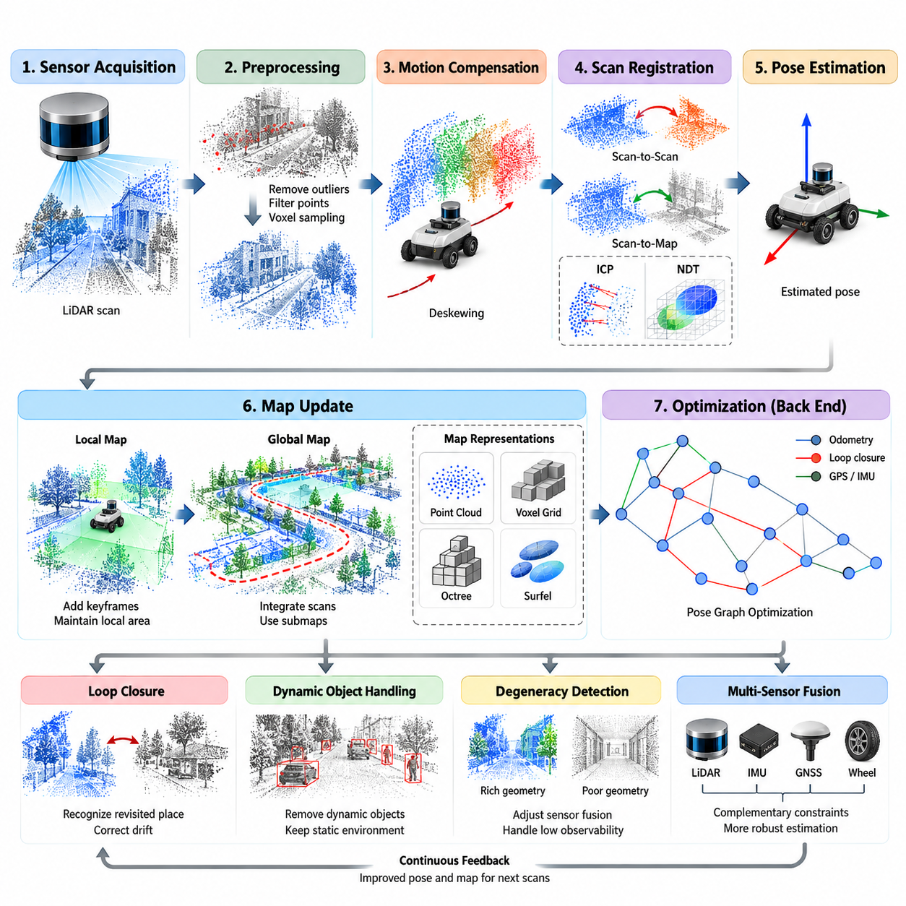
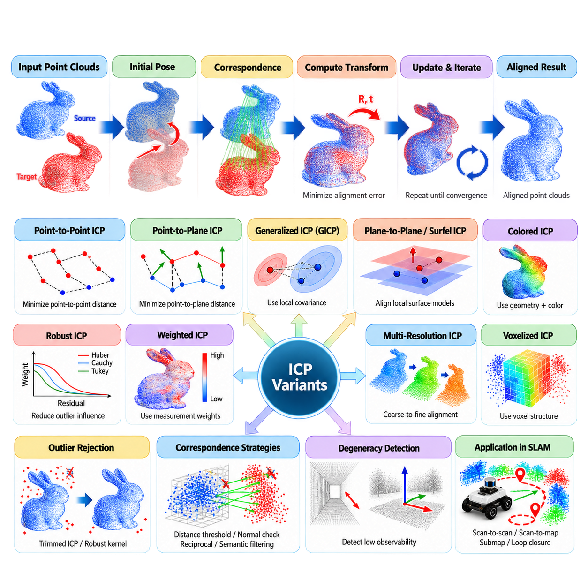
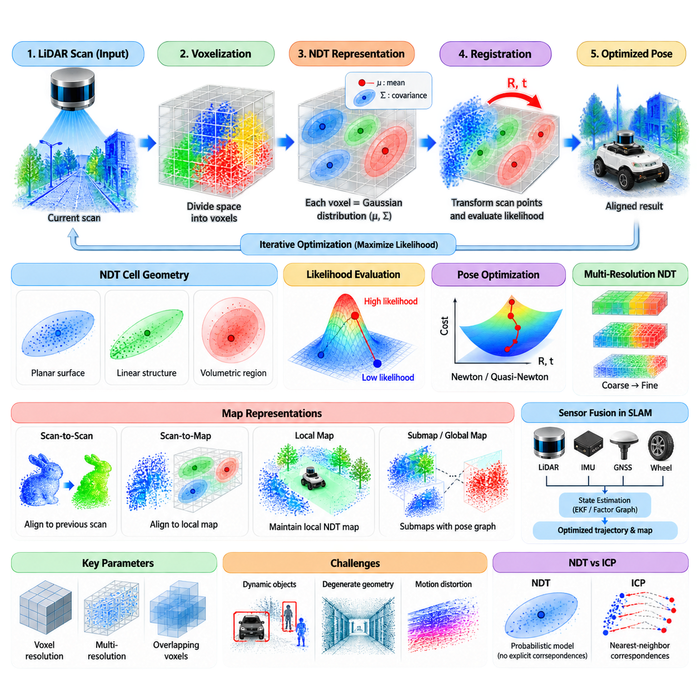
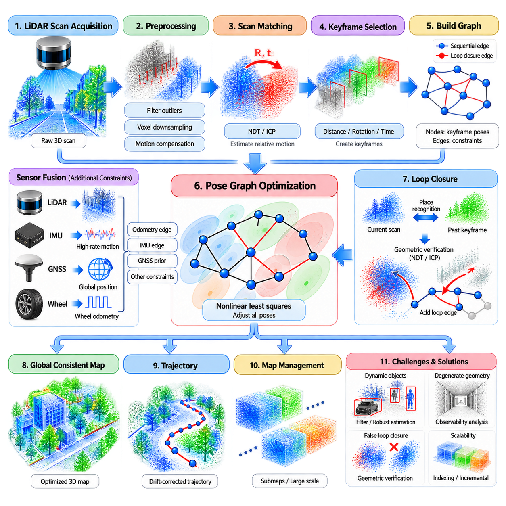
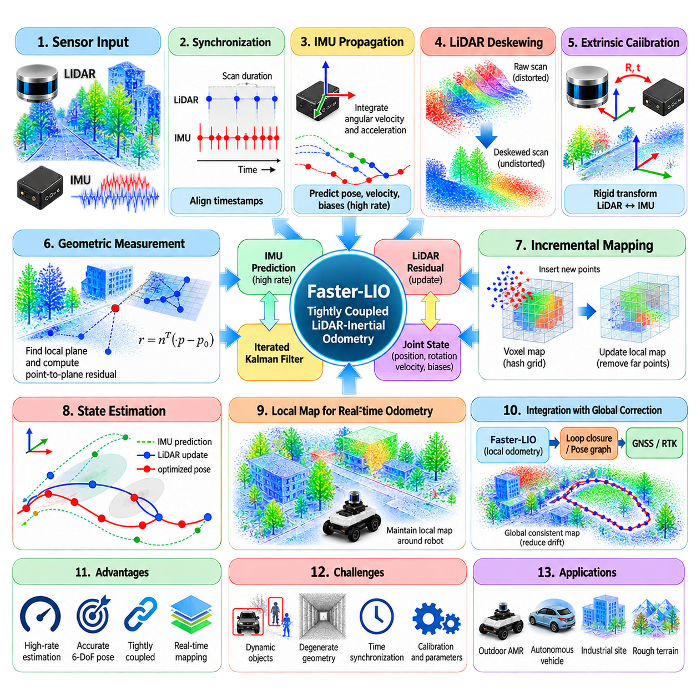
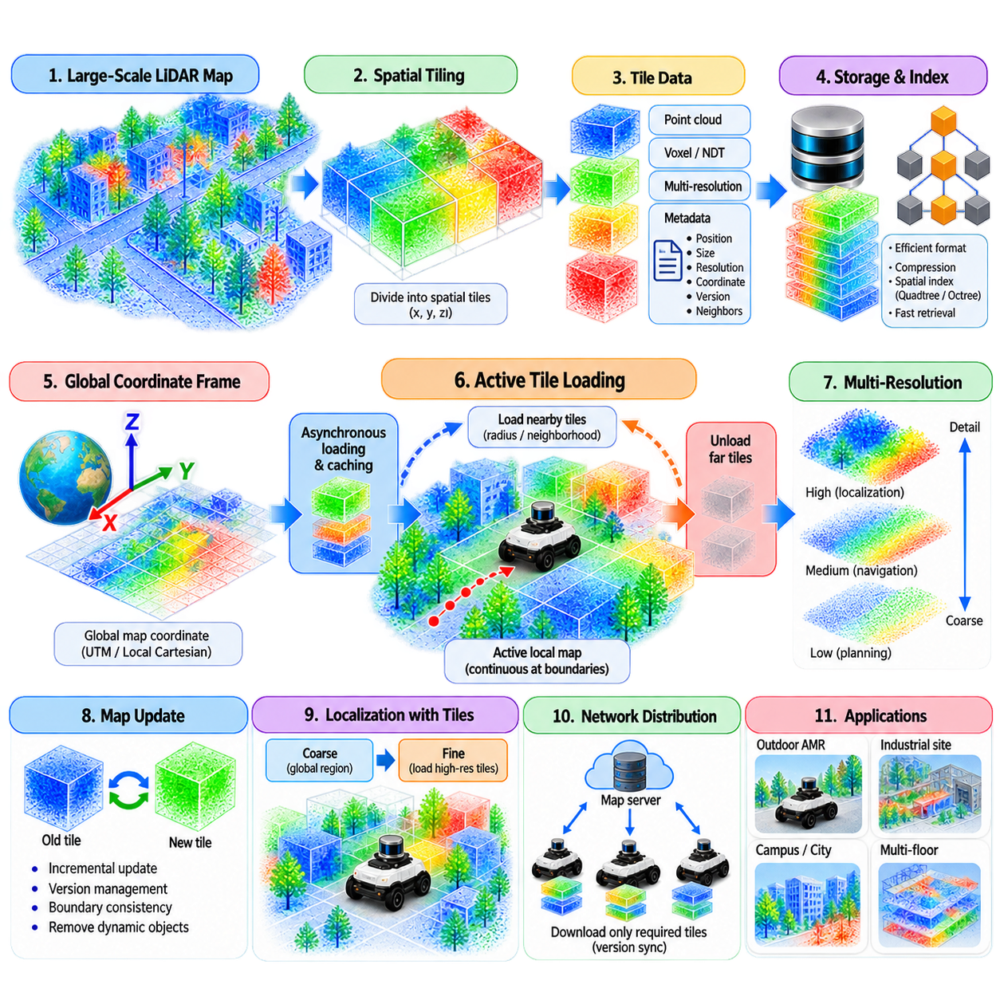
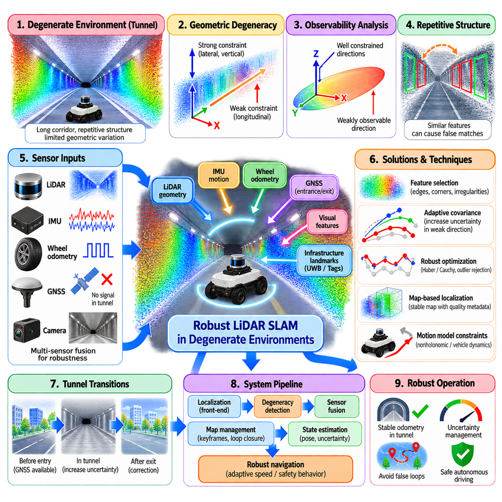
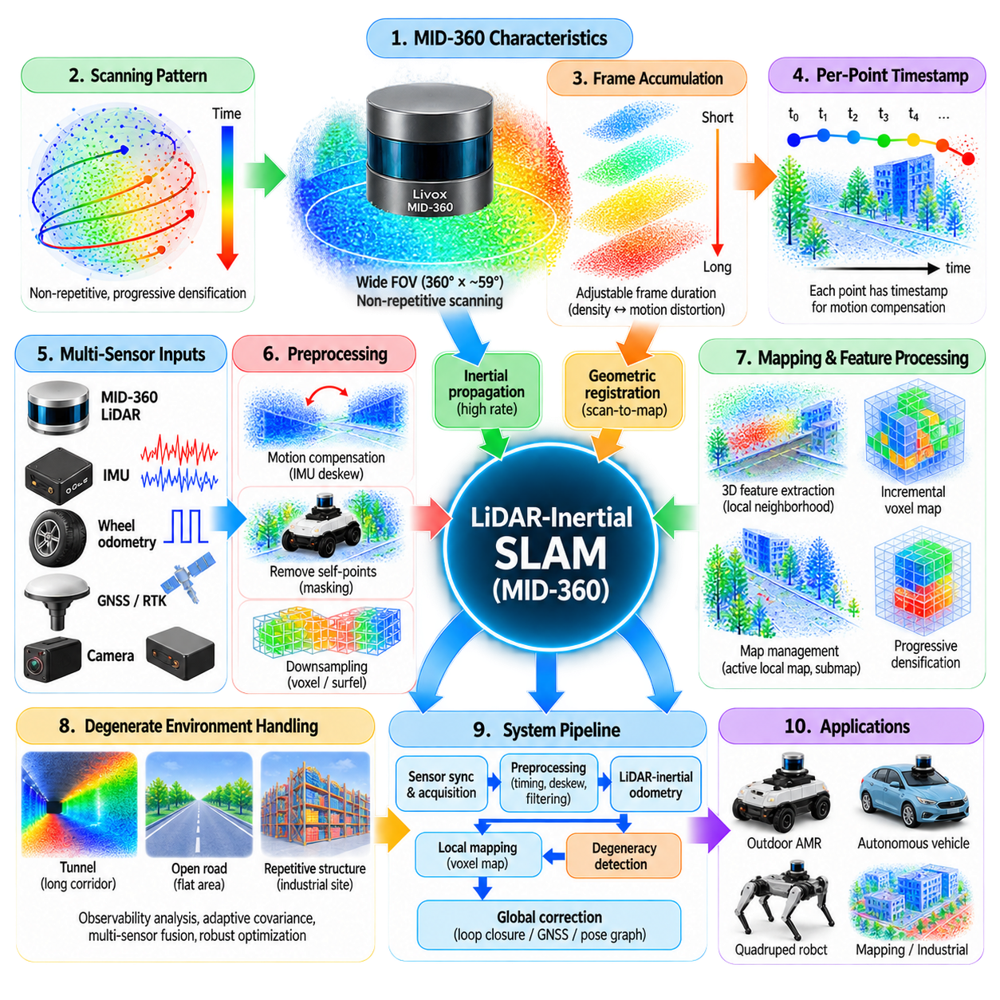
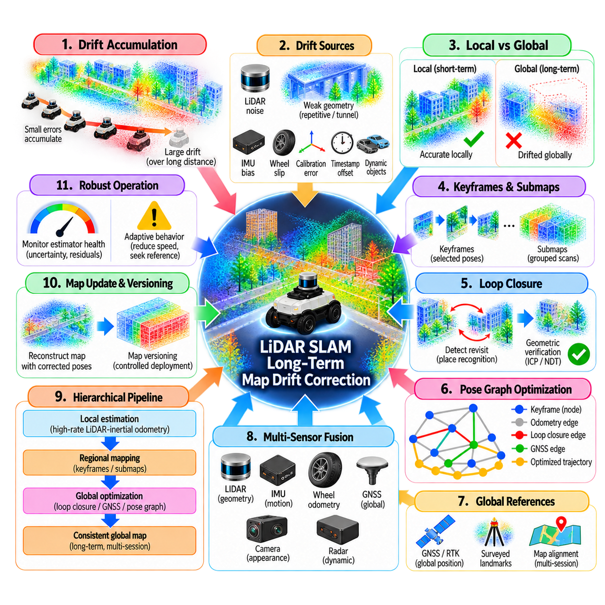
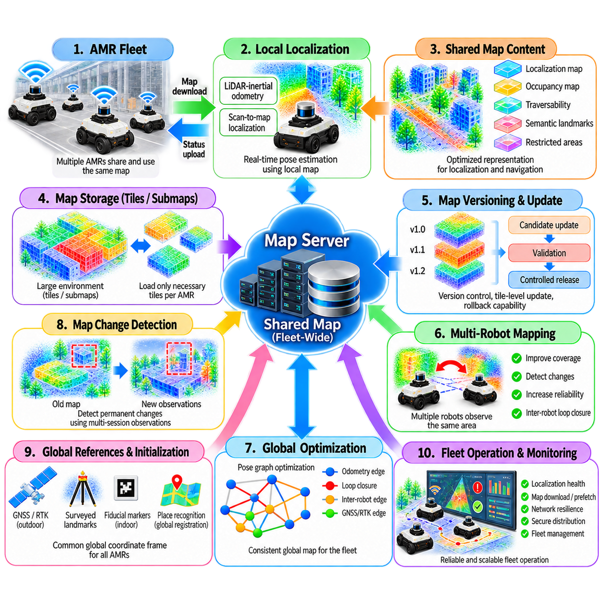

**Volume 13. Mapping Localization and SLAM**

# Chapter 06. LiDAR SLAM

## 06.01. LiDAR SLAM Pipeline Scan Registration Map Update

{width="7.268055555555556in" height="7.268055555555556in"}

LiDAR SLAM is a recursive estimation process that converts sequential laser scans into a consistent representation of robot motion and the surrounding environment. Its core pipeline typically consists of sensor acquisition, preprocessing, motion compensation, scan registration, pose estimation, map update, and optimization. Each stage transforms raw geometric observations into increasingly structured spatial information while maintaining uncertainty about the robot state and accumulated map.

A LiDAR sensor measures distances by emitting laser energy and observing its return from surrounding surfaces. A single acquisition produces a scan represented as ranges, angles, or three-dimensional points depending on the sensor architecture. Before registration, invalid returns, extremely near or distant measurements, isolated outliers, and redundant points are commonly removed. Voxel filtering or geometric sampling can reduce computational load while preserving structures useful for localization.

Real LiDAR scans are not necessarily instantaneous measurements. Mechanical spinning sensors collect points over a finite interval while the robot may simultaneously translate and rotate. This creates motion distortion, particularly on fast-moving outdoor AMRs or vehicles. Deskewing compensates individual points using timestamps and estimated motion obtained from an IMU, wheel odometry, or previous LiDAR states, producing a geometrically coherent scan referenced to a common time.

The registration stage estimates the rigid transformation that best aligns the current scan with previously observed geometry. Scan-to-scan registration compares consecutive measurements, whereas scan-to-map registration aligns new observations against an accumulated local or global map. The estimated transformation normally contains three-dimensional translation and rotation, providing the relative motion constraint required to propagate the robot pose through the SLAM trajectory.

Iterative Closest Point, or ICP, is a fundamental registration method that repeatedly establishes correspondences between two point sets and minimizes their geometric discrepancy. Point-to-point ICP minimizes Euclidean distances, while point-to-plane formulations exploit local surface normals and often converge more effectively in structured environments. ICP is conceptually simple, but its performance depends strongly on initialization, correspondence quality, environmental geometry, and rejection of dynamic objects.

Normal Distributions Transform, or NDT, represents reference points using probability distributions over spatial cells rather than requiring explicit point-to-point correspondences. Registration evaluates how well transformed scan points agree with these distributions and iteratively optimizes the transformation. NDT can provide efficient alignment for large point clouds and has been widely applied to vehicle localization, although voxel resolution and optimization parameters must be matched to sensor density and environmental scale.

Modern LiDAR SLAM systems frequently extract geometric features before registration. Planar regions, edges, surface patches, or locally distinctive structures can provide stronger constraints than indiscriminately processing every point. Feature selection reduces data volume and emphasizes stable geometry. However, feature-based approaches may degrade in environments where the expected structures are sparse, so many systems combine feature extraction with direct scan matching or adaptive geometric representations.

Registration requires a sufficiently accurate initial pose estimate because nonlinear optimization can converge to an incorrect local solution when displacement between scans is large. Wheel odometry, inertial measurements, GNSS, constant-velocity models, or the previous SLAM state can supply this prediction. LiDAR registration then corrects accumulated motion errors. This prediction-correction relationship is especially important for high-speed robots, rough terrain, rapid rotations, and scenes with limited geometric constraints.

After registration, the estimated relative transformation is integrated into the robot trajectory. The current pose can be expressed as a composition of the previous pose, predicted motion, and registration correction. Practical systems also estimate registration confidence using residual error, correspondence statistics, geometric degeneracy, or covariance approximations. Poorly constrained directions must be recognized because apparently successful alignment can still contain significant uncertainty along corridors, tunnels, or large planar surfaces.

Map update determines how newly registered measurements become part of the spatial representation. A simple point-cloud map inserts transformed points directly into a global coordinate frame, but unrestricted accumulation rapidly increases memory and computation. Voxel grids, octrees, surfels, probability distributions, or hierarchical submaps therefore provide more scalable representations. The choice depends on whether the map is intended primarily for localization, navigation, obstacle reasoning, visualization, or long-term operation.

Many real-time systems maintain a local map containing only geometry surrounding the current robot position. Incoming scans are registered against this local representation, and old regions are removed or transferred into larger submaps as the robot moves. This limits computational complexity and keeps registration focused on relevant geometry. Local mapping is particularly effective for outdoor AMRs operating over large facilities, roads, industrial sites, ports, campuses, or logistics environments.

A critical design issue is deciding which registered scans should update the map. Inserting every frame creates excessive redundancy, while aggressive reduction may eliminate useful geometric detail. Keyframe strategies add measurements only after translation, rotation, elapsed time, information gain, or registration-quality thresholds are exceeded. Keyframes therefore provide a compact history of meaningful observations and frequently become nodes in the higher-level optimization structure.

The front end of LiDAR SLAM primarily produces short-term motion estimates and local geometric constraints. Small registration errors nevertheless accumulate over long trajectories and cause drift. A back end addresses this problem using pose graphs, factor graphs, filtering, or nonlinear optimization. Relative LiDAR constraints can be combined with IMU, wheel encoder, GNSS, visual, or other measurements so that the trajectory is estimated from multiple complementary sources rather than from scan matching alone.

Loop closure occurs when the robot recognizes a previously visited region and establishes a constraint between poses that may be widely separated in time. Reliable loop closure can correct accumulated drift across the trajectory and restore global map consistency. Candidate detection may use geometric descriptors, scan context representations, place recognition methods, or map retrieval techniques, followed by precise registration to verify that the two observations genuinely correspond to the same location.

When optimization modifies historical poses, map geometry associated with those poses must remain consistent with the corrected trajectory. Submap-based architectures simplify this process by maintaining locally consistent map fragments connected through optimized transformations. Instead of continuously rebuilding one enormous point cloud, the system can adjust the relative poses of submaps. This architecture supports large-scale mapping while separating high-frequency local registration from lower-frequency global optimization.

Dynamic objects introduce another difficulty because SLAM ideally estimates motion relative to a static environment. Pedestrians, vehicles, forklifts, doors, machinery, vegetation, and other changing objects can produce incorrect correspondences or persistent artifacts in the map. Robust estimators, temporal consistency tests, semantic filtering, occupancy persistence, and correspondence rejection can reduce their influence. Long-term autonomous systems must distinguish transient observations from structures suitable for localization.

Registration quality also depends on environmental observability. A geometrically rich intersection may constrain all pose dimensions strongly, while a long corridor or flat open area can leave particular directions weakly observable. Degeneracy detection examines the geometry or optimization information to identify such conditions. The SLAM system can then increase reliance on inertial, wheel, GNSS, or other measurements instead of accepting an unreliable LiDAR correction with unjustified confidence.

Real-time implementation requires balancing accuracy, map resolution, registration frequency, and computational cost. Point reduction, parallel nearest-neighbor search, voxel hashing, incremental data structures, multiresolution alignment, CPU vectorization, and GPU acceleration can reduce latency. The processing deadline should be related to sensor frequency and vehicle dynamics: an accurate pose estimate delivered too late may be unsuitable for closed-loop autonomous navigation even if its offline error is small.

The complete pipeline therefore operates as a continuous feedback system rather than as an isolated sequence of algorithms. Raw scans are cleaned and deskewed, motion prediction initializes registration, geometric alignment estimates pose correction, validated observations update the local map, and optimized states improve subsequent registration. Loop closure and multi-sensor constraints periodically correct long-term inconsistency, allowing local accuracy and global consistency to reinforce each other throughout operation.

For an industrial or outdoor AMR, robust LiDAR SLAM must ultimately be evaluated as part of the autonomy system rather than only through registration error. Important considerations include localization continuity, recovery after temporary degradation, map stability, computational latency, memory growth, sensitivity to environmental change, and compatibility with navigation. A well-designed scan-registration and map-update pipeline provides the geometric backbone upon which reliable perception, planning, and autonomous operation can be built.

## 06.02. ICP Iterative Closest Point Variants [w/Code]

{width="7.268055555555556in" height="7.268055555555556in"}

Iterative Closest Point, or ICP, is one of the fundamental geometric registration methods used in LiDAR SLAM, localization, 3D reconstruction, and robotic perception. Its objective is to estimate the rigid transformation that aligns a source point cloud with a target point cloud or map. ICP repeatedly establishes correspondences, computes an alignment error, estimates a transformation, and updates the source until a convergence condition is reached.

The classical ICP pipeline begins with an initial estimate of the relative pose between two point sets. Each source point is associated with its nearest target point according to a distance metric, usually Euclidean distance. The transformation that minimizes the resulting correspondence error is then calculated and applied to the source cloud. These steps are repeated until the pose increment, residual error, or maximum iteration criterion indicates convergence.

A central limitation of ICP is that it performs local optimization rather than global registration. If the initial transformation is sufficiently close to the correct alignment, the algorithm can converge accurately and efficiently. If initialization is poor, however, nearest-neighbor associations may represent unrelated surfaces and guide optimization toward an incorrect local minimum. LiDAR odometry therefore commonly supplies ICP with predictions from previous poses, IMUs, wheel odometry, or motion models.

Point-to-point ICP is the most direct formulation. It minimizes the sum of squared Euclidean distances between corresponding source and target points. The optimal rigid transformation can be calculated using methods based on singular value decomposition or related closed-form solutions. Point-to-point ICP is simple and broadly applicable, but it may converge slowly because it ignores the local orientation and surface structure represented by neighboring points.

Point-to-plane ICP improves registration by minimizing the distance from each transformed source point to the tangent plane associated with its corresponding target point. Surface normals are estimated from local neighborhoods in the target cloud and incorporated into the residual function. This formulation captures local geometry more effectively than point-to-point distance and often provides faster convergence in environments dominated by walls, floors, roads, and other smooth surfaces.

Generalized ICP, commonly called GICP, combines concepts from point-to-point and point-to-plane registration using local covariance models. Each point is associated with a covariance matrix describing the geometric distribution of its neighborhood. Registration minimizes a probabilistically weighted error between corresponding local structures. This allows planar, linear, and volumetric geometry to influence optimization differently and often improves robustness for three-dimensional LiDAR data.

Plane-to-plane and distribution-aware variants extend this principle by aligning local surface models rather than individual measurements. Groups of neighboring points may be represented by planes, surfels, Gaussian distributions, or covariance ellipsoids. Such representations suppress measurement-level noise and provide compact geometric constraints. They are especially useful when high-density LiDAR produces many redundant samples from the same physical surfaces.

Correspondence generation strongly affects every ICP variant. A basic nearest-neighbor search may associate geometrically close but physically unrelated points, particularly around edges, repeated structures, or dynamic objects. Distance thresholds, normal-angle compatibility, reciprocal correspondences, neighborhood consistency, and semantic constraints can reject implausible matches. Efficient spatial structures such as k-d trees and voxel indexes reduce the cost of repeatedly searching large target clouds.

Outlier rejection is equally important because real-world point clouds rarely contain perfect overlap. Parts of the source scan may observe areas absent from the target, while moving vehicles, pedestrians, vegetation, reflective surfaces, and sensor noise create inconsistent measurements. Trimmed ICP retains only a selected fraction of low-residual correspondences, while robust kernels reduce the influence of large residuals instead of treating every match equally during optimization.

Robust ICP formulations frequently use M-estimators such as Huber, Cauchy, or Tukey functions to modify the contribution of residuals. Small errors remain influential because they are likely to represent valid correspondences, whereas unusually large errors receive reduced weight. Robust loss functions do not eliminate incorrect associations automatically, but when combined with correspondence filtering they significantly improve registration stability in cluttered and partially dynamic environments.

Weighted ICP assigns different importance to correspondences according to measurement reliability or geometric information. Weights may depend on range uncertainty, incidence angle, surface normal quality, local curvature, semantic class, or estimated sensor noise. For example, a stable building facade may provide stronger localization information than sparse vegetation. Weighting enables the optimizer to emphasize measurements that contribute reliable constraints to the desired motion dimensions.

Colored ICP combines geometric residuals with photometric or color information when point clouds contain RGB measurements. Geometry constrains spatial alignment, while appearance helps distinguish regions that are geometrically similar but visually different. Although this method is particularly relevant to RGB-D cameras and colored point clouds, the broader concept illustrates how ICP can incorporate additional observation channels rather than relying exclusively on Euclidean geometry.

Multi-resolution ICP addresses large point clouds and relatively large initial pose errors by performing registration across several spatial scales. Coarsely downsampled clouds are aligned first, providing a stable approximate transformation with relatively low computational cost. Finer-resolution levels then refine the solution using increasingly detailed geometry. This coarse-to-fine strategy enlarges the practical convergence region while reducing unnecessary processing of dense data during early iterations.

Voxelized ICP variants organize points into discrete spatial cells and perform correspondence or optimization operations using voxel-level structures. Voxelization can reduce memory access, accelerate neighborhood queries, and provide natural multiresolution representations. Modern implementations may combine voxel hashing, parallel correspondence search, SIMD processing, or GPU acceleration. These techniques are important when high-frequency 3D LiDAR must support real-time localization on autonomous mobile platforms.

Sparse ICP introduces sparsity-promoting formulations that can reduce sensitivity to large correspondence errors. Rather than relying purely on a conventional squared-error objective, sparse penalties encourage the optimizer to tolerate a limited number of substantial residuals while maintaining accurate alignment for consistent measurements. Such approaches can improve robustness under partial overlap and outliers, although their optimization procedures may be more computationally complex than classical ICP.

Probabilistic ICP variants explicitly model uncertainty in measurements, correspondences, or transformations. Instead of assuming that every point represents an exact location, these methods describe observations through probability distributions and optimize an uncertainty-aware objective. Covariance information can originate from sensor characteristics, local geometry, or state estimation. This framework provides a natural connection between scan registration and probabilistic SLAM back ends.

ICP can also be categorized according to the registration target. Scan-to-scan ICP aligns the current scan with the immediately preceding scan and therefore requires relatively limited map storage, but incremental errors can accumulate rapidly. Scan-to-map ICP aligns observations against an accumulated local map containing geometry from multiple previous scans. The richer target generally improves stability and reduces short-term drift, although map maintenance and computational complexity increase.

Submap-based ICP provides a compromise between purely consecutive registration and alignment against a continuously expanding global map. The current scan is matched against a bounded local submap constructed from selected keyframes. As the robot moves, the active submap is updated or replaced while completed submaps become higher-level mapping entities. This architecture supports predictable computation and integrates naturally with pose-graph optimization and loop closure.

Degenerate environments reveal an important limitation shared by ICP variants. A long planar wall can strongly constrain motion perpendicular to the surface while providing little information about motion parallel to it. Corridors, tunnels, flat roads, and open areas may similarly leave certain degrees of freedom weakly observable. Eigenvalue analysis, Hessian conditioning, or covariance estimation can identify these directions so that unreliable ICP corrections are not assigned excessive confidence.

Stopping criteria determine when iterative refinement should terminate. Registration may stop when translation and rotation updates fall below predefined thresholds, when the change in objective value becomes sufficiently small, or when a maximum number of iterations is reached. Practical real-time systems must balance numerical convergence against latency. Continuing optimization after meaningful improvement has stopped wastes computational resources without necessarily producing a more useful pose estimate.

The selection of an ICP variant should therefore reflect sensor characteristics, environment geometry, computational resources, and expected motion rather than treating one formulation as universally optimal. Point-to-point ICP offers simplicity, point-to-plane ICP efficiently exploits surfaces, GICP incorporates local geometric uncertainty, and robust or weighted variants address difficult measurements. Multiresolution and voxelized implementations further improve convergence behavior and real-time performance.

Within LiDAR SLAM, ICP is best understood as a configurable registration framework rather than a single fixed algorithm. Reliable systems combine appropriate residual models, correspondence policies, outlier rejection, initialization, uncertainty estimation, and computational acceleration. When these components are integrated with IMU, wheel odometry, GNSS, local mapping, and global optimization, ICP variants provide precise geometric constraints that form a central part of robust robot localization and mapping.

## 06.03. NDT Normal Distributions Transform SLAM [w/Code]

{width="7.268055555555556in" height="7.268055555555556in"}

Normal Distributions Transform, or NDT, is a geometric registration method widely used for LiDAR localization and SLAM. Instead of directly matching individual points between two scans, NDT converts the reference point cloud into a continuous probabilistic representation of local geometry. Registration then estimates the rigid transformation that places the incoming scan where its points achieve high likelihood within these spatial distributions.

The fundamental idea of NDT is to divide three-dimensional space into a set of cells or voxels. Points contained within each occupied voxel are summarized statistically rather than stored only as independent measurements. A mean vector describes the local center of the observations, while a covariance matrix characterizes their spatial distribution. Each populated cell can therefore be approximated as a multivariate Gaussian distribution representing local environmental geometry.

This statistical representation distinguishes NDT from correspondence-driven methods such as classical ICP. ICP repeatedly searches for explicit point-to-point or point-to-surface correspondences, whereas NDT evaluates transformed scan points against probability distributions defined by the reference map. The optimization objective is therefore based on distribution likelihood rather than a collection of discrete nearest-neighbor distances, reducing dependence on explicit correspondence searches during iterative registration.

The covariance matrix inside each NDT cell contains useful geometric information. Points sampled from a planar wall produce a distribution with large variance along the surface and small variance perpendicular to it. Linear structures produce another characteristic eigenvalue pattern, while irregular volumetric regions generate more balanced distributions. NDT consequently captures local orientation and shape implicitly through statistics without requiring every raw point to participate independently in optimization.

The registration process begins with an initial estimate of the sensor or robot pose. Each point from the current LiDAR scan is transformed according to this estimate and associated with the corresponding NDT cell in the reference representation. The probability density of the transformed point is evaluated using the cell mean and covariance. Contributions from many scan points are combined into an objective function that measures overall agreement between the scan and map.

Optimization adjusts the translation and rotation parameters to maximize the likelihood, or equivalently minimize an appropriate negative score, of the transformed scan within the NDT map. Gradients and, in many implementations, second-order information are calculated from the probabilistic objective. Newton-type, quasi-Newton, or related numerical methods can then iteratively update the pose until the transformation converges or predefined termination conditions are reached.

As with ICP, NDT is fundamentally a local registration technique and therefore benefits from a reliable initial pose estimate. Previous SLAM poses, wheel odometry, IMU integration, GNSS, or constant-velocity prediction can place the optimizer within an appropriate convergence region. A poor initialization may cause the transformed points to enter unrelated distributions, resulting in convergence toward an incorrect pose or failure to obtain a stable solution.

Voxel resolution is one of the most influential NDT parameters. Large cells contain many points and produce smooth distributions that can tolerate relatively large initial alignment errors, but they may suppress fine environmental details. Small cells preserve more geometric structure and potentially support precise registration, yet they may contain too few measurements for reliable covariance estimation and create a more complex optimization landscape.

Multi-resolution NDT addresses this tradeoff by performing registration at several voxel scales. Coarse distributions are used first to estimate large-scale alignment and provide a stable pose approximation. Registration is then repeated using progressively finer cells that preserve more detailed geometry. This coarse-to-fine strategy can enlarge the effective convergence region while retaining the accuracy available from high-resolution spatial information near the final solution.

NDT can operate in two-dimensional or three-dimensional form depending on the sensor and application. 2D NDT represents laser measurements in planar cells and is suitable for ground robots operating in approximately planar environments. 3D NDT models volumetric space using three-dimensional Gaussian distributions and is more appropriate for modern multi-beam LiDAR systems, autonomous vehicles, outdoor AMRs, mining machines, and robots moving through complex terrain.

Scan-to-scan NDT aligns the current LiDAR measurement with a representation constructed from a previous scan. This architecture is relatively simple and limits the amount of reference data, but errors can accumulate because every estimate depends strongly on preceding registrations. Scan-to-map NDT instead aligns the current scan against a local map containing observations from multiple poses, providing richer geometric constraints and generally improving short-term localization stability.

Local-map NDT is particularly useful for large-scale robotic operation. Rather than representing an entire environment at full resolution during every registration cycle, the system maintains NDT cells around the current robot location. As the platform moves, new regions are introduced and distant regions are removed, archived, or stored as submaps. This bounded representation supports predictable memory consumption and registration time while preserving nearby localization features.

Submap-based NDT extends local mapping by organizing the environment into independently manageable probabilistic map fragments. Each submap can contain NDT distributions created from multiple registered scans, while higher-level transformations connect the submaps into a global representation. Pose-graph optimization can subsequently adjust these transformations after loop closure or GNSS correction without requiring every raw LiDAR point to be globally reprocessed.

Several NDT variants modify how distributions are constructed or compared. Distribution-to-distribution approaches represent both source and target data statistically instead of treating the source solely as individual points. Other methods use overlapping cells, adaptive voxel sizes, hierarchical grids, or neighborhood distributions to reduce sensitivity to artificial voxel boundaries. These extensions seek to improve smoothness, accuracy, computational efficiency, or robustness across different environments.

Dynamic objects remain problematic because NDT assumes that local distributions describe persistent environmental structure. Vehicles, pedestrians, machinery, vegetation, and other changing elements can modify cell statistics or generate inconsistent likelihoods. Temporal filtering, occupancy persistence, semantic segmentation, motion detection, and robust weighting can prevent transient measurements from dominating the reference distributions used for localization.

Degenerate geometry can also weaken NDT pose estimation. A long tunnel, flat road, repetitive warehouse aisle, or large planar surface may produce distributions that strongly constrain some motion directions but provide little information in others. The Hessian, covariance, eigenvalues, or other observability indicators can be inspected to identify poorly constrained dimensions. Sensor fusion can then supply complementary information rather than accepting uncertain NDT updates as equally reliable.

NDT integrates naturally with multi-sensor state estimation. An IMU provides high-rate rotational and acceleration information, wheel encoders contribute short-term planar motion, and GNSS supplies globally referenced position where signals are available. NDT contributes geometric constraints derived from the surrounding environment. Extended Kalman filters, factor graphs, or nonlinear optimization can combine these measurements according to their uncertainty and temporal characteristics.

For outdoor AMRs, motion distortion must often be addressed before NDT registration. A rotating LiDAR acquires points at different times while the platform may be translating, turning, or traversing uneven terrain. IMU-assisted deskewing transforms measurements to a common reference time before building or querying NDT distributions. Without this correction, a distorted scan may disagree with the map even when the underlying pose prediction is otherwise accurate.

Computational performance depends on voxel lookup, distribution construction, objective evaluation, derivative calculation, and numerical optimization. Efficient grid indexing, voxel hashing, parallel processing, SIMD operations, multithreading, and GPU acceleration can reduce registration latency. Incremental map updates are also valuable because recomputing every Gaussian distribution whenever a new scan arrives would be unnecessarily expensive for continuously operating robotic systems.

Map updating requires careful statistical management. When new registered points enter an existing cell, its mean and covariance can be updated incrementally rather than recalculated from all historical measurements. However, unrestricted accumulation may cause outdated observations to dominate long-term statistics. Sliding windows, decay mechanisms, confidence measures, or map maintenance policies can help NDT representations adapt when industrial or outdoor environments change over time.

Registration quality should not be evaluated only by the final optimization score. A low numerical cost may still correspond to an incorrect pose in repetitive or weakly constrained environments. Practical systems therefore consider convergence state, pose increment, likelihood, number of contributing cells, geometric observability, predicted motion consistency, and disagreement with other sensors. These indicators allow the localization system to reject or down-weight suspicious NDT solutions.

Compared with ICP, NDT replaces explicit nearest-neighbor correspondence with a probabilistic spatial model, which can provide smooth optimization and efficient map interaction. ICP variants may offer highly precise surface alignment when reliable correspondences and normals are available, whereas NDT can be attractive for structured map-based localization and large point sets. The appropriate choice depends on environment geometry, initialization quality, map representation, hardware, and latency requirements.

In a complete LiDAR SLAM architecture, NDT normally serves as the front-end registration component rather than the entire SLAM solution. Its pose estimates and uncertainty information become constraints for a back-end estimator, while keyframes, loop closures, GNSS observations, and inertial measurements correct accumulated drift. The optimized trajectory can subsequently update submap poses and improve the reference representation used by future NDT registration.

NDT should therefore be viewed as both a registration algorithm and a probabilistic geometric representation connecting LiDAR measurements with state estimation. Its voxel distributions compress environmental structure, its optimization estimates robot motion, and its map architecture can scale from local localization to large-area SLAM. With suitable initialization, resolution management, dynamic filtering, uncertainty handling, and sensor fusion, NDT provides a practical foundation for robust LiDAR-based autonomy.

## 06.04. HDL Graph SLAM Full 3D Loop Closure [w/Code]

{width="7.268055555555556in" height="7.268055555555556in"}

HDL Graph SLAM is a graph-based three-dimensional SLAM architecture designed primarily for LiDAR-equipped mobile robots and vehicles. It combines sequential point-cloud registration with pose-graph optimization to construct globally consistent 3D maps over extended trajectories. Rather than treating each estimated pose independently, the system represents robot states as graph nodes and sensor-derived spatial relationships as edges that can be jointly optimized.

The front end begins with sequential 3D LiDAR scans acquired while the platform moves through the environment. Raw measurements typically require filtering, downsampling, and coordinate transformation before registration. Voxel-grid filtering reduces redundant points while retaining major geometric structures. Depending on the sensor and vehicle dynamics, motion compensation may also be required so that points acquired at different times are expressed in a consistent scan reference frame.

Scan matching estimates relative motion between successive LiDAR observations. HDL Graph SLAM commonly employs registration methods such as Normal Distributions Transform or Iterative Closest Point variants to determine the transformation between scans or between a scan and a local reference. The resulting translation and rotation estimate provides a relative-pose constraint that can be inserted into the graph rather than being used only as an irreversible incremental trajectory update.

A pose graph expresses the SLAM problem as a network of robot poses connected by spatial constraints. Each node typically represents the six-degree-of-freedom pose of a keyframe, including three-dimensional position and orientation. Edges encode measured transformations between nodes together with uncertainty or information matrices. Sequential scan-matching edges form the basic chain of the trajectory, while additional sensors and loop closures introduce complementary constraints.

Keyframes prevent the graph from growing unnecessarily with every LiDAR measurement. A new keyframe can be created when translation, rotation, time, or other motion criteria exceed predefined thresholds. The associated point cloud and estimated pose are stored for subsequent mapping and optimization. Selecting meaningful keyframes reduces computational load while preserving sufficient spatial information for registration, loop detection, and reconstruction of the surrounding environment.

A major advantage of graph-based SLAM is that historical poses remain adjustable. Pure incremental odometry integrates relative motion continuously, so small registration errors accumulate as trajectory drift. In a pose graph, sequential constraints can later be reconsidered together with newly discovered information. Nonlinear graph optimization searches for the set of node poses that best satisfies all available constraints, distributing corrections across the trajectory instead of applying them only to the latest state.

Full 3D optimization distinguishes this architecture from systems that assume motion occurs strictly on a two-dimensional plane. Robot states may contain translation along x, y, and z together with roll, pitch, and yaw. This capability is important for outdoor AMRs, autonomous vehicles, ramps, slopes, uneven industrial sites, underground environments, and multi-level facilities where terrain geometry or vehicle attitude cannot be represented accurately by planar motion alone.

Loop closure is essential for controlling long-term drift. When the robot returns to a previously visited region, the system attempts to determine whether the current observation corresponds to an earlier keyframe or map area. A valid loop closure creates an additional edge connecting graph nodes that may be separated by a long time interval. This new constraint provides information capable of correcting accumulated positional and rotational errors throughout the trajectory.

Loop candidates can be identified using spatial proximity, pose predictions, geometric descriptors, or place-recognition methods. Candidate generation alone is insufficient because perceptually similar environments may produce false matches. The associated point clouds therefore require geometric verification using registration. A loop constraint should be inserted only when alignment quality, overlap, transformation plausibility, and other validation criteria indicate that the observations represent the same physical location.

False loop closures can severely deform an otherwise valid map because graph optimization attempts to satisfy every accepted constraint. Robust kernels and consistency checks reduce the influence of questionable edges. Methods such as Huber-type losses can down-weight constraints with unexpectedly large residuals, while additional geometric validation can reject them before optimization. Reliable loop handling therefore requires both candidate detection and conservative verification.

Graph optimization is formulated as a nonlinear least-squares problem. For each edge, the transformation predicted from the connected node poses is compared with the transformation measured by registration or another sensor. The resulting residual is weighted by its information matrix, and the optimizer adjusts graph states to minimize the combined error. Libraries based on graph optimization frameworks can efficiently solve sparse systems containing large numbers of poses and constraints.

Information matrices determine how strongly individual edges influence the optimized solution. A precise LiDAR registration constraint should generally contribute more strongly than an uncertain measurement, while weak or degenerate alignment should contribute less. Estimating realistic uncertainty is therefore important. Registration residuals, local geometry, Hessian properties, covariance approximations, sensor characteristics, or empirical models can provide information about constraint reliability.

HDL Graph SLAM can incorporate multiple sensor modalities in addition to LiDAR. IMU measurements provide orientation and high-frequency motion information, GNSS contributes globally referenced position, and wheel odometry provides short-term motion constraints. These observations can be represented as graph edges, priors, or preprocessing inputs. Their complementary characteristics improve robustness when LiDAR geometry alone does not sufficiently constrain every degree of freedom.

GNSS constraints are particularly valuable for large outdoor maps because loop closures may occur infrequently over long routes. Global position measurements can limit accumulated drift and anchor the graph to a geographic coordinate system. However, GNSS accuracy varies significantly around buildings, vegetation, tunnels, and reflective structures. Measurements should therefore be weighted according to quality rather than being treated as exact global positions.

Floor or ground-plane constraints can also stabilize full 3D mapping when the operating environment provides meaningful planar structure. Estimated ground planes may constrain roll, pitch, or vertical motion and reduce gradual deformation of the trajectory. Such constraints must be applied carefully in environments containing steep slopes, ramps, rough terrain, or multiple floor orientations, where an overly rigid planar assumption could introduce systematic mapping errors.

After graph optimization changes keyframe poses, the global point-cloud map must reflect the corrected trajectory. Rather than permanently merging every measurement into a fixed cloud at acquisition time, keyframe point clouds can remain associated with their graph nodes. The map is reconstructed by transforming each stored cloud according to its optimized pose. This approach enables loop-closure corrections to propagate naturally into the final 3D environment representation.

Map generation introduces a tradeoff between geometric detail and computational cost. Combining all raw points can produce extremely dense maps that require large amounts of memory and storage. Voxel downsampling, local aggregation, keyframe selection, and resolution management reduce this burden. Different map products may also be generated for visualization, localization, obstacle avoidance, navigation, or offline inspection rather than requiring one representation to serve every purpose.

Dynamic environments create challenges because graph constraints should ideally be derived from static geometry. Moving vehicles, pedestrians, forklifts, machinery, vegetation, and temporary objects can corrupt registration or create misleading loop matches. Statistical filtering, temporal persistence, semantic segmentation, robust estimation, and local-map management can reduce their influence. Long-term deployment additionally requires distinguishing permanent structural changes from transient scene variation.

Degenerate geometry can cause apparently successful registration while leaving particular motion dimensions weakly constrained. Long corridors, tunnels, flat roads, and open spaces are common examples. If such a registration edge is assigned excessive confidence, graph optimization can propagate its error to other poses. Observability analysis and uncertainty-aware weighting allow the system to reduce reliance on weak LiDAR constraints and increase the contribution of IMU, GNSS, or wheel information.

The computational architecture typically separates high-frequency front-end processing from lower-frequency back-end optimization. LiDAR registration must provide poses rapidly enough for local navigation, while graph optimization and loop detection can operate asynchronously. This separation prevents expensive global corrections from blocking real-time perception and control. When an optimized trajectory becomes available, corrected poses and maps can be published without interrupting continuous scan processing.

Large-scale operation requires careful management of graph size and point-cloud storage. Thousands of keyframes and loop candidates can increase optimization, search, and memory costs. Spatial indexing, incremental optimization, submaps, selective loop searches, keyframe pruning, and hierarchical representations can improve scalability. The objective is to preserve globally useful constraints while avoiding computation on redundant measurements that contribute little new information.

HDL Graph SLAM therefore connects local geometric registration with global trajectory reasoning. The front end converts LiDAR observations into relative-motion constraints, while the graph back end maintains a revisable history of robot poses. Loop closure, GNSS, IMU, odometry, and structural constraints provide additional relationships that can correct accumulated drift. The optimized keyframe poses then become the foundation for reconstructing a globally consistent three-dimensional map.

For an outdoor or industrial AMR, successful deployment depends on more than obtaining an attractive point-cloud reconstruction. Localization continuity, loop-closure reliability, optimization latency, map consistency, sensor synchronization, recovery from registration failure, memory growth, and behavior under environmental change must all be considered. A well-designed full 3D graph-SLAM system provides a scalable framework in which local LiDAR accuracy and global spatial consistency can reinforce each other throughout long-term autonomous operation.

## 06.05. Faster LIO Incremental LiDAR Inertial Odometry [w/Code]

{width="7.268055555555556in" height="7.268055555555556in"}

Faster-LIO is a tightly coupled LiDAR-inertial odometry framework designed for high-rate, accurate state estimation from 3D LiDAR and IMU measurements. Its central objective is to estimate robot motion incrementally while continuously maintaining a local geometric map. By combining high-frequency inertial prediction with LiDAR geometric correction, the system can remain responsive during rapid translation, rotation, and complex six-degree-of-freedom motion.

LiDAR and IMU provide complementary information. A LiDAR directly measures surrounding geometry but normally operates at a lower frequency and collects points over a finite scan interval. An IMU produces high-rate angular velocity and linear acceleration but accumulates drift when integrated over time. Faster-LIO combines these sensors so that inertial measurements predict short-term motion while LiDAR observations repeatedly constrain accumulated state error using environmental geometry.

Accurate temporal synchronization is fundamental to LiDAR-inertial odometry. Individual LiDAR points may be measured at different times during a scan, while IMU samples arrive much more frequently. The estimator must associate these measurements with a consistent time base. Even small timestamp offsets can create systematic registration errors during rapid motion, so hardware synchronization or carefully calibrated software timing is highly desirable for reliable operation.

IMU preprocessing provides the motion information required between LiDAR updates. Angular velocity and acceleration measurements are integrated to propagate orientation, velocity, and position while accounting for gravity and sensor biases. This propagation generates a predicted state at the time associated with each LiDAR measurement. The prediction is not treated as permanently correct because accelerometer and gyroscope biases gradually produce drift that must be corrected by geometric observations.

A rotating or scanning LiDAR does not capture the complete point cloud at one instant. If the robot moves during acquisition, different points are expressed from slightly different sensor poses, creating motion distortion. Faster-LIO uses IMU-derived motion estimates to deskew the point cloud, transforming measurements toward a common reference time. This produces a geometrically coherent scan that can be compared more reliably with the maintained local map.

Extrinsic calibration defines the rigid transformation between the LiDAR and IMU coordinate frames. Errors in relative translation or rotation directly affect motion compensation and geometric residuals, especially during strong rotational motion. Accurate calibration is therefore essential for tightly coupled estimation. Some LiDAR-inertial systems can refine extrinsic parameters online, while others rely on carefully measured and validated offline calibration before autonomous operation.

After motion compensation, LiDAR points are transformed into the predicted world or map frame and compared with nearby map geometry. Rather than aligning two complete point clouds through a conventional standalone ICP procedure, LiDAR-inertial odometry can formulate geometric residuals directly between selected scan points and local surface structures. These residuals measure disagreement between the inertially predicted pose and the geometry already represented in the local map.

Local planar structures are particularly useful for geometric correction. Neighboring map points around a transformed LiDAR measurement can be retrieved and used to estimate a plane. The point-to-plane distance becomes a residual that constrains the robot state. Measurements associated with poorly defined neighborhoods, excessive residuals, dynamic objects, or unreliable geometry can be rejected so that unstable correspondences do not dominate the estimator.

The estimator jointly reasons about position, orientation, velocity, gravity-related quantities, and IMU biases rather than estimating only a rigid scan transformation. In tightly coupled formulations, LiDAR residuals directly update the navigation state predicted by the IMU. This differs conceptually from loosely coupled architectures in which a separate LiDAR odometry module first generates poses that are subsequently fused with inertial estimates.

Iterated Kalman filtering is commonly associated with modern tightly coupled LiDAR-inertial odometry. An initial state predicted from IMU propagation is repeatedly linearized against LiDAR geometric measurements. Each iteration computes corrections that reduce residuals between transformed scan points and map surfaces. Re-linearization around the updated state improves estimation when measurement models are nonlinear and the initial prediction is not sufficiently close to the final solution.

A major contribution of Faster-LIO is its emphasis on efficient incremental spatial data structures for local mapping and nearest-neighbor queries. Conventional point-cloud maps can become computationally expensive when every incoming scan requires repeated searches, insertion, and deletion. Efficient voxel-based organization allows the estimator to access nearby geometric information rapidly while controlling the number of stored points and the cost of continuously updating the map.

Voxel representations divide space into discrete three-dimensional cells and associate local map information with occupied regions. Hash-based or similarly efficient indexing can provide approximately direct access to relevant cells without searching an entire point cloud. This organization is well suited to online LiDAR processing because new observations can be inserted incrementally, nearby points can be queried efficiently, and distant or unnecessary map regions can be managed independently.

Incremental mapping means that the map evolves continuously as the robot moves. After the current state has been corrected, accepted LiDAR points are transformed into the map frame and inserted into the local representation. Redundant measurements may be removed or downsampled to prevent uncontrolled growth. The updated map then becomes the geometric reference for subsequent scans, creating a continuous prediction-correction-map-update cycle.

A local map is generally preferable to an indefinitely expanding global point cloud for real-time odometry. Only geometry surrounding the robot is required for immediate scan-to-map constraints. As the platform moves, new spatial regions enter the active map while distant regions can be discarded, archived, or handled separately. Bounding the active map helps maintain predictable memory use and nearest-neighbor search performance during long trajectories.

Faster-LIO is fundamentally an odometry and local mapping system, so long-term global consistency must be distinguished from short-term estimation accuracy. Incremental LiDAR-inertial estimation can substantially reduce drift but cannot guarantee a globally drift-free trajectory over arbitrarily long operation. Loop closure, GNSS constraints, pose-graph optimization, or other global corrections can be added at a higher level when globally consistent maps are required.

The tight coupling between LiDAR and IMU provides important advantages during aggressive motion. IMU propagation supplies high-frequency pose prediction when consecutive LiDAR scans have significant displacement, while LiDAR geometry prevents inertial integration from drifting without bound. This relationship also improves deskewing because the same motion estimate used for state propagation can describe sensor motion throughout the LiDAR acquisition interval.

Nevertheless, LiDAR-inertial estimation remains sensitive to observability. Long corridors, flat roads, tunnels, large walls, or open environments may provide weak geometric constraints along particular directions. In such situations, some state variables become difficult to estimate from LiDAR geometry alone. IMU information helps preserve short-term continuity, but external measurements such as GNSS, wheel odometry, or additional perception may be required for stronger long-term constraints.

IMU initialization is another important stage because gravity direction, initial orientation, velocity, and sensor biases influence subsequent propagation. If initialization occurs while the platform is stationary, gravity and bias-related quantities can often be estimated more reliably. Systems intended to initialize during motion require more sophisticated observability handling. Poor initialization can produce distorted deskewing, inconsistent map geometry, and slow or unstable convergence.

Dynamic objects also violate the assumption that geometric residuals originate from a static environment. Vehicles, pedestrians, forklifts, vegetation, and moving machinery can introduce map points that later become inconsistent. Residual thresholds, neighborhood checks, temporal filtering, semantic processing, or map-aging strategies can reduce their influence. Industrial deployment should therefore consider not only estimator accuracy but also the persistence policy of the local geometric map.

Computational efficiency is critical because IMU propagation, deskewing, neighborhood search, residual construction, iterative state updates, and map insertion must all occur within the LiDAR frame period. Faster-LIO targets this problem by reducing expensive spatial operations and maintaining an incrementally updated map. Efficient CPU implementation can therefore support high-rate estimation without requiring every stage to depend on computationally heavy global registration.

Parameter selection affects both accuracy and real-time performance. Voxel size determines map density and geometric detail, neighborhood settings influence plane estimation, residual thresholds control correspondence rejection, and local-map dimensions affect memory and search cost. Excessively dense maps may increase computation without improving observability, whereas overly coarse representations can remove structures required for accurate geometric correction.

Sensor characteristics should also influence configuration. A high-channel-count spinning LiDAR produces dense observations but may impose substantial processing load, while solid-state or non-repetitive scanning sensors generate different spatial sampling patterns. IMU noise density, bias stability, measurement frequency, LiDAR range accuracy, and field of view all affect estimator behavior. Parameters should therefore be validated using the actual sensor configuration and expected vehicle dynamics.

The state estimate produced by Faster-LIO can support downstream autonomous functions such as local navigation, obstacle mapping, motion planning, and sensor-frame transformation. High-rate pose output is particularly valuable when perception modules must transform asynchronous observations into a common world frame. However, safety-critical control should also monitor estimator health, timestamp validity, innovation magnitude, and sensor availability rather than assuming every published pose is equally reliable.

For outdoor AMRs, rough terrain introduces simultaneous translation, roll, pitch, vibration, and rapid changes in vertical acceleration. These conditions make planar odometry assumptions inadequate and increase the value of full 3D LiDAR-inertial estimation. Mechanical vibration isolation, rigid sensor mounting, synchronization, calibration, and appropriate IMU quality become important because software estimation cannot completely compensate for unstable hardware integration or corrupted measurements.

A practical architecture can use Faster-LIO as the high-rate local state-estimation layer and connect it to a slower global localization layer. GNSS or RTK can provide geographic anchoring outdoors, while loop closure and pose-graph optimization can correct accumulated drift in repeated areas. The local estimator continues producing smooth real-time motion estimates while the global layer manages long-term consistency, map alignment, and mission-level coordinates.

Faster-LIO therefore represents more than a faster point-cloud registration algorithm. Its essential concept is the efficient integration of inertial propagation, LiDAR motion compensation, geometric measurement updates, and incremental map management within one tightly coupled estimation cycle. This architecture allows local geometry and high-frequency inertial motion to continuously correct each other while keeping computational cost suitable for real-time robotic operation.

When deployed correctly, the framework provides a strong foundation for high-rate six-degree-of-freedom localization in autonomous vehicles and mobile robots. Its practical performance depends on synchronization, calibration, initialization, sensor quality, environmental observability, map parameters, and computational resources. Combined with an appropriate global correction layer, incremental LiDAR-inertial odometry can form the real-time localization backbone of scalable outdoor and industrial autonomous systems.

## 06.06. Large Scale LiDAR Map Tiling and Loading [w/Code]

{width="7.268055555555556in" height="7.268055555555556in"}

Large-scale LiDAR mapping requires a different data-management strategy from small indoor SLAM because a continuously accumulated point cloud can eventually exceed practical memory and processing limits. Map tiling divides a large three-dimensional environment into manageable spatial units that can be stored, indexed, loaded, updated, and removed independently while preserving a consistent global coordinate system.

The fundamental concept is spatial partitioning. Instead of representing an entire city, industrial complex, port, campus, mine, or logistics site as one monolithic point cloud, the environment is divided according to predefined geographic regions. Each tile contains LiDAR geometry belonging to a bounded area and carries metadata describing its position, spatial extent, resolution, coordinate frame, version, and relationship to neighboring tiles.

A simple tiling scheme divides the horizontal map plane into regular square cells using global x and y coordinates. A point can be assigned to a tile by quantizing its position according to the selected tile dimensions. Three-dimensional partitioning may additionally divide the vertical axis when structures contain tunnels, bridges, underground spaces, or multiple floors. The appropriate strategy depends on environmental scale and expected robot motion.

Tile size introduces an important engineering tradeoff. Large tiles reduce the number of files and indexing operations but require more memory and loading time whenever only a small portion of the environment is needed. Small tiles support fine-grained streaming and efficient local access but increase metadata, file-system, and management overhead. Tile dimensions should therefore be selected according to map density, storage architecture, localization range, and vehicle speed.

The global coordinate frame provides the common spatial reference that makes independently stored tiles behave as one map. Outdoor systems may use a local Cartesian frame derived from GNSS coordinates or a projected geographic coordinate system. Large coordinate values should be handled carefully because floating-point precision can degrade geometric calculations. Local tile coordinates can be used internally while tile origins preserve their relationship to the global map.

Each tile can contain raw points, downsampled point clouds, surfels, voxels, NDT distributions, occupancy information, or multiple map layers. Localization does not necessarily require the same representation used for visualization or archival storage. A system may retain a dense master map offline while generating lighter localization tiles containing only stable geometric features required for real-time scan matching.

Map generation typically begins by transforming registered LiDAR scans into a globally consistent reference frame. Points are assigned to spatial tiles according to their coordinates and accumulated until each tile is finalized or updated. Voxel downsampling can remove redundant measurements and control density. Statistical filtering, dynamic-object removal, ground classification, and intensity processing may also be applied before the map becomes a localization resource.

Tile boundaries require special consideration because LiDAR registration often uses geometry surrounding the robot rather than points located strictly inside one cell. If the vehicle approaches an edge, loading only its current tile can remove useful surfaces immediately across the boundary. Systems therefore load neighboring tiles or store overlapping margins so that the active local map remains geometrically continuous during transitions between spatial partitions.

The active map is the subset of tiles currently required for localization and navigation. The robot position determines a region of interest, and the map manager loads tiles intersecting that region. Tiles that move outside the active range can be released from memory. This dynamic loading and unloading process allows the total stored map to grow far beyond available RAM while keeping real-time computation bounded by local environmental complexity.

A radius-based loading policy selects all tiles within a specified distance from the robot, while grid-neighborhood policies load the current tile and a fixed number of adjacent cells. More advanced strategies consider vehicle heading, planned route, speed, sensor range, or predicted future poses. A fast-moving outdoor robot can preload tiles ahead of its trajectory so that map data is available before the localization front end requires it.

Asynchronous loading is important because storage latency should not block real-time state estimation. A dedicated map-management thread can monitor the predicted robot position, request required tiles, and populate a cache while the localization process continues using the current active map. Double buffering or staged map replacement can ensure that incomplete loading does not expose the registration algorithm to partially constructed reference geometry.

Caching further reduces storage access. Recently used tiles can remain in memory even after they leave the immediate localization region, allowing rapid reuse if the robot reverses direction or revisits a nearby area. Cache policies may consider recency, distance, expected route, memory pressure, and tile size. The objective is to minimize repeated disk or network transfers while maintaining a predictable upper bound on memory consumption.

Storage performance becomes significant when maps contain billions of points. Individual text-based point-cloud files are generally inefficient for large-scale streaming because parsing and storage overhead become substantial. Binary point-cloud formats, compressed tile packages, memory-mapped structures, spatial databases, or custom voxel representations can provide faster access. The storage design should support partial retrieval rather than requiring the entire global map to be decoded.

A hierarchical spatial index can improve scalability. At the highest level, coarse regions identify which part of the environment contains the robot, while lower levels provide increasingly detailed tiles. Quadtree structures partition two-dimensional space recursively, whereas octrees extend the concept to three dimensions. Hierarchical representations also support level-of-detail selection, allowing distant geometry to remain coarse while nearby localization regions use higher resolution.

Level of detail is valuable when the same map supports multiple consumers. A mission planner may require only coarse road or free-space information, while LiDAR localization needs detailed surfaces around the vehicle. Visualization may use another resolution entirely. Maintaining several representations prevents every subsystem from processing maximum-density point clouds and allows bandwidth, memory, and computation to be allocated according to actual task requirements.

Map tiling must also preserve sufficient overlap for scan-to-map registration. The active reference should normally extend beyond the LiDAR sensing region required by the registration algorithm. If the local map is too small, correspondence quality can degrade near its boundary and produce unstable pose estimates. Loading distance should therefore account for sensor range, expected pose uncertainty, motion between updates, and the geometric neighborhood required by the registration method.

Localization itself can be organized in two stages. A coarse global or regional localization process first determines which map region contains the robot, after which high-resolution tiles are loaded for precise scan matching. This architecture is useful when the initial pose is uncertain or the robot can start from multiple deployment locations. Place recognition, GNSS, map descriptors, or low-resolution registration can provide the initial region hypothesis.

Large maps require explicit version management because physical environments and map-processing algorithms change over time. Each tile can carry a map version, creation time, sensor source, calibration identifier, and processing configuration. Updating one region should not necessarily require rebuilding the entire map. Tile-level versioning allows construction zones, changed buildings, roads, racks, or equipment layouts to be replaced independently while unaffected regions remain valid.

Incremental updates create additional consistency requirements. A newly generated tile must align correctly with neighboring tiles and the global coordinate system before it replaces an older version. Boundary geometry can be checked for discontinuities, and overlapping regions can be compared statistically. Transactional replacement or atomic file switching prevents localization from reading a mixture of incomplete old and new map data during deployment.

Dynamic and temporary objects should normally be excluded from long-term localization tiles. Parked vehicles, pedestrians, movable containers, pallets, vegetation, and construction equipment can otherwise become misleading reference geometry. Multi-session mapping, temporal persistence analysis, semantic filtering, and occupancy statistics can identify structures that remain stable across observations. Stable-map extraction is especially important for industrial sites where scene configuration changes frequently.

Map quality metadata can help localization select reliable geometry. Individual tiles may store point density, timestamp, registration uncertainty, feature richness, dynamic probability, or expected localization quality. If a region contains sparse or repetitive geometry, the state estimator can reduce confidence in LiDAR matching and rely more strongly on IMU, wheel odometry, GNSS, or other sensors until stronger map constraints become available.

Network-based map distribution extends tiling to fleets of robots. A central server can maintain the authoritative global map while each robot downloads only tiles required for its mission. Frequently used regions may be cached on the robot, and changed tiles can be synchronized using version identifiers rather than retransmitting the complete map. This architecture reduces bandwidth and supports coordinated map maintenance across large autonomous fleets.

Failure handling is essential when a required tile cannot be loaded because of corrupted storage, network interruption, incorrect indexing, or map-version mismatch. The localization system should detect missing reference data rather than silently treating an empty map as valid. A fallback mode may continue temporarily using LiDAR-inertial odometry, GNSS, or previously cached geometry while the map manager attempts recovery or requests an alternative data source.

Real-time performance depends on separating map size from active computational workload. A global map may occupy hundreds of gigabytes or more, yet the registration algorithm should process only the geometry needed around the current robot pose. Efficient spatial indexing, bounded active maps, asynchronous streaming, caching, and voxelized representations make computational cost depend primarily on local map density rather than the total mapped area.

For outdoor AMRs, map loading should be coordinated with navigation and vehicle dynamics. Higher speed increases the distance traveled during storage latency and therefore requires earlier prefetching. Route information can predict which tiles will soon be needed, while unexpected detours require rapid neighboring-tile access. The map manager should consequently operate as part of the localization infrastructure rather than as a passive file-loading utility.

A scalable architecture separates the global map repository, spatial index, tile cache, active localization map, and registration front end. The repository stores persistent map products, the index resolves positions to tile identifiers, the cache manages recently accessed data, and the active-map layer assembles nearby geometry. The registration module then interacts with a bounded local representation without needing to understand the total size of the global dataset.

Large-scale LiDAR map tiling and loading is therefore fundamentally a spatial data-management problem tightly connected to localization. Its purpose is not merely to split a large point-cloud file into smaller files, but to ensure that the correct geometric information is available at the correct place and time. With appropriate partitioning, indexing, caching, prefetching, versioning, and quality control, extremely large maps can support reliable real-time autonomous operation.

## 06.07. LiDAR SLAM Robustness Degenerate Environments Tunnels

{width="7.268055555555556in" height="7.268055555555556in"}

LiDAR SLAM robustness becomes particularly challenging in degenerate environments where the surrounding geometry does not provide sufficient independent constraints for estimating all six degrees of freedom. Tunnels are a representative case because long parallel walls, repetitive surfaces, limited lateral variation, and extended straight sections can make different robot poses produce very similar LiDAR observations.

Geometric degeneracy occurs when scan registration strongly constrains some motion directions while leaving others weakly observable. A tunnel wall may accurately constrain displacement perpendicular to its surface but provide little information about translation along the tunnel axis. Similarly, a flat road surface strongly constrains vertical position and attitude while contributing limited information about longitudinal motion. The resulting optimization problem becomes poorly conditioned.

This condition can be examined mathematically through the Hessian or information matrix generated during scan matching. Large eigenvalues correspond to directions with strong geometric constraints, whereas very small eigenvalues indicate weakly observable directions. The ratio between dominant and weak eigenvalues provides an indication of conditioning. Detecting these patterns allows the SLAM system to recognize that a numerically converged registration may still contain substantial uncertainty.

Degeneracy should therefore be treated as an estimation-quality problem rather than simply as a registration failure. ICP, NDT, or LiDAR-inertial registration may report convergence even when the environment cannot uniquely determine the complete pose. Accepting such a solution with excessive confidence can inject incorrect constraints into odometry or a pose graph, causing drift, map deformation, and unstable corrections later in the trajectory.

Long tunnels present several simultaneous difficulties. Their cross-sectional geometry may remain almost constant over hundreds of meters, structural elements can repeat at regular intervals, and distant surfaces may provide limited angular diversity. Vehicles may also travel primarily along the tunnel axis, repeatedly observing similar geometry. Consequently, longitudinal translation can become weakly constrained even when lateral position, height, roll, and pitch remain accurately estimated.

Repetitive structures create another form of ambiguity. Lighting fixtures, wall panels, columns, ventilation equipment, emergency doors, and construction segments may appear at nearly uniform intervals. Scan matching can align the current observation with the wrong repeated structure while still producing a relatively low residual. This perceptual aliasing can generate discrete position errors rather than the gradual drift normally associated with weak geometric constraints.

Feature selection can improve robustness by emphasizing geometrically informative measurements. Planar points, edges, corners, discontinuities, tunnel entrances, equipment installations, intersections, and irregular structural regions provide different constraint directions. A registration front end can evaluate local curvature, surface normals, spatial distribution, or information contribution and prioritize measurements that improve observability instead of treating every LiDAR return equally.

However, feature-rich processing cannot create information that the physical environment does not contain. If a long tunnel is nearly uniform, additional computation on the same geometry cannot fully recover longitudinal position. A robust system must recognize this limitation and introduce complementary sensing rather than forcing the LiDAR optimizer to estimate an unobservable state. This principle is fundamental to reliable SLAM in structurally degenerate environments.

An IMU provides essential short-term support when LiDAR geometry becomes weak. Gyroscope measurements stabilize orientation changes, while accelerometer integration contributes motion information between scans. In tightly coupled LiDAR-inertial odometry, inertial propagation maintains state continuity and LiDAR updates constrain observable components. Although IMU integration also drifts, it can prevent immediate registration instability while the platform passes through temporarily degenerate regions.

Wheel odometry can provide an additional longitudinal constraint for wheeled robots operating on predictable surfaces. Encoder measurements directly estimate wheel rotation and therefore approximate forward displacement even when tunnel geometry changes very little. Wheel slip, tire deformation, uneven terrain, and skid steering reduce accuracy, so wheel odometry should be modeled with uncertainty rather than treated as an exact measurement.

GNSS can provide powerful global position constraints near tunnel entrances and in open sections but is usually unavailable or unreliable underground. Multipath and signal degradation may also occur before complete signal loss. A robust system should detect GNSS quality changes and smoothly modify measurement weighting instead of abruptly trusting or rejecting the sensor. The last reliable global observation can still provide an important anchor before entering a GNSS-denied region.

Additional infrastructure can be valuable for long or safety-critical tunnels. UWB anchors, reflective landmarks, AprilTag-like visual markers, RFID references, surveyed LiDAR landmarks, magnetic markers, or other artificial features can provide absolute or semi-absolute position observations. These references convert an otherwise repetitive environment into one containing identifiable spatial events and can periodically reset accumulated longitudinal uncertainty.

Multi-modal perception can further reduce dependence on LiDAR geometry. Cameras may observe textures, signs, lane markings, equipment labels, lights, or structural details that are difficult to distinguish geometrically. Radar can provide complementary range and velocity information under dust, darkness, or adverse visibility. Sensor fusion is most effective when modalities contribute genuinely different information rather than redundant measurements affected by the same degeneracy.

Motion models also provide useful constraints. Ground vehicles cannot instantaneously move in arbitrary six-dimensional directions, and their feasible motion is limited by steering geometry, velocity, acceleration, and terrain interaction. Incorporating nonholonomic or vehicle-dynamic constraints can suppress physically implausible pose updates. These models should remain soft constraints because rough terrain, wheel slip, impacts, or unusual maneuvers can violate simplified assumptions.

Adaptive covariance is important when degeneracy is detected. Instead of assigning a single confidence value to the entire LiDAR pose update, uncertainty can be increased specifically along poorly observable directions. For example, lateral and vertical corrections may remain trustworthy while longitudinal translation receives much lower confidence. Direction-dependent uncertainty allows the fusion estimator to preserve useful LiDAR information without over-trusting unsupported motion components.

Robust optimization complements degeneracy handling by reducing the effect of incorrect correspondences and transient objects. Huber, Cauchy, or similar loss functions can suppress unusually large residuals, while correspondence gating removes geometrically inconsistent matches. Robust estimation cannot solve fundamental observability loss, but it prevents outliers from further damaging an already weak optimization problem and improves stability when tunnel traffic or maintenance equipment is present.

Dynamic objects are especially problematic when they occupy a large portion of the sensor field of view. Trucks, trains, construction machinery, pedestrians, or nearby vehicles can generate strong geometric surfaces that move independently of the static tunnel. Temporal consistency checks, semantic filtering, motion segmentation, and persistent-map selection help ensure that localization relies primarily on infrastructure rather than transient objects.

Map-based localization can outperform pure scan-to-scan odometry when a reliable prior tunnel map exists. A local reference map aggregates stable geometry from multiple observations and can include surveyed landmarks that are not visible in a single previous scan. Nevertheless, a highly repetitive map can still contain ambiguous regions. Map tiles should therefore include localization-quality metadata describing feature richness, expected degeneracy, and available absolute references.

Keyframes should be selected with observability as well as distance and rotation in mind. Creating many nearly identical keyframes along a uniform tunnel adds storage and graph complexity without adding substantial information. More valuable keyframes occur near entrances, curves, intersections, structural transitions, equipment rooms, elevation changes, and distinctive landmarks. Information-aware keyframe selection can therefore improve both computational efficiency and global map quality.

Loop closure requires particularly conservative validation in repetitive tunnels. Two physically different tunnel segments may produce highly similar point clouds and descriptors, creating false loop candidates. Geometric registration alone may not always reject them because repeated structures can align convincingly. Temporal consistency, trajectory feasibility, accumulated distance, external landmarks, multi-modal descriptors, and multiple sequential observations should therefore contribute to loop verification.

False loop closures are often more damaging than missed loop closures because a single incorrect global constraint can deform a large portion of the map. Pose-graph systems should apply robust kernels, switchable or rejectable constraints, and post-optimization consistency checks where appropriate. A candidate that conflicts strongly with trusted inertial, odometric, or surveyed information should not be accepted solely because its local point-cloud alignment score appears favorable.

Failure detection should operate continuously rather than only after localization has visibly diverged. Useful indicators include Hessian conditioning, eigenvalue ratios, registration residuals, correspondence counts, innovation magnitude, IMU disagreement, pose jumps, map overlap, and estimated covariance growth. Combining several indicators produces a more reliable estimator-health assessment than using a single scan-matching fitness score.

When localization confidence falls below an operational threshold, the robot should enter a defined degraded mode rather than continue using uncertain poses without distinction. Depending on the application, the system may reduce speed, increase following margins, rely more heavily on inertial and wheel measurements, search for known landmarks, or stop at a safe location. Localization uncertainty should therefore influence planning and safety behavior as well as the SLAM estimator itself.

Tunnel transitions deserve special handling because entering and leaving a degenerate region changes sensor observability rapidly. Before entry, the system can establish a high-confidence global pose using GNSS, mapped landmarks, or other references. During traversal, uncertainty can be propagated explicitly. At the exit, newly available global measurements should correct accumulated drift gradually and consistently rather than generating an abrupt pose discontinuity.

A practical robust architecture combines high-rate LiDAR-inertial odometry, degeneracy detection, direction-dependent covariance, vehicle-motion constraints, optional wheel odometry, and a global correction layer. GNSS, surveyed landmarks, UWB, vision, or other absolute references can be introduced where available. The system should dynamically change sensor weighting according to measured observability and sensor health instead of relying on one fixed fusion configuration.

Robust LiDAR SLAM in tunnels is therefore not achieved by selecting a single superior registration algorithm. Reliability comes from recognizing when environmental geometry is informative, identifying which motion directions have become weakly observable, representing that uncertainty correctly, and introducing independent constraints when necessary. Degeneracy-aware estimation transforms a potentially hidden localization weakness into an explicit state that the autonomous system can manage.

For outdoor and industrial AMRs, this approach extends beyond tunnels to corridors, warehouses, underground facilities, long walls, open roads, mines, and repetitive production environments. The central engineering principle remains the same: geometric registration should be trusted only in the dimensions supported by actual observations. Combining observability analysis, multi-sensor fusion, robust optimization, map intelligence, and controlled degraded operation provides a practical foundation for dependable LiDAR SLAM.

## 06.08. Solid State LiDAR SLAM Adaptation MID 360 [w/Code]

{width="7.268055555555556in" height="7.268055555555556in"}

Solid-state LiDAR SLAM requires adaptation because its measurement pattern differs substantially from conventional mechanically rotating multi-beam LiDAR. Sensors such as the Livox MID-360 acquire three-dimensional geometry through a compact scanning architecture with a wide field of view and nontraditional sampling behavior. SLAM algorithms must therefore account for point timing, spatial density, motion distortion, and feature distribution rather than assuming uniform rotating scan rings.

The MID-360 is particularly relevant to mobile robots because its compact form factor and broad three-dimensional coverage support installation on AMRs, quadrupeds, autonomous vehicles, and mapping platforms. Unlike traditional spinning LiDARs that generate highly regular horizontal scan patterns, its observations accumulate according to a different scanning trajectory. The resulting point cloud becomes progressively denser as the sensor observes a region over time.

This sampling behavior affects the meaning of a LiDAR frame. A conventional rotating sensor often defines a scan according to one mechanical revolution, whereas solid-state or non-repetitive scanning sensors may accumulate measurements over a selected temporal interval. Frame duration therefore becomes an algorithmic design parameter. Short intervals reduce motion distortion and latency but contain fewer points, while longer intervals increase spatial density at the cost of greater motion during acquisition.

Accurate per-point timestamps are consequently essential. Every point should retain information describing when it was measured relative to the scan reference time. LiDAR-inertial odometry can combine these timestamps with high-rate IMU measurements to estimate sensor motion throughout acquisition. Each point is then transformed toward a common temporal reference, producing a deskewed cloud that more accurately represents the surrounding geometry from one consistent pose.

Motion compensation is especially important on outdoor AMRs traveling over rough terrain. Translation, yaw, roll, and pitch can change continuously while a frame is being accumulated, so treating all points as simultaneous introduces artificial geometric deformation. Walls can appear curved, poles can become broadened, and road surfaces can become inconsistent. IMU-assisted deskewing removes much of this distortion before scan-to-map registration.

Time synchronization between the MID-360, IMU, computing platform, and other sensors directly influences achievable SLAM accuracy. A constant timing offset can resemble a spatial calibration error during motion, while variable latency produces inconsistent residuals. Hardware-supported synchronization is preferable where available. Otherwise, timestamp handling, clock alignment, communication delay, and driver behavior must be characterized and validated under realistic vehicle dynamics.

Extrinsic calibration between the LiDAR and IMU is equally important. The rigid transformation contains both rotation and translation, and small errors can become significant during rapid angular motion. The calibrated transform should correspond to the physical sensor mounting and remain mechanically stable. Flexible brackets, vibration, or sensor movement can invalidate an otherwise accurate calibration and produce systematic errors that software optimization cannot fully eliminate.

The spatial sampling pattern also changes feature extraction. Algorithms originally designed around fixed LiDAR rings may depend on ordered scan lines, neighboring beam indices, or curvature calculated along a predictable rotational sequence. Such assumptions may not transfer directly to MID-360 data. Feature extraction should instead rely on local three-dimensional neighborhoods, voxel statistics, surface fitting, temporal accumulation, or sensor-specific point organization.

Direct scan-to-map approaches are therefore attractive for solid-state LiDAR. Rather than requiring classical edge and planar features extracted from organized rings, the estimator can transform selected points into the map and construct geometric residuals against nearby surfaces. Point-to-plane constraints are especially useful when local neighborhoods contain reliable planar geometry. This approach integrates naturally with tightly coupled LiDAR-inertial odometry.

Voxel-based maps provide an efficient representation for irregularly sampled point clouds. Space is divided into three-dimensional cells, allowing measurements acquired at different times and directions to contribute to the same local geometric structure. Voxel hashing or similar indexing supports rapid insertion and neighborhood queries without requiring a regular scan topology. It also helps control map density as repeated observations progressively fill previously sparse regions.

The progressive densification characteristic of nontraditional scanning creates both opportunities and challenges. A stationary or slowly moving sensor can observe a region repeatedly and produce increasingly detailed geometry. However, retaining every measurement generates unnecessary redundancy. Voxel downsampling, representative-point selection, local surfels, or statistical summaries can preserve useful structure while preventing map size and nearest-neighbor search cost from growing continuously.

LiDAR-inertial odometry is particularly well suited to MID-360 SLAM because the IMU provides motion information between irregular spatial observations. High-rate inertial propagation predicts position, velocity, and orientation, while LiDAR geometry corrects accumulated error. Frameworks inspired by tightly coupled approaches such as FAST-LIO or Faster-LIO can therefore provide an appropriate architectural basis when their sensor interface, timing, preprocessing, and map representation are adapted correctly.

Initialization remains critical because LiDAR-inertial estimation requires reasonable estimates of gravity direction, orientation, velocity, and IMU biases. A stationary initialization period can simplify estimation of gravity and sensor bias. If the robot must initialize while moving, the estimator requires sufficient excitation and careful observability handling. Incorrect initialization can cause distorted deskewing and inconsistent geometry before the mapping process has established a reliable local reference.

The MID-360 field of view can provide valuable geometry above, below, and around the robot, depending on installation. Mounting position should therefore be selected according to localization rather than obstacle detection alone. Excessive self-occlusion from the vehicle body reduces useful measurements, while a poor mounting angle may concentrate observations on the ground or skyward structures. Stable structural surfaces should occupy a substantial portion of the usable field of view.

Self-points from the robot body should normally be removed before SLAM processing. Chassis panels, wheels, sensor brackets, manipulators, or payload structures can appear in the LiDAR cloud and move relative to the environment. A calibrated exclusion volume or geometric mask can remove these returns. Robots with moving mechanisms may require configuration-dependent masks or semantic filtering because the self-geometry changes during operation.

Near-field geometry requires careful handling because compact robots can place the LiDAR close to body surfaces, protective covers, or payload equipment. Strong concentrations of nearby points may dominate residual construction even though they contribute little environmental information. Minimum-range filtering, self-masking, spatial weighting, and feature-quality checks can prevent these measurements from overwhelming more useful distant structural constraints.

Ground points provide useful roll, pitch, and height information but can dominate the observation set on outdoor platforms. If most accepted points originate from a locally flat road, longitudinal and yaw constraints may remain weak. A balanced selection strategy should preserve walls, poles, curbs, vegetation boundaries, building structures, and other non-ground geometry. Registration quality depends on directional diversity rather than simply maximizing the number of points.

Degenerate environments remain a concern regardless of sensor type. Tunnels, long corridors, open roads, flat fields, and repetitive industrial spaces can leave particular motion dimensions weakly observable. The broad coverage of the MID-360 may improve the chance of observing useful geometry, but it cannot create constraints absent from the environment. Hessian analysis, covariance estimation, or eigenvalue-based observability measures should still be used to detect weak directions.

Dynamic objects can influence solid-state LiDAR SLAM because progressive sampling may repeatedly observe vehicles, pedestrians, machinery, or moving vegetation. If these points enter the local map, later measurements may become inconsistent. Residual gating, temporal persistence, motion segmentation, semantic filtering, and map-aging mechanisms can reduce contamination. Stable infrastructure should dominate the long-term localization representation whenever possible.

Frame accumulation should adapt to vehicle speed and computational requirements. At low speed, a longer accumulation interval can increase point density without producing severe motion distortion after deskewing. At high speed, shorter intervals reduce latency and limit the distance traveled between updates. An adaptive policy can consider angular rate, translational velocity, point count, and estimator load instead of using one fixed frame duration under every operating condition.

Processing load can be controlled through selective point sampling. The estimator does not necessarily need every LiDAR return to obtain an accurate pose. Voxel sampling, geometric importance, range, surface orientation, and spatial uniformity can determine which measurements participate in optimization. A smaller but geometrically diverse point set can provide stronger constraints than a much larger collection dominated by redundant observations from the same surfaces.

Local-map management is essential for sustained real-time operation. The active map should cover the region required for scan-to-map matching while removing geometry that has moved far behind the robot. Incremental voxel structures allow insertion and deletion without rebuilding the complete point cloud. For long-distance operation, completed regions can be transferred to submaps, tiled storage, or a global mapping layer while the odometry front end retains only nearby geometry.

Solid-state LiDAR odometry should be separated conceptually from global SLAM. High-rate LiDAR-inertial estimation provides smooth local motion, but residual drift remains over long trajectories. Loop closure, GNSS or RTK, surveyed landmarks, and pose-graph optimization can supply global correction. This layered architecture allows the local estimator to remain computationally bounded while slower processes maintain large-scale map consistency.

Loop detection may use keyframe point clouds generated from accumulated MID-360 observations rather than individual short-duration frames. Keyframes provide denser and more distinctive local geometry for place recognition and verification. However, repeated structures can still generate false candidates, so loop constraints require geometric validation and consistency checks. Global optimization should never assume that a descriptor match alone proves spatial identity.

Outdoor deployment introduces environmental factors such as rain, dust, fog, reflective surfaces, direct sunlight, vibration, and temperature variation. Their influence depends on sensor characteristics and operating conditions, so preprocessing should reject obviously unreliable measurements without unnecessarily removing valid geometry. Estimator-health monitoring can detect abnormal point counts, residual growth, timing problems, or sudden changes in registration quality.

A practical MID-360 SLAM pipeline therefore begins with synchronized LiDAR and IMU acquisition, followed by point-level timestamp handling, motion compensation, self-filtering, and spatial sampling. Inertial propagation predicts the state, scan-to-map geometric residuals correct it, and accepted observations update an incremental voxel map. Degeneracy detection and estimator-health checks determine how strongly the resulting pose should be trusted.

For an outdoor AMR, this local pipeline can be connected to wheel odometry, GNSS/RTK, cameras, or radar according to mission requirements. The MID-360 contributes dense three-dimensional environmental geometry, while the IMU maintains high-rate motion continuity and external sensors provide complementary constraints. Sensor weighting should reflect actual measurement quality and observability instead of remaining fixed across all terrain and operating conditions.

Adapting SLAM to the MID-360 is therefore not simply a matter of replacing one LiDAR driver with another. The scanning pattern changes assumptions about frames, neighborhoods, timing, feature extraction, density, and map updates. A robust implementation treats these characteristics as part of the estimator design and combines timestamp-aware preprocessing, tightly coupled inertial estimation, voxel mapping, observability monitoring, and global correction.

When these adaptations are implemented correctly, compact solid-state LiDAR can provide a strong perception and localization foundation for mobile robots. The resulting architecture can exploit wide three-dimensional coverage without depending on conventional scan-ring assumptions, while incremental mapping keeps computation bounded. Combined with reliable calibration, synchronization, sensor fusion, and global SLAM, MID-360-based localization can support scalable indoor, outdoor, and industrial autonomy.

## 06.09. LiDAR SLAM Long Term Map Drift Correction [w/Code]

{width="7.268055555555556in" height="7.268055555555556in"}

Long-term map drift is the gradual loss of global spatial consistency that occurs when small localization errors accumulate over extended LiDAR SLAM trajectories. Even highly accurate scan matching introduces residual translation and rotation errors. When thousands of incremental pose estimates are chained together, these small errors can become meter-scale displacement, heading error, duplicated structures, or visible deformation in a large three-dimensional map.

Local registration accuracy and global map consistency are therefore different objectives. Scan-to-scan or scan-to-map matching may provide excellent short-term motion estimates while the complete trajectory slowly diverges from its true global geometry. A robot can remain locally well localized relative to nearby surfaces while distant portions of the same map no longer align correctly. Long-term correction must introduce constraints that connect separated portions of the trajectory.

Drift originates from several interacting sources. LiDAR measurement noise, imperfect correspondence, limited geometric observability, IMU bias, wheel slip, calibration error, timestamp offset, vibration, and dynamic objects can all contribute. Environmental structure also matters. Long corridors, tunnels, open roads, repetitive warehouses, and feature-poor areas may weakly constrain particular motion directions, allowing errors to accumulate faster than in geometrically diverse environments.

Rotational drift is especially important because a small heading error produces increasingly large position error as traveled distance increases. A slight yaw bias accumulated over a long outdoor route can shift the reconstructed map substantially even if individual scan alignments appear accurate. Roll and pitch errors can similarly distort elevation and vertical structure. Drift correction must therefore estimate complete pose relationships rather than only correcting Cartesian position.

Keyframes provide a practical representation for long-term correction. Instead of optimizing every LiDAR frame, selected poses are stored as graph nodes together with representative point clouds or map features. Consecutive keyframes are connected by odometry constraints derived from LiDAR-inertial estimation. Additional relationships can later be inserted between nonconsecutive keyframes when the system discovers that they correspond to the same location or share another reliable spatial reference.

A pose graph converts long-term mapping into a global constraint optimization problem. Nodes represent robot poses and edges represent measured relative or absolute relationships between them. Sequential LiDAR-inertial odometry forms the backbone of the graph, while loop closures, GNSS observations, surveyed landmarks, or other references add constraints that limit accumulated drift. Optimization adjusts many poses simultaneously to find a trajectory that best satisfies all accepted measurements.

Loop closure is one of the most powerful mechanisms for correcting accumulated drift. When the robot revisits a previously mapped area, current observations can be compared with historical keyframes or submaps. A verified match creates a constraint between two trajectory locations that may be separated by minutes, hours, or kilometers of travel. The optimizer can then redistribute accumulated error across the intervening trajectory instead of applying an abrupt correction only at the current pose.

Loop candidate generation should be separated from geometric verification. Place-recognition descriptors, spatial proximity, GNSS estimates, intensity patterns, or learned representations can identify possible revisits efficiently. Candidate generation should favor recall, while a later verification stage determines whether the relationship is sufficiently reliable for optimization. This separation avoids performing expensive point-cloud registration against every historical keyframe.

Geometric verification can use ICP, generalized ICP, NDT, voxelized registration, or other point-cloud alignment techniques to estimate the relative transformation between candidate regions. A valid loop should demonstrate sufficient geometric overlap, stable convergence, reasonable transformation, and residual consistency. The registration result should also agree with broader trajectory constraints. A low local alignment error alone does not guarantee that two observations represent the same physical place.

False loop closures are particularly dangerous in long-term mapping. Repetitive warehouses, tunnels, parking structures, roads, and industrial facilities can contain spatially distinct regions with nearly identical geometry. An incorrect loop edge can cause the optimizer to deform a large section of an otherwise accurate map. Conservative validation, temporal consistency, multiple consecutive matches, semantic information, and robust graph optimization are therefore important for operational reliability.

Robust kernels reduce the influence of graph constraints whose residuals become unexpectedly large during optimization. Huber, Cauchy, or related loss functions prevent a questionable measurement from dominating the global solution. More advanced approaches can assign switchable weights or reject inconsistent loop edges. Robust optimization does not replace careful loop verification, but it provides an additional protection layer when uncertain constraints enter a large pose graph.

GNSS and RTK provide another important source of long-term drift correction for outdoor LiDAR SLAM. Unlike relative odometry, global navigation measurements directly relate the trajectory to an external geographic reference. High-quality RTK observations can prevent slow positional drift over long routes and help align independently generated mapping sessions. Their uncertainty must still be modeled because satellite visibility, multipath, obstruction, and correction-link quality vary with location.

Global measurements should be weighted according to actual quality rather than treated as perfectly accurate anchors. GNSS covariance, fix type, satellite geometry, correction age, and consistency with inertial motion can influence confidence. Measurements obtained near buildings, trees, tunnels, bridges, or reflective infrastructure may require reduced weighting or rejection. Adaptive confidence prevents unreliable global observations from damaging an otherwise consistent LiDAR trajectory.

IMU information contributes strongly to local continuity but also influences long-term map quality. Bias errors in angular velocity and acceleration can slowly alter orientation, velocity, and position estimates. Tightly coupled LiDAR-inertial estimation repeatedly corrects these errors using geometry, but weakly observable environments may allow some bias-related drift to persist. Global graph constraints indirectly improve the trajectory by correcting the accumulated consequences of these local estimation errors.

Calibration stability is essential because systematic sensor errors cannot be solved reliably through loop closure alone. Incorrect LiDAR-to-IMU extrinsics, timestamp offsets, or moving sensor mounts introduce repeatable trajectory errors. A global optimizer may distribute these errors throughout the graph without eliminating their physical cause. Long-term systems should therefore monitor calibration validity and distinguish systematic estimation problems from ordinary stochastic drift.

Submaps can improve scalability by grouping many local observations into bounded map segments. Each submap maintains internally consistent geometry, while the global optimizer estimates transformations between submaps. Loop closures can then connect submaps rather than individual scans. This reduces graph complexity and supports very large environments, multi-session mapping, and long-duration autonomous operation without requiring every historical measurement to remain active in memory.

Hierarchical optimization extends this concept further. A local estimator handles high-rate LiDAR-inertial motion, a regional layer manages keyframes or submaps, and a global layer resolves large-scale loop closures and geographic constraints. Each layer operates at a different frequency and spatial scale. Such separation allows real-time localization to continue smoothly while computationally heavier global corrections are processed asynchronously.

Applying a global correction requires careful coordination with the real-time control system. An optimized trajectory may move historical poses substantially, but abruptly changing the robot\'s control-frame pose can produce discontinuities that destabilize navigation. Many systems therefore maintain a smooth local odometry frame for control and a separate global map frame that can shift after optimization. A transform between these frames communicates global correction without breaking local motion continuity.

Map reconstruction follows pose optimization. If point clouds are permanently fused into a single immutable global cloud, correcting historical poses becomes difficult. A more flexible architecture associates keyframe or submap geometry with adjustable poses. After optimization, stored geometry can be transformed using corrected poses and regenerated into a globally consistent map. This design separates measurement storage from the current estimate of where those measurements belong.

Incremental optimization is useful because long-term robots continually receive new measurements. Re-solving the entire graph from scratch after every new keyframe or loop closure is computationally inefficient. Incremental graph methods reuse previous solutions and update only the affected portions of the estimation problem where possible. Periodic full optimization may still be useful for offline map refinement or when major global constraints are introduced.

Map drift correction must also account for environmental change. A location observed months later may contain new buildings, relocated equipment, vegetation growth, parked vehicles, or modified road geometry. Treating every difference as localization error can produce incorrect loop constraints. Long-term SLAM therefore benefits from separating persistent structural geometry from temporary or changed content and recording when map observations were acquired.

Multi-session mapping extends drift correction beyond a single robot run. New trajectories can be aligned with a persistent reference map using common landmarks, overlapping submaps, GNSS coordinates, or place recognition. Once reliable inter-session constraints are established, graph optimization can combine multiple sessions into a shared coordinate system. This allows the map to improve progressively rather than requiring complete remapping whenever the robot returns to the site.

Map versioning becomes important when corrected maps are deployed operationally. A global optimization may modify keyframe poses, tile boundaries, or localization geometry used by a robot fleet. The resulting map should therefore carry an explicit version and compatibility information. Robots should not unknowingly localize against inconsistent mixtures of old and newly optimized tiles. Controlled publication allows map correction to become a managed system update.

Correction quality should be evaluated using more than visual appearance. Loop residuals, trajectory consistency, GNSS agreement, absolute trajectory error, relative pose error, map overlap, structural alignment, and covariance can provide quantitative evidence. Independent surveyed landmarks are particularly valuable because they evaluate the map against an external reference rather than measurements already involved in the optimization process.

Estimator health monitoring can indicate when drift is becoming operationally significant before a loop closure is available. Growing covariance, weak geometric observability, disagreement between LiDAR and GNSS, repeated registration degradation, or unusual IMU bias estimates can trigger warnings. The robot may then reduce speed, seek a known localization region, increase reliance on external references, or schedule map maintenance before uncertainty exceeds mission limits.

For large outdoor AMRs, long-term correction should combine smooth high-rate local localization with slower global consistency management. LiDAR-inertial odometry can provide continuous six-degree-of-freedom motion, while RTK, loop closures, mapped landmarks, and pose-graph optimization constrain accumulated error. The system should preserve local control continuity while allowing the global map and mission coordinates to improve whenever stronger information becomes available.

Long-term drift correction is therefore not a single final optimization step performed after mapping. It is a continuous architecture for managing uncertainty across different temporal and spatial scales. Local estimation provides immediate motion, keyframes preserve important historical observations, loop detection discovers repeated places, external references anchor the trajectory, and graph optimization redistributes accumulated error while robust validation protects the solution from incorrect constraints.

A mature LiDAR SLAM system treats the map as an evolving spatial estimate rather than a fixed collection of points. Measurements, poses, uncertainty, timestamps, calibration information, and map versions remain connected so that new evidence can revise previous assumptions. This structure enables autonomous robots to maintain useful localization over long routes, repeated missions, and changing environments while preserving both real-time performance and global spatial consistency.

## 06.10. LiDAR SLAM AMR Fleet Map Sharing Case

{width="7.268055555555556in" height="7.268055555555556in"}

AMR fleet map sharing extends LiDAR SLAM from a single-robot localization problem into a distributed spatial-information system. Instead of every robot independently building and maintaining its own map, multiple AMRs operate against a shared reference while contributing observations from different routes and times. The objective is to preserve consistent localization across the fleet while controlling map updates, bandwidth, versions, and operational risk.

A practical fleet architecture separates local real-time localization from shared map management. Each AMR continuously performs LiDAR-inertial odometry and scan-to-map localization using map data stored locally on the vehicle. A central or on-premise map service maintains the authoritative global representation. This separation allows robots to continue navigating during temporary network interruptions without requiring every LiDAR frame to be transmitted to a server.

The shared map should therefore be treated as an operational product rather than a raw point-cloud repository. It can contain localization geometry, occupancy information, traversability layers, semantic landmarks, restricted areas, and metadata describing coordinate frames and quality. Dense archival point clouds may remain offline, while robots receive optimized representations containing only the information required for localization, navigation, and mission execution.

Large environments benefit from tiled or submap-based storage. A factory, logistics center, campus, port, hospital complex, or industrial site can be divided into spatial regions that are loaded independently. Each AMR downloads only the tiles around its current position and planned route. This reduces onboard memory requirements and network traffic while allowing the complete fleet map to become much larger than any individual robot\'s active localization map.

Every robot must share a common global coordinate convention. Local LiDAR-inertial odometry can maintain a smooth vehicle-centered trajectory, while a global map frame defines fleet-level positions, routes, landmarks, and mission coordinates. A transform between local odometry and global map frames allows global corrections without abruptly changing the pose used by the motion controller. This distinction becomes essential when maps are optimized or updated during operation.

Initial localization determines where a robot belongs within the shared map. GNSS or RTK can provide coarse initialization outdoors, while indoor systems may use known deployment stations, fiducial markers, place recognition, or global point-cloud registration. Once a reliable initial hypothesis is established, local scan-to-map matching refines the pose. Uncertain initialization should be explicitly detected because selecting the wrong map region can produce apparently stable but incorrect localization.

Fleet robots naturally provide repeated observations of the same environment. One AMR may traverse a loading area in the morning, another may pass through it later, and several robots may repeatedly observe major corridors or outdoor roads. These repeated measurements create an opportunity to identify stable geometry, detect environmental change, improve coverage, and estimate localization quality more reliably than a single mapping session.

However, observations from operational robots should not automatically modify the authoritative map. A temporary pallet, parked truck, pedestrian, construction barrier, opened door, or vegetation movement should not immediately become permanent localization geometry. Robot observations should first enter a staging or candidate-update layer where persistence, confidence, spatial consistency, and agreement across multiple observations can be evaluated.

Multi-session consistency is therefore a core requirement. New observations must be aligned with the current global map before they are considered for integration. LiDAR registration, GNSS references, known landmarks, and trajectory constraints can estimate this alignment. If a new session disagrees strongly with trusted map regions, the system should determine whether the cause is localization drift, calibration error, environmental change, or an incorrect global association before modifying shared data.

Map-change detection can compare current observations with persistent reference geometry. Repeated disappearance of an old structure or repeated appearance of a new structure across several robots may indicate a genuine environmental modification. Confidence should increase when independent robots observe the same change at different times. This fleet-level evidence helps distinguish permanent infrastructure changes from temporary objects and isolated sensor errors.

The authoritative map should use explicit version control. Each released map or tile can carry a version identifier, creation time, coordinate-frame definition, calibration compatibility, and quality status. Robots report which version they are currently using. Fleet management can then prevent missions from unknowingly mixing incompatible map products and can determine which vehicles require updates before entering newly modified regions.

Tile-level versioning reduces update cost. If only one loading dock or production area changes, the entire facility map does not need to be redistributed. Updated tiles can be validated and published independently while unaffected regions retain their existing versions. Dependency metadata can identify neighboring tiles that must be updated together when geometry crosses boundaries or when a global optimization changes their relative alignment.

Map publication should follow a controlled lifecycle. Candidate geometry is collected, aligned, filtered, and evaluated before becoming a validated map revision. Automated checks can test overlap, point density, structural continuity, localization performance, and coordinate consistency. Safety-critical deployments may additionally require human approval or offline replay before release. Only after validation should the new version become available to operational robots.

Rolling deployment can reduce fleet risk. Instead of updating every AMR simultaneously, a new map version can first be assigned to a small validation group. Localization residuals, mission completion, pose stability, and recovery events can then be compared with robots using the previous map. If performance remains acceptable, deployment expands gradually. A problematic version can be stopped before affecting the entire fleet.

Rollback capability is equally important. Robots should retain or be able to retrieve a previously validated map version when a new release causes unexpected localization problems. The map service should preserve version history and compatibility information so that rollback is deterministic rather than an emergency manual reconstruction. Map management therefore resembles software release management as much as conventional SLAM processing.

Network communication should prioritize compact map products rather than continuous raw LiDAR streaming. Tile identifiers, compressed voxel maps, keyframes, descriptors, change summaries, and selected diagnostic observations can be exchanged efficiently. Full-resolution point clouds may be uploaded only when needed for map reconstruction or investigation. This reduces bandwidth requirements and makes large fleets more practical over Wi-Fi, private 5G, or mixed networks.

Prefetching improves operation when robots move between map regions. The fleet or navigation system already knows much of the planned route, so required tiles can be downloaded before the AMR reaches them. Vehicle speed, route uncertainty, storage latency, and network quality determine how far ahead data should be cached. If the route changes unexpectedly, neighboring tiles provide a secondary buffer until the new path data becomes available.

Local caching is necessary for network resilience. Each robot should retain enough map information to continue operating through short communication outages. Frequently used tiles, the current mission corridor, recovery areas, and nearby alternatives can remain onboard. The system should distinguish between loss of network connectivity and loss of localization itself; a robot with a valid cached map may remain fully localized even when the central server is temporarily unreachable.

Map-sharing architecture should also support localization-health reporting. Robots can send compact statistics such as scan-matching residuals, map overlap, covariance, degeneracy indicators, GNSS disagreement, and relocalization frequency. Aggregating these metrics spatially reveals regions where many robots experience weak localization. Fleet-wide evidence can identify problematic map areas that may not be obvious from any single robot trajectory.

Such localization-quality maps can influence mission planning. If a particular corridor consistently produces poor LiDAR observability, routes can favor better-constrained areas when operationally reasonable. Robots entering weak regions may reduce speed, increase reliance on wheel odometry or inertial estimation, or search for mapped landmarks. The shared map can therefore represent not only geometry but also expected localization confidence.

Heterogeneous fleets introduce additional challenges because robots may use different LiDARs, mounting heights, fields of view, IMUs, or vehicle dimensions. The common map should contain geometry observable from multiple platforms rather than features visible only to one sensor configuration. Sensor-specific localization layers may still be generated when necessary, while all platforms remain aligned to the same global coordinate system.

Calibration metadata becomes important in such fleets. A map generated with one sensor configuration may contain systematic characteristics that influence another platform differently. Robots should report sensor models, extrinsic calibration versions, and relevant preprocessing configurations when contributing mapping observations. This information supports traceability when a suspicious map update or localization degradation appears after hardware maintenance.

Multi-robot loop closure can connect trajectories generated by different AMRs. If two robots observe the same distinctive location, verified inter-robot constraints can align their trajectories and improve global map consistency. These constraints require conservative validation because an incorrect cross-robot association can deform multiple sessions simultaneously. Geometric verification, timestamps, route context, and global references should support the decision.

Global pose-graph optimization can combine sequential odometry, intra-robot loop closures, inter-robot matches, GNSS or RTK measurements, and surveyed landmarks. The optimized result establishes a common spatial solution across the fleet. Because optimization may move historical submaps, operational systems should publish the result as a new controlled map version rather than silently altering coordinates while robots are executing missions.

A fleet map server can be organized into several logical services. A persistent repository stores validated maps and historical versions, a spatial index resolves positions and routes to tile identifiers, a distribution service delivers map data, and an update pipeline processes candidate observations. Monitoring services track localization quality and deployment state. These functions may run centrally or on-premise depending on latency, security, and site requirements.

Security and integrity are essential because shared maps directly influence physical robot motion. Robots should authenticate map sources, verify downloaded data, and reject corrupted or unauthorized versions. Access control should separate ordinary localization clients from systems allowed to propose, approve, or publish map updates. Audit records can preserve which robot contributed data, which process validated it, and when a version entered operational service.

Failure modes should be explicitly designed. If a required tile cannot be downloaded, the robot may use cached geometry, continue temporarily with LiDAR-inertial odometry, request an alternate route, reduce speed, or stop at a safe location. If a map version mismatch is detected, the system should avoid silently combining incompatible tiles. Predictable degraded behavior is preferable to maintaining mission speed with uncertain localization.

Fleet map sharing also enables progressive map improvement. Areas rarely visited during initial mapping can gain coverage as robots perform normal missions. Stable observations from multiple viewpoints can improve geometric completeness, while repeated trajectories reveal which structures are reliable localization references. The operational fleet effectively becomes a distributed sensing network, provided that map updates remain filtered and controlled.

For outdoor AMRs, GNSS/RTK can connect shared LiDAR maps to geographic coordinates and simplify alignment between distant regions. Local LiDAR-inertial localization remains important near buildings, under vegetation, inside tunnels, and in other GNSS-degraded areas. A shared architecture can therefore combine geographic anchoring with detailed local geometry while preserving one fleet-wide mission coordinate system.

The central engineering principle is that map sharing is not equivalent to allowing every robot to edit one common point cloud. Reliable fleet operation requires separation between local estimation, candidate observations, validated map products, version-controlled deployment, and rollback. This prevents temporary environmental changes or individual localization failures from immediately propagating to every vehicle in the system.

A mature AMR fleet therefore treats the shared LiDAR map as managed infrastructure. Robots consume spatial information, contribute evidence, report localization quality, and operate from locally cached validated versions. Central services integrate observations, detect change, optimize global consistency, and publish controlled revisions. This architecture allows LiDAR SLAM to scale from autonomous operation by one robot to coordinated localization across hundreds of mobile platforms.
