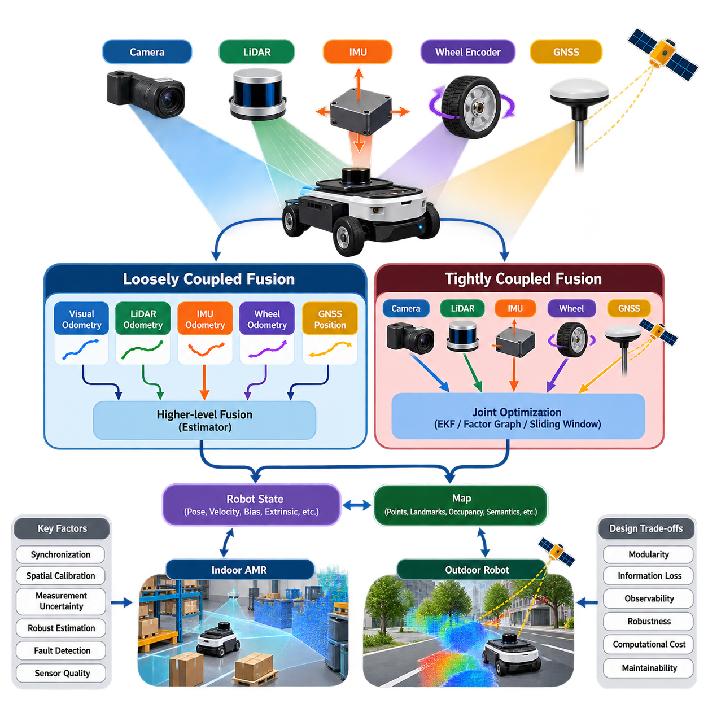
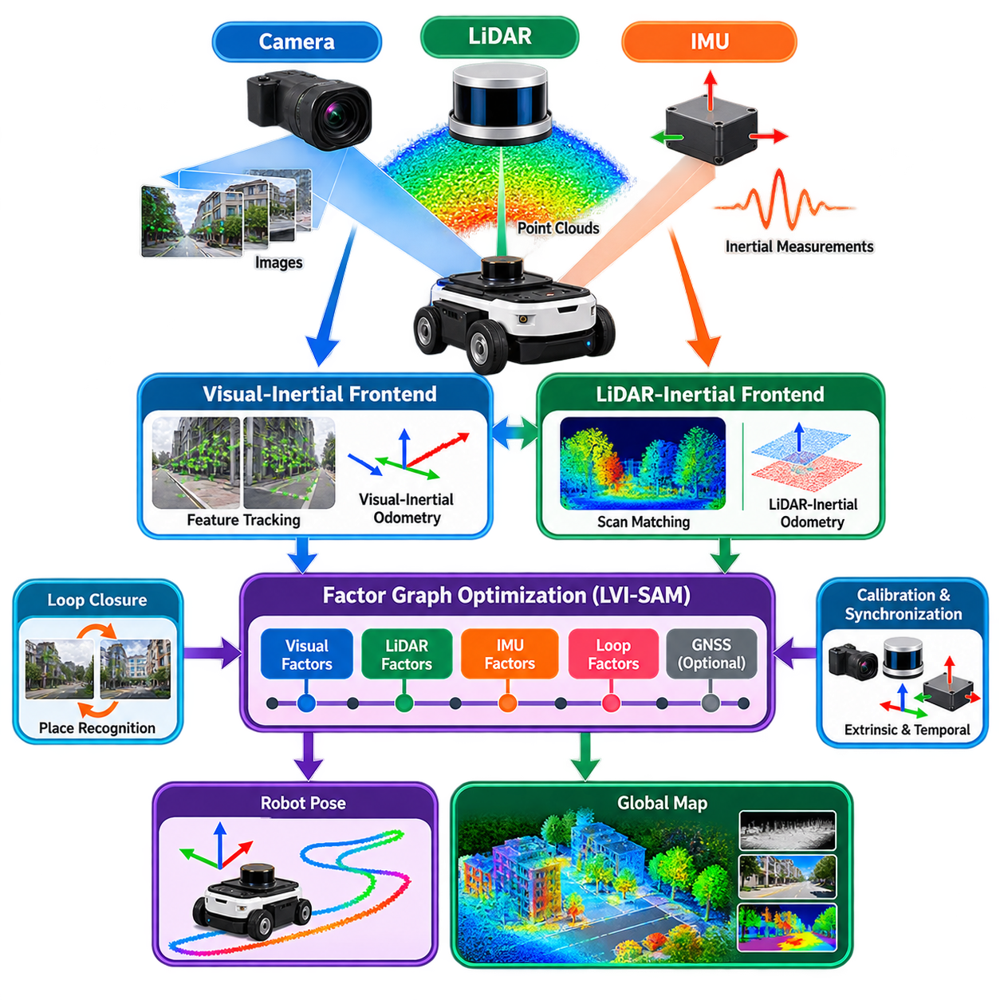
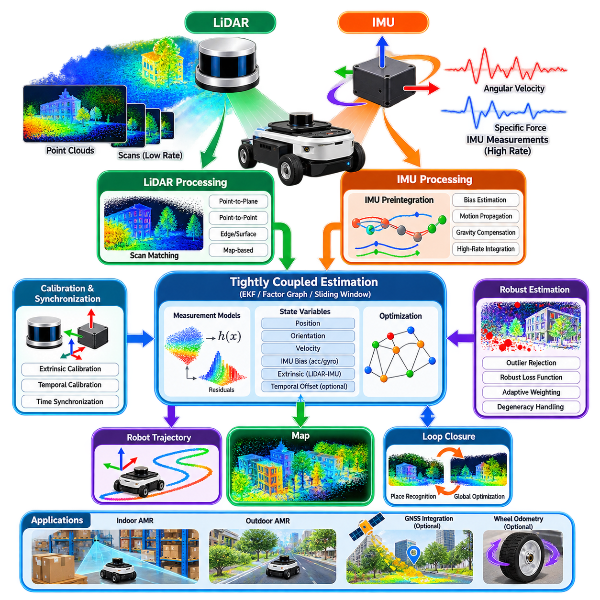
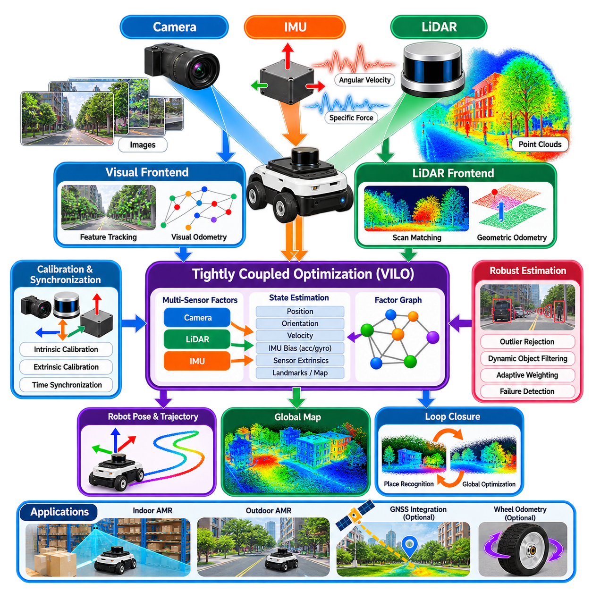
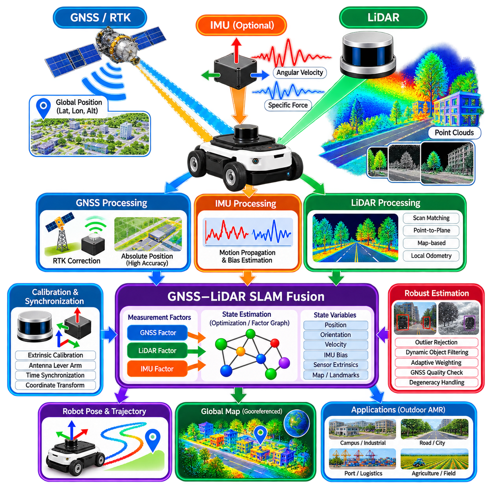
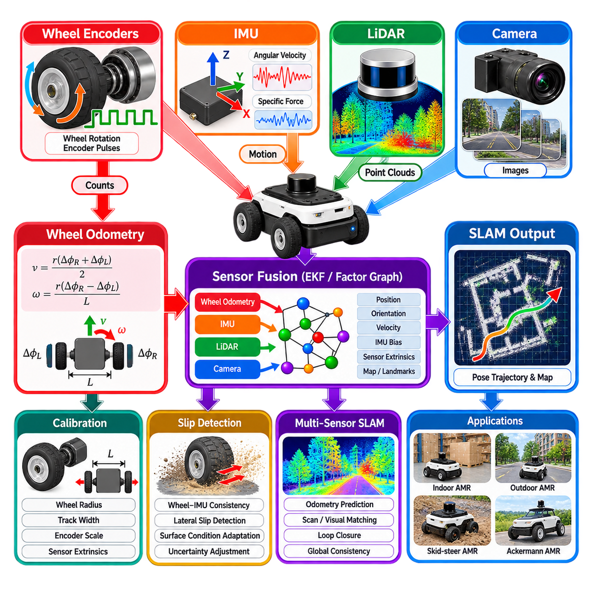
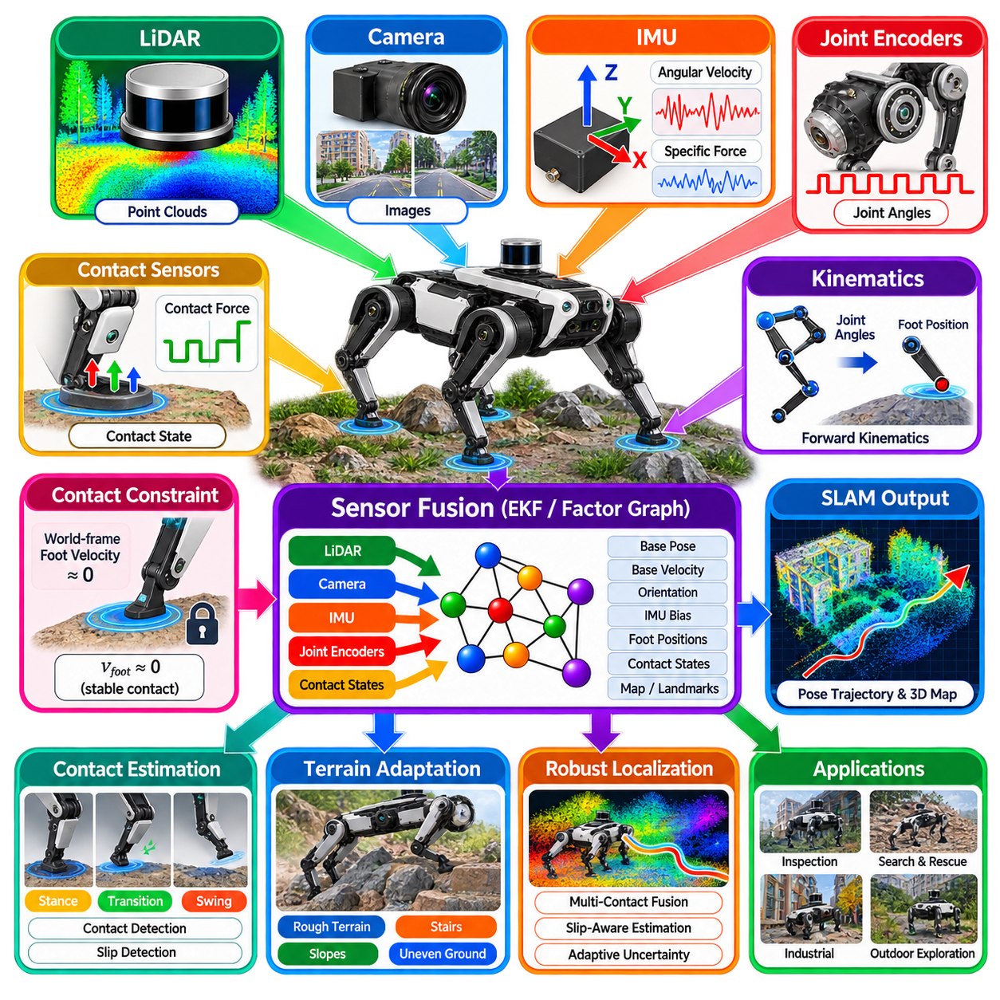
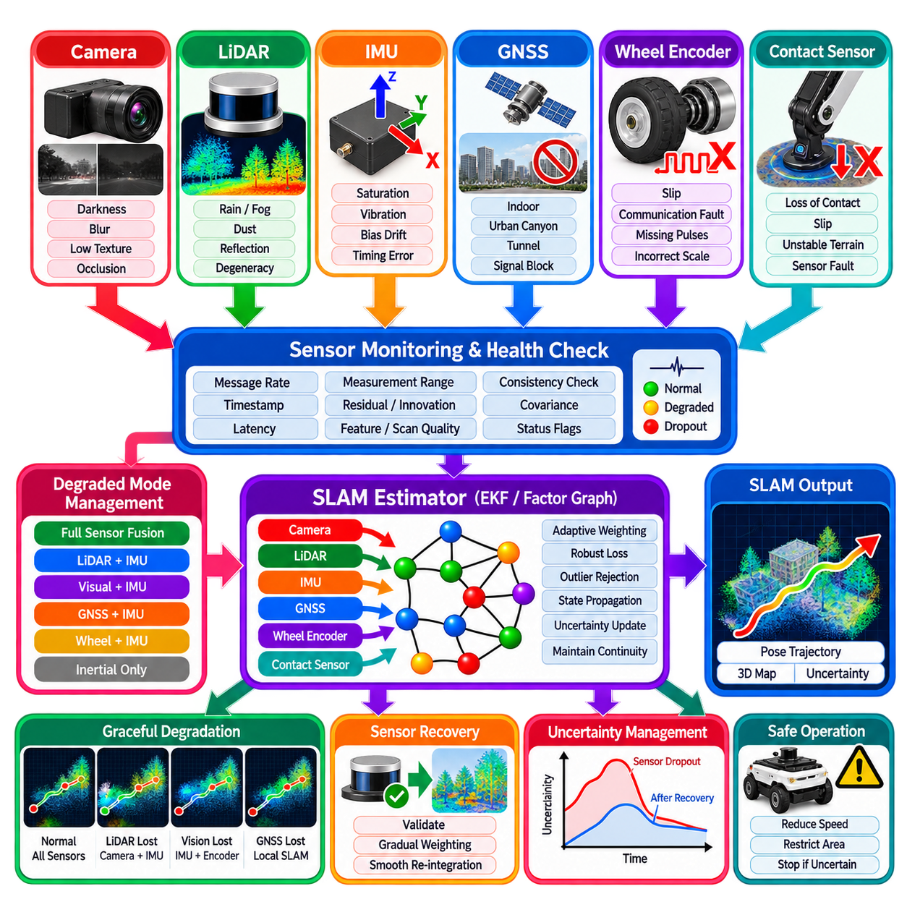
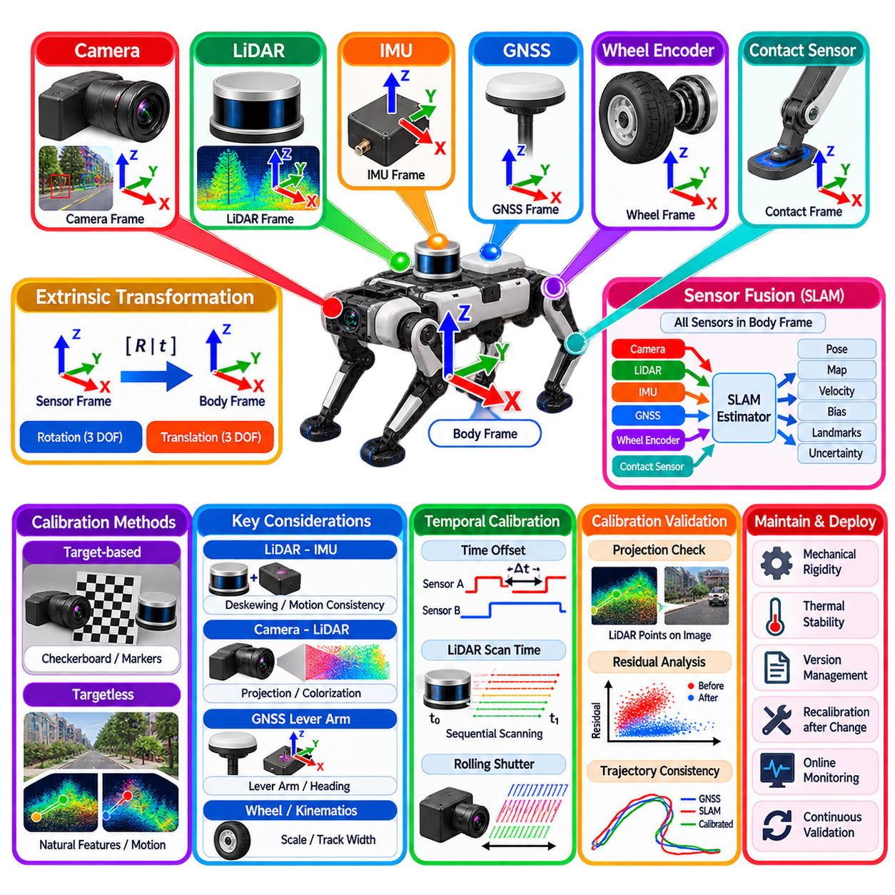
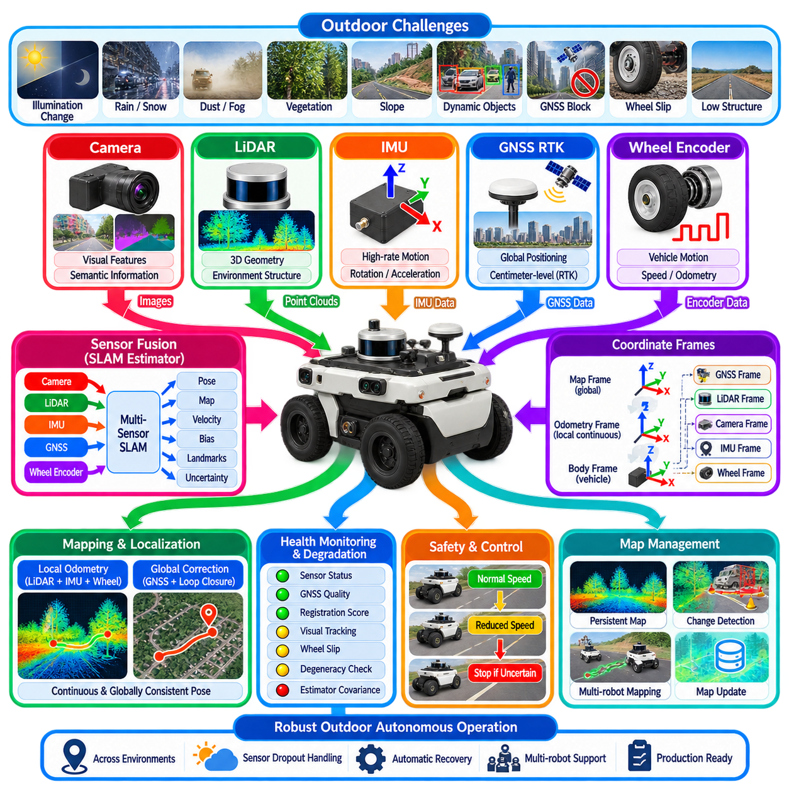

**Volume 13. Mapping Localization and SLAM**


# Chapter 07. Multi Sensor Fusion SLAM

##  

## 07.01. Multi Sensor SLAM Fusion Architectures Tight Loose

{width="7.268055555555556in" height="7.268055555555556in"}

Multi-sensor SLAM combines measurements from complementary sensing modalities to estimate robot motion and construct a consistent representation of the environment. Cameras provide rich appearance and geometric information, LiDAR measures accurate spatial structure, inertial sensors capture high-frequency motion, wheel encoders constrain local displacement, and GNSS can provide global position references. Fusion architecture determines where these measurements interact and how strongly their estimation errors become coupled.

A fundamental architectural distinction is between loosely coupled and tightly coupled fusion. In a loosely coupled system, individual sensing subsystems first generate independent state estimates or intermediate navigation solutions. A visual odometry module may estimate camera motion, a LiDAR odometry module may produce another trajectory, and a GNSS receiver may calculate a global position. A higher-level estimator then combines these outputs instead of processing the original sensor observations directly.

Loose coupling offers strong modularity because each sensor pipeline can be designed, tested, replaced, and diagnosed independently. Existing localization components can often be integrated without redesigning their internal algorithms. This characteristic is attractive for industrial robots where cameras, LiDARs, GNSS receivers, or localization modules may change during the product lifecycle. Interfaces between modules can remain stable while individual sensing technologies evolve.

The primary limitation of loose coupling is information loss. Once raw measurements have been compressed into independent poses, velocities, or other state estimates, correlations and detailed observation-level information may no longer be available to the fusion layer. A visual subsystem might report a pose without exposing the individual feature observations that produced it. Consequently, the global estimator cannot fully exploit relationships between measurements originating from different sensors.

Tightly coupled fusion integrates sensor observations within a common estimation framework. Instead of combining completed navigation solutions, the estimator can simultaneously process camera features, LiDAR correspondences, IMU measurements, GNSS observations, wheel constraints, and other measurements. These observations contribute residuals or probabilistic factors associated with shared robot states. Optimization therefore considers cross-sensor relationships directly when estimating the trajectory and map.

This architecture can improve observability and robustness because one sensing modality can constrain uncertainty that another modality cannot resolve independently. An IMU provides rapid rotational and acceleration information during periods when visual features are weak, while visual or LiDAR observations constrain the drift accumulated through inertial integration. GNSS can anchor long-term global position, and wheel odometry can contribute useful short-term motion constraints when environmental geometry becomes temporarily ambiguous.

Tightly coupled systems are commonly implemented using nonlinear filtering, factor graphs, sliding-window optimization, or combinations of these methods. The estimated state may contain position, orientation, velocity, IMU biases, sensor extrinsic parameters, temporal offsets, and selected map variables. Each measurement contributes according to its observation model and uncertainty. The estimator seeks a state configuration that provides the most statistically consistent explanation of the accumulated multi-sensor observations.

Factor-graph formulations are particularly suitable for complex multi-sensor SLAM because heterogeneous measurements can be represented as factors connecting relevant state variables. IMU preintegration may connect consecutive keyframes, visual reprojection factors constrain landmarks and camera poses, LiDAR factors constrain geometric alignment, and GNSS factors provide global references. Additional factors can represent wheel odometry, loop closures, terrain constraints, or application-specific physical relationships.

The distinction between tight and loose coupling is not always binary. Practical robotic systems frequently employ hybrid architectures. A tightly coupled visual-inertial estimator may operate as one subsystem while LiDAR localization and GNSS positioning are integrated at a higher level. Alternatively, LiDAR and IMU measurements may form a tightly coupled odometry core while camera-based place recognition supplies loop-closure constraints. The appropriate boundary depends on computational resources, sensor characteristics, and operational requirements.

Sensor synchronization is critical regardless of architecture, but its importance becomes especially visible in tightly coupled estimation. Measurements generated at different times cannot simply be treated as simultaneous observations when the robot is moving. Hardware triggering, Precision Time Protocol, synchronized clocks, accurate timestamps, or explicit temporal calibration may therefore be required. Even small timing errors can appear as geometric inconsistencies during rapid rotation, acceleration, vibration, or high-speed vehicle motion.

Spatial calibration is equally important because every measurement must ultimately be related through known coordinate transformations. Camera-to-IMU, LiDAR-to-IMU, GNSS-antenna-to-body, and wheel-to-body transformations define the geometric relationship between sensors and the robot reference frame. Incorrect extrinsic calibration creates systematic residuals that cannot be eliminated through ordinary state estimation. Some tightly coupled systems therefore estimate selected calibration parameters online while maintaining carefully defined observability constraints.

Measurement uncertainty must also be modeled realistically. Sensors do not fail in identical ways, and their uncertainty can vary substantially with operating conditions. Camera performance may degrade under darkness, glare, blur, or repetitive textures. LiDAR observations may become unreliable in rain, dust, glass-rich environments, or geometrically degenerate corridors. GNSS uncertainty can increase around buildings, tunnels, vegetation, or reflective structures, while wheel odometry becomes unreliable during slip or terrain deformation.

A robust fusion architecture therefore requires more than simply adding measurements to an estimator. Innovation tests, residual monitoring, covariance adaptation, robust loss functions, fault detection, and sensor-quality evaluation are needed to prevent corrupted measurements from dominating the state estimate. Dynamic weighting can reduce the influence of a degraded sensor while preserving useful information from healthy modalities. Production systems should treat sensor confidence as an evolving quantity rather than a permanently fixed specification.

Loose coupling can provide an important fault-containment advantage. Because sensing pipelines remain separated, failure inside one localization subsystem can often be isolated before its output reaches the main estimator. This simplifies diagnostics and fallback strategies. However, if the subsystem reports an apparently valid but biased solution, the higher-level fusion algorithm may have limited information for identifying the original measurement problem because the detailed residual structure has already been hidden.

Tight coupling provides richer residual information for consistency checking but increases architectural complexity. Failure in calibration, synchronization, observation modeling, or numerical optimization can influence multiple state variables simultaneously. Software dependencies also become stronger because sensor processing and state estimation share internal representations. Consequently, tightly coupled SLAM demands disciplined interface definitions, observability analysis, numerical validation, and extensive testing across representative environmental and motion conditions.

Computational cost is another architectural consideration. Loose coupling distributes processing across relatively independent modules and allows their outputs to be fused at comparatively low rates. Tight coupling may optimize many observations and states simultaneously, creating larger computational workloads. Sliding windows, keyframe selection, marginalization, IMU preintegration, sparse optimization, and selective map management are therefore used to control complexity while retaining the most valuable cross-sensor constraints.

For indoor AMRs, a practical fusion architecture may combine LiDAR, cameras, IMU, and wheel odometry. Wheel encoders and IMU measurements provide high-rate local motion information, while LiDAR supplies stable geometric constraints against the facility structure. Cameras can contribute visual landmarks, semantic information, or loop recognition. Because GNSS is generally unavailable indoors, long-term consistency depends heavily on environmental observations, loop closures, map matching, and careful management of accumulated drift.

Outdoor autonomous robots introduce different priorities. GNSS RTK can provide centimeter-class global references under favorable conditions, but availability and measurement quality may change abruptly near buildings, trees, tunnels, industrial structures, or other sources of signal obstruction and multipath. LiDAR, cameras, IMU, and wheel odometry must therefore maintain localization through GNSS degradation. Fusion should support smooth transitions between globally anchored navigation and locally constrained SLAM without discontinuous pose jumps.

Multi-sensor fusion also influences map representation. A system may maintain geometric point clouds, occupancy structures, visual landmarks, semantic objects, elevation information, or combinations of these representations. Tight coupling does not necessarily require every map modality to exist inside one enormous optimizer. A scalable architecture can separate local metric estimation, global graph optimization, semantic mapping, and mission-level map services while preserving well-defined uncertainty and transformation relationships between layers.

The selection between loose and tight coupling should therefore be treated as a system-engineering decision rather than an assumption that tighter integration is always superior. Loose coupling favors modularity, maintainability, independent validation, and straightforward replacement of sensing subsystems. Tight coupling favors maximum use of measurement information, improved cross-sensor observability, and potentially stronger performance during partial sensor degradation. Each advantage introduces corresponding integration, computation, and verification costs.

Production robotic systems often benefit from hierarchical fusion that deliberately combines both philosophies. A tightly coupled local estimator can integrate high-rate IMU measurements with camera or LiDAR observations to produce smooth motion estimates. A global layer can then incorporate GNSS, loop closures, map localization, fleet-generated corrections, or infrastructure references at slower rates. Such separation preserves high-performance local estimation while limiting the computational and software complexity of system-wide optimization.

Ultimately, multi-sensor SLAM architecture must preserve localization continuity when individual sensors become uncertain, unavailable, or contradictory. The central design objective is not merely higher nominal accuracy but controlled uncertainty and graceful degradation across real operating conditions. Tight, loose, and hybrid fusion architectures provide different mechanisms for achieving this objective, and successful systems choose their coupling boundaries according to observability, failure behavior, computational limits, maintainability, and mission requirements.

다중 센서 SLAM(Multi-sensor SLAM)은 상호 보완적인 여러 센싱 방식(Sensing Modality)의 측정값을 결합하여 로봇의 움직임을 추정하고 환경에 대한 일관된 표현을 구축한다. 카메라(Camera)는 풍부한 외관 및 기하학 정보를 제공하고, 라이다(LiDAR)는 정확한 공간 구조를 측정하며, 관성 센서(Inertial Sensor)는 고주파 움직임을 포착한다. 휠 인코더(Wheel Encoder)는 국부 변위를 제한하고, GNSS는 전역 위치 기준을 제공할 수 있다. 융합 아키텍처(Fusion Architecture)는 이러한 측정값이 어디에서 상호작용하고 추정 오차가 어느 정도로 결합되는지를 결정한다.

융합 아키텍처의 기본적인 구분은 느슨한 결합(Loosely Coupled Fusion)과 긴밀한 결합(Tightly Coupled Fusion)이다. 느슨한 결합 시스템에서는 개별 센서 서브시스템(Sensing Subsystem)이 먼저 독립적인 상태 추정값(State Estimate)이나 중간 항법 해(Navigation Solution)를 생성한다. 비주얼 오도메트리(Visual Odometry)가 카메라 움직임을 추정하고, 라이다 오도메트리(LiDAR Odometry)가 별도의 궤적을 생성하며, GNSS 수신기가 전역 위치를 계산할 수 있다. 이후 상위 수준 추정기(Estimator)가 원래 센서 관측값 대신 이 결과들을 결합한다.

느슨한 결합은 각각의 센서 파이프라인(Sensor Pipeline)을 독립적으로 설계하고 시험하며 교체하고 진단할 수 있기 때문에 높은 모듈성(Modularity)을 제공한다. 기존 위치추정(Localization) 구성요소도 내부 알고리즘을 다시 설계하지 않고 통합할 수 있는 경우가 많다. 이러한 특성은 제품 수명주기 동안 카메라, 라이다, GNSS 수신기 또는 위치추정 모듈이 변경될 수 있는 산업용 로봇에서 특히 유용하다. 개별 센싱 기술이 발전하더라도 모듈 사이의 인터페이스(Interface)는 안정적으로 유지할 수 있다.

느슨한 결합의 주요 한계는 정보 손실(Information Loss)이다. 원시 측정값(Raw Measurement)이 독립적인 자세(Pose), 속도 또는 다른 상태 추정값으로 압축되고 나면, 상관관계(Correlation)와 상세한 관측 수준 정보가 융합 계층에서 더 이상 사용되지 못할 수 있다. 예를 들어 비전 서브시스템(Visual Subsystem)이 자세를 생성하는 개별 특징점 관측값(Feature Observation)을 공개하지 않고 최종 자세만 전달할 수 있다. 이 경우 전역 추정기는 서로 다른 센서에서 발생한 측정값 사이의 관계를 완전히 활용할 수 없다.

긴밀한 결합(Tightly Coupled Fusion)은 센서 관측값을 공통 추정 프레임워크(Common Estimation Framework) 내부에서 직접 통합한다. 완성된 항법 해를 결합하는 대신 카메라 특징점(Camera Feature), 라이다 대응점(LiDAR Correspondence), IMU 측정값, GNSS 관측값, 휠 제약조건(Wheel Constraint) 등을 동시에 처리할 수 있다. 이러한 관측값은 공유되는 로봇 상태와 연결된 잔차(Residual) 또는 확률적 팩터(Probabilistic Factor)를 구성하며, 최적화 과정에서 센서 간 관계를 직접 고려하여 궤적과 지도를 추정한다.

이러한 아키텍처는 하나의 센싱 방식이 다른 센싱 방식만으로 해결하기 어려운 불확실성을 제한할 수 있기 때문에 관측 가능성(Observability)과 강건성(Robustness)을 향상시킬 수 있다. IMU는 시각 특징이 부족한 상황에서도 빠른 회전과 가속도 정보를 제공하고, 비전 또는 라이다 관측은 관성 적분(Inertial Integration) 과정에서 누적되는 드리프트(Drift)를 제한한다. GNSS는 장기간의 전역 위치를 고정하고, 휠 오도메트리(Wheel Odometry)는 환경의 기하학적 구조가 일시적으로 모호할 때 유용한 단기 움직임 제약조건을 제공할 수 있다.

긴밀한 결합 시스템은 일반적으로 비선형 필터링(Nonlinear Filtering), 팩터 그래프(Factor Graph), 슬라이딩 윈도우 최적화(Sliding-window Optimization) 또는 이들을 결합한 방법으로 구현된다. 추정 상태에는 위치(Position), 자세(Orientation), 속도(Velocity), IMU 바이어스(IMU Bias), 센서 외부 파라미터(Sensor Extrinsic Parameter), 시간 오프셋(Temporal Offset), 그리고 선택된 지도 변수(Map Variable)가 포함될 수 있다. 각각의 측정값은 관측 모델(Observation Model)과 불확실성에 따라 기여하며, 추정기는 축적된 다중 센서 관측을 통계적으로 가장 일관되게 설명하는 상태 구성을 탐색한다.

팩터 그래프(Factor Graph) 방식은 서로 다른 종류의 측정값을 관련 상태 변수와 연결하는 팩터(Factor)로 표현할 수 있기 때문에 복잡한 다중 센서 SLAM에 특히 적합하다. IMU 사전 적분(IMU Preintegration)은 연속된 키프레임(Keyframe)을 연결하고, 시각 재투영 팩터(Visual Reprojection Factor)는 랜드마크와 카메라 자세를 제한하며, 라이다 팩터는 기하학적 정합을 제한한다. GNSS 팩터는 전역 기준을 제공하고, 휠 오도메트리, 루프 폐쇄(Loop Closure), 지형 제약조건(Terrain Constraint), 응용 분야별 물리적 관계도 추가적인 팩터로 표현할 수 있다.

긴밀한 결합과 느슨한 결합의 구분이 항상 이분법적인 것은 아니다. 실제 로봇 시스템에서는 하이브리드 아키텍처(Hybrid Architecture)를 사용하는 경우가 많다. 긴밀하게 결합된 시각-관성 추정기(Visual-Inertial Estimator)가 하나의 서브시스템으로 동작하면서 라이다 위치추정과 GNSS 위치정보가 상위 계층에서 통합될 수 있다. 반대로 라이다와 IMU가 긴밀하게 결합된 오도메트리 핵심부를 구성하고 카메라 기반 장소 인식(Place Recognition)이 루프 폐쇄 제약조건을 제공할 수도 있다. 적절한 결합 경계는 연산 자원, 센서 특성 및 운용 요구조건에 따라 결정된다.

센서 동기화(Sensor Synchronization)는 어떤 아키텍처에서도 중요하지만 긴밀한 결합 추정에서는 그 중요성이 더욱 분명하게 나타난다. 로봇이 이동하는 동안 서로 다른 시점에 생성된 측정값을 단순히 동시에 발생한 관측값으로 처리해서는 안 된다. 따라서 하드웨어 트리거링(Hardware Triggering), 정밀 시간 프로토콜(Precision Time Protocol, PTP), 동기화된 클록(Synchronized Clock), 정확한 타임스탬프(Timestamp) 또는 명시적인 시간 보정(Temporal Calibration)이 필요할 수 있다. 작은 시간 오차도 빠른 회전, 가속, 진동 또는 고속 주행 상황에서는 기하학적 불일치로 나타날 수 있다.

공간 보정(Spatial Calibration) 역시 중요하다. 모든 측정값은 알려진 좌표 변환(Coordinate Transformation)을 통해 최종적으로 서로 연결되어야 한다. 카메라-IMU(Camera-to-IMU), 라이다-IMU(LiDAR-to-IMU), GNSS 안테나-차체(GNSS-Antenna-to-Body), 휠-차체(Wheel-to-Body) 변환은 센서와 로봇 기준 좌표계 사이의 기하학적 관계를 정의한다. 잘못된 외부 보정(Extrinsic Calibration)은 일반적인 상태 추정만으로 제거할 수 없는 체계적 잔차(Systematic Residual)를 발생시킨다. 따라서 일부 긴밀한 결합 시스템은 관측 가능성 제약조건을 유지하면서 특정 보정 파라미터를 온라인으로 추정하기도 한다.

측정 불확실성(Measurement Uncertainty)도 현실적으로 모델링해야 한다. 센서는 동일한 방식으로 실패하지 않으며 운용 조건에 따라 불확실성이 크게 달라질 수 있다. 카메라는 어둠, 눈부심, 모션 블러(Motion Blur), 반복적인 텍스처 환경에서 성능이 저하될 수 있다. 라이다 관측은 비, 먼지, 유리 구조물이 많은 환경 또는 기하학적으로 퇴화된 복도에서 신뢰성이 떨어질 수 있다. GNSS는 건물, 터널, 식생 또는 반사 구조물 주변에서 불확실성이 증가하며, 휠 오도메트리는 미끄러짐(Slip)이나 지면 변형 상황에서 신뢰성이 저하된다.

따라서 강건한 융합 아키텍처(Robust Fusion Architecture)는 단순히 추정기에 측정값을 추가하는 것 이상을 요구한다. 혁신 검정(Innovation Test), 잔차 모니터링(Residual Monitoring), 공분산 적응(Covariance Adaptation), 강건 손실 함수(Robust Loss Function), 고장 감지(Fault Detection), 센서 품질 평가(Sensor-quality Evaluation) 등을 이용하여 손상된 측정값이 상태 추정을 지배하지 못하도록 해야 한다. 동적 가중치(Dynamic Weighting)는 성능이 저하된 센서의 영향을 감소시키면서 정상 센서의 유용한 정보를 유지할 수 있다. 실제 제품 시스템에서는 센서 신뢰도를 고정된 사양이 아니라 지속적으로 변화하는 값으로 다루어야 한다.

느슨한 결합은 중요한 고장 격리(Fault Containment) 장점을 제공할 수 있다. 센싱 파이프라인이 분리되어 있기 때문에 하나의 위치추정 서브시스템 내부에서 발생한 고장을 주 추정기에 출력이 전달되기 전에 격리할 수 있는 경우가 많다. 이는 진단 및 폴백 전략(Fallback Strategy)을 단순화한다. 그러나 해당 서브시스템이 외관상 정상적이지만 편향된 추정 결과를 출력한다면 상세한 잔차 구조가 이미 숨겨졌기 때문에 상위 융합 알고리즘이 원래의 측정 문제를 식별하는 데 사용할 수 있는 정보가 제한될 수 있다.

긴밀한 결합은 일관성 검사(Consistency Checking)를 위한 더 풍부한 잔차 정보를 제공하지만 아키텍처 복잡성은 증가한다. 보정, 동기화, 관측 모델링 또는 수치 최적화(Numerical Optimization)의 오류가 여러 상태 변수에 동시에 영향을 줄 수 있다. 또한 센서 처리와 상태 추정이 내부 표현을 공유하기 때문에 소프트웨어 의존성이 강해진다. 따라서 긴밀한 결합 SLAM에는 체계적인 인터페이스 정의, 관측 가능성 분석, 수치 검증 및 실제 환경과 움직임 조건을 반영한 광범위한 시험이 필요하다.

연산 비용(Computational Cost) 역시 중요한 아키텍처 설계 요소이다. 느슨한 결합은 처리를 비교적 독립적인 모듈에 분산하고 그 결과를 상대적으로 낮은 주기로 융합할 수 있다. 반면 긴밀한 결합은 많은 관측값과 상태를 동시에 최적화할 수 있기 때문에 더 큰 연산 부하가 발생한다. 따라서 슬라이딩 윈도우, 키프레임 선택(Keyframe Selection), 주변화(Marginalization), IMU 사전 적분, 희소 최적화(Sparse Optimization), 선택적 지도 관리 등을 사용하여 중요한 센서 간 제약조건을 유지하면서 복잡도를 제어한다.

실내 자율이동로봇(Indoor AMR)의 실용적인 융합 아키텍처는 라이다, 카메라, IMU 및 휠 오도메트리를 결합할 수 있다. 휠 인코더와 IMU는 높은 주기의 국부 움직임 정보를 제공하고, 라이다는 시설의 구조를 이용하여 안정적인 기하학적 제약조건을 제공한다. 카메라는 시각 랜드마크(Visual Landmark), 의미 정보(Semantic Information), 루프 인식(Loop Recognition)에 기여할 수 있다. 실내에서는 일반적으로 GNSS를 사용할 수 없으므로 장기적인 일관성은 환경 관측, 루프 폐쇄, 지도 정합(Map Matching), 누적 드리프트 관리에 크게 의존한다.

실외 자율 로봇(Outdoor Autonomous Robot)은 서로 다른 우선순위를 갖는다. GNSS RTK는 조건이 양호한 환경에서 센티미터급 전역 위치 기준을 제공할 수 있지만 건물, 나무, 터널, 산업 구조물 또는 신호 차폐와 다중경로(Multipath)를 발생시키는 환경에서는 가용성과 측정 품질이 급격하게 변할 수 있다. 따라서 라이다, 카메라, IMU 및 휠 오도메트리가 GNSS 성능 저하 구간에서도 위치추정을 유지해야 한다. 융합 시스템은 불연속적인 자세 점프(Pose Jump) 없이 전역 기준 항법과 국부 제약 기반 SLAM 사이를 부드럽게 전환할 수 있어야 한다.

다중 센서 융합은 지도 표현(Map Representation)에도 영향을 미친다. 시스템은 기하학적 포인트 클라우드(Point Cloud), 점유 구조(Occupancy Structure), 시각 랜드마크, 의미 객체(Semantic Object), 고도 정보(Elevation Information) 또는 이들의 조합을 유지할 수 있다. 긴밀한 결합이라고 해서 모든 지도 정보를 하나의 거대한 최적화기에 포함해야 하는 것은 아니다. 확장 가능한 아키텍처에서는 국부 계량 추정(Local Metric Estimation), 전역 그래프 최적화(Global Graph Optimization), 의미 지도 작성(Semantic Mapping), 임무 수준 지도 서비스(Mission-level Map Service)를 분리하면서 계층 사이의 불확실성과 좌표 변환 관계를 명확하게 유지할 수 있다.

따라서 느슨한 결합과 긴밀한 결합 사이의 선택은 긴밀한 통합이 항상 우수하다는 가정이 아니라 시스템 엔지니어링(System Engineering) 관점에서 결정해야 한다. 느슨한 결합은 모듈성, 유지보수성(Maintainability), 독립적인 검증 및 센싱 서브시스템의 용이한 교체에 유리하다. 긴밀한 결합은 측정 정보의 활용도를 극대화하고 센서 간 관측 가능성을 향상시키며 일부 센서 성능이 저하된 상황에서 더 높은 성능을 제공할 가능성이 있다. 그러나 각각의 장점에는 이에 상응하는 통합, 연산 및 검증 비용이 따른다.

실제 제품 수준의 로봇 시스템(Production Robotic System)은 두 가지 철학을 의도적으로 결합한 계층형 융합(Hierarchical Fusion)을 통해 이점을 얻을 수 있다. 긴밀하게 결합된 국부 추정기(Local Estimator)는 고주기 IMU 측정값과 카메라 또는 라이다 관측을 통합하여 부드러운 움직임 추정값을 생성할 수 있다. 이후 전역 계층(Global Layer)은 더 낮은 주기로 GNSS, 루프 폐쇄, 지도 기반 위치추정(Map Localization), 플릿에서 생성된 보정값(Fleet-generated Correction), 인프라 기준정보(Infrastructure Reference)를 통합할 수 있다. 이러한 분리는 고성능 국부 추정을 유지하면서 시스템 전체 최적화의 연산 및 소프트웨어 복잡성을 제한한다.

궁극적으로 다중 센서 SLAM 아키텍처는 개별 센서가 불확실해지거나 사용할 수 없게 되거나 서로 모순되는 정보를 제공하는 상황에서도 위치추정 연속성(Localization Continuity)을 유지해야 한다. 핵심 설계 목표는 단순히 정상 조건에서 더 높은 정확도를 확보하는 것이 아니라 실제 운용 조건 전반에서 불확실성을 제어하고 점진적 성능 저하(Graceful Degradation)를 구현하는 것이다. 긴밀한 결합, 느슨한 결합 및 하이브리드 융합 아키텍처는 이를 달성하기 위한 서로 다른 방법을 제공하며, 성공적인 시스템은 관측 가능성, 고장 거동(Failure Behavior), 연산 한계, 유지보수성 및 임무 요구조건에 따라 적절한 결합 경계를 결정한다.

##  

## 07.02. LiDAR Camera Fusion SLAM LVI SAM [w/Code]

{width="7.268055555555556in" height="7.268055555555556in"}

LiDAR-camera fusion SLAM combines the complementary strengths of geometric ranging and visual sensing to produce accurate and robust localization and mapping. LiDAR directly measures three-dimensional structure with metric scale, while cameras capture dense appearance, texture, color, and semantic information. When combined with an IMU, these sensors form a powerful estimation system capable of maintaining motion estimates across environments where any single sensing modality may become unreliable.

LiDAR is particularly valuable because its range measurements are largely independent of scene illumination and provide geometrically meaningful point clouds. Scan matching can estimate motion by aligning surfaces, edges, planes, or local point distributions between observations. However, LiDAR SLAM can become poorly constrained in long corridors, tunnels, open areas, or environments containing insufficient geometric variation. Sparse distant measurements may also limit detailed environmental interpretation.

Cameras provide information that LiDAR cannot easily capture. Visual features, textures, object appearances, and image-level context can distinguish locations having similar geometric structures. Visual observations can therefore strengthen place recognition and loop closure while supporting semantic mapping. Their weakness is sensitivity to illumination changes, shadows, glare, motion blur, repetitive textures, and low-texture surfaces. Combining vision and LiDAR allows one modality to compensate for conditions that degrade the other.

LVI-SAM represents an important approach to tightly integrated LiDAR, visual, and inertial SLAM. Its architecture combines LiDAR-inertial and visual-inertial estimation within a factor-graph framework rather than treating the sensors as completely independent localization systems. IMU measurements provide high-rate motion constraints, LiDAR supplies stable metric geometry, and cameras provide visual constraints. Their information is integrated to improve trajectory estimation and maintain a globally consistent map.

A useful architectural concept in LVI-SAM is the interaction between visual-inertial and LiDAR-inertial subsystems. The visual-inertial component tracks image features and estimates motion using camera and IMU information, while the LiDAR-inertial component aligns point clouds using motion information and geometric constraints. Instead of operating as isolated pipelines, the subsystems exchange useful estimates and constraints, allowing failures or uncertainty in one modality to be partially compensated by information from the others.

The IMU plays a central role because cameras and LiDAR normally operate at substantially lower measurement rates than inertial sensors. Accelerometers and gyroscopes continuously describe short-term translational and rotational dynamics between image frames and LiDAR scans. IMU preintegration summarizes these high-rate measurements into constraints between selected states, reducing optimization cost while preserving essential motion information. Camera and LiDAR observations then correct the drift accumulated through inertial integration.

Visual-inertial estimation begins by detecting and tracking image features across consecutive frames. Reprojection relationships between three-dimensional landmarks and two-dimensional image observations constrain camera motion. Combined with inertial measurements, these visual constraints estimate pose, velocity, and IMU biases. Reliable feature tracks can provide strong rotational and translational information, particularly in scenes where LiDAR geometry alone produces weak constraints or ambiguous scan alignment.

LiDAR-inertial estimation processes point clouds to identify geometric relationships between successive scans and the accumulated map. Features associated with edges and planar surfaces can be matched against corresponding map structures, producing residuals that constrain the sensor pose. Inertial information supplies an initial motion estimate and assists with distortion correction because a rotating or scanning LiDAR collects different points at different times while the robot itself continues moving.

Motion distortion is an important issue in mobile LiDAR systems. A complete scan is not captured at one instantaneous timestamp, so rapid translation or rotation can deform the measured point cloud if robot motion is ignored. IMU-assisted deskewing compensates individual LiDAR points according to their acquisition times and estimated platform motion. Accurate synchronization between LiDAR and IMU is therefore fundamental to achieving reliable scan registration and maintaining geometric consistency.

Factor graphs provide the mathematical structure through which heterogeneous constraints can influence shared robot states. Nodes can represent poses, velocities, biases, landmarks, or other variables, while factors represent measurements and relationships between them. IMU preintegration, LiDAR registration, visual observations, loop closures, and potentially GNSS constraints can therefore contribute to a common optimization problem without requiring every sensor to produce an independent final pose first.

Loop closure is especially important for long-duration SLAM because even accurate local odometry gradually accumulates drift. LiDAR-based place matching can detect geometric revisits, while visual information can identify locations using appearance characteristics that may remain distinctive despite geometric similarity. Once a reliable loop is detected, a constraint is added between previously separated trajectory states. Global graph optimization then redistributes accumulated error and improves consistency across the complete trajectory and map.

Cross-sensor calibration directly determines fusion quality. The rigid transformation between the LiDAR, camera, and IMU coordinate frames must be accurately known so that measurements refer to a consistent physical platform. Rotational calibration errors can generate increasingly large spatial discrepancies with distance, while translational errors introduce systematic alignment offsets. Camera intrinsic calibration, lens distortion correction, and accurate LiDAR-to-camera and sensor-to-IMU extrinsics are therefore essential prerequisites.

Temporal calibration is equally critical. A geometrically perfect sensor calibration cannot compensate for observations assigned to incorrect times. If camera frames, LiDAR scans, and IMU measurements have inconsistent timestamps, dynamic motion creates apparent spatial disagreement between sensors. Hardware synchronization is preferable when available, while software timestamp correction or online temporal calibration may be required in other systems. High angular velocity makes even relatively small timing offsets particularly damaging.

LiDAR-camera fusion can also support richer map representations than either modality alone. LiDAR provides accurate three-dimensional geometry that can form point-cloud, voxel, surfel, occupancy, or elevation maps. Camera images can project color, texture, semantic labels, and object information onto this geometry. The resulting map can therefore support not only localization but also obstacle interpretation, inspection, navigation, scene understanding, and higher-level robotic decision making.

Fusion does not automatically guarantee robustness. Rain, fog, dust, reflective surfaces, moving objects, darkness, direct sunlight, vibration, or sensor contamination can affect different sensors simultaneously or independently. Robust estimators must identify inconsistent residuals and reduce the influence of unreliable measurements. Outlier rejection, robust loss functions, feature-quality tests, geometric consistency checks, and adaptive measurement covariance help prevent temporary sensor degradation from corrupting the complete state estimate.

Dynamic environments create another challenge because conventional SLAM assumes that much of the observed world remains stationary. Vehicles, pedestrians, machinery, doors, movable equipment, and vegetation can generate visual features or LiDAR points that violate this assumption. Geometric filtering, motion consistency analysis, semantic segmentation, or object-level tracking can remove or down-weight dynamic observations before optimization. This becomes increasingly important when deploying fusion SLAM in factories, logistics sites, campuses, and public environments.

LiDAR-camera fusion must also consider computational efficiency. Image feature extraction, point-cloud processing, scan registration, IMU integration, loop detection, and nonlinear optimization can all execute concurrently. Keyframes, local maps, sliding windows, feature selection, voxel filtering, and incremental graph optimization are commonly used to bound computation. A production architecture must maintain predictable latency rather than maximizing accuracy through unrestricted optimization that occasionally exceeds real-time deadlines.

For indoor AMRs, LiDAR-camera-inertial SLAM can provide strong localization in warehouses, factories, hospitals, and logistics facilities. LiDAR anchors the robot against structural geometry, the IMU stabilizes short-term motion estimation, and cameras provide additional constraints and recognition capabilities. Wheel odometry may also be integrated as another motion source. Such redundancy is valuable around repetitive racks, long corridors, glass surfaces, temporary obstacles, and changing layouts where individual sensing methods can become ambiguous.

Outdoor AMRs face wider environmental variation and can extend the architecture with GNSS or GNSS RTK. LiDAR-camera-inertial SLAM maintains locally consistent motion when satellite positioning becomes unreliable, while GNSS provides global georeferencing whenever trustworthy measurements are available. This allows a robot to transition between open areas, buildings, tree-covered roads, tunnels, and industrial structures without depending permanently on a single global positioning technology.

A production implementation inspired by LVI-SAM should distinguish algorithmic architecture from a fixed software package. Sensor models, LiDAR characteristics, camera configuration, computing hardware, vehicle dynamics, environmental conditions, and safety requirements differ significantly among robotic platforms. The underlying principle is to preserve complementary visual, geometric, and inertial constraints while designing calibration, synchronization, failure handling, computational scheduling, and map management specifically for the target system.

The most important benefit of LiDAR-camera fusion is therefore not simply that more sensors produce more measurements. Its value comes from combining measurements whose failure modes and information characteristics are fundamentally different. LiDAR contributes metric geometry, cameras contribute appearance and contextual information, and the IMU contributes continuous motion dynamics. Properly fused, these signals improve observability and enable the estimator to remain useful when one information source becomes temporarily weak.

LVI-SAM illustrates how this complementary sensing principle can be organized into a coherent SLAM architecture through visual-inertial estimation, LiDAR-inertial odometry, factor-graph optimization, and loop constraints. For practical autonomous robots, the broader lesson is that robust localization emerges from coordinated sensing rather than sensor redundancy alone. Accurate calibration, synchronization, uncertainty modeling, failure detection, and controlled computation ultimately determine whether LiDAR-camera-inertial fusion remains reliable outside laboratory conditions.

라이다-카메라 융합 SLAM(LiDAR-Camera Fusion SLAM)은 기하학적 거리 측정(Geometric Ranging)과 시각 센싱(Visual Sensing)의 상호 보완적인 장점을 결합하여 정확하고 강건한 위치추정(Localization)과 지도 작성(Mapping)을 수행한다. 라이다(LiDAR)는 미터 단위의 절대 스케일(Metric Scale)을 가진 3차원 구조를 직접 측정하고, 카메라(Camera)는 조밀한 외관, 텍스처(Texture), 색상 및 의미 정보(Semantic Information)를 획득한다. IMU까지 결합하면 단일 센서의 신뢰성이 저하되는 환경에서도 움직임 추정을 유지할 수 있는 강력한 추정 시스템을 구성할 수 있다.

라이다는 거리 측정값이 장면의 조명 조건에 비교적 영향을 적게 받고 기하학적으로 의미 있는 포인트 클라우드(Point Cloud)를 제공한다는 점에서 특히 유용하다. 스캔 정합(Scan Matching)은 관측 간의 표면, 모서리, 평면 또는 국부 포인트 분포를 정렬하여 움직임을 추정할 수 있다. 그러나 긴 복도, 터널, 개방된 공간 또는 충분한 기하학적 변화가 없는 환경에서는 라이다 SLAM의 제약조건이 약해질 수 있다. 또한 멀리 떨어진 희소한 측정값은 세밀한 환경 해석에 한계를 줄 수 있다.

카메라는 라이다만으로는 쉽게 얻기 어려운 정보를 제공한다. 시각 특징(Visual Feature), 텍스처, 객체의 외관 및 이미지 수준의 문맥 정보(Contextual Information)는 기하학적 구조가 유사한 장소를 구별할 수 있다. 따라서 시각 관측은 장소 인식(Place Recognition)과 루프 폐쇄(Loop Closure)를 강화하면서 의미 지도 작성(Semantic Mapping)을 지원할 수 있다. 반면 조명 변화, 그림자, 눈부심, 모션 블러(Motion Blur), 반복적인 텍스처 및 저텍스처 표면에는 취약하다. 비전과 라이다를 결합하면 한 센서의 성능이 저하되는 조건을 다른 센서가 보완할 수 있다.

LVI-SAM은 라이다(LiDAR), 비전(Visual), 관성(Inertial) 정보를 긴밀하게 통합하는 SLAM의 중요한 접근 방법을 보여준다. 이 아키텍처는 센서를 완전히 독립된 위치추정 시스템으로 취급하기보다 팩터 그래프(Factor Graph) 프레임워크 안에서 라이다-관성(LiDAR-Inertial) 및 시각-관성(Visual-Inertial) 추정을 결합한다. IMU 측정값은 고주기 움직임 제약조건을 제공하고, 라이다는 안정적인 미터 단위 기하학 정보를 제공하며, 카메라는 시각적 제약조건을 제공한다. 이러한 정보가 통합되어 궤적 추정 정확도를 향상시키고 전역적으로 일관된 지도를 유지한다.

LVI-SAM에서 유용한 아키텍처 개념 중 하나는 시각-관성 서브시스템(Visual-Inertial Subsystem)과 라이다-관성 서브시스템(LiDAR-Inertial Subsystem) 사이의 상호작용이다. 시각-관성 구성요소는 이미지 특징을 추적하고 카메라와 IMU 정보를 사용하여 움직임을 추정하며, 라이다-관성 구성요소는 움직임 정보와 기하학적 제약조건을 이용해 포인트 클라우드를 정렬한다. 두 서브시스템은 서로 격리된 파이프라인으로 동작하지 않고 유용한 추정값과 제약조건을 교환하여 한 센서 방식의 불확실성이나 성능 저하를 다른 센서 정보로 부분적으로 보완한다.

IMU는 카메라와 라이다가 일반적으로 관성 센서보다 훨씬 낮은 측정 주기로 동작하기 때문에 핵심적인 역할을 담당한다. 가속도계(Accelerometer)와 자이로스코프(Gyroscope)는 이미지 프레임과 라이다 스캔 사이에서 발생하는 단기적인 병진 및 회전 운동을 지속적으로 측정한다. IMU 사전 적분(IMU Preintegration)은 이러한 고주기 측정값을 선택된 상태 사이의 제약조건으로 요약하여 핵심적인 움직임 정보를 유지하면서 최적화 비용을 줄인다. 이후 카메라와 라이다 관측이 관성 적분 과정에서 누적되는 드리프트(Drift)를 보정한다.

시각-관성 추정(Visual-Inertial Estimation)은 연속된 이미지 프레임에서 특징점을 검출하고 추적하는 과정에서 시작한다. 3차원 랜드마크(3D Landmark)와 2차원 이미지 관측 사이의 재투영 관계(Reprojection Relationship)는 카메라 움직임을 제한한다. 이러한 시각 제약조건을 관성 측정값과 결합하여 자세(Pose), 속도(Velocity), IMU 바이어스(IMU Bias)를 추정한다. 신뢰할 수 있는 특징점 추적은 특히 라이다 기하학만으로 제약조건이 부족하거나 스캔 정합이 모호한 장면에서 강력한 회전 및 병진 정보를 제공할 수 있다.

라이다-관성 추정(LiDAR-Inertial Estimation)은 포인트 클라우드를 처리하여 연속된 스캔과 누적 지도 사이의 기하학적 관계를 식별한다. 모서리와 평면에 해당하는 특징을 지도상의 대응 구조와 정합하여 센서 자세를 제한하는 잔차(Residual)를 생성할 수 있다. 관성 정보는 초기 움직임 추정값을 제공하고 왜곡 보정(Distortion Correction)을 지원한다. 이는 회전식 또는 스캐닝 라이다(Scanning LiDAR)가 서로 다른 시점에서 개별 포인트를 획득하는 동안 로봇 자체도 계속 움직이기 때문이다.

움직임 왜곡(Motion Distortion)은 이동형 라이다 시스템에서 중요한 문제이다. 하나의 전체 스캔은 단일 순간의 타임스탬프에서 동시에 획득되는 것이 아니므로 로봇 움직임을 무시하면 빠른 병진이나 회전 시 측정된 포인트 클라우드가 변형될 수 있다. IMU 보조 디스큐잉(IMU-assisted Deskewing)은 각 라이다 포인트의 획득 시간과 추정된 플랫폼 움직임에 따라 개별 포인트를 보정한다. 따라서 라이다와 IMU 사이의 정확한 동기화(Synchronization)는 신뢰성 높은 스캔 정합과 기하학적 일관성을 유지하기 위한 핵심 조건이다.

팩터 그래프(Factor Graph)는 서로 다른 센서에서 생성되는 이질적인 제약조건이 공유된 로봇 상태에 영향을 줄 수 있도록 하는 수학적 구조를 제공한다. 노드(Node)는 자세, 속도, 바이어스, 랜드마크 또는 기타 상태 변수를 나타내며, 팩터(Factor)는 측정값과 변수 사이의 관계를 표현한다. 따라서 IMU 사전 적분, 라이다 정합, 시각 관측, 루프 폐쇄 및 필요한 경우 GNSS 제약조건까지 각각의 센서가 독립적인 최종 자세를 먼저 생성하지 않고도 하나의 최적화 문제에 기여할 수 있다.

루프 폐쇄(Loop Closure)는 정확한 국부 오도메트리(Local Odometry)에서도 시간이 지나면 드리프트가 누적되기 때문에 장시간 SLAM에서 특히 중요하다. 라이다 기반 장소 정합은 기하학적 재방문을 검출할 수 있으며, 시각 정보는 기하학적으로 유사한 장소에서도 고유하게 유지되는 외관 특성을 이용하여 위치를 식별할 수 있다. 신뢰할 수 있는 루프가 검출되면 과거와 현재의 궤적 상태 사이에 제약조건이 추가된다. 이후 전역 그래프 최적화(Global Graph Optimization)를 통해 누적된 오차를 전체 궤적에 재분배하여 궤적과 지도의 일관성을 향상시킨다.

센서 간 보정(Cross-sensor Calibration)은 융합 품질을 직접적으로 결정한다. 라이다, 카메라 및 IMU 좌표계 사이의 강체 변환(Rigid Transformation)을 정확하게 알고 있어야 모든 측정값을 일관된 물리적 플랫폼 기준으로 표현할 수 있다. 회전 보정 오차(Rotational Calibration Error)는 거리가 증가할수록 더 큰 공간적 불일치를 발생시킬 수 있으며, 병진 보정 오차(Translational Calibration Error)는 체계적인 정렬 오프셋을 발생시킨다. 따라서 카메라 내부 보정(Camera Intrinsic Calibration), 렌즈 왜곡 보정(Lens Distortion Correction), 정확한 라이다-카메라 및 센서-IMU 외부 보정(Extrinsic Calibration)은 필수적인 선행 조건이다.

시간 보정(Temporal Calibration) 역시 매우 중요하다. 기하학적으로 완벽한 센서 보정도 관측값이 잘못된 시간에 할당되면 문제를 해결할 수 없다. 카메라 프레임, 라이다 스캔 및 IMU 측정값의 타임스탬프가 일치하지 않으면 동적인 움직임에 의해 센서 사이에서 실제로 존재하지 않는 공간적 불일치가 발생한다. 가능하다면 하드웨어 동기화(Hardware Synchronization)가 바람직하며, 다른 시스템에서는 소프트웨어 타임스탬프 보정 또는 온라인 시간 보정(Online Temporal Calibration)이 필요할 수 있다. 특히 높은 각속도에서는 비교적 작은 시간 오프셋도 큰 오차를 발생시킬 수 있다.

라이다-카메라 융합은 각각의 센서를 단독으로 사용할 때보다 풍부한 지도 표현(Map Representation)을 지원할 수 있다. 라이다는 정확한 3차원 기하학 정보를 제공하여 포인트 클라우드, 복셀(Voxel), 서펠(Surfel), 점유 지도(Occupancy Map), 고도 지도(Elevation Map)를 구성할 수 있다. 카메라 이미지는 이러한 기하학 구조에 색상, 텍스처, 의미 라벨(Semantic Label) 및 객체 정보를 투영할 수 있다. 결과적으로 생성된 지도는 위치추정뿐만 아니라 장애물 해석, 검사, 내비게이션, 장면 이해(Scene Understanding), 상위 수준 로봇 의사결정에도 활용할 수 있다.

센서 융합이 자동적으로 강건성(Robustness)을 보장하는 것은 아니다. 비, 안개, 먼지, 반사 표면, 움직이는 객체, 어둠, 직사광선, 진동 또는 센서 오염은 여러 센서에 동시에 또는 독립적으로 영향을 줄 수 있다. 강건한 추정기(Robust Estimator)는 일관되지 않은 잔차를 식별하고 신뢰할 수 없는 측정값의 영향을 감소시켜야 한다. 이상치 제거(Outlier Rejection), 강건 손실 함수(Robust Loss Function), 특징 품질 검사(Feature-quality Test), 기하학적 일관성 검사 및 적응형 측정 공분산(Adaptive Measurement Covariance)은 일시적인 센서 성능 저하가 전체 상태 추정을 손상시키는 것을 방지한다.

동적 환경(Dynamic Environment)은 기존 SLAM이 관측되는 환경의 상당 부분이 정적이라고 가정하기 때문에 또 다른 과제를 발생시킨다. 차량, 보행자, 기계, 문, 이동 가능한 장비 및 식생은 이러한 가정을 위반하는 시각 특징 또는 라이다 포인트를 생성할 수 있다. 기하학적 필터링(Geometric Filtering), 움직임 일관성 분석(Motion Consistency Analysis), 의미 분할(Semantic Segmentation) 또는 객체 수준 추적(Object-level Tracking)을 이용하여 동적 관측값을 최적화 이전에 제거하거나 가중치를 낮출 수 있다. 이는 공장, 물류 시설, 캠퍼스 및 공공 환경에서 융합 SLAM을 운용할 때 더욱 중요해진다.

라이다-카메라 융합에서는 연산 효율성(Computational Efficiency)도 고려해야 한다. 이미지 특징 추출, 포인트 클라우드 처리, 스캔 정합, IMU 적분, 루프 검출 및 비선형 최적화(Nonlinear Optimization)가 동시에 수행될 수 있다. 키프레임(Keyframe), 국부 지도(Local Map), 슬라이딩 윈도우(Sliding Window), 특징 선택(Feature Selection), 복셀 필터링(Voxel Filtering), 증분 그래프 최적화(Incremental Graph Optimization) 등을 이용하여 연산량을 제한한다. 실제 제품 아키텍처에서는 제한 없이 최적화를 수행하여 정확도만 극대화하기보다 예측 가능한 지연시간(Predictable Latency)을 유지해야 한다.

실내 자율이동로봇(Indoor AMR)에서는 라이다-카메라-관성 SLAM(LiDAR-Camera-Inertial SLAM)이 창고, 공장, 병원 및 물류 시설에서 강력한 위치추정 성능을 제공할 수 있다. 라이다는 구조적 기하학 정보를 이용하여 로봇 위치를 고정하고, IMU는 단기 움직임 추정을 안정화하며, 카메라는 추가적인 제약조건과 인식 기능을 제공한다. 휠 오도메트리(Wheel Odometry)도 추가적인 움직임 정보원으로 통합할 수 있다. 이러한 센서 중복성은 반복적인 선반, 긴 복도, 유리 표면, 임시 장애물 및 변화하는 레이아웃처럼 개별 센싱 방식이 모호해질 수 있는 환경에서 특히 유용하다.

실외 자율이동로봇(Outdoor AMR)은 더욱 다양한 환경 조건에 대응해야 하며 GNSS 또는 GNSS RTK를 아키텍처에 추가할 수 있다. 라이다-카메라-관성 SLAM은 위성 위치정보의 신뢰성이 낮아지는 상황에서도 국부적으로 일관된 움직임을 유지하고, GNSS는 신뢰할 수 있는 측정값이 확보될 때 전역 지리참조(Global Georeferencing)를 제공한다. 이를 통해 로봇은 하나의 전역 위치결정 기술에 지속적으로 의존하지 않고 개방된 공간, 건물 주변, 수목이 많은 도로, 터널 및 산업 구조물 사이를 이동할 수 있다.

LVI-SAM에서 영감을 받은 실제 제품 구현에서는 알고리즘 아키텍처(Algorithmic Architecture)와 특정 소프트웨어 패키지를 구분해야 한다. 센서 모델, 라이다 특성, 카메라 구성, 컴퓨팅 하드웨어, 차량 동역학, 환경 조건 및 안전 요구사항은 로봇 플랫폼마다 크게 다르다. 핵심 원칙은 상호 보완적인 시각, 기하학 및 관성 제약조건을 유지하면서 보정, 동기화, 고장 처리(Failure Handling), 연산 스케줄링(Computational Scheduling), 지도 관리(Map Management)를 목표 시스템에 맞게 설계하는 것이다.

라이다-카메라 융합의 가장 중요한 장점은 단순히 센서 수가 증가하여 더 많은 측정값을 얻는다는 데 있지 않다. 핵심 가치는 고장 모드(Failure Mode)와 정보 특성이 본질적으로 서로 다른 측정값을 결합하는 데 있다. 라이다는 미터 단위의 기하학 정보(Metric Geometry)를 제공하고, 카메라는 외관 및 문맥 정보를 제공하며, IMU는 연속적인 움직임 동역학(Motion Dynamics)을 제공한다. 이러한 신호를 적절하게 융합하면 관측 가능성(Observability)을 향상시키고 하나의 정보원이 일시적으로 약해지더라도 추정기가 유효한 상태를 유지할 수 있다.

LVI-SAM은 시각-관성 추정, 라이다-관성 오도메트리(LiDAR-Inertial Odometry), 팩터 그래프 최적화 및 루프 제약조건을 통해 이러한 상호 보완적 센싱 원리를 일관된 SLAM 아키텍처로 구성하는 방법을 보여준다. 실제 자율 로봇 관점에서 더 중요한 교훈은 강건한 위치추정이 단순한 센서 중복성(Sensor Redundancy)이 아니라 센서 간의 체계적인 협조를 통해 형성된다는 점이다. 정확한 보정, 동기화, 불확실성 모델링(Uncertainty Modeling), 고장 감지(Failure Detection) 및 제어된 연산 구조가 궁극적으로 라이다-카메라-관성 융합이 실험실을 넘어 실제 운용 환경에서도 신뢰성을 유지할 수 있는지를 결정한다.

##  

## 07.03. LiDAR IMU Tight Coupling SLAM [w/Code]

{width="7.268055555555556in" height="7.268055555555556in"}

LiDAR-IMU tightly coupled SLAM combines direct geometric observations from LiDAR with high-rate inertial measurements inside a unified state-estimation framework. LiDAR provides accurate metric structure but operates at a relatively low update rate, while an IMU continuously measures angular velocity and specific force. Tight coupling allows both measurement types to constrain common motion states instead of producing independent trajectories that are fused only after separate estimation.

The complementary characteristics of LiDAR and IMU make this combination particularly effective for mobile robots. LiDAR scan registration constrains accumulated inertial drift by matching observed geometry against previous scans or a local map. The IMU provides rapid motion information between LiDAR observations and supplies strong rotational constraints during aggressive motion. Together, the sensors can estimate position, orientation, velocity, and inertial biases more reliably than either sensor can achieve independently.

A typical tightly coupled estimator maintains a state containing robot position, orientation, velocity, accelerometer bias, and gyroscope bias. Depending on the implementation, gravity direction, LiDAR-to-IMU extrinsic calibration, temporal offset, and selected map states may also be estimated. Every incoming measurement is related directly to these shared variables through a measurement model, enabling geometric and inertial information to influence the same optimization or filtering process.

IMU propagation forms the high-frequency backbone of the estimator. Angular velocity measurements update orientation, while accelerometer measurements contribute to velocity and position after accounting for gravity and sensor bias. Because inertial integration accumulates error rapidly, the propagated state is not treated as an absolute navigation solution. Instead, it predicts motion between LiDAR observations and provides an initial estimate that is subsequently corrected using geometric constraints derived from point clouds.

IMU preintegration is widely used when LiDAR-IMU fusion is implemented with factor graphs or optimization-based estimators. Rather than adding every high-frequency inertial sample as an independent optimization variable, measurements between two selected states are summarized into a compact relative-motion constraint. Preintegration preserves important inertial information while significantly reducing computational complexity and enables efficient optimization of pose, velocity, and bias variables over a sequence of keyframes.

LiDAR measurements provide the geometric correction mechanism. Consecutive point clouds or scans can be aligned using point-to-point, point-to-plane, edge, surface, or distribution-based residuals. Map-based registration often compares the current scan against a local map accumulated from previous observations. The resulting geometric residuals constrain the predicted pose and correct inertial drift, while the IMU improves the initial alignment estimate and reduces the search space required for successful registration.

A major benefit of inertial information is LiDAR deskewing. Mechanical scanning LiDARs acquire individual points sequentially rather than capturing an entire point cloud at one instant. If the robot translates or rotates significantly during a scan, the resulting cloud becomes geometrically distorted. High-rate IMU measurements can estimate motion throughout the scanning interval so that individual points are transformed to a common reference time before registration.

Accurate deskewing becomes increasingly important as platform speed, angular velocity, LiDAR scan duration, or terrain-induced vibration increases. Incorrect motion compensation can deform walls, poles, road surfaces, and other structures, causing systematic registration errors. Because these distorted measurements subsequently enter the map, the error may propagate through later scan matching. Reliable synchronization between the LiDAR and IMU is therefore a fundamental requirement rather than an optional implementation detail.

Spatial calibration between LiDAR and IMU is equally critical. The estimator must know the rigid-body transformation relating the LiDAR coordinate frame to the IMU frame. Even small rotational errors can create substantial position-dependent point-cloud misalignment, while translation errors introduce systematic offsets during rotational motion. Calibration quality should therefore be validated across representative six-degree-of-freedom motion rather than evaluated only while the robot travels along a simple planar trajectory.

Tight coupling improves observability by allowing geometric measurements to constrain inertial states directly. LiDAR observations can help estimate gyroscope and accelerometer biases, while inertial information can stabilize orientation and motion during geometrically weak intervals. However, observability depends on both environmental structure and platform excitation. Certain parameters cannot be estimated reliably when the robot performs insufficient rotational or translational motion, even if large quantities of sensor data are available.

Geometric degeneracy remains one of the major challenges of LiDAR SLAM. In a long featureless corridor, for example, point-cloud alignment may strongly constrain lateral position and orientation while providing little information along the corridor direction. Open fields, tunnels, repetitive industrial structures, or planar environments can produce similar problems. The IMU helps preserve short-term motion continuity during such periods, but inertial information alone cannot prevent unlimited long-term positional drift.

Robust estimation is therefore essential. LiDAR measurements can contain returns from moving vehicles, pedestrians, vegetation, dust, rain, reflective surfaces, glass, or multipath effects. Incorrect correspondences may create large residuals that pull the state away from the correct trajectory. Outlier rejection, robust loss functions, correspondence validation, local geometric tests, and adaptive measurement weighting reduce the influence of unreliable points while preserving useful structural constraints.

Different algorithmic families implement LiDAR-inertial coupling in different ways. Optimization-oriented systems can use factor graphs and sliding windows, while filtering approaches may use extended Kalman filters or iterated error-state filters. Methods such as LIO-SAM emphasize graph-based LiDAR-inertial odometry and mapping, whereas FAST-LIO and related approaches demonstrate highly efficient direct integration between LiDAR observations and inertial state estimation. The architectural principles remain broadly similar despite implementation differences.

Filtering approaches can be attractive for platforms requiring very high update rates and bounded computational cost. An error-state formulation typically propagates the nominal state using IMU measurements and estimates small state corrections when LiDAR observations become available. Iterated updates can repeatedly linearize geometric residuals around improved state estimates, increasing accuracy in nonlinear situations. Efficient nearest-neighbor search and incremental map structures are important for maintaining real-time performance.

Graph-based approaches provide a natural mechanism for combining local odometry with longer-term constraints. LiDAR-inertial factors can connect consecutive states, while loop-closure factors connect locations observed at widely separated times. GNSS, wheel odometry, or other global measurements can also be incorporated when available. Incremental graph optimization allows accumulated drift to be redistributed across the trajectory rather than correcting only the most recent state, improving long-term map consistency.

Loop closure complements tight local LiDAR-IMU coupling because highly accurate odometry still accumulates residual error over sufficiently long trajectories. Candidate revisits can be detected using scan descriptors, geometric signatures, spatial proximity, or other place-recognition methods. A verified geometric alignment generates a loop constraint, after which global optimization adjusts the trajectory. Robust verification is critical because an incorrect loop closure can deform a previously consistent map.

Map management strongly affects both accuracy and computational performance. Registering every new scan against the entire accumulated point cloud becomes impractical as operating areas grow. Production systems therefore maintain local submaps, voxelized representations, keyframes, spatial indices, or dynamically selected neighborhoods. Map resolution should reflect sensor accuracy and navigation requirements, because unnecessarily dense maps increase memory and processing cost without necessarily improving localization performance.

For ground robots, wheel odometry can complement LiDAR-IMU estimation even when the principal architecture remains tightly coupled around LiDAR and inertial sensing. Wheel measurements provide useful planar velocity or displacement constraints during geometrically ambiguous periods. Their reliability must nevertheless be evaluated continuously because wheel slip, uneven terrain, loose surfaces, curb transitions, and suspension motion can violate standard rolling assumptions and introduce biased motion estimates.

Outdoor robots can additionally incorporate GNSS or GNSS RTK as a global reference. LiDAR-IMU SLAM should normally remain capable of producing locally continuous motion when satellite positioning becomes unavailable or unreliable. Valid GNSS observations can then constrain global position and limit long-term drift. This separation is particularly useful near buildings, under vegetation, inside tunnels, and around industrial infrastructure where satellite signal quality can change rapidly during a single mission.

Terrain and vehicle dynamics become important when LiDAR-IMU SLAM moves from indoor platforms to outdoor AMRs. Pitch, roll, suspension travel, vibration, wheel impacts, and rapid yaw motion can generate stronger six-degree-of-freedom dynamics than typical warehouse operation. The IMU mounting location, vibration isolation, measurement range, noise characteristics, and sampling frequency should therefore be selected according to the actual vehicle dynamics rather than simply adopting parameters from indoor robotics.

Failure detection should operate continuously because tight coupling can propagate a faulty measurement source directly into the shared state. The system should monitor innovation statistics, registration quality, correspondence counts, estimated covariance, IMU saturation, bias behavior, synchronization status, and map consistency. When LiDAR constraints become unreliable, the estimator should increase uncertainty rather than continuing to publish an unrealistically confident pose, allowing navigation and safety layers to react appropriately.

Real-time implementation requires careful separation between high-frequency propagation and computationally heavier mapping operations. IMU integration may execute at hundreds of hertz, while LiDAR registration operates at the sensor scan rate and global optimization runs less frequently. Loop detection and map maintenance can execute asynchronously. Such multi-rate architecture preserves rapid state updates for control while preventing expensive global operations from blocking time-critical localization functions.

LiDAR-IMU tightly coupled SLAM is therefore more than the simple addition of an inertial sensor to a LiDAR mapping algorithm. Its strength comes from allowing inertial dynamics and geometric observations to constrain the same physical state at complementary temporal scales. Successful deployment depends on accurate spatial and temporal calibration, reliable deskewing, realistic uncertainty models, degeneracy handling, robust registration, efficient map management, and explicit monitoring of estimator health.

For production autonomous robots, the objective is not merely to achieve the smallest trajectory error in a controlled benchmark. The estimator must maintain predictable behavior when geometry becomes weak, the vehicle vibrates, objects move, weather changes, or global references disappear. A well-designed LiDAR-IMU tightly coupled architecture provides a stable local localization backbone that can subsequently be extended with cameras, wheels, GNSS, maps, or fleet-level constraints according to the operational environment.

라이다-IMU 긴밀 결합 SLAM(LiDAR-IMU Tightly Coupled SLAM)은 라이다(LiDAR)의 직접적인 기하학적 관측과 고주기 관성 측정값(Inertial Measurement)을 하나의 통합된 상태 추정 프레임워크(State-estimation Framework) 안에서 결합한다. 라이다는 정확한 미터 단위 구조(Metric Structure)를 제공하지만 비교적 낮은 주기로 동작하며, IMU는 각속도(Angular Velocity)와 비력(Specific Force)을 지속적으로 측정한다. 긴밀한 결합을 통해 두 센서가 독립적인 궤적을 생성한 후 결합하는 대신 동일한 움직임 상태를 직접 제약할 수 있다.

라이다와 IMU의 상호 보완적인 특성은 이러한 조합을 이동 로봇(Mobile Robot)에 특히 효과적으로 만든다. 라이다 스캔 정합(LiDAR Scan Registration)은 관측된 기하학 구조를 이전 스캔 또는 국부 지도(Local Map)와 정합하여 누적되는 관성 드리프트(Inertial Drift)를 제한한다. IMU는 라이다 관측 사이에서 빠른 움직임 정보를 제공하고 급격한 움직임에서도 강력한 회전 제약조건을 제공한다. 두 센서를 결합하면 각각의 센서를 독립적으로 사용할 때보다 위치, 자세, 속도 및 관성 바이어스(Inertial Bias)를 더욱 신뢰성 있게 추정할 수 있다.

일반적인 긴밀 결합 추정기(Tightly Coupled Estimator)는 로봇 위치(Position), 자세(Orientation), 속도(Velocity), 가속도계 바이어스(Accelerometer Bias), 자이로스코프 바이어스(Gyroscope Bias)를 포함하는 상태를 유지한다. 구현 방법에 따라 중력 방향(Gravity Direction), 라이다-IMU 외부 보정(LiDAR-to-IMU Extrinsic Calibration), 시간 오프셋(Temporal Offset), 선택된 지도 상태(Map State)도 추정할 수 있다. 각각의 입력 측정값은 측정 모델(Measurement Model)을 통해 이러한 공유 변수에 직접 연결되므로 기하학 및 관성 정보가 동일한 최적화 또는 필터링 과정에 영향을 줄 수 있다.

IMU 전파(IMU Propagation)는 추정기의 고주기 처리 기반을 구성한다. 각속도 측정값은 자세를 갱신하고, 가속도계 측정값은 중력과 센서 바이어스를 고려한 후 속도와 위치 계산에 사용된다. 관성 적분(Inertial Integration)은 오차가 빠르게 누적되기 때문에 전파된 상태를 절대적인 항법 해(Navigation Solution)로 사용하지 않는다. 대신 라이다 관측 사이의 움직임을 예측하고 초기 추정값을 제공하며, 이후 포인트 클라우드(Point Cloud)에서 생성된 기하학적 제약조건을 이용하여 이를 보정한다.

IMU 사전 적분(IMU Preintegration)은 라이다-IMU 융합을 팩터 그래프(Factor Graph) 또는 최적화 기반 추정기(Optimization-based Estimator)로 구현할 때 널리 사용된다. 각각의 고주기 관성 샘플을 독립적인 최적화 변수로 추가하는 대신 선택된 두 상태 사이의 측정값을 압축된 상대 움직임 제약조건(Relative-motion Constraint)으로 요약한다. 사전 적분은 중요한 관성 정보를 유지하면서 연산 복잡도를 크게 줄이고, 연속된 키프레임(Keyframe)의 자세, 속도 및 바이어스 변수를 효율적으로 최적화할 수 있도록 한다.

라이다 측정값은 기하학적 보정 메커니즘(Geometric Correction Mechanism)을 제공한다. 연속된 포인트 클라우드 또는 스캔은 점-대-점(Point-to-point), 점-대-평면(Point-to-plane), 모서리(Edge), 표면(Surface) 또는 분포 기반(Distribution-based) 잔차를 이용하여 정렬할 수 있다. 지도 기반 정합(Map-based Registration)은 일반적으로 현재 스캔을 이전 관측으로 누적된 국부 지도와 비교한다. 생성된 기하학적 잔차는 예측 자세를 제약하고 관성 드리프트를 보정하며, IMU는 초기 정렬 추정값을 향상시켜 성공적인 정합에 필요한 탐색 공간을 감소시킨다.

관성 정보의 주요 장점 중 하나는 라이다 디스큐잉(LiDAR Deskewing)이다. 기계식 스캐닝 라이다(Mechanical Scanning LiDAR)는 전체 포인트 클라우드를 한순간에 획득하는 것이 아니라 개별 포인트를 순차적으로 획득한다. 로봇이 하나의 스캔을 획득하는 동안 크게 병진 또는 회전하면 생성되는 포인트 클라우드에 기하학적 왜곡이 발생한다. 고주기 IMU 측정값을 이용하면 스캔 시간 동안의 움직임을 추정하여 개별 포인트를 정합 전에 동일한 기준 시점(Common Reference Time)으로 변환할 수 있다.

정확한 디스큐잉은 플랫폼 속도, 각속도, 라이다 스캔 시간 또는 지형으로 인한 진동이 증가할수록 더욱 중요해진다. 잘못된 움직임 보정(Motion Compensation)은 벽, 기둥, 도로 표면 및 기타 구조물을 변형시키고 체계적인 정합 오차를 발생시킬 수 있다. 이렇게 왜곡된 측정값이 지도에 입력되면 이후 스캔 정합 과정까지 오차가 전파될 수 있다. 따라서 라이다와 IMU 사이의 신뢰성 높은 동기화(Synchronization)는 선택적인 구현 요소가 아니라 기본적인 요구조건이다.

라이다와 IMU 사이의 공간 보정(Spatial Calibration) 역시 매우 중요하다. 추정기는 라이다 좌표계와 IMU 좌표계를 연결하는 강체 변환(Rigid-body Transformation)을 정확하게 알고 있어야 한다. 작은 회전 오차도 위치에 따라 상당한 포인트 클라우드 정렬 오차를 발생시킬 수 있으며, 병진 오차는 회전 운동 과정에서 체계적인 오프셋을 만든다. 따라서 보정 품질은 단순한 평면 주행만으로 평가하기보다 실제 운용 환경을 대표하는 6자유도 움직임(Six-degree-of-freedom Motion)을 통해 검증해야 한다.

긴밀한 결합(Tight Coupling)은 기하학적 측정값이 관성 상태를 직접 제약할 수 있도록 하여 관측 가능성(Observability)을 향상시킨다. 라이다 관측은 자이로스코프 및 가속도계 바이어스 추정을 지원하고, 관성 정보는 기하학적 제약이 약한 구간에서 자세와 움직임을 안정화할 수 있다. 그러나 관측 가능성은 환경 구조뿐만 아니라 플랫폼의 운동 자극(Motion Excitation)에도 영향을 받는다. 많은 센서 데이터가 존재하더라도 로봇이 충분한 회전 또는 병진 운동을 수행하지 않으면 특정 파라미터를 신뢰성 있게 추정하기 어렵다.

기하학적 퇴화(Geometric Degeneracy)는 여전히 라이다 SLAM의 주요 과제 중 하나이다. 예를 들어 특징이 부족한 긴 복도에서는 포인트 클라우드 정합이 횡방향 위치와 자세는 강하게 제약하면서도 복도 진행 방향의 위치 정보는 충분히 제공하지 못할 수 있다. 개방된 공간, 터널, 반복적인 산업 구조물 또는 평면적인 환경에서도 비슷한 문제가 발생한다. IMU는 이러한 구간에서 단기적인 움직임 연속성을 유지하는 데 도움을 주지만 관성 정보만으로 장기간의 위치 드리프트를 무한정 억제할 수는 없다.

따라서 강건한 추정(Robust Estimation)이 필수적이다. 라이다 측정값에는 이동 차량, 보행자, 식생, 먼지, 비, 반사 표면, 유리 또는 다중경로(Multipath) 효과에서 발생한 반환점이 포함될 수 있다. 잘못된 대응점(Incorrect Correspondence)은 큰 잔차를 생성하여 상태 추정값을 올바른 궤적에서 벗어나게 만들 수 있다. 이상치 제거(Outlier Rejection), 강건 손실 함수(Robust Loss Function), 대응점 검증(Correspondence Validation), 국부 기하학 검사(Local Geometric Test), 적응형 측정 가중치(Adaptive Measurement Weighting)를 통해 신뢰할 수 없는 포인트의 영향을 줄이면서 유용한 구조적 제약조건을 유지해야 한다.

서로 다른 알고리즘 계열(Algorithmic Family)은 라이다-관성 결합(LiDAR-Inertial Coupling)을 다양한 방법으로 구현한다. 최적화 중심 시스템은 팩터 그래프와 슬라이딩 윈도우(Sliding Window)를 사용할 수 있으며, 필터링 방식은 확장 칼만 필터(Extended Kalman Filter) 또는 반복 오차 상태 필터(Iterated Error-state Filter)를 사용할 수 있다. LIO-SAM과 같은 방법은 그래프 기반 라이다-관성 오도메트리 및 지도 작성(Graph-based LiDAR-Inertial Odometry and Mapping)을 강조하며, FAST-LIO 계열은 라이다 관측과 관성 상태 추정 사이의 매우 효율적인 직접 통합을 보여준다. 구현상의 차이에도 불구하고 기본적인 아키텍처 원리는 대체로 유사하다.

필터링 방식(Filtering Approach)은 매우 높은 갱신 주기와 제한된 연산 비용이 필요한 플랫폼에 유용할 수 있다. 오차 상태 방식(Error-state Formulation)은 일반적으로 IMU 측정값을 이용하여 명목 상태(Nominal State)를 전파하고 라이다 관측이 입력될 때 작은 상태 보정값을 추정한다. 반복 갱신(Iterated Update)은 개선된 상태 추정값을 중심으로 기하학적 잔차를 반복적으로 선형화하여 비선형성이 강한 상황에서 정확도를 향상시킬 수 있다. 실시간 성능을 유지하려면 효율적인 최근접 이웃 탐색(Nearest-neighbor Search)과 증분 지도 구조(Incremental Map Structure)가 중요하다.

그래프 기반 방식(Graph-based Approach)은 국부 오도메트리와 장기적인 제약조건을 결합하기 위한 자연스러운 구조를 제공한다. 라이다-관성 팩터(LiDAR-Inertial Factor)는 연속된 상태를 연결하고, 루프 폐쇄 팩터(Loop-closure Factor)는 시간적으로 멀리 떨어진 위치를 연결한다. GNSS, 휠 오도메트리(Wheel Odometry) 또는 기타 전역 측정값도 필요한 경우 통합할 수 있다. 증분 그래프 최적화(Incremental Graph Optimization)는 최근 상태만 수정하는 대신 누적된 드리프트를 전체 궤적에 재분배하여 장기적인 지도 일관성을 향상시킨다.

루프 폐쇄(Loop Closure)는 매우 정확한 국부 라이다-IMU 결합 오도메트리도 충분히 긴 궤적에서는 잔여 오차가 누적되기 때문에 중요하다. 재방문 후보는 스캔 디스크립터(Scan Descriptor), 기하학적 특징(Geometric Signature), 공간적 근접성(Spatial Proximity) 또는 기타 장소 인식(Place Recognition) 방법으로 검출할 수 있다. 검증된 기하학적 정합은 루프 제약조건을 생성하고 이후 전역 최적화를 통해 궤적을 보정한다. 잘못된 루프 폐쇄는 기존의 일관된 지도까지 변형시킬 수 있으므로 강건한 검증이 매우 중요하다.

지도 관리(Map Management)는 정확도와 연산 성능 모두에 큰 영향을 미친다. 새로운 모든 스캔을 누적된 전체 포인트 클라우드와 정합하는 방식은 운용 영역이 확대될수록 현실적으로 사용하기 어렵다. 따라서 실제 시스템에서는 국부 서브맵(Local Submap), 복셀화 표현(Voxelized Representation), 키프레임, 공간 인덱스(Spatial Index) 또는 동적으로 선택된 주변 영역을 사용한다. 지도 해상도(Map Resolution)는 센서 정확도와 내비게이션 요구조건에 맞춰 설정해야 하며, 불필요하게 조밀한 지도는 위치추정 성능을 반드시 향상시키지 않으면서 메모리와 연산 비용만 증가시킬 수 있다.

지상 로봇(Ground Robot)에서는 주요 아키텍처가 라이다와 관성 센서의 긴밀한 결합을 중심으로 구성되더라도 휠 오도메트리가 라이다-IMU 추정을 보완할 수 있다. 휠 측정값은 기하학적으로 모호한 구간에서 유용한 평면 속도 또는 변위 제약조건을 제공한다. 그러나 휠 슬립(Wheel Slip), 불규칙한 지형, 느슨한 노면, 연석 통과 및 서스펜션 움직임은 일반적인 순수 구름(Pure Rolling) 가정을 위반하여 편향된 움직임 추정을 발생시킬 수 있으므로 신뢰성을 지속적으로 평가해야 한다.

실외 로봇(Outdoor Robot)은 GNSS 또는 GNSS RTK를 전역 기준(Global Reference)으로 추가할 수 있다. 라이다-IMU SLAM은 위성 위치정보를 사용할 수 없거나 신뢰성이 떨어지는 상황에서도 국부적으로 연속적인 움직임을 생성할 수 있어야 한다. 신뢰할 수 있는 GNSS 관측이 확보되면 이를 이용하여 전역 위치를 제약하고 장기적인 드리프트를 제한할 수 있다. 이러한 구조는 건물 주변, 수목 아래, 터널 내부 및 산업 인프라 주변처럼 하나의 임무 수행 중에도 위성 신호 품질이 빠르게 변화하는 환경에서 특히 유용하다.

라이다-IMU SLAM이 실내 플랫폼에서 실외 자율이동로봇(Outdoor AMR)으로 확장되면 지형과 차량 동역학(Vehicle Dynamics)이 중요한 요소가 된다. 피치(Pitch), 롤(Roll), 서스펜션 스트로크(Suspension Travel), 진동, 휠 충격 및 빠른 요 운동(Yaw Motion)은 일반적인 창고 운용보다 강한 6자유도 동역학을 발생시킬 수 있다. 따라서 IMU의 장착 위치, 진동 절연(Vibration Isolation), 측정 범위, 노이즈 특성 및 샘플링 주기는 실내 로봇의 설정을 그대로 적용하기보다 실제 차량 동역학에 맞추어 선정해야 한다.

긴밀한 결합에서는 하나의 잘못된 센서 측정값이 공유 상태에 직접 전파될 수 있기 때문에 고장 감지(Failure Detection)가 지속적으로 수행되어야 한다. 시스템은 혁신 통계(Innovation Statistics), 정합 품질(Registration Quality), 대응점 개수, 추정 공분산(Estimated Covariance), IMU 포화(IMU Saturation), 바이어스 변화, 동기화 상태 및 지도 일관성을 감시해야 한다. 라이다 제약조건의 신뢰성이 저하되면 비현실적으로 높은 신뢰도의 자세를 계속 출력하기보다 추정 불확실성을 증가시켜 내비게이션과 안전 계층(Safety Layer)이 적절하게 대응할 수 있도록 해야 한다.

실시간 구현(Real-time Implementation)을 위해서는 고주기 상태 전파와 연산량이 큰 지도 처리 작업을 신중하게 분리해야 한다. IMU 적분은 수백 헤르츠(Hz)로 실행될 수 있고, 라이다 정합은 센서 스캔 주기에 맞춰 수행되며, 전역 최적화(Global Optimization)는 상대적으로 낮은 주기로 수행할 수 있다. 루프 검출과 지도 관리는 비동기적으로 실행할 수 있다. 이러한 다중 주기 아키텍처(Multi-rate Architecture)는 제어에 필요한 빠른 상태 갱신을 유지하면서 고비용 전역 연산이 시간 임계적인 위치추정 기능을 차단하는 것을 방지한다.

따라서 라이다-IMU 긴밀 결합 SLAM은 단순히 라이다 지도 작성 알고리즘에 관성 센서를 추가하는 것 이상의 의미를 갖는다. 핵심적인 강점은 서로 다른 시간적 특성을 가진 관성 동역학(Inertial Dynamics)과 기하학적 관측(Geometric Observation)이 동일한 물리적 상태를 직접 제약하도록 만드는 데 있다. 성공적인 구현을 위해서는 정확한 공간 및 시간 보정, 신뢰성 높은 디스큐잉, 현실적인 불확실성 모델(Uncertainty Model), 퇴화 처리(Degeneracy Handling), 강건한 정합, 효율적인 지도 관리 및 추정기 상태 건전성(Estimator Health)의 명시적인 감시가 필요하다.

실제 제품 수준의 자율 로봇(Production Autonomous Robot)에서 목표는 통제된 벤치마크 환경에서 단순히 가장 작은 궤적 오차를 달성하는 것이 아니다. 추정기는 환경의 기하학적 특징이 부족하거나 차량이 진동하고, 객체가 움직이며, 날씨가 변화하거나 전역 기준정보가 사라지는 상황에서도 예측 가능한 동작을 유지해야 한다. 잘 설계된 라이다-IMU 긴밀 결합 아키텍처는 안정적인 국부 위치추정 백본(Local Localization Backbone)을 제공하며, 이후 운용 환경에 따라 카메라, 휠, GNSS, 지도 또는 플릿 수준 제약조건(Fleet-level Constraint)을 추가하여 확장할 수 있다.

##  

## 07.04. Visual Inertial LiDAR SLAM VILO [w/Code]

{width="7.268055555555556in" height="7.268055555555556in"}

Visual-Inertial-LiDAR SLAM combines cameras, an inertial measurement unit, and LiDAR to estimate robot motion while constructing a geometrically consistent map. The three sensing modalities provide complementary information: cameras capture appearance and texture, the IMU measures high-rate motion dynamics, and LiDAR supplies direct metric geometry. VILO-style architectures exploit these differences so that weaknesses in one sensing channel can be constrained by information from the others.

Visual sensing contributes rich environmental information through features, edges, textures, and image intensity patterns. Feature correspondences across frames provide constraints on camera motion, while persistent landmarks support localization over longer trajectories. Vision can distinguish places that appear geometrically similar to LiDAR, but its performance may deteriorate under darkness, glare, rapid exposure changes, motion blur, repetitive patterns, or surfaces containing few detectable visual features.

The IMU provides angular velocity and specific-force measurements at much higher rates than cameras or LiDAR. These measurements propagate orientation, velocity, and position between external observations, allowing the estimator to maintain continuous motion estimates during rapid dynamics. Inertial integration inevitably accumulates drift because of sensor noise and bias, so visual and LiDAR observations repeatedly correct the propagated state rather than allowing the IMU to operate as an independent long-term positioning source.

LiDAR complements both sensors by providing direct three-dimensional range measurements with physical scale. Point clouds reveal surfaces, edges, poles, walls, terrain, and other structural elements that can constrain six-degree-of-freedom motion. Unlike cameras, LiDAR does not depend primarily on visible texture or ambient illumination. However, scan registration can become degenerate in long corridors, open spaces, tunnels, or repetitive structures where the observed geometry does not sufficiently constrain every motion direction.

A VILO architecture can organize these measurements around a shared state containing position, orientation, velocity, IMU biases, sensor extrinsics, and selected map variables. Camera observations create visual residuals, inertial measurements generate motion constraints, and LiDAR correspondences create geometric residuals. Tight or semi-tight integration allows these residuals to influence common state variables, improving observability compared with architectures that combine only independently calculated sensor poses.

Visual-inertial processing typically tracks image features through consecutive frames and relates their two-dimensional observations to three-dimensional landmarks. Reprojection residuals constrain the camera trajectory, while IMU measurements provide motion prediction and scale-related information. A sliding-window estimator can jointly optimize recent poses, velocities, biases, and landmarks. Marginalization removes older states while preserving their most important information, keeping computation bounded during continuous operation.

LiDAR-inertial processing estimates motion by registering current point clouds against previous scans or a local map. Point-to-plane, edge, surface, or other geometric residuals measure the consistency of candidate poses with observed structures. IMU propagation provides a strong initial pose estimate, which reduces registration search requirements. The resulting LiDAR corrections then constrain inertial drift and improve metric consistency, particularly when visual depth or feature geometry becomes uncertain.

Combining visual and LiDAR observations creates stronger environmental constraints than simply running two odometry systems in parallel. Camera features can remain distinctive in geometrically repetitive locations, while LiDAR structures remain measurable when visual texture is weak. When both modalities observe compatible parts of the environment, their residuals jointly constrain the same motion state. This cross-modal redundancy is particularly valuable when operating conditions change repeatedly during a long autonomous mission.

Sensor synchronization is fundamental because cameras, LiDARs, and IMUs acquire measurements at different rates and often through different hardware interfaces. A timestamp error creates an apparent geometric discrepancy whenever the robot moves. Rapid rotations are especially sensitive because even a small temporal offset can shift visual features and LiDAR points significantly relative to the predicted orientation. Hardware triggering, synchronized clocks, PTP, or carefully estimated temporal offsets may therefore be required.

Spatial calibration must establish accurate rigid transformations among the camera, IMU, LiDAR, and robot body coordinate frames. Camera intrinsic parameters and lens distortion must also be known accurately. Errors in extrinsic rotation can produce distance-dependent misalignment, while incorrect translations become particularly visible during rotation. Calibration should therefore be treated as a system-level process covering sensor mounting, coordinate conventions, timing, and mechanical stability rather than as a one-time software parameter entry.

LiDAR deskewing is another important function because many scanning LiDARs collect individual points sequentially during platform motion. IMU measurements can estimate motion throughout each scan and transform points toward a common reference time. Visual or optimized state estimates may further refine this compensation. Without accurate deskewing, moving platforms generate distorted point clouds that degrade scan registration and contaminate the map with structures that do not correspond to their true physical geometry.

The three sensors also improve initialization. Pure monocular visual estimation initially lacks absolute scale, while inertial initialization requires sufficient motion to estimate gravity direction and biases reliably. LiDAR immediately supplies metric range information and can strengthen geometric initialization. A well-designed system determines initial orientation, velocity, biases, scale, and inter-sensor relationships before trusting full navigation output, reducing the risk of unstable convergence immediately after startup.

Robust estimation is necessary because additional sensors also introduce additional failure modes. Visual observations may contain mismatched features or dynamic objects, LiDAR may produce erroneous returns from glass, rain, dust, or moving structures, and IMU measurements may suffer from vibration, saturation, temperature-dependent bias, or mounting resonance. Robust loss functions, outlier rejection, covariance adaptation, and sensor-quality monitoring prevent isolated measurement failures from dominating the shared state.

Dynamic environments are especially challenging because pedestrians, vehicles, machinery, doors, vegetation, and transported objects may generate both visual features and LiDAR points. If these measurements are incorrectly treated as stationary landmarks, they introduce contradictory motion constraints. Geometric consistency tests, optical flow, semantic segmentation, object tracking, or temporal persistence analysis can identify dynamic observations and remove or reduce their influence before they enter the main estimator.

Loop closure provides long-term correction beyond local VILO estimation. Visual place recognition can identify revisited locations using appearance descriptors, while LiDAR-based descriptors can detect similar three-dimensional structures. Combining both forms of evidence can reduce ambiguous loop candidates. Once a loop is geometrically verified, a pose-graph constraint connects distant trajectory states and global optimization redistributes accumulated drift across the map.

A multi-modal map can preserve more information than a purely geometric SLAM map. LiDAR supplies accurate three-dimensional structure, cameras contribute color, texture, semantic labels, and object information, and trajectory states provide a consistent coordinate framework. Depending on the application, the system may maintain sparse landmarks, point clouds, voxels, surfels, occupancy grids, elevation maps, or semantic objects while using only selected representations for real-time localization.

Computational architecture becomes important because visual tracking, inertial propagation, LiDAR processing, nonlinear optimization, loop detection, and map maintenance operate at different rates. IMU propagation may run at hundreds of hertz, image processing at camera frame rate, and LiDAR registration at scan rate. Global optimization can execute asynchronously. Multi-threaded and multi-rate processing prevents expensive mapping operations from interrupting the low-latency pose updates required by robot control.

Keyframe selection and sliding-window management provide practical mechanisms for limiting computational growth. Not every image or LiDAR scan needs to become a permanent optimization state. Informative frames can be selected according to motion, scene change, feature quality, geometric novelty, or elapsed time. Older states can be marginalized or transferred into a global graph. This separation between local estimation and global consistency allows long-duration missions without continuously increasing local optimization cost.

Degeneracy detection should explicitly evaluate whether current observations constrain all relevant degrees of freedom. Visual features may be concentrated in a small image region, LiDAR points may lie predominantly on one plane, or platform motion may provide insufficient excitation for bias estimation. The estimator should identify weak directions and increase uncertainty accordingly. Combining sensors improves observability, but it does not eliminate fundamental information limitations imposed by the environment and motion.

For indoor AMRs, visual-inertial-LiDAR fusion can handle transitions between warehouses, corridors, production areas, loading zones, and other structurally repetitive spaces. LiDAR provides dependable metric geometry, vision strengthens recognition and environmental interpretation, and the IMU preserves high-rate motion continuity. Wheel odometry can be added as another constraint, particularly for low-speed planar motion, provided slip and mechanical compliance are properly modeled.

Outdoor AMRs encounter stronger illumination changes, rough terrain, vibration, weather, vegetation, and larger operating areas. VILO can maintain locally consistent localization while GNSS or GNSS RTK provides global georeferencing when available. During satellite outages or multipath degradation, visual, inertial, and LiDAR constraints preserve motion continuity. When reliable GNSS returns, global constraints can gradually correct accumulated drift without introducing abrupt localization discontinuities.

The architecture should support graceful degradation rather than assuming that all three sensors remain healthy continuously. If visual tracking fails in darkness, LiDAR and IMU should temporarily preserve localization. If LiDAR geometry becomes degenerate, visual-inertial constraints may carry the estimate. If both external sensing modalities weaken, the system should expose rapidly increasing inertial uncertainty rather than publishing an artificially confident pose. Estimator health must therefore be available to navigation and safety layers.

VILO should consequently be understood as a system architecture rather than merely the simultaneous presence of a camera, IMU, and LiDAR. Effective fusion requires common state estimation, precise synchronization, stable calibration, realistic uncertainty models, robust residual handling, computational scheduling, map management, and explicit failure detection. The quality of these interactions determines whether sensor diversity becomes useful information redundancy or simply increases system complexity.

For production autonomous robots, visual-inertial-LiDAR SLAM provides a strong localization backbone because its sensing modalities fail for different physical reasons. Vision contributes appearance, LiDAR contributes metric structure, and inertial sensing contributes continuous dynamics. Their coordinated fusion can maintain accurate and predictable localization across wider environmental conditions than a single modality, forming a foundation that can later incorporate wheels, GNSS, semantic maps, infrastructure references, or fleet-level localization constraints.

시각-관성-라이다 SLAM(Visual-Inertial-LiDAR SLAM)은 카메라(Camera), 관성 측정 장치(Inertial Measurement Unit, IMU), 라이다(LiDAR)를 결합하여 로봇의 움직임을 추정하면서 기하학적으로 일관된 지도를 구축한다. 세 가지 센싱 방식(Sensing Modality)은 서로 보완적인 정보를 제공한다. 카메라는 외관과 텍스처(Texture)를 획득하고, IMU는 고주기 움직임 동역학(Motion Dynamics)을 측정하며, 라이다는 직접적인 미터 단위 기하학 정보(Metric Geometry)를 제공한다. VILO 방식의 아키텍처는 이러한 차이를 활용하여 하나의 센싱 채널이 약해질 때 다른 센서의 정보로 이를 제약한다.

시각 센싱(Visual Sensing)은 특징점(Feature), 모서리(Edge), 텍스처 및 이미지 밝기 패턴(Image Intensity Pattern)을 통해 풍부한 환경 정보를 제공한다. 프레임 사이의 특징점 대응 관계는 카메라 움직임을 제약하고, 지속적으로 관측되는 랜드마크(Landmark)는 긴 궤적에서 위치추정을 지원한다. 비전은 라이다 관점에서 기하학적으로 유사한 장소를 구별할 수 있지만 어둠, 눈부심, 급격한 노출 변화, 모션 블러(Motion Blur), 반복적인 패턴 또는 검출 가능한 시각 특징이 부족한 표면에서는 성능이 저하될 수 있다.

IMU는 카메라 또는 라이다보다 훨씬 높은 주기로 각속도(Angular Velocity)와 비력(Specific Force)을 측정한다. 이러한 측정값은 외부 센서 관측 사이에서 자세(Orientation), 속도(Velocity), 위치(Position)를 전파하여 빠른 동역학 상황에서도 추정기가 연속적인 움직임 정보를 유지할 수 있도록 한다. 관성 적분(Inertial Integration)은 센서 노이즈와 바이어스 때문에 필연적으로 드리프트(Drift)가 누적되므로 IMU를 독립적인 장기 위치결정 수단으로 사용하지 않고 시각 및 라이다 관측을 이용하여 전파된 상태를 반복적으로 보정한다.

라이다는 물리적 스케일을 가진 직접적인 3차원 거리 측정값을 제공하여 다른 두 센서를 보완한다. 포인트 클라우드(Point Cloud)는 표면, 모서리, 기둥, 벽, 지형 및 기타 구조 요소를 표현하며 6자유도 움직임(Six-degree-of-freedom Motion)을 제약할 수 있다. 라이다는 카메라와 달리 가시 텍스처나 주변 조명에 주로 의존하지 않는다. 그러나 긴 복도, 개방된 공간, 터널 또는 반복적인 구조처럼 관측된 기하학 정보가 모든 움직임 방향을 충분히 제약하지 못하는 환경에서는 스캔 정합(Scan Registration)이 퇴화할 수 있다.

VILO 아키텍처는 위치, 자세, 속도, IMU 바이어스(IMU Bias), 센서 외부 파라미터(Sensor Extrinsic), 선택된 지도 변수(Map Variable)를 포함하는 공유 상태(Shared State)를 중심으로 이러한 측정값을 구성할 수 있다. 카메라 관측은 시각 잔차(Visual Residual)를 생성하고, 관성 측정은 움직임 제약조건(Motion Constraint)을 생성하며, 라이다 대응점은 기하학적 잔차(Geometric Residual)를 생성한다. 긴밀한 또는 준긴밀 결합(Tight or Semi-tight Integration)은 이러한 잔차가 공통 상태 변수에 영향을 주도록 하여 독립적으로 계산된 센서 자세만 결합하는 아키텍처보다 관측 가능성(Observability)을 향상시킨다.

시각-관성 처리(Visual-Inertial Processing)는 일반적으로 연속된 이미지 프레임에서 특징점을 추적하고 2차원 관측값과 3차원 랜드마크 사이의 관계를 설정한다. 재투영 잔차(Reprojection Residual)는 카메라 궤적을 제약하고, IMU 측정값은 움직임 예측과 스케일 관련 정보를 제공한다. 슬라이딩 윈도우 추정기(Sliding-window Estimator)는 최근 자세, 속도, 바이어스 및 랜드마크를 공동으로 최적화할 수 있다. 주변화(Marginalization)는 오래된 상태의 핵심 정보를 보존하면서 해당 상태를 제거하여 지속적인 운용 중에도 연산량을 제한한다.

라이다-관성 처리(LiDAR-Inertial Processing)는 현재 포인트 클라우드를 이전 스캔 또는 국부 지도(Local Map)와 정합하여 움직임을 추정한다. 점-대-평면(Point-to-plane), 모서리, 표면 또는 기타 기하학적 잔차는 후보 자세가 관측된 구조와 얼마나 일관되는지를 측정한다. IMU 전파(IMU Propagation)는 강력한 초기 자세 추정값을 제공하여 정합에 필요한 탐색 범위를 감소시킨다. 이후 라이다 보정값은 관성 드리프트를 제한하고, 특히 시각적 깊이나 특징점 기하학이 불확실한 상황에서 미터 단위 일관성을 향상시킨다.

시각 관측과 라이다 관측을 결합하면 두 개의 오도메트리 시스템을 단순히 병렬로 실행하는 것보다 강력한 환경 제약조건을 얻을 수 있다. 카메라 특징은 기하학적으로 반복적인 장소에서도 고유성을 유지할 수 있으며, 라이다 구조는 시각적 텍스처가 부족한 상황에서도 측정할 수 있다. 두 센싱 방식이 환경의 서로 호환되는 부분을 관측하면 해당 잔차가 동일한 움직임 상태를 공동으로 제약한다. 이러한 교차 모달 중복성(Cross-modal Redundancy)은 장시간의 자율 임무에서 운용 조건이 반복적으로 변화할 때 특히 유용하다.

센서 동기화(Sensor Synchronization)는 카메라, 라이다 및 IMU가 서로 다른 주기와 하드웨어 인터페이스를 통해 측정값을 획득하기 때문에 매우 중요하다. 타임스탬프(Timestamp) 오차는 로봇이 움직일 때 실제로 존재하지 않는 기하학적 불일치를 발생시킨다. 특히 빠른 회전은 시간 오프셋에 민감하여 작은 시간 차이도 예측 자세를 기준으로 시각 특징과 라이다 포인트의 위치를 크게 이동시킬 수 있다. 따라서 하드웨어 트리거링(Hardware Triggering), 동기화된 클록(Synchronized Clock), 정밀 시간 프로토콜(Precision Time Protocol, PTP) 또는 정밀하게 추정된 시간 오프셋이 필요할 수 있다.

공간 보정(Spatial Calibration)은 카메라, IMU, 라이다 및 로봇 차체 좌표계 사이의 정확한 강체 변환(Rigid Transformation)을 설정해야 한다. 또한 카메라 내부 파라미터(Camera Intrinsic Parameter)와 렌즈 왜곡(Lens Distortion)도 정확하게 파악해야 한다. 외부 회전 오차(Extrinsic Rotation Error)는 거리에 따라 증가하는 정렬 오차를 발생시키며, 잘못된 병진 파라미터는 회전 중에 특히 뚜렷한 오차를 만든다. 따라서 보정은 단순히 한 번 입력하는 소프트웨어 파라미터가 아니라 센서 장착, 좌표계 정의, 시간 동기화 및 기계적 안정성을 포함하는 시스템 수준 과정으로 다루어야 한다.

라이다 디스큐잉(LiDAR Deskewing) 역시 중요한 기능이다. 많은 스캐닝 라이다(Scanning LiDAR)는 플랫폼이 움직이는 동안 개별 포인트를 순차적으로 획득한다. IMU 측정값을 이용하여 각 스캔 동안의 움직임을 추정하고 포인트를 공통 기준 시점(Common Reference Time)으로 변환할 수 있다. 시각 정보 또는 최적화된 상태 추정값을 사용하여 이러한 보정을 더욱 정교하게 만들 수도 있다. 정확한 디스큐잉이 없으면 움직이는 플랫폼에서 왜곡된 포인트 클라우드가 생성되어 스캔 정합 성능이 저하되고 실제 물리적 구조와 일치하지 않는 형상이 지도에 누적된다.

세 가지 센서는 초기화(Initialization) 과정에서도 서로를 보완한다. 단안 시각 추정(Monocular Visual Estimation)은 초기에는 절대 스케일(Absolute Scale)을 알 수 없으며, 관성 초기화(Inertial Initialization)는 중력 방향과 바이어스를 안정적으로 추정하기 위해 충분한 움직임을 필요로 한다. 라이다는 즉시 미터 단위 거리 정보를 제공하여 기하학적 초기화를 강화할 수 있다. 잘 설계된 시스템은 전체 항법 출력을 신뢰하기 전에 초기 자세, 속도, 바이어스, 스케일 및 센서 간 관계를 결정하여 시작 직후 불안정한 수렴이 발생할 위험을 감소시킨다.

센서가 추가되면 고장 모드(Failure Mode)도 증가하기 때문에 강건한 추정(Robust Estimation)이 필요하다. 시각 관측에는 잘못 정합된 특징이나 동적 객체가 포함될 수 있고, 라이다는 유리, 비, 먼지 또는 움직이는 구조물로 인해 잘못된 반환점을 생성할 수 있으며, IMU는 진동, 포화(Saturation), 온도 의존적 바이어스 또는 장착부 공진(Mounting Resonance)의 영향을 받을 수 있다. 강건 손실 함수(Robust Loss Function), 이상치 제거(Outlier Rejection), 공분산 적응(Covariance Adaptation), 센서 품질 모니터링(Sensor-quality Monitoring)을 통해 개별 측정 오류가 공유 상태를 지배하는 것을 방지해야 한다.

동적 환경(Dynamic Environment)은 보행자, 차량, 기계, 문, 식생 및 운반되는 물체가 시각 특징과 라이다 포인트를 동시에 생성할 수 있기 때문에 특히 어렵다. 이러한 측정값을 정적인 랜드마크로 잘못 처리하면 서로 모순되는 움직임 제약조건이 발생한다. 기하학적 일관성 검사(Geometric Consistency Test), 옵티컬 플로(Optical Flow), 의미 분할(Semantic Segmentation), 객체 추적(Object Tracking), 시간적 지속성 분석(Temporal Persistence Analysis)을 통해 동적 관측을 식별하고 주 추정기에 입력되기 전에 제거하거나 영향력을 감소시킬 수 있다.

루프 폐쇄(Loop Closure)는 국부 VILO 추정을 넘어 장기적인 오차를 보정한다. 시각 장소 인식(Visual Place Recognition)은 외관 디스크립터(Appearance Descriptor)를 이용하여 재방문 장소를 식별하고, 라이다 기반 디스크립터는 유사한 3차원 구조를 검출할 수 있다. 두 종류의 증거를 결합하면 모호한 루프 후보를 감소시킬 수 있다. 루프가 기하학적으로 검증되면 자세 그래프 제약조건(Pose-graph Constraint)이 시간적으로 멀리 떨어진 궤적 상태를 연결하고, 전역 최적화(Global Optimization)가 누적된 드리프트를 지도 전체에 재분배한다.

다중 모달 지도(Multi-modal Map)는 순수한 기하학적 SLAM 지도보다 더 많은 정보를 보존할 수 있다. 라이다는 정확한 3차원 구조를 제공하고, 카메라는 색상, 텍스처, 의미 라벨(Semantic Label), 객체 정보를 추가하며, 궤적 상태는 일관된 좌표 프레임(Coordinate Framework)을 제공한다. 응용 분야에 따라 시스템은 희소 랜드마크(Sparse Landmark), 포인트 클라우드, 복셀(Voxel), 서펠(Surfel), 점유 격자(Occupancy Grid), 고도 지도(Elevation Map), 의미 객체(Semantic Object)를 유지하면서 실시간 위치추정에는 필요한 표현만 선택적으로 사용할 수 있다.

연산 아키텍처(Computational Architecture)는 시각 추적, 관성 전파, 라이다 처리, 비선형 최적화(Nonlinear Optimization), 루프 검출 및 지도 관리가 서로 다른 주기로 동작하기 때문에 중요하다. IMU 전파는 수백 헤르츠(Hz)로 실행될 수 있고, 이미지 처리는 카메라 프레임 주기로, 라이다 정합은 스캔 주기로 실행된다. 전역 최적화는 비동기적(Asynchronous)으로 수행할 수 있다. 다중 스레드(Multi-threaded) 및 다중 주기 처리(Multi-rate Processing)는 연산량이 큰 지도 작업이 로봇 제어에 필요한 저지연 자세 갱신을 방해하지 않도록 한다.

키프레임 선택(Keyframe Selection)과 슬라이딩 윈도우 관리는 연산량 증가를 제한하는 실용적인 방법을 제공한다. 모든 이미지 또는 라이다 스캔을 영구적인 최적화 상태로 유지할 필요는 없다. 움직임, 장면 변화, 특징 품질, 기하학적 신규성(Geometric Novelty), 경과 시간 등에 따라 정보 가치가 높은 프레임을 선택할 수 있다. 오래된 상태는 주변화하거나 전역 그래프(Global Graph)로 전달할 수 있다. 이러한 국부 추정과 전역 일관성의 분리를 통해 국부 최적화 비용을 지속적으로 증가시키지 않고 장시간 임무를 수행할 수 있다.

퇴화 검출(Degeneracy Detection)은 현재 관측값이 필요한 모든 자유도를 실제로 제약하고 있는지를 명시적으로 평가해야 한다. 시각 특징이 이미지의 작은 영역에 집중되거나 라이다 포인트가 대부분 하나의 평면에 존재하거나 플랫폼 움직임이 바이어스 추정에 필요한 충분한 운동 자극을 제공하지 못할 수 있다. 추정기는 이러한 약한 방향을 식별하고 그에 따라 불확실성을 증가시켜야 한다. 센서 결합은 관측 가능성을 향상시키지만 환경과 움직임 자체가 만드는 근본적인 정보 한계를 제거하지는 못한다.

실내 자율이동로봇(Indoor AMR)에서 시각-관성-라이다 융합은 창고, 복도, 생산 구역, 적재 구역 및 구조적으로 반복적인 공간 사이의 전환을 처리할 수 있다. 라이다는 신뢰할 수 있는 미터 단위 기하학 정보를 제공하고, 비전은 장소 인식과 환경 해석을 강화하며, IMU는 고주기 움직임 연속성을 유지한다. 휠 오도메트리(Wheel Odometry)는 추가적인 제약조건으로 사용할 수 있으며, 특히 저속 평면 운동에서 유용하지만 휠 슬립과 기계적 컴플라이언스(Mechanical Compliance)를 적절하게 모델링해야 한다.

실외 자율이동로봇(Outdoor AMR)은 더욱 큰 조명 변화, 험지(Rough Terrain), 진동, 날씨, 식생 및 넓은 운용 영역에 대응해야 한다. VILO는 국부적으로 일관된 위치추정을 유지하면서 GNSS 또는 GNSS RTK를 이용하여 전역 지리참조(Global Georeferencing)를 수행할 수 있다. 위성 신호가 차단되거나 다중경로로 품질이 저하되면 시각, 관성 및 라이다 제약조건이 움직임 연속성을 유지한다. 신뢰할 수 있는 GNSS가 복구되면 전역 제약조건을 이용하여 급격한 위치 불연속 없이 누적된 드리프트를 점진적으로 보정할 수 있다.

아키텍처는 세 센서가 항상 정상적으로 동작한다고 가정하기보다 점진적 성능 저하(Graceful Degradation)를 지원해야 한다. 어두운 환경에서 시각 추적이 실패하면 라이다와 IMU가 일시적으로 위치추정을 유지해야 한다. 라이다 기하학이 퇴화하면 시각-관성 제약조건이 추정을 이어갈 수 있다. 두 외부 센싱 방식이 모두 약해지면 시스템은 인위적으로 높은 신뢰도의 자세를 출력하는 대신 빠르게 증가하는 관성 불확실성을 외부에 전달해야 한다. 따라서 추정기 상태 건전성(Estimator Health)은 내비게이션 및 안전 계층(Safety Layer)에서 활용할 수 있어야 한다.

따라서 VILO는 단순히 카메라, IMU 및 라이다가 동시에 존재하는 시스템이 아니라 하나의 시스템 아키텍처(System Architecture)로 이해해야 한다. 효과적인 융합을 위해서는 공통 상태 추정(Common State Estimation), 정밀한 동기화, 안정적인 보정, 현실적인 불확실성 모델(Uncertainty Model), 강건한 잔차 처리(Robust Residual Handling), 연산 스케줄링(Computational Scheduling), 지도 관리 및 명시적인 고장 감지가 필요하다. 이러한 상호작용의 품질이 센서 다양성을 유용한 정보 중복성(Information Redundancy)으로 만들지, 단순히 시스템 복잡도만 증가시킬지를 결정한다.

실제 제품 수준의 자율 로봇(Production Autonomous Robot)에서 시각-관성-라이다 SLAM은 각 센싱 방식이 서로 다른 물리적 원인으로 실패하기 때문에 강력한 위치추정 백본(Localization Backbone)을 제공한다. 비전은 외관 정보를 제공하고, 라이다는 미터 단위 구조를 제공하며, 관성 센싱은 연속적인 동역학 정보를 제공한다. 이들을 체계적으로 융합하면 단일 센싱 방식보다 훨씬 넓은 환경 조건에서 정확하고 예측 가능한 위치추정을 유지할 수 있으며, 이후 휠, GNSS, 의미 지도(Semantic Map), 인프라 기준정보(Infrastructure Reference), 플릿 수준 위치추정 제약조건(Fleet-level Localization Constraint)을 추가할 수 있는 기반을 제공한다.

##  

## 07.05. GNSS LiDAR SLAM Fusion for Outdoor AMR [w/Code]

{width="7.268055555555556in" height="7.268055555555556in"}

GNSS-LiDAR SLAM fusion combines globally referenced satellite positioning with locally accurate geometric localization to support outdoor autonomous mobile robots. GNSS provides absolute position in a geographic reference frame, while LiDAR estimates relative motion by matching three-dimensional environmental structure. Their complementary characteristics allow an outdoor AMR to maintain a globally meaningful trajectory without depending continuously on satellite visibility or allowing local SLAM drift to grow without correction.

GNSS and LiDAR solve different localization problems. LiDAR SLAM can generate smooth, high-frequency local trajectories with strong short-term consistency, but small registration errors accumulate over distance and time. GNSS does not normally provide equivalent local geometric detail, yet valid satellite observations constrain absolute position and prevent unbounded global drift. Fusion therefore separates local continuity from global anchoring while allowing both information sources to influence a common navigation solution.

For outdoor robotics, GNSS RTK is particularly useful because carrier-phase corrections can provide centimeter-level positioning under favorable satellite geometry and correction availability. Such accuracy can align robot trajectories with georeferenced maps, surveyed infrastructure, roads, and mission zones. However, RTK status alone should not be interpreted as permanent localization reliability because signal obstruction, multipath, atmospheric effects, correction-link loss, and poor satellite geometry can rapidly degrade the solution.

LiDAR provides the local geometric backbone during these GNSS variations. Point clouds capture roadsides, buildings, poles, curbs, vegetation, terrain, and other three-dimensional structures. Scan-to-scan or scan-to-map registration estimates platform motion relative to previously observed geometry. When satellite measurements temporarily degrade, LiDAR SLAM can continue producing a locally continuous trajectory, preventing navigation from immediately failing because an absolute positioning source has become unreliable.

The fusion architecture may be loosely coupled, tightly coupled, or hierarchical. A loosely coupled system can combine GNSS position solutions with poses generated by LiDAR-inertial odometry. A tighter architecture can introduce GNSS measurements directly as factors or measurement residuals alongside LiDAR and inertial constraints. Hierarchical designs commonly maintain a high-rate local estimator and apply global GNSS corrections through a slower graph or map-alignment layer, balancing robustness, modularity, and computational complexity.

An IMU is normally an important component even when the architecture is described primarily as GNSS-LiDAR fusion. High-rate inertial measurements propagate position, velocity, and orientation between LiDAR scans and GNSS updates. They also support LiDAR deskewing and stabilize motion estimation during short periods of weak geometry. The resulting practical architecture is often GNSS-LiDAR-inertial fusion, with GNSS providing global reference, LiDAR supplying geometry, and the IMU preserving high-frequency motion continuity.

The estimator state can include position, orientation, velocity, IMU biases, sensor extrinsics, and transformation parameters between local and global coordinate frames. LiDAR residuals constrain motion relative to environmental geometry, inertial factors constrain dynamics, and GNSS measurements anchor selected states to global coordinates. Factor graphs are particularly suitable because heterogeneous measurements arriving at different rates can be connected to the relevant trajectory states without forcing every sensor to operate synchronously.

Coordinate-frame management is fundamental in outdoor SLAM. LiDAR mapping is commonly performed in a local Cartesian frame, whereas GNSS observations originate from global geodetic coordinates. Latitude, longitude, and altitude must therefore be transformed consistently into an appropriate local or projected coordinate system. The relationship among Earth-fixed, navigation, map, odometry, and robot-body frames must be explicitly defined so that global corrections do not create inconsistent transformations elsewhere in the navigation stack.

The GNSS antenna position must also be related accurately to the robot reference frame. The antenna is rarely mounted exactly at the vehicle\'s kinematic or IMU origin, creating a lever arm that becomes important during rotation. If this offset is ignored, a turning vehicle can appear to undergo translational motion that does not correspond to the desired body reference point. Accurate antenna-to-IMU and LiDAR-to-IMU extrinsic calibration therefore improves consistency between satellite and geometric measurements.

GNSS measurement quality should be evaluated dynamically rather than accepted as a binary available-or-unavailable signal. RTK fix status, satellite count, dilution of precision, reported covariance, correction age, carrier-phase ambiguity, innovation consistency, and temporal behavior can all contribute to confidence assessment. A fusion system should reduce GNSS influence when observations become suspicious instead of allowing one erroneous absolute position to pull an otherwise consistent SLAM trajectory away from the true path.

Multipath is one of the most significant outdoor localization problems. Signals reflected by buildings, metallic structures, containers, bridges, or other surfaces can produce biased pseudorange or carrier measurements even when the receiver continues to report a position. Urban canyons and industrial sites are therefore particularly challenging. LiDAR map consistency can act as an independent reference for detecting disagreement between satellite positioning and locally observed environmental geometry.

GNSS outages must be treated as normal operating conditions rather than exceptional failures. Outdoor AMRs may pass under roofs, bridges, dense trees, tunnels, loading bays, or between tall structures. During these intervals, LiDAR-inertial SLAM should continue estimating local motion while uncertainty gradually increases. When reliable GNSS measurements return, the estimator should reconnect the local trajectory to the global reference without generating an abrupt position jump that destabilizes planning or control.

Smooth re-anchoring is especially important after extended GNSS-denied operation. If local SLAM has accumulated several centimeters or meters of drift, immediately replacing its position with a recovered GNSS solution can produce a discontinuity. A graph-based estimator can distribute the correction across appropriate trajectory states, while hierarchical systems can adjust the map-to-odometry transformation gradually. The robot controller can therefore retain a continuous local pose even while the global frame is being corrected.

LiDAR degeneracy remains possible during GNSS degradation. Open fields, uniform roads, long walls, tunnels, and sparse environments may not provide enough geometry to constrain every degree of freedom. IMU propagation can maintain short-term motion, but uncertainty should increase in poorly observed directions. Wheel odometry may provide an additional constraint for ground robots, particularly for forward velocity, although slip and rough terrain must be considered when assigning measurement confidence.

Map georeferencing allows LiDAR SLAM maps to become reusable global assets rather than isolated local point clouds. GNSS observations can associate keyframes or mapped structures with geographic coordinates, enabling maps from different missions to be aligned with surveyed infrastructure, aerial data, GIS information, or fleet maps. This is valuable for outdoor AMRs that must navigate large campuses, industrial complexes, ports, logistics yards, roads, or distributed facilities using a common global reference.

Loop closure remains useful even when GNSS is available. Satellite positioning may provide global constraints, but LiDAR loop closures directly enforce geometric consistency between revisited locations. A verified loop can reduce local deformation and improve map quality, while GNSS constrains the overall geographic placement of the trajectory. Combining both constraints avoids treating satellite position as a replacement for SLAM\'s internal consistency mechanisms.

Outdoor environments contain dynamic objects that can interfere with LiDAR registration. Cars, trucks, pedestrians, construction equipment, moving vegetation, and temporary cargo may occupy a substantial portion of a scan. Dynamic-object filtering, temporal consistency checks, semantic classification, or robust correspondence selection can reduce their influence. Stable static structures should dominate registration because global GNSS corrections cannot compensate for systematically incorrect local geometric alignment.

Weather also affects the fusion architecture. Rain, snow, fog, dust, water spray, and wet reflective surfaces can degrade LiDAR measurements, while severe atmospheric or environmental conditions may also affect satellite reception. Robust systems monitor sensor quality independently and adapt measurement weighting according to actual conditions. Sensor fusion is valuable precisely because the estimator can redistribute confidence rather than assuming fixed accuracy for either GNSS or LiDAR.

Elevation estimation requires particular attention because vertical GNSS accuracy can differ from horizontal accuracy and LiDAR geometry may provide stronger local height constraints. Ground surfaces, curbs, slopes, ramps, and building structures can stabilize vertical motion, while GNSS maintains global altitude reference when reliable. For robots operating on uneven terrain, the estimator should preserve full three-dimensional orientation and elevation rather than reducing the problem prematurely to a purely planar navigation model.

Real-time operation requires multi-rate processing. IMU propagation may run at hundreds of hertz, LiDAR registration at approximately the sensor scan rate, and GNSS updates at a lower frequency. Global graph optimization, loop detection, and map maintenance can execute asynchronously. The navigation stack should receive low-latency local poses for control while global corrections update the relationship between local odometry and the georeferenced map without blocking time-critical processes.

Outdoor AMRs also require explicit localization-health monitoring. The system should track GNSS confidence, LiDAR registration quality, geometric degeneracy, IMU saturation, covariance growth, map consistency, synchronization status, and disagreement among sensor modalities. Localization output should include uncertainty or health information so that planning and safety systems can reduce speed, restrict maneuvering, request recovery behavior, or stop the robot when localization quality falls below mission requirements.

Large-scale deployment introduces map and fleet considerations. Multiple robots may contribute LiDAR observations while sharing a common georeferenced coordinate system established through GNSS and surveyed references. Their maps can be merged or compared when calibration and global alignment are controlled. Fleet-level corrections can improve map maintenance, detect environmental changes, and distribute updated localization information, but individual robots must remain capable of safe local operation if communication becomes unavailable.

A production architecture should avoid assuming that GNSS RTK eliminates the need for SLAM or that high-quality LiDAR eliminates the need for global positioning. RTK provides global observability but is environmentally vulnerable, while LiDAR SLAM provides strong local continuity but accumulates drift and can suffer geometric degeneracy. Their fusion creates a more balanced localization system because the two technologies address fundamentally different sources of uncertainty.

For outdoor autonomous robots, the most useful design principle is to maintain a continuous local navigation frame while separately preserving a globally corrected map frame. LiDAR-inertial estimation can drive the local odometry frame, while GNSS, loop closures, surveyed landmarks, and other global references correct the map frame. This architecture prevents global updates from directly destabilizing vehicle control and provides a clean mechanism for handling temporary loss and later recovery of absolute positioning.

GNSS-LiDAR SLAM fusion therefore provides an essential localization foundation for outdoor AMRs operating across open areas and GNSS-challenged environments. Reliable implementation depends not only on nominal sensor accuracy but also on coordinate management, calibration, synchronization, quality assessment, degeneracy handling, robust estimation, and controlled frame correction. Properly engineered, the system can move continuously between globally anchored and locally autonomous localization while preserving both navigation stability and long-term geographic consistency.

GNSS-라이다 SLAM 융합(GNSS-LiDAR SLAM Fusion)은 전역 기준을 제공하는 위성 위치결정(Global Satellite Positioning)과 국부적으로 정확한 기하학적 위치추정(Geometric Localization)을 결합하여 실외 자율이동로봇(Outdoor AMR)을 지원한다. GNSS는 지리적 기준 좌표계(Geographic Reference Frame)에서 절대 위치를 제공하고, 라이다(LiDAR)는 3차원 환경 구조를 정합하여 상대 움직임을 추정한다. 두 기술의 상호 보완적인 특성을 이용하면 실외 AMR은 위성 가시성에 지속적으로 의존하거나 국부 SLAM 드리프트가 보정 없이 누적되는 문제를 피하면서 전역적으로 의미 있는 궤적을 유지할 수 있다.

GNSS와 라이다는 서로 다른 위치추정 문제를 해결한다. 라이다 SLAM은 높은 단기 일관성(Short-term Consistency)을 가진 부드럽고 고주기인 국부 궤적을 생성할 수 있지만 작은 정합 오차가 거리와 시간에 따라 누적된다. GNSS는 일반적으로 이와 같은 국부 기하학적 세부 정보를 제공하지 않지만 신뢰할 수 있는 위성 관측은 절대 위치를 제약하여 무제한적인 전역 드리프트(Global Drift)를 방지한다. 따라서 융합은 국부 연속성(Local Continuity)과 전역 앵커링(Global Anchoring)을 분리하면서 두 정보원이 공통 항법 해에 영향을 줄 수 있도록 한다.

실외 로봇 분야에서 GNSS RTK는 반송파 위상 보정(Carrier-phase Correction)을 이용하여 양호한 위성 기하 조건과 보정정보가 확보된 환경에서 센티미터급 위치결정을 제공할 수 있기 때문에 특히 유용하다. 이러한 정확도는 로봇 궤적을 지리참조 지도(Georeferenced Map), 측량된 인프라, 도로 및 임무 구역과 정렬할 수 있도록 한다. 그러나 신호 차폐, 다중경로(Multipath), 대기 영향, 보정 링크 손실 및 불리한 위성 기하가 위치 해를 빠르게 악화시킬 수 있으므로 RTK 상태만으로 지속적인 위치추정 신뢰성을 판단해서는 안 된다.

라이다는 이러한 GNSS 변화 구간에서 국부 기하학적 백본(Local Geometric Backbone)을 제공한다. 포인트 클라우드(Point Cloud)는 도로 주변, 건물, 기둥, 연석, 식생, 지형 및 기타 3차원 구조를 측정한다. 스캔-대-스캔(Scan-to-scan) 또는 스캔-대-지도(Scan-to-map) 정합은 이전에 관측된 기하학 구조를 기준으로 플랫폼 움직임을 추정한다. 위성 측정값의 품질이 일시적으로 저하되어도 라이다 SLAM은 국부적으로 연속적인 궤적을 계속 생성하여 절대 위치결정 수단의 신뢰성이 낮아졌다는 이유만으로 내비게이션이 즉시 실패하는 것을 방지한다.

융합 아키텍처(Fusion Architecture)는 느슨한 결합(Loosely Coupled), 긴밀한 결합(Tightly Coupled) 또는 계층형(Hierarchical)으로 구성할 수 있다. 느슨한 결합 시스템은 GNSS 위치 해와 라이다-관성 오도메트리(LiDAR-Inertial Odometry)가 생성한 자세를 결합할 수 있다. 더욱 긴밀한 아키텍처에서는 GNSS 측정값을 라이다 및 관성 제약조건과 함께 팩터(Factor) 또는 측정 잔차(Measurement Residual)로 직접 입력할 수 있다. 계층형 설계는 일반적으로 고주기 국부 추정기를 유지하면서 느린 그래프 또는 지도 정렬 계층을 통해 전역 GNSS 보정을 적용하여 강건성, 모듈성 및 연산 복잡도의 균형을 맞춘다.

아키텍처를 주로 GNSS-라이다 융합이라고 표현하더라도 IMU는 일반적으로 중요한 구성요소이다. 고주기 관성 측정값은 라이다 스캔과 GNSS 갱신 사이에서 위치, 속도 및 자세를 전파한다. 또한 라이다 디스큐잉(LiDAR Deskewing)을 지원하고 기하학적 특징이 약한 짧은 구간에서 움직임 추정을 안정화한다. 따라서 실제적인 아키텍처는 GNSS가 전역 기준을 제공하고, 라이다가 기하학 정보를 제공하며, IMU가 고주기 움직임 연속성을 유지하는 GNSS-라이다-관성 융합(GNSS-LiDAR-Inertial Fusion) 형태로 구성되는 경우가 많다.

추정기 상태(Estimator State)는 위치, 자세, 속도, IMU 바이어스(IMU Bias), 센서 외부 파라미터(Sensor Extrinsic), 그리고 국부 좌표계와 전역 좌표계 사이의 변환 파라미터를 포함할 수 있다. 라이다 잔차는 환경의 기하학 구조를 기준으로 움직임을 제약하고, 관성 팩터(Inertial Factor)는 동역학을 제약하며, GNSS 측정값은 선택된 상태를 전역 좌표에 고정한다. 팩터 그래프(Factor Graph)는 서로 다른 주기로 입력되는 이질적인 측정값을 모든 센서가 동기적으로 동작하도록 강제하지 않고 관련 궤적 상태에 연결할 수 있기 때문에 특히 적합하다.

좌표계 관리(Coordinate-frame Management)는 실외 SLAM에서 기본적인 요소이다. 라이다 지도 작성은 일반적으로 국부 직교 좌표계(Local Cartesian Frame)에서 수행되는 반면 GNSS 관측은 전역 측지 좌표(Global Geodetic Coordinate)에서 생성된다. 따라서 위도, 경도 및 고도를 적절한 국부 좌표계 또는 투영 좌표계(Projected Coordinate System)로 일관되게 변환해야 한다. 지구 고정 좌표계(Earth-fixed Frame), 항법 좌표계(Navigation Frame), 지도 좌표계(Map Frame), 오도메트리 좌표계(Odometry Frame), 로봇 차체 좌표계(Robot-body Frame) 사이의 관계를 명확히 정의하여 전역 보정이 내비게이션 스택의 다른 부분에서 불일치하는 변환을 발생시키지 않도록 해야 한다.

GNSS 안테나 위치도 로봇 기준 좌표계와 정확하게 연결되어야 한다. 안테나는 차량의 운동학적 원점(Kinematic Origin) 또는 IMU 원점에 정확히 장착되는 경우가 드물기 때문에 회전 중 중요해지는 레버 암(Lever Arm)이 발생한다. 이러한 오프셋을 무시하면 차량이 회전할 때 원하는 차체 기준점의 실제 움직임과 일치하지 않는 병진 운동이 발생한 것처럼 보일 수 있다. 따라서 정확한 안테나-IMU(Antenna-to-IMU) 및 라이다-IMU(LiDAR-to-IMU) 외부 보정(Extrinsic Calibration)은 위성 측정값과 기하학 측정값 사이의 일관성을 향상시킨다.

GNSS 측정 품질은 단순한 사용 가능 또는 사용 불가능의 이진 신호로 처리하지 않고 동적으로 평가해야 한다. RTK 고정 상태(RTK Fix Status), 위성 수, 정밀도 저하율(Dilution of Precision), 보고된 공분산(Reported Covariance), 보정정보의 경과 시간(Correction Age), 반송파 위상 모호정수(Carrier-phase Ambiguity), 혁신 일관성(Innovation Consistency), 시간적 변화 특성 등을 신뢰도 평가에 사용할 수 있다. 융합 시스템은 의심스러운 관측이 발생하면 GNSS의 영향력을 감소시켜 하나의 잘못된 절대 위치가 일관된 SLAM 궤적 전체를 실제 경로에서 벗어나게 하지 않도록 해야 한다.

다중경로(Multipath)는 실외 위치추정에서 가장 중요한 문제 중 하나이다. 건물, 금속 구조물, 컨테이너, 교량 또는 기타 표면에서 반사된 신호는 수신기가 계속 위치를 출력하고 있는 상황에서도 편향된 의사거리(Pseudorange) 또는 반송파 측정값을 발생시킬 수 있다. 따라서 도심 협곡(Urban Canyon)이나 산업 현장은 특히 어려운 환경이다. 라이다 지도 일관성(LiDAR Map Consistency)은 위성 위치와 국부적으로 관측된 환경 기하학 사이의 불일치를 검출하기 위한 독립적인 기준으로 활용할 수 있다.

GNSS 단절(GNSS Outage)은 예외적인 고장이 아니라 정상적인 운용 조건으로 취급해야 한다. 실외 AMR은 지붕 아래, 교량 아래, 울창한 수목 아래, 터널, 적재 구역 또는 높은 구조물 사이를 통과할 수 있다. 이러한 구간에서 라이다-관성 SLAM은 국부 움직임 추정을 계속 수행하면서 불확실성을 점진적으로 증가시켜야 한다. 신뢰할 수 있는 GNSS 측정값이 다시 확보되면 추정기는 계획이나 제어를 불안정하게 만드는 급격한 위치 점프 없이 국부 궤적을 전역 기준에 다시 연결해야 한다.

부드러운 재앵커링(Smooth Re-anchoring)은 장시간 GNSS 음영 구간(GNSS-denied Operation)을 통과한 후 특히 중요하다. 국부 SLAM에 수 센티미터 또는 수 미터의 드리프트가 누적된 상태에서 복구된 GNSS 위치로 즉시 교체하면 불연속성이 발생할 수 있다. 그래프 기반 추정기(Graph-based Estimator)는 적절한 궤적 상태에 보정량을 분배할 수 있으며, 계층형 시스템은 지도-오도메트리 변환(Map-to-odometry Transformation)을 점진적으로 조정할 수 있다. 이를 통해 전역 좌표계가 보정되는 동안에도 로봇 제어기는 연속적인 국부 자세를 유지할 수 있다.

GNSS 성능이 저하되는 동안 라이다 퇴화(LiDAR Degeneracy)도 동시에 발생할 수 있다. 개방된 들판, 균일한 도로, 긴 벽, 터널 및 희소한 환경은 모든 자유도를 제약할 만큼 충분한 기하학 정보를 제공하지 못할 수 있다. IMU 전파는 단기적인 움직임을 유지할 수 있지만 관측이 부족한 방향의 불확실성은 증가시켜야 한다. 지상 로봇에서는 휠 오도메트리(Wheel Odometry)가 특히 전진 속도에 대한 추가 제약조건을 제공할 수 있지만 측정 신뢰도를 결정할 때 휠 슬립과 험지(Rough Terrain)의 영향을 고려해야 한다.

지도 지리참조(Map Georeferencing)를 수행하면 라이다 SLAM 지도를 독립적인 국부 포인트 클라우드가 아니라 재사용 가능한 전역 자산으로 만들 수 있다. GNSS 관측을 이용하여 키프레임(Keyframe)이나 지도 구조물을 지리 좌표와 연결하면 서로 다른 임무에서 생성된 지도를 측량된 인프라, 항공 데이터, 지리정보시스템(Geographic Information System, GIS) 정보 또는 플릿 지도(Fleet Map)와 정렬할 수 있다. 이는 대규모 캠퍼스, 산업단지, 항만, 물류 야드, 도로 또는 분산된 시설을 공통 전역 기준으로 주행해야 하는 실외 AMR에 특히 유용하다.

GNSS를 사용할 수 있는 상황에서도 루프 폐쇄(Loop Closure)는 여전히 중요하다. 위성 위치결정은 전역 제약조건을 제공할 수 있지만 라이다 루프 폐쇄는 재방문한 장소 사이의 기하학적 일관성을 직접적으로 강제한다. 검증된 루프는 국부 지도 변형을 줄이고 지도 품질을 향상시킬 수 있으며, GNSS는 전체 궤적의 지리적 위치를 제약한다. 두 제약조건을 함께 사용하면 위성 위치를 SLAM 내부의 일관성 유지 메커니즘을 대체하는 수단으로 잘못 사용하는 것을 방지할 수 있다.

실외 환경의 동적 객체(Dynamic Object)는 라이다 정합을 방해할 수 있다. 자동차, 트럭, 보행자, 건설 장비, 움직이는 식생 및 임시 적재물이 스캔의 상당 부분을 차지할 수 있다. 동적 객체 필터링(Dynamic-object Filtering), 시간적 일관성 검사(Temporal Consistency Check), 의미 분류(Semantic Classification), 강건한 대응점 선택(Robust Correspondence Selection)을 통해 이들의 영향을 감소시킬 수 있다. 전역 GNSS 보정으로 체계적으로 잘못된 국부 기하학 정합을 해결할 수 없기 때문에 안정적인 정적 구조가 정합을 지배하도록 해야 한다.

날씨(Weather) 역시 융합 아키텍처에 영향을 준다. 비, 눈, 안개, 먼지, 물보라 및 젖은 반사 표면은 라이다 측정 품질을 저하시킬 수 있으며, 심각한 대기 또는 환경 조건은 위성 수신에도 영향을 줄 수 있다. 강건한 시스템은 각각의 센서 품질을 독립적으로 감시하고 실제 조건에 따라 측정 가중치(Measurement Weighting)를 조정한다. 센서 융합의 가치는 GNSS와 라이다 모두에 고정된 정확도를 가정하는 것이 아니라 실제 신뢰도에 따라 추정기의 신뢰 가중치를 재분배할 수 있다는 데 있다.

고도 추정(Elevation Estimation)은 수직 방향 GNSS 정확도가 수평 정확도와 다를 수 있고 라이다 기하학이 더욱 강한 국부 높이 제약조건을 제공할 수 있기 때문에 특별한 주의가 필요하다. 지면, 연석, 경사면, 램프 및 건물 구조는 수직 움직임을 안정화할 수 있으며, GNSS는 신뢰할 수 있을 때 전역 고도 기준을 유지한다. 불규칙한 지형에서 운용되는 로봇은 문제를 지나치게 일찍 순수한 평면 내비게이션 모델로 단순화하지 않고 완전한 3차원 자세와 고도 정보를 유지해야 한다.

실시간 운용(Real-time Operation)을 위해서는 다중 주기 처리(Multi-rate Processing)가 필요하다. IMU 전파는 수백 헤르츠로 실행되고, 라이다 정합은 대략 센서 스캔 주기로 수행되며, GNSS 갱신은 상대적으로 낮은 주기로 이루어질 수 있다. 전역 그래프 최적화(Global Graph Optimization), 루프 검출 및 지도 관리는 비동기적으로 실행할 수 있다. 내비게이션 스택은 제어에 필요한 저지연 국부 자세를 제공받는 동시에 시간 임계적인 프로세스를 차단하지 않고 국부 오도메트리와 지리참조 지도 사이의 관계를 전역 보정에 따라 갱신할 수 있어야 한다.

실외 AMR에서는 명시적인 위치추정 건전성 모니터링(Localization-health Monitoring)도 필요하다. 시스템은 GNSS 신뢰도, 라이다 정합 품질, 기하학적 퇴화(Geometric Degeneracy), IMU 포화(IMU Saturation), 공분산 증가(Covariance Growth), 지도 일관성, 동기화 상태 및 센서 방식 사이의 불일치를 지속적으로 감시해야 한다. 위치추정 출력에는 불확실성 또는 건전성 정보가 포함되어 계획 및 안전 시스템이 위치추정 품질이 임무 요구조건보다 낮아질 경우 속도를 감소시키거나 기동을 제한하고, 복구 동작을 요청하거나 로봇을 정지시킬 수 있어야 한다.

대규모 배치(Large-scale Deployment)에서는 지도와 플릿(Fleet)에 대한 고려가 추가된다. 여러 로봇이 GNSS와 측량 기준정보를 통해 설정된 공통 지리참조 좌표계를 공유하면서 라이다 관측값을 제공할 수 있다. 보정과 전역 정렬이 적절히 관리된다면 여러 로봇의 지도를 병합하거나 비교할 수 있다. 플릿 수준 보정(Fleet-level Correction)은 지도 유지보수, 환경 변화 검출 및 갱신된 위치추정 정보 배포에 활용할 수 있지만 통신이 중단되어도 개별 로봇은 안전한 국부 운용을 지속할 수 있어야 한다.

실제 제품 아키텍처(Production Architecture)는 GNSS RTK가 SLAM의 필요성을 제거하거나 고성능 라이다가 전역 위치결정의 필요성을 제거한다고 가정해서는 안 된다. RTK는 전역 관측 가능성(Global Observability)을 제공하지만 환경 변화에 취약하며, 라이다 SLAM은 강력한 국부 연속성을 제공하지만 드리프트가 누적되고 기하학적 퇴화가 발생할 수 있다. 두 기술의 융합은 본질적으로 서로 다른 불확실성 원인을 해결하기 때문에 더욱 균형 잡힌 위치추정 시스템을 구성한다.

실외 자율 로봇에서 가장 유용한 설계 원칙은 연속적인 국부 내비게이션 좌표계(Local Navigation Frame)를 유지하면서 별도의 전역 보정 지도 좌표계(Globally Corrected Map Frame)를 보존하는 것이다. 라이다-관성 추정은 국부 오도메트리 좌표계(Local Odometry Frame)를 구동하고, GNSS, 루프 폐쇄, 측량 랜드마크(Surveyed Landmark) 및 기타 전역 기준정보가 지도 좌표계를 보정할 수 있다. 이러한 아키텍처는 전역 갱신이 차량 제어를 직접 불안정하게 만드는 것을 방지하고 절대 위치정보가 일시적으로 손실되었다가 복구되는 상황을 처리하기 위한 명확한 메커니즘을 제공한다.

따라서 GNSS-라이다 SLAM 융합은 개방된 공간과 GNSS 사용이 어려운 환경을 모두 운용하는 실외 AMR에 핵심적인 위치추정 기반을 제공한다. 신뢰성 높은 구현은 단순한 센서의 명목 정확도뿐만 아니라 좌표계 관리, 보정, 동기화, 품질 평가, 퇴화 처리, 강건한 추정 및 제어된 좌표계 보정에 의해 결정된다. 적절하게 설계된 시스템은 내비게이션 안정성과 장기적인 지리적 일관성을 유지하면서 전역 기준 위치추정(Global Anchored Localization)과 국부 자율 위치추정(Local Autonomous Localization) 사이를 연속적으로 전환할 수 있다.

##  

## 07.06. Wheel Odometry Encoder SLAM Integration [w/Code]

{width="7.268055555555556in" height="7.268055555555556in"}

Wheel odometry and encoder integration provides a direct estimate of ground-robot motion from wheel rotation and vehicle kinematics. Rotary encoders measure incremental wheel displacement or motor-shaft rotation, which can be converted into traveled distance, linear velocity, and angular motion. Within a SLAM architecture, these measurements provide a high-rate motion constraint that complements LiDAR, cameras, IMUs, and other sensors, especially during smooth low-speed AMR operation. :chatgpt-content-reference{index="0"}

For a differential-drive robot, the displacement of the left and right wheels determines forward translation and heading change. Equal wheel motion ideally produces straight travel, while different wheel displacements generate rotation about an instantaneous center of curvature. Integrating these incremental motions creates an odometry trajectory. Similar principles apply to skid-steer, Ackermann-steered, omnidirectional, and multi-wheel platforms, although each requires an appropriate kinematic model.

Encoder resolution directly affects the smallest measurable wheel displacement. An encoder may provide pulses per revolution, quadrature counts, or absolute angular position, while drivetrain gear ratios convert motor rotation into wheel rotation. Wheel circumference then converts angular displacement into linear distance. Accurate odometry therefore depends not only on encoder precision but also on correct wheel radius, transmission ratio, encoder scale, and the effective rolling behavior of the tire under load.

Wheel odometry is fundamentally a dead-reckoning process, so errors accumulate rather than disappear automatically. Small scale errors in wheel diameter create systematic distance errors, while an incorrect track width produces heading bias during turns. Because orientation errors subsequently affect the direction in which future translations are integrated, even a small rotational bias can generate substantial position drift over long trajectories. SLAM measurements are therefore required to repeatedly constrain accumulated odometric error. :chatgpt-content-reference{index="1"}

Wheel slip is one of the most important limitations of encoder-based localization. Encoders report wheel rotation regardless of whether the tire produces equivalent ground displacement. Acceleration, braking, wet floors, loose gravel, mud, slopes, obstacles, and aggressive turning can cause longitudinal or lateral slip. Skid-steer vehicles are particularly affected because turning intentionally requires tire-ground sliding, making ideal no-slip kinematic assumptions inaccurate during many normal maneuvers.

Tire deformation introduces another source of uncertainty. The effective rolling radius changes with payload, inflation pressure, tire temperature, surface compliance, and vertical load distribution. An AMR carrying a heavy payload may therefore travel a slightly different physical distance per encoder revolution than the same platform when unloaded. Production systems should treat wheel-radius parameters as calibrated physical quantities rather than assuming that the nominal tire dimensions provide exact odometric scale.

Wheel odometry becomes substantially more useful when integrated with an IMU. Encoders provide strong information about planar translation, while the gyroscope directly observes angular velocity. During a turn, disagreement between encoder-derived yaw rate and IMU yaw rate can indicate slip, incorrect kinematic parameters, or unusual terrain interaction. An estimator can combine these measurements probabilistically instead of selecting one source as universally correct, allowing confidence to change according to operating conditions.

An extended Kalman filter, error-state filter, factor graph, or nonlinear optimization framework can integrate wheel measurements into the robot state. Encoder observations may enter as linear velocity, incremental displacement, relative pose, or kinematic residuals. Their covariance determines how strongly they influence the solution. Proper uncertainty modeling is essential because assigning unrealistically small covariance to wheel odometry can cause the estimator to resist more accurate corrections from LiDAR, vision, or other sensors.

Within LiDAR SLAM, wheel odometry can provide an initial motion prediction before scan registration. The predicted pose reduces the search region for matching the current scan against a previous scan or local map. This can improve convergence when environmental geometry is repetitive or when the robot moves far enough between scans that registration without an initial estimate becomes difficult. The final geometric registration then corrects accumulated wheel-odometry drift. :chatgpt-content-reference{index="2"}

The same principle applies to visual SLAM. Encoder motion can provide a prior for camera movement, particularly for ground robots whose dominant motion is constrained near a plane. Vision then supplies environmental observations that correct wheel-scale and heading drift. Visual information becomes especially valuable when wheels slip, while encoder information can preserve short-term motion estimates during texture-poor intervals or temporary visual tracking degradation. This creates complementary redundancy rather than simple sensor duplication.

A useful fusion architecture distinguishes between wheel odometry and the globally corrected SLAM pose. The odometry frame should remain locally continuous because robot controllers require smooth velocity and pose estimates. Loop closure, map matching, GNSS, or other global corrections may modify the relationship between the map and odometry frames without suddenly changing the locally controlled robot pose. This separation prevents large localization corrections from appearing as physically impossible instantaneous vehicle motion.

Time synchronization is critical because encoder, IMU, LiDAR, and camera measurements may arrive at different frequencies. A wheel velocity associated with an incorrect timestamp represents motion from the wrong interval and can create systematic fusion errors. Hardware timestamps, synchronized clocks, consistent middleware timing, and controlled communication latency improve measurement alignment. At higher vehicle speeds, even relatively small timing errors can become significant displacement or heading errors.

Coordinate conventions must also be defined consistently. Encoder-derived motion normally represents movement of a selected vehicle reference frame, while IMUs, LiDARs, and cameras are mounted at different physical positions. Their rigid transformations must be known so that all observations constrain the same robot state. This becomes especially important during rotation, because sensors positioned away from the rotation center experience translational motion even when the vehicle reference point primarily changes orientation.

Kinematic calibration estimates parameters such as wheel radius, track width, steering ratio, encoder scale, and potentially wheel-specific correction factors. Calibration trajectories should include both straight driving and turns in multiple directions because a single motion pattern cannot expose every parameter error. Repeated runs over measured distances and controlled rotations can reveal systematic scale and heading biases that would otherwise be incorrectly attributed to SLAM or sensor noise.

Online calibration can further compensate for slow mechanical changes. Tire wear, payload changes, suspension behavior, and drivetrain tolerances may alter effective kinematic parameters over time. Some estimators can include selected calibration quantities as state variables and refine them when sufficient independent geometric observations are available. However, these parameters must be observable from the executed motion; attempting to estimate too many correlated quantities without adequate excitation can make the solution unstable.

Nonholonomic constraints provide additional information for conventional wheeled robots. Under normal rolling conditions, lateral velocity relative to the vehicle body is approximately zero, and vertical motion may also be constrained on flat floors. These assumptions can strengthen state estimation when external observations are weak. They should nevertheless be applied probabilistically rather than absolutely because skid steering, side slip, uneven terrain, suspension movement, and collisions can temporarily violate them.

Slip detection allows the estimator to reduce confidence in wheel measurements dynamically. Indicators can include disagreement between wheel-derived and IMU-derived yaw rates, unexpected lateral acceleration, inconsistent LiDAR registration, abnormal motor current, differences among individual wheel speeds, or motion that violates the expected vehicle model. Once slip is detected, wheel-odometry covariance can be increased so that geometric and inertial measurements dominate until normal traction returns.

Multi-wheel robots require particular attention because individual wheel measurements may disagree. A four-wheel or six-wheel platform can experience different contact forces, effective radii, or slip ratios at each wheel. Simply averaging all encoder speeds may hide useful diagnostic information. Wheel-level residuals can instead identify abnormal contact or traction conditions, while the estimator derives vehicle motion from the subset of measurements that remains physically consistent.

Ackermann-steered vehicles require steering-angle information in addition to wheel rotation. The relationship between steering angle, wheelbase, turning radius, and yaw rate determines the predicted vehicle trajectory. Steering linkage tolerances, compliance, backlash, and sensor offsets can produce systematic errors. At larger steering angles, simplified bicycle models may become insufficient, making calibrated steering geometry or more detailed vehicle models desirable for accurate odometry.

Skid-steer AMRs present a different challenge because their commanded differential wheel velocity does not translate directly into ideal differential-drive motion. Tire scrubbing and terrain interaction alter the effective instantaneous center of rotation. Empirical correction factors, slip-aware models, or learned kinematic relationships can improve prediction. Nevertheless, wheel odometry should remain an uncertain motion constraint rather than being treated as ground truth, particularly on outdoor surfaces.

Outdoor operation increases the variability of encoder-based motion estimation. Gravel, grass, mud, slopes, curbs, potholes, and loose surfaces can produce substantial differences between wheel rotation and vehicle displacement. In these conditions, LiDAR, IMU, GNSS, or visual observations become increasingly important. Wheel encoders still provide valuable high-rate motion information, but their weighting should reflect terrain-dependent uncertainty rather than using parameters tuned only on smooth indoor floors.

Indoor AMRs often obtain excellent short-term performance from wheel odometry because warehouse floors provide relatively predictable traction and vehicle motion is commonly slow and planar. Encoder measurements can stabilize localization in long corridors or repetitive storage areas where geometric observations temporarily become ambiguous. LiDAR or visual SLAM then supplies environmental correction, while loop closure controls longer-term drift. This makes wheel odometry a practical and inexpensive component of production localization systems.

Failure monitoring should distinguish encoder faults from genuine vehicle slip. Broken wiring, missing pulses, electrical noise, incorrect count direction, communication loss, encoder saturation, or mechanical coupling failure can produce abnormal measurements unrelated to tire-ground interaction. Cross-checking multiple wheels, commanded motor speed, IMU motion, and external localization allows the system to identify inconsistent channels and isolate faulty encoder data before it contaminates the fused state.

Real-time software should preserve the native measurement rate whenever practical. Encoder counts may be sampled rapidly by motor controllers or embedded processors and converted into timestamped wheel states before entering the localization stack. Filtering should remove electrical or quantization noise without introducing excessive latency. The estimator can then consume synchronized wheel measurements while computationally heavier LiDAR registration, visual processing, loop closure, and map optimization operate at slower rates.

ROS 2 systems commonly represent locally continuous motion through odometry messages and coordinate transforms while SLAM or localization components maintain the relationship between map, odometry, and robot frames. Regardless of middleware implementation, the architectural principle is more important than any particular message format: control requires a smooth local state, whereas mapping requires the ability to correct accumulated global error without destabilizing that local motion estimate.

Wheel odometry should therefore be viewed as a motion constraint rather than an absolute localization source. Its major strengths are high update rate, low latency, direct relationship to commanded vehicle motion, low computational cost, and continued operation when environmental sensing is temporarily weak. Its major weakness is that encoder rotation measures actuator-side or wheel-side motion rather than guaranteed displacement relative to the physical world.

When integrated correctly, encoder odometry improves SLAM initialization, short-term prediction, scan matching, visual tracking, and motion continuity while LiDAR, cameras, IMUs, GNSS, and loop closures correct its accumulated errors. The most robust architecture models wheel uncertainty explicitly, detects slip and faults, calibrates vehicle kinematics, and maintains separation between continuous local odometry and globally corrected map localization. This makes wheel odometry a valuable supporting layer in multi-sensor SLAM for both indoor and outdoor AMRs.

휠 오도메트리 및 엔코더 통합(Wheel Odometry and Encoder Integration)은 휠 회전과 차량 운동학(Vehicle Kinematics)을 이용하여 지상 로봇(Ground Robot)의 움직임을 직접 추정한다. 회전형 엔코더(Rotary Encoder)는 휠의 증분 변위 또는 모터 축 회전을 측정하며, 이를 이동 거리, 선속도(Linear Velocity), 각운동(Angular Motion)으로 변환할 수 있다. SLAM 아키텍처에서 이러한 측정값은 라이다(LiDAR), 카메라(Camera), IMU 및 기타 센서를 보완하는 고주기 움직임 제약조건을 제공하며, 특히 부드러운 저속 AMR 운용에서 유용하다.

차동 구동 로봇(Differential-drive Robot)에서는 좌측 및 우측 휠의 변위가 전진 이동과 방향각 변화를 결정한다. 두 휠이 동일하게 움직이면 이상적으로 직선 주행이 발생하고, 서로 다른 휠 변위는 순간 회전 중심(Instantaneous Center of Curvature)을 기준으로 회전을 발생시킨다. 이러한 증분 움직임을 적분하면 오도메트리 궤적(Odometry Trajectory)이 생성된다. 스키드 스티어(Skid-steer), 애커먼 조향(Ackermann Steering), 전방향(Omnidirectional), 다중 휠(Multi-wheel) 플랫폼에도 유사한 원리가 적용되지만 각각에 적합한 운동학 모델이 필요하다.

엔코더 해상도(Encoder Resolution)는 측정 가능한 최소 휠 변위를 직접 결정한다. 엔코더는 회전당 펄스(Pulses per Revolution), 쿼드러처 카운트(Quadrature Count) 또는 절대 각도 위치(Absolute Angular Position)를 제공할 수 있으며, 구동계 기어비(Drivetrain Gear Ratio)를 이용하여 모터 회전을 휠 회전으로 변환한다. 이후 휠 둘레를 이용해 각변위를 선형 거리로 변환한다. 따라서 정확한 오도메트리는 엔코더 정밀도뿐만 아니라 정확한 휠 반경, 변속비, 엔코더 스케일 및 하중 상태에서의 실질적인 타이어 구름 특성에 의해 결정된다.

휠 오도메트리는 기본적으로 추측항법(Dead Reckoning) 과정이므로 오차가 자동으로 제거되지 않고 지속적으로 누적된다. 휠 직경의 작은 스케일 오차는 체계적인 거리 오차를 만들고, 잘못된 윤거(Track Width)는 회전 시 방향각 바이어스(Heading Bias)를 발생시킨다. 자세 오차는 이후 이동 방향 계산에 다시 영향을 주기 때문에 작은 회전 바이어스도 긴 궤적에서는 상당한 위치 드리프트(Position Drift)를 만들 수 있다. 따라서 누적된 오도메트리 오차를 반복적으로 제약하기 위해 SLAM 측정값이 필요하다.

휠 슬립(Wheel Slip)은 엔코더 기반 위치추정의 가장 중요한 한계 중 하나이다. 엔코더는 타이어가 실제 지면에서 동일한 거리를 이동했는지와 관계없이 휠 회전을 측정한다. 가속, 제동, 젖은 바닥, 자갈, 진흙, 경사면, 장애물 및 급격한 회전은 종방향 또는 횡방향 슬립을 발생시킬 수 있다. 특히 스키드 스티어 차량은 회전 과정에서 의도적으로 타이어와 지면 사이의 미끄러짐을 이용하기 때문에 이상적인 무슬립 운동학(No-slip Kinematics) 가정이 정상적인 기동 중에도 부정확할 수 있다.

타이어 변형(Tire Deformation)은 또 다른 불확실성 원인이다. 유효 구름 반경(Effective Rolling Radius)은 적재량, 공기압, 타이어 온도, 노면 컴플라이언스(Surface Compliance), 수직 하중 분포에 따라 변한다. 따라서 무거운 적재물을 운반하는 AMR은 무부하 상태와 비교하여 엔코더 한 회전당 실제 이동 거리가 조금 달라질 수 있다. 실제 제품 시스템에서는 명목 타이어 치수가 정확한 오도메트리 스케일을 제공한다고 가정하기보다 휠 반경을 보정된 물리적 파라미터(Calibrated Physical Parameter)로 관리해야 한다.

휠 오도메트리는 IMU와 통합할 때 훨씬 더 유용해진다. 엔코더는 평면 병진 운동(Planar Translation)에 대한 강한 정보를 제공하고, 자이로스코프(Gyroscope)는 각속도를 직접 관측한다. 회전 중 엔코더에서 계산된 요 각속도(Yaw Rate)와 IMU에서 측정된 요 각속도의 불일치는 슬립, 잘못된 운동학 파라미터 또는 비정상적인 지형 상호작용을 나타낼 수 있다. 추정기는 하나의 센서를 항상 정확하다고 선택하는 대신 이러한 측정값을 확률적으로 결합하여 운용 조건에 따라 신뢰도를 변경할 수 있다.

확장 칼만 필터(Extended Kalman Filter), 오차 상태 필터(Error-state Filter), 팩터 그래프(Factor Graph) 또는 비선형 최적화(Nonlinear Optimization) 프레임워크를 이용하여 휠 측정값을 로봇 상태에 통합할 수 있다. 엔코더 관측값은 선속도, 증분 변위, 상대 자세(Relative Pose) 또는 운동학적 잔차(Kinematic Residual)의 형태로 입력될 수 있다. 측정 공분산(Measurement Covariance)은 해당 측정값이 추정 결과에 얼마나 강하게 영향을 미치는지를 결정한다. 휠 오도메트리에 비현실적으로 작은 공분산을 부여하면 추정기가 라이다나 비전 등 더 정확한 센서의 보정을 거부할 수 있으므로 적절한 불확실성 모델링이 필수적이다.

라이다 SLAM에서 휠 오도메트리는 스캔 정합(Scan Registration)을 수행하기 전에 초기 움직임 예측값을 제공할 수 있다. 예측 자세(Predicted Pose)는 현재 스캔을 이전 스캔 또는 국부 지도(Local Map)와 정합할 때 필요한 탐색 영역을 감소시킨다. 이는 환경의 기하학 구조가 반복적이거나 로봇이 스캔 사이에서 비교적 큰 거리를 이동하여 초기 추정값 없이 정합하기 어려운 경우 수렴 성능을 향상시킬 수 있다. 이후 최종 기하학적 정합 결과가 누적된 휠 오도메트리 드리프트를 보정한다.

동일한 원리는 시각 SLAM(Visual SLAM)에도 적용된다. 엔코더 움직임은 특히 주된 움직임이 평면에 제한되는 지상 로봇에서 카메라 움직임에 대한 사전 추정값(Motion Prior)을 제공할 수 있다. 비전은 휠 스케일 및 방향각 드리프트를 보정하는 환경 관측정보를 제공한다. 휠이 미끄러질 때는 시각 정보가 특히 중요해지며, 반대로 텍스처가 부족하거나 시각 추적이 일시적으로 저하되는 구간에서는 엔코더 정보가 단기 움직임 추정을 유지할 수 있다. 이를 통해 단순한 센서 중복이 아니라 상호 보완적인 중복성(Complementary Redundancy)을 형성한다.

유용한 융합 아키텍처는 휠 오도메트리와 전역적으로 보정된 SLAM 자세(Globally Corrected SLAM Pose)를 구분한다. 로봇 제어기는 부드러운 속도와 자세 추정값을 필요로 하기 때문에 오도메트리 좌표계(Odometry Frame)는 국부적으로 연속성을 유지해야 한다. 루프 폐쇄(Loop Closure), 지도 정합(Map Matching), GNSS 또는 기타 전역 보정은 국부적으로 제어되는 로봇 자세를 갑자기 변경하지 않고 지도 좌표계와 오도메트리 좌표계 사이의 관계를 수정할 수 있다. 이러한 분리는 큰 위치추정 보정값이 물리적으로 불가능한 순간적인 차량 움직임처럼 나타나는 것을 방지한다.

시간 동기화(Time Synchronization)는 엔코더, IMU, 라이다 및 카메라 측정값이 서로 다른 주기로 입력될 수 있기 때문에 매우 중요하다. 잘못된 타임스탬프(Timestamp)가 지정된 휠 속도는 실제와 다른 시간 구간의 움직임을 나타내어 체계적인 융합 오차를 발생시킬 수 있다. 하드웨어 타임스탬프(Hardware Timestamp), 동기화된 클록(Synchronized Clock), 일관된 미들웨어 타이밍(Middleware Timing), 제어된 통신 지연시간을 이용하면 측정값 정렬을 향상시킬 수 있다. 차량 속도가 높아질수록 비교적 작은 시간 오차도 상당한 변위 또는 방향각 오차로 이어질 수 있다.

좌표계 규약(Coordinate Convention) 역시 일관되게 정의해야 한다. 엔코더에서 계산된 움직임은 일반적으로 선택된 차량 기준 좌표계의 움직임을 나타내지만 IMU, 라이다 및 카메라는 서로 다른 물리적 위치에 장착된다. 따라서 모든 관측값이 동일한 로봇 상태를 제약하도록 센서 사이의 강체 변환(Rigid Transformation)을 정확하게 알고 있어야 한다. 특히 회전 시에는 회전 중심에서 떨어져 장착된 센서가 차량 기준점의 주된 자세 변화와 함께 병진 운동도 경험하기 때문에 이러한 변환 관계가 더욱 중요하다.

운동학 보정(Kinematic Calibration)은 휠 반경, 윤거, 조향비(Steering Ratio), 엔코더 스케일 및 필요할 경우 휠별 보정 계수(Wheel-specific Correction Factor)를 추정한다. 하나의 움직임 패턴만으로 모든 파라미터 오차를 식별할 수 없기 때문에 보정 궤적에는 직선 주행뿐만 아니라 양방향 회전도 포함해야 한다. 측정된 거리를 따라 반복 주행하고 제어된 회전을 수행하면 SLAM이나 센서 노이즈 문제로 잘못 해석될 수 있는 체계적인 거리 스케일 및 방향각 바이어스를 식별할 수 있다.

온라인 보정(Online Calibration)을 이용하면 장기간에 걸친 기계적 변화를 추가로 보상할 수 있다. 타이어 마모, 적재량 변화, 서스펜션 동작 및 구동계 공차는 시간이 지나면서 유효 운동학 파라미터를 변화시킬 수 있다. 일부 추정기는 선택된 보정 파라미터를 상태 변수(State Variable)에 포함하고 충분한 독립적인 기하학 관측이 확보될 때 이를 갱신할 수 있다. 그러나 이러한 파라미터는 실제 움직임으로부터 관측 가능해야 하며, 충분한 운동 자극(Motion Excitation) 없이 상관관계가 높은 여러 파라미터를 동시에 추정하려 하면 해가 불안정해질 수 있다.

비홀로노믹 제약조건(Nonholonomic Constraint)은 일반적인 휠 기반 로봇에 추가적인 정보를 제공한다. 정상적인 구름 조건에서는 차량 차체 기준의 횡방향 속도가 거의 0이며, 평탄한 바닥에서는 수직 운동도 제한될 수 있다. 이러한 가정은 외부 관측이 약할 때 상태 추정을 강화할 수 있다. 그러나 스키드 스티어, 횡방향 슬립, 불규칙한 지형, 서스펜션 움직임 및 충돌 등으로 이러한 조건이 일시적으로 위반될 수 있으므로 절대적인 제약이 아니라 확률적인 제약조건으로 적용해야 한다.

슬립 검출(Slip Detection)을 이용하면 추정기가 휠 측정값의 신뢰도를 동적으로 낮출 수 있다. 휠 기반 요 각속도와 IMU 기반 요 각속도의 불일치, 예상하지 못한 횡가속도, 라이다 정합과의 불일치, 비정상적인 모터 전류, 개별 휠 속도 차이 또는 예상 차량 모델을 위반하는 움직임 등이 슬립의 지표가 될 수 있다. 슬립이 검출되면 휠 오도메트리 공분산을 증가시켜 정상적인 접지력이 복구될 때까지 기하학 및 관성 측정값이 추정을 더 강하게 지배하도록 할 수 있다.

다중 휠 로봇(Multi-wheel Robot)은 개별 휠 측정값이 서로 일치하지 않을 수 있기 때문에 특별한 고려가 필요하다. 4륜 또는 6륜 플랫폼에서는 각 휠의 접촉력, 유효 반경 또는 슬립률(Slip Ratio)이 서로 달라질 수 있다. 모든 엔코더 속도를 단순히 평균하면 유용한 진단 정보를 잃을 수 있다. 대신 휠별 잔차(Wheel-level Residual)를 이용하여 비정상적인 접촉 또는 견인 조건을 식별하고, 추정기는 물리적으로 일관된 측정값을 유지하는 휠 집합을 이용하여 차량 움직임을 계산할 수 있다.

애커먼 조향 차량(Ackermann-steered Vehicle)은 휠 회전뿐만 아니라 조향각(Steering Angle) 정보가 필요하다. 조향각, 휠베이스(Wheelbase), 회전 반경 및 요 각속도의 관계가 예측 차량 궤적을 결정한다. 조향 링크의 공차, 컴플라이언스, 백래시(Backlash), 센서 오프셋은 체계적인 오차를 발생시킬 수 있다. 큰 조향각에서는 단순화된 자전거 모델(Bicycle Model)이 충분하지 않을 수 있으므로 정확한 오도메트리를 위해 보정된 조향 기하학 또는 더욱 상세한 차량 모델을 사용하는 것이 바람직할 수 있다.

스키드 스티어 AMR(Skid-steer AMR)은 명령된 좌우 휠 속도 차이가 이상적인 차동 구동 운동으로 직접 변환되지 않는다는 별도의 문제가 있다. 타이어 스크러빙(Tire Scrubbing)과 지형 상호작용은 유효 순간 회전 중심(Effective Instantaneous Center of Rotation)을 변화시킨다. 경험적 보정 계수(Empirical Correction Factor), 슬립 인식 모델(Slip-aware Model), 학습 기반 운동학 관계(Learned Kinematic Relationship)를 이용하면 예측을 향상시킬 수 있다. 그러나 특히 실외 노면에서는 휠 오도메트리를 실제값(Ground Truth)이 아니라 불확실성을 가진 움직임 제약조건으로 유지해야 한다.

실외 운용(Outdoor Operation)은 엔코더 기반 움직임 추정의 변동성을 증가시킨다. 자갈, 잔디, 진흙, 경사면, 연석, 포트홀(Pothole), 느슨한 노면에서는 휠 회전량과 실제 차량 변위 사이에 상당한 차이가 발생할 수 있다. 이러한 조건에서는 라이다, IMU, GNSS 또는 시각 관측의 중요성이 더욱 증가한다. 휠 엔코더는 여전히 유용한 고주기 움직임 정보를 제공하지만, 측정 가중치는 매끄러운 실내 바닥에서 조정된 고정 파라미터를 그대로 사용하기보다 지형에 따른 불확실성을 반영해야 한다.

실내 AMR(Indoor AMR)은 창고 바닥이 비교적 예측 가능한 접지력을 제공하고 차량 움직임이 일반적으로 저속이며 평면적이기 때문에 휠 오도메트리로 매우 우수한 단기 성능을 얻을 수 있다. 엔코더 측정값은 기하학 관측이 일시적으로 모호해질 수 있는 긴 복도나 반복적인 보관 구역에서 위치추정을 안정화할 수 있다. 라이다 또는 시각 SLAM은 환경 기반 보정을 제공하고, 루프 폐쇄는 장기 드리프트를 제어한다. 따라서 휠 오도메트리는 실제 제품 수준의 위치추정 시스템에서 실용적이고 비용 효율적인 구성요소가 된다.

고장 모니터링(Failure Monitoring)은 엔코더 고장과 실제 차량 슬립을 구분해야 한다. 배선 단선, 펄스 누락, 전기적 노이즈, 잘못된 카운트 방향, 통신 손실, 엔코더 포화 또는 기계적 결합부 고장은 타이어-지면 상호작용과 무관한 비정상 측정값을 생성할 수 있다. 여러 휠의 측정값, 명령된 모터 속도, IMU 움직임 및 외부 위치추정 정보를 상호 비교하면 시스템은 불일치하는 채널을 식별하고 잘못된 엔코더 데이터가 융합 상태를 오염시키기 전에 격리할 수 있다.

실시간 소프트웨어(Real-time Software)는 가능한 경우 센서의 고유 측정 주기(Native Measurement Rate)를 유지해야 한다. 엔코더 카운트는 모터 제어기 또는 임베디드 프로세서에서 높은 주기로 샘플링하고, 위치추정 스택으로 입력하기 전에 타임스탬프가 포함된 휠 상태로 변환할 수 있다. 필터링은 과도한 지연시간을 발생시키지 않으면서 전기적 노이즈 또는 양자화 노이즈(Quantization Noise)를 제거해야 한다. 이후 추정기는 동기화된 휠 측정값을 사용하고, 연산량이 큰 라이다 정합, 시각 처리, 루프 폐쇄 및 지도 최적화는 더 낮은 주기로 수행할 수 있다.

ROS 2 시스템은 일반적으로 오도메트리 메시지(Odometry Message)와 좌표 변환(Coordinate Transform)을 이용하여 국부적으로 연속적인 움직임을 표현하고, SLAM 또는 위치추정 구성요소가 지도(Map), 오도메트리(Odometry), 로봇(Robot) 좌표계 사이의 관계를 유지하도록 구성한다. 특정 미들웨어 구현과 관계없이 중요한 아키텍처 원리는 동일하다. 제어에는 부드럽고 연속적인 국부 상태가 필요하지만, 지도 작성에서는 이러한 국부 움직임 추정을 불안정하게 만들지 않으면서 누적된 전역 오차를 보정할 수 있어야 한다.

따라서 휠 오도메트리는 절대 위치추정 수단(Absolute Localization Source)이 아니라 움직임 제약조건(Motion Constraint)으로 이해해야 한다. 주요 장점은 높은 갱신 주기, 낮은 지연시간, 명령된 차량 움직임과의 직접적인 관계, 낮은 연산 비용 및 환경 센싱이 일시적으로 약해지는 상황에서도 계속 동작할 수 있다는 점이다. 반면 가장 중요한 한계는 엔코더 회전이 액추에이터 또는 휠 측의 움직임을 측정할 뿐 실제 물리적 세계를 기준으로 동일한 차량 변위가 발생했음을 보장하지 않는다는 점이다.

엔코더 오도메트리(Encoder Odometry)를 적절하게 통합하면 SLAM 초기화, 단기 움직임 예측, 스캔 정합, 시각 추적 및 움직임 연속성을 향상시킬 수 있으며, 라이다, 카메라, IMU, GNSS 및 루프 폐쇄가 누적 오차를 보정한다. 가장 강건한 아키텍처는 휠 불확실성을 명시적으로 모델링하고, 슬립과 고장을 검출하며, 차량 운동학을 보정하고, 연속적인 국부 오도메트리와 전역적으로 보정된 지도 위치추정을 분리한다. 이를 통해 휠 오도메트리는 실내 및 실외 AMR을 위한 다중 센서 SLAM(Multi-sensor SLAM)의 유용한 지원 계층으로 기능할 수 있다.

##  

## 07.07. Legged Robot Contact Kinematics SLAM Fusion [w/Code]

{width="7.268055555555556in" height="7.268055555555556in"}

Legged-robot contact-kinematics SLAM fusion combines environmental localization with constraints generated from the robot's articulated body and its physical contacts with the terrain. Unlike wheeled robots, a legged platform repeatedly establishes and releases multiple ground contacts while its base moves freely in six degrees of freedom. Joint encoders, IMU measurements, contact states, and external perception can therefore be fused to estimate base motion and maintain a consistent SLAM trajectory.

Contact kinematics begins with the relationship between the robot base, articulated joints, and feet. Joint encoders measure joint angles, while the known kinematic chain determines each foot position relative to the body. When a foot is firmly contacting static terrain, its position in the world should remain approximately stationary. This assumption converts a physical contact into a motion constraint that can help estimate how the robot body moves relative to the environment.

Forward kinematics maps measured joint configurations into foot poses relative to the robot base. If a supporting foot is assumed fixed in the world, changes in joint configuration imply corresponding motion of the base. Multiple simultaneous contacts provide several geometric constraints and can improve observability. Quadrupeds, for example, may alternate among four-, three-, two-, and occasionally single-foot support conditions depending on gait, speed, terrain, and dynamic maneuvering.

The IMU provides the high-rate dynamic backbone of the estimator. Gyroscope measurements propagate orientation, while accelerometer measurements contribute to velocity and position after gravity and sensor biases are considered. Because inertial integration accumulates drift, contact constraints periodically restrict the propagated motion. External SLAM observations from LiDAR or cameras then provide environmental corrections that prevent both inertial and contact-based estimates from accumulating unbounded global error.

Contact state estimation is therefore a critical component. A foot should constrain the robot state only when it is actually supporting the body without significant slip. Contact can be inferred from force or torque sensors, joint torque estimates, motor current, foot pressure sensors, kinematic consistency, or learned classifiers. Reliable fusion requires more than detecting physical touch because a foot may contact the terrain while simultaneously sliding, rotating, or losing stable load support.

When a foot is classified as stable contact, the estimator can introduce a zero-velocity or stationary-contact constraint. The world-frame velocity of the contact point is expected to be approximately zero, and changes in the predicted foot location can constrain base velocity and orientation. Such constraints are especially valuable between LiDAR scans or camera frames because they provide robot-specific motion information at rates closely associated with joint and inertial measurements.

Contact constraints are not perfectly rigid. Rubber feet deform, mechanical structures flex, joints contain backlash, and terrain can compress or move. A rigid zero-motion assumption should therefore be represented probabilistically rather than imposed without uncertainty. Measurement covariance can reflect contact confidence, terrain characteristics, gait phase, and estimated load. This allows environmental SLAM measurements to override contact information when the physical assumptions become unreliable.

Foot slip is one of the most important failure modes. Loose soil, gravel, mud, wet surfaces, ice, slopes, vegetation, and aggressive acceleration can cause a supporting foot to move relative to the terrain. If the estimator continues treating that foot as stationary, the resulting false constraint can distort base velocity and pose. Slip detection should therefore compare contact kinematics against IMU motion, other feet, environmental odometry, and available force information.

Multiple contacts provide useful redundancy for slip detection. If three feet produce mutually consistent base-motion estimates while one generates a contradictory residual, the inconsistent contact can be down-weighted or rejected. However, simultaneous slip of several feet can make simple voting unreliable. Robust estimation, residual gating, adaptive covariance, and terrain-aware contact models are therefore important for maintaining localization during difficult locomotion.

Legged robots also experience contact switching, which creates a hybrid estimation problem. Constraints appear when a foot touches down and disappear when it lifts off. The estimator must manage these transitions without generating discontinuities in the estimated base state. Contact variables can be introduced and marginalized according to gait phase, while touchdown events can establish new terrain landmarks or contact states associated with the current foot position.

Factor-graph formulations provide a natural representation for this problem. IMU preintegration factors connect consecutive body states, visual or LiDAR factors constrain motion relative to environmental landmarks, and contact factors connect body poses through foot kinematics. Joint encoder measurements provide the configuration needed to evaluate those factors. Additional factors can represent terrain planes, loop closures, GNSS observations, or other absolute references when available.

Filtering architectures can also integrate contact kinematics efficiently. An extended Kalman filter or error-state filter may propagate the body state using IMU measurements and apply contact updates whenever stable support is detected. The filter can maintain foot positions as temporary state variables or formulate velocity constraints directly from kinematics. Adaptive measurement noise allows the influence of each foot to change continuously as contact confidence evolves.

LiDAR integration is particularly useful for quadrupeds operating in geometrically structured environments. LiDAR scan matching supplies metric constraints independent of leg motion, while contact kinematics improves short-term motion prediction and can stabilize estimation between scans. The IMU supports deskewing during rapid body movement. Together, LiDAR, inertial sensing, and contact constraints form a complementary localization system suitable for uneven terrain and aggressive six-degree-of-freedom motion.

Visual sensing provides another complementary source of information. Cameras observe environmental features independently of foot-ground interaction and can constrain motion when contact estimates become unreliable. Conversely, contact and inertial information can support visual tracking during rapid body oscillations or temporary image degradation. Visual-inertial-contact fusion is especially valuable on lightweight legged robots where cameras provide rich environmental information without the mass and power requirements of large LiDAR systems.

Legged locomotion introduces stronger body oscillations than typical wheeled navigation. Walking and running repeatedly generate roll, pitch, vertical acceleration, impact, and angular motion as loads transfer among legs. These dynamics make accurate IMU calibration, vibration management, timestamp synchronization, and sensor mounting essential. Contact events can also produce high-frequency shocks that should not be interpreted directly as sustained body acceleration or environmental motion.

Accurate joint calibration is equally important because contact kinematics depends directly on the robot model. Encoder offsets, link lengths, joint-axis alignment, structural compliance, and actuator transmission errors influence the predicted foot position. Small kinematic errors can accumulate across several joints and appear as false base motion. Calibration should therefore include the complete chain from body frame through the leg mechanism to the effective terrain contact point.

Terrain geometry can strengthen contact-based estimation. If several feet contact an approximately planar surface, their positions provide information about local ground orientation and body height. On stairs, rocks, ramps, or irregular terrain, contact points can instead form a sparse local terrain representation. Combining these observations with LiDAR or vision allows the estimator to relate physical support geometry to the externally perceived environment.

The assumption of stationary terrain must also be monitored. A robot may step onto loose debris, vegetation, moving machinery, unstable rubble, or deformable material. In such cases, the contact point can move even when the foot does not visibly slip across its immediate surface. Contact confidence should therefore describe whether the terrain itself provides a reliable world reference, not merely whether the robot has detected mechanical contact.

State estimation commonly includes body position, orientation, velocity, IMU biases, and selected foot or contact states. More advanced systems may additionally estimate sensor extrinsics, joint offsets, terrain parameters, contact probabilities, or calibration quantities. Increasing the state dimension can improve adaptability, but only when the additional variables are observable. Excessive online estimation of correlated parameters can reduce numerical stability and make failure diagnosis difficult.

Time synchronization is particularly important because joint encoders, IMUs, cameras, LiDARs, and contact sensors often operate at different rates. During fast leg motion, even a small timing offset changes the calculated foot position and velocity significantly. Hardware timestamps and synchronized clocks reduce these errors. The estimator should associate joint configurations and contact states with the correct inertial and environmental observations rather than relying only on message arrival order.

Contact kinematics can improve localization when external perception temporarily becomes weak. A robot traversing a featureless corridor, dark area, dusty environment, or visually repetitive structure may lose some environmental constraints. Stable foot contacts and IMU measurements can preserve short-term motion continuity until LiDAR or visual localization recovers. However, contact-based dead reckoning still accumulates error and should not be treated as a permanent replacement for environmental observation.

Conversely, SLAM can protect the estimator when contact information becomes unreliable. During running, jumping, loose-terrain traversal, or steep climbing, stable-contact assumptions may frequently fail. LiDAR or visual odometry can continue constraining body motion independently of foot slip. A robust fusion architecture therefore changes sensor weighting according to current observability and confidence rather than permanently assigning one sensing modality as the dominant localization source.

Loop closure provides long-term correction beyond local contact-aided odometry. Visual or LiDAR place recognition can detect previously visited locations and generate global constraints between distant trajectory states. Graph optimization then redistributes accumulated drift while preserving locally consistent inertial and contact information. This allows contact kinematics to strengthen short-term state estimation without requiring it to provide globally drift-free localization.

Localization-health monitoring should explicitly expose contact reliability. Useful indicators include the number of supporting feet, contact probability, slip residuals, kinematic consistency, force distribution, IMU innovation, environmental registration quality, and estimated covariance. Navigation can use this information to reduce speed, modify gait, increase stance duration, select safer footholds, or stop when localization uncertainty becomes incompatible with safe locomotion.

For quadruped robots, this fusion architecture is especially relevant to industrial inspection, security patrol, tunnels, construction sites, stairs, rough terrain, and disaster-response environments. These missions frequently combine weak GNSS, irregular surfaces, strong body motion, and temporary degradation of visual or LiDAR observations. Contact kinematics provides a sensing source that is intrinsic to locomotion itself and remains available whenever the robot maintains reliable terrain support.

The central principle is that a legged robot should not treat locomotion and localization as independent subsystems. Every stable foot contact contains information about body motion, while every slip or unstable foothold changes the reliability of that information. Combining contact kinematics with IMU propagation and environmental SLAM transforms the robot's mechanical interaction with terrain into an additional localization measurement rather than using joint sensors only for low-level control.

Legged-robot contact-kinematics SLAM fusion therefore provides a robust framework for estimating motion across environments where no single sensing modality remains reliable continuously. IMU sensing supplies high-rate dynamics, joint encoders describe articulated geometry, contact estimation identifies temporary world constraints, and LiDAR or vision anchors motion to persistent environmental structure. Proper calibration, synchronization, slip handling, adaptive uncertainty, and failure monitoring allow these complementary sources to produce stable localization for practical autonomous legged robots.

다족 로봇 접촉 운동학 SLAM 융합(Legged-Robot Contact-Kinematics SLAM Fusion)은 환경 기반 위치추정(Environmental Localization)과 로봇의 관절형 차체(Articulated Body) 및 지형과의 물리적 접촉에서 생성되는 제약조건을 결합한다. 휠 기반 로봇과 달리 다족 플랫폼(Legged Platform)은 차체가 6자유도(Six Degrees of Freedom)로 자유롭게 움직이는 동안 여러 지면 접촉을 반복적으로 형성하고 해제한다. 따라서 관절 엔코더(Joint Encoder), IMU 측정값, 접촉 상태(Contact State), 외부 인지(External Perception)를 융합하여 베이스 움직임을 추정하고 일관된 SLAM 궤적을 유지할 수 있다.

접촉 운동학(Contact Kinematics)은 로봇 베이스(Robot Base), 관절형 조인트(Articulated Joint), 발(Foot) 사이의 관계에서 시작한다. 관절 엔코더는 관절각(Joint Angle)을 측정하고, 알려진 운동학 체인(Kinematic Chain)을 이용하여 차체를 기준으로 각 발의 위치를 결정한다. 발이 정적인 지형과 안정적으로 접촉하고 있다면 월드 좌표계(World Frame)에서 해당 발의 위치는 거의 정지된 상태를 유지해야 한다. 이러한 가정을 이용하면 물리적인 접촉을 로봇 차체가 환경을 기준으로 어떻게 움직이는지를 추정하는 움직임 제약조건(Motion Constraint)으로 변환할 수 있다.

순기구학(Forward Kinematics)은 측정된 관절 구성을 로봇 베이스에 대한 발의 자세(Foot Pose)로 변환한다. 지지하고 있는 발이 월드 좌표계에서 고정되어 있다고 가정하면 관절 구성의 변화는 이에 대응하는 베이스 움직임을 의미한다. 여러 개의 발이 동시에 접촉하면 여러 기하학적 제약조건을 제공하여 관측 가능성(Observability)을 향상시킬 수 있다. 예를 들어 4족 보행 로봇(Quadruped)은 보행 패턴(Gait), 속도, 지형 및 동적 기동에 따라 네 발, 세 발, 두 발, 경우에 따라 한 발 지지 상태 사이를 전환할 수 있다.

IMU는 추정기의 고주기 동역학 백본(High-rate Dynamic Backbone)을 제공한다. 자이로스코프(Gyroscope) 측정값은 자세를 전파하고, 가속도계(Accelerometer) 측정값은 중력과 센서 바이어스를 고려한 후 속도와 위치 추정에 사용된다. 관성 적분(Inertial Integration)은 드리프트가 누적되므로 접촉 제약조건이 전파된 움직임을 주기적으로 제한한다. 이후 라이다(LiDAR) 또는 카메라(Camera)의 외부 SLAM 관측이 환경 기반 보정을 제공하여 관성 및 접촉 기반 추정에서 전역 오차가 무제한으로 누적되는 것을 방지한다.

따라서 접촉 상태 추정(Contact State Estimation)은 핵심적인 구성요소이다. 발은 실제로 차체를 지지하면서 심각한 슬립(Slip)이 발생하지 않을 때에만 로봇 상태를 제약해야 한다. 접촉은 힘 또는 토크 센서(Force or Torque Sensor), 관절 토크 추정(Joint Torque Estimation), 모터 전류, 발 압력 센서(Foot Pressure Sensor), 운동학적 일관성(Kinematic Consistency) 또는 학습 기반 분류기(Learned Classifier)를 이용하여 추정할 수 있다. 신뢰성 높은 융합을 위해서는 단순히 물리적 접촉 여부를 검출하는 것만으로 충분하지 않으며, 발이 지면에 닿은 상태에서도 미끄러지거나 회전하거나 안정적인 하중 지지 상태를 잃을 수 있다는 점을 고려해야 한다.

발이 안정적인 접촉(Stable Contact) 상태로 분류되면 추정기는 영속도 제약조건(Zero-velocity Constraint) 또는 정지 접촉 제약조건(Stationary-contact Constraint)을 적용할 수 있다. 월드 좌표계에서 접촉점의 속도는 거의 0으로 예상되며, 예측된 발 위치의 변화는 베이스 속도와 자세를 제약할 수 있다. 이러한 제약조건은 관절 및 관성 측정과 밀접한 주기로 로봇 고유의 움직임 정보를 제공하기 때문에 라이다 스캔 또는 카메라 프레임 사이에서 특히 유용하다.

접촉 제약조건(Contact Constraint)은 완전히 강체라고 볼 수 없다. 고무 재질의 발은 변형되고, 기계 구조물은 휘어지며, 관절에는 백래시(Backlash)가 존재하고, 지형 역시 압축되거나 움직일 수 있다. 따라서 완전한 영운동(Zero-motion) 가정을 불확실성 없이 강제하기보다 확률적으로 표현해야 한다. 측정 공분산(Measurement Covariance)은 접촉 신뢰도(Contact Confidence), 지형 특성, 보행 단계(Gait Phase), 추정 하중에 따라 조정할 수 있다. 이를 통해 물리적 가정의 신뢰성이 낮아지는 상황에서는 환경 기반 SLAM 측정값이 접촉 정보를 우선하여 보정할 수 있다.

발 슬립(Foot Slip)은 가장 중요한 고장 모드(Failure Mode) 중 하나이다. 느슨한 토양, 자갈, 진흙, 젖은 표면, 얼음, 경사면, 식생 및 급격한 가속은 지지하고 있는 발이 지형을 기준으로 움직이게 만들 수 있다. 추정기가 이러한 발을 계속 정지 상태로 간주하면 잘못된 제약조건이 베이스 속도와 자세를 왜곡할 수 있다. 따라서 슬립 검출(Slip Detection)은 접촉 운동학을 IMU 움직임, 다른 발의 상태, 환경 기반 오도메트리(Environmental Odometry), 사용 가능한 힘 정보와 비교하여 수행해야 한다.

다중 접촉(Multiple Contact)은 슬립 검출을 위한 유용한 중복성(Redundancy)을 제공한다. 세 개의 발이 서로 일관된 베이스 움직임 추정값을 생성하는 반면 하나의 발에서 모순된 잔차(Residual)가 발생하면 해당 접촉의 가중치를 낮추거나 제거할 수 있다. 그러나 여러 발이 동시에 미끄러지는 경우에는 단순한 다수결 방식이 신뢰성을 잃을 수 있다. 따라서 강건한 추정(Robust Estimation), 잔차 게이팅(Residual Gating), 적응형 공분산(Adaptive Covariance), 지형 인식 접촉 모델(Terrain-aware Contact Model)이 어려운 보행 조건에서 위치추정을 유지하는 데 중요하다.

다족 로봇은 접촉 전환(Contact Switching)을 반복하기 때문에 하이브리드 추정 문제(Hybrid Estimation Problem)를 발생시킨다. 발이 지면에 닿으면 제약조건이 생성되고 발이 지면에서 떨어지면 해당 제약조건이 사라진다. 추정기는 이러한 전환 과정에서 베이스 상태에 불연속성이 발생하지 않도록 관리해야 한다. 접촉 변수(Contact Variable)는 보행 단계에 따라 추가되거나 주변화(Marginalization)될 수 있으며, 착지 이벤트(Touchdown Event)는 현재 발 위치와 연결된 새로운 지형 랜드마크(Terrain Landmark) 또는 접촉 상태를 생성할 수 있다.

팩터 그래프(Factor Graph)는 이러한 문제를 표현하기 위한 자연스러운 구조를 제공한다. IMU 사전 적분 팩터(IMU Preintegration Factor)는 연속된 차체 상태를 연결하고, 시각 또는 라이다 팩터는 환경 랜드마크를 기준으로 움직임을 제약하며, 접촉 팩터(Contact Factor)는 발 운동학을 통해 차체 자세를 연결한다. 관절 엔코더 측정값은 이러한 팩터를 계산하는 데 필요한 관절 구성을 제공한다. 필요에 따라 지형 평면(Terrain Plane), 루프 폐쇄(Loop Closure), GNSS 관측 또는 기타 절대 기준정보를 추가 팩터로 표현할 수도 있다.

필터링 아키텍처(Filtering Architecture) 역시 접촉 운동학을 효율적으로 통합할 수 있다. 확장 칼만 필터(Extended Kalman Filter) 또는 오차 상태 필터(Error-state Filter)는 IMU 측정값을 이용하여 차체 상태를 전파하고 안정적인 지지가 검출될 때 접촉 갱신(Contact Update)을 적용할 수 있다. 필터는 발 위치를 임시 상태 변수(Temporary State Variable)로 유지하거나 운동학에서 직접 속도 제약조건을 구성할 수 있다. 적응형 측정 노이즈(Adaptive Measurement Noise)를 사용하면 접촉 신뢰도가 변화함에 따라 각 발의 영향력을 연속적으로 조정할 수 있다.

라이다 통합(LiDAR Integration)은 기하학적으로 구조화된 환경에서 운용되는 4족 보행 로봇에 특히 유용하다. 라이다 스캔 정합(LiDAR Scan Matching)은 다리 움직임과 독립적인 미터 단위 제약조건을 제공하고, 접촉 운동학은 단기 움직임 예측을 개선하며 스캔 사이의 상태 추정을 안정화할 수 있다. IMU는 빠른 차체 움직임 중 디스큐잉(Deskewing)을 지원한다. 따라서 라이다, 관성 센싱 및 접촉 제약조건을 결합하면 불규칙한 지형과 강한 6자유도 움직임에 적합한 상호 보완적 위치추정 시스템을 구성할 수 있다.

시각 센싱(Visual Sensing)은 또 다른 상호 보완적 정보원을 제공한다. 카메라는 발과 지면 사이의 상호작용과 독립적으로 환경 특징을 관측하여 접촉 추정의 신뢰성이 낮아지는 상황에서도 움직임을 제약할 수 있다. 반대로 접촉 및 관성 정보는 차체가 빠르게 진동하거나 이미지 품질이 일시적으로 저하되는 상황에서 시각 추적(Visual Tracking)을 지원할 수 있다. 시각-관성-접촉 융합(Visual-Inertial-Contact Fusion)은 대형 라이다의 질량과 전력 요구 없이 카메라를 이용해 풍부한 환경 정보를 확보할 수 있는 경량 다족 로봇에서 특히 유용하다.

다족 보행(Legged Locomotion)은 일반적인 휠 기반 주행보다 훨씬 강한 차체 진동을 발생시킨다. 걷기와 달리기 과정에서는 하중이 다리 사이에서 반복적으로 이동하면서 롤(Roll), 피치(Pitch), 수직 가속도, 충격 및 각운동이 지속적으로 발생한다. 이러한 동역학 특성 때문에 정확한 IMU 보정, 진동 관리(Vibration Management), 타임스탬프 동기화(Timestamp Synchronization), 센서 장착이 중요하다. 또한 접촉 이벤트는 고주파 충격을 발생시킬 수 있으므로 이를 지속적인 차체 가속이나 환경 움직임으로 직접 해석해서는 안 된다.

정확한 관절 보정(Joint Calibration) 역시 중요하다. 접촉 운동학은 로봇 모델에 직접적으로 의존하기 때문이다. 엔코더 오프셋(Encoder Offset), 링크 길이(Link Length), 관절축 정렬(Joint-axis Alignment), 구조적 컴플라이언스(Structural Compliance), 액추에이터 전달계 오차는 예측되는 발 위치에 영향을 준다. 작은 운동학 오차도 여러 관절을 거치면서 누적되어 잘못된 베이스 움직임으로 나타날 수 있다. 따라서 보정은 차체 좌표계에서 다리 메커니즘을 거쳐 실제 지형 접촉점까지 이어지는 전체 운동학 체인을 포함해야 한다.

지형 기하학(Terrain Geometry)은 접촉 기반 추정을 더욱 강화할 수 있다. 여러 발이 대략적인 평면과 접촉하면 발 위치를 통해 국부 지면 방향(Local Ground Orientation)과 차체 높이에 대한 정보를 얻을 수 있다. 계단, 암석, 경사로 또는 불규칙한 지형에서는 접촉점이 희소한 국부 지형 표현(Sparse Local Terrain Representation)을 구성할 수 있다. 이러한 관측을 라이다 또는 비전과 결합하면 추정기가 물리적인 지지 기하학과 외부 센서가 인식한 환경을 연결할 수 있다.

정적인 지형(Stationary Terrain)이라는 가정 역시 지속적으로 감시해야 한다. 로봇은 느슨한 잔해, 식생, 움직이는 기계, 불안정한 파편 또는 변형 가능한 물질 위에 발을 디딜 수 있다. 이러한 경우 발이 접촉 표면 위에서 명확하게 미끄러지지 않더라도 접촉점 자체가 움직일 수 있다. 따라서 접촉 신뢰도는 단순히 로봇이 기계적인 접촉을 검출했는지를 나타내는 것이 아니라 해당 지형 자체가 신뢰할 수 있는 월드 기준(World Reference)을 제공하는지를 표현해야 한다.

상태 추정(State Estimation)은 일반적으로 차체 위치, 자세, 속도, IMU 바이어스 및 선택된 발 또는 접촉 상태를 포함한다. 더욱 발전된 시스템은 센서 외부 파라미터, 관절 오프셋, 지형 파라미터, 접촉 확률(Contact Probability), 보정 파라미터 등을 추가로 추정할 수 있다. 상태 차원을 증가시키면 적응성을 향상시킬 수 있지만 추가된 변수가 실제로 관측 가능한 경우에만 효과적이다. 서로 높은 상관관계를 갖는 많은 파라미터를 과도하게 온라인 추정하면 수치적 안정성이 저하되고 고장 진단이 어려워질 수 있다.

시간 동기화(Time Synchronization)는 관절 엔코더, IMU, 카메라, 라이다 및 접촉 센서가 서로 다른 주기로 동작하기 때문에 특히 중요하다. 빠른 다리 움직임에서는 작은 시간 오프셋도 계산된 발 위치와 속도를 크게 변화시킬 수 있다. 하드웨어 타임스탬프(Hardware Timestamp)와 동기화된 클록(Synchronized Clock)을 이용하면 이러한 오차를 줄일 수 있다. 추정기는 단순히 메시지가 도착한 순서를 사용하는 것이 아니라 관절 구성과 접촉 상태를 올바른 관성 및 환경 관측 시점과 연결해야 한다.

접촉 운동학은 외부 인지(External Perception)가 일시적으로 약해지는 상황에서 위치추정을 향상시킬 수 있다. 로봇이 특징이 부족한 복도, 어두운 공간, 먼지가 많은 환경 또는 시각적으로 반복적인 구조를 통과하면 일부 환경 제약조건을 잃을 수 있다. 안정적인 발 접촉과 IMU 측정값은 라이다 또는 시각 위치추정이 복구될 때까지 단기적인 움직임 연속성을 유지할 수 있다. 그러나 접촉 기반 추측항법(Contact-based Dead Reckoning) 역시 오차가 누적되므로 환경 관측을 영구적으로 대체하는 수단으로 사용해서는 안 된다.

반대로 SLAM은 접촉 정보의 신뢰성이 낮아질 때 추정기를 보호할 수 있다. 달리기, 점프, 느슨한 지형 횡단 또는 급경사 등반에서는 안정적인 접촉 가정이 빈번하게 깨질 수 있다. 라이다 또는 시각 오도메트리(Visual Odometry)는 발 슬립과 독립적으로 차체 움직임을 계속 제약할 수 있다. 따라서 강건한 융합 아키텍처는 특정 센싱 방식을 항상 지배적인 위치추정 수단으로 고정하기보다 현재의 관측 가능성과 신뢰도에 따라 센서 가중치를 변경해야 한다.

루프 폐쇄(Loop Closure)는 국부적인 접촉 보조 오도메트리(Contact-aided Odometry)를 넘어 장기적인 보정을 제공한다. 시각 또는 라이다 장소 인식(Place Recognition)은 이전에 방문했던 위치를 검출하여 시간적으로 멀리 떨어진 궤적 상태 사이에 전역 제약조건을 생성할 수 있다. 이후 그래프 최적화(Graph Optimization)는 국부적으로 일관된 관성 및 접촉 정보를 유지하면서 누적된 드리프트를 재분배한다. 이를 통해 접촉 운동학은 전역적으로 드리프트가 없는 위치추정을 직접 제공하지 않더라도 단기 상태 추정을 강화할 수 있다.

위치추정 건전성 모니터링(Localization-health Monitoring)은 접촉 신뢰도를 명시적으로 외부에 제공해야 한다. 유용한 지표에는 지지 중인 발의 개수, 접촉 확률, 슬립 잔차(Slip Residual), 운동학적 일관성, 힘 분포(Force Distribution), IMU 혁신값(Innovation), 환경 정합 품질(Environmental Registration Quality), 추정 공분산(Estimated Covariance) 등이 포함된다. 내비게이션 시스템은 이러한 정보를 이용하여 속도를 줄이고, 보행 패턴을 변경하고, 지지 시간을 증가시키며, 더욱 안전한 발 디딤 위치(Foothold)를 선택하거나 위치추정 불확실성이 안전한 보행 조건을 만족하지 못할 경우 로봇을 정지시킬 수 있다.

4족 보행 로봇(Quadruped Robot)에서는 이러한 융합 아키텍처가 산업 검사(Industrial Inspection), 보안 순찰(Security Patrol), 터널, 건설 현장, 계단, 험지 및 재난 대응(Disaster Response) 환경에서 특히 중요하다. 이러한 임무는 GNSS가 약하거나 사용할 수 없는 환경, 불규칙한 지면, 강한 차체 움직임, 시각 또는 라이다 관측의 일시적인 성능 저하가 동시에 발생할 수 있다. 접촉 운동학은 로봇의 보행 자체에 내재된 센싱 정보원이며 로봇이 지형과 신뢰성 있는 지지 접촉을 유지하는 동안 계속 활용할 수 있다.

핵심 원칙은 다족 로봇에서 보행(Locomotion)과 위치추정(Localization)을 서로 독립적인 서브시스템으로 취급해서는 안 된다는 것이다. 안정적인 각각의 발 접촉은 차체 움직임에 대한 정보를 포함하고 있으며, 슬립이나 불안정한 발 디딤은 해당 정보의 신뢰도를 변화시킨다. 접촉 운동학을 IMU 전파(IMU Propagation) 및 환경 기반 SLAM과 결합하면 로봇과 지형 사이의 기계적 상호작용을 단순히 저수준 제어를 위한 관절 센서 정보로 사용하는 것이 아니라 추가적인 위치추정 측정값으로 활용할 수 있다.

따라서 다족 로봇 접촉 운동학 SLAM 융합(Legged-Robot Contact-Kinematics SLAM Fusion)은 어떤 단일 센싱 방식도 지속적으로 신뢰할 수 없는 환경에서 움직임을 추정하기 위한 강건한 프레임워크를 제공한다. IMU 센싱은 고주기 동역학 정보를 제공하고, 관절 엔코더는 관절형 기하학(Articulated Geometry)을 표현하며, 접촉 상태 추정은 일시적인 월드 제약조건을 식별하고, 라이다 또는 비전은 움직임을 지속적인 환경 구조에 고정한다. 정확한 보정, 동기화, 슬립 처리, 적응형 불확실성(Adaptive Uncertainty), 고장 모니터링을 적용하면 이러한 상호 보완적 정보원을 결합하여 실제 자율 다족 로봇을 위한 안정적인 위치추정을 구현할 수 있다.

##  

## 07.08. Sensor Dropout Handling in Multi Sensor SLAM [w/Code]

{width="7.268055555555556in" height="7.268055555555556in"}

Sensor dropout handling is a fundamental requirement in multi-sensor SLAM because autonomous robots cannot assume that every sensing modality remains continuously available or reliable. Cameras, LiDARs, IMUs, GNSS receivers, wheel encoders, and contact sensors fail for different physical reasons. A robust fusion architecture must therefore detect degraded measurements, isolate unreliable channels, continue estimation with the remaining sensors, and recover smoothly when the missing information becomes trustworthy again.

A sensor dropout is not limited to complete hardware failure. It can include missing messages, communication delays, frozen measurements, excessive noise, saturation, corrupted timestamps, reduced feature quality, partial field-of-view obstruction, or observations that remain numerically valid but are physically misleading. Multi-sensor SLAM should distinguish complete loss from gradual degradation because these conditions require different changes in measurement confidence and estimator behavior.

Different sensors exhibit characteristic dropout mechanisms. Cameras may fail under darkness, glare, motion blur, contamination, or low-texture scenes. LiDAR performance can deteriorate because of rain, fog, dust, reflective surfaces, occlusion, or insufficient geometric structure. GNSS may become unavailable near buildings, tunnels, vegetation, or indoor areas. Encoders suffer from slip or communication faults, while IMUs can experience saturation, vibration, bias instability, or timing problems.

The first requirement is continuous sensor-health monitoring. The system should evaluate message frequency, timestamp progression, latency, measurement range, covariance, residual consistency, feature count, scan-registration quality, GNSS status, encoder agreement, and IMU saturation. Health monitoring should operate independently from the main estimator whenever possible so that a failing sensor cannot define its own reliability solely through the state estimate that it is already influencing.

Measurement residuals provide an important consistency signal. The estimator predicts what each sensor should observe from the current state and compares that prediction with the actual measurement. A persistent increase in innovation or residual magnitude can indicate sensor degradation, incorrect calibration, environmental failure, or state-estimation divergence. Statistical gating can reject individual abnormal measurements before a local problem contaminates the shared multi-sensor state.

Binary healthy-or-failed classification is often insufficient. Sensor quality usually changes continuously, so the fusion system should support graded confidence. A camera may retain only a small number of reliable features, or a LiDAR scan may constrain orientation strongly while providing weak translation information. Adaptive covariance allows the estimator to reduce the influence of uncertain measurements without unnecessarily discarding all information from a partially useful sensor.

Observability must be reevaluated whenever a sensor is lost. A robot may remain fully observable after one sensor dropout, or certain state directions may immediately become weak. For example, losing GNSS may preserve accurate local motion while removing global position observability. Losing LiDAR in a visual-inertial system may preserve trajectory continuity but reduce metric robustness. The estimator should therefore track which quantities remain constrained rather than merely counting available sensors.

Redundancy is most effective when sensors fail for different reasons. LiDAR and cameras both observe the environment, but illumination affects cameras more strongly while geometric degeneracy can affect LiDAR. IMUs remain available without environmental features but accumulate drift. GNSS supplies global position but depends on satellite visibility. Wheel odometry provides high-rate motion information but suffers from slip. Multi-sensor design should exploit complementary failure modes rather than simply duplicate similar measurements.

Graceful degradation means that localization quality decreases predictably as information disappears. When a camera fails, a LiDAR-IMU subsystem may continue operating with reduced semantic or visual constraints. When GNSS disappears, local SLAM should remain continuous while global uncertainty increases. If LiDAR and vision both fail, IMU and wheel odometry may provide short-term dead reckoning, but covariance should grow rapidly to represent the loss of environmental correction.

The estimator must never preserve artificial confidence simply because it continues producing numerical poses. During prolonged sensor dropout, dead-reckoning errors accumulate even when the trajectory appears smooth. Position, heading, velocity, or bias covariance should increase according to the remaining measurement information. Navigation and safety components can then distinguish a continuously published pose from a genuinely reliable localization solution.

Factor-graph architectures handle dropout naturally because measurement factors are added only when valid observations exist. IMU factors can continue connecting states while visual, LiDAR, GNSS, wheel, or contact factors temporarily disappear. However, removing a measurement source changes graph observability and uncertainty. The optimizer must preserve appropriate priors and marginal information without unintentionally overconstraining states that are no longer supported by current measurements.

Filtering approaches can similarly adapt measurement updates. State propagation continues using the available motion model or IMU, while correction steps are skipped for missing sensors. If a measurement is degraded rather than completely absent, its covariance can be increased before the update. Error-state filters and extended Kalman filters must maintain consistent covariance growth so that later measurements can correctly recover the state instead of being rejected because the filter became overconfident.

Sensor dropout can also require changes in processing architecture. If visual tracking is lost, computational resources may be redirected toward LiDAR registration or recovery detection. If LiDAR becomes unavailable, the system may enlarge the visual feature budget or rely more strongly on inertial propagation. Such mode adaptation should be predefined and deterministic enough for production systems, rather than depending on uncontrolled switching among unrelated localization algorithms.

A state-machine layer can manage operational localization modes. Normal fusion may use all available sensors, while degraded modes represent combinations such as LiDAR-IMU, visual-inertial, GNSS-inertial, wheel-IMU, or inertial-only propagation. The purpose of these modes is not to create completely independent navigation systems but to define allowable measurement sets, uncertainty behavior, recovery conditions, and safety limitations for each sensor-availability condition.

Transitions between modes must preserve state continuity. Abruptly switching from one estimator output to another can generate position or orientation jumps even when both estimates are individually reasonable. A shared-state estimator avoids many of these problems because sensors enter and leave the same estimation framework. Where multiple estimators are unavoidable, transformations, covariance, and temporal alignment must be managed so that control does not interpret estimator switching as real robot motion.

Sensor recovery requires as much care as sensor loss. A returning sensor should not immediately receive full confidence simply because messages resume. The system should verify timestamp continuity, calibration consistency, residual magnitude, feature quality, and agreement with the currently estimated state. A recovery probation period or gradually decreasing covariance can prevent a recently recovered but still unstable sensor from abruptly corrupting an otherwise consistent trajectory.

GNSS recovery illustrates this problem clearly. After an outdoor robot travels through a tunnel or urban canyon, local SLAM may have accumulated some global drift. Immediately forcing the trajectory to the first recovered GNSS position can create a large discontinuity. The global correction should instead be validated and introduced through a graph constraint or controlled map-to-odometry adjustment while preserving a smooth local pose for planning and vehicle control.

Visual recovery presents a different challenge. After tracking loss, new image features may not correspond to the previous local map. Relocalization or place recognition may be required before visual measurements can constrain the existing trajectory again. Incorrect relocalization can be more damaging than temporary visual dropout, so geometric verification should confirm the recovered pose before strong visual factors are reintroduced into the estimator.

LiDAR recovery likewise requires registration validation. A resumed point-cloud stream may contain a large initial pose error relative to the local map, particularly after extended dead reckoning. Global or coarse registration may be necessary before normal scan matching resumes. Fitness scores, correspondence statistics, overlap, geometric consistency, and estimated degeneracy can determine whether the recovered alignment is sufficiently reliable for fusion.

Timing faults should be treated as a form of sensor dropout because stale or misaligned measurements can be worse than missing measurements. A delayed LiDAR scan, frozen encoder value, or camera frame with an incorrect timestamp may appear valid while constraining the wrong robot state. Watchdog timers, sequence counters, timestamp monotonicity checks, synchronization monitoring, and maximum-age limits should prevent stale information from entering the estimator.

Calibration faults can create another form of functional dropout. A sensor may continue operating correctly while its physical mounting changes because of vibration, impact, thermal deformation, or maintenance. The measurements then become inconsistent with the assumed extrinsic transformation. Persistent cross-sensor residuals can reveal such failures. Production systems should distinguish calibration drift from environmental degradation because simply increasing measurement noise may conceal a mechanical problem that requires intervention.

Fault isolation should prevent one failing sensor from destabilizing the entire fusion system. Robust loss functions can reduce the influence of isolated outliers, but persistent faults may require complete exclusion of a measurement channel. Isolation decisions should use multiple indicators rather than a single threshold whenever possible. Cross-checking independent modalities makes it easier to determine whether disagreement originates from one sensor or from a genuine change in robot motion.

Recovery behavior must also interact with navigation safety. A robot operating with full LiDAR-camera-IMU-GNSS fusion may be permitted to travel at normal speed, while a degraded LiDAR-IMU mode may require lower speed or restricted operating areas. In inertial-only or poorly observable conditions, the safest action may be controlled deceleration and stop. Localization health should therefore be an explicit input to mission planning, motion planning, and safety supervision.

Localization health can be summarized through sensor availability, measurement quality, covariance, residual statistics, geometric degeneracy, global-reference status, and duration of degraded operation. A single scalar confidence value may be convenient for higher-level logic, but internal diagnostics should retain modality-specific information. Engineers need to know whether uncertainty results from GNSS loss, visual failure, LiDAR degeneracy, encoder slip, IMU saturation, or synchronization problems.

Logging is essential for diagnosing intermittent dropout. Raw timestamps, health flags, residuals, covariance, mode transitions, sensor status, estimator resets, and recovery events should be recorded together. Field failures often cannot be reproduced easily, so the localization system should preserve enough evidence to reconstruct why a sensor was rejected and how the estimator responded. This information also supports threshold tuning and validation across different operating environments.

Validation should deliberately test dropout rather than waiting for accidental failures. Cameras can be covered, LiDAR streams interrupted, GNSS disabled, encoder messages frozen, timestamps delayed, and IMU measurements saturated under controlled conditions. Tests should evaluate not only whether localization continues but also whether uncertainty grows correctly, safety responses activate, state transitions remain continuous, and sensor recovery occurs without false jumps or estimator divergence.

For production multi-sensor SLAM, fault tolerance is therefore an architectural property rather than an additional exception handler. Sensor monitoring, adaptive weighting, observability analysis, degraded operating modes, covariance management, fault isolation, controlled recovery, and safety integration must be designed together. The objective is not to guarantee identical localization performance after every sensor loss, but to guarantee predictable behavior as available information changes.

A robust autonomous robot should know both where it believes it is and how strongly the available sensors support that belief. Sensor dropout handling transforms multi-sensor SLAM from a nominal fusion algorithm into a resilient localization system. By allowing measurements to degrade, disappear, and recover without destroying state continuity, the architecture can maintain useful autonomy when possible and expose uncertainty clearly when continued navigation is no longer sufficiently supported.

센서 드롭아웃 처리(Sensor Dropout Handling)는 자율 로봇이 모든 센싱 방식(Sensing Modality)이 지속적으로 사용 가능하고 신뢰할 수 있다고 가정할 수 없기 때문에 다중 센서 SLAM(Multi-sensor SLAM)의 기본적인 요구사항이다. 카메라(Camera), 라이다(LiDAR), IMU, GNSS 수신기, 휠 엔코더(Wheel Encoder), 접촉 센서(Contact Sensor)는 서로 다른 물리적 원인으로 고장날 수 있다. 따라서 강건한 융합 아키텍처(Robust Fusion Architecture)는 성능이 저하된 측정값을 검출하고, 신뢰할 수 없는 채널을 격리하며, 남아 있는 센서로 상태 추정을 계속하고, 손실된 정보가 다시 신뢰할 수 있게 되었을 때 부드럽게 복구해야 한다.

센서 드롭아웃(Sensor Dropout)은 완전한 하드웨어 고장에만 국한되지 않는다. 메시지 누락, 통신 지연, 측정값 고정, 과도한 노이즈, 포화(Saturation), 손상된 타임스탬프(Timestamp), 특징 품질 저하, 부분적인 시야 차폐 또는 수치적으로는 정상처럼 보이지만 물리적으로 잘못된 관측도 포함할 수 있다. 다중 센서 SLAM은 완전한 손실과 점진적인 성능 저하(Gradual Degradation)를 구분해야 하며, 이러한 조건에 따라 측정 신뢰도와 추정기 동작을 서로 다르게 조정해야 한다.

서로 다른 센서는 고유한 드롭아웃 메커니즘(Dropout Mechanism)을 가진다. 카메라는 어둠, 눈부심, 모션 블러(Motion Blur), 오염 또는 저텍스처(Low-texture) 장면에서 실패할 수 있다. 라이다 성능은 비, 안개, 먼지, 반사 표면, 차폐 또는 불충분한 기하학 구조 때문에 저하될 수 있다. GNSS는 건물 주변, 터널, 식생 또는 실내에서 사용할 수 없게 될 수 있다. 엔코더는 슬립 또는 통신 고장의 영향을 받으며, IMU는 포화, 진동, 바이어스 불안정성(Bias Instability) 또는 시간 동기화 문제를 경험할 수 있다.

첫 번째 요구사항은 지속적인 센서 건전성 모니터링(Sensor-health Monitoring)이다. 시스템은 메시지 주기, 타임스탬프 진행 상태, 지연시간, 측정 범위, 공분산(Covariance), 잔차 일관성(Residual Consistency), 특징점 개수, 스캔 정합 품질(Scan-registration Quality), GNSS 상태, 엔코더 일치도 및 IMU 포화 상태를 평가해야 한다. 가능하다면 건전성 모니터링은 주 추정기(Main Estimator)와 독립적으로 동작하여 고장난 센서가 이미 영향을 주고 있는 상태 추정 결과만을 이용해 자신의 신뢰도를 결정하지 못하도록 해야 한다.

측정 잔차(Measurement Residual)는 중요한 일관성 신호를 제공한다. 추정기는 현재 상태를 기반으로 각 센서가 무엇을 관측해야 하는지 예측하고 이를 실제 측정값과 비교한다. 혁신값(Innovation) 또는 잔차 크기가 지속적으로 증가하면 센서 성능 저하, 잘못된 보정(Calibration), 환경적 실패 또는 상태 추정 발산(State-estimation Divergence)을 나타낼 수 있다. 통계적 게이팅(Statistical Gating)을 이용하면 국부적인 문제가 공유된 다중 센서 상태를 오염시키기 전에 개별적인 비정상 측정값을 제거할 수 있다.

센서를 단순히 정상 또는 고장으로 구분하는 이진 분류(Binary Classification)는 충분하지 않은 경우가 많다. 센서 품질은 일반적으로 연속적으로 변화하므로 융합 시스템은 단계적인 신뢰도(Graded Confidence)를 지원해야 한다. 카메라는 소수의 신뢰할 수 있는 특징점만 유지할 수 있으며, 라이다 스캔은 자세 회전은 강하게 제약하면서 병진 이동에 대해서는 약한 정보를 제공할 수 있다. 적응형 공분산(Adaptive Covariance)을 사용하면 부분적으로 유용한 센서의 모든 정보를 불필요하게 제거하지 않으면서 불확실한 측정값의 영향력을 줄일 수 있다.

센서가 손실될 때마다 관측 가능성(Observability)을 다시 평가해야 한다. 하나의 센서가 드롭아웃되어도 로봇 상태가 완전히 관측 가능할 수 있지만 특정 상태 방향은 즉시 약해질 수 있다. 예를 들어 GNSS가 손실되면 정확한 국부 움직임은 유지되지만 전역 위치 관측 가능성(Global Position Observability)이 사라질 수 있다. 시각-관성 시스템에서 라이다가 손실되면 궤적 연속성은 유지할 수 있지만 미터 단위 강건성(Metric Robustness)이 감소할 수 있다. 따라서 추정기는 단순히 사용 가능한 센서 수를 계산하는 것이 아니라 어떤 상태 변수가 계속 제약되고 있는지를 추적해야 한다.

센서 중복성(Redundancy)은 센서들이 서로 다른 원인으로 실패할 때 가장 효과적이다. 라이다와 카메라는 모두 환경을 관측하지만 조명은 카메라에 더 큰 영향을 주고, 기하학적 퇴화(Geometric Degeneracy)는 라이다에 더 큰 영향을 줄 수 있다. IMU는 환경 특징 없이도 계속 동작하지만 드리프트가 누적된다. GNSS는 전역 위치를 제공하지만 위성 가시성에 의존한다. 휠 오도메트리는 고주기 움직임 정보를 제공하지만 슬립에 취약하다. 따라서 다중 센서 설계는 단순히 유사한 측정값을 중복하는 것이 아니라 상호 보완적인 고장 모드(Complementary Failure Mode)를 활용해야 한다.

점진적 성능 저하(Graceful Degradation)는 정보가 사라질 때 위치추정 품질이 예측 가능한 방식으로 감소하는 것을 의미한다. 카메라가 실패하면 라이다-IMU 서브시스템(LiDAR-IMU Subsystem)이 시각 또는 의미 제약조건이 감소된 상태로 계속 동작할 수 있다. GNSS가 사라지면 국부 SLAM은 연속성을 유지하면서 전역 불확실성을 증가시켜야 한다. 라이다와 비전이 모두 실패하면 IMU와 휠 오도메트리가 단기적인 추측항법(Dead Reckoning)을 제공할 수 있지만 환경 기반 보정이 사라졌음을 나타내기 위해 공분산이 빠르게 증가해야 한다.

추정기는 단순히 수치적인 자세를 계속 출력한다는 이유로 인위적인 신뢰도(Artificial Confidence)를 유지해서는 안 된다. 장시간 센서 드롭아웃이 지속되면 궤적이 부드럽게 보이더라도 추측항법 오차는 계속 누적된다. 위치, 방향각, 속도 또는 바이어스의 공분산은 남아 있는 측정 정보에 따라 증가해야 한다. 이를 통해 내비게이션 및 안전 구성요소는 지속적으로 출력되는 자세와 실제로 신뢰할 수 있는 위치추정 해(Localization Solution)를 구분할 수 있다.

팩터 그래프 아키텍처(Factor-graph Architecture)는 유효한 관측이 존재할 때만 측정 팩터(Measurement Factor)를 추가할 수 있기 때문에 드롭아웃을 자연스럽게 처리할 수 있다. 시각, 라이다, GNSS, 휠 또는 접촉 팩터가 일시적으로 사라져도 IMU 팩터는 상태들을 계속 연결할 수 있다. 그러나 특정 측정원이 제거되면 그래프의 관측 가능성과 불확실성이 변화한다. 최적화기는 현재 측정값으로 더 이상 충분히 지원되지 않는 상태를 의도하지 않게 과도하게 제약하지 않으면서 적절한 사전정보(Prior)와 주변화 정보(Marginal Information)를 유지해야 한다.

필터링 방식(Filtering Approach)도 측정 갱신(Measurement Update)을 유사하게 조정할 수 있다. 사용 가능한 움직임 모델 또는 IMU를 이용한 상태 전파(State Propagation)는 계속 수행하면서 누락된 센서의 보정 단계는 건너뛴다. 측정값이 완전히 사라지지 않고 품질만 저하된 경우에는 갱신 전에 해당 공분산을 증가시킬 수 있다. 오차 상태 필터(Error-state Filter)와 확장 칼만 필터(Extended Kalman Filter)는 이후 복구된 측정값을 올바르게 받아들일 수 있도록 일관된 공분산 증가를 유지해야 하며, 필터가 과도하게 자신감을 가지면서 정상적인 복구 측정값을 거부하는 상황을 방지해야 한다.

센서 드롭아웃은 처리 아키텍처(Processing Architecture)의 변경을 요구할 수도 있다. 시각 추적(Visual Tracking)이 손실되면 연산 자원을 라이다 정합이나 복구 검출(Recovery Detection)에 더 많이 할당할 수 있다. 라이다를 사용할 수 없게 되면 시스템은 시각 특징점 처리량을 늘리거나 관성 전파에 더 크게 의존할 수 있다. 이러한 모드 적응(Mode Adaptation)은 서로 관련 없는 위치추정 알고리즘 사이에서 통제되지 않은 전환에 의존하기보다 실제 제품 시스템에서 사전에 정의되고 결정론적으로 동작하도록 설계하는 것이 바람직하다.

상태 머신 계층(State-machine Layer)은 운용 위치추정 모드(Operational Localization Mode)를 관리할 수 있다. 정상 융합(Normal Fusion)은 사용 가능한 모든 센서를 사용하며, 성능 저하 모드(Degraded Mode)는 라이다-IMU, 시각-관성(Visual-Inertial), GNSS-관성(GNSS-Inertial), 휠-IMU 또는 관성 전용 전파(Inertial-only Propagation)와 같은 조합을 표현할 수 있다. 이러한 모드의 목적은 완전히 독립적인 내비게이션 시스템을 여러 개 만드는 것이 아니라 각 센서 가용성 조건에서 허용되는 측정 집합, 불확실성 동작, 복구 조건 및 안전 제한사항을 정의하는 것이다.

모드 사이의 전환(Mode Transition)은 상태 연속성(State Continuity)을 유지해야 한다. 한 추정기의 출력에서 다른 추정기의 출력으로 갑자기 전환하면 두 추정값이 각각 합리적이더라도 위치 또는 자세 점프가 발생할 수 있다. 공유 상태 추정기(Shared-state Estimator)는 센서가 동일한 추정 프레임워크에 추가되고 제거되므로 이러한 문제를 상당 부분 방지할 수 있다. 여러 추정기를 사용할 수밖에 없는 경우에는 제어 시스템이 추정기 전환을 실제 로봇 움직임으로 해석하지 않도록 좌표 변환, 공분산 및 시간 정렬을 관리해야 한다.

센서 복구(Sensor Recovery)는 센서 손실만큼 신중하게 처리해야 한다. 다시 동작하기 시작한 센서가 단순히 메시지를 다시 출력한다는 이유만으로 즉시 완전한 신뢰도를 부여해서는 안 된다. 시스템은 타임스탬프 연속성, 보정 일관성, 잔차 크기, 특징 품질 및 현재 추정 상태와의 일치 여부를 검증해야 한다. 복구 유예 기간(Recovery Probation Period)을 적용하거나 공분산을 점진적으로 감소시키면 최근 복구되었지만 아직 불안정한 센서가 일관된 궤적을 갑자기 손상시키는 것을 방지할 수 있다.

GNSS 복구는 이러한 문제를 명확하게 보여주는 사례이다. 실외 로봇이 터널이나 도심 협곡(Urban Canyon)을 통과한 후 국부 SLAM에는 일정한 전역 드리프트가 누적되어 있을 수 있다. 복구된 첫 번째 GNSS 위치에 궤적을 즉시 강제로 맞추면 큰 불연속성이 발생할 수 있다. 대신 전역 보정값을 검증한 후 그래프 제약조건(Graph Constraint) 또는 제어된 지도-오도메트리 조정(Map-to-odometry Adjustment)을 통해 적용하여 계획과 차량 제어에 필요한 부드러운 국부 자세를 유지해야 한다.

시각 센서 복구(Visual Recovery)는 다른 문제를 발생시킨다. 추적 손실 이후 새롭게 검출된 이미지 특징은 이전 국부 지도와 대응되지 않을 수 있다. 시각 측정값이 기존 궤적을 다시 제약하기 전에 재위치추정(Relocalization) 또는 장소 인식(Place Recognition)이 필요할 수 있다. 잘못된 재위치추정은 일시적인 시각 드롭아웃보다 더 큰 문제를 일으킬 수 있으므로 강한 시각 팩터를 추정기에 다시 추가하기 전에 기하학적 검증(Geometric Verification)을 통해 복구된 자세를 확인해야 한다.

라이다 복구(LiDAR Recovery) 역시 정합 검증(Registration Validation)을 필요로 한다. 포인트 클라우드 스트림이 다시 시작되었을 때 장시간 추측항법 이후에는 국부 지도와 비교하여 상당한 초기 자세 오차가 존재할 수 있다. 정상적인 스캔 정합을 다시 시작하기 전에 전역 또는 거친 정합(Global or Coarse Registration)이 필요할 수 있다. 적합도 점수(Fitness Score), 대응점 통계(Correspondence Statistics), 중첩도(Overlap), 기하학적 일관성 및 추정된 퇴화 정도를 이용하여 복구된 정렬이 융합에 사용할 만큼 신뢰할 수 있는지 판단할 수 있다.

시간 오류(Timing Fault)는 오래되거나 시간적으로 정렬되지 않은 측정값이 누락된 측정값보다 더 위험할 수 있기 때문에 센서 드롭아웃의 한 형태로 취급해야 한다. 지연된 라이다 스캔, 고정된 엔코더 값 또는 잘못된 타임스탬프를 가진 카메라 프레임은 수치적으로 정상처럼 보이면서 잘못된 로봇 상태를 제약할 수 있다. 워치독 타이머(Watchdog Timer), 시퀀스 카운터(Sequence Counter), 타임스탬프 단조성 검사(Timestamp Monotonicity Check), 동기화 모니터링 및 최대 데이터 수명 제한(Maximum-age Limit)을 이용하여 오래된 정보가 추정기에 입력되는 것을 방지해야 한다.

보정 오류(Calibration Fault)도 기능적인 드롭아웃(Functional Dropout)의 한 형태를 만들 수 있다. 센서 자체는 정상적으로 동작하지만 진동, 충격, 열변형 또는 유지보수로 인해 물리적인 장착 상태가 변할 수 있다. 이 경우 측정값은 가정된 외부 변환(Extrinsic Transformation)과 일치하지 않게 된다. 지속적인 센서 간 잔차(Cross-sensor Residual)를 통해 이러한 고장을 발견할 수 있다. 실제 제품 시스템은 단순히 측정 노이즈를 증가시켜 기계적 문제를 숨기지 않도록 보정 드리프트(Calibration Drift)와 환경적 성능 저하를 구분해야 한다.

고장 격리(Fault Isolation)는 하나의 고장난 센서가 전체 융합 시스템을 불안정하게 만드는 것을 방지해야 한다. 강건 손실 함수(Robust Loss Function)는 개별 이상치의 영향을 줄일 수 있지만 지속적인 고장은 해당 측정 채널을 완전히 제외해야 할 수도 있다. 가능한 경우 하나의 임계값만으로 격리 여부를 결정하기보다 여러 지표를 함께 사용해야 한다. 독립적인 센싱 방식을 상호 비교하면 불일치가 특정 센서의 고장에서 발생한 것인지 실제 로봇 움직임 변화에서 발생한 것인지 판단하기 쉬워진다.

복구 동작(Recovery Behavior)은 내비게이션 안전(Navigation Safety)과도 연동되어야 한다. 완전한 라이다-카메라-IMU-GNSS 융합으로 운용되는 로봇은 정상 속도로 이동할 수 있지만 성능이 저하된 라이다-IMU 모드에서는 속도를 낮추거나 운용 영역을 제한해야 할 수 있다. 관성 전용 또는 관측 가능성이 매우 낮은 조건에서는 제어된 감속(Controlled Deceleration)과 정지가 가장 안전한 대응이 될 수 있다. 따라서 위치추정 건전성(Localization Health)은 임무 계획(Mission Planning), 모션 계획(Motion Planning), 안전 감독(Safety Supervision)에 명시적인 입력으로 제공되어야 한다.

위치추정 건전성은 센서 가용성, 측정 품질, 공분산, 잔차 통계, 기하학적 퇴화, 전역 기준 상태(Global-reference Status), 성능 저하 상태의 지속시간 등을 이용하여 요약할 수 있다. 하나의 스칼라 신뢰도 값(Scalar Confidence Value)은 상위 수준 로직에서 편리할 수 있지만 내부 진단에서는 센싱 방식별 정보를 유지해야 한다. 엔지니어는 불확실성이 GNSS 손실, 시각 실패, 라이다 퇴화, 엔코더 슬립, IMU 포화 또는 동기화 문제 중 어떤 원인으로 발생했는지 파악할 수 있어야 한다.

로깅(Logging)은 간헐적인 드롭아웃을 진단하는 데 필수적이다. 원시 타임스탬프, 건전성 플래그(Health Flag), 잔차, 공분산, 모드 전환, 센서 상태, 추정기 리셋 및 복구 이벤트를 함께 기록해야 한다. 필드에서 발생한 고장은 쉽게 재현되지 않는 경우가 많으므로 위치추정 시스템은 특정 센서가 왜 거부되었고 추정기가 이에 어떻게 대응했는지를 재구성할 수 있을 만큼 충분한 정보를 보존해야 한다. 이러한 정보는 다양한 운용 환경에서 임계값 조정(Threshold Tuning)과 검증에도 활용할 수 있다.

검증(Validation)은 우발적인 고장이 발생하기를 기다리는 것이 아니라 센서 드롭아웃을 의도적으로 시험해야 한다. 통제된 조건에서 카메라를 가리고, 라이다 스트림을 중단하고, GNSS를 비활성화하고, 엔코더 메시지를 고정하고, 타임스탬프를 지연시키며, IMU 측정값을 포화시킬 수 있다. 시험에서는 위치추정이 계속되는지만 평가하는 것이 아니라 불확실성이 올바르게 증가하는지, 안전 대응이 활성화되는지, 상태 전환이 연속성을 유지하는지, 센서 복구 과정에서 잘못된 점프나 추정기 발산이 발생하지 않는지도 평가해야 한다.

따라서 실제 제품 수준의 다중 센서 SLAM(Production Multi-sensor SLAM)에서 고장 허용성(Fault Tolerance)은 단순히 추가되는 예외 처리기가 아니라 아키텍처 자체의 특성이다. 센서 모니터링, 적응형 가중치(Adaptive Weighting), 관측 가능성 분석, 성능 저하 운용 모드, 공분산 관리, 고장 격리, 제어된 복구 및 안전 통합을 함께 설계해야 한다. 목표는 모든 센서 손실 이후에도 동일한 위치추정 성능을 보장하는 것이 아니라 사용 가능한 정보가 변화할 때 시스템이 예측 가능한 방식으로 동작하도록 보장하는 것이다.

강건한 자율 로봇(Robust Autonomous Robot)은 자신이 어디에 있다고 추정하는지만 알아서는 안 되며, 현재 사용 가능한 센서가 그 추정을 어느 정도 강하게 뒷받침하는지도 알아야 한다. 센서 드롭아웃 처리는 다중 센서 SLAM을 정상 조건에서만 동작하는 융합 알고리즘에서 회복탄력적인 위치추정 시스템(Resilient Localization System)으로 변화시킨다. 측정값이 성능 저하되고, 사라지고, 다시 복구되는 과정에서도 상태 연속성을 유지하도록 설계하면 가능한 조건에서는 유용한 자율성을 지속하고, 안전한 주행을 더 이상 충분히 지원할 수 없는 경우에는 불확실성을 명확하게 외부에 전달할 수 있다.

##  

## 07.09. Multi Sensor SLAM Calibration Extrinsics [w/Code]

{width="7.268055555555556in" height="7.268055555555556in"}

Multi-sensor SLAM calibration establishes the geometric relationships required to combine measurements from sensors mounted at different positions and orientations on a robot. Cameras, LiDARs, IMUs, GNSS antennas, wheel encoders, and other sensing devices observe motion from their own coordinate frames. Extrinsic calibration determines the rigid transformations between these frames so that all measurements can consistently describe the same physical robot state.

An extrinsic transformation normally contains a three-dimensional translation and a three-dimensional rotation between two sensor coordinate systems. Translation represents the physical displacement between sensor origins, while rotation describes their relative orientation. Together they form a six-degree-of-freedom rigid-body transformation. Accurate estimation of these parameters is essential because even individually precise sensors can produce inconsistent localization when their relative mounting geometry is incorrect.

A practical robot architecture usually defines a common body or base frame as the central reference. Each sensor is then represented by a transformation from its own frame to this reference frame. For example, a LiDAR-to-IMU transformation describes the LiDAR position and orientation relative to the inertial unit, while camera-to-IMU and GNSS-to-body transformations describe equivalent relationships for other sensors. Chaining these transformations allows observations to be expressed in a common coordinate system.

LiDAR-IMU extrinsic calibration is particularly important in LiDAR-inertial SLAM. The IMU measures angular velocity and linear acceleration at its own physical location, whereas the LiDAR observes environmental geometry from another location. During rotation, the spatial offset between these sensors produces different apparent translational motion. Incorrect rotation or translation calibration therefore creates systematic errors in point-cloud deskewing, scan registration, velocity estimation, and trajectory optimization.

Camera-IMU calibration presents similar requirements in visual-inertial SLAM. Camera observations constrain environmental features through image geometry, while the IMU measures high-rate body dynamics. Their relative orientation strongly affects how rotational motion is projected into the image, and their translation becomes increasingly important during motion with significant parallax. Poor extrinsic calibration can appear as scale error, feature inconsistency, incorrect motion estimates, or unstable visual-inertial optimization.

LiDAR-camera calibration enables geometric point clouds and image information to be related directly. Accurate extrinsics allow LiDAR points to be projected into camera images, supporting colorization, semantic labeling, object association, depth validation, and cross-modal localization. Rotational calibration errors produce image-dependent angular misalignment, while translational errors create depth-dependent projection displacement. Nearby objects generally reveal translation errors more clearly than distant structures.

Calibration can be performed using dedicated targets or targetless environmental observations. Target-based methods may use checkerboards, calibration boards, reflective markers, planar surfaces, or specially designed geometric objects that can be detected by multiple sensors. Because corresponding structures are known explicitly, these methods often provide controlled and repeatable calibration. Their accuracy depends on target geometry, measurement diversity, detection quality, and sufficient variation in sensor viewpoints.

Targetless calibration instead exploits natural environmental features and robot motion. Planes, edges, point-cloud structures, visual features, motion estimates, or mutual information can establish relationships between sensors without specialized equipment. This approach is attractive for field calibration and large robotic platforms where calibration targets are inconvenient. However, optimization can become sensitive to environmental structure, initialization, observability, and the quality of cross-modal feature association.

Motion-based calibration uses the principle that rigidly mounted sensors experience the same underlying body motion after their coordinate frames are transformed correctly. Relative rotations and translations estimated independently from cameras, LiDARs, or IMUs can therefore be aligned to recover sensor extrinsics. The robot should execute sufficiently diverse motion because repeated straight driving or rotation around only one axis may leave some calibration parameters weakly observable.

Rotational excitation is especially important for estimating sensor orientation. Motions containing changes in roll, pitch, and yaw provide richer information than purely planar motion. This can be difficult for conventional indoor AMRs, which primarily translate on a horizontal floor and rotate around the vertical axis. In such systems, mechanical measurement, dedicated calibration procedures, ramps, manual platform excitation, or environmental constraints may be needed to determine poorly observable extrinsic components reliably.

Translation estimation requires appropriate motion and geometric depth variation. If sensors are mounted close together or the robot observes only distant structures, translation may have weak influence on measurements. Nearby features, varied trajectories, acceleration, and rotations around different axes improve lever-arm observability. Calibration datasets should therefore be designed specifically to excite the parameters being estimated rather than simply recording long periods of ordinary robot operation.

Temporal calibration is closely connected to geometric calibration. Two sensors with correct spatial extrinsics can still produce inconsistent observations when their timestamps are offset. During robot motion, a temporal delay appears as a spatial transformation error because measurements correspond to different physical poses. Multi-sensor calibration should therefore verify clock synchronization, timestamp definitions, sensor latency, exposure timing, scan timing, and communication delay alongside rigid-body transformations.

LiDAR sensors require additional timing consideration because a complete scan is not captured instantaneously. Individual points are measured sequentially as the sensor scans the environment. The IMU is commonly used to deskew the point cloud by estimating platform motion during this acquisition interval. Incorrect LiDAR-IMU extrinsics or timing offsets distort this compensation, producing warped geometry that may subsequently be misinterpreted as registration error or environmental motion.

Rolling-shutter cameras create a related problem because different image rows can be exposed at different times. Rapid rotation or vibration can therefore make spatial and temporal calibration errors interact. Accurate visual-inertial systems may need to model camera readout time, exposure timing, and IMU synchronization. Global-shutter cameras simplify this relationship but still require accurate timestamps and known latency for high-dynamic robotic motion.

GNSS integration introduces a significant translational extrinsic known as the antenna lever arm. The GNSS antenna is usually mounted away from the IMU or robot reference point, sometimes near the top of the vehicle to improve satellite visibility. During rotation, the antenna follows an arc even if the reference point experiences little translation. Correct lever-arm compensation is therefore necessary when combining centimeter-level RTK positioning with inertial or SLAM estimates.

For multi-antenna GNSS systems, relative antenna geometry can also contribute to heading estimation. Baseline length and orientation must be known accurately because errors directly affect the relationship between GNSS-derived heading and the robot body frame. Mechanical mounting tolerances, antenna phase-center characteristics, and structural deformation can become relevant when high-accuracy global orientation is required.

Wheel odometry requires a different but related form of calibration. Encoder scale, wheel radius, track width, steering geometry, and the relationship between the kinematic reference point and body frame determine how wheel motion becomes a robot-motion constraint. Although these parameters are not all conventional six-degree-of-freedom sensor extrinsics, errors in the kinematic model can create inconsistencies similar to sensor misalignment when wheel odometry is fused with LiDAR, vision, or IMU measurements.

Calibration parameters can be estimated offline before deployment or online during normal operation. Offline calibration provides controlled conditions and allows extensive optimization without real-time constraints. The resulting parameters can be stored as fixed configuration values. Online calibration can adapt to mechanical changes or refine uncertain parameters, but it introduces additional state variables and requires sufficient observability to avoid confusing extrinsic changes with trajectory, bias, or sensor errors.

Joint estimation of trajectory and extrinsics is powerful because SLAM observations can refine sensor geometry while simultaneously estimating robot motion. Factor graphs and nonlinear optimization frameworks can include extrinsic transformations as variables connected to many measurement factors. However, this increases coupling among parameters. Strong priors, suitable initialization, informative trajectories, and observability analysis are necessary to prevent the optimizer from compensating for unrelated errors by incorrectly modifying extrinsics.

Calibration validation should be independent from the data used to estimate the parameters whenever practical. A separate trajectory can test whether transformed sensor observations remain consistent under different motions and environmental structures. LiDAR-camera projections, LiDAR-IMU deskewing quality, visual-inertial residuals, GNSS trajectory alignment, and cross-sensor pose comparisons provide practical validation signals. Low optimization cost alone does not guarantee physically correct calibration.

Residual patterns can help diagnose the type of calibration error. A nearly constant spatial offset may indicate translation error, while errors that increase with rotation can indicate lever-arm or orientation problems. Direction-dependent projection errors may reveal rotational misalignment, and motion-dependent inconsistencies can indicate temporal offset. Engineers should examine residual behavior across different trajectories instead of reducing calibration quality to a single scalar error value.

Mechanical design strongly influences calibration stability. Sensors mounted on flexible covers, vibration-isolated structures, long brackets, or movable mechanisms may not preserve a constant rigid transformation. Temperature changes, impacts, maintenance, payload modifications, and repeated mechanical loading can also shift mounting geometry. High-quality calibration cannot compensate permanently for a structure whose sensor relationship changes during operation, so mechanical rigidity is part of the localization architecture.

Thermal effects deserve particular attention in precision systems. Sensor housings, brackets, and robot frames expand differently as temperature changes, while IMU biases and camera characteristics can also vary thermally. For ordinary AMRs these effects may be small, but high-accuracy mapping and long-duration outdoor systems can require thermal validation. Calibration should therefore be tested across the expected operating temperature range rather than only under laboratory conditions.

Production robots require calibration lifecycle management. Extrinsic parameters should be versioned, associated with specific sensor and robot configurations, and protected from accidental modification. Sensor replacement, mechanical repair, collision, chassis modification, or mounting adjustment should trigger recalibration or verification. Maintaining calibration metadata makes it possible to determine which parameters were active when a particular map, dataset, or localization failure was produced.

Automated calibration checks can detect mechanical changes before they cause severe localization degradation. Persistent disagreement between LiDAR and camera geometry, abnormal IMU-LiDAR residuals, unexpected GNSS lever-arm behavior, or systematic wheel-versus-SLAM motion differences can indicate that calibration has changed. Such monitoring should distinguish temporary environmental degradation from persistent geometric inconsistency that requires maintenance or recalibration.

Multi-sensor systems should also maintain a clear coordinate-frame convention. Frame names, axis directions, handedness, units, quaternion ordering, Euler-angle conventions, and transformation direction must be standardized. Many apparent calibration failures originate not from incorrect optimization but from applying a correct transformation in the wrong direction or interpreting coordinate axes differently between software components. Explicit transformation documentation is therefore as important as numerical calibration accuracy.

For ROS 2 and similar robotic middleware, the transformation tree should represent a physically coherent chain from the global or map frame through local odometry and robot-body frames to individual sensors. Static extrinsics should remain separate from dynamically estimated localization transformations. This prevents calibration parameters from being confused with SLAM corrections and makes debugging easier when multiple localization, perception, and control components consume the same sensor geometry.

Ultimately, extrinsic calibration is not a one-time mathematical preprocessing step but a foundational requirement for multi-sensor SLAM. Accurate transformations allow independent measurements to reinforce one another, while incorrect transformations can make additional sensors reduce rather than improve localization quality. Robust systems combine precise mechanical mounting, spatial and temporal calibration, observability-aware data collection, independent validation, configuration management, and continuous consistency monitoring.

A well-calibrated multi-sensor robot therefore possesses a unified geometric description of its sensing system. LiDAR geometry, camera observations, inertial motion, GNSS position, and wheel constraints can all be interpreted relative to the same physical platform. This common spatial foundation enables sensor fusion algorithms to attribute disagreement to real uncertainty and environmental effects rather than hidden coordinate errors, producing more accurate, stable, and diagnosable SLAM across long-term autonomous operation.

다중 센서 SLAM 보정(Multi-sensor SLAM Calibration)은 로봇의 서로 다른 위치와 방향에 장착된 센서의 측정값을 결합하기 위해 필요한 기하학적 관계를 설정한다. 카메라(Camera), 라이다(LiDAR), IMU, GNSS 안테나, 휠 엔코더(Wheel Encoder) 및 기타 센싱 장치는 각각 자신의 좌표계(Coordinate Frame)에서 움직임을 관측한다. 외부 파라미터 보정(Extrinsic Calibration)은 이러한 좌표계 사이의 강체 변환(Rigid Transformation)을 결정하여 모든 측정값이 동일한 물리적 로봇 상태를 일관되게 표현할 수 있도록 한다.

외부 변환(Extrinsic Transformation)은 일반적으로 두 센서 좌표계 사이의 3차원 병진(Three-dimensional Translation)과 3차원 회전(Three-dimensional Rotation)으로 구성된다. 병진은 센서 원점 사이의 물리적인 변위를 나타내고, 회전은 센서 사이의 상대적인 방향을 나타낸다. 이들을 결합하면 6자유도 강체 변환(Six-degree-of-freedom Rigid-body Transformation)이 된다. 개별 센서가 매우 정밀하더라도 상대적인 장착 기하학이 잘못되어 있으면 위치추정 결과가 서로 일치하지 않을 수 있으므로 이러한 파라미터의 정확한 추정은 필수적이다.

실제 로봇 아키텍처에서는 일반적으로 공통 차체 좌표계(Common Body Frame) 또는 베이스 좌표계(Base Frame)를 중앙 기준으로 정의한다. 이후 각 센서는 자신의 좌표계에서 이 기준 좌표계로 연결되는 변환으로 표현된다. 예를 들어 라이다-IMU 변환(LiDAR-to-IMU Transformation)은 관성 센서를 기준으로 라이다의 위치와 방향을 나타내며, 카메라-IMU(Camera-to-IMU) 및 GNSS-차체(GNSS-to-body) 변환도 다른 센서에 대해 동일한 관계를 표현한다. 이러한 변환을 연쇄적으로 연결하면 모든 관측값을 하나의 공통 좌표계에서 표현할 수 있다.

라이다-IMU 외부 파라미터 보정(LiDAR-IMU Extrinsic Calibration)은 라이다-관성 SLAM(LiDAR-inertial SLAM)에서 특히 중요하다. IMU는 자신의 물리적 위치에서 각속도와 선형 가속도를 측정하는 반면, 라이다는 다른 위치에서 환경의 기하학 구조를 관측한다. 회전 운동 중에는 두 센서 사이의 공간적 오프셋으로 인해 서로 다른 겉보기 병진 운동이 발생한다. 따라서 잘못된 회전 또는 병진 보정은 포인트 클라우드 디스큐잉(Point-cloud Deskewing), 스캔 정합(Scan Registration), 속도 추정 및 궤적 최적화에 체계적인 오차를 발생시킨다.

카메라-IMU 보정(Camera-IMU Calibration)도 시각-관성 SLAM(Visual-inertial SLAM)에서 유사한 요구사항을 가진다. 카메라 관측은 이미지 기하학을 통해 환경 특징을 제약하고, IMU는 고주기 차체 동역학을 측정한다. 두 센서 사이의 상대 방향은 회전 운동이 이미지에 투영되는 방식에 큰 영향을 미치며, 병진 오프셋은 큰 시차(Parallax)가 발생하는 움직임에서 더욱 중요해진다. 부정확한 외부 파라미터 보정은 스케일 오차, 특징 불일치, 잘못된 움직임 추정 또는 불안정한 시각-관성 최적화로 나타날 수 있다.

라이다-카메라 보정(LiDAR-camera Calibration)은 기하학적 포인트 클라우드와 이미지 정보를 직접 연결할 수 있도록 한다. 정확한 외부 파라미터를 사용하면 라이다 포인트를 카메라 이미지에 투영하여 색상화(Colorization), 의미 라벨링(Semantic Labeling), 객체 연계(Object Association), 깊이 검증(Depth Validation), 교차 모달 위치추정(Cross-modal Localization)을 수행할 수 있다. 회전 보정 오차는 이미지 위치에 따른 각도 정렬 오차를 발생시키고, 병진 오차는 깊이에 따라 달라지는 투영 변위를 만든다. 일반적으로 가까운 객체가 먼 구조물보다 병진 오차를 더욱 명확하게 드러낸다.

보정은 전용 타깃(Dedicated Target)을 이용하거나 타깃 없이 자연 환경의 관측을 이용하여 수행할 수 있다. 타깃 기반 방법(Target-based Method)은 체커보드(Checkerboard), 보정 보드(Calibration Board), 반사 마커(Reflective Marker), 평면 또는 여러 센서에서 검출할 수 있도록 특별히 설계된 기하학적 객체를 사용할 수 있다. 대응되는 구조를 명확하게 알 수 있기 때문에 이러한 방법은 일반적으로 제어 가능하고 반복 가능한 보정을 제공한다. 정확도는 타깃 기하학, 측정 다양성, 검출 품질 및 충분한 센서 시점 변화에 의해 결정된다.

무타깃 보정(Targetless Calibration)은 자연 환경의 특징과 로봇 움직임을 이용한다. 평면, 에지(Edge), 포인트 클라우드 구조, 시각 특징, 움직임 추정 또는 상호정보량(Mutual Information)을 이용하여 특수한 장비 없이 센서 사이의 관계를 설정할 수 있다. 이러한 접근법은 보정 타깃을 사용하기 어려운 현장 보정이나 대형 로봇 플랫폼에서 유용하다. 그러나 최적화 결과는 환경 구조, 초기값, 관측 가능성(Observability), 교차 모달 특징 연계(Cross-modal Feature Association)의 품질에 민감할 수 있다.

움직임 기반 보정(Motion-based Calibration)은 강체로 장착된 센서가 좌표계를 올바르게 변환하면 동일한 기본 차체 움직임을 경험한다는 원리를 이용한다. 카메라, 라이다 또는 IMU에서 독립적으로 추정된 상대 회전과 병진을 정렬하여 센서 외부 파라미터를 계산할 수 있다. 로봇은 충분히 다양한 움직임을 수행해야 하며, 직선 주행만 반복하거나 하나의 축을 중심으로만 회전하면 일부 보정 파라미터의 관측 가능성이 낮아질 수 있다.

회전 자극(Rotational Excitation)은 센서 방향을 추정하는 데 특히 중요하다. 롤(Roll), 피치(Pitch), 요(Yaw)의 변화를 포함하는 움직임은 순수한 평면 운동보다 풍부한 정보를 제공한다. 일반적인 실내 AMR은 주로 수평 바닥에서 병진하고 수직축을 중심으로 회전하기 때문에 이러한 움직임을 확보하기 어려울 수 있다. 이런 시스템에서는 관측하기 어려운 외부 파라미터를 신뢰성 있게 결정하기 위해 기계적 측정, 전용 보정 절차, 경사로, 수동 플랫폼 움직임 또는 환경 제약조건을 사용할 필요가 있다.

병진 추정(Translation Estimation)에는 적절한 움직임과 기하학적 깊이 변화가 필요하다. 센서가 서로 가까이 장착되어 있거나 로봇이 먼 구조물만 관측하는 경우 병진 파라미터가 측정값에 미치는 영향이 약할 수 있다. 가까운 특징, 다양한 궤적, 가속 및 여러 축을 중심으로 한 회전은 레버 암 관측 가능성(Lever-arm Observability)을 향상시킨다. 따라서 보정 데이터셋은 단순히 일반적인 로봇 운용을 장시간 기록하는 것이 아니라 추정하려는 파라미터를 충분히 자극하도록 의도적으로 설계해야 한다.

시간 보정(Temporal Calibration)은 기하학적 보정과 밀접하게 연결되어 있다. 두 센서의 공간적 외부 파라미터가 정확하더라도 타임스탬프에 오프셋이 존재하면 관측값이 서로 일치하지 않을 수 있다. 로봇이 움직이는 동안 시간 지연은 측정값이 서로 다른 물리적 자세에 대응하기 때문에 공간 변환 오차처럼 나타난다. 따라서 다중 센서 보정에서는 강체 변환뿐만 아니라 클록 동기화(Clock Synchronization), 타임스탬프 정의, 센서 지연시간, 노출 시점, 스캔 시점 및 통신 지연도 함께 검증해야 한다.

라이다 센서는 전체 스캔이 한순간에 획득되지 않기 때문에 추가적인 시간 관련 고려가 필요하다. 센서가 환경을 스캔하는 동안 개별 포인트는 순차적으로 측정된다. 일반적으로 IMU를 이용하여 이 획득 시간 동안의 플랫폼 움직임을 추정하고 포인트 클라우드를 디스큐잉한다. 잘못된 라이다-IMU 외부 파라미터 또는 시간 오프셋은 이러한 보상을 왜곡하여 변형된 기하학 구조를 만들며, 이후 이것이 스캔 정합 오차나 환경 움직임으로 잘못 해석될 수 있다.

롤링 셔터 카메라(Rolling-shutter Camera)는 서로 다른 이미지 행이 서로 다른 시간에 노출될 수 있기 때문에 이와 유사한 문제를 발생시킨다. 빠른 회전이나 진동에서는 공간적 보정 오차와 시간적 보정 오차가 서로 영향을 줄 수 있다. 정확한 시각-관성 시스템은 카메라 판독 시간(Camera Readout Time), 노출 시점 및 IMU 동기화를 모델링해야 할 수 있다. 글로벌 셔터 카메라(Global-shutter Camera)는 이러한 관계를 단순화하지만 고동역학 로봇 움직임에서는 여전히 정확한 타임스탬프와 알려진 지연시간이 필요하다.

GNSS 통합에서는 안테나 레버 암(Antenna Lever Arm)이라는 중요한 병진 외부 파라미터가 발생한다. GNSS 안테나는 일반적으로 IMU 또는 로봇 기준점에서 떨어진 위치에 장착되며, 위성 가시성을 높이기 위해 차량 상단에 설치되는 경우가 많다. 회전 중에는 기준점의 병진 이동이 거의 없더라도 안테나는 원호를 따라 움직인다. 따라서 센티미터급 RTK 위치결정과 관성 또는 SLAM 추정값을 결합할 때 정확한 레버 암 보상(Lever-arm Compensation)이 필요하다.

다중 안테나 GNSS 시스템(Multi-antenna GNSS System)에서는 상대적인 안테나 기하학도 방향 추정(Heading Estimation)에 활용할 수 있다. 베이스라인 길이(Baseline Length)와 방향을 정확하게 알고 있어야 하며, 이러한 값의 오차는 GNSS에서 계산된 방향과 로봇 차체 좌표계 사이의 관계에 직접 영향을 준다. 높은 정확도의 전역 방향이 필요한 경우 기계적 장착 공차, 안테나 위상 중심(Antenna Phase Center)의 특성 및 구조 변형도 중요한 요소가 될 수 있다.

휠 오도메트리(Wheel Odometry)는 서로 다르지만 관련된 형태의 보정을 필요로 한다. 엔코더 스케일, 휠 반경, 윤거(Track Width), 조향 기하학(Steering Geometry), 운동학적 기준점과 차체 좌표계 사이의 관계가 휠 움직임을 로봇 움직임 제약조건으로 변환하는 방식을 결정한다. 이러한 파라미터가 모두 전통적인 6자유도 센서 외부 파라미터는 아니지만, 운동학 모델의 오차는 휠 오도메트리를 라이다, 비전 또는 IMU 측정값과 융합할 때 센서 정렬 오차와 유사한 불일치를 발생시킬 수 있다.

보정 파라미터는 배치 전에 오프라인(Offline)으로 추정하거나 정상 운용 중 온라인(Online)으로 추정할 수 있다. 오프라인 보정(Offline Calibration)은 통제된 조건을 제공하고 실시간 제약 없이 광범위한 최적화를 수행할 수 있으며, 결과 파라미터는 고정된 설정값으로 저장할 수 있다. 온라인 보정(Online Calibration)은 기계적 변화에 적응하거나 불확실한 파라미터를 개선할 수 있지만 추가적인 상태 변수를 도입하며, 외부 파라미터 변화와 궤적, 바이어스 또는 센서 오차를 혼동하지 않도록 충분한 관측 가능성이 필요하다.

궤적과 외부 파라미터의 공동 추정(Joint Estimation of Trajectory and Extrinsics)은 SLAM 관측을 이용하여 로봇 움직임을 추정하는 동시에 센서 기하학을 개선할 수 있기 때문에 강력하다. 팩터 그래프(Factor Graph)와 비선형 최적화(Nonlinear Optimization) 프레임워크는 외부 변환을 여러 측정 팩터와 연결된 변수로 포함할 수 있다. 그러나 이 방식은 파라미터 사이의 결합을 증가시키므로 최적화기가 관련 없는 오차를 외부 파라미터 변경으로 잘못 보상하지 않도록 강한 사전정보(Strong Prior), 적절한 초기값, 충분한 정보를 제공하는 궤적 및 관측 가능성 분석이 필요하다.

보정 검증(Calibration Validation)은 가능한 경우 파라미터 추정에 사용한 데이터와 독립적인 데이터를 이용해야 한다. 별도의 궤적을 사용하면 서로 다른 움직임과 환경 구조에서도 변환된 센서 관측값이 일관성을 유지하는지 확인할 수 있다. 라이다-카메라 투영, 라이다-IMU 디스큐잉 품질, 시각-관성 잔차, GNSS 궤적 정렬 및 센서 간 자세 비교를 실용적인 검증 지표로 사용할 수 있다. 최적화 비용(Optimization Cost)이 낮다는 사실만으로 물리적으로 올바른 보정이 이루어졌다고 보장할 수는 없다.

잔차 패턴(Residual Pattern)은 보정 오차의 유형을 진단하는 데 도움이 된다. 거의 일정한 공간 오프셋은 병진 오차를 의미할 수 있고, 회전에 따라 증가하는 오차는 레버 암 또는 방향 오차를 나타낼 수 있다. 방향에 따라 달라지는 투영 오차는 회전 정렬 오류를 나타낼 수 있으며, 움직임에 따라 변화하는 불일치는 시간 오프셋을 의미할 수 있다. 따라서 엔지니어는 보정 품질을 하나의 스칼라 오차값으로 축약하기보다 다양한 궤적에서 나타나는 잔차의 동작 특성을 분석해야 한다.

기계 설계(Mechanical Design)는 보정 안정성에 큰 영향을 준다. 유연한 커버, 진동 절연 구조, 긴 브래킷 또는 움직일 수 있는 메커니즘에 장착된 센서는 일정한 강체 변환을 유지하지 못할 수 있다. 온도 변화, 충격, 유지보수, 적재물 변경 및 반복적인 기계 하중도 장착 기하학을 변화시킬 수 있다. 운용 중 센서 사이의 관계가 계속 변화하는 구조에서는 아무리 정확한 보정을 수행하더라도 이를 영구적으로 보상할 수 없으므로 기계적 강성(Mechanical Rigidity) 자체가 위치추정 아키텍처의 일부가 된다.

열적 영향(Thermal Effect)은 정밀 시스템에서 특히 주의해야 한다. 센서 하우징, 브래킷 및 로봇 프레임은 온도 변화에 따라 서로 다르게 팽창하며, IMU 바이어스와 카메라 특성 역시 온도에 따라 변화할 수 있다. 일반적인 AMR에서는 이러한 영향이 작을 수 있지만 고정밀 지도 작성이나 장시간 실외 운용 시스템에서는 열적 검증(Thermal Validation)이 필요할 수 있다. 따라서 보정은 실험실 조건에서만 검증하지 않고 예상 운용 온도 범위 전체에서 시험하는 것이 바람직하다.

실제 제품 로봇(Production Robot)은 보정 수명주기 관리(Calibration Lifecycle Management)가 필요하다. 외부 파라미터는 버전 관리되어야 하며 특정 센서 및 로봇 구성과 연결되고 우발적인 변경으로부터 보호되어야 한다. 센서 교체, 기계 수리, 충돌, 섀시 변경 또는 장착 위치 조정이 발생하면 재보정 또는 검증을 수행해야 한다. 보정 메타데이터(Calibration Metadata)를 유지하면 특정 지도, 데이터셋 또는 위치추정 고장이 발생했을 때 어떤 파라미터가 사용되고 있었는지를 확인할 수 있다.

자동 보정 검사(Automated Calibration Check)는 심각한 위치추정 성능 저하가 발생하기 전에 기계적 변화를 검출할 수 있다. 라이다와 카메라 기하학 사이의 지속적인 불일치, 비정상적인 IMU-라이다 잔차, 예상과 다른 GNSS 레버 암 동작 또는 체계적인 휠-대-SLAM 움직임 차이는 보정 상태가 변경되었음을 나타낼 수 있다. 이러한 모니터링은 일시적인 환경 성능 저하와 유지보수 또는 재보정이 필요한 지속적인 기하학적 불일치를 구분해야 한다.

다중 센서 시스템은 명확한 좌표계 규약(Coordinate-frame Convention)도 유지해야 한다. 좌표계 이름, 축 방향, 좌표계 손잡이성(Handedness), 단위, 쿼터니언 순서(Quaternion Ordering), 오일러 각 규약(Euler-angle Convention), 변환 방향을 표준화해야 한다. 많은 보정 문제는 잘못된 최적화 결과 때문이 아니라 올바른 변환을 반대 방향으로 적용하거나 소프트웨어 구성요소 사이에서 좌표축을 서로 다르게 해석하면서 발생한다. 따라서 명확한 변환 문서화(Transformation Documentation)는 수치적인 보정 정확도만큼 중요하다.

ROS 2 및 유사한 로봇 미들웨어(Robotic Middleware)에서는 변환 트리(Transformation Tree)가 전역 또는 지도 좌표계에서 국부 오도메트리 좌표계와 로봇 차체 좌표계를 거쳐 개별 센서 좌표계까지 물리적으로 일관된 체인을 표현해야 한다. 정적 외부 파라미터(Static Extrinsics)는 동적으로 추정되는 위치추정 변환(Dynamic Localization Transformation)과 분리되어야 한다. 이를 통해 보정 파라미터와 SLAM 보정값이 혼동되는 것을 방지하고 여러 위치추정, 인지 및 제어 구성요소가 동일한 센서 기하학을 사용할 때 디버깅을 용이하게 할 수 있다.

궁극적으로 외부 파라미터 보정(Extrinsic Calibration)은 일회성 수학적 전처리 과정이 아니라 다중 센서 SLAM을 위한 기반 요구사항이다. 정확한 변환은 독립적인 측정값이 서로를 강화하도록 하지만 잘못된 변환은 센서를 추가했음에도 오히려 위치추정 성능을 저하시킬 수 있다. 강건한 시스템은 정밀한 기계적 장착, 공간 및 시간 보정, 관측 가능성을 고려한 데이터 수집, 독립적인 검증, 설정 관리(Configuration Management), 지속적인 일관성 모니터링을 함께 적용한다.

따라서 올바르게 보정된 다중 센서 로봇은 전체 센싱 시스템에 대한 통합된 기하학적 표현(Unified Geometric Description)을 갖게 된다. 라이다 기하학, 카메라 관측, 관성 움직임, GNSS 위치 및 휠 제약조건을 모두 동일한 물리적 플랫폼을 기준으로 해석할 수 있다. 이러한 공통 공간 기반(Common Spatial Foundation)은 센서 융합 알고리즘이 센서 좌표계의 숨겨진 오차가 아니라 실제 불확실성과 환경적 영향에 의해 발생한 불일치를 올바르게 판단하도록 하며, 장기간의 자율 운용에서 더욱 정확하고 안정적이며 진단 가능한 SLAM을 구현할 수 있도록 한다.

##  

## 07.10. Outdoor AMR Multi Sensor SLAM Production Case

{width="7.268055555555556in" height="7.268055555555556in"}

Outdoor AMR multi-sensor SLAM must operate under conditions that are substantially less controlled than indoor localization. A production vehicle encounters changing illumination, rain, dust, vegetation, slopes, vibration, moving objects, GNSS obstruction, wheel slip, and large open spaces with weak geometric structure. The localization architecture must therefore combine complementary sensors while explicitly managing uncertainty, degradation, and recovery.

A practical production configuration can combine 3D LiDAR, cameras, IMU, GNSS RTK, and wheel odometry around a common vehicle body frame. LiDAR provides metric environmental geometry, cameras contribute visual structure and semantic context, the IMU supplies high-rate rotational and acceleration information, GNSS anchors the trajectory globally, and wheel encoders provide low-latency vehicle-motion constraints. No individual sensor is treated as permanently authoritative.

The localization stack is usually organized around a locally continuous state estimator and a globally corrected map representation. IMU propagation and wheel odometry maintain high-rate short-term motion, while LiDAR or visual registration constrains drift against environmental structure. GNSS introduces geographically referenced position information when reliable. Loop closure and map matching provide longer-term corrections when the AMR revisits previously mapped areas.

LiDAR-inertial odometry can form the primary local localization backbone because it remains largely independent of illumination and provides direct three-dimensional geometry. The IMU estimates rapid rotational motion during each LiDAR scan and supports point-cloud deskewing. Scan-to-map registration then estimates vehicle displacement relative to the local environment. This combination is particularly effective on industrial roads, campuses, logistics yards, and structured outdoor facilities.

LiDAR alone, however, cannot guarantee robust localization everywhere. Long roads, open parking areas, repetitive fences, vegetation, tunnels, and geometrically uniform surfaces may provide insufficient constraints in one or more directions. The estimator should identify geometric degeneracy rather than interpreting every successful numerical registration as equally reliable. Covariance or information matrices should reflect which translational and rotational components are actually constrained by the observed geometry.

Cameras provide complementary information in environments where visual texture remains available. Buildings, road markings, signs, poles, curbs, and other visual structures can support motion estimation and place recognition. Cameras can also provide semantic information that distinguishes persistent landmarks from vehicles, pedestrians, vegetation, and other dynamic objects. Visual information becomes less reliable under darkness, glare, rain, contamination, or severe motion blur.

GNSS RTK provides the critical connection between locally accurate SLAM and geographically referenced operation. Under favorable satellite visibility, centimeter-level positioning can constrain long-term global drift and allow maps from different missions or vehicles to share a common reference. GNSS measurements should nevertheless enter the estimator with quality information rather than as unconditional ground truth because multipath, obstruction, correction loss, and poor satellite geometry can produce misleading positions.

The transition between GNSS-available and GNSS-denied areas must be seamless. When an AMR enters a tunnel, passes between tall structures, or operates beneath heavy vegetation, local LiDAR-inertial or visual-inertial SLAM should continue without resetting the vehicle state. Global-position uncertainty can gradually increase while local odometry remains smooth. When reliable GNSS returns, the global trajectory can be corrected without generating an instantaneous jump in the control-facing local pose.

Wheel odometry remains useful even in a sensor-rich outdoor platform because it provides direct, high-rate information about commanded ground motion. During normal traction, encoder measurements improve short-term velocity prediction and provide initialization for scan or visual registration. Their confidence must decrease during acceleration, aggressive turning, gravel, mud, slopes, curbs, or other conditions where wheel rotation no longer represents actual vehicle displacement accurately.

Slip detection can compare wheel-derived velocity and yaw rate against IMU motion, LiDAR registration, visual odometry, and GNSS velocity when available. Persistent disagreement indicates that wheel measurements should be down-weighted rather than forcing the fused trajectory toward an incorrect kinematic prediction. For four-wheel or six-wheel AMRs, wheel-level residuals can additionally identify asymmetric traction or individual drivetrain abnormalities.

The production estimator can use a factor graph, error-state filter, or hybrid architecture. High-rate IMU propagation provides the continuously updated state required by vehicle control, while LiDAR, vision, wheel, and GNSS observations provide asynchronous corrections. A factor graph is particularly useful for loop closure, global map alignment, and delayed measurements, whereas filtering provides computationally efficient real-time propagation. Many practical systems separate these responsibilities while maintaining consistent transformations.

Coordinate-frame management is essential. A map frame can represent the globally corrected localization solution, an odometry frame can preserve locally continuous motion, and the body frame represents the vehicle reference point used by planning and control. Individual LiDAR, camera, IMU, GNSS, and encoder relationships are defined through calibrated extrinsic transformations. Global corrections should modify the map-to-odometry relationship rather than abruptly moving the body within the local control frame.

Extrinsic calibration must be treated as a production parameter rather than a laboratory-only setup task. LiDAR-to-IMU orientation affects deskewing, camera-to-body geometry affects visual fusion, and the GNSS antenna lever arm affects global positioning during rotation. Mechanical impacts, sensor replacement, bracket movement, vibration, or maintenance can invalidate previous calibration. Configuration versions should therefore be associated with each robot and sensor installation.

Temporal synchronization is equally important. LiDAR points, camera exposures, IMU samples, encoder states, and GNSS observations represent different physical times unless their clocks and acquisition timing are controlled. Hardware timestamps and synchronized clocks are preferred for high-dynamic motion. The localization stack should detect delayed, duplicated, frozen, or non-monotonic timestamps because stale measurements can corrupt the state more severely than explicitly missing measurements.

Outdoor environments contain many dynamic objects that should not become dominant map constraints. Vehicles, pedestrians, forklifts, moving equipment, animals, and wind-driven vegetation can produce inconsistent observations. Geometric filtering, temporal consistency, semantic classification, or robust optimization can reduce their influence. The localization map should emphasize persistent environmental structure such as buildings, poles, curbs, walls, road edges, and stable terrain geometry.

Map design should distinguish information needed for localization from information required by navigation. A dense point cloud may be useful for engineering analysis but unnecessarily expensive for continuous onboard matching. Production localization maps can use downsampled geometry, submaps, surfels, voxel structures, landmarks, or multi-resolution representations. The appropriate structure depends on localization accuracy, route length, onboard memory, update frequency, and environmental change.

Long-term outdoor deployment requires map-change handling. Construction, parked equipment, seasonal vegetation, snow, temporary barriers, and infrastructure modifications can make parts of a previously valid map inconsistent with current observations. The system should avoid interpreting every difference as localization failure. Persistent changes can be identified across repeated missions and incorporated through controlled map maintenance rather than allowing individual vehicles to overwrite the reference map automatically.

Sensor dropout must be handled through graceful degradation. If a camera becomes unavailable, LiDAR-IMU-GNSS localization may continue. If GNSS is lost, local SLAM should remain operational while global uncertainty increases. If LiDAR becomes degraded, visual-inertial and wheel information may temporarily preserve motion. When environmental sensors are simultaneously unreliable, the system can continue short-term dead reckoning but should explicitly increase covariance and restrict autonomous operation.

Localization health should therefore be exported as an operational state rather than hidden inside the SLAM algorithm. Useful indicators include active sensors, GNSS quality, scan-registration score, visual tracking quality, geometric degeneracy, wheel-slip status, estimator covariance, innovation statistics, map-match confidence, and duration of degraded operation. Planning and safety functions can use these indicators to adapt speed, route selection, or stopping behavior.

Production safety requires localization uncertainty to influence vehicle behavior. Full-speed operation may be permitted when redundant environmental and global constraints agree, while reduced localization confidence can trigger lower speed or a more conservative trajectory. If uncertainty exceeds validated limits, the AMR should enter a controlled minimal-risk condition rather than continuing simply because the estimator still outputs coordinates.

Initialization must also be engineered for unattended operation. At startup, the robot may use GNSS, stored map position, LiDAR map matching, visual place recognition, or combinations of these sources to establish its initial pose. The system should distinguish initialization from continuous tracking because accepting an incorrect initial map alignment can produce a stable but globally wrong trajectory. Strong geometric or multi-sensor verification is required before autonomous motion begins.

Relocalization is required when tracking is lost despite normal initialization. The robot should search the reference map using sufficiently global observations rather than repeatedly attempting local registration around an invalid pose. GNSS can narrow the search outdoors, while LiDAR descriptors or visual place recognition can provide candidate locations. Candidate poses should undergo geometric verification before the main estimator accepts them.

Recovery should preserve control continuity whenever possible. A newly recovered global pose may differ from accumulated local odometry after an extended degraded interval. Instead of forcing an instantaneous body-pose correction, the architecture can update the global map relationship while maintaining a smooth local trajectory. This separation allows mapping and mission coordinates to recover without producing artificial motion commands at the vehicle controller.

Multi-robot deployment adds another production requirement. Different AMRs should interpret shared maps within a consistent global coordinate system while retaining their own local odometry states. GNSS-referenced anchors, surveyed landmarks, or validated map transformations can align fleet maps. Map updates should include provenance and confidence so that one robot experiencing temporary localization failure does not contaminate the shared fleet reference.

Computational architecture must respect real-time priorities. IMU integration, local state propagation, obstacle-related localization inputs, and control-facing transforms require low and predictable latency. Point-cloud registration, visual processing, loop closure, global optimization, and map maintenance can operate at different frequencies. Processing overload should degrade noncritical background functions before compromising the high-rate state estimate needed for safe motion.

Field logging is indispensable for production maturity. Sensor timestamps, raw or selectively retained measurements, localization states, covariance, residuals, GNSS status, registration quality, sensor-health flags, mode transitions, relocalization events, and safety interventions should be recorded. These data allow engineers to reconstruct failures that may occur only under specific weather, terrain, traffic, vibration, or satellite conditions.

Validation must reproduce the environmental failures expected in actual service. Testing should include GNSS-denied sections, open geometric environments, repetitive structures, darkness, glare, rain where appropriate, dust, wheel slip, slopes, dynamic traffic, sensor obstruction, timing faults, and deliberate sensor disconnection. Accuracy alone is insufficient; tests must also measure continuity, uncertainty consistency, recovery time, false relocalization, and safe degraded behavior.

A production outdoor AMR therefore requires more than a high-accuracy SLAM algorithm demonstrated on a favorable dataset. Reliable localization emerges from complementary sensing, calibrated geometry, synchronized timing, explicit uncertainty, sensor-health monitoring, robust map management, controlled recovery, and integration with vehicle safety. The architecture must remain understandable and predictable when individual measurements become unreliable.

The resulting multi-sensor SLAM system functions as a localization service for the entire autonomous vehicle rather than as an isolated perception module. LiDAR, cameras, IMU, GNSS, and wheel odometry jointly maintain local continuity and global consistency, while health monitoring determines how strongly that pose can be trusted. This combination enables outdoor AMRs to operate across changing environments while degrading safely, recovering automatically, and preserving the state integrity required for long-term production autonomy.

실외 AMR 다중 센서 SLAM(Outdoor AMR Multi-sensor SLAM)은 실내 위치추정보다 훨씬 덜 통제된 조건에서 동작해야 한다. 실제 운용 차량은 변화하는 조명, 비, 먼지, 식생, 경사면, 진동, 이동 객체, GNSS 차단, 휠 슬립(Wheel Slip), 기하학적 구조가 부족한 넓은 개방 공간 등을 경험한다. 따라서 위치추정 아키텍처(Localization Architecture)는 상호 보완적인 센서를 결합하면서 불확실성, 성능 저하 및 복구를 명시적으로 관리해야 한다.

실제 제품 수준의 구성(Production Configuration)은 공통 차량 차체 좌표계(Common Vehicle Body Frame)를 중심으로 3D 라이다(3D LiDAR), 카메라(Camera), IMU, GNSS RTK 및 휠 오도메트리(Wheel Odometry)를 결합할 수 있다. 라이다는 미터 단위 환경 기하학을 제공하고, 카메라는 시각적 구조와 의미론적 맥락(Semantic Context)을 제공하며, IMU는 고주기 회전 및 가속도 정보를 제공한다. GNSS는 궤적을 전역 좌표계에 고정하고, 휠 엔코더는 낮은 지연시간의 차량 움직임 제약조건을 제공한다. 어떠한 개별 센서도 항상 절대적으로 신뢰할 수 있는 기준으로 취급하지 않는다.

위치추정 스택(Localization Stack)은 일반적으로 국부적으로 연속적인 상태 추정기(Locally Continuous State Estimator)와 전역적으로 보정되는 지도 표현(Globally Corrected Map Representation)을 중심으로 구성된다. IMU 전파(IMU Propagation)와 휠 오도메트리는 고주기 단기 움직임을 유지하고, 라이다 또는 시각 정합(Visual Registration)은 환경 구조를 기준으로 드리프트를 제약한다. GNSS는 신뢰할 수 있을 때 지리 참조 위치정보(Georeferenced Position Information)를 제공한다. 루프 폐쇄(Loop Closure)와 지도 정합(Map Matching)은 AMR이 이전에 지도화된 영역을 다시 방문할 때 장기적인 보정을 제공한다.

라이다-관성 오도메트리(LiDAR-inertial Odometry)는 조명의 영향을 크게 받지 않고 직접적인 3차원 기하학 정보를 제공하기 때문에 주요 국부 위치추정 백본(Local Localization Backbone)으로 사용할 수 있다. IMU는 각 라이다 스캔 중 빠른 회전 움직임을 추정하고 포인트 클라우드 디스큐잉(Point-cloud Deskewing)을 지원한다. 이후 스캔-대-지도 정합(Scan-to-map Registration)이 국부 환경을 기준으로 차량 변위를 추정한다. 이러한 조합은 산업 도로, 캠퍼스, 물류 야드(Logistics Yard), 구조화된 실외 시설에서 특히 효과적이다.

그러나 라이다만으로 모든 환경에서 강건한 위치추정을 보장할 수는 없다. 긴 도로, 개방형 주차장, 반복되는 울타리, 식생, 터널 및 기하학적으로 균일한 표면은 하나 이상의 방향에서 충분한 제약조건을 제공하지 못할 수 있다. 추정기는 모든 수치적 정합 성공을 동일하게 신뢰하기보다 기하학적 퇴화(Geometric Degeneracy)를 식별해야 한다. 공분산(Covariance) 또는 정보 행렬(Information Matrix)은 관측된 기하학에 의해 실제로 제약되는 병진 및 회전 성분을 반영해야 한다.

카메라는 시각적 텍스처(Visual Texture)를 사용할 수 있는 환경에서 상호 보완적인 정보를 제공한다. 건물, 도로 표시, 표지판, 기둥, 연석 및 기타 시각적 구조는 움직임 추정과 장소 인식(Place Recognition)을 지원할 수 있다. 또한 카메라는 지속적으로 존재하는 랜드마크(Persistent Landmark)를 차량, 보행자, 식생 및 기타 동적 객체와 구분하기 위한 의미론적 정보를 제공할 수 있다. 그러나 시각 정보는 어둠, 눈부심, 비, 오염 또는 심한 모션 블러(Motion Blur)에서 신뢰성이 저하된다.

GNSS RTK는 국부적으로 정확한 SLAM과 지리적으로 참조된 운용(Geographically Referenced Operation)을 연결하는 핵심 요소이다. 위성 가시성이 양호한 조건에서는 센티미터급 위치결정을 통해 장기적인 전역 드리프트를 제약하고 서로 다른 임무 또는 차량의 지도를 공통 기준에 맞출 수 있다. 그러나 멀티패스(Multipath), 위성 차단, 보정 신호 손실 및 불량한 위성 기하학이 잘못된 위치를 생성할 수 있으므로 GNSS 측정값은 무조건적인 실제값(Ground Truth)이 아니라 품질정보와 함께 추정기에 입력되어야 한다.

GNSS 사용 가능 영역과 GNSS 음영 영역(GNSS-denied Area) 사이의 전환은 끊김 없이 이루어져야 한다. AMR이 터널에 진입하거나 높은 구조물 사이를 통과하거나 울창한 식생 아래에서 운용될 때 국부 라이다-관성 또는 시각-관성 SLAM은 차량 상태를 재설정하지 않고 계속 동작해야 한다. 국부 오도메트리는 부드럽게 유지하면서 전역 위치 불확실성은 점진적으로 증가할 수 있다. 신뢰할 수 있는 GNSS가 복구되면 제어에 사용되는 국부 자세에 순간적인 점프를 발생시키지 않으면서 전역 궤적을 보정할 수 있다.

휠 오도메트리는 센서가 풍부한 실외 플랫폼에서도 명령된 지상 움직임에 대한 직접적이고 고주기 정보를 제공하기 때문에 여전히 유용하다. 정상적인 접지 조건에서는 엔코더 측정값이 단기 속도 예측을 향상시키고 스캔 또는 시각 정합을 위한 초기값을 제공한다. 그러나 가속, 급격한 회전, 자갈, 진흙, 경사면, 연석 또는 휠 회전이 실제 차량 변위를 정확하게 표현하지 못하는 조건에서는 휠 오도메트리에 대한 신뢰도를 낮춰야 한다.

슬립 검출(Slip Detection)은 휠에서 계산된 속도 및 요 각속도(Yaw Rate)를 IMU 움직임, 라이다 정합, 시각 오도메트리(Visual Odometry), 사용 가능한 경우 GNSS 속도와 비교하여 수행할 수 있다. 지속적인 불일치는 잘못된 운동학적 예측으로 융합 궤적을 강제로 이동시키기보다 휠 측정값의 가중치를 낮춰야 한다는 것을 의미한다. 4륜 또는 6륜 AMR에서는 휠별 잔차(Wheel-level Residual)를 이용하여 비대칭 접지 상태 또는 개별 구동계 이상을 추가로 식별할 수 있다.

실제 제품용 추정기(Production Estimator)는 팩터 그래프(Factor Graph), 오차 상태 필터(Error-state Filter) 또는 하이브리드 아키텍처(Hybrid Architecture)를 사용할 수 있다. 고주기 IMU 전파는 차량 제어에 필요한 연속적인 상태를 제공하고, 라이다, 비전, 휠 및 GNSS 관측은 비동기적인 보정을 제공한다. 팩터 그래프는 루프 폐쇄, 전역 지도 정렬 및 지연 측정 처리에 특히 유용하고, 필터링은 계산 효율적인 실시간 상태 전파에 적합하다. 많은 실제 시스템은 일관된 좌표 변환을 유지하면서 이러한 역할을 분리한다.

좌표계 관리(Coordinate-frame Management)는 필수적이다. 지도 좌표계(Map Frame)는 전역적으로 보정된 위치추정 결과를 나타내고, 오도메트리 좌표계(Odometry Frame)는 국부적으로 연속적인 움직임을 유지하며, 차체 좌표계(Body Frame)는 계획과 제어에서 사용하는 차량 기준점을 나타낸다. 개별 라이다, 카메라, IMU, GNSS 및 엔코더의 관계는 보정된 외부 변환(Extrinsic Transformation)으로 정의한다. 전역 보정은 국부 제어 좌표계에서 차체를 갑자기 이동시키는 대신 지도-대-오도메트리(Map-to-odometry) 관계를 수정해야 한다.

외부 파라미터 보정(Extrinsic Calibration)은 실험실에서 한 번 수행하는 설정 작업이 아니라 실제 제품 파라미터(Production Parameter)로 관리해야 한다. 라이다-IMU 방향 관계는 디스큐잉에 영향을 주고, 카메라-차체 기하학은 시각 융합에 영향을 주며, GNSS 안테나 레버 암(Antenna Lever Arm)은 회전 중 전역 위치결정에 영향을 준다. 기계적 충격, 센서 교체, 브래킷 이동, 진동 또는 유지보수는 기존 보정을 무효화할 수 있다. 따라서 설정 버전(Configuration Version)은 각 로봇과 센서 설치 상태에 연결하여 관리해야 한다.

시간 동기화(Temporal Synchronization)도 동일하게 중요하다. 라이다 포인트, 카메라 노출, IMU 샘플, 엔코더 상태 및 GNSS 관측은 클록과 획득 시점을 제어하지 않으면 서로 다른 물리적 시간을 나타낸다. 고동역학 움직임에서는 하드웨어 타임스탬프(Hardware Timestamp)와 동기화된 클록(Synchronized Clock)을 사용하는 것이 바람직하다. 위치추정 스택은 오래된 측정값이 명시적으로 누락된 측정값보다 더 심각하게 상태를 손상시킬 수 있으므로 지연, 중복, 고정 또는 단조성을 잃은 타임스탬프를 검출해야 한다.

실외 환경에는 지도의 주요 제약조건으로 사용해서는 안 되는 다양한 동적 객체(Dynamic Object)가 존재한다. 차량, 보행자, 지게차, 이동 장비, 동물 및 바람에 흔들리는 식생은 일관되지 않은 관측을 생성할 수 있다. 기하학적 필터링(Geometric Filtering), 시간적 일관성(Temporal Consistency), 의미론적 분류(Semantic Classification) 또는 강건한 최적화(Robust Optimization)를 이용하여 이러한 객체의 영향을 줄일 수 있다. 위치추정 지도는 건물, 기둥, 연석, 벽, 도로 경계 및 안정적인 지형 기하학과 같은 지속적인 환경 구조를 중심으로 구성해야 한다.

지도 설계(Map Design)는 위치추정에 필요한 정보와 내비게이션에 필요한 정보를 구분해야 한다. 고밀도 포인트 클라우드는 엔지니어링 분석에는 유용하지만 지속적인 온보드 정합에는 불필요하게 많은 연산을 요구할 수 있다. 실제 위치추정 지도는 다운샘플링된 기하학, 서브맵(Submap), 서펠(Surfel), 복셀 구조(Voxel Structure), 랜드마크 또는 다중 해상도 표현(Multi-resolution Representation)을 사용할 수 있다. 적절한 구조는 위치추정 정확도, 경로 길이, 온보드 메모리, 갱신 주기 및 환경 변화에 따라 결정된다.

장기간 실외 운용(Long-term Outdoor Deployment)에서는 지도 변화 처리(Map-change Handling)가 필요하다. 공사, 주차된 장비, 계절에 따른 식생 변화, 눈, 임시 장벽 및 인프라 변경으로 인해 기존에 유효했던 지도 일부가 현재 관측과 일치하지 않을 수 있다. 시스템은 모든 차이를 위치추정 실패로 해석해서는 안 된다. 반복적인 임무를 통해 지속적인 변화를 식별하고 개별 차량이 기준 지도를 자동으로 덮어쓰도록 하기보다 통제된 지도 유지관리(Map Maintenance)를 통해 반영해야 한다.

센서 드롭아웃(Sensor Dropout)은 점진적 성능 저하(Graceful Degradation)를 통해 처리해야 한다. 카메라를 사용할 수 없게 되면 라이다-IMU-GNSS 위치추정이 계속 동작할 수 있다. GNSS가 손실되면 국부 SLAM은 계속 운용하면서 전역 불확실성을 증가시켜야 한다. 라이다 성능이 저하되면 시각-관성 및 휠 정보가 일시적으로 움직임을 유지할 수 있다. 환경 센서들이 동시에 신뢰할 수 없는 상태가 되면 단기 추측항법(Dead Reckoning)은 계속할 수 있지만 공분산을 명확하게 증가시키고 자율 운용을 제한해야 한다.

따라서 위치추정 건전성(Localization Health)은 SLAM 알고리즘 내부에 숨겨진 값이 아니라 운용 상태(Operational State)로 외부에 제공되어야 한다. 유용한 지표에는 활성 센서, GNSS 품질, 스캔 정합 점수, 시각 추적 품질, 기하학적 퇴화, 휠 슬립 상태, 추정기 공분산, 혁신 통계(Innovation Statistics), 지도 정합 신뢰도(Map-match Confidence), 성능 저하 운용 지속시간 등이 포함된다. 계획 및 안전 기능은 이러한 정보를 이용하여 속도, 경로 선택 또는 정지 동작을 조정할 수 있다.

실제 제품 안전(Production Safety)을 위해서는 위치추정 불확실성이 차량 동작에 영향을 주어야 한다. 상호 독립적인 환경 및 전역 제약조건이 서로 일치할 때는 정상 속도 운용을 허용할 수 있지만, 위치추정 신뢰도가 감소하면 속도를 낮추거나 더욱 보수적인 궤적을 선택해야 할 수 있다. 불확실성이 검증된 한계를 초과하면 추정기가 여전히 좌표를 출력한다는 이유만으로 계속 주행하는 대신 AMR은 제어된 최소 위험 상태(Minimal-risk Condition)로 전환해야 한다.

초기화(Initialization) 역시 무인 운용을 고려하여 설계해야 한다. 로봇은 시작 시 GNSS, 저장된 지도 위치, 라이다 지도 정합, 시각 장소 인식 또는 이들의 조합을 이용하여 초기 자세를 설정할 수 있다. 잘못된 초기 지도 정렬을 받아들이면 안정적이지만 전역적으로 잘못된 궤적이 생성될 수 있으므로 시스템은 초기화와 연속 추적(Continuous Tracking)을 구분해야 한다. 자율 주행을 시작하기 전에 강력한 기하학적 또는 다중 센서 검증(Multi-sensor Verification)이 필요하다.

정상적인 초기화 이후에도 추적을 잃은 경우 재위치추정(Relocalization)이 필요하다. 로봇은 잘못된 자세 주변에서 국부 정합을 반복하기보다 충분히 전역적인 관측을 이용하여 기준 지도를 탐색해야 한다. 실외에서는 GNSS를 이용하여 탐색 영역을 줄일 수 있으며, 라이다 디스크립터(LiDAR Descriptor) 또는 시각 장소 인식을 통해 후보 위치를 생성할 수 있다. 후보 자세는 주 추정기가 받아들이기 전에 기하학적 검증을 거쳐야 한다.

복구(Recovery)는 가능한 한 제어 연속성(Control Continuity)을 유지해야 한다. 장시간의 성능 저하 구간 이후 새롭게 복구된 전역 자세는 누적된 국부 오도메트리와 차이가 날 수 있다. 차체 자세를 순간적으로 강제 보정하는 대신 아키텍처는 부드러운 국부 궤적을 유지하면서 전역 지도 관계를 갱신할 수 있다. 이러한 분리를 통해 차량 제어기에 인위적인 움직임 명령을 발생시키지 않으면서 지도 및 임무 좌표를 복구할 수 있다.

다중 로봇 운용(Multi-robot Deployment)은 추가적인 제품 요구사항을 발생시킨다. 서로 다른 AMR은 각각의 국부 오도메트리 상태를 유지하면서 공유 지도를 일관된 전역 좌표계에서 해석해야 한다. GNSS 기준 앵커(GNSS-referenced Anchor), 측량된 랜드마크(Surveyed Landmark) 또는 검증된 지도 변환을 이용하여 플릿 지도(Fleet Map)를 정렬할 수 있다. 지도 갱신에는 출처(Provenance)와 신뢰도를 포함하여 일시적인 위치추정 오류를 경험한 하나의 로봇이 공유 플릿 기준 지도를 오염시키지 않도록 해야 한다.

연산 아키텍처(Computational Architecture)는 실시간 우선순위(Real-time Priority)를 준수해야 한다. IMU 적분, 국부 상태 전파, 장애물 관련 위치추정 입력 및 제어용 좌표 변환은 낮고 예측 가능한 지연시간을 요구한다. 포인트 클라우드 정합, 시각 처리, 루프 폐쇄, 전역 최적화 및 지도 유지관리는 서로 다른 주기로 동작할 수 있다. 연산 부하가 증가할 경우 안전한 움직임에 필요한 고주기 상태 추정을 손상시키기 전에 비핵심 백그라운드 기능의 성능을 먼저 낮춰야 한다.

필드 로깅(Field Logging)은 실제 제품의 성숙도를 높이는 데 필수적이다. 센서 타임스탬프, 원시 또는 선택적으로 보존된 측정값, 위치추정 상태, 공분산, 잔차, GNSS 상태, 정합 품질, 센서 건전성 플래그, 모드 전환, 재위치추정 이벤트 및 안전 개입을 기록해야 한다. 이러한 데이터는 특정 날씨, 지형, 교통, 진동 또는 위성 조건에서만 발생할 수 있는 고장을 엔지니어가 사후에 재구성할 수 있도록 한다.

검증(Validation)은 실제 서비스에서 예상되는 환경적 고장을 재현해야 한다. 시험에는 GNSS 음영 구간, 개방형 기하학 환경, 반복 구조, 어둠, 눈부심, 필요한 경우 비, 먼지, 휠 슬립, 경사면, 동적 교통, 센서 차폐, 시간 오류 및 의도적인 센서 연결 해제가 포함되어야 한다. 정확도만으로는 충분하지 않으며 연속성, 불확실성 일관성(Uncertainty Consistency), 복구 시간, 잘못된 재위치추정(False Relocalization), 안전한 성능 저하 동작도 함께 측정해야 한다.

따라서 실제 제품 수준의 실외 AMR(Production Outdoor AMR)은 유리한 데이터셋에서 높은 정확도를 보여주는 SLAM 알고리즘만으로는 충분하지 않다. 신뢰할 수 있는 위치추정은 상호 보완적인 센싱, 보정된 기하학, 동기화된 시간, 명시적인 불확실성, 센서 건전성 모니터링, 강건한 지도 관리, 제어된 복구 및 차량 안전 기능과의 통합을 통해 구현된다. 개별 측정값의 신뢰성이 저하되는 상황에서도 아키텍처의 동작은 이해 가능하고 예측 가능해야 한다.

최종적으로 다중 센서 SLAM 시스템(Multi-sensor SLAM System)은 독립적인 인지 모듈이 아니라 전체 자율주행 차량을 위한 위치추정 서비스(Localization Service)로 기능한다. 라이다, 카메라, IMU, GNSS 및 휠 오도메트리는 함께 국부 연속성과 전역 일관성을 유지하며, 건전성 모니터링은 해당 자세를 어느 정도 신뢰할 수 있는지를 판단한다. 이러한 결합을 통해 실외 AMR은 변화하는 환경에서도 안전하게 성능을 저하시키고, 자동으로 복구하며, 장기간의 실제 제품 자율 운용에 필요한 상태 무결성(State Integrity)을 유지하면서 운용될 수 있다.
