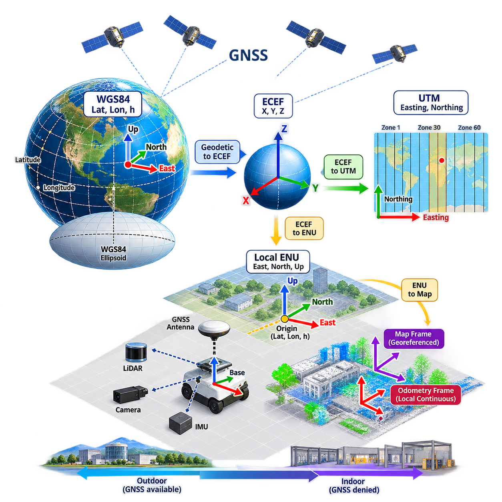
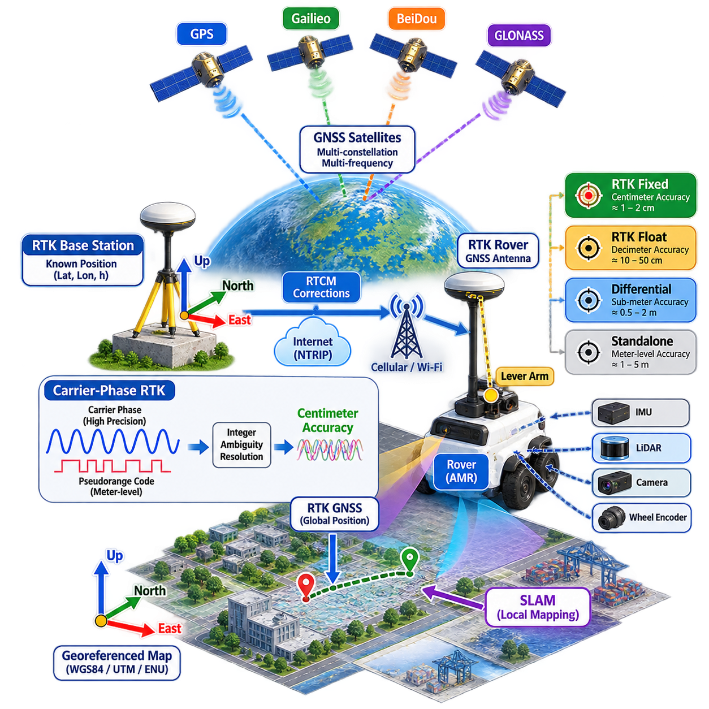
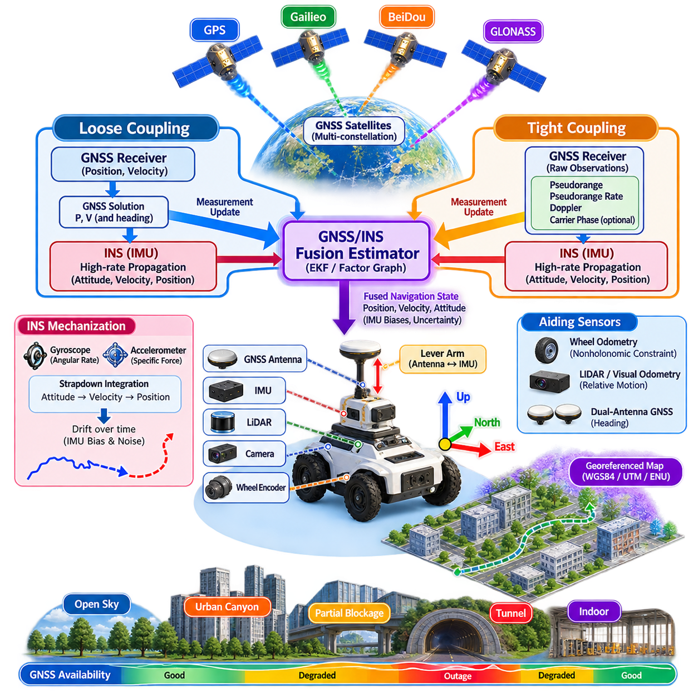
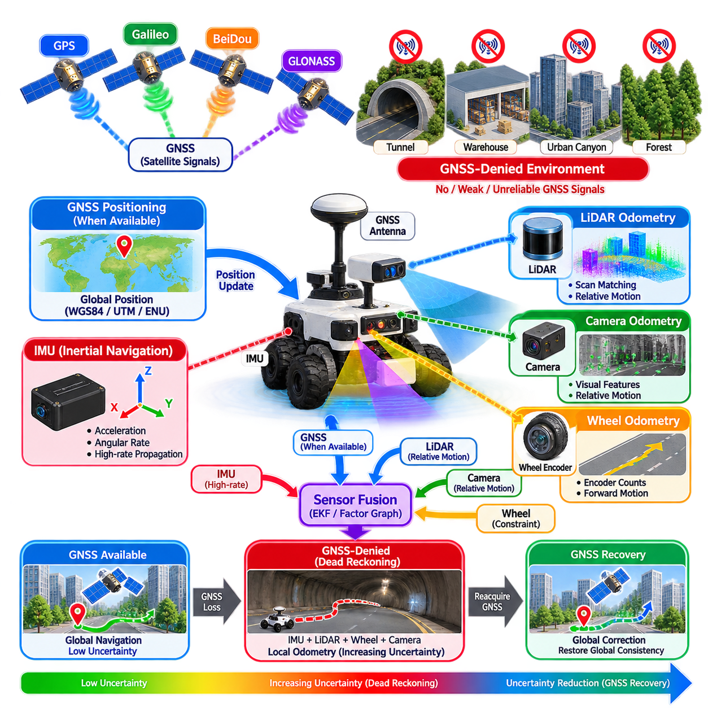
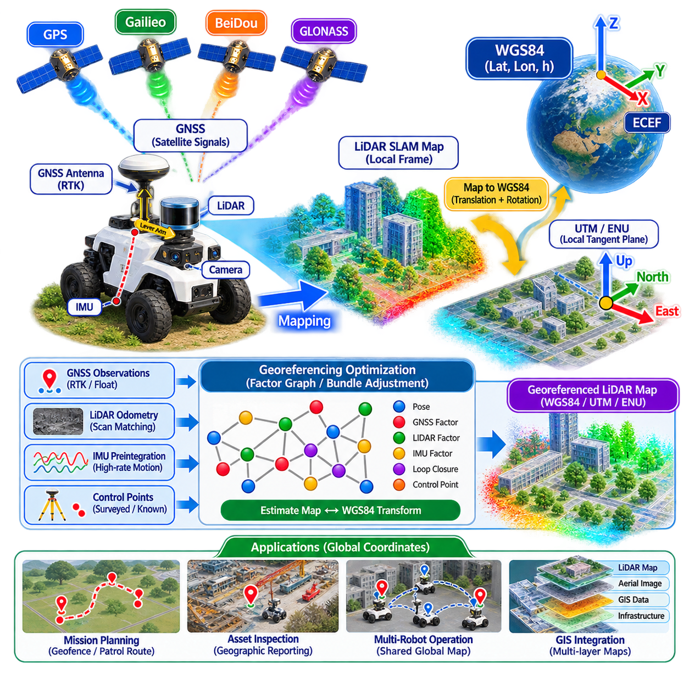
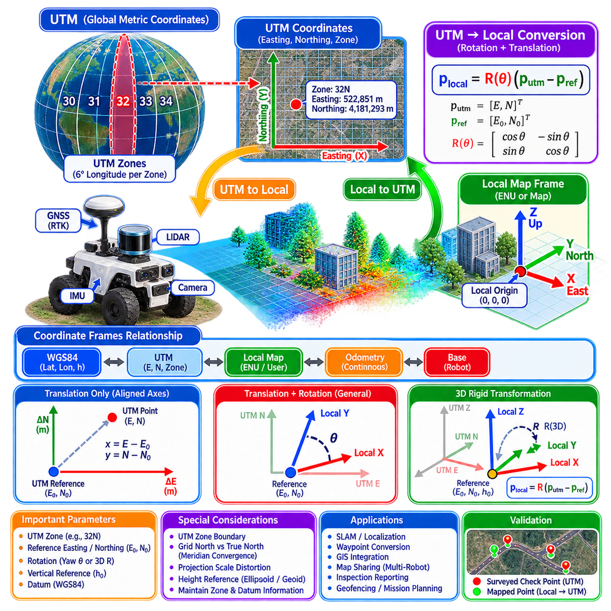
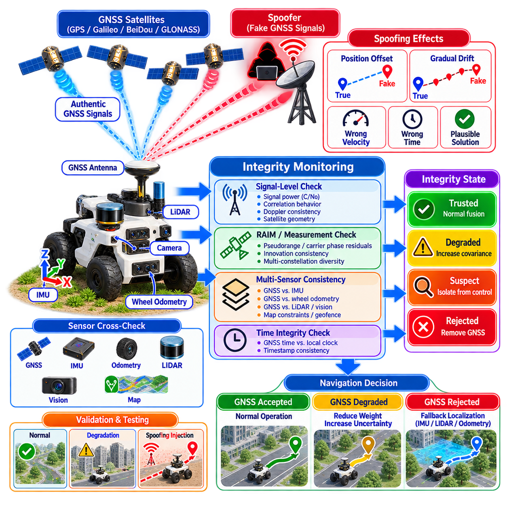
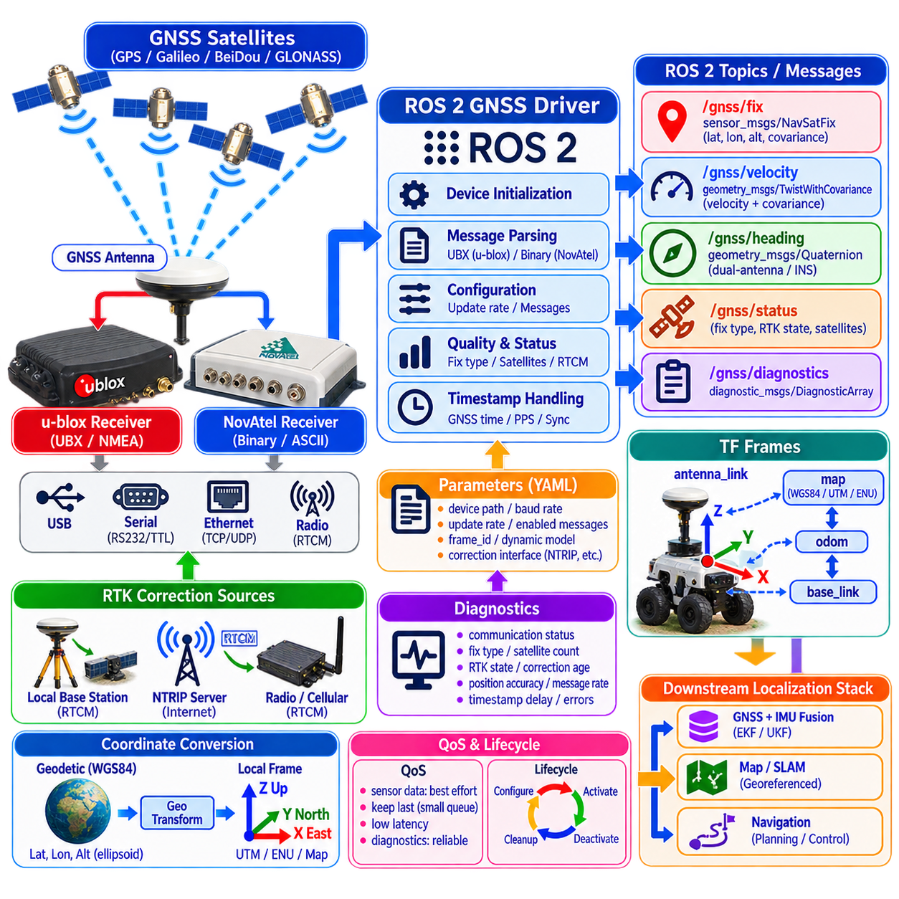
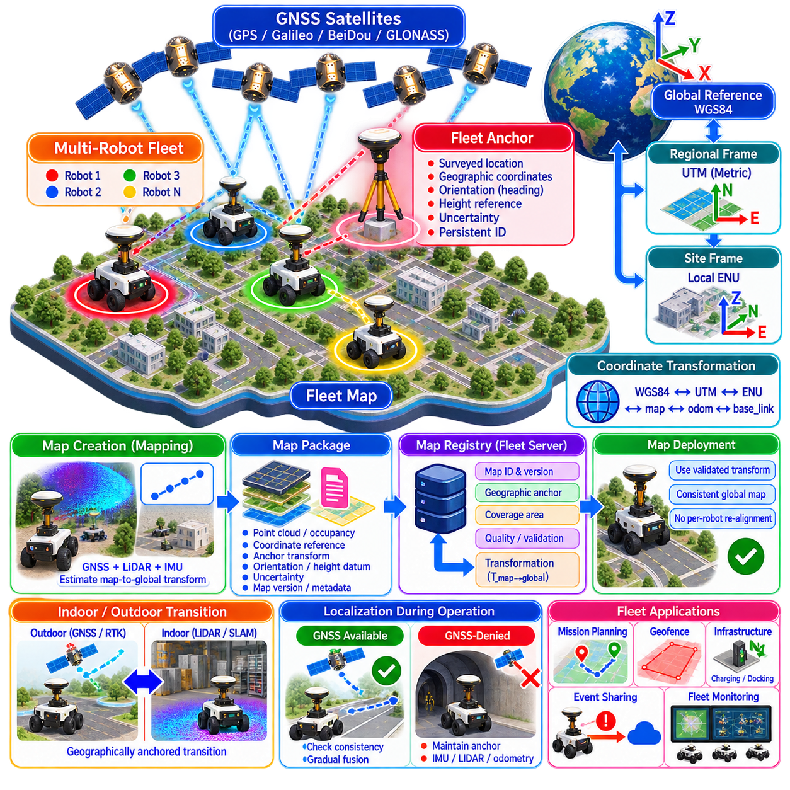
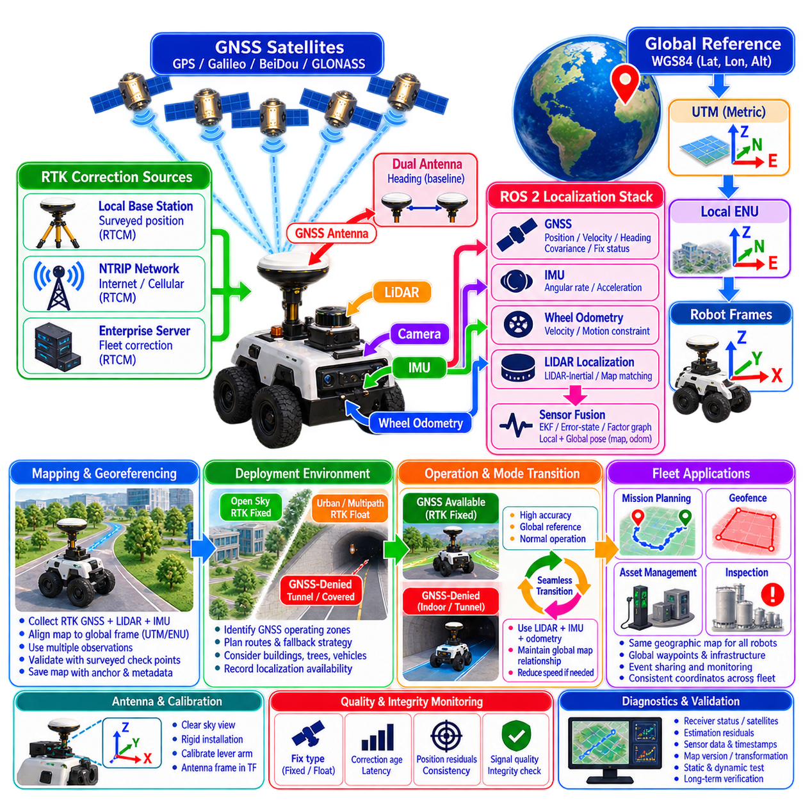

**Volume 13. Mapping Localization and SLAM**


# Chapter 08. GNSS and Georeferenced SLAM

##  

## 08.01. GNSS Coordinate Systems WGS84 UTM Local ENU

{width="7.268055555555556in" height="7.268055555555556in"}

GNSS-based localization begins with a clear understanding of coordinate systems because satellite measurements, digital maps, robot sensors, and SLAM algorithms often represent position in fundamentally different reference frames. GNSS normally provides globally referenced geographic coordinates, while autonomous robots require locally continuous Cartesian coordinates for estimation, mapping, planning, and control. Reliable transformation between these representations is therefore essential.

A coordinate reference system defines how a physical location on or near Earth is represented numerically. Geographic coordinate systems describe positions using latitude, longitude, and height, whereas projected systems express locations using approximately Cartesian coordinates such as easting and northing. Robot localization introduces additional local frames, including East-North-Up, map, odometry, base, and sensor frames, which must remain geometrically consistent.

WGS84, formally the World Geodetic System 1984, is the global geodetic reference system most commonly associated with GNSS. A position is typically represented by geodetic latitude, longitude, and ellipsoidal height relative to the WGS84 reference ellipsoid. Latitude and longitude provide global angular coordinates, but they are unsuitable for direct Euclidean distance calculations because their physical scale varies with geographic location.

The WGS84 reference ellipsoid approximates Earth\'s geometry using a mathematically defined oblate spheroid. This representation provides the basis for converting latitude, longitude, and ellipsoidal height into Earth-Centered, Earth-Fixed coordinates. ECEF expresses a point using three Cartesian coordinates whose origin is near Earth\'s center of mass, creating an important intermediate representation for transformations between global GNSS coordinates and local robotic frames.

In the ECEF frame, the X and Y axes lie approximately in the equatorial plane while the Z axis points toward the conventional terrestrial north direction. Unlike latitude and longitude, ECEF coordinates are expressed in linear units and support vector-based calculations. However, their Earth-centered orientation is inconvenient for navigation because robot motion is usually interpreted relative to the local ground surface rather than Earth\'s center.

UTM, or Universal Transverse Mercator, addresses this problem by projecting geographic coordinates onto regional Cartesian maps. Most of the world is divided into longitudinal zones, and locations within each zone are represented using easting and northing coordinates measured in meters. This makes UTM convenient for engineering applications in which distances, trajectories, boundaries, and map features need to be handled using approximately planar geometry.

UTM coordinates must always be interpreted together with their zone and hemisphere information. An easting and northing pair alone does not uniquely identify a global location because equivalent numerical coordinates may occur in different zones. Furthermore, UTM is a map projection rather than a perfectly distortion-free representation of Earth. Projection distortion remains small within appropriate operating regions but becomes increasingly relevant for large-scale or cross-zone deployments.

For an AMR or autonomous vehicle operating within a factory campus, logistics yard, port, industrial complex, or limited outdoor region, a local East-North-Up coordinate system is often more practical than either geographic or UTM coordinates. ENU establishes a tangent coordinate frame around a selected reference position. Its axes point east, north, and upward, producing coordinates that correspond intuitively to local navigation and mapping.

The ENU origin is normally defined by a known geodetic reference point containing latitude, longitude, and height. GNSS measurements can first be converted from WGS84 geodetic coordinates into ECEF and then transformed into ENU relative to this origin. Once converted, robot displacement can be represented in meters with values suitable for state estimation, trajectory generation, SLAM optimization, and comparison with locally surveyed infrastructure.

Choosing the ENU origin is an architectural decision rather than merely a mathematical convenience. A stable reference point should normally remain fixed throughout a deployment so that maps, recorded trajectories, landmarks, geofences, and mission coordinates preserve consistent meaning. Changing the origin without managing the corresponding transformation can shift every georeferenced object and produce apparent localization errors even when the GNSS receiver itself is functioning correctly.

Height requires special attention because different systems may use different vertical references. GNSS commonly provides ellipsoidal height relative to a reference ellipsoid, while engineering maps may use orthometric height associated with mean sea level and a geoid model. Treating these values as interchangeable can introduce systematic vertical offsets. The height datum and conversion method should therefore be explicitly defined whenever three-dimensional georeferencing is required.

A practical robotic system often maintains several coordinate layers simultaneously. WGS84 provides global geographic identity, UTM may support regional GIS and infrastructure data, ENU provides a convenient local metric frame, and SLAM maintains map and odometry frames optimized for robot estimation. The objective is not to select one coordinate system for every purpose, but to establish deterministic transformations connecting all required representations.

In a typical GNSS-integrated SLAM architecture, the robot\'s sensors estimate rapid local motion while GNSS supplies globally referenced observations. Wheel odometry, visual-inertial odometry, or LiDAR-inertial odometry may operate continuously in a local frame. GNSS measurements are transformed into the selected map reference and incorporated as position constraints, allowing the estimator to limit long-term drift without forcing every internal calculation to use geographic coordinates.

The distinction between map and odometry coordinates is particularly important. An odometry frame is generally designed to remain locally continuous and therefore should not suddenly jump when a corrected GNSS estimate becomes available. A globally referenced map frame can instead absorb slow corrections or alignment changes. The transformation between map and odometry frames allows global accuracy to improve while preserving the short-term continuity required by controllers and local planners.

Georeferencing SLAM means determining the geometric relationship between a locally generated SLAM map and an external Earth-referenced coordinate system. This can be achieved using GNSS observations, surveyed control points, known landmarks, or combinations of these sources. Once the transformation is established, locations detected in the SLAM map can be associated with geographic coordinates, and externally defined missions can be transformed into coordinates usable by the robot.

Orientation must also be treated carefully during global-to-local transformation. ENU defines axis directions geometrically, but the robot\'s body heading must be related to those axes through an appropriate orientation estimate. GNSS position alone does not necessarily provide reliable heading when a vehicle is stationary or moving slowly. Dual-antenna GNSS, IMU measurements, visual or LiDAR odometry, and motion-based heading estimation may therefore complement positional georeferencing.

Coordinate transformations should be implemented as an explicit transformation chain rather than scattered conversion functions throughout the software. A well-defined chain such as WGS84 geodetic coordinates to ECEF, ECEF to local ENU, and ENU to the SLAM map frame makes assumptions visible and testable. Sensor extrinsic transformations then connect the GNSS antenna, IMU, LiDAR, cameras, and robot base to the same spatial model.

Numerical precision becomes important when global coordinates are processed by robotics software. ECEF values can have magnitudes of several million meters, whereas robot motion may need centimeter-level resolution. Performing all optimization directly with large global coordinates can therefore create unnecessary numerical difficulties, particularly with limited-precision arithmetic. Local coordinate frames reduce coordinate magnitude and improve the conditioning of many estimation and optimization operations.

Datum consistency is equally important when integrating third-party maps, survey data, RTK reference stations, GIS databases, and GNSS receivers. Two datasets that visually appear to use latitude and longitude may rely on different datums, epochs, projection parameters, or height references. High-accuracy robotic applications should preserve coordinate metadata instead of assuming that all geographic data labeled with familiar units are automatically compatible.

RTK GNSS increases the importance of disciplined coordinate management because centimeter-level measurements expose errors that may previously have been hidden by ordinary GNSS uncertainty. An incorrect antenna lever arm, inconsistent datum, inaccurate base-station coordinate, wrong UTM zone, or confused height reference can generate systematic errors larger than the receiver\'s nominal precision. High-quality positioning therefore requires system-level geodetic consistency, not merely a high-accuracy receiver.

Multi-robot systems require an especially clear global reference strategy. Individual robots may maintain independent odometry and local SLAM frames, but shared missions and map exchange require a common georeferenced layer. A consistent WGS84, UTM, or site-level ENU reference enables trajectories, obstacles, inspection events, and semantic landmarks generated by different robots to be exchanged without assuming that their local coordinate origins are identical.

For indoor-outdoor robots, coordinate management becomes a bridge between GNSS-available and GNSS-denied environments. Outdoors, GNSS can anchor the map to a global reference. As the robot enters a building, tunnel, warehouse, or covered structure, SLAM and inertial estimation maintain localization relative to that established map. When GNSS becomes available again, global observations can be used to verify or gradually correct accumulated drift while maintaining trajectory continuity.

A production implementation should therefore treat coordinate definitions as part of the localization interface contract. The datum, projection, zone, origin latitude and longitude, vertical reference, axis convention, units, orientation convention, timestamp, and transformation ownership should be explicitly documented. Coordinate metadata should travel with maps and mission data so that another robot or software component can reconstruct their physical meaning without relying on undocumented assumptions.

Validation should include known control points and reversible transformation tests. A position converted from WGS84 into ECEF, ENU, or UTM and then transformed back should reproduce the original location within the accuracy expected from the selected algorithms and numerical representation. Field tests should additionally compare surveyed points, GNSS antenna positions, SLAM landmarks, and robot trajectories to identify systematic translation, rotation, scale, or altitude errors.

Ultimately, WGS84, UTM, and local ENU frames serve complementary roles in georeferenced SLAM. WGS84 provides a global geodetic foundation, UTM provides convenient regional metric coordinates, and ENU provides a locally intuitive Cartesian space for robotic computation. A carefully designed transformation architecture allows GNSS and SLAM to operate together while preserving global traceability, local numerical stability, and consistent spatial relationships across sensors, maps, robots, and missions.

위성항법시스템(GNSS) 기반 위치추정(Localization)은 좌표계(Coordinate System)에 대한 명확한 이해에서 시작한다. 위성 측정값, 디지털 지도(Digital Map), 로봇 센서(Robot Sensor), 동시적 위치추정 및 지도작성(SLAM) 알고리즘은 위치를 서로 근본적으로 다른 기준 좌표계(Reference Frame)로 표현하는 경우가 많다. GNSS는 일반적으로 전역 기준의 지리 좌표(Global Geographic Coordinate)를 제공하지만, 자율주행 로봇은 상태 추정, 지도작성, 경로 계획 및 제어를 위해 국부적으로 연속적인 직교 좌표(Cartesian Coordinate)를 필요로 한다. 따라서 이러한 표현 사이의 신뢰성 높은 좌표 변환(Coordinate Transformation)은 필수적이다.

좌표 참조 시스템(Coordinate Reference System, CRS)은 지구 표면 또는 그 주변의 물리적 위치를 수치적으로 표현하는 방법을 정의한다. 지리 좌표계(Geographic Coordinate System)는 위도(Latitude), 경도(Longitude), 높이(Height)를 사용하여 위치를 나타내며, 투영 좌표계(Projected Coordinate System)는 동향 좌표(Easting)와 북향 좌표(Northing)와 같은 근사 직교 좌표로 위치를 표현한다. 로봇 위치추정에서는 동-북-상(ENU), 지도(Map), 오도메트리(Odometry), 로봇 본체(Base), 센서(Sensor) 좌표계 등이 추가로 사용되며, 이들 사이의 기하학적 일관성이 유지되어야 한다.

세계측지계 1984(World Geodetic System 1984, WGS84)는 GNSS와 가장 일반적으로 연계되는 전역 측지 기준 시스템(Global Geodetic Reference System)이다. 위치는 일반적으로 WGS84 기준 타원체(Reference Ellipsoid)를 기준으로 측지 위도(Geodetic Latitude), 경도(Longitude), 타원체고(Ellipsoidal Height)로 표현된다. 위도와 경도는 전역 위치를 나타낼 수 있지만, 지리적 위치에 따라 물리적 축척이 달라지므로 직접적인 유클리드 거리(Euclidean Distance) 계산에는 적합하지 않다.

WGS84 기준 타원체는 수학적으로 정의된 편평 회전타원체(Oblate Spheroid)를 사용하여 지구의 형상을 근사한다. 이러한 표현은 위도, 경도, 타원체고를 지구중심-지구고정 좌표(Earth-Centered, Earth-Fixed, ECEF)로 변환하는 기반을 제공한다. ECEF는 지구 질량 중심 부근을 원점으로 하는 세 개의 직교 좌표로 위치를 표현하며, 전역 GNSS 좌표와 로봇의 국부 좌표계(Local Frame)를 연결하는 중요한 중간 표현으로 사용된다.

ECEF 좌표계에서 X축과 Y축은 대략 적도면(Equatorial Plane)에 놓이며, Z축은 관습적인 지구 북쪽 방향을 향한다. 위도와 경도와 달리 ECEF 좌표는 선형 단위(Linear Unit)로 표현되므로 벡터 기반 계산(Vector-Based Calculation)에 적합하다. 그러나 지구 중심을 기준으로 축이 설정되기 때문에 로봇의 이동을 해석하기에는 불편하며, 실제 로봇 주행은 일반적으로 지구 중심이 아니라 국부적인 지표면(Local Ground Surface)을 기준으로 해석된다.

UTM(Universal Transverse Mercator)은 지리 좌표를 지역적인 직교 지도 좌표로 투영하여 이러한 문제를 해결한다. 세계 대부분의 지역을 경도 방향의 여러 구역(Zone)으로 구분하고, 각 구역 내부의 위치를 미터 단위의 동향 좌표(Easting)와 북향 좌표(Northing)로 나타낸다. 따라서 거리, 궤적(Trajectory), 경계 영역 및 지도 객체를 근사적인 평면 기하학(Planar Geometry)으로 처리해야 하는 공학 응용에서 UTM은 매우 편리하다.

UTM 좌표는 반드시 해당 구역(Zone)과 반구(Hemisphere) 정보와 함께 해석해야 한다. 동향 좌표와 북향 좌표 값만으로는 전역 위치를 고유하게 결정할 수 없는데, 서로 다른 구역에서 동일한 수치의 좌표가 존재할 수 있기 때문이다. 또한 UTM은 완전히 왜곡이 없는 지구 표현이 아니라 지도 투영(Map Projection)이다. 적절한 운용 범위에서는 투영 왜곡(Projection Distortion)이 작지만, 광범위한 영역이나 여러 UTM 구역을 넘나드는 운용에서는 그 영향이 커질 수 있다.

공장 캠퍼스, 물류 야드(Logistics Yard), 항만, 산업단지 또는 제한된 실외 영역에서 운용되는 자율이동로봇(AMR)이나 자율주행차량(Autonomous Vehicle)의 경우, 지리 좌표나 UTM보다 국부 동-북-상 좌표계(Local East-North-Up, ENU)가 더 실용적인 경우가 많다. ENU는 선택한 기준 위치를 중심으로 지구 표면에 접하는 국부 접평면 좌표계(Local Tangent Frame)를 설정한다. 각 축은 동쪽(East), 북쪽(North), 위쪽(Up)을 향하므로 국부적인 로봇 항법과 지도작성에 직관적으로 대응한다.

ENU의 원점(Origin)은 일반적으로 위도, 경도, 높이를 포함하는 알려진 측지 기준점(Geodetic Reference Point)으로 정의된다. GNSS 측정값은 먼저 WGS84 측지 좌표에서 ECEF로 변환된 후, 이 기준점을 중심으로 ENU 좌표로 변환될 수 있다. 변환 이후 로봇의 변위(Displacement)는 미터 단위로 표현되며, 상태 추정(State Estimation), 궤적 생성(Trajectory Generation), SLAM 최적화 및 지역 측량 기반 인프라와의 비교에 적합해진다.

ENU 원점을 선택하는 것은 단순한 수학적 편의를 넘어 시스템 아키텍처(System Architecture)의 중요한 결정이다. 안정적인 기준점은 일반적으로 전체 운용 기간 동안 고정되어야 하며, 이를 통해 지도, 기록된 궤적, 랜드마크(Landmark), 지오펜스(Geofence), 임무 좌표(Mission Coordinate)가 일관된 의미를 유지할 수 있다. 관련 좌표 변환을 관리하지 않고 원점을 변경하면 GNSS 수신기가 정상적으로 동작하더라도 모든 지리 참조 객체(Georeferenced Object)가 이동하여 위치추정 오류처럼 나타날 수 있다.

높이(Height)는 서로 다른 시스템이 서로 다른 수직 기준(Vertical Reference)을 사용할 수 있기 때문에 특별한 주의가 필요하다. GNSS는 일반적으로 기준 타원체에 대한 타원체고(Ellipsoidal Height)를 제공하지만, 공학 지도에서는 평균 해수면(Mean Sea Level) 및 지오이드 모델(Geoid Model)과 연계된 정표고(Orthometric Height)를 사용할 수 있다. 이러한 값을 동일한 것으로 취급하면 체계적인 수직 오프셋(Systematic Vertical Offset)이 발생할 수 있으므로, 3차원 지리 참조(3D Georeferencing)가 필요한 경우 높이 기준면(Height Datum)과 변환 방법을 명확하게 정의해야 한다.

실제 로봇 시스템은 여러 좌표 계층(Coordinate Layer)을 동시에 유지하는 경우가 많다. WGS84는 전역적인 지리적 식별 기준을 제공하고, UTM은 지역 지리정보시스템(GIS) 및 인프라 데이터를 지원하며, ENU는 편리한 국부 미터 좌표계를 제공한다. 동시에 SLAM은 로봇 상태 추정에 최적화된 지도(Map) 및 오도메트리(Odometry) 좌표계를 유지한다. 핵심은 하나의 좌표계를 모든 목적에 사용하는 것이 아니라 필요한 모든 좌표 표현을 연결하는 결정론적 변환(Deterministic Transformation)을 구축하는 것이다.

일반적인 GNSS 통합 SLAM 아키텍처에서는 로봇 센서가 빠른 국부 운동(Local Motion)을 추정하고 GNSS가 전역 기준 관측값(Global Reference Observation)을 제공한다. 휠 오도메트리(Wheel Odometry), 시각-관성 오도메트리(Visual-Inertial Odometry), 라이다-관성 오도메트리(LiDAR-Inertial Odometry)는 국부 좌표계에서 지속적으로 동작할 수 있다. GNSS 측정값은 선택한 지도 기준 좌표로 변환되어 위치 제약조건(Position Constraint)으로 통합되며, 이를 통해 모든 내부 계산을 지리 좌표로 수행하지 않으면서도 장기적인 누적 오차(Drift)를 제한할 수 있다.

지도 좌표(Map Frame)와 오도메트리 좌표(Odometry Frame)의 구분은 특히 중요하다. 오도메트리 좌표계는 일반적으로 국부적으로 연속성을 유지하도록 설계되므로 보정된 GNSS 추정값이 들어왔다고 해서 갑자기 좌표가 점프해서는 안 된다. 반면 전역 기준의 지도 좌표계는 느린 보정이나 정렬 변화를 흡수할 수 있다. 지도와 오도메트리 좌표계 사이의 변환을 이용하면 제어기(Controller)와 국부 경로계획기(Local Planner)에 필요한 단기 연속성을 유지하면서 전역 위치 정확도를 향상시킬 수 있다.

SLAM의 지리 참조(Georeferencing)는 국부적으로 생성된 SLAM 지도와 외부의 지구 기준 좌표계(Earth-Referenced Coordinate System) 사이의 기하학적 관계를 결정하는 것을 의미한다. 이는 GNSS 관측값, 측량된 기준점(Surveyed Control Point), 알려진 랜드마크 또는 이들의 조합을 사용하여 수행할 수 있다. 변환 관계가 확립되면 SLAM 지도에서 검출된 위치를 지리 좌표와 연결할 수 있으며, 외부에서 정의한 임무 좌표도 로봇이 사용할 수 있는 좌표로 변환할 수 있다.

전역 좌표에서 국부 좌표로 변환할 때는 방향(Orientation) 역시 주의 깊게 처리해야 한다. ENU는 기하학적으로 각 축의 방향을 정의하지만, 로봇 본체의 헤딩(Heading)은 적절한 자세 추정(Orientation Estimation)을 통해 이 축들과 연결되어야 한다. GNSS 위치 정보만으로는 차량이 정지하거나 저속으로 이동할 때 신뢰성 높은 헤딩을 제공하지 못할 수 있다. 따라서 이중 안테나 GNSS(Dual-Antenna GNSS), 관성측정장치(IMU), 시각 또는 라이다 오도메트리, 이동 기반 헤딩 추정(Motion-Based Heading Estimation)을 함께 활용할 수 있다.

좌표 변환은 소프트웨어 곳곳에 분산된 개별 변환 함수가 아니라 명시적인 변환 체인(Transformation Chain)으로 구현하는 것이 바람직하다. WGS84 측지 좌표에서 ECEF, ECEF에서 국부 ENU, ENU에서 SLAM 지도 좌표로 이어지는 명확한 체인은 시스템의 가정과 변환 관계를 가시적이고 검증 가능하게 만든다. 이후 센서 외부 파라미터 변환(Sensor Extrinsic Transformation)을 통해 GNSS 안테나, IMU, 라이다(LiDAR), 카메라 및 로봇 본체를 동일한 공간 모델(Spatial Model)에 연결할 수 있다.

전역 좌표를 로봇 소프트웨어에서 처리할 때는 수치 정밀도(Numerical Precision)도 중요하다. ECEF 좌표값은 수백만 미터 규모에 이를 수 있지만, 로봇의 움직임은 센티미터 수준의 분해능이 필요할 수 있다. 따라서 큰 전역 좌표를 직접 사용하여 모든 최적화를 수행하면 특히 제한된 정밀도의 수치 연산에서 불필요한 수치적 문제가 발생할 수 있다. 국부 좌표계(Local Coordinate Frame)는 좌표값의 크기를 줄여 상태 추정과 최적화 연산의 수치적 조건(Numerical Conditioning)을 개선한다.

외부 지도, 측량 데이터, RTK 기준국(Reference Station), GIS 데이터베이스 및 GNSS 수신기를 통합할 때는 측지 기준계(Datum)의 일관성도 매우 중요하다. 두 데이터셋이 모두 위도와 경도를 사용하는 것처럼 보이더라도 서로 다른 측지 기준계, 기준 시점(Epoch), 투영 파라미터(Projection Parameter), 높이 기준을 사용할 수 있다. 고정밀 로봇 응용에서는 익숙한 단위를 사용하는 모든 지리 데이터가 자동으로 호환된다고 가정하지 말고 좌표 메타데이터(Coordinate Metadata)를 함께 관리해야 한다.

실시간 이동측위(Real-Time Kinematic, RTK) GNSS를 사용하면 좌표 관리의 중요성은 더욱 커진다. 센티미터 수준의 측정 정확도는 일반 GNSS의 오차에 가려졌던 시스템 오류를 드러낼 수 있기 때문이다. 잘못된 안테나 레버암(Antenna Lever Arm), 일치하지 않는 측지 기준계, 부정확한 기준국 좌표, 잘못된 UTM 구역 또는 혼동된 높이 기준은 GNSS 수신기의 명목 정확도보다 더 큰 체계적 오차를 발생시킬 수 있다. 따라서 고정밀 위치추정은 고성능 수신기뿐만 아니라 시스템 전체의 측지학적 일관성(Geodetic Consistency)을 요구한다.

다중 로봇 시스템(Multi-Robot System)에서는 더욱 명확한 전역 기준 전략(Global Reference Strategy)이 필요하다. 각 로봇은 독립적인 오도메트리 및 국부 SLAM 좌표계를 유지할 수 있지만, 공동 임무 수행과 지도 공유(Map Sharing)를 위해서는 공통된 지리 참조 계층이 필요하다. 일관된 WGS84, UTM 또는 현장 수준 ENU 기준을 사용하면 서로 다른 로봇이 생성한 궤적, 장애물, 검사 이벤트(Inspection Event), 의미론적 랜드마크(Semantic Landmark)를 각 로봇의 국부 원점이 동일하다고 가정하지 않고도 교환할 수 있다.

실내외 통합 로봇(Indoor-Outdoor Robot)에서 좌표 관리는 GNSS 사용 가능 환경과 GNSS 음영 환경(GNSS-Denied Environment)을 연결하는 가교 역할을 한다. 실외에서는 GNSS를 사용하여 지도를 전역 기준에 고정할 수 있으며, 로봇이 건물, 터널, 창고 또는 지붕이 있는 구조물에 진입하면 SLAM과 관성 기반 추정(Inertial Estimation)이 기존 지도에 대한 위치추정을 유지한다. 이후 GNSS가 다시 사용 가능해지면 전역 관측값을 이용해 궤적의 연속성을 유지하면서 누적 오차를 검증하거나 점진적으로 보정할 수 있다.

양산 수준의 구현(Production Implementation)에서는 좌표 정의를 위치추정 인터페이스 계약(Localization Interface Contract)의 일부로 관리해야 한다. 측지 기준계, 지도 투영법, UTM 구역, 원점의 위도와 경도, 수직 기준, 축 방향 규약(Axis Convention), 단위, 자세 표현 규약, 타임스탬프(Timestamp), 좌표 변환의 관리 주체를 명확하게 문서화해야 한다. 또한 지도와 임무 데이터에 좌표 메타데이터를 함께 저장하여 다른 로봇이나 소프트웨어 구성요소가 문서화되지 않은 가정 없이 물리적 의미를 재구성할 수 있도록 해야 한다.

검증(Validation) 과정에는 알려진 기준점(Control Point)과 가역적인 좌표 변환 시험(Reversible Transformation Test)이 포함되어야 한다. WGS84 위치를 ECEF, ENU 또는 UTM으로 변환한 후 다시 원래 좌표계로 역변환했을 때 선택한 알고리즘과 수치 표현에서 기대되는 정확도 범위 내에서 원래 위치가 재현되어야 한다. 현장 시험에서는 측량 기준점, GNSS 안테나 위치, SLAM 랜드마크, 로봇 궤적을 비교하여 체계적인 병진(Translation), 회전(Rotation), 축척(Scale), 고도(Altitude) 오차를 확인해야 한다.

궁극적으로 WGS84, UTM, 국부 ENU 좌표계는 지리 참조 SLAM(Georeferenced SLAM)에서 서로 경쟁하는 방식이 아니라 상호 보완적인 역할을 수행한다. WGS84는 전역 측지 기반(Global Geodetic Foundation)을 제공하고, UTM은 편리한 지역 미터 좌표를 제공하며, ENU는 로봇 계산에 적합한 직관적인 국부 직교 공간을 제공한다. 체계적으로 설계된 좌표 변환 아키텍처는 GNSS와 SLAM을 효과적으로 통합하면서 센서, 지도, 로봇 및 임무 전체에 걸쳐 전역 추적성(Global Traceability), 국부 수치 안정성(Local Numerical Stability), 일관된 공간 관계를 유지할 수 있도록 한다.

##  

## 08.02. RTK GNSS Setup and Centimeter Accuracy [w/Code]

{width="7.268055555555556in" height="7.268055555555556in"}

Real-Time Kinematic GNSS, commonly called RTK GNSS, extends conventional satellite positioning by using correction information from a precisely referenced base station or correction network. While standalone GNSS often provides meter-level positioning, RTK exploits carrier-phase measurements to achieve centimeter-class relative accuracy under favorable conditions. This capability makes RTK valuable for outdoor AMRs, autonomous vehicles, surveying robots, and georeferenced SLAM.

An RTK system normally consists of a rover receiver mounted on the robot, a correction source, GNSS antennas, and a communication link carrying correction data. The correction source may be a dedicated local base station or a continuously operating reference network. Both rover and reference observe common satellite signals, allowing correlated satellite, atmospheric, and clock-related errors to be substantially reduced during positioning.

Carrier-phase observation is the fundamental measurement that enables RTK to outperform ordinary code-based GNSS positioning. Instead of relying only on the timing of pseudorandom ranging codes, the receiver measures the phase of the GNSS carrier wave. Because carrier wavelengths are relatively short, phase observations contain extremely precise range information. The principal challenge is determining the unknown integer number of complete carrier cycles between satellite and receiver.

This unknown quantity is called the integer ambiguity. During initialization, the RTK estimator combines observations from multiple satellites and frequencies to determine candidate integer values. When the ambiguities are reliably resolved, the receiver enters an RTK fixed solution and centimeter-class accuracy becomes possible. Before successful resolution, the receiver may remain in a float state, where ambiguity estimates are non-integer and positional uncertainty is substantially larger.

RTK status should therefore be treated as part of localization quality rather than merely displayed as receiver information. A robot should distinguish fixed, float, differential, standalone, and invalid solutions and associate each state with appropriate uncertainty. Navigation software should not assume that every coordinate produced by an RTK-capable receiver has centimeter accuracy. Mission behavior may need to change when the solution degrades from fixed to float or standalone positioning.

A dedicated RTK base station requires a carefully determined reference coordinate. If the base position contains a systematic error, rover positions derived from that base inherit the corresponding global offset even when their relative precision is excellent. The base antenna should therefore be installed at a stable location with adequate sky visibility, and its coordinates should be established through surveying, reliable reference data, or sufficiently long static observation depending on accuracy requirements.

Network RTK can eliminate the need to operate a private physical base station. Correction services use multiple reference stations and deliver corrections to the rover through technologies such as NTRIP, the Networked Transport of RTCM via Internet Protocol. The rover generally obtains correction messages through cellular, Wi-Fi, or another IP connection. Network RTK simplifies deployment but introduces dependence on service coverage, communications, credentials, and network availability.

RTCM messages provide a widely used standardized mechanism for transmitting GNSS correction and observation information. A production system should verify that the base, correction service, modem, and rover support compatible RTCM message types and satellite constellations. Message age is also important because stale correction data reduce RTK performance. Localization software should monitor correction reception, latency, update rate, and interruption duration rather than assuming the communication link remains healthy.

Modern multi-constellation, multi-frequency receivers can track GPS, Galileo, BeiDou, GLONASS, and other supported satellite systems. Access to more satellites improves geometry and can increase availability in partially obstructed environments. Multiple frequencies also help resolve ambiguities and compensate for ionospheric effects. However, adding constellations cannot completely overcome severe signal blockage, multipath, poor antenna installation, or strong radio-frequency interference.

Antenna placement is one of the most important mechanical aspects of RTK integration. The antenna should have the clearest practical view of the sky and should be positioned away from structures that block or strongly reflect satellite signals. Large metal surfaces, nearby vertical structures, robot payloads, roofs, cranes, containers, buildings, and other objects can generate multipath or reduce satellite visibility, degrading both ambiguity resolution and positioning stability.

The antenna phase center represents the physical point to which GNSS measurements effectively refer, while robot localization usually requires the pose of the vehicle base or another defined reference point. The spatial offset between these locations is the antenna lever arm. This offset must be measured and represented accurately in the robot transformation model, particularly when centimeter-level positioning is expected. Rotation of the vehicle makes an incorrect lever arm appear as a position-dependent localization error.

For dual-antenna RTK systems, the known baseline between two antennas can provide absolute heading even when the robot is stationary. This is particularly useful for low-speed AMRs because course-over-ground heading derived from position changes becomes unreliable near zero velocity. The antenna baseline should be mechanically rigid and accurately measured, while the resulting GNSS heading must be transformed consistently into the robot body-frame orientation convention.

Time synchronization is equally important when RTK observations are fused with IMU, LiDAR, cameras, wheel encoders, or other sensors. A centimeter-level position measured at the wrong timestamp may correspond to a significantly different robot location during motion. GNSS time, pulse-per-second signals, hardware timestamps, PTP, or disciplined system clocks can be used to establish a common temporal reference. Fusion software should account for communication and processing latency explicitly.

The relationship between RTK accuracy and precision must also be understood. A sequence of positions can be tightly clustered yet globally displaced because of an incorrect base coordinate, datum mismatch, or transformation error. Conversely, an accurately referenced system may temporarily exhibit noisy measurements due to poor satellite geometry or multipath. Production validation should therefore evaluate absolute accuracy, repeatability, short-term noise, long-term stability, and availability separately.

Dilution of Precision, satellite count, carrier-to-noise measurements, residuals, ambiguity status, and receiver-estimated covariance provide useful indicators of GNSS quality. No single indicator should be interpreted in isolation. A high satellite count does not guarantee accurate positioning if the satellites have poor geometry or signals are reflected. Robust localization systems combine multiple quality indicators with consistency checks against inertial, odometric, and SLAM estimates.

RTK performance is strongly environment-dependent. Open-sky roads, campuses, fields, and industrial yards can provide excellent results, whereas urban canyons, tunnels, dense vegetation, metal-roofed areas, container terminals, and locations beside large structures can be challenging. Multipath is particularly dangerous because reflected signals can appear geometrically plausible while introducing biased measurements. Centimeter-class specifications should therefore never be interpreted as guaranteed accuracy in every operating environment.

An RTK-enabled autonomous robot should be designed to survive temporary GNSS degradation rather than depending continuously on fixed RTK. IMU, wheel odometry, visual-inertial estimation, and LiDAR-inertial localization can maintain short-term motion estimates during outages. GNSS can then act as an absolute positioning constraint when reliable observations return. This architecture allows RTK to control long-term global drift while local estimators preserve smooth high-rate motion.

Directly injecting a newly recovered RTK position into the robot pose can create undesirable jumps after an outage. A more robust fusion architecture evaluates measurement uncertainty and innovation before accepting the observation. Global corrections can be introduced through a map-to-odometry transformation, factor graph, Kalman-filter framework, or similar estimator. The local odometry trajectory remains continuous while the globally referenced estimate gradually regains consistency with RTK.

RTK GNSS and georeferenced SLAM are particularly complementary because they solve different localization problems. SLAM provides rich relative geometry and remains useful where satellite signals disappear, while RTK provides an Earth-referenced position that constrains global drift. When their coordinate frames, timestamps, sensor extrinsics, and uncertainty models are correctly defined, the combined system can maintain locally smooth navigation while preserving globally meaningful map coordinates.

Initialization should include more than waiting for an RTK FIX indicator. The system should verify correction availability, satellite geometry, receiver status, antenna configuration, coordinate reference, time synchronization, and agreement with other localization sources. A robot can also require a stable fixed solution for a defined period before enabling high-accuracy autonomous operation. Such gating prevents transient or incorrectly initialized GNSS estimates from immediately influencing vehicle control.

Operational monitoring should record RTK status together with raw or diagnostic information needed for later analysis. Useful records include position, covariance, correction age, satellite count, signal quality, fix transitions, heading status, timestamps, and estimator innovations. When a field localization failure occurs, these logs help distinguish satellite blockage, correction-link failure, multipath, datum errors, sensor misalignment, synchronization faults, and estimator problems.

Centimeter accuracy must be verified at the complete robot-system level rather than inferred from the GNSS receiver specification. Tests should compare the robot\'s defined reference point against surveyed control points under static and dynamic conditions. Repeated runs should include different headings, speeds, times, and representative environments. Testing only the antenna while stationary does not validate the lever arm, orientation, synchronization, coordinate transformations, or fusion behavior of the moving robot.

A practical validation program should also deliberately create degraded conditions. Correction data can be interrupted, satellite visibility reduced, or the robot moved between open and obstructed areas to observe transitions among fixed, float, and unavailable states. The objective is not only to demonstrate the best achievable accuracy but also to confirm predictable degradation, safe fallback behavior, smooth recovery, and correct reporting of localization confidence.

For multi-robot fleets, all robots should use compatible geodetic references and correction strategies. Shared RTK corrections can provide a common global coordinate foundation, while each robot maintains its own local odometry and SLAM state. This enables trajectories, inspection locations, geofences, docking points, and semantic events to be exchanged across the fleet without requiring each robot to share the same local estimator history.

RTK deployment ultimately depends on disciplined integration of geodesy, radio communication, mechanical installation, timing, estimation, and validation. A high-grade receiver alone cannot guarantee centimeter-level robot localization. Reliable performance emerges when correction integrity, antenna geometry, coordinate references, lever arms, timestamps, uncertainty, and fallback localization are managed as one system. RTK then becomes a robust global constraint for georeferenced autonomous operation rather than a fragile source of precise-looking coordinates.

실시간 이동측위 위성항법시스템(Real-Time Kinematic GNSS, RTK GNSS)은 정밀하게 기준 좌표가 설정된 기준국(Base Station) 또는 보정 네트워크(Correction Network)의 보정 정보를 사용하여 일반적인 위성항법시스템(GNSS)의 위치추정 성능을 확장한다. 단독 GNSS가 일반적으로 미터 수준의 위치 정확도를 제공하는 반면, RTK는 반송파 위상 측정(Carrier-Phase Measurement)을 활용하여 양호한 조건에서 센티미터급 상대 위치 정확도를 달성할 수 있다. 이러한 특성으로 RTK는 실외 자율이동로봇(AMR), 자율주행차량(Autonomous Vehicle), 측량 로봇(Surveying Robot), 지리 참조 SLAM(Georeferenced SLAM) 등에 매우 유용하다.

RTK 시스템은 일반적으로 로봇에 장착되는 이동국 수신기(Rover Receiver), 보정 정보원(Correction Source), GNSS 안테나, 그리고 보정 데이터를 전달하는 통신 링크(Communication Link)로 구성된다. 보정 정보원은 전용 지역 기준국(Local Base Station) 또는 상시 운영되는 기준국 네트워크(Reference Network)가 될 수 있다. 이동국과 기준국은 공통 위성 신호를 동시에 관측하여 위성, 대기 및 시계와 관련된 상관 오차를 위치 계산 과정에서 상당 부분 제거할 수 있다.

반송파 위상 관측(Carrier-Phase Observation)은 RTK가 일반적인 코드 기반 GNSS 위치추정보다 높은 정확도를 제공할 수 있게 하는 핵심 측정 방식이다. 수신기는 의사난수 거리측정 코드(Pseudorandom Ranging Code)의 시간 정보에만 의존하지 않고 GNSS 반송파의 위상을 측정한다. 반송파의 파장은 비교적 짧기 때문에 위상 관측값에는 매우 정밀한 거리 정보가 포함된다. 핵심 과제는 위성과 수신기 사이에 존재하는 완전한 반송파 주기의 정수 개수를 결정하는 것이다.

이러한 미지의 값을 정수 모호성(Integer Ambiguity)이라고 한다. 초기화 과정에서 RTK 추정기(Estimator)는 여러 위성과 주파수에서 얻은 관측값을 결합하여 가능한 정수 값을 결정한다. 모호성이 신뢰성 있게 해결되면 수신기는 RTK 고정해(RTK Fixed Solution) 상태에 진입하며 센티미터급 정확도가 가능해진다. 모호성이 완전히 해결되기 전에는 부동해(Float Solution) 상태에 머물 수 있으며, 이 상태에서는 모호성 추정값이 정수가 아니므로 위치 불확실성이 훨씬 커진다.

따라서 RTK 상태(RTK Status)는 단순히 수신기 화면에 표시되는 정보가 아니라 위치추정 품질(Localization Quality)의 일부로 다루어야 한다. 로봇은 고정해(Fixed), 부동해(Float), 차분해(Differential), 단독 측위(Standalone), 무효해(Invalid Solution)를 구분하고 각 상태에 적절한 불확실성(Uncertainty)을 연계해야 한다. 항법 소프트웨어는 RTK 기능을 가진 수신기가 출력하는 모든 좌표가 센티미터 정확도를 가진다고 가정해서는 안 되며, 고정해에서 부동해 또는 단독 측위로 성능이 저하될 경우 임무 동작도 이에 맞게 변경될 수 있어야 한다.

전용 RTK 기준국은 신중하게 결정된 기준 좌표(Reference Coordinate)를 필요로 한다. 기준국 위치에 체계적 오차(Systematic Error)가 존재하면 상대적인 정밀도가 매우 높더라도 해당 기준국을 사용하는 이동국의 전역 위치에 동일한 오프셋이 전달된다. 따라서 기준국 안테나는 충분한 상공 시야(Sky Visibility)를 확보할 수 있는 안정적인 위치에 설치해야 하며, 요구 정확도에 따라 측량, 신뢰할 수 있는 기준 데이터 또는 충분한 시간 동안의 정적 관측(Static Observation)을 통해 좌표를 결정해야 한다.

네트워크 RTK(Network RTK)를 사용하면 자체적인 물리 기준국을 운영할 필요를 줄일 수 있다. 보정 서비스는 여러 기준국을 이용하고 인터넷 프로토콜을 통한 RTCM 네트워크 전송(Networked Transport of RTCM via Internet Protocol, NTRIP)과 같은 기술을 통해 이동국에 보정 정보를 전달한다. 이동국은 일반적으로 셀룰러(Cellular), 와이파이(Wi-Fi) 또는 다른 IP 통신을 통해 보정 메시지를 수신한다. 네트워크 RTK는 구축을 단순화하지만 서비스 범위, 통신 상태, 인증 정보 및 네트워크 가용성에 대한 의존성이 발생한다.

RTCM 메시지는 GNSS 보정 및 관측 정보를 전송하기 위해 널리 사용되는 표준화된 방법을 제공한다. 양산 시스템(Production System)에서는 기준국, 보정 서비스, 모뎀(Modem), 이동국이 서로 호환되는 RTCM 메시지 유형과 위성군(Constellation)을 지원하는지 확인해야 한다. 보정 데이터의 경과 시간(Correction Age)도 중요하며, 오래된 보정 데이터는 RTK 성능을 저하시킨다. 위치추정 소프트웨어는 통신 링크가 항상 정상이라고 가정하지 말고 보정 데이터 수신 여부, 지연시간(Latency), 갱신 주기(Update Rate), 통신 중단 시간을 지속적으로 감시해야 한다.

현대적인 다중 위성군·다중 주파수 수신기(Multi-Constellation, Multi-Frequency Receiver)는 GPS, 갈릴레오(Galileo), 베이더우(BeiDou), 글로나스(GLONASS) 및 기타 지원 위성 시스템을 추적할 수 있다. 더 많은 위성을 사용할 수 있으면 부분적으로 가려진 환경에서도 위성 배치 기하(Satellite Geometry)와 가용성을 향상시킬 수 있다. 다중 주파수는 모호성 해결과 전리층 오차 보정에도 도움이 되지만, 심각한 신호 차단, 다중경로(Multipath), 부적절한 안테나 설치 또는 강한 무선주파수 간섭(RF Interference)을 완전히 극복할 수는 없다.

안테나 배치(Antenna Placement)는 RTK 통합에서 가장 중요한 기계적 요소 중 하나이다. 안테나는 가능한 한 넓은 상공 시야를 확보해야 하며 위성 신호를 차단하거나 강하게 반사하는 구조물로부터 떨어져 설치해야 한다. 대형 금속 표면, 인접한 수직 구조물, 로봇 탑재물(Payload), 지붕, 크레인, 컨테이너, 건물 등의 물체는 다중경로를 발생시키거나 위성 가시성을 감소시켜 정수 모호성 해결과 위치 안정성을 모두 저하시킬 수 있다.

안테나 위상 중심(Antenna Phase Center)은 GNSS 측정값이 실질적으로 기준으로 삼는 물리적 위치를 의미하지만, 로봇 위치추정에서는 일반적으로 차량 기준점(Base) 또는 별도로 정의된 기준점의 자세(Pose)가 필요하다. 이 두 위치 사이의 공간적 오프셋을 안테나 레버암(Antenna Lever Arm)이라고 한다. 센티미터급 위치 정확도가 요구될 경우 이 오프셋을 정확하게 측정하여 로봇 좌표 변환 모델에 반영해야 한다. 잘못된 레버암 값은 차량이 회전할 때 위치에 따라 변하는 위치추정 오차로 나타날 수 있다.

이중 안테나 RTK(Dual-Antenna RTK) 시스템에서는 두 안테나 사이의 알려진 기준선(Baseline)을 이용하여 로봇이 정지해 있는 상태에서도 절대 헤딩(Absolute Heading)을 얻을 수 있다. 이는 위치 변화에서 계산하는 지상 진행 방향(Course over Ground)이 거의 정지한 저속 상태에서 불안정해지는 자율이동로봇에 특히 유용하다. 안테나 기준선은 기계적으로 견고하고 정확하게 측정되어야 하며, GNSS에서 계산된 헤딩은 로봇 본체 좌표계(Body Frame)의 방향 규약과 일관되게 변환되어야 한다.

RTK 관측값을 관성측정장치(IMU), 라이다(LiDAR), 카메라(Camera), 휠 엔코더(Wheel Encoder) 또는 다른 센서와 융합할 경우 시간 동기화(Time Synchronization)도 매우 중요하다. 센티미터급 위치 측정값이라도 잘못된 타임스탬프(Timestamp)에 대응하면 로봇이 이동하는 동안 실제 위치와 상당한 차이가 발생할 수 있다. GNSS 시간, 초당 펄스(Pulse Per Second, PPS), 하드웨어 타임스탬프(Hardware Timestamp), 정밀 시간 프로토콜(Precision Time Protocol, PTP) 또는 동기화된 시스템 시계를 사용하여 공통 시간 기준을 구축할 수 있다. 센서 융합 소프트웨어는 통신 및 처리 지연시간을 명시적으로 고려해야 한다.

RTK의 정확도(Accuracy)와 정밀도(Precision)의 차이도 이해해야 한다. 연속된 위치값이 매우 좁은 영역에 모여 있더라도 잘못된 기준국 좌표, 측지 기준계(Datum) 불일치 또는 좌표 변환 오류 때문에 전체적으로 실제 위치에서 벗어날 수 있다. 반대로 정확한 전역 기준을 사용하는 시스템이라도 위성 배치가 좋지 않거나 다중경로가 발생하면 일시적으로 측정값의 잡음이 증가할 수 있다. 따라서 양산 검증에서는 절대 정확도, 반복성(Repeatability), 단기 잡음, 장기 안정성 및 가용성(Availability)을 각각 평가해야 한다.

정밀도 저하율(Dilution of Precision, DOP), 위성 수, 반송파 대 잡음비(Carrier-to-Noise Ratio), 잔차(Residual), 모호성 상태(Ambiguity Status), 수신기가 추정한 공분산(Covariance)은 GNSS 품질을 판단하는 유용한 지표를 제공한다. 그러나 어느 하나의 지표만 독립적으로 해석해서는 안 된다. 위성 수가 많더라도 위성 배치가 나쁘거나 신호가 반사되면 정확한 위치추정을 보장할 수 없다. 강건한 위치추정 시스템은 여러 품질 지표를 관성, 오도메트리(Odometry), SLAM 추정값과의 일관성 검사와 함께 사용한다.

RTK 성능은 운용 환경에 크게 의존한다. 개방된 도로, 캠퍼스, 들판, 산업 야드(Industrial Yard)에서는 우수한 성능을 얻을 수 있지만, 도심 협곡(Urban Canyon), 터널, 울창한 식생 지역, 금속 지붕 구조물, 컨테이너 터미널 및 대형 구조물 주변에서는 성능이 크게 저하될 수 있다. 특히 다중경로는 반사된 신호가 기하학적으로 정상적인 것처럼 보이면서 편향된 측정값을 발생시킬 수 있으므로 위험하다. 따라서 센티미터급 정확도 사양을 모든 운용 환경에서 보장되는 값으로 해석해서는 안 된다.

RTK 기반 자율주행 로봇은 RTK 고정해에 지속적으로 의존하도록 설계하기보다 일시적인 GNSS 성능 저하를 견딜 수 있도록 설계해야 한다. 관성측정장치, 휠 오도메트리, 시각-관성 위치추정(Visual-Inertial Estimation), 라이다-관성 위치추정(LiDAR-Inertial Localization)은 GNSS가 중단되는 동안 단기적인 이동 상태를 유지할 수 있다. 이후 신뢰할 수 있는 GNSS 관측값이 복구되면 절대 위치 제약조건으로 다시 사용할 수 있다. 이러한 구조에서는 RTK가 장기적인 전역 누적 오차를 억제하고 국부 추정기가 부드럽고 고주파수의 운동 추정을 유지한다.

GNSS 중단 이후 새롭게 복구된 RTK 위치를 로봇 자세에 직접 적용하면 원하지 않는 위치 점프(Pose Jump)가 발생할 수 있다. 보다 강건한 센서 융합 아키텍처에서는 측정값을 받아들이기 전에 측정 불확실성과 혁신값(Innovation)을 평가한다. 전역 보정은 지도-오도메트리 변환(Map-to-Odometry Transformation), 팩터 그래프(Factor Graph), 칼만 필터(Kalman Filter) 또는 이와 유사한 추정기를 통해 적용할 수 있다. 이를 통해 국부 오도메트리 궤적의 연속성을 유지하면서 전역 위치를 RTK 기준과 점진적으로 다시 일치시킬 수 있다.

RTK GNSS와 지리 참조 SLAM(Georeferenced SLAM)은 서로 다른 위치추정 문제를 해결하기 때문에 특히 상호 보완적이다. SLAM은 풍부한 상대 기하 정보(Relative Geometry)를 제공하며 위성 신호가 사라지는 환경에서도 활용할 수 있는 반면, RTK는 장기적인 전역 누적 오차를 제한하는 지구 기준 위치(Earth-Referenced Position)를 제공한다. 좌표계, 타임스탬프, 센서 외부 파라미터(Sensor Extrinsics), 불확실성 모델을 정확하게 정의하면 국부적으로 부드러운 주행을 유지하면서 전역적으로 의미 있는 지도 좌표를 보존할 수 있다.

초기화(Initialization)는 단순히 RTK 고정(FIX) 표시가 나타날 때까지 기다리는 것 이상을 포함해야 한다. 시스템은 보정 데이터 가용성, 위성 배치, 수신기 상태, 안테나 구성, 좌표 기준, 시간 동기화 및 다른 위치추정 정보와의 일치 여부를 확인해야 한다. 또한 고정밀 자율주행을 활성화하기 전에 일정 시간 동안 안정적인 고정해가 유지되는 것을 요구할 수 있다. 이러한 게이팅(Gating)은 일시적이거나 잘못 초기화된 GNSS 추정값이 차량 제어에 즉시 영향을 미치는 것을 방지한다.

운용 중 모니터링(Operational Monitoring)에서는 사후 분석에 필요한 원시 정보 또는 진단 정보와 함께 RTK 상태를 기록해야 한다. 유용한 기록에는 위치, 공분산, 보정 데이터 경과 시간, 위성 수, 신호 품질, 고정해 상태 전환, 헤딩 상태, 타임스탬프 및 추정기 혁신값이 포함된다. 현장에서 위치추정 문제가 발생했을 때 이러한 로그를 이용하면 위성 차단, 보정 통신 장애, 다중경로, 측지 기준계 오류, 센서 정렬 오류, 시간 동기화 오류 및 추정기 문제를 구분하는 데 도움이 된다.

센티미터 정확도는 GNSS 수신기 사양만으로 판단하지 말고 완전한 로봇 시스템 수준에서 검증해야 한다. 시험에서는 정지 및 동적 조건에서 로봇에 정의된 기준점을 측량된 기준점(Surveyed Control Point)과 비교해야 한다. 반복 주행 시험은 서로 다른 방향, 속도, 시간대 및 실제 운용 환경을 포함해야 한다. 정지 상태의 안테나 위치만 시험하는 것으로는 이동 로봇의 레버암, 방향, 시간 동기화, 좌표 변환 및 센서 융합 동작을 검증할 수 없다.

실용적인 검증 프로그램(Validation Program)에서는 의도적으로 성능 저하 조건도 만들어야 한다. 보정 데이터 전송을 중단하거나 위성 가시성을 낮추고, 로봇을 개방된 환경과 차폐된 환경 사이로 이동시켜 고정해, 부동해 및 위치 사용 불가 상태 사이의 전환을 관찰할 수 있다. 목표는 최고 수준의 정확도를 입증하는 것뿐만 아니라 예측 가능한 성능 저하, 안전한 대체 동작(Fallback Behavior), 부드러운 복구 및 위치추정 신뢰도의 올바른 보고까지 검증하는 것이다.

다중 로봇 플릿(Multi-Robot Fleet)에서는 모든 로봇이 서로 호환되는 측지 기준과 보정 전략을 사용해야 한다. 공유 RTK 보정 정보는 공통된 전역 좌표 기반을 제공할 수 있으며, 각 로봇은 독립적인 국부 오도메트리와 SLAM 상태를 유지할 수 있다. 이를 통해 각 로봇이 동일한 국부 추정 이력을 공유하지 않더라도 궤적, 검사 위치, 지오펜스(Geofence), 도킹 지점(Docking Point), 의미론적 이벤트(Semantic Event)를 플릿 전체에서 공유할 수 있다.

궁극적으로 RTK 구축은 측지학(Geodesy), 무선 통신(Radio Communication), 기계적 설치(Mechanical Installation), 시간 동기화, 상태 추정(Estimation), 검증을 체계적으로 통합하는 것에 달려 있다. 고성능 GNSS 수신기만으로는 로봇의 센티미터급 위치추정을 보장할 수 없다. 보정 정보의 무결성, 안테나 기하 구조, 좌표 기준, 레버암, 타임스탬프, 불확실성 및 대체 위치추정을 하나의 시스템으로 관리할 때 신뢰성 높은 성능을 확보할 수 있다. 이를 통해 RTK는 단순히 정밀해 보이는 좌표를 제공하는 취약한 센서가 아니라 지리 참조 자율주행을 위한 강건한 전역 위치 제약조건(Global Position Constraint)으로 기능할 수 있다.

##  

## 08.03. GNSS INS Loose Tight Coupling Integration [w/Code]

{width="7.268055555555556in" height="7.268055555555556in"}

GNSS and Inertial Navigation System integration combines two sensing principles with complementary strengths. GNSS provides globally referenced position and sometimes velocity or heading, but its quality depends on satellite visibility and signal conditions. INS uses accelerometers and gyroscopes to estimate motion continuously at high rates, yet its errors accumulate with time. Their integration produces a navigation solution that is globally bounded and locally continuous.

An INS begins with measurements from an Inertial Measurement Unit containing three-axis accelerometers and gyroscopes. Gyroscopes measure angular rate, while accelerometers measure specific force rather than position directly. Strapdown navigation algorithms integrate these measurements to estimate attitude, velocity, and position. Because integration accumulates sensor bias and noise, even small IMU errors eventually produce significant navigation drift without external corrections.

GNSS provides the complementary absolute reference required to constrain this drift. Position observations limit accumulated INS position error, while GNSS velocity can help correct velocity and attitude-related states. Depending on the receiver configuration, dual-antenna GNSS may additionally provide heading information. The resulting system can continue producing smooth high-rate navigation estimates between relatively slower GNSS updates and through short periods of degraded satellite reception.

The integration architecture determines how deeply GNSS measurements are incorporated into the navigation estimator. Two widely used approaches are loosely coupled and tightly coupled integration. Both typically employ a Kalman-filter-based or factor-graph-based estimator, but they differ in the measurement level exchanged between the GNSS subsystem and the inertial navigation subsystem. This distinction strongly influences implementation complexity and robustness under poor satellite visibility.

In loosely coupled integration, the GNSS receiver first computes its own navigation solution independently. Position and velocity outputs from the receiver are then supplied as measurements to the GNSS/INS fusion estimator. The INS predicts the vehicle state at high frequency, and GNSS position or velocity updates periodically correct accumulated errors. This architecture creates a clear interface between the GNSS receiver and the navigation software.

The principal advantage of loose coupling is simplicity. Commercial GNSS receivers already perform satellite tracking, signal processing, positioning, and often RTK ambiguity resolution internally. The fusion system can therefore consume standardized position and velocity outputs without implementing low-level GNSS algorithms. Development, debugging, receiver replacement, and system validation are comparatively straightforward, making loose coupling attractive for many production robotic systems.

The limitation appears when the GNSS receiver cannot independently calculate a valid position solution. Conventional GNSS positioning generally requires observations from enough satellites with suitable geometry. If buildings, trees, tunnels, containers, or other structures reduce satellite visibility below the receiver\'s solution requirement, the loosely coupled estimator receives no GNSS position update even though useful measurements from several individual satellites may still exist.

Tightly coupled integration addresses this limitation by incorporating lower-level GNSS observations directly into the navigation estimator. Instead of using only the final position and velocity solution produced by the receiver, the estimator can process measurements such as pseudorange, pseudorange rate, Doppler, or carrier-phase-related information together with IMU data. The inertial prediction provides additional information that helps interpret incomplete GNSS observations.

Because individual satellite measurements are used, tightly coupled systems can continue benefiting from GNSS even when there are too few satellites for an independent GNSS position fix. This characteristic is particularly useful in urban canyons, industrial facilities, ports, forested areas, and partially covered outdoor environments. The system does not magically recover information that is absent, but it can exploit measurements that a loosely coupled architecture would otherwise discard.

A tightly coupled estimator generally maintains a state containing position, velocity, attitude, accelerometer bias, gyroscope bias, and potentially additional calibration or receiver-related parameters. The INS propagation step predicts these states using high-rate IMU measurements. GNSS observations then constrain combinations of the predicted position and velocity. Measurement residuals are used to update both navigation states and slowly varying inertial sensor errors.

Extended Kalman Filters are widely used for real-time GNSS/INS integration because they provide an efficient recursive estimation framework. Error-state formulations are particularly common: the INS maintains the nominal navigation trajectory while the filter estimates small errors around that trajectory. GNSS measurements correct position, velocity, orientation-related errors, and IMU biases. After each update, estimated errors are injected into the nominal navigation state.

Factor graph optimization provides another integration approach, especially when GNSS/INS is combined with LiDAR, cameras, wheel odometry, or SLAM constraints. IMU preintegration summarizes high-rate inertial measurements between optimization states, while GNSS observations provide global constraints. Factor graphs can naturally represent delayed measurements, nonlinear relationships, and multiple sensor factors, although computational cost and software complexity may be higher than conventional filtering.

Time synchronization is critical for either coupling strategy. IMU measurements may arrive at hundreds or thousands of samples per second, while GNSS updates typically occur at much lower rates. If a GNSS observation is fused at the wrong time, the estimator compares measurements corresponding to different physical vehicle states. Hardware timestamps, GNSS pulse-per-second signals, PTP, and calibrated communication delays can reduce temporal alignment errors.

Spatial calibration is equally important. The GNSS antenna phase center and IMU measurement center are usually located at different points on the robot. Their displacement, known as the lever arm, must be represented in the estimator or transformation system. During vehicle rotation, the antenna and IMU follow different trajectories. Ignoring this geometry can create systematic position and velocity residuals that become significant at centimeter-level accuracy.

The orientation between the IMU axes and robot body frame must also be calibrated. A small mounting-angle error can project gravity or vehicle acceleration onto incorrect axes, generating false velocity and position changes. Accurate axis conventions, rotation definitions, and extrinsic calibration are therefore essential. The coordinate chain should explicitly connect GNSS antenna, IMU, robot base, local navigation frame, and georeferenced map frame.

Initialization is another major challenge. The estimator must establish position, velocity, attitude, and inertial sensor biases before reliable navigation can begin. Roll and pitch can often be inferred from gravity while stationary, but yaw is more difficult because gravity provides no heading reference. Vehicle motion, GNSS velocity, dual-antenna GNSS heading, magnetometers where appropriate, or external localization can provide heading observability.

INS performance during GNSS outages depends strongly on IMU quality and vehicle dynamics. Low-cost MEMS IMUs can provide useful short-term continuity but accumulate errors relatively quickly, while higher-grade inertial sensors maintain accuracy longer at greater cost, size, and power. The appropriate IMU should therefore be selected according to expected outage duration, required navigation accuracy, motion dynamics, and availability of other aiding sensors.

Wheel odometry can significantly strengthen GNSS/INS integration for ground robots. Wheel speed constrains forward velocity, while nonholonomic assumptions can limit lateral and vertical motion under appropriate driving conditions. These constraints improve observability of inertial errors during GNSS degradation. However, wheel slip, rough terrain, skidding, and suspension motion can invalidate simple vehicle assumptions, so constraint uncertainty should adapt to operating conditions.

LiDAR and visual odometry provide additional relative-motion constraints when GNSS becomes unreliable. A multisensor estimator can combine GNSS for global reference, IMU for high-rate motion propagation, and LiDAR or cameras for locally accurate trajectory estimation. Such architectures are especially valuable for outdoor AMRs that move between open areas, building edges, covered passages, tunnels, and indoor spaces during a single mission.

Loose and tight coupling should therefore not be viewed simply as inferior and superior architectures. Loose coupling offers lower integration cost, clear modularity, and easier certification and maintenance. Tight coupling provides greater measurement-level control and improved robustness under partial satellite visibility. The correct choice depends on operational environment, receiver capabilities, development resources, required availability, and the role of other localization sensors.

RTK can be incorporated into either architecture, although the implementation details differ. A loosely coupled system may fuse the receiver\'s RTK fixed position and velocity outputs with INS states. A more deeply integrated system may use carrier-phase or related observations within a tightly coupled estimator. In both cases, RTK status and uncertainty must be modeled correctly because a transition from fixed to float changes measurement quality substantially.

Measurement integrity management is essential in difficult GNSS environments. Multipath or non-line-of-sight satellite signals can produce biased observations that may pass basic receiver checks. Innovation tests, residual monitoring, covariance adaptation, satellite exclusion, robust loss functions, and consistency checks against inertial or SLAM predictions can reduce the effect of corrupted measurements. A tightly coupled system offers greater control over individual observations but also transfers more responsibility to the integration software.

The estimator should also manage transitions between good GNSS, degraded GNSS, and complete GNSS outage without creating discontinuities in the robot trajectory. During an outage, inertial and other local sensors propagate the navigation solution while uncertainty grows. When GNSS returns, measurements should be checked before being accepted. Gradual global correction can preserve the continuity required by motion control while restoring absolute georeferenced accuracy.

For georeferenced SLAM, GNSS/INS integration provides a valuable bridge between global and local localization. The fused navigation solution can establish or constrain the relationship between WGS84, UTM or ENU coordinates and the SLAM map. Meanwhile, SLAM can support navigation when GNSS becomes unavailable. Maintaining separate globally referenced map and locally continuous odometry frames prevents global corrections from destabilizing local planning and control.

Validation must evaluate the complete estimator rather than only individual sensors. Ground-truth trajectories or surveyed control points should be used to measure position, velocity, heading, drift during outages, recovery behavior, and repeatability. Tests should include open sky, partial obstruction, deliberate correction loss, satellite blockage, low-speed motion, stationary periods, turns, and representative robot dynamics to reveal observability and calibration problems.

Logging should preserve enough information to reconstruct localization failures. Important data include raw or processed GNSS measurements, fix status, satellite information, IMU samples, estimated biases, covariance, innovations, timestamps, sensor transforms, and fused navigation states. Without synchronized diagnostic data, a field failure caused by multipath, timing, lever-arm error, IMU bias, or estimator tuning can appear indistinguishable after the event.

Ultimately, GNSS/INS integration is an estimation architecture rather than a simple combination of two sensors. Loose coupling efficiently combines independent GNSS solutions with inertial propagation, while tight coupling extracts additional value from individual satellite observations under degraded conditions. When coordinate frames, calibration, timing, uncertainty, integrity monitoring, and fallback sensors are engineered together, GNSS/INS becomes a robust foundation for continuous georeferenced navigation of autonomous robots.

GNSS와 관성항법시스템(Inertial Navigation System, INS)의 통합은 서로 상호 보완적인 두 가지 센싱 원리를 결합한다. GNSS는 전역 기준 위치(Global Referenced Position)와 경우에 따라 속도 또는 헤딩을 제공하지만, 그 품질은 위성 가시성과 신호 환경에 크게 의존한다. INS는 높은 주기로 연속적인 운동을 추정할 수 있지만 시간이 지남에 따라 오차가 누적된다. 두 시스템을 통합하면 전역적으로 제한된 오차와 국부적으로 연속적인 운동 추정을 동시에 얻을 수 있다.

INS는 일반적으로 3축 가속도계(Accelerometer)와 자이로스코프(Gyroscope)를 포함하는 관성측정장치(Inertial Measurement Unit, IMU)의 측정값으로부터 시작한다. 자이로스코프는 각속도(Angular Rate)를 측정하고, 가속도계는 위치 자체가 아니라 비력(Specific Force)을 측정한다. 스트랩다운 항법 알고리즘(Strapdown Navigation Algorithm)은 이러한 측정값을 적분하여 자세(Attitude), 속도(Velocity), 위치(Position)를 추정한다. 작은 IMU 오차라도 적분 과정에서 누적되기 때문에 외부 보정이 없으면 시간이 지날수록 상당한 항법 드리프트(Navigation Drift)가 발생한다.

GNSS는 이러한 INS 드리프트를 제한하는 상보적인 절대 기준(Absolute Reference)을 제공한다. 위치 관측값은 누적된 INS 위치 오차를 제한하고, GNSS 속도는 속도 및 자세와 관련된 상태를 보정하는 데 도움을 줄 수 있다. 이중 안테나 GNSS(Dual-Antenna GNSS)에서는 추가적으로 헤딩 정보를 제공할 수 있다. 그 결과 비교적 낮은 주기의 GNSS 업데이트 사이에서도 고주기의 부드러운 항법 추정값을 생성할 수 있으며, 짧은 시간 동안 위성 수신 상태가 저하되는 상황에서도 연속적인 위치추정이 가능하다.

통합 아키텍처(Integration Architecture)는 GNSS 측정값을 항법 추정기에 얼마나 깊게 통합할 것인지를 결정한다. 널리 사용되는 두 가지 방식은 느슨한 결합(Loose Coupling)과 긴밀한 결합(Tight Coupling)이다. 두 방식 모두 일반적으로 칼만 필터(Kalman Filter) 또는 팩터 그래프(Factor Graph) 기반의 추정기를 사용하지만, GNSS 서브시스템과 관성항법 서브시스템 사이에서 교환하는 측정값의 수준이 다르다. 이러한 차이는 위성 가시성이 좋지 않은 환경에서 구현 복잡성과 시스템 강건성에 큰 영향을 준다.

느슨한 결합에서는 GNSS 수신기가 먼저 독립적으로 자체 항법해(Navigation Solution)를 계산한다. 이후 GNSS 수신기가 출력하는 위치와 속도 정보를 GNSS/INS 융합 추정기에 측정값으로 전달한다. INS는 고주기로 차량 상태를 예측하고, GNSS 위치 또는 속도 업데이트가 주기적으로 누적 오차를 보정한다. 이 구조는 GNSS 수신기와 항법 융합 소프트웨어 사이에 명확한 인터페이스를 형성한다.

느슨한 결합의 가장 큰 장점은 단순성이다. 상용 GNSS 수신기는 이미 위성 추적, 신호 처리, 위치 계산 및 경우에 따라 RTK 정수 모호성 해결을 내부적으로 수행한다. 따라서 융합 시스템은 별도의 저수준 GNSS 알고리즘을 구현하지 않고 표준화된 위치 및 속도 출력을 사용할 수 있다. 개발, 디버깅, 수신기 교체 및 시스템 검증이 비교적 단순하기 때문에 느슨한 결합은 많은 양산 로봇 시스템에서 매력적인 선택이다.

느슨한 결합의 한계는 GNSS 수신기가 독립적인 위치해를 계산할 수 없을 때 나타난다. 일반적인 GNSS 위치추정은 충분한 수의 위성과 적절한 위성 기하(Satellite Geometry)를 필요로 한다. 건물, 나무, 터널, 컨테이너 또는 기타 구조물로 인해 위성 가시성이 수신기의 독립 위치해 계산에 필요한 수준 이하로 감소하면, 일부 위성의 유용한 측정값이 남아 있더라도 느슨한 결합 추정기는 GNSS 위치 업데이트를 받을 수 없다.

긴밀한 결합은 GNSS의 보다 낮은 수준의 관측값을 항법 추정기에 직접 통합하여 이러한 한계를 해결한다. 최종적으로 GNSS 수신기가 계산한 위치 및 속도 결과만 사용하는 대신, 추정기는 의사거리(Pseudorange), 의사거리율(Pseudorange Rate), 도플러(Doppler), 반송파 위상 관련 정보(Carrier-Phase Related Information) 등을 IMU 측정값과 함께 처리할 수 있다. 관성 예측은 불완전한 GNSS 관측값을 해석하는 데 추가적인 정보를 제공한다.

개별 위성 측정값을 사용하기 때문에 긴밀한 결합 시스템은 독립적인 GNSS 위치해를 계산하기에는 위성 수가 부족한 상황에서도 GNSS 측정값으로부터 계속 정보를 얻을 수 있다. 이는 도심 협곡(Urban Canyon), 산업 시설, 항만, 산림 지역 및 부분적으로 차폐된 실외 환경에서 특히 유용하다. 이 방식이 존재하지 않는 정보를 복원하는 것은 아니지만, 느슨한 결합 구조에서는 폐기될 수 있는 측정값을 활용할 수 있다는 장점이 있다.

긴밀한 결합 추정기는 일반적으로 위치, 속도, 자세, 가속도계 바이어스, 자이로스코프 바이어스 및 필요한 경우 추가적인 보정 또는 수신기 관련 파라미터를 상태(State)로 유지한다. INS 전파 단계(Propagation Step)는 고주기 IMU 측정값을 사용하여 이러한 상태를 예측한다. 이후 GNSS 관측값은 예측된 위치 및 속도의 조합을 제약한다. 측정 잔차(Measurement Residual)는 항법 상태와 관성 센서 오차를 모두 업데이트하는 데 사용된다.

확장 칼만 필터(Extended Kalman Filter, EKF)는 실시간 GNSS/INS 통합에서 널리 사용되는 효율적인 재귀적 추정 프레임워크(Recursive Estimation Framework)이다. 오차 상태 방식(Error-State Formulation)이 특히 일반적으로 사용되며, 이 경우 INS는 명목 항법 궤적(Nominal Navigation Trajectory)을 유지하고 필터는 이 궤적 주변의 작은 오차를 추정한다. GNSS 측정값은 위치, 속도, 자세 관련 오차 및 IMU 바이어스를 보정한다. 이후 추정된 오차는 명목 항법 상태에 주입되어 보정된다.

팩터 그래프 최적화(Factor Graph Optimization)는 GNSS/INS를 라이다(LiDAR), 카메라(Camera), 휠 오도메트리(Wheel Odometry) 또는 SLAM 제약조건과 함께 사용할 때 특히 유용한 또 다른 통합 방식이다. IMU 사전적분(IMU Preintegration)은 최적화 상태 사이의 고주기 관성 측정값을 요약하고, GNSS 관측값은 전역 제약조건(Global Constraint)을 제공한다. 팩터 그래프는 지연된 측정값, 비선형 관계 및 여러 센서 팩터를 자연스럽게 표현할 수 있지만, 기존 필터 방식보다 계산 비용과 소프트웨어 복잡성이 높아질 수 있다.

시간 동기화(Time Synchronization)는 두 결합 방식 모두에서 매우 중요하다. IMU 측정값은 초당 수백 또는 수천 회 입력될 수 있는 반면, GNSS 업데이트는 일반적으로 훨씬 낮은 주기로 발생한다. GNSS 관측값이 잘못된 시간에 융합되면 추정기는 서로 다른 물리적 상태에 해당하는 측정값을 비교하게 된다. 하드웨어 타임스탬프(Hardware Timestamp), GNSS 초당 펄스(Pulse Per Second, PPS), 정밀 시간 프로토콜(Precision Time Protocol, PTP), 보정된 통신 지연시간 등을 사용하면 시간 정렬 오차를 줄일 수 있다.

공간적 보정(Spatial Calibration)도 동일하게 중요하다. GNSS 안테나 위상 중심(Antenna Phase Center)과 IMU 측정 중심은 일반적으로 로봇의 서로 다른 위치에 설치된다. 이들 사이의 변위는 레버암(Lever Arm)이며, 이를 추정기 또는 좌표 변환 시스템에 정확하게 반영해야 한다. 차량이 회전하면 안테나와 IMU는 서로 다른 궤적을 따른다. 이러한 기하학적 관계를 무시하면 체계적인 위치 및 속도 잔차가 발생하며, 센티미터급 정확도에서는 그 영향이 상당할 수 있다.

IMU 축과 로봇 본체 좌표계(Body Frame) 사이의 방향도 보정해야 한다. 작은 장착 각도 오차라도 중력이나 차량 가속도가 잘못된 축으로 투영되어 잘못된 속도 및 위치 변화가 발생할 수 있다. 따라서 정확한 축 규약(Axis Convention), 회전 정의(Rotation Definition), 외부 파라미터 보정(Extrinsic Calibration)이 필수적이다. 좌표 변환 체인은 GNSS 안테나, IMU, 로봇 베이스(Base), 국부 항법 좌표계(Local Navigation Frame), 지리 참조 지도 좌표계(Georeferenced Map Frame)를 명시적으로 연결해야 한다.

초기화(Initialization)는 또 하나의 중요한 과제이다. 추정기는 신뢰성 있는 항법을 시작하기 전에 위치, 속도, 자세 및 관성 센서 바이어스를 설정해야 한다. 정지 상태에서는 중력(Gravity)을 이용하여 롤(Roll)과 피치(Pitch)를 추정할 수 있지만, 중력은 헤딩 기준을 제공하지 않기 때문에 요(Yaw)를 결정하는 것은 더 어렵다. 차량의 움직임, GNSS 속도, 이중 안테나 GNSS 헤딩, 적절한 경우 자기계(Magnetometer), 또는 외부 위치추정 시스템을 이용하여 헤딩의 관측가능성(Observability)을 확보할 수 있다.

GNSS가 중단된 동안의 INS 성능은 IMU 품질과 차량 동역학(Vehicle Dynamics)에 크게 좌우된다. 저가 MEMS IMU는 단기적인 연속성에는 유용하지만 비교적 빠르게 오차가 누적될 수 있으며, 고급 관성 센서는 더 높은 비용, 크기 및 전력 소비를 요구하는 대신 더 오랜 시간 동안 정확도를 유지할 수 있다. 따라서 적절한 IMU는 예상되는 GNSS 중단 시간, 요구 항법 정확도, 차량 운동 특성 및 다른 보조 센서의 가용성을 기준으로 선정해야 한다.

휠 오도메트리는 지상 로봇의 GNSS/INS 통합을 크게 강화할 수 있다. 휠 속도는 전진 속도를 제약하며, 적절한 주행 조건에서는 비홀로노믹 제약(Nonholonomic Constraint)을 통해 횡방향 및 수직 방향 운동을 제한할 수 있다. 이러한 제약은 GNSS가 저하된 상황에서 관성 오차의 관측가능성을 향상시킨다. 그러나 거친 지형, 휠 슬립(Wheel Slip), 미끄러짐(Skidding), 서스펜션 운동에서는 단순한 차량 운동 가정이 성립하지 않을 수 있으므로 제약조건의 불확실성을 운용 조건에 맞게 조정해야 한다.

라이다와 시각 오도메트리는 GNSS 신뢰성이 떨어지는 상황에서 추가적인 상대 운동 제약(Relative Motion Constraint)을 제공한다. 다중 센서 추정기(Multisensor Estimator)는 전역 기준을 위한 GNSS, 고주기 운동 전파를 위한 IMU, 국부적으로 정확한 궤적 추정을 위한 라이다 또는 카메라를 결합할 수 있다. 이러한 구조는 개방된 영역, 건물 가장자리, 지붕이 있는 통로, 터널 및 실내 공간을 하나의 임무에서 이동하는 실외 AMR에 특히 유용하다.

따라서 느슨한 결합과 긴밀한 결합을 단순히 열등한 방식과 우수한 방식으로 구분해서는 안 된다. 느슨한 결합은 낮은 통합 비용, 명확한 모듈성(Modularity), 상대적으로 쉬운 인증 및 유지보수를 제공한다. 긴밀한 결합은 개별 측정 수준에서 더 많은 제어를 제공하고 부분적인 위성 가시성 상황에서 더 높은 강건성을 제공한다. 적절한 방식의 선택은 운용 환경, GNSS 수신기 기능, 개발 자원, 요구 가용성 및 다른 위치추정 센서의 역할에 따라 결정되어야 한다.

RTK는 두 가지 통합 구조 모두에 포함될 수 있지만 구현 방식은 달라진다. 느슨한 결합 시스템에서는 수신기가 계산한 RTK 고정해 위치와 속도를 INS 상태와 융합할 수 있다. 보다 깊게 통합된 시스템에서는 반송파 위상 또는 관련 관측값을 긴밀한 결합 추정기 내부에서 사용할 수 있다. 두 경우 모두 RTK 상태와 불확실성을 정확하게 모델링해야 하며, 고정해에서 부동해로 전환되면 측정 품질이 크게 달라진다는 점을 반영해야 한다.

측정 무결성 관리(Measurement Integrity Management)는 열악한 GNSS 환경에서 필수적이다. 다중경로 또는 비가시선(Non-Line-of-Sight) 위성 신호는 기본적인 수신기 검사를 통과하면서도 편향된 관측값을 생성할 수 있다. 혁신값 검사(Innovation Test), 잔차 모니터링(Residual Monitoring), 공분산 조정(Covariance Adaptation), 위성 제외(Satellite Exclusion), 강건 손실 함수(Robust Loss Function), 관성 또는 SLAM 예측값과의 일관성 검사 등을 통해 오염된 측정값의 영향을 줄일 수 있다. 긴밀한 결합 구조는 개별 관측값을 더 세밀하게 제어할 수 있지만 동시에 통합 소프트웨어가 더 많은 책임을 부담하게 된다.

추정기는 양호한 GNSS 상태, 저하된 GNSS 상태, 완전한 GNSS 중단 상태 사이의 전환을 관리해야 하며, 이 과정에서 로봇 궤적에 불연속성이 발생하지 않도록 해야 한다. GNSS가 중단되면 관성 및 기타 국부 센서가 항법 상태를 전파하는 동안 불확실성이 증가한다. GNSS가 복구되면 측정값을 즉시 적용하지 않고 먼저 검증해야 한다. 점진적인 전역 보정(Global Correction)을 사용하면 운동 제어에 필요한 연속성을 유지하면서 전역 지리 참조 정확도를 회복할 수 있다.

지리 참조 SLAM에서는 GNSS/INS 통합이 전역 위치추정과 국부 위치추정 사이를 연결하는 중요한 가교 역할을 한다. 융합된 항법 추정값은 WGS84, UTM 또는 ENU 좌표와 SLAM 지도 사이의 관계를 설정하거나 제약할 수 있다. 동시에 GNSS를 사용할 수 없는 환경에서는 SLAM이 위치추정을 지원할 수 있다. 전역 기준의 지도 좌표계와 국부적으로 연속적인 오도메트리 좌표계를 분리하여 유지하면 전역 보정이 국부 경로계획과 제어를 불안정하게 만드는 것을 방지할 수 있다.

검증(Validation)은 개별 센서가 아니라 전체 추정기를 대상으로 수행해야 한다. 기준 궤적(Ground-Truth Trajectory) 또는 측량된 기준점을 이용하여 위치, 속도, 헤딩, GNSS 중단 동안의 드리프트, 복구 동작 및 반복성을 측정해야 한다. 시험에는 개방된 하늘, 부분 차폐, 의도적인 보정 데이터 손실, 위성 차단, 저속 주행, 정지 상태, 회전 및 실제 로봇의 대표적인 동역학 조건이 포함되어야 한다. 이를 통해 관측가능성과 보정 문제를 확인할 수 있다.

로깅 시스템은 위치추정 실패를 사후에 재구성할 수 있을 만큼 충분한 정보를 저장해야 한다. 중요한 데이터에는 원시 또는 처리된 GNSS 측정값, 고정해 상태, 위성 정보, IMU 데이터, 추정된 바이어스, 공분산, 혁신값, 타임스탬프, 센서 변환값 및 융합된 항법 상태가 포함된다. 동기화된 진단 데이터가 없다면 다중경로, 시간 동기화, 레버암 오류, IMU 바이어스 또는 추정기 튜닝으로 발생한 현장 오류를 사후에 구분하기 어렵다.

궁극적으로 GNSS/INS 통합은 단순히 두 개의 센서를 결합하는 것이 아니라 하나의 위치추정 아키텍처(Estimation Architecture)를 구축하는 작업이다. 느슨한 결합은 독립적으로 계산된 GNSS 위치해와 관성 전파를 효율적으로 결합하며, 긴밀한 결합은 위성 가시성이 저하된 환경에서 개별 위성 관측값으로부터 추가적인 정보를 추출할 수 있다. 좌표계, 보정, 시간 동기화, 불확실성, 무결성 관리 및 대체 센서를 하나의 체계로 설계하면 GNSS/INS는 자율 로봇의 연속적인 지리 참조 항법(Georeferenced Navigation)을 위한 강건한 기반이 될 수 있다.

##  

## 08.04. GNSS Denied Fallback IMU LiDAR Dead Reckoning [w/Code]

{width="7.268055555555556in" height="7.268055555555556in"}

GNSS-denied navigation is required whenever satellite positioning becomes unavailable, unreliable, or unsafe to use as a primary localization source. Tunnels, warehouses, underground facilities, urban canyons, dense vegetation, container yards, and areas beside large structures can block or distort satellite signals. An autonomous robot must therefore preserve a continuous estimate of its motion after losing GNSS rather than treating satellite loss as an immediate localization failure.

The fundamental fallback mechanism is dead reckoning, in which the robot propagates its current state from previously known position, orientation, and measured motion. Instead of obtaining a new absolute position from an external reference, the system estimates displacement over time. IMU, wheel odometry, LiDAR odometry, and visual odometry can contribute to this process, with each sensor providing different information and exhibiting different failure characteristics.

An IMU provides high-rate acceleration and angular-rate measurements that remain available independently of external infrastructure. Strapdown inertial navigation integrates gyroscope measurements to propagate attitude and accelerometer measurements to estimate velocity and position. This makes inertial sensing especially valuable during abrupt GNSS loss because it maintains continuous motion information without waiting for environmental features, communication links, or external positioning signals.

The main limitation of pure inertial dead reckoning is unbounded drift. Gyroscope bias gradually corrupts orientation, while accelerometer bias produces velocity errors that accumulate into increasingly large position errors. Incorrect attitude estimation also projects gravity into horizontal acceleration, causing rapid displacement errors. Low-cost MEMS IMUs can therefore provide useful short-duration continuity but should not normally be considered an independent long-term localization solution.

LiDAR odometry provides a complementary source of relative motion by comparing geometric observations between successive scans or against a local map. Scan matching algorithms estimate the transformation that best aligns point clouds, allowing the robot to infer translation and rotation from environmental structure. Unlike pure INS, LiDAR odometry does not accumulate error through direct double integration of acceleration, although it still develops drift over extended trajectories.

LiDAR becomes particularly valuable in GNSS-denied environments containing stable geometric features such as walls, columns, curbs, buildings, racks, tunnels, machinery, or terrain surfaces. Three-dimensional LiDAR can constrain six-degree-of-freedom motion, while two-dimensional LiDAR may provide robust planar localization for ground robots. The quality of the estimate depends on sufficient geometric structure, sensor range, point density, motion distortion, and environmental stability.

LiDAR odometry also has characteristic failure conditions. Long featureless corridors, open fields, repetitive structures, heavy rain, fog, dust, moving crowds, vegetation, or large numbers of dynamic objects can reduce scan-matching reliability. Geometric degeneracy occurs when the observed environment does not constrain motion equally in all directions. A robust navigation system should detect such conditions and increase uncertainty rather than continuing to report unrealistically precise poses.

Combining IMU and LiDAR produces LiDAR-inertial odometry, commonly abbreviated LIO. The IMU predicts high-rate motion and helps compensate for motion distortion within LiDAR scans, while LiDAR observations correct inertial drift using environmental geometry. This complementary relationship produces smoother and more robust local motion estimation than either sensor alone and is particularly suitable for autonomous robots moving between outdoor GNSS coverage and GNSS-denied spaces.

Wheel odometry can provide another useful constraint for ground vehicles. Encoder measurements estimate wheel rotation and therefore approximate traveled distance and vehicle velocity. Under normal traction, wheel odometry can significantly reduce short-term position uncertainty. However, wheel slip, skidding, uneven terrain, tire deformation, suspension movement, and incorrect wheel-radius calibration introduce systematic errors, so wheel odometry should normally be fused rather than trusted independently.

Dead reckoning should begin from a well-defined initial state. Immediately before GNSS becomes unavailable, the navigation system should preserve the best available global position, velocity, orientation, covariance, and relevant sensor bias estimates. The local estimator then propagates motion relative to this state. The quality of the starting state strongly affects later accuracy because an initial heading or position error remains embedded in the subsequent trajectory.

GNSS loss should be detected through measurement quality rather than only by the absence of receiver output. A receiver may continue producing coordinates even when signals are strongly affected by multipath or non-line-of-sight propagation. Fix status, covariance, satellite geometry, signal quality, correction age, innovation residuals, and consistency with inertial or LiDAR predictions can collectively indicate whether GNSS observations remain trustworthy.

Once GNSS quality falls below an acceptance threshold, the estimator should reject or down-weight unreliable measurements and transition toward local dead reckoning. This transition should occur without resetting the robot pose or producing a discontinuity. Motion controllers and local planners require a smooth coordinate stream even when the absolute positioning source changes. Localization mode may change internally while the navigation interface remains continuous.

A practical architecture separates the globally referenced map frame from a locally continuous odometry frame. GNSS and georeferenced information constrain the map frame, whereas IMU, LiDAR, wheel odometry, or visual odometry maintain short-term motion in the odometry frame. During GNSS loss, the odometry trajectory remains continuous while uncertainty in the relationship between the global map and local trajectory gradually increases.

Uncertainty propagation is essential during dead reckoning. The system should not merely output a pose but also represent how confidence decreases with time, distance, motion, and environmental conditions. Covariance from inertial propagation, scan-matching quality, wheel-slip indicators, and estimator residuals can contribute to this representation. A robot that knows its position is uncertain can make safer decisions than one that reports a precise but incorrect location.

Fallback behavior can therefore be linked directly to localization confidence. With low uncertainty, the robot may continue normal autonomous operation. As uncertainty increases, it may reduce speed, increase obstacle clearance, restrict maneuvers, avoid narrow passages, or seek known landmarks. If uncertainty exceeds an operational safety threshold, the robot may stop at a safe location or request assistance rather than continue navigating with an unreliable pose.

Map-based LiDAR localization can further limit drift when a prior map is available. Instead of estimating motion only between consecutive scans, current LiDAR observations can be matched against a previously constructed point-cloud or feature map. Successful map matching provides an absolute local constraint within the mapped environment and can prevent dead-reckoning error from growing indefinitely, provided that the environment remains sufficiently consistent with the reference map.

Loop closure offers another mechanism for correcting accumulated drift. When the robot recognizes a previously visited location, SLAM can introduce a constraint connecting the current pose to an earlier pose and optimize the trajectory. This can reduce accumulated position and orientation errors even without GNSS. However, false loop closures can seriously corrupt the map, so place recognition should be verified geometrically before large corrections are accepted.

Visual sensing can strengthen the fallback architecture where cameras remain reliable. Visual-inertial odometry combines image features with IMU measurements, while LiDAR-visual-inertial systems exploit both appearance and geometry. Cameras provide rich environmental information at relatively low cost, but performance can degrade under darkness, glare, repetitive textures, motion blur, dust, or adverse weather. Sensor diversity reduces dependence on any single environmental condition.

Time synchronization remains critical in GNSS-denied operation. IMU, LiDAR, cameras, and wheel encoders typically operate at different frequencies and experience different transport delays. Incorrect temporal alignment causes the estimator to associate measurements with the wrong robot state, creating errors that can resemble sensor calibration problems. Hardware timestamps, synchronized clocks, PPS, or PTP should therefore be incorporated where the required accuracy justifies them.

Extrinsic calibration must also remain consistent across all fallback sensors. The position and orientation of the IMU, LiDAR, cameras, wheel reference frame, and robot base determine how individual measurements relate to vehicle motion. Mechanical deformation, sensor replacement, vibration, or incorrect mounting parameters can degrade localization. Calibration values should therefore be version-controlled, validated, and associated with the physical configuration of each robot.

Reacquiring GNSS requires as much care as losing it. After emerging from a tunnel or building, the first available GNSS position may still be affected by poor geometry, multipath, or unresolved RTK ambiguities. The estimator should verify measurement quality and compare the recovered global position against the predicted dead-reckoning state. A large discrepancy should trigger consistency checks rather than an immediate pose reset.

When trustworthy GNSS observations return, global drift accumulated during the outage can be corrected through the estimator. The local odometry trajectory should remain smooth, while the map-to-odometry relationship is adjusted to restore global consistency. Factor graphs, Kalman filters, or pose-graph optimization can perform this correction according to measurement uncertainty. Gradual correction prevents sudden global updates from destabilizing motion control.

The duration for which a robot can operate without GNSS cannot be specified by one universal number. It depends on IMU grade, LiDAR geometry, wheel slip, vehicle dynamics, map availability, environmental structure, speed, sensor calibration, and required mission accuracy. A better engineering metric is allowable position and heading uncertainty under representative operating conditions rather than a fixed maximum outage duration.

Testing should therefore reproduce realistic transitions between GNSS-available and GNSS-denied environments. A robot can repeatedly travel from open sky into tunnels, covered passages, warehouses, or areas beside large buildings and then return to GNSS coverage. Evaluation should measure drift rate, heading error, trajectory continuity, uncertainty consistency, map alignment, recovery time, and the difference between predicted and recovered global position.

Deliberate fault injection provides additional evidence of robustness. GNSS measurements can be disabled or biased, wheel slip can be introduced, selected LiDAR regions can be masked, and timestamp offsets can be injected to verify estimator response. The objective is to confirm that failures are detected, uncertainty increases appropriately, corrupted measurements are rejected, and the robot transitions to a safe operating mode rather than silently accepting an incorrect pose.

For multi-robot fleets, GNSS-denied fallback should preserve a common relationship to the georeferenced mission map. Each robot may maintain its own continuous local odometry during an outage, but shared landmarks, mapped infrastructure, or relative observations can help preserve fleet-level consistency. When global positioning returns, trajectories and events collected during the outage can be transformed back into the common geographic reference.

Ultimately, GNSS-denied navigation is not a separate emergency feature but a normal operating mode of a robust autonomous localization architecture. GNSS supplies global reference when trustworthy, IMU preserves high-rate motion continuity, LiDAR constrains drift through geometry, and wheel or visual odometry provides additional redundancy. By managing transitions, uncertainty, calibration, mapping, and recovery together, the robot can maintain continuous and safe navigation across both satellite-visible and satellite-denied environments.

GNSS 음영 환경 항법(GNSS-Denied Navigation)은 위성 기반 위치추정을 사용할 수 없거나, 신뢰성이 저하되거나, 주요 위치추정 정보원으로 사용하기에 안전하지 않은 모든 상황에서 필요하다. 터널, 창고, 지하 시설, 도심 협곡(Urban Canyon), 울창한 식생 지역, 컨테이너 야드(Container Yard), 대형 구조물 주변에서는 위성 신호가 차단되거나 왜곡될 수 있다. 따라서 자율 로봇은 GNSS가 상실되었을 때 이를 즉각적인 위치추정 실패로 처리하는 대신 연속적인 운동 상태 추정을 유지할 수 있어야 한다.

기본적인 대체 위치추정(Fallback Localization) 방법은 추측항법(Dead Reckoning)이며, 로봇은 이전에 알고 있던 위치, 방향 및 측정된 운동 정보를 이용하여 현재 상태를 계속 전파한다. 외부 기준으로부터 새로운 절대 위치를 얻는 대신 시간에 따른 이동량을 추정한다. 관성측정장치(IMU), 휠 오도메트리(Wheel Odometry), 라이다 오도메트리(LiDAR Odometry), 시각 오도메트리(Visual Odometry) 등이 이 과정에 활용될 수 있으며, 각 센서는 서로 다른 정보를 제공하고 서로 다른 고장 특성을 가진다.

관성측정장치(Inertial Measurement Unit, IMU)는 외부 인프라와 관계없이 지속적으로 사용할 수 있는 고주기 가속도 및 각속도 측정값을 제공한다. 스트랩다운 관성항법(Strapdown Inertial Navigation)은 자이로스코프 측정값을 적분하여 자세를 전파하고, 가속도계 측정값을 이용하여 속도와 위치를 추정한다. 따라서 관성 센서는 환경 특징, 통신 링크 또는 외부 위치 신호를 기다릴 필요 없이 연속적인 운동 정보를 유지할 수 있으므로 갑작스러운 GNSS 상실 상황에서 특히 중요하다.

순수 관성 추측항법(Pure Inertial Dead Reckoning)의 가장 큰 한계는 제한 없이 증가하는 드리프트(Unbounded Drift)이다. 자이로스코프 바이어스는 점차 자세를 왜곡하고, 가속도계 바이어스는 속도 오차를 발생시켜 시간이 지나면서 더 큰 위치 오차로 누적된다. 잘못된 자세 추정은 중력을 수평 가속도로 잘못 투영하여 빠르게 위치 오차를 증가시킬 수도 있다. 따라서 저가형 MEMS IMU는 단기간의 연속성 유지에는 유용하지만 일반적으로 독립적인 장기 위치추정 수단으로 사용해서는 안 된다.

라이다 오도메트리(LiDAR Odometry)는 연속된 스캔 사이 또는 현재 스캔과 국부 지도(Local Map) 사이의 기하학적 관측값을 비교하여 상보적인 상대 운동 정보를 제공한다. 스캔 정합(Scan Matching) 알고리즘은 포인트 클라우드(Point Cloud)를 가장 잘 정렬하는 좌표 변환을 계산하여 로봇의 병진과 회전을 추정한다. 순수 INS와 달리 가속도를 직접 이중 적분하여 오차가 증가하지는 않지만, 장거리 궤적에서는 라이다 오도메트리 역시 점진적인 드리프트를 발생시킨다.

라이다는 벽, 기둥, 연석, 건물, 선반, 터널, 기계 설비 또는 지형 표면처럼 안정적인 기하학적 특징이 존재하는 GNSS 음영 환경에서 특히 유용하다. 3차원 라이다(3D LiDAR)는 6자유도(Six Degrees of Freedom, 6-DoF) 운동을 제약할 수 있으며, 2차원 라이다(2D LiDAR)는 지상 로봇의 평면 위치추정에 강건한 정보를 제공할 수 있다. 추정 품질은 충분한 기하학적 구조, 센서 거리, 포인트 밀도, 운동 왜곡(Motion Distortion), 환경의 안정성 등에 따라 달라진다.

라이다 오도메트리 역시 고유한 실패 조건을 가진다. 특징이 부족한 긴 복도, 개방된 평지, 반복 구조, 강한 비, 안개, 먼지, 움직이는 군중, 식생 또는 다수의 동적 객체는 스캔 정합의 신뢰성을 떨어뜨릴 수 있다. 관측된 환경이 모든 방향의 운동을 동일하게 제약하지 못할 때 기하학적 퇴화(Geometric Degeneracy)가 발생한다. 강건한 항법 시스템은 이러한 상황을 감지하여 실제보다 지나치게 정밀한 자세를 계속 출력하는 대신 불확실성을 증가시켜야 한다.

IMU와 라이다를 결합하면 일반적으로 라이다-관성 오도메트리(LiDAR-Inertial Odometry, LIO)를 구성할 수 있다. IMU는 고주기의 운동을 예측하고 라이다 스캔 내부의 운동 왜곡을 보정하는 데 도움을 주며, 라이다 관측값은 환경의 기하 구조를 이용하여 관성 드리프트를 보정한다. 이러한 상보적 관계는 개별 센서를 단독으로 사용하는 것보다 부드럽고 강건한 국부 운동 추정을 제공하며, 실외 GNSS 환경과 GNSS 음영 공간을 반복적으로 이동하는 자율 로봇에 특히 적합하다.

휠 오도메트리는 지상 차량에서 또 하나의 유용한 제약조건을 제공한다. 엔코더(Encoder) 측정값은 휠 회전량을 측정하여 이동 거리와 차량 속도를 근사적으로 계산한다. 정상적인 접지 조건에서는 휠 오도메트리가 단기 위치 불확실성을 크게 줄일 수 있다. 그러나 휠 슬립(Wheel Slip), 미끄러짐(Skidding), 불규칙한 지형, 타이어 변형, 서스펜션 운동, 부정확한 휠 반경 보정은 체계적인 오차를 발생시키므로 일반적으로 휠 오도메트리를 독립적으로 신뢰하기보다는 다른 센서와 융합해야 한다.

추측항법은 명확하게 정의된 초기 상태(Initial State)에서 시작되어야 한다. GNSS를 사용할 수 없게 되기 직전에 항법 시스템은 가능한 최상의 전역 위치, 속도, 자세, 공분산(Covariance), 관련 센서 바이어스 추정값을 유지해야 한다. 이후 국부 추정기(Local Estimator)는 이 상태를 기준으로 로봇의 운동을 계속 전파한다. 초기 헤딩 또는 위치 오차는 이후 궤적 전체에 포함되므로 시작 상태의 품질은 이후 위치추정 정확도에 직접적인 영향을 미친다.

GNSS 상실은 단순히 수신기 출력이 사라졌는지만 확인하는 것이 아니라 측정 품질을 기반으로 감지해야 한다. GNSS 수신기는 다중경로(Multipath) 또는 비가시선 전파(Non-Line-of-Sight Propagation)의 영향을 심하게 받는 상황에서도 좌표를 계속 출력할 수 있다. 고정해 상태(Fix Status), 공분산, 위성 배치, 신호 품질, 보정 데이터 경과 시간(Correction Age), 혁신 잔차(Innovation Residual), 관성 또는 라이다 예측값과의 일관성을 종합적으로 이용하여 GNSS 관측값의 신뢰성을 판단해야 한다.

GNSS 품질이 허용 임계값 이하로 떨어지면 추정기는 신뢰할 수 없는 측정값을 거부하거나 가중치를 낮추고 국부 추측항법으로 전환해야 한다. 이러한 전환 과정에서 로봇 자세를 초기화하거나 좌표에 불연속적인 변화가 발생해서는 안 된다. 운동 제어기(Motion Controller)와 국부 경로계획기(Local Planner)는 절대 위치추정 정보원이 변경되는 상황에서도 연속적인 좌표 흐름을 필요로 한다. 내부 위치추정 모드는 변경될 수 있지만 항법 인터페이스는 연속성을 유지해야 한다.

실용적인 아키텍처에서는 전역 기준 지도 좌표계(Globally Referenced Map Frame)와 국부적으로 연속적인 오도메트리 좌표계(Locally Continuous Odometry Frame)를 분리한다. GNSS와 지리 참조 정보는 지도 좌표계를 제약하고, IMU, 라이다, 휠 오도메트리 또는 시각 오도메트리는 오도메트리 좌표계에서 단기적인 운동을 유지한다. GNSS가 상실되더라도 오도메트리 궤적은 연속적으로 유지되며, 전역 지도와 국부 궤적 사이 관계의 불확실성만 점진적으로 증가한다.

불확실성 전파(Uncertainty Propagation)는 추측항법에서 필수적인 요소이다. 시스템은 단순히 하나의 자세를 출력하는 데 그치지 않고 시간, 이동 거리, 운동 상태 및 환경 조건에 따라 신뢰도가 얼마나 감소하는지를 표현해야 한다. 관성 전파에서 발생하는 공분산, 스캔 정합 품질, 휠 슬립 지표, 추정기 잔차 등을 이러한 표현에 활용할 수 있다. 자신의 위치가 불확실하다는 사실을 인식하는 로봇은 정확하지 않은 위치를 높은 신뢰도로 출력하는 로봇보다 안전한 의사결정을 내릴 수 있다.

따라서 대체 동작(Fallback Behavior)은 위치추정 신뢰도(Localization Confidence)와 직접 연계할 수 있다. 불확실성이 낮은 경우 로봇은 정상적인 자율주행을 계속할 수 있다. 불확실성이 증가하면 속도를 낮추고, 장애물과의 안전거리를 확대하고, 특정 기동을 제한하거나, 좁은 통로를 회피하고, 알려진 랜드마크를 탐색할 수 있다. 불확실성이 운용 안전 임계값을 초과하면 신뢰할 수 없는 자세로 계속 주행하기보다 안전한 위치에서 정지하거나 외부 지원을 요청할 수 있다.

사전 지도가 존재하는 경우 지도 기반 라이다 위치추정(Map-Based LiDAR Localization)을 이용하여 드리프트를 더욱 제한할 수 있다. 연속된 스캔 사이의 운동만 추정하는 대신 현재 라이다 관측값을 이전에 구축된 포인트 클라우드 또는 특징 지도(Feature Map)와 정합할 수 있다. 환경이 기준 지도와 충분히 일치한다면 성공적인 지도 정합은 지도 내부에서 절대적인 국부 제약조건을 제공하여 추측항법 오차가 무한히 증가하는 것을 방지할 수 있다.

루프 폐쇄(Loop Closure)는 누적된 드리프트를 보정하는 또 다른 방법이다. 로봇이 이전에 방문한 위치를 다시 인식하면 SLAM은 현재 자세와 과거 자세를 연결하는 제약조건을 추가하고 전체 궤적을 최적화할 수 있다. 이를 통해 GNSS가 없는 환경에서도 누적된 위치 및 방향 오차를 줄일 수 있다. 그러나 잘못된 루프 폐쇄(False Loop Closure)는 지도를 심각하게 왜곡할 수 있으므로 큰 보정을 적용하기 전에 장소 인식(Place Recognition) 결과를 기하학적으로 검증해야 한다.

카메라가 안정적으로 동작하는 환경에서는 시각 센서를 이용하여 대체 위치추정 아키텍처를 더욱 강화할 수 있다. 시각-관성 오도메트리(Visual-Inertial Odometry)는 영상 특징과 IMU 측정값을 결합하며, 라이다-시각-관성 시스템(LiDAR-Visual-Inertial System)은 외관 정보와 기하 정보를 함께 활용한다. 카메라는 비교적 낮은 비용으로 풍부한 환경 정보를 제공하지만 어두운 환경, 눈부심, 반복적인 텍스처, 모션 블러(Motion Blur), 먼지 또는 악천후에서는 성능이 저하될 수 있다. 다양한 센서를 함께 사용하면 특정 환경 조건에 대한 의존성을 줄일 수 있다.

시간 동기화(Time Synchronization)는 GNSS 음영 환경에서도 계속 중요하다. IMU, 라이다, 카메라, 휠 엔코더는 일반적으로 서로 다른 주기로 동작하며 서로 다른 데이터 전송 지연시간을 가진다. 시간 정렬이 잘못되면 추정기가 측정값을 잘못된 로봇 상태와 연결하게 되고, 이러한 오차는 센서 보정 오류와 유사한 형태로 나타날 수 있다. 따라서 요구되는 정확도 수준에 따라 하드웨어 타임스탬프(Hardware Timestamp), 동기화된 시스템 시계, 초당 펄스(PPS), 정밀 시간 프로토콜(PTP) 등을 적용해야 한다.

모든 대체 위치추정 센서 사이의 외부 파라미터 보정(Extrinsic Calibration) 역시 일관되게 유지되어야 한다. IMU, 라이다, 카메라, 휠 기준 좌표계 및 로봇 베이스의 위치와 방향은 개별 센서 측정값이 차량 운동과 어떻게 연결되는지를 결정한다. 기계적 변형, 센서 교체, 진동 또는 잘못된 장착 파라미터는 위치추정 성능을 저하시킬 수 있다. 따라서 보정값은 버전 관리되고 검증되어야 하며 각 로봇의 실제 물리적 구성과 연결되어 관리되어야 한다.

GNSS를 다시 획득하는 과정은 GNSS를 상실하는 과정만큼 신중하게 처리해야 한다. 터널이나 건물에서 나온 직후 처음 수신되는 GNSS 위치는 여전히 좋지 않은 위성 배치, 다중경로 또는 해결되지 않은 RTK 모호성의 영향을 받을 수 있다. 추정기는 복구된 전역 위치를 예측된 추측항법 상태와 비교하고 측정 품질을 검증해야 한다. 큰 차이가 발생한 경우 즉시 자세를 재설정하기보다 일관성 검사를 수행해야 한다.

신뢰할 수 있는 GNSS 관측값이 복구되면 GNSS 중단 동안 누적된 전역 드리프트를 추정기를 통해 보정할 수 있다. 국부 오도메트리 궤적은 부드럽고 연속적으로 유지하면서 지도-오도메트리 관계(Map-to-Odometry Relationship)를 조정하여 전역 일관성을 회복해야 한다. 팩터 그래프(Factor Graph), 칼만 필터(Kalman Filter), 자세 그래프 최적화(Pose-Graph Optimization) 등을 이용하여 측정 불확실성에 따라 이러한 보정을 수행할 수 있다. 점진적인 보정은 갑작스러운 전역 위치 갱신이 운동 제어를 불안정하게 만드는 것을 방지한다.

로봇이 GNSS 없이 운용할 수 있는 시간을 하나의 보편적인 숫자로 정의할 수는 없다. 이는 IMU 등급, 라이다 환경의 기하 구조, 휠 슬립, 차량 동역학, 지도 가용성, 환경 구조, 주행 속도, 센서 보정 상태 및 임무에서 요구하는 정확도에 따라 달라진다. 따라서 고정된 최대 GNSS 중단 시간을 정의하기보다 실제 운용 조건에서 허용 가능한 위치 및 헤딩 불확실성(Allowable Position and Heading Uncertainty)을 공학적인 성능 지표로 사용하는 것이 더 적절하다.

시험은 GNSS 사용 가능 환경과 GNSS 음영 환경 사이의 실제적인 전환을 재현해야 한다. 로봇이 개방된 하늘 아래에서 출발하여 터널, 지붕이 있는 통로, 창고 또는 대형 건물 주변으로 진입한 후 다시 GNSS 가용 영역으로 복귀하도록 반복 주행할 수 있다. 평가 항목에는 드리프트 증가율, 헤딩 오차, 궤적 연속성, 불확실성의 일관성, 지도 정렬, 복구 시간 및 예측된 위치와 복구된 전역 위치 사이의 차이가 포함되어야 한다.

의도적인 고장 주입(Fault Injection)은 시스템의 강건성을 추가적으로 검증할 수 있다. GNSS 측정값을 비활성화하거나 의도적으로 편향시키고, 휠 슬립을 발생시키거나, 라이다의 일부 관측 영역을 차단하고, 타임스탬프 오프셋을 주입하여 추정기의 반응을 확인할 수 있다. 목표는 고장이 감지되고, 불확실성이 적절하게 증가하며, 손상된 측정값이 거부되고, 로봇이 잘못된 위치를 조용히 받아들이는 대신 안전한 운용 모드로 전환하는지를 검증하는 것이다.

다중 로봇 플릿(Multi-Robot Fleet)에서는 GNSS 음영 환경에서도 공통 지리 참조 임무 지도(Georeferenced Mission Map)와의 관계를 유지해야 한다. 각 로봇은 GNSS 중단 동안 독립적인 연속 국부 오도메트리를 유지할 수 있지만, 공유 랜드마크, 지도화된 인프라 또는 로봇 간 상대 관측(Relative Observation)을 이용하여 플릿 수준의 일관성을 유지할 수 있다. 전역 위치추정이 복구되면 GNSS 중단 중 수집된 궤적과 이벤트를 다시 공통 지리 좌표 기준으로 변환할 수 있다.

궁극적으로 GNSS 음영 환경 항법은 별도의 비상 기능이 아니라 강건한 자율 위치추정 아키텍처에서 정상적으로 고려해야 하는 하나의 운용 모드이다. GNSS는 신뢰할 수 있을 때 전역 기준을 제공하고, IMU는 고주기 운동의 연속성을 유지하며, 라이다는 환경의 기하 구조를 이용하여 드리프트를 제한하고, 휠 또는 시각 오도메트리는 추가적인 중복성(Redundancy)을 제공한다. 이러한 센서 전환, 불확실성, 보정, 지도작성 및 복구 과정을 하나의 체계로 관리하면 로봇은 위성 신호가 존재하는 환경과 존재하지 않는 환경을 넘나들면서도 연속적이고 안전한 자율주행을 유지할 수 있다.

##  

## 08.05. Geo Referenced LiDAR Map Tie to WGS84 [w/Code]

{width="7.268055555555556in" height="7.268055555555556in"}

A georeferenced LiDAR map connects a locally constructed three-dimensional representation of the environment to an Earth-referenced coordinate system. Conventional LiDAR SLAM can produce geometrically accurate point clouds while leaving the map origin and orientation arbitrary. Georeferencing removes this ambiguity by establishing a transformation between the SLAM map and a global reference such as WGS84, enabling every mapped feature to correspond to a real geographic location.

WGS84 represents global position using geodetic latitude, longitude, and ellipsoidal height, whereas LiDAR mapping algorithms normally operate in Cartesian coordinates measured in meters. Directly optimizing large point clouds in angular geographic coordinates is impractical. A georeferencing pipeline therefore converts GNSS positions into an appropriate metric representation, commonly ECEF, UTM, or a local ENU frame anchored to a known WGS84 reference point.

A local ENU frame is particularly convenient for robotic mapping because its axes correspond approximately to east, north, and up at the selected origin. The WGS84 latitude, longitude, and height of this origin are stored as geodetic metadata. GNSS observations are transformed into ENU coordinates, allowing LiDAR trajectories and point clouds to remain numerically compact while retaining a deterministic relationship to global geographic coordinates.

The georeferencing problem can be understood as estimating the rigid transformation between the LiDAR SLAM map frame and the selected Earth-referenced local frame. This transformation normally contains translation and rotation, while scale should already be physically observable in LiDAR-based mapping. Once the transformation is known, every LiDAR point, robot pose, landmark, trajectory, and semantic object can be transformed between local map coordinates and global geographic coordinates.

Reliable georeferencing requires correspondences between the local map and globally referenced observations. GNSS positions associated with the robot trajectory provide one common source. Surveyed control points, known infrastructure coordinates, total-station measurements, or accurately mapped landmarks can provide additional constraints. Using multiple spatially distributed correspondences is preferable to relying on a single point because translation alone cannot determine complete map orientation.

RTK GNSS is particularly useful when centimeter-level map alignment is required. A rover antenna mounted on the mapping vehicle provides globally referenced observations while LiDAR SLAM estimates locally smooth motion. The antenna position must be transformed to the LiDAR or robot reference point using the calibrated lever arm. Ignoring this offset can create orientation-dependent errors, especially when the robot turns around control points or follows curved trajectories.

Heading information is equally important when establishing map orientation. Position observations collected along a sufficiently long trajectory can constrain heading through the geometry of motion, but this becomes weak during stationary or short-distance operation. Dual-antenna GNSS, an accurately initialized INS, surveyed directional references, or multiple control points can provide a more reliable relationship between the SLAM axes and geographic north.

LiDAR and GNSS measurements must also share a consistent temporal reference. A vehicle traveling several meters per second can move a meaningful distance during even a modest timestamp error. If a GNSS observation is associated with the wrong LiDAR pose, the estimated map-to-global transformation becomes biased. GNSS PPS, hardware timestamps, PTP, or calibrated software synchronization can reduce this source of georeferencing error.

A practical mapping architecture usually estimates a locally continuous trajectory first and applies global constraints without sacrificing local smoothness. LiDAR-inertial odometry can generate high-rate relative motion, while GNSS observations periodically anchor selected poses to global coordinates. Factor graph optimization is well suited to this structure because LiDAR, IMU, GNSS, loop-closure, and control-point constraints can be represented simultaneously with their respective uncertainties.

In a factor graph, LiDAR or inertial factors preserve local trajectory consistency while GNSS factors constrain poses to Earth-referenced positions. Loop-closure factors correct accumulated drift when previously visited areas are recognized. Survey control factors can provide high-confidence anchors at known locations. Optimization distributes corrections across the trajectory rather than forcing an abrupt displacement at a single GNSS update, producing a globally aligned but locally coherent map.

GNSS measurements should not be treated as equally reliable under all conditions. Open-sky RTK fixed observations may provide strong constraints, whereas float solutions, multipath-contaminated positions, or observations near buildings may require lower weights or rejection. Receiver covariance, fix state, satellite geometry, correction age, and estimator residuals can be used to adapt measurement confidence before observations influence the map.

Map georeferencing accuracy is not identical to GNSS receiver accuracy. The final error includes GNSS uncertainty, LiDAR trajectory error, lever-arm calibration, timing error, map deformation, heading uncertainty, datum consistency, and control-point quality. A receiver capable of centimeter-level RTK therefore does not automatically produce a centimeter-accurate georeferenced point cloud. Accuracy must be assessed at the complete mapping-system level.

Vertical georeferencing deserves separate attention. GNSS commonly reports ellipsoidal height referenced to WGS84, whereas engineering drawings, GIS layers, and surveyed infrastructure may use orthometric elevation referenced to a geoid or national vertical datum. Mixing these values can introduce a nearly constant but significant vertical offset. The map metadata should explicitly record the vertical reference and any geoid transformation applied.

Datum and epoch consistency become important when integrating external geographic data. A LiDAR map may be combined with cadastral data, aerial imagery, road networks, building models, utility maps, or survey measurements originating from different coordinate reference systems. All datasets should be transformed through documented coordinate definitions rather than aligned manually by visual appearance, particularly when high positional accuracy is required.

Control points provide an independent way to validate and refine the global alignment. A control point should correspond to a physically identifiable location that can be measured accurately in both the LiDAR map and the external reference system. Corners, survey markers, poles, road features, or dedicated targets may be used. Control points distributed throughout the mapped area reveal translation, rotation, vertical, or local deformation errors more effectively than clustered points.

Check points should ideally be separated from the points used to estimate the transformation. Control points used during alignment demonstrate how well the model fits its inputs, whereas independent check points reveal actual predictive accuracy. Differences between mapped and surveyed check-point coordinates can be summarized as horizontal, vertical, and three-dimensional errors, providing a defensible measure of georeferencing performance.

Large mapping areas require additional care because a single local tangent plane becomes less accurate as distance from its origin increases. UTM or another appropriate projected coordinate system may be preferable for regional-scale operations. Very large deployments may require multiple local frames or geodetically aware optimization. The coordinate architecture should therefore reflect the spatial scale of the mission rather than assuming that one ENU frame is appropriate everywhere.

Georeferenced maps should preserve coordinate metadata as part of the map product. Essential information includes the WGS84 origin, coordinate reference system, UTM zone where applicable, ENU definition, vertical datum, transformation parameters, map creation time, sensor calibration version, and estimated alignment accuracy. Without this metadata, a geometrically excellent point cloud may become difficult to reuse outside the original software environment.

A georeferenced LiDAR map enables direct integration with geographic information systems and mission-planning tools. Operators can define inspection points, geofences, patrol routes, restricted zones, docking locations, and infrastructure assets in geographic coordinates and transform them into the robot map. Conversely, objects detected by the robot can be converted from LiDAR coordinates into globally meaningful positions for reporting and asset management.

This capability becomes particularly important for outdoor inspection and security robots. A detected crack, obstacle, thermal anomaly, damaged fence, unauthorized object, or safety event can be associated with a WGS84 coordinate rather than only with an internal SLAM pose. The event can then be displayed on enterprise GIS platforms, shared with human teams, revisited by another robot, or compared with observations collected during later missions.

Multi-robot operation also benefits from globally referenced maps. Individual robots may maintain different local odometry frames, but a shared WGS84-linked map provides a common spatial language. Trajectories and observations collected by different robots can be transformed into the same global frame, allowing map merging, task allocation, event sharing, and coordinated fleet operation without requiring identical local SLAM origins.

Map updates must preserve the global reference over time. When SLAM optimization, loop closure, or remapping changes local geometry, the relationship to the geodetic frame should be recomputed or verified rather than assumed unchanged. Long-term map management may maintain stable surveyed anchors while allowing local point-cloud sections to evolve. This prevents routine map maintenance from silently shifting mission coordinates or infrastructure locations.

Georeferencing also improves recovery after localization loss. If a robot can match its current LiDAR scan to a globally referenced map, the resulting map pose immediately implies an approximate geographic position. GNSS can then provide an independent consistency check when available. This combination supports transitions between outdoor satellite navigation, map-based localization, and GNSS-denied operation while preserving one coherent global mission reference.

Validation should include repeated mapping runs from different starting positions and headings. A robust georeferencing system should reproduce control features at nearly the same global coordinates even when the SLAM trajectory develops differently. Testing should include open-sky areas, partial GNSS obstruction, loops, long corridors, elevation changes, and transitions near buildings to expose errors in heading, timing, calibration, and GNSS weighting.

Operational logs should retain the information required to reconstruct the alignment process. GNSS observations, fix states, LiDAR poses, IMU data, timestamps, control-point associations, transformations, residuals, and optimization results should be recorded together. If a map later appears globally shifted or rotated, these records make it possible to determine whether the cause was GNSS quality, incorrect coordinates, sensor calibration, timing, or optimization behavior.

Ultimately, tying a LiDAR map to WGS84 transforms SLAM from a purely local navigation representation into a globally meaningful spatial asset. LiDAR provides detailed geometry, GNSS and survey references provide Earth-fixed anchors, and estimation algorithms reconcile them while preserving local consistency. With disciplined coordinate management, calibration, synchronization, uncertainty modeling, and validation, the resulting map can support autonomous navigation, GIS integration, multi-robot operation, and long-term infrastructure management.

지리 참조 라이다 지도(Georeferenced LiDAR Map)는 국부적으로 구축된 3차원 환경 표현을 지구 기준 좌표계(Earth-Referenced Coordinate System)에 연결한다. 일반적인 라이다 SLAM(LiDAR SLAM)은 기하학적으로 정확한 포인트 클라우드(Point Cloud)를 생성할 수 있지만 지도 원점과 방향은 임의적으로 설정될 수 있다. 지리 참조(Georeferencing)는 SLAM 지도와 WGS84와 같은 전역 기준 사이의 변환 관계를 설정하여 이러한 모호성을 제거하고, 지도상의 모든 특징이 실제 지리적 위치에 대응하도록 한다.

WGS84는 측지 위도(Geodetic Latitude), 경도(Longitude), 타원체고(Ellipsoidal Height)를 사용하여 전역 위치를 표현하지만, 라이다 지도작성 알고리즘은 일반적으로 미터 단위의 직교 좌표(Cartesian Coordinate)에서 동작한다. 대규모 포인트 클라우드를 각도 단위의 지리 좌표에서 직접 최적화하는 것은 실용적이지 않다. 따라서 지리 참조 처리 과정에서는 GNSS 위치를 일반적으로 ECEF, UTM 또는 알려진 WGS84 기준점에 고정된 국부 동-북-상 좌표계(Local East-North-Up, ENU)와 같은 적절한 미터 기반 좌표 표현으로 변환한다.

국부 ENU 좌표계는 선택한 원점에서 각 축이 대략 동쪽(East), 북쪽(North), 위쪽(Up)에 대응하기 때문에 로봇 지도작성에 특히 편리하다. 이 원점의 WGS84 위도, 경도 및 높이는 측지 메타데이터(Geodetic Metadata)로 저장된다. GNSS 관측값을 ENU 좌표로 변환하면 라이다 궤적과 포인트 클라우드의 좌표값을 수치적으로 작은 범위에서 유지하면서도 전역 지리 좌표와의 결정론적인 관계를 보존할 수 있다.

지리 참조 문제는 라이다 SLAM 지도 좌표계와 선택한 지구 기준 국부 좌표계 사이의 강체 변환(Rigid Transformation)을 추정하는 문제로 이해할 수 있다. 이 변환은 일반적으로 병진(Translation)과 회전(Rotation)을 포함하며, 라이다 기반 지도작성에서는 실제 물리적 축척이 이미 관측 가능하므로 축척(Scale)은 정상적으로 결정되어 있어야 한다. 변환이 결정되면 모든 라이다 포인트, 로봇 자세, 랜드마크, 궤적 및 의미론적 객체(Semantic Object)를 국부 지도 좌표와 전역 지리 좌표 사이에서 변환할 수 있다.

신뢰성 있는 지리 참조를 위해서는 국부 지도와 전역 기준 관측값 사이의 대응 관계(Correspondence)가 필요하다. 로봇 궤적과 연계된 GNSS 위치는 대표적인 기준 정보원이 된다. 측량 기준점(Surveyed Control Point), 알려진 인프라 좌표, 토털 스테이션(Total Station) 측정값 또는 정확하게 지도화된 랜드마크도 추가적인 제약조건을 제공할 수 있다. 하나의 점만으로는 병진 관계만 결정할 수 있고 완전한 지도 방향을 결정할 수 없으므로 공간적으로 분산된 여러 대응점을 사용하는 것이 바람직하다.

센티미터급 지도 정렬이 필요한 경우 실시간 이동측위 위성항법시스템(Real-Time Kinematic GNSS, RTK GNSS)이 특히 유용하다. 지도작성 차량에 설치된 이동국 안테나(Rover Antenna)는 전역 기준 관측값을 제공하고, 라이다 SLAM은 국부적으로 부드러운 운동 궤적을 추정한다. 안테나 위치는 보정된 레버암(Lever Arm)을 이용하여 라이다 또는 로봇 기준점으로 변환해야 한다. 이 오프셋을 무시하면 특히 로봇이 기준점 주변에서 회전하거나 곡선 궤적을 주행할 때 방향에 따라 달라지는 오차가 발생할 수 있다.

지도 방향을 설정할 때는 헤딩(Heading) 정보도 중요하다. 충분히 긴 궤적을 따라 수집된 위치 관측값은 이동 기하를 이용하여 헤딩을 제약할 수 있지만, 로봇이 정지해 있거나 짧은 거리를 이동하는 경우에는 이러한 제약이 약해진다. 이중 안테나 GNSS(Dual-Antenna GNSS), 정확하게 초기화된 관성항법시스템(INS), 측량된 방향 기준 또는 여러 개의 기준점을 사용하면 SLAM 좌표축과 지리적 북쪽 사이의 관계를 보다 신뢰성 있게 결정할 수 있다.

라이다와 GNSS 측정값은 일관된 시간 기준(Time Reference)을 공유해야 한다. 초당 수 미터로 이동하는 차량에서는 비교적 작은 타임스탬프 오차라도 의미 있는 위치 차이를 발생시킬 수 있다. GNSS 관측값이 잘못된 라이다 자세와 연결되면 지도-전역 좌표 변환(Map-to-Global Transformation)에 편향이 발생한다. GNSS 초당 펄스(Pulse Per Second, PPS), 하드웨어 타임스탬프(Hardware Timestamp), 정밀 시간 프로토콜(Precision Time Protocol, PTP) 또는 보정된 소프트웨어 동기화를 이용하여 이러한 지리 참조 오차를 줄일 수 있다.

실용적인 지도작성 아키텍처는 일반적으로 먼저 국부적으로 연속적인 궤적을 추정하고, 그 국부적 연속성을 훼손하지 않으면서 전역 제약조건(Global Constraint)을 적용한다. 라이다-관성 오도메트리(LiDAR-Inertial Odometry)는 고주기의 상대 운동을 생성하고, GNSS 관측값은 선택된 자세를 주기적으로 전역 좌표에 고정한다. 팩터 그래프 최적화(Factor Graph Optimization)는 라이다, IMU, GNSS, 루프 폐쇄(Loop Closure), 기준점 제약을 각각의 불확실성과 함께 동시에 표현할 수 있기 때문에 이러한 구조에 적합하다.

팩터 그래프에서 라이다 또는 관성 팩터(Inertial Factor)는 국부 궤적의 일관성을 유지하고, GNSS 팩터는 로봇 자세를 지구 기준 위치에 제약한다. 루프 폐쇄 팩터는 이전에 방문했던 장소를 다시 인식했을 때 누적된 드리프트를 보정한다. 측량 기준점 팩터(Survey Control Factor)는 알려진 위치에서 높은 신뢰도의 기준점을 제공할 수 있다. 최적화는 하나의 GNSS 업데이트에서 갑작스럽게 위치를 이동시키는 대신 궤적 전체에 보정량을 분배하여 전역적으로 정렬되면서도 국부적으로 일관된 지도를 생성한다.

GNSS 측정값을 모든 환경에서 동일한 신뢰도로 취급해서는 안 된다. 개방된 환경의 RTK 고정해(RTK Fixed) 관측값은 강한 제약조건으로 사용할 수 있지만, 부동해(Float Solution), 다중경로에 오염된 위치 또는 건물 주변의 관측값은 가중치를 낮추거나 제거해야 할 수 있다. 수신기 공분산(Receiver Covariance), 고정해 상태, 위성 배치, 보정 데이터 경과 시간(Correction Age), 추정기 잔차 등을 이용하여 측정값이 지도에 영향을 주기 전에 신뢰도를 동적으로 조정할 수 있다.

지도 지리 참조 정확도(Map Georeferencing Accuracy)는 GNSS 수신기 정확도와 동일하지 않다. 최종 오차에는 GNSS 불확실성, 라이다 궤적 오차, 레버암 보정 오차, 시간 동기화 오차, 지도 변형, 헤딩 불확실성, 측지 기준계 일관성 및 기준점 품질이 모두 포함된다. 따라서 센티미터급 RTK 성능을 가진 수신기를 사용한다고 해서 자동으로 센티미터급 정확도의 지리 참조 포인트 클라우드가 생성되는 것은 아니다. 정확도는 전체 지도작성 시스템 수준에서 평가해야 한다.

수직 지리 참조(Vertical Georeferencing)는 별도의 주의가 필요하다. GNSS는 일반적으로 WGS84를 기준으로 하는 타원체고(Ellipsoidal Height)를 제공하지만, 공학 도면, GIS 계층 및 측량된 인프라는 지오이드(Geoid) 또는 국가 수직 기준계(National Vertical Datum)를 기준으로 하는 정표고(Orthometric Height)를 사용할 수 있다. 이러한 값을 혼합하면 거의 일정하지만 상당한 수직 오프셋이 발생할 수 있다. 지도 메타데이터에는 사용된 수직 기준과 적용된 지오이드 변환을 명시적으로 기록해야 한다.

외부 지리 데이터를 통합할 때는 측지 기준계(Datum)와 기준 시점(Epoch)의 일관성도 중요하다. 라이다 지도는 서로 다른 좌표 참조 시스템(Coordinate Reference System)에서 생성된 지적 데이터(Cadastral Data), 항공 영상, 도로망, 건물 모델, 지하시설 지도 또는 측량 데이터와 결합될 수 있다. 특히 높은 위치 정확도가 요구되는 경우 시각적으로 위치를 맞추는 방식이 아니라 명확하게 문서화된 좌표 정의와 변환을 통해 모든 데이터셋을 통합해야 한다.

기준점(Control Point)은 전역 정렬을 독립적으로 검증하고 개선하는 방법을 제공한다. 기준점은 라이다 지도와 외부 기준 시스템 모두에서 정확하게 측정할 수 있는 물리적으로 식별 가능한 위치여야 한다. 건물 모서리, 측량 표지, 기둥, 도로 특징 또는 전용 타깃 등을 사용할 수 있다. 지도 영역 전체에 분산된 기준점은 한곳에 집중된 기준점보다 병진, 회전, 수직 방향 및 국부적인 지도 변형 오차를 효과적으로 확인할 수 있다.

검사점(Check Point)은 가능하면 좌표 변환 추정에 사용된 기준점과 별도로 구성해야 한다. 정렬 과정에 사용된 기준점은 모델이 입력 데이터에 얼마나 잘 맞는지를 보여주지만, 독립적인 검사점은 실제 예측 정확도를 평가할 수 있다. 지도에서 측정한 검사점 좌표와 실제 측량 좌표 사이의 차이를 수평 오차, 수직 오차 및 3차원 오차로 정리하면 지리 참조 성능을 객관적으로 평가할 수 있다.

넓은 영역을 지도화할 경우 하나의 국부 접평면(Local Tangent Plane)은 원점에서 멀어질수록 정확성이 감소하므로 추가적인 주의가 필요하다. 지역 규모의 운용에서는 UTM 또는 다른 적절한 투영 좌표계(Projected Coordinate System)가 더 적합할 수 있다. 매우 넓은 영역에서는 여러 국부 좌표계 또는 측지학을 직접 고려하는 최적화가 필요할 수 있다. 따라서 좌표 아키텍처는 모든 환경에 하나의 ENU 좌표계를 적용한다고 가정하기보다 실제 임무의 공간 규모에 맞게 설계해야 한다.

지리 참조 지도는 좌표 메타데이터(Coordinate Metadata)를 지도 산출물의 일부로 보존해야 한다. 필수 정보에는 WGS84 원점, 좌표 참조 시스템, 필요한 경우 UTM 구역, ENU 정의, 수직 기준계, 좌표 변환 파라미터, 지도 생성 시점, 센서 보정 버전 및 추정된 정렬 정확도가 포함된다. 이러한 메타데이터가 없으면 기하학적으로 우수한 포인트 클라우드라도 원래의 소프트웨어 환경 밖에서 재사용하기 어려워질 수 있다.

지리 참조 라이다 지도는 지리정보시스템(Geographic Information System, GIS) 및 임무 계획 도구(Mission-Planning Tool)와 직접 통합할 수 있게 한다. 운영자는 지리 좌표를 이용하여 검사 지점, 지오펜스(Geofence), 순찰 경로, 제한 구역, 도킹 위치 및 인프라 자산을 정의하고 이를 로봇 지도 좌표로 변환할 수 있다. 반대로 로봇이 검출한 객체는 라이다 좌표에서 전역적으로 의미 있는 위치로 변환되어 보고 및 자산 관리에 활용될 수 있다.

이러한 기능은 실외 검사 및 보안 로봇(Outdoor Inspection and Security Robot)에서 특히 중요하다. 검출된 균열, 장애물, 열 이상(Thermal Anomaly), 손상된 울타리, 허가되지 않은 객체 또는 안전 이벤트를 내부 SLAM 자세뿐만 아니라 WGS84 좌표와 연결할 수 있다. 이후 해당 이벤트를 기업 GIS 플랫폼에 표시하거나, 작업자와 공유하거나, 다른 로봇이 다시 방문하거나, 이후 임무에서 수집된 관측 결과와 비교할 수 있다.

다중 로봇 운용(Multi-Robot Operation) 역시 전역 기준 지도의 이점을 활용할 수 있다. 각각의 로봇은 서로 다른 국부 오도메트리 좌표계를 유지할 수 있지만 WGS84와 연결된 공유 지도는 공통된 공간 언어(Common Spatial Language)를 제공한다. 서로 다른 로봇이 수집한 궤적과 관측값을 동일한 전역 좌표계로 변환할 수 있으므로 동일한 국부 SLAM 원점을 사용할 필요 없이 지도 병합(Map Merging), 작업 할당, 이벤트 공유 및 협조적인 플릿 운용이 가능하다.

지도 업데이트(Map Update)는 시간이 지나도 전역 기준을 유지해야 한다. SLAM 최적화, 루프 폐쇄 또는 재지도화(Remapping)로 국부 기하 구조가 변경될 경우 측지 좌표계와의 관계도 다시 계산하거나 검증해야 하며 기존 관계가 그대로 유지된다고 가정해서는 안 된다. 장기 지도 관리(Long-Term Map Management)에서는 안정적인 측량 기준점을 유지하면서 국부 포인트 클라우드 영역의 변화를 허용할 수 있다. 이를 통해 일상적인 지도 유지보수가 임무 좌표나 인프라 위치를 의도하지 않게 이동시키는 것을 방지할 수 있다.

지리 참조는 위치추정 상실 이후의 복구 성능도 향상시킨다. 로봇이 현재 라이다 스캔을 전역 기준 지도와 정합할 수 있다면 계산된 지도 자세를 통해 즉시 대략적인 지리적 위치를 얻을 수 있다. GNSS를 사용할 수 있는 경우에는 독립적인 일관성 검사 수단으로 활용할 수 있다. 이러한 결합은 하나의 일관된 전역 임무 기준을 유지하면서 실외 위성 항법, 지도 기반 위치추정, GNSS 음영 환경 운용 사이의 전환을 지원한다.

검증(Validation)은 서로 다른 시작 위치와 헤딩에서 반복적인 지도작성 주행을 포함해야 한다. 강건한 지리 참조 시스템이라면 SLAM 궤적이 서로 다르게 형성되더라도 기준 특징들이 거의 동일한 전역 좌표에서 재현되어야 한다. 시험에는 개방된 하늘, 부분적인 GNSS 차폐, 루프 경로, 긴 복도, 고도 변화 및 건물 주변의 전환 구간을 포함하여 헤딩, 시간 동기화, 보정 및 GNSS 가중치 설정과 관련된 오류를 확인해야 한다.

운용 로그(Operational Log)는 지도 정렬 과정을 재구성하는 데 필요한 정보를 보존해야 한다. GNSS 관측값, 고정해 상태, 라이다 자세, IMU 데이터, 타임스탬프, 기준점 대응 관계, 좌표 변환, 잔차 및 최적화 결과를 함께 기록해야 한다. 이후 지도가 전역적으로 이동하거나 회전한 것으로 확인되는 경우 이러한 기록을 이용하여 GNSS 품질, 잘못된 기준 좌표, 센서 보정, 시간 동기화 또는 최적화 동작 중 어느 부분이 원인이었는지 분석할 수 있다.

궁극적으로 라이다 지도를 WGS84에 연결하는 것은 SLAM을 단순한 국부 항법 표현에서 전역적으로 의미 있는 공간 자산(Global Spatial Asset)으로 확장하는 과정이다. 라이다는 상세한 기하 정보를 제공하고, GNSS와 측량 기준은 지구 고정 기준점(Earth-Fixed Anchor)을 제공하며, 상태 추정 알고리즘은 국부 일관성을 유지하면서 이들을 통합한다. 체계적인 좌표 관리, 센서 보정, 시간 동기화, 불확실성 모델링 및 검증을 적용하면 지리 참조 라이다 지도는 자율주행, GIS 통합, 다중 로봇 운용 및 장기적인 인프라 관리에 활용될 수 있다.

##  

## 08.06. Map Coordinate System Conversion UTM to Local [w/Code]

{width="7.268055555555556in" height="7.268055555555556in"}

Map coordinate conversion between UTM and a local robotic frame is a fundamental operation in georeferenced navigation. UTM provides globally meaningful metric coordinates over defined geographic zones, while SLAM, localization, planning, and control systems normally operate around a compact local origin. Converting UTM coordinates into a local frame allows globally referenced information to be used efficiently by robot software without carrying large coordinate values throughout the navigation stack.

The Universal Transverse Mercator system divides most of the Earth into longitudinal zones and represents locations using easting and northing values measured in meters. Unlike latitude and longitude, these coordinates are directly suitable for metric distance calculations over regional areas. However, UTM eastings may contain values of hundreds of thousands of meters and northings may reach several million meters, making them unnecessarily large for local robotic computation.

A local coordinate frame solves this problem by defining an origin near the robot\'s operating area. A known UTM position is selected as the local reference, usually corresponding to a surveyed point, GNSS base location, map origin, docking station, or other stable site reference. The reference easting and northing are subtracted from incoming UTM coordinates so that positions near the operating area are represented by relatively small numerical values.

In its simplest form, the conversion is a translation. If the local axes are aligned with UTM east and north, local x can be defined as the difference between the current UTM easting and the reference easting, while local y is the corresponding northing difference. Height may similarly be expressed relative to a selected vertical reference. This produces a metric local coordinate system whose origin has a documented global location.

Translation alone is sufficient only when the local map axes intentionally follow the UTM grid directions. Many robot maps instead use an orientation determined during SLAM initialization, building geometry, road alignment, or operational convenience. In such cases, the UTM-to-local transformation must include a rotation in addition to translation so that globally referenced positions align correctly with the map coordinate axes.

The planar transformation can be represented using a two-dimensional rotation matrix and translation vector. The UTM coordinate first has the selected reference origin removed, after which the resulting displacement vector is rotated by the angular difference between the UTM grid orientation and the local map orientation. The inverse transformation applies the opposite rotation and then restores the global UTM origin.

For three-dimensional mapping, the same concept extends to a rigid-body transformation containing three-dimensional translation and rotation. A homogeneous transformation matrix can represent the relationship between the global projected coordinate frame and the local map frame. This approach is convenient because robot software already uses rigid transforms extensively to connect map, odometry, base, IMU, LiDAR, camera, and other sensor coordinate frames.

The local origin should be selected carefully because it becomes part of the long-term map definition. A temporary robot starting position is convenient for experiments but may be unsuitable for persistent maps. Production systems benefit from a stable origin tied to surveyed infrastructure or documented geographic coordinates so that maps generated at different times can reproduce the same local coordinate convention.

Orientation must also be documented explicitly. The positive local x-axis might point east, geographic north, along a building corridor, or along the dominant direction of a road. Without this information, two maps can share the same geographic origin yet remain rotationally inconsistent. The transformation metadata should therefore contain both the reference position and the angular or full three-dimensional relationship between global and local frames.

UTM zone information must never be discarded during conversion. An easting and northing pair alone does not uniquely identify a global position because the same numerical values can occur in different UTM zones and hemispheres. The coordinate reference system should preserve the zone number, hemisphere, datum, and projection definition together with the coordinates whenever data may later need to be transformed back to geographic space.

Special care is required near UTM zone boundaries. Two geographically nearby positions located on opposite sides of a zone boundary may have coordinates defined in different projected frames. Direct subtraction of their easting and northing values is invalid. A mapping system operating across such boundaries should transform observations through a common geodetic or Earth-centered representation before expressing them in the chosen local coordinate system.

UTM grid north and true geographic north are not always identical. The angular difference, commonly associated with meridian convergence, varies with geographic location inside a UTM zone. For many compact robot sites the effect may be small, but high-accuracy or large-area mapping should distinguish grid orientation from true north. Otherwise, long trajectories can exhibit systematic lateral discrepancies when compared with survey or GIS data.

Scale distortion is another characteristic of projected coordinate systems. UTM is designed to maintain high regional accuracy, but projected distances are not exactly identical to distances measured on the Earth\'s physical surface. For ordinary facility-scale AMR operation the difference may be negligible, while large-area surveying or precision infrastructure mapping may require explicit consideration of projection scale and ground-to-grid corrections.

Height should be handled separately from horizontal UTM conversion. UTM fundamentally describes projected horizontal coordinates, while vertical information may originate from GNSS ellipsoidal height, a geoid-based orthometric height, a surveyed site elevation, or a locally defined zero level. A local z coordinate should therefore be generated only after the vertical reference has been clearly defined and any required datum transformation has been applied.

A common robotic architecture preserves several coordinate frames rather than converting every subsystem into one frame. A globally referenced frame stores the relationship to UTM or WGS84, a map frame represents the persistent environment, an odometry frame provides locally continuous motion, and the robot base frame describes the vehicle itself. This separation prevents global corrections from directly disturbing high-rate local control.

In such an architecture, the UTM-to-map transformation acts as the bridge between geographic and robotic representations. GNSS observations can first be converted into the appropriate projected coordinate system and then transformed into the map frame. Conversely, a waypoint or detected object expressed in map coordinates can be transformed back through the same relationship to obtain a UTM position suitable for GIS storage or geographic reporting.

The transformation should preferably be treated as explicit configuration data rather than hidden inside application code. Reference easting, reference northing, elevation reference, UTM zone, datum, rotation, coordinate convention, and transformation version can be stored with the map. This makes the geographic interpretation of the map reproducible even when software, robots, or localization algorithms are changed later.

Floating-point precision is one practical reason for using local coordinates. Many geometry, graphics, mapping, and perception pipelines perform calculations using single-precision floating-point values. Representing small relative motions on top of coordinates containing millions of meters can reduce numerical resolution. Subtracting a nearby origin keeps values compact and improves numerical conditioning for point-cloud processing, optimization, visualization, and planning.

Double-precision arithmetic can reduce this problem but does not eliminate the architectural advantages of a local frame. Robot motion is fundamentally local, and many algorithms work most naturally with positions measured relative to nearby landmarks and maps. Global coordinates remain important for interoperability and geographic identity, while local coordinates provide an efficient computational representation for real-time autonomy.

The conversion must be consistent with the map produced by SLAM. If a SLAM map begins with an arbitrary origin and heading, simply subtracting a UTM reference coordinate will not correctly align GNSS observations with that map. The translation and rotation between the two frames must first be estimated using corresponding robot poses, surveyed control points, GNSS trajectory observations, or another reliable alignment procedure.

Multiple correspondences provide a stronger transformation estimate than a single reference point. A single point determines translation but cannot independently establish orientation. Two or more spatially separated observations provide directional information, while a larger set allows least-squares or robust estimation to reduce measurement noise. Three-dimensional systems may additionally require sufficient geometric diversity to constrain height, roll, and pitch relationships.

RTK GNSS can provide accurate global reference observations for estimating the transformation, but the GNSS antenna position must correspond correctly to the robot or mapping reference frame. The calibrated lever arm between the antenna and LiDAR, IMU, or robot base must therefore be included. Otherwise, rotations of the vehicle create apparent position discrepancies that can bias the estimated UTM-to-local transformation.

Time synchronization is equally important when trajectory data are used for alignment. A GNSS coordinate recorded at one instant must be associated with the local SLAM pose representing the same physical instant. Even a geometrically correct transformation can appear inconsistent if timestamps are offset while the robot is moving. Hardware synchronization or calibrated timestamp handling should therefore accompany high-accuracy coordinate conversion.

Uncertainty should propagate through the conversion rather than disappearing after coordinates are transformed. GNSS position covariance, map alignment uncertainty, heading uncertainty, and calibration errors all contribute to the uncertainty of the resulting local position. Rotation also changes the orientation of covariance. Navigation systems that use probabilistic estimation should therefore transform covariance matrices consistently with the coordinate transformation.

The inverse transformation is as important as the forward transformation. Robot mission events are often generated in local coordinates because perception and navigation operate in the map frame. Inspection findings, detected obstacles, infrastructure defects, or robot trajectories may later need to be reported in UTM or WGS84 coordinates. A precisely defined invertible transformation makes this conversion deterministic and repeatable.

Multi-robot fleets require all robots to interpret the transformation consistently. Individual robots may maintain separate odometry frames, but robots sharing the same georeferenced map should use the same map origin, orientation, UTM definition, and transformation version. Otherwise, a waypoint generated by one robot or fleet server may appear at a different physical location when interpreted by another robot.

Map version management should therefore include coordinate transformation metadata. If a map is re-optimized, rotated, cropped, merged, or rebuilt, its relationship to the UTM frame may change even when the physical environment remains the same. Updating the point cloud without updating its transformation metadata can silently move geographic waypoints and semantic objects. Map geometry and coordinate metadata should consequently be versioned as one logical product.

Validation can be performed using surveyed check points that were not used to estimate the transformation. Their known UTM coordinates are converted into the local map and compared with the corresponding mapped features. The residual differences reveal translation, rotation, scale-related, or local map deformation errors. Repeating the inverse transformation provides an additional check that local-to-global conversion remains internally consistent.

Software implementation should also include sanity checks for common configuration errors. Unexpectedly large local coordinates may indicate an incorrect UTM zone or reference origin. Mirrored trajectories can reveal axis convention errors, while approximately ninety-degree rotations may indicate confusion between east-north and x-y definitions. Large constant vertical offsets often suggest inconsistent height references rather than a horizontal projection problem.

For long-term robotic operations, coordinate conversion should be regarded as part of the map interface contract. Navigation, fleet management, GIS integration, inspection reporting, and map maintenance all depend on a stable interpretation of spatial coordinates. The system should therefore expose clearly defined transformations instead of allowing individual applications to implement independent coordinate offsets and rotations.

Ultimately, UTM-to-local conversion provides the mathematical and architectural bridge between regional geographic positioning and real-time robotic navigation. UTM preserves global metric meaning, while the local frame provides compact coordinates aligned with the robot\'s operational map. By managing origin, rotation, projection, height reference, precision, uncertainty, metadata, and validation together, the same map can support accurate autonomous navigation and reliable geographic interoperability.

UTM과 국부 로봇 좌표계(Local Robotic Frame) 사이의 지도 좌표 변환(Map Coordinate Conversion)은 지리 참조 항법(Georeferenced Navigation)의 기본적인 연산이다. UTM은 정의된 지리적 구역에서 전역적으로 의미 있는 미터 단위 좌표를 제공하지만, SLAM, 위치추정(Localization), 경로계획(Planning), 제어(Control) 시스템은 일반적으로 작은 값을 갖는 국부 원점(Local Origin)을 중심으로 동작한다. UTM 좌표를 국부 좌표계로 변환하면 전체 항법 스택에서 큰 좌표값을 계속 사용하지 않고도 전역 기준 정보를 로봇 소프트웨어에서 효율적으로 활용할 수 있다.

범용 횡축 메르카토르(Universal Transverse Mercator, UTM) 좌표계는 지구 대부분을 경도 방향의 구역(Zone)으로 나누고 위치를 미터 단위의 동향값(Easting)과 북향값(Northing)으로 표현한다. 위도와 경도와 달리 이러한 좌표는 지역 규모에서 미터 단위 거리 계산에 직접 사용할 수 있다. 그러나 UTM 동향값은 수십만 미터, 북향값은 수백만 미터에 이를 수 있으므로 국부적인 로봇 연산에 사용하기에는 불필요하게 큰 값이 된다.

국부 좌표계(Local Coordinate Frame)는 로봇 운용 영역 주변에 원점을 정의하여 이러한 문제를 해결한다. 알려진 UTM 위치를 국부 기준점(Local Reference)으로 선택하며, 일반적으로 측량 기준점(Surveyed Point), GNSS 기준국 위치, 지도 원점(Map Origin), 도킹 스테이션(Docking Station) 또는 기타 안정적인 현장 기준점을 사용할 수 있다. 기준 동향값과 북향값을 입력 UTM 좌표에서 빼면 운용 영역 주변의 위치를 상대적으로 작은 수치로 표현할 수 있다.

가장 단순한 형태에서 좌표 변환은 병진(Translation)으로 구성된다. 국부 좌표축이 UTM의 동쪽과 북쪽 방향에 정렬되어 있다면 국부 x 좌표는 현재 UTM 동향값과 기준 동향값의 차이로 정의할 수 있고, 국부 y 좌표는 현재 북향값과 기준 북향값의 차이로 정의할 수 있다. 높이도 선택한 수직 기준을 기준으로 상대적으로 표현할 수 있다. 이를 통해 문서화된 전역 위치를 원점으로 가지는 미터 단위 국부 좌표계를 구성할 수 있다.

단순한 병진만으로 충분한 경우는 국부 지도 좌표축이 의도적으로 UTM 격자 방향(UTM Grid Direction)을 따르도록 설정된 경우이다. 그러나 많은 로봇 지도에서는 SLAM 초기화, 건물의 기하 구조, 도로 정렬 또는 운용상의 편의를 기준으로 지도 방향을 설정한다. 이러한 경우에는 전역 기준 위치가 지도 좌표축과 올바르게 정렬되도록 UTM-국부 좌표 변환에 병진뿐만 아니라 회전(Rotation)도 포함해야 한다.

평면 좌표 변환(Planar Transformation)은 2차원 회전 행렬(Rotation Matrix)과 병진 벡터(Translation Vector)를 이용하여 표현할 수 있다. 먼저 UTM 좌표에서 선택한 기준 원점을 제거한 후, 생성된 변위 벡터(Displacement Vector)를 UTM 격자 방향과 국부 지도 방향 사이의 각도 차이만큼 회전시킨다. 역변환(Inverse Transformation)은 반대 방향의 회전을 적용한 후 전역 UTM 원점을 다시 더하는 방식으로 수행한다.

3차원 지도작성에서는 동일한 개념을 3차원 병진과 회전을 포함하는 강체 변환(Rigid-Body Transformation)으로 확장할 수 있다. 동차 변환 행렬(Homogeneous Transformation Matrix)을 이용하면 전역 투영 좌표계(Global Projected Coordinate Frame)와 국부 지도 좌표계(Local Map Frame) 사이의 관계를 표현할 수 있다. 로봇 소프트웨어에서는 이미 지도, 오도메트리(Odometry), 베이스(Base), IMU, 라이다(LiDAR), 카메라(Camera) 및 기타 센서 좌표계를 연결하기 위해 강체 변환을 광범위하게 사용하므로 이러한 방식은 특히 편리하다.

국부 원점은 장기적인 지도 정의의 일부가 되기 때문에 신중하게 선택해야 한다. 일시적인 로봇 시작 위치는 실험에서는 편리하지만 지속적으로 사용하는 지도에는 적합하지 않을 수 있다. 양산 시스템(Production System)에서는 측량된 인프라 또는 문서화된 지리 좌표에 연결된 안정적인 원점을 사용하는 것이 바람직하며, 이를 통해 서로 다른 시점에 생성된 지도에서도 동일한 국부 좌표 규약을 재현할 수 있다.

좌표계 방향(Orientation)도 명확하게 문서화해야 한다. 국부 x축의 양의 방향은 동쪽, 지리적 북쪽, 건물 복도 방향 또는 도로의 주된 진행 방향을 가리킬 수 있다. 이러한 정보가 없으면 두 지도가 동일한 지리적 원점을 공유하더라도 회전 방향이 서로 일치하지 않을 수 있다. 따라서 좌표 변환 메타데이터(Transformation Metadata)에는 기준 위치뿐만 아니라 전역 좌표계와 국부 좌표계 사이의 각도 또는 완전한 3차원 방향 관계를 포함해야 한다.

좌표를 변환할 때 UTM 구역 정보(UTM Zone Information)를 절대로 제거해서는 안 된다. 동향값과 북향값의 조합만으로는 전역 위치를 고유하게 식별할 수 없는데, 동일한 수치가 서로 다른 UTM 구역과 반구(Hemisphere)에서 나타날 수 있기 때문이다. 따라서 데이터를 이후 다시 지리 좌표 공간으로 변환해야 할 가능성이 있다면 좌표와 함께 구역 번호, 반구, 측지 기준계(Datum), 투영 정의(Projection Definition)를 보존해야 한다.

UTM 구역 경계(UTM Zone Boundary) 주변에서는 특별한 주의가 필요하다. 지리적으로 가까운 두 위치가 구역 경계의 서로 다른 측면에 위치하면 각각 다른 투영 좌표계에서 좌표가 정의될 수 있다. 이러한 좌표의 동향값과 북향값을 직접 빼는 것은 올바르지 않다. 구역 경계를 넘어 운용하는 지도작성 시스템에서는 관측값을 공통 측지 좌표계(Common Geodetic Representation) 또는 지구 중심 좌표 표현(Earth-Centered Representation)을 거쳐 변환한 후 선택된 국부 좌표계로 표현해야 한다.

UTM 격자 북쪽(Grid North)과 실제 지리적 북쪽(True Geographic North)은 항상 동일하지 않다. 일반적으로 자오선 수렴각(Meridian Convergence)과 관련된 이러한 각도 차이는 UTM 구역 내부의 지리적 위치에 따라 달라진다. 작은 로봇 운용 영역에서는 그 영향이 미미할 수 있지만, 고정밀 또는 대규모 지도작성에서는 격자 방향과 진북(True North)을 구분해야 한다. 그렇지 않으면 긴 궤적을 측량 또는 GIS 데이터와 비교할 때 체계적인 횡방향 오차가 발생할 수 있다.

축척 왜곡(Scale Distortion)은 투영 좌표계의 또 다른 특성이다. UTM은 지역 규모에서 높은 정확도를 유지하도록 설계되었지만 투영 좌표상의 거리가 실제 지구 표면에서 측정한 거리와 완전히 동일하지는 않다. 일반적인 시설 규모의 AMR 운용에서는 그 차이가 무시할 수 있을 정도로 작을 수 있지만, 대규모 측량 또는 정밀 인프라 지도작성에서는 투영 축척(Projection Scale)과 지상-격자 보정(Ground-to-Grid Correction)을 명시적으로 고려해야 할 수 있다.

높이(Height)는 수평 UTM 변환과 별도로 처리해야 한다. UTM은 기본적으로 투영된 수평 좌표를 설명하며, 수직 정보는 GNSS 타원체고(Ellipsoidal Height), 지오이드 기반 정표고(Orthometric Height), 측량된 현장 표고 또는 국부적으로 정의된 영점(Zero Level)에서 제공될 수 있다. 따라서 국부 z 좌표는 수직 기준(Vertical Reference)을 명확하게 정의하고 필요한 기준계 변환을 적용한 이후 생성해야 한다.

일반적인 로봇 아키텍처에서는 모든 서브시스템을 하나의 좌표계로 변환하기보다 여러 좌표계를 유지한다. 전역 기준 좌표계(Globally Referenced Frame)는 UTM 또는 WGS84와의 관계를 저장하고, 지도 좌표계(Map Frame)는 지속적으로 사용하는 환경을 표현하며, 오도메트리 좌표계(Odometry Frame)는 국부적으로 연속적인 운동을 제공하고, 로봇 베이스 좌표계(Robot Base Frame)는 차량 자체를 표현한다. 이러한 분리를 통해 전역 위치 보정이 고주기의 국부 제어에 직접적인 영향을 주는 것을 방지할 수 있다.

이러한 아키텍처에서 UTM-지도 변환(UTM-to-Map Transformation)은 지리적 표현과 로봇 좌표 표현을 연결하는 가교 역할을 한다. GNSS 관측값을 먼저 적절한 투영 좌표계로 변환한 다음 지도 좌표계로 변환할 수 있다. 반대로 지도 좌표로 표현된 웨이포인트(Waypoint) 또는 검출 객체를 동일한 변환 관계의 역변환을 통해 UTM 위치로 변환하여 GIS 저장 또는 지리적 보고에 사용할 수 있다.

좌표 변환은 응용 프로그램 코드 내부에 숨겨 두기보다 명시적인 설정 데이터(Configuration Data)로 관리하는 것이 바람직하다. 기준 동향값, 기준 북향값, 고도 기준, UTM 구역, 측지 기준계, 회전값, 좌표 규약(Coordinate Convention), 변환 버전(Transformation Version)을 지도와 함께 저장할 수 있다. 이를 통해 이후 소프트웨어, 로봇 또는 위치추정 알고리즘이 변경되더라도 지도의 지리적 의미를 재현할 수 있다.

부동소수점 정밀도(Floating-Point Precision)는 국부 좌표를 사용하는 실용적인 이유 중 하나이다. 많은 기하 처리, 그래픽, 지도작성 및 인지 파이프라인은 단정밀도 부동소수점(Single-Precision Floating Point)을 이용하여 계산한다. 수백만 미터 규모의 좌표 위에서 작은 상대 운동을 표현하면 수치 해상도가 감소할 수 있다. 가까운 원점을 빼서 좌표값을 작게 유지하면 포인트 클라우드 처리, 최적화, 시각화 및 경로계획의 수치적 조건(Numerical Conditioning)을 향상시킬 수 있다.

배정밀도 연산(Double-Precision Arithmetic)은 이러한 문제를 줄일 수 있지만 국부 좌표계가 제공하는 아키텍처상의 장점을 제거하지는 않는다. 로봇의 운동은 본질적으로 국부적이며 많은 알고리즘은 가까운 랜드마크와 지도에 대한 상대 위치를 이용할 때 가장 자연스럽게 동작한다. 전역 좌표는 상호운용성과 지리적 식별에 중요하며, 국부 좌표는 실시간 자율주행을 위한 효율적인 계산 표현을 제공한다.

좌표 변환은 SLAM이 생성한 지도와 일관성을 유지해야 한다. SLAM 지도가 임의의 원점과 헤딩에서 시작되었다면 단순히 UTM 기준 좌표를 빼는 것만으로는 GNSS 관측값을 해당 지도에 정확하게 정렬할 수 없다. 두 좌표계 사이의 병진과 회전을 먼저 추정해야 하며, 이를 위해 서로 대응하는 로봇 자세, 측량 기준점, GNSS 궤적 관측값 또는 기타 신뢰성 있는 정렬 절차를 사용할 수 있다.

여러 개의 대응점(Correspondence)을 사용하면 하나의 기준점만 사용하는 것보다 강건한 좌표 변환을 추정할 수 있다. 하나의 점은 병진을 결정할 수 있지만 방향을 독립적으로 결정할 수 없다. 공간적으로 떨어진 두 개 이상의 관측값은 방향 정보를 제공하며, 더 많은 대응점을 사용하면 최소제곱법(Least-Squares) 또는 강건 추정(Robust Estimation)을 통해 측정 잡음의 영향을 줄일 수 있다. 3차원 시스템에서는 높이, 롤(Roll), 피치(Pitch) 관계를 제약하기 위해 충분한 기하학적 다양성이 추가적으로 필요할 수 있다.

RTK GNSS는 좌표 변환을 추정하기 위한 정확한 전역 기준 관측값을 제공할 수 있지만 GNSS 안테나 위치가 로봇 또는 지도작성 기준 좌표계와 정확하게 대응해야 한다. 따라서 안테나와 라이다, IMU 또는 로봇 베이스 사이의 보정된 레버암(Calibrated Lever Arm)을 포함해야 한다. 이를 무시하면 차량 회전 시 겉보기 위치 차이가 발생하여 추정된 UTM-국부 좌표 변환에 편향을 발생시킬 수 있다.

궤적 데이터를 정렬에 사용할 경우 시간 동기화(Time Synchronization)도 동일하게 중요하다. 특정 시점에 기록된 GNSS 좌표는 동일한 물리적 시점의 국부 SLAM 자세와 연결되어야 한다. 기하학적으로 올바른 좌표 변환이라도 로봇이 이동하는 동안 타임스탬프가 어긋나면 일관되지 않은 것처럼 보일 수 있다. 따라서 고정밀 좌표 변환에는 하드웨어 동기화(Hardware Synchronization) 또는 보정된 타임스탬프 처리가 함께 적용되어야 한다.

불확실성(Uncertainty)은 좌표 변환 이후 사라지는 것이 아니라 변환 과정 전체에 걸쳐 전파되어야 한다. GNSS 위치 공분산(Position Covariance), 지도 정렬 불확실성, 헤딩 불확실성 및 보정 오차는 모두 최종 국부 위치의 불확실성에 영향을 준다. 회전 변환은 공분산의 방향 역시 변경한다. 따라서 확률적 상태 추정(Probabilistic Estimation)을 사용하는 항법 시스템에서는 좌표 변환과 일관되게 공분산 행렬(Covariance Matrix)도 변환해야 한다.

역변환은 정방향 변환만큼 중요하다. 로봇의 인지와 항법은 지도 좌표계에서 동작하므로 임무 이벤트(Mission Event)는 일반적으로 국부 좌표로 생성된다. 검사 결과, 검출된 장애물, 인프라 결함 또는 로봇 궤적은 이후 UTM이나 WGS84 좌표로 보고해야 할 수 있다. 정확하게 정의된 가역 변환(Invertible Transformation)을 사용하면 이러한 좌표 변환을 결정론적이고 반복 가능하게 수행할 수 있다.

다중 로봇 플릿(Multi-Robot Fleet)에서는 모든 로봇이 좌표 변환을 동일한 방식으로 해석해야 한다. 각 로봇은 독립적인 오도메트리 좌표계를 유지할 수 있지만 동일한 지리 참조 지도를 공유하는 로봇은 동일한 지도 원점, 방향, UTM 정의 및 좌표 변환 버전을 사용해야 한다. 그렇지 않으면 한 로봇 또는 플릿 서버(Fleet Server)가 생성한 웨이포인트가 다른 로봇에서 해석될 때 서로 다른 실제 위치를 나타낼 수 있다.

따라서 지도 버전 관리(Map Version Management)에는 좌표 변환 메타데이터도 포함해야 한다. 지도가 재최적화(Re-Optimization), 회전, 잘라내기(Cropping), 병합 또는 재구축될 경우 물리적 환경이 동일하더라도 UTM 좌표계와의 관계가 변경될 수 있다. 포인트 클라우드만 갱신하고 좌표 변환 메타데이터를 갱신하지 않으면 지리적 웨이포인트와 의미론적 객체(Semantic Object)가 의도하지 않게 이동할 수 있다. 따라서 지도 기하 정보와 좌표 메타데이터는 하나의 논리적인 산출물로 함께 버전 관리해야 한다.

검증(Validation)은 좌표 변환 추정에 사용하지 않은 측량 검사점(Surveyed Check Point)을 이용하여 수행할 수 있다. 알려진 UTM 좌표를 국부 지도 좌표로 변환한 후 해당 지도 특징과 비교한다. 잔차(Residual Difference)를 분석하면 병진, 회전, 축척 관련 오차 또는 국부 지도 변형을 확인할 수 있다. 역변환을 반복하여 검사하면 국부-전역 좌표 변환(Local-to-Global Conversion)이 내부적으로 일관성을 유지하는지도 추가로 검증할 수 있다.

소프트웨어 구현에는 일반적인 설정 오류를 확인하기 위한 건전성 검사(Sanity Check)도 포함해야 한다. 예상보다 지나치게 큰 국부 좌표는 잘못된 UTM 구역 또는 기준 원점을 나타낼 수 있다. 좌우가 반전된 궤적은 좌표축 규약 오류를 의미할 수 있으며, 약 90도 회전된 궤적은 동-북 방향과 x-y 정의를 혼동했음을 나타낼 수 있다. 큰 고정 수직 오프셋은 수평 투영 문제보다는 서로 다른 높이 기준을 사용했음을 의미하는 경우가 많다.

장기간 로봇 운용에서는 좌표 변환을 지도 인터페이스 계약(Map Interface Contract)의 일부로 간주해야 한다. 항법, 플릿 관리(Fleet Management), GIS 통합, 검사 결과 보고 및 지도 유지보수는 모두 공간 좌표에 대한 안정적인 해석에 의존한다. 따라서 각 응용 프로그램이 독립적으로 좌표 오프셋과 회전을 구현하도록 하는 대신 시스템 수준에서 명확하게 정의된 좌표 변환 관계를 제공해야 한다.

궁극적으로 UTM-국부 좌표 변환(UTM-to-Local Conversion)은 지역 규모의 지리적 위치추정과 실시간 로봇 항법을 연결하는 수학적·아키텍처적 가교를 제공한다. UTM은 전역적인 미터 단위의 의미를 유지하고, 국부 좌표계는 로봇 운용 지도에 정렬된 작은 좌표값을 제공한다. 원점, 회전, 투영, 높이 기준, 정밀도, 불확실성, 메타데이터 및 검증을 하나의 체계로 관리하면 동일한 지도를 정확한 자율주행과 신뢰성 있는 지리정보 상호운용성(Geographic Interoperability)에 함께 활용할 수 있다.

##  

## 08.07. GNSS Spoofing Detection and Integrity Monitor [w/Code]

{width="7.268055555555556in" height="7.268055555555556in"}

GNSS spoofing is the deliberate transmission or manipulation of satellite-navigation-like signals to cause a receiver to estimate an incorrect position, velocity, or time while potentially continuing to report a valid navigation solution. This differs from jamming, which primarily prevents reception. For autonomous robots, spoofing is particularly dangerous because a plausible but false coordinate can silently influence localization, mapping, geofencing, and mission execution.

A spoofing attack may attempt to capture the receiver gradually rather than forcing an obvious instantaneous position jump. Counterfeit signals can initially resemble authentic GNSS observations and then slowly shift the estimated position, velocity, clock, or time. This gradual behavior means that integrity monitoring cannot depend only on detecting large coordinate discontinuities. It must evaluate whether GNSS remains physically consistent with independent navigation information over time.

GNSS integrity monitoring is therefore concerned not only with estimating where the robot is, but also with determining whether that estimate can be trusted. The localization system should continuously evaluate measurement consistency, receiver status, signal characteristics, navigation residuals, and independent sensor predictions. The result should be a confidence or integrity state that can influence whether GNSS measurements are accepted, down-weighted, quarantined, or rejected.

A practical integrity architecture begins with multiple monitoring layers. Receiver-level diagnostics examine satellite observations and navigation status, estimator-level monitoring evaluates consistency with predicted motion, and system-level monitoring compares GNSS against independent localization sources. No single detector should be assumed sufficient because spoofing strategies, multipath, receiver faults, atmospheric effects, and ordinary signal degradation can produce partially overlapping symptoms.

Signal-level monitoring can examine received power, carrier-to-noise density, correlation behavior, Doppler measurements, and changes across tracked satellites. Abnormal simultaneous changes affecting many satellite signals may indicate interference or manipulation. However, signal-strength thresholds alone are weak evidence because legitimate environmental changes can alter received power. Signal indicators should therefore contribute to a broader integrity decision rather than directly declaring an attack.

Satellite geometry provides another useful consistency check. A receiver normally observes satellites distributed across the visible sky, with predictable elevation and azimuth relationships. Suspicious changes in the apparent measurement behavior of multiple satellites can indicate abnormal conditions. The monitor can also track satellite count, dilution of precision, constellation diversity, and the stability of measurement residuals to identify situations in which GNSS confidence should be reduced.

Doppler consistency is particularly valuable because satellite and receiver motion constrain the expected frequency shift of GNSS signals. Measured Doppler can be compared with the Doppler predicted from satellite ephemerides and the robot\'s estimated velocity. Significant or coordinated discrepancies may indicate corrupted observations. Doppler checks are not an independent proof of spoofing, but they add another physical constraint that an attacker or faulty measurement must satisfy.

Pseudorange and carrier-phase residuals provide additional integrity information. A navigation estimator predicts measurements based on the current robot state and satellite geometry, then compares these predictions with actual observations. Large or statistically inconsistent innovations indicate that the GNSS data do not agree with the estimated trajectory. Monitoring residual distributions over time is generally more informative than reacting to one isolated measurement.

Receiver Autonomous Integrity Monitoring, commonly known as RAIM, uses redundant satellite measurements to detect inconsistencies within the GNSS solution. When sufficient observations are available, faulty or inconsistent measurements can potentially be identified or excluded. Traditional RAIM was developed primarily for navigation faults rather than sophisticated spoofing, so it should be regarded as one integrity mechanism within a broader autonomous-robot localization architecture.

Advanced Receiver Autonomous Integrity Monitoring extends integrity concepts by using additional constellations, frequencies, or external information. Modern multi-constellation receivers can observe GPS, Galileo, BeiDou, GLONASS, and other supported systems, providing greater measurement redundancy. Diversity improves fault detection opportunities, although correlated interference or carefully generated counterfeit signals can still affect multiple observations simultaneously.

Cross-checking GNSS with an inertial measurement unit is one of the most important defenses at the navigation-system level. IMU measurements provide independent short-term information about acceleration and angular motion. If GNSS suddenly indicates motion that is incompatible with measured inertial dynamics, the estimator can identify an innovation inconsistency. Gradual spoofing is more challenging, making accumulated trajectory and velocity consistency checks equally important.

Wheel odometry provides another independent motion reference for ground robots. Encoder-derived distance and velocity can be compared with GNSS displacement and speed. A stationary robot receiving a GNSS solution that slowly moves geographically is an obvious inconsistency, while a moving robot can be checked for unreasonable differences in traveled distance or direction. Wheel slip must be considered so that normal traction failures are not incorrectly classified as GNSS attacks.

LiDAR localization provides a powerful spatial cross-check because it derives robot motion from environmental geometry rather than radio-navigation signals. LiDAR-inertial odometry can maintain a locally continuous trajectory, while map-based LiDAR localization can provide position relative to known infrastructure. A growing disagreement between GNSS and LiDAR localization can therefore indicate GNSS corruption, map mismatch, calibration problems, or another localization fault requiring investigation.

Visual odometry and visual-inertial navigation can provide additional independent evidence where cameras operate reliably. The objective is not necessarily to determine immediately which sensor is wrong, but to recognize disagreement before corrupted GNSS information controls the robot. Sensor diversity is valuable because spoofing GNSS does not directly alter the physical motion observed by cameras, LiDAR, IMU, or wheel encoders.

An innovation-based monitor can formalize these comparisons within a Kalman filter or similar estimator. The predicted state generates an expected GNSS measurement, and the difference between expected and observed measurements forms an innovation. This innovation is evaluated relative to its predicted covariance. Statistically abnormal innovations can trigger measurement rejection, covariance inflation, fault isolation, or a transition into a degraded localization mode.

Factor-graph systems can perform similar integrity checks by evaluating GNSS factor residuals against LiDAR, inertial, odometry, loop-closure, and map constraints. Persistent disagreement may indicate that GNSS factors should receive robust weighting or temporary exclusion. Because optimization considers multiple measurements across time, it can reveal gradual inconsistencies that may not produce a dramatic error in a single instantaneous position update.

Time integrity is also critical because GNSS provides timing information as well as position. Manipulated GNSS time can affect timestamp synchronization, sensor fusion, communications, logging, or distributed robotic systems. A system that relies on GNSS time should compare it with stable local clocks, PTP infrastructure, oscillator behavior, or other trusted timing references. Unexpected clock offsets or drift can therefore become part of the integrity-monitoring state.

Map constraints can provide strong evidence when the operating environment is well known. A GNSS solution placing a ground robot outside a permitted road, inside a building footprint, across an impassable barrier, or far from the LiDAR-localized map position may be physically implausible. Such checks should be used carefully because outdated maps or legitimate off-route operation can otherwise create false alarms.

Geofencing should not rely exclusively on the same GNSS source that determines whether the robot is inside the geofence. If GNSS is spoofed, both position and the resulting geofence decision can become incorrect simultaneously. Safety-critical geographic restrictions can therefore benefit from independent map localization, infrastructure landmarks, local ranging, or other positioning sources capable of confirming the robot\'s actual physical location.

Spoofing detection must distinguish malicious manipulation from ordinary GNSS degradation whenever possible. Multipath, non-line-of-sight reception, poor satellite geometry, RTK correction loss, antenna faults, electromagnetic interference, and coordinate-configuration errors can all create suspicious behavior. The safest system response may initially classify the condition as GNSS integrity loss rather than claiming a confirmed spoofing attack without sufficient evidence.

This distinction leads naturally to integrity states such as trusted, degraded, suspect, and rejected. A trusted state allows normal GNSS fusion, while a degraded state may increase measurement covariance. A suspect state can isolate GNSS from safety-critical navigation while diagnostics continue, and a rejected state removes GNSS measurements until recovery criteria are satisfied. Hysteresis prevents rapid oscillation between states when measurements fluctuate near thresholds.

Once GNSS becomes suspect, the robot should transition to independent fallback localization rather than immediately stopping whenever safe continuation is possible. IMU, LiDAR-inertial odometry, wheel odometry, visual localization, or map matching can maintain local navigation. The robot may reduce speed, restrict its operating area, avoid precision docking, or terminate the mission if localization uncertainty grows beyond an established safety limit.

Recovery requires stronger criteria than simply receiving apparently valid GNSS data again. The system should verify signal quality, navigation residuals, trajectory consistency, time consistency, and agreement with independent localization before restoring normal GNSS weighting. A probation period can require stable agreement for a defined interval so that temporary recovery or continued manipulation does not immediately regain authority over the navigation solution.

RTK status should also be included in integrity monitoring. An RTK fixed solution normally provides high precision, but precision alone does not guarantee integrity. A consistently biased or manipulated measurement can appear numerically stable. The estimator should therefore evaluate RTK position against independent sensors and expected vehicle dynamics instead of assuming that a FIX indication automatically represents a trustworthy global position.

Dual-antenna GNSS can add heading information that provides another consistency channel. GNSS-derived baseline heading can be compared with IMU, LiDAR, visual, or vehicle-motion heading. Disagreement may indicate signal problems, antenna faults, calibration errors, or manipulation. As with position, heading integrity should be assessed probabilistically rather than by assuming that one sensor always provides the correct reference.

Multi-robot systems provide opportunities for additional consistency monitoring. Robots operating in the same area can compare relative geometry derived from LiDAR, vision, ranging, or mapped landmarks with their reported global GNSS positions. If one robot\'s geographic trajectory becomes inconsistent with locally observed fleet geometry, the fleet manager can flag that navigation source without requiring every robot to share identical localization algorithms.

Integrity monitoring should generate detailed diagnostic logs. Relevant information includes raw or processed GNSS observations, receiver status, satellite identifiers, signal quality, Doppler, fix state, correction age, estimated covariance, estimator innovations, IMU data, LiDAR or visual localization, wheel odometry, integrity-state transitions, and rejected measurements. These records are essential for distinguishing spoofing from environmental degradation and integration faults after an incident.

Validation requires more than normal open-sky driving tests. The localization system should be evaluated under GNSS loss, multipath, correction interruptions, inconsistent measurements, gradual position biases, abrupt offsets, timing anomalies, and disagreement between GNSS and independent localization. The objective is to verify detection sensitivity while also measuring false alarms, because an integrity monitor that frequently rejects valid GNSS may itself reduce system availability.

Fault injection can test the estimator without requiring uncontrolled radio-frequency experiments. Recorded GNSS measurements or navigation outputs can be modified in software to introduce controlled position drift, velocity errors, heading offsets, timestamp shifts, covariance inconsistencies, or sudden jumps. These repeatable scenarios allow detection thresholds, fallback transitions, uncertainty growth, and recovery logic to be evaluated systematically.

The integrity monitor should ultimately be separated conceptually from the GNSS receiver itself. The receiver supplies measurements and internal diagnostics, but the robot-level monitor determines whether those measurements are consistent with the complete physical system. This independent supervisory layer can combine receiver evidence with inertial dynamics, environmental localization, map constraints, mission context, and historical behavior.

GNSS spoofing protection is therefore best treated as a multisensor integrity problem rather than as a single cybersecurity detector. The objective is to prevent an untrustworthy global position from silently controlling the autonomous system. By combining receiver diagnostics, measurement residuals, IMU, LiDAR, odometry, map constraints, timing checks, uncertainty management, fallback localization, and controlled recovery, an autonomous robot can maintain trustworthy georeferenced navigation even when GNSS integrity becomes uncertain.

GNSS 스푸핑(GNSS Spoofing)은 위성항법 신호와 유사한 신호를 의도적으로 송신하거나 조작하여 수신기가 잘못된 위치, 속도 또는 시간을 추정하도록 만드는 행위이며, 이 과정에서도 수신기는 유효한 항법해(Navigation Solution)를 계속 출력할 수 있다. 이는 주로 신호 수신 자체를 방해하는 재밍(Jamming)과 구별된다. 자율 로봇에서는 그럴듯하지만 잘못된 좌표가 위치추정, 지도작성, 지오펜싱(Geofencing), 임무 수행에 조용히 영향을 미칠 수 있기 때문에 스푸핑은 특히 위험하다.

스푸핑 공격은 명확하고 순간적인 위치 점프를 발생시키는 대신 수신기를 점진적으로 장악하려고 시도할 수 있다. 위조 신호(Counterfeit Signal)는 처음에는 정상적인 GNSS 관측값과 유사하게 보이다가 이후 추정 위치, 속도, 시계 또는 시간을 서서히 이동시킬 수 있다. 이러한 점진적인 특성 때문에 무결성 감시(Integrity Monitoring)는 큰 좌표 불연속만 검출하는 방식에 의존해서는 안 된다. GNSS가 시간에 따라 독립적인 항법 정보와 물리적으로 일관성을 유지하는지를 평가해야 한다.

따라서 GNSS 무결성 감시는 단순히 로봇의 위치를 추정하는 것뿐만 아니라 해당 추정값을 신뢰할 수 있는지를 판단하는 것까지 포함한다. 위치추정 시스템은 측정 일관성, 수신기 상태, 신호 특성, 항법 잔차(Navigation Residual), 독립적인 센서 예측값을 지속적으로 평가해야 한다. 그 결과는 GNSS 측정값을 수용, 가중치 감소, 격리 또는 거부할 것인지를 결정할 수 있는 신뢰도 또는 무결성 상태(Integrity State)로 표현되어야 한다.

실용적인 무결성 아키텍처(Integrity Architecture)는 여러 계층의 감시 구조에서 시작한다. 수신기 수준 진단(Receiver-Level Diagnostics)은 위성 관측값과 항법 상태를 검사하고, 추정기 수준 감시(Estimator-Level Monitoring)는 예측된 운동과의 일관성을 평가하며, 시스템 수준 감시(System-Level Monitoring)는 GNSS를 독립적인 위치추정 정보원과 비교한다. 스푸핑, 다중경로, 수신기 고장, 대기 영향 및 일반적인 신호 저하는 일부 유사한 증상을 나타낼 수 있으므로 하나의 검출기만으로 충분하다고 가정해서는 안 된다.

신호 수준 감시(Signal-Level Monitoring)는 수신 전력, 반송파 대 잡음 밀도(Carrier-to-Noise Density), 상관 특성(Correlation Behavior), 도플러 측정값(Doppler Measurement), 추적 중인 위성 전체의 변화를 검사할 수 있다. 여러 위성 신호에서 동시에 비정상적인 변화가 발생하면 간섭 또는 조작을 의미할 수 있다. 그러나 정상적인 환경 변화도 수신 전력을 변화시킬 수 있으므로 신호 강도 임계값만으로는 충분한 근거가 되지 않는다. 따라서 신호 지표는 공격을 직접 선언하기보다 전체적인 무결성 판단에 사용해야 한다.

위성 기하(Satellite Geometry)는 또 다른 유용한 일관성 검사 수단을 제공한다. 수신기는 일반적으로 가시 영역 전체에 분포된 위성을 관측하며 각 위성은 예측 가능한 고도각(Elevation)과 방위각(Azimuth) 관계를 가진다. 여러 위성의 관측 동작에서 의심스러운 변화가 발생하면 비정상적인 상황을 의미할 수 있다. 감시기는 위성 수, 정밀도 저하율(Dilution of Precision), 위성군 다양성(Constellation Diversity), 측정 잔차 안정성을 함께 추적하여 GNSS 신뢰도를 낮춰야 하는 상황을 판단할 수 있다.

도플러 일관성(Doppler Consistency)은 위성과 수신기의 운동에 의해 예상되는 GNSS 신호의 주파수 편이가 제한되기 때문에 특히 유용하다. 측정된 도플러는 위성 궤도력(Satellite Ephemeris)과 로봇의 추정 속도로부터 예측된 도플러와 비교할 수 있다. 크거나 여러 위성에서 동시에 발생하는 불일치는 손상된 관측값을 의미할 수 있다. 도플러 검사는 그 자체로 스푸핑을 입증하지는 못하지만 공격 또는 잘못된 측정값이 만족해야 하는 추가적인 물리적 제약조건을 제공한다.

의사거리(Pseudorange)와 반송파 위상 잔차(Carrier-Phase Residual)는 추가적인 무결성 정보를 제공한다. 항법 추정기는 현재 로봇 상태와 위성 기하를 기반으로 측정값을 예측한 다음 실제 관측값과 비교한다. 크거나 통계적으로 일관되지 않은 혁신값(Innovation)은 GNSS 데이터가 추정된 궤적과 일치하지 않는다는 것을 의미한다. 하나의 고립된 측정값에 반응하는 것보다 시간에 따른 잔차 분포를 지속적으로 감시하는 것이 일반적으로 더 많은 정보를 제공한다.

수신기 자율 무결성 감시(Receiver Autonomous Integrity Monitoring, RAIM)는 중복된 위성 측정값을 이용하여 GNSS 위치해 내부의 불일치를 검출한다. 충분한 관측값이 존재하면 고장 또는 일관성이 없는 측정값을 식별하거나 제외할 수 있다. 기존 RAIM은 정교한 스푸핑보다는 주로 항법 고장을 검출하기 위해 개발되었으므로 자율 로봇의 전체 위치추정 아키텍처에서 여러 무결성 메커니즘 중 하나로 간주해야 한다.

고급 수신기 자율 무결성 감시(Advanced Receiver Autonomous Integrity Monitoring)는 추가적인 위성군, 주파수 또는 외부 정보를 활용하여 무결성 개념을 확장한다. 현대적인 다중 위성군 수신기(Multi-Constellation Receiver)는 GPS, 갈릴레오(Galileo), 베이더우(BeiDou), 글로나스(GLONASS) 및 기타 지원 시스템을 관측하여 더 높은 측정 중복성을 제공할 수 있다. 이러한 다양성은 고장 검출 가능성을 높이지만 상관된 간섭이나 정교하게 생성된 위조 신호는 여러 관측값에 동시에 영향을 미칠 수 있다.

GNSS와 관성측정장치(Inertial Measurement Unit, IMU)의 교차 검사(Cross-Check)는 항법 시스템 수준에서 가장 중요한 방어 수단 중 하나이다. IMU 측정값은 가속도와 각운동에 대한 독립적인 단기 정보를 제공한다. GNSS가 측정된 관성 동역학과 일치하지 않는 운동을 갑자기 나타내면 추정기는 혁신값 불일치(Innovation Inconsistency)를 식별할 수 있다. 점진적인 스푸핑은 검출하기 더 어렵기 때문에 누적 궤적 및 속도 일관성 검사도 동일하게 중요하다.

휠 오도메트리(Wheel Odometry)는 지상 로봇에서 또 하나의 독립적인 운동 기준을 제공한다. 엔코더로부터 계산된 이동 거리와 속도를 GNSS 변위 및 속도와 비교할 수 있다. 정지한 로봇에서 GNSS 위치가 지리적으로 서서히 이동한다면 명백한 불일치가 되며, 이동 중인 로봇에서는 주행 거리 또는 이동 방향의 비정상적인 차이를 확인할 수 있다. 정상적인 접지 문제를 GNSS 공격으로 잘못 판단하지 않도록 휠 슬립(Wheel Slip)을 함께 고려해야 한다.

라이다 위치추정(LiDAR Localization)은 무선 항법 신호가 아니라 환경의 기하 구조로부터 로봇 운동을 추정하기 때문에 강력한 공간적 교차 검사 수단을 제공한다. 라이다-관성 오도메트리(LiDAR-Inertial Odometry)는 국부적으로 연속적인 궤적을 유지할 수 있고, 지도 기반 라이다 위치추정(Map-Based LiDAR Localization)은 알려진 인프라에 대한 위치를 제공할 수 있다. GNSS와 라이다 위치추정 사이의 불일치가 점차 증가한다면 GNSS 손상, 지도 불일치, 보정 오류 또는 추가적인 조사가 필요한 다른 위치추정 고장을 의미할 수 있다.

카메라가 안정적으로 동작하는 환경에서는 시각 오도메트리(Visual Odometry)와 시각-관성 항법(Visual-Inertial Navigation)이 추가적인 독립 증거를 제공할 수 있다. 목적은 어느 센서가 잘못되었는지를 즉시 결정하는 것만이 아니라 손상된 GNSS 정보가 로봇을 제어하기 전에 센서 간 불일치를 인식하는 것이다. GNSS 스푸핑은 카메라, 라이다, IMU 또는 휠 엔코더가 관측하는 실제 물리적 운동을 직접 변경하지 않기 때문에 센서 다양성(Sensor Diversity)은 중요한 방어 수단이 된다.

혁신값 기반 감시기(Innovation-Based Monitor)는 칼만 필터(Kalman Filter) 또는 유사한 추정기 내부에서 이러한 비교를 정형화할 수 있다. 예측된 상태로부터 예상 GNSS 측정값을 생성하고 예상값과 실제 관측값의 차이를 혁신값으로 계산한다. 이 혁신값은 예측된 공분산(Predicted Covariance)을 기준으로 평가된다. 통계적으로 비정상적인 혁신값이 발생하면 측정값 거부, 공분산 증가, 고장 격리(Fault Isolation) 또는 성능 저하 위치추정 모드(Degraded Localization Mode)로의 전환을 실행할 수 있다.

팩터 그래프(Factor Graph) 시스템에서도 GNSS 팩터의 잔차를 라이다, 관성, 오도메트리, 루프 폐쇄(Loop Closure), 지도 제약조건과 비교하여 유사한 무결성 검사를 수행할 수 있다. 지속적인 불일치는 GNSS 팩터에 강건 가중치(Robust Weighting)를 적용하거나 일시적으로 제외해야 함을 의미할 수 있다. 최적화는 여러 시점의 측정값을 함께 고려하기 때문에 단일 위치 업데이트에서는 명확한 오류를 발생시키지 않는 점진적인 불일치를 검출하는 데 유용하다.

GNSS는 위치뿐만 아니라 시간 정보도 제공하기 때문에 시간 무결성(Time Integrity) 역시 중요하다. 조작된 GNSS 시간은 타임스탬프 동기화, 센서 융합, 통신, 로깅 또는 분산 로봇 시스템에 영향을 미칠 수 있다. GNSS 시간에 의존하는 시스템은 안정적인 국부 시계(Local Clock), 정밀 시간 프로토콜(Precision Time Protocol, PTP) 인프라, 발진기(Oscillator) 동작 또는 다른 신뢰할 수 있는 시간 기준과 비교해야 한다. 예상하지 못한 시계 오프셋 또는 드리프트도 무결성 감시 상태의 일부가 될 수 있다.

운용 환경이 잘 알려진 경우 지도 제약조건(Map Constraint)은 강력한 판단 근거를 제공할 수 있다. GNSS 위치가 지상 로봇을 허용된 도로 밖, 건물 내부, 통과할 수 없는 장벽 너머 또는 라이다 기반 지도 위치에서 크게 벗어난 곳에 배치한다면 물리적으로 타당하지 않을 가능성이 있다. 그러나 오래된 지도나 정상적인 경로 이탈 운용이 잘못된 경보(False Alarm)를 발생시키지 않도록 이러한 검사는 신중하게 사용해야 한다.

지오펜싱(Geofencing)은 로봇이 지오펜스 내부에 있는지를 판단하는 것과 동일한 GNSS 정보원에만 의존해서는 안 된다. GNSS가 스푸핑되면 위치와 이에 따른 지오펜스 판단이 동시에 잘못될 수 있기 때문이다. 안전에 중요한 지리적 제한 조건은 독립적인 지도 기반 위치추정, 인프라 랜드마크, 국부 거리측정(Local Ranging) 또는 실제 로봇 위치를 확인할 수 있는 다른 위치추정 정보원을 함께 사용하는 것이 바람직하다.

스푸핑 검출 시스템은 가능한 경우 악의적인 조작과 일반적인 GNSS 성능 저하를 구분해야 한다. 다중경로(Multipath), 비가시선 수신(Non-Line-of-Sight Reception), 좋지 않은 위성 기하, RTK 보정 손실, 안테나 고장, 전자기 간섭(Electromagnetic Interference), 좌표 설정 오류 모두 의심스러운 동작을 발생시킬 수 있다. 충분한 증거 없이 스푸핑 공격으로 단정하기보다 초기에는 GNSS 무결성 상실(GNSS Integrity Loss) 상태로 분류하는 것이 보다 안전할 수 있다.

이러한 구분은 신뢰(Trusted), 성능 저하(Degraded), 의심(Suspect), 거부(Rejected)와 같은 무결성 상태로 자연스럽게 연결된다. 신뢰 상태에서는 정상적인 GNSS 융합을 허용하고, 성능 저하 상태에서는 측정 공분산을 증가시킬 수 있다. 의심 상태에서는 진단을 계속하면서 안전에 중요한 항법에서 GNSS를 격리할 수 있고, 거부 상태에서는 복구 조건을 만족할 때까지 GNSS 측정값을 제거한다. 히스테리시스(Hysteresis)를 적용하면 측정값이 임계값 주변에서 변동할 때 상태가 빠르게 반복 전환되는 것을 방지할 수 있다.

GNSS가 의심 상태가 되면 안전하게 계속 운용할 수 있는 경우 로봇을 즉시 정지시키기보다 독립적인 대체 위치추정(Fallback Localization)으로 전환해야 한다. IMU, 라이다-관성 오도메트리, 휠 오도메트리, 시각 위치추정 또는 지도 정합(Map Matching)을 이용하여 국부 항법을 유지할 수 있다. 로봇은 속도를 낮추거나 운용 영역을 제한하고 정밀 도킹을 피할 수 있으며, 위치 불확실성이 설정된 안전 한계를 초과하면 임무를 종료할 수 있다.

복구(Recovery)는 단순히 정상적으로 보이는 GNSS 데이터가 다시 수신되는 것보다 더 엄격한 조건을 요구한다. 정상적인 GNSS 가중치를 복원하기 전에 신호 품질, 항법 잔차, 궤적 일관성, 시간 일관성 및 독립적인 위치추정 결과와의 일치 여부를 검증해야 한다. 일정 시간 동안 안정적인 일치를 요구하는 검증 기간(Probation Period)을 적용하면 일시적인 복구 또는 계속되는 조작 상태가 즉시 항법해에 대한 영향력을 다시 확보하는 것을 방지할 수 있다.

RTK 상태 역시 무결성 감시에 포함해야 한다. RTK 고정해(RTK Fixed Solution)는 일반적으로 높은 정밀도를 제공하지만 높은 정밀도가 반드시 높은 무결성을 의미하지는 않는다. 지속적으로 편향되거나 조작된 측정값도 수치적으로 매우 안정적으로 보일 수 있다. 따라서 추정기는 고정해(FIX) 표시가 자동으로 신뢰할 수 있는 전역 위치를 의미한다고 가정하지 말고 RTK 위치를 독립 센서 및 예상 차량 동역학과 비교해야 한다.

이중 안테나 GNSS(Dual-Antenna GNSS)는 추가적인 일관성 검사 채널로 사용할 수 있는 헤딩 정보를 제공한다. GNSS 기준선으로 계산된 헤딩을 IMU, 라이다, 시각 센서 또는 차량 운동에서 추정된 헤딩과 비교할 수 있다. 불일치는 신호 문제, 안테나 고장, 보정 오류 또는 조작을 의미할 수 있다. 위치와 마찬가지로 헤딩 무결성 역시 특정 센서 하나가 항상 올바른 기준을 제공한다고 가정하기보다 확률적으로 평가해야 한다.

다중 로봇 시스템(Multi-Robot System)은 추가적인 일관성 감시 기회를 제공한다. 동일한 영역에서 운용되는 로봇들은 라이다, 비전, 거리측정 또는 지도화된 랜드마크로부터 얻은 상대 기하(Relative Geometry)를 각 로봇이 보고하는 전역 GNSS 위치와 비교할 수 있다. 특정 로봇의 지리적 궤적이 국부적으로 관측된 플릿 기하(Fleet Geometry)와 일치하지 않게 되면 모든 로봇이 동일한 위치추정 알고리즘을 사용하지 않더라도 플릿 관리자(Fleet Manager)가 해당 항법 정보원을 의심 상태로 지정할 수 있다.

무결성 감시 시스템은 상세한 진단 로그(Diagnostic Log)를 생성해야 한다. 관련 정보에는 원시 또는 처리된 GNSS 관측값, 수신기 상태, 위성 식별자, 신호 품질, 도플러, 고정해 상태, 보정 데이터 경과 시간(Correction Age), 추정 공분산, 추정기 혁신값, IMU 데이터, 라이다 또는 시각 위치추정, 휠 오도메트리, 무결성 상태 전환 및 거부된 측정값이 포함된다. 이러한 기록은 사고 이후 스푸핑과 환경적 성능 저하 또는 시스템 통합 오류를 구분하는 데 필수적이다.

검증(Validation)은 정상적인 개방 환경 주행 시험만으로 충분하지 않다. 위치추정 시스템은 GNSS 상실, 다중경로, 보정 데이터 중단, 일관되지 않은 측정값, 점진적인 위치 편향, 갑작스러운 위치 오프셋, 시간 이상 및 GNSS와 독립 위치추정 사이의 불일치 조건에서 평가되어야 한다. 목표는 검출 민감도뿐만 아니라 오경보(False Alarm)도 함께 측정하는 것이다. 정상적인 GNSS를 지나치게 자주 거부하는 무결성 감시기는 오히려 시스템 가용성을 낮출 수 있기 때문이다.

고장 주입(Fault Injection)을 이용하면 통제되지 않은 무선주파수 실험을 수행하지 않고도 추정기를 시험할 수 있다. 기록된 GNSS 측정값 또는 항법 출력을 소프트웨어에서 변경하여 제어된 위치 드리프트, 속도 오차, 헤딩 오프셋, 타임스탬프 이동, 공분산 불일치 또는 갑작스러운 위치 점프를 생성할 수 있다. 이러한 반복 가능한 시험 시나리오를 이용하면 검출 임계값, 대체 위치추정 전환, 불확실성 증가 및 복구 로직을 체계적으로 평가할 수 있다.

무결성 감시기(Integrity Monitor)는 궁극적으로 GNSS 수신기 자체와 개념적으로 분리되어야 한다. 수신기는 측정값과 내부 진단 정보를 제공하지만 로봇 수준의 감시기는 해당 측정값이 전체 물리 시스템과 일관되는지를 판단한다. 이러한 독립적인 감독 계층(Supervisory Layer)은 수신기에서 얻은 증거를 관성 동역학, 환경 기반 위치추정, 지도 제약조건, 임무 상황 및 과거 동작과 결합하여 판단할 수 있다.

따라서 GNSS 스푸핑 방어(GNSS Spoofing Protection)는 하나의 사이버보안 검출기(Cybersecurity Detector) 문제가 아니라 다중 센서 무결성 문제(Multisensor Integrity Problem)로 다루는 것이 적절하다. 핵심 목표는 신뢰할 수 없는 전역 위치가 자율 시스템을 인지되지 않은 상태에서 제어하는 것을 방지하는 것이다. 수신기 진단, 측정 잔차, IMU, 라이다, 오도메트리, 지도 제약조건, 시간 검사, 불확실성 관리, 대체 위치추정 및 통제된 복구를 결합하면 GNSS 무결성이 불확실한 상황에서도 자율 로봇은 신뢰할 수 있는 지리 참조 항법(Georeferenced Navigation)을 유지할 수 있다.

##  

## 08.08. ROS2 GNSS Driver Integration ublox Novatel [w/Code]

{width="7.268055555555556in" height="7.268055555555556in"}

ROS 2 integration of a GNSS receiver creates the interface between satellite navigation hardware and the robot localization stack. Receivers from vendors such as u-blox and NovAtel can provide position, velocity, timing, heading, RTK status, and diagnostic information. A well-designed driver converts these device-specific outputs into ROS 2 messages while preserving measurement quality, timestamps, coordinate conventions, and receiver status required by downstream estimation.

The physical connection may use USB, serial, Ethernet, or another supported transport depending on the receiver model. The driver node manages communication settings, device initialization, message configuration, update rates, and continuous data reception. Production systems should treat this communication layer as part of the localization architecture because disconnected devices, corrupted streams, incorrect baud rates, or network interruptions directly affect navigation availability.

u-blox receivers commonly expose binary UBX protocol messages together with optional NMEA output. UBX provides structured navigation, timing, configuration, satellite, and high-precision information that is generally preferable when detailed receiver status is required. A ROS 2 driver parses these messages and publishes relevant navigation data while configuration parameters determine which receiver messages are enabled and at what rates.

NovAtel receivers similarly provide structured navigation outputs through proprietary binary or ASCII message formats in addition to standard interfaces. Depending on the receiver and configuration, available information can include GNSS position, velocity, INS-integrated navigation, satellite observations, heading, RTK status, and receiver diagnostics. The ROS 2 integration layer should preserve this information rather than reducing every receiver to only latitude and longitude.

The standard ROS message sensor_msgs/NavSatFix is commonly used to publish geographic position. It contains latitude, longitude, altitude, status information, and position covariance. This standardized interface allows downstream software to consume GNSS data independently of the specific receiver vendor. However, NavSatFix alone cannot represent every high-precision receiver diagnostic, so additional vendor-specific or specialized messages are often necessary.

Velocity information can be published separately using an appropriate ROS 2 velocity message, while heading may originate from dual-antenna GNSS, GNSS/INS integration, or receiver-specific outputs. Separating these observations allows the localization estimator to assign different uncertainties to position, velocity, and orientation. The software should avoid converting receiver information into an artificial complete pose when some components are not directly observed.

Coordinate conventions must be handled carefully because GNSS receivers naturally report geodetic coordinates, whereas ROS navigation normally operates in Cartesian frames. Latitude, longitude, and ellipsoidal or referenced height must therefore be converted through a documented geographic transformation before being fused with map or odometry coordinates. WGS84, UTM, ENU, map, odom, and base_link relationships should be explicitly defined.

A common ROS 2 architecture keeps raw geographic GNSS observations separate from the locally projected navigation state. The GNSS driver publishes receiver measurements, while another localization or geographic-conversion component transforms them into a local frame. This separation prevents receiver-specific coordinate logic from becoming embedded inside the hardware driver and makes it easier to replace the GNSS device without redesigning the complete localization stack.

ROS 2 frame identifiers should represent the physical measurement point correctly. GNSS observations originate at the antenna phase center rather than at base_link, the IMU, or the vehicle center. A dedicated antenna frame can therefore be defined in the TF tree, with a calibrated static transform connecting it to the robot body. This lever-arm relationship becomes particularly important for RTK positioning and vehicles undergoing significant rotation.

Dual-antenna receivers require additional attention because heading is derived from the physical baseline between two antennas. The antenna frames, baseline direction, receiver heading convention, and robot body orientation must agree. A sign error or incorrect axis conversion can produce apparently stable but systematically incorrect heading. Installation geometry should therefore be represented explicitly rather than corrected with undocumented software offsets.

Timestamp handling is equally important. A ROS 2 message timestamp should represent the measurement epoch as accurately as possible rather than simply the moment when the driver receives or publishes the packet. Serial buffering, network transport, receiver processing, and operating-system scheduling can introduce latency. High-accuracy fusion requires a clear policy for converting GNSS time or hardware timestamps into the time base used by the ROS 2 system.

GNSS pulse-per-second signals can provide a precise timing reference when supported by the receiver and computing platform. PPS can be used with system clock synchronization or dedicated timestamping mechanisms to align GNSS observations with IMU, LiDAR, and camera data. In distributed robotic systems, PTP may provide another common timing infrastructure. The objective is to associate all sensor measurements with the correct physical robot state.

Quality information should remain available to the localization stack. A receiver may report no fix, autonomous GNSS, differential positioning, RTK float, or RTK fixed operation, each representing substantially different positioning quality. Simply publishing coordinates without preserving this state can cause downstream software to treat low-quality observations as centimeter-level measurements. Receiver status should therefore influence covariance, measurement acceptance, or localization mode.

Covariance requires particular care because it determines how strongly probabilistic estimators trust GNSS observations. If the receiver supplies position uncertainty estimates, the driver or integration layer should translate them consistently into the ROS representation. Hard-coded covariance values should be avoided when measurement quality changes dynamically. RTK fixed, RTK float, degraded satellite geometry, and standalone GNSS should not normally receive identical uncertainty.

RTK correction delivery forms another part of the integration. Corrections may arrive from a local base station or network service using RTCM data transported through radio, Ethernet, cellular communication, or NTRIP. The correction stream must reach the GNSS receiver through an appropriate interface while the ROS 2 system monitors connection state, correction age, throughput, and receiver RTK status.

It is useful to separate correction transport from navigation output processing. One component can manage NTRIP credentials, network connectivity, and RTCM forwarding, while the GNSS driver focuses on receiver configuration and measurement publication. This modularity makes failures easier to diagnose because loss of RTK corrections can be distinguished from complete receiver communication failure or satellite-signal degradation.

ROS 2 parameters provide a convenient mechanism for receiver and driver configuration. Device path, communication speed, update frequency, enabled message types, frame identifiers, dynamic model, correction interfaces, and other supported options can be stored in YAML configuration files. Configuration should be version-controlled with the robot software so that a known localization setup can be reproduced on another vehicle or after hardware replacement.

Lifecycle management can improve operational reliability for localization hardware. A GNSS node can be configured, activated, deactivated, or recovered according to the state of the robot system. Startup logic can verify device communication and essential configuration before navigation begins. If the receiver disappears, the supervisory system can report the fault and transition localization into a fallback mode instead of allowing stale GNSS data to remain silently active.

ROS 2 Quality of Service settings should match the characteristics of navigation sensor data. GNSS measurements are time-sensitive and continuously refreshed, so retaining old data is often less useful than receiving the newest observation promptly. Diagnostic or configuration information may require different reliability behavior. QoS should therefore be selected according to each topic\'s function rather than applying one policy indiscriminately to every receiver message.

The GNSS driver should normally publish raw or minimally processed receiver information rather than performing complete multisensor localization internally. A separate estimator can combine GNSS with IMU, wheel odometry, LiDAR, or visual localization. This division preserves modularity and allows the same receiver driver to support loosely coupled localization, georeferenced SLAM, or other estimation architectures without major modification.

For loosely coupled GNSS/INS integration, the estimator typically consumes receiver-derived position and velocity together with IMU data. ROS 2 packages implementing extended Kalman filtering or other state estimation methods can maintain the local navigation state. A geographic transformation component establishes the relationship between latitude-longitude observations and the map or local Cartesian frame used by the robot.

More advanced tightly coupled systems require lower-level GNSS measurements that may not fit standard ROS messages. Pseudorange, carrier phase, Doppler, satellite identifiers, signal frequency, and observation quality may need vendor-specific messages or custom interfaces. In such architectures the driver becomes responsible for preserving raw measurement fidelity while the actual GNSS/INS estimation remains in a dedicated navigation component.

Diagnostics should expose the operational health of both the receiver and its data path. Useful information includes communication status, fix type, satellite count, correction age, RTK state, reported accuracy, message rate, timestamp delay, antenna status where available, and parsing errors. These values can be published through ROS diagnostics and consumed by fleet-management or health-monitoring software.

Monitoring actual topic rates is important because a driver can remain running while measurements silently slow or stop. A localization supervisor can compare expected and observed publication frequency, measurement age, and timestamp progression. If GNSS data become stale, the estimator should stop accepting them even if the ROS node itself still appears healthy. Data freshness is therefore a separate concept from process availability.

Receiver configuration should also be protected against unintended changes. Parameters such as navigation rate, enabled constellations, dynamic model, correction input, antenna configuration, or message format can significantly alter localization behavior. Startup procedures may verify critical settings against an expected configuration rather than assuming that the receiver retained the correct values after maintenance, firmware updates, or previous experiments.

Hardware abstraction is valuable when a robot fleet uses both u-blox and NovAtel receivers. Vendor-specific drivers can expose detailed diagnostics and configuration while a common interface publishes normalized position, velocity, heading, time, and integrity information. Downstream localization software can then remain largely independent of the installed receiver while still retaining access to advanced device-specific features when necessary.

Bag recording is essential for integration and debugging. ROS 2 bag files should capture GNSS navigation messages, relevant receiver diagnostics, IMU, LiDAR, wheel odometry, TF transforms, localization outputs, and timing information. When a field localization problem occurs, synchronized recordings make it possible to determine whether the source was satellite reception, correction loss, coordinate conversion, timing, driver configuration, or estimator behavior.

Testing should begin with static operation at a surveyed or repeatable location. The system can verify device communication, coordinate output, fix transitions, covariance, timestamps, TF relationships, and RTK convergence. Dynamic tests should then examine position and velocity during straight motion, turns, stops, different speeds, partial satellite obstruction, correction interruptions, and transitions between RTK fixed, float, and standalone operation.

Fault testing should include receiver disconnection, serial or network interruption, loss of RTCM corrections, stale timestamps, invalid geographic data, and sudden quality degradation. The expected response is not merely an error message. The ROS 2 localization architecture should stop trusting invalid measurements, increase uncertainty where appropriate, publish diagnostic state, and allow IMU, LiDAR, or odometry-based fallback localization to continue safely.

Containerized or replicated deployments should not assume that device identifiers remain constant. USB enumeration, serial device names, network addresses, and permissions can change across computers or after reconnection. Stable device rules, explicit network configuration, and startup validation reduce the risk that a production robot launches successfully while communicating with the wrong port or failing to access its GNSS receiver.

Ultimately, integrating u-blox or NovAtel GNSS into ROS 2 requires more than obtaining latitude and longitude from a hardware device. The integration must preserve coordinate meaning, antenna geometry, timestamps, uncertainty, RTK status, correction health, diagnostics, and failure behavior. With a modular driver, standardized interfaces, vendor-specific detail where required, and disciplined validation, GNSS becomes a reliable component of a broader georeferenced robotic localization architecture.

GNSS 수신기의 ROS 2 통합(ROS 2 Integration)은 위성항법 하드웨어와 로봇 위치추정 스택(Robot Localization Stack)을 연결하는 인터페이스를 구성한다. u-blox 및 NovAtel과 같은 제조사의 수신기는 위치, 속도, 시간, 헤딩(Heading), RTK 상태 및 진단 정보를 제공할 수 있다. 잘 설계된 드라이버(Driver)는 이러한 장치별 출력을 ROS 2 메시지로 변환하면서 하위 상태추정 시스템(Downstream Estimation)에 필요한 측정 품질, 타임스탬프(Timestamp), 좌표 규약(Coordinate Convention), 수신기 상태를 보존한다.

물리적 연결(Physical Connection)은 수신기 모델에 따라 USB, 직렬 통신(Serial), 이더넷(Ethernet) 또는 기타 지원되는 전송 방식을 사용할 수 있다. 드라이버 노드(Driver Node)는 통신 설정, 장치 초기화, 메시지 설정, 업데이트 주기 및 지속적인 데이터 수신을 관리한다. 실제 운용 시스템(Production System)에서는 장치 연결 해제, 손상된 데이터 스트림, 잘못된 전송 속도(Baud Rate), 네트워크 중단이 항법 가용성에 직접적인 영향을 미치므로 이러한 통신 계층을 위치추정 아키텍처의 일부로 다루어야 한다.

u-blox 수신기는 일반적으로 선택적인 NMEA 출력과 함께 바이너리 UBX 프로토콜(Binary UBX Protocol) 메시지를 제공한다. UBX는 구조화된 항법, 시간, 설정, 위성 및 고정밀 정보를 제공하므로 상세한 수신기 상태가 필요한 경우 일반적으로 더 적합하다. ROS 2 드라이버는 이러한 메시지를 파싱(Parsing)하여 관련 항법 데이터를 발행(Publish)하며, 설정 파라미터를 통해 어떤 수신기 메시지를 활성화할 것인지와 각각의 출력 주기를 결정한다.

NovAtel 수신기도 표준 인터페이스와 함께 독자적인 바이너리 또는 ASCII 메시지 형식을 이용하여 구조화된 항법 출력을 제공한다. 수신기와 설정에 따라 GNSS 위치, 속도, INS 통합 항법, 위성 관측값, 헤딩, RTK 상태 및 수신기 진단 정보를 제공할 수 있다. ROS 2 통합 계층은 모든 수신기 정보를 단순한 위도와 경도로 축소하지 않고 이러한 정보를 가능한 한 보존해야 한다.

표준 ROS 메시지인 센서 메시지/위성항법 위치(sensor_msgs/NavSatFix)는 일반적으로 지리적 위치를 발행하는 데 사용된다. 여기에는 위도, 경도, 고도, 상태 정보 및 위치 공분산(Position Covariance)이 포함된다. 이러한 표준화된 인터페이스를 사용하면 하위 소프트웨어가 특정 수신기 제조사와 관계없이 GNSS 데이터를 사용할 수 있다. 그러나 NavSatFix만으로는 모든 고정밀 수신기 진단 정보를 표현할 수 없으므로 추가적인 제조사별 메시지 또는 특수 메시지가 필요한 경우가 많다.

속도 정보는 적절한 ROS 2 속도 메시지를 이용하여 별도로 발행할 수 있으며, 헤딩은 이중 안테나 GNSS(Dual-Antenna GNSS), GNSS/INS 통합 또는 수신기별 출력에서 얻을 수 있다. 이러한 관측값을 분리하면 위치추정 추정기(Localization Estimator)가 위치, 속도 및 방향에 서로 다른 불확실성을 적용할 수 있다. 직접 관측되지 않은 요소까지 포함하여 수신기 정보를 인위적인 완전 자세(Complete Pose)로 변환하는 방식은 피해야 한다.

GNSS 수신기는 본질적으로 측지 좌표(Geodetic Coordinate)를 출력하는 반면 ROS 항법 시스템은 일반적으로 직교 좌표계(Cartesian Frame)에서 동작하므로 좌표 규약을 신중하게 처리해야 한다. 위도, 경도 및 타원체고(Ellipsoidal Height) 또는 기준 높이는 지도 또는 오도메트리 좌표와 융합하기 전에 문서화된 지리 좌표 변환을 거쳐야 한다. WGS84, UTM, 동-북-상 좌표계(East-North-Up, ENU), 지도(map), 오도메트리(odom), 베이스 링크(base_link) 사이의 관계를 명확하게 정의해야 한다.

일반적인 ROS 2 아키텍처에서는 원시 지리 GNSS 관측값(Raw Geographic GNSS Observation)과 국부 투영 항법 상태(Locally Projected Navigation State)를 분리한다. GNSS 드라이버는 수신기 측정값을 발행하고, 별도의 위치추정 또는 지리 좌표 변환 구성요소가 이를 국부 좌표계로 변환한다. 이러한 분리는 수신기별 좌표 처리 로직이 하드웨어 드라이버 내부에 포함되는 것을 방지하고 전체 위치추정 스택을 재설계하지 않고도 GNSS 장치를 교체하기 쉽게 한다.

ROS 2 좌표계 식별자(Frame Identifier)는 실제 물리적인 측정 위치를 정확하게 표현해야 한다. GNSS 관측값은 base_link, IMU 또는 차량 중심이 아니라 안테나 위상 중심(Antenna Phase Center)에서 생성된다. 따라서 TF 트리(TF Tree)에 전용 안테나 좌표계(Antenna Frame)를 정의하고 보정된 정적 변환(Calibrated Static Transform)을 이용하여 로봇 본체와 연결할 수 있다. 이러한 레버암(Lever Arm) 관계는 RTK 위치추정 및 차량이 크게 회전하는 상황에서 특히 중요하다.

이중 안테나 수신기(Dual-Antenna Receiver)는 두 안테나 사이의 물리적 기준선(Baseline)을 이용하여 헤딩을 계산하므로 추가적인 주의가 필요하다. 안테나 좌표계, 기준선 방향, 수신기 헤딩 규약 및 로봇 본체 방향이 서로 일치해야 한다. 부호 오류 또는 잘못된 좌표축 변환은 안정적으로 보이지만 체계적으로 잘못된 헤딩을 생성할 수 있다. 따라서 설치 기하(Installation Geometry)는 문서화되지 않은 소프트웨어 오프셋으로 보정하기보다 명시적으로 표현해야 한다.

타임스탬프 처리(Timestamp Handling) 역시 중요하다. ROS 2 메시지 타임스탬프는 드라이버가 패킷을 수신하거나 발행한 시점이 아니라 가능한 한 정확하게 실제 측정 시점(Measurement Epoch)을 나타내야 한다. 직렬 통신 버퍼링, 네트워크 전송, 수신기 내부 처리 및 운영체제 스케줄링은 지연시간(Latency)을 발생시킬 수 있다. 고정밀 센서 융합을 위해서는 GNSS 시간 또는 하드웨어 타임스탬프를 ROS 2 시스템에서 사용하는 시간 기준으로 변환하는 명확한 정책이 필요하다.

GNSS 초당 펄스(Pulse Per Second, PPS)는 수신기와 컴퓨팅 플랫폼이 지원하는 경우 정밀한 시간 기준을 제공할 수 있다. PPS는 시스템 시계 동기화 또는 전용 타임스탬프 메커니즘과 함께 사용하여 GNSS 관측값을 IMU, 라이다(LiDAR), 카메라 데이터와 정렬할 수 있다. 분산 로봇 시스템에서는 정밀 시간 프로토콜(Precision Time Protocol, PTP)을 또 다른 공통 시간 인프라로 사용할 수 있다. 핵심 목적은 모든 센서 측정값을 정확한 물리적 로봇 상태와 연결하는 것이다.

측정 품질 정보(Quality Information)는 위치추정 스택에서 계속 사용할 수 있어야 한다. 수신기는 무고정해(No Fix), 독립 GNSS(Autonomous GNSS), 차분 위치추정(Differential Positioning), RTK 부동해(RTK Float), RTK 고정해(RTK Fixed) 등을 보고할 수 있으며 각각의 위치 품질은 크게 다르다. 이러한 상태를 보존하지 않고 좌표만 발행하면 하위 소프트웨어가 낮은 품질의 관측값을 센티미터급 측정값처럼 취급할 수 있다. 따라서 수신기 상태는 공분산, 측정값 수용 여부 또는 위치추정 모드에 영향을 주어야 한다.

공분산(Covariance)은 확률적 추정기(Probabilistic Estimator)가 GNSS 관측값을 얼마나 강하게 신뢰할 것인지를 결정하므로 특히 주의해서 처리해야 한다. 수신기가 위치 불확실성 추정값을 제공하는 경우 드라이버 또는 통합 계층은 이를 ROS 표현 방식으로 일관되게 변환해야 한다. 측정 품질이 동적으로 변하는 환경에서 고정된 공분산 값을 사용하는 것은 피해야 한다. RTK 고정해, RTK 부동해, 열악한 위성 기하 및 단독 GNSS에 동일한 불확실성을 적용해서는 안 된다.

RTK 보정 데이터 전달(RTK Correction Delivery) 역시 통합 시스템의 일부를 구성한다. 보정 데이터는 지역 기준국(Local Base Station) 또는 네트워크 서비스를 통해 제공될 수 있으며, 무선 통신, 이더넷, 셀룰러 통신 또는 NTRIP을 통해 RTCM 데이터가 전달될 수 있다. 보정 데이터 스트림은 적절한 인터페이스를 통해 GNSS 수신기에 전달되어야 하며 ROS 2 시스템은 연결 상태, 보정 데이터 경과 시간(Correction Age), 처리량(Throughput), 수신기의 RTK 상태를 감시해야 한다.

보정 데이터 전송(Correction Transport)과 항법 출력 처리(Navigation Output Processing)를 분리하는 것이 유용하다. 하나의 구성요소는 NTRIP 인증 정보, 네트워크 연결 및 RTCM 전달을 관리하고, GNSS 드라이버는 수신기 설정과 측정값 발행에 집중할 수 있다. 이러한 모듈화(Modularity)를 적용하면 RTK 보정 데이터 손실을 전체 수신기 통신 장애 또는 위성 신호 품질 저하와 구분할 수 있으므로 고장 진단이 쉬워진다.

ROS 2 파라미터(ROS 2 Parameter)는 수신기와 드라이버 설정을 관리하는 편리한 방법을 제공한다. 장치 경로(Device Path), 통신 속도, 업데이트 주기, 활성화할 메시지 유형, 좌표계 식별자, 동적 모델(Dynamic Model), 보정 인터페이스 및 기타 지원 옵션을 YAML 설정 파일에 저장할 수 있다. 설정은 로봇 소프트웨어와 함께 버전 관리되어야 하며, 이를 통해 다른 차량 또는 하드웨어 교체 이후에도 검증된 위치추정 구성을 재현할 수 있다.

수명주기 관리(Lifecycle Management)를 적용하면 위치추정 하드웨어의 운용 신뢰성을 향상시킬 수 있다. GNSS 노드는 로봇 시스템의 상태에 따라 설정(Configured), 활성화(Activated), 비활성화(Deactivated) 또는 복구될 수 있다. 시작 로직(Startup Logic)은 항법을 시작하기 전에 장치 통신과 필수 설정을 검증할 수 있다. 수신기가 사라지면 감독 시스템(Supervisory System)은 고장을 보고하고 오래된 GNSS 데이터가 계속 활성 상태로 남도록 하는 대신 위치추정 시스템을 대체 모드(Fallback Mode)로 전환할 수 있다.

ROS 2 서비스 품질(Quality of Service, QoS) 설정은 항법 센서 데이터의 특성에 맞게 구성해야 한다. GNSS 측정값은 시간에 민감하며 지속적으로 갱신되므로 오래된 데이터를 유지하는 것보다 최신 관측값을 신속하게 수신하는 것이 일반적으로 더 중요하다. 진단 또는 설정 정보에는 서로 다른 신뢰성 정책이 필요할 수 있다. 따라서 모든 수신기 메시지에 동일한 정책을 적용하기보다 각 토픽(Topic)의 기능에 맞게 QoS를 선택해야 한다.

GNSS 드라이버는 일반적으로 완전한 다중 센서 위치추정을 내부에서 수행하기보다 원시 또는 최소한으로 처리된 수신기 정보(Raw or Minimally Processed Receiver Information)를 발행하는 것이 바람직하다. 별도의 추정기(Estimator)가 GNSS를 IMU, 휠 오도메트리(Wheel Odometry), 라이다 또는 시각 위치추정(Visual Localization)과 결합할 수 있다. 이러한 역할 분리는 모듈성을 유지하고 동일한 수신기 드라이버를 느슨한 결합 위치추정(Loosely Coupled Localization), 지리 참조 SLAM(Georeferenced SLAM) 또는 기타 상태추정 아키텍처에서 큰 수정 없이 사용할 수 있도록 한다.

느슨한 결합 GNSS/INS 통합(Loosely Coupled GNSS/INS Integration)에서는 일반적으로 추정기가 수신기에서 계산된 위치 및 속도와 IMU 데이터를 함께 사용한다. 확장 칼만 필터(Extended Kalman Filter) 또는 기타 상태추정 기법을 구현한 ROS 2 패키지를 이용하여 국부 항법 상태를 유지할 수 있다. 지리 좌표 변환 구성요소(Geographic Transformation Component)는 위도·경도 관측값과 로봇이 사용하는 지도 또는 국부 직교 좌표계 사이의 관계를 설정한다.

보다 고급의 긴밀한 결합 시스템(Tightly Coupled System)에서는 표준 ROS 메시지에 적합하지 않을 수 있는 저수준 GNSS 측정값이 필요하다. 의사거리(Pseudorange), 반송파 위상(Carrier Phase), 도플러(Doppler), 위성 식별자, 신호 주파수 및 관측 품질을 제조사별 메시지 또는 사용자 정의 인터페이스(Custom Interface)를 통해 전달해야 할 수 있다. 이러한 아키텍처에서는 드라이버가 원시 측정값의 충실도(Raw Measurement Fidelity)를 보존하고 실제 GNSS/INS 상태추정은 전용 항법 구성요소에서 수행한다.

진단 시스템(Diagnostics)은 수신기와 데이터 경로의 운용 상태를 모두 보여주어야 한다. 유용한 정보에는 통신 상태, 고정해 유형(Fix Type), 위성 수, 보정 데이터 경과 시간, RTK 상태, 보고된 정확도, 메시지 주기, 타임스탬프 지연, 지원되는 경우 안테나 상태 및 파싱 오류(Parsing Error)가 포함된다. 이러한 값은 ROS 진단 시스템을 통해 발행되고 플릿 관리(Fleet Management) 또는 상태 감시 소프트웨어에서 사용할 수 있다.

실제 토픽 발행 주기(Topic Rate)를 감시하는 것도 중요하다. 드라이버 프로세스가 계속 실행되고 있더라도 측정값이 인지되지 않은 상태에서 느려지거나 중단될 수 있기 때문이다. 위치추정 감독기(Localization Supervisor)는 예상 발행 주기와 실제 발행 주기, 측정값의 경과 시간 및 타임스탬프 진행 상태를 비교할 수 있다. GNSS 데이터가 오래된 상태(Stale Data)가 되면 ROS 노드 자체가 정상적으로 보이더라도 추정기는 해당 데이터를 더 이상 수용해서는 안 된다. 따라서 데이터 최신성(Data Freshness)은 프로세스 가용성과 별도로 관리해야 한다.

수신기 설정(Receiver Configuration)은 의도하지 않은 변경으로부터 보호되어야 한다. 항법 업데이트 주기, 활성화된 위성군, 동적 모델, 보정 입력, 안테나 설정 또는 메시지 형식과 같은 파라미터는 위치추정 동작을 크게 변화시킬 수 있다. 시작 절차에서는 유지보수, 펌웨어 업데이트 또는 이전 실험 이후에도 수신기가 올바른 값을 유지하고 있다고 가정하기보다 핵심 설정을 예상된 구성과 비교하여 검증할 수 있다.

로봇 플릿에서 u-blox와 NovAtel 수신기를 함께 사용하는 경우 하드웨어 추상화(Hardware Abstraction)가 유용하다. 제조사별 드라이버는 상세한 진단 및 설정 기능을 제공하면서 공통 인터페이스를 통해 정규화된 위치, 속도, 헤딩, 시간 및 무결성 정보를 발행할 수 있다. 이를 통해 하위 위치추정 소프트웨어는 설치된 수신기 종류에 크게 의존하지 않으면서도 필요한 경우 고급 제조사별 기능에 접근할 수 있다.

통합 및 디버깅(Debugging)을 위해서는 백 기록(Bag Recording)이 필수적이다. ROS 2 백 파일(ROS 2 Bag File)은 GNSS 항법 메시지, 관련 수신기 진단 정보, IMU, 라이다, 휠 오도메트리, TF 변환, 위치추정 출력 및 시간 정보를 기록해야 한다. 현장에서 위치추정 문제가 발생했을 때 동기화된 기록을 이용하면 원인이 위성 수신, 보정 데이터 손실, 좌표 변환, 시간 동기화, 드라이버 설정 또는 추정기 동작 중 어느 부분에 있는지를 분석할 수 있다.

시험은 측량되었거나 반복적으로 동일한 위치를 확인할 수 있는 장소에서 정적 운용(Static Operation)으로 시작하는 것이 좋다. 시스템은 장치 통신, 좌표 출력, 고정해 상태 전환, 공분산, 타임스탬프, TF 관계 및 RTK 수렴을 검증할 수 있다. 이후 동적 시험(Dynamic Test)에서는 직선 주행, 회전, 정지, 서로 다른 속도, 부분적인 위성 차폐, 보정 데이터 중단 및 RTK 고정해·부동해·단독 GNSS 사이의 전환 과정에서 위치와 속도를 평가해야 한다.

고장 시험(Fault Testing)에는 수신기 연결 해제, 직렬 또는 네트워크 통신 중단, RTCM 보정 데이터 손실, 오래된 타임스탬프, 잘못된 지리 좌표 데이터 및 갑작스러운 품질 저하를 포함해야 한다. 예상되는 시스템 반응은 단순한 오류 메시지 출력에 그쳐서는 안 된다. ROS 2 위치추정 아키텍처는 잘못된 측정값을 더 이상 신뢰하지 않고, 필요한 경우 불확실성을 증가시키며, 진단 상태를 발행하고, IMU·라이다·오도메트리 기반의 대체 위치추정이 안전하게 계속 동작할 수 있도록 해야 한다.

컨테이너 기반 또는 복제된 배포 환경(Containerized or Replicated Deployment)에서는 장치 식별자가 항상 동일하게 유지된다고 가정해서는 안 된다. USB 열거(USB Enumeration), 직렬 장치 이름, 네트워크 주소 및 접근 권한은 컴퓨터가 달라지거나 장치를 다시 연결한 이후 변경될 수 있다. 안정적인 장치 규칙(Stable Device Rule), 명시적인 네트워크 설정 및 시작 단계 검증을 적용하면 실제 운용 로봇이 정상적으로 실행된 것처럼 보이지만 잘못된 포트와 통신하거나 GNSS 수신기에 접근하지 못하는 위험을 줄일 수 있다.

궁극적으로 u-blox 또는 NovAtel GNSS를 ROS 2에 통합하는 것은 하드웨어 장치에서 단순히 위도와 경도를 읽어오는 작업보다 훨씬 넓은 범위를 포함한다. 통합 시스템은 좌표의 의미, 안테나 기하, 타임스탬프, 불확실성, RTK 상태, 보정 데이터 상태, 진단 정보 및 고장 대응 동작을 보존해야 한다. 모듈화된 드라이버(Modular Driver), 표준화된 인터페이스(Standardized Interface), 필요한 경우의 제조사별 상세 정보 및 체계적인 검증을 함께 적용하면 GNSS는 보다 광범위한 지리 참조 로봇 위치추정 아키텍처(Georeferenced Robotic Localization Architecture)의 신뢰성 높은 구성요소로 활용될 수 있다.

##  

## 08.09. GNSS Based Fleet Level Map Anchoring Strategy

{width="7.268055555555556in" height="7.268055555555556in"}

Fleet-level map anchoring uses GNSS to establish a common geographic reference shared by multiple robots, maps, missions, and operational sites. Each robot may maintain its own local odometry and localization state, but globally referenced anchors connect these local representations to a consistent Earth-fixed framework. This allows fleet information to remain spatially compatible even when individual robots start at different positions or build maps independently.

The fundamental architecture separates local navigation from global geographic identity. High-rate control normally operates in map, odom, and base frames where coordinates remain compact and locally continuous. GNSS provides a slower global reference through WGS84, UTM, or a site-specific ENU frame. A defined transformation connects the fleet map to this geographic reference without forcing every control calculation to operate directly in global coordinates.

A fleet anchor should represent a stable and reproducible geographic reference rather than the temporary starting position of one robot. Suitable anchors can be associated with surveyed infrastructure, GNSS control points, docking stations, charging areas, or other permanently identifiable locations. The anchor definition should include geographic coordinates, coordinate reference system, height reference, orientation, uncertainty, and a unique identifier that remains valid across map versions.

A site can define a master geographic frame from which individual operational maps are derived. The master frame may use UTM for regional metric representation or a local ENU frame whose origin is tied to WGS84. Indoor, outdoor, warehouse, road, tunnel, and inspection maps can then maintain separate local coordinate systems while storing explicit transformations to the site-level geographic frame.

GNSS measurements collected during mapping provide observations for estimating the relationship between a robot-generated map and the fleet geographic frame. RTK GNSS is especially valuable where centimeter-level alignment is required. Rather than using one GNSS position as the complete anchor, multiple observations distributed across the mapped area should normally be used to estimate translation and orientation while reducing the influence of individual measurement errors.

A single geographic point can determine map translation but cannot fully determine map orientation. Fleet-level anchoring therefore benefits from trajectories, multiple control points, dual-antenna GNSS heading, surveyed directional references, or other orientation information. Spatially separated observations improve observability and reduce the risk that a small position error creates a significant rotational displacement at distant locations.

The GNSS antenna position must be transformed correctly into the robot mapping frame. Each vehicle may have a different antenna installation, LiDAR position, IMU location, or base reference point. Calibrated lever-arm transformations are therefore robot-specific even when all vehicles share the same fleet map. Ignoring these differences can create systematic offsets that appear incorrectly as disagreement between maps or robots.

Time synchronization is equally important during anchor estimation. GNSS measurements must correspond to the same physical instants as LiDAR, IMU, odometry, or SLAM poses used for geographic alignment. PPS, PTP, hardware timestamps, or carefully calibrated software timing can reduce temporal mismatch. Without synchronization, vehicle motion converts timestamp errors into spatial errors that can bias the estimated fleet anchor.

The anchoring process should preserve uncertainty rather than treating the resulting transformation as exact. GNSS accuracy, RTK state, heading uncertainty, sensor calibration, map deformation, and control-point quality all contribute to anchor uncertainty. Fleet software can store covariance or quality metrics with each anchor so that downstream localization and map-merging functions understand how strongly the geographic relationship should be trusted.

A useful fleet architecture distinguishes authoritative anchors from ordinary localization observations. Authoritative anchors may originate from surveyed points, validated RTK mapping sessions, or approved site calibration procedures. Normal GNSS measurements collected during daily operation can verify or refine localization but should not automatically redefine the master map origin. This prevents temporary GNSS errors from silently moving the entire fleet reference.

Map anchoring should also distinguish between map creation and map deployment. During creation, GNSS and survey observations can be optimized together with LiDAR, IMU, loop-closure, and SLAM constraints. Once validated, the resulting geographic transformation becomes part of the released map package. Robots deploying that map consume the approved transformation instead of independently estimating a different global alignment every time they start.

A map package should therefore contain more than point clouds or occupancy data. It should preserve the coordinate reference system, WGS84 or UTM anchor, local origin, orientation, vertical datum, transformation parameters, uncertainty, calibration assumptions, map version, and validation information. Treating this metadata as part of the map prevents geographically identical environments from being interpreted differently by different robots.

Version management becomes essential when maps are re-optimized or rebuilt. Loop closure, point-cloud refinement, map merging, or changes to the local origin can alter the relationship between local coordinates and the geographic frame. A new map version should therefore carry a corresponding anchor transformation. Replacing map geometry while retaining an obsolete transformation can shift fleet waypoints and infrastructure coordinates without producing an obvious software error.

Fleet servers can maintain a registry of maps and their geographic anchors. Each registered map receives an identifier, version, coordinate definition, transformation, geographic coverage, and quality state. Robots can request the appropriate map for their operational area and receive the associated anchor metadata. This creates a controlled spatial reference service rather than distributing undocumented coordinate offsets through individual robot configurations.

The registry can also support multiple maps covering overlapping regions. A large industrial site may contain separate maps for buildings, roads, yards, tunnels, and restricted zones. Their local coordinate systems do not need to be identical if each map has a validated transformation to the same master geographic frame. Overlapping areas can then be checked for consistency and used to support transitions between localization domains.

Map transitions are particularly important for robots moving between indoor and outdoor environments. Outdoor localization may use RTK GNSS strongly, while indoor localization may depend on LiDAR, vision, or infrastructure landmarks. A geographically anchored transition area provides a known relationship between the outdoor global state and indoor map coordinates, allowing localization authority to change without losing the fleet-level spatial identity of the robot.

GNSS-denied areas should not destroy the geographic relationship once it has been established. When entering a tunnel, warehouse, urban canyon, or covered structure, the robot can continue in the anchored map using LiDAR-inertial odometry, visual localization, wheel odometry, or map matching. GNSS becomes unavailable as a measurement source, but the map itself remains tied to the fleet geographic frame.

When GNSS returns, the system should not immediately force the local pose onto the new GNSS coordinate. Instead, the returning measurements should be checked against the predicted globally anchored position. Consistent observations can gradually restore GNSS weighting, while large residuals may indicate multipath, incorrect RTK status, map-localization error, or GNSS integrity loss. This prevents abrupt fleet-level position jumps.

Multi-robot observations can provide another validation layer. If several robots localize against the same anchored map, their independently reported GNSS positions should be geographically consistent with their map poses within expected uncertainty. Persistent disagreement from one robot may reveal antenna calibration, timing, receiver, or localization problems. Agreement across vehicles provides evidence that the shared anchor remains operationally valid.

Fleet map merging can use geographic anchors as an initial alignment rather than relying entirely on geometric overlap. Maps generated by different robots can first be transformed into the common geographic frame using their anchor estimates. LiDAR or visual registration can then refine the alignment where overlapping environmental geometry exists. This combination reduces the search space and helps distinguish physically separate areas with similar geometry.

Geographic anchoring also supports fleet-level mission planning. Waypoints, inspection assets, geofences, charging stations, emergency zones, and infrastructure locations can be stored in the master geographic frame or associated site coordinate system. The fleet server transforms these mission objects into the local map used by each robot. A single infrastructure asset can therefore retain one persistent identity even when different map versions or robot platforms are used.

Detected events can follow the inverse path. A robot may detect an obstacle, damaged component, thermal anomaly, security event, or infrastructure defect in its local sensor frame. The observation is transformed through base, map, and anchor relationships into the fleet geographic frame. Other robots, operators, GIS systems, or maintenance applications can then interpret the event without needing the originating robot\'s internal coordinate convention.

Vertical anchoring requires explicit treatment because different robots and enterprise systems may use different height references. GNSS may provide ellipsoidal height, while site surveys or GIS databases may use orthometric elevation or a local engineering datum. The fleet anchor definition should identify the vertical reference and any geoid or site transformation required so that robots do not interpret identical horizontal locations at inconsistent elevations.

Large fleet deployments may span distances where one local ENU frame is no longer appropriate. A hierarchy can then be used in which WGS84 provides the global geographic reference, UTM or another projected system supports regional representation, site frames define individual facilities, and local map frames support robot navigation. Explicit transformations between these levels allow the fleet architecture to scale without requiring one enormous Cartesian map.

Anchor validation should use independent check points whenever possible. Points used to estimate the map transformation demonstrate fitting quality, while separate surveyed points reveal actual geographic accuracy. Horizontal, vertical, and heading residuals can be evaluated across the map coverage. Validation should also test different starting positions and mapping trajectories to confirm that the anchor can be reproduced rather than existing only for one mapping session.

Operational monitoring can detect gradual anchor inconsistency. Fleet software may compare GNSS-derived global positions with map-derived global positions whenever reliable GNSS is available. Residual trends can reveal map deformation, environmental changes, calibration drift, or receiver problems. Monitoring should not automatically rewrite the anchor; instead, persistent discrepancies can trigger inspection, recalibration, or controlled map revalidation.

Safety-critical functions should use anchor quality explicitly. A geographically referenced map may support geofencing or restricted-area enforcement, but the system should know whether the current global position is derived from RTK GNSS, validated map localization, degraded dead reckoning, or an uncertain transformation. Mission permissions and speed limits can then depend on localization integrity rather than assuming that every globally expressed coordinate has equal reliability.

Fleet-level anchoring also requires clear authority over coordinate changes. Robots should not independently modify shared map origins, rotations, or geographic transformations during routine operation. Anchor updates should pass through a controlled validation and release process. This preserves consistency across robots already executing missions and prevents one vehicle\'s local estimation error from propagating into shared spatial infrastructure.

Diagnostic logs should preserve the information needed to reconstruct anchor behavior. GNSS observations, RTK state, map poses, transformation versions, timestamps, calibration parameters, residuals, control-point associations, localization quality, and map identifiers should be recorded. When robots disagree about an asset location, these records allow engineers to determine whether the problem originated from the map, anchor, robot calibration, GNSS, or localization system.

Ultimately, GNSS-based fleet-level map anchoring creates a stable spatial contract between individual robot autonomy and shared geographic operations. Local SLAM and odometry provide smooth real-time navigation, while validated geographic anchors give maps persistent global identity. By managing coordinate hierarchy, uncertainty, calibration, synchronization, map versions, validation, and update authority together, a robot fleet can share maps, missions, assets, and observations across vehicles and time without sacrificing local navigation robustness.

플릿 수준 지도 앵커링(Fleet-Level Map Anchoring)은 GNSS를 이용하여 여러 로봇, 지도, 임무 및 운용 사이트가 공유할 수 있는 공통 지리 기준(Common Geographic Reference)을 설정한다. 각 로봇은 자체적인 국부 오도메트리(Local Odometry)와 위치추정 상태(Localization State)를 유지할 수 있지만, 전역 기준 앵커(Globally Referenced Anchor)는 이러한 국부 표현을 일관된 지구 고정 기준체계(Earth-Fixed Framework)에 연결한다. 이를 통해 개별 로봇이 서로 다른 위치에서 시작하거나 독립적으로 지도를 생성하더라도 플릿 정보의 공간적 호환성을 유지할 수 있다.

기본적인 아키텍처는 국부 항법(Local Navigation)과 전역 지리적 식별(Global Geographic Identity)을 분리한다. 고주기 제어(High-Rate Control)는 일반적으로 좌표값이 작고 국부적으로 연속적인 지도(map), 오도메트리(odom), 베이스(base) 좌표계에서 동작한다. GNSS는 WGS84, UTM 또는 사이트별 동-북-상 좌표계(East-North-Up, ENU)를 통해 상대적으로 저주기의 전역 기준을 제공한다. 정의된 좌표 변환은 모든 제어 계산을 전역 좌표에서 직접 수행하지 않고도 플릿 지도를 이러한 지리 기준에 연결한다.

플릿 앵커(Fleet Anchor)는 특정 로봇의 일시적인 시작 위치가 아니라 안정적이고 재현 가능한 지리 기준을 나타내야 한다. 적절한 앵커는 측량된 인프라, GNSS 기준점(Control Point), 도킹 스테이션(Docking Station), 충전 구역 또는 지속적으로 식별할 수 있는 다른 위치와 연결할 수 있다. 앵커 정의에는 지리 좌표, 좌표 참조 시스템(Coordinate Reference System), 높이 기준, 방향, 불확실성 및 지도 버전이 변경되어도 유효하게 유지되는 고유 식별자를 포함해야 한다.

하나의 사이트에는 개별 운용 지도를 파생시키는 마스터 지리 좌표계(Master Geographic Frame)를 정의할 수 있다. 마스터 좌표계는 지역 단위의 미터 표현을 위해 UTM을 사용하거나 WGS84에 연결된 원점을 갖는 국부 ENU 좌표계를 사용할 수 있다. 실내, 실외, 창고, 도로, 터널 및 검사 지도는 서로 다른 국부 좌표계를 유지하면서 사이트 수준 지리 좌표계와의 명시적인 변환 관계를 저장할 수 있다.

지도작성 과정에서 수집된 GNSS 측정값은 로봇이 생성한 지도와 플릿 지리 좌표계 사이의 관계를 추정하기 위한 관측값을 제공한다. 센티미터급 정렬이 필요한 경우 실시간 이동측위 GNSS(Real-Time Kinematic GNSS, RTK GNSS)가 특히 유용하다. 하나의 GNSS 위치를 전체 앵커로 사용하는 대신 지도 영역 전체에 분산된 여러 관측값을 사용하여 병진(Translation)과 방향(Orientation)을 추정하고 개별 측정 오차의 영향을 줄이는 것이 일반적으로 바람직하다.

하나의 지리적 점은 지도의 병진 위치를 결정할 수 있지만 지도 방향 전체를 결정할 수는 없다. 따라서 플릿 수준 앵커링은 궤적(Trajectory), 여러 기준점, 이중 안테나 GNSS(Dual-Antenna GNSS) 헤딩, 측량된 방향 기준 또는 기타 방향 정보를 활용하는 것이 유리하다. 공간적으로 떨어진 관측값은 관측 가능성(Observability)을 향상시키며 작은 위치 오차가 먼 위치에서 큰 회전 변위로 확대되는 위험을 줄인다.

GNSS 안테나 위치는 로봇의 지도작성 좌표계로 정확하게 변환되어야 한다. 각 차량은 서로 다른 안테나 설치 위치, 라이다(LiDAR) 위치, IMU 위치 또는 베이스 기준점을 가질 수 있다. 따라서 모든 차량이 동일한 플릿 지도를 공유하더라도 보정된 레버암 변환(Calibrated Lever-Arm Transformation)은 로봇별로 정의되어야 한다. 이러한 차이를 무시하면 실제로는 차량별 설치 차이인 체계적 오프셋이 지도 또는 로봇 간 불일치로 잘못 나타날 수 있다.

앵커를 추정하는 과정에서는 시간 동기화(Time Synchronization) 역시 중요하다. GNSS 측정값은 지리적 정렬에 사용되는 라이다, IMU, 오도메트리 또는 SLAM 자세와 동일한 물리적 시점에 대응해야 한다. 초당 펄스(Pulse Per Second, PPS), 정밀 시간 프로토콜(Precision Time Protocol, PTP), 하드웨어 타임스탬프 또는 세밀하게 보정된 소프트웨어 시간 동기화를 이용하여 시간 불일치를 줄일 수 있다. 동기화가 이루어지지 않으면 차량 운동으로 인해 타임스탬프 오차가 공간 오차로 변환되어 추정된 플릿 앵커에 편향을 발생시킬 수 있다.

앵커링 과정에서는 결과 변환을 정확한 값으로 간주하기보다 불확실성(Uncertainty)을 함께 보존해야 한다. GNSS 정확도, RTK 상태, 헤딩 불확실성, 센서 보정, 지도 변형 및 기준점 품질은 모두 앵커 불확실성에 영향을 준다. 플릿 소프트웨어는 각 앵커와 함께 공분산(Covariance) 또는 품질 지표(Quality Metric)를 저장하여 하위 위치추정 및 지도 병합 기능이 해당 지리적 관계를 어느 정도 신뢰해야 하는지 판단할 수 있도록 해야 한다.

유용한 플릿 아키텍처에서는 권위 있는 앵커(Authoritative Anchor)와 일반적인 위치추정 관측값(Localization Observation)을 구분한다. 권위 있는 앵커는 측량된 기준점, 검증된 RTK 지도작성 세션 또는 승인된 사이트 보정 절차에서 생성될 수 있다. 일상 운용 중 수집되는 일반 GNSS 측정값은 위치추정을 검증하거나 개선하는 데 사용할 수 있지만 마스터 지도 원점을 자동으로 재정의해서는 안 된다. 이를 통해 일시적인 GNSS 오차가 전체 플릿 기준을 인지되지 않은 상태에서 이동시키는 것을 방지할 수 있다.

지도 앵커링에서는 지도 생성(Map Creation)과 지도 배포(Map Deployment)도 구분해야 한다. 지도 생성 과정에서는 GNSS 및 측량 관측값을 라이다, IMU, 루프 폐쇄(Loop Closure), SLAM 제약조건과 함께 최적화할 수 있다. 검증이 완료되면 생성된 지리 좌표 변환은 배포되는 지도 패키지(Map Package)의 일부가 된다. 해당 지도를 사용하는 로봇은 시작할 때마다 서로 다른 전역 정렬을 독립적으로 추정하는 대신 승인된 좌표 변환을 사용한다.

따라서 지도 패키지는 포인트 클라우드(Point Cloud) 또는 점유 지도(Occupancy Data) 이상의 정보를 포함해야 한다. 좌표 참조 시스템, WGS84 또는 UTM 앵커, 국부 원점, 방향, 수직 기준계(Vertical Datum), 변환 파라미터, 불확실성, 보정 가정, 지도 버전 및 검증 정보를 함께 보존해야 한다. 이러한 메타데이터를 지도의 일부로 관리하면 지리적으로 동일한 환경이 서로 다른 로봇에서 다르게 해석되는 것을 방지할 수 있다.

지도를 재최적화하거나 재구축할 때는 버전 관리(Version Management)가 필수적이다. 루프 폐쇄, 포인트 클라우드 정제(Point-Cloud Refinement), 지도 병합 또는 국부 원점 변경은 국부 좌표와 지리 좌표계 사이의 관계를 변화시킬 수 있다. 따라서 새로운 지도 버전에는 이에 대응하는 새로운 앵커 변환이 포함되어야 한다. 지도 기하 정보만 교체하면서 이전 좌표 변환을 그대로 유지하면 명확한 소프트웨어 오류 없이도 플릿 웨이포인트와 인프라 좌표가 이동할 수 있다.

플릿 서버(Fleet Server)는 지도와 해당 지리 앵커를 관리하는 레지스트리(Registry)를 유지할 수 있다. 등록된 각 지도에는 식별자, 버전, 좌표 정의, 좌표 변환, 지리적 커버리지(Geographic Coverage) 및 품질 상태를 부여한다. 로봇은 자신의 운용 영역에 적합한 지도를 요청하고 관련 앵커 메타데이터를 함께 받을 수 있다. 이를 통해 개별 로봇 설정에 문서화되지 않은 좌표 오프셋을 분산시키는 대신 통제된 공간 기준 서비스(Spatial Reference Service)를 구축할 수 있다.

이러한 레지스트리는 서로 중첩되는 영역을 포함하는 여러 지도도 지원할 수 있다. 대규모 산업 사이트는 건물, 도로, 야드(Yard), 터널 및 제한 구역을 각각 별도의 지도로 관리할 수 있다. 각 지도가 동일한 마스터 지리 좌표계에 대한 검증된 변환을 가지고 있다면 국부 좌표계가 서로 동일할 필요는 없다. 중첩 영역은 지도 간 일관성을 검사하고 서로 다른 위치추정 영역 사이의 전환을 지원하는 데 활용할 수 있다.

지도 전환(Map Transition)은 실내와 실외를 이동하는 로봇에서 특히 중요하다. 실외 위치추정에서는 RTK GNSS를 강하게 활용할 수 있지만 실내에서는 라이다, 비전(Vision) 또는 인프라 랜드마크에 의존할 수 있다. 지리적으로 앵커링된 전환 영역(Anchored Transition Area)은 실외 전역 상태와 실내 지도 좌표 사이의 알려진 관계를 제공하여 위치추정 주도권(Localization Authority)이 변경되더라도 로봇의 플릿 수준 공간 식별성을 유지할 수 있게 한다.

GNSS 음영 지역(GNSS-Denied Area)에 진입하더라도 이미 설정된 지리적 관계가 사라져서는 안 된다. 로봇이 터널, 창고, 도심 협곡(Urban Canyon) 또는 지붕이 있는 구조물에 진입하면 라이다-관성 오도메트리(LiDAR-Inertial Odometry), 시각 위치추정(Visual Localization), 휠 오도메트리(Wheel Odometry) 또는 지도 정합(Map Matching)을 이용하여 앵커링된 지도에서 계속 주행할 수 있다. GNSS는 측정 정보원으로 사용할 수 없게 되지만 지도 자체는 계속 플릿 지리 좌표계에 연결된 상태를 유지한다.

GNSS가 다시 사용 가능해졌을 때 시스템은 국부 자세를 새로운 GNSS 좌표에 즉시 강제로 일치시켜서는 안 된다. 복구된 측정값은 예측된 전역 앵커 위치와 먼저 비교해야 한다. 일관된 관측값은 GNSS 가중치를 점진적으로 복원하는 데 사용할 수 있으며, 큰 잔차는 다중경로(Multipath), 잘못된 RTK 상태, 지도 위치추정 오류 또는 GNSS 무결성 상실을 의미할 수 있다. 이러한 방식은 갑작스러운 플릿 수준 위치 점프를 방지한다.

다중 로봇 관측(Multi-Robot Observation)은 추가적인 검증 계층을 제공할 수 있다. 여러 로봇이 동일한 앵커링 지도에서 위치를 추정한다면 각 로봇이 독립적으로 보고하는 GNSS 위치는 예상되는 불확실성 범위 안에서 지도 자세와 지리적으로 일치해야 한다. 특정 로봇에서 지속적인 불일치가 나타나면 안테나 보정, 시간 동기화, 수신기 또는 위치추정 문제를 의미할 수 있다. 여러 차량 사이의 일치는 공유 앵커가 운용상 유효하게 유지되고 있다는 근거를 제공한다.

플릿 지도 병합(Fleet Map Merging)은 전적으로 기하학적 중첩에 의존하기보다 지리 앵커를 초기 정렬(Initial Alignment)에 사용할 수 있다. 서로 다른 로봇이 생성한 지도는 각각의 앵커 추정값을 이용하여 먼저 공통 지리 좌표계로 변환할 수 있다. 이후 중첩되는 환경 기하가 존재하는 경우 라이다 또는 시각 정합(Visual Registration)을 이용하여 정렬을 정밀하게 개선할 수 있다. 이러한 조합은 탐색 공간을 줄이고 기하학적으로 유사하지만 실제로는 서로 다른 영역을 구분하는 데 도움을 준다.

지리 앵커링은 플릿 수준 임무 계획(Fleet-Level Mission Planning)도 지원한다. 웨이포인트, 검사 대상 자산, 지오펜스(Geofence), 충전 스테이션, 비상 구역 및 인프라 위치를 마스터 지리 좌표계 또는 관련 사이트 좌표계에 저장할 수 있다. 플릿 서버는 이러한 임무 객체를 각 로봇이 사용하는 국부 지도 좌표로 변환한다. 따라서 서로 다른 지도 버전이나 로봇 플랫폼을 사용하더라도 하나의 인프라 자산이 지속적으로 동일한 식별성을 유지할 수 있다.

검출된 이벤트(Detected Event)는 반대 방향의 좌표 변환 과정을 거칠 수 있다. 로봇은 국부 센서 좌표계에서 장애물, 손상된 부품, 열 이상(Thermal Anomaly), 보안 이벤트 또는 인프라 결함을 검출할 수 있다. 해당 관측값은 베이스, 지도 및 앵커 변환 관계를 통해 플릿 지리 좌표계로 변환된다. 그러면 다른 로봇, 운영자, GIS 시스템 또는 유지보수 애플리케이션은 이벤트를 생성한 로봇의 내부 좌표 규약을 알지 못하더라도 해당 위치를 해석할 수 있다.

수직 앵커링(Vertical Anchoring)은 서로 다른 로봇과 기업 시스템이 서로 다른 높이 기준을 사용할 수 있기 때문에 명시적으로 처리해야 한다. GNSS는 타원체고(Ellipsoidal Height)를 제공할 수 있지만 사이트 측량 또는 GIS 데이터베이스는 정표고(Orthometric Elevation) 또는 국부 공학 기준계(Local Engineering Datum)를 사용할 수 있다. 플릿 앵커 정의에는 수직 기준과 필요한 지오이드(Geoid) 또는 사이트 좌표 변환을 명시하여 동일한 수평 위치를 로봇마다 서로 다른 고도로 해석하지 않도록 해야 한다.

대규모 플릿 배포에서는 하나의 국부 ENU 좌표계가 더 이상 적합하지 않을 정도로 넓은 영역을 운용할 수 있다. 이러한 경우 WGS84를 전역 지리 기준으로 사용하고, UTM 또는 다른 투영 좌표계를 지역 표현에 사용하며, 사이트 좌표계(Site Frame)는 개별 시설을 정의하고, 국부 지도 좌표계(Local Map Frame)는 로봇 항법을 지원하는 계층적 구조를 사용할 수 있다. 각 계층 사이의 명시적인 좌표 변환을 통해 하나의 거대한 직교 좌표 지도를 사용하지 않고도 플릿 아키텍처를 확장할 수 있다.

앵커 검증(Anchor Validation)은 가능한 경우 독립적인 검사점(Check Point)을 이용해야 한다. 지도 변환 추정에 사용된 점은 모델의 적합도를 보여주는 반면 별도의 측량점은 실제 지리적 정확도를 확인할 수 있다. 지도 전체 영역에서 수평, 수직 및 헤딩 잔차를 평가할 수 있다. 또한 서로 다른 시작 위치와 지도작성 궤적을 이용하여 검증함으로써 앵커가 특정 지도작성 세션에서만 유효한 것이 아니라 반복적으로 재현 가능한지 확인해야 한다.

운용 중 감시(Operational Monitoring)를 통해 점진적인 앵커 불일치를 검출할 수 있다. 신뢰할 수 있는 GNSS가 사용 가능한 경우 플릿 소프트웨어는 GNSS 기반 전역 위치와 지도 기반 전역 위치를 비교할 수 있다. 잔차의 변화 추세는 지도 변형, 환경 변화, 보정 드리프트 또는 수신기 문제를 나타낼 수 있다. 감시 시스템이 앵커를 자동으로 다시 작성해서는 안 되며, 지속적인 불일치가 발생하면 검사, 재보정 또는 통제된 지도 재검증을 시작하도록 해야 한다.

안전에 중요한 기능(Safety-Critical Function)은 앵커 품질(Anchor Quality)을 명시적으로 활용해야 한다. 지리 참조 지도는 지오펜싱 또는 제한 구역 통제에 사용될 수 있지만 시스템은 현재 전역 위치가 RTK GNSS, 검증된 지도 위치추정, 성능이 저하된 추측항법(Dead Reckoning) 또는 불확실한 좌표 변환 중 어떤 정보로부터 생성되었는지를 알고 있어야 한다. 이를 통해 모든 전역 좌표가 동일한 신뢰도를 가진다고 가정하는 대신 위치추정 무결성(Localization Integrity)에 따라 임무 허가와 속도 제한을 결정할 수 있다.

플릿 수준 앵커링에는 좌표 변경에 대한 명확한 권한 관리(Update Authority)도 필요하다. 로봇은 일상적인 운용 과정에서 공유 지도 원점, 회전 또는 지리 좌표 변환을 독립적으로 수정해서는 안 된다. 앵커 업데이트는 통제된 검증 및 배포 절차를 거쳐야 한다. 이를 통해 이미 임무를 수행하고 있는 로봇들 사이의 일관성을 유지하고 특정 차량의 국부 추정 오류가 공유 공간 인프라로 전파되는 것을 방지할 수 있다.

진단 로그(Diagnostic Log)는 앵커 동작을 재구성하는 데 필요한 정보를 보존해야 한다. GNSS 관측값, RTK 상태, 지도 자세, 좌표 변환 버전, 타임스탬프, 보정 파라미터, 잔차, 기준점 대응 관계, 위치추정 품질 및 지도 식별자를 기록해야 한다. 여러 로봇이 동일한 자산의 위치에 대해 서로 다른 결과를 보고하는 경우 이러한 기록을 이용하여 문제가 지도, 앵커, 로봇 보정, GNSS 또는 위치추정 시스템 중 어디에서 발생했는지를 판단할 수 있다.

궁극적으로 GNSS 기반 플릿 수준 지도 앵커링(GNSS-Based Fleet-Level Map Anchoring)은 개별 로봇의 자율주행과 공유 지리 운용 사이에 안정적인 공간 계약(Spatial Contract)을 형성한다. 국부 SLAM과 오도메트리는 부드러운 실시간 항법을 제공하고, 검증된 지리 앵커는 지도에 지속적인 전역 식별성을 부여한다. 좌표 계층, 불확실성, 보정, 시간 동기화, 지도 버전, 검증 및 업데이트 권한을 통합적으로 관리하면 로봇 플릿은 국부 항법의 강건성을 유지하면서 여러 차량과 시간에 걸쳐 지도, 임무, 자산 및 관측 정보를 일관되게 공유할 수 있다.

##  

## 08.10. Outdoor AMR RTK GNSS Deployment Case

{width="7.268055555555556in" height="7.268055555555556in"}

Deploying RTK GNSS on an outdoor autonomous mobile robot requires more than installing a high-precision receiver and antenna. The complete system must connect satellite positioning, correction delivery, inertial sensing, local perception, coordinate management, and safety logic into one localization architecture. The objective is not simply centimeter-level GNSS accuracy, but a globally referenced navigation solution that remains stable during real field operation.

An outdoor AMR typically operates across roads, industrial yards, campuses, logistics facilities, construction areas, or infrastructure inspection routes. These environments contain buildings, trees, vehicles, metallic structures, tunnels, and covered sections that continuously change satellite visibility. The deployment must therefore be designed around variable GNSS quality rather than assuming that an RTK fixed solution will remain available throughout the mission.

The first deployment task is defining the geographic coordinate architecture. GNSS observations normally originate in WGS84 latitude, longitude, and height, while the robot navigation stack operates in a local Cartesian map. A practical implementation establishes a documented transformation through UTM or a local ENU frame and connects this geographic reference to the robot map, odometry, and base frames.

The local map origin should be tied to a stable geographic reference rather than an arbitrary robot startup position. A surveyed control point, documented RTK reference position, charging station, or persistent site landmark can provide this anchor. The map package should preserve the reference coordinates, coordinate system, orientation, vertical datum, transformation parameters, uncertainty, and version so that the same map can be reproduced by different robots.

A dual-frequency or multi-frequency RTK-capable GNSS receiver is generally appropriate for outdoor robotic deployment because it can use carrier-phase corrections to achieve high positioning precision under favorable conditions. Multi-constellation reception increases satellite availability by combining supported systems such as GPS, Galileo, BeiDou, and GLONASS. However, additional satellites improve observability and availability without eliminating multipath or non-line-of-sight errors.

Antenna installation strongly influences real-world performance. The antenna should have the clearest practical view of the sky and should be positioned away from large conductive structures, high-current electronics, radios, and surfaces that create severe reflections. Mechanical rigidity is equally important because movement between the antenna and robot body invalidates the calibrated relationship used by the localization system.

The antenna phase center does not normally coincide with the robot base, IMU, or LiDAR origin. The three-dimensional displacement between these reference points forms the GNSS lever arm and must be calibrated accurately. When the vehicle rotates, an uncompensated lever arm produces apparent position errors. The transformation between antenna, IMU, LiDAR, and base frames should therefore be represented explicitly in the robot coordinate tree.

Dual-antenna GNSS can provide absolute heading independently of vehicle motion when the receiver supports baseline-based attitude estimation. This is useful for an AMR that frequently stops, moves slowly, or changes direction, because course-over-ground heading becomes unreliable at low speed. The antenna baseline must be mechanically stable, accurately measured, and aligned with the robot frame through a documented calibration.

RTK corrections may be provided by a local base station or an NTRIP network. Cellular communication is convenient for geographically distributed robots, while a local radio or site network can be appropriate for controlled facilities. Regardless of transport, the robot should monitor correction connectivity, RTCM reception, correction age, latency, and RTK solution state rather than treating the correction channel as an invisible infrastructure service.

A local RTK base station requires a precisely known antenna position. If the base coordinates are incorrect, the rover may produce highly repeatable centimeter-level positions that are globally biased. Precision and absolute accuracy are therefore different concepts. Surveyed base coordinates or a validated positioning procedure are necessary when robot maps, GIS assets, or multiple vehicles must share a consistent geographic reference.

The navigation system should distinguish RTK fixed, RTK float, differential, standalone, and invalid GNSS states. A fixed solution can support high-confidence global positioning, whereas float or standalone operation generally requires larger uncertainty. Localization software should change measurement covariance and acceptance according to solution quality instead of applying one constant confidence value to every GNSS update.

GNSS should normally be fused with an IMU rather than used as an isolated position source. The IMU supplies high-rate angular velocity and acceleration, while GNSS constrains long-term position and velocity drift. An extended Kalman filter, error-state estimator, factor graph, or integrated GNSS/INS solution can combine these measurements to generate a smoother navigation state than raw GNSS coordinates alone.

Wheel odometry provides another useful motion constraint for an outdoor ground robot. Encoder measurements can stabilize short-term longitudinal motion and provide an independent check against GNSS velocity and displacement. However, outdoor surfaces may introduce wheel slip on gravel, wet pavement, slopes, mud, or uneven terrain. The estimator should therefore model odometry uncertainty rather than assuming ideal rolling under all conditions.

LiDAR localization becomes particularly important near buildings, under vegetation, beside large vehicles, or in other locations where GNSS quality deteriorates. LiDAR-inertial odometry can provide locally continuous motion, while map-based localization can constrain the robot relative to persistent environmental geometry. GNSS then acts as a global reference rather than the sole source of position used for autonomous navigation.

The resulting localization architecture can be viewed as two complementary layers. Local sensors provide smooth, high-rate relative motion, while RTK GNSS supplies long-term geographic observability. When GNSS quality is strong, global information constrains accumulated local drift. When satellite positioning becomes unreliable, the robot continues using local localization while preserving its established relationship to the geographic map.

Time synchronization is essential for this fusion. A GNSS position measured at one instant must be associated with IMU, LiDAR, wheel, and camera observations from the same physical state. PPS, hardware timestamps, PTP, or calibrated time conversion can reduce synchronization errors. At several meters per second, even modest timing offsets can create measurable spatial residuals that may be mistaken for sensor calibration problems.

The ROS 2 implementation should preserve measurement timestamps, covariance, fix status, antenna frame, velocity, heading, and diagnostic information. Geographic observations can remain in standard GNSS messages while a dedicated conversion component generates local Cartesian coordinates. The state estimator then fuses these observations with local sensors rather than embedding geographic conversion and multisensor estimation directly inside the hardware driver.

Outdoor deployment requires systematic mapping before autonomous operation. A mapping vehicle can collect RTK GNSS, LiDAR, IMU, and odometry while traversing the operational area. Multiple geographically distributed observations allow the SLAM map to be aligned with the global reference. Using an extended trajectory is preferable to anchoring the complete map from a single GNSS point because translation and orientation can be estimated more robustly.

Independent surveyed check points should be used after alignment whenever practical. Their known global positions can be transformed into the local map and compared with corresponding physical features. Residual errors reveal whether the map has translation, heading, height, or local deformation problems. Validation points should be separated from the observations used to estimate the original transformation.

A deployment survey should identify GNSS operating zones before mission release. Open-sky areas may consistently support RTK fixed operation, while building edges can produce multipath and covered regions may become GNSS-denied. Recording these characteristics creates a localization availability map that can influence route planning, expected uncertainty, fallback strategy, and locations where high-precision global actions are permitted.

Transitions between localization modes must be controlled. If RTK changes from fixed to float, the robot should not necessarily stop immediately, but GNSS confidence should decrease according to measured quality and independent sensor consistency. If GNSS becomes unreliable, LiDAR, IMU, and odometry can maintain navigation. Speed or mission capability can then be reduced as localization uncertainty increases.

The reverse transition requires similar care. When RTK fixed returns after a GNSS-denied section, the new position should first be compared with the predicted globally referenced pose. A small residual supports gradual reintegration, whereas a large disagreement requires investigation or temporary rejection. Directly snapping the map pose to the returning GNSS coordinate can create dangerous discontinuities in planning and control.

Multipath is one of the major field problems in industrial outdoor environments. Signals reflected from buildings, containers, metallic equipment, and vehicles can distort GNSS measurements even when the receiver continues reporting a solution. Satellite count and RTK status alone are therefore insufficient indicators of reliability. Position residuals, reported uncertainty, signal quality, and agreement with independent localization should be monitored together.

Integrity monitoring can detect measurements that are physically inconsistent with robot motion. GNSS position and velocity can be compared with IMU dynamics, wheel motion, LiDAR localization, and map constraints. Statistically abnormal innovations can cause the estimator to reduce GNSS weighting or reject observations. The objective is to prevent a precise-looking but incorrect global measurement from destabilizing an otherwise reliable local trajectory.

The robot should maintain a defined behavior for complete GNSS loss. In a mapped environment with strong LiDAR localization, operation may continue for an extended period while the global relationship is maintained through the anchored map. In weakly mapped areas, uncertainty may grow more rapidly. The safety supervisor can progressively reduce speed, restrict routes, request operator assistance, or stop the mission when localization confidence exceeds predefined limits.

Fleet deployment requires every robot to use the same approved geographic map reference. Individual vehicles can have different antenna lever arms, IMU calibrations, and local odometry states, but map origin, geographic transformation, datum, and map version must remain consistent. This allows a waypoint, charging station, inspection asset, or detected event to represent the same physical location across the entire fleet.

A fleet server can distribute validated map packages together with geographic anchor metadata. Robots report their local pose and associated global position using the map transformation, while mission objects can be converted from geographic coordinates into each robot\'s navigation frame. Map and transformation versions should travel together so that an old coordinate transform cannot accidentally be applied to newly optimized map geometry.

Field diagnostics are essential because RTK failures may originate from several different layers. The system should log receiver communication, satellite state, RTK mode, correction age, reported accuracy, GNSS measurements, estimator residuals, IMU data, LiDAR localization, odometry, timestamps, network connectivity, and map version. These records allow engineers to distinguish satellite reception problems from correction outages, calibration errors, timing faults, or map-localization failures.

Commissioning tests should progress from static to dynamic operation. Static testing verifies coordinate accuracy, RTK convergence, heading, covariance, correction delivery, antenna geometry, and timing. Dynamic testing then evaluates straight motion, turns, stops, slopes, different speeds, building proximity, vegetation, temporary obstructions, correction loss, GNSS denial, and recovery while comparing the global and local localization solutions.

Acceptance criteria should evaluate more than nominal centimeter accuracy. Important measures include localization availability, repeatability, transition behavior, maximum residuals, recovery time, false GNSS rejection, operation during correction loss, and consistency between multiple robots. A system that occasionally achieves excellent RTK accuracy but produces uncontrolled pose jumps during degradation is not suitable for dependable autonomous deployment.

Long-term operation requires periodic verification because antenna mounts, sensor calibration, maps, network infrastructure, and environmental conditions can change. Known reference locations or docking stations can provide repeatable checks. Persistent global residual trends should trigger maintenance or map revalidation rather than automatic anchor modification, preserving the authority of the validated geographic reference.

An effective outdoor AMR deployment therefore treats RTK GNSS as one component of a geographically anchored multisensor localization system. RTK supplies accurate global observability, while IMU, LiDAR, and odometry provide continuity and resilience. With disciplined coordinate management, antenna calibration, synchronization, correction monitoring, integrity checks, fallback behavior, and field validation, the robot can maintain reliable georeferenced autonomy across realistic outdoor operating conditions.

실외 자율이동로봇(Outdoor Autonomous Mobile Robot, Outdoor AMR)에 RTK GNSS를 적용하는 것은 단순히 고정밀 수신기와 안테나를 설치하는 것 이상의 작업을 요구한다. 전체 시스템은 위성 위치추정(Satellite Positioning), 보정 데이터 전달(Correction Delivery), 관성 센싱(Inertial Sensing), 국부 인지(Local Perception), 좌표 관리(Coordinate Management), 안전 로직(Safety Logic)을 하나의 위치추정 아키텍처(Localization Architecture)로 연결해야 한다. 목표는 단순한 센티미터급 GNSS 정확도가 아니라 실제 현장 운용에서도 안정적으로 유지되는 지리 참조 항법해(Georeferenced Navigation Solution)를 확보하는 것이다.

실외 AMR은 일반적으로 도로, 산업단지 야드(Industrial Yard), 캠퍼스, 물류 시설, 건설 현장 또는 인프라 검사 경로에서 운용된다. 이러한 환경에는 건물, 나무, 차량, 금속 구조물, 터널 및 지붕이 있는 구간이 존재하며 위성 가시성(Satellite Visibility)이 지속적으로 변화한다. 따라서 실제 배치는 임무 전체에서 RTK 고정해(RTK Fixed Solution)가 계속 유지된다고 가정하기보다 변화하는 GNSS 품질을 전제로 설계해야 한다.

배포의 첫 번째 과제는 지리 좌표 아키텍처(Geographic Coordinate Architecture)를 정의하는 것이다. GNSS 관측값은 일반적으로 WGS84 위도, 경도 및 높이로부터 시작하지만 로봇 항법 스택(Robot Navigation Stack)은 국부 직교 지도(Local Cartesian Map)에서 동작한다. 실용적인 구현에서는 UTM 또는 국부 동-북-상 좌표계(Local East-North-Up Frame, ENU)를 통한 문서화된 좌표 변환을 정의하고 이러한 지리 기준을 로봇의 지도(map), 오도메트리(odom), 베이스(base) 좌표계와 연결한다.

국부 지도 원점(Local Map Origin)은 임의의 로봇 시작 위치가 아니라 안정적인 지리 기준에 연결해야 한다. 측량 기준점(Surveyed Control Point), 문서화된 RTK 기준 위치, 충전 스테이션 또는 지속적으로 유지되는 사이트 랜드마크(Site Landmark)를 앵커(Anchor)로 사용할 수 있다. 지도 패키지(Map Package)에는 기준 좌표, 좌표계, 방향, 수직 기준계(Vertical Datum), 좌표 변환 파라미터, 불확실성 및 버전을 보존하여 서로 다른 로봇에서도 동일한 지도를 재현할 수 있도록 해야 한다.

실외 로봇 적용에는 일반적으로 이중 주파수 또는 다중 주파수 RTK 지원 GNSS 수신기(Dual-Frequency or Multi-Frequency RTK-Capable GNSS Receiver)가 적합하다. 이는 반송파 위상 보정(Carrier-Phase Correction)을 이용하여 양호한 환경에서 높은 위치 정밀도를 확보할 수 있기 때문이다. GPS, Galileo, BeiDou, GLONASS 등 지원되는 시스템을 결합하는 다중 위성군 수신(Multi-Constellation Reception)은 위성 가용성을 향상시킨다. 그러나 위성 수의 증가는 관측 가능성과 가용성을 높일 뿐 다중경로나 비가시선 오류를 제거하지는 않는다.

안테나 설치(Antenna Installation)는 실제 현장 성능에 큰 영향을 준다. 안테나는 가능한 한 넓은 하늘 시야를 확보할 수 있는 위치에 설치하고 대형 도전성 구조물, 고전류 전자장치, 무선장치 및 심각한 반사를 발생시키는 표면으로부터 떨어뜨리는 것이 바람직하다. 기계적 강성(Mechanical Rigidity) 역시 중요하며, 안테나와 로봇 본체 사이에 움직임이 발생하면 위치추정 시스템에서 사용하는 보정 관계가 더 이상 유효하지 않게 된다.

안테나 위상 중심(Antenna Phase Center)은 일반적으로 로봇 베이스, IMU 또는 라이다(LiDAR) 원점과 일치하지 않는다. 이러한 기준점 사이의 3차원 변위가 GNSS 레버암(GNSS Lever Arm)을 형성하며 정확하게 보정해야 한다. 차량이 회전할 때 보정되지 않은 레버암은 겉보기 위치 오차를 발생시킨다. 따라서 안테나, IMU, 라이다 및 베이스 좌표계 사이의 변환 관계를 로봇 좌표 트리(Coordinate Tree)에 명시적으로 표현해야 한다.

이중 안테나 GNSS(Dual-Antenna GNSS)는 수신기가 기준선 기반 자세 추정(Baseline-Based Attitude Estimation)을 지원하는 경우 차량의 운동과 독립적으로 절대 헤딩(Absolute Heading)을 제공할 수 있다. 이는 자주 정지하거나 저속으로 이동하거나 진행 방향을 변경하는 AMR에 유용한데, 저속에서는 대지속도 방향 기반 헤딩(Course-over-Ground Heading)의 신뢰도가 떨어지기 때문이다. 안테나 기준선은 기계적으로 안정적이어야 하며 정확하게 측정하고 문서화된 보정을 통해 로봇 좌표계와 정렬해야 한다.

RTK 보정 데이터(RTK Correction)는 지역 기준국(Local Base Station) 또는 NTRIP 네트워크를 통해 제공할 수 있다. 셀룰러 통신은 지리적으로 분산된 로봇에 편리하며, 지역 무선 통신 또는 사이트 네트워크는 통제된 시설에 적합할 수 있다. 전송 방식과 관계없이 로봇은 보정 채널을 보이지 않는 인프라 서비스로 취급해서는 안 되며, 보정 연결 상태, RTCM 수신, 보정 데이터 경과 시간(Correction Age), 지연시간 및 RTK 위치해 상태를 감시해야 한다.

지역 RTK 기준국(Local RTK Base Station)은 정확하게 알려진 안테나 위치를 필요로 한다. 기준국 좌표가 잘못되면 이동국(Rover)은 센티미터 수준으로 매우 반복적인 위치를 출력하면서도 전역적으로는 편향된 결과를 제공할 수 있다. 따라서 정밀도(Precision)와 절대 정확도(Absolute Accuracy)는 서로 다른 개념이다. 로봇 지도, GIS 자산 또는 여러 차량이 일관된 지리 기준을 공유해야 하는 경우 측량된 기준국 좌표 또는 검증된 위치 결정 절차가 필요하다.

항법 시스템은 RTK 고정해(RTK Fixed), RTK 부동해(RTK Float), 차분 위치추정(Differential), 단독 GNSS(Standalone GNSS), 무효 GNSS(Invalid GNSS) 상태를 구분해야 한다. 고정해는 높은 신뢰도의 전역 위치추정을 지원할 수 있지만 부동해 또는 단독 GNSS 운용에서는 일반적으로 더 큰 불확실성을 적용해야 한다. 위치추정 소프트웨어는 모든 GNSS 업데이트에 하나의 고정된 신뢰도를 적용하기보다 위치해 품질에 따라 측정 공분산(Measurement Covariance)과 수용 여부를 변경해야 한다.

GNSS는 일반적으로 독립적인 위치 정보원으로 사용하기보다 관성측정장치(Inertial Measurement Unit, IMU)와 융합해야 한다. IMU는 고주기의 각속도와 가속도를 제공하고 GNSS는 장기적인 위치 및 속도 드리프트를 제한한다. 확장 칼만 필터(Extended Kalman Filter), 오차 상태 추정기(Error-State Estimator), 팩터 그래프(Factor Graph) 또는 통합 GNSS/INS 해법을 이용하여 이러한 측정값을 결합하면 원시 GNSS 좌표만 사용하는 것보다 부드러운 항법 상태를 생성할 수 있다.

휠 오도메트리(Wheel Odometry)는 실외 지상 로봇에 또 다른 유용한 운동 제약조건을 제공한다. 엔코더 측정값은 단기적인 종방향 운동을 안정화하고 GNSS 속도 및 변위에 대한 독립적인 검증 수단을 제공할 수 있다. 그러나 실외 노면에서는 자갈, 젖은 포장도로, 경사로, 진흙 또는 불규칙한 지형으로 인해 휠 슬립(Wheel Slip)이 발생할 수 있다. 따라서 추정기는 모든 환경에서 이상적인 구름 조건을 가정하지 않고 오도메트리 불확실성을 모델링해야 한다.

라이다 위치추정(LiDAR Localization)은 건물 주변, 식생 아래, 대형 차량 주변 또는 GNSS 품질이 저하되는 다른 위치에서 특히 중요하다. 라이다-관성 오도메트리(LiDAR-Inertial Odometry)는 국부적으로 연속적인 운동을 제공할 수 있고, 지도 기반 위치추정(Map-Based Localization)은 지속적인 환경 기하에 대한 로봇 위치를 제한할 수 있다. 이 구조에서 GNSS는 자율주행을 위한 유일한 위치 정보원이 아니라 전역 기준(Global Reference)의 역할을 수행한다.

결과적으로 위치추정 아키텍처는 서로 보완적인 두 개의 계층으로 볼 수 있다. 국부 센서는 부드럽고 고주기의 상대 운동을 제공하고 RTK GNSS는 장기적인 지리 관측 가능성(Geographic Observability)을 제공한다. GNSS 품질이 우수할 때는 전역 정보가 누적되는 국부 드리프트를 제한하며, 위성 위치추정의 신뢰도가 떨어지면 로봇은 이미 설정된 지리 지도와의 관계를 유지하면서 국부 위치추정을 이용해 계속 주행한다.

이러한 센서 융합에서는 시간 동기화(Time Synchronization)가 필수적이다. 특정 시점에 측정된 GNSS 위치는 동일한 물리적 상태에서 측정된 IMU, 라이다, 휠 및 카메라 관측값과 연결되어야 한다. 초당 펄스(Pulse Per Second, PPS), 하드웨어 타임스탬프, 정밀 시간 프로토콜(Precision Time Protocol, PTP) 또는 보정된 시간 변환을 이용하여 동기화 오차를 줄일 수 있다. 초당 수 미터의 속도에서는 작은 시간 오프셋도 측정 가능한 공간 잔차를 발생시켜 센서 보정 문제로 잘못 해석될 수 있다.

ROS 2 구현에서는 측정 타임스탬프, 공분산, 고정해 상태(Fix Status), 안테나 좌표계, 속도, 헤딩 및 진단 정보를 보존해야 한다. 지리 관측값은 표준 GNSS 메시지 형태로 유지하고 전용 좌표 변환 구성요소가 국부 직교 좌표를 생성할 수 있다. 이후 상태 추정기(State Estimator)가 이러한 관측값을 국부 센서와 융합하며, 지리 좌표 변환과 다중 센서 상태추정을 하드웨어 드라이버 내부에 직접 포함시키지 않는 것이 바람직하다.

실외 배포에서는 자율주행 운용에 앞서 체계적인 지도작성(Systematic Mapping)이 필요하다. 지도작성 차량은 운용 영역을 주행하면서 RTK GNSS, 라이다, IMU 및 오도메트리를 수집할 수 있다. 지리적으로 분산된 여러 관측값을 이용하면 SLAM 지도를 전역 기준에 정렬할 수 있다. 하나의 GNSS 점만으로 전체 지도를 앵커링하는 것보다 충분한 길이의 궤적을 이용하는 것이 병진과 방향을 더욱 강건하게 추정할 수 있다.

정렬 이후에는 가능한 경우 독립적인 측량 검사점(Surveyed Check Point)을 이용해야 한다. 알려진 전역 위치를 국부 지도로 변환하여 해당 물리적 특징과 비교할 수 있다. 잔차 오차(Residual Error)를 분석하면 지도에 병진, 헤딩, 높이 또는 국부 변형 문제가 존재하는지 확인할 수 있다. 검증점은 원래 좌표 변환을 추정하는 데 사용된 관측값과 분리하는 것이 바람직하다.

배포 조사(Deployment Survey)에서는 임무를 실제로 배포하기 전에 GNSS 운용 영역(GNSS Operating Zone)을 식별해야 한다. 개방된 하늘을 확보할 수 있는 영역에서는 RTK 고정해가 지속적으로 유지될 수 있지만 건물 가장자리에서는 다중경로가 발생할 수 있고 지붕이 있는 영역에서는 GNSS 음영 상태가 될 수 있다. 이러한 특성을 기록하면 경로계획, 예상 불확실성, 대체 위치추정 전략 및 고정밀 전역 작업이 허용되는 위치를 결정하는 데 사용할 수 있는 위치추정 가용성 지도(Localization Availability Map)를 생성할 수 있다.

위치추정 모드 사이의 전환(Localization Mode Transition)은 통제되어야 한다. RTK가 고정해에서 부동해로 변경되더라도 로봇을 반드시 즉시 정지시킬 필요는 없지만 측정된 품질과 독립 센서의 일관성에 따라 GNSS 신뢰도를 낮춰야 한다. GNSS가 신뢰할 수 없는 상태가 되면 라이다, IMU 및 오도메트리를 이용하여 항법을 유지할 수 있다. 이후 위치추정 불확실성이 증가함에 따라 속도 또는 임무 수행 능력을 제한할 수 있다.

반대 방향의 전환도 동일한 주의가 필요하다. GNSS 음영 구간을 통과한 후 RTK 고정해가 다시 확보되면 새로운 위치를 먼저 예측된 지리 참조 자세(Globally Referenced Pose)와 비교해야 한다. 작은 잔차는 GNSS를 점진적으로 다시 융합할 수 있다는 근거가 되지만 큰 불일치는 추가적인 조사 또는 일시적인 측정 거부를 요구한다. 지도 자세를 복구된 GNSS 좌표로 직접 이동시키면 경로계획 및 제어에 위험한 불연속이 발생할 수 있다.

다중경로(Multipath)는 산업용 실외 환경에서 발생하는 주요 현장 문제 중 하나이다. 건물, 컨테이너, 금속 장비 및 차량에서 반사된 신호는 수신기가 계속 위치해를 출력하고 있는 상황에서도 GNSS 측정값을 왜곡할 수 있다. 따라서 위성 수와 RTK 상태만으로는 신뢰도를 판단하기에 충분하지 않다. 위치 잔차, 보고된 불확실성, 신호 품질 및 독립적인 위치추정과의 일치 여부를 함께 감시해야 한다.

무결성 감시(Integrity Monitoring)는 로봇 운동과 물리적으로 일치하지 않는 측정값을 검출할 수 있다. GNSS 위치와 속도를 IMU 동역학, 휠 운동, 라이다 위치추정 및 지도 제약조건과 비교할 수 있다. 통계적으로 비정상적인 혁신값(Innovation)이 발생하면 추정기는 GNSS 가중치를 낮추거나 관측값을 거부할 수 있다. 목표는 정밀해 보이지만 잘못된 전역 측정값이 정상적인 국부 궤적을 불안정하게 만드는 것을 방지하는 것이다.

로봇은 GNSS가 완전히 상실되는 경우에 대한 명확한 동작 방식을 가져야 한다. 강력한 라이다 위치추정이 가능한 지도 환경에서는 앵커링된 지도와의 전역 관계를 유지하면서 장시간 운용을 계속할 수 있다. 지도 정보가 부족한 영역에서는 불확실성이 더욱 빠르게 증가할 수 있다. 안전 감독기(Safety Supervisor)는 위치추정 신뢰도가 사전에 정의된 한계를 초과하면 단계적으로 속도를 줄이고, 경로를 제한하거나, 운영자 지원을 요청하거나, 임무를 정지할 수 있다.

플릿 배포(Fleet Deployment)에서는 모든 로봇이 동일하게 승인된 지리 지도 기준을 사용해야 한다. 각 차량은 서로 다른 안테나 레버암, IMU 보정값 및 국부 오도메트리 상태를 가질 수 있지만 지도 원점, 지리 좌표 변환, 기준계(Datum) 및 지도 버전은 일관성을 유지해야 한다. 이를 통해 웨이포인트, 충전 스테이션, 검사 대상 자산 또는 검출 이벤트가 전체 플릿에서 동일한 실제 위치를 나타낼 수 있다.

플릿 서버(Fleet Server)는 검증된 지도 패키지와 지리 앵커 메타데이터(Geographic Anchor Metadata)를 함께 배포할 수 있다. 로봇은 지도 좌표 변환을 이용하여 자신의 국부 자세와 이에 대응하는 전역 위치를 보고하고, 임무 객체는 지리 좌표에서 각 로봇의 항법 좌표계로 변환할 수 있다. 지도 버전과 좌표 변환 버전은 함께 관리하여 새롭게 최적화된 지도 기하에 오래된 좌표 변환이 잘못 적용되는 것을 방지해야 한다.

RTK 고장은 여러 계층에서 발생할 수 있기 때문에 현장 진단(Field Diagnostics)이 필수적이다. 시스템은 수신기 통신, 위성 상태, RTK 모드, 보정 데이터 경과 시간, 보고된 정확도, GNSS 측정값, 추정기 잔차, IMU 데이터, 라이다 위치추정, 오도메트리, 타임스탬프, 네트워크 연결 상태 및 지도 버전을 기록해야 한다. 이러한 기록을 통해 위성 수신 문제와 보정 데이터 중단, 보정 오류, 시간 동기화 오류 또는 지도 위치추정 실패를 구분할 수 있다.

시운전 시험(Commissioning Test)은 정적 시험에서 동적 시험으로 단계적으로 진행해야 한다. 정적 시험에서는 좌표 정확도, RTK 수렴, 헤딩, 공분산, 보정 데이터 전달, 안테나 기하 및 시간 동기화를 검증한다. 이후 동적 시험에서는 직선 주행, 회전, 정지, 경사로, 서로 다른 속도, 건물 인접 구간, 식생, 일시적인 위성 차폐, 보정 데이터 손실, GNSS 음영 및 복구 과정에서 전역 위치추정과 국부 위치추정 결과를 비교하여 평가한다.

인수 기준(Acceptance Criteria)은 정상 상태에서의 센티미터급 정확도만 평가해서는 안 된다. 중요한 평가 항목에는 위치추정 가용성(Localization Availability), 반복성(Repeatability), 모드 전환 동작, 최대 잔차, 복구 시간, 정상 GNSS의 오거부(False GNSS Rejection), 보정 데이터 손실 상태의 운용 및 여러 로봇 사이의 일관성이 포함된다. 때때로 뛰어난 RTK 정확도를 달성하더라도 성능 저하 과정에서 통제되지 않은 자세 점프(Pose Jump)가 발생하는 시스템은 신뢰할 수 있는 자율주행 배포에 적합하지 않다.

장기 운용(Long-Term Operation)에서는 안테나 마운트, 센서 보정, 지도, 네트워크 인프라 및 환경 조건이 변할 수 있으므로 주기적인 검증이 필요하다. 알려진 기준 위치 또는 도킹 스테이션을 반복적인 검사에 활용할 수 있다. 지속적인 전역 잔차 변화가 나타나는 경우 앵커를 자동으로 변경하기보다 유지보수 또는 지도 재검증(Map Revalidation)을 수행하여 검증된 지리 기준의 권위성을 유지해야 한다.

효과적인 실외 AMR 배포에서는 RTK GNSS를 지리적으로 앵커링된 다중 센서 위치추정 시스템(Geographically Anchored Multisensor Localization System)의 하나의 구성요소로 다루어야 한다. RTK는 정확한 전역 관측 가능성을 제공하고 IMU, 라이다 및 오도메트리는 연속성과 강건성(Robustness)을 제공한다. 체계적인 좌표 관리, 안테나 보정, 시간 동기화, 보정 데이터 감시, 무결성 검사, 대체 위치추정 동작 및 현장 검증을 함께 적용하면 실제 실외 운용 조건에서도 로봇은 신뢰성 높은 지리 참조 자율주행(Georeferenced Autonomy)을 유지할 수 있다.
