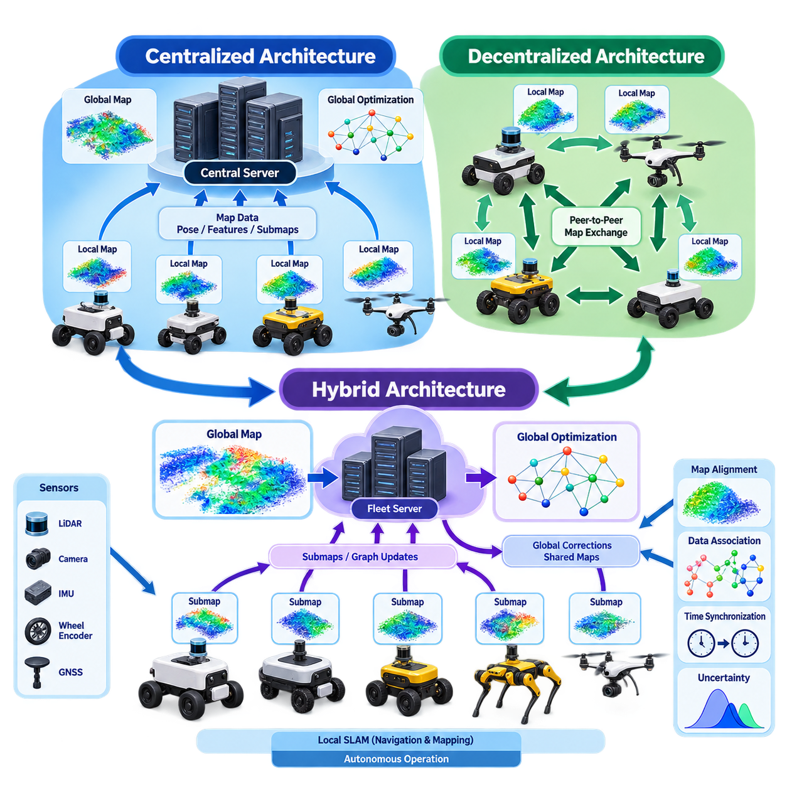
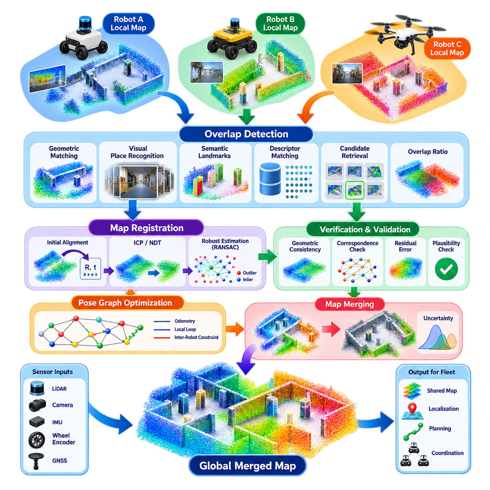
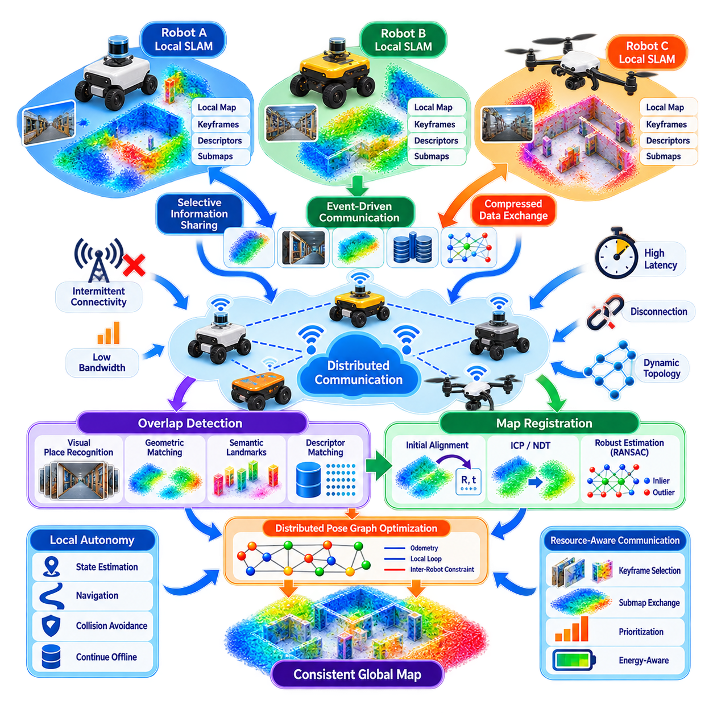
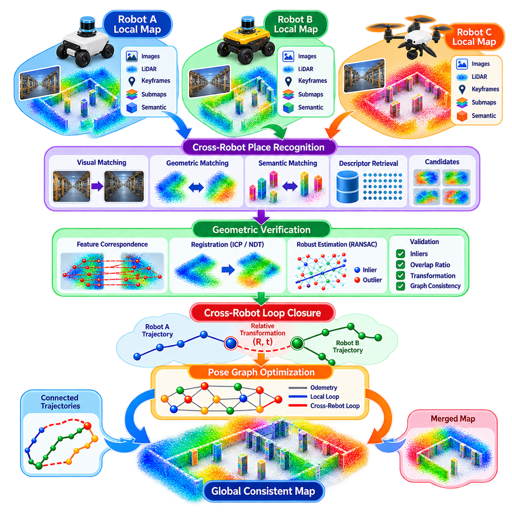
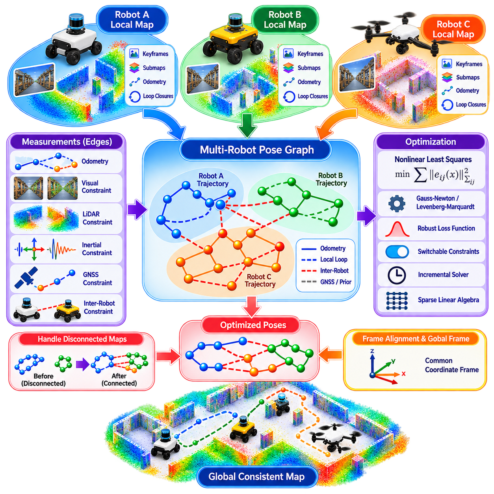
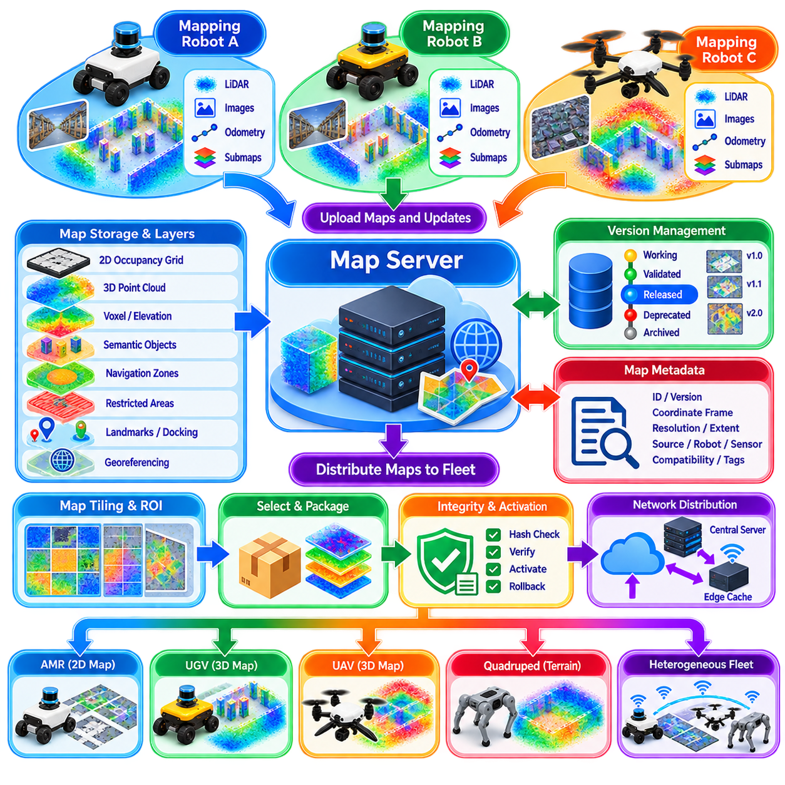
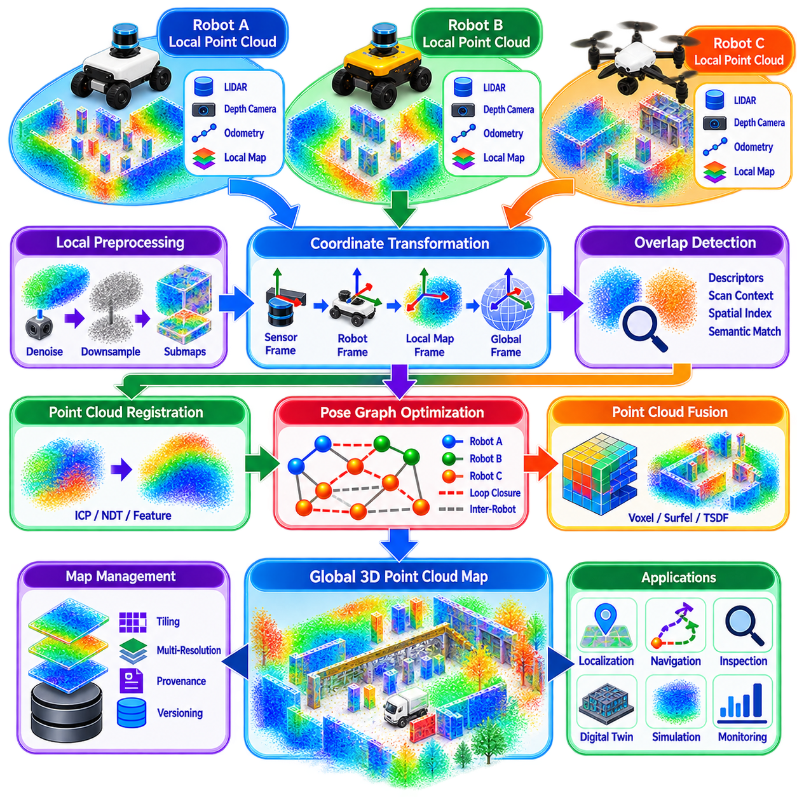
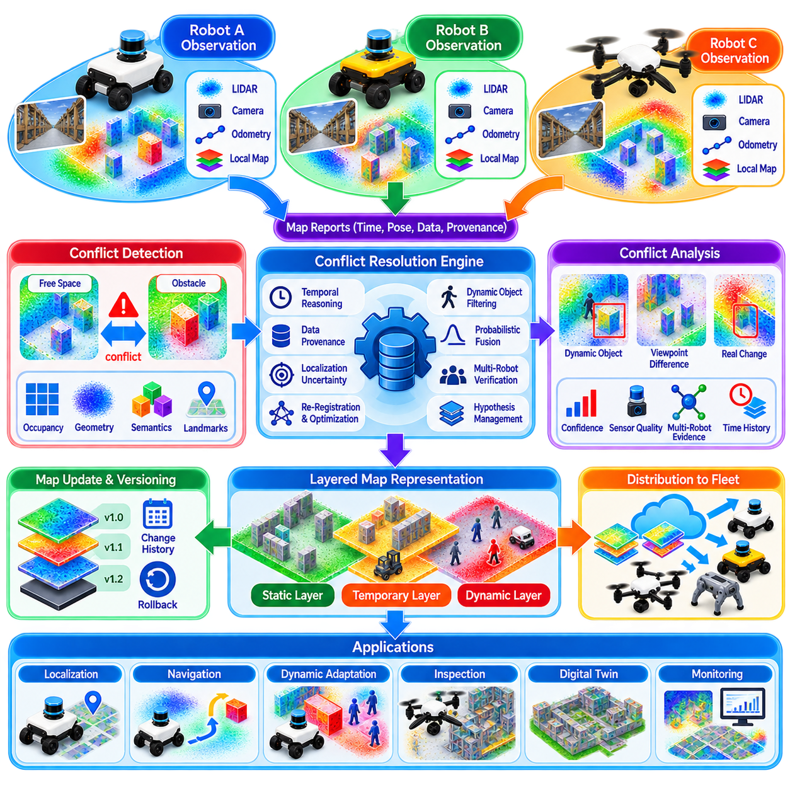
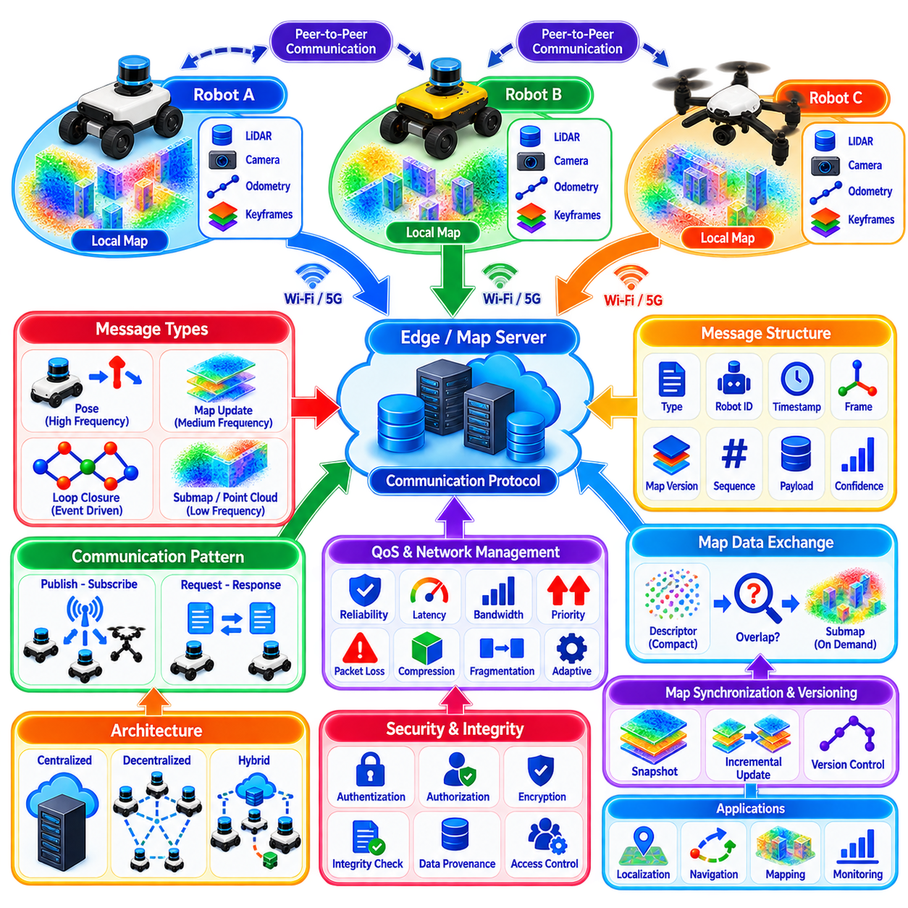
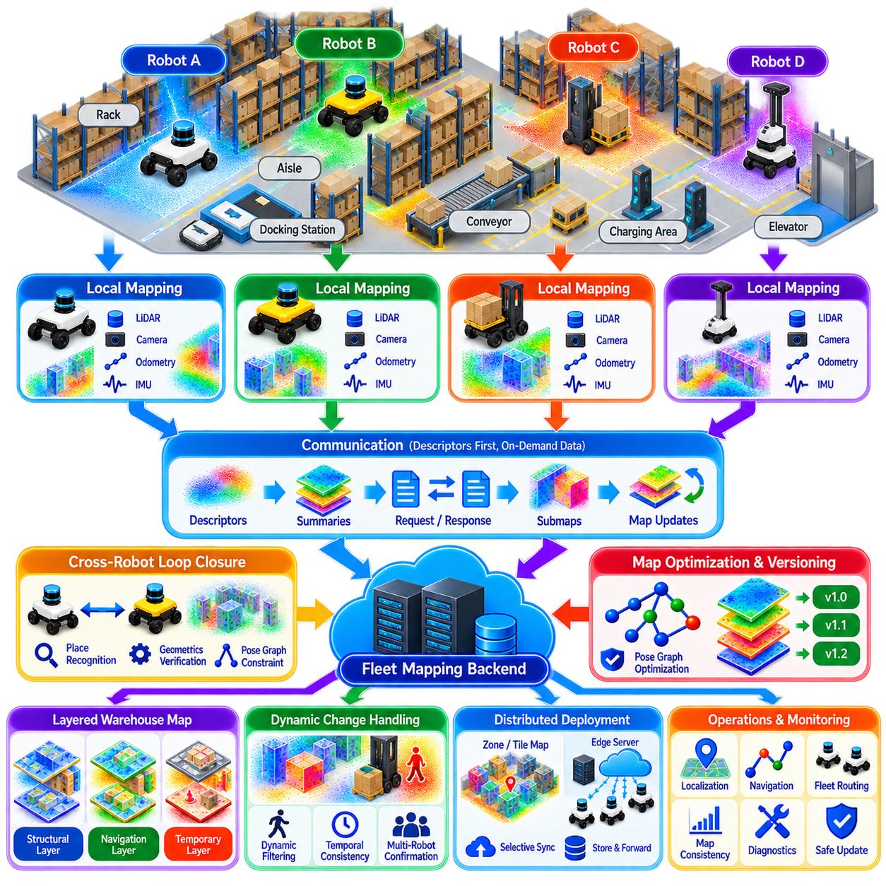

**Volume 13. Mapping Localization and SLAM**

# Chapter 09. Multi Robot Mapping

## 09.01. Multi Robot Mapping Architectures Central Decentralized

{width="7.268055555555556in" height="7.268055555555556in"}

Multi-robot mapping extends conventional SLAM from a single autonomous platform to a cooperative system in which several robots observe, estimate, and update a representation of the same environment. The fundamental architectural problem is therefore not only how each robot builds a locally consistent map, but also how observations, poses, uncertainties, and map corrections are exchanged and coordinated across the robot team.

A multi-robot mapping system typically contains local perception, local state estimation, map generation, inter-robot communication, data association, map alignment, and global optimization functions. Each robot processes measurements from sensors such as LiDAR, cameras, IMUs, wheel encoders, or GNSS. The resulting local maps and trajectories become inputs to a higher-level mechanism that establishes spatial relationships among robots.

Architecture strongly affects scalability, communication bandwidth, computational load, fault tolerance, and achievable global consistency. Two fundamental approaches are centralized and decentralized mapping. Practical systems may also employ hybrid architectures that combine characteristics of both. Selecting among these approaches requires consideration of robot count, network reliability, operating area, sensor data volume, computational resources, and mission requirements.

In a centralized architecture, individual robots perform sensing and usually some degree of local preprocessing while a central server receives mapping information from the fleet. The server can collect poses, keyframes, point clouds, visual features, submaps, or graph constraints and use them to construct a globally optimized representation. This arrangement provides a clear location for maintaining a common reference frame and resolving inconsistencies among local maps.

Centralized processing is particularly attractive when high-performance computing resources are available at an edge server, control center, or on-premise infrastructure. Computationally expensive operations such as global bundle adjustment, pose-graph optimization, loop-closure verification, and large-scale point-cloud registration can be moved away from individual robots. Robots can consequently devote more onboard resources to real-time localization, perception, planning, and safety functions.

A major advantage of centralization is access to a broad global context. When observations from multiple robots are available in one computational domain, the system can identify inter-robot loop closures and jointly optimize trajectories that would otherwise remain independent. A robot entering an area previously mapped by another robot can contribute constraints to the same global graph, improving consistency and reducing accumulated drift across the fleet.

The centralized model nevertheless introduces important dependencies. Communication links must transport sufficient information from robots to the central mapping system, and network congestion can become significant as fleet size or sensor resolution increases. Sending raw camera streams or dense LiDAR clouds is often impractical. Production systems therefore commonly transmit compact representations such as selected keyframes, descriptors, landmarks, compressed submaps, or incremental graph updates.

The central server can also become a computational bottleneck or single point of failure if the architecture is not carefully designed. As the number of robots increases, incoming observations and optimization constraints may grow faster than available processing capacity. Redundant servers, distributed backend services, hierarchical map partitions, asynchronous processing, and persistent local operation are therefore important mechanisms for improving resilience and scalability.

In a decentralized architecture, no single node is required to maintain the complete mapping state. Each robot constructs its own local map and exchanges selected information directly with neighboring robots or other members of the fleet. Map fusion emerges from peer-to-peer communication, distributed data association, relative pose estimation, and cooperative optimization. The architecture therefore distributes both computation and decision authority across multiple autonomous platforms.

Decentralization provides substantial robustness when communication with fixed infrastructure is unreliable or unavailable. A robot can continue mapping using onboard sensors even when disconnected from the rest of the team. When connectivity returns, locally accumulated information can be exchanged and reconciled. This capability is valuable for underground facilities, tunnels, large industrial sites, disaster environments, outdoor areas, and other missions with intermittent network coverage.

The challenge is that distributed robots do not automatically share a common coordinate system. Two robots may independently construct internally consistent maps whose origins and orientations are unrelated. The system must discover overlapping observations, estimate the relative transformation between maps, reject false correspondences, and propagate corrections. Inter-robot loop closure therefore becomes one of the central technical problems in decentralized multi-robot mapping.

Distributed optimization further complicates the architecture. A globally consistent map ideally reflects constraints collected throughout the fleet, yet transferring every measurement to every robot would defeat the communication advantages of decentralization. Algorithms must determine which variables and constraints need to be shared and how neighboring robots can iteratively converge toward compatible estimates without requiring continuous access to the complete global state.

Communication topology is consequently part of the mapping architecture itself. Robots may communicate through a full peer-to-peer mesh, dynamically changing neighbor relationships, relay nodes, or ad hoc wireless networks. Available bandwidth and latency can vary as robots move. Mapping software must therefore tolerate delayed, duplicated, reordered, or temporarily unavailable information rather than assuming the stable connectivity commonly available inside a centralized computing environment.

Centralized and decentralized designs should not be interpreted as absolute alternatives. Hybrid architectures are often more appropriate for industrial deployment. Robots can maintain independent local SLAM pipelines for immediate navigation while periodically transmitting compact submaps or graph information to a fleet-level server. The server performs global reconciliation and later distributes corrected transforms, shared map segments, or localization references back to participating robots.

This separation between local operational mapping and global cooperative mapping is especially useful for autonomous mobile robots. Navigation and collision avoidance cannot depend on continuous connectivity to a server, so each AMR requires a locally valid representation. Fleet-level optimization, however, can exploit observations accumulated by many robots over longer periods. The resulting architecture combines real-time local autonomy with slower but more comprehensive global consistency.

Submap-based representation is well suited to this arrangement. Instead of continuously modifying one enormous global map, each robot produces bounded local map segments associated with estimated poses. The multi-robot backend determines transformations among these submaps and optimizes their relationships. This reduces communication volume, limits the computational impact of local updates, and makes it easier to incorporate maps generated by robots with different trajectories or operating schedules.

Heterogeneous robot fleets introduce another architectural dimension. Wheeled AMRs, quadrupeds, UAVs, and specialized inspection robots may observe the same environment from very different viewpoints and sensor configurations. Their local mapping algorithms do not necessarily need to be identical. A cooperative architecture can instead define common interfaces for timestamps, coordinate frames, uncertainty, descriptors, landmarks, submaps, and spatial constraints while allowing platform-specific perception pipelines.

Map consistency must also be distinguished from map ownership. A centralized system may maintain an authoritative global map, whereas decentralized systems may maintain several partially overlapping representations with shared constraints. Industrial systems frequently benefit from an authoritative baseline map combined with dynamic local layers. Permanent structural information can remain controlled while robots contribute temporary obstacles, environmental changes, semantic observations, and localization corrections.

Time synchronization and reference-frame management become increasingly important as the number of robots grows. Measurements generated by different platforms must be associated with valid timestamps and transformations before they can be fused reliably. Clock synchronization, transformation trees, calibration records, and frame identifiers should therefore be treated as architectural infrastructure rather than implementation details. Poor temporal alignment can produce spatial errors even when individual sensors are accurate.

Uncertainty must accompany shared mapping information. A relative transformation estimated from a strong geometric overlap should not have the same influence as one obtained from sparse or ambiguous observations. Covariance, confidence scores, robust loss functions, and outlier rejection mechanisms allow the mapping backend to distinguish reliable constraints from questionable ones. This becomes essential because one incorrect inter-robot loop closure can distort a large portion of the shared map.

Security and trust are similarly relevant in production fleets. Cooperative mapping messages can influence the coordinate system used by many autonomous machines, so corrupted or unauthorized information may have consequences beyond a single robot. Authentication, integrity checking, access control, version management, and validation of incoming map constraints should therefore accompany the mapping protocol, particularly when robots communicate through shared wireless or external network infrastructure.

Scalability ultimately depends on controlling both information flow and optimization complexity. A system that operates effectively with three robots may become inefficient with fifty or hundreds of platforms if every robot exchanges all observations with every other robot. Hierarchical grouping, relevance-based communication, geographic partitioning, keyframe selection, descriptor indexing, and incremental optimization can prevent computational and network requirements from growing without practical bounds.

Architecture selection should therefore begin from mission characteristics rather than from an assumption that one model is universally superior. Centralized mapping is effective when reliable infrastructure, powerful backend computation, and strong global coordination are available. Decentralized mapping is advantageous when autonomy, resilience, and intermittent communication dominate. Hybrid mapping often provides the practical balance required by large operational robot fleets.

The resulting multi-robot mapping architecture is best understood as a coordinated information system rather than merely several SLAM algorithms operating simultaneously. Local estimators provide immediate spatial awareness, communication mechanisms expose useful observations, inter-robot association establishes shared geometry, and optimization maintains consistency across the collective map. The architecture determines how these functions cooperate under real-world limits on computation, bandwidth, latency, and reliability.

## 09.02. Map Merging Algorithm Overlap Detection [w/Code]

{width="7.268055555555556in" height="7.268055555555556in"}

Map merging is the process of combining independently generated local maps into a spatially consistent representation of a shared environment. In multi-robot mapping, each robot may begin from an unrelated coordinate frame and follow a different trajectory. The central challenge is therefore to determine whether two maps contain observations of the same physical region and, if they do, estimate the transformation that correctly aligns them.

Overlap detection is the first critical stage of map merging. Before computationally expensive registration is attempted, the system must identify map regions that are likely to correspond. Overlap may be detected from geometric structure, visual appearance, semantic landmarks, place descriptors, or combinations of these signals. Effective detection reduces unnecessary comparisons and prevents unrelated map regions from being forced into an incorrect alignment.

The difficulty increases because overlapping areas are rarely observed under identical conditions. Two robots may approach the same corridor from opposite directions, operate at different times, or use sensors mounted at different heights. Illumination, movable objects, pedestrians, vehicles, and temporary obstacles may also change. A robust overlap detector must therefore recognize persistent environmental structure while remaining insensitive to viewpoint and transient scene variations.

For LiDAR-based mapping, overlap detection commonly relies on geometric descriptors derived from point clouds or local submaps. Structural patterns such as planes, edges, surface distributions, scan-context representations, or learned descriptors can summarize the geometry of a region. Candidate matches are retrieved by comparing these compact representations rather than performing exhaustive point-to-point registration between every possible pair of maps.

Visual mapping systems can use image features and place-recognition methods to identify common regions. Local descriptors extracted around distinctive visual features can establish correspondences, while global image descriptors summarize entire views for efficient retrieval. When a candidate location is detected, geometric verification using feature correspondences and camera geometry is required because visual similarity alone can produce false matches in repetitive environments.

Semantic information provides an additional source of evidence. Objects and structural elements such as doors, columns, intersections, machines, signs, shelves, or building features can serve as higher-level landmarks. Semantic descriptors are especially useful when raw geometric appearance changes but the functional structure remains recognizable. However, movable objects should be assigned lower confidence because their positions may differ between mapping sessions.

Once an overlap candidate has been identified, the system estimates the relative transformation between the two maps. In two-dimensional mapping this generally requires translation and rotation in the plane, while three-dimensional mapping requires a full rigid-body transformation. The estimated transformation converts coordinates from one local map frame into another and provides the initial relationship required for subsequent map registration and optimization.

Registration algorithms refine this transformation by minimizing disagreement between overlapping observations. Iterative Closest Point, or ICP, is widely used for geometric registration when a sufficiently accurate initial estimate exists. Variants based on point-to-plane distances, generalized covariance models, or robust correspondence selection can improve convergence. Normal Distributions Transform, or NDT, provides another common approach by representing spatial regions probabilistically.

Registration cannot rely only on minimizing geometric error because a mathematically plausible solution may still represent an incorrect physical match. Repetitive corridors, identical rooms, warehouse aisles, and regularly spaced columns can create perceptual aliasing. A reliable map-merging system therefore performs geometric verification using correspondence count, spatial distribution, residual error, overlap ratio, transformation plausibility, and consistency with existing trajectory constraints.

The overlap ratio is particularly useful for evaluating candidate merges. It estimates how much of one map is geometrically supported by observations in the other map after alignment. A low overlap ratio may indicate that the candidate was generated from accidental descriptor similarity rather than a genuine shared region. However, thresholds should reflect sensor range and environment because valid encounters may initially contain only limited common coverage.

Robust estimation methods are important when candidate correspondences include outliers. Techniques such as RANSAC can repeatedly sample subsets of correspondences to identify a transformation supported by a consistent group of observations. Robust loss functions can further reduce the influence of residual outliers during optimization. These mechanisms prevent a small number of incorrect feature or landmark associations from dominating the estimated map transformation.

The result of successful registration should not immediately be treated as an unquestionable map correction. Instead, the relative transformation can be introduced into a pose graph as an inter-map constraint. Each robot trajectory, keyframe, or submap forms part of the graph, while odometry, local loop closures, and inter-robot matches create edges. Global optimization then distributes corrections according to the uncertainty associated with all available constraints.

This graph-based formulation allows map merging to preserve information about uncertainty. A highly reliable overlap containing many geometrically diverse correspondences can receive a strong constraint, whereas an ambiguous match receives a weaker one. Covariance matrices, information matrices, confidence measures, or learned quality estimates can represent this distinction. Maintaining uncertainty is essential when several independently generated maps are progressively connected.

Map merging becomes more complex when more than two robots participate. Pairwise alignment can create a chain of transformations connecting multiple local coordinate systems, but errors accumulated along that chain may lead to global inconsistency. Additional overlaps between previously connected maps provide loop constraints that can correct these errors. Consequently, multi-robot map merging should be treated as a graph-consistency problem rather than a sequence of isolated registrations.

A useful implementation strategy is to divide large maps into submaps. Each robot periodically creates locally consistent spatial units containing geometry, features, descriptors, and metadata. Overlap detection then operates between submaps rather than complete maps. This limits search complexity and enables only relevant regions to be transferred over the network. It also allows individual submap relationships to be corrected without repeatedly transmitting an entire global representation.

Efficient candidate retrieval becomes essential as the map database grows. Comparing every new submap against every previously stored submap results in computational complexity that becomes impractical for large fleets. Descriptor databases, approximate nearest-neighbor search, spatial indexing, vocabulary structures, or hierarchical retrieval can rapidly produce a small candidate set. Detailed geometric verification is then performed only on these promising candidates.

Communication constraints also influence the map-merging algorithm. Robots operating through wireless networks should avoid continuously exchanging dense raw sensor data. A robot can first transmit compact place descriptors or metadata, and detailed keyframes or point clouds can be requested only after a potential overlap is detected. This staged exchange significantly reduces bandwidth while preserving the ability to perform accurate geometric verification when necessary.

Asynchronous operation must be supported because robots do not necessarily observe shared locations at the same time. A map generated hours or days earlier may later overlap with observations from another robot. Map-merging systems therefore require persistent identifiers, timestamps, map versions, calibration information, and coordinate-frame metadata. Historical information must remain interpretable even after trajectories and global transformations have been optimized.

Dynamic environments create additional complications. Objects appearing in one map may be absent or relocated in another, causing false correspondences and registration residuals. Filtering dynamic objects, emphasizing static structural features, maintaining temporal occupancy statistics, and using semantic classification can improve robustness. The objective is to align persistent geometry while preventing temporary scene content from influencing the long-term spatial relationship between maps.

Heterogeneous fleets may require cross-modal map merging. A ground robot equipped with LiDAR may generate dense geometric submaps, while a UAV may primarily provide visual or depth-based observations. Direct sensor-level matching may then be difficult. Shared geometric primitives, semantic landmarks, learned cross-modal descriptors, or intermediate representations can establish correspondences without requiring identical sensing hardware across all participating platforms.

Map merging must also account for changes in calibration and localization quality. Sensor extrinsic errors, inaccurate timestamps, wheel slip, GNSS degradation, or poor visual tracking can distort individual submaps before merging occurs. Registration may partially compensate for these errors but cannot always distinguish local distortion from a genuine spatial transformation. Quality indicators associated with each submap should therefore influence candidate selection and optimization weighting.

False-positive overlap detection is generally more dangerous than failing to detect an overlap temporarily. A missed match can often be discovered later when additional observations become available, whereas a false merge may introduce a strong incorrect constraint that deforms the global map. Conservative acceptance criteria, multi-stage verification, consistency checks, and the ability to remove rejected constraints are therefore important properties of production mapping systems.

Map-merging decisions can also exploit prior knowledge when available. Approximate GNSS positions, building floor identifiers, mission zones, known docking stations, or manually defined reference landmarks can narrow the search space. Such information should normally guide candidate generation rather than replace geometric verification. This preserves robustness when prior positioning becomes inaccurate while still reducing the computational cost of searching large collections of maps.

In long-term operation, merging is not a one-time event but a continuous process. New submaps enter the system, previously disconnected map components become connected, old constraints may be reconsidered, and global optimization updates coordinate relationships. The mapping backend must therefore support incremental changes without requiring complete reconstruction whenever new overlap information arrives. Incremental graph optimization is particularly valuable for continuously operating robot fleets.

For industrial AMRs, successful map merging enables robots deployed at different times to contribute to a common operational map. One robot can map a newly opened area while others continue normal missions, after which the new submap can be aligned and incorporated into the shared representation. This reduces the need for dedicated remapping missions and allows fleet observations to contribute progressively to maintaining environmental knowledge.

The final merged map should retain traceability to its contributing observations. Recording which robot, sensor, trajectory, and submap generated each constraint makes it possible to diagnose incorrect alignments and evaluate map quality. Version control and provenance information also allow a system to roll back problematic updates or compare alternative map hypotheses, which becomes increasingly important as autonomous fleets operate for extended periods.

A robust map-merging pipeline therefore combines efficient overlap detection, candidate retrieval, geometric or visual registration, semantic evidence, uncertainty estimation, outlier rejection, and global graph optimization. No single similarity score is sufficient for reliable operation. Confidence emerges from several independent sources of evidence that jointly determine whether two local maps truly describe the same physical region and how strongly their relationship should influence the global map.

In multi-robot mapping, overlap detection and map merging form the bridge between independent local autonomy and collective spatial intelligence. Robots can navigate using their own locally consistent maps, yet shared-region recognition allows those separate experiences to become connected into a common spatial model. Reliable merging transforms isolated trajectories and submaps into a continuously improving representation that can support localization, planning, coordination, and long-term fleet operation.

## 09.03. Distributed SLAM with Communication Constraints [w/Code]

{width="7.268055555555556in" height="7.268055555555556in"}

Distributed SLAM allows multiple robots to construct a consistent representation of an environment without requiring continuous access to a central mapping server. Each robot performs local sensing, state estimation, and map generation while exchanging selected information with other robots. The fundamental challenge is to achieve useful global consistency when communication bandwidth, connectivity, latency, and network topology are constrained.

Communication constraints distinguish distributed SLAM from an idealized multi-robot estimation problem. Robots operating in factories, tunnels, campuses, warehouses, mines, or disaster areas may experience weak wireless coverage or temporary disconnection. Network capacity can also change as robots move. A practical architecture must therefore preserve local autonomy even when cooperative information cannot be exchanged continuously or immediately.

Each robot normally maintains a local SLAM estimator that operates independently of the communication network. LiDAR, cameras, IMUs, wheel encoders, GNSS, or other onboard sensors provide measurements for estimating the robot trajectory and local map. Navigation-critical functions should continue using this locally available state so that loss of fleet connectivity does not directly cause localization failure or interruption of autonomous motion.

The cooperative layer operates above these local estimators. Instead of transmitting every raw sensor measurement, robots exchange information that is useful for establishing relationships among their maps. This may include keyframe poses, visual or geometric descriptors, landmarks, compressed point clouds, submaps, loop-closure candidates, covariance information, or pose-graph constraints. The choice of representation determines both communication cost and achievable mapping accuracy.

Raw sensor exchange is generally unsuitable for bandwidth-constrained fleets. High-resolution cameras and multi-channel LiDARs can generate data much faster than wireless links can reliably transport it across many robots. Local processing therefore acts as an information filter. Sensor streams are converted into compact spatial representations, and only information with sufficient mapping value is selected for transmission to neighboring robots or distributed backend processes.

Keyframe selection is one mechanism for controlling communication volume. Rather than transmitting every estimated pose, a robot sends frames only when motion, scene change, uncertainty, or information gain exceeds a defined condition. Redundant observations can remain local. Adaptive keyframe policies can further reduce traffic during repetitive motion while preserving additional information when the robot enters geometrically complex or previously unexplored regions.

Submaps provide another efficient communication unit. A robot can integrate many local sensor measurements into a bounded map segment and transmit the resulting submap rather than the complete measurement history. The receiving robot can compare descriptors first and request detailed geometry only when an overlap is likely. This hierarchical exchange separates inexpensive candidate discovery from more expensive geometric verification and map alignment.

Distributed place recognition is essential because robots must determine when independently generated maps observe the same location. Compact descriptors can be broadcast or shared through neighboring nodes, while detailed data remains stored locally. If descriptor similarity suggests a possible inter-robot loop closure, the participating robots exchange sufficient observations to verify the candidate and estimate a relative transformation between their coordinate frames.

Communication should therefore be relevance-aware rather than purely periodic. Information associated with a newly discovered region, high uncertainty, potential loop closure, significant map change, or important shared landmark may deserve higher transmission priority than repetitive observations. Event-driven communication can reduce network utilization while ensuring that information capable of substantially improving the shared estimate is propagated through the robot team.

Intermittent connectivity requires a store-and-forward strategy. During disconnection, each robot continues local SLAM and records information that may later be useful to the fleet. When communication becomes available, accumulated descriptors, map summaries, or constraints can be synchronized. The system must tolerate the fact that the local trajectory may have grown substantially and that other robots may already have updated their own estimates during the disconnected period.

Asynchronous communication means that distributed SLAM cannot assume that all robots share the same state at the same instant. Messages may arrive late, out of order, or after the sender\'s trajectory has already been corrected. Persistent identifiers for robots, keyframes, submaps, and constraints are therefore necessary. Version information and timestamps allow received data to be associated with the correct state even when optimization has changed coordinate relationships.

Network topology also changes the estimation problem. Some missions allow direct peer-to-peer communication among nearby robots, while others rely on relay robots, mesh networks, access points, or occasional connections to infrastructure. Information may need to traverse several robots before reaching another part of the fleet. Distributed mapping protocols should not assume permanent all-to-all connectivity and should support dynamically changing communication graphs.

Bandwidth allocation becomes increasingly important as fleet size grows. If every robot sends information to every other robot, communication requirements can increase rapidly and eventually dominate the system. Neighbor-based exchange, geographic partitioning, team clustering, relay selection, and hierarchical communication can restrict information flow. Robots primarily exchange data with agents that are spatially or informationally relevant to their current mapping task.

Distributed pose-graph optimization provides a mathematical framework for reconciling these independently estimated maps. Each robot owns a subset of poses or submaps and maintains local odometry and loop-closure constraints. Inter-robot observations create constraints between subsets. Rather than sending the complete graph to one server, robots exchange boundary variables or selected optimization information and iteratively seek estimates that satisfy both local and shared constraints.

Consensus-based optimization can allow neighboring robots to converge toward compatible estimates through repeated exchanges. Each participant updates its local variables using available measurements and information received from others. Perfect synchronization is not always required, and asynchronous algorithms can continue making progress as communication opportunities occur. This is important when wireless connectivity is irregular or different robots have substantially different computation rates.

Communication-efficient optimization must avoid repeatedly transferring variables that contribute little new information. Sparsification can remove redundant constraints, marginalization can summarize older states, and condensed representations can communicate the effect of many measurements through fewer variables. The objective is not simply to minimize transmitted bytes but to preserve the information that most strongly affects global consistency and localization accuracy.

Uncertainty is especially important under constrained communication. A robot operating alone for a long period may accumulate significant trajectory drift before reconnecting with the fleet. When an inter-robot observation becomes available, its uncertainty must be compared with the accumulated local uncertainty. Covariance estimates, information matrices, confidence measures, and robust optimization allow corrections to be distributed according to the reliability of each source.

False inter-robot loop closures can be particularly damaging because their effects may propagate across several independently maintained maps. Communication constraints can make verification harder because complete sensor histories may not be immediately available. Distributed systems should therefore use conservative acceptance rules and multi-stage verification, requesting additional geometric or visual evidence before a candidate constraint is allowed to influence the shared estimate strongly.

Packet loss and duplicated messages should be expected rather than treated as exceptional events. Mapping communication can use message identifiers, acknowledgements where appropriate, duplicate detection, checksums, and resumable transfer mechanisms. However, real-time navigation should not wait for guaranteed delivery of every cooperative message. The mapping architecture must distinguish information required for immediate local safety from information used for eventual global consistency.

Latency similarly affects how shared information should be interpreted. A map correction received several seconds or minutes after its original observation may still be valuable for global optimization but should not be applied blindly to a robot\'s current control state. Coordinate transformations and map updates must be incorporated through controlled state-management mechanisms so that delayed corrections do not create discontinuities in localization or destabilize navigation.

Prioritization can be based on expected information gain. A robot may estimate whether transmitting a submap, descriptor, or constraint is likely to reduce uncertainty in another robot or in the global map. Information-theoretic selection can provide a principled basis for communication decisions, although simpler heuristics based on distance traveled, novelty, overlap probability, or covariance growth are often easier to deploy in real-time systems.

Heterogeneous fleets introduce different communication and computational capabilities. A large AMR may carry powerful onboard GPUs and high-bandwidth radios, while a small UAV or quadruped may have limited energy and network capacity. Distributed SLAM should permit different robots to contribute at different levels. Resource-rich platforms can perform heavier registration or relay functions while constrained robots transmit compact observations and maintain lightweight local estimators.

Energy consumption can also become part of the communication constraint. Wireless transmission, continuous descriptor computation, and repeated map synchronization consume power that may be significant for battery-limited platforms. Communication policies can therefore consider remaining energy, mission priority, and expected mapping benefit. A robot approaching a charging station may use a different synchronization policy from one performing a long-duration mission far from infrastructure.

Security is important because distributed SLAM accepts spatial constraints from multiple networked agents. Messages should be authenticated and protected against corruption, and robots should verify that incoming constraints are geometrically plausible. A compromised or malfunctioning participant must not be able to arbitrarily redefine the shared coordinate system. Trust management and constraint validation therefore complement conventional network security mechanisms.

Recovery after reconnection is a critical operational scenario. When previously separated robot groups establish communication, each group may possess an internally consistent but differently referenced map. The system must discover cross-group overlaps, estimate transformations, exchange relevant graph information, and optimize the newly connected network. This process should occur without preventing robots from continuing their current missions using their existing local maps.

Long-term fleet operation further requires map and message version management. Robots may leave the network, receive maintenance, restart, or return after the shared map has changed substantially. Persistent map identifiers and synchronization protocols help determine which information is new, which has already been incorporated, and which constraints refer to obsolete states. Without such mechanisms, reconnection can generate duplicated or contradictory map updates.

A practical distributed SLAM system often combines decentralized local operation with optional infrastructure support. Robots can cooperate directly when necessary while an edge server, fleet manager, or on-premise backend provides additional storage, indexing, or global optimization whenever connectivity permits. The essential requirement is that infrastructure improves performance rather than becoming a mandatory dependency for immediate localization and navigation.

Performance evaluation should therefore consider more than trajectory accuracy. Communication volume, peak bandwidth, synchronization delay, convergence time after reconnection, computation per robot, resilience to packet loss, and behavior during network partitions are equally important. A mapping algorithm that achieves excellent accuracy under unlimited communication may be unsuitable for an operational fleet if it cannot tolerate realistic wireless conditions.

Distributed SLAM under communication constraints is ultimately a problem of deciding what information should be shared, with whom, and when. Local estimators preserve immediate autonomy, compact representations reduce bandwidth, overlap detection creates inter-robot relationships, and distributed optimization reconciles those relationships over time. The most effective architecture treats communication as a limited mapping resource rather than assuming it is continuously available.

When designed around this principle, a multi-robot fleet can continue mapping through disconnections, exchange high-value information when links become available, and gradually converge toward a shared spatial representation. Such systems provide the resilience required for large factories, outdoor campuses, underground facilities, logistics environments, and other missions where network conditions cannot be guaranteed but coordinated spatial intelligence remains essential.

## 09.04. Multi Robot Loop Closure Cross Robot [w/Code]

{width="7.268055555555556in" height="7.268055555555556in"}

Multi-robot loop closure extends conventional loop-closure detection from observations made by one robot to observations collected independently by different robots. A cross-robot loop closure occurs when two robots recognize that they have observed the same physical location or structure. This relationship connects previously independent trajectories and provides a geometric constraint that can align their local coordinate frames.

Cross-robot loop closure is fundamental to cooperative mapping because robots commonly begin with unrelated reference frames. Even if every robot produces an accurate local map, those maps cannot form a shared representation until spatial relationships between them are established. A verified encounter with a common place provides the relative transformation needed to connect separate pose graphs, submaps, and trajectories into a larger mapping system.

The process usually begins with place recognition. Each robot extracts compact descriptors from images, LiDAR scans, keyframes, submaps, or semantic observations and compares them with information generated by other robots. The objective is to identify likely common locations without exhaustively comparing every sensor measurement. Efficient retrieval becomes increasingly important as mission duration and the number of participating robots increase.

Visual place recognition can use local feature descriptors or global image representations. Global descriptors efficiently retrieve candidate images with similar appearance, while local features provide detailed correspondences for geometric verification. Cross-robot matching is more difficult than single-robot recognition because cameras may have different viewpoints, orientations, exposure characteristics, resolutions, or calibration parameters, and robots may visit the location under different illumination.

LiDAR-based loop closure relies primarily on geometric similarity. Point-cloud descriptors, scan-context representations, structural features, planes, edges, and learned geometric embeddings can characterize local environments. These approaches can remain effective under illumination changes, but they are still vulnerable to repetitive geometry such as warehouse aisles, tunnels, parking structures, or corridors. Candidate retrieval must therefore be followed by rigorous geometric verification.

Semantic landmarks can strengthen cross-robot recognition by representing persistent objects or structural elements at a higher level. Doors, columns, intersections, machines, signs, shelves, docking stations, or other distinctive objects may provide evidence that two observations belong to the same location. Semantic information is especially useful for heterogeneous robots whose sensor viewpoints or modalities differ substantially.

Candidate generation and candidate verification should be treated as separate stages. Retrieval algorithms should rapidly identify a small number of plausible cross-robot matches, even if some false candidates remain. Verification then applies more expensive geometric reasoning to determine whether the candidate represents a genuine shared location. This separation enables scalable operation while maintaining strict acceptance criteria for constraints entering the global optimization process.

Geometric verification estimates the relative transformation between the two robot observations. For visual systems, matched image features can support epipolar geometry, essential-matrix estimation, perspective-n-point calculations, or three-dimensional feature alignment. LiDAR systems can use point-cloud registration such as ICP or NDT after an initial transformation has been estimated. Robust estimators such as RANSAC help reject inconsistent correspondences.

A valid relative transformation should satisfy more than a low registration residual. The number of inlier correspondences, their spatial distribution, overlap ratio, estimated uncertainty, transformation magnitude, and consistency with local trajectories should also be evaluated. Matches supported by features concentrated in a small region can be less reliable than those distributed throughout the observed scene, even when their numerical registration errors appear similar.

Perceptual aliasing is one of the most serious problems in cross-robot loop closure. Industrial facilities frequently contain repeated shelves, identical production cells, similar doors, parallel corridors, or regularly spaced columns. Different locations can therefore produce nearly identical descriptors. Accepting such a false match introduces an incorrect inter-robot constraint capable of deforming multiple trajectories simultaneously rather than affecting only one robot.

Multi-stage validation reduces this risk. A candidate may first pass descriptor similarity, then feature correspondence testing, geometric registration, overlap evaluation, and finally graph-consistency checking. Independent evidence from semantic landmarks, approximate position, floor information, or mission zones can provide additional support. No single test needs to be perfect when several complementary tests jointly determine whether a loop closure is trustworthy.

Cross-robot loop closures become edges connecting previously separate pose graphs. Before the connection, each robot trajectory may be internally consistent but expressed in its own coordinate frame. Once a verified relative transformation is added, optimization can estimate their relationship and express both trajectories in a common frame. Additional cross-robot closures create redundant constraints that improve accuracy and reduce dependence on any single encounter.

The first connection between two disconnected robot maps deserves special caution because it determines their initial global relationship. A false first connection can incorrectly place an entire map component. Systems may therefore require stronger evidence for connecting previously disconnected graphs than for adding another constraint between already aligned maps. Multiple independent correspondences can be accumulated before committing to a permanent merge.

Once two robot groups are connected, later cross-robot observations can be checked against the predicted relative geometry. If optimization predicts that two robots should observe a particular region from compatible poses, a new candidate consistent with that prediction becomes more credible. Conversely, a candidate requiring an implausibly large correction can be rejected or assigned low confidence. The existing graph therefore becomes a source of validation evidence.

Uncertainty should accompany every accepted cross-robot constraint. A relative pose estimated from extensive three-dimensional overlap should generally receive greater confidence than one derived from a small number of distant visual features. Covariance matrices or information matrices can encode this difference for graph optimization. Robust loss functions further reduce the impact of constraints that later become inconsistent with the broader measurement network.

Switchable or removable constraints provide additional protection. Rather than permanently committing every accepted loop closure, optimization can associate a latent confidence or switch variable with uncertain edges. If later evidence strongly contradicts a constraint, its influence can be reduced or removed. This capability is valuable in long-duration multi-robot operation because additional observations may expose mistakes that were difficult to identify when the match was first detected.

Communication architecture directly affects cross-robot loop closure. Continuously transmitting raw images or point clouds from every robot is usually inefficient. Robots can initially exchange compact descriptors and identifiers, then request detailed sensor information only when a potential match is found. This query-based strategy concentrates bandwidth on observations likely to create valuable inter-robot constraints.

In decentralized systems, candidate discovery may occur directly between neighboring robots or through distributed descriptor databases. A robot does not necessarily need access to every observation produced by the fleet. Descriptors can be routed geographically, shared within robot groups, or propagated through a communication graph. When connectivity is intermittent, candidate information can be stored and compared after robots reconnect.

Cross-robot loop closure does not require robots to meet physically at the same time. One robot may recognize a location mapped by another robot hours or days earlier. Persistent storage of descriptors, submaps, timestamps, calibration information, and map identifiers therefore enables asynchronous loop closure. This property allows collective maps to improve even when robots operate on different schedules or rarely communicate directly.

Time differences create challenges in dynamic environments. Vehicles, pallets, people, equipment, furniture, or temporary barriers may change between visits. Loop-closure detection should emphasize persistent geometry and stable semantic structure rather than transient objects. Dynamic-object filtering and temporal map layers can prevent temporary scene content from dominating cross-robot matching and registration.

Heterogeneous robots introduce larger viewpoint and modality differences. An AMR may observe a corridor from less than a meter above the floor, while a quadruped or UAV views the same area from a different height and orientation. Cross-modal descriptors, semantic landmarks, three-dimensional structural primitives, and shared metric representations can bridge these differences. Exact sensor equivalence should not be a prerequisite for cooperative mapping.

GNSS and other external positioning sources can assist candidate generation in outdoor environments. Approximate global positions can restrict descriptor searches to geographically plausible regions and reduce false matches. However, GNSS should not automatically determine a loop closure when multipath, obstruction, or degraded reception is possible. External positioning is most useful as supporting prior information combined with independent geometric verification.

Robot identity and data provenance should remain attached to every loop-closure observation. The system should know which robot, sensor, keyframe, submap, calibration state, and software version produced each constraint. Provenance supports debugging when a global map becomes inconsistent and allows repeated failures associated with a particular sensor or platform to be detected during fleet operation.

Security is also relevant because a cross-robot constraint can alter the estimated positions of many robots. Messages containing descriptors, correspondences, and relative transformations should be authenticated and checked for integrity. Geometric plausibility testing provides another defensive layer because authenticated data may still originate from a malfunctioning robot. Cooperative mapping therefore requires both communication trust and measurement-level validation.

Scalability becomes challenging as the number of robots and stored observations increases. Naively comparing every new keyframe with all keyframes from every other robot produces excessive computation and communication. Descriptor indexing, approximate nearest-neighbor retrieval, temporal filtering, geographic partitioning, hierarchical databases, and submap-level recognition can reduce the search space before detailed verification.

Loop-closure scheduling can also be information-aware. Candidates expected to connect previously disconnected map components, reduce large uncertainty, or close long graph cycles may receive higher priority than redundant matches in well-constrained regions. This allows limited computational and communication resources to focus on constraints that provide the greatest improvement to the collective map.

Evaluation of cross-robot loop closure should measure both recall and precision, but high precision is especially important. Missing a valid loop closure may delay global alignment until another encounter occurs, whereas accepting a false loop closure can corrupt a large shared map. Evaluation should therefore include false-positive behavior in repetitive environments, robustness to viewpoint change, communication cost, detection latency, and the effect of accepted constraints on global consistency.

For industrial fleets, cross-robot loop closure enables independently operating AMRs to reinforce one another\'s spatial knowledge. A robot entering an area previously mapped by another platform can recognize the location, align its local map, and immediately contribute new observations. Repeated encounters from different robots create additional constraints, allowing the fleet map to become more accurate and resilient over time without requiring every robot to traverse identical routes.

Multi-robot loop closure is therefore more than a place-recognition function. It is the mechanism that converts independently localized robots into a geometrically connected mapping system. Reliable operation requires efficient candidate retrieval, robust cross-view recognition, precise relative-pose estimation, conservative verification, uncertainty-aware optimization, and communication-efficient information exchange.

When these mechanisms work together, cross-robot loop closures progressively connect isolated trajectories and submaps into a coherent spatial network. Each verified shared observation becomes a bridge between robot experiences, enabling accumulated information from the entire fleet to correct drift, align coordinate frames, improve localization, and maintain a common map suitable for coordinated autonomous operation.

## 09.05. Pose Graph Optimization for Multi Robot Maps [w/Code]

{width="7.268055555555556in" height="7.268055555555556in"}

Pose graph optimization provides the mathematical backbone for converting independently estimated robot trajectories into a globally consistent multi-robot map. Instead of optimizing every raw sensor measurement directly, the system represents important robot poses, keyframes, or submaps as graph nodes and spatial relationships as edges. Optimization adjusts the node states so that the complete set of measurements becomes mutually consistent.

In a single-robot pose graph, consecutive poses are commonly connected by odometry or local SLAM constraints, while loop closures connect observations of previously visited locations. Multi-robot mapping extends this structure by maintaining trajectories belonging to several robots and introducing inter-robot constraints between them. These cross-robot edges transform separate local graphs into one cooperative estimation problem.

Each node represents a state that must be estimated. For a planar AMR, the state commonly contains two-dimensional position and heading, while a three-dimensional robot requires position and orientation in SE(3). Nodes may correspond to individual poses, selected keyframes, or larger submaps. Submap-level graphs are particularly attractive for large fleets because they significantly reduce the number of optimization variables.

Edges encode relative spatial measurements between nodes. Wheel odometry, visual odometry, LiDAR odometry, inertial estimation, scan matching, local loop closures, GNSS-related observations, and cross-robot loop closures can all contribute constraints. Each measurement predicts a relative transformation between two states, and optimization attempts to find node configurations whose predicted transformations agree with these measurements as closely as possible.

A graph constraint should include not only a measured transformation but also its uncertainty. Information matrices or covariance matrices describe how strongly each measurement should influence the solution. High-quality LiDAR registration with extensive geometric overlap may provide a strong constraint, whereas a visually ambiguous inter-robot observation should receive lower confidence. Proper weighting prevents weak measurements from dominating reliable estimates.

The optimization problem is typically formulated as nonlinear least squares. For every edge, an error term measures the disagreement between the observed relative transformation and the transformation predicted by the current node estimates. The objective function combines these residuals, weighted by their uncertainties, and searches for the state configuration that minimizes the total error across the complete graph.

Because robot orientation belongs to a nonlinear manifold, pose graph optimization cannot generally be solved as a simple linear least-squares problem. Iterative numerical methods such as Gauss-Newton or Levenberg-Marquardt repeatedly linearize the graph around the current estimate, compute a correction, and update the poses. Efficient sparse linear algebra is critical because real mapping graphs can contain thousands or millions of variables and constraints.

Gauge freedom must be removed before a unique solution can be obtained. If every pose in the graph is translated or rotated by the same amount, relative measurements remain unchanged. The optimizer therefore fixes one reference pose or introduces an equivalent prior. In multi-robot systems, this reference establishes the common coordinate frame into which connected robot trajectories are ultimately expressed.

Initially, different robots may belong to disconnected graph components. Each component can be internally optimized but has no defined spatial relationship to the others. A verified cross-robot loop closure introduces an edge between components and makes their relative transformation observable. Once connected, the optimizer can place both trajectories within a common frame and distribute corrections across their accumulated local errors.

The first inter-robot connection can produce a large change because it determines how two previously independent maps relate to one another. Its quality is therefore especially important. A false connection can rotate or translate an entire map component incorrectly. Conservative verification, uncertainty-aware weighting, and preferably multiple independent inter-robot constraints should support the initial alignment before it is treated as highly reliable.

Additional cross-robot loop closures improve graph observability and redundancy. When several robots observe overlapping regions at different locations, the resulting constraints create cycles through the graph. These cycles expose accumulated drift because inconsistent transformations cannot simultaneously satisfy every edge. Optimization distributes the discrepancy over the involved trajectories, producing a globally more coherent estimate than isolated local SLAM systems can achieve.

Robust optimization is necessary because not every loop closure is correct. Standard least-squares optimization can be severely distorted by even a small number of large outliers. Robust loss functions reduce the influence of constraints with unusually large residuals, while switchable constraints, dynamic covariance scaling, or graduated non-convex approaches can suppress suspected false loop closures without immediately discarding potentially useful information.

Inter-robot constraints deserve particularly careful treatment because an incorrect edge can influence multiple robot trajectories. A candidate accepted by place recognition should therefore undergo geometric verification before entering the graph. Even after acceptance, its residual can be monitored during optimization. A constraint that remains inconsistent with many independent measurements can be down-weighted, disabled, or scheduled for additional verification.

Incremental optimization is important for robots operating continuously. Re-solving an entire pose graph from the beginning whenever a new keyframe or loop closure arrives would waste substantial computation. Incremental solvers reuse previous factorization and update only affected portions of the graph. This enables the global estimate to evolve as new robot trajectories, submaps, and cross-robot constraints become available.

Distributed pose graph optimization is required when no central computer owns the complete graph. Each robot may maintain variables associated with its own trajectory and exchange only selected boundary states or constraints with other robots. Local optimization and inter-robot consensus are then alternated until shared variables become compatible. Such approaches preserve decentralized operation but introduce communication and convergence considerations.

Centralized optimization remains attractive when reliable fleet infrastructure exists. Robots can transmit compact graph information to an edge server or on-premise backend that maintains the global factor graph. Powerful computing resources can then perform large-scale optimization and return corrected transformations or map poses. Local navigation should nevertheless remain independent enough to tolerate temporary loss of connection to the optimizer.

Hybrid architectures combine these approaches. Robots continuously optimize local trajectories onboard while a fleet-level backend performs less frequent global optimization. Corrections are returned as transformations between local and global frames rather than abruptly replacing the robot\'s immediate control pose. This separation prevents global map corrections from introducing discontinuities into real-time navigation and motion-control systems.

Pose corrections must therefore be managed carefully. A global optimization may shift historical poses by meters or rotate an entire submap, particularly after a major loop closure. Applying this correction directly to a control coordinate frame can cause sudden apparent motion. Production systems often preserve a smooth local odometry frame and maintain a separate map-to-local transformation that can be updated without destabilizing control.

Hierarchical optimization improves scalability for large fleets and large environments. Local poses can first be optimized inside bounded submaps, while a higher-level graph contains only submap origins or representative keyframes. Cross-robot constraints connect these higher-level entities. This dramatically reduces global optimization complexity while retaining detailed geometry within each locally consistent map segment.

Graph sparsification provides another scalability mechanism. Many constraints may contain redundant information, especially when robots repeatedly traverse the same routes. Selected edges can be removed or summarized while preserving the graph\'s essential information structure. Marginalization can similarly eliminate old variables while retaining their statistical influence through condensed factors, reducing memory and computation requirements.

Multi-robot graphs may also incorporate absolute or weakly absolute measurements. GNSS positions, surveyed landmarks, fiducial markers, docking stations, building reference points, or known floor relationships can anchor portions of the graph to an external coordinate system. These measurements can reduce long-term drift, but their uncertainty must be modeled correctly so that degraded GNSS or inaccurate landmarks do not distort otherwise consistent relative mapping.

Heterogeneous robots can participate in the same pose graph even when their local estimators differ. An AMR may use LiDAR-inertial odometry, a quadruped may use visual-inertial estimation, and a UAV may use visual SLAM with GNSS. The graph does not require identical frontends; it requires spatial constraints expressed with compatible coordinate conventions, timestamps, transformations, and uncertainty models.

Time synchronization and calibration errors can appear as inconsistent graph constraints. If two robots observe the same feature at mismatched times or use inaccurate sensor extrinsics, the resulting relative transformation may contain systematic error that optimization cannot properly explain. Calibration state and timing quality should therefore be monitored, and suspicious constraints should not automatically be interpreted as ordinary trajectory drift.

Map updates after optimization require consistent propagation. When node poses change, associated point clouds, occupancy grids, landmarks, semantic objects, and navigation layers must be transformed accordingly. Rebuilding all map data after every small update may be expensive, so submap-based systems often keep local geometry fixed and update only the optimized poses of the submaps within the global coordinate frame.

Versioning becomes important when optimized maps are shared across a fleet. A robot may be using one global graph solution while another has already received a newer correction. Map versions, transformation timestamps, and persistent node identifiers prevent observations from being accidentally associated with incompatible states. This is especially important under intermittent communication and asynchronous multi-robot operation.

Graph optimization also provides valuable diagnostics. Large residuals can identify problematic odometry segments, false loop closures, calibration failures, or robots whose localization quality has degraded. Residual statistics and constraint consistency can therefore support health monitoring in addition to map generation. Fleet management software can use this information to trigger remapping, recalibration, or inspection of a particular platform.

The quality of the optimized map depends strongly on graph topology. A long trajectory connected mainly by sequential odometry remains weakly constrained and can accumulate substantial drift. Loop closures and cross-robot observations create additional connections that increase rigidity. A fleet that explores complementary routes can therefore produce a better-conditioned graph than several robots independently repeating nearly identical trajectories.

Optimization frequency should reflect operational needs and available resources. Local estimation may run at sensor rate, while global graph optimization can operate at a much lower frequency or be triggered by significant events such as a new inter-robot loop closure. Event-driven optimization avoids unnecessary computation while still providing rapid correction when new information materially changes the global map.

For industrial AMR fleets, pose graph optimization allows maps created by different robots and at different times to become a common spatial reference. New areas can be incorporated through verified constraints, accumulated drift can be corrected, and multiple observations can reinforce important map regions. The resulting graph becomes a persistent spatial backbone connecting fleet localization history with the maintained operational map.

Pose graph optimization should therefore be understood as the consistency engine of multi-robot mapping. Perception frontends generate local motion estimates and place-recognition candidates, geometric verification converts valid matches into constraints, and the graph optimizer determines how all robot trajectories should coexist. Its role is not merely to improve individual poses but to reconcile the spatial history of the entire robot fleet.

When robust estimation, uncertainty modeling, incremental computation, scalable graph structure, and careful frame management are combined, pose graph optimization can transform many independently drifting local maps into a coherent shared representation. It provides the mathematical mechanism through which cross-robot observations correct accumulated error and enables long-term multi-robot mapping to remain consistent as the fleet, environment, and map continue to grow.

## 09.06. Map Server and Distribution to Fleet [w/Code]

{width="7.268055555555556in" height="7.268055555555556in"}

A map server provides the shared infrastructure through which maps created, optimized, and maintained by multiple robots become operational resources for an entire fleet. In multi-robot mapping, producing an accurate global map is only part of the problem. The system must also store map assets, identify valid versions, distribute appropriate data to robots, and ensure that every robot can determine which map and coordinate frame it is currently using.

The map server therefore acts as a bridge between collaborative mapping and fleet operation. Upstream SLAM processes generate local maps, submaps, trajectories, loop closures, and optimized poses, while downstream navigation systems require stable representations suitable for localization and planning. The server separates continuously changing mapping data from controlled operational map releases that robots can safely use during missions.

A practical server should support multiple map representations rather than treating a map as one monolithic file. A fleet may require two-dimensional occupancy grids, three-dimensional point clouds, voxel maps, elevation layers, semantic objects, landmarks, navigation zones, restricted areas, docking locations, and georeferencing information. These layers can share a common spatial reference while being stored and distributed independently according to robot requirements.

Map metadata is as important as map geometry. Every stored map should have a persistent identifier, version, creation time, coordinate-frame definition, spatial extent, resolution, source information, and compatibility information. Additional metadata can describe the robots, sensors, SLAM configuration, calibration state, and software version involved in generating the map, allowing the fleet to determine whether a map is appropriate for a particular platform.

Version management prevents uncontrolled map changes from immediately affecting production robots. A newly generated map can first be stored as a candidate version and pass validation before becoming an approved operational release. The server can maintain relationships among parent versions, incremental updates, and superseded maps. If a new map causes localization or navigation problems, the fleet can return to a previously validated version.

The map lifecycle can therefore distinguish working, validated, released, deprecated, and archived states. Mapping robots may continuously contribute updates to a working map, while mission robots continue operating with a stable released version. Validation processes can evaluate geometric consistency, localization performance, coverage, semantic correctness, and compatibility before promoting the candidate. This separation protects fleet operation from unstable intermediate mapping results.

Distribution should be selective rather than automatically sending the entire global map to every robot. A small AMR operating on one warehouse floor may need only a local two-dimensional region, while an outdoor robot may require a large three-dimensional map with GNSS anchors. A UAV or quadruped may need different geometric layers. The server can use robot identity, platform capability, mission area, and localization method to determine the appropriate map package.

Large environments benefit from map tiling. Instead of storing and transferring one extremely large occupancy grid or point cloud, the environment can be divided into spatial tiles or submaps. Robots download the regions surrounding their current position or planned route and request additional tiles as they move. This reduces startup time, memory usage, storage requirements, and network traffic while preserving access to a much larger global environment.

Hierarchical map distribution extends this idea across multiple spatial scales. A lightweight overview can provide coarse global context, while detailed geometry is loaded only for nearby operational areas. A robot performing global route planning may initially use low-resolution information and then request high-resolution localization or obstacle-map layers when approaching a destination. Such level-of-detail management becomes increasingly important as maps grow.

Map packages should be immutable once released. Rather than modifying a production map silently, the server creates a new version whenever validated content changes. Robots can then identify their exact map state, and fleet software can reproduce localization conditions observed during an incident. Immutability also makes rollback, auditing, debugging, and comparison between map generations significantly more reliable.

Integrity verification is necessary during distribution. Each map package can include cryptographic hashes, checksums, file manifests, expected sizes, and version identifiers. A robot verifies downloaded content before activating it. Interrupted transfers should be resumable, and partially downloaded data should never replace the currently active map. The previous validated map remains available until the complete new package has passed integrity and compatibility checks.

Map activation should be treated as a controlled state transition rather than a simple file replacement. A robot can download a candidate package into an inactive storage area, verify it, initialize the localization stack against the new map, and confirm that required coordinate transforms and semantic layers are available. Only after these checks succeed should the robot switch the active map reference used for mission execution.

Coordinate-frame consistency is especially important during map distribution. A map server must communicate not only geometry but also the relationship among global, map, local, odometry, and robot frames. Georeferenced maps may additionally contain transformations to ENU, UTM, or other external coordinate systems. An incorrect frame definition can make a geometrically correct map unusable and may produce severe localization or navigation errors.

Pose graph optimization can modify the positions of submaps without changing their internal geometry. A server can exploit this structure by storing local submap data separately from optimized global transforms. When optimization changes the global solution, it may be sufficient to distribute updated submap poses rather than retransmitting every point or voxel. This reduces communication cost for large multi-robot maps.

Incremental map updates provide a similar advantage. If only a small section of a facility changes, robots should not necessarily download the entire map again. The server can distribute changed tiles, modified semantic layers, updated landmarks, or transformation deltas. Each update must reference a known base version so that the robot can verify that the incremental data is compatible with its current map state.

However, incremental updates introduce dependency management. A patch generated for one map version may not apply correctly to another version. The server therefore needs an explicit version graph or update chain and should reject incompatible combinations. Periodic full snapshots can limit the length of update chains and provide stable recovery points if incremental history becomes complex or corrupted.

Fleet distribution must tolerate intermittent communication. Robots may operate in tunnels, outdoor areas, elevators, underground facilities, or industrial zones where network connectivity is temporarily unavailable. Essential mission maps should therefore be cached onboard. Loss of the map server must not immediately prevent localization or navigation when the robot already possesses a valid operational map.

Store-and-forward mechanisms allow updates to be delivered when connectivity returns. The fleet manager can record which map version each robot has acknowledged and identify robots that remain behind the current release. A reconnecting robot can request only the missing versions or required tiles. This prevents unnecessary retransmission and enables gradual synchronization across fleets with different communication conditions.

Bandwidth management becomes important when many robots receive an update simultaneously. Broadcasting a large three-dimensional map to hundreds of robots can saturate the wireless network. Distribution can therefore be staged by robot group, mission priority, charging status, network segment, or geographic region. Rate limiting and scheduled deployment prevent map maintenance traffic from interfering with safety-critical or mission-critical communication.

Edge caching can further reduce server and network load. Frequently used map packages or regional tiles can be replicated on local edge servers positioned near operational zones. Robots obtain data from the closest available cache rather than repeatedly accessing a remote central server. The central service remains responsible for authoritative versions while edge nodes accelerate delivery and provide resilience during upstream network disruptions.

Map server architecture can be centralized, distributed, or hierarchical. A centralized server simplifies governance and global version control, while distributed storage improves resilience and regional scalability. A hierarchical architecture often combines both advantages: an authoritative fleet-level map repository controls versions, while site-level or edge servers cache and distribute approved data to local robot groups.

The map server should expose explicit interfaces for upload, query, download, activation, status reporting, and rollback. Mapping systems need to publish new map candidates, fleet managers need to inspect available versions, and robots need to request compatible packages. Event notifications can announce new releases without forcing every robot to poll continuously. Clear interfaces also separate map management from specific SLAM implementations.

Robot capability negotiation helps prevent incompatible deployments. Before delivering a map, the server can evaluate the robot\'s localization method, supported map format, available storage, software version, sensor configuration, and mission region. A robot using 2D localization should not accidentally activate a package intended only for a 3D localization pipeline, even if both maps describe the same physical facility.

Security must protect both map content and the control plane used to distribute it. Robots should authenticate the server, the server should authenticate authorized clients, and map packages should be protected against unauthorized modification. Signed manifests can provide provenance and integrity. Access policies can also restrict sensitive maps, such as infrastructure layouts or security zones, to robots and operators with appropriate authorization.

Availability is equally important because the map service can become critical fleet infrastructure. Replication, redundant storage, health monitoring, backup, and recovery mechanisms can prevent a single server failure from eliminating access to map assets. Nevertheless, robot-side caching remains an important architectural boundary: temporary server failure should degrade map-update capability rather than immediately stop autonomous operation.

The server can also collect map-related telemetry from the fleet. Robots may report active map version, localization confidence, failed relocalization attempts, missing tiles, checksum failures, or observed environmental differences. Aggregating these signals helps operators identify whether a newly released map performs correctly and whether certain regions require remapping or additional validation.

A controlled rollout strategy can reduce deployment risk. A new map version can first be assigned to a small validation group, then expanded to a larger subset of robots after localization and navigation metrics remain acceptable. If failures increase, deployment can be halted and affected robots returned to the previous version. This approach applies software-release discipline to operational spatial data.

Map distribution is closely related to long-term map management but serves a distinct role. Long-term mapping determines how environmental changes are detected, validated, incorporated, and versioned, while fleet distribution determines how an approved representation reaches operational robots. Keeping these responsibilities logically separated makes it easier to control when environmental observations become production navigation data.

For heterogeneous fleets, the authoritative map may therefore be better understood as a structured spatial database than as a single universal artifact. Different robots can receive derived representations generated from the same underlying world model. An AMR may consume an occupancy grid and semantic zones, while a quadruped receives traversability information and a UAV receives three-dimensional structure and altitude constraints.

Operational monitoring should make map state visible at fleet level. Operators need to know which robots are using each map version, which downloads are pending, which activations failed, and which platforms are operating with deprecated data. Map-version state becomes part of fleet health, just as software version, battery state, localization quality, and mission status are operationally significant.

The map server ultimately establishes a controlled boundary between map creation and map consumption. Collaborative SLAM can continuously generate spatial knowledge, but production robots require validated, identifiable, reproducible, and recoverable map states. Version control, integrity verification, selective distribution, local caching, compatibility checking, and rollback transform mapping output into manageable fleet infrastructure.

When these mechanisms are integrated, a fleet can evolve its shared spatial representation without sacrificing operational stability. Robots contribute observations and mapping updates upstream, validated map versions are maintained centrally or hierarchically, and each platform receives only the information required for its mission. The result is a scalable map lifecycle connecting multi-robot mapping, fleet localization, navigation, and long-term autonomous operation.

## 09.07. Collaborative 3D Reconstruction Point Cloud Merging [w/Code]

{width="7.268055555555556in" height="7.268055555555556in"}

Collaborative 3D reconstruction enables multiple robots to combine independently acquired spatial observations into a unified three-dimensional representation of the environment. Each robot may collect LiDAR scans, depth images, stereo measurements, or other range data along its own trajectory. The central challenge is to transform these locally referenced observations into a geometrically consistent shared point cloud without allowing accumulated localization errors to corrupt the reconstructed environment.

A single robot can reconstruct only the regions visible from its own route and sensor viewpoint. Multi-robot operation expands coverage because different platforms can observe complementary surfaces, occluded areas, elevated structures, and regions inaccessible to other robots. An AMR may capture lower building geometry, while a quadruped or UAV contributes observations from different heights. Collaborative reconstruction therefore improves both spatial coverage and viewpoint diversity.

Each robot normally constructs locally consistent point clouds before contributing data to the shared reconstruction. Raw range measurements are transformed using estimated sensor poses and accumulated into keyframes or bounded submaps. Local processing can remove invalid measurements, compensate for sensor motion, filter noise, and reduce point density. This prevents the collaborative backend from repeatedly processing every raw measurement generated by every participating platform.

Coordinate transformation is fundamental to point-cloud merging. A point measured in a sensor frame must first be transformed into the robot frame and then into its local map frame using calibrated sensor extrinsics and estimated poses. Once the spatial relationship between robot maps is known, another transformation places the local cloud into the shared global frame. Errors in any stage directly appear as duplicated surfaces, blurred geometry, or structural misalignment.

Initial alignment between independently generated point clouds can come from cross-robot loop closures, GNSS, surveyed landmarks, fiducial markers, semantic landmarks, or descriptor-based place recognition. The initial transformation does not always need millimeter-level accuracy, but it must generally place overlapping geometry within the convergence region of the subsequent registration algorithm. Poor initialization can cause registration to converge toward an incorrect local solution.

Overlap detection should occur before expensive point-cloud registration. Compact global descriptors, scan-context representations, spatial metadata, approximate robot positions, or semantic information can identify submaps that are likely to share physical space. Detailed geometric registration is then performed only on promising candidates. This two-stage process becomes essential when many robots generate thousands of submaps during long missions.

Point-cloud registration refines the relative transformation between overlapping observations. Iterative Closest Point (ICP) minimizes geometric discrepancies between corresponding points or surfaces and is widely used when a reasonable initial estimate exists. Point-to-plane ICP often converges more efficiently in structured environments because it minimizes displacement relative to local surface normals rather than treating every correspondence as an independent point-to-point distance.

Generalized ICP incorporates local surface covariance and can better represent geometric uncertainty in structured three-dimensional data. Normal Distributions Transform (NDT) represents spatial regions using probability distributions and aligns scans against this continuous representation. The appropriate registration method depends on sensor density, environmental geometry, computational resources, initial-pose accuracy, and the amount of overlap between observations.

Feature-based registration can provide stronger initialization when direct geometric alignment is difficult. Distinctive 3D keypoints and local geometric descriptors can generate candidate correspondences between clouds. Robust estimators such as RANSAC reject inconsistent matches and estimate an initial rigid transformation. Fine registration can then refine this estimate using dense surface geometry, combining broad convergence with high final accuracy.

Registration quality must be evaluated rather than accepting every converged result. Residual error, overlap ratio, inlier count, correspondence distribution, surface-normal consistency, transformation magnitude, and estimated uncertainty provide evidence about alignment reliability. A numerically small residual can still represent a false registration in repetitive environments, particularly where corridors, columns, shelves, or industrial structures have similar geometry.

A verified registration becomes a spatial constraint between robot submaps rather than merely a command to permanently transform one cloud. Adding the relationship to a pose graph allows the entire multi-robot trajectory network to be optimized consistently. When later observations provide additional constraints, accumulated localization errors can be redistributed across robot trajectories instead of being embedded irreversibly into the merged point-cloud geometry.

This distinction between local geometry and global pose is important for scalable reconstruction. Each submap can preserve its internally consistent point cloud in a local coordinate system while the optimizer maintains its global transformation. If pose graph optimization changes the map solution, the system updates submap transforms instead of reconstructing every point from the original sensor stream. Large collaborative maps can therefore be corrected efficiently.

Directly concatenating transformed point clouds is rarely sufficient. Overlapping observations may contain duplicate points with different densities, measurement noise, slightly different surface positions, or sensor-specific artifacts. Voxel filtering, spatial averaging, probabilistic fusion, surfel representations, or signed-distance methods can combine redundant observations while controlling map density and preserving useful geometric structure.

Voxelization divides space into bounded cells and summarizes observations falling within each cell. This limits memory growth as many robots repeatedly scan the same region. Depending on the application, a voxel can store occupancy, representative position, surface normal, observation count, confidence, intensity, semantic label, or temporal information. Multi-resolution voxel structures can preserve fine geometry locally while representing distant regions more compactly.

Surfel-based reconstruction represents surfaces using oriented local elements containing position, normal, scale, and confidence. Measurements from different robots can update compatible surfels rather than simply adding new points. This produces a more compact surface representation and can reduce visible duplication in repeatedly observed regions. Confidence weighting allows high-quality measurements to influence the reconstructed surface more strongly than noisy or distant observations.

Volumetric fusion provides another approach when dense surface reconstruction is required. Truncated Signed Distance Function (TSDF) representations integrate depth observations into a volumetric field describing distance to nearby surfaces. Measurements from multiple robots can contribute to the same volume after their poses are aligned. Surface geometry can subsequently be extracted as a mesh, providing a continuous representation beyond an unstructured point cloud.

Sensor uncertainty should influence fusion. LiDAR range accuracy may vary with distance, incidence angle, surface reflectivity, and environmental conditions, while stereo or depth-camera uncertainty generally increases with range. Treating all points as equally reliable can degrade reconstructed surfaces. Confidence-aware fusion weights measurements according to estimated quality and allows repeated high-confidence observations to refine uncertain geometry.

Heterogeneous sensor fusion requires additional care because different platforms may generate point clouds with very different characteristics. A spinning LiDAR may produce sparse but accurate long-range geometry, while an RGB-D camera generates dense short-range measurements. UAV photogrammetry may provide another density and noise profile. Collaborative reconstruction should preserve sensor provenance and apply appropriate uncertainty models rather than assuming identical measurement statistics.

Calibration accuracy strongly affects merged geometry. Small errors in LiDAR-to-robot, camera-to-robot, or IMU extrinsic calibration can produce systematic surface offsets that become obvious when several robots observe the same structure. Time synchronization errors can create similar distortions on moving platforms. Persistent disagreement between otherwise well-aligned submaps may therefore indicate calibration or timing problems rather than ordinary SLAM drift.

Dynamic objects should be separated from persistent geometry whenever possible. People, vehicles, pallets, doors, machinery, and temporary obstacles can occupy different positions when different robots visit the same area. If these observations are fused indiscriminately, the shared reconstruction develops ghost structures and contradictory surfaces. Semantic filtering, motion detection, temporal occupancy statistics, and consistency analysis can identify measurements unsuitable for the static map.

Temporal information can also be preserved instead of forcing all observations into a single permanent surface. A reconstruction system may maintain a stable structural layer and separate short-term or dynamic layers. Observations repeatedly confirmed over long periods gain persistence confidence, while geometry seen only briefly can remain provisional. This supports long-term operation in industrial environments where both permanent structures and operational layouts change.

Communication constraints influence how collaborative point clouds are exchanged. Continuously transmitting complete raw scans is generally inefficient. Robots can construct local submaps, downsample geometry, compress point clouds, and exchange descriptors before detailed data. High-resolution geometry is transferred only when required for registration, map completion, inspection, or reconstruction of a specific region, substantially reducing fleet network traffic.

Spatial tiling enables distributed storage and selective synchronization. A large global reconstruction can be partitioned into tiles, voxels, or submap regions identified by spatial indices. Robots upload and download only areas relevant to their trajectories or missions. When one region changes, the system can update that portion without retransmitting the entire three-dimensional map, improving scalability for large facilities and outdoor environments.

Asynchronous collaboration allows robots to contribute reconstruction data at different times. A robot can map an area while disconnected and upload its submaps after network access returns. The backend compares the new observations with existing spatial data, discovers overlap, estimates alignment, and incorporates verified geometry. Collaborative reconstruction therefore does not require all robots to operate simultaneously or maintain continuous communication.

Conflicting geometry must be handled explicitly. If two well-localized observations disagree significantly, the system should not automatically average them. The discrepancy may indicate environmental change, calibration error, incorrect registration, or localization failure. Confidence values, temporal metadata, robot identity, and sensor provenance help determine whether geometry should be fused, retained as an alternative observation, or flagged for inspection.

Map provenance becomes increasingly important as reconstruction grows. Each submap or fused region should retain information about the robots, sensors, timestamps, calibration states, and source map versions that contributed to it. When an artifact is discovered, operators can trace the affected geometry back to its origin. Provenance also enables selective rebuilding if data from a faulty sensor or incorrect calibration period must later be removed.

Scalability requires controlling both point count and optimization complexity. Repeatedly storing every observation from every robot causes memory and processing requirements to grow without bound. Downsampling, submap creation, hierarchical spatial indexing, keyframe selection, graph sparsification, and multi-resolution representations reduce redundant information while retaining sufficient geometry for localization, planning, inspection, and visualization.

The required reconstruction resolution should follow the application. Fleet localization may need stable structural features rather than extremely dense surfaces, while dimensional inspection or digital-twin generation may require much finer geometry. Maintaining multiple levels of detail allows the same collaborative mapping system to support different consumers without forcing every robot to process the highest-resolution representation.

Quality assessment should measure more than visual appearance. Reconstruction accuracy can be evaluated using registration residuals, surface consistency, map completeness, point density, uncertainty, loop-closure consistency, and comparison with surveyed references where available. Coverage metrics can identify poorly observed regions, while disagreement maps reveal areas where robots produce conflicting geometry and where additional observations may be valuable.

Collaborative reconstruction can actively guide future mapping. Once the shared map identifies missing surfaces, high-uncertainty regions, or poorly observed structures, the fleet can assign robots to collect complementary viewpoints. An AMR can revisit accessible ground-level areas while a UAV observes elevated structures. Mapping then becomes an iterative process in which the current reconstruction influences where additional sensing effort should be directed.

For industrial robot fleets, merged three-dimensional maps can support localization, navigation, obstacle understanding, inspection, facility monitoring, simulation, and digital-twin applications. Different robots contribute complementary observations while shared optimization maintains spatial consistency. The resulting reconstruction becomes more than a visualization product; it forms a persistent geometric resource that can support multiple autonomy and operational functions.

Collaborative 3D reconstruction therefore depends on more than simply combining point files. Reliable operation requires accurate calibration, overlap detection, robust registration, pose graph optimization, uncertainty-aware fusion, dynamic-object handling, scalable spatial storage, communication-efficient synchronization, and data provenance. Each stage prevents local measurement errors from becoming permanent defects in the shared representation.

When these mechanisms are integrated, independently collected point clouds can evolve into a coherent and continuously maintainable three-dimensional model. Each robot contributes only a partial view, but verified spatial relationships allow those observations to reinforce one another. The fleet collectively expands coverage, corrects drift, improves surface confidence, and maintains a shared geometric representation that becomes increasingly useful as observations accumulate over time.

## 09.08. Map Conflict Resolution Under Dynamic Changes [w/Code]

{width="7.268055555555556in" height="7.268055555555556in"}

Map conflict resolution addresses situations in which multiple robots report spatial information that cannot be represented consistently as a single static map. One robot may observe free space where another reports an obstacle, or independently generated submaps may contain structures at different positions. Such conflicts can result from genuine environmental change, dynamic objects, localization drift, registration errors, calibration problems, or observations collected at different times.

Dynamic environments make conflict resolution fundamentally different from ordinary map merging. In a static environment, disagreement is usually treated as estimation error that should be minimized. In a changing environment, however, two contradictory observations may both be correct for their respective times. A robust multi-robot mapping system must therefore determine whether disagreement represents error, temporary motion, or a persistent modification of the physical environment.

Time is consequently an essential dimension of map interpretation. Every observation, submap, semantic object, or occupancy update should retain a timestamp or temporal interval describing when it was valid. Without temporal metadata, the system cannot distinguish a recently installed structure from outdated geometry or determine whether conflicting observations were acquired simultaneously or months apart. Temporal context converts a static map into a maintainable spatial history.

Conflicts should first be detected before they are resolved. Occupancy disagreement, surface displacement, inconsistent landmarks, contradictory semantic labels, registration residuals, or unexpected changes in traversability can indicate that two map observations are incompatible. Detection thresholds should reflect sensor accuracy and map resolution so that ordinary measurement noise is not incorrectly classified as meaningful environmental change.

Spatial confidence should accompany conflict detection. A LiDAR surface observed repeatedly at close range may be more reliable than a sparse depth measurement acquired near the sensor limit. Likewise, a map region supported by several robots and independent viewpoints deserves greater confidence than one based on a single uncertain observation. Conflict resolution should therefore consider measurement quality, observation count, geometry, and sensor uncertainty rather than using simple majority voting.

Data provenance provides another critical source of evidence. The mapping system should know which robot, sensor, software configuration, calibration state, and localization solution produced each disputed observation. If conflicts repeatedly originate from one platform, the cause may be sensor miscalibration or localization degradation rather than environmental change. Provenance allows suspicious data to be isolated without discarding valid observations from the rest of the fleet.

Before declaring that the environment has changed, the system should verify coordinate consistency. A shifted wall or duplicated structure can result from an incorrect map-to-map transformation rather than physical modification. Re-registration of overlapping submaps, pose graph consistency checks, loop-closure verification, and examination of neighboring structures can determine whether the disagreement disappears after correcting spatial alignment.

Localization uncertainty must also be considered. A robot operating in a feature-poor corridor, open yard, reflective environment, or GNSS-degraded region may accumulate substantial pose error. If its observations conflict with a well-established map, the system should first evaluate the robot trajectory rather than immediately modifying the shared environment representation. Map confidence and localization confidence must therefore be evaluated together.

Calibration errors can create systematic map conflicts that resemble structural change. Incorrect LiDAR extrinsics, camera calibration, wheel parameters, or sensor timing may shift or distort observations consistently. When disagreements follow one robot or sensor across several locations, the mapping backend should suspect calibration or synchronization problems. Updating the global map without diagnosing these errors could propagate corrupted geometry throughout the fleet.

Dynamic objects form the most common short-term source of conflict. People, forklifts, vehicles, pallets, carts, movable shelves, doors, and equipment may occupy a location temporarily and disappear later. These observations should not immediately modify the persistent structural map. Semantic classification, motion tracking, repeated observation, and temporal occupancy statistics can help separate transient objects from stable environmental geometry.

A useful architecture separates map information according to temporal persistence. A static or structural layer contains walls, columns, permanent fixtures, and other long-lived geometry. A dynamic layer represents moving objects and rapidly changing occupancy, while a temporary or operational layer can represent pallets, movable equipment, construction barriers, or other elements that persist longer than individual moving objects but should not yet be considered permanent.

This layered representation prevents every detected change from forcing a complete map revision. Navigation can use the structural map for long-term localization while obstacle perception handles immediate dynamic conditions. Temporary map layers can influence route planning without contaminating stable localization landmarks. Only changes that remain consistent over sufficient time and repeated observations are promoted into the persistent map.

Persistence estimation can be based on repeated evidence. If several robots independently observe the same new structure across different times and viewpoints, confidence that the change is real increases. Conversely, an object detected once and absent in later observations should lose persistence confidence. Temporal decay models can gradually reduce the influence of stale observations while repeated confirmations strengthen newly observed geometry.

Not every persistent difference should be accepted automatically. A new wall observed by multiple robots may still result from a shared localization failure if all robots rely on the same incorrect reference. Independent evidence is therefore valuable. Observations from different sensors, trajectories, localization methods, or external references provide stronger support than repeated measurements generated from the same underlying source of error.

Map conflicts can be represented explicitly rather than resolved immediately. A disputed spatial region may retain multiple hypotheses describing alternative geometry or occupancy states. Each hypothesis can store confidence, timestamp, provenance, and supporting observations. Additional robot visits then provide evidence that selects among the hypotheses. This avoids irreversible decisions when the available information is insufficient.

Probabilistic representations naturally support uncertain conflicts. Occupancy probabilities, confidence-weighted voxels, probabilistic landmarks, or Bayesian state estimates allow new measurements to update beliefs gradually. A single contradictory observation does not need to erase a strongly established structure. Repeated consistent evidence can progressively shift the probability toward a new state, providing a smoother transition between old and updated map interpretations.

Semantic conflicts require similar treatment. Two robots may classify the same region differently because of viewpoint, occlusion, illumination, or model uncertainty. Instead of overwriting one label with another, the system can maintain class probabilities and supporting observations. Persistent disagreement may trigger additional sensing or human review when semantic identity is operationally important, such as distinguishing a doorway from a restricted access barrier.

Change detection should distinguish geometric change from accessibility change. A physical structure may remain unchanged while its operational status changes. A door may be closed, a corridor temporarily blocked, or a zone restricted by fleet policy. These conditions should often update navigation or semantic layers rather than modify the underlying geometric map. Separating physical geometry from operational state reduces unnecessary reconstruction.

Conflict resolution can therefore use different timescales. Millisecond-to-second changes belong primarily to perception and collision avoidance. Changes lasting minutes or hours may affect local cost maps and fleet routing. Changes persisting for days or longer may justify updates to the maintained global map. The exact thresholds depend on the application, but the architectural separation prevents short-lived events from becoming permanent mapping errors.

Multi-robot evidence enables stronger change validation than a single platform can provide. When one robot reports a conflict, the system can request observations from nearby robots or assign a verification mission. A second platform approaching from another viewpoint may determine whether the difference is caused by occlusion, sensor failure, or actual environmental change. Collaborative verification transforms fleet redundancy into map-quality assurance.

Active verification is particularly useful for high-impact conflicts. A suspected change near a docking station, narrow passage, emergency route, or localization-critical landmark may deserve immediate inspection. The mapping backend can prioritize these regions according to operational risk and uncertainty. Robots already near the area can be tasked to collect additional observations without requiring a dedicated manual remapping campaign.

When a change is accepted, the update should preserve history rather than silently replacing previous information. A new map version can record which regions changed, when the modification was detected, which observations supported it, and which previous state it replaced. Versioned updates allow operators to reconstruct historical conditions and roll back changes if later evidence shows that the update was incorrect.

Regional updates are preferable to rebuilding the entire map when changes are localized. Spatial tiling or submap-based storage allows affected regions to be replaced, re-optimized, or re-fused independently. Neighboring boundaries must remain geometrically consistent, but unchanged areas do not need to be retransmitted or recomputed. This approach reduces processing, storage, and communication requirements for long-term fleet operation.

Pose graph optimization must be coordinated with map change management. A geometric disagreement may disappear after trajectory optimization, while a genuine structural change should remain visible after alignment is corrected. The system should therefore avoid fusing conflicting geometry permanently before pose uncertainty is sufficiently resolved. Optimization and change detection should exchange confidence information rather than operate as independent pipelines.

Loop closures involving changed environments require special caution. A place-recognition system may match a current observation to an old map even though part of the scene has been modified. Stable landmarks can still provide a valid localization constraint, but changed geometry should not be forced into agreement. Robust registration can use persistent structures while excluding regions identified as dynamic or changed.

Long-term map maintenance benefits from separating observation storage from authoritative map state. Raw or processed evidence can remain available even after the operational map has selected one interpretation. If future observations challenge that interpretation, the system can reconsider previous evidence. This architecture allows the maintained map to evolve without losing the historical information required to explain why earlier decisions were made.

Communication constraints affect how conflicts are propagated through the fleet. Robots do not need to exchange complete maps whenever a disagreement is detected. Conflict messages can identify the affected spatial region, map version, confidence, timestamp, and required evidence. Detailed submaps or point clouds can then be requested only from robots that possess relevant observations, reducing unnecessary network traffic.

Fleet synchronization must prevent robots from unknowingly operating with incompatible map states. When an accepted conflict produces a new map version, the map server can distribute updated tiles or submaps while tracking which robots have activated them. Robots that remain on older versions should retain clear version identifiers so that observations and planning decisions can be interpreted relative to the correct spatial state.

Safety-critical map information should follow conservative update policies. Removing an obstacle from a persistent map generally requires stronger evidence than temporarily adding a potential obstruction to a navigation layer. When uncertainty exists, planning should favor safe interpretations until additional observations confirm the change. Map conflict resolution must therefore account not only for statistical likelihood but also for the operational consequence of an incorrect decision.

Human review can remain valuable for rare or high-consequence conflicts. Autonomous methods can resolve routine dynamic changes, but structural modifications affecting safety zones, docking infrastructure, facility boundaries, or mission-critical landmarks may require operator approval. The system should present the disputed region, supporting observations, confidence, and proposed update so that human intervention remains targeted rather than becoming the normal mapping workflow.

Map conflict resolution should also generate diagnostics. Repeated conflicts in one region may indicate environmental instability, while conflicts consistently associated with one robot may reveal hardware or calibration problems. Monitoring conflict frequency, spatial distribution, resolution time, and source provenance can therefore support both map maintenance and fleet health management.

For industrial AMR fleets, dynamic conflict management allows the shared map to remain stable without becoming obsolete. Production layouts, pallets, equipment, temporary barriers, and traffic patterns may change frequently, while structural geometry changes much less often. Separating these timescales enables reliable localization against persistent features while allowing navigation and planning layers to respond quickly to operational changes.

The objective is not to eliminate disagreement immediately but to interpret it correctly. Some conflicts are sensor noise, some are localization errors, some represent temporary objects, and others reveal genuine long-term environmental change. A robust system retains enough spatial, temporal, probabilistic, and provenance information to distinguish these cases before modifying the authoritative shared map.

When temporal reasoning, uncertainty modeling, provenance, collaborative verification, layered mapping, version control, and safe update policies are combined, dynamic changes can be incorporated without sacrificing global consistency. The shared map becomes a continuously maintained representation rather than a frozen snapshot, allowing a multi-robot fleet to adapt to evolving environments while preserving reliable localization, navigation, and long-term spatial knowledge.

## 09.09. Multi Robot Mapping Communication Protocol Design

{width="7.268055555555556in" height="7.268055555555556in"}

Communication protocol design is a fundamental part of multi-robot mapping because a shared map depends not only on sensing and SLAM accuracy but also on how spatial information moves between robots. A practical protocol must exchange poses, descriptors, submaps, loop-closure candidates, map updates, and confidence information while operating under limited bandwidth, variable latency, packet loss, and intermittent connectivity.

The protocol should begin by separating information according to its operational purpose. High-frequency localization data, medium-frequency map updates, event-driven loop-closure messages, and low-frequency bulk submap transfers have different timing and reliability requirements. Treating all mapping traffic identically wastes network resources and can allow large point-cloud transfers to interfere with information required for immediate coordination.

Message design should use explicit and stable data schemas. Every mapping message should identify its message type, robot identifier, timestamp, coordinate frame, map version, sequence number, payload format, and relevant confidence or uncertainty information. These fields allow receiving robots to determine where the information originated, when it was generated, how it should be interpreted, and whether it is compatible with their current map state.

Robot identity must remain globally unique within the mapping system. Pose nodes, keyframes, submaps, landmarks, and observations should use identifiers that remain unambiguous even when several robots generate data independently while disconnected. Combining robot identity with local sequence identifiers or universally unique identifiers prevents collisions when independently generated graph components are later merged.

Time synchronization is essential because spatial measurements are meaningful only when their temporal relationships are known. Robots may use PTP, GNSS time, NTP, or locally synchronized clocks depending on required accuracy and available infrastructure. The protocol should carry acquisition timestamps rather than relying only on transmission time, because network delay can vary significantly and does not represent when the sensor observation actually occurred.

Coordinate-frame information must accompany spatial data. A point cloud or relative pose without a clearly defined frame can be geometrically correct but operationally unusable. Messages should identify whether data is expressed in sensor, base, odometry, local-map, global-map, or georeferenced coordinates. Transform relationships and calibration versions should be available so that receiving systems can reproduce the intended spatial interpretation.

Different message classes require different quality-of-service policies. A map-version announcement or verified loop-closure constraint may require reliable delivery, while high-rate visualization samples can tolerate occasional loss. Large point-cloud fragments may prioritize throughput over latency. Matching reliability, ordering, durability, and deadline behavior to the semantics of each data type prevents unnecessary retransmission and improves network efficiency.

Bandwidth-aware communication should exchange compact information before detailed geometry. Robots can initially transmit place descriptors, submap summaries, bounding regions, semantic signatures, or spatial hashes. If another robot or mapping server identifies a likely overlap, it can request the corresponding keyframe, point cloud, or detailed submap. This descriptor-first strategy avoids distributing large datasets that provide no useful cross-robot constraint.

A request-response mechanism is therefore useful alongside publish-subscribe communication. Publish-subscribe efficiently distributes recurring state and event notifications, while request-response supports selective retrieval of expensive data. A robot may publish that a new submap exists but transfer its complete geometry only after another participant requests it. Combining both interaction patterns produces a more scalable mapping protocol.

Large payloads should support fragmentation and reassembly. Dense point clouds, images, meshes, or submaps can exceed practical network packet sizes and may require chunked transfer. Each fragment should identify the parent object, fragment index, total fragment count, version, and integrity information. Missing fragments can then be retransmitted selectively rather than forcing the complete map object to be transferred again.

Compression is important for reducing communication cost. Point clouds can be voxelized, quantized, or encoded using geometry compression, while images may use appropriate compressed formats and occupancy grids can exploit sparse or run-length representations. Compression should be selected according to the downstream task because excessive lossy compression may remove geometric details required for registration or localization.

Map communication should distinguish full snapshots from incremental updates. A complete snapshot provides a known recovery state, while incremental messages communicate only changed poses, tiles, landmarks, or graph constraints. Each incremental update must reference a compatible base version. If a robot misses required updates or reconnects after a long outage, the protocol should allow it to request a newer snapshot rather than replaying an impractically long history.

Version identifiers are therefore part of the communication contract. A robot receiving a loop closure, submap transformation, or semantic update must know which map state the message references. Applying an update to the wrong base version can create silent corruption that is difficult to diagnose. Messages should be rejected, deferred, or explicitly transformed when their version dependencies are not satisfied.

Sequence numbers help detect missing, duplicated, or reordered messages. Wireless networks can deliver information irregularly, particularly when robots move between access points or temporarily lose connectivity. The receiver can track expected sequences and determine whether missing information requires retransmission. Idempotent message processing is desirable so that repeated delivery does not create duplicate graph nodes, landmarks, or map updates.

Intermittent connectivity should be treated as a normal operating condition rather than an exceptional failure. Robots must continue local mapping when disconnected and maintain queues of information that should later be synchronized. Store-and-forward mechanisms allow observations, descriptors, and submaps to be exchanged after communication is restored without requiring continuous contact between every member of the fleet.

Not all delayed information retains equal value. High-rate pose telemetry may become irrelevant after several minutes, whereas a newly created submap or verified loop closure remains useful much longer. Messages can therefore include expiration or priority policies. When storage or bandwidth is limited, stale transient data can be discarded while persistent mapping information is preserved for later synchronization.

Priority management prevents mapping traffic from overwhelming mission-critical communication. Safety commands, emergency stops, control traffic, and essential fleet coordination should remain isolated from large reconstruction transfers. Mapping protocols can use separate logical channels, traffic classes, queues, or network priorities so that downloading a multi-gigabyte map cannot degrade communication required for safe robot operation.

Multi-robot mapping benefits from topology-aware communication. A robot does not always need to send every observation directly to a central server or every other robot. Nearby robots may exchange overlap descriptors directly, while larger submaps are synchronized through an edge server. Communication paths can reflect physical proximity, network quality, mission groups, or spatial map partitions to reduce unnecessary traffic.

Centralized architectures simplify communication because robots primarily exchange information with a mapping server. The server maintains global descriptors, pose graphs, map versions, and shared geometry. This architecture supports consistent governance and powerful backend optimization, but server availability and uplink capacity become important. Robot-side autonomy must remain sufficient to continue local operation during temporary disconnection.

Decentralized architectures distribute mapping communication among robots. Each participant may exchange selected graph variables, descriptors, relative constraints, or map regions with neighboring platforms. This avoids dependence on a single central service and can support infrastructure-poor environments. However, duplicate data, consensus, synchronization, routing, and eventual consistency become more difficult as fleet size increases.

Hybrid architectures are often practical for production fleets. Robots perform local SLAM and immediate peer exchange when useful, site-level edge systems aggregate regional information, and a fleet-level backend maintains authoritative global map versions. The communication protocol should therefore support robot-to-robot, robot-to-edge, and edge-to-backend interactions without requiring completely different data semantics for each connection.

Discovery mechanisms are needed when robots join or leave dynamically. A participant should be able to announce its identity, supported mapping capabilities, sensor modalities, map formats, coordinate conventions, and current map version. Other components can then determine which information can be exchanged. Capability negotiation is particularly important for heterogeneous fleets containing AMRs, quadrupeds, UAVs, or specialized inspection robots.

Cross-robot loop closure requires specialized communication. Robots can exchange compact place-recognition descriptors first and request detailed observations only when candidate similarity exceeds a threshold. A verified match can then generate a relative-pose constraint containing participating node identifiers, transformation, uncertainty, verification score, and provenance. This constraint can be transmitted independently from the original sensor data.

Pose graph synchronization should avoid repeatedly transmitting the complete graph. New nodes, changed poses, added constraints, disabled edges, and optimization revisions can be represented as graph deltas. Persistent identifiers allow participants to apply these changes to local replicas. Periodic checkpoints provide recovery states so that synchronization does not depend indefinitely on every historical graph message remaining available.

Conflict detection also requires protocol support. When robots report incompatible geometry, the communication system should preserve both observations until the conflict is resolved. A conflict message can identify the affected spatial region, participating map versions, timestamps, confidence values, and source robots. Additional observations can then be requested specifically for that region instead of transferring unrelated map data.

Data provenance should survive every communication stage. Relaying a submap through an edge server must not erase information about the robot, sensor, timestamp, calibration version, and software configuration that originally generated it. Provenance is essential for debugging, conflict resolution, quality assessment, and removal of data later discovered to have been produced by a faulty sensor or incorrect calibration.

Integrity checking protects against corrupted transfers. Checksums or cryptographic hashes can verify fragments, files, and complete map packages before they are accepted. Large objects should be activated only after all required components have been received and validated. A partially transferred or corrupted submap should remain isolated rather than silently entering the shared reconstruction or pose graph.

Authentication and authorization are also required because mapping messages can alter the fleet\'s understanding of physical space. Robots and servers should authenticate communication peers, while access policies determine who may publish map updates, approve versions, or request sensitive geometry. Encryption can protect facility maps and operational data when traffic passes through networks that cannot be assumed to be trusted.

Protocol security should not replace geometric validation. An authenticated robot can still produce incorrect information because of localization failure, damaged sensors, or calibration errors. Mapping constraints therefore require both communication-level trust and measurement-level verification. Security establishes who sent the data, while SLAM consistency checks determine whether the spatial information itself is credible.

Network monitoring should expose communication quality to the mapping system. Bandwidth, latency, packet loss, queue depth, connection state, and retransmission rates can influence how aggressively robots exchange data. When network quality degrades, the protocol can shift toward descriptors and compact updates; when high-capacity connectivity becomes available, delayed detailed submaps can be synchronized.

Adaptive communication makes this behavior explicit. The same robot may use high-resolution transfers while docked on reliable Wi-Fi, compressed submaps during normal operation, and descriptor-only exchange over a constrained wireless link. Communication policy can therefore respond to available bandwidth, battery state, mission urgency, overlap probability, and the expected information value of the data.

Information value provides a useful basis for prioritization. A submap that closes a large loop, connects two disconnected robot groups, covers an unexplored region, or resolves a map conflict may deserve higher transmission priority than redundant observations of a well-mapped corridor. Information-aware scheduling uses communication resources where they produce the greatest improvement in the shared map.

Scalability requires avoiding all-to-all communication as fleet size increases. If every robot continuously exchanges mapping data with every other robot, network traffic grows rapidly. Spatial partitioning, descriptor indexing, regional brokers, multicast groups, hierarchical servers, and mission-based communication groups can restrict exchanges to participants likely to benefit from the information.

The communication protocol should remain independent from a specific SLAM algorithm whenever possible. Standardized representations for poses, transformations, covariance, timestamps, map identifiers, submap metadata, and data requests allow different mapping frontends to cooperate. Algorithm-specific payloads can still be supported, but core fleet communication should not require every robot to run identical perception and SLAM software.

ROS 2 and DDS provide useful communication mechanisms for robotic systems through typed messages, discovery, publish-subscribe communication, services, and configurable quality-of-service policies. However, a production multi-robot mapping architecture still requires application-level definitions for map identity, versioning, provenance, synchronization, conflict handling, and large-data transfer. Middleware alone does not define the complete mapping protocol.

Operational diagnostics should record communication events together with mapping events. When a loop closure fails to appear, operators should be able to determine whether the candidate was never detected, the message was lost, a version dependency failed, or geometric verification rejected it. Correlating network logs with map and graph state makes distributed mapping failures substantially easier to diagnose.

For industrial fleets, communication protocol design should prioritize predictable behavior over maximum raw data exchange. Robots need enough information to cooperate, but transmitting everything creates unnecessary load and increases failure complexity. Compact summaries, selective retrieval, explicit versions, reliable critical events, local caching, and asynchronous synchronization provide a more robust foundation for continuous operation.

A well-designed protocol ultimately turns independent mapping agents into a coordinated spatial information system. Sensors and SLAM algorithms create local knowledge, while communication determines how that knowledge becomes shared, verified, synchronized, and persistent across the fleet. The protocol therefore forms the information backbone connecting robot observations, cross-robot constraints, map optimization, map servers, and operational navigation.

When stable schemas, synchronized time, explicit coordinate frames, differentiated quality of service, selective data exchange, version control, security, provenance, and adaptive bandwidth management are combined, multi-robot mapping can remain effective even under imperfect networks. The fleet can continue mapping locally during outages, synchronize efficiently after reconnection, and maintain a coherent shared map without requiring unlimited communication resources.

## 09.10. Warehouse Fleet Collaborative Mapping Case

{width="7.268055555555556in" height="7.268055555555556in"}

A warehouse fleet provides a representative production environment for collaborative mapping because many autonomous mobile robots operate simultaneously within the same structured space while experiencing different routes, viewpoints, and local changes. Instead of assigning one dedicated mapping robot to maintain the entire facility, the fleet can continuously contribute observations gathered during normal transport missions and collectively maintain a shared operational map.

The warehouse may contain storage racks, narrow aisles, intersections, docking stations, charging areas, conveyor interfaces, safety zones, elevators, doors, and open staging areas. Although much of this geometry is structurally stable, pallets, carts, temporary inventory, workers, forklifts, and movable equipment change frequently. Collaborative mapping must therefore preserve stable localization geometry while preventing temporary operational objects from contaminating the long-term map.

Each AMR performs local SLAM using onboard sensors such as LiDAR, cameras, wheel odometry, and IMU measurements. The robot estimates its trajectory and builds local keyframes or submaps while executing ordinary missions. Local autonomy remains independent of continuous network availability, allowing the robot to localize, navigate, and accumulate mapping observations even when communication with the fleet backend is temporarily degraded.

Rather than continuously transmitting raw sensor streams, each robot generates compact mapping products. These may include local occupancy grids, point-cloud submaps, keyframe descriptors, semantic landmarks, pose graph nodes, and confidence estimates. Local filtering removes invalid measurements and reduces redundant geometry before communication. This edge processing limits network load while preserving information needed for collaborative alignment and map maintenance.

Every mapping contribution carries a unique robot identifier, timestamp, coordinate frame, map version, calibration state, and spatial extent. These metadata allow the backend to determine when and where the observation was acquired and which configuration generated it. Provenance becomes particularly important when hundreds of robots contribute information because erroneous observations must be traceable to specific sensors, platforms, or software states.

The fleet communication layer exchanges lightweight descriptors before transferring detailed geometry. When an AMR enters an aisle, it can publish a compact representation of recently created submaps. The mapping backend compares these descriptors with previously indexed regions and observations from other robots. Detailed point clouds or keyframes are requested only when potential spatial overlap, map change, or cross-robot loop closure makes them useful.

Cross-robot loop closure is central to maintaining consistency across the warehouse. Two robots may enter the same aisle from opposite directions or revisit a loading area at different times. Place recognition proposes that their observations correspond to the same physical location, while geometric verification estimates the relative transformation. Accepted matches become constraints connecting otherwise independent robot trajectories within the shared pose graph.

Geometric verification must be conservative because warehouse environments contain strong perceptual repetition. Long aisles, identical rack structures, repeated columns, and similar docking areas can create false place matches. Descriptor similarity alone is therefore insufficient. Relative-pose consistency, point-cloud registration, neighboring geometry, semantic landmarks, and existing graph constraints should confirm a candidate before it influences the global map.

A fleet-level pose graph represents robot trajectories, submaps, odometry constraints, and verified cross-robot relationships. Optimization distributes accumulated drift across the network while preserving strong measurements. Local submaps remain in their own coordinate systems, and the optimizer updates their global transformations. This allows large map corrections without repeatedly rebuilding every point from raw sensor measurements.

The warehouse map server maintains the authoritative representation used by production robots. Newly contributed observations do not immediately modify this operational map. They first enter a working mapping state where alignment, confidence, consistency, and environmental persistence can be evaluated. Validated changes are incorporated into a candidate version and released only after localization and navigation checks demonstrate acceptable performance.

The shared warehouse representation can contain several layers. A structural layer stores walls, columns, fixed racks, permanent machinery, and localization landmarks. A navigation layer contains traversable regions, restricted zones, speed limits, preferred directions, and docking approaches. Temporary layers represent pallets, construction barriers, blocked aisles, or movable equipment whose operational importance may be high even though they should not become permanent geometry.

Dynamic objects are handled primarily by real-time perception rather than long-term mapping. Workers, forklifts, moving carts, and active AMRs may appear in repeated scans but should not be fused into the structural map. Semantic filtering, temporal consistency, occupancy history, and multi-robot confirmation help determine whether an observation represents persistent infrastructure or transient activity within the warehouse.

A temporary change can nevertheless affect fleet routing immediately. If several robots observe that an aisle is blocked by stored pallets, the fleet manager can mark the region as temporarily unavailable without modifying the permanent structural map. Once robots later confirm that the obstruction has disappeared, the operational restriction can be removed. Geometry and accessibility are therefore maintained as related but separate states.

Collaborative observations improve confidence in environmental changes. A single robot reporting a shifted rack may have suffered localization drift or sensor error. If several robots independently observe the same displacement from different trajectories, confidence that the physical environment changed increases. High-impact changes can trigger an active verification mission in which a nearby robot is requested to inspect the disputed region.

Map conflict resolution considers localization confidence before accepting structural changes. If one robot reports geometry inconsistent with observations from the rest of the fleet, the backend checks its trajectory, loop closures, sensor calibration, and time synchronization. Persistent conflicts associated with one platform may indicate a maintenance problem. Collaborative mapping therefore becomes an additional source of fleet diagnostics as well as map information.

Large warehouses benefit from spatially partitioned maps. The facility can be divided into floors, zones, tiles, or submaps so that robots receive only the information relevant to their operating region and planned route. An AMR working in one picking zone does not need the complete high-resolution geometry of every warehouse area. Spatial partitioning reduces memory use, transfer time, and synchronization traffic.

Regional edge servers can further improve scalability. Robots exchange frequently used map tiles and descriptors with a nearby site-level server, while a fleet backend maintains authoritative versions and global consistency. This hierarchical architecture reduces repeated long-distance transfers and allows local operations to continue during temporary upstream network failures. Edge caches synchronize with the central map repository when connectivity permits.

Communication quality can change as robots move between aisles, access points, elevators, and loading areas. The protocol adapts by prioritizing compact descriptors, graph constraints, and essential updates when bandwidth is limited. Detailed point clouds can remain queued until reliable high-capacity connectivity becomes available, such as when a robot reaches a charging station. Store-and-forward synchronization prevents temporary outages from stopping mapping.

Mapping traffic must remain subordinate to safety and control communication. Emergency stops, collision avoidance, mission control, and essential fleet coordination receive higher network priority than point-cloud transfers or map reconstruction. Separate traffic classes and bandwidth policies prevent collaborative mapping from degrading operational safety when many robots attempt to synchronize data simultaneously.

Incremental updates reduce the cost of maintaining a large warehouse map. When optimization changes only several submap poses, the server can distribute updated transformations rather than complete geometry. When one aisle is structurally modified, only the affected tiles and metadata need replacement. Periodic full snapshots provide recovery points while incremental updates support efficient day-to-day synchronization.

Map versions ensure that every robot operates against an identifiable spatial state. A newly validated warehouse map receives a unique version, and robots report which version they have downloaded and activated. Updates can be deployed first to a small validation group before fleet-wide release. Localization success, route completion, recovery events, and navigation anomalies can then be monitored before expanding deployment.

Rollback protects production operations if a new map performs poorly. Robots retain a previously validated map until the new package has been completely downloaded, verified, and activated successfully. If localization failures or navigation anomalies increase after deployment, the fleet manager can return affected robots to the earlier version while the candidate map is investigated. Map deployment therefore follows controlled release principles similar to production software.

Heterogeneous warehouse fleets may require different representations of the same environment. Small AMRs may use two-dimensional occupancy grids, larger autonomous forklifts may require richer obstacle and clearance information, and inspection robots may consume three-dimensional geometry or semantic landmarks. The map server can derive platform-specific products from a common authoritative spatial model while preserving consistent coordinate references.

Elevators and multi-floor facilities introduce additional mapping requirements. Each floor may have its own locally optimized map while elevator transitions or surveyed references connect these maps into a facility-level coordinate structure. Robots must know which map region and frame are active before localization begins. Collaborative observations at transition areas can strengthen relationships between otherwise separated operational zones.

Docking stations deserve particularly high map confidence because localization errors directly affect charging and material-transfer operations. Repeated observations from many robots can refine docking landmarks and reveal mechanical movement or environmental changes around the station. However, updates to docking geometry should follow stricter validation policies because incorrect modifications could affect a large portion of the fleet simultaneously.

Collaborative mapping also supports map completeness. Robots naturally follow different assignments, so some platforms repeatedly visit high-traffic corridors while others enter rarely used storage or maintenance areas. Aggregating these trajectories expands coverage without dedicated mapping campaigns. The backend can identify poorly observed regions and request additional observations when map confidence falls below operational requirements.

Information-aware communication can prioritize observations that provide the greatest mapping benefit. Data covering an unexplored area, closing a major loop, connecting disconnected map regions, or resolving a structural conflict receives higher priority than another redundant scan of a well-observed aisle. This prevents fleet size from translating directly into proportional network and storage growth.

Operational telemetry closes the maintenance loop. Robots report localization confidence, relocalization failures, unexpected obstacles, map mismatches, missing tiles, and active map versions. The backend aggregates these signals spatially and temporally. A concentration of localization problems in one aisle may indicate environmental change, insufficient map features, sensor interference, or a defective map update requiring investigation.

Collaborative mapping can therefore operate continuously without continuously rewriting the production map. Robot observations enter an evidence layer, verified spatial relationships improve the shared pose graph, persistent changes become candidate updates, and only validated versions reach operational navigation. This separation allows the fleet to learn from everyday missions while protecting production robots from unstable intermediate mapping results.

The approach scales more effectively than treating each AMR as an isolated mapping system. Individual robots contribute partial observations, but the fleet collectively provides repeated viewpoints, temporal coverage, redundancy, and cross-validation. A robot that rarely revisits an area can benefit from changes observed by other platforms, while its own measurements contribute to regions where other robots have limited coverage.

In a production warehouse, the value of collaborative mapping is therefore not simply the creation of a larger map. Its purpose is to maintain a reliable spatial reference while the facility and robot fleet continue operating. Mapping, localization, communication, version management, conflict resolution, and fleet diagnostics become parts of one continuous spatial-information lifecycle rather than independent functions.

When local SLAM, cross-robot loop closure, shared pose graph optimization, layered maps, selective communication, dynamic-change handling, controlled versioning, and operational telemetry are integrated, a warehouse fleet can maintain its environment model through normal daily operation. The resulting map remains stable enough for production localization while continuously incorporating verified knowledge contributed by the entire robot fleet.
