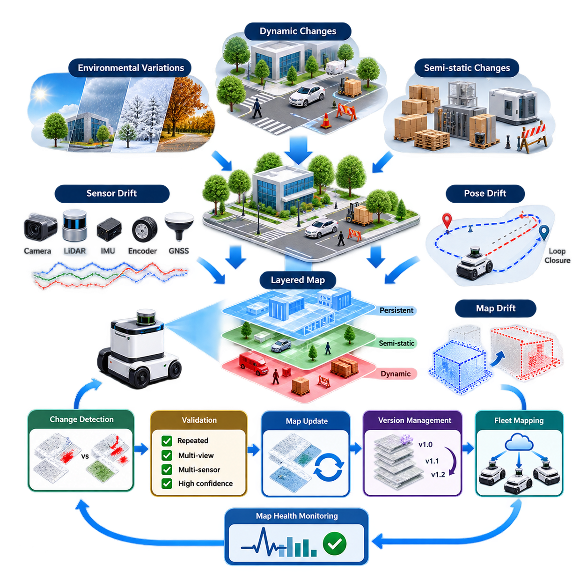
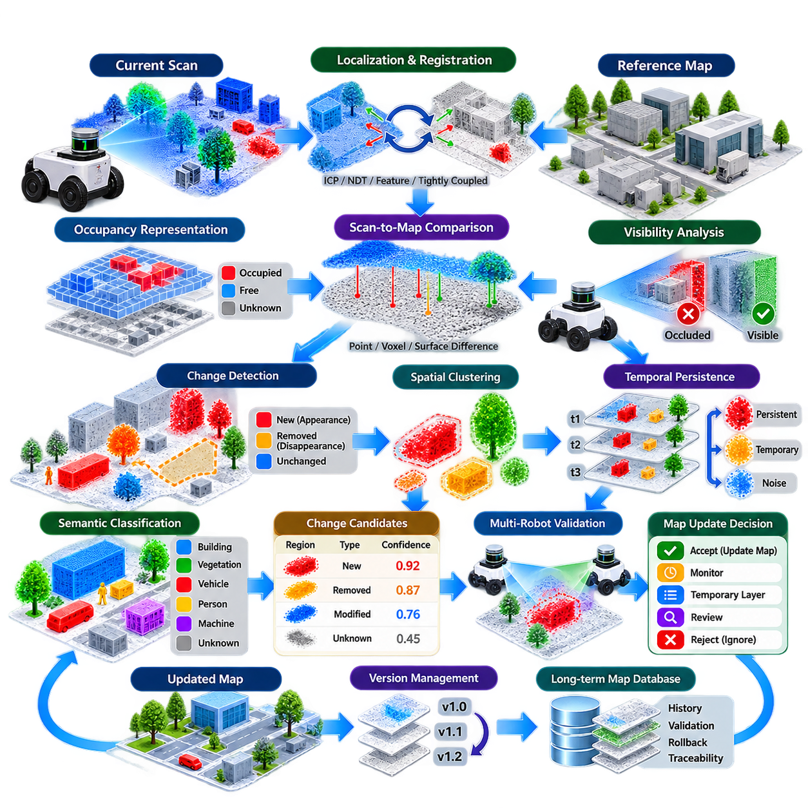
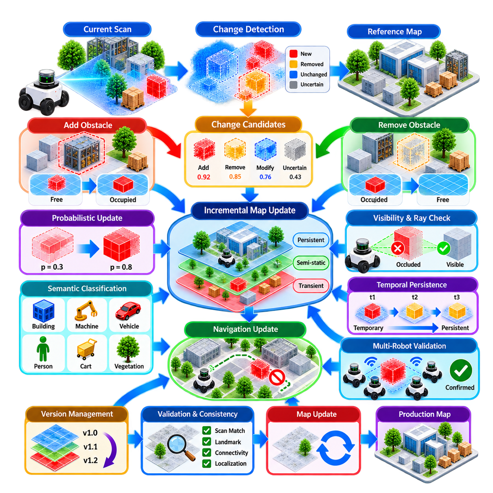
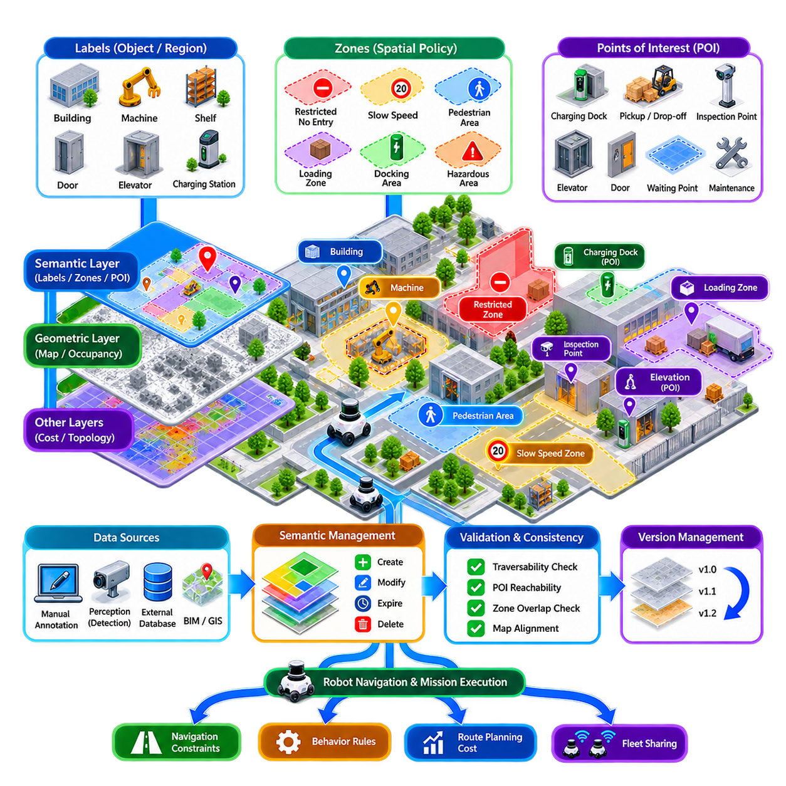
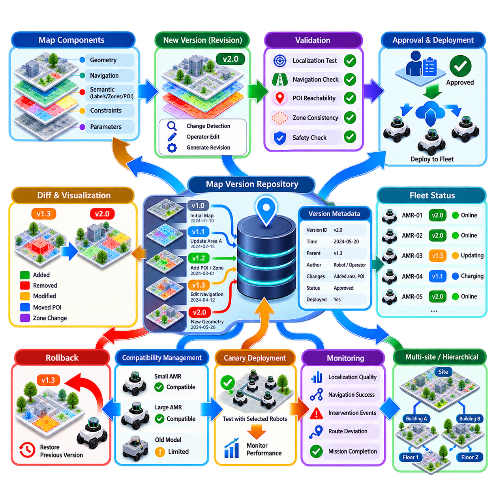
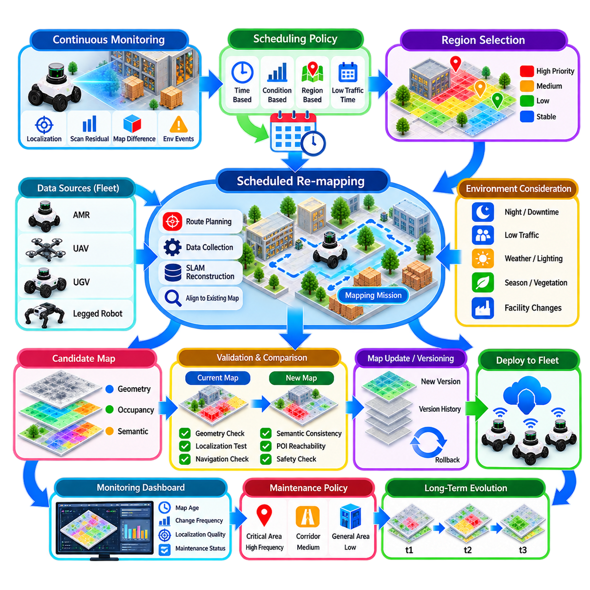
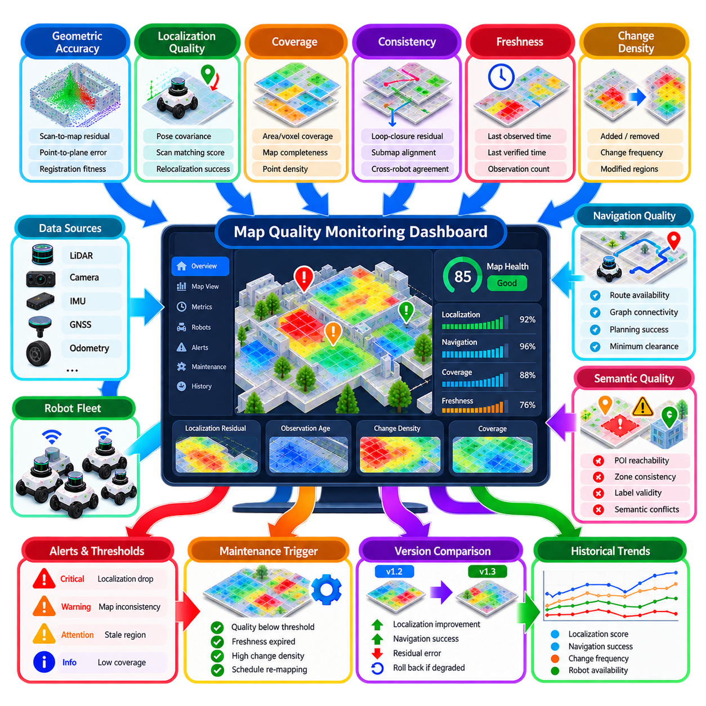
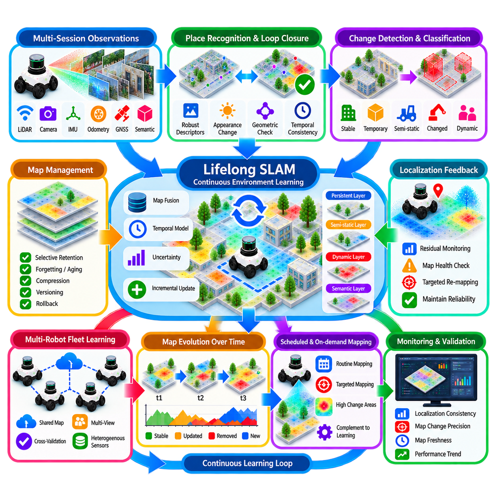
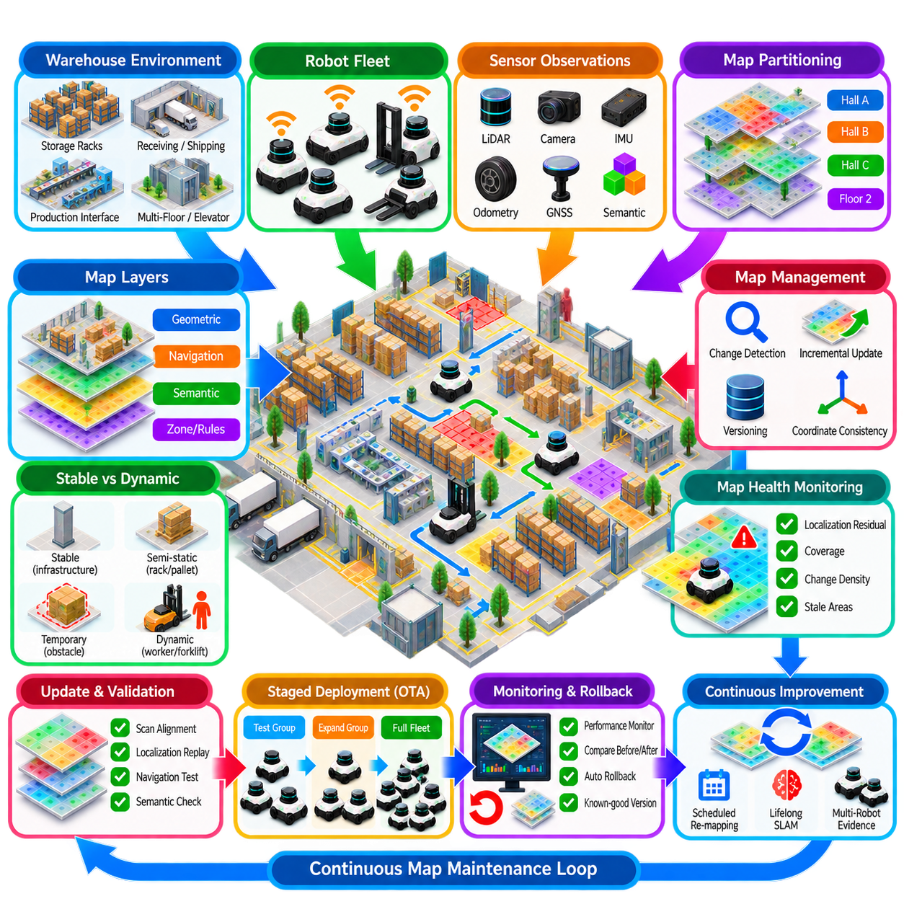

**Volume 13. Mapping Localization and SLAM**

# Chapter 10. Long Term Map Management

## 10.01. Long Term Map Challenges Dynamic Changes Drift

{width="7.268055555555556in" height="7.268055555555556in"}

장기 지도 관리(Long-term Map Management)는 로봇이 동일한 환경에서 수주, 수개월 또는 수년에 걸쳐 운용될 때 신뢰할 수 있는 공간 표현(Spatial Representation)을 유지하는 문제를 다룬다. 초기 배치(Initial Deployment) 과정에서 생성된 지도는 해당 시점의 환경을 기록한 하나의 스냅샷(Snapshot)에 불과하다. 건물, 공장, 창고, 캠퍼스 및 실외 공간은 지속적으로 변화하므로, 지도 시스템은 영구적으로 유지되는 구조와 일시적인 관측 정보를 구분할 수 있어야 한다.

근본적인 어려움 중 하나는 환경 변화(Environmental Change)가 여러 시간 척도(Temporal Scale)에서 발생한다는 점이다. 사람, 차량, 문, 카트 및 이동 가능한 장비는 수초 또는 수분 내에도 변화할 수 있지만, 선반, 작업대, 식생, 도로 표식 및 공사 구역은 수일에서 수개월에 걸쳐 변화할 수 있다. 따라서 장기 지도 시스템은 객체나 특징이 어디에 존재하는지만 판단하는 것이 아니라, 해당 관측이 시간에 따라 얼마나 안정적으로 유지되는지도 판단해야 한다.

동적 객체(Dynamic Object)는 실시간 센서 측정값과 저장된 지도 사이에 즉각적인 불일치를 발생시킨다. 라이다(LiDAR) 스캔에는 지도 생성 당시 존재하지 않았던 주차 차량이 포함될 수 있으며, 카메라는 이전에 비어 있던 공간을 점유하는 팔레트나 기계를 관측할 수 있다. 이러한 관측을 필터링 없이 반영하면 일시적인 객체가 점차 영구 지도(Persistent Map)를 오염시키고 위치추정(Localization), 경로 계획(Path Planning), 장애물 해석(Obstacle Interpretation)의 성능을 저하시킬 수 있다.

준정적 변화(Semi-static Change)는 영구적인 변화인지 일시적인 변화인지 쉽게 분류할 수 없기 때문에 더욱 어렵다. 팔레트가 수주 동안 같은 위치에 있을 수도 있고, 생산 설비가 한 달 동안 다른 장소로 이동할 수도 있으며, 공사 차단물이 프로젝트 기간 내내 유지될 수도 있다. 따라서 장기 지도 관리에서는 관측된 구조를 안정 지도(Stable Map)의 일부로 편입할지, 임시 계층(Temporary Layer)에 유지할지를 판단하는 시간적 지속성 모델(Temporal Persistence Model)이 유용하다.

실외 환경(Outdoor Environment)은 날씨, 조명, 식생 및 계절 조건으로 인해 추가적인 장기 변동성을 발생시킨다. 비, 눈, 안개, 낙엽, 그림자 및 태양광 변화는 실제 기하 구조가 변하지 않았더라도 센서 관측을 크게 변화시킬 수 있다. 식생은 실제 형태 자체가 변할 수 있으며, 눈은 지면의 겉보기 형상을 변경할 수 있다. 강건한 지도화(Robust Mapping)를 위해서는 환경의 외관 변화와 실제 구조적 변화를 구분해야 한다.

센서 드리프트(Sensor Drift)는 장기적인 지도 성능 저하를 발생시키는 또 다른 주요 원인이다. 카메라, 라이다, 관성측정장치(IMU), 휠 인코더(Wheel Encoder), 위성항법시스템(GNSS)의 작은 보정 오차(Calibration Error)는 반복적인 운용 과정에서 누적될 수 있다. 각각의 오차가 작더라도 체계적인 편향(Systematic Bias)은 추정 궤적과 지도 형상을 점진적으로 왜곡할 수 있다. 따라서 장기 시스템에서는 센서 보정 상태, 위치추정 잔차(Localization Residual), 독립적인 센서 방식 간의 일관성을 지속적으로 감시해야 한다.

자세 드리프트(Pose Drift)는 로봇이 특징이 부족하거나 반복적인 환경을 이동하면서 위치추정 오차가 누적될 때 발생한다. 긴 복도, 대형 창고, 터널, 주차 시설 및 개방된 실외 공간에서는 안정적인 자세 추정을 위한 제약 조건이 부족할 수 있다. 루프 폐쇄(Loop Closure)는 누적 오차를 보정할 수 있지만 잘못된 루프 폐쇄(False Loop Closure)는 심각한 전역 지도 변형(Global Deformation)을 발생시킬 수 있다. 따라서 장기 운용에서는 드리프트 보정뿐만 아니라 보정 결과 자체에 대한 검증도 필요하다.

지도 드리프트(Map Drift)는 반복적인 증분 업데이트(Incremental Update)를 통해서도 발생할 수 있다. 새로운 관측이 이전 표현보다 조금 더 정확하다고 가정하여 매번 받아들이면 작은 위치추정 오차가 지도 자체에 포함될 수 있다. 이후 위치추정은 왜곡된 지도를 다시 기준으로 사용하게 되므로 위치추정 오차와 지도 오차가 서로를 강화하는 피드백 과정(Feedback Process)이 형성될 수 있다. 따라서 안정적인 기준 특징(Stable Reference Feature)은 통제되지 않은 변경으로부터 보호되어야 한다.

실용적인 구조(Practical Architecture)는 정보를 시간적 안정성(Temporal Stability)에 따라 분리한다. 영구 계층(Persistent Layer)에는 벽, 기둥, 고정 인프라, 연석 및 기타 안정성이 높은 기하 구조를 저장할 수 있으며, 동적 또는 일시적 계층(Dynamic or Transient Layer)에는 차량, 사람, 이동 가능한 장비 및 임시 장애물을 표현할 수 있다. 중간 계층(Intermediate Layer)은 준정적 구조를 표현할 수 있다. 이러한 계층형 표현(Layered Representation)은 단기적인 환경 변화가 장기 공간 기준을 불필요하게 다시 작성하는 것을 방지한다.

변화 감지(Change Detection)는 부수적인 지도화 기능이 아니라 핵심 기능이 된다. 현재 센서 관측을 저장된 지도에서 예상되는 관측과 비교하고, 반복적인 주행 과정에서 지속적으로 나타나는 차이를 누적한다. 한 번의 불일치만으로 영구적인 지도 업데이트를 수행해서는 안 된다. 동일한 변화가 서로 다른 관측 시점, 센서 또는 로봇 임무(Robot Mission)에서 반복적으로 확인될 때에만 해당 변화에 대한 신뢰도(Confidence)를 증가시켜야 한다.

지도 유지관리(Map Maintenance)는 업데이트 과정에서도 위치추정의 연속성(Localization Continuity)을 보존해야 한다. 환경이 변화할 때마다 전체 지도를 교체하면 내비게이션 경로, 임무 정의(Mission Definition), 충전 스테이션, 검사 지점 및 군집 관리 시스템(Fleet Management System)에서 사용하는 좌표가 무효화될 수 있다. 따라서 가능한 경우 증분 지도 진화(Incremental Map Evolution)가 바람직하다. 안정적인 좌표계(Coordinate Frame)와 영구 랜드마크(Persistent Landmark)는 유지하면서 변경된 영역만 통제된 공간적·시간적 범위에서 업데이트해야 한다.

다중 로봇 군집(Multi-robot Fleet)은 장기 지도 관리를 더욱 강력하게 만들지만 동시에 복잡성도 증가시킨다. 서로 다른 로봇은 동일한 영역을 서로 다른 시간, 관측 시점, 센서 구성 및 위치추정 정확도로 관측할 수 있다. 이러한 관측은 환경 변화에 대한 강력한 증거를 제공할 수 있지만, 일관되지 않은 데이터는 공유 지도(Shared Map)를 손상시킬 수도 있다. 따라서 군집 지도화(Fleet Mapping)에서는 관측 출처(Observation Provenance), 신뢰도 추정(Confidence Estimation), 공간 정렬(Spatial Alignment), 업데이트 승인 규칙이 필요하다.

공유 지도(Shared Map)는 모든 로봇이 직접 자유롭게 데이터를 기록하는 무제한 데이터베이스처럼 취급해서는 안 된다. 보다 안전한 구조에서는 로봇이 후보 변경 사항(Candidate Change)을 제출하고, 지도 관리 프로세스(Map-management Process)가 이를 과거 관측 및 다른 로봇의 관측과 비교하여 일관성을 평가한다. 이후 업데이트는 임시 정보(Provisional Information)에서 검증된 지도 정보(Validated Map Content)로 승격될 수 있다. 이러한 방식은 운용 인지(Operational Perception)와 공식적인 지도 수정(Authoritative Map Modification)을 분리한다.

버전 관리(Version Management)는 지도 업데이트가 예상하지 못한 방식으로 로봇의 동작에 영향을 미칠 수 있기 때문에 필수적이다. 각 운영 지도(Production Map)는 식별 가능한 버전, 생성 이력, 검증 상태 및 이전 버전과의 관계를 가져야 한다. 새롭게 업데이트된 지도가 위치추정 불안정이나 내비게이션 실패를 발생시키는 경우 로봇 군집은 검증된 정상 버전(Known-good Version)으로 복귀할 수 있어야 한다. 따라서 지도 진화(Map Evolution)는 통제되지 않은 데이터 축적이 아니라 소프트웨어 형상 관리(Software Configuration Management)와 유사한 방식으로 관리되어야 한다.

장기 위치추정(Long-term Localization)은 지도 건전성(Map Health)도 지속적으로 평가해야 한다. 유용한 지표에는 위치추정 공분산(Localization Covariance), 스캔 정합 잔차(Scan-matching Residual), 특징 대응률(Feature Correspondence Rate), GNSS 불일치, 루프 폐쇄 일관성(Loop-closure Consistency), 기준 지도와 충돌하는 관측 비율 등이 포함된다. 개별적인 값보다 시간에 따른 추세가 더 중요한 경우가 많다. 여러 임무에 걸친 점진적인 성능 저하는 위치추정이 완전히 실패하기 전에 보정 드리프트나 환경 변화를 나타낼 수 있다.

감지된 모든 변화가 위치추정 지도(Localization Map)의 수정을 요구하는 것은 아니다. 일부 변화는 주로 내비게이션, 의미 정보(Semantics) 또는 임무 계획(Mission Planning)에 영향을 준다. 예를 들어 새롭게 설치된 임시 차단물은 운영 장애물 계층(Operational Obstacle Layer)에 포함될 수 있지만, 기본 기하 위치추정 지도는 그대로 유지할 수 있다. 위치추정, 내비게이션, 의미 및 운영 표현(Operational Representation)을 분리하면 불필요한 결합을 줄이고 장기 유지관리의 강건성을 높일 수 있다.

따라서 핵심 목표는 지도를 모든 순간에 물리적 세계와 완전히 동일하게 유지하는 것이 아니다. 대신 시스템은 신뢰할 수 있는 공간 기준(Spatial Reference)을 유지하면서 의미 있는 환경 변화에 통제된 방식으로 적응할 수 있어야 한다. 효과적인 장기 지도 관리(Long-term Map Management)는 시간적 추론(Temporal Reasoning), 변화 감지(Change Detection), 드리프트 감시(Drift Monitoring), 계층형 지도(Layered Map), 검증(Validation), 버전 관리(Version Control), 롤백(Rollback)을 결합함으로써 자율 로봇이 장기간의 실제 운용에서도 안정성과 신뢰성을 유지하도록 한다.

## 10.02. Map Change Detection from Scan to Map Diff [w/Code]

{width="7.268055555555556in" height="7.268055555555556in"}

지도 변화 감지(Map Change Detection)는 이전에 구축된 기준 지도(Reference Map)와 현재 로봇 운용 과정에서 수집된 관측 정보 사이에서 의미 있는 차이를 식별하는 과정이다. 장기간 운용되는 자율 시스템(Long-term Autonomous System)에서는 기준 지도가 실제 물리적 환경과 항상 완벽하게 일치한다고 가정할 수 없다. 스캔-지도 차이 분석(Scan-to-map Differencing)은 환경이 어디에서, 어떻게, 그리고 잠재적으로 왜 변화했는지를 체계적으로 탐지하는 방법을 제공한다.

기본적인 처리 파이프라인(Pipeline)은 현재 센서 스캔(Current Sensor Scan)과 이전에 검증된 기하 구조를 표현하는 기준 지도에서 시작한다. 스캔은 2D 또는 3D 라이다(LiDAR), 깊이 카메라(Depth Camera), 스테레오 시스템(Stereo System), 또는 융합 인지 파이프라인(Fused Perception Pipeline)에서 생성될 수 있다. 차이를 평가하기 전에 새로운 관측을 기준 지도와 동일한 좌표계(Coordinate Frame)로 변환해야 한다. 따라서 정확한 위치추정(Localization)은 신뢰할 수 있는 변화 감지를 위한 필수 조건이다.

정합 품질(Registration Quality)은 스캔-지도 차이 분석의 신뢰성을 직접적으로 결정한다. 작은 병진(Translation) 또는 회전(Rotation) 오차만 발생해도 실제로는 변하지 않은 벽, 기둥, 연석 및 장비가 이동한 것처럼 나타날 수 있다. 따라서 시스템은 정합 불확실성(Registration Uncertainty)을 추정하고 위치추정 품질이 낮은 상태에서 수행된 비교를 제외하거나 낮은 가중치로 처리해야 한다. 반복 최근접점(ICP), 정규분포 변환(NDT), 특징 기반 정합(Feature-based Registration), 또는 긴밀 결합 위치추정(Tightly Coupled Localization)을 이용하여 비교에 필요한 기하학적 정렬을 수행할 수 있다.

정렬이 완료되면 현재 스캔과 기준 지도를 기하학적 수준(Geometric Level)에서 비교할 수 있다. 관측된 각 포인트(Point), 복셀(Voxel), 격자 셀(Grid Cell), 또는 표면 요소(Surface Element)에 대해 허용 가능한 공간 오차 범위 내에 대응되는 기하 구조가 존재하는지를 평가한다. 작은 잔차 차이(Residual Difference)는 일반적으로 센서 잡음이나 정합 불확실성으로 처리하며, 크기가 크고 공간적으로 일관된 차이는 환경 변화 후보(Candidate Environmental Change)가 된다.

스캔-지도 차이 분석은 새롭게 나타난 구조와 사라진 구조를 구분할 수 있어야 한다. 출현 이벤트(Appearance Event)는 새롭게 설치된 기계, 벽, 차단물 또는 저장 선반처럼 현재 스캔에는 지속적으로 관측되지만 기준 지도에는 존재하지 않는 기하 구조가 나타날 때 발생한다. 소멸 이벤트(Disappearance Event)는 기준 지도에서 예상되는 기하 구조가 반복적으로 관측되지 않을 때 발생하며, 이는 장비나 구조물 또는 기타 지도 요소가 제거되었을 가능성을 나타낸다.

점유 기반 표현(Occupancy-based Representation)은 이러한 비교를 수행하기 위한 편리한 프레임워크(Framework)를 제공한다. 환경을 자유(Free), 점유(Occupied), 미확인(Unknown), 그리고 확률적 상태(Probabilistic State)를 갖는 격자 셀이나 3차원 복셀로 분할할 수 있다. 현재 관측은 이러한 상태에 대한 증거를 갱신하며, 기준 점유 지도(Reference Occupancy Map)와의 차이를 통해 변화 후보를 탐지한다. 확률적 점유(Probabilistic Occupancy)를 사용하면 단 한 번의 잡음성 측정이 즉시 영구적인 구조 변화로 반영되는 것을 방지할 수 있다.

광선 기반 추론(Ray-based Reasoning)은 특히 구조의 소멸을 탐지할 때 중요하다. 지도에 존재하는 표면이 관측되지 않았다고 해서 해당 표면이 실제로 사라졌다는 의미는 아니다. 다른 객체가 해당 표면을 가리고 있거나 센서의 가시성(Visibility)이 충분하지 않을 수 있기 때문이다. 기준 지도에서 점유 상태로 분류된 영역을 센서 광선(Sensor Ray)이 반복적으로 통과하면서도 예상된 표면을 만나지 않을 경우 훨씬 강한 소멸 가설(Disappearance Hypothesis)을 생성할 수 있다.

따라서 가시성 분석(Visibility Analysis)은 잘못된 변화 감지(False Change Detection)를 줄이는 데 중요한 역할을 한다. 차이를 변화로 선언하기 전에 기준 구조물이 현재 로봇의 관측 시점(Viewpoint)에서 실제로 관측 가능했는지를 판단할 수 있다. 센서 시야각(Field of View), 최대 측정 거리(Maximum Range), 입사각(Incidence Angle), 가림(Occlusion), 반사 특성(Reflective Properties), 환경 조건 등이 모두 관측 가능성에 영향을 줄 수 있다. 충분한 가시성이 확보된 영역만 구조 변화 판단을 위한 강한 증거로 사용해야 한다.

변화 감지에는 공간 군집화(Spatial Clustering)도 필요하다. 개별 포인트 수준의 차이는 대부분 그 자체로 의미 있는 변화를 나타내지 않기 때문이다. 잔차 포인트(Residual Point)는 연결 요소(Connected Component), 복셀 군집(Voxel Cluster), 표면 패치(Surface Patch), 또는 객체 수준 영역(Object-level Region)으로 그룹화할 수 있다. 군집의 크기, 밀도, 기하 구조, 지속성 및 의미 정보(Semantic Information)를 활용하면 실제 구조 변화와 고립된 센서 잡음을 구분할 수 있다. 이를 통해 수백만 개의 원시 포인트 비교를 관리 가능한 변화 후보 영역으로 변환할 수 있다.

시간적 지속성(Temporal Persistence)은 실제 지도 변화를 판단하는 가장 강력한 지표 중 하나이다. 한 번의 주행에서 탐지된 차이는 보행자, 차량, 팔레트, 비, 먼지 또는 위치추정 오차로 인해 발생했을 수 있다. 동일한 차이가 여러 임무에서 서로 다른 관측 시점을 통해 반복적으로 확인되면 변화에 대한 신뢰도가 크게 증가한다. 따라서 장기 시스템(Long-term System)은 각각의 스캔 이후 지도를 즉시 다시 작성하는 대신 변화에 대한 증거를 시간에 따라 누적해야 한다.

다중 세션 비교(Multi-session Comparison)는 스캔-지도 차이 분석을 단순한 현재 관측과 기준 지도 간의 비교 이상으로 확장한다. 서로 다른 날짜나 임무에서 수집된 관측은 지도의 각 영역에 대한 시간적 이력(Temporal History)을 구성할 수 있다. 수개월 동안 지속적으로 관측되는 구조는 높은 지속성 신뢰도(Persistence Confidence)를 부여받을 수 있으며, 빠르게 변화하는 영역은 불안정 영역(Unstable Region)으로 분류할 수 있다. 이러한 시간적 표현(Temporal Representation)은 영구적인 기반 시설과 동적 또는 준정적 콘텐츠를 구분하는 데 도움을 준다.

의미 정보(Semantic Information)는 기하학적 변화에 대한 해석을 향상시킬 수 있다. 사람이나 이동 차량으로 분류된 기하학적 차이는 일반적으로 영구 지도에서 제외되어야 하지만, 새롭게 탐지된 벽, 기계, 충전 스테이션 또는 고정 캐비닛은 실제 구조 업데이트를 의미할 수 있다. 따라서 기하 정보와 의미론적 분할(Semantic Segmentation) 또는 객체 인식(Object Recognition)을 결합하면 시스템이 변화 유형별로 서로 다른 업데이트 정책(Update Policy)을 적용할 수 있다.

그러나 의미론적 분류(Semantic Classification)가 기하학적 증거를 대체해서는 안 된다. 인식 시스템은 조명, 관측 시점, 부분 가림(Partial Occlusion), 또는 학습되지 않은 객체로 인해 실패할 수 있다. 강건한 시스템(Robust System)은 의미 정보를 추가적인 증거로 활용하면서 기하학적 일관성(Geometric Consistency), 시간적 지속성, 관측 신뢰도를 주요 판단 기준으로 유지한다. 이를 통해 잘못된 객체 분류가 공식 지도(Authoritative Map)의 부적절한 변경으로 직접 이어지는 것을 방지할 수 있다.

임계값 설정(Threshold Selection)은 변화 감지 성능에 큰 영향을 미친다. 거리 임계값이 지나치게 작으면 시스템이 보정 오차, 센서 잡음, 표면 거칠기 및 위치추정 불확실성에 지나치게 민감해진다. 반대로 임계값이 지나치게 크면 의미 있는 변화를 놓칠 수 있다. 따라서 허용 가능한 기하 편차가 센서 거리, 입사각, 지도 해상도(Map Resolution), 위치추정 공분산(Localization Covariance), 지도 표면 특성 등에 따라 달라질 수 있도록 적응형 임계값(Adaptive Threshold)을 사용하는 것이 효과적이다.

따라서 변화 감지 결과는 단순한 변화 또는 비변화(Changed-or-unchanged) 플래그 이상의 정보를 포함해야 한다. 각 변화 후보 영역에는 위치, 공간 범위, 변화 유형, 신뢰도, 관측 횟수, 타임스탬프(Timestamp), 센서 출처, 위치추정 품질 및 지속성 이력(Persistence History)을 포함할 수 있다. 이러한 메타데이터(Metadata)를 이용하면 후속 지도 관리 시스템이 해당 변화를 무시할지, 지속적으로 감시할지, 임시적으로 표현할지, 검토할지 또는 기준 지도에 정식으로 반영할지를 결정할 수 있다.

로봇 군집(Robot Fleet)에서는 여러 플랫폼에서 수집된 관측이 독립적인 증거를 제공한다. 여러 로봇이 서로 다른 시간과 관측 시점에서 동일한 구조적 차이를 탐지한다면 실제 환경 변화일 가능성이 크게 증가한다. 반대로 하나의 로봇에서만 보고되는 차이는 센서 보정 오류나 위치추정 실패를 의미할 수도 있다. 따라서 로봇 간 교차 검증(Cross-robot Validation)은 군집 운용을 지도 신뢰성을 유지하기 위한 분산형 메커니즘(Distributed Mechanism)으로 전환한다.

지도 업데이트(Map Update)는 변화 감지 자체와 분리되어야 한다. 변화 감지기는 차이를 식별하고 특성을 분석하는 역할을 수행하며, 통제된 지도 관리 프로세스가 해당 차이를 공식 지도에 반영할 것인지를 결정해야 한다. 이러한 분리는 일시적인 관측이 운영 지도(Production Map)를 직접 손상시키는 것을 방지하며, 로봇 시스템의 전체 운용 수명 동안 검증(Validation), 승인(Approval), 버전 관리(Versioning), 롤백(Rollback), 추적성(Traceability)을 지원한다.

실제 운영용 자율이동로봇(AMR) 및 자율 로봇 시스템에서는 정상적인 위치추정과 내비게이션이 계속 수행되는 동안 스캔-지도 차이 분석이 백그라운드(Background)에서 지속적으로 동작할 수 있다. 탐지된 변화는 영역별 신뢰도 지도(Regional Confidence Map)에 누적하고 정기적인 유지관리 과정에서 평가하거나 정의된 정책에 따라 자동으로 처리할 수 있다. 목표는 최대의 탐지 민감도가 아니라 위치추정, 내비게이션, 안전 또는 임무 수행에 영향을 줄 정도로 중요한 변화를 신뢰성 있게 식별하는 것이다.

궁극적으로 스캔-지도 변화 감지(Scan-to-map Change Detection)는 정적인 지도화 시스템을 환경 변화를 인식하는 장기 지도화 프로세스(Long-term Mapping Process)로 전환한다. 정확한 정합은 공통 기준을 형성하고, 기하학적 차이 분석은 불일치를 탐지하며, 가시성 추론은 유효하지 않은 비교를 제거한다. 시간적 증거와 다중 로봇 증거는 변화의 지속성을 판단하고, 통제된 검증 절차는 무엇을 영구적인 정보로 반영할지를 결정한다. 이러한 메커니즘의 결합을 통해 자율 로봇은 안정적인 공간 기준을 훼손하지 않으면서도 실제 환경의 지속적인 변화를 인식하고 장기간에 걸쳐 신뢰성 있는 지도를 유지할 수 있다.

## 10.03. Incremental Map Update Adding Removing Obstacles [w/Code]

{width="7.268055555555556in" height="7.268055555555556in"}

증분 지도 업데이트(Incremental Map Update)는 이전 운용 과정에서 이미 검증된 안정적인 공간 구조(Spatial Structure)를 유지하면서 실제로 변화한 지도 영역만 선택적으로 수정하는 통제된 과정이다. 전체 재매핑(Complete Remapping)과 달리 증분 업데이트는 장애물이 새롭게 나타나거나 사라지거나 이동할 때마다 전체 환경을 다시 구축하지 않는다. 이는 공장, 창고, 캠퍼스 및 실외 시설에서 지속적으로 운용되는 로봇에 필수적인 기능이다.

이 과정은 일반적으로 지도 변화 감지 시스템(Map Change Detection System)이 현재 센서 관측과 기준 지도(Reference Map) 사이에서 변화 후보(Candidate Difference)를 식별한 이후 시작된다. 업데이트 모듈은 모든 새로운 측정값을 직접적인 지도 수정으로 해석해서는 안 된다. 대신 공간 위치, 변화 유형, 신뢰도, 관측 이력 및 위치추정 품질을 포함하는 검증된 변화 후보를 전달받음으로써 지도 수정 과정과 원시 인지(Raw Perception)를 분리해야 한다.

장애물 추가(Obstacle Addition)는 이전에 자유 공간(Free Space) 또는 미확인 영역(Unknown Region)이었던 장소가 지속적으로 점유 상태가 될 때 발생한다. 새롭게 설치된 기계, 저장 선반, 안전 차단물, 벽, 충전 스테이션, 컨테이너 및 기타 구조물이 대표적인 사례이다. 새로운 기하 구조를 영구 지도(Persistent Map)에 삽입하기 전에 여러 스캔에서 관측이 공간적으로 일관되는지 확인하고, 일시적인 차량, 사람, 팔레트 또는 기타 동적 객체(Dynamic Object)가 아닌지를 검증해야 한다.

장애물 제거(Obstacle Removal)는 존재보다 부재를 검증하기 어렵기 때문에 다른 형태의 추론 과정이 필요하다. 지도에 존재하는 객체가 다른 구조물에 의해 가려졌거나 센서의 유효 측정 범위 밖에 있을 수도 있다. 따라서 제거 판단은 반복적인 자유 공간 관측(Free-space Observation), 가시성 분석(Visibility Analysis), 기존 점유 영역을 통과하는 광선 추적(Ray Traversal)을 통해 뒷받침되어야 한다. 충분한 증거가 누적된 이후에만 해당 지도 셀, 복셀 또는 표면을 제거해야 한다.

지도 표현(Map Representation)은 장애물의 추가와 제거가 구현되는 방식을 결정한다. 2차원 점유 격자(2D Occupancy Grid)에서는 개별 셀의 점유 확률을 수정하며, 3차원 시스템에서는 복셀(Voxel), 서펠(Surfel), 포인트 클라우드 영역(Point-cloud Region), 메시(Mesh), 또는 부호 거리장(Signed-distance Field)을 갱신할 수 있다. 표현 방식과 관계없이 수정된 정보는 주변 기하 구조와 공간적 일관성을 유지하고 희소하거나 잡음이 많은 관측으로 인해 고립된 인공 구조가 생성되지 않도록 해야 한다.

확률적 업데이트(Probabilistic Updating)는 지도를 점진적으로 수정하기 위한 효과적인 메커니즘을 제공한다. 하나의 셀을 즉시 자유 상태에서 점유 상태로 또는 점유 상태에서 자유 상태로 변경하는 대신, 각각의 새로운 관측이 누적 확률에 증거를 추가하도록 할 수 있다. 반복되는 관측은 새로운 상태를 점차 강화하고 상충되는 측정은 신뢰도를 감소시킨다. 이러한 방식은 히스테리시스(Hysteresis)를 형성하여 불안정한 환경에서 서로 경쟁하는 지도 상태 사이에 빠른 전환이 반복되는 것을 방지한다.

시간적 지속성(Temporal Persistence)은 지도 계층 사이의 전환을 추가적으로 제어할 수 있다. 새롭게 탐지된 장애물은 먼저 일시적 계층(Transient Layer)에 포함되고, 여러 임무에서 계속 존재하면 준정적 계층(Semi-static Layer)으로 이동할 수 있다. 이후 더욱 엄격한 지속성과 신뢰도 조건을 충족한 경우에만 영구 지도에 승격(Promotion)되어야 한다. 기존의 안정적인 객체가 반복적인 관측에서 지속적으로 사라지는 경우에는 반대 방향의 절차를 적용할 수 있다.

공간적으로 제한된 업데이트(Spatially Bounded Update)는 광범위한 지도 재구성보다 바람직하다. 변화 영역이 식별되면 시스템은 해당 기하 구조 주변에 지역 업데이트 영역(Local Update Window)을 정의하고 그 부분만 수정할 수 있다. 주변의 안정적인 랜드마크(Stable Landmark)는 변경하지 않고 유지하여 위치추정을 지속적으로 제약한다. 이러한 지역화된 전략은 계산량을 줄이고 오류 전파를 제한하며 기존에 정의된 경로 및 임무 좌표와의 호환성을 유지한다.

좌표계 안정성(Coordinate-frame Stability)은 증분 업데이트 과정에서 특히 중요하다. 지도 수정으로 인해 전역 원점(Global Origin)이 의도하지 않게 이동하거나 기준 좌표계가 회전하거나 기존 랜드마크가 움직여서는 안 된다. 지역적인 보정이 수행될 때마다 좌표계가 변경되면 내비게이션 목표와 임무 정의가 신뢰성을 잃게 된다. 측량 기준점(Surveyed Point), 고정 인프라, GNSS 기준 또는 높은 지속성을 가진 랜드마크를 안정적인 앵커(Stable Anchor)로 사용하여 전역 지도 좌표계를 보호할 수 있다.

업데이트 과정에서는 위치추정 불확실성(Localization Uncertainty)도 고려해야 한다. 로봇 자세 공분산(Pose Covariance)이 높은 경우 새롭게 관측된 장애물의 위치가 부정확할 수 있다. 이러한 기하 구조를 지도에 직접 기록하면 벽이 중복되거나 표면이 두꺼워지거나 구조물이 실제 위치에서 벗어나 배치될 수 있다. 따라서 업데이트 신뢰도는 자세 품질(Pose Quality)을 반영해야 하며, 위치추정 성능이 저하된 상태에서 수집된 관측은 더 강한 측정 증거가 확보될 때까지 후보 정보로 유지할 수 있다.

의미론적 분류(Semantic Classification)는 지도 요소가 어떻게 변화해야 하는지를 결정하는 또 다른 방법을 제공한다. 탐지된 벽이나 영구적으로 설치된 기계는 영구 지도에 삽입될 수 있지만, 사람, 지게차, 카트 또는 주차 차량은 일반적으로 동적 계층이나 운영 계층(Operational Layer)에 유지되어야 한다. 의미 정보는 기하학적 검증을 대체하지 않지만 객체 범주에 따라 적절한 지속성 임계값과 업데이트 정책을 결정하는 데 도움을 준다.

장애물의 추가와 제거는 내비게이션 표현(Navigation Representation)에도 영향을 준다. 위치추정에 사용하는 구조 지도(Structural Map)는 일시적인 장애물이 경로를 차단할 때마다 반드시 변경할 필요가 없다. 대신 지역 및 전역 비용 지도(Local and Global Costmap)를 통해 단기적인 점유 상태를 표현하면서 영구적인 위치추정 지도는 안정적으로 유지할 수 있다. 장애물이 충분히 영구적인 것으로 판단되면 별도의 정책에 따라 내비게이션 지도와 최종적으로 구조 지도를 업데이트할 수 있다.

증분 지도 업데이트는 기하 구조뿐만 아니라 위상 연결성(Topological Connectivity)도 유지해야 한다. 장애물이 제거되면 새로운 복도나 통로가 열릴 수 있으며, 벽이나 기계가 추가되면 기존에 유효했던 경로가 사라질 수 있다. 따라서 중요한 변화 이후에는 내비게이션 그래프(Navigation Graph)를 다시 평가해야 한다. 변경된 영역 주변에서 연결성, 여유 공간(Clearance), 로봇 외형(Robot Footprint), 최소 회전 반경(Turning Radius), 일방통행 제약 및 안전 구역을 다시 계산해야 할 수 있다.

안전 중요 영역(Safety-critical Region)에는 더욱 보수적인 업데이트 정책이 필요하다. 충전 도크, 엘리베이터, 좁은 통로, 보행자 횡단 구역, 출입문, 위험 장비 또는 비상 경로 주변의 변화는 로봇 안전에 직접적인 영향을 줄 수 있다. 이러한 영역에서는 영구적인 변경을 수행하기 전에 더 높은 신뢰도, 추가 관측, 로봇 간 교차 검증(Cross-robot Verification), 또는 사람의 승인(Human Approval)이 요구될 수 있다. 따라서 증분 자동화는 하나의 전역 임계값이 아니라 영역별 업데이트 정책을 지원해야 한다.

다중 로봇 군집(Multi-robot Fleet)은 동일한 변화에 대한 독립적인 관측을 수집하여 증분 지도 유지관리를 가속할 수 있다. 여러 로봇이 서로 다른 방향에서 새롭게 설치된 장애물을 반복적으로 탐지하면 해당 장애물 추가에 대한 신뢰도가 빠르게 증가한다. 마찬가지로 여러 로봇의 반복적인 자유 공간 관측은 장애물 제거에 대한 증거를 강화한다. 군집 기반 검증(Fleet-based Validation)은 단일 로봇의 센서 보정 또는 위치추정 오류가 공유 지도(Shared Map)를 손상시킬 가능성도 감소시킨다.

여러 로봇이 서로 겹치는 영역의 변화를 동시에 보고하는 경우 동시 업데이트(Concurrent Update)라는 또 다른 문제가 발생한다. 지도 서버(Map Server)는 검증되지 않은 상충되는 수정 사항이 동시에 반영되는 것을 방지해야 한다. 변화 후보에는 타임스탬프를 부여하고 공간적으로 인덱싱한 뒤 신뢰도와 일관성에 따라 병합할 수 있다. 트랜잭션 방식 메커니즘(Transaction-like Mechanism) 또는 통제된 지도 커밋(Controlled Map Commit)을 사용하면 관측 데이터가 비동기적으로 도착하더라도 공식 지도(Authoritative Map)의 일관성을 유지할 수 있다.

승인된 모든 수정 사항은 추적 가능한 업데이트 기록(Traceable Update Record)을 생성해야 한다. 기록에는 변경 영역, 이전 상태, 새로운 상태, 업데이트에 기여한 관측 정보, 신뢰도, 로봇 식별자, 타임스탬프 및 검증 방법을 포함할 수 있다. 이러한 정보는 운영자가 지도가 변경된 이유를 파악할 수 있도록 하며 업데이트 이후 예상하지 못한 위치추정 또는 내비게이션 동작이 발생했을 때 디버깅(Debugging)을 지원한다.

버전 관리(Version Control)는 잘못된 증분 업데이트로부터 지도를 보호한다. 이력 없이 하나의 지도를 계속 덮어쓰는 대신 시스템은 지도 리비전(Map Revision) 또는 지역 스냅샷(Regional Snapshot)을 유지할 수 있다. 승인된 장애물 추가가 이후 일시적인 것으로 확인되거나 장애물 제거가 센서 고장으로 인해 잘못 판단된 경우 해당 영역을 이전의 검증된 버전으로 복구할 수 있다. 따라서 롤백(Rollback)은 자율 지도 유지관리의 중요한 구성 요소가 된다.

중요한 업데이트가 수행된 이후에는 지도 일관성(Map Consistency)을 확인해야 한다. 시스템은 새로운 리비전을 운영 환경에 적용하기 전에 스캔 정합 잔차(Scan-matching Residual), 랜드마크 정렬(Landmark Alignment), 점유 충돌(Occupancy Conflict), 내비게이션 연결성 및 위치추정 성능을 평가할 수 있다. 기하학적으로 타당한 업데이트라도 특징적인 구조를 제거하거나 모호한 구조를 추가하면 위치추정 성능을 저하시킬 수 있으므로 운영 검증(Operational Validation)은 기하학적 정확성만큼 중요하다.

실제 운영 시스템(Production System)에서는 후보 지도(Candidate Map), 스테이징 지도(Staging Map), 운영 지도(Production Map)를 분리하는 것이 효과적이다. 후보 변화는 로봇 관측으로부터 지속적으로 축적되고, 충분한 신뢰도를 확보한 업데이트는 스테이징 지도에 반영하여 시험한다. 운영 지도는 로봇 군집이 사용하는 공식 기준으로 유지한다. 검증이 완료된 변경 사항만 운영 지도로 승격함으로써 임무 중요 공간 데이터(Mission-critical Spatial Data)를 지속적으로 자동 수정할 때 발생할 수 있는 위험을 줄일 수 있다.

궁극적으로 증분 지도 업데이트(Incremental Map Update)는 이전 지도화와 검증 과정에서 축적된 안정성을 잃지 않으면서 로봇 시스템이 실제 환경 변화에 적응할 수 있도록 한다. 지속적인 장애물 추가는 지도에 반영하고, 확인된 장애물 제거는 삭제하며, 불확실한 변화는 임시 상태로 유지하고, 안정적인 영역은 불필요한 재작성으로부터 보호한다. 신뢰도 추정(Confidence Estimation), 의미론적 추론(Semantic Reasoning), 버전 관리, 군집 검증, 롤백을 결합함으로써 실제 물리적 환경의 변화에 맞추어 지도를 안전하고 지속적으로 진화시킬 수 있다.

## 10.04. Semantic Layer Management Labels Zones POI [w/Code]

{width="7.268055555555556in" height="7.268055555555556in"}

의미 계층 관리(Semantic Layer Management)는 위치, 객체, 영역 및 운영 요소에 의미를 부여함으로써 로봇의 기하 지도(Geometric Map)를 확장한다. 기하 정보(Geometry)는 로봇에게 표면과 자유 공간이 어디에 존재하는지를 알려주는 반면, 의미 정보(Semantics)는 이러한 요소가 무엇을 의미하며 로봇이 어떻게 상호작용해야 하는지를 설명한다. 레이블(Label), 구역(Zone), 관심 지점(Point of Interest, POI)은 위치추정 지도(Localization Map)를 내비게이션, 계획, 임무 및 군집 협업을 지원하는 운영 표현(Operational Representation)으로 전환한다.

의미 계층(Semantic Layer)은 기본 기하 지도와 논리적으로 분리되어 유지되어야 한다. 벽, 점유 셀(Occupied Cell), 포인트 클라우드(Point Cloud), 메시(Mesh), 랜드마크(Landmark)는 지도화 알고리즘에 따라 변경될 수 있지만, 의미 정보는 애플리케이션과 사용자가 정의한 운영 규칙(Operational Rule)을 따른다. 이러한 분리는 기하 지도의 재구성이 임무 정보를 의도하지 않게 삭제하는 것을 방지하며, 위치추정 지도를 반복적으로 다시 생성하지 않고도 의미 데이터를 발전시킬 수 있게 한다.

레이블(Label)은 지도 요소에 의미를 부여하는 가장 기본적인 방법을 제공한다. 특정 영역을 복도(Corridor), 창고 통로(Warehouse Aisle), 생산 셀(Production Cell), 적재 구역(Loading Area), 사무실(Office), 주차 공간(Parking Space), 또는 실외 도로 구간(Outdoor Road Segment)으로 식별할 수 있다. 객체 역시 문(Door), 엘리베이터(Elevator), 충전 스테이션(Charging Station), 기계(Machine), 선반(Shelf), 게이트(Gate), 소화기(Fire Extinguisher), 검사 대상(Inspection Target) 등의 레이블을 가질 수 있다. 이러한 레이블을 통해 계획 시스템은 단순한 좌표와 점유값을 넘어 의미 기반 추론을 수행할 수 있다.

의미 레이블(Semantic Label)은 여러 추상화 수준(Level of Abstraction)에서 존재할 수 있다. 하나의 점(Point)은 특정 도킹 커넥터(Docking Connector)를 나타낼 수 있으며, 다각형(Polygon)은 전체 충전 영역을 표현할 수 있다. 하나의 방은 더 큰 생산 구역에 포함될 수 있고, 생산 구역은 다시 건물이나 전체 사업장(Site)에 포함될 수 있다. 계층적 의미 구조(Hierarchical Semantics)를 사용하면 로봇과 군집 관리 시스템(Fleet Management System)이 단순한 이름 목록이 아니라 임무 맥락(Mission Context)에 따라 위치를 해석할 수 있다.

구역(Zone)은 특정한 운영 속성(Operational Property)이 부여된 공간 영역을 나타낸다. 대표적인 예로 제한 구역(Restricted Zone), 저속 구역(Slow-speed Zone), 보행자 구역(Pedestrian Area), 적재 구역(Loading Zone), 도킹 구역(Docking Area), 검사 영역(Inspection Region), 위험 공간(Hazardous Space), 청정 구역(Clean Area), 로봇 전용 통로(Robot-only Corridor)가 있다. 구역은 다각형, 체적(Volume), 또는 지도 셀의 집합으로 표현할 수 있으며, 로봇이 해당 영역에 진입하거나 접근할 때 동작을 자동으로 변경하는 규칙을 포함할 수 있다.

속도 제어 구역(Speed-control Zone)은 보행자나 민감한 장비 주변에서 로봇의 허용 속도를 낮출 수 있으며, 제한 구역은 임무가 적절한 접근 권한을 가지고 있지 않은 경우 진입을 금지할 수 있다. 위험 구역(Hazardous Area)에서는 추가적인 센싱, 경고 신호 또는 특정 안전 상태(Safety State)를 요구할 수 있다. 따라서 의미 구역(Semantic Zone)은 지도 좌표를 내비게이션 제약 조건 및 운영 동작과 직접 연결하는 공간 정책(Spatial Policy)으로 기능한다.

관심 지점(Point of Interest, POI)은 특정한 임무상의 의미를 가진 위치를 정의한다. 대표적인 예로 충전 도크(Charging Dock), 픽업 및 하역 스테이션(Pickup and Drop-off Station), 검사 지점(Inspection Point), 엘리베이터, 문, 대기 위치(Waiting Position), 유지보수 구역(Maintenance Area), 적재 베이(Loading Bay), 비상 위치(Emergency Location)가 있다. 임의의 내비게이션 목표와 달리 POI는 자세(Pose)뿐만 아니라 로봇이 해당 위치에 어떻게 접근하고 사용해야 하는지를 설명하는 맥락 정보(Contextual Information)를 포함할 수 있다.

POI에는 일반적으로 위치(Position), 방향(Orientation), 식별자(Identifier), 의미 유형(Semantic Type), 기준 좌표계(Reference Coordinate Frame)가 포함되어야 한다. 추가적인 메타데이터(Metadata)에는 접근 방향(Approach Direction), 허용 로봇 유형, 도킹 파라미터(Docking Parameter), 요구 정확도, 선호 경로(Preferred Path), 안전 여유 공간(Safety Clearance), 연계 장비 등을 포함할 수 있다. 이를 통해 단순한 좌표를 여러 로봇 임무에서 일관되게 참조할 수 있는 재사용 가능한 운영 객체(Operational Object)로 변환할 수 있다.

방향(Orientation)은 물리적 상호작용이 필요한 POI에서 특히 중요하다. 충전 도크, 컨베이어(Conveyor), 엘리베이터, 검사 스테이션 또는 적재 인터페이스에 도착하는 로봇은 단순히 특정 위치에 도달하는 것뿐만 아니라 정확한 최종 방향(Final Heading)을 요구하는 경우가 많다. 따라서 접근 자세(Approach Pose)와 대기 자세(Staging Pose)를 기본 POI와 연결하여 최종 정렬 전에 로봇이 통제된 순서에 따라 이동하도록 할 수 있다.

의미 영역(Semantic Region)은 통행을 완전히 금지하지 않으면서 경로 계획 비용(Route Planning Cost)에 영향을 줄 수도 있다. 보행자 영역은 통행 가능 상태를 유지하면서 높은 계획 비용을 부여하여 대체 경로가 존재할 경우 로봇이 다른 경로를 선택하도록 유도할 수 있다. 마찬가지로 험지(Rough Terrain), 경사로(Ramp), 좁은 통로, 젖은 표면, 교통량이 많은 영역에는 비용 수정값(Cost Modifier)을 적용할 수 있다. 따라서 의미 정보는 기하학적 주행 가능성(Geometric Traversability)에 운영상의 선호도를 추가한다.

의미 계층은 로봇 플랫폼마다 동일한 환경을 다르게 해석할 수 있기 때문에 로봇별 해석(Robot-specific Interpretation)을 지원해야 한다. 좁은 통로는 소형 자율이동로봇(AMR)에는 접근 가능하지만 대형 운송 로봇에는 금지될 수 있다. 특정 경사면은 한 종류의 바퀴형 플랫폼에는 허용되지만 다른 차량 구성에는 적합하지 않을 수 있다. 따라서 의미 속성에는 로봇 등급(Robot Class), 크기, 적재 상태(Payload State), 이동 방식(Mobility Type), 임무별 제한 조건을 포함할 수 있다.

실외 자율 로봇(Outdoor Autonomous Robot)은 추가적인 의미 범주를 필요로 한다. 도로(Road), 보도(Sidewalk), 횡단 구역(Crossing), 연석(Curb), 잔디(Grass), 자갈길(Gravel), 경사면(Slope), 배수로(Drainage Channel), 공사 구역(Construction Area), 주차 구역, GNSS 성능 저하 영역(GNSS-degraded Region), 통신 음영 구역(Communication Shadow Zone)은 모두 자율주행 동작에 영향을 줄 수 있다. 이러한 의미 영역을 기하학적 지형 지도(Geometric Terrain Map)와 결합하면 계획 시스템은 물리적으로 주행 가능한 공간과 운영적으로 적절한 경로를 구분할 수 있다.

의미 정보는 수동 주석(Manual Annotation), 인지 알고리즘(Perception Algorithm), 외부 데이터베이스 또는 인프라 시스템으로부터 생성될 수 있다. 운영자는 안전 구역과 임무 POI를 정의할 수 있으며, 카메라와 라이다 기반 인지는 문, 도로 표식, 기계 또는 주차 영역을 자동으로 식별할 수 있다. 건물 정보 모델(Building Information Model, BIM), 시설 데이터베이스, 지리정보시스템(Geographic Information System, GIS), 디지털 트윈(Digital Twin)은 로봇이 독립적으로 다시 탐색하기에는 비효율적인 추가 의미 정보를 제공할 수 있다.

자동으로 생성된 의미 정보에는 신뢰도 관리(Confidence Management)가 필요하다. 객체 분류기가 장비를 잘못 식별하거나 일시적인 객체를 영구적인 기반 시설로 판단할 수 있기 때문이다. 따라서 자동으로 생성된 각각의 의미 요소에는 신뢰도, 관측 출처(Observation Source), 타임스탬프(Timestamp), 검증 상태(Validation Status)를 포함할 수 있다. 위험, 제한 또는 비상 영역과 같이 영향도가 높은 레이블은 단순한 설명용 레이블보다 일반적으로 더 강한 검증 절차를 요구해야 한다.

의미 데이터(Semantic Data) 역시 시간에 따라 변화한다. 생산 영역의 용도가 변경되거나 충전 스테이션이 이동하거나 임시 공사 구역이 생성되거나 특정 시간 동안 복도가 제한 구역으로 변경될 수 있다. 따라서 의미 요소는 기하 지도를 다시 생성하지 않고도 생성(Create), 수정(Modify), 만료(Expire), 삭제(Delete)가 가능해야 한다. 시간 종속 속성(Time-dependent Attribute)을 사용하면 일시적 또는 일정 기반의 운영 규칙을 표현할 수 있다.

버전 관리(Version Management)는 의미 정보의 변경이 로봇 동작을 직접 변화시킬 수 있기 때문에 중요하다. POI를 1미터 이동하거나 구역 경계를 변경하거나 접근 규칙을 수정하는 것만으로도 기하 지도가 그대로 유지된 상태에서 내비게이션과 임무 수행이 영향을 받을 수 있다. 따라서 의미 지도 버전(Semantic Map Version)은 각 변경 사항을 누가 또는 무엇이 생성했는지, 언제 발생했는지, 어떤 정보가 수정되었는지, 어느 로봇 군집 또는 임무 구성이 해당 버전을 사용하는지를 기록해야 한다.

지도 업데이트 이후에는 기하 정보와 의미 정보 사이의 일관성(Consistency)을 확인해야 한다. 벽이 이동하거나 통로가 사라지면 이전에 유효했던 POI에 접근할 수 없게 되거나 의미 구역이 새롭게 점유된 공간과 겹칠 수 있다. 자동 검증(Automated Validation)을 통해 POI가 여전히 주행 가능한 영역에 존재하는지, 접근 경로가 유효한지, 구역 경계가 최신 기하 지도와 일치하는지를 검사할 수 있다. 유효하지 않은 의미 요소는 이후 검토 대상으로 표시할 수 있다.

다중 로봇 시스템(Multi-robot System)은 중앙집중형 의미 관리(Centralized Semantic Management)를 통해 큰 이점을 얻을 수 있다. 각각의 로봇이 이름, 구역 및 임무 위치를 독립적으로 저장하는 대신 공유 의미 지도(Shared Semantic Map)를 통해 로봇 군집 전체에 공통된 운영 용어 체계를 제공할 수 있다. 이를 통해 "Machine A 검사", "Loading Bay 3으로 이동", "Pedestrian Zone B 회피"와 같은 명령을 서로 다른 로봇에서 일관된 공간 제약 및 내비게이션 목표로 변환할 수 있다.

그러나 중앙집중형 의미 정보가 로봇의 로컬 자율성(Local Autonomy)을 제거해서는 안 된다. 로봇은 공유 의미 지도에 존재하지 않는 예상치 못한 장애물이나 일시적인 위험 상황에 대응할 수 있는 로컬 인지(Local Perception) 및 안전 시스템을 여전히 갖추어야 한다. 의미 계층은 상황적 지식(Contextual Knowledge)과 운영 정책을 제공하고, 실시간 인지는 즉각적인 환경 상태를 판단한다. 오래된 의미 정보가 현재의 안전 관측보다 우선하지 않도록 두 계층이 협력해야 한다.

강건한 의미 구조(Robust Semantic Architecture)는 기하 지도, 레이블, 구역, POI, 운영 규칙, 시간 메타데이터(Temporal Metadata), 신뢰도 및 버전 관리를 결합하면서 각 요소 사이에 명확한 인터페이스를 유지한다. 기하 정보는 공간적 기반을 제공하고, 의미 정보는 공간에 의미를 부여하며, 임무 로직(Mission Logic)은 로봇의 동작을 결정한다. 이러한 계층형 구조를 통해 자율 로봇은 자신이 어디에 있는지를 넘어 주변 장소가 무엇을 의미하며 그 안에서 어떻게 행동해야 하는지를 이해할 수 있다.

장기 지도 관리(Long-term Map Management)에서 의미 계층은 지도화(Mapping)와 실제 로봇 운영(Real-world Operation)을 연결하는 가교 역할을 한다. 기하 구조가 변화하는 동안에도 임무 지식을 보존하고, 운영 정책을 공간적으로 표현하며, 군집 수준 협업을 위한 안정적인 기준을 제공한다. 적절하게 관리된 레이블, 구역 및 POI는 지도를 단순히 공간을 표현하는 수동적 자료에서 신뢰성 높은 자율 행동을 지원하는 능동적 운영 모델(Active Operational Model)로 전환한다.

## 10.05. Map Versioning and Rollback for AMR Fleets [w/Code]

{width="7.268055555555556in" height="7.268055555555556in"}

지도 버전 관리(Map Versioning)는 자율이동로봇(AMR) 군집이 사용하는 공간 정보의 변화를 통제된 방식으로 관리하는 방법을 제공한다. 운영 지도(Production Map)는 초기 구축 이후 변경되지 않는 정적인 파일이 아니다. 기하 정보(Geometry), 내비게이션 제약 조건(Navigation Constraint), 의미 구역(Semantic Zone), 관심 지점(Point of Interest, POI), 운영 파라미터(Operational Parameter)는 시간에 따라 변화한다. 버전 관리는 이러한 변경을 기록하여 배치된 모든 로봇이 식별 가능하고 복구 가능한 지도 상태를 기준으로 운용되도록 한다.

하나의 지도 버전(Map Version)은 임의로 저장된 파일의 스냅샷이 아니라 일관된 운영 구성(Coherent Operational Configuration)을 나타내야 한다. 해당 버전에는 기하학적 위치추정 데이터(Geometric Localization Data), 점유 정보(Occupancy Information), 내비게이션 계층(Navigation Layer), 의미 주석(Semantic Annotation), 구역(Zone), POI, 외부 좌표계와의 관계가 포함될 수 있다. 이러한 요소를 공통 버전에 연결하여 관리하면 서로 호환되지 않는 기하 정보, 내비게이션 규칙 및 임무 정의가 혼합되는 것을 방지할 수 있다.

각 버전에는 고유 식별자(Unique Identifier)와 생성 배경을 설명하는 메타데이터(Metadata)가 필요하다. 유용한 정보에는 생성 시간, 부모 버전(Parent Version), 변경 영역, 작성자 또는 생성 로봇, 검증 상태(Validation Status), 배포 상태(Deployment Status), 변경 이유가 포함된다. 자동 업데이트에서는 업데이트에 기여한 관측 정보와 신뢰도(Confidence)도 기록해야 한다. 이러한 출처 정보(Provenance)를 통해 운영 문제가 발생했을 때 엔지니어는 지도가 현재 상태에 도달한 과정을 재구성할 수 있다.

버전 생성은 일반적으로 운영 지도를 직접 덮어쓰는 방식이 아니라 변경 관리 작업 흐름(Change-management Workflow)을 따른다. 변화 감지(Change Detection) 또는 운영자 편집에서 생성된 후보 수정 사항은 먼저 새로운 리비전(Revision)을 생성할 수 있다. 기존 운영 버전은 그대로 유지하고 새로운 리비전에 대해 기하, 위치추정, 내비게이션 및 의미 정보 검증을 수행한다. 검증에 성공한 리비전만 승인된 배포 후보(Approved Deployment Candidate)가 되어야 한다.

지도 버전 간의 차이(Map Difference)는 저장되거나 계산할 수 있어야 한다. 차이 정보(Diff)는 추가 또는 제거된 점유 영역, 변경된 표면, 이동된 POI, 수정된 구역 경계 또는 변경된 내비게이션 제한 조건을 표현할 수 있다. 시각적이고 기계 판독 가능한 차이 정보(Machine-readable Difference)를 통해 운영자는 리비전에 의도한 변경이 포함되었는지를 이해할 수 있다. 또한 자동화 시스템은 배포 전에 어떤 로봇, 임무 또는 경로가 영향을 받을 수 있는지 평가할 수 있다.

버전 관리는 여러 세분화 수준(Granularity)에서 수행할 수 있다. 전체 지도 버전(Complete-map Version)은 단순한 불변 스냅샷(Immutable Snapshot)을 제공하며, 영역별 버전 관리(Regional Versioning)는 선택된 공간 영역의 변경만 기록한다. 계층별 버전 관리(Layer-level Versioning)는 기하 정보, 의미 정보, 내비게이션 비용 또는 운영 정책을 독립적으로 추적할 수 있다. 시스템 구조는 저장 효율성과 배포된 지도 계층 조합의 호환성 및 재현성을 보장해야 하는 요구 사이에서 균형을 유지해야 한다.

롤백(Rollback)은 새로운 지도 버전이 허용할 수 없는 동작을 발생시킬 때 이전에 검증된 지도를 복구하는 메커니즘이다. 하나의 리비전이 기하학적으로는 정확해 보이더라도 스캔 정합(Scan Matching) 성능을 저하시키거나 경로를 무효화하거나 임무 목표 위치를 변경하거나 예상하지 못한 내비게이션 비용을 생성할 수 있다. 신속한 롤백을 통해 비상 재매핑이나 이전 공간 데이터의 수동 복원 없이 로봇 군집을 검증된 정상 구성(Known-good Configuration)으로 복귀시킬 수 있다.

롤백 작업은 일관성을 유지하는 데 필요한 모든 종속 정보(Dependent Information)를 복구해야 한다. 기하 지도만 이전 버전으로 되돌리고 새로운 버전의 POI나 구역을 그대로 유지하면 좌표 불일치와 접근할 수 없는 임무 목표가 발생할 수 있다. 따라서 롤백 단위(Rollback Unit)는 서로 호환되는 위치추정, 내비게이션, 의미 정보 및 임무 참조 정보를 포함하거나 어떤 구성 요소를 함께 되돌려야 하는지를 결정하는 종속 관계(Dependency Relationship)를 명확하게 정의해야 한다.

새로운 지도 버전은 배포 전에 자동 검증(Automated Validation)을 통과해야 한다. 위치추정 시험에서는 스캔 정합 잔차(Scan-matching Residual), 랜드마크 대응(Landmark Correspondence), 자세 안정성(Pose Stability), 루프 일관성(Loop Consistency)을 평가할 수 있다. 내비게이션 검증에서는 주행 가능성(Traversability), 연결성(Connectivity), 여유 공간(Clearance), 경로 가용성을 확인할 수 있다. 의미 정보 검증에서는 POI 접근 가능성과 구역이 새롭게 점유된 기하 구조와 충돌하지 않는지를 확인할 수 있다. 검증에 실패한 버전은 승격(Promotion)을 차단해야 한다.

군집 배포(Fleet Deployment)는 수백 대의 로봇이 동시에 업데이트되지 않을 수 있기 때문에 추가적인 복잡성을 발생시킨다. 일부 로봇은 충전 중이거나 오프라인 상태이거나 임무를 수행하고 있거나 서로 다른 영역에서 운용될 수 있다. 따라서 군집 관리 시스템(Fleet Management System)은 각 로봇이 현재 어떤 지도 버전을 사용하고 있는지를 파악해야 한다. 버전 인식(Version Awareness)을 통해 모든 로봇이 동일한 공간 구성을 이미 수신했다고 잘못 가정하여 임무를 할당하는 문제를 방지할 수 있다.

지도 배포(Map Distribution)는 통제된 동기화(Controlled Synchronization)를 사용해야 한다. 로봇은 먼저 버전 메타데이터를 수신하고 업데이트 적용 가능 여부를 판단한 다음 필요한 지도 데이터를 다운로드하고 무결성(Integrity)을 검증한 뒤 적절한 전환 시점에 리비전을 활성화할 수 있다. 활성화는 로봇이 대기 상태일 때, 충전 스테이션에 있을 때, 임무를 완료한 이후 또는 정의된 동기화 영역(Synchronization Area)에 진입했을 때 수행할 수 있다. 이를 통해 민감한 주행 동작 중에 핵심 공간 기준이 변경되는 것을 방지할 수 있다.

원자적 활성화(Atomic Activation)는 부분적으로 적용된 업데이트가 로봇 상태의 불일치를 발생시킬 수 있기 때문에 바람직하다. 로봇은 새로운 기하 정보와 기존 의미 구역을 함께 사용하거나, 업데이트된 POI와 오래된 내비게이션 그래프를 함께 사용해서는 안 된다. 필요한 지도 구성 요소를 사전에 다운로드하고 검증한 뒤 하나의 논리적 구성(Logical Configuration)으로 전환할 수 있다. 활성화에 실패하면 로봇은 이전에 검증된 버전을 계속 사용해야 한다.

로봇 군집에 서로 다른 로봇 유형이나 소프트웨어 세대가 포함되면 호환성 관리(Compatibility Management)가 중요해진다. 지도 리비전에서 구형 로봇이 지원하지 않는 의미 속성이나 내비게이션 기능이 새롭게 도입될 수 있다. 따라서 버전 메타데이터에는 최소 소프트웨어 요구사항(Minimum Software Requirement), 로봇 등급(Robot Class), 센서 가정(Sensor Assumption), 지원되는 지도 스키마(Map Schema)를 포함할 수 있다. 호환되지 않는 로봇은 승인된 호환 버전을 유지하거나 적절하게 변환된 지도 표현을 제공받아야 한다.

카나리 배포(Canary Deployment)는 군집 전체에 대한 위험을 줄일 수 있다. 새로운 지도를 모든 AMR에 즉시 배포하는 대신 선택된 소수의 로봇이나 제한된 운영 영역에 먼저 적용할 수 있다. 해당 로봇의 위치추정 품질, 내비게이션 성공률, 개입 빈도(Intervention Frequency), 임무 수행 성능을 감시할 수 있다. 성공적인 결과는 더 넓은 범위의 배포를 위한 근거가 되며, 실패가 발생하면 전체 군집에 영향을 미치기 전에 롤백할 수 있다.

일부 문제는 실제 교통 흐름과 환경 조건에서만 나타나므로 운영 버전으로 승격된 이후에도 운영 모니터링(Operational Monitoring)을 지속해야 한다. 유용한 지표에는 위치추정 신뢰도(Localization Confidence), 복구 이벤트(Recovery Event), 경로 계획 실패, 경로 이탈(Route Deviation), 예상하지 못한 정지, 장애물 충돌(Obstacle Conflict), 임무 완료율이 포함된다. 이러한 지표를 이전 버전과 비교하면 새로운 지도가 실제로 군집 운용을 개선했는지 또는 악화시켰는지를 판단할 수 있다.

롤백 트리거(Rollback Trigger)는 자동 또는 운영자에 의해 실행될 수 있다. 심각한 위치추정 실패, 광범위한 경로 무효화 또는 통계적으로 유의미한 성능 저하는 사전에 정의된 정책에 따라 검증된 정상 버전으로 자동 복귀하도록 설정할 수 있다. 심각도가 낮은 이상 현상은 엔지니어링 검토를 위한 경고를 생성할 수 있다. 안전 관련 롤백 규칙은 보수적으로 설계해야 하며 지도 복귀 과정 자체가 위험한 전환을 발생시키지 않도록 해야 한다.

다중 사업장 군집(Multi-site Fleet)에서는 명확한 버전 적용 범위(Version Scope)가 필요하다. 하나의 지도 버전은 특정 건물, 층, 창고, 실외 구역 또는 전체 시설에 적용될 수 있다. 여러 영역 사이를 이동하는 로봇은 공통된 전역 사업장 기준(Global Site Reference)을 유지하면서 서로 다른 지도 패키지를 사용할 수 있다. 계층적 버전 식별자(Hierarchical Version Identifier)를 이용하면 사업장, 영역, 계층 및 리비전을 표현할 수 있으며 관련 없는 지도를 다시 구축하지 않고도 대규모 시설의 개별 영역을 발전시킬 수 있다.

지도 이력(Map History)은 감사(Audit) 및 사고 조사(Incident Investigation)에도 활용할 수 있다. AMR이 예상하지 못한 동작을 수행한 경우 엔지니어는 당시 어떤 지도 버전, 의미 구성(Semantic Configuration), 내비게이션 제약 조건이 활성화되어 있었는지를 정확하게 확인할 수 있어야 한다. 지도 버전 기록을 로봇 로그(Robot Log) 및 임무 이력(Mission History)과 결합하면 당시 운영 상황을 재현하고 지도 결함을 인지, 계획 또는 하드웨어 문제와 구분하는 데 도움을 줄 수 있다.

저장소 관리(Storage Management)는 중요한 이력을 보존하면서 데이터가 통제되지 않은 상태로 증가하는 것을 방지해야 한다. 최근 운영 버전, 검증된 정상 기준 버전(Known-good Baseline), 안전 검증 버전(Safety-certified Revision), 사고와 관련된 버전은 장기간 보관할 필요가 있다. 중간 단계의 실험적 리비전은 정책에 따라 보관하거나 제거할 수 있다. 델타 저장(Delta Storage)과 콘텐츠 주소 기반 데이터(Content-addressed Data)를 사용하면 전체 과거 구성을 복원할 수 있는 능력을 유지하면서 중복 데이터를 줄일 수 있다.

접근 제어(Access Control)는 공식 지도 데이터를 승인되지 않은 수정으로부터 보호한다. 운영자는 POI를 생성할 수 있고, 지도 엔지니어는 기하 정보를 수정하며, 안전 담당자는 제한 구역을 관리하도록 권한을 분리할 수 있다. 운영 환경으로의 승격에는 정의된 승인 권한(Approval Authority)이 요구될 수 있다. 사용자 신원, 자동화 프로세스 신원, 타임스탬프 및 변경 사유를 기록하면 다른 안전 관련 시스템의 형상 관리(Configuration Management)와 유사한 수준의 책임 추적성을 제공할 수 있다.

지도 버전 관리는 독립적인 지도 기능으로 존재하는 것이 아니라 군집 오케스트레이션(Fleet Orchestration)과 통합되어야 한다. 임무 계획기(Mission Planner), 교통 관리 시스템(Traffic Manager), 충전 시스템, 디지털 트윈(Digital Twin), 모니터링 서비스는 모두 공간 식별자와 의미 정보에 의존할 수 있다. 지도 버전이 변경되면 종속 시스템은 호환되는 리비전을 사용하거나 변경된 인터페이스와 영향을 받는 운영 영역에 대한 명확한 통지를 받아야 한다.

궁극적으로 버전 관리와 롤백(Versioning and Rollback)은 지도 유지관리를 통제되지 않은 파일 교체 방식에서 체계적인 형상 관리(Disciplined Configuration Management) 방식으로 전환한다. 불변 이력(Immutable History), 검증, 통제된 배포, 로봇별 버전 인식, 운영 모니터링 및 복구 가능한 기준 버전을 통해 AMR 군집은 운영 안정성을 희생하지 않고 지도를 변화시킬 수 있다. 핵심 목표는 단순히 오래된 지도를 보존하는 것이 아니라 모든 공간적 변경을 식별 가능하고, 시험 가능하며, 배포 가능하고, 필요할 경우 되돌릴 수 있는 상태로 관리하는 것이다.

## 10.06. Automated Map Maintenance Scheduled Re Mapping [w/Code]

{width="7.268055555555556in" height="7.268055555555556in"}

자동 지도 유지관리(Automated Map Maintenance)는 초기 구축 이후 지도가 계속 유효하다고 가정하는 대신, 환경 변화를 주기적으로 평가하고 통제된 유지관리 절차를 실행함으로써 수개월 또는 수년에 걸쳐 지도 정확도를 유지할 수 있도록 한다. 예약 재매핑(Scheduled Re-mapping)은 누적된 변화, 불확실성 또는 드리프트(Drift)가 커진 영역을 체계적으로 갱신할 기회를 제공함으로써 증분 업데이트(Incremental Update)를 보완한다.

유지관리 아키텍처(Maintenance Architecture)는 일반적으로 지속적 모니터링(Continuous Monitoring)과 예약 재구성(Scheduled Reconstruction)을 분리한다. 일반적인 임무 수행 중 로봇은 위치추정 통계, 스캔-지도 잔차(Scan-to-map Residual), 변화 관측 및 환경 메타데이터(Environmental Metadata)를 수집한다. 이러한 신호는 지도를 즉시 다시 구축하지 않고도 지도 상태(Map Health)에 대한 근거를 제공한다. 이후 스케줄러(Scheduler)는 시간 간격, 누적된 성능 저하, 운영 우선순위 또는 사전에 정의된 정책을 이용하여 어떤 영역을 보다 포괄적으로 재매핑할지를 결정한다.

시간 기반 스케줄링(Time-based Scheduling)은 가장 단순한 유지관리 전략이다. 창고에서는 매주, 매월 또는 알려진 시설 변경 기간 이후에 지도 검사를 예약할 수 있다. 그러나 고정된 주기로 전체 환경을 항상 재매핑해야 하는 것은 아니다. 안정적인 영역은 그대로 유지하고, 자주 변경되는 생산 셀(Production Cell), 적재 구역, 공사 구역 또는 실외 경로에는 예상되는 변화 속도에 따라 더 짧은 유지관리 주기를 적용할 수 있다.

상태 기반 스케줄링(Condition-based Scheduling)은 지도 품질 지표(Map Quality Indicator)가 정의된 임계값을 초과할 때 유지관리를 실행함으로써 효율성을 향상시킨다. 위치추정 잔차 증가, 반복되는 복구 이벤트(Recovery Event), 스캔 정합 점수(Scan-matching Score) 저하, 지속적인 스캔-지도 차이 또는 해결되지 않은 변화 후보의 증가 등은 특정 영역에 대한 유지관리가 필요함을 나타낼 수 있다. 이를 통해 유지관리 빈도를 단순한 일정이 아니라 실제 환경 변화에 맞출 수 있다.

예약 재매핑은 가능한 경우 공간적으로 선택적(Spatially Selective)이어야 한다. 지도 상태 계층(Map-health Layer)을 이용하여 시설을 여러 영역 또는 타일(Tile)로 분할하고 각각에 대한 품질 통계를 관리할 수 있다. 안정적인 기하 구조와 높은 위치추정 성능을 가진 영역은 개입이 거의 필요하지 않지만, 성능이 저하된 영역은 더 높은 유지관리 우선순위를 부여받는다. 영역별 재매핑(Regional Re-mapping)은 전체 사업장을 다시 구축하는 것보다 계산량, 네트워크 트래픽, 저장 공간 및 운영 중단을 줄일 수 있다.

유지관리 임무(Maintenance Mission)는 일반적인 로봇 운용과 통합할 수 있다. 생산 작업 사이를 이동하는 자율이동로봇(AMR)은 검증이 필요한 경로를 지나면서 추가적인 라이다(LiDAR) 또는 카메라 데이터를 수집할 수 있다. 일반적인 이동 경로만으로 충분한 관측 범위나 다양한 관측 시점(Viewpoint)을 확보할 수 없는 경우에만 전용 지도화 임무(Dedicated Mapping Mission)가 필요하다. 이러한 기회 기반 접근(Opportunistic Approach)은 군집 운용 자체를 분산 센싱(Distributed Sensing) 과정으로 전환하고 지도화만을 위해 로봇을 생산 업무에서 제외해야 하는 필요성을 줄인다.

전용 재매핑 임무는 유용한 공간 범위(Spatial Coverage)를 최대화하도록 계획해야 한다. 관측 이력이 부족하거나 변화 가능성이 높거나 위치추정 특징이 약하거나 해결되지 않은 충돌이 존재하는 영역을 경로의 주요 대상으로 설정할 수 있다. 센서 가시성, 관측 방향, 측정 거리, 중첩(Overlap), 루프 폐쇄(Loop Closure) 가능성 등을 경로 생성에 반영해야 한다. 목표는 단순히 특정 영역을 통과하는 것이 아니라 해당 영역의 기하 구조를 신뢰성 있게 검증하거나 재구성할 수 있는 관측을 수집하는 것이다.

재매핑에서는 일시적인 운영 상태와 지속적인 구조 변화를 구분해야 한다. 운영이 활발한 시간에 창고를 스캔하면 지게차, 팔레트, 작업자 및 임시 재고 등이 영구적인 지도 기하 구조로 잘못 포함될 수 있다. 다중 관측, 의미론적 필터링(Semantic Filtering), 점유 지속성(Occupancy Persistence), 교통량이 적은 시간에 수집한 측정을 이용하면 이러한 오염을 줄일 수 있다. 따라서 스케줄링은 어디를 지도화할 것인지뿐만 아니라 언제 환경 조건이 적절한지도 고려할 수 있다.

산업 시설에서는 생산 중단 시간(Production Downtime)에 맞추어 유지관리를 의도적으로 예약할 수 있다. 야간, 교대 시간, 계획된 유지보수 시간 또는 교통량이 적은 시간에 지도화를 수행하면 가림(Occlusion)과 간섭을 줄이고 센서 관측 범위를 향상시킬 수 있다. 실외 시스템에서는 날씨, 조명, 계절성 식생(Seasonal Vegetation), GNSS 상태 및 현장 활동도 지도 품질에 영향을 줄 수 있다. 따라서 스케줄러는 적절한 유지관리 시간대를 결정할 때 환경적 제약 조건도 반영할 수 있다.

예약 지도화 작업을 시작하기 전에 시스템은 새로운 데이터와 비교할 기준 구성(Reference Configuration)을 확립해야 한다. 현재 활성화된 지도 버전, 좌표계(Coordinate Frame), 보정 상태(Calibration State), 센서 구성 및 관련 의미 계층(Semantic Layer)을 기록해야 한다. 이를 통해 새롭게 생성된 기하 구조를 올바른 기준선(Baseline)과 비교할 수 있으며, 유지관리 결과가 데이터 수집 당시 사용된 운영 구성과 분리되는 것을 방지할 수 있다.

부분 또는 전체 재매핑에서도 좌표 안정성(Coordinate Stability)은 필수적이다. 특정 영역을 재구성하는 과정에서 전역 지도 좌표계(Global Map Frame)가 임의로 이동하거나 기존 임무 좌표가 무효화되어서는 안 된다. 지속적인 랜드마크(Persistent Landmark), 측량 기준점(Surveyed Reference), 고정 인프라, GNSS 앵커(GNSS Anchor), 또는 중첩되는 기존의 변경되지 않은 지도 영역을 이용하여 새로운 재구성을 제약할 수 있다. 업데이트된 기하 구조는 후보 대체 지도로 고려되기 전에 기존 운영 좌표계와 정렬되어야 한다.

자동 재구성(Automated Reconstruction)은 운영 지도를 직접 수정하는 대신 누적된 센서 관측을 이용하여 후보 지도(Candidate Map)를 생성할 수 있다. 라이다 스캔, 카메라 관측, 오도메트리(Odometry), 관성측정장치(IMU) 측정 및 GNSS 정보를 적절한 동시적 위치추정 및 지도작성(SLAM) 파이프라인을 통해 처리할 수 있다. 루프 폐쇄와 자세 그래프 최적화(Pose-graph Optimization)는 전역 일관성을 향상시키며, 영역 정렬(Regional Alignment)은 기존 지도의 안정적인 부분과의 호환성을 유지할 수 있다.

이후 후보 지도는 현재 운영 버전과 비교되어야 한다. 자동 차이 분석(Automated Difference Analysis)을 통해 추가된 구조물, 제거된 장애물, 이동된 표면, 변경된 통로 및 기하학적으로 큰 차이를 보이는 영역을 식별할 수 있다. 장기간의 관측으로 이미 뒷받침된 변화에는 더 높은 신뢰도를 부여할 수 있으며, 예상하지 못한 차이는 추가 검증 대상으로 표시할 수 있다. 따라서 재매핑은 지도 재구성과 독립적인 지도 상태 검증(Map-health Validation)의 역할을 동시에 수행한다.

자동으로 재구성된 결과를 운영 환경으로 승격하기 전에 지도 검증(Map Validation)을 수행해야 한다. 기하학적 검사는 정렬, 완전성(Completeness), 밀도(Density), 연속성(Continuity), 잔차 오차(Residual Error)를 평가할 수 있다. 위치추정 시험에서는 기록된 센서 데이터를 후보 지도에서 재생하고 이전 버전과 자세 안정성을 비교할 수 있다. 내비게이션 검증은 연결성, 여유 공간(Clearance), 목표 접근 가능성 및 충돌 없는 경로를 검사하여 개선된 기하 구조가 운영 가능성을 의도하지 않게 손상시키지 않는지 확인한다.

기하 구조 재구성 이후에는 의미 계층을 별도로 검증해야 한다. 기존 POI(Point of Interest), 제한 구역(Restricted Zone), 저속 구역(Speed Zone), 도킹 위치(Docking Position), 검사 대상 및 임무 영역이 업데이트된 기하 구조와 올바르게 정렬되어 있는지 확인해야 한다. 구조 변화로 인해 POI에 접근할 수 없게 되거나 구역 경계가 실제 인프라와 어긋날 수 있다. 새로운 지도가 로봇 군집 운용에 적용되기 전에 자동 일관성 검사(Automated Consistency Check)를 통해 이러한 충돌을 식별해야 한다.

예약 유지관리는 지도 버전 관리(Map Versioning)와 자연스럽게 통합되어야 한다. 승인된 각각의 재구성 결과는 부모 버전(Parent Version), 지도화 시간, 영향을 받는 영역, 센서 출처, 검증 결과 및 변경 요약을 포함하는 새로운 후보 리비전(Candidate Revision)을 생성할 수 있다. 기존 운영 지도는 검증된 정상 기준선(Known-good Baseline)으로 계속 유지된다. 이를 통해 유지관리 결과를 되돌릴 수 있으며, 자동화 프로세스가 추적성 없이 검증된 공간 정보를 영구적으로 덮어쓰는 것을 방지할 수 있다.

모든 예약 지도화 작업이 새로운 운영 버전을 생성할 필요는 없다. 환경이 기존 지도와 일관되고 지도 품질 지표가 허용 가능한 범위 내에 있다면 유지관리 작업은 현재 지도의 유효성을 확인하는 것으로 종료할 수 있다. 이러한 변화 없음(Negative Result) 역시 현재 지도가 신뢰할 수 있다는 근거를 제공하므로 운영적으로 중요한 의미를 가진다. 따라서 버전 생성은 단순히 예약 작업이 실행되었다는 사실이 아니라 의미 있고 검증된 변화의 존재 여부에 따라 결정되어야 한다.

다중 로봇 군집(Multi-robot Fleet)은 자동 지도 유지관리에 상당한 장점을 제공한다. 서로 다른 로봇은 자연스럽게 서로 다른 위치와 시간에서 동일한 영역을 관측하므로 환경 안정성에 대한 독립적인 증거를 생성한다. 중앙 지도 유지관리 서비스(Central Map-maintenance Service)는 이러한 관측을 통합하고 관측 범위가 부족한 영역을 탐지하며 적절한 로봇에 목표 검증 작업을 할당할 수 있다. 따라서 군집 활동 자체가 지도 상태 정보를 지속적으로 생성하는 원천이 된다.

유지관리 작업을 수행할 로봇을 선택할 때는 센서 성능, 배터리 상태, 현재 위치, 임무 부하(Mission Load), 플랫폼 기하 구조 등을 고려할 수 있다. 고해상도 라이다를 탑재한 로봇은 세부 구조 검증에 우선적으로 사용할 수 있으며, 다른 플랫폼은 카메라 기반 의미 정보(Camera Semantics)를 제공할 수 있다. 사용 가능한 군집 자원에 따라 지도화 작업을 할당하면 생산 업무의 불필요한 중단을 방지하면서 이종 로봇(Heterogeneous Robot)이 상호 보완적인 관측 정보를 제공할 수 있다.

자동 유지관리 임무에서는 경로 차단, 센서 고장, 위치추정 성능 저하 또는 불완전한 관측 범위가 발생할 수 있으므로 실패 처리(Failure Handling)가 필요하다. 예약 작업이 완료되었다는 이유만으로 실패한 지도화 결과를 운영 지도에 적용해서는 안 된다. 수집된 정보가 충분한지는 관측 범위 및 데이터 품질 기준(Coverage and Data-quality Criteria)에 따라 결정해야 한다. 실패하거나 부분적으로 완료된 임무는 다시 예약하거나 다른 로봇의 관측으로 보완하거나 운영자 검토 대상으로 전환할 수 있다.

모니터링 대시보드(Monitoring Dashboard)는 운영자가 지속적으로 원시 지도를 직접 확인하지 않고도 유지관리 과정을 파악할 수 있도록 한다. 유용한 정보에는 영역별 지도 수명(Map Age), 마지막 검증 시간, 변화 빈도, 위치추정 품질, 해결되지 않은 차이, 예정된 유지관리 작업, 후보 리비전 및 검증 상태 등이 포함된다. 이를 통해 엔지니어는 성능이 저하된 영역에 집중하고 안정적인 환경은 대부분 자동화된 상태로 유지할 수 있다.

유지관리 정책(Maintenance Policy)은 운영 중요도(Operational Criticality)를 반영해야 한다. 충전 도크, 좁은 통로, 엘리베이터, 생산 인터페이스, 비상 경로 또는 안전 중요 장비 주변은 개방형 저장 영역보다 더 자주 검증하고 더 엄격한 검증 기준을 적용해야 할 수 있다. 영역별 정책(Region-specific Policy)을 적용하면 지도 오류가 위치추정, 내비게이션, 안전 또는 임무 연속성에 가장 큰 영향을 미치는 위치에 유지관리 자원을 집중할 수 있다.

장기간에 걸쳐 자동 유지관리를 수행하면 환경이 어떻게 변화하는지를 보여주는 시간적 기록(Temporal Record)이 생성된다. 반복되는 지도 버전과 영역별 관측을 통해 어떤 구조가 영구적으로 유지되는지, 어떤 영역이 자주 변화하는지, 어디에서 위치추정 품질이 반복적으로 저하되는지를 파악할 수 있다. 이러한 이력은 유지관리 수요를 예측하고 본질적으로 불안정한 영역과 엔지니어링 조사가 필요한 비정상적인 변화를 구분함으로써 향후 스케줄링을 개선할 수 있다.

궁극적으로 예약 재매핑(Scheduled Re-mapping)은 지도 유지관리를 간헐적인 수동 복구 작업에서 관리 가능한 수명주기 프로세스(Managed Lifecycle Process)로 전환한다. 지속적인 상태 모니터링은 성능 저하를 식별하고, 스케줄링은 언제 어디에서 추가 관측이 필요한지를 결정하며, 자동 재구성은 후보 업데이트를 생성하고, 검증 절차는 실제 운영 지도를 보호한다. 버전 관리 및 롤백(Rollback)과 결합된 이러한 작업 흐름을 통해 장기간 운용되는 AMR 군집은 물리적 환경이 지속적으로 변화하더라도 신뢰성 높은 공간 정보를 유지할 수 있다.

## 10.07. Map Quality Metrics and Monitoring Dashboard [w/Code]

{width="7.268055555555556in" height="7.268055555555556in"}

지도 품질 지표(Map Quality Metrics)는 지도가 위치추정(Localization), 내비게이션(Navigation), 자율 운용(Autonomous Operation)에 계속 적합한지를 정량적으로 판단할 수 있는 근거를 제공한다. 시각적으로 올바르게 보이는 지도라도 기하학적 왜곡(Geometric Distortion), 오래된 영역(Stale Region), 부족한 위치추정 특징(Localization Feature), 의미 정보 불일치(Semantic Inconsistency)를 포함할 수 있다. 따라서 지속적인 품질 모니터링(Continuous Quality Monitoring)은 지도 신뢰성을 주관적인 엔지니어링 판단에서 지도 수명주기 전체에 걸쳐 추적 가능한 정량적 운영 속성으로 전환한다.

지도 품질(Map Quality)은 하나의 점수로 표현하기보다 여러 관점에서 평가해야 한다. 기하학적 정확도(Geometric Accuracy), 위치추정 성능(Localization Performance), 관측 범위(Coverage), 일관성(Consistency), 최신성(Freshness), 내비게이션 사용성(Navigation Usability), 의미 정보 유효성(Semantic Validity)은 서로 다른 지도 상태를 나타낸다. 어떤 지도는 기하학적 정확도가 매우 높더라도 오래된 장애물 정보를 포함할 수 있으며, 다른 지도는 불완전해 보이더라도 실제 로봇이 사용하는 영역에서는 매우 신뢰성 높은 위치추정을 제공할 수 있다.

기하학적 정확도(Geometric Accuracy)는 지도에 기록된 구조가 실제로 관측된 물리적 표면과 얼마나 정확하게 일치하는지를 측정한다. 스캔-지도 잔차(Scan-to-map Residual), 점-평면 거리(Point-to-plane Distance), 랜드마크 정렬 오차(Landmark Alignment Error), 표면 편차(Surface Deviation), 정합 적합도(Registration Fitness)를 이용하여 지역적인 왜곡을 탐지할 수 있다. 전역 평균값은 심각하게 성능이 저하된 일부 영역을 숨길 수 있으므로 이러한 지표는 공간적으로 평가해야 한다. 영역별 통계를 이용하면 지도 재구성이나 검증이 필요한 정확한 위치를 식별할 수 있다.

위치추정 품질(Localization Quality)은 지도 성능을 평가하는 데 있어 운영적으로 가장 의미 있는 지표 중 하나이다. 자세 공분산(Pose Covariance), 스캔 정합 점수(Scan-matching Score), 특징 대응률(Feature Correspondence Rate), 위치추정 잔차(Localization Residual), 복구 빈도(Recovery Frequency), 재위치추정 성공률(Relocalization Success)을 일반적인 로봇 임무 수행 중 지속적으로 모니터링할 수 있다. 이러한 값이 점진적으로 저하되면 완전한 위치추정 실패가 발생하기 전에도 환경 변화, 센서 보정 드리프트(Sensor Calibration Drift), 지도 노후화(Map Aging), 또는 특징적인 기하 구조 부족을 나타낼 수 있다.

신뢰할 수 있는 기준 궤적(Reference Trajectory)을 확보할 수 있는 경우 절대 궤적 오차(Absolute Trajectory Error, ATE)와 상대 궤적 오차(Relative Trajectory Error, RTE)를 사용할 수 있다. 절대 궤적 오차는 실제값(Ground Truth) 또는 신뢰할 수 있는 기준에 대한 전역 자세 일관성을 평가하며, 상대 궤적 오차는 일정 구간에서의 지역 이동 정확도를 측정한다. 이러한 지표는 RTK GNSS, 모션 캡처(Motion Capture), 측량 랜드마크(Surveyed Landmark) 또는 기타 기준 정보를 사용할 수 있는 지도 검증, 벤치마킹 및 통제된 유지관리 임무에서 특히 유용하다.

관측 범위 지표(Coverage Metrics)는 지도가 운영 환경을 충분히 표현하고 있는지를 나타낸다. 2차원 시스템에서는 필요한 주행 가능 셀 가운데 충분한 신뢰도로 관측된 셀의 비율로 표현할 수 있다. 3차원 시스템에서는 복셀 관측 범위(Voxel Coverage), 표면 완전성(Surface Completeness), 포인트 밀도(Point Density), 관측 횟수 등을 사용할 수 있다. 관측 범위는 접근할 수 없거나 운영상 중요하지 않은 공간을 불필요하게 지도화하는 것보다 실제 임무와 관련된 영역을 중심으로 평가해야 한다.

지도 일관성(Map Consistency)은 서로 다른 관측과 지도 영역이 서로 일치하는지를 평가한다. 루프 폐쇄 잔차(Loop-closure Residual), 중첩 서브맵 정렬(Overlapping Submap Alignment), 반복 세션 일치도(Repeated-session Agreement), 로봇 간 정합 오차(Cross-robot Registration Error)를 통해 내부적인 불일치를 탐지할 수 있다. 지도는 센서 데이터와 지역적으로 잘 일치하면서도 전역적으로 변형되어 있을 수 있다. 따라서 대형 창고, 캠퍼스, 터널 및 다층 시설에서는 지역 일관성과 전역 일관성을 모두 모니터링해야 한다.

지도 최신성(Map Freshness)은 특정 영역이 얼마나 최근에 관측되거나 검증되었는지를 측정한다. 각각의 타일(Tile), 구역(Zone), 의미 영역(Semantic Region)에 마지막 관측 시간(Last-observed Timestamp), 마지막 검증 시간(Last-verified Timestamp), 누적 관측 횟수를 유지할 수 있다. 자주 변화하는 영역은 안정적인 인프라보다 운영적인 관점에서 더 빠르게 노후화된다. 따라서 최신성 모델(Freshness Model)은 모든 영역을 동일하게 오래된 것으로 판단하는 대신 경과 시간과 과거 변화 빈도를 결합할 수 있다.

변화 밀도(Change Density)는 장기 지도 상태를 평가하는 또 다른 유용한 지표이다. 시스템은 각 영역에서 일정 기간 동안 발생하는 스캔-지도 차이, 후보 업데이트, 장애물 추가, 장애물 제거 또는 의미 정보 수정 횟수를 측정할 수 있다. 지속적으로 높은 변화 밀도를 보이는 영역에는 더 짧은 검증 주기 또는 다른 지도 표현(Map Representation)이 필요할 수 있다. 안정적인 영역은 더 긴 유지관리 주기를 적용하여 불필요한 계산과 지도화 작업을 줄일 수 있다.

내비게이션 품질 지표(Navigation Quality Metrics)는 단순한 기하학적 정확성을 넘어 지도가 실제 로봇 이동을 제대로 지원하는지를 평가한다. 주요 지표에는 경로 가용성(Route Availability), 그래프 연결성(Graph Connectivity), 최소 여유 공간(Minimum Clearance), 경로 계획 성공률(Planning Success Rate), 경로 길이(Path Length), 우회 비율(Detour Ratio), 복구 이벤트, 계획된 경로의 차단 빈도 등이 포함된다. 이러한 지표는 특히 좁은 통로나 도킹 인터페이스 주변에서 작은 지도 오류가 운영에 큰 영향을 미치는 경우를 식별할 수 있다.

레이블(Label), 구역(Zone), 관심 지점(Point of Interest, POI)은 임무 수행에 직접적인 영향을 주기 때문에 의미 정보 품질(Semantic Quality)도 모니터링해야 한다. 유용한 지표에는 POI 접근 가능성(POI Reachability), 의미-기하 일관성(Semantic-to-geometry Consistency), 구역 중첩 충돌(Zone Overlap Conflict), 누락된 레이블, 잘못된 참조(Invalid Reference), 오래된 의미 요소 등이 포함된다. 실제 충전 스테이션이 이동했음에도 이전 POI가 그대로 유지되어 있다면 주변의 기하 지도가 정확하더라도 심각한 지도 품질 결함에 해당한다.

군집 수준 모니터링(Fleet-level Monitoring)은 단일 로봇의 측정보다 강력한 근거를 제공한다. 여러 로봇이 동일한 영역을 관측하면서 위치추정 점수, 스캔 잔차, 변화 감지 결과 및 내비게이션 결과를 제공할 수 있다. 여러 로봇에서 동일한 문제가 나타나면 특정 플랫폼의 문제가 아니라 지도 자체의 문제일 가능성이 높아진다. 반대로 하나의 로봇에서만 성능 저하가 나타난다면 보정, 센서, 휠 오도메트리(Wheel Odometry), 또는 하드웨어 문제일 가능성이 있다.

지도 품질 지표는 로봇 군집 전체의 평균값으로만 존재해서는 안 되며 공간적 맥락(Spatial Context)을 유지해야 한다. 지도 상태 계층(Map-health Layer)은 품질 값을 타일, 다각형(Polygon), 복도, 층 또는 운영 구역과 연결할 수 있다. 히트맵(Heatmap)을 이용하면 높은 잔차, 낮은 위치추정 신뢰도, 오래된 관측 또는 빈번한 변화가 발생하는 영역을 확인할 수 있다. 이러한 공간 기반 품질 표현은 불필요한 전체 시설 유지관리 대신 특정 영역의 검사와 재매핑을 직접 지원한다.

시간적 추세(Temporal Trend)도 중요하다. 점진적인 성능 저하는 개별적인 순간의 임계값을 즉시 위반하지 않을 수 있기 때문이다. 위치추정 점수가 수주에 걸쳐 천천히 감소한다면 로봇이 실제 임무에 실패하기 훨씬 전에 지도 노후화를 나타낼 수 있다. 시계열 모니터링(Time-series Monitoring)을 이용하면 이동 평균(Moving Average), 변화율(Rate of Change), 지속성(Persistence), 이상 패턴(Anomaly Pattern)을 계산하여 개별적인 순간 측정보다 빠르게 문제를 경고할 수 있다.

임계값(Threshold)은 운영 상황에 따라 조정해야 한다. 충전 도크 또는 좁은 생산 인터페이스 주변에서 발생하는 작은 위치추정 성능 저하는 즉각적인 대응이 필요할 수 있지만, 넓은 개방형 저장 영역에서 동일한 수준의 성능 저하는 허용할 수 있다. 따라서 품질 한계(Quality Limit)는 하나의 범용 임계값을 사용하는 대신 영역 중요도(Region Criticality), 로봇 유형, 요구 위치 정확도, 속도, 적재 상태(Payload), 임무 기능에 따라 달라질 수 있다.

모니터링 대시보드(Monitoring Dashboard)는 복잡한 지도 상태 정보를 요약하면서도 근거가 되는 세부 데이터를 숨기지 않아야 한다. 상위 수준 화면에서는 전체 지도 상태, 활성 버전(Active Version), 주의가 필요한 영역, 최근 변화, 유지관리 일정 및 군집 위치추정 성능을 표시할 수 있다. 이후 운영자는 경고나 성능 저하를 조사할 때 개별 영역, 품질 지표, 로봇 및 과거 추세를 세부적으로 확인할 수 있어야 한다.

시각적 지도 오버레이(Visual Map Overlay)는 공간적 품질 상태를 이해하는 데 특히 유용하다. 색상 기반 히트맵을 이용하여 위치추정 잔차, 관측 경과 시간(Observation Age), 변화 밀도, 신뢰도 또는 관측 범위를 시설 지도 위에 직접 표현할 수 있다. 운영자는 숫자 테이블만으로는 확인하기 어려운 성능 저하의 공간적 군집을 빠르게 식별할 수 있다. 서로 관련이 없는 지표가 시각적으로 혼동되지 않도록 각 오버레이를 선택적으로 표시할 수 있어야 한다.

대시보드 경고(Dashboard Alert)는 심각도(Severity)와 지속성을 구분해야 한다. 한 번의 낮은 스캔 정합 결과만으로 반드시 심각한 경고를 발생시킬 필요는 없지만, 여러 로봇이 동일한 영역에서 반복적으로 위치추정 성능 저하를 보고한다면 더 높은 우선순위를 부여해야 한다. 경고 로직(Alert Logic)은 임계값 초과, 지속 시간, 영향을 받는 로봇 수, 공간적 범위 및 운영 중요도를 결합하여 불필요한 경고를 줄이면서 의미 있는 성능 저하에 대한 민감도를 유지할 수 있다.

품질 지표는 자동 유지관리(Automated Maintenance) 의사결정에 직접 사용될 수 있다. 영역별 위치추정 성능이 저하되거나 관측 최신성이 만료되거나 지속적인 지도 차이가 정의된 기준을 초과하면 해당 영역을 유지관리 대기열(Maintenance Queue)에 추가할 수 있다. 이후 스케줄러는 추가 관측을 요청하거나 전용 재매핑 임무(Dedicated Re-mapping Mission)를 실행할 수 있다. 따라서 모니터링은 단순한 보고 기능을 넘어 지도 유지관리 수명주기(Map-maintenance Lifecycle)의 능동적인 제어 입력(Control Input)이 된다.

버전 비교(Version Comparison)는 대시보드에 통합되어야 한다. 새로운 지도 리비전(Map Revision)이 배포되면 동일한 운영 영역과 로봇 집단을 기준으로 배포 전후의 품질 지표를 비교할 수 있다. 위치추정, 내비게이션 성공률 및 잔차 오차의 개선은 새로운 리비전이 효과적이라는 근거를 제공한다. 반대로 유의미한 성능 저하는 조사, 추가 배포 중단 또는 검증된 정상 버전(Known-good Version)으로의 롤백(Rollback)을 지원할 수 있다.

데이터 출처 추적(Data Provenance)은 지도 품질 측정값을 올바르게 해석하기 위해 필수적이다. 각각의 지표에는 해당 데이터를 제공한 로봇, 센서 구성, 지도 버전, 타임스탬프, 영역 및 관련 운영 조건에 대한 정보를 유지해야 한다. 출처 정보가 없다면 실제로는 센서 오염, 비정상적인 날씨, 보정 오류 또는 호환되지 않는 로봇 구성으로 인해 발생한 낮은 위치추정 점수를 지도 자체의 문제로 잘못 판단할 수 있다.

품질 이력(Quality History)을 장기간 저장하면 예측 유지관리(Predictive Maintenance)와 엔지니어링 분석을 지원할 수 있다. 반복적인 성능 저하 패턴을 통해 체계적으로 재매핑이 필요한 영역, 계절적 변화, 구조 변경 또는 특정 센서의 취약성을 식별할 수 있다. 과거 데이터는 유지관리 정책과 지도 리비전을 비교하는 데도 활용할 수 있으며, 엔지니어는 단기간의 검증 시험이 아니라 수개월에 걸친 실제 운용을 통해 변경 사항이 지도 신뢰성을 개선했는지 판단할 수 있다.

성숙한 모니터링 시스템(Mature Monitoring System)은 지도 품질을 실제 운영 결과(Operational Outcome)와 연결해야 한다. 위치추정 신뢰도는 임무 실패, 내비게이션 복구, 개입 빈도(Intervention Frequency), 이동 시간(Travel Time), 로봇 가용성(Robot Availability)과 연계하여 분석할 때 더욱 의미가 있다. 이러한 관계를 통해 어떤 지도 결함이 실제 생산성이나 안전에 영향을 주는지를 판단할 수 있으며, 운영상 영향이 거의 없는 수치적 이상 현상에 엔지니어링 자원이 불필요하게 소모되는 것을 방지할 수 있다.

궁극적으로 지도 품질 모니터링(Map Quality Monitoring)은 로봇 운용과 지도 유지관리 사이에 지속적인 피드백 루프(Continuous Feedback Loop)를 구축한다. 로봇은 위치추정, 내비게이션, 변화, 관측 범위 및 의미 정보에 대한 근거를 생성하고, 모니터링 시스템은 이러한 관측을 공간적·시간적 상태 지표(Spatial and Temporal Health Indicator)로 변환한다. 대시보드는 성능 저하를 시각화하고, 유지관리 정책은 검증, 재매핑, 버전 업데이트 또는 롤백을 실행한다. 이러한 피드백 루프를 통해 장기간 운용되는 로봇 군집은 지도를 정적인 파일이 아니라 지속적으로 관리되는 운영 자산(Operational Asset)으로 취급할 수 있다.

## 10.08. Map Distribution OTA to Robot Fleet [w/Code]

{width="7.268055555555556in" height="7.268055555555556in"}

무선 지도 배포(Over-the-Air Map Distribution)는 개별 플랫폼에 파일을 수동으로 전송하지 않고도 로봇 군집(Robot Fleet)이 검증된 공간 정보(Spatial Information)를 수신할 수 있도록 한다. 장기 운용 환경에서는 변화 감지(Change Detection), 증분 업데이트(Incremental Update), 예약 재매핑(Scheduled Re-mapping), 의미 정보 수정(Semantic Modification)을 통해 지도가 지속적으로 발전한다. OTA 배포는 이러한 지도 관리 수명주기(Map-management Lifecycle)를 실제 배치된 로봇과 연결하여 승인된 지도 리비전(Map Revision)을 일관되고 안전하게, 그리고 임무 중단을 최소화하면서 전달할 수 있도록 한다.

배포 과정은 개별 엔지니어링 워크스테이션이 아니라 공식 지도 저장소(Authoritative Map Repository)에서 시작해야 한다. 승인된 운영 지도(Production Map), 내비게이션 계층(Navigation Layer), 의미 정보(Semantic Information), 관심 지점(Point of Interest, POI), 구역(Zone), 관련 메타데이터(Metadata)를 통제된 릴리스(Controlled Release) 형태로 패키징할 수 있다. 각 패키지는 군집 배포 대상으로 승인되기 전에 지도 버전, 대상 사업장, 좌표계(Coordinate Frame), 호환 가능한 로봇 등급, 소프트웨어 요구사항, 종속성, 생성 시간 및 검증 상태를 명확하게 식별해야 한다.

지도 패키지(Map Package)는 단순한 기하학적 위치추정 데이터(Geometric Localization Data) 이상의 정보를 포함할 수 있다. 로봇 아키텍처에 따라 점유 격자(Occupancy Grid), 포인트 클라우드(Point Cloud), 복셀 지도(Voxel Map), 내비게이션 그래프(Navigation Graph), 비용 계층(Cost Layer), 의미 구역(Semantic Zone), 도킹 자세(Docking Pose), 속도 제한 및 구성 메타데이터(Configuration Metadata)를 포함할 수 있다. 이러한 요소를 하나의 호환 가능한 릴리스로 관리하면 로봇이 새로운 기하 정보를 수신하면서 이전 지도와 연결된 오래된 POI나 내비게이션 제약 조건을 계속 사용하는 문제를 방지할 수 있다.

패키지 무결성(Package Integrity)은 전송 전후에 검증해야 한다. 암호학적 해시(Cryptographic Hash)를 이용하면 다운로드된 지도 데이터가 승인된 원본과 동일한지를 확인할 수 있으며, 디지털 서명(Digital Signature)을 이용하면 해당 릴리스가 승인된 지도 관리 서비스에서 생성되었는지를 검증할 수 있다. 로봇은 손상되거나 불완전하거나 승인되지 않은 패키지를 활성화하려 하지 말고 거부해야 한다. 따라서 배포 신뢰성(Distribution Reliability)은 단순한 네트워크 문제가 아니라 지도 안전(Map Safety)의 일부로 다루어야 한다.

OTA 전송은 이기종 통신 환경(Heterogeneous Communication Environment)을 지원해야 한다. 실내 자율이동로봇(AMR)은 일반적으로 시설의 Wi-Fi를 통해 지도를 수신할 수 있지만, 실외 로봇은 사설 5G(Private 5G), LTE 또는 간헐적인 무선 연결에 의존할 수 있다. 네트워크 대역폭, 지연시간(Latency), 통신 음영 구간(Coverage Gap), 연결 안정성은 크게 달라질 수 있다. 따라서 배포 메커니즘은 중단된 전송을 허용하고 미완료 다운로드를 재개할 수 있어야 하며 전체 업데이트 과정에서 지속적인 연결을 요구하지 않아야 한다.

대규모 3차원 지도는 전체 패키지를 전송하는 방식이 비효율적일 수 있다. 델타 배포(Delta Distribution)를 이용하면 로봇에 현재 설치된 버전과 다른 블록(Block), 타일(Tile), 계층 또는 객체만 전송하여 네트워크 대역폭을 줄일 수 있다. 콘텐츠 주소 기반 저장(Content-addressed Storage)을 사용하면 동일한 데이터가 반복적으로 전송되는 것도 방지할 수 있다. 설치된 기준 버전(Baseline)을 알 수 없거나 호환되지 않거나 지나치게 오래되어 일련의 증분 업데이트를 안전하게 적용할 수 없는 경우에는 전체 패키지도 제공할 수 있어야 한다.

공간 분할(Spatial Partitioning)은 대규모 시설 및 다중 사업장(Multi-site) 운용에 유용하다. 지도를 건물, 층, 실외 구역, 복도 또는 타일 단위로 분할하여 로봇이 자신의 임무에 필요한 영역만 다운로드하도록 할 수 있다. 하나의 창고에서 운용되는 로봇이 전체 산업단지의 모든 상세 지도를 보유할 필요는 없다. 영역별 패키지(Regional Package)를 사용하면 전송 데이터 크기, 저장 공간 사용량, 동기화 시간 및 관련 없는 구성 변경에 대한 불필요한 영향을 줄일 수 있다.

군집 관리 시스템(Fleet Management System)은 각 로봇에 설치된 지도 버전을 명확하게 파악해야 한다. 버전 인벤토리(Version Inventory)에는 다운로드된 버전, 활성 버전(Active Version), 대기 중인 버전(Pending Version), 동기화 상태 및 마지막 성공 업데이트 시간을 포함할 수 있다. 이를 통해 제어 시스템이 모든 로봇이 동일한 공간 정보를 사용한다고 잘못 가정하는 것을 방지하고, 임무 할당 과정에서 특정 로봇이 해당 운영 영역에 필요한 지도를 보유하고 있는지를 고려할 수 있다.

지도 다운로드와 활성화(Activation)는 서로 다른 작업으로 처리해야 한다. 로봇은 현재 검증된 지도를 이용하여 계속 운용하면서 새로운 패키지를 다운로드할 수 있다. 다운로드가 완료되면 패키지의 무결성, 호환성(Compatibility), 저장 공간 가용성 및 내부 일관성을 확인할 수 있다. 이러한 검사를 모두 통과한 이후에만 해당 리비전을 활성화 준비 상태(Ready for Activation)로 표시해야 한다. 이를 통해 네트워크 전송 자체가 위치추정이나 내비게이션 동작을 즉시 변경하지 않도록 할 수 있다.

활성화는 통제된 운영 전환 시점(Controlled Operational Transition)에 수행해야 한다. 적절한 시점에는 로봇의 대기 상태, 충전 중, 임무 완료 후, 시스템 시작 시점 또는 지정된 동기화 구역(Synchronization Zone) 진입 시점 등이 포함된다. 로봇이 도킹 중이거나 좁은 통로를 주행하거나 안전 중요 동작(Safety-sensitive Maneuver)을 수행하는 동안 지도를 전환하면 공간 기준의 불연속성이 발생할 수 있다. 따라서 군집 오케스트레이션(Fleet Orchestration)은 지도 배포를 독립적인 백그라운드 파일 작업으로 처리하지 말고 로봇의 운용 상태와 지도 활성화를 연계해야 한다.

원자적 활성화(Atomic Activation)는 서로 종속된 지도 구성 요소가 동시에 변경되도록 보장한다. 기하 정보, 내비게이션 그래프, 의미 구역, POI 및 구성 메타데이터를 로컬 환경에 미리 준비한 뒤 하나의 논리적 릴리스(Logical Release)로 전환할 수 있다. 필요한 구성 요소 중 하나라도 누락되거나 검증에 실패하면 이전의 활성 구성을 그대로 유지해야 한다. 이를 통해 서로 호환되지 않는 두 지도 버전의 일부가 동시에 사용되는 혼합 상태(Hybrid State)를 방지할 수 있다.

활성화 전에 좌표 연속성(Coordinate Continuity)을 검증해야 한다. 새로운 지도 리비전은 개선된 기하 정보를 포함하면서도 기존 운영 좌표계(Operational Coordinate Frame)를 유지해야 할 수 있다. 로봇은 버전 사이에서 알려진 앵커(Known Anchor), 변환 메타데이터(Transformation Metadata), 위치추정 초기화 지점(Localization Initialization Point), 지속적인 랜드마크(Persistent Landmark)를 비교할 수 있다. 예상하지 못한 좌표 이동은 임무 목표, 도킹 위치 및 군집 교통 관리 기준을 무효화할 수 있으므로 자동 활성화를 차단해야 한다.

로봇 호환성(Robot Compatibility)은 명시적으로 확인해야 한다. 서로 다른 플랫폼은 서로 다른 센서, 위치추정 알고리즘, 지도 해상도, 내비게이션 스택(Navigation Stack), 의미 정보 처리 기능을 사용할 수 있다. 지도 메타데이터에는 지원되는 로봇 등급, 요구되는 스키마 버전(Schema Version), 최소 소프트웨어 릴리스 및 필요한 위치추정 기능을 명시할 수 있다. 군집 서버는 호환 가능한 패키지만 배포해야 하며 각 로봇 역시 업데이트를 수락하기 전에 독립적으로 호환성을 검사해야 한다.

배포 정책(Deployment Policy)을 이용하여 새로운 리비전이 군집 전체로 확산되는 속도를 제어할 수 있다. 새롭게 승인된 지도는 먼저 시험용 로봇 또는 제한된 운영 그룹에 배포할 수 있다. 성공적인 위치추정과 내비게이션 성능이 확인된 이후 더 큰 그룹으로 점진적으로 배포 범위를 확대할 수 있다. 이러한 단계적 배포(Staged Rollout)는 오프라인 검증을 통과했지만 실제 교통, 조명, 센싱 또는 환경 조건에서 나타나는 결함이 전체 군집에 미치는 영향을 제한한다.

군집 분할(Fleet Segmentation)을 이용하면 필요한 경우 서로 다른 로봇 그룹이 서로 다른 승인 버전을 유지할 수 있다. 별도의 건물, 층, 임무 유형 또는 하드웨어 세대에 할당된 로봇은 동일한 지도 리비전을 사용할 필요가 없을 수 있다. 따라서 사업장, 영역, 로봇 등급, 소프트웨어 세대 또는 운영 역할에 따라 배포 그룹(Deployment Group)을 정의할 수 있다. 공간 요구사항이 서로 다른 경우 불필요하게 군집 전체의 동기화를 강제하는 것보다 통제된 분할 방식이 더 적절하다.

활성화 이후 검증(Post-activation Validation)을 통해 로봇이 새로운 지도를 이용하여 실제로 정상적으로 운용될 수 있는지를 확인해야 한다. 로봇은 초기 위치추정 신뢰도, 스캔 정합 잔차(Scan-matching Residual), 자세 불연속(Pose Discontinuity), 경로 가용성(Route Availability), 필요한 POI에 대한 접근성을 모니터링할 수 있다. 정상적인 임무를 다시 시작하기 전에 짧은 검증 절차를 수행할 수도 있다. 파일 설치가 성공했다는 사실만으로 새로운 지도가 실제 로봇에서 운영적으로 유효하다는 것을 보장할 수는 없다.

OTA 활성화 이후에도 롤백 기능(Rollback Capability)을 유지해야 한다. 로봇은 최소 하나 이상의 검증된 정상 지도 패키지(Known-good Map Package)를 로컬에 보관하여 위치추정 또는 내비게이션 성능이 저하될 경우 이전 구성으로 복귀할 수 있어야 한다. 군집 관리 시스템은 어떤 로봇이 어떤 이유로 롤백했는지를 기록해야 한다. 여러 로봇에서 반복적으로 롤백이 발생한다면 배포를 중단하고 새로운 지도 리비전을 엔지니어링 검토 대상으로 되돌려야 할 가능성을 나타낸다.

업데이트 실패로 인해 로봇이 사용 가능한 지도 없이 남아서는 안 된다. 다운로드 중단, 저장 공간 부족, 체크섬 불일치(Checksum Mismatch), 호환되지 않는 스키마, 활성화 실패 또는 예상하지 못한 재부팅이 발생하더라도 통제된 복구 상태(Controlled Recovery State)로 전환해야 한다. 새로운 릴리스가 완전히 설치되고 승인될 때까지 기존의 검증된 지도가 계속 활성 상태를 유지해야 한다. 트랜잭션 방식 배포(Transaction-like Deployment)를 적용하면 부분적인 업데이트가 군집 가용성을 손상시키는 것을 방지할 수 있다.

수백 대의 로봇이 동시에 대용량 패키지를 수신하는 경우 대역폭 관리(Bandwidth Management)가 중요해진다. 통제되지 않은 배포는 시설 네트워크에 과도한 부하를 발생시키고 임무 통신을 방해할 수 있다. 업데이트를 여러 배치(Batch)로 나누어 예약하거나 운영 중요도에 따라 우선순위를 부여하거나 로봇이 충전 중일 때 수행할 수 있다. 로컬 엣지 서버(Local Edge Server) 또는 사업장 캐시(Site Cache)를 이용하면 자주 사용하는 지도 패키지를 시설 내부에서 배포하여 중앙 클라우드 또는 기업 서버로부터 반복적으로 전송하는 데이터 양을 줄일 수 있다.

보안 제어(Security Control)는 배포 서비스와 로봇 엔드포인트(Robot Endpoint)를 모두 보호해야 한다. 인증(Authentication)은 어떤 로봇이 패키지를 요청할 수 있는지를 결정하고, 권한 부여(Authorization)는 어떤 지도를 수신할 수 있는지를 제어하며, 암호화 전송(Encrypted Transport)은 전송 중인 데이터를 보호한다. 서명된 릴리스(Signed Release), 인증서 관리(Certificate Management), 감사 로그(Audit Log), 제한된 운영 승격 권한을 이용하면 승인되지 않았거나 변조된 공간 데이터가 실제 운영 로봇 시스템에 유입될 가능성을 줄일 수 있다.

배포 이벤트(Distribution Event)는 완전한 추적성(Traceability)을 가져야 한다. 시스템은 패키지 식별자, 원본 버전, 대상 로봇, 다운로드 시작 및 완료 시간, 검증 결과, 활성화 시간, 이전 버전, 새로운 버전 및 롤백 이벤트를 기록할 수 있다. 이러한 이력을 통해 엔지니어는 사고 발생 당시 로봇이 사용한 공간 구성을 재구성할 수 있으며, 서버에서 단순히 승인된 지도가 아니라 실제로 의도된 지도가 로봇에 배포되었는지를 확인할 수 있다.

OTA 지도 배포는 임무 관리(Mission Management) 및 교통 관리(Traffic Management)와 통합되어야 한다. 로봇이 새롭게 변경된 영역과 호환되는 지도를 보유하기 전에는 해당 영역의 임무를 할당해서는 안 되며, 교통 조정 시스템은 서로 다른 리비전을 일시적으로 사용하는 로봇들을 고려해야 한다. 공간 변경으로 인해 경로, 구역 또는 POI가 변경되면 관련 임무 정의(Mission Definition)도 해당 지도 릴리스와 동기화하여 사용할 수 없거나 오래된 위치를 참조하는 문제를 방지해야 한다.

오프라인 로봇(Offline Robot)에는 명확한 동기화 처리(Synchronization Handling)가 필요하다. 수일 또는 수주 후 다시 연결된 로봇은 기존 지도가 여전히 최신 상태라고 자동으로 가정해서는 안 된다. 군집 서비스는 로봇의 활성 버전을 승인된 버전 체인(Approved Version Chain)과 비교하여 델타 업데이트를 계속 적용할 수 있는지 판단하고, 필요한 리비전 또는 전체 교체 패키지를 제공할 수 있다. 필요한 공간 데이터의 동기화가 완료될 때까지 임무 수행을 제한할 수도 있다.

모니터링 대시보드(Monitoring Dashboard)는 군집 전체의 배포 상태를 표시할 수 있다. 운영자는 활성 지도 버전, 업데이트 대기 중인 로봇, 다운로드 진행 상태, 설치 실패, 호환되지 않는 플랫폼, 롤백 이벤트 및 배포 그룹을 확인할 수 있다. 공간 시각화(Spatial Visualization)를 통해 어떤 영역과 로봇이 특정 리비전을 적용했는지도 확인할 수 있다. 군집 규모가 증가하여 개별 로봇을 수동으로 확인하기 어려워질수록 이러한 가시성(Visibility)은 더욱 중요해진다.

궁극적으로 OTA 지도 배포(OTA Map Distribution)는 승인된 지도 리비전을 통제된 로봇 군집 구성(Controlled Fleet Configuration)으로 전환한다. 공식 패키징(Authoritative Packaging), 무결성 검증, 호환성 검사, 재개 가능한 전송(Resumable Transfer), 단계적 배포, 원자적 활성화, 업데이트 이후 검증 및 롤백을 통해 운영 안정성을 희생하지 않으면서 지도 변화가 실제 로봇까지 전달되도록 할 수 있다. 군집 오케스트레이션과 결합된 OTA 지도 배포는 장기 지도 유지관리(Long-term Map Maintenance)와 신뢰성 높은 자율 운용(Reliable Autonomous Operation) 사이의 폐쇄 루프(Closed Loop)를 완성한다.

## 10.09. Lifelong SLAM Continuous Environment Learning

{width="7.268055555555556in" height="7.268055555555556in"}

평생 SLAM(Lifelong SLAM)은 기존의 동시적 위치추정 및 지도작성(Simultaneous Localization and Mapping)을 제한된 지도화 세션에서 로봇 시스템의 전체 수명 동안 작동하는 지속적 학습 프로세스(Continuous Learning Process)로 확장한다. 초기 지도가 생성된 이후 환경이 고정된다고 가정하는 대신, 평생 SLAM은 물리적 공간을 지속적으로 변화하는 관측 정보의 원천으로 취급한다. 로봇은 무엇이 안정적으로 유지되고, 무엇이 변화했으며, 어떤 지식을 유지해야 하는지를 지속적으로 평가한다.

기존 SLAM(Traditional SLAM)은 일반적으로 하나의 임무 또는 제한된 수의 세션 동안 로봇의 궤적과 지도 구조를 추정하는 데 초점을 맞춘다. 장기 운용(Long-term Operation)에서는 공장, 창고, 캠퍼스, 도로 및 실외 시설이 지속적으로 변화하기 때문에 다른 문제가 발생한다. 장비가 이동하고, 배치가 변경되며, 식생이 성장하고, 표면이 열화되며, 임시 객체가 나타난다. 평생 SLAM은 모든 것을 처음부터 다시 구축하지 않으면서 이러한 변화를 학습하고 위치추정 신뢰성을 유지해야 한다.

핵심 과제는 지속적인 환경 변화(Persistent Environmental Evolution)와 일시적인 변화(Temporary Variation)를 구분하는 것이다. 몇 시간 동안 복도를 점유하는 팔레트는 반드시 영구적인 지도 기하 구조가 될 필요는 없지만, 새롭게 설치된 기계는 지도에 반영해야 할 수 있다. 반복 관측, 시간적 지속성(Temporal Persistence), 의미론적 분류(Semantic Classification), 가시성 추론(Visibility Reasoning), 신뢰도 누적(Confidence Accumulation)을 통해 탐지된 차이가 잡음, 동적 활동, 준정적 상태(Semi-static Condition), 또는 실제 구조 변화인지를 판단할 수 있다.

지속적 환경 학습(Continuous Environment Learning)은 일반적인 로봇 운용 중 수집되는 관측에서 시작된다. 라이다(LiDAR) 스캔, 카메라 이미지, 깊이 측정(Depth Measurement), 휠 오도메트리(Wheel Odometry), 관성측정장치(IMU) 데이터, GNSS 관측 및 의미론적 인지(Semantic Perception)가 근거 정보로 활용될 수 있다. 환경이 변화할 때마다 로봇이 전용 지도화 임무를 수행할 필요는 없다. 일반적인 군집 임무를 수행하면서 위치추정과 내비게이션을 계속 유지하는 동시에 새로운 정보를 지속적으로 수집할 수 있다.

평생 지도(Lifelong Map)는 안정적인 공간 앵커(Spatial Anchor)를 보존하면서 선택된 영역이 변화할 수 있도록 해야 한다. 벽, 기둥, 측량 랜드마크(Surveyed Landmark), 영구적인 기반 시설 및 높은 지속성을 가진 기타 특징은 장기적인 좌표 기준을 형성할 수 있다. 변화 가능성이 높은 요소는 별도의 계층으로 표현하거나 더 낮은 지속성을 부여할 수 있다. 이러한 분리는 빈번한 지역적 변화가 내비게이션, POI, 임무 및 군집 협업에 필요한 전역 기준 좌표계를 불안정하게 만드는 것을 방지한다.

시간적 모델링(Temporal Modeling)은 평생 SLAM의 핵심 구성 요소가 된다. 기존 지도는 구조가 어디에 존재하는지를 표현하지만, 평생 지도는 해당 구조가 얼마나 일관되게 그리고 얼마나 최근까지 관측되었는지도 표현해야 한다. 지도 요소에는 타임스탬프(Timestamp), 관측 횟수, 지속성 확률(Persistence Probability), 변화 빈도 또는 시간적 상태(Temporal State)를 유지할 수 있다. 이러한 정보를 통해 시스템은 모든 관측을 동일하게 영구적인 것으로 처리하지 않고 환경의 이력에 기반하여 추론할 수 있다.

다중 세션 SLAM(Multi-session SLAM)은 수일, 수주 및 수개월에 걸쳐 경험을 누적하기 위한 기반을 제공한다. 새로운 세션은 지속적인 랜드마크, 장소 인식(Place Recognition), GNSS 앵커 또는 스캔 정합(Scan Registration)을 이용하여 기존 기준 지도에 정렬할 수 있다. 정렬이 완료되면 현재 관측을 과거의 표현과 비교할 수 있다. 목표는 단순히 모든 세션을 병합하는 것이 아니라 어떤 정보가 장기 모델을 강화하고 어떤 정보가 특정 세션에만 유지되어야 하는지를 판단하는 것이다.

장소 인식(Place Recognition)은 환경의 외관이 변화하더라도 신뢰성을 유지해야 한다. 조명, 날씨, 계절성 식생, 가구 배치, 주차 차량 또는 생산 활동은 실제 위치가 동일함에도 센서 관측을 크게 변화시킬 수 있다. 강건한 기술자(Robust Descriptor)와 다중 모달 센싱(Multimodal Sensing)을 이용하면 지속적인 구조 정보를 기반으로 이전에 방문한 장소를 인식할 수 있다. 외관 변화(Appearance Change)를 적절하게 처리하지 못하면 중복 지도 영역이나 잘못된 루프 폐쇄(Loop Closure)가 생성될 수 있다.

장기 운용 환경의 루프 폐쇄는 짧은 지도화 세션보다 더욱 강한 검증이 필요하다. 과거에 방문한 장소가 실제로 변화했을 가능성이 있기 때문에 단순한 유사성만으로 두 관측이 동일한 기하 구조를 나타낸다고 판단해서는 안 된다. 장기 루프 제약(Long-term Loop Constraint)을 승인하기 전에 기하학적 일관성(Geometric Consistency), 시간적 맥락(Temporal Context), 의미론적 호환성(Semantic Compatibility), 위치추정 불확실성을 고려해야 한다. 잘못된 루프 폐쇄는 현재 세션뿐 아니라 수개월의 운영 이력이 누적된 지도 전체를 왜곡할 수 있다.

지도 크기의 증가(Map Growth) 역시 통제해야 한다. 모든 스캔, 키프레임(Keyframe), 이미지, 랜드마크 및 서브맵(Submap)을 지속적으로 저장하면 결국 실용적으로 관리하기 어려운 대규모 표현이 생성된다. 따라서 평생 SLAM에는 선택적 보존(Selective Retention)이 필요하다. 중복 관측은 압축하거나 제거하고, 정보 가치가 높은 키프레임, 안정적인 랜드마크, 희귀한 관측 시점, 변화 증거 및 안전 관련 이벤트는 유지할 수 있다. 목표는 무제한적인 원시 데이터 이력이 아니라 유용한 지식을 보존하는 것이다.

따라서 망각(Forgetting)은 학습만큼 중요하다. 오랫동안 관측되지 않았거나 반복적으로 기존 정보와 모순되거나 더 이상 위치추정에 기여하지 않는 지도 요소는 보관(Archive)하거나 활성 지도 표현에서 제거할 수 있다. 그러나 일시적으로 관측되지 않는 구조가 이후 다시 나타날 수도 있으므로 삭제는 통제되어야 한다. 노후화 정책(Aging Policy), 신뢰도 감소(Confidence Decay), 과거 이력 보관 및 복원 가능한 지도 버전을 사용하면 즉각적인 영구 삭제보다 안전하게 정보를 관리할 수 있다.

의미 정보(Semantic Information)는 관측된 요소의 예상 지속성을 설명함으로써 지속적 학습을 향상시킨다. 벽, 기둥, 충전 스테이션 및 고정 기계는 사람, 지게차, 팔레트 또는 주차 차량과 일반적으로 서로 다른 예상 수명(Expected Lifetime)을 가진다. 의미 범주(Semantic Category)는 업데이트 속도, 신뢰도 감소 및 보존 정책에 영향을 줄 수 있다. 기하 정보는 여전히 주요 공간적 근거를 제공해야 하며, 의미 정보는 서로 다른 환경 요소가 어떻게 변화해야 하는지를 판단하는 데 도움을 준다.

동적 및 준정적 환경(Dynamic and Semi-static Environment)에서는 계층화된 표현(Layered Representation)이 효과적이다. 영구 구조 계층(Persistent Structural Layer)은 위치추정을 지원하고, 준정적 계층(Semi-static Layer)은 수시간 또는 수일 동안 유지되는 객체를 표현하며, 동적 계층(Dynamic Layer)은 수명이 짧은 장애물을 포함할 수 있다. 의미 계층과 운영 계층(Operational Layer)은 구역, POI 및 임무 제약을 독립적으로 표현할 수 있다. 평생 SLAM은 모든 환경 관측을 하나의 영구 지도에 강제로 포함시키는 대신 이러한 계층을 서로 다른 속도로 업데이트할 수 있다.

위치추정과 지도화는 지도 상태 피드백(Map-health Feedback)을 통해 상호작용해야 한다. 특정 영역에서 위치추정 잔차가 증가하면 시스템은 즉시 센서나 알고리즘 문제라고 판단하는 대신 지도가 오래되었는지를 조사할 수 있다. 지속적인 스캔-지도 차이(Scan-to-map Difference), 반복되는 복구 이벤트, 감소하는 특징 대응률(Feature Correspondence)은 추가 관측이나 목표 영역 재구성을 실행하는 조건이 될 수 있다. 따라서 위치추정 성능 자체가 지속적인 지도 학습을 위한 근거가 된다.

학습된 변화에는 불확실성(Uncertainty)이 함께 관리되어야 한다. 새롭게 관측된 기하 구조가 수백 번의 임무를 통해 검증된 기반 시설과 즉시 동일한 신뢰도를 가져서는 안 된다. 지도 요소에는 관측 횟수, 관측 시점의 다양성(Viewpoint Diversity), 센서 품질, 위치추정 공분산(Localization Covariance), 세션 간 일치도를 기반으로 계산된 신뢰도를 부여할 수 있다. 신뢰도 기반 업데이트(Confidence-aware Updating)를 통해 충분한 증거가 확보되어 영구 지도 표현으로 승격될 때까지 불확실한 정보를 임시 상태로 유지할 수 있다.

다중 로봇 군집(Multi-robot Fleet)은 평생 학습 능력을 크게 확장한다. 서로 다른 로봇은 서로 다른 시간, 위치 및 관측 시점에서 동일한 환경을 관찰하여 안정성과 변화에 대한 분산된 증거를 생성한다. 공유 지도 서비스(Shared Map Service)는 로봇과 센서의 출처 정보를 추적하면서 이러한 관측을 결합할 수 있다. 독립적인 여러 플랫폼에서 동일한 결과가 나타나면 변화 가설의 신뢰도가 높아지고, 관측 결과가 서로 다르면 보정 오류, 위치추정 실패 또는 플랫폼별 센싱 한계를 발견할 수 있다.

이종 로봇(Heterogeneous Robot)은 서로 보완적인 환경 지식을 제공할 수 있다. 라이다가 장착된 AMR은 정확한 구조 기하 정보를 제공할 수 있고, 다수의 카메라를 갖춘 검사 로봇은 의미 레이블(Semantic Label)과 시각적 외관 정보를 제공할 수 있다. 실외 플랫폼은 실내에서는 사용할 수 없는 GNSS 기준 관측을 추가할 수 있다. 평생 지도화 아키텍처는 서로 다른 플랫폼의 정보를 동일한 측정 특성으로 가정하지 않고 융합할 수 있도록 센서 출처(Sensor Provenance)와 불확실성을 보존해야 한다.

지속적 학습이 운영 지도(Production Map)의 통제되지 않은 수정을 의미해서는 안 된다. 관측된 변화는 먼저 후보 표현(Candidate Representation) 또는 스테이징 표현(Staging Representation)에 포함시켜 지속성, 일관성 및 운영 영향을 평가할 수 있다. 검증된 변화는 이후 새로운 지도 리비전(Map Revision)을 생성하고 배포 전에 시험할 수 있다. 학습과 공식 지도 배포(Authoritative Map Publication)를 분리하면 인지 오류나 일시적인 환경 상태가 군집 운용에 중요한 공간 정보를 직접 변경하는 것을 방지할 수 있다.

지도 버전 관리(Map Versioning)는 평생 SLAM에 과거 기억(Historical Memory)을 제공한다. 승인된 각각의 리비전은 특정 시점에 환경을 어떻게 이해하고 있었는지를 기록하며, 학습된 업데이트가 잘못된 것으로 확인될 경우 롤백(Rollback)을 통해 운용을 보호한다. 버전 이력을 이용하면 엔지니어가 환경 변화 과정을 분석하고 위치추정 성능을 비교하며 중요한 구조가 언제 변경되었는지를 판단할 수 있다. 따라서 지도는 운영 모델(Operational Model)이면서 동시에 물리적 시설의 시간적 기록(Temporal Record)이 된다.

예약 재매핑(Scheduled Re-mapping)과 평생 SLAM은 상호 보완적인 역할을 수행한다. 지속적 학습은 일반 임무 중 점진적인 변화를 식별하고 근거를 누적하며, 예약 지도화는 높은 관측 밀도를 확보하고 불확실한 영역을 해결할 수 있는 통제된 기회를 제공한다. 변화 빈도가 높거나 위치추정 품질이 저하되는 영역에는 목표 지도화 임무(Targeted Mapping Mission)를 수행할 수 있다. 안정적인 영역은 대부분 그대로 유지하여 불필요한 재구성과 운영 중단을 줄일 수 있다.

장기 학습(Long-term Learning)에는 비정상적인 변화(Abnormal Change)를 탐지하는 메커니즘도 필요하다. 기반 시설이 갑자기 사라지거나 비상 경로가 예상하지 못하게 차단되거나 큰 기하학적 변화가 발생한다면 일반적인 지도 변화가 아니라 운영 사고(Operational Incident)를 의미할 수 있다. 이러한 이벤트는 일상적인 적응과 구분하여 모니터링 또는 안전 시스템으로 전달해야 한다. 따라서 평생 SLAM은 지도화뿐만 아니라 환경 인식(Environmental Awareness)에도 기여한다.

지속적인 학습은 인지, 계획 및 제어와 온보드 연산 자원(Onboard Computing Resource)을 공유하므로 계산 자원 관리(Computational Resource Management)가 필수적이다. 즉각적인 위치추정 및 안전 기능에 우선순위를 부여하고, 계산 비용이 높은 지도 최적화, 과거 데이터 비교 또는 전역 재구성(Global Reconstruction)은 엣지 서버(Edge Server) 또는 중앙 서버에서 비동기적으로 수행할 수 있다. 분산 아키텍처(Distributed Architecture)를 사용하면 로봇은 로컬에서 증거를 수집하고 군집 인프라는 더 무거운 장기 분석을 수행할 수 있다.

평생 SLAM의 평가는 적응성(Adaptability)뿐만 아니라 안정성(Stability)도 함께 고려해야 한다. 빠르게 업데이트되지만 신뢰할 수 있는 기하 구조를 자주 손상시키는 시스템은 효과적이지 않으며, 반대로 완벽하게 안정적이지만 실제 환경 변화를 전혀 받아들이지 않는 지도는 결국 오래된 정보가 된다. 유용한 지표에는 위치추정 일관성(Localization Consistency), 지도 변화 정밀도(Map-change Precision), 잘못된 업데이트 비율(False Update Rate), 메모리 증가량(Memory Growth), 지도 최신성(Map Freshness), 롤백 빈도 및 장기간의 운영 성능이 포함된다.

궁극적으로 평생 SLAM(Lifelong SLAM)의 목표는 자율 운용에 필요한 안정적인 공간 기준을 유지하면서 실제 환경과 유사한 시간 규모로 변화하는 공간 지식(Spatial Knowledge)을 구축하는 것이다. 지속적인 관측은 경험을 제공하고, 시간적 추론은 영구적인 변화와 일시적인 활동을 구분하며, 선택적 기억(Selective Memory)은 데이터 증가를 제어하고, 검증 절차는 운영 지도를 보호한다. 이를 통해 로봇은 자율성의 기반이 되는 신뢰성 높은 공간 정보를 잃지 않으면서 환경을 지속적으로 학습할 수 있다.

## 10.10. Large Scale Warehouse Map Management Case

{width="7.268055555555556in" height="7.268055555555556in"}

대규모 창고(Large-scale Warehouse)는 자율이동로봇(Autonomous Mobile Robot, AMR)이 지속적으로 운용되는 동안 랙(Rack), 팔레트(Pallet), 스테이징 영역(Staging Area), 생산 인터페이스(Production Interface), 교통 흐름(Traffic Pattern)이 계속 변화하기 때문에 장기 지도 관리(Long-term Map Management)가 특히 까다로운 환경이다. 따라서 운영 지도(Operational Map)는 위치추정(Localization)을 위해 충분한 안정성을 유지하면서 실제 물리적 변화에는 적응해야 한다. 지도 관리는 일회성 시운전(Commissioning) 작업이 아니라 지속적인 군집 운영 기능(Fleet Function)이 된다.

여러 개의 저장 홀(Storage Hall), 입고 및 출고 구역, 충전 영역, 좁은 랙 통로(Rack Aisle), 교차 통로(Cross-aisle), 엘리베이터, 자동화된 생산 인터페이스를 포함하는 창고를 가정할 수 있다. 수백 대의 AMR이 이러한 환경을 공유하면서 운송 임무를 수행할 수 있다. 하나의 거대한 단일 지도(Monolithic Map)는 효율적으로 업데이트하고 배포하기 어려워질 수 있으므로 시설을 논리적 영역, 층, 운영 구역 또는 공간 타일(Spatial Tile)로 분할할 수 있다.

창고 지도는 여러 개의 상호 연계된 계층(Coordinated Layer)으로 구성할 수 있다. 영구 기하 계층(Persistent Geometric Layer)은 벽, 기둥, 랙 구조 및 기타 안정적인 위치추정 특징을 포함한다. 내비게이션 계층(Navigation Layer)은 주행 가능 공간, 교통 통로, 비용(Cost), 연결성을 표현한다. 의미 계층(Semantic Layer)은 적재 구역, 충전 스테이션, 제한 구역, 속도 제한 구역, 도킹 위치(Docking Location) 및 임무와 군집 관리 시스템에 필요한 기타 운영 의미를 정의한다.

안정적인 기반 시설(Stable Infrastructure)은 장기 운용을 위한 공간 기준(Spatial Reference)을 형성해야 한다. 기둥, 구조 벽, 고정 기계, 측량 랜드마크(Surveyed Landmark), 영구적인 랙 프레임은 신뢰할 수 있는 위치추정 앵커(Localization Anchor)를 제공할 수 있다. 팔레트, 지게차, 임시 재고, 작업자 및 이동 가능한 장비가 이러한 영구 표현을 즉시 수정해서는 안 된다. 영구적, 준정적(Semi-static), 동적(Dynamic) 정보를 분리하면 일반적인 창고 활동이 위치추정 지도를 지속적으로 손상시키는 것을 방지할 수 있다.

일반적인 임무 수행 중 각각의 AMR은 지도 상태(Map Health)에 대한 근거를 제공할 수 있다. 라이다(LiDAR)의 스캔-지도 잔차(Scan-to-map Residual), 위치추정 신뢰도(Localization Confidence), 복구 이벤트(Recovery Event), 카메라 관측, 장애물 지속성(Obstacle Persistence), 경로 계획 결과(Route-planning Outcome)를 로봇이 통과한 영역과 연결할 수 있다. 전체 창고를 별도의 임무로 반복 검사하는 대신 일상적인 물류 운용 자체가 운영 지도가 현실을 계속 반영하는지를 평가하는 분산 센싱(Distributed Sensing) 과정이 된다.

영역별 지도 상태 모델(Regional Map-health Model)은 이러한 관측 정보를 통합할 수 있다. 각각의 타일 또는 운영 구역은 위치추정 통계, 관측 경과 시간(Observation Age), 변화 밀도(Change Density), 관측 범위(Coverage), 해결되지 않은 차이(Unresolved Difference)를 유지할 수 있다. 안정적인 저장 영역은 장기간 유효성을 유지할 수 있지만 입출고 도크, 스테이징 구역, 자주 재배치되는 랙 영역 또는 공사 구역은 빠르게 변화가 누적될 수 있다. 따라서 유지관리 우선순위는 일률적인 일정이 아니라 실제 환경의 변화 특성을 반영할 수 있다.

스캔-지도 차이 감지(Scan-to-map Difference Detection)는 물리적 변화에 대한 초기 근거를 제공한다. 여러 로봇이 현재 지도와 일치하지 않는 기하 구조를 반복적으로 관측하면 시스템은 운영 데이터를 즉시 수정하는 대신 변화 후보(Change Candidate)를 생성할 수 있다. 임시 팔레트 적재물은 몇 시간 후 사라질 수 있지만 새롭게 설치된 랙은 여러 임무에 걸쳐 지속적으로 관측된다. 시간적 지속성(Temporal Persistence)과 다중 로봇 일치(Multi-robot Agreement)를 이용하면 이러한 경우를 구분할 수 있다.

확인된 변화가 제한된 영역에만 영향을 미치는 경우 증분 업데이트(Incremental Update)가 적합하다. 특정 창고 구역에서 여러 랙의 위치가 변경되었다면 해당 영역만 재구성하고 검증하면 된다. 변경되지 않은 구역은 기존의 기하 구조와 좌표 기준을 그대로 유지한다. 영역별 업데이트(Regional Update)는 신뢰성 높은 위치추정을 계속 지원하는 지도 영역을 불필요하게 변경하지 않으면서 처리 및 검증 작업량을 줄인다.

창고 임무는 지속적으로 유지되는 운영 위치에 의존하기 때문에 좌표 연속성(Coordinate Continuity)이 특히 중요하다. 충전 도크, 컨베이어 인터페이스(Conveyor Interface), 픽업 스테이션(Pickup Station), 검사 지점(Inspection Point), 대기 위치(Waiting Position)는 다양한 작업 흐름에서 반복적으로 참조될 수 있다. 지역 기하 구조를 업데이트하면서 전역 창고 좌표계(Global Warehouse Coordinate Frame)를 임의로 이동시켜서는 안 된다. 영구적인 앵커와 중첩되는 변경되지 않은 기하 구조를 이용하여 지역 재구성을 제약함으로써 기존 운영 기준을 안정적으로 유지할 수 있다.

의미 정보(Semantic Information)는 독립적인 수명주기 관리(Lifecycle Management)가 필요하다. 물리적인 랙 이동은 기하 구조 수정을 필요로 할 수 있지만 임시 제한 구역은 의미 정보만 업데이트하면 될 수 있다. 마찬가지로 충전 스테이션을 이동하더라도 관련 없는 창고 기하 구조를 다시 구축할 필요는 없다. 의미 계층과 기하 계층을 분리하면 위치추정에 필요한 안정적인 공간 표현을 보호하면서 운영 정책을 신속하게 변화시킬 수 있다.

승인된 모든 변경은 통제된 지도 리비전(Map Revision)을 생성해야 한다. 리비전에는 부모 버전(Parent Version), 변경된 영역, 변경에 기여한 관측 정보, 검증 결과, 영향을 받는 의미 요소, 관련 자동화 프로세스 또는 운영자를 기록할 수 있다. 현재 배포된 지도는 검증된 정상 기준선(Known-good Baseline)으로 계속 유지한다. 이러한 버전 이력(Version History)을 통해 엔지니어는 창고의 공간 정보가 어떻게 변화했는지를 파악하고 문제가 있는 변경을 필요할 경우 되돌릴 수 있다.

후보 리비전(Candidate Revision)은 군집에 배포하기 전에 자동 검증(Automated Validation)을 거쳐야 한다. 기하 검증은 스캔 정렬(Scan Alignment), 잔차 오차, 연속성 및 변경되지 않은 영역과의 중첩을 평가할 수 있다. 위치추정 재생(Localization Replay)을 이용하면 기록된 센서 시퀀스가 후보 지도에서 안정적으로 동작하는지를 판단할 수 있다. 내비게이션 시험은 통로 연결성, 여유 공간(Clearance), 경로 가용성을 검증하며, 의미 정보 검사는 POI와 운영 구역이 계속 유효한지를 확인한다.

중요한 창고 위치에는 일반적인 개방 영역보다 엄격한 승인 기준(Acceptance Criteria)이 필요하다. 충전 도크, 좁은 랙 통로, 엘리베이터, 컨베이어 인터페이스 또는 교통량이 많은 교차 지점 주변의 오류는 운영에 매우 큰 영향을 미칠 수 있다. 지도 관리 정책(Map-management Policy)은 이러한 영역에 더 높은 중요도(Criticality)를 부여하여 해당 영역에 영향을 주는 리비전이 운영 버전으로 승격되기 전에 더 높은 위치추정 성능, 추가 관측 또는 명시적인 승인을 요구할 수 있다.

새로운 리비전은 일반적으로 단계적 군집 배포(Staged Fleet Deployment)를 통해 적용해야 한다. 선택된 AMR에 후보 지도를 먼저 적용하여 대표적인 영역에서 운용할 수 있다. 해당 로봇의 위치추정 신뢰도, 경로 성공률, 복구 빈도 및 임무 완료 성능을 이전 버전을 사용하는 로봇과 비교할 수 있다. 후보 지도가 정상적으로 작동하면 배포 범위를 점진적으로 확대하고, 문제가 발생하면 시험 그룹을 이전의 검증된 지도 버전으로 복귀시킬 수 있다.

무선 지도 배포(OTA Map Distribution)를 사용하면 개별 로봇을 수동으로 관리하지 않고도 대규모 군집에 지도 리비전을 전달할 수 있다. 로봇은 현재 활성 버전을 계속 사용하면서 새로운 지도 패키지를 다운로드할 수 있다. 활성화 전에 무결성(Integrity), 호환성(Compatibility), 저장 공간 가용성, 좌표 일관성을 검사한다. 이후 로봇이 대기 중이거나 충전 중이거나 임무 사이에 있을 때 새로운 지도를 활성화하여 중요한 내비게이션 중 통제되지 않은 공간 정보 변경을 방지할 수 있다.

대규모 창고 지도에는 영역별 배포(Regional Distribution)와 델타 배포(Delta Distribution)가 효과적이다. 하나의 홀에 배치된 로봇은 전체 시설 지도를 다시 다운로드하는 대신 자신의 운영 영역과 관련된 변경된 타일만 필요할 수 있다. 델타 패키지는 현재 설치된 버전 이후 변경된 정보만 전송할 수 있다. 이를 통해 수백 대의 AMR이 시설 Wi-Fi를 공유하는 환경에서 네트워크 부하를 줄이고 지도 동기화 트래픽이 운영 통신을 불필요하게 방해하는 것을 방지할 수 있다.

군집 관리(Fleet Management)는 모든 로봇의 지도 버전을 인식해야 한다. 특정 시점에는 일부 AMR이 이전 지도를 사용하는 동안 다른 로봇은 새로운 리비전을 이미 활성화했을 수 있다. 임무 할당(Mission Allocation)과 교통 관리(Traffic Management)는 이러한 전환 상태를 고려해야 한다. 새롭게 변경된 영역에서 임무를 수행하는 로봇은 해당 임무에 필요한 호환 가능한 기하 구조, 내비게이션 제약 조건 및 의미 정보를 포함한 활성 지도를 보유해야 한다.

배포 이후 모니터링(Post-deployment Monitoring)을 통해 새로운 리비전이 실제 창고 환경에서도 지속적으로 정상 동작하는지를 판단할 수 있다. 위치추정 잔차, 재위치추정 이벤트(Relocalization Event), 경로 계획 실패, 차단된 경로, 예상하지 못한 정지, 이동 시간 및 임무 완료 성능을 배포 전후로 비교할 수 있다. 공간 히트맵(Spatial Heatmap)을 이용하면 성능 저하가 창고 전체에 분산되어 있는지 또는 특정 통로나 인터페이스 주변에 집중되어 있는지를 파악할 수 있다.

롤백(Rollback)은 새로운 리비전으로 인해 운영 성능이 저하될 경우 시스템을 보호한다. 로봇은 로컬에 이전의 검증된 정상 지도 패키지(Known-good Map Package)를 유지하고 사전에 정의된 검증 기준을 만족하지 못하면 해당 버전으로 복귀할 수 있다. 여러 로봇에서 활성화 이후 유사한 문제가 보고되면 군집 관리 시스템은 추가 배포를 중단하고 보다 광범위한 롤백을 수행할 수 있다. 기하 정보, 내비게이션 및 의미 구성 요소가 함께 버전 관리되므로 롤백을 통해 일관된 운영 구성을 복원할 수 있다.

예약 재매핑(Scheduled Re-mapping)은 일반적인 임무 관측만으로 신뢰성 있게 유지할 수 없는 영역에서 지속적인 모니터링을 보완한다. 교통량이 적은 통로, 거의 방문하지 않는 저장 영역, 변경된 생산 셀 또는 지속적으로 위치추정 성능이 저하되는 영역에는 전용 지도화 임무(Dedicated Mapping Mission)를 수행할 수 있다. 이러한 임무는 작업자, 지게차 및 임시 재고로 인한 가림(Occlusion)을 줄이기 위해 교통량이 적은 시간에 예약할 수 있다.

평생 SLAM(Lifelong SLAM)은 수개월 또는 수년에 걸쳐 환경 경험을 축적함으로써 이러한 과정을 확장한다. 반복되는 관측을 통해 어떤 구조가 안정적으로 유지되는지, 어떤 창고 영역이 빈번하게 변화하는지를 파악할 수 있다. 지속적인 특징은 장기 위치추정 표현(Long-term Localization Representation)을 강화하며, 반복적으로 기존 관측과 모순되는 요소는 신뢰도를 낮추거나 과거 이력 저장소(Historical Storage)로 이동시킬 수 있다. 시스템은 각각의 지도 리비전을 독립적인 사건으로 처리하는 대신 창고의 시간적 특성을 점진적으로 학습한다.

다중 로봇 근거(Multi-robot Evidence)는 장기 변화에 대한 신뢰도를 향상시킨다. 하나의 AMR만 지도와의 불일치를 보고한다면 센서 오염, 보정 드리프트(Calibration Drift), 일시적인 가림 등이 원인일 수 있다. 그러나 독립적으로 위치추정을 수행하는 여러 로봇이 서로 다른 관측 시점에서 동일한 기하학적 차이를 발견한다면 실제 지도 변화일 가능성이 높아진다. 따라서 군집 규모의 관측(Fleet-scale Observation)은 플랫폼별 문제와 실제 환경 변화를 구분하기 위한 실용적인 메커니즘을 제공한다.

지도 관리 대시보드(Map-management Dashboard)는 이러한 과정을 하나의 운영 화면으로 통합할 수 있다. 엔지니어는 활성 버전, 영역별 지도 상태, 위치추정 품질, 변화 후보, 오래된 영역(Stale Area), 대기 중인 리비전, OTA 배포 상태 및 롤백 이벤트를 확인할 수 있다. 공간 오버레이(Spatial Overlay)를 이용하면 성능이 저하된 영역을 창고 지도에서 직접 식별할 수 있어 대량의 원시 SLAM 데이터를 수동으로 검사해야 하는 필요성을 줄일 수 있다.

전체 작업 흐름은 폐쇄형 지도 유지관리 루프(Closed Map-maintenance Loop)를 형성한다. 군집 운용은 관측 정보를 생성하고, 모니터링은 성능 저하 또는 변화를 식별하며, 후보 업데이트를 생성하고, 검증을 통해 운영 기준 지도를 보호한다. 버전 관리는 이력을 보존하고, OTA 배포는 승인된 리비전을 로봇에 적용하며, 배포 이후 모니터링은 성능을 다시 확인한다. 일반 운용만으로 충분한 정보를 얻을 수 없는 경우 예약 재매핑과 평생 학습(Lifelong Learning)이 추가적인 근거를 제공한다.

이 대규모 창고 사례에서 성공적인 지도 관리(Map Management)의 핵심은 안정성(Stability)과 적응성(Adaptation) 사이의 균형이다. 지도는 위치추정, POI, 교통 규칙 및 임무 기준을 보존할 만큼 안정적이어야 하는 동시에 실제 물리적·운영적 변화를 반영할 수 있을 만큼 적응 가능해야 한다. 영역별 유지관리, 군집 규모 센싱, 통제된 버전 관리, 검증, 단계적 OTA 배포, 롤백 및 지속적인 모니터링을 결합하면 창고 지도는 단순한 정적 파일이 아니라 시설과 함께 지속적으로 발전하는 관리형 운영 자산(Managed Operational Asset)으로 전환된다.
