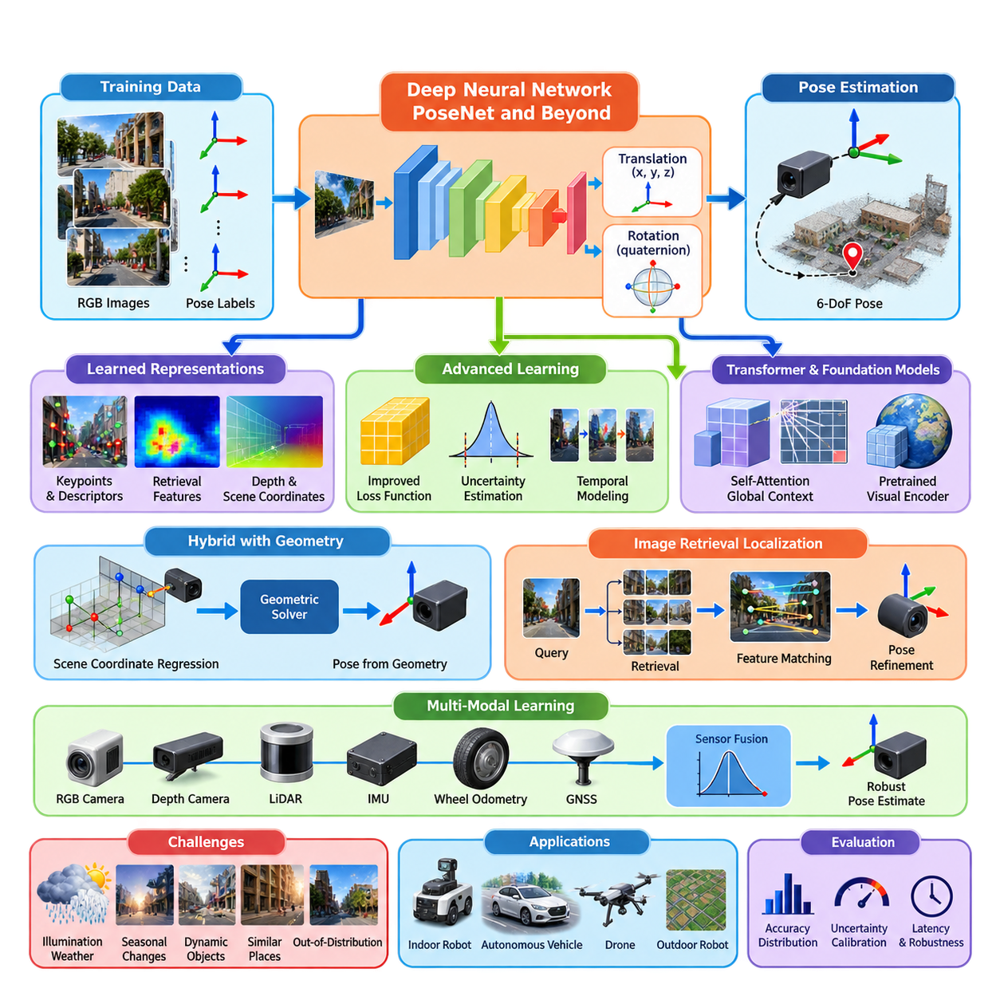
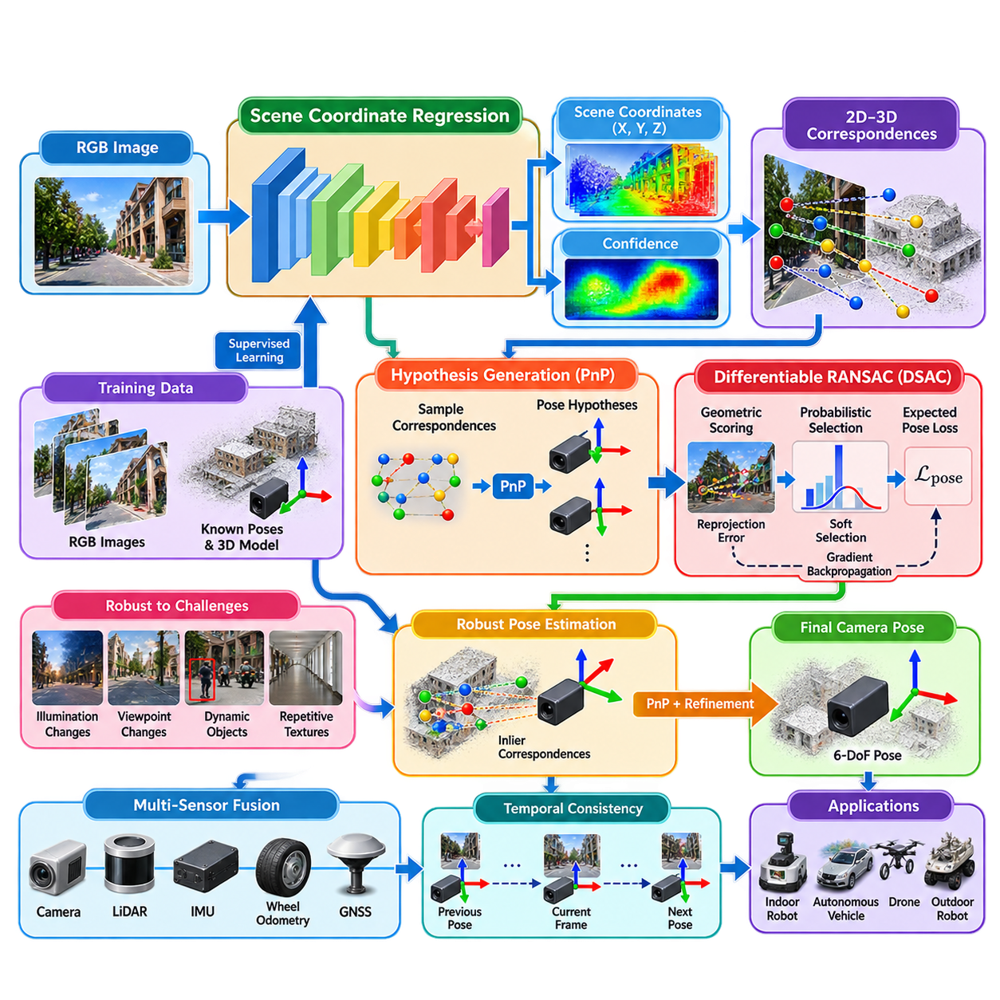
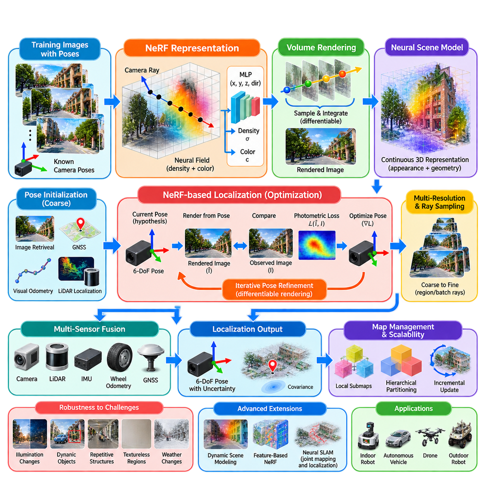
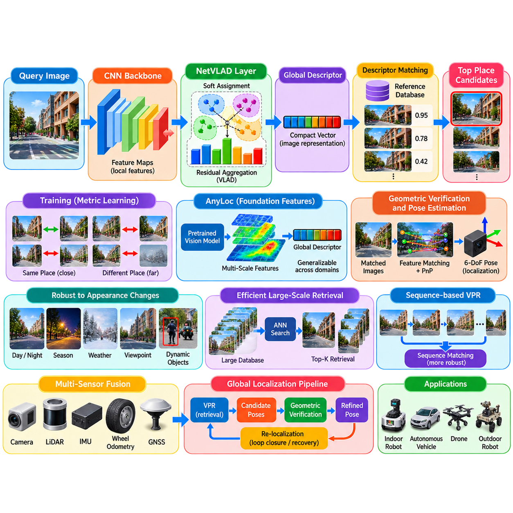
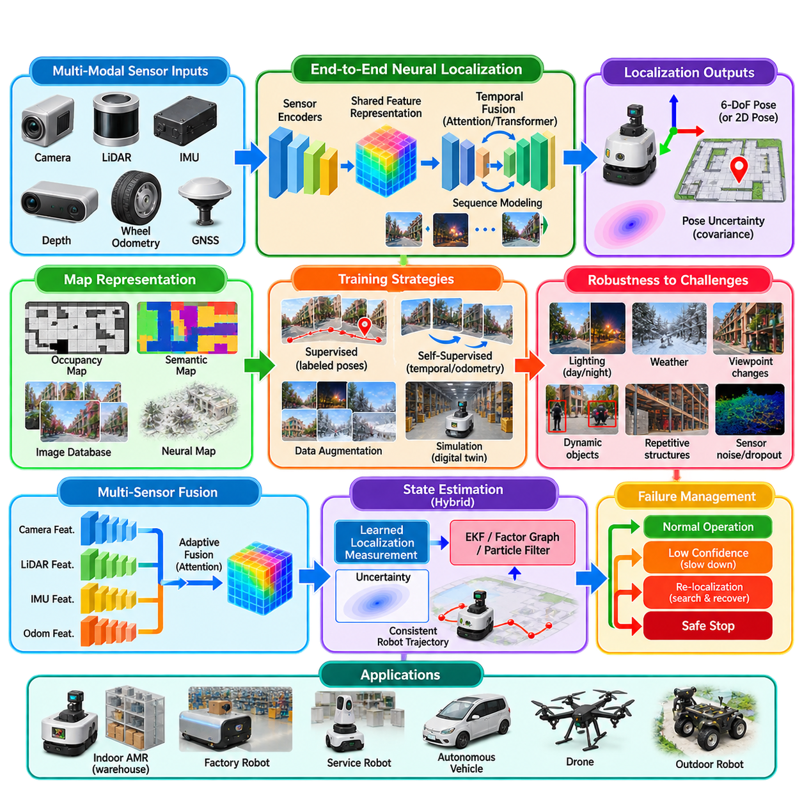
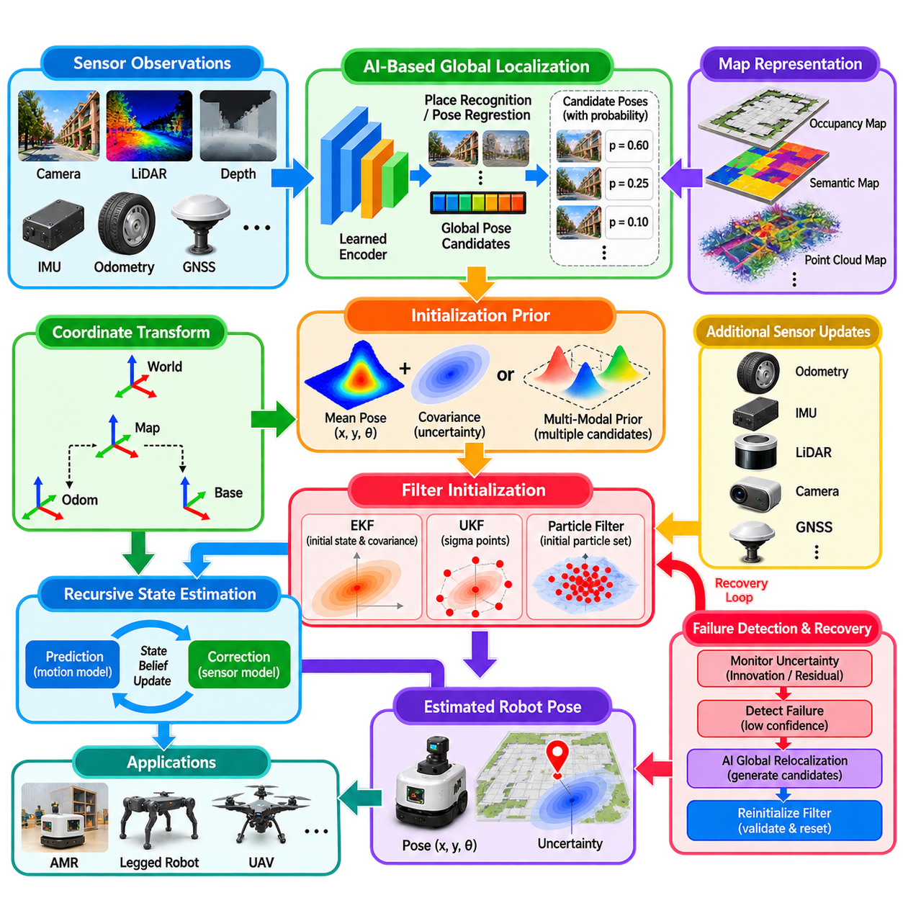
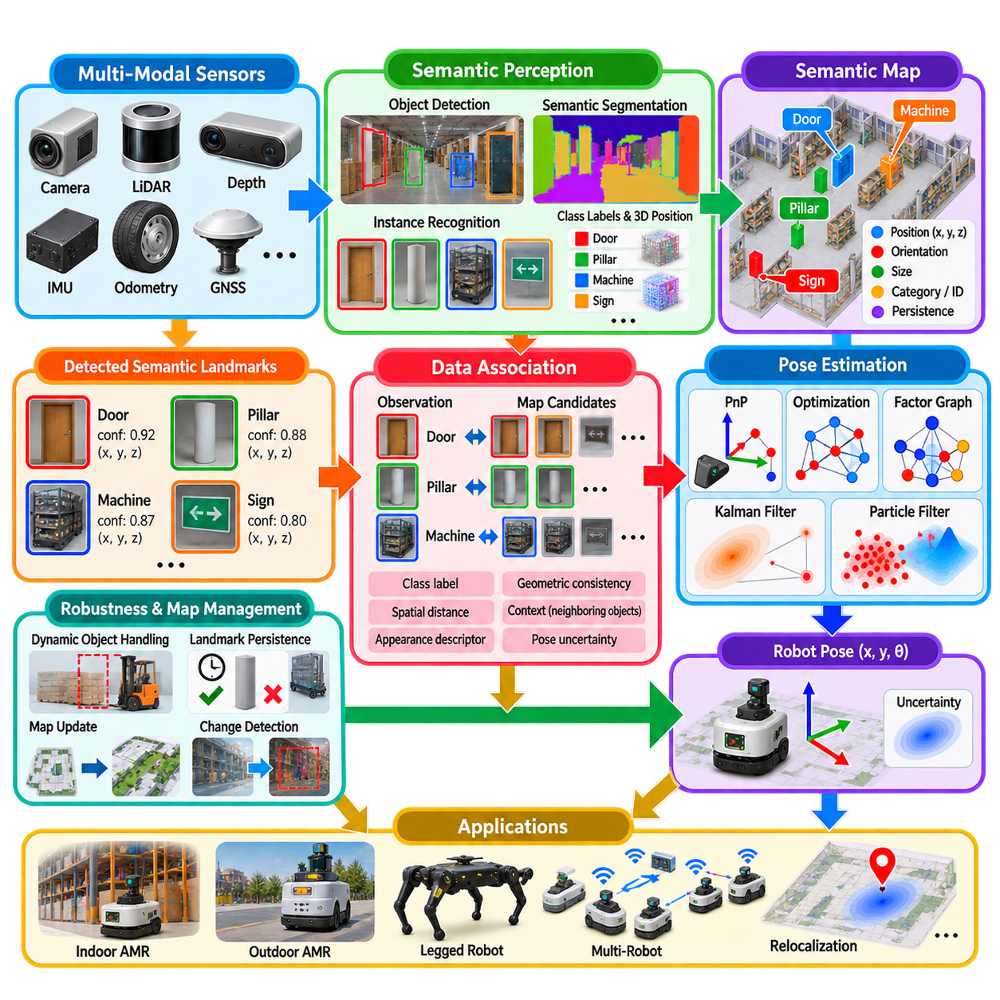
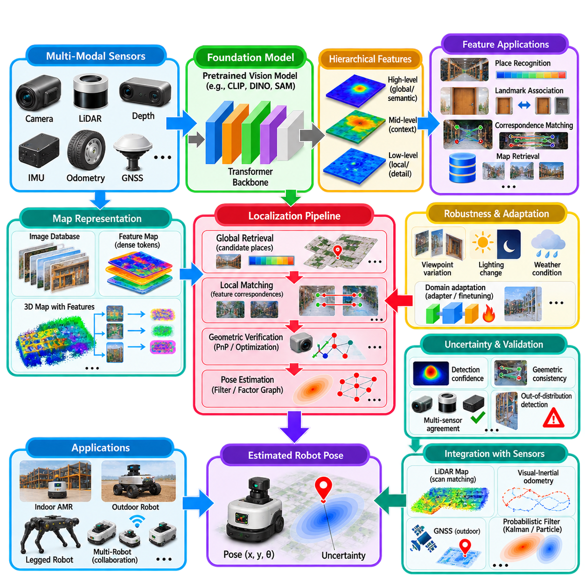
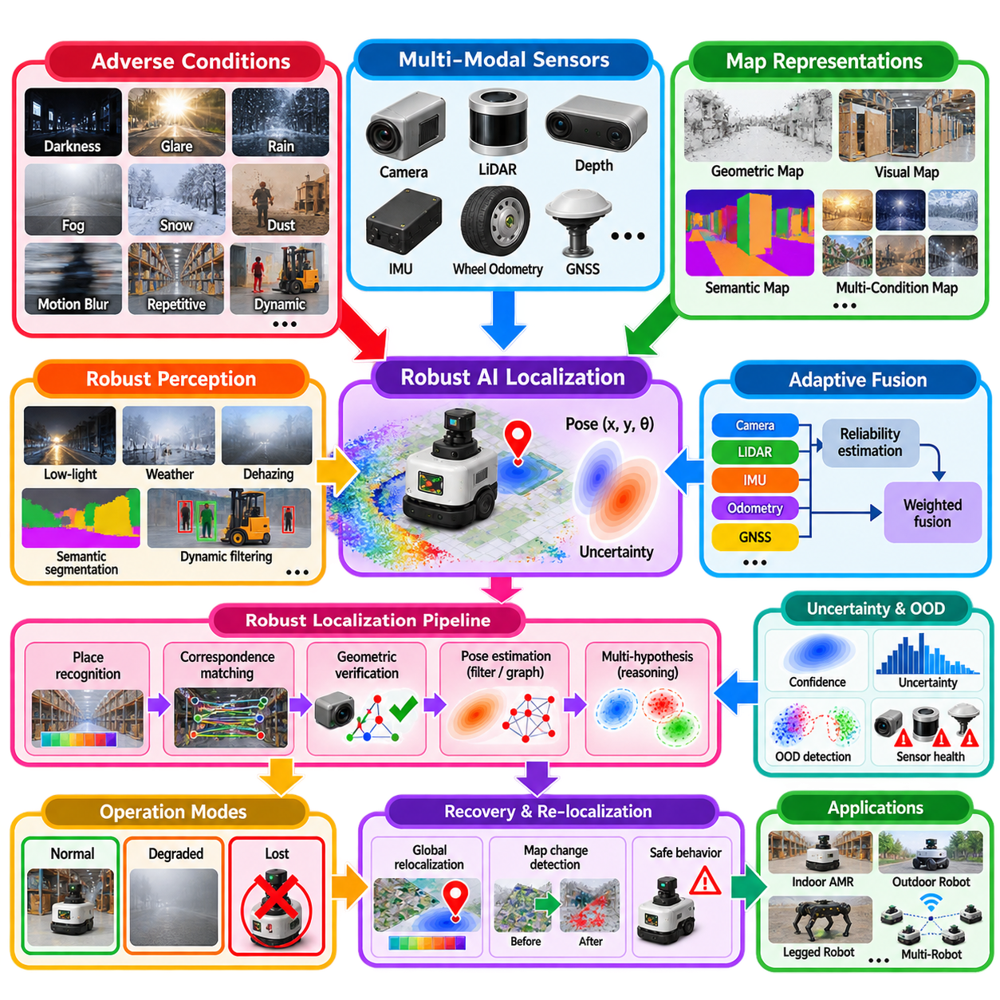
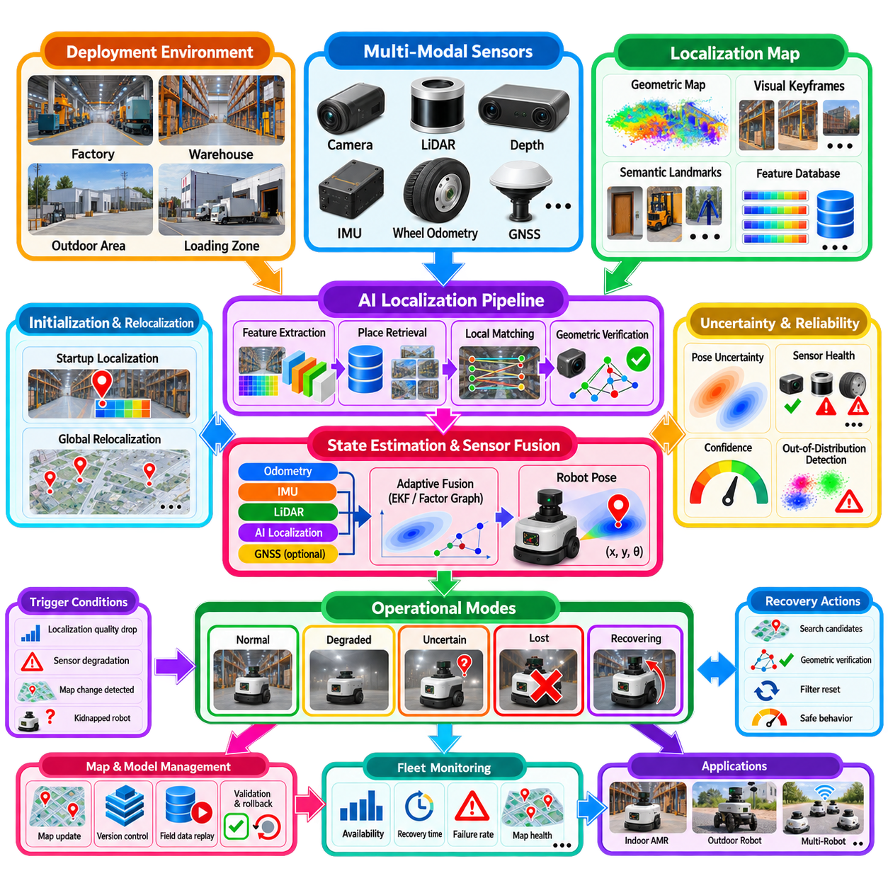

**Volume 13. Mapping Localization and SLAM**


# Chapter 11. AI Based Localization

##  

## 11.01. Deep Learning Localization PoseNet and Beyond [w/Code]

{width="7.268055555555556in" height="7.268055555555556in"}

Deep learning localization introduced a fundamentally different way to estimate robot or camera pose by learning the relationship between visual observations and spatial position directly from data. Instead of relying entirely on handcrafted feature detection, geometric matching, and iterative optimization, a neural network can learn representations that associate an input image with its six-degree-of-freedom pose in a known environment.

PoseNet was one of the influential demonstrations of this idea. It formulated camera relocalization as a supervised regression problem in which a convolutional neural network receives a single RGB image and predicts camera position and orientation. Training images are associated with known poses, allowing the network to learn visual patterns that distinguish different regions and viewpoints within the mapped environment.

The original PoseNet architecture was derived from a convolutional image-recognition network and modified so that its output represented spatial pose rather than object categories. Translation is typically represented by a three-dimensional position vector, while orientation can be expressed using a quaternion. A training objective combines translation and rotational errors so that both components contribute appropriately to learning the final camera pose.

This approach demonstrated an important conceptual shift from explicit geometric localization toward learned localization. Classical systems normally identify visual features, establish correspondences with a map, and calculate pose from geometric constraints. PoseNet instead compresses information about the environment into learned network parameters and produces a pose through inference, potentially simplifying the online localization pipeline.

The simplicity of direct pose regression is attractive for robotics because localization can theoretically be performed from a single image without executing a complete feature-matching pipeline. Once trained, inference has predictable computational characteristics and can operate on GPU-equipped edge computers. This makes neural localization relevant to mobile robots, autonomous vehicles, drones, and other platforms requiring rapid pose hypotheses.

However, direct pose regression does not eliminate the fundamental difficulty of localization. A network must distinguish locations that may look nearly identical while remaining robust when the same location appears different because of illumination, weather, seasonal variation, moving objects, or camera exposure. Localization therefore requires representations that preserve geometrically meaningful information while suppressing irrelevant visual changes.

Another limitation is generalization beyond the distribution represented by the training dataset. A model trained along particular trajectories may perform well near those observations but become inaccurate at unfamiliar viewpoints or previously unseen environmental conditions. Consequently, training coverage, viewpoint diversity, pose-label accuracy, and environmental variation strongly influence the practical reliability of learned localization systems.

Research beyond the original PoseNet progressively addressed weaknesses in network architecture and training objectives. Improved loss formulations learned or adjusted the relative weighting between translation and orientation rather than depending solely on manually selected coefficients. Other approaches incorporated geometric constraints, uncertainty estimation, temporal information, feature hierarchies, or additional sensor measurements to improve accuracy and robustness.

Bayesian extensions also highlighted the importance of localization uncertainty. A robot should not treat every neural pose prediction as equally trustworthy because ambiguous scenes, motion blur, occlusion, or observations outside the training distribution can produce unreliable estimates. Predictive uncertainty provides information that can be used by downstream estimators to reject, down-weight, or cautiously integrate uncertain localization measurements.

Temporal information provides another major improvement over independent single-image inference. Consecutive observations from a moving robot contain strong motion continuity, and recurrent or sequence-based architectures can exploit this relationship. Visual odometry information can also be combined with learned global localization so that relative motion constrains short-term movement while learned recognition helps recover globally consistent position.

Modern localization systems increasingly combine learning with geometry rather than treating them as competing alternatives. Neural networks can learn keypoints, descriptors, image retrieval representations, depth, correspondence confidence, or scene coordinates, while geometric algorithms retain responsibility for physically consistent pose estimation. This hybrid strategy often provides better interpretability and geometric precision than unrestricted end-to-end pose regression.

Scene-coordinate regression is an important example of this evolution. Instead of asking a network to directly predict the final camera pose, the model can estimate three-dimensional scene coordinates corresponding to image pixels or local features. Geometric solvers then determine the camera pose from these learned correspondences, allowing neural perception to provide robust associations while established geometry enforces spatial consistency.

Image-retrieval-based localization represents another complementary direction. A neural representation can identify reference images whose appearance or semantic content resembles the current observation. Candidate locations obtained through retrieval can then be refined using local feature matching and geometric verification. This coarse-to-fine architecture is particularly useful when localization must operate over environments larger than those practical for a single direct-regression model.

Transformer-based visual representations have further expanded the localization design space. Self-attention can model relationships among distant image regions and generate features containing broader contextual information than purely local convolutional processing. Large pretrained visual encoders can also transfer representations learned from extensive datasets, reducing dependence on training a localization feature extractor entirely from scratch.

Foundation-model representations create additional opportunities because localization can benefit from visual knowledge learned across diverse scenes and conditions. Nevertheless, general semantic understanding does not automatically provide metric localization accuracy. Robotics requires precise spatial relationships, repeatability, calibrated uncertainty, and predictable failure behavior, so pretrained representations normally require geometric adaptation or integration with metric estimation mechanisms.

Multi-modal learning extends localization beyond RGB images. Depth cameras, LiDAR, inertial measurement units, wheel odometry, and GNSS can provide complementary information when visual evidence becomes unreliable. Learned models may estimate cross-modal features or measurement confidence, while probabilistic fusion combines these observations according to their uncertainty and temporal characteristics.

For an indoor autonomous mobile robot, deep localization may provide global relocalization when repetitive corridors or temporary environmental changes weaken conventional feature matching. For an outdoor robot, learned visual representations may help recognize places despite lighting and seasonal changes. In both cases, the neural subsystem is most useful when integrated with odometry, inertial sensing, LiDAR, or other independent localization evidence.

Training data quality remains a central engineering requirement. Pose labels generated by inaccurate reference systems can place a hard limit on achievable performance because the network learns from those labels as ground truth. Dataset construction therefore requires careful synchronization, calibration, coordinate-frame management, trajectory coverage, and validation of reference poses, particularly when centimeter-level localization performance is expected.

Evaluation must also extend beyond average position and orientation error. Production systems should examine error distributions, worst-case behavior, recovery after localization loss, uncertainty calibration, computational latency, memory consumption, and performance under environmental changes. A model with excellent average accuracy may still be unsuitable for autonomous operation if occasional large errors cannot be detected before reaching the motion controller.

Deep localization should therefore be considered part of a localization architecture rather than an isolated replacement for every classical method. Learned representations are powerful for recognition and difficult visual variation, while geometric estimation provides metric constraints and probabilistic filtering provides temporal consistency. Sensor fusion adds redundancy that becomes essential when individual localization channels temporarily degrade.

The progression from PoseNet to contemporary learned and hybrid localization illustrates a broader development in robotics AI. Early systems demonstrated that neural networks could infer spatial pose directly from visual input, while subsequent research exposed the importance of geometry, uncertainty, temporal reasoning, and multi-sensor evidence. The resulting direction is increasingly toward architectures in which learning and physical estimation cooperate rather than compete.

For future autonomous systems, the strongest role of deep learning may therefore be adaptive spatial perception: determining which observations correspond, which locations are recognizable, which measurements are trustworthy, and how environmental appearance has changed. Combined with geometric optimization and state estimation, these capabilities can support localization systems that remain accurate, resilient, and operationally interpretable across increasingly complex environments.

딥러닝 위치추정(Deep Learning Localization)은 시각 관측(Visual Observation)과 공간적 위치(Spatial Position) 사이의 관계를 데이터로부터 직접 학습함으로써 로봇 또는 카메라의 자세(Pose)를 추정하는 근본적으로 다른 방법을 제시하였다. 수작업 특징 검출(Handcrafted Feature Detection), 기하학적 정합(Geometric Matching), 반복 최적화(Iterative Optimization)에 전적으로 의존하는 대신, 신경망(Neural Network)이 입력 영상과 알려진 환경 내 6자유도 자세(6-DoF Pose)의 관계를 학습할 수 있다.

포즈넷(PoseNet)은 이러한 개념을 보여준 대표적인 초기 연구 중 하나이다. 포즈넷은 카메라 재위치추정(Camera Relocalization)을 지도학습 회귀 문제(Supervised Regression Problem)로 정의하며, 합성곱 신경망(Convolutional Neural Network)이 하나의 RGB 영상을 입력받아 카메라의 위치(Position)와 방향(Orientation)을 예측한다. 학습 영상에는 알려진 자세 정보가 연결되어 있어 네트워크가 지도 환경 내 서로 다른 영역과 시점을 구별하는 시각 패턴을 학습할 수 있다.

초기 포즈넷(PoseNet) 구조는 합성곱 영상 인식 네트워크(Convolutional Image Recognition Network)를 기반으로 하며, 출력이 객체 분류(Object Category)가 아니라 공간 자세(Spatial Pose)를 나타내도록 수정되었다. 병진(Translation)은 일반적으로 3차원 위치 벡터(3D Position Vector)로 표현하고, 방향은 쿼터니언(Quaternion)을 이용해 표현할 수 있다. 학습 목적함수(Training Objective)는 병진 오차와 회전 오차를 결합하여 두 요소가 최종 카메라 자세 학습에 적절하게 반영되도록 한다.

이러한 접근법은 명시적 기하학적 위치추정(Explicit Geometric Localization)에서 학습 기반 위치추정(Learned Localization)으로 전환되는 중요한 개념적 변화를 보여주었다. 전통적인 시스템은 일반적으로 시각 특징(Visual Feature)을 식별하고 지도와의 대응 관계(Correspondence)를 설정한 다음 기하학적 제약(Geometric Constraint)을 이용해 자세를 계산한다. 반면 포즈넷은 환경 정보를 학습된 네트워크 파라미터(Network Parameter)에 압축하고 추론(Inference)을 통해 자세를 출력함으로써 온라인 위치추정 파이프라인을 단순화할 가능성을 제시한다.

직접 자세 회귀(Direct Pose Regression)의 단순한 구조는 로봇공학(Robotics)에서 매력적인 특성을 가진다. 이론적으로 하나의 영상만으로 완전한 특징 정합 파이프라인(Feature Matching Pipeline)을 실행하지 않고도 위치를 추정할 수 있기 때문이다. 학습이 완료되면 추론의 계산 특성이 비교적 예측 가능하며 GPU 기반 엣지 컴퓨터(Edge Computer)에서도 실행할 수 있다. 따라서 신경망 기반 위치추정은 이동로봇(Mobile Robot), 자율주행차(Autonomous Vehicle), 드론(Drone)과 같이 빠른 자세 가설(Pose Hypothesis)이 필요한 플랫폼에 적용할 수 있다.

그러나 직접 자세 회귀는 위치추정의 근본적인 어려움을 제거하지는 못한다. 네트워크는 매우 유사하게 보이는 장소들을 구별하면서도 조명, 날씨, 계절 변화, 이동 객체, 카메라 노출 등의 영향으로 동일한 장소가 서로 다르게 보이는 상황에서도 강건해야 한다. 따라서 위치추정에는 기하학적으로 의미 있는 정보를 유지하면서 관련성이 낮은 시각적 변화는 억제할 수 있는 표현(Representation)이 필요하다.

또 다른 한계는 학습 데이터셋(Training Dataset)이 나타내는 분포를 벗어난 상황에서의 일반화(Generalization) 성능이다. 특정 경로를 따라 수집된 데이터로 학습한 모델은 해당 관측 주변에서는 높은 성능을 보일 수 있지만, 익숙하지 않은 시점이나 학습 과정에서 경험하지 못한 환경 조건에서는 정확도가 저하될 수 있다. 따라서 학습 영역의 범위, 시점 다양성(Viewpoint Diversity), 자세 레이블 정확도(Pose Label Accuracy), 환경 변화의 다양성이 실제 학습 기반 위치추정 시스템의 신뢰성에 큰 영향을 미친다.

초기 포즈넷 이후의 연구에서는 네트워크 구조와 학습 목적함수의 약점을 지속적으로 개선하였다. 향상된 손실함수(Loss Function)는 병진과 방향 사이의 상대적인 가중치를 사람이 고정된 값으로 지정하는 대신 학습 과정에서 조정하거나 학습할 수 있도록 발전하였다. 다른 연구들은 정확도와 강건성을 높이기 위해 기하학적 제약, 불확실성 추정(Uncertainty Estimation), 시간 정보(Temporal Information), 특징 계층(Feature Hierarchy), 추가적인 센서 측정값을 통합하였다.

베이지안 확장(Bayesian Extension)은 위치추정 불확실성(Localization Uncertainty)의 중요성도 부각시켰다. 모호한 장면, 모션 블러(Motion Blur), 가림(Occlusion), 학습 분포 밖의 관측(Out-of-Distribution Observation)은 신뢰하기 어려운 결과를 발생시킬 수 있기 때문에 로봇이 모든 신경망 자세 예측을 동일하게 신뢰해서는 안 된다. 예측 불확실성(Predictive Uncertainty)은 후단 추정기(Downstream Estimator)가 신뢰도가 낮은 위치 측정값을 제거하거나 가중치를 낮추거나 보수적으로 통합할 수 있도록 정보를 제공한다.

시간 정보(Temporal Information)를 활용하는 것은 독립적인 단일 영상 추론보다 성능을 향상시키는 또 다른 중요한 방법이다. 움직이는 로봇에서 연속적으로 획득되는 관측에는 강한 운동 연속성(Motion Continuity)이 존재하며, 순환 신경망(Recurrent Network) 또는 시퀀스 기반 구조(Sequence-Based Architecture)는 이러한 관계를 활용할 수 있다. 시각 주행거리계(Visual Odometry) 정보와 학습 기반 전역 위치추정(Global Localization)을 결합하면 상대 운동이 단기적인 이동을 제한하는 동시에 학습 기반 인식이 전역적으로 일관된 위치를 복원하는 데 도움을 줄 수 있다.

현대의 위치추정 시스템은 학습과 기하학을 서로 경쟁하는 기술로 취급하기보다 두 기술을 결합하는 방향으로 발전하고 있다. 신경망은 키포인트(Keypoint), 디스크립터(Descriptor), 영상 검색 표현(Image Retrieval Representation), 깊이(Depth), 대응 관계 신뢰도(Correspondence Confidence), 장면 좌표(Scene Coordinate)를 학습할 수 있으며, 물리적으로 일관된 자세 추정은 기하학적 알고리즘이 담당할 수 있다. 이러한 하이브리드 전략(Hybrid Strategy)은 제약이 없는 종단간 자세 회귀(End-to-End Pose Regression)보다 높은 해석 가능성과 기하학적 정밀도를 제공하는 경우가 많다.

장면 좌표 회귀(Scene Coordinate Regression)는 이러한 발전을 보여주는 중요한 사례이다. 네트워크에 최종 카메라 자세를 직접 예측하도록 요구하는 대신, 모델이 영상 픽셀 또는 국부 특징(Local Feature)에 대응하는 3차원 장면 좌표를 추정하도록 구성할 수 있다. 이후 기하학적 솔버(Geometric Solver)가 학습된 대응 관계로부터 카메라 자세를 계산함으로써 신경망 인식은 강건한 대응 관계를 제공하고 기존의 기하학은 공간적 일관성을 유지할 수 있다.

영상 검색 기반 위치추정(Image-Retrieval-Based Localization)은 또 다른 상호보완적인 발전 방향이다. 신경망 표현(Neural Representation)을 사용하여 현재 관측과 외관 또는 의미 정보가 유사한 참조 영상(Reference Image)을 식별할 수 있다. 검색을 통해 후보 위치를 얻은 다음 국부 특징 정합(Local Feature Matching)과 기하학적 검증(Geometric Verification)을 통해 위치를 정밀하게 보정할 수 있다. 이러한 거친 단계에서 정밀 단계로 진행하는 구조(Coarse-to-Fine Architecture)는 단일 직접 회귀 모델이 처리하기 어려운 대규모 환경의 위치추정에 특히 유용하다.

트랜스포머 기반 시각 표현(Transformer-Based Visual Representation)은 위치추정의 설계 공간을 더욱 확장하였다. 자기주의(Self-Attention)는 영상에서 멀리 떨어진 영역 사이의 관계를 모델링할 수 있으며, 순수하게 국부적인 합성곱 처리보다 넓은 문맥 정보(Contextual Information)를 포함하는 특징을 생성할 수 있다. 또한 대규모 사전학습 시각 인코더(Pretrained Visual Encoder)를 활용하면 광범위한 데이터셋에서 학습한 표현을 전이할 수 있어 위치추정 특징 추출기(Localization Feature Extractor)를 완전히 처음부터 학습해야 하는 의존성을 줄일 수 있다.

파운데이션 모델 표현(Foundation Model Representation)은 다양한 장면과 조건에서 학습된 시각 지식을 위치추정에 활용할 수 있다는 점에서 추가적인 가능성을 제공한다. 그러나 일반적인 의미 이해(Semantic Understanding)가 자동으로 미터법 위치추정 정확도(Metric Localization Accuracy)를 제공하는 것은 아니다. 로봇공학에서는 정밀한 공간 관계, 반복성(Repeatability), 보정된 불확실성(Calibrated Uncertainty), 예측 가능한 고장 거동(Failure Behavior)이 필요하므로 사전학습 표현은 일반적으로 기하학적 적응(Geometric Adaptation) 또는 미터법 추정 메커니즘과의 통합이 필요하다.

다중 모달 학습(Multi-Modal Learning)은 위치추정 기술을 RGB 영상의 범위를 넘어 확장한다. 깊이 카메라(Depth Camera), 라이다(LiDAR), 관성측정장치(Inertial Measurement Unit), 휠 오도메트리(Wheel Odometry), 위성항법시스템(GNSS)은 시각 정보의 신뢰도가 떨어지는 상황에서 상호보완적인 정보를 제공할 수 있다. 학습 모델은 센서 간 특징(Cross-Modal Feature)이나 측정 신뢰도를 추정하고, 확률적 융합(Probabilistic Fusion)은 각 센서의 불확실성과 시간적 특성을 고려하여 관측값을 통합할 수 있다.

실내 자율이동로봇(Indoor Autonomous Mobile Robot)에서는 반복적인 복도 구조나 일시적인 환경 변화로 기존 특징 정합의 성능이 저하될 때 딥러닝 기반 위치추정이 전역 재위치추정(Global Relocalization)을 제공할 수 있다. 실외 로봇에서는 학습된 시각 표현이 조명과 계절이 변하더라도 장소를 인식하는 데 도움을 줄 수 있다. 두 경우 모두 신경망 서브시스템은 오도메트리, 관성 센싱(Inertial Sensing), 라이다 또는 다른 독립적인 위치추정 정보와 통합될 때 가장 효과적으로 활용될 수 있다.

학습 데이터 품질(Training Data Quality)은 여전히 핵심적인 엔지니어링 요구사항이다. 부정확한 기준 시스템(Reference System)이 생성한 자세 레이블은 네트워크가 이를 정답(Ground Truth)으로 학습하기 때문에 달성 가능한 성능의 상한을 제한할 수 있다. 따라서 센티미터 수준의 위치추정 성능이 요구되는 경우 데이터셋 구축 과정에서 정확한 시간 동기화(Time Synchronization), 센서 보정(Calibration), 좌표계 관리(Coordinate-Frame Management), 주행 경로 범위(Trajectory Coverage), 기준 자세 검증이 필요하다.

평가(Evaluation) 역시 평균적인 위치 오차와 방향 오차만을 측정하는 수준을 넘어야 한다. 실제 제품 시스템에서는 오차 분포(Error Distribution), 최악 조건의 거동(Worst-Case Behavior), 위치추정 손실 이후의 복구 성능, 불확실성 보정(Uncertainty Calibration), 계산 지연시간(Computational Latency), 메모리 사용량, 환경 변화 조건에서의 성능을 함께 검증해야 한다. 평균 정확도가 우수하더라도 간헐적으로 발생하는 큰 오차를 모션 제어기(Motion Controller)에 전달되기 전에 탐지하지 못한다면 자율 시스템에 적용하기 어렵다.

따라서 딥러닝 위치추정은 모든 전통적 방법을 대체하는 독립적인 기술이라기보다 전체 위치추정 아키텍처(Localization Architecture)의 구성요소로 이해하는 것이 적절하다. 학습된 표현은 장소 인식과 복잡한 시각 변화에 강점을 가지며, 기하학적 추정(Geometric Estimation)은 미터법 제약을 제공하고 확률적 필터링(Probabilistic Filtering)은 시간적 일관성을 유지한다. 여기에 센서 융합(Sensor Fusion)을 추가하면 개별 위치추정 채널의 성능이 일시적으로 저하될 때 필요한 시스템 중복성(Redundancy)을 확보할 수 있다.

포즈넷에서 현대의 학습 및 하이브리드 위치추정(Learned and Hybrid Localization)으로 이어지는 발전은 로봇 인공지능(Robotics AI)의 보다 광범위한 기술적 변화를 보여준다. 초기 시스템은 신경망이 시각 입력으로부터 공간 자세를 직접 추론할 수 있음을 입증했으며, 이후 연구를 통해 기하학, 불확실성, 시간적 추론(Temporal Reasoning), 다중 센서 정보의 중요성이 확인되었다. 그 결과 현재의 기술 방향은 학습과 물리적 추정(Physical Estimation)이 서로 경쟁하는 것이 아니라 상호 협력하는 아키텍처로 발전하고 있다.

미래의 자율 시스템에서 딥러닝의 가장 중요한 역할은 적응형 공간 인식(Adaptive Spatial Perception)이 될 가능성이 높다. 어떤 관측들이 서로 대응하는지, 어떤 장소를 인식할 수 있는지, 어떤 측정값을 신뢰할 수 있는지, 환경의 외관이 어떻게 변화했는지를 판단하는 것이 핵심이다. 이러한 능력을 기하학적 최적화(Geometric Optimization) 및 상태 추정(State Estimation)과 결합하면 복잡하고 변화하는 환경에서도 정확성, 강건성(Robustness), 운용 해석 가능성(Operational Interpretability)을 유지하는 위치추정 시스템을 구축할 수 있다.

##  

## 11.02. Scene Coordinate Regression DSAC Methods [w/Code]

{width="7.268055555555556in" height="7.268055555555556in"}

Scene Coordinate Regression (SCR) is a learning-based localization approach that predicts the three-dimensional position of observed image elements directly in a known scene coordinate system. Instead of regressing the final camera pose from an entire image, the network establishes dense or sparse correspondences between two-dimensional image locations and three-dimensional scene points, allowing geometric algorithms to recover the camera pose from learned spatial evidence.

The fundamental representation can be expressed as a mapping from an image pixel or local image feature to a 3D coordinate defined in the reference map. During training, the model observes images with known camera poses and scene geometry, learning which visual patterns correspond to particular locations in physical space. At inference time, these predicted scene coordinates become 2D-to-3D correspondences that constrain the unknown camera pose.

This formulation separates visual recognition from geometric pose estimation. A neural network performs the difficult perceptual task of predicting where image observations belong in the mapped environment, while established geometric methods enforce the projective relationships between the predicted 3D points and their observed 2D positions. The resulting architecture combines learned representations with explicit camera geometry rather than asking a network to learn the entire localization transformation implicitly.

Camera pose can be recovered from predicted correspondences using Perspective-n-Point (PnP) methods. Given camera intrinsic parameters and a sufficient set of 2D image observations associated with 3D scene coordinates, PnP estimates the rotation and translation that best explain those correspondences. In realistic environments, however, neural predictions inevitably contain incorrect or noisy correspondences, making robust hypothesis generation and selection essential.

RANSAC is traditionally used to address this problem. It repeatedly selects small correspondence subsets, generates candidate pose hypotheses, and evaluates how many observations agree with each hypothesis. Incorrect correspondences can therefore be rejected as outliers while a pose supported by geometrically consistent observations is retained. This provides strong robustness but introduces discrete operations that are difficult to integrate directly into end-to-end neural-network training.

Differentiable RANSAC concepts were developed to bridge this gap between robust geometric estimation and learning. DSAC, or Differentiable Sample Consensus, replaces the conventional hard selection of the single best hypothesis with a probabilistic selection mechanism. Candidate hypotheses receive scores according to their geometric consistency, and a probability distribution over those hypotheses allows the expected task loss to influence the learning process.

This probabilistic treatment is important because the final localization objective can propagate information back toward the scene-coordinate predictor. Instead of training the network only to minimize independent coordinate errors, DSAC allows learning to consider how coordinate predictions ultimately affect camera pose estimation. Predictions that contribute effectively to accurate pose hypotheses can therefore be reinforced according to their usefulness for the complete localization task.

A typical DSAC localization pipeline begins with an RGB image and a convolutional or related feature extractor. The network predicts a scene coordinate for many image locations, after which small correspondence subsets are sampled to generate pose hypotheses through PnP. Each hypothesis is evaluated against a larger set of correspondences, producing a score that reflects how consistently the predicted pose explains the available image-to-scene relationships.

The scoring stage provides a bridge between neural prediction and geometric verification. A strong hypothesis should reproject predicted 3D scene points close to their corresponding image observations, whereas an incorrect pose produces larger reprojection errors. These residuals can be transformed into hypothesis scores, enabling the system to distinguish geometrically plausible camera configurations from hypotheses generated by erroneous scene-coordinate predictions.

DSAC differs conceptually from conventional RANSAC because hard winner-take-all hypothesis selection prevents straightforward differentiation. By interpreting hypothesis selection probabilistically, DSAC can optimize an expected pose loss over possible hypotheses. Training therefore reflects not only whether individual scene coordinates are numerically close to reference coordinates, but also whether the resulting correspondence structure supports reliable camera localization.

Later developments such as DSAC++ further refined this concept and demonstrated that accurate camera relocalization could be learned with increasingly integrated pipelines. Improvements addressed training procedures, coordinate prediction, hypothesis scoring, and pose refinement. These methods helped establish scene coordinate regression as an important alternative to both direct pose regression and traditional feature-based localization pipelines.

One major advantage of SCR is that it retains an explicit geometric interpretation. Every predicted scene coordinate represents a proposed physical correspondence between an image observation and the mapped environment. This makes the localization process more structurally constrained than unrestricted direct pose regression and provides intermediate quantities that can be inspected, geometrically validated, rejected, or refined before the final pose is accepted.

Scene coordinate predictions also provide spatial redundancy. A single image can generate many candidate correspondences distributed across visible regions, so localization does not depend entirely on one global network output. If some predictions are corrupted by moving objects, reflections, occlusion, texture ambiguity, or perceptual noise, robust sampling can still recover a correct pose when enough geometrically consistent correspondences remain.

Nevertheless, SCR systems face significant challenges in repetitive or weakly textured environments. Similar visual patterns may correspond to different physical positions, creating ambiguous coordinate predictions. Large viewpoint changes, illumination variations, dynamic objects, and environmental modifications can further degrade correspondence quality. Robust training data and mechanisms for estimating confidence are therefore important when transferring SCR from controlled benchmarks to production robots.

The representation of scene geometry also affects scalability. A model trained to predict coordinates within one mapped environment effectively learns scene-specific spatial information. Extending localization across large buildings, campuses, factories, or outdoor regions may require hierarchical localization, map partitioning, compact scene representations, or mechanisms capable of selecting the relevant spatial model before precise coordinate regression is performed.

Uncertainty can be incorporated at several stages of the pipeline. The network may predict confidence associated with scene coordinates, while geometric residuals provide another indication of correspondence reliability. Hypothesis scores can represent global consistency, and the final pose estimator can expose uncertainty to downstream state estimation. These signals are especially valuable when localization is integrated into a safety-critical autonomous system.

Temporal consistency offers another opportunity for improvement. Standard SCR can estimate pose independently from each frame, but a moving robot naturally generates a sequence of related observations. Visual odometry, IMU integration, wheel odometry, or motion models can constrain successive poses and reject sudden localization jumps. SCR can then function as an absolute localization source within a broader state-estimation architecture.

For indoor AMRs, scene-coordinate localization can complement LiDAR-based localization when visual landmarks provide information unavailable from repetitive geometric structures. In factories and warehouses, however, shelves, pallets, equipment, and temporary obstacles may change frequently. The localization architecture should therefore distinguish persistent structural evidence from transient objects rather than assuming that every visually recognizable feature belongs permanently to the static map.

Outdoor robots introduce additional difficulties because sunlight, shadows, rain, vegetation, seasonal appearance, and large operating areas increase visual variability. Learned scene coordinates may still provide valuable global localization or recovery information, but they are usually stronger when combined with GNSS, IMU, LiDAR, or visual-inertial odometry. Multi-sensor redundancy prevents a temporary failure of scene-coordinate prediction from becoming a complete localization failure.

Calibration remains fundamental because the geometric solver assumes a relationship between image measurements and camera rays. Errors in focal length, principal point, distortion correction, sensor mounting, or synchronization can introduce systematic pose errors even when the learned correspondences are good. Production deployment therefore requires camera calibration and coordinate-frame management to be treated as part of the localization system rather than as isolated preprocessing steps.

Evaluation of SCR and DSAC-based systems should include more than median translation and rotation accuracy. Important characteristics include pose success rate, tail-error distribution, robustness to viewpoint and illumination changes, recovery after tracking loss, correspondence quality, inference latency, hypothesis-processing cost, and failure detection. A robot must know when localization is unreliable, not merely achieve high accuracy on typical benchmark images.

Modern hardware makes these hybrid pipelines increasingly practical at the edge. Neural scene-coordinate prediction can execute on a GPU or AI accelerator, while PnP, hypothesis scoring, and pose refinement can run concurrently or sequentially within a bounded localization cycle. Efficient implementations can adjust image resolution, feature density, hypothesis count, and refinement complexity according to available compute resources and required localization frequency.

The deeper significance of DSAC is its demonstration that classical geometric reasoning can become an integral component of a trainable learning system. Instead of replacing robust estimation with a neural network, differentiable sample consensus connects learned perception to geometric hypothesis testing. This principle extends beyond camera localization to other robotics problems in which uncertain neural predictions must satisfy physical or geometric constraints.

Scene Coordinate Regression and DSAC methods therefore represent an important middle ground between classical localization and end-to-end deep pose regression. Neural networks learn difficult image-to-scene associations, robust sampling manages incorrect predictions, geometric solvers enforce camera constraints, and differentiable training connects these components to the final pose objective. The result is a localization architecture that combines data-driven perception with explicit spatial reasoning and robust estimation.

장면 좌표 회귀(Scene Coordinate Regression, SCR)는 관측된 영상 요소의 3차원 위치를 알려진 장면 좌표계(Scene Coordinate System)에서 직접 예측하는 학습 기반 위치추정(Learning-Based Localization) 방법이다. 전체 영상으로부터 최종 카메라 자세(Camera Pose)를 직접 회귀하는 대신, 네트워크가 2차원 영상 위치와 3차원 장면 점(Scene Point) 사이의 조밀하거나 희소한 대응 관계(Correspondence)를 구성하고, 학습된 공간 정보를 이용하여 기하학적 알고리즘이 카메라 자세를 복원하도록 한다.

기본적인 표현 방식은 영상 픽셀(Image Pixel) 또는 국부 영상 특징(Local Image Feature)을 기준 지도(Reference Map)에 정의된 3차원 좌표로 매핑하는 형태로 설명할 수 있다. 학습 과정에서 모델은 알려진 카메라 자세와 장면 기하(Scene Geometry)를 가진 영상을 관측하면서 특정 시각 패턴이 물리적 공간의 어느 위치에 대응하는지를 학습한다. 추론 단계에서는 예측된 장면 좌표가 2D-3D 대응 관계(2D-to-3D Correspondence)를 형성하여 알려지지 않은 카메라 자세를 제약한다.

이러한 구성은 시각 인식(Visual Recognition)과 기하학적 자세 추정(Geometric Pose Estimation)을 분리한다. 신경망(Neural Network)은 영상 관측이 지도 환경의 어느 위치에 속하는지를 예측하는 어려운 인지 작업을 수행하고, 기존의 기하학적 방법은 예측된 3차원 점과 관측된 2차원 위치 사이의 투영 관계(Projective Relationship)를 강제한다. 따라서 전체 위치추정 변환을 신경망이 암묵적으로 학습하도록 하는 대신 학습된 표현과 명시적인 카메라 기하(Camera Geometry)를 결합할 수 있다.

카메라 자세는 예측된 대응 관계를 이용하여 투시 n점(Perspective-n-Point, PnP) 방법으로 복원할 수 있다. 카메라 내부 파라미터(Camera Intrinsic Parameter)가 알려져 있고 충분한 수의 2차원 영상 관측과 3차원 장면 좌표가 대응되면 PnP는 이러한 대응 관계를 가장 잘 설명하는 회전(Rotation)과 병진(Translation)을 추정한다. 그러나 실제 환경에서는 신경망 예측에 잘못되거나 노이즈가 포함된 대응 관계가 존재하므로 강건한 가설 생성(Hypothesis Generation)과 선택이 필수적이다.

랜덤 샘플 합의(Random Sample Consensus, RANSAC)는 전통적으로 이러한 문제를 해결하기 위해 사용된다. RANSAC은 작은 대응 관계 부분집합을 반복적으로 선택하여 후보 자세 가설(Pose Hypothesis)을 생성하고, 각 가설에 얼마나 많은 관측이 일치하는지를 평가한다. 이를 통해 잘못된 대응 관계를 이상치(Outlier)로 제거하고 기하학적으로 일관된 관측의 지지를 받는 자세를 선택할 수 있다. 하지만 이러한 이산 연산(Discrete Operation)은 종단간 신경망 학습(End-to-End Neural Network Training)에 직접 통합하기 어렵다.

미분 가능한 RANSAC(Differentiable RANSAC) 개념은 강건한 기하학적 추정과 학습 사이의 이러한 간극을 연결하기 위해 개발되었다. 미분 가능한 샘플 합의(Differentiable Sample Consensus, DSAC)는 기존 방식처럼 가장 우수한 단일 가설을 강제로 선택하는 대신 확률적 선택 메커니즘(Probabilistic Selection Mechanism)을 사용한다. 후보 가설들은 기하학적 일관성에 따라 점수를 받고, 가설에 대한 확률분포를 이용하여 기대 작업 손실(Expected Task Loss)이 학습 과정에 영향을 미치도록 한다.

이러한 확률적 처리는 최종 위치추정 목표의 정보가 장면 좌표 예측기(Scene Coordinate Predictor) 방향으로 역전파될 수 있다는 점에서 중요하다. 네트워크를 개별 좌표 오차만 최소화하도록 학습하는 대신, DSAC는 좌표 예측이 궁극적으로 카메라 자세 추정에 어떠한 영향을 미치는지를 학습 과정에서 고려할 수 있도록 한다. 따라서 정확한 자세 가설 생성에 효과적으로 기여하는 예측은 전체 위치추정 작업에 대한 유용성에 따라 강화될 수 있다.

일반적인 DSAC 위치추정 파이프라인은 RGB 영상과 합성곱 신경망(Convolutional Neural Network) 또는 관련 특징 추출기(Feature Extractor)에서 시작한다. 네트워크는 다수의 영상 위치에 대한 장면 좌표를 예측하고, 이후 작은 대응 관계 부분집합을 샘플링하여 PnP를 통해 자세 가설을 생성한다. 각각의 가설은 더 많은 대응 관계를 기준으로 평가되며, 예측된 자세가 영상과 장면 사이의 관계를 얼마나 일관되게 설명하는지를 나타내는 점수(Hypothesis Score)를 생성한다.

점수화 단계(Scoring Stage)는 신경망 예측과 기하학적 검증(Geometric Verification)을 연결한다. 올바른 가설은 예측된 3차원 장면 점을 대응되는 영상 관측 위치 가까이에 재투영(Reprojection)해야 하지만, 잘못된 자세에서는 더 큰 재투영 오차(Reprojection Error)가 발생한다. 이러한 잔차(Residual)를 가설 점수로 변환하면 시스템은 기하학적으로 타당한 카메라 구성과 잘못된 장면 좌표 예측에서 생성된 가설을 구별할 수 있다.

DSAC는 승자 독식 방식(Winner-Take-All)의 가설 선택을 사용하지 않는다는 점에서 기존 RANSAC과 개념적으로 다르다. 강제적인 단일 가설 선택은 직접적인 미분을 어렵게 하지만, DSAC는 가설 선택을 확률적으로 해석하여 가능한 가설 전체에 대한 기대 자세 손실(Expected Pose Loss)을 최적화할 수 있다. 따라서 학습은 개별 장면 좌표가 기준 좌표에 얼마나 가까운지만 평가하는 것이 아니라, 생성된 대응 구조가 신뢰할 수 있는 카메라 위치추정을 지원하는지도 함께 고려한다.

이후 개발된 DSAC++와 같은 방법은 이러한 개념을 더욱 개선하고 보다 통합된 파이프라인을 통해 높은 정확도의 카메라 재위치추정(Camera Relocalization)을 학습할 수 있음을 보여주었다. 학습 절차, 좌표 예측, 가설 점수화, 자세 정제(Pose Refinement) 등이 개선되었으며, 이러한 연구를 통해 장면 좌표 회귀는 직접 자세 회귀(Direct Pose Regression)와 전통적인 특징 기반 위치추정(Feature-Based Localization)을 연결하는 중요한 대안으로 자리 잡았다.

SCR의 주요 장점 중 하나는 명시적인 기하학적 해석(Geometric Interpretation)을 유지한다는 것이다. 예측된 각각의 장면 좌표는 영상 관측과 지도 환경 사이의 물리적 대응 관계를 의미한다. 따라서 제약이 없는 직접 자세 회귀보다 위치추정 과정이 구조적으로 제한되며, 최종 자세를 채택하기 전에 검사하거나 기하학적으로 검증하고 제거하거나 정제할 수 있는 중간 정보(Intermediate Quantity)를 제공한다.

장면 좌표 예측은 공간적 중복성(Spatial Redundancy)도 제공한다. 하나의 영상에서 가시 영역 전체에 분포된 다수의 후보 대응 관계를 생성할 수 있으므로 위치추정이 하나의 전역 네트워크 출력(Global Network Output)에 전적으로 의존하지 않는다. 일부 예측이 이동 객체, 반사, 가림(Occlusion), 텍스처 모호성(Texture Ambiguity), 인지 노이즈(Perceptual Noise)에 의해 손상되더라도 충분한 수의 기하학적으로 일관된 대응 관계가 남아 있다면 강건한 샘플링을 통해 올바른 자세를 복원할 수 있다.

그러나 SCR 시스템은 반복적인 환경이나 텍스처가 부족한 환경에서 상당한 어려움을 겪는다. 유사한 시각 패턴이 서로 다른 물리적 위치에 대응할 수 있기 때문에 모호한 좌표 예측이 발생할 수 있다. 큰 시점 변화(Viewpoint Change), 조명 변화, 동적 객체(Dynamic Object), 환경 구조 변경 역시 대응 관계의 품질을 저하시킬 수 있다. 따라서 SCR을 통제된 벤치마크 환경에서 실제 로봇으로 확장하려면 강건한 학습 데이터와 신뢰도 추정(Confidence Estimation) 메커니즘이 중요하다.

장면 기하의 표현 방식은 시스템의 확장성(Scalability)에도 영향을 준다. 하나의 지도 환경에서 좌표를 예측하도록 학습된 모델은 사실상 해당 장면에 특화된 공간 정보를 학습한다. 대형 건물, 캠퍼스, 공장 또는 실외 영역으로 위치추정을 확장하려면 계층적 위치추정(Hierarchical Localization), 지도 분할(Map Partitioning), 압축된 장면 표현(Compact Scene Representation), 또는 정밀 좌표 회귀를 수행하기 전에 적절한 공간 모델을 선택할 수 있는 메커니즘이 필요할 수 있다.

불확실성(Uncertainty)은 파이프라인의 여러 단계에 통합할 수 있다. 네트워크는 장면 좌표와 함께 신뢰도(Confidence)를 예측할 수 있으며, 기하학적 잔차는 대응 관계의 신뢰성을 판단하는 또 다른 지표를 제공한다. 가설 점수는 전체적인 기하학적 일관성을 나타낼 수 있고, 최종 자세 추정기는 후단 상태 추정(State Estimation)에 불확실성 정보를 전달할 수 있다. 이러한 신호는 특히 안전 중요 자율 시스템(Safety-Critical Autonomous System)에 위치추정을 통합할 때 중요하다.

시간적 일관성(Temporal Consistency)을 활용하면 추가적인 성능 향상을 얻을 수 있다. 기본적인 SCR은 각 프레임에서 독립적으로 자세를 추정할 수 있지만, 이동하는 로봇은 자연스럽게 서로 연관된 연속 관측을 생성한다. 시각 주행거리계(Visual Odometry), 관성측정장치(IMU) 적분, 휠 오도메트리(Wheel Odometry), 운동 모델(Motion Model)을 이용하면 연속 자세를 제약하고 갑작스러운 위치추정 점프를 제거할 수 있다. 이 경우 SCR은 더 광범위한 상태 추정 아키텍처에서 절대 위치추정 소스(Absolute Localization Source)로 동작할 수 있다.

실내 자율이동로봇(Indoor AMR)에서는 시각적 랜드마크(Visual Landmark)가 반복적인 기하 구조만으로 얻기 어려운 정보를 제공할 때 장면 좌표 기반 위치추정이 라이다 기반 위치추정(LiDAR-Based Localization)을 보완할 수 있다. 그러나 공장과 창고에서는 선반, 팔레트, 장비, 임시 장애물이 빈번하게 변화한다. 따라서 위치추정 아키텍처는 시각적으로 인식 가능한 모든 특징이 정적 지도에 영구적으로 속한다고 가정하지 않고 지속적인 구조 정보(Persistent Structural Evidence)와 일시적인 객체를 구별해야 한다.

실외 로봇(Outdoor Robot)은 햇빛, 그림자, 비, 식생, 계절 변화, 넓은 운용 영역으로 인해 시각적 변동성이 증가하므로 추가적인 어려움이 발생한다. 학습된 장면 좌표는 여전히 전역 위치추정 또는 복구 정보로 활용할 수 있지만, 일반적으로 위성항법시스템(GNSS), 관성측정장치(IMU), 라이다(LiDAR), 시각-관성 오도메트리(Visual-Inertial Odometry)와 결합할 때 더욱 강력하다. 다중 센서 중복성(Multi-Sensor Redundancy)은 장면 좌표 예측의 일시적인 실패가 전체 위치추정 실패로 이어지는 것을 방지한다.

보정(Calibration)은 기하학적 솔버가 영상 측정값과 카메라 광선(Camera Ray) 사이의 관계를 가정하기 때문에 기본적으로 중요하다. 초점거리(Focal Length), 주점(Principal Point), 왜곡 보정(Distortion Correction), 센서 장착 위치, 동기화의 오차는 학습된 대응 관계가 정확하더라도 체계적인 자세 오차(Systematic Pose Error)를 발생시킬 수 있다. 따라서 실제 제품 배치에서는 카메라 보정과 좌표계 관리(Coordinate-Frame Management)를 단순한 전처리가 아니라 위치추정 시스템 자체의 일부로 다루어야 한다.

SCR 및 DSAC 기반 시스템의 평가는 병진과 회전 정확도의 중앙값만 측정하는 수준을 넘어야 한다. 자세 추정 성공률(Pose Success Rate), 꼬리 오차 분포(Tail-Error Distribution), 시점 및 조명 변화에 대한 강건성, 추적 손실 이후의 복구 성능, 대응 관계 품질, 추론 지연시간(Inference Latency), 가설 처리 비용, 실패 탐지(Failure Detection) 등이 중요한 평가 항목이다. 로봇은 일반적인 영상에서 높은 정확도를 달성하는 것뿐만 아니라 현재의 위치추정 결과를 신뢰할 수 없는 시점을 판단할 수 있어야 한다.

현대의 하드웨어는 이러한 하이브리드 파이프라인(Hybrid Pipeline)을 엣지(Edge) 환경에서 점차 실용적으로 구현할 수 있게 한다. 신경망 기반 장면 좌표 예측은 GPU 또는 AI 가속기(AI Accelerator)에서 수행하고, PnP, 가설 점수화, 자세 정제는 제한된 위치추정 주기 안에서 순차적 또는 병렬적으로 실행할 수 있다. 효율적인 구현에서는 사용 가능한 연산 자원과 요구되는 위치추정 주기에 따라 영상 해상도, 특징 밀도, 가설 수, 정제 복잡도를 조정할 수 있다.

DSAC의 보다 중요한 의미는 고전적인 기하학적 추론(Classical Geometric Reasoning)을 학습 가능한 시스템의 핵심 구성요소로 통합할 수 있음을 보여주었다는 점이다. 강건한 추정을 신경망으로 대체하는 대신 미분 가능한 샘플 합의는 학습 기반 인지(Learned Perception)를 기하학적 가설 검증(Geometric Hypothesis Testing)과 연결한다. 이러한 원리는 불확실한 신경망 예측이 물리적 또는 기하학적 제약을 만족해야 하는 다른 로봇공학 문제에도 확장할 수 있다.

따라서 장면 좌표 회귀(Scene Coordinate Regression)와 DSAC 방법은 고전적 위치추정(Classical Localization)과 종단간 딥러닝 자세 회귀(End-to-End Deep Pose Regression) 사이의 중요한 중간 영역을 형성한다. 신경망은 복잡한 영상-장면 대응 관계를 학습하고, 강건한 샘플링(Robust Sampling)은 잘못된 예측을 처리하며, 기하학적 솔버는 카메라 제약을 강제하고, 미분 가능한 학습(Differentiable Learning)은 이러한 구성요소를 최종 자세 목표와 연결한다. 그 결과 데이터 기반 인지(Data-Driven Perception), 명시적 공간 추론(Explicit Spatial Reasoning), 강건한 추정(Robust Estimation)을 결합한 위치추정 아키텍처를 구성할 수 있다.

##  

## 11.03. Neural Radiance Field NeRF Based Localization [w/Code]

{width="7.268055555555556in" height="7.268055555555556in"}

Neural Radiance Fields (NeRF) provide a continuous neural representation of a three-dimensional scene by learning how spatial position and viewing direction relate to volumetric density and emitted color. Originally developed for novel-view synthesis, NeRF also provides a useful foundation for localization because a camera observation can be compared against a differentiable model capable of rendering the environment from arbitrary candidate viewpoints.

A conventional NeRF represents a scene through a neural function that receives a 3D position and viewing direction and predicts density and radiance. Camera rays are projected through image pixels, sampled at multiple positions in space, and integrated using differentiable volume rendering. Training adjusts the network so that rendered images reproduce reference photographs captured from known camera poses.

This representation differs substantially from traditional geometric maps. Feature maps store landmarks and descriptors, occupancy maps represent free and occupied regions, and point clouds explicitly record sampled surfaces. A NeRF instead encodes scene appearance and geometry implicitly within learned parameters, providing a continuous field that can generate expected visual observations at spatial locations not explicitly contained in the original training images.

Localization using a NeRF can be formulated as an inverse-rendering problem. Given an observed image and an initial camera-pose estimate, the system renders the scene from the candidate pose and measures the difference between the rendered and observed images. Because the rendering operation is differentiable, gradients of this photometric discrepancy can be propagated with respect to camera position and orientation, allowing iterative pose optimization.

The optimization process typically begins from a pose hypothesis sufficiently close to the correct solution. Rays corresponding to selected image pixels are generated from the current camera estimate, queried through the radiance field, and converted into predicted pixel colors. A photometric loss measures disagreement with the actual observation, and an optimizer updates the six-degree-of-freedom pose until the rendered and measured views become increasingly consistent.

This approach offers an elegant connection between perception and localization because the map itself predicts what the camera should observe. Instead of matching only sparse landmarks, localization may exploit information distributed across large portions of the image. Texture, color, edges, surface structure, and view-dependent appearance can collectively constrain the camera pose when the learned scene representation accurately models the environment.

However, photometric optimization creates a non-convex estimation problem. If the initial pose is far from the correct location, gradients may guide the optimizer toward an incorrect local minimum. Repetitive structures, textureless surfaces, occlusion, lighting changes, and dynamic objects can further distort the loss landscape. Practical NeRF localization therefore often requires a separate mechanism for obtaining a reliable initial pose.

Coarse-to-fine localization can address this limitation. Image retrieval, global descriptors, GNSS, visual odometry, LiDAR localization, or another global relocalization method can first provide a coarse pose hypothesis. NeRF-based optimization then refines this estimate by minimizing rendering residuals. This division of responsibilities allows global methods to handle large uncertainty while the neural field provides precise local alignment.

Pose refinement can also operate at multiple image resolutions. Low-resolution observations capture broad appearance structure and can provide smoother optimization behavior, while progressively higher resolutions introduce finer geometric and texture information. Hierarchical sampling of camera rays similarly reduces computation by concentrating optimization on image regions that provide strong localization constraints rather than processing every pixel equally.

The quality of the radiance field strongly determines localization performance. Accurate training requires images with sufficient viewpoint coverage, reliable camera calibration, and high-quality reference poses. Sparse coverage can leave poorly constrained regions, while inaccurate training poses may distort the learned geometry. Consequently, errors introduced during map construction can later appear as systematic localization errors during deployment.

Camera calibration is particularly important because NeRF rendering assumes a precise relationship between image pixels and rays in three-dimensional space. Incorrect focal length, principal point, distortion parameters, or camera-to-robot extrinsics change the geometry of those rays. Even a visually convincing radiance field may therefore produce biased pose estimates when the calibration model does not accurately represent the physical camera.

Dynamic environments present another fundamental challenge. Standard NeRF formulations generally assume that the scene remains static during data collection. Moving people, vehicles, machinery, vegetation, doors, or temporary objects violate this assumption and may become artifacts within the learned field. Robust localization requires identifying transient regions, reducing their contribution to optimization, or using neural representations specifically designed to separate static and dynamic components.

Illumination variation is similarly important for long-term localization. A NeRF trained under one lighting condition may not reproduce observations captured at another time of day, under artificial lighting changes, or during different weather conditions. Appearance embeddings, exposure modeling, robust feature-space losses, and illumination-invariant representations can reduce sensitivity to such changes compared with direct RGB photometric comparison.

Feature-based neural-field localization extends the concept beyond color. Instead of storing or rendering only RGB radiance, a neural field can encode learned semantic or visual features that are more stable under appearance variation. Localization then aligns observed feature representations with features predicted from the map. This can improve robustness when raw pixel values change while the underlying spatial structure remains unchanged.

NeRF localization is closely related to neural implicit mapping and neural SLAM. In these systems, scene representation, camera tracking, and map optimization may be performed together rather than treating mapping and localization as completely separate phases. Incoming frames update the neural representation while the same representation constrains camera poses, creating a tightly coupled relationship between learned mapping and state estimation.

Neural implicit SLAM systems may combine radiance fields with depth measurements to strengthen geometric constraints. RGB-D cameras, stereo depth, or LiDAR can provide explicit surface observations that reduce ambiguity in purely photometric optimization. Depth residuals can be optimized together with color or feature residuals, producing a pose objective that incorporates both appearance consistency and metric geometry.

For robotics, computational cost is a critical consideration. Classical NeRF rendering can require many neural evaluations along each camera ray, making direct optimization expensive for real-time localization. Accelerated neural representations, spatial grids, hash encodings, sparse structures, occupancy-guided sampling, and GPU parallelism have substantially reduced rendering cost and made neural-field localization more practical on modern edge computing platforms.

Localization frequency does not necessarily need to equal the camera frame rate. A robot may run high-frequency inertial or odometric state propagation while performing computationally expensive NeRF pose refinement at a lower rate. The refined global pose can periodically correct accumulated drift through an Extended Kalman Filter, factor graph, or other state estimator, allowing neural localization to complement rather than replace high-rate motion estimation.

For indoor autonomous mobile robots, a neural field can provide a visually detailed map of corridors, rooms, equipment, and structural surfaces. NeRF-based localization may become particularly useful when conventional geometric maps contain insufficient distinctive structure. Nevertheless, warehouses and factories frequently change, so map maintenance and identification of persistent environmental regions are necessary for reliable long-term operation.

Outdoor deployment introduces greater scale and environmental variability. Large operating areas require efficient spatial partitioning or hierarchical neural representations, while sunlight, shadows, weather, vegetation, and traffic create substantial appearance changes. GNSS, IMU, LiDAR, and visual-inertial odometry can provide coarse localization and motion constraints, with the neural field serving as a complementary source for visual alignment and local refinement.

Uncertainty estimation is necessary before NeRF-derived poses are integrated into autonomous control. Low photometric error does not always guarantee a correct pose because visually similar viewpoints can generate comparable renderings. Confidence can be estimated from residual distributions, optimization convergence, geometric consistency, viewpoint coverage, or agreement with independent sensors, allowing unreliable neural-field localization results to be rejected or down-weighted.

Map scalability and memory efficiency also influence system architecture. A single neural model may work effectively for a room or small scene but become difficult to train, update, and query across a factory or campus. Local neural submaps, hierarchical scene partitions, geographically indexed models, or hybrid representations can divide the environment into manageable regions while preserving continuous neural rendering within each local area.

Map updates require careful treatment because continuously retraining an entire radiance field is inefficient and may alter previously stable regions. Incremental neural mapping, local model replacement, change detection, and versioned submaps provide more practical approaches. A production robot should distinguish between temporary visual changes and persistent structural modifications before deciding whether the neural map itself should be updated.

Evaluation should include translation and rotation accuracy together with initialization sensitivity, convergence rate, tracking success, rendering cost, map size, update cost, and robustness to environmental change. Failure cases are particularly important because optimization-based localization may appear numerically converged even when it has reached an incorrect solution. Independent consistency checks are therefore essential for deployment in autonomous systems.

NeRF-based localization should consequently be viewed as one component of a broader localization architecture. Neural fields provide dense, continuous, and differentiable scene models; conventional geometry provides metric constraints; odometry supplies temporal continuity; and other sensors provide independent evidence. Combining these elements creates redundancy and allows the system to exploit neural rendering without depending exclusively on photometric optimization.

The broader significance of NeRF localization is that mapping can evolve from storing discrete geometric observations toward learning functions that predict sensor observations throughout continuous space. This changes localization from simply matching measurements to stored landmarks into estimating the state that best explains current observations through a learned world representation. Such a formulation connects localization naturally with neural mapping, prediction, and emerging world-model concepts.

Future systems are likely to combine radiance fields, geometric representations, semantic features, dynamic-scene modeling, and multi-sensor state estimation rather than relying on a single representation. In this architecture, NeRF-derived models can provide rich appearance and spatial information while classical estimators maintain physical consistency and safety. The resulting hybrid approach offers a promising path toward accurate, adaptive, and persistent localization in complex robotic environments.

신경 방사 필드(Neural Radiance Fields, NeRF)는 3차원 공간 위치와 관측 방향이 체적 밀도(Volumetric Density) 및 방출 색상(Emitted Color)과 어떤 관계를 가지는지를 학습하여 3차원 장면을 연속적인 신경 표현(Neural Representation)으로 구성한다. 원래는 새로운 시점 합성(Novel-View Synthesis)을 위해 개발되었지만, NeRF는 임의의 후보 시점에서 환경을 렌더링할 수 있는 미분 가능한 모델(Differentiable Model)을 제공하기 때문에 위치추정(Localization)에도 유용한 기반을 제공한다.

일반적인 NeRF는 3차원 위치와 관측 방향을 입력으로 받아 밀도와 방사(Radiance)를 예측하는 신경 함수(Neural Function)로 장면을 표현한다. 카메라 광선(Camera Ray)은 영상 픽셀을 통해 공간으로 투영되고, 공간상의 여러 위치에서 샘플링된 값은 미분 가능한 체적 렌더링(Differentiable Volume Rendering)을 통해 통합된다. 학습 과정에서는 알려진 카메라 자세(Camera Pose)로 촬영된 기준 영상을 재현하도록 네트워크가 조정된다.

이러한 표현 방식은 전통적인 기하학적 지도(Geometric Map)와 상당히 다르다. 특징 지도(Feature Map)는 랜드마크와 디스크립터를 저장하고, 점유 지도(Occupancy Map)는 자유 공간과 점유 공간을 표현하며, 포인트 클라우드(Point Cloud)는 샘플링된 표면을 명시적으로 기록한다. 반면 NeRF는 장면의 외관과 기하 정보를 학습된 파라미터 안에 암묵적으로 저장하며, 원래의 학습 영상에 명시적으로 포함되지 않은 공간 위치에서도 예상되는 시각 관측을 생성할 수 있는 연속적인 필드(Continuous Field)를 제공한다.

NeRF를 이용한 위치추정은 역렌더링 문제(Inverse Rendering Problem)로 구성할 수 있다. 관측 영상과 초기 카메라 자세 추정값이 주어지면, 시스템은 후보 자세에서 장면을 렌더링하고 렌더링된 영상과 실제 관측 영상 사이의 차이를 측정한다. 렌더링 과정이 미분 가능하기 때문에 이러한 광도 차이(Photometric Discrepancy)의 그래디언트(Gradient)를 카메라 위치와 방향에 대해 계산할 수 있으며, 반복적인 자세 최적화를 통해 렌더링 영상과 실제 관측 영상이 점차 일치하도록 만들 수 있다.

이 최적화 과정은 일반적으로 올바른 해에 충분히 가까운 자세 가설(Pose Hypothesis)에서 시작한다. 현재 카메라 추정값에 해당하는 영상 픽셀에서 광선을 생성하고, 이를 방사 필드(Radiance Field)에 질의하여 예측 픽셀 색상을 계산한다. 광도 손실(Photometric Loss)은 실제 관측값과의 차이를 측정하고, 최적화기는 6자유도 자세(6-DoF Pose)를 업데이트하여 렌더링 영상과 실제 영상 사이의 차이를 줄인다.

이러한 접근은 환경이 카메라에서 어떻게 보일지를 모델 자체가 예측하기 때문에 인식(Perception)과 위치추정(Localization)을 자연스럽게 연결한다. 희소한 랜드마크만 정합하는 대신 영상의 넓은 영역에 분포된 정보를 활용할 수 있다. 텍스처, 색상, 윤곽, 표면 구조, 시점에 따른 외관(View-Dependent Appearance) 등이 학습된 장면 표현을 정확하게 반영한다면 이러한 정보가 함께 카메라 자세를 제약할 수 있다.

그러나 광도 최적화(Photometric Optimization)는 비볼록 추정 문제(Non-Convex Estimation Problem)를 만든다. 초기 자세가 실제 위치에서 너무 멀리 떨어져 있으면 그래디언트가 최적화기를 잘못된 국소 최솟값(Local Minimum)으로 유도할 수 있다. 반복적인 구조, 텍스처가 없는 표면, 가림(Occlusion), 조명 변화, 동적 객체(Dynamic Object) 역시 손실 함수의 구조를 왜곡할 수 있다. 따라서 실제 NeRF 위치추정에서는 신뢰할 수 있는 초기 자세를 제공하는 별도의 메커니즘이 필요한 경우가 많다.

거친 단계에서 정밀 단계로 진행하는 위치추정(Coarse-to-Fine Localization)은 이러한 한계를 해결할 수 있다. 영상 검색(Image Retrieval), 전역 디스크립터(Global Descriptor), 위성항법시스템(GNSS), 시각 주행거리계(Visual Odometry), 라이다 위치추정(LiDAR Localization) 또는 다른 전역 재위치추정(Global Relocalization) 방법을 이용하여 먼저 대략적인 자세 가설을 생성한다. 이후 NeRF 기반 최적화가 렌더링 잔차(Rendering Residual)를 최소화하여 이 추정값을 정밀하게 보정한다. 이렇게 하면 전역 방법은 큰 위치 불확실성을 처리하고 신경 필드는 국부적인 정밀 정합을 담당할 수 있다.

자세 정제(Pose Refinement)는 여러 영상 해상도에서 수행할 수도 있다. 낮은 해상도의 관측은 넓은 외관 구조를 포착하여 보다 부드러운 최적화 환경을 제공할 수 있으며, 점진적으로 높은 해상도를 사용하면 더욱 세밀한 기하 및 텍스처 정보를 추가할 수 있다. 카메라 광선의 계층적 샘플링(Hierarchical Sampling)도 전체 픽셀을 동일하게 처리하는 대신 위치추정에 강한 제약을 제공하는 영역에 계산량을 집중함으로써 연산량을 줄일 수 있다.

방사 필드의 품질은 위치추정 성능을 크게 결정한다. 정확한 학습을 위해서는 충분한 시점 범위를 포함하는 영상, 정확한 카메라 보정(Camera Calibration), 고품질 기준 자세(Reference Pose)가 필요하다. 관측 범위가 부족하면 특정 영역의 제약이 약해질 수 있으며, 부정확한 학습 자세는 학습된 기하를 왜곡할 수 있다. 따라서 장면 지도 구축 과정에서 발생한 오차가 배치 단계에서 체계적인 위치추정 오차로 나타날 수 있다.

카메라 보정은 특히 중요하다. NeRF 렌더링은 영상 픽셀과 3차원 공간의 광선 사이에 정확한 관계가 존재한다고 가정하기 때문이다. 초점거리(Focal Length), 주점(Principal Point), 왜곡 파라미터(Distortion Parameter), 카메라-로봇 외부 파라미터(Camera-to-Robot Extrinsic Parameter)의 오류는 이러한 광선의 기하를 변경한다. 따라서 시각적으로는 매우 자연스러운 방사 필드라도 실제 카메라를 정확하게 나타내지 못하는 보정 모델을 사용하면 자세 추정에 편향이 발생할 수 있다.

동적 환경(Dynamic Environment)은 또 다른 근본적인 문제를 만든다. 일반적인 NeRF는 데이터 수집 기간 동안 장면이 정적이라고 가정한다. 사람, 차량, 기계, 식생, 문, 임시 장애물 등이 움직이면 이 가정이 깨지고 학습된 필드 안에 왜곡이나 인공물이 형성될 수 있다. 강건한 위치추정을 위해서는 일시적인 영역을 식별하여 최적화에서 그 영향을 줄이거나, 정적 요소와 동적 요소를 분리하도록 설계된 신경 표현(Neural Representation)을 사용하는 방법이 필요하다.

조명 변화(Illumination Variation) 역시 장기 위치추정(Long-Term Localization)에서 중요하다. 특정 조명 조건에서 학습된 NeRF는 다른 시간대, 인공조명 변화 또는 다른 날씨에서 촬영된 관측을 정확하게 재현하지 못할 수 있다. 외관 임베딩(Appearance Embedding), 노출 모델링(Exposure Modeling), 강건한 특징 공간 손실(Feature-Space Loss), 조명 불변 표현(Illumination-Invariant Representation)을 활용하면 원시 RGB의 직접적인 광도 비교에 비해 이러한 변화에 대한 민감도를 낮출 수 있다.

특징 기반 신경 필드 위치추정(Feature-Based Neural-Field Localization)은 개념을 색상 정보의 범위 이상으로 확장한다. RGB 방사만 저장하거나 렌더링하는 대신 신경 필드가 환경에 대한 학습된 의미 또는 시각 특징(Semantic or Visual Feature)을 저장하도록 할 수 있다. 위치추정에서는 관측된 특징 표현과 지도에서 예측된 특징을 정합한다. 이를 통해 원시 픽셀 값은 변하더라도 기본적인 공간 구조가 유지되는 경우 위치추정의 강건성을 높일 수 있다.

NeRF 위치추정은 신경 암시적 지도(Neural Implicit Mapping) 및 신경 SLAM(Neural SLAM)과 밀접하게 관련된다. 이러한 시스템에서는 지도 작성(Mapping)과 카메라 추적(Camera Tracking)을 완전히 분리된 단계로 취급하는 대신 장면 표현, 카메라 추적, 지도 최적화를 동시에 수행할 수 있다. 입력 영상이 들어올 때 신경 표현이 업데이트되고 동일한 표현이 카메라 자세를 제약함으로써 학습 기반 지도와 상태 추정(State Estimation)이 긴밀하게 연결된다.

신경 암시적 SLAM 시스템은 기하학적 제약을 강화하기 위해 방사 필드와 깊이 측정(Depth Measurement)을 결합할 수 있다. RGB-D 카메라, 스테레오 깊이(Stereo Depth), 라이다는 순수한 광도 최적화의 모호성을 줄이는 명시적인 표면 관측값을 제공한다. 깊이 잔차(Depth Residual)는 색상 잔차 또는 특징 잔차와 함께 최적화할 수 있으며, 이를 통해 외관 일관성과 미터법 기하(Metric Geometry)를 동시에 반영하는 자세 목적함수(Pose Objective)를 구성할 수 있다.

로봇공학에서는 계산 비용(Computational Cost)이 핵심적인 고려사항이다. 기존 NeRF 렌더링은 하나의 카메라 광선을 따라 여러 신경망 평가를 수행해야 하기 때문에 실시간 위치추정에서 직접 최적화를 수행하기에는 비용이 높을 수 있다. 가속화된 신경 표현(Accelerated Neural Representation), 공간 그리드(Spatial Grid), 해시 인코딩(Hash Encoding), 희소 구조(Sparse Structure), 점유 기반 샘플링(Occupancy-Guided Sampling), GPU 병렬처리(GPU Parallelism)는 렌더링 비용을 크게 줄였으며 현대적인 엣지 컴퓨팅 플랫폼에서 신경 필드 위치추정을 보다 현실적으로 구현할 수 있도록 하였다.

위치추정 주기(Localization Frequency)가 반드시 카메라 프레임 속도와 같을 필요는 없다. 로봇은 고주파 관성 또는 오도메트리 기반 상태 전파(State Propagation)를 수행하면서 계산 비용이 높은 NeRF 자세 정제를 더 낮은 주기로 실행할 수 있다. 정제된 전역 자세(Global Pose)는 확장 칼만 필터(Extended Kalman Filter), 팩터 그래프(Factor Graph) 또는 다른 상태 추정기를 통해 누적 드리프트를 주기적으로 보정할 수 있다. 이를 통해 신경 위치추정은 고주파 운동 추정을 대체하는 대신 이를 보완할 수 있다.

실내 자율이동로봇(Indoor Autonomous Mobile Robot)에서는 신경 필드가 복도, 방, 설비, 구조적 표면에 대한 시각적으로 상세한 지도를 제공할 수 있다. 기존의 기하학적 지도가 충분한 식별 정보를 제공하지 못하는 환경에서는 NeRF 기반 위치추정이 특히 유용할 수 있다. 그러나 창고와 공장은 자주 변화하므로 장기 운용을 위해서는 지도 유지보수(Map Maintenance)와 지속적인 환경 영역(Persistent Environmental Region)의 식별이 필요하다.

실외 환경은 더 넓은 공간 규모와 환경 변화 때문에 추가적인 어려움을 제공한다. 넓은 운용 영역을 처리하려면 효율적인 공간 분할(Spatial Partitioning)이나 계층적 신경 표현(Hierarchical Neural Representation)이 필요하며, 햇빛, 그림자, 날씨, 식생, 교통은 상당한 외관 변화를 발생시킨다. GNSS, IMU, LiDAR, 시각-관성 오도메트리(Visual-Inertial Odometry)는 대략적인 위치와 운동 제약을 제공할 수 있고, 신경 필드는 시각 정합과 국부적인 위치 정제를 위한 보완적인 정보원으로 활용할 수 있다.

NeRF에서 얻은 자세를 자율 제어(Autonomous Control)에 통합하기 전에 불확실성 추정(Uncertainty Estimation)이 필요하다. 낮은 광도 오차가 항상 올바른 자세를 의미하는 것은 아니다. 시각적으로 유사한 서로 다른 시점에서 비슷한 렌더링 결과가 생성될 수 있기 때문이다. 따라서 잔차 분포, 최적화 수렴 여부, 기하학적 일관성, 시점 범위(Viewpoint Coverage), 독립 센서와의 일치 정도를 이용하여 신뢰도를 추정하고, 신뢰할 수 없는 신경 필드 위치추정 결과를 제거하거나 가중치를 낮출 수 있다.

지도 확장성(Map Scalability)과 메모리 효율성(Memory Efficiency)도 시스템 아키텍처에 영향을 준다. 하나의 신경 모델은 방이나 작은 장면에서는 효과적으로 작동할 수 있지만 공장이나 캠퍼스 전체를 처리하면 학습, 업데이트, 질의(Query) 과정이 어려워질 수 있다. 로컬 신경 서브맵(Local Neural Submap), 계층적 장면 분할(Hierarchical Scene Partition), 지리적으로 인덱싱된 모델(Geographically Indexed Model), 하이브리드 표현(Hybrid Representation)을 사용하면 환경을 관리 가능한 영역으로 나누면서 각 영역에서 연속적인 신경 렌더링의 장점을 유지할 수 있다.

지도 업데이트(Map Update)는 전체 방사 필드를 지속적으로 재학습하는 방식이 비효율적이고 기존의 안정적인 영역까지 변경할 수 있기 때문에 신중하게 처리해야 한다. 증분 신경 지도 작성(Incremental Neural Mapping), 국부 모델 교체(Local Model Replacement), 변화 탐지(Change Detection), 버전 관리 서브맵(Versioned Submap)은 보다 현실적인 접근법을 제공한다. 실제 로봇에서는 일시적인 시각 변화와 지속적인 구조 변경을 구별한 후 신경 지도를 실제로 업데이트할지를 결정해야 한다.

평가는 병진 및 회전 정확도와 함께 초기화 민감도(Initialization Sensitivity), 수렴 속도(Convergence Rate), 추적 성공률(Tracking Success), 렌더링 비용, 지도 크기, 업데이트 비용, 환경 변화에 대한 강건성을 포함해야 한다. 특히 실패 사례가 중요하다. 최적화 기반 위치추정은 잘못된 해에 도달했음에도 수치적으로 수렴한 것처럼 보일 수 있기 때문이다. 따라서 자율 시스템에 배치하기 위해서는 독립적인 일관성 검사(Independent Consistency Check)가 필수적이다.

따라서 NeRF 기반 위치추정은 보다 광범위한 위치추정 아키텍처(Localization Architecture)의 하나의 구성요소로 보는 것이 적절하다. 신경 필드는 조밀하고 연속적이며 미분 가능한 장면 모델을 제공하고, 전통적인 기하학은 미터법 제약을 제공하며, 오도메트리는 시간적 연속성을 제공하고, 다른 센서들은 독립적인 정보를 제공한다. 이러한 요소를 결합하면 신경 렌더링의 장점을 활용하면서 광도 최적화에만 의존하지 않는 중복성(Redundancy)을 확보할 수 있다.

NeRF 위치추정의 보다 넓은 의미는 지도가 이산적인 기하학적 관측을 저장하는 방식에서 연속적인 공간 전체에서 센서 관측을 예측하는 함수를 학습하는 방식으로 발전할 수 있다는 점이다. 이러한 변화는 위치추정을 단순히 저장된 랜드마크와 측정값을 정합하는 문제에서 벗어나, 학습된 세계 표현(World Representation)을 이용하여 현재 관측을 가장 잘 설명하는 상태를 추정하는 문제로 확장한다. 이러한 구조는 위치추정(Localization), 신경 지도 작성(Neural Mapping), 예측(Prediction), 그리고 새로운 세계 모델(World Model) 개념을 자연스럽게 연결한다.

미래의 시스템은 단일 표현에 의존하기보다 방사 필드, 기하학적 표현, 의미 특징, 동적 장면 모델링(Dynamic Scene Modeling), 다중 센서 상태 추정(Multi-Sensor State Estimation)을 결합할 가능성이 높다. 이러한 아키텍처에서 NeRF 기반 모델은 풍부한 외관 및 공간 정보를 제공하고, 전통적인 추정기는 물리적 일관성과 안전성을 유지할 수 있다. 결과적으로 이러한 하이브리드 접근법(Hybrid Approach)은 복잡한 로봇 환경에서 정확하고 적응적이며 지속적인 위치추정(Persistent Localization)을 구현하기 위한 유망한 방향을 제공한다.

##  

## 11.04. Visual Place Recognition NetVLAD AnyLoc [w/Code]

{width="7.268055555555556in" height="7.268055555555556in"}

Visual Place Recognition (VPR) addresses the problem of determining whether a robot or camera is observing a location that has been seen previously. Unlike metric pose estimation, which seeks an exact position and orientation, VPR primarily identifies the most likely place or reference image associated with a current observation. It therefore provides a powerful front end for global localization, loop closure, and recovery after tracking failure.

A typical VPR system converts an input image into a compact global descriptor that represents the visual identity of the observed place. The descriptor should map images of the same location close together in feature space while separating images captured at different locations. This is challenging because the same physical place can appear dramatically different under changes in viewpoint, illumination, weather, season, traffic, vegetation, or camera characteristics.

Traditional image retrieval methods relied on handcrafted local features and aggregation mechanisms such as Bag-of-Visual-Words or VLAD. Local descriptors extracted from many image regions were quantized or accumulated into a global representation suitable for efficient database search. These approaches established the retrieval-based formulation of place recognition but remained sensitive to severe appearance changes and limitations of handcrafted visual representations.

NetVLAD introduced a major deep-learning extension of this concept by implementing VLAD-style feature aggregation as a differentiable neural-network layer. A convolutional backbone first produces local feature maps, and the NetVLAD layer softly assigns these features to learned cluster centers. Residuals between local features and their assigned centers are accumulated, producing a compact global descriptor optimized specifically for place recognition.

The differentiable design allows feature extraction and descriptor aggregation to be trained jointly using localization-oriented supervision. Images depicting nearby or corresponding places can be treated as positive examples, while geographically or visually different observations become negative examples. Metric-learning objectives encourage descriptors of matching places to become similar while increasing the separation between descriptors representing different locations.

At inference time, the query image is processed once to produce its global descriptor. This descriptor is compared with descriptors previously computed for a database of georeferenced or mapped reference images. Similarity measures such as cosine similarity or Euclidean distance can rank candidate locations, and the highest-ranking references provide an initial estimate of where the robot is likely to be located.

This retrieval process is particularly valuable for global localization because it does not require the robot to begin near its true pose. A local tracker or scan matcher normally assumes a reasonable initialization, whereas VPR can search across a much larger map. The retrieved candidate can initialize subsequent geometric localization using feature matching, PnP, visual SLAM, LiDAR alignment, or another metric pose-estimation method.

NetVLAD demonstrated that learned global descriptors can provide substantial robustness compared with earlier handcrafted representations, but important limitations remain. Perceptual aliasing occurs when physically different locations have similar visual structure, such as repetitive corridors, warehouse aisles, building facades, or road intersections. Conversely, severe appearance change can make images of the same location look unrelated, producing false negatives.

Long-term robotic operation makes appearance invariance especially important. Day and night, sunlight and shadow, rain and snow, seasonal vegetation, construction activity, and temporary objects can transform visual observations without changing the underlying location. A useful VPR representation must therefore preserve place-specific structural information while suppressing variations that do not correspond to actual spatial changes.

Viewpoint invariance creates another challenge because robots may revisit the same location from different directions or camera trajectories. A reference image captured while moving forward can look substantially different from an observation captured in the opposite direction. Training diversity, multi-view reference databases, viewpoint-aware representations, and stronger pretrained visual encoders can improve recognition under these conditions.

AnyLoc represents a newer direction in visual place recognition that exploits powerful foundation-model visual features rather than depending exclusively on a VPR network trained for a particular environment. Features from large pretrained vision models can contain transferable structural and semantic information learned across diverse imagery. These representations can then be aggregated into global descriptors suitable for place retrieval across multiple domains.

An important motivation behind approaches such as AnyLoc is generalization. A VPR model trained on urban driving imagery may not transfer reliably to indoor buildings, natural landscapes, aerial observations, or industrial environments. Foundation-model features provide a stronger starting representation because they have learned broader visual regularities, reducing the dependence on collecting and training a dedicated localization dataset for every new operating domain.

Modern self-supervised visual encoders are especially relevant because their representations can capture object structure, scene layout, textures, and semantic context without requiring explicit place labels for all pretraining images. Intermediate feature maps can preserve local spatial information, while aggregation mechanisms convert them into descriptors for efficient retrieval. The resulting pipeline combines broad pretrained perception with localization-specific descriptor construction.

AnyLoc-style localization also illustrates that place recognition does not necessarily require end-to-end retraining of a large network. A strong pretrained backbone can remain fixed while features are extracted and aggregated using relatively lightweight processing. This can reduce training cost and simplify deployment, although descriptor dimensionality, memory requirements, inference latency, and domain-specific performance still require careful engineering.

Global descriptors enable efficient large-scale search because database descriptors can be calculated offline and indexed using nearest-neighbor search structures. When a query arrives, only its descriptor must be generated before searching the database. Approximate nearest-neighbor indexing can support thousands or millions of reference observations, making retrieval-based localization attractive for large buildings, campuses, road networks, and multi-robot map databases.

Retrieval alone, however, should generally be treated as place recognition rather than final metric localization. The most similar reference image may identify the correct region but does not necessarily provide centimeter-level position or precise orientation. A robust architecture therefore uses VPR to generate candidate locations and then performs geometric verification using local feature correspondences, scene coordinates, depth, or other spatial constraints.

Geometric verification is also essential for rejecting perceptual aliasing. Two images can produce similar global descriptors even though they represent different physical locations. Local feature matching can test whether image structures obey a geometrically plausible transformation, while PnP or essential-matrix estimation can determine whether the candidate correspondence is consistent with camera geometry. Candidates that fail these checks can be discarded.

Sequence-based VPR provides another powerful source of robustness. A moving robot does not observe isolated images but a temporally ordered sequence of places. Even when one frame is ambiguous, several consecutive retrieval results can form a distinctive spatial pattern. Matching sequences rather than individual images can therefore reduce false recognition and exploit the robot\'s motion history without requiring every observation to be independently distinctive.

Multi-sensor information can further constrain VPR. GNSS can restrict database search to a geographic region, wheel odometry or visual-inertial odometry can constrain motion between consecutive candidates, and LiDAR can geometrically verify retrieved locations. These additional measurements reduce the probability that visual similarity alone produces an incorrect global localization result and provide redundancy when visual conditions deteriorate.

Indoor AMRs benefit from VPR when global recovery is required after localization loss or when the robot starts without a reliable initial pose. Images of structural features, signs, doors, machinery, or distinctive workspace layouts can identify candidate regions. Repetitive corridors and warehouse racks remain difficult, so VPR should normally be combined with LiDAR, odometry, map topology, or geometric verification.

Outdoor robots face larger environmental changes but can also benefit strongly from modern place recognition. Buildings, road geometry, infrastructure, vegetation patterns, and distant structural cues can provide recognizable context across large areas. Foundation-model features may improve robustness to domain and appearance variation, while GNSS and inertial navigation can reduce the search space and validate candidate locations.

For multi-robot systems, global descriptors provide a compact mechanism for sharing localization information. Robots can exchange descriptors or candidate place identifiers rather than transmitting complete images or dense maps continuously. Cross-robot place recognition can detect overlapping trajectories, establish inter-robot loop closures, and help align independently constructed maps within a shared coordinate system.

Database management becomes important during long-term deployment. Storing every camera frame produces unnecessary redundancy and increases search cost, while keeping too few references reduces viewpoint and appearance coverage. Keyframe selection, descriptor diversity, seasonal references, spatial sampling, and removal of obsolete observations can maintain a compact database that still represents the range of conditions expected during operation.

Confidence estimation is critical because the nearest descriptor match is not automatically correct. Similarity score, separation between the best and second-best candidates, consistency across image sequences, geometric verification results, and agreement with other sensors can all contribute to confidence. Low-confidence retrievals should remain hypotheses rather than being injected directly as trusted global poses into the navigation system.

Evaluation should measure more than simple top-1 retrieval accuracy. Recall at different candidate counts, precision-recall behavior, localization tolerance, false-positive rate, robustness across environmental conditions, descriptor size, database search latency, and computational cost are all relevant. In autonomous systems, false positive place recognition can be more dangerous than temporarily failing to recognize a location because it may introduce an incorrect global correction.

The progression from NetVLAD toward approaches such as AnyLoc reflects a broader transition in AI-based localization. Earlier deep VPR systems learned specialized descriptors from localization datasets, whereas newer approaches increasingly exploit large pretrained visual representations with stronger cross-domain generalization. The central problem nevertheless remains unchanged: convert complex visual observations into representations that preserve location identity despite irrelevant appearance variation.

Visual Place Recognition is therefore best positioned as the global recognition layer within a hierarchical localization architecture. VPR identifies where the robot may be, geometric localization determines the precise pose, temporal estimation maintains continuity, and multi-sensor fusion evaluates consistency. This separation allows each method to operate where it is strongest while preventing an uncertain image retrieval result from becoming an unquestioned navigation state.

Future VPR systems are likely to combine foundation-model features, semantic and geometric reasoning, sequence information, uncertainty estimation, and multi-modal observations. Such systems can evolve from simple image retrieval engines into spatial recognition modules that understand persistent environmental identity. Integrated with SLAM and state estimation, they can provide scalable and resilient global localization for robots operating across changing environments.

시각적 장소 인식(Visual Place Recognition, VPR)은 로봇이나 카메라가 현재 관측하고 있는 장소가 이전에 관측했던 장소인지를 판단하는 문제를 다룬다. 정확한 위치와 방향을 계산하는 미터법 자세 추정(Metric Pose Estimation)과 달리 VPR은 현재 관측과 가장 관련성이 높은 장소 또는 기준 영상(Reference Image)을 우선 식별한다. 따라서 전역 위치추정(Global Localization), 루프 폐쇄(Loop Closure), 추적 실패 이후의 위치 복구를 위한 강력한 전단부(Front End) 역할을 수행한다.

일반적인 VPR 시스템은 입력 영상을 관측된 장소의 시각적 정체성을 표현하는 압축된 전역 디스크립터(Global Descriptor)로 변환한다. 동일한 장소의 영상은 특징 공간(Feature Space)에서 서로 가깝게 배치하고, 서로 다른 장소의 영상은 멀리 분리하는 것이 핵심이다. 그러나 동일한 물리적 장소라도 시점, 조명, 날씨, 계절, 교통 상황, 식생, 카메라 특성의 변화에 따라 매우 다르게 보일 수 있기 때문에 이는 어려운 문제이다.

전통적인 영상 검색(Image Retrieval) 방법은 수작업으로 설계된 국부 특징(Handcrafted Local Feature)과 시각 단어 가방(Bag-of-Visual-Words) 또는 VLAD와 같은 집계 메커니즘(Aggregation Mechanism)에 의존하였다. 여러 영상 영역에서 추출한 국부 디스크립터(Local Descriptor)를 양자화하거나 전역 표현으로 집계하여 효율적인 데이터베이스 검색에 사용하였다. 이러한 방법은 검색 기반 장소 인식의 기본 구조를 확립했지만 심각한 외관 변화와 수작업 시각 표현의 한계에 민감하였다.

넷VLAD(NetVLAD)는 VLAD 방식의 특징 집계를 미분 가능한 신경망 계층(Differentiable Neural-Network Layer)으로 구현하여 이러한 개념을 딥러닝으로 크게 확장하였다. 합성곱 백본(Convolutional Backbone)이 먼저 국부 특징 맵(Local Feature Map)을 생성하고, NetVLAD 계층이 이 특징들을 학습된 클러스터 중심(Cluster Center)에 소프트 할당(Soft Assignment)한다. 국부 특징과 할당된 중심 사이의 잔차를 누적하여 장소 인식에 특화된 압축 전역 디스크립터를 생성한다.

미분 가능한 구조는 특징 추출과 디스크립터 집계를 위치추정 목적의 지도 정보(Localization-Oriented Supervision)를 이용하여 공동으로 학습할 수 있도록 한다. 서로 가깝거나 동일한 장소를 나타내는 영상은 양성 예제(Positive Example)로 처리하고, 지리적 또는 시각적으로 다른 관측은 음성 예제(Negative Example)로 처리할 수 있다. 메트릭 학습(Metric Learning) 목적함수는 일치하는 장소의 디스크립터를 서로 가깝게 만들고 서로 다른 장소의 디스크립터 사이 거리를 증가시키도록 학습한다.

추론 단계에서 질의 영상(Query Image)은 한 번의 처리 과정을 거쳐 전역 디스크립터를 생성한다. 이 디스크립터는 지리적 위치 정보 또는 지도 정보와 연결된 기준 영상 데이터베이스에서 미리 계산한 디스크립터와 비교된다. 코사인 유사도(Cosine Similarity)나 유클리드 거리(Euclidean Distance)를 이용하여 후보 장소의 순위를 계산할 수 있으며, 가장 높은 순위의 기준 영상들이 로봇이 위치할 가능성이 높은 초기 영역을 제공한다.

이러한 검색 과정은 로봇이 실제 자세 근처에서 시작할 필요가 없다는 점에서 전역 위치추정에 특히 유용하다. 국부 추적기(Local Tracker)나 스캔 정합기(Scan Matcher)는 일반적으로 적절한 초기화가 필요하지만, VPR은 훨씬 넓은 지도 영역을 대상으로 검색할 수 있다. 검색된 후보는 이후 특징 정합(Feature Matching), PnP, 시각 SLAM(Visual SLAM), 라이다 정합(LiDAR Alignment) 또는 다른 미터법 자세 추정 방법의 초기값으로 활용할 수 있다.

NetVLAD는 학습된 전역 디스크립터가 기존 수작업 표현보다 높은 강건성을 제공할 수 있음을 보여주었지만 중요한 한계는 여전히 존재한다. 지각적 혼동(Perceptual Aliasing)은 반복적인 복도, 창고 통로, 건물 외벽, 도로 교차로와 같이 물리적으로 서로 다른 장소가 유사한 시각 구조를 가질 때 발생한다. 반대로 매우 큰 외관 변화는 동일한 장소의 영상들을 서로 관련 없는 영상처럼 보이게 하여 거짓 음성(False Negative)을 발생시킬 수 있다.

장기간 로봇 운용(Long-Term Robotic Operation)에서는 외관 불변성(Appearance Invariance)이 특히 중요하다. 낮과 밤, 햇빛과 그림자, 비와 눈, 계절에 따른 식생 변화, 공사 작업, 임시 객체는 실제 위치가 변하지 않았음에도 시각 관측을 크게 변화시킬 수 있다. 따라서 유용한 VPR 표현은 장소를 구별하는 구조적 정보는 보존하면서 실제 공간 변화와 관련이 없는 시각적 변화는 억제할 수 있어야 한다.

시점 불변성(Viewpoint Invariance)도 중요한 문제이다. 로봇은 동일한 장소를 서로 다른 방향이나 카메라 궤적으로 다시 방문할 수 있기 때문이다. 전진하면서 촬영한 기준 영상과 반대 방향으로 이동하면서 촬영한 관측 영상은 상당히 다르게 보일 수 있다. 다양한 학습 데이터, 다중 시점 기준 데이터베이스(Multi-View Reference Database), 시점 인식 표현(Viewpoint-Aware Representation), 강력한 사전학습 시각 인코더(Pretrained Visual Encoder)를 이용하면 이러한 조건에서 장소 인식 성능을 향상시킬 수 있다.

애니락(AnyLoc)은 특정 환경에 맞추어 학습된 VPR 네트워크에만 의존하는 대신 강력한 파운데이션 모델(Foundation Model)의 시각 특징을 활용하는 새로운 시각적 장소 인식 방향을 보여준다. 대규모 사전학습 비전 모델에서 얻은 특징은 다양한 영상으로부터 학습된 전이 가능한 구조적·의미적 정보를 포함할 수 있다. 이러한 표현을 전역 디스크립터로 집계하여 여러 도메인에 걸친 장소 검색에 활용할 수 있다.

AnyLoc과 같은 접근법의 중요한 목적 중 하나는 일반화(Generalization)이다. 도시 주행 영상으로 학습된 VPR 모델은 실내 건물, 자연환경, 항공 영상, 산업 환경으로 안정적으로 전이되지 않을 수 있다. 파운데이션 모델 특징은 광범위한 시각적 규칙성을 이미 학습했기 때문에 보다 강력한 초기 표현을 제공하며, 새로운 운용 도메인마다 전용 위치추정 데이터셋을 수집하고 모델을 다시 학습해야 하는 의존성을 줄일 수 있다.

현대의 자기지도학습 시각 인코더(Self-Supervised Visual Encoder)는 모든 사전학습 영상에 명시적인 장소 레이블을 제공하지 않더라도 객체 구조, 장면 배치(Scene Layout), 텍스처, 의미적 문맥(Semantic Context)을 포착할 수 있기 때문에 특히 중요하다. 중간 특징 맵(Intermediate Feature Map)은 국부적인 공간 정보를 보존하고, 집계 메커니즘은 이를 효율적인 검색을 위한 디스크립터로 변환한다. 결과적으로 광범위한 사전학습 인지와 위치추정 전용 디스크립터 구성을 결합할 수 있다.

AnyLoc 방식의 위치추정은 장소 인식을 위해 반드시 대규모 네트워크 전체를 종단간 재학습(End-to-End Retraining)할 필요가 없다는 점도 보여준다. 강력한 사전학습 백본(Pretrained Backbone)을 고정한 상태에서 특징을 추출하고 비교적 가벼운 처리 과정을 통해 이를 집계할 수 있다. 이를 통해 학습 비용을 줄이고 배치를 단순화할 수 있지만, 디스크립터 차원, 메모리 요구량, 추론 지연시간(Inference Latency), 도메인별 성능은 여전히 신중하게 설계해야 한다.

전역 디스크립터는 데이터베이스의 디스크립터를 오프라인에서 미리 계산하고 최근접 이웃 검색(Nearest-Neighbor Search) 구조로 인덱싱할 수 있기 때문에 효율적인 대규모 검색을 가능하게 한다. 질의가 입력되면 해당 영상의 디스크립터만 생성하여 데이터베이스를 검색하면 된다. 근사 최근접 이웃(Approximate Nearest Neighbor) 인덱싱을 사용하면 수천에서 수백만 개의 기준 관측을 처리할 수 있어 대형 건물, 캠퍼스, 도로망, 다중 로봇 지도 데이터베이스에 적합하다.

그러나 검색 결과만으로 최종 미터법 위치추정을 수행했다고 판단해서는 안 된다. 가장 유사한 기준 영상은 올바른 영역을 식별할 수 있지만 센티미터 수준의 위치나 정확한 방향을 반드시 제공하는 것은 아니다. 따라서 강건한 아키텍처에서는 VPR을 이용하여 후보 장소를 생성한 다음 국부 특징 대응 관계(Local Feature Correspondence), 장면 좌표(Scene Coordinate), 깊이 또는 다른 공간적 제약을 이용한 기하학적 검증(Geometric Verification)을 수행한다.

기하학적 검증은 지각적 혼동을 제거하는 데에도 필수적이다. 서로 다른 물리적 장소의 영상이라도 유사한 전역 디스크립터를 생성할 수 있다. 국부 특징 정합을 통해 영상 구조가 기하학적으로 가능한 변환을 따르는지 확인할 수 있으며, PnP 또는 본질 행렬 추정(Essential-Matrix Estimation)을 이용하여 후보 대응 관계가 카메라 기하와 일치하는지를 판단할 수 있다. 이러한 검증에 실패한 후보는 제거할 수 있다.

시퀀스 기반 VPR(Sequence-Based VPR)은 강건성을 향상시키는 또 다른 강력한 방법이다. 이동하는 로봇은 독립된 단일 영상이 아니라 시간적으로 순서가 연결된 장소들의 연속적인 관측을 생성한다. 하나의 프레임이 모호하더라도 여러 연속 검색 결과가 특징적인 공간 패턴을 형성할 수 있다. 따라서 개별 영상 대신 영상 시퀀스를 정합하면 잘못된 장소 인식을 줄이고 모든 관측이 독립적으로 명확할 필요 없이 로봇의 이동 이력을 활용할 수 있다.

다중 센서 정보(Multi-Sensor Information)를 이용하면 VPR 검색 범위를 더욱 효과적으로 제약할 수 있다. GNSS는 데이터베이스 검색 영역을 특정 지리적 구역으로 제한할 수 있고, 휠 오도메트리(Wheel Odometry)나 시각-관성 오도메트리(Visual-Inertial Odometry)는 연속 후보 사이의 이동을 제약할 수 있으며, 라이다는 검색된 장소를 기하학적으로 검증할 수 있다. 이러한 추가 측정은 시각적 유사성만으로 잘못된 전역 위치추정이 발생할 가능성을 줄이고 시각 조건이 악화될 때 중복성을 제공한다.

실내 자율이동로봇(Indoor AMR)은 위치추정 손실 이후 전역 복구가 필요하거나 신뢰할 수 있는 초기 자세 없이 시작할 때 VPR의 도움을 받을 수 있다. 구조적 특징, 표지판, 문, 기계 장비, 특징적인 작업 공간 배치의 영상을 이용하여 후보 영역을 식별할 수 있다. 그러나 반복적인 복도와 창고 랙은 여전히 어려운 문제이므로 VPR은 일반적으로 라이다, 오도메트리, 지도 토폴로지(Map Topology), 기하학적 검증과 결합하는 것이 적절하다.

실외 로봇(Outdoor Robot)은 더 큰 환경 변화에 노출되지만 현대적인 장소 인식 기술로부터 큰 이점을 얻을 수 있다. 건물, 도로 구조, 기반시설, 식생 패턴, 원거리 구조물은 넓은 영역에서도 인식 가능한 문맥을 제공할 수 있다. 파운데이션 모델 특징은 도메인 및 외관 변화에 대한 강건성을 향상시킬 수 있으며, GNSS와 관성 항법(Inertial Navigation)은 검색 범위를 줄이고 후보 장소의 타당성을 검증하는 데 활용할 수 있다.

다중 로봇 시스템(Multi-Robot System)에서 전역 디스크립터는 위치 정보를 압축하여 공유할 수 있는 효율적인 방법을 제공한다. 로봇들은 전체 영상이나 조밀한 지도를 지속적으로 전송하는 대신 디스크립터 또는 후보 장소 식별자(Place Identifier)를 교환할 수 있다. 로봇 간 장소 인식(Cross-Robot Place Recognition)은 서로 겹치는 이동 경로를 탐지하고 로봇 간 루프 폐쇄(Inter-Robot Loop Closure)를 설정하며 독립적으로 생성된 지도를 공통 좌표계로 정렬하는 데 활용할 수 있다.

장기간 운용에서는 데이터베이스 관리(Database Management)가 중요하다. 모든 카메라 프레임을 저장하면 불필요한 중복성이 증가하고 검색 비용이 커지는 반면, 기준 영상을 지나치게 적게 유지하면 시점 및 외관 변화에 대한 대응 범위가 부족해진다. 키프레임 선택(Keyframe Selection), 디스크립터 다양성, 계절별 기준 영상, 공간 샘플링(Spatial Sampling), 오래된 관측 제거를 통해 다양한 운용 조건을 표현하면서도 압축된 데이터베이스를 유지할 수 있다.

신뢰도 추정(Confidence Estimation)은 가장 가까운 디스크립터 검색 결과가 항상 올바른 것은 아니기 때문에 매우 중요하다. 유사도 점수, 첫 번째 후보와 두 번째 후보 사이의 차이, 영상 시퀀스에서의 일관성, 기하학적 검증 결과, 다른 센서와의 일치 여부 등을 종합하여 신뢰도를 계산할 수 있다. 신뢰도가 낮은 검색 결과는 항법 시스템에 신뢰할 수 있는 전역 자세로 직접 입력하기보다 후보 가설로 유지해야 한다.

평가는 단순한 최상위 1개 검색 정확도(Top-1 Retrieval Accuracy) 이상을 측정해야 한다. 서로 다른 후보 개수에 대한 재현율(Recall), 정밀도-재현율 특성(Precision-Recall Behavior), 위치 허용 오차(Localization Tolerance), 거짓 양성률(False-Positive Rate), 환경 조건 변화에 대한 강건성, 디스크립터 크기, 데이터베이스 검색 지연시간, 계산 비용 등을 함께 평가해야 한다. 자율 시스템에서는 잘못된 장소를 인식하는 것이 일시적으로 장소를 인식하지 못하는 것보다 더 위험할 수 있다. 잘못된 전역 위치 보정이 시스템에 입력될 수 있기 때문이다.

NetVLAD에서 AnyLoc과 같은 접근법으로의 발전은 AI 기반 위치추정(AI-Based Localization)의 보다 광범위한 변화를 보여준다. 초기 딥러닝 VPR 시스템은 위치추정 데이터셋에서 특화된 디스크립터를 학습했지만, 최근의 방법은 도메인 간 일반화(Cross-Domain Generalization)가 우수한 대규모 사전학습 시각 표현을 점점 더 적극적으로 활용한다. 그러나 복잡한 시각 관측에서 불필요한 외관 변화는 제거하면서 장소의 정체성을 보존하는 표현을 생성해야 한다는 핵심 문제는 변하지 않는다.

따라서 시각적 장소 인식(Visual Place Recognition)은 계층적 위치추정 아키텍처(Hierarchical Localization Architecture)에서 전역 인식 계층(Global Recognition Layer)으로 배치하는 것이 가장 적절하다. VPR은 로봇이 있을 가능성이 높은 영역을 식별하고, 기하학적 위치추정은 정확한 자세를 계산하며, 시간적 추정(Temporal Estimation)은 연속성을 유지하고, 다중 센서 융합(Multi-Sensor Fusion)은 결과의 일관성을 평가한다. 이러한 역할 분리를 통해 각 기술의 장점을 활용하면서 불확실한 영상 검색 결과가 검증되지 않은 항법 상태로 직접 사용되는 것을 방지할 수 있다.

미래의 VPR 시스템은 파운데이션 모델 특징(Foundation-Model Feature), 의미 및 기하학적 추론(Semantic and Geometric Reasoning), 시퀀스 정보, 불확실성 추정, 다중 모달 관측(Multi-Modal Observation)을 결합하는 방향으로 발전할 가능성이 높다. 이러한 시스템은 단순한 영상 검색 엔진에서 지속적인 환경 정체성(Persistent Environmental Identity)을 이해하는 공간 인식 모듈로 발전할 수 있다. SLAM 및 상태 추정과 통합하면 변화하는 환경에서 운용되는 로봇을 위한 확장 가능하고 강건한 전역 위치추정(Global Localization)을 제공할 수 있다.

##  

## 11.05. End to End Learned Localization for AMR [w/Code]

{width="7.268055555555556in" height="7.268055555555556in"}

End-to-end learned localization for Autonomous Mobile Robots (AMRs) aims to estimate robot position and orientation by learning the mapping from sensor observations to localization outputs with minimal manually designed intermediate processing. Instead of separately engineering feature extraction, correspondence matching, scan alignment, and pose estimation, a neural architecture can learn representations optimized directly for the localization objective.

The concept does not necessarily imply that every component from raw sensors to motor commands must be represented by one neural network. In practical AMR systems, end-to-end localization usually means that perception features and pose-related outputs are trained jointly, while navigation, safety control, and low-level motion remain separate. This distinction is important because localization errors should not directly bypass deterministic safety mechanisms.

Input observations may include RGB images, depth, LiDAR scans, IMU measurements, wheel odometry, or combinations of these modalities. A learned encoder transforms each observation into latent features containing information useful for determining robot state. These representations can then be processed by regression, attention, recurrent, transformer, or probabilistic modules to estimate position, orientation, motion, or a distribution over possible poses.

A simple architecture may regress the robot pose directly from a single observation, following principles similar to camera pose regression. More capable systems use sequences because AMR localization is inherently temporal. Consecutive sensor measurements contain information about motion continuity, and temporal models can infer relationships that are unavailable from one frame, improving robustness when individual observations are ambiguous or partially corrupted.

Recurrent networks, temporal convolution, and transformers can integrate observations across time. The model may receive a sequence of visual features, LiDAR embeddings, inertial measurements, and odometric increments and learn how these signals evolve as the robot moves. Temporal attention can emphasize measurements that are particularly informative while reducing dependence on frames degraded by blur, occlusion, reflective surfaces, or temporary obstacles.

Multi-modal learning is especially relevant for production AMRs because no single localization sensor is reliable under every condition. Cameras provide rich appearance and semantic information but depend on lighting and visibility. LiDAR provides accurate geometry but may become ambiguous in repetitive corridors. Wheel odometry offers high-rate motion information but accumulates drift, while IMU measurements provide dynamics but also suffer from bias and integration error.

A learned fusion architecture can combine these complementary characteristics in a shared latent representation. Instead of assigning fixed weights to every sensor, the model can learn context-dependent relationships among modalities. When visual information becomes unreliable, geometric or inertial signals may receive greater influence; when LiDAR geometry becomes repetitive, visual features may provide additional discrimination between otherwise similar locations.

Attention mechanisms provide one method for implementing adaptive fusion. Features from different sensors or time steps can interact through learned attention weights, allowing the network to determine which observations are relevant to the current localization problem. However, attention values should not automatically be interpreted as calibrated confidence, so explicit uncertainty estimation remains necessary when the output is used for autonomous navigation.

End-to-end localization can produce several forms of output. A network may directly predict a six-degree-of-freedom pose, although planar AMRs commonly require only position and heading on the operating floor. Other architectures predict relative motion, pose corrections, map coordinates, probability distributions, or learned measurements that are subsequently consumed by a conventional state estimator.

The latter hybrid formulation is often preferable for production deployment. A neural network can generate a learned localization measurement together with uncertainty, while an Extended Kalman Filter, factor graph, particle filter, or pose graph integrates this information with odometry and other sensors. The estimator maintains temporal and geometric consistency and can reject measurements that conflict strongly with the predicted robot state.

Map representation is another major architectural choice. Learned localization can operate against conventional occupancy maps, feature maps, image databases, neural implicit maps, semantic maps, or latent learned maps. A network may learn to associate observations directly with coordinates in a fixed environment, or it may compare current observations with encoded map representations to estimate correspondence and pose.

Map-conditioned localization is generally more flexible than memorizing coordinates entirely within network parameters. If map information is supplied explicitly, the same localization architecture can potentially operate across multiple sites after adaptation. Separating environmental knowledge from the network also simplifies map updates because changes to the facility do not always require retraining an entire localization model.

Training data must represent the operational distribution of the AMR. A warehouse robot should experience different aisles, intersections, docking zones, floor conditions, illumination states, people, pallets, forklifts, temporary obstacles, and sensor disturbances during dataset construction. If training data only represents clean and static conditions, the model may fail precisely when conventional localization also becomes difficult.

Ground-truth pose quality directly limits supervised learning. Reference trajectories can be generated using high-accuracy LiDAR SLAM, motion-capture systems, surveyed landmarks, GNSS/RTK in suitable outdoor environments, or carefully optimized multi-sensor trajectories. Sensor timestamps and coordinate frames must be synchronized because even small temporal offsets can create systematic label errors when the robot is moving.

Data augmentation can improve robustness but should reflect physically plausible sensor variation. Visual augmentation can simulate exposure, blur, partial occlusion, or color changes, while LiDAR augmentation may model missing returns, noise, or partial field-of-view degradation. Sensor dropout during training can encourage the model to remain functional when one modality temporarily disappears instead of learning an unrealistic dependence on every input being continuously available.

Simulation can supplement real-world training data by generating diverse trajectories and controlled failure conditions. Digital twins of warehouses or factories can provide large quantities of pose-labeled sensor observations without manual collection. Domain randomization and realistic sensor modeling are needed because models trained entirely in simulation may otherwise learn visual or geometric characteristics that do not transfer reliably to physical AMRs.

Self-supervised and weakly supervised learning can reduce dependence on expensive pose labels. Temporal consistency, cross-modal agreement, loop closures, reconstruction objectives, and odometric constraints can provide training signals from ordinary robot operation. Large pretrained visual or multimodal encoders can also provide transferable features, allowing the localization system to focus training resources on environment-specific spatial reasoning.

Uncertainty estimation is essential for learned AMR localization. A pose output without a measure of reliability is difficult to integrate safely because the system cannot distinguish a confident prediction from an observation far outside the training distribution. The model should ideally provide covariance, confidence, multiple pose hypotheses, or another representation that can be validated by downstream state estimation.

Out-of-distribution detection is closely related to uncertainty. New construction, rearranged shelves, unusual lighting, damaged sensors, unexpected reflective surfaces, or operating areas absent from training can invalidate learned assumptions. Monitoring feature distributions, prediction consistency, sensor agreement, and residuals against map constraints can help detect when the localization network is operating outside conditions it understands.

Perceptual aliasing remains a serious issue in warehouses and factories. Long rows of nearly identical racks, doors, pillars, or corridors may generate similar neural representations at physically different positions. Temporal context, map topology, visual place recognition, LiDAR geometry, semantic landmarks, and sequence-level reasoning can reduce ambiguity, but production systems should retain mechanisms for representing multiple competing pose hypotheses when necessary.

Localization failure management must be designed explicitly. If confidence falls below an acceptable threshold, the AMR can reduce speed, stop safely, continue temporarily using odometry, request global relocalization, or search for a recognizable landmark. Learned localization should therefore participate in a defined recovery state machine rather than assuming that the network will always produce a valid pose.

Real-time performance places strict constraints on the architecture. AMRs often operate on embedded GPUs or AI accelerators shared with perception, planning, and fleet communication workloads. Network size, sensor resolution, sequence length, memory bandwidth, inference latency, and update frequency must therefore be balanced against localization accuracy. A slightly less accurate model with bounded latency may be preferable to a larger model with unpredictable execution time.

Deployment also requires deterministic interfaces between learned and conventional software. Sensor preprocessing, neural inference, coordinate transformations, state estimation, navigation, and safety functions should have clearly defined inputs, outputs, timestamps, and failure states. This modular boundary makes the learned component testable and replaceable while preventing changes in the AI model from silently altering safety-critical behavior elsewhere in the robot.

Continuous learning introduces both opportunities and risks. Operational data can reveal new environmental conditions and recurring failure cases, enabling periodic retraining or adaptation. However, uncontrolled online learning may change localization behavior without adequate validation. Production systems therefore benefit from offline data curation, versioned models, regression testing, controlled deployment, and rollback mechanisms.

Evaluation must emphasize operational reliability rather than average benchmark accuracy alone. Translation and heading error, localization availability, tail-error distribution, recovery time, false relocalization rate, uncertainty calibration, sensor-failure robustness, inference latency, and performance under environmental change should all be measured. Rare but severe incorrect global poses can be more important than small improvements in average error.

End-to-end learned localization should consequently be treated as an intelligence layer within a redundant AMR localization system rather than as an unquestioned replacement for geometry and state estimation. Learning is particularly powerful for extracting robust representations and modeling complex sensor relationships, while classical estimators provide explicit physical constraints, temporal consistency, and well-understood mechanisms for handling uncertainty.

A practical production architecture can therefore combine learned multi-modal perception, temporal reasoning, map-conditioned localization, uncertainty estimation, and conventional sensor fusion. LiDAR, cameras, IMU, and wheel odometry provide complementary evidence, while the neural model converts complex observations into informative localization measurements. A state estimator then integrates these measurements into a consistent robot trajectory.

This hybrid interpretation also provides a path for gradual deployment. An AMR can initially use learned localization only as a secondary measurement or relocalization source while retaining a mature LiDAR or geometric localization stack as the primary system. As field data demonstrates reliability, the learned component can assume greater responsibility without requiring the entire navigation architecture to be replaced at once.

The long-term value of end-to-end learning is therefore not merely the removal of handcrafted algorithms. Its greater potential lies in learning representations, sensor relationships, and environmental invariances that are difficult to specify manually. Combined with explicit uncertainty, geometric constraints, recovery logic, and safety supervision, learned localization can become a robust adaptive component of autonomous mobile robot navigation.

자율이동로봇(Autonomous Mobile Robot, AMR)을 위한 종단간 학습 기반 위치추정(End-to-End Learned Localization)은 센서 관측(Sensor Observation)에서 위치추정 결과까지의 관계를 학습하여 사람이 직접 설계해야 하는 중간 처리 과정을 최소화하면서 로봇의 위치와 방향을 추정하는 것을 목표로 한다. 특징 추출, 대응 관계 정합, 스캔 정합(Scan Alignment), 자세 추정을 각각 설계하는 대신 신경망 아키텍처가 위치추정 목표에 직접 최적화된 표현을 학습할 수 있다.

이 개념이 원시 센서(Raw Sensor) 입력부터 모터 명령까지 모든 구성요소를 하나의 신경망으로 구현해야 한다는 의미는 아니다. 실제 AMR 시스템에서 종단간 위치추정은 일반적으로 인지 특징(Perception Feature)과 자세 관련 출력을 공동으로 학습한다는 의미이며, 항법(Navigation), 안전 제어(Safety Control), 저수준 운동 제어(Low-Level Motion Control)는 별도로 유지한다. 위치추정 오류가 결정론적 안전 메커니즘(Deterministic Safety Mechanism)을 직접 우회해서는 안 되기 때문에 이러한 구분은 중요하다.

입력 관측에는 RGB 영상, 깊이(Depth), 라이다 스캔(LiDAR Scan), 관성측정장치(IMU) 측정값, 휠 오도메트리(Wheel Odometry) 또는 이러한 센서들의 조합이 포함될 수 있다. 학습된 인코더(Learned Encoder)는 각각의 관측을 로봇 상태를 결정하는 데 필요한 정보를 포함하는 잠재 특징(Latent Feature)으로 변환한다. 이후 이러한 표현은 회귀(Regression), 어텐션(Attention), 순환 구조(Recurrent Architecture), 트랜스포머(Transformer), 확률적 모듈(Probabilistic Module)을 통해 위치, 방향, 운동 또는 가능한 자세의 확률분포를 추정하는 데 사용된다.

단순한 아키텍처는 카메라 자세 회귀(Camera Pose Regression)와 유사한 원리를 이용하여 하나의 관측으로부터 로봇 자세를 직접 회귀할 수 있다. 보다 발전된 시스템은 AMR 위치추정이 본질적으로 시간적인 문제이기 때문에 연속적인 시퀀스(Sequence)를 활용한다. 연속 센서 측정에는 운동 연속성(Motion Continuity)에 대한 정보가 포함되며, 시간 모델(Temporal Model)은 단일 프레임에서 얻을 수 없는 관계를 추론하여 개별 관측이 모호하거나 부분적으로 손상된 경우에도 강건성을 높일 수 있다.

순환 신경망(Recurrent Network), 시간 합성곱(Temporal Convolution), 트랜스포머는 시간에 걸쳐 관측 정보를 통합할 수 있다. 모델은 시각 특징, 라이다 임베딩(LiDAR Embedding), 관성 측정값, 오도메트리 증분(Odometric Increment)의 시퀀스를 입력받아 로봇 이동에 따라 이러한 신호가 어떻게 변화하는지를 학습할 수 있다. 시간 어텐션(Temporal Attention)은 위치추정에 유용한 측정값을 강조하면서 모션 블러(Motion Blur), 가림(Occlusion), 반사 표면, 임시 장애물로 손상된 프레임에 대한 의존도를 낮출 수 있다.

다중 모달 학습(Multi-Modal Learning)은 모든 조건에서 신뢰할 수 있는 단일 위치추정 센서가 존재하지 않기 때문에 실제 AMR에 특히 중요하다. 카메라는 풍부한 외관과 의미 정보를 제공하지만 조명과 가시성에 영향을 받는다. 라이다는 정확한 기하 정보를 제공하지만 반복적인 복도에서는 모호해질 수 있다. 휠 오도메트리는 고주파 운동 정보를 제공하지만 드리프트가 누적되고, IMU는 동역학 정보를 제공하지만 바이어스와 적분 오차가 발생한다.

학습 기반 융합 아키텍처(Learned Fusion Architecture)는 이러한 상호보완적 특성을 공유 잠재 표현(Shared Latent Representation)으로 통합할 수 있다. 모든 센서에 고정된 가중치를 할당하는 대신 모델이 상황에 따라 모달리티(Modality) 사이의 관계를 학습하도록 할 수 있다. 시각 정보의 신뢰도가 떨어지면 기하 또는 관성 정보의 영향력을 높이고, 라이다 기하가 반복적인 경우에는 시각 특징을 이용하여 서로 유사한 위치를 추가로 구별할 수 있다.

어텐션 메커니즘(Attention Mechanism)은 적응형 융합(Adaptive Fusion)을 구현하는 방법 중 하나이다. 서로 다른 센서 또는 시간 단계에서 얻은 특징들이 학습된 어텐션 가중치(Attention Weight)를 통해 상호작용하도록 하여 현재 위치추정 문제에 중요한 관측을 네트워크가 선택할 수 있다. 그러나 어텐션 값 자체를 보정된 신뢰도(Calibrated Confidence)로 해석해서는 안 되므로 자율주행에 결과를 사용할 때는 명시적인 불확실성 추정(Uncertainty Estimation)이 필요하다.

종단간 위치추정은 여러 형태의 출력을 생성할 수 있다. 신경망이 직접 6자유도 자세(6-DoF Pose)를 예측할 수도 있지만 평면을 주행하는 AMR은 일반적으로 작업 공간에서 위치와 헤딩(Heading)만 필요하다. 다른 아키텍처에서는 상대 운동(Relative Motion), 자세 보정값(Pose Correction), 지도 좌표(Map Coordinate), 확률분포 또는 기존 상태 추정기(State Estimator)가 사용할 학습 기반 측정값을 예측할 수 있다.

후자의 하이브리드 구성(Hybrid Formulation)은 실제 제품 배치에서 더 적합한 경우가 많다. 신경망은 불확실성과 함께 학습 기반 위치 측정값을 생성하고, 확장 칼만 필터(Extended Kalman Filter), 팩터 그래프(Factor Graph), 파티클 필터(Particle Filter), 포즈 그래프(Pose Graph)가 이 정보를 오도메트리 및 다른 센서 정보와 통합할 수 있다. 추정기는 시간적·기하학적 일관성을 유지하고 예측된 로봇 상태와 크게 충돌하는 측정값을 제거할 수 있다.

지도 표현(Map Representation) 역시 중요한 아키텍처 선택 사항이다. 학습 기반 위치추정은 기존 점유 지도(Occupancy Map), 특징 지도(Feature Map), 영상 데이터베이스(Image Database), 신경 암시적 지도(Neural Implicit Map), 의미 지도(Semantic Map), 또는 학습된 잠재 지도(Latent Learned Map)를 이용할 수 있다. 네트워크가 고정된 환경에서 관측과 좌표의 관계를 직접 학습하거나 현재 관측과 인코딩된 지도 표현을 비교하여 대응 관계와 자세를 추정하도록 구성할 수 있다.

지도 조건부 위치추정(Map-Conditioned Localization)은 좌표를 네트워크 파라미터에 완전히 기억시키는 방식보다 일반적으로 유연하다. 지도 정보를 명시적으로 입력하면 동일한 위치추정 아키텍처를 적응 과정을 거쳐 여러 작업장에 적용할 가능성이 높아진다. 환경 정보를 네트워크와 분리하면 시설이 변경되더라도 항상 전체 위치추정 모델을 다시 학습할 필요가 없기 때문에 지도 업데이트도 단순해진다.

학습 데이터는 AMR의 실제 운용 분포(Operational Distribution)를 반영해야 한다. 창고 로봇이라면 데이터셋 구축 과정에서 다양한 통로, 교차로, 도킹 영역, 바닥 조건, 조명 상태, 사람, 팔레트, 지게차, 임시 장애물, 센서 이상을 경험해야 한다. 학습 데이터가 깨끗하고 정적인 환경만 포함한다면 기존 위치추정 방식이 어려움을 겪는 바로 그 상황에서 학습 모델 역시 실패할 수 있다.

정답 자세(Ground-Truth Pose)의 품질은 지도학습 성능의 한계를 직접 결정한다. 기준 궤적(Reference Trajectory)은 고정밀 라이다 SLAM, 모션 캡처 시스템(Motion-Capture System), 측량된 랜드마크(Surveyed Landmark), 적절한 실외 환경의 GNSS/RTK 또는 신중하게 최적화된 다중 센서 궤적을 이용하여 생성할 수 있다. 로봇이 움직이는 동안 작은 시간 오차도 체계적인 레이블 오류를 만들 수 있으므로 센서 타임스탬프와 좌표계를 정확하게 동기화해야 한다.

데이터 증강(Data Augmentation)은 강건성을 향상시킬 수 있지만 물리적으로 가능한 센서 변화를 반영해야 한다. 시각 데이터 증강은 노출, 블러, 부분적인 가림, 색상 변화를 모사할 수 있고, 라이다 증강은 누락된 반사값, 노이즈, 부분적인 시야각(Field of View) 저하를 모델링할 수 있다. 학습 과정에서 센서 드롭아웃(Sensor Dropout)을 적용하면 모든 입력이 항상 정상적으로 제공된다는 비현실적인 의존성을 줄이고 특정 모달리티가 일시적으로 사라져도 모델이 동작하도록 학습할 수 있다.

시뮬레이션(Simulation)은 다양한 궤적과 제어된 실패 조건을 생성하여 실제 학습 데이터를 보완할 수 있다. 창고 또는 공장의 디지털 트윈(Digital Twin)은 수작업 데이터 수집 없이 대량의 자세 레이블 센서 관측을 생성할 수 있다. 그러나 시뮬레이션만으로 학습한 모델이 실제 AMR로 안정적으로 전이되기 위해서는 도메인 랜덤화(Domain Randomization)와 현실적인 센서 모델링(Realistic Sensor Modeling)이 필요하다.

자기지도학습(Self-Supervised Learning)과 약지도학습(Weakly Supervised Learning)은 비용이 높은 자세 레이블에 대한 의존성을 줄일 수 있다. 시간적 일관성, 센서 간 일치(Cross-Modal Agreement), 루프 폐쇄(Loop Closure), 재구성 목적함수(Reconstruction Objective), 오도메트리 제약을 이용하여 일반적인 로봇 운용 데이터에서 학습 신호를 생성할 수 있다. 대규모 사전학습 시각 또는 다중 모달 인코더를 활용하면 전이 가능한 특징을 확보하여 환경별 공간 추론 학습에 자원을 집중할 수 있다.

불확실성 추정(Uncertainty Estimation)은 학습 기반 AMR 위치추정에서 필수적이다. 신뢰성 정보가 없는 자세 출력은 시스템이 확신하는 예측과 학습 분포에서 크게 벗어난 관측을 구별할 수 없기 때문에 안전하게 통합하기 어렵다. 따라서 모델은 가능하면 공분산(Covariance), 신뢰도, 복수 자세 가설(Multiple Pose Hypothesis) 또는 후단 상태 추정에서 검증할 수 있는 다른 형태의 신뢰성 정보를 제공해야 한다.

분포 외 탐지(Out-of-Distribution Detection)는 불확실성과 밀접하게 관련된다. 새로운 공사, 변경된 선반 배치, 비정상적인 조명, 손상된 센서, 예상하지 못한 반사 표면, 학습에 포함되지 않은 운용 영역은 학습된 가정을 무효화할 수 있다. 특징 분포, 예측 일관성, 센서 간 일치, 지도 제약에 대한 잔차(Residual)를 모니터링하면 위치추정 네트워크가 이해하지 못하는 조건에서 동작하는지를 탐지하는 데 도움이 된다.

지각적 혼동(Perceptual Aliasing)은 창고와 공장에서 여전히 심각한 문제이다. 거의 동일한 랙, 문, 기둥, 복도가 길게 반복되면 물리적으로 다른 위치에서도 유사한 신경 표현이 생성될 수 있다. 시간적 문맥, 지도 토폴로지(Map Topology), 시각적 장소 인식(Visual Place Recognition), 라이다 기하, 의미 랜드마크(Semantic Landmark), 시퀀스 수준 추론을 이용하여 모호성을 줄일 수 있지만 실제 시스템은 필요한 경우 서로 경쟁하는 복수의 자세 가설을 유지할 수 있어야 한다.

위치추정 실패 관리(Localization Failure Management)는 명시적으로 설계해야 한다. 신뢰도가 허용 가능한 임계값 아래로 떨어지면 AMR은 속도를 줄이거나 안전하게 정지하고, 일시적으로 오도메트리만으로 이동하거나, 전역 재위치추정(Global Relocalization)을 요청하거나, 인식 가능한 랜드마크를 탐색할 수 있다. 따라서 학습 기반 위치추정은 네트워크가 항상 유효한 자세를 생성한다고 가정하기보다 정의된 복구 상태 머신(Recovery State Machine)에 포함되어야 한다.

실시간 성능(Real-Time Performance)은 아키텍처에 엄격한 제약을 부과한다. AMR은 인지, 계획(Planning), 플릿 통신(Fleet Communication)과 연산 자원을 공유하는 임베디드 GPU 또는 AI 가속기에서 동작하는 경우가 많다. 따라서 네트워크 크기, 센서 해상도, 시퀀스 길이, 메모리 대역폭, 추론 지연시간, 업데이트 주기를 위치추정 정확도와 균형 있게 설계해야 한다. 실행 시간이 불규칙한 대형 모델보다 지연시간이 제한된 다소 작은 모델이 실제 시스템에서는 더 적합할 수 있다.

배치(Deployment) 과정에서는 학습 기반 소프트웨어와 기존 소프트웨어 사이의 결정론적 인터페이스(Deterministic Interface)도 필요하다. 센서 전처리, 신경망 추론, 좌표 변환, 상태 추정, 항법, 안전 기능은 명확하게 정의된 입력, 출력, 타임스탬프, 실패 상태를 가져야 한다. 이러한 모듈 경계는 학습 구성요소를 독립적으로 시험하고 교체할 수 있게 하며 AI 모델의 변경이 로봇의 다른 안전 중요 동작을 예기치 않게 변경하는 것을 방지한다.

지속 학습(Continuous Learning)은 기회와 위험을 동시에 제공한다. 실제 운용 데이터는 새로운 환경 조건과 반복되는 실패 사례를 발견하게 하여 주기적인 재학습이나 적응을 가능하게 한다. 그러나 통제되지 않은 온라인 학습(Online Learning)은 충분한 검증 없이 위치추정 동작을 변경할 수 있다. 따라서 실제 시스템에서는 오프라인 데이터 선별(Offline Data Curation), 모델 버전 관리, 회귀 시험(Regression Testing), 통제된 배포, 롤백(Rollback) 메커니즘을 적용하는 것이 바람직하다.

평가는 평균적인 벤치마크 정확도보다 실제 운용 신뢰성(Operational Reliability)을 중심으로 수행해야 한다. 병진 및 헤딩 오차, 위치추정 가용성(Localization Availability), 꼬리 오차 분포(Tail-Error Distribution), 복구 시간, 잘못된 재위치추정(False Relocalization) 비율, 불확실성 보정, 센서 고장에 대한 강건성, 추론 지연시간, 환경 변화 조건의 성능을 함께 측정해야 한다. 드물게 발생하더라도 심각하게 잘못된 전역 자세는 평균 오차의 작은 개선보다 중요할 수 있다.

따라서 종단간 학습 기반 위치추정은 기하학과 상태 추정을 무조건 대체하는 기술이라기보다 중복성을 갖춘 AMR 위치추정 시스템 내부의 지능 계층(Intelligence Layer)으로 다루는 것이 적절하다. 학습은 강건한 표현을 추출하고 복잡한 센서 관계를 모델링하는 데 강점을 가지며, 고전적인 추정기(Classical Estimator)는 명시적인 물리적 제약, 시간적 일관성, 잘 이해된 불확실성 처리 메커니즘을 제공한다.

실제 제품 아키텍처는 학습 기반 다중 모달 인지(Learned Multi-Modal Perception), 시간적 추론(Temporal Reasoning), 지도 조건부 위치추정, 불확실성 추정, 기존 센서 융합(Conventional Sensor Fusion)을 결합할 수 있다. 라이다, 카메라, IMU, 휠 오도메트리는 상호보완적인 정보를 제공하고, 신경 모델은 복잡한 관측을 유용한 위치추정 측정값으로 변환한다. 이후 상태 추정기가 이러한 측정값을 통합하여 일관된 로봇 궤적을 생성한다.

이러한 하이브리드 해석(Hybrid Interpretation)은 단계적인 배치 전략도 가능하게 한다. 초기에는 성숙한 라이다 또는 기하학적 위치추정 스택을 주 시스템으로 유지하면서 학습 기반 위치추정을 보조 측정 또는 재위치추정 소스로 사용할 수 있다. 실제 필드 데이터에서 신뢰성이 검증되면 전체 항법 아키텍처를 한 번에 교체하지 않고도 학습 구성요소의 역할을 점진적으로 확대할 수 있다.

따라서 종단간 학습(End-to-End Learning)의 장기적인 가치는 단순히 수작업 알고리즘을 제거하는 데 있지 않다. 더 큰 잠재력은 사람이 직접 규정하기 어려운 표현, 센서 관계, 환경 불변성(Environmental Invariance)을 데이터로부터 학습할 수 있다는 점에 있다. 명시적인 불확실성, 기하학적 제약, 복구 로직(Recovery Logic), 안전 감독(Safety Supervision)과 결합하면 학습 기반 위치추정은 자율이동로봇 항법을 위한 강건하고 적응 가능한 핵심 구성요소로 발전할 수 있다.

##  

## 11.06. AI Localization as Filter Initialization Prior [w/Code]

{width="7.268055555555556in" height="7.268055555555556in"}

AI-based localization can serve as an initialization prior for probabilistic state estimators rather than replacing the estimator itself. In this architecture, a learned model generates an approximate global pose or probability distribution from sensor observations, and a Kalman filter, particle filter, or related estimator uses that information to initialize its internal belief before conventional recursive localization begins.

This role addresses a fundamental limitation of many filtering methods: they perform well when initialized near the correct state but may fail when the initial pose is unknown or severely incorrect. Local scan matching, visual tracking, and Gaussian filters generally assume bounded uncertainty. AI localization can provide the missing global hypothesis, reducing the initial search space and allowing the estimator to converge more rapidly.

The concept fits naturally within a broader probabilistic localization framework containing Bayesian filtering, Kalman-filter variants, particle filtering, uncertainty propagation, and probabilistic sensor models. Rather than treating learned localization as an isolated replacement, it becomes another source of probabilistic information within the existing estimation architecture. :chatgpt-content-reference{index="0"}

A learned initialization module may use camera images, LiDAR scans, semantic observations, GNSS, or combinations of sensors. Visual place recognition can identify a candidate map region, pose-regression networks can predict approximate coordinates, and learned matching methods can estimate correspondence with previously mapped observations. The result becomes an initial state hypothesis for subsequent filtering.

For a Gaussian estimator, the prior can be represented by a mean state and covariance. The mean specifies the estimated robot position, orientation, and possibly additional states, while the covariance expresses uncertainty surrounding that estimate. An AI model should therefore ideally provide not only a pose prediction but also information indicating how strongly the downstream estimator should trust that prediction.

An Extended Kalman Filter can use the AI-derived state as its initial estimate and initialize the state covariance according to predicted uncertainty. Subsequent odometry, IMU, GNSS, visual, or LiDAR measurements then update the state recursively. Once initialized, the filter no longer needs the neural network to determine every pose because conventional prediction and measurement updates maintain temporal continuity.

The Unscented Kalman Filter can use the same principle when nonlinear state transformations make linearization undesirable. An AI-generated mean and covariance define the initial state distribution, from which sigma points are constructed. The learned localization component therefore establishes the region of state space that the probabilistic estimator should explore rather than directly controlling the complete localization trajectory.

Particle filters provide an especially natural interface for AI-derived priors because they can represent non-Gaussian and multi-modal beliefs. Instead of distributing particles uniformly across an entire map, particles can be concentrated around locations suggested by an AI localization model. This proposal distribution can dramatically reduce the number of hypotheses required to obtain useful localization when the learned prior is reasonably accurate.

Multi-modal AI predictions are particularly valuable when observations are ambiguous. A warehouse image may correspond to several visually similar aisles, and forcing the neural network to output one pose can hide this ambiguity. A better interface can produce several candidate regions with associated probabilities, allowing separate particle groups or hypotheses to represent each plausible location until additional sensor evidence resolves the ambiguity.

The distinction between a prior and a measurement is important. An initialization prior establishes the estimator\'s starting belief, whereas a learned measurement can repeatedly influence the filter during operation. If the same AI observation is used both to initialize the state and again as an independent measurement without accounting for correlation, information may effectively be counted twice and uncertainty can become unrealistically small.

Coordinate-frame consistency is equally important. AI localization may predict a pose in a map, world, geographic, or learned reference frame, while the estimator may maintain states in map, odometry, and robot base frames. The predicted pose must therefore be transformed through explicitly defined coordinate relationships before initialization. Frame errors can create apparently stable filtering while introducing systematic spatial offsets. :chatgpt-content-reference{index="1"}

Time synchronization must also be maintained because an AI pose represents the robot at the timestamp of the observation used to generate it. If neural inference introduces latency while the robot continues moving, directly inserting the delayed pose as the current filter state produces an error. The system can compensate by propagating the AI estimate forward using odometry or by inserting it at the appropriate historical state in a smoothing architecture.

Uncertainty calibration determines how aggressively the filter should use the AI prior. An overconfident but incorrect prior can be more damaging than a deliberately broad distribution because the estimator may reject later measurements that disagree with the false initialization. Conservative covariance inflation provides a practical safeguard when the learned model\'s uncertainty is imperfectly calibrated or operating conditions differ from its training distribution.

Confidence can be derived from several sources, including neural uncertainty estimates, retrieval similarity, separation between competing place candidates, geometric verification, ensemble disagreement, or consistency with independent sensors. These indicators can be converted into prior covariance or particle dispersion. High-confidence localization produces a concentrated initialization, while uncertain predictions deliberately create a wider region for subsequent probabilistic correction.

AI initialization is particularly useful for the kidnapped robot problem, where a robot is moved to an unknown location while its internal estimator still believes it occupies the previous pose. Ordinary local filtering may continue tracking around the incorrect state because new measurements cannot overcome a strongly concentrated prior. Global AI localization can detect a plausible new region and trigger reinitialization of the estimator.

The same mechanism supports startup without a known pose. An AMR entering a mapped facility may capture one or several observations, obtain global localization candidates from a learned model, and initialize its particle filter or state estimator accordingly. Conventional LiDAR matching, odometry, and sensor fusion can then refine the estimate, avoiding an expensive exhaustive search across the complete operational map.

Relocalization after localization failure follows a similar architecture. The system first detects that the current belief is unreliable through innovation tests, residual monitoring, covariance growth, scan-matching failure, or disagreement among sensors. AI localization is then activated as a global recovery mechanism, proposes one or more candidate poses, and supplies these hypotheses to the estimator for controlled reinitialization.

A critical design principle is that an AI prior should remain a hypothesis until validated. A neural model can generate a highly confident but incorrect location because of perceptual aliasing, domain shift, unusual lighting, or environmental change. Immediate acceptance of the prediction can cause a catastrophic map jump. Independent geometric or temporal evidence should therefore verify the candidate before normal navigation resumes.

For LiDAR-based AMRs, the AI prior can initialize scan-to-map registration. Global recognition first proposes an approximate map region and orientation, after which ICP, NDT, likelihood-field matching, or another geometric method performs precise alignment. The resulting geometric consistency provides an independent test of whether the learned initialization was valid before the pose enters the main localization filter.

Visual localization can use the same coarse-to-fine strategy. A learned global descriptor identifies candidate reference images or map regions, while local feature matching, scene-coordinate regression, PnP, or neural rendering refines the camera pose. The refined estimate and its uncertainty can then initialize a visual-inertial or multi-sensor estimator instead of using the raw retrieval result directly.

Outdoor robots can combine AI initialization with GNSS constraints. When GNSS is reliable, geographic position can restrict the search region and the AI system may mainly resolve orientation or local map correspondence. When GNSS becomes degraded or unavailable, visual or LiDAR-based learned localization can provide a broader global hypothesis that initializes subsequent LiDAR-IMU or visual-inertial localization.

The surrounding localization architecture may already include LiDAR-camera, LiDAR-IMU, visual-inertial-LiDAR, GNSS-LiDAR, and wheel-odometry fusion. AI initialization complements these methods by determining where the recursive estimator should begin or restart; it does not eliminate the need for calibrated multi-sensor fusion during continuous operation. :chatgpt-content-reference{index="2"}

Repeated AI initialization should be governed by explicit state-machine logic. Normal tracking can continue while estimator confidence remains acceptable. Degraded localization can increase uncertainty and request additional verification. Lost localization can invoke global AI search, candidate validation, and filter reset. This prevents unstable behavior in which noisy neural predictions repeatedly overwrite an otherwise healthy state estimate.

Reset policies must also preserve estimator consistency. Reinitializing only the position while retaining incompatible velocity, IMU bias, map-to-odometry transform, or historical covariance can create transient instability. The reset procedure should explicitly define which states are replaced, preserved, transformed, or re-estimated so that the complete state vector remains physically and probabilistically coherent.

A practical system can use hierarchical priors. GNSS or fleet-level information may first constrain the robot to a broad geographic zone, visual place recognition may identify a building or corridor, semantic landmarks may narrow the candidate region, and geometric registration may finally determine the metric pose. Each stage progressively reduces uncertainty before the recursive estimator assumes normal tracking responsibility.

Map topology can provide another useful constraint. If AI localization predicts a pose that lies outside navigable space, violates floor or zone identity, or requires an impossible transition from recent motion history, the candidate can be rejected before filter initialization. This combines learned perception with explicit environmental structure and reduces the risk associated with visually plausible but physically impossible predictions.

Production evaluation should therefore measure more than AI pose accuracy. Important metrics include initialization success rate, convergence time, probability of false initialization, recovery distance, number of particles required, covariance consistency, geometric verification success, and time until navigation can safely resume. Evaluation should also include the localization failure and kidnapped-robot conditions identified within the broader localization framework. :chatgpt-content-reference{index="3"}

False initialization deserves particular attention because its operational cost can exceed that of temporarily failing to initialize. A robot that correctly reports uncertainty can remain stopped and request another observation, whereas a confidently incorrect global pose can cause the navigation system to plan from the wrong map location. Acceptance thresholds should therefore favor validated localization over forced availability.

The AI-based localization chapter places this topic after learned pose estimation, scene-coordinate regression, NeRF localization, visual place recognition, and end-to-end learned AMR localization, indicating its role as an integration concept between learned localization outputs and probabilistic estimation. It is followed by semantic, foundation-model, robustness, and deployment topics. :chatgpt-content-reference{index="4"}

The most useful interpretation of AI localization as a filter initialization prior is therefore architectural rather than competitive. AI provides global recognition and learned spatial inference where conventional local estimators are weak, while probabilistic filters provide recursive fusion, uncertainty propagation, and temporal consistency. Their combination assigns each method to the part of localization for which it is best suited.

In a production AMR, this creates a robust localization hierarchy: learned perception proposes where the robot may be, geometric verification determines whether the hypothesis is physically consistent, probabilistic initialization represents the remaining uncertainty, and continuous multi-sensor filtering maintains the pose afterward. AI thus becomes a powerful mechanism for initialization and recovery without becoming a single point of failure for localization.

AI 기반 위치추정(AI-Based Localization)은 확률적 상태 추정기(Probabilistic State Estimator)를 대체하는 대신 초기화 사전분포(Initialization Prior)를 제공하는 방식으로 활용할 수 있다. 이러한 아키텍처에서 학습 모델(Learned Model)은 센서 관측으로부터 대략적인 전역 자세(Global Pose) 또는 확률분포를 생성하고, 칼만 필터(Kalman Filter), 파티클 필터(Particle Filter) 또는 관련 추정기는 이 정보를 이용하여 기존의 재귀적 위치추정(Recursive Localization)을 시작하기 전에 내부 신념 상태(Belief)를 초기화한다.

이러한 역할은 많은 필터링 방법이 가지는 근본적인 한계를 해결한다. 필터는 올바른 상태에 가까운 위치에서 초기화되면 높은 성능을 보이지만, 초기 자세를 알 수 없거나 심각하게 잘못된 경우 실패할 수 있다. 국부 스캔 정합(Local Scan Matching), 시각 추적(Visual Tracking), 가우시안 필터(Gaussian Filter)는 일반적으로 제한된 범위의 불확실성을 가정한다. AI 위치추정은 부족한 전역 가설(Global Hypothesis)을 제공하여 초기 검색 공간을 줄이고 추정기가 더 빠르게 수렴하도록 할 수 있다.

이 개념은 베이지안 필터링(Bayesian Filtering), 칼만 필터 변형(Kalman-Filter Variant), 파티클 필터링(Particle Filtering), 불확실성 전파(Uncertainty Propagation), 확률적 센서 모델(Probabilistic Sensor Model)을 포함하는 보다 광범위한 확률적 위치추정 프레임워크와 자연스럽게 결합된다. 학습 기반 위치추정을 독립적인 대체 기술로 취급하는 대신 기존 추정 아키텍처 내부에서 또 하나의 확률적 정보원으로 활용한다.

학습 기반 초기화 모듈(Learned Initialization Module)은 카메라 영상, 라이다 스캔(LiDAR Scan), 의미적 관측(Semantic Observation), 위성항법시스템(GNSS) 또는 이러한 센서의 조합을 사용할 수 있다. 시각적 장소 인식(Visual Place Recognition)은 후보 지도 영역을 식별하고, 자세 회귀 네트워크(Pose-Regression Network)는 대략적인 좌표를 예측하며, 학습 기반 정합 방법은 기존에 구축된 지도 관측과의 대응 관계를 추정할 수 있다. 그 결과는 이후 필터링을 위한 초기 상태 가설(Initial State Hypothesis)이 된다.

가우시안 추정기(Gaussian Estimator)에서는 사전분포를 평균 상태(Mean State)와 공분산(Covariance)으로 표현할 수 있다. 평균은 추정된 로봇 위치, 방향, 그리고 필요한 경우 추가적인 상태를 나타내며, 공분산은 해당 추정값 주변의 불확실성을 표현한다. 따라서 AI 모델은 단순한 자세 예측뿐만 아니라 후단 추정기가 해당 예측을 어느 정도 신뢰해야 하는지를 나타내는 정보도 함께 제공하는 것이 바람직하다.

확장 칼만 필터(Extended Kalman Filter, EKF)는 AI에서 얻은 상태를 초기 추정값으로 사용하고 예측된 불확실성에 따라 상태 공분산을 초기화할 수 있다. 이후 오도메트리(Odometry), 관성측정장치(IMU), GNSS, 시각 또는 라이다 측정값이 상태를 재귀적으로 업데이트한다. 초기화가 완료되면 기존의 예측 및 측정 업데이트가 시간적 연속성을 유지하므로 신경망이 모든 자세를 지속적으로 결정할 필요가 없다.

무향 칼만 필터(Unscented Kalman Filter, UKF) 역시 비선형 상태 변환에서 선형화를 피하고자 할 때 동일한 원리를 사용할 수 있다. AI가 생성한 평균과 공분산은 초기 상태 분포를 정의하고, 이를 기반으로 시그마 포인트(Sigma Point)가 구성된다. 따라서 학습 기반 위치추정 구성요소는 전체 위치추정 궤적을 직접 제어하기보다 확률적 추정기가 탐색해야 할 상태 공간 영역을 설정한다.

파티클 필터는 비가우시안(Non-Gaussian) 및 다중 모드(Multi-Modal) 신념을 표현할 수 있기 때문에 AI 기반 사전분포와 특히 자연스럽게 결합된다. 전체 지도에 파티클을 균일하게 분산시키는 대신 AI 위치추정 모델이 제안한 위치 주변에 파티클을 집중시킬 수 있다. 학습된 사전분포가 적절한 정확도를 가진다면 이러한 제안 분포(Proposal Distribution)를 통해 유용한 위치추정을 얻기 위해 필요한 가설의 수를 크게 줄일 수 있다.

다중 모드 AI 예측(Multi-Modal AI Prediction)은 관측이 모호할 때 특히 유용하다. 창고 영상 하나가 시각적으로 유사한 여러 통로에 대응할 수 있는데, 신경망이 하나의 자세만 강제로 출력하면 이러한 모호성이 숨겨질 수 있다. 더 적절한 인터페이스는 서로 다른 후보 영역과 각 영역의 확률을 함께 생성하고, 별도의 파티클 그룹이나 가설이 각각의 가능한 위치를 표현하도록 하여 추가적인 센서 정보가 모호성을 해결할 때까지 여러 가능성을 유지하는 것이다.

사전분포(Prior)와 측정값(Measurement)의 차이를 구분하는 것이 중요하다. 초기화 사전분포는 추정기의 시작 신념을 설정하지만 학습 기반 측정값은 운용 중 필터에 반복적으로 영향을 줄 수 있다. 동일한 AI 관측을 상태 초기화에 사용한 후 상관관계를 고려하지 않고 다시 독립적인 측정값으로 사용하면 동일한 정보가 사실상 두 번 반영되어 불확실성이 비현실적으로 작아질 수 있다.

좌표계 일관성(Coordinate-Frame Consistency) 역시 중요하다. AI 위치추정은 지도(Map), 월드(World), 지리 좌표(Geographic) 또는 학습된 기준 좌표계에서 자세를 예측할 수 있지만 추정기는 지도, 오도메트리(Odometry), 로봇 베이스(Robot Base) 좌표계에서 상태를 유지할 수 있다. 따라서 예측 자세는 초기화 전에 명시적으로 정의된 좌표 변환 관계를 통해 변환되어야 한다. 좌표계 오류는 필터가 안정적으로 동작하는 것처럼 보이면서도 체계적인 공간 오차를 발생시킬 수 있다.

시간 동기화(Time Synchronization)도 유지되어야 한다. AI 자세는 해당 자세를 생성하는 데 사용된 관측의 타임스탬프 시점에서 로봇의 상태를 나타낸다. 신경망 추론 과정에서 지연시간이 발생하는 동안 로봇이 계속 이동한다면 지연된 자세를 현재 필터 상태로 직접 입력할 경우 오차가 발생한다. 오도메트리를 이용하여 AI 추정값을 현재 시점까지 전파하거나 스무딩 아키텍처(Smoothing Architecture)에서 적절한 과거 상태에 해당 값을 삽입하여 보상할 수 있다.

불확실성 보정(Uncertainty Calibration)은 필터가 AI 사전분포를 얼마나 적극적으로 사용해야 하는지를 결정한다. 지나치게 확신하면서 잘못된 사전분포는 의도적으로 넓게 설정된 분포보다 더 위험할 수 있다. 추정기가 잘못된 초기값에 강하게 고정되면 이후 입력되는 올바른 측정값을 거부할 수 있기 때문이다. 학습 모델의 불확실성이 충분히 보정되지 않았거나 운용 조건이 학습 분포와 다른 경우 보수적인 공분산 팽창(Covariance Inflation)을 안전장치로 사용할 수 있다.

신뢰도(Confidence)는 신경망 불확실성 추정, 검색 유사도(Retrieval Similarity), 경쟁하는 장소 후보 사이의 분리 정도, 기하학적 검증(Geometric Verification), 앙상블 불일치(Ensemble Disagreement), 독립 센서와의 일관성 등 다양한 정보에서 계산할 수 있다. 이러한 지표를 사전 공분산 또는 파티클 분산으로 변환할 수 있다. 신뢰도가 높은 위치추정은 집중된 초기화를 생성하고, 불확실한 예측은 의도적으로 더 넓은 영역에서 후속 확률적 보정이 이루어지도록 한다.

AI 초기화는 로봇 납치 문제(Kidnapped Robot Problem)에 특히 유용하다. 로봇이 알 수 없는 위치로 이동했지만 내부 추정기는 여전히 이전 자세에 있다고 판단하는 상황에서 일반적인 국부 필터링은 잘못된 상태 주변을 계속 추적할 수 있다. 새로운 측정값이 강하게 집중된 기존 사전분포를 극복하기 어렵기 때문이다. 전역 AI 위치추정은 새로운 후보 영역을 탐지하고 추정기의 재초기화(Reinitialization)를 유도할 수 있다.

동일한 메커니즘은 초기 자세를 알 수 없는 상태에서의 시작도 지원한다. 지도화된 시설에 진입한 AMR은 하나 또는 여러 개의 관측을 획득하고 학습 모델에서 전역 위치추정 후보를 생성한 다음 이를 기반으로 파티클 필터나 상태 추정기를 초기화할 수 있다. 이후 기존의 라이다 정합, 오도메트리, 센서 융합(Sensor Fusion)을 이용하여 추정값을 정밀하게 보정함으로써 전체 운용 지도를 대상으로 비용이 높은 전역 탐색을 수행할 필요를 줄일 수 있다.

위치추정 실패 이후의 재위치추정(Relocalization)도 유사한 아키텍처를 따른다. 먼저 혁신량 검사(Innovation Test), 잔차 모니터링(Residual Monitoring), 공분산 증가, 스캔 정합 실패, 센서 간 불일치 등을 통해 현재 신념 상태가 신뢰할 수 없음을 탐지한다. 이후 AI 위치추정을 전역 복구 메커니즘(Global Recovery Mechanism)으로 활성화하여 하나 이상의 후보 자세를 생성하고, 제어된 재초기화를 위해 이러한 가설을 추정기에 제공한다.

중요한 설계 원칙은 AI 사전분포를 검증되기 전까지 하나의 가설로 유지해야 한다는 것이다. 신경 모델은 지각적 혼동(Perceptual Aliasing), 도메인 변화(Domain Shift), 비정상적인 조명, 환경 변화로 인해 높은 신뢰도를 가지면서도 잘못된 위치를 생성할 수 있다. 이러한 예측을 즉시 받아들이면 심각한 지도 위치 점프(Map Jump)가 발생할 수 있으므로 정상적인 항법을 재개하기 전에 독립적인 기하학적 또는 시간적 정보를 이용하여 후보를 검증해야 한다.

라이다 기반 AMR에서는 AI 사전분포를 스캔-지도 정합(Scan-to-Map Registration)의 초기값으로 사용할 수 있다. 전역 인식(Global Recognition)이 먼저 대략적인 지도 영역과 방향을 제안하고, 이후 반복 최근접점(Iterative Closest Point, ICP), 정규분포 변환(Normal Distributions Transform, NDT), 우도 필드 정합(Likelihood-Field Matching) 또는 다른 기하학적 방법이 정밀한 정합을 수행한다. 이 과정에서 얻은 기하학적 일관성은 학습 기반 초기값이 유효한지를 독립적으로 검증한 후 자세를 주 위치추정 필터에 입력할 수 있게 한다.

시각 위치추정(Visual Localization)에서도 동일한 거친 단계에서 정밀 단계로 진행하는 전략(Coarse-to-Fine Strategy)을 사용할 수 있다. 학습된 전역 디스크립터(Global Descriptor)가 후보 기준 영상 또는 지도 영역을 식별하고, 국부 특징 정합(Local Feature Matching), 장면 좌표 회귀(Scene Coordinate Regression), PnP 또는 신경 렌더링(Neural Rendering)이 카메라 자세를 정밀하게 보정한다. 이후 원시 검색 결과 대신 정제된 추정값과 불확실성을 시각-관성 또는 다중 센서 추정기의 초기값으로 사용할 수 있다.

실외 로봇(Outdoor Robot)은 AI 초기화와 GNSS 제약을 결합할 수 있다. GNSS의 신뢰성이 높은 경우 지리적 위치를 이용하여 검색 영역을 제한하고 AI 시스템은 주로 방향이나 국부 지도 대응 관계를 결정할 수 있다. GNSS 성능이 저하되거나 사용할 수 없는 경우 시각 또는 라이다 기반 학습 위치추정이 더 넓은 전역 가설을 제공하고, 이후 라이다-IMU 또는 시각-관성 위치추정을 초기화할 수 있다.

전체 위치추정 아키텍처는 이미 라이다-카메라(LiDAR-Camera), 라이다-IMU(LiDAR-IMU), 시각-관성-라이다(Visual-Inertial-LiDAR), GNSS-라이다(GNSS-LiDAR), 휠 오도메트리 융합(Wheel-Odometry Fusion)을 포함할 수 있다. AI 초기화는 재귀 추정기가 어디에서 시작하거나 다시 시작해야 하는지를 결정함으로써 이러한 방법을 보완하며, 지속적인 운용 과정에서 보정된 다중 센서 융합(Calibrated Multi-Sensor Fusion)의 필요성을 제거하지 않는다.

반복적인 AI 초기화는 명시적인 상태 머신 로직(State-Machine Logic)에 의해 관리되어야 한다. 추정기의 신뢰도가 허용 가능한 수준을 유지하면 정상 추적(Normal Tracking)을 계속할 수 있다. 위치추정 성능이 저하되면 불확실성을 증가시키고 추가 검증을 요청할 수 있으며, 위치를 완전히 잃은 경우에는 전역 AI 검색, 후보 검증, 필터 재설정을 수행할 수 있다. 이를 통해 잡음이 포함된 신경망 예측이 정상적으로 동작하는 상태 추정값을 반복적으로 덮어쓰는 불안정한 동작을 방지할 수 있다.

재설정 정책(Reset Policy)은 추정기의 일관성도 유지해야 한다. 위치만 재초기화하면서 서로 호환되지 않는 속도, IMU 바이어스(IMU Bias), 지도-오도메트리 변환(Map-to-Odometry Transform), 과거 공분산을 그대로 유지하면 일시적인 불안정성이 발생할 수 있다. 따라서 전체 상태 벡터(State Vector)가 물리적·확률적으로 일관성을 유지하도록 어떤 상태를 교체하고, 유지하고, 변환하고, 다시 추정할지를 재설정 절차에서 명확하게 정의해야 한다.

실제 시스템에서는 계층적 사전분포(Hierarchical Prior)를 사용할 수 있다. GNSS 또는 플릿 수준 정보(Fleet-Level Information)를 이용하여 먼저 로봇의 위치를 넓은 지리적 영역으로 제한하고, 시각적 장소 인식이 건물이나 복도를 식별하며, 의미 랜드마크(Semantic Landmark)가 후보 영역을 더욱 좁히고, 마지막으로 기하학적 정합이 미터법 자세(Metric Pose)를 결정할 수 있다. 각 단계는 재귀 추정기가 정상적인 추적을 담당하기 전에 불확실성을 점진적으로 감소시킨다.

지도 토폴로지(Map Topology)는 또 다른 유용한 제약을 제공할 수 있다. AI 위치추정이 주행 가능 영역(Navigable Space) 밖의 자세를 예측하거나 층 또는 구역 정보와 충돌하거나 최근 이동 이력으로는 불가능한 전이를 요구한다면 필터 초기화 전에 해당 후보를 제거할 수 있다. 이러한 방식은 학습 기반 인지와 명시적인 환경 구조를 결합하여 시각적으로는 타당해 보이지만 물리적으로 불가능한 예측에서 발생하는 위험을 줄인다.

따라서 실제 제품 평가(Production Evaluation)는 AI 자세 정확도만 측정해서는 안 된다. 초기화 성공률(Initialization Success Rate), 수렴 시간(Convergence Time), 잘못된 초기화 확률(False Initialization Probability), 복구 거리(Recovery Distance), 필요한 파티클 수, 공분산 일관성(Covariance Consistency), 기하학적 검증 성공률, 항법을 안전하게 재개할 때까지 필요한 시간을 함께 평가해야 한다. 또한 보다 광범위한 위치추정 프레임워크에서 다루는 위치추정 실패와 로봇 납치 조건도 평가에 포함해야 한다.

잘못된 초기화(False Initialization)는 일시적으로 초기화에 실패하는 것보다 운용 비용이 더 클 수 있으므로 특별한 주의가 필요하다. 불확실성을 올바르게 보고하는 로봇은 정지 상태를 유지하면서 추가 관측을 요청할 수 있지만, 잘못된 전역 자세를 높은 신뢰도로 받아들이면 항법 시스템이 잘못된 지도 위치를 기준으로 경로를 계획할 수 있다. 따라서 수용 임계값(Acceptance Threshold)은 강제적인 가용성보다 검증된 위치추정을 우선하도록 설정해야 한다.

AI 기반 위치추정(AI-Based Localization) 구성에서 이 주제는 학습 기반 자세 추정(Learned Pose Estimation), 장면 좌표 회귀(Scene Coordinate Regression), NeRF 위치추정(NeRF Localization), 시각적 장소 인식(Visual Place Recognition), 종단간 학습 기반 AMR 위치추정(End-to-End Learned AMR Localization) 이후에 배치되어 있으며, 학습 기반 위치추정 출력과 확률적 추정 사이를 연결하는 통합 개념의 역할을 한다. 이후에는 의미 기반 위치추정, 파운데이션 모델(Foundation Model), 강건성, 실제 배치와 관련된 주제가 이어진다.

따라서 AI 위치추정을 필터 초기화 사전분포(Filter Initialization Prior)로 사용하는 가장 적절한 해석은 경쟁 관계가 아니라 아키텍처적 결합(Architectural Integration)이다. 기존의 국부 추정기가 취약한 영역에서는 AI가 전역 인식과 학습 기반 공간 추론을 제공하고, 확률적 필터는 재귀적 융합(Recursive Fusion), 불확실성 전파, 시간적 일관성을 제공한다. 이러한 결합을 통해 각 방법이 가장 강점을 가지는 위치추정 단계에 배치될 수 있다.

실제 AMR에서는 이를 통해 강건한 위치추정 계층 구조(Robust Localization Hierarchy)를 구성할 수 있다. 학습 기반 인지는 로봇이 존재할 가능성이 높은 위치를 제안하고, 기하학적 검증은 해당 가설이 물리적으로 일관되는지를 판단하며, 확률적 초기화는 남아 있는 불확실성을 표현하고, 이후 지속적인 다중 센서 필터링이 자세를 유지한다. 따라서 AI는 위치추정의 단일 장애점(Single Point of Failure)이 되지 않으면서 초기화와 복구를 위한 강력한 메커니즘으로 활용될 수 있다.

##  

## 11.07. Semantic Landmark Based Localization [w/Code]

{width="7.268055555555556in" height="7.268055555555556in"}

Semantic landmark-based localization uses recognizable objects, structures, and environmental concepts as spatial references for estimating robot pose. Instead of relying only on low-level geometric features such as corners, keypoints, or point-cloud surfaces, the system identifies persistent entities such as doors, pillars, signs, machines, traffic lights, buildings, shelves, or docking stations and associates them with known positions in a semantic map.

A semantic landmark combines geometric information with identity or category information. A conventional feature may indicate that a distinctive visual pattern exists at a particular image location, whereas a semantic landmark can represent that the observation corresponds to a specific door, column, machine, or other meaningful object. This additional information reduces the correspondence search space and can make localization more interpretable.

The localization process generally begins with semantic perception. Cameras, LiDAR, depth sensors, or fused sensor observations are processed by object detection, semantic segmentation, instance segmentation, or learned feature models. The resulting observations contain class labels, object boundaries, confidence values, and potentially three-dimensional positions that can be compared with semantic entities stored in the map.

A semantic map extends a geometric map by attaching meaning to spatial elements. It may contain the position, orientation, dimensions, category, instance identity, and persistence characteristics of important landmarks. For an indoor AMR, the map could represent structural columns, doors, elevators, docking stations, fixed machinery, aisle identifiers, or signs in addition to occupancy and geometric information.

Data association is a central challenge because detecting an object category does not automatically determine which mapped landmark has been observed. A robot may detect several identical doors or columns within one facility. Association must therefore consider semantic class together with predicted position, relative geometry, appearance, object dimensions, surrounding context, and the robot\'s current pose uncertainty.

Instance-level recognition can provide stronger localization constraints than category-level recognition. Knowing that an observation is a door narrows the possibilities only slightly in a building containing hundreds of doors, whereas identifying it as a particular mapped entrance can provide a strong global constraint. Learned embeddings or distinctive visual attributes can help separate multiple landmarks belonging to the same semantic category.

Geometric relationships among landmarks are also highly informative. Even when individual objects are ambiguous, a configuration containing a door beside a pillar and a fixed machine at a particular relative distance may form a distinctive spatial pattern. Localization can therefore compare sets or graphs of observed semantic landmarks with corresponding structures in the map rather than matching every object independently.

Once landmark correspondences are established, robot pose can be estimated using geometric constraints. Camera observations may provide bearing or image coordinates, depth sensors can provide range, and LiDAR can provide three-dimensional object positions. These measurements constrain translation and orientation relative to mapped landmarks and can be incorporated into PnP, nonlinear optimization, factor graphs, or probabilistic filters.

Semantic localization is particularly useful when conventional geometric features are unstable or insufficiently distinctive. Long corridors, repeated warehouse racks, open spaces, or environments with weak texture can produce ambiguous scan or image matching. Persistent semantic landmarks introduce higher-level information that may distinguish regions that appear geometrically similar to conventional localization algorithms.

However, semantic information does not eliminate perceptual aliasing. Industrial environments frequently contain many objects of the same type, including identical racks, doors, machines, safety signs, and columns. A localization system should therefore avoid interpreting a class label as a unique identity. Semantic observations are strongest when combined with spatial context, temporal history, and geometric verification.

Landmark persistence is another fundamental design consideration. Fixed walls, structural columns, permanent signs, and installed machinery may remain stable for years, while pallets, containers, vehicles, chairs, and people can move frequently. A production semantic map should distinguish persistent landmarks from temporary objects so that dynamic observations do not create incorrect localization constraints.

Persistence can be learned from long-term observations. Objects repeatedly detected at consistent map positions over many missions can receive higher stability scores, while frequently moving entities can be classified as unsuitable localization references. This creates a semantic map that reflects not only what exists in the environment but also how reliable each object is as a long-term spatial anchor.

Semantic landmark uncertainty should be represented explicitly. Object detectors produce uncertain classifications and bounding regions, depth estimation introduces range error, and mapped landmark positions may themselves contain uncertainty. Treating these values as exact constraints can make localization overconfident. Probabilistic models can instead weight each landmark according to detection confidence, geometric accuracy, and historical stability.

Factor graphs provide a natural framework for integrating semantic landmarks. Robot poses can form state nodes, while observations of mapped objects create semantic measurement factors between robot states and landmark positions. Odometry, IMU, LiDAR, GNSS, and visual constraints can coexist in the same graph, allowing semantic information to strengthen the solution without replacing other localization evidence.

Kalman-filter-based systems can similarly treat semantic observations as measurements. The filter predicts robot motion using odometry or inertial information and then corrects the state when a known landmark is observed. Measurement covariance can reflect uncertainty in object detection and landmark geometry, preventing a weak semantic observation from dominating a more reliable state estimate.

Particle filters are useful when semantic observations produce multiple possible locations. If the robot observes a common landmark such as a repeated aisle sign or doorway, several particles may remain consistent with the measurement. Additional landmarks and robot motion progressively eliminate incompatible hypotheses, allowing the system to maintain multi-modal uncertainty instead of prematurely committing to one location.

Semantic landmarks can also support global relocalization. When ordinary tracking is lost, the robot can search for recognizable objects or combinations of objects and compare them with the semantic map. A distinctive machine, room identifier, docking station, or group of structural landmarks can generate a global pose hypothesis that subsequently initializes geometric scan matching or probabilistic filtering.

Visual place recognition and semantic localization are complementary. Place recognition uses global appearance to retrieve likely regions, while semantic landmarks provide explicit object-level evidence within those regions. A retrieved candidate can restrict semantic association, and successfully matched landmarks can verify or reject the candidate. This hierarchical combination reduces the risk of accepting a visually similar but incorrect location.

Foundation-model visual features can further improve semantic association by providing representations that capture object identity and contextual similarity beyond fixed class labels. Instead of relying entirely on a predefined detector vocabulary, a system can compare richer learned features between current observations and mapped landmarks. Nevertheless, metric geometry is still required to determine whether semantic similarity corresponds to a physically consistent pose.

Semantic localization can benefit from language-level map descriptions as well. Concepts such as loading gate, elevator entrance, charging station, inspection machine, or emergency exit can provide meaningful map entities for both autonomous reasoning and human interaction. The localization system can connect these semantic concepts to metric coordinates while navigation and mission planning operate with the same shared environmental vocabulary.

For indoor AMRs, useful landmarks include fixed machinery, structural columns, numbered aisles, docking interfaces, doors, elevators, and permanent signs. These objects can supplement 2D LiDAR localization when rack geometry is repetitive or temporarily obstructed. The strongest architecture preserves conventional occupancy or LiDAR maps while adding a semantic layer rather than replacing metric geometry entirely.

Outdoor AMRs can use buildings, poles, traffic infrastructure, road signs, gates, utility structures, and other persistent objects as semantic references. GNSS may provide coarse geographic position, while semantic observations verify the local environment and improve map association. This becomes valuable near buildings, tunnels, industrial facilities, or other areas where satellite positioning becomes degraded or unavailable.

Legged robots can benefit from semantic landmarks when operating in complex facilities where viewpoint and sensor height change continuously. Object-level representations may remain recognizable despite motion-induced changes in raw geometry. Semantic information can therefore complement visual-inertial or LiDAR-inertial localization while the geometric estimator handles continuous motion and metric accuracy.

Multi-robot systems can share semantic landmarks as compact map information. Instead of exchanging complete dense sensor histories, robots can communicate landmark identities, descriptors, estimated positions, and uncertainty. Observing the same semantic entity can establish cross-robot correspondence and contribute to aligning independently generated maps, although unique identity and geometric validation remain essential.

Long-term map management is closely connected to semantic localization. A landmark may disappear, move permanently, or become occluded by structural changes. The map should record observation frequency, last-seen time, stability, and conflicting measurements so that obsolete landmarks can be downgraded or removed rather than continuing to influence localization indefinitely.

Change detection can distinguish localization failure from environmental change. If the robot pose is strongly supported by multiple sensors but a mapped semantic landmark is repeatedly absent or displaced, the system should consider updating the map rather than forcing the pose toward the outdated landmark. This prevents long-term semantic maps from becoming sources of systematic localization error.

Real-time deployment requires balancing semantic richness against computation. Dense segmentation of every camera frame may be unnecessary if only a small number of stable landmarks are useful for localization. Efficient systems can detect selected landmark classes, process semantics at a lower frequency than odometry, or activate expensive recognition only when geometric localization becomes uncertain.

Failure detection remains essential because neural semantic perception can produce false positives, missed detections, or incorrect instance associations. A landmark constraint should be checked against predicted pose, map geometry, temporal consistency, and other sensors before it significantly changes the robot state. Large residuals or inconsistent landmark combinations should trigger rejection rather than immediate pose correction.

Evaluation should measure landmark detection and association quality together with final localization performance. Important metrics include pose error, association precision, false landmark match rate, relocalization success, convergence time, performance under occlusion, map-change robustness, computational latency, and localization availability. Rare incorrect associations deserve particular attention because they can generate large global pose errors.

Semantic landmark localization is therefore most effective as a complementary layer within a multi-sensor localization architecture. Semantics provide recognizable and interpretable environmental anchors, geometry provides metric consistency, odometry supplies temporal continuity, and probabilistic estimation manages uncertainty. Each information source compensates for weaknesses that cannot be completely resolved by the others.

The broader significance of semantic localization is that a robot map can evolve from a purely geometric representation into a structured spatial model containing meaningful environmental entities. The robot no longer estimates pose only relative to anonymous points and surfaces but can reason about where it is relative to persistent objects with functional meaning, creating a bridge between localization, mapping, perception, and task-level reasoning.

Future semantic localization systems are likely to combine object-level landmarks, foundation-model features, geometric maps, temporal persistence, uncertainty estimation, and multi-modal sensing. Such systems can maintain both metric and semantic consistency while adapting to environmental change, providing robots with localization that is not only accurate but also increasingly interpretable, persistent, and connected to higher-level physical-world understanding.

의미 랜드마크 기반 위치추정(Semantic Landmark-Based Localization)은 인식 가능한 객체, 구조물, 환경 개념을 공간적 기준으로 활용하여 로봇의 자세를 추정한다. 코너, 키포인트(Keypoint), 포인트 클라우드 표면(Point-Cloud Surface)과 같은 저수준 기하 특징에만 의존하는 대신 문, 기둥, 표지판, 기계, 신호등, 건물, 선반, 도킹 스테이션(Docking Station)과 같이 지속적으로 존재하는 개체를 식별하고 의미 지도(Semantic Map)에 저장된 알려진 위치와 연계한다.

의미 랜드마크(Semantic Landmark)는 기하학적 정보와 객체의 정체성 또는 범주 정보를 결합한다. 일반적인 특징은 특정 영상 위치에 구별 가능한 시각 패턴이 존재한다는 정도를 나타내지만, 의미 랜드마크는 해당 관측이 특정 문, 기둥, 기계 또는 다른 의미 있는 객체에 대응한다는 정보를 표현할 수 있다. 이러한 추가 정보는 대응 관계 탐색 공간을 줄이고 위치추정 과정을 더욱 해석 가능하게 만들 수 있다.

위치추정 과정은 일반적으로 의미 인지(Semantic Perception)에서 시작한다. 카메라, 라이다(LiDAR), 깊이 센서(Depth Sensor) 또는 융합된 센서 관측을 객체 탐지(Object Detection), 의미 분할(Semantic Segmentation), 인스턴스 분할(Instance Segmentation) 또는 학습 기반 특징 모델을 이용하여 처리한다. 결과 관측에는 클래스 레이블(Class Label), 객체 경계, 신뢰도, 그리고 경우에 따라 3차원 위치가 포함되며 이를 지도에 저장된 의미 개체와 비교할 수 있다.

의미 지도(Semantic Map)는 공간 요소에 의미를 부여하여 기하학적 지도(Geometric Map)를 확장한다. 중요한 랜드마크의 위치, 방향, 크기, 범주, 인스턴스 정체성(Instance Identity), 지속성 특성(Persistence Characteristic)을 포함할 수 있다. 실내 자율이동로봇(Indoor AMR)의 경우 점유 및 기하 정보와 함께 구조 기둥, 문, 엘리베이터, 도킹 스테이션, 고정 기계, 통로 식별자(Aisle Identifier), 표지판 등을 지도에 표현할 수 있다.

데이터 연관(Data Association)은 객체 범주를 탐지했다고 해서 어떤 지도 랜드마크를 관측했는지가 자동으로 결정되는 것은 아니기 때문에 핵심적인 문제이다. 하나의 시설에 동일한 형태의 문이나 기둥이 여러 개 존재할 수 있다. 따라서 연관 과정에서는 의미 클래스뿐만 아니라 예측 위치, 상대 기하(Relative Geometry), 외관, 객체 크기, 주변 문맥(Context), 현재 로봇 자세의 불확실성을 함께 고려해야 한다.

인스턴스 수준 인식(Instance-Level Recognition)은 범주 수준 인식(Category-Level Recognition)보다 강력한 위치추정 제약을 제공할 수 있다. 수백 개의 문이 있는 건물에서 관측된 객체가 단순히 문이라는 사실만으로는 후보를 크게 줄이지 못하지만, 특정 지도 출입구임을 식별하면 강력한 전역 제약(Global Constraint)을 제공할 수 있다. 학습된 임베딩(Learned Embedding)이나 구별 가능한 시각 속성을 이용하면 동일한 의미 범주에 속하는 여러 랜드마크를 구별하는 데 도움이 된다.

랜드마크 사이의 기하학적 관계도 매우 유용한 정보를 제공한다. 개별 객체가 모호하더라도 문 옆에 기둥이 있고 특정 상대 거리에 고정 기계가 존재하는 구성은 고유한 공간 패턴을 형성할 수 있다. 따라서 각각의 객체를 독립적으로 정합하는 대신 관측된 의미 랜드마크의 집합 또는 그래프(Graph)를 지도에 존재하는 대응 구조와 비교하여 위치를 추정할 수 있다.

랜드마크 대응 관계가 설정되면 기하학적 제약을 이용하여 로봇 자세를 추정할 수 있다. 카메라 관측은 방위(Bearing) 또는 영상 좌표를 제공하고, 깊이 센서는 거리 정보를 제공하며, 라이다는 객체의 3차원 위치를 제공할 수 있다. 이러한 측정값은 지도화된 랜드마크를 기준으로 병진과 방향을 제약하며 PnP, 비선형 최적화(Nonlinear Optimization), 팩터 그래프(Factor Graph), 확률적 필터(Probabilistic Filter)에 통합할 수 있다.

의미 기반 위치추정은 기존 기하 특징이 불안정하거나 충분한 식별력을 제공하지 못하는 경우 특히 유용하다. 긴 복도, 반복적인 창고 랙, 개방된 공간, 텍스처가 부족한 환경은 모호한 스캔 또는 영상 정합을 발생시킬 수 있다. 지속적인 의미 랜드마크는 기존 위치추정 알고리즘에서 기하학적으로 유사하게 보이는 영역을 구별할 수 있는 더 높은 수준의 정보를 제공한다.

그러나 의미 정보가 지각적 혼동(Perceptual Aliasing)을 완전히 제거하는 것은 아니다. 산업 환경에는 동일한 랙, 문, 기계, 안전 표지판, 기둥이 다수 존재하는 경우가 많다. 따라서 위치추정 시스템은 클래스 레이블을 고유한 객체 정체성으로 해석해서는 안 된다. 의미 관측은 공간적 문맥, 시간적 이력(Temporal History), 기하학적 검증(Geometric Verification)과 결합할 때 가장 강력한 정보를 제공한다.

랜드마크 지속성(Landmark Persistence)은 또 다른 근본적인 설계 요소이다. 고정 벽, 구조 기둥, 영구 표지판, 설치된 기계는 수년 동안 안정적으로 유지될 수 있지만 팔레트, 컨테이너, 차량, 의자, 사람 등은 자주 이동할 수 있다. 실제 제품용 의미 지도는 동적 관측이 잘못된 위치추정 제약을 생성하지 않도록 지속적인 랜드마크와 일시적인 객체를 구별해야 한다.

지속성은 장기간 관측을 통해 학습할 수도 있다. 여러 임무에서 반복적으로 동일한 지도 위치에서 탐지되는 객체에는 더 높은 안정성 점수(Stability Score)를 부여할 수 있고, 자주 이동하는 객체는 위치추정 기준으로 적합하지 않은 대상으로 분류할 수 있다. 이를 통해 의미 지도는 환경에 무엇이 존재하는지뿐만 아니라 각 객체가 장기적인 공간 기준점으로서 얼마나 신뢰할 수 있는지도 표현할 수 있다.

의미 랜드마크의 불확실성(Semantic Landmark Uncertainty)은 명시적으로 표현해야 한다. 객체 탐지기는 불확실한 분류와 경계 영역을 생성할 수 있고, 깊이 추정에는 거리 오차가 존재하며, 지도에 저장된 랜드마크 위치 자체에도 불확실성이 있을 수 있다. 이러한 값을 정확한 제약으로 취급하면 위치추정이 지나치게 확신할 수 있다. 확률적 모델은 탐지 신뢰도, 기하 정확도, 과거 안정성에 따라 각 랜드마크에 서로 다른 가중치를 적용할 수 있다.

팩터 그래프(Factor Graph)는 의미 랜드마크를 통합하기에 자연스러운 프레임워크를 제공한다. 로봇 자세를 상태 노드(State Node)로 구성하고, 지도화된 객체의 관측을 로봇 상태와 랜드마크 위치를 연결하는 의미 측정 팩터(Semantic Measurement Factor)로 표현할 수 있다. 오도메트리(Odometry), IMU, LiDAR, GNSS, 시각 제약도 동일한 그래프에 함께 포함할 수 있으므로 다른 위치추정 정보를 대체하지 않고 의미 정보를 이용하여 전체 해를 강화할 수 있다.

칼만 필터 기반 시스템(Kalman-Filter-Based System)도 의미 관측을 측정값으로 처리할 수 있다. 필터는 오도메트리 또는 관성 정보를 이용하여 로봇 운동을 예측하고, 알려진 랜드마크가 관측되면 상태를 보정한다. 측정 공분산(Measurement Covariance)에 객체 탐지와 랜드마크 기하의 불확실성을 반영하면 신뢰도가 낮은 의미 관측이 더 신뢰할 수 있는 상태 추정값을 지나치게 지배하는 것을 방지할 수 있다.

파티클 필터(Particle Filter)는 의미 관측으로 인해 여러 가능한 위치가 생성될 때 유용하다. 로봇이 반복되는 통로 표지판이나 출입구와 같은 일반적인 랜드마크를 관측하면 여러 파티클이 해당 측정값과 일치할 수 있다. 이후 추가 랜드마크와 로봇 이동 정보가 서로 일치하지 않는 가설을 점진적으로 제거함으로써 시스템이 하나의 위치를 성급하게 선택하는 대신 다중 모드 불확실성(Multi-Modal Uncertainty)을 유지할 수 있다.

의미 랜드마크는 전역 재위치추정(Global Relocalization)에도 활용할 수 있다. 일반적인 추적 기능을 상실하면 로봇은 인식 가능한 객체 또는 객체 조합을 탐색하고 의미 지도와 비교할 수 있다. 특징적인 기계, 공간 식별자, 도킹 스테이션 또는 구조 랜드마크의 집합은 전역 자세 가설(Global Pose Hypothesis)을 생성할 수 있으며, 이후 기하학적 스캔 정합 또는 확률적 필터링의 초기값으로 활용할 수 있다.

시각적 장소 인식(Visual Place Recognition)과 의미 기반 위치추정은 상호보완적이다. 장소 인식은 전역적인 외관을 이용하여 가능성이 높은 영역을 검색하고, 의미 랜드마크는 해당 영역 내부에서 명시적인 객체 수준의 증거를 제공한다. 검색된 후보는 의미 연관의 범위를 제한할 수 있으며, 성공적으로 정합된 랜드마크는 후보 위치를 검증하거나 제거할 수 있다. 이러한 계층적 결합은 시각적으로 유사하지만 잘못된 위치를 받아들일 위험을 줄인다.

파운데이션 모델(Foundation Model)의 시각 특징은 고정된 클래스 레이블을 넘어 객체의 정체성과 문맥적 유사성을 포착하는 표현을 제공함으로써 의미 연관을 더욱 향상시킬 수 있다. 미리 정의된 객체 탐지 어휘에만 의존하는 대신 현재 관측과 지도 랜드마크 사이에서 더욱 풍부한 학습 특징을 비교할 수 있다. 그러나 의미적 유사성이 물리적으로 일관된 자세와 대응하는지를 판단하기 위해서는 여전히 미터법 기하(Metric Geometry)가 필요하다.

의미 기반 위치추정은 언어 수준의 지도 설명(Language-Level Map Description)을 활용할 수도 있다. 적재 게이트(Loading Gate), 엘리베이터 입구(Elevator Entrance), 충전 스테이션(Charging Station), 검사 장비(Inspection Machine), 비상구(Emergency Exit)와 같은 개념은 자율 추론과 사람-로봇 상호작용 모두에 의미 있는 지도 개체를 제공할 수 있다. 위치추정 시스템은 이러한 의미 개념을 미터법 좌표와 연결하고 항법 및 임무 계획(Mission Planning)은 동일한 환경 어휘를 공유할 수 있다.

실내 자율이동로봇(Indoor AMR)에서는 고정 기계, 구조 기둥, 번호가 부여된 통로, 도킹 인터페이스(Docking Interface), 문, 엘리베이터, 영구 표지판 등을 유용한 랜드마크로 활용할 수 있다. 이러한 객체는 랙 구조가 반복되거나 일시적으로 가려진 경우 2D 라이다 위치추정을 보완할 수 있다. 가장 강건한 아키텍처는 미터법 기하를 완전히 대체하기보다 기존 점유 지도 또는 라이다 지도에 의미 계층(Semantic Layer)을 추가하는 방식이다.

실외 자율이동로봇(Outdoor AMR)은 건물, 기둥, 교통 기반시설, 도로 표지판, 게이트, 공공설비 구조물 등 지속적인 객체를 의미 기준점으로 활용할 수 있다. GNSS는 대략적인 지리 위치를 제공하고 의미 관측은 국부 환경을 검증하여 지도 대응 관계를 개선할 수 있다. 이는 건물 주변, 터널, 산업 시설 또는 위성 위치추정 성능이 저하되거나 사용할 수 없는 환경에서 특히 유용하다.

보행 로봇(Legged Robot)은 시점과 센서 높이가 지속적으로 변화하는 복잡한 시설에서 의미 랜드마크를 활용할 수 있다. 객체 수준 표현은 원시 기하 정보가 로봇 움직임으로 크게 변화하더라도 인식 가능한 상태를 유지할 수 있다. 따라서 의미 정보는 시각-관성 위치추정(Visual-Inertial Localization) 또는 라이다-관성 위치추정(LiDAR-Inertial Localization)을 보완하고, 기하학적 추정기는 연속 운동과 미터법 정확도를 담당할 수 있다.

다중 로봇 시스템(Multi-Robot System)은 의미 랜드마크를 압축된 지도 정보로 공유할 수 있다. 전체의 조밀한 센서 이력을 교환하는 대신 랜드마크 정체성, 디스크립터(Descriptor), 추정 위치, 불확실성을 통신할 수 있다. 동일한 의미 개체를 관측하면 로봇 간 대응 관계(Cross-Robot Correspondence)를 설정하고 독립적으로 생성한 지도를 정렬하는 데 활용할 수 있지만, 고유한 객체 식별과 기하학적 검증은 여전히 필수적이다.

장기 지도 관리(Long-Term Map Management)는 의미 기반 위치추정과 밀접하게 연결된다. 랜드마크는 사라지거나 영구적으로 이동하거나 구조 변경으로 인해 가려질 수 있다. 지도는 관측 빈도, 마지막 관측 시간(Last-Seen Time), 안정성, 상충되는 측정값을 기록하여 오래된 랜드마크가 위치추정에 계속 영향을 미치지 않도록 신뢰도를 낮추거나 제거할 수 있어야 한다.

변화 탐지(Change Detection)는 위치추정 실패와 실제 환경 변화를 구별하는 데 활용할 수 있다. 여러 센서가 로봇 자세를 강하게 지지하지만 지도에 등록된 의미 랜드마크가 반복적으로 관측되지 않거나 다른 위치에서 발견된다면 시스템은 로봇 자세를 오래된 랜드마크에 강제로 맞추기보다 지도 업데이트를 고려해야 한다. 이를 통해 장기간 운용된 의미 지도가 체계적인 위치추정 오류의 원인이 되는 것을 방지할 수 있다.

실시간 배치(Real-Time Deployment)에서는 의미 정보의 풍부함과 계산량 사이의 균형이 필요하다. 위치추정에 소수의 안정적인 랜드마크만 필요하다면 모든 카메라 프레임에서 조밀한 의미 분할을 수행할 필요는 없다. 효율적인 시스템은 선택된 랜드마크 클래스만 탐지하거나 오도메트리보다 낮은 주기로 의미 처리를 수행하거나 기하학적 위치추정의 불확실성이 증가할 때만 비용이 높은 인식 기능을 활성화할 수 있다.

신경망 기반 의미 인지는 거짓 양성(False Positive), 탐지 누락(Missed Detection), 잘못된 인스턴스 연관(Incorrect Instance Association)을 발생시킬 수 있으므로 실패 탐지(Failure Detection)는 여전히 필수적이다. 랜드마크 제약이 로봇 상태를 크게 변경하기 전에 예측 자세, 지도 기하, 시간적 일관성, 다른 센서 정보와 비교하여 검증해야 한다. 큰 잔차 또는 일관되지 않은 랜드마크 조합은 즉각적인 자세 보정에 사용하는 대신 제거해야 한다.

평가에서는 최종 위치추정 성능과 함께 랜드마크 탐지 및 연관 품질을 측정해야 한다. 주요 평가 항목에는 자세 오차(Pose Error), 연관 정밀도(Association Precision), 잘못된 랜드마크 정합률(False Landmark Match Rate), 재위치추정 성공률, 수렴 시간, 가림 조건에서의 성능, 지도 변화에 대한 강건성, 계산 지연시간(Computational Latency), 위치추정 가용성(Localization Availability)이 포함된다. 특히 잘못된 랜드마크 연관은 큰 전역 자세 오차를 발생시킬 수 있으므로 주의 깊게 평가해야 한다.

따라서 의미 랜드마크 기반 위치추정은 다중 센서 위치추정 아키텍처(Multi-Sensor Localization Architecture) 내부의 보완 계층으로 사용할 때 가장 효과적이다. 의미 정보는 인식 가능하고 해석 가능한 환경 기준점을 제공하고, 기하학은 미터법 일관성을 제공하며, 오도메트리는 시간적 연속성을 제공하고, 확률적 추정은 불확실성을 관리한다. 각각의 정보원은 다른 방법만으로 완전히 해결하기 어려운 약점을 보완한다.

의미 기반 위치추정의 보다 넓은 의미는 로봇 지도가 순수한 기하학적 표현에서 의미 있는 환경 개체를 포함하는 구조화된 공간 모델(Structured Spatial Model)로 발전할 수 있다는 점이다. 로봇은 더 이상 익명의 점과 표면만을 기준으로 자신의 자세를 추정하는 것이 아니라 기능적 의미를 가진 지속적인 객체를 기준으로 자신의 위치를 추론할 수 있다. 이를 통해 위치추정, 지도 작성(Mapping), 인지(Perception), 작업 수준 추론(Task-Level Reasoning)을 연결할 수 있다.

미래의 의미 기반 위치추정 시스템은 객체 수준 랜드마크(Object-Level Landmark), 파운데이션 모델 특징(Foundation-Model Feature), 기하학적 지도, 시간적 지속성(Temporal Persistence), 불확실성 추정, 다중 모달 센싱(Multi-Modal Sensing)을 결합하는 방향으로 발전할 가능성이 높다. 이러한 시스템은 환경 변화에 적응하면서 미터법 및 의미적 일관성을 동시에 유지하여 복잡한 물리 환경에서 더욱 정확하고 해석 가능하며 지속적인 로봇 위치추정(Persistent Robot Localization)을 제공할 수 있다.

##  

## 11.08. Foundation Model Features for Localization [w/Code]

{width="7.268055555555556in" height="7.268055555555556in"}

Foundation model features provide a new foundation for robot localization by reusing visual representations learned from very large and diverse datasets. Instead of training a localization network entirely from task-specific images, a system can extract features from pretrained vision models and use them for place recognition, correspondence matching, landmark association, pose estimation, or map retrieval across different environments.

The central advantage of foundation models is representation generality. Large-scale pretraining exposes the model to objects, scenes, textures, geometric structures, viewpoints, and appearance variations far beyond those contained in a typical robotics dataset. The resulting feature space can encode reusable visual information that remains useful when the robot enters environments that were not explicitly represented during localization-specific training.

Traditional visual localization pipelines frequently depend on handcrafted descriptors or features learned for a particular dataset. Such representations may work well inside the training domain but degrade when camera characteristics, lighting, architecture, weather, or scene content change. Foundation model features seek to reduce this domain dependence by providing a broadly pretrained perceptual representation before localization-specific processing begins.

Modern self-supervised vision models are particularly relevant because they can learn strong representations without requiring detailed manual labels for every training image. By learning relationships among image regions, augmented views, or visual contexts, these models develop features that capture object boundaries, semantic structure, texture, and spatial organization. Localization can reuse these properties without reproducing the enormous cost of foundation-model pretraining.

A foundation model generally produces hierarchical visual features rather than a single fixed representation. Early or intermediate layers may preserve local texture, edges, and spatial detail, while deeper representations contain more abstract semantic and contextual information. Localization systems can select different feature levels depending on whether the task requires precise correspondence, global place recognition, semantic association, or coarse environmental understanding.

Global localization can use foundation features to construct image-level descriptors. Local feature maps extracted from the pretrained model can be pooled or aggregated into a compact vector representing the observed place. The resulting descriptor can be compared with descriptors stored in a reference database, allowing the robot to retrieve candidate locations without training a complete visual place recognition model from the beginning.

This approach is closely related to modern Visual Place Recognition methods such as AnyLoc, where transferable features from pretrained visual models are converted into localization-oriented descriptors. The important architectural idea is that broad visual representation learning and place-specific retrieval can be separated. The foundation model provides reusable perception, while a comparatively lightweight localization layer adapts those features to spatial search.

Foundation features can also support local correspondence matching. Instead of reducing an image to one global descriptor, spatial feature tokens or dense feature maps can be retained and compared between query and reference images. Corresponding regions provide constraints for relative geometry, and subsequent geometric algorithms can estimate camera pose from these learned matches rather than trusting feature similarity alone.

Geometric verification remains essential because semantic similarity does not guarantee geometric correspondence. Two corridors, machines, buildings, or road scenes may contain similar visual concepts while representing completely different physical locations. Local feature matches should therefore be tested using epipolar geometry, PnP, reprojection error, depth consistency, or another metric constraint before a retrieved location is accepted as a valid robot pose.

Foundation features can strengthen semantic landmark localization because they often encode richer object information than a fixed detector vocabulary. A mapped machine, doorway, charging station, structural column, or sign can be represented using learned feature embeddings rather than only a class label. This allows the localization system to compare object appearance and contextual identity even when multiple landmarks belong to the same semantic category.

Contextual representation is especially valuable in repetitive environments. A single warehouse rack may be nearly indistinguishable from hundreds of others, but the surrounding arrangement of signs, equipment, doors, floor markings, and structural elements may provide a distinctive context. Foundation models can encode relationships across relatively large image regions, allowing localization to exploit environmental context in addition to isolated visual features.

Transformer-based vision models naturally support this type of contextual reasoning because image patches interact through attention mechanisms. Feature tokens can contain information influenced by distant parts of the image rather than representing only a small local receptive field. For localization, this can help distinguish visually similar local structures by considering the broader scene in which those structures appear.

However, greater semantic abstraction can reduce metric precision. Features optimized for recognizing that two observations contain the same type of object may become invariant to small spatial changes that are important for centimeter-level localization. Consequently, high-level foundation features are often most useful for candidate retrieval and association, while precise pose estimation still relies on local geometry, depth, LiDAR, or fine-resolution visual correspondences.

Multi-scale feature extraction provides a way to combine these requirements. Coarse foundation features can identify the correct region or landmark, while finer features preserve spatial information needed for accurate matching. A hierarchical pipeline can therefore perform global retrieval, local correspondence, geometric verification, and final pose refinement at progressively smaller spatial scales.

Foundation model features can also improve robustness to viewpoint variation. Large pretrained models encounter substantial diversity in camera position, scale, object appearance, and scene composition during training. Their representations may therefore match observations that would produce weak correspondence with traditional descriptors. This is useful when an AMR revisits a location from a different direction or when different robots use cameras mounted at different heights.

Appearance variation is another major motivation. Industrial robots may operate under changing artificial illumination, sunlight entering through windows, shadows, exposure differences, or modifications to the workspace. Outdoor robots experience even larger changes from weather, seasons, vegetation, and time of day. A broadly pretrained representation may preserve structural or semantic similarity even when raw RGB appearance changes substantially.

Nevertheless, foundation models should not automatically be assumed to be invariant to every operational condition. Their performance depends on the composition of pretraining data and the representation objective. Industrial interiors, unusual sensors, thermal imagery, fisheye cameras, severe darkness, reflective surfaces, or specialized robotic viewpoints may remain outside the effective training distribution and require adaptation or complementary sensing.

Domain adaptation can be performed without retraining the complete foundation model. The backbone may remain frozen while lightweight projection layers, adapters, descriptor aggregation modules, or localization heads are trained using robot-specific data. This reduces computational and data requirements while preserving the broad knowledge contained in the pretrained representation and limiting the risk of destroying useful general features.

Parameter-efficient adaptation is particularly attractive when the same localization architecture must support multiple facilities or robot types. A common foundation backbone can be shared, while small environment-specific modules adapt the representation for warehouses, factories, campuses, tunnels, or outdoor industrial sites. This separation can simplify model management compared with maintaining a completely independent neural network for every deployment.

Map representations can also be built directly from foundation features. Reference images, keyframes, semantic landmarks, or spatial map cells can store associated feature embeddings. During operation, the robot extracts corresponding features from current observations and queries the feature map. Localization then becomes a search for the map region whose learned representation is most consistent with the current sensor observation.

Dense feature maps extend this concept from image retrieval toward feature-based neural mapping. Each mapped region can contain spatially organized learned descriptors linked to metric coordinates. Current observations can be matched against these descriptors, and geometric optimization can convert feature correspondence into camera or robot pose. This creates a bridge between foundation-model perception and conventional metric localization.

Three-dimensional localization can associate foundation features with point clouds, voxels, surfels, or reconstructed surfaces. Image features projected onto 3D geometry can enrich geometric maps with semantic and appearance information. During localization, visual observations can match against these feature-enhanced map elements while LiDAR or depth provides independent geometric constraints, producing a multi-modal localization representation.

Such visual-geometric maps are useful because semantics and geometry fail in different ways. Learned features may remain recognizable when geometric structure is repetitive, while LiDAR geometry remains measurable when visual appearance changes. Combining both forms of evidence allows the localization system to reject hypotheses that appear semantically plausible but are geometrically inconsistent, or geometrically similar but visually incorrect.

Foundation models can also support cross-robot localization. Robots with different camera trajectories or sensor configurations may observe the same place under significantly different conditions. A shared pretrained feature space can provide a common representation for detecting overlapping locations, after which geometric verification estimates the relative transformation between robot maps. This supports collaborative mapping and multi-robot loop closure.

Long-term localization can benefit from storing multiple feature observations for the same physical location. Instead of assuming one permanent visual appearance, the map can preserve representative embeddings from different seasons, lighting conditions, viewpoints, or facility configurations. The robot can compare current observations against this feature history while geometric constraints maintain a stable metric reference frame.

Feature compression becomes important when large maps contain millions of visual tokens or descriptors. Dimensionality reduction, quantization, keyframe selection, spatial clustering, and approximate nearest-neighbor indexing can reduce memory and search cost. The design must balance compactness against the discriminative information required to distinguish visually similar locations, particularly in repetitive industrial environments.

Real-time deployment also requires careful selection of the foundation model and feature resolution. Large vision transformers can provide strong representations but may consume substantial GPU memory and inference time. A production AMR may therefore extract features at a lower frequency, use reduced image resolution, cache map embeddings, or employ a smaller distilled model while high-rate odometry and inertial estimation maintain continuous state propagation.

Uncertainty must remain explicit even when foundation features appear highly transferable. Descriptor similarity is not a calibrated probability that two observations correspond to the same physical location. Confidence should incorporate retrieval score distributions, geometric verification, temporal consistency, map topology, agreement with LiDAR or GNSS, and the behavior of competing localization hypotheses before a feature match influences the robot state.

Out-of-distribution detection is equally important. A foundation model may generate apparently meaningful features for observations that differ substantially from its pretraining experience. Monitoring feature-space distance, retrieval ambiguity, geometric residuals, sensor disagreement, and temporal inconsistency can help identify conditions in which the representation should not be trusted as a primary localization source.

Foundation features are therefore most safely integrated as one layer in a hierarchical localization architecture. They can provide global recognition, semantic association, robust correspondence, and candidate generation, while geometric algorithms estimate precise pose and probabilistic filters maintain temporal consistency. LiDAR, IMU, wheel odometry, GNSS, and depth sensing provide independent evidence and prevent visual representation errors from becoming a single point of failure.

For indoor AMRs, this architecture can use foundation features to recognize corridors, work cells, docking areas, machines, and structural context before LiDAR or visual geometry determines the final pose. In repetitive warehouses, learned contextual features can reduce perceptual aliasing, while existing occupancy maps and scan matching preserve the deterministic geometric foundation required for reliable navigation.

Outdoor robots can use the same principle at larger scale. Foundation features can retrieve buildings, infrastructure, road environments, gates, and persistent scene context despite changes in appearance. GNSS can constrain the global search region, while LiDAR, visual-inertial odometry, and metric map matching verify and refine the retrieved location when satellite positioning is degraded or unavailable.

Evaluation should therefore examine cross-domain generalization rather than only performance within a familiar dataset. Retrieval recall, correspondence quality, pose accuracy after geometric verification, false localization rate, robustness to lighting and viewpoint change, descriptor memory, inference latency, adaptation cost, and performance under previously unseen environments all contribute to the practical value of foundation features.

The deeper significance of foundation models for localization is that perceptual knowledge no longer needs to be learned independently for every map and robot. A broadly trained representation can become a reusable perception layer, while localization-specific modules connect that representation to metric maps, landmarks, geometry, and probabilistic state estimation. This separates general visual understanding from environment-specific spatial knowledge.

Future localization systems are likely to combine foundation-model features with semantic landmarks, visual place recognition, neural scene representations, geometric maps, language-level concepts, and multi-sensor state estimation. Rather than replacing established localization algorithms, foundation models can provide a powerful shared feature layer that improves recognition and generalization while geometry and probabilistic estimation preserve metric consistency, uncertainty awareness, and operational reliability.

파운데이션 모델 특징(Foundation Model Features)은 매우 크고 다양한 데이터셋에서 학습된 시각 표현(Visual Representation)을 재사용함으로써 로봇 위치추정의 새로운 기반을 제공한다. 위치추정 네트워크를 작업별 영상만으로 처음부터 학습하는 대신 사전학습된 비전 모델(Pretrained Vision Model)에서 특징을 추출하여 서로 다른 환경의 장소 인식(Place Recognition), 대응 관계 정합(Correspondence Matching), 랜드마크 연관(Landmark Association), 자세 추정(Pose Estimation), 지도 검색(Map Retrieval)에 활용할 수 있다.

파운데이션 모델의 핵심적인 장점은 표현의 일반성(Representation Generality)이다. 대규모 사전학습(Large-Scale Pretraining)을 통해 모델은 일반적인 로봇 데이터셋에 포함된 범위를 훨씬 넘어서는 객체, 장면, 텍스처, 기하 구조, 시점, 외관 변화에 노출된다. 그 결과 생성되는 특징 공간(Feature Space)은 위치추정 전용 학습 과정에서 명시적으로 포함되지 않았던 환경에 로봇이 진입하더라도 활용할 수 있는 재사용 가능한 시각 정보를 인코딩할 수 있다.

전통적인 시각 위치추정(Visual Localization) 파이프라인은 특정 데이터셋을 위해 학습된 특징이나 사람이 설계한 디스크립터(Handcrafted Descriptor)에 의존하는 경우가 많다. 이러한 표현은 학습 도메인 내부에서는 잘 동작할 수 있지만 카메라 특성, 조명, 건축 구조, 날씨, 장면 내용이 달라지면 성능이 저하될 수 있다. 파운데이션 모델 특징은 위치추정 전용 처리를 시작하기 전에 광범위하게 사전학습된 인지 표현을 제공하여 이러한 도메인 의존성을 줄이고자 한다.

현대적인 자기지도학습 비전 모델(Self-Supervised Vision Model)은 모든 학습 영상에 상세한 수작업 레이블을 제공하지 않고도 강력한 표현을 학습할 수 있기 때문에 특히 중요하다. 영상 영역, 증강된 시점(Augmented View), 시각적 문맥 사이의 관계를 학습하면서 객체 경계, 의미 구조, 텍스처, 공간 구성을 포착하는 특징을 형성한다. 위치추정 시스템은 파운데이션 모델을 다시 대규모로 사전학습하는 비용 없이 이러한 특성을 재사용할 수 있다.

파운데이션 모델은 일반적으로 하나의 고정된 표현이 아니라 계층적인 시각 특징(Hierarchical Visual Feature)을 생성한다. 초기 또는 중간 계층은 국부적인 텍스처, 윤곽, 공간 세부 정보를 보존할 수 있고, 더 깊은 표현은 보다 추상적인 의미 및 문맥 정보를 포함한다. 위치추정 시스템은 정밀한 대응 관계, 전역 장소 인식, 의미 연관 또는 대략적인 환경 이해 중 어떤 작업이 필요한지에 따라 서로 다른 수준의 특징을 선택할 수 있다.

전역 위치추정(Global Localization)에서는 파운데이션 특징을 이용하여 영상 수준 디스크립터(Image-Level Descriptor)를 구성할 수 있다. 사전학습 모델에서 추출한 국부 특징 맵(Local Feature Map)을 풀링(Pooling)하거나 집계하여 관측된 장소를 표현하는 압축 벡터로 변환한다. 생성된 디스크립터를 기준 데이터베이스에 저장된 디스크립터와 비교하면 완전한 시각적 장소 인식 모델을 처음부터 학습하지 않고도 로봇이 후보 위치를 검색할 수 있다.

이러한 접근법은 사전학습된 시각 모델의 전이 가능한 특징을 위치추정 목적의 디스크립터로 변환하는 애니락(AnyLoc)과 같은 현대적인 시각적 장소 인식(Visual Place Recognition) 방법과 밀접하게 관련된다. 중요한 아키텍처적 개념은 광범위한 시각 표현 학습과 장소별 검색을 분리할 수 있다는 것이다. 파운데이션 모델은 재사용 가능한 인지를 제공하고, 상대적으로 가벼운 위치추정 계층(Localization Layer)은 이러한 특징을 공간 검색에 맞게 적용한다.

파운데이션 특징은 국부 대응 관계 정합(Local Correspondence Matching)에도 활용할 수 있다. 영상을 하나의 전역 디스크립터로 축약하는 대신 공간 특징 토큰(Spatial Feature Token)이나 조밀한 특징 맵(Dense Feature Map)을 유지하여 질의 영상과 기준 영상 사이에서 비교할 수 있다. 대응되는 영역은 상대 기하(Relative Geometry)에 대한 제약을 제공하며, 이후 기하학적 알고리즘이 특징 유사성 자체를 그대로 신뢰하는 대신 학습된 정합 결과로부터 카메라 자세를 추정할 수 있다.

의미적 유사성(Semantic Similarity)이 반드시 기하학적 대응을 의미하는 것은 아니므로 기하학적 검증(Geometric Verification)은 여전히 필수적이다. 두 개의 복도, 기계, 건물 또는 도로 장면이 서로 다른 물리적 위치를 나타내면서도 유사한 시각 개념을 포함할 수 있다. 따라서 검색된 위치를 유효한 로봇 자세로 받아들이기 전에 국부 특징 정합을 에피폴라 기하(Epipolar Geometry), PnP, 재투영 오차(Reprojection Error), 깊이 일관성(Depth Consistency) 또는 다른 미터법 제약을 이용하여 검증해야 한다.

파운데이션 특징은 고정된 객체 탐지 어휘보다 풍부한 객체 정보를 인코딩할 수 있기 때문에 의미 랜드마크 위치추정(Semantic Landmark Localization)을 강화할 수 있다. 지도에 등록된 기계, 출입구, 충전 스테이션, 구조 기둥 또는 표지판을 단순한 클래스 레이블이 아니라 학습된 특징 임베딩(Feature Embedding)으로 표현할 수 있다. 이를 통해 여러 랜드마크가 동일한 의미 범주에 속하더라도 객체 외관과 문맥적 정체성을 비교할 수 있다.

문맥 표현(Contextual Representation)은 반복적인 환경에서 특히 중요하다. 하나의 창고 랙은 수백 개의 다른 랙과 거의 구별되지 않을 수 있지만 주변의 표지판, 장비, 문, 바닥 표시, 구조 요소의 배치는 특징적인 문맥을 제공할 수 있다. 파운데이션 모델은 비교적 넓은 영상 영역에 걸친 관계를 인코딩할 수 있으므로 위치추정에서 고립된 시각 특징뿐만 아니라 환경적 문맥(Environmental Context)을 활용할 수 있다.

트랜스포머 기반 비전 모델(Transformer-Based Vision Model)은 영상 패치(Image Patch)가 어텐션 메커니즘(Attention Mechanism)을 통해 상호작용하기 때문에 이러한 문맥적 추론에 자연스럽게 적합하다. 특징 토큰은 작은 국부 수용 영역(Local Receptive Field)만 표현하는 대신 영상의 멀리 떨어진 부분으로부터 영향을 받은 정보를 포함할 수 있다. 위치추정에서는 이러한 특성을 이용하여 더 넓은 장면의 문맥을 고려함으로써 시각적으로 유사한 국부 구조를 구별할 수 있다.

그러나 의미적 추상화(Semantic Abstraction)가 증가하면 미터법 정밀도(Metric Precision)가 감소할 수 있다. 두 관측에 동일한 유형의 객체가 존재한다는 사실을 인식하도록 최적화된 특징은 센티미터 수준 위치추정에 중요한 작은 공간 변화에 대해서는 불변성을 가질 수 있다. 따라서 고수준 파운데이션 특징은 후보 검색과 연관에 특히 유용하고, 정밀 자세 추정은 여전히 국부 기하, 깊이, 라이다 또는 고해상도 시각 대응 관계에 의존하는 경우가 많다.

다중 스케일 특징 추출(Multi-Scale Feature Extraction)은 이러한 요구사항을 결합할 수 있는 방법을 제공한다. 거친 파운데이션 특징은 올바른 영역이나 랜드마크를 식별하고, 보다 세밀한 특징은 정확한 정합에 필요한 공간 정보를 유지할 수 있다. 따라서 계층적 파이프라인(Hierarchical Pipeline)은 점차 작은 공간 범위에서 전역 검색, 국부 대응 관계, 기하학적 검증, 최종 자세 정제를 수행할 수 있다.

파운데이션 모델 특징은 시점 변화(Viewpoint Variation)에 대한 강건성도 향상시킬 수 있다. 대규모 사전학습 모델은 학습 과정에서 카메라 위치, 스케일, 객체 외관, 장면 구성의 상당한 다양성을 경험한다. 따라서 전통적인 디스크립터에서는 약한 대응 관계만 생성되는 관측도 서로 연결할 수 있는 표현을 학습할 가능성이 있다. 이는 AMR이 다른 방향에서 동일한 장소를 다시 방문하거나 서로 다른 로봇의 카메라 장착 높이가 다른 경우 유용하다.

외관 변화(Appearance Variation)는 파운데이션 모델을 활용하는 또 다른 주요 이유이다. 산업용 로봇은 인공조명 변화, 창문을 통한 햇빛, 그림자, 노출 차이, 작업 공간 변경이 발생하는 환경에서 운용될 수 있다. 실외 로봇은 날씨, 계절, 식생, 시간대에 따른 훨씬 큰 변화에 노출된다. 광범위하게 사전학습된 표현은 원시 RGB 외관이 크게 달라져도 구조적 또는 의미적 유사성을 유지할 가능성이 있다.

그렇지만 파운데이션 모델이 모든 운용 조건에 자동으로 불변성을 가진다고 가정해서는 안 된다. 성능은 사전학습 데이터의 구성과 표현 학습 목적에 영향을 받는다. 산업 시설 내부, 특수 센서, 열화상(Thermal Imagery), 어안 카메라(Fisheye Camera), 매우 어두운 환경, 반사 표면, 특수한 로봇 시점은 여전히 효과적인 학습 분포 밖에 존재할 수 있으며 별도의 적응이나 보완 센싱(Complementary Sensing)이 필요할 수 있다.

도메인 적응(Domain Adaptation)은 전체 파운데이션 모델을 다시 학습하지 않고 수행할 수 있다. 백본(Backbone)은 고정한 상태에서 가벼운 투영 계층(Projection Layer), 어댑터(Adapter), 디스크립터 집계 모듈(Descriptor Aggregation Module), 위치추정 헤드(Localization Head)를 로봇 전용 데이터로 학습할 수 있다. 이를 통해 사전학습 표현에 포함된 광범위한 지식을 유지하면서 연산량과 데이터 요구량을 줄이고 유용한 일반 특징을 손상시킬 위험을 제한할 수 있다.

파라미터 효율적 적응(Parameter-Efficient Adaptation)은 동일한 위치추정 아키텍처가 여러 시설이나 로봇 유형을 지원해야 할 때 특히 유용하다. 공통 파운데이션 백본을 공유하면서 작은 환경별 모듈을 이용하여 창고, 공장, 캠퍼스, 터널 또는 실외 산업 현장에 표현을 적응시킬 수 있다. 이러한 분리는 각각의 배치 환경마다 완전히 독립적인 신경망을 유지하는 방식에 비해 모델 관리를 단순화할 수 있다.

지도 표현(Map Representation) 자체를 파운데이션 특징으로 구성할 수도 있다. 기준 영상, 키프레임(Keyframe), 의미 랜드마크 또는 공간 지도 셀(Spatial Map Cell)에 관련 특징 임베딩을 저장할 수 있다. 운용 중 로봇은 현재 관측에서 대응 특징을 추출하여 특징 지도(Feature Map)를 질의한다. 위치추정은 현재 센서 관측과 학습된 표현이 가장 일관되는 지도 영역을 찾는 검색 문제로 구성할 수 있다.

조밀한 특징 지도(Dense Feature Map)는 이러한 개념을 영상 검색에서 특징 기반 신경 지도 작성(Feature-Based Neural Mapping)으로 확장한다. 각각의 지도 영역에는 미터법 좌표와 연결된 공간적으로 구성된 학습 디스크립터를 저장할 수 있다. 현재 관측을 이러한 디스크립터와 정합하고 기하학적 최적화(Geometric Optimization)를 이용하여 특징 대응 관계를 카메라 또는 로봇 자세로 변환할 수 있다. 이를 통해 파운데이션 모델 인지와 기존 미터법 위치추정 사이를 연결할 수 있다.

3차원 위치추정(3D Localization)에서는 파운데이션 특징을 포인트 클라우드(Point Cloud), 복셀(Voxel), 서펠(Surfel) 또는 재구성된 표면과 연계할 수 있다. 3차원 기하에 투영된 영상 특징을 이용하여 기하학적 지도에 의미 및 외관 정보를 추가할 수 있다. 위치추정 과정에서 시각 관측은 이러한 특징이 강화된 지도 요소와 정합되고, 라이다나 깊이 정보는 독립적인 기하학적 제약을 제공하여 다중 모달 위치추정 표현(Multi-Modal Localization Representation)을 구성할 수 있다.

이러한 시각-기하 지도(Visual-Geometric Map)가 유용한 이유는 의미 정보와 기하 정보가 서로 다른 방식으로 실패하기 때문이다. 학습 특징은 기하 구조가 반복적인 환경에서도 인식 가능성을 유지할 수 있고, 라이다 기하는 시각적 외관이 변하더라도 측정할 수 있다. 두 종류의 정보를 결합하면 의미적으로는 타당하지만 기하학적으로 일관되지 않거나, 기하학적으로는 유사하지만 시각적으로 잘못된 위치 가설을 제거할 수 있다.

파운데이션 모델은 로봇 간 위치추정(Cross-Robot Localization)도 지원할 수 있다. 서로 다른 카메라 이동 경로나 센서 구성을 가진 로봇은 동일한 장소를 상당히 다른 조건에서 관측할 수 있다. 공유된 사전학습 특징 공간은 중첩되는 위치를 탐지하기 위한 공통 표현을 제공하고, 이후 기하학적 검증을 통해 로봇 지도 사이의 상대 변환(Relative Transformation)을 추정할 수 있다. 이는 협력 지도 작성(Collaborative Mapping)과 다중 로봇 루프 폐쇄(Multi-Robot Loop Closure)를 지원한다.

장기 위치추정(Long-Term Localization)은 동일한 물리적 위치에 대한 여러 특징 관측을 저장함으로써 이점을 얻을 수 있다. 하나의 영구적인 시각 외관만을 가정하는 대신 서로 다른 계절, 조명 조건, 시점 또는 시설 구성에서 얻은 대표 임베딩을 지도에 보존할 수 있다. 로봇은 현재 관측을 이러한 특징 이력(Feature History)과 비교하고, 기하학적 제약은 안정적인 미터법 기준 좌표계를 유지할 수 있다.

대규모 지도에 수백만 개의 시각 토큰이나 디스크립터가 포함되면 특징 압축(Feature Compression)이 중요해진다. 차원 축소(Dimensionality Reduction), 양자화(Quantization), 키프레임 선택, 공간 클러스터링(Spatial Clustering), 근사 최근접 이웃 인덱싱(Approximate Nearest-Neighbor Indexing)을 이용하여 메모리와 검색 비용을 줄일 수 있다. 특히 반복적인 산업 환경에서는 압축 효율성과 시각적으로 유사한 위치를 구별하는 데 필요한 판별 정보 사이의 균형을 유지해야 한다.

실시간 배치(Real-Time Deployment)에서는 파운데이션 모델의 크기와 특징 해상도를 신중하게 선택해야 한다. 대형 비전 트랜스포머(Vision Transformer)는 강력한 표현을 제공하지만 상당한 GPU 메모리와 추론 시간을 요구할 수 있다. 따라서 실제 AMR에서는 더 낮은 주기로 특징을 추출하거나 영상 해상도를 낮추고, 지도 임베딩을 캐싱하거나, 더 작은 증류 모델(Distilled Model)을 사용하는 동안 고주파 오도메트리와 관성 추정이 지속적인 상태 전파를 담당하도록 구성할 수 있다.

파운데이션 특징이 높은 전이성을 보이더라도 불확실성(Uncertainty)은 명시적으로 유지해야 한다. 디스크립터 유사도는 두 관측이 동일한 물리적 위치에 대응한다는 보정된 확률(Calibrated Probability)이 아니다. 따라서 특징 정합이 로봇 상태에 영향을 주기 전에 검색 점수 분포, 기하학적 검증, 시간적 일관성, 지도 토폴로지(Map Topology), 라이다 또는 GNSS와의 일치, 경쟁 위치 가설의 상태를 함께 고려하여 신뢰도를 판단해야 한다.

분포 외 탐지(Out-of-Distribution Detection)도 동일하게 중요하다. 파운데이션 모델은 사전학습 경험과 크게 다른 관측에서도 겉보기에는 의미 있는 특징을 생성할 수 있다. 특징 공간 거리(Feature-Space Distance), 검색 모호성(Retrieval Ambiguity), 기하학적 잔차, 센서 간 불일치, 시간적 비일관성을 모니터링하면 해당 표현을 주요 위치추정 정보원으로 신뢰해서는 안 되는 조건을 탐지하는 데 도움이 된다.

따라서 파운데이션 특징은 계층적 위치추정 아키텍처(Hierarchical Localization Architecture)의 하나의 계층으로 통합하는 것이 가장 안전하다. 파운데이션 특징은 전역 인식, 의미 연관, 강건한 대응 관계, 후보 생성을 제공하고, 기하학적 알고리즘은 정밀한 자세를 추정하며, 확률적 필터(Probabilistic Filter)는 시간적 일관성을 유지할 수 있다. LiDAR, IMU, 휠 오도메트리(Wheel Odometry), GNSS, 깊이 센싱은 독립적인 정보를 제공하여 시각 표현 오류가 위치추정의 단일 장애점(Single Point of Failure)이 되는 것을 방지한다.

실내 자율이동로봇(Indoor AMR)에서는 파운데이션 특징을 이용하여 복도, 작업 셀(Work Cell), 도킹 영역, 기계, 구조적 문맥을 인식한 후 라이다 또는 시각 기하가 최종 자세를 결정하도록 구성할 수 있다. 반복적인 창고 환경에서는 학습된 문맥 특징이 지각적 혼동(Perceptual Aliasing)을 줄이고, 기존 점유 지도(Occupancy Map)와 스캔 정합(Scan Matching)은 신뢰성 높은 항법에 필요한 결정론적 기하 기반을 유지할 수 있다.

실외 로봇(Outdoor Robot)에서도 동일한 원리를 더 큰 공간 규모에 적용할 수 있다. 파운데이션 특징은 외관이 변화하더라도 건물, 기반시설, 도로 환경, 게이트, 지속적인 장면 문맥을 검색하는 데 활용할 수 있다. GNSS는 전역 검색 영역을 제한하고, 위성 위치추정 성능이 저하되거나 사용할 수 없는 경우 라이다, 시각-관성 오도메트리(Visual-Inertial Odometry), 미터법 지도 정합(Metric Map Matching)이 검색된 위치를 검증하고 정밀하게 보정할 수 있다.

따라서 평가에서는 익숙한 데이터셋 내부의 성능뿐만 아니라 도메인 간 일반화(Cross-Domain Generalization)를 조사해야 한다. 검색 재현율(Retrieval Recall), 대응 관계 품질, 기하학적 검증 이후의 자세 정확도, 잘못된 위치추정 비율(False Localization Rate), 조명 및 시점 변화에 대한 강건성, 디스크립터 메모리, 추론 지연시간(Inference Latency), 적응 비용, 이전에 관측하지 않은 환경에서의 성능 등이 파운데이션 특징의 실제 가치를 결정하는 주요 평가 요소이다.

위치추정을 위한 파운데이션 모델의 보다 깊은 의미는 모든 지도와 로봇마다 인지 지식을 독립적으로 학습할 필요가 없어질 수 있다는 점이다. 광범위하게 학습된 표현을 재사용 가능한 인지 계층(Reusable Perception Layer)으로 활용하고, 위치추정 전용 모듈이 이 표현을 미터법 지도, 랜드마크, 기하학, 확률적 상태 추정과 연결할 수 있다. 이를 통해 일반적인 시각 이해(General Visual Understanding)와 환경별 공간 지식(Environment-Specific Spatial Knowledge)을 분리할 수 있다.

미래의 위치추정 시스템은 파운데이션 모델 특징을 의미 랜드마크, 시각적 장소 인식, 신경 장면 표현(Neural Scene Representation), 기하학적 지도, 언어 수준 개념(Language-Level Concept), 다중 센서 상태 추정(Multi-Sensor State Estimation)과 결합할 가능성이 높다. 기존 위치추정 알고리즘을 대체하기보다 파운데이션 모델은 인식과 일반화를 향상시키는 강력한 공유 특징 계층(Shared Feature Layer)을 제공하고, 기하학과 확률적 추정은 미터법 일관성, 불확실성 인식, 실제 운용 신뢰성을 유지하는 역할을 담당할 수 있다.

##  

## 11.09. AI Localization Robustness Adverse Conditions

{width="7.268055555555556in" height="7.268055555555556in"}

AI-based localization must remain reliable when environmental and sensor conditions differ substantially from those represented during training. Adverse conditions include darkness, glare, rain, fog, snow, dust, motion blur, repetitive structures, dynamic obstacles, sensor contamination, and partial sensor failure. Robustness therefore concerns not only average pose accuracy but also the ability to recognize degraded conditions and avoid confident localization errors.

Visual localization is particularly sensitive to illumination changes because camera measurements depend directly on reflected light. A scene observed during bright daylight may appear fundamentally different at night or under artificial lighting. Shadows, backlighting, overexposure, underexposure, and flickering industrial lights can alter feature distributions even though the physical environment and robot pose remain unchanged.

Robust visual representations should preserve spatial identity while suppressing appearance variations that are irrelevant to localization. Data augmentation, self-supervised pretraining, foundation-model features, and training across multiple lighting conditions can improve invariance. However, excessive invariance can remove fine geometric information required for accurate pose estimation, so robust recognition and metric precision must remain carefully balanced.

Weather introduces additional difficulties for outdoor localization. Rain changes image contrast and creates reflections, while water droplets can partially obscure camera lenses. Fog reduces visibility and weakens distant visual structure. Snow can cover road markings and alter familiar surfaces, while changing vegetation and seasonal appearance can make long-term place recognition substantially harder than short-term localization in stable conditions.

LiDAR is less dependent on ambient illumination but is not immune to adverse weather. Rain, fog, snow, dust, and highly reflective or absorptive surfaces can generate missing, noisy, or misleading returns. AI localization systems should therefore avoid assuming that geometric sensing always provides a reliable fallback when cameras degrade. Sensor quality must be evaluated continuously rather than inferred only from sensor type.

Industrial environments create their own adverse conditions. Dust, smoke, steam, welding light, reflective metal, transparent surfaces, vibration, narrow corridors, and repetitive racks can simultaneously affect cameras, depth sensors, and LiDAR. Temporary pallets, forklifts, workers, containers, and equipment may also dominate observations even though these objects should not define the robot\'s persistent location.

Dynamic objects should be separated from stable localization evidence whenever possible. Semantic segmentation, motion estimation, object tracking, or learned dynamic-scene representations can identify people, vehicles, movable equipment, and other transient elements. Features associated with these objects can then be rejected or assigned lower weight while structural walls, columns, fixed machinery, and persistent landmarks receive greater influence.

Perceptual aliasing becomes especially dangerous under degraded sensing. Different corridors, intersections, racks, or building facades may already appear similar under normal conditions, and reduced visibility removes additional discriminative information. A robust AI localization system should preserve multiple hypotheses when observations are ambiguous rather than forcing every input into one highly confident pose prediction.

Temporal reasoning can reduce this ambiguity because consecutive observations contain motion and continuity information. A single blurred or partially occluded frame may provide little localization evidence, while a sequence of observations can reveal a distinctive progression through the environment. Recurrent models, temporal attention, sequence matching, and probabilistic filtering can therefore stabilize localization during short periods of degraded perception.

Multi-modal sensing is one of the strongest mechanisms for adverse-condition robustness. Cameras provide appearance and semantic information, LiDAR provides geometry, IMU provides motion dynamics, wheel odometry provides local displacement, and GNSS can provide global position outdoors. Because these modalities fail differently, their combination can preserve localization when one information source becomes temporarily unreliable.

Robust fusion requires more than combining every available measurement with fixed weights. Sensor reliability changes with operating conditions, so the localization architecture should estimate measurement quality dynamically. A camera affected by darkness should contribute less, while a LiDAR affected by dense dust may also need to be down-weighted. Adaptive fusion can redistribute influence according to estimated sensor reliability.

Cross-modal consistency provides an important reliability signal. If visual localization predicts one map region while LiDAR matching, odometry, and GNSS strongly support another, the disagreement should trigger verification rather than immediate fusion. Residuals, innovation statistics, feature similarity, geometric consistency, and temporal continuity can collectively indicate whether an AI localization output is compatible with independent physical measurements.

Uncertainty estimation is therefore fundamental to robustness. A neural network that produces an inaccurate pose together with high uncertainty can be managed by downstream estimation logic, whereas a confidently incorrect prediction can destabilize the complete navigation system. Learned localization should ideally output covariance, confidence, multiple hypotheses, or another uncertainty representation that reflects both observation quality and model limitations.

Aleatoric uncertainty represents ambiguity inherent in the sensor observation, such as poor visibility, noise, or repeated environmental structure. Epistemic uncertainty represents limitations of the learned model, including conditions poorly represented by training data. Although these uncertainty types are difficult to estimate perfectly, distinguishing observation ambiguity from model unfamiliarity can improve failure handling and adaptation strategies.

Out-of-distribution detection is particularly important under adverse conditions. A model trained mainly on clear warehouse imagery may continue generating descriptors and poses when presented with smoke, severe darkness, unusual camera contamination, or a substantially modified facility. The system must determine whether current observations remain sufficiently similar to conditions under which the localization model has demonstrated reliable behavior.

Out-of-distribution indicators can include unusual feature-space distances, disagreement among model ensembles, unstable retrieval rankings, low geometric verification rates, inconsistent temporal predictions, or persistent disagreement between modalities. No single indicator is universally reliable, so production systems can combine several signals to determine whether AI localization should remain active, operate with reduced confidence, or be temporarily rejected.

Sensor degradation should also be detected explicitly. Camera blur, blocked lenses, exposure saturation, LiDAR contamination, IMU anomalies, wheel slip, GNSS multipath, and communication delays can create localization errors that resemble model failures. Sensor-health monitoring allows the system to distinguish poor AI inference from poor input quality and prevents corrupted measurements from silently entering the localization estimator.

Graceful degradation is preferable to sudden localization collapse. When high-quality global localization becomes unavailable, the robot may continue temporarily using local odometry or inertial propagation while increasing uncertainty. Speed can be reduced as confidence decreases, and mission behavior can become progressively more conservative until reliable landmarks, map correspondences, or global measurements become available again.

A localization state machine can formalize this behavior. Normal operation uses the full sensor and AI localization stack, degraded operation increases uncertainty and restricts motion, and lost localization activates global relocalization or safe stopping. Recovery should require validated evidence rather than immediately returning to normal navigation after the first plausible pose prediction.

Global relocalization is especially important after severe adverse conditions. When visibility returns after darkness, fog, occlusion, or sensor interruption, the robot may no longer know whether accumulated odometric drift is acceptable. Visual place recognition, semantic landmarks, learned map retrieval, or foundation-model features can generate candidate locations that are subsequently verified using geometry and probabilistic estimation.

Geometric verification acts as a safety barrier between learned recognition and robot state correction. A visually retrieved location should be checked using feature correspondence, PnP, LiDAR registration, depth consistency, or map alignment before being accepted. This prevents semantically similar scenes or foundation-model feature matches from causing large pose jumps when the underlying geometry does not support the hypothesis.

Map redundancy also improves robustness. A localization map can contain geometric structure, visual keyframes, semantic landmarks, learned feature embeddings, and multiple observations of the same location under different conditions. If one representation becomes unreliable, another may remain usable. Such heterogeneous maps are particularly valuable for robots expected to operate continuously across day, night, seasonal, and facility changes.

Long-term operation requires deliberate collection of difficult conditions rather than training only on nominal data. Field logs should capture localization failures, near-failures, unusual weather, changing illumination, sensor contamination, rearranged environments, and temporary infrastructure. These examples can be incorporated into controlled retraining and validation so that robustness improves from actual operational experience.

Synthetic degradation can supplement real-world data. Image blur, exposure changes, occlusion, weather simulation, missing LiDAR points, range noise, sensor dropout, and timing perturbations can expose the model to controlled failures during training. Such augmentation should remain physically plausible because unrealistic corruption may encourage invariances that do not correspond to actual robotic sensing conditions.

Simulation and digital twins can generate rare but safety-relevant localization scenarios that are difficult to collect systematically. Sensor interruptions, extreme lighting, dynamic crowds, blocked corridors, environmental changes, or combinations of multiple failures can be reproduced repeatedly. Simulation results should nevertheless be validated against physical robots because real sensor artifacts may differ significantly from simulated degradation.

Domain adaptation can address persistent environmental differences after deployment. A localization model pretrained on broad datasets may be adapted using observations from a particular warehouse, factory, campus, or outdoor facility. Lightweight adapters or localization heads can reduce domain mismatch while preserving general foundation-model representations, but adapted models should undergo regression testing before operational release.

Robustness should also consider adversarial environmental changes that are not intentionally malicious. New posters, painted walls, relocated equipment, construction barriers, seasonal decorations, or replaced machinery can alter highly discriminative visual regions. Localization should avoid depending excessively on a small number of appearance cues and instead combine distributed contextual information with persistent geometric structure.

Map change detection helps prevent outdated references from becoming localization failures. If current sensor observations consistently disagree with a portion of the map while odometry and other landmarks remain coherent, the system should consider environmental change as an alternative explanation. Separating map change from robot pose error is essential for facilities that evolve continuously during long-term operation.

For indoor AMRs, robustness frequently depends on handling repetitive geometry, moving inventory, lighting variation, reflective surfaces, and temporary aisle blockage. LiDAR localization can provide a stable geometric backbone while AI-based visual and semantic localization supplies global recognition and additional context. Wheel odometry and IMU maintain short-term continuity when perception becomes temporarily unreliable.

Outdoor robots face a broader combination of weather, illumination, terrain vibration, GNSS degradation, vegetation change, dust, and long-distance appearance variation. Robust localization therefore benefits from GNSS, LiDAR, cameras, IMU, wheel odometry, semantic landmarks, and learned place recognition operating as complementary information sources rather than relying on a single dominant sensor.

Testing must reproduce adverse conditions explicitly. Evaluation should measure pose error, localization availability, false relocalization rate, recovery time, uncertainty calibration, sensor-failure tolerance, and performance under darkness, glare, rain, fog, dust, occlusion, dynamic scenes, and map change. Tail failures are particularly important because rare confident errors can be more dangerous than frequent conservative localization rejection.

A robust system should distinguish accuracy from integrity. Accuracy describes how close an estimate is to the true pose, while integrity concerns whether the system can determine when that estimate should not be trusted. For autonomous robots, integrity can be more important during adverse conditions because safe behavior depends on recognizing uncertainty before localization errors propagate into planning and control.

AI localization robustness therefore requires an architecture that combines learned representation, sensor-health assessment, uncertainty estimation, multi-modal consistency, geometric verification, probabilistic filtering, and explicit recovery logic. No individual neural model can guarantee reliability across every environment, but a system can remain operationally robust by detecting weakness and transferring responsibility to alternative information sources.

The ultimate objective is not to make AI localization appear equally accurate under every possible condition. A production system should instead maintain trustworthy behavior as conditions deteriorate: estimate pose when sufficient evidence exists, increase uncertainty when information weakens, reject inconsistent hypotheses, reduce operational risk, and recover systematically when reliable localization evidence becomes available again.

AI 기반 위치추정(AI-Based Localization)은 환경 및 센서 조건이 학습 과정에서 표현된 조건과 크게 달라지는 경우에도 신뢰성 있게 동작해야 한다. 악조건(Adverse Conditions)에는 어둠, 눈부심, 비, 안개, 눈, 먼지, 모션 블러(Motion Blur), 반복 구조, 동적 장애물, 센서 오염, 부분적인 센서 고장 등이 포함된다. 따라서 강건성(Robustness)은 평균적인 자세 정확도뿐만 아니라 성능이 저하된 조건을 인식하고 높은 신뢰도를 가진 잘못된 위치추정을 방지하는 능력까지 포함한다.

시각 위치추정(Visual Localization)은 카메라 측정이 반사광에 직접적으로 의존하기 때문에 조명 변화에 특히 민감하다. 밝은 주간에 관측된 장면은 야간이나 인공조명 환경에서는 근본적으로 다르게 보일 수 있다. 그림자, 역광(Backlighting), 과다 노출(Overexposure), 저노출(Underexposure), 깜박이는 산업용 조명은 물리적 환경과 로봇 자세가 변하지 않았음에도 특징 분포(Feature Distribution)를 변화시킬 수 있다.

강건한 시각 표현(Robust Visual Representation)은 위치추정과 관련 없는 외관 변화는 억제하면서 공간적 정체성(Spatial Identity)은 보존해야 한다. 데이터 증강(Data Augmentation), 자기지도 사전학습(Self-Supervised Pretraining), 파운데이션 모델 특징(Foundation-Model Features), 다양한 조명 조건에서의 학습은 불변성(Invariance)을 향상시킬 수 있다. 그러나 지나친 불변성은 정밀 자세 추정에 필요한 세밀한 기하 정보를 제거할 수 있으므로 강건한 인식과 미터법 정밀도(Metric Precision) 사이의 균형을 유지해야 한다.

날씨는 실외 위치추정(Outdoor Localization)에 추가적인 어려움을 발생시킨다. 비는 영상 대비를 변화시키고 반사를 생성하며 물방울이 카메라 렌즈를 부분적으로 가릴 수 있다. 안개는 가시거리를 줄이고 원거리 시각 구조를 약화시킨다. 눈은 도로 표시를 덮고 익숙한 표면의 외관을 변경하며, 식생과 계절에 따른 변화는 안정적인 조건의 단기 위치추정보다 장기 장소 인식(Long-Term Place Recognition)을 훨씬 어렵게 만들 수 있다.

라이다(LiDAR)는 주변 조명에 대한 의존성이 낮지만 악천후의 영향을 완전히 피할 수 있는 것은 아니다. 비, 안개, 눈, 먼지, 높은 반사율 또는 흡수율을 가진 표면은 누락되거나 잡음이 포함되거나 잘못된 반사값을 생성할 수 있다. 따라서 AI 위치추정 시스템은 카메라 성능이 저하되었을 때 기하 센싱(Geometric Sensing)이 항상 신뢰할 수 있는 대체 수단이 된다고 가정해서는 안 된다. 센서 품질은 센서 종류만으로 판단하지 않고 지속적으로 평가해야 한다.

산업 환경(Industrial Environment)은 고유한 악조건을 발생시킨다. 먼지, 연기, 증기, 용접광, 반사 금속, 투명 표면, 진동, 좁은 복도, 반복적인 랙 구조는 카메라, 깊이 센서, 라이다에 동시에 영향을 줄 수 있다. 임시 팔레트, 지게차, 작업자, 컨테이너, 장비 등이 관측의 상당 부분을 차지할 수도 있지만 이러한 객체가 로봇의 지속적인 위치를 정의하는 기준이 되어서는 안 된다.

가능한 경우 동적 객체(Dynamic Object)는 안정적인 위치추정 정보와 분리해야 한다. 의미 분할(Semantic Segmentation), 운동 추정(Motion Estimation), 객체 추적(Object Tracking), 학습 기반 동적 장면 표현(Learned Dynamic-Scene Representation)을 이용하여 사람, 차량, 이동 장비와 기타 일시적 요소를 식별할 수 있다. 이러한 객체와 관련된 특징은 제거하거나 낮은 가중치를 부여하고, 구조 벽, 기둥, 고정 기계, 지속적인 랜드마크에는 더 높은 영향력을 부여할 수 있다.

지각적 혼동(Perceptual Aliasing)은 센싱 품질이 저하된 조건에서 특히 위험해진다. 서로 다른 복도, 교차로, 랙 또는 건물 외벽은 정상적인 조건에서도 유사하게 보일 수 있으며 가시성이 감소하면 추가적인 판별 정보까지 사라진다. 따라서 강건한 AI 위치추정 시스템은 관측이 모호할 때 모든 입력을 하나의 높은 신뢰도 자세로 강제하기보다 여러 위치 가설(Multiple Hypotheses)을 유지할 수 있어야 한다.

시간적 추론(Temporal Reasoning)은 연속적인 관측에 운동과 연속성 정보가 포함되기 때문에 이러한 모호성을 줄일 수 있다. 하나의 흐릿하거나 부분적으로 가려진 프레임은 위치추정 정보를 거의 제공하지 못할 수 있지만, 연속된 관측 시퀀스는 환경을 통과하는 특징적인 진행 패턴을 보여줄 수 있다. 따라서 순환 모델(Recurrent Model), 시간 어텐션(Temporal Attention), 시퀀스 정합(Sequence Matching), 확률적 필터링(Probabilistic Filtering)을 이용하여 단기간의 인지 성능 저하에서도 위치추정을 안정화할 수 있다.

다중 모달 센싱(Multi-Modal Sensing)은 악조건에서 강건성을 확보하는 가장 강력한 방법 중 하나이다. 카메라는 외관과 의미 정보를 제공하고, 라이다는 기하 정보를 제공하며, IMU는 운동 동역학(Motion Dynamics)을 제공하고, 휠 오도메트리(Wheel Odometry)는 국부 변위를 제공하며, GNSS는 실외에서 전역 위치를 제공할 수 있다. 이러한 모달리티는 서로 다른 방식으로 실패하기 때문에 하나의 정보원이 일시적으로 신뢰할 수 없게 되어도 결합을 통해 위치추정을 유지할 수 있다.

강건한 융합(Robust Fusion)은 사용 가능한 모든 측정값을 고정된 가중치로 단순하게 결합하는 것 이상을 요구한다. 센서 신뢰성은 운용 조건에 따라 변화하므로 위치추정 아키텍처는 측정 품질을 동적으로 추정해야 한다. 어둠의 영향을 받은 카메라의 기여도는 낮춰야 하며, 짙은 먼지의 영향을 받은 라이다 역시 낮은 가중치를 적용해야 할 수 있다. 적응형 융합(Adaptive Fusion)은 추정된 센서 신뢰도에 따라 각 정보원의 영향력을 재분배할 수 있다.

모달리티 간 일관성(Cross-Modal Consistency)은 중요한 신뢰성 지표를 제공한다. 시각 위치추정이 하나의 지도 영역을 예측하지만 라이다 정합, 오도메트리, GNSS가 다른 영역을 강하게 지지한다면 즉시 융합하기보다 불일치 원인을 검증해야 한다. 잔차(Residual), 혁신량 통계(Innovation Statistics), 특징 유사도, 기하학적 일관성, 시간적 연속성을 함께 이용하여 AI 위치추정 출력이 독립적인 물리 측정과 일치하는지를 판단할 수 있다.

따라서 불확실성 추정(Uncertainty Estimation)은 강건성의 핵심 요소이다. 신경망이 부정확한 자세를 출력하더라도 높은 불확실성을 함께 제공한다면 후단 추정 로직에서 이를 관리할 수 있지만, 잘못된 예측에 높은 신뢰도를 부여하면 전체 항법 시스템을 불안정하게 만들 수 있다. 학습 기반 위치추정은 관측 품질과 모델 한계를 모두 반영하는 공분산(Covariance), 신뢰도, 복수 가설 또는 다른 형태의 불확실성 표현을 제공하는 것이 바람직하다.

우연적 불확실성(Aleatoric Uncertainty)은 낮은 가시성, 잡음, 반복적인 환경 구조처럼 센서 관측 자체에 존재하는 모호성을 나타낸다. 인식론적 불확실성(Epistemic Uncertainty)은 학습 데이터에서 충분히 표현되지 않은 조건과 같은 학습 모델 자체의 한계를 나타낸다. 두 종류의 불확실성을 완벽하게 추정하는 것은 어렵지만 관측 모호성과 모델의 미경험 상태를 구별하면 실패 처리 및 적응 전략을 향상시킬 수 있다.

분포 외 탐지(Out-of-Distribution Detection)는 악조건에서 특히 중요하다. 주로 깨끗한 창고 영상으로 학습된 모델도 연기, 극심한 어둠, 비정상적인 카메라 오염 또는 크게 변경된 시설을 입력받았을 때 디스크립터와 자세를 계속 생성할 수 있다. 따라서 현재 관측이 위치추정 모델의 신뢰성 있는 동작이 검증된 조건과 충분히 유사한지를 시스템이 판단할 수 있어야 한다.

분포 외 상태를 나타내는 지표에는 비정상적인 특징 공간 거리(Feature-Space Distance), 모델 앙상블(Model Ensemble) 간 불일치, 불안정한 검색 순위, 낮은 기하학적 검증 성공률, 일관되지 않은 시간 예측, 모달리티 사이의 지속적인 불일치 등이 포함될 수 있다. 단일 지표가 모든 상황에서 신뢰할 수 있는 것은 아니므로 실제 시스템에서는 여러 신호를 결합하여 AI 위치추정을 계속 사용하거나 신뢰도를 낮추거나 일시적으로 배제할지를 결정할 수 있다.

센서 성능 저하(Sensor Degradation)도 명시적으로 탐지해야 한다. 카메라 블러(Camera Blur), 렌즈 가림, 노출 포화(Exposure Saturation), 라이다 오염, IMU 이상, 휠 슬립(Wheel Slip), GNSS 다중경로(Multipath), 통신 지연은 모델 자체의 실패와 유사한 위치추정 오류를 만들 수 있다. 센서 상태 모니터링(Sensor-Health Monitoring)을 통해 AI 추론 문제와 입력 품질 문제를 구별하고 손상된 측정값이 위치추정기에 조용히 유입되는 것을 방지할 수 있다.

갑작스러운 위치추정 붕괴보다 점진적 성능 저하(Graceful Degradation)가 바람직하다. 고품질 전역 위치추정을 사용할 수 없게 되면 로봇은 불확실성을 증가시키면서 일시적으로 국부 오도메트리 또는 관성 전파(Inertial Propagation)를 이용하여 운용을 지속할 수 있다. 신뢰도가 감소함에 따라 속도를 낮추고, 신뢰할 수 있는 랜드마크, 지도 대응 관계 또는 전역 측정값이 다시 확보될 때까지 임무 동작을 점진적으로 보수적으로 변경할 수 있다.

위치추정 상태 머신(Localization State Machine)은 이러한 동작을 체계화할 수 있다. 정상 운용(Normal Operation)에서는 전체 센서와 AI 위치추정 스택을 사용하고, 성능 저하 상태(Degraded Operation)에서는 불확실성을 증가시키고 이동을 제한하며, 위치 상실(Lost Localization) 상태에서는 전역 재위치추정(Global Relocalization) 또는 안전 정지를 활성화한다. 복구 과정에서는 최초의 그럴듯한 자세 예측만으로 정상 항법으로 즉시 복귀하지 않고 검증된 증거를 요구해야 한다.

전역 재위치추정은 심각한 악조건 이후 특히 중요하다. 어둠, 안개, 가림 또는 센서 중단 이후 가시성이 회복되었을 때 누적된 오도메트리 드리프트가 허용 가능한 수준인지 로봇이 알지 못할 수 있다. 시각적 장소 인식(Visual Place Recognition), 의미 랜드마크(Semantic Landmark), 학습 기반 지도 검색(Learned Map Retrieval), 파운데이션 모델 특징을 이용하여 후보 위치를 생성하고 이후 기하학과 확률적 추정을 통해 이를 검증할 수 있다.

기하학적 검증(Geometric Verification)은 학습 기반 인식과 로봇 상태 보정 사이의 안전 장벽 역할을 한다. 시각적으로 검색된 위치는 받아들이기 전에 특징 대응 관계, PnP, 라이다 정합(LiDAR Registration), 깊이 일관성 또는 지도 정합(Map Alignment)을 이용하여 검증해야 한다. 이를 통해 의미적으로 유사한 장면이나 파운데이션 모델 특징의 정합이 실제 기하 구조와 일치하지 않을 때 큰 자세 점프(Pose Jump)를 발생시키는 것을 방지할 수 있다.

지도 중복성(Map Redundancy)도 강건성을 향상시킨다. 위치추정 지도는 기하 구조, 시각 키프레임(Visual Keyframe), 의미 랜드마크, 학습 특징 임베딩(Learned Feature Embedding), 서로 다른 조건에서 관측한 동일 위치의 여러 표현을 포함할 수 있다. 하나의 표현이 신뢰할 수 없게 되어도 다른 표현을 사용할 수 있으며, 이러한 이종 지도(Heterogeneous Map)는 주야간, 계절 변화, 시설 변화 속에서 지속적으로 운용되는 로봇에 특히 유용하다.

장기 운용(Long-Term Operation)에서는 정상적인 데이터만 학습하는 대신 어려운 조건을 의도적으로 수집해야 한다. 필드 로그(Field Log)는 위치추정 실패, 실패 직전 상황, 비정상적인 날씨, 조명 변화, 센서 오염, 변경된 환경, 임시 기반시설 등을 기록해야 한다. 이러한 사례를 통제된 재학습과 검증 과정에 포함하면 실제 운용 경험을 기반으로 강건성을 지속적으로 향상시킬 수 있다.

합성 열화(Synthetic Degradation)는 실제 환경 데이터를 보완할 수 있다. 영상 블러, 노출 변화, 가림, 날씨 시뮬레이션, 라이다 포인트 누락, 거리 잡음, 센서 드롭아웃(Sensor Dropout), 시간 교란(Timing Perturbation)을 이용하여 학습 과정에서 제어된 실패 조건에 모델을 노출할 수 있다. 이러한 증강은 비현실적인 손상이 실제 로봇 센싱과 관계없는 불변성을 학습시키지 않도록 물리적으로 타당해야 한다.

시뮬레이션(Simulation)과 디지털 트윈(Digital Twin)은 체계적으로 수집하기 어려운 드물지만 안전과 관련된 위치추정 시나리오를 생성할 수 있다. 센서 중단, 극단적인 조명, 동적 군중, 차단된 복도, 환경 변화, 여러 고장의 조합을 반복적으로 재현할 수 있다. 그러나 실제 센서의 이상 현상은 시뮬레이션된 열화와 크게 다를 수 있으므로 시뮬레이션 결과는 실제 로봇을 통해 검증해야 한다.

도메인 적응(Domain Adaptation)은 배치 이후 지속적으로 나타나는 환경 차이를 해결할 수 있다. 광범위한 데이터셋에서 사전학습된 위치추정 모델을 특정 창고, 공장, 캠퍼스 또는 실외 시설의 관측 데이터를 이용하여 적응시킬 수 있다. 가벼운 어댑터(Adapter)나 위치추정 헤드(Localization Head)를 이용하면 일반적인 파운데이션 모델 표현을 유지하면서 도메인 차이를 줄일 수 있지만, 적응된 모델은 실제 운용 배포 전에 회귀 시험(Regression Testing)을 거쳐야 한다.

강건성은 의도적인 공격이 아니더라도 발생할 수 있는 환경 변화까지 고려해야 한다. 새로운 포스터, 도색된 벽, 이동된 장비, 공사 장벽, 계절 장식, 교체된 기계는 높은 판별력을 가진 시각 영역을 변화시킬 수 있다. 위치추정은 소수의 외관 단서에 지나치게 의존하지 않고 분산된 문맥 정보(Distributed Contextual Information)와 지속적인 기하 구조를 결합해야 한다.

지도 변화 탐지(Map Change Detection)는 오래된 기준 정보가 위치추정 실패의 원인이 되는 것을 방지한다. 현재 센서 관측이 지도의 특정 부분과 지속적으로 일치하지 않지만 오도메트리와 다른 랜드마크가 일관성을 유지한다면 시스템은 로봇 자세 오류뿐만 아니라 실제 환경 변화 가능성도 고려해야 한다. 지도 변화와 로봇 자세 오류를 구별하는 것은 지속적으로 변화하는 시설에서 장기간 운용하기 위해 필수적이다.

실내 자율이동로봇(Indoor AMR)의 강건성은 반복적인 기하 구조, 이동하는 재고, 조명 변화, 반사 표면, 일시적인 통로 차단을 처리하는 능력에 크게 의존한다. 라이다 위치추정은 안정적인 기하학적 기반을 제공하고 AI 기반 시각 및 의미 위치추정은 전역 인식과 추가적인 문맥을 제공할 수 있다. 휠 오도메트리와 IMU는 인지 기능이 일시적으로 불안정할 때 단기적인 연속성을 유지한다.

실외 로봇(Outdoor Robot)은 날씨, 조명, 지형 진동, GNSS 성능 저하, 식생 변화, 먼지, 장거리 외관 변화가 복합적으로 발생하는 환경에 노출된다. 따라서 강건한 위치추정을 위해서는 GNSS, LiDAR, 카메라, IMU, 휠 오도메트리, 의미 랜드마크, 학습 기반 장소 인식이 하나의 지배적인 센서에 의존하지 않고 상호보완적인 정보원으로 동작하는 것이 바람직하다.

시험에서는 악조건을 명시적으로 재현해야 한다. 평가는 자세 오차(Pose Error), 위치추정 가용성(Localization Availability), 잘못된 재위치추정 비율(False Relocalization Rate), 복구 시간(Recovery Time), 불확실성 보정(Uncertainty Calibration), 센서 고장 허용 능력, 어둠, 눈부심, 비, 안개, 먼지, 가림, 동적 장면, 지도 변화 조건에서의 성능을 측정해야 한다. 드물게 발생하는 높은 신뢰도의 오류가 빈번한 보수적 위치추정 거부보다 더 위험할 수 있으므로 꼬리 영역 실패(Tail Failure)가 특히 중요하다.

강건한 시스템은 정확도(Accuracy)와 무결성(Integrity)을 구분해야 한다. 정확도는 추정값이 실제 자세에 얼마나 가까운지를 나타내는 반면, 무결성은 해당 추정값을 신뢰해서는 안 되는 상황을 시스템이 스스로 판단할 수 있는지를 의미한다. 자율 로봇에서는 위치추정 오류가 계획과 제어로 전파되기 전에 불확실성을 인식해야 하므로 악조건에서 무결성이 정확도보다 더 중요할 수 있다.

따라서 AI 위치추정 강건성(AI Localization Robustness)은 학습 표현(Learned Representation), 센서 상태 평가(Sensor-Health Assessment), 불확실성 추정, 다중 모달 일관성, 기하학적 검증, 확률적 필터링, 명시적인 복구 로직(Recovery Logic)을 결합하는 아키텍처를 요구한다. 하나의 신경 모델이 모든 환경에서 신뢰성을 보장할 수는 없지만 시스템은 약점을 탐지하고 책임을 다른 정보원으로 전환함으로써 운용 수준의 강건성을 유지할 수 있다.

궁극적인 목표는 모든 가능한 조건에서 AI 위치추정이 동일한 정확도를 보이도록 만드는 것이 아니다. 실제 제품 시스템은 조건이 악화되더라도 신뢰할 수 있는 동작을 유지해야 한다. 충분한 증거가 존재하면 자세를 추정하고, 정보가 약해지면 불확실성을 증가시키며, 일관되지 않은 가설은 거부하고, 운용 위험을 낮추며, 신뢰할 수 있는 위치추정 정보가 다시 확보되면 체계적으로 복구할 수 있어야 한다.

##  

## 11.10. AI Based Localization Production Deployment Case

{width="7.268055555555556in" height="7.268055555555556in"}

A production deployment of AI-based localization for an Autonomous Mobile Robot (AMR) differs fundamentally from demonstrating localization accuracy on a benchmark dataset. The deployed system must maintain reliable pose estimation over long operating periods while environmental appearance, map content, sensor quality, computational load, and robot behavior continuously change. Production engineering therefore focuses on availability, integrity, recovery, and maintainability as much as nominal accuracy.

Consider an AMR operating continuously inside a large industrial facility containing production cells, warehouses, corridors, loading areas, and partially outdoor transfer zones. The robot uses cameras, LiDAR, IMU, and wheel odometry, with GNSS available only in suitable outdoor regions. AI localization complements the conventional geometric localization stack by providing global recognition, semantic context, and recovery from ambiguous or lost poses.

The production architecture should not make a single neural network responsible for the complete localization chain. High-rate wheel odometry and IMU provide continuous motion propagation, while LiDAR scan matching supplies metric geometric constraints. AI-based visual localization operates as an additional information layer that recognizes places, landmarks, and contextual structure and generates candidate global poses when conventional tracking becomes uncertain.

During normal operation, the robot maintains its pose using a probabilistic state estimator that integrates odometry, inertial measurements, LiDAR matching, and validated AI localization measurements. The learned component may operate at a lower frequency than the motion estimator because global visual recognition does not need to run at every control cycle. This separation reduces computational load while preserving high-rate state continuity.

A production AI localization pipeline can begin with images captured from calibrated cameras and synchronized with the other sensors. A pretrained or environment-adapted visual encoder extracts robust features, which are compared against a database of mapped keyframes or feature embeddings. Candidate locations are retrieved and subsequently refined using local correspondence matching and metric geometric constraints.

Foundation-model features can improve generalization across changes in viewpoint, illumination, objects, and scene appearance. However, retrieval similarity alone is not accepted as a valid robot pose. Candidate locations pass through geometric verification using feature correspondences, depth, PnP, LiDAR registration, or map consistency. This verification stage forms an important barrier between neural recognition and the navigation state.

Semantic landmarks provide another source of global information. Permanent doors, structural columns, fixed machines, docking stations, aisle identifiers, signs, or other persistent facility objects can be associated with known map locations. When visual appearance becomes ambiguous, combinations of semantic landmarks and their relative geometry can help distinguish otherwise similar corridors or warehouse sections.

The localization map therefore contains more than one representation of the environment. A geometric layer supports LiDAR or occupancy-based localization, visual keyframes support image retrieval and feature matching, semantic landmarks provide object-level references, and learned feature embeddings provide robust recognition. Multiple observations of important locations can be stored under different illumination and operating conditions.

At deployment time, all sensor coordinate systems must be calibrated and explicitly connected through a consistent transform hierarchy. Camera intrinsics, camera-to-robot extrinsics, LiDAR-to-base transforms, IMU alignment, wheel geometry, and map reference frames must be validated. A powerful neural localization model cannot compensate reliably for systematic coordinate errors introduced by incorrect calibration.

Time synchronization is equally important. Images, LiDAR scans, IMU measurements, and wheel encoder data represent the robot at different moments unless their timestamps are accurately managed. Neural inference also introduces latency. Production software therefore associates every localization result with its original observation time and either propagates the estimate forward or inserts it into an estimator capable of delayed measurement handling.

Initial startup provides the first important use case for AI localization. If the AMR begins without a trusted initial pose, visual place recognition or semantic localization retrieves several candidate map regions. Rather than immediately selecting the highest-scoring result, the system verifies candidates geometrically and initializes the probabilistic estimator using the validated pose together with an appropriately conservative uncertainty.

Once initialization succeeds, continuous localization shifts toward conventional recursive estimation. LiDAR, odometry, and IMU maintain the local trajectory, while AI localization periodically provides global constraints or confirms map identity. This architecture avoids requiring the neural model to predict every robot pose and allows established geometric estimators to maintain precise short-term motion consistency.

A similar process occurs when localization quality begins to degrade. The estimator monitors scan-matching quality, innovation residuals, covariance, feature-match consistency, sensor health, and disagreement among localization sources. If confidence declines, the robot enters a degraded localization state rather than waiting for complete failure. AI-based global recognition can then search for stronger map correspondences.

If the robot becomes fully lost, navigation behavior changes according to a defined recovery policy. The robot may stop or reduce speed, preserve odometric hypotheses, capture additional observations, and invoke global AI relocalization. Several candidate poses can be maintained simultaneously until geometric verification, temporal consistency, and map topology provide sufficient evidence to select a valid hypothesis.

This mechanism is particularly useful for the kidnapped robot problem. If the AMR is manually moved while powered on, its local estimator may remain strongly committed to the previous position. AI-based global localization can recognize that current observations correspond to a different map region, after which the system verifies the new hypothesis and performs a controlled filter reset rather than allowing an abrupt unvalidated pose jump.

Filter reset requires more than replacing the robot\'s x, y, and heading values. Velocity, covariance, map-to-odometry transformation, historical states, and potentially IMU-related variables must remain consistent with the new pose. Production software therefore defines an explicit reinitialization procedure that determines which states are preserved, transformed, discarded, or re-estimated.

Sensor reliability changes continuously during real operation. Camera performance can degrade because of darkness, glare, dirt, or motion blur, while LiDAR may be affected by dust, reflective surfaces, or temporary occlusion. Wheel slip can corrupt odometry, and GNSS can become unreliable near buildings. Sensor-health monitoring therefore influences how strongly each localization source contributes to the final estimate.

Adaptive fusion allows the localization system to change measurement influence according to current conditions. Reliable LiDAR geometry may dominate in a dark warehouse, while visual and semantic information can become more valuable in geometrically repetitive regions. Outdoor GNSS may provide a broad geographic prior while visual or LiDAR matching determines the precise local pose. Fixed weighting is rarely sufficient across all production conditions.

Uncertainty is treated as an operational variable rather than merely an academic output. The navigation system uses localization uncertainty to determine whether normal speed is appropriate, whether additional verification is required, or whether motion should be restricted. A moderately inaccurate estimate with correctly represented uncertainty can be safer than a numerically accurate system that occasionally produces confident catastrophic errors.

The localization state can therefore be represented using modes such as normal, degraded, uncertain, lost, and recovering. Each state defines permitted robot behavior, localization algorithms to activate, verification requirements, and transition criteria. Explicit state management prevents a neural model from repeatedly overwriting a healthy estimator and makes localization behavior easier to validate during safety and field testing.

Environmental change is inevitable in production facilities. Racks are rearranged, machines are moved, temporary barriers appear, signs change, and construction modifies familiar regions. The localization system must distinguish between an incorrect robot pose and an outdated map. Persistent disagreement localized to a specific map region can trigger map-change detection rather than forcing the estimator toward obsolete environmental information.

Map maintenance consequently becomes part of localization operations. New observations can be logged when confidence is high, but production maps should not be modified automatically from every robot observation. Proposed changes can be accumulated, validated across repeated missions or multiple robots, and then released as a controlled map version. Rollback must remain possible if an update reduces localization reliability.

AI model management follows similar principles. Models are versioned together with preprocessing parameters, feature dimensions, calibration assumptions, and compatible map representations. A newly trained localization model is first evaluated offline, then replayed against recorded field data, tested under difficult conditions, and deployed gradually. The previous validated model remains available for rollback if unexpected failures appear.

Field-data replay is particularly valuable because production localization failures are difficult to reproduce manually. Sensor logs surrounding lost localization, false place recognition, unusual lighting, blocked sensors, or map changes can be replayed against new model versions. Regression testing verifies that improvements for one failure scenario do not introduce unacceptable behavior in previously reliable environments.

Computational resource management must also be included in deployment design. AI perception may share an embedded GPU with object detection, navigation, mapping, and other robot functions. Localization inference therefore requires bounded latency and memory consumption. Feature extraction frequency, image resolution, model size, database search complexity, and geometric verification workload should be designed around the complete robot computing budget.

Map search must scale as the operating area grows. Keyframes and learned descriptors can be indexed using efficient nearest-neighbor search rather than compared exhaustively. Geographic zones, floor identifiers, mission context, map topology, or recent motion history can restrict the candidate search space. Hierarchical retrieval reduces both computation and the probability of confusing visually similar locations in distant parts of the facility.

Multi-robot deployment provides additional opportunities. Robots can share validated map updates, difficult-condition observations, semantic landmarks, and compact feature descriptors through a fleet infrastructure. A failure experienced by one robot can therefore become training or validation data for the entire fleet. However, shared information must retain map version, calibration, timestamp, and confidence metadata to prevent inconsistent localization knowledge.

Fleet-level monitoring should record more than average pose error. Useful operational indicators include localization availability, degraded-state duration, relocalization frequency, recovery time, false global localization events, geometric verification rejection rate, uncertainty distribution, sensor degradation events, and map regions associated with repeated failures. These metrics reveal weaknesses that conventional benchmark accuracy may hide.

Production acceptance testing should deliberately reproduce difficult scenarios. The AMR should be tested with changed illumination, partially blocked cameras, degraded LiDAR observations, wheel slip, repetitive corridors, moving obstacles, modified map regions, unknown startup poses, and deliberate relocation. Recovery behavior and safe failure are evaluated alongside localization accuracy because the system must remain trustworthy when precise localization cannot be maintained.

A successful deployment therefore does not require AI localization to replace mature LiDAR or probabilistic localization. A more practical architecture assigns AI the tasks where learned perception provides clear value: global place recognition, semantic association, appearance-invariant matching, ambiguous-region discrimination, filter initialization, and relocalization. Geometry and probabilistic estimation continue to provide metric consistency and temporal state continuity.

The production case ultimately demonstrates a layered localization hierarchy. Multi-modal sensors observe the environment, learned models interpret visual and semantic context, geometric algorithms verify spatial consistency, probabilistic estimators maintain continuous pose, and supervisory logic monitors confidence and failures. Navigation consumes the resulting pose only after the localization hierarchy has established sufficient integrity.

This architecture allows AI capability to evolve without destabilizing the entire AMR navigation system. Better foundation models, learned descriptors, semantic representations, or localization networks can replace individual modules while sensor interfaces, geometric validation, state estimation, and recovery logic remain stable. Such modular evolution is essential for maintaining deployed robot fleets over multiple hardware and software generations.

Production-ready AI localization is therefore defined less by achieving the smallest possible benchmark error than by maintaining dependable behavior throughout the complete localization life cycle. Reliable startup, continuous tracking, uncertainty awareness, degraded operation, failure detection, global recovery, controlled map maintenance, model versioning, and fleet-level learning together transform AI localization from an experimental algorithm into an operational robotic capability.

자율이동로봇(Autonomous Mobile Robot, AMR)을 위한 AI 기반 위치추정(AI-Based Localization)의 실제 제품 배치(Production Deployment)는 벤치마크 데이터셋에서 위치추정 정확도를 입증하는 것과 근본적으로 다르다. 실제 배치된 시스템은 환경의 외관, 지도 내용, 센서 품질, 연산 부하, 로봇 동작이 지속적으로 변화하는 상황에서도 장시간 신뢰할 수 있는 자세 추정(Pose Estimation)을 유지해야 한다. 따라서 실제 제품 엔지니어링은 정상 상태의 정확도뿐만 아니라 가용성(Availability), 무결성(Integrity), 복구(Recovery), 유지보수성(Maintainability)을 중요하게 다룬다.

생산 셀(Production Cell), 창고, 복도, 적재 구역, 부분적인 실외 이동 구간으로 구성된 대규모 산업 시설에서 지속적으로 운용되는 AMR을 고려할 수 있다. 로봇은 카메라, 라이다(LiDAR), 관성측정장치(IMU), 휠 오도메트리(Wheel Odometry)를 사용하며, 적절한 실외 구역에서만 위성항법시스템(GNSS)을 사용할 수 있다. AI 위치추정은 전역 인식(Global Recognition), 의미적 문맥(Semantic Context), 모호하거나 상실된 자세의 복구 기능을 제공하여 기존의 기하학적 위치추정 스택을 보완한다.

실제 제품 아키텍처에서는 하나의 신경망이 전체 위치추정 체인을 담당하도록 구성해서는 안 된다. 고주파 휠 오도메트리와 IMU는 지속적인 운동 전파(Motion Propagation)를 제공하고, 라이다 스캔 정합(LiDAR Scan Matching)은 미터법 기하 제약(Metric Geometric Constraint)을 제공한다. AI 기반 시각 위치추정은 장소, 랜드마크, 문맥 구조를 인식하고 기존 추적의 불확실성이 증가할 때 후보 전역 자세(Candidate Global Pose)를 생성하는 추가적인 정보 계층으로 동작한다.

정상 운용 중 로봇은 오도메트리, 관성 측정, 라이다 정합, 검증된 AI 위치추정 측정값을 통합하는 확률적 상태 추정기(Probabilistic State Estimator)를 이용하여 자세를 유지한다. 학습 기반 구성요소는 운동 추정기보다 낮은 주기로 동작할 수 있는데, 전역 시각 인식(Global Visual Recognition)은 모든 제어 주기마다 실행할 필요가 없기 때문이다. 이러한 분리는 높은 주기의 상태 연속성을 유지하면서 연산 부하를 줄인다.

실제 제품용 AI 위치추정 파이프라인은 보정된 카메라에서 획득하고 다른 센서와 동기화된 영상으로 시작할 수 있다. 사전학습되거나 환경에 적응된 시각 인코더(Visual Encoder)가 강건한 특징을 추출하고, 이를 지도에 저장된 키프레임(Keyframe) 또는 특징 임베딩(Feature Embedding) 데이터베이스와 비교한다. 후보 위치를 검색한 후 국부 대응 관계 정합(Local Correspondence Matching)과 미터법 기하 제약을 이용하여 정밀하게 보정한다.

파운데이션 모델 특징(Foundation-Model Features)은 시점, 조명, 객체, 장면 외관 변화에 대한 일반화 성능을 향상시킬 수 있다. 그러나 검색 유사도(Retrieval Similarity)만으로 유효한 로봇 자세라고 판단해서는 안 된다. 후보 위치는 특징 대응 관계, 깊이, PnP, 라이다 정합 또는 지도 일관성(Map Consistency)을 이용한 기하학적 검증(Geometric Verification)을 거쳐야 한다. 이 검증 단계는 신경망 기반 인식과 항법 상태 사이의 중요한 안전 장벽을 형성한다.

의미 랜드마크(Semantic Landmark)는 또 다른 전역 정보원을 제공한다. 영구적인 문, 구조 기둥, 고정 기계, 도킹 스테이션(Docking Station), 통로 식별자, 표지판 또는 시설 내의 다른 지속적인 객체를 알려진 지도 위치와 연계할 수 있다. 시각적 외관이 모호한 경우 의미 랜드마크의 조합과 상대 기하(Relative Geometry)를 이용하여 서로 유사한 복도나 창고 구역을 구별할 수 있다.

따라서 위치추정 지도(Localization Map)는 하나 이상의 환경 표현을 포함한다. 기하 계층(Geometric Layer)은 라이다 또는 점유 기반 위치추정을 지원하고, 시각 키프레임은 영상 검색과 특징 정합을 지원하며, 의미 랜드마크는 객체 수준의 기준을 제공하고, 학습된 특징 임베딩은 강건한 인식을 지원한다. 중요한 위치는 서로 다른 조명과 운용 조건에서 획득한 여러 관측을 저장할 수 있다.

배치 시점에는 모든 센서 좌표계를 보정하고 일관된 변환 계층(Transform Hierarchy)을 통해 명확하게 연결해야 한다. 카메라 내부 파라미터(Camera Intrinsics), 카메라-로봇 외부 파라미터(Camera-to-Robot Extrinsics), 라이다-베이스 변환(LiDAR-to-Base Transform), IMU 정렬, 휠 기하, 지도 기준 좌표계를 검증해야 한다. 강력한 신경 위치추정 모델도 잘못된 보정으로 발생하는 체계적인 좌표 오차를 안정적으로 보상할 수는 없다.

시간 동기화(Time Synchronization)도 동일하게 중요하다. 영상, 라이다 스캔, IMU 측정값, 휠 인코더 데이터는 타임스탬프가 정확하게 관리되지 않으면 서로 다른 시점의 로봇 상태를 나타낸다. 신경망 추론도 지연시간(Latency)을 발생시킨다. 따라서 실제 제품 소프트웨어는 모든 위치추정 결과를 원래 관측 시점과 연결하고, 해당 추정값을 현재 시점까지 전파하거나 지연 측정(Delayed Measurement)을 처리할 수 있는 추정기에 삽입해야 한다.

초기 시작(Initial Startup)은 AI 위치추정의 첫 번째 중요한 활용 사례이다. AMR이 신뢰할 수 있는 초기 자세 없이 시작하면 시각적 장소 인식(Visual Place Recognition) 또는 의미 기반 위치추정(Semantic Localization)을 이용하여 여러 후보 지도 영역을 검색할 수 있다. 가장 높은 점수의 결과를 즉시 선택하는 대신 후보를 기하학적으로 검증하고, 검증된 자세와 적절하게 보수적인 불확실성을 이용하여 확률적 추정기를 초기화한다.

초기화에 성공하면 지속적인 위치추정은 기존의 재귀적 추정(Recursive Estimation)을 중심으로 수행된다. 라이다, 오도메트리, IMU가 국부 궤적을 유지하고 AI 위치추정은 주기적으로 전역 제약을 제공하거나 현재 지도 위치를 확인한다. 이러한 아키텍처에서는 신경 모델이 모든 로봇 자세를 직접 예측할 필요가 없으며, 검증된 기존 기하 추정기가 정밀한 단기 운동 일관성을 유지할 수 있다.

위치추정 품질이 저하되기 시작할 때도 유사한 과정이 수행된다. 추정기는 스캔 정합 품질, 혁신량 잔차(Innovation Residual), 공분산(Covariance), 특징 정합 일관성, 센서 상태, 위치추정 정보원 사이의 불일치를 모니터링한다. 신뢰도가 감소하면 완전한 실패가 발생할 때까지 기다리지 않고 성능 저하 위치추정 상태(Degraded Localization State)로 전환한다. 이후 AI 기반 전역 인식을 이용하여 더욱 강력한 지도 대응 관계를 검색할 수 있다.

로봇이 위치를 완전히 상실하면 정의된 복구 정책(Recovery Policy)에 따라 항법 동작이 변경된다. 로봇은 정지하거나 속도를 낮추고, 오도메트리 가설을 유지하며, 추가 관측을 획득하고, 전역 AI 재위치추정(Global AI Relocalization)을 실행할 수 있다. 기하학적 검증, 시간적 일관성, 지도 토폴로지(Map Topology)가 충분한 증거를 제공할 때까지 여러 후보 자세를 동시에 유지할 수 있다.

이러한 메커니즘은 로봇 납치 문제(Kidnapped Robot Problem)에 특히 유용하다. AMR의 전원이 켜진 상태에서 사람이 로봇을 다른 위치로 이동시키면 국부 추정기는 이전 위치를 계속 강하게 신뢰할 수 있다. AI 기반 전역 위치추정은 현재 관측이 다른 지도 영역에 대응한다는 사실을 인식할 수 있으며, 시스템은 새로운 가설을 검증한 후 검증되지 않은 갑작스러운 자세 점프를 허용하는 대신 제어된 필터 재설정(Controlled Filter Reset)을 수행한다.

필터 재설정(Filter Reset)은 단순히 로봇의 x, y, 방향 값을 교체하는 것 이상을 요구한다. 속도, 공분산, 지도-오도메트리 변환(Map-to-Odometry Transformation), 과거 상태, 그리고 필요한 경우 IMU 관련 변수도 새로운 자세와 일관성을 유지해야 한다. 따라서 실제 제품 소프트웨어에서는 어떤 상태를 유지하고, 변환하고, 폐기하고, 다시 추정할지를 결정하는 명시적인 재초기화 절차(Reinitialization Procedure)를 정의해야 한다.

실제 운용 중 센서 신뢰성은 지속적으로 변화한다. 카메라는 어둠, 눈부심, 오염, 모션 블러(Motion Blur)로 인해 성능이 저하될 수 있으며, 라이다는 먼지, 반사 표면, 일시적인 가림의 영향을 받을 수 있다. 휠 슬립(Wheel Slip)은 오도메트리를 손상시킬 수 있고, GNSS는 건물 주변에서 신뢰성이 낮아질 수 있다. 따라서 센서 상태 모니터링(Sensor-Health Monitoring)은 각 위치추정 정보원이 최종 추정에 어느 정도 영향을 줄지를 결정하는 데 활용된다.

적응형 융합(Adaptive Fusion)을 사용하면 현재 조건에 따라 위치추정 시스템에서 각 측정값의 영향력을 변경할 수 있다. 어두운 창고에서는 신뢰할 수 있는 라이다 기하가 더 큰 역할을 할 수 있으며, 기하 구조가 반복되는 영역에서는 시각 및 의미 정보가 더욱 중요해질 수 있다. 실외에서는 GNSS가 넓은 지리적 사전분포(Geographic Prior)를 제공하고 시각 또는 라이다 정합이 정밀한 국부 자세를 결정할 수 있다. 모든 운용 조건에서 고정된 가중치만 사용하는 방식은 충분하지 않은 경우가 많다.

불확실성(Uncertainty)은 단순한 학술적 출력이 아니라 실제 운용 변수로 취급해야 한다. 항법 시스템은 위치추정 불확실성을 이용하여 정상 속도로 주행할 수 있는지, 추가 검증이 필요한지, 이동을 제한해야 하는지를 판단한다. 불확실성을 올바르게 표현하는 다소 부정확한 추정값이 가끔 높은 신뢰도의 치명적인 오류를 발생시키는 수치적으로 정확한 시스템보다 안전할 수 있다.

따라서 위치추정 상태(Localization State)는 정상(Normal), 성능 저하(Degraded), 불확실(Uncertain), 위치 상실(Lost), 복구 중(Recovering)과 같은 모드로 표현할 수 있다. 각 상태에서는 허용되는 로봇 동작, 활성화할 위치추정 알고리즘, 검증 요구사항, 상태 전환 조건을 정의한다. 명시적인 상태 관리는 신경 모델이 정상적으로 동작하는 추정기를 반복적으로 덮어쓰는 것을 방지하고 안전 및 필드 시험 과정에서 위치추정 동작을 보다 쉽게 검증할 수 있게 한다.

실제 생산 시설에서는 환경 변화(Environmental Change)가 불가피하다. 랙이 재배치되고, 기계가 이동하며, 임시 장벽이 설치되고, 표지판이 변경되며, 공사로 익숙한 영역이 수정될 수 있다. 위치추정 시스템은 잘못된 로봇 자세와 오래된 지도(Outdated Map)를 구별해야 한다. 특정 지도 영역에서 지속적인 불일치가 발생하면 추정기를 오래된 환경 정보에 강제로 맞추는 대신 지도 변화 탐지(Map-Change Detection)를 실행할 수 있다.

따라서 지도 유지관리(Map Maintenance)는 위치추정 운용의 일부가 된다. 신뢰도가 높은 경우 새로운 관측을 기록할 수 있지만 모든 로봇 관측을 이용하여 실제 제품 지도를 자동으로 변경해서는 안 된다. 제안된 변경 사항을 누적하고 반복적인 임무 또는 여러 로봇을 통해 검증한 후 통제된 지도 버전(Controlled Map Version)으로 배포할 수 있다. 업데이트가 위치추정 신뢰성을 저하시키는 경우를 대비하여 롤백(Rollback)도 가능해야 한다.

AI 모델 관리(AI Model Management)도 유사한 원칙을 따른다. 모델은 전처리 파라미터, 특징 차원, 보정 가정, 호환 가능한 지도 표현과 함께 버전 관리된다. 새롭게 학습된 위치추정 모델은 먼저 오프라인에서 평가하고, 기록된 필드 데이터를 이용하여 재생 시험(Field-Data Replay)을 수행하며, 어려운 조건에서 검증한 후 점진적으로 배포한다. 예상하지 못한 실패가 발생하면 이전에 검증된 모델로 롤백할 수 있어야 한다.

필드 데이터 재생은 실제 제품의 위치추정 실패를 수동으로 재현하기 어렵기 때문에 특히 유용하다. 위치 상실, 잘못된 장소 인식(False Place Recognition), 비정상적인 조명, 센서 가림, 지도 변화 전후의 센서 로그를 새로운 모델 버전에 대해 반복 재생할 수 있다. 회귀 시험(Regression Testing)을 통해 하나의 실패 시나리오를 개선하는 과정에서 기존에 안정적으로 동작하던 환경의 성능이 허용할 수 없는 수준으로 저하되지 않았는지를 검증한다.

연산 자원 관리(Computational Resource Management) 역시 배치 설계에 포함되어야 한다. AI 인지는 객체 탐지, 항법, 지도 작성, 기타 로봇 기능과 임베디드 GPU를 공유할 수 있다. 따라서 위치추정 추론은 제한된 지연시간과 메모리 사용량 안에서 수행되어야 한다. 특징 추출 주기, 영상 해상도, 모델 크기, 데이터베이스 검색 복잡도, 기하학적 검증 연산량을 전체 로봇의 컴퓨팅 예산(Computing Budget)을 기준으로 설계해야 한다.

운용 영역이 확대됨에 따라 지도 검색(Map Search)도 확장 가능해야 한다. 키프레임과 학습된 디스크립터는 모든 항목과 전수 비교하는 대신 효율적인 최근접 이웃 검색(Nearest-Neighbor Search)을 이용하여 인덱싱할 수 있다. 지리적 구역, 층 식별자, 임무 문맥, 지도 토폴로지, 최근 이동 이력을 이용하여 후보 검색 공간을 제한할 수 있다. 계층적 검색(Hierarchical Retrieval)은 연산량뿐만 아니라 시설의 멀리 떨어진 영역에 존재하는 시각적으로 유사한 장소를 혼동할 가능성도 줄일 수 있다.

다중 로봇 배치(Multi-Robot Deployment)는 추가적인 가능성을 제공한다. 로봇들은 플릿 인프라(Fleet Infrastructure)를 통해 검증된 지도 업데이트, 어려운 조건의 관측, 의미 랜드마크, 압축된 특징 디스크립터를 공유할 수 있다. 하나의 로봇이 경험한 실패를 전체 플릿의 학습 또는 검증 데이터로 활용할 수 있다. 그러나 공유 정보에는 일관되지 않은 위치추정 지식의 확산을 방지하기 위해 지도 버전, 보정 정보, 타임스탬프, 신뢰도 메타데이터가 함께 유지되어야 한다.

플릿 수준 모니터링(Fleet-Level Monitoring)은 평균 자세 오차만 기록해서는 안 된다. 위치추정 가용성, 성능 저하 상태의 지속시간, 재위치추정 빈도, 복구 시간, 잘못된 전역 위치추정 이벤트, 기하학적 검증 거부율, 불확실성 분포, 센서 성능 저하 이벤트, 반복적인 실패가 발생하는 지도 영역 등을 운용 지표로 활용할 수 있다. 이러한 지표는 일반적인 벤치마크 정확도만으로는 확인하기 어려운 약점을 보여준다.

실제 제품 인수 시험(Production Acceptance Testing)에서는 어려운 시나리오를 의도적으로 재현해야 한다. 조명 변화, 부분적으로 가려진 카메라, 성능이 저하된 라이다 관측, 휠 슬립, 반복적인 복도, 이동 장애물, 변경된 지도 영역, 알려지지 않은 초기 자세, 의도적인 로봇 재배치 조건에서 AMR을 시험해야 한다. 정밀한 위치추정을 유지할 수 없는 경우에도 시스템이 신뢰할 수 있게 동작해야 하므로 위치추정 정확도와 함께 복구 동작과 안전한 실패(Safe Failure)를 평가해야 한다.

성공적인 실제 배치는 AI 위치추정이 성숙한 라이다 또는 확률적 위치추정 기술을 대체할 것을 요구하지 않는다. 보다 실용적인 아키텍처는 학습 기반 인지가 명확한 가치를 제공하는 전역 장소 인식, 의미 연관, 외관 변화에 강건한 정합, 모호한 영역의 판별, 필터 초기화(Filter Initialization), 재위치추정에 AI를 활용한다. 기하학과 확률적 추정은 계속해서 미터법 일관성과 시간적 상태 연속성을 제공한다.

따라서 실제 제품 사례는 계층화된 위치추정 구조(Layered Localization Hierarchy)를 보여준다. 다중 모달 센서(Multi-Modal Sensor)가 환경을 관측하고, 학습 모델이 시각 및 의미 문맥을 해석하며, 기하학적 알고리즘이 공간적 일관성을 검증하고, 확률적 추정기가 지속적인 자세를 유지하며, 감독 로직(Supervisory Logic)이 신뢰도와 실패를 모니터링한다. 항법 시스템은 위치추정 계층이 충분한 무결성을 확보한 이후에만 최종 자세를 사용한다.

이러한 아키텍처에서는 전체 AMR 항법 시스템을 불안정하게 만들지 않으면서 AI 기능을 발전시킬 수 있다. 더 발전된 파운데이션 모델, 학습 디스크립터, 의미 표현 또는 위치추정 네트워크를 개별 모듈 단위로 교체하면서 센서 인터페이스, 기하학적 검증, 상태 추정, 복구 로직은 안정적으로 유지할 수 있다. 이러한 모듈식 발전(Modular Evolution)은 여러 세대의 하드웨어와 소프트웨어에 걸쳐 실제 배치된 로봇 플릿을 유지하는 데 필수적이다.

따라서 실제 제품 수준의 AI 위치추정(Production-Ready AI Localization)은 가능한 가장 작은 벤치마크 오차를 달성하는 것보다 전체 위치추정 생명주기(Localization Life Cycle) 동안 신뢰할 수 있는 동작을 유지하는 것으로 정의하는 것이 적절하다. 신뢰성 있는 초기 시작, 지속적인 추적, 불확실성 인식, 성능 저하 상태에서의 운용, 실패 탐지, 전역 복구, 통제된 지도 유지관리, 모델 버전 관리, 플릿 수준 학습을 함께 구현함으로써 AI 위치추정을 실험적인 알고리즘에서 실제 운용 가능한 로봇 기능으로 발전시킬 수 있다.
