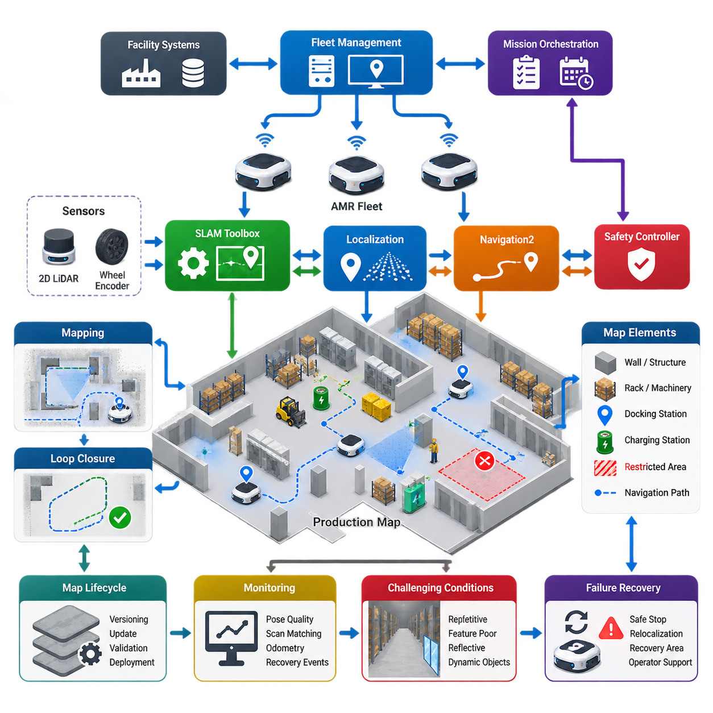
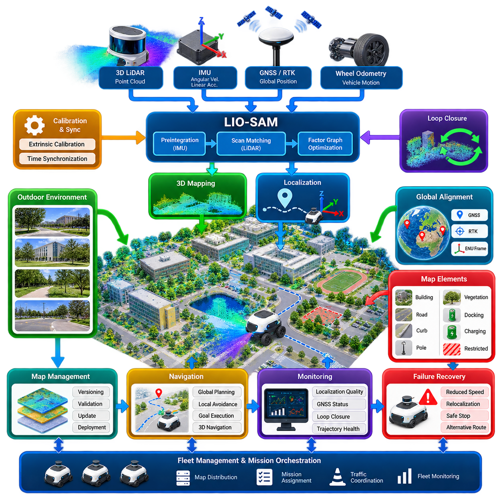
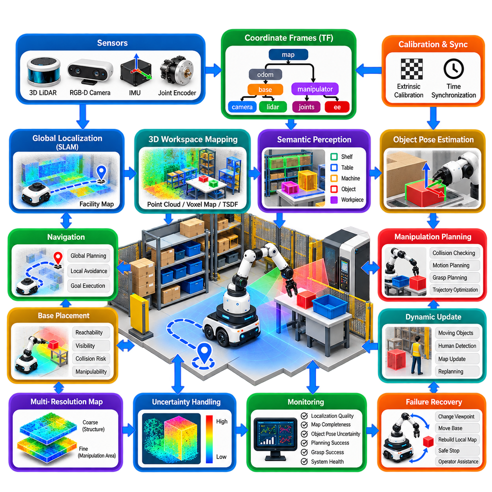
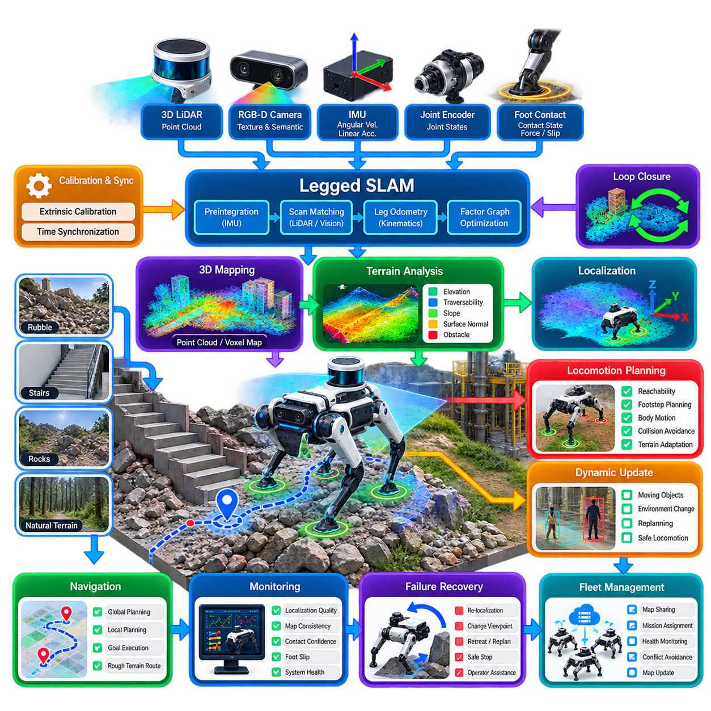
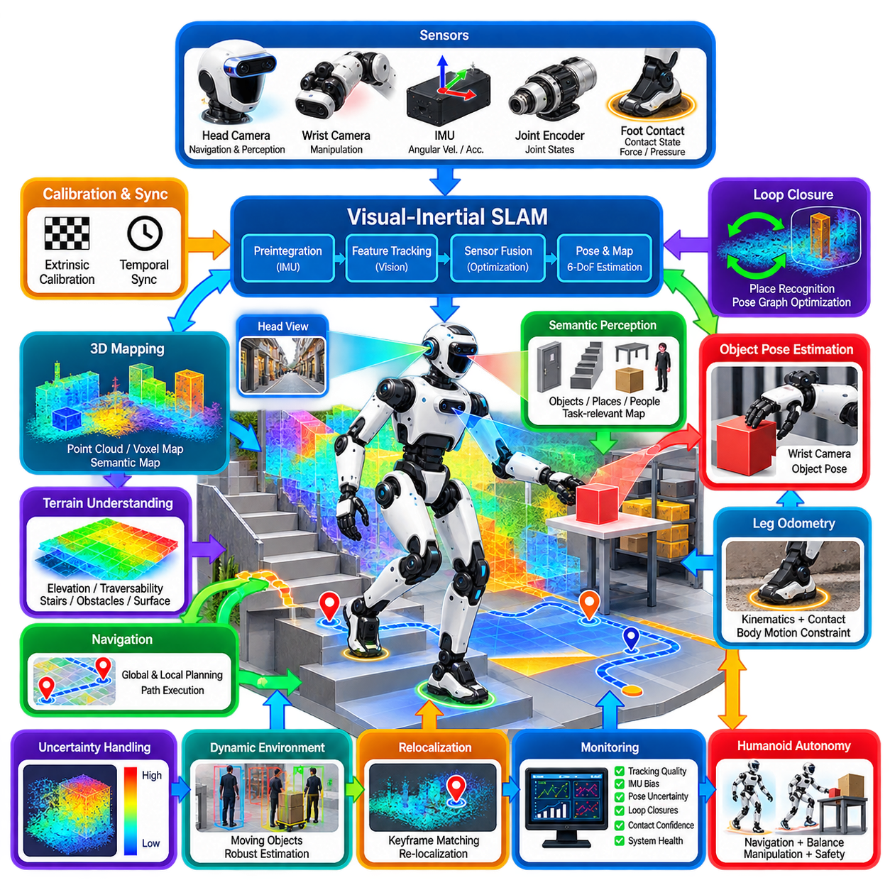
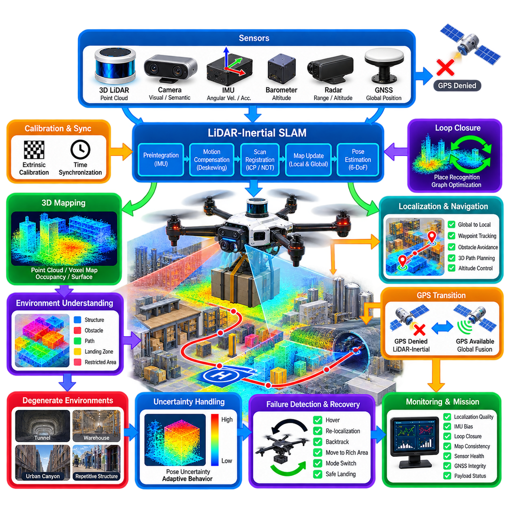
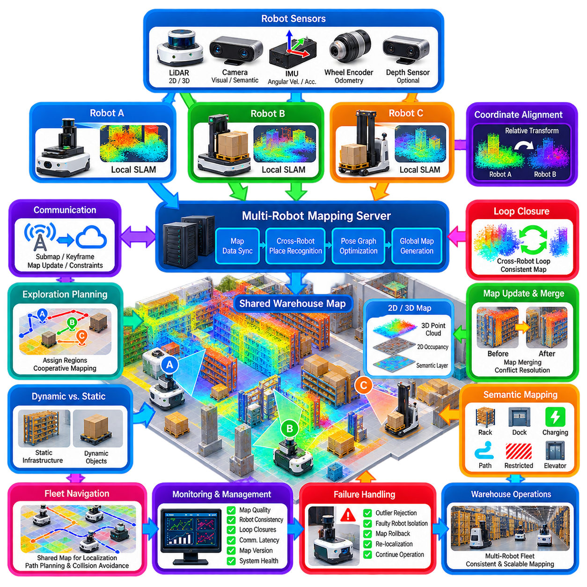
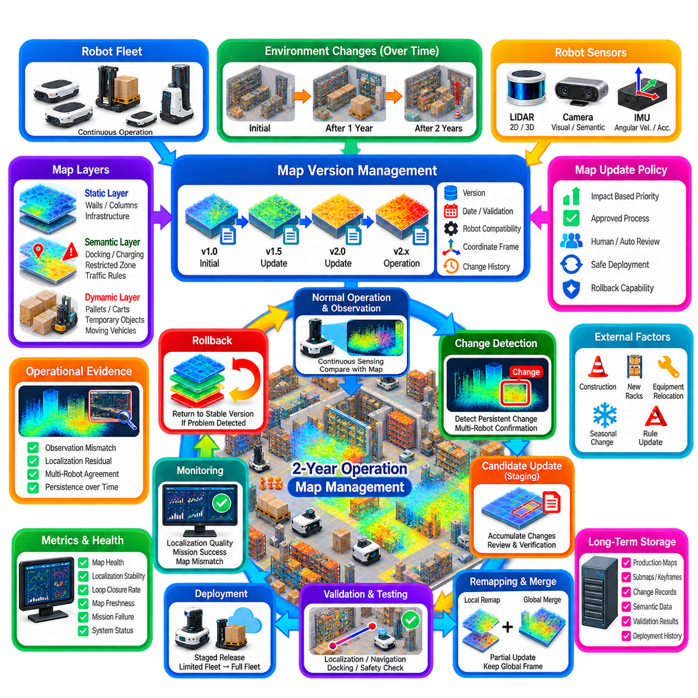
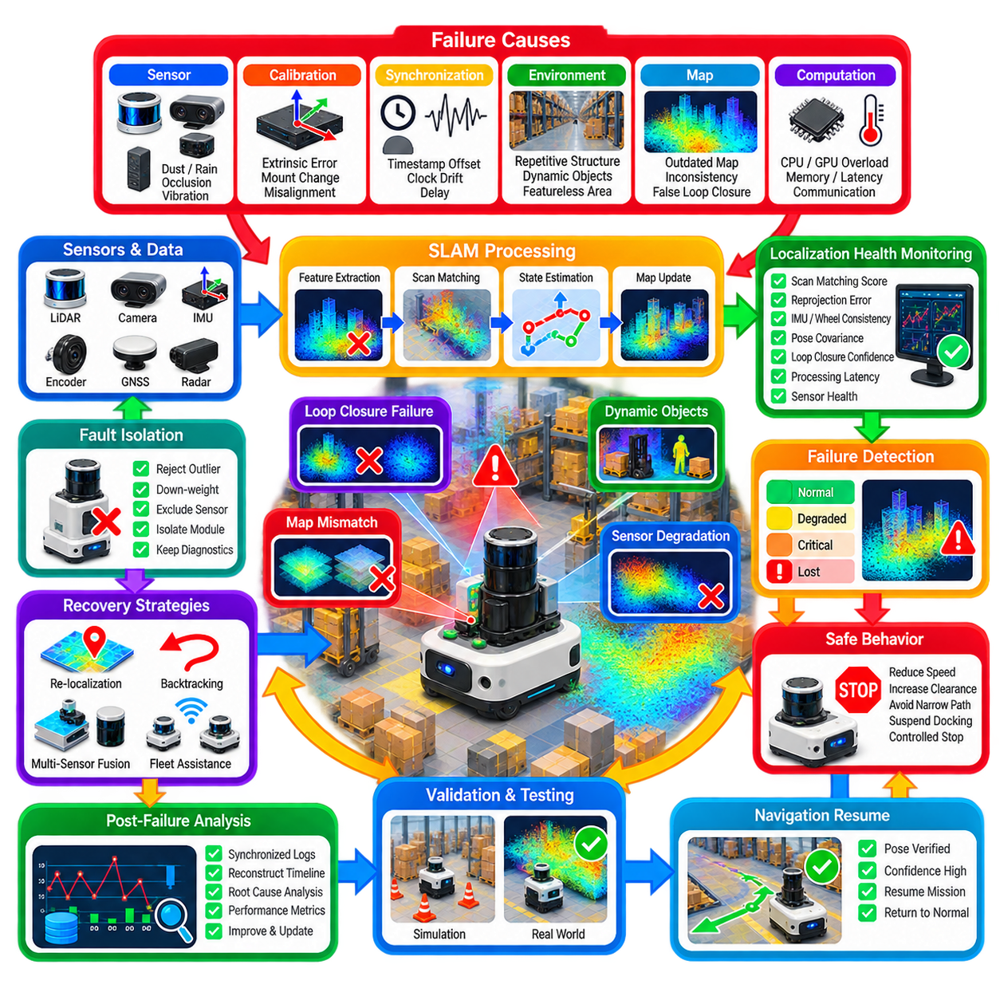
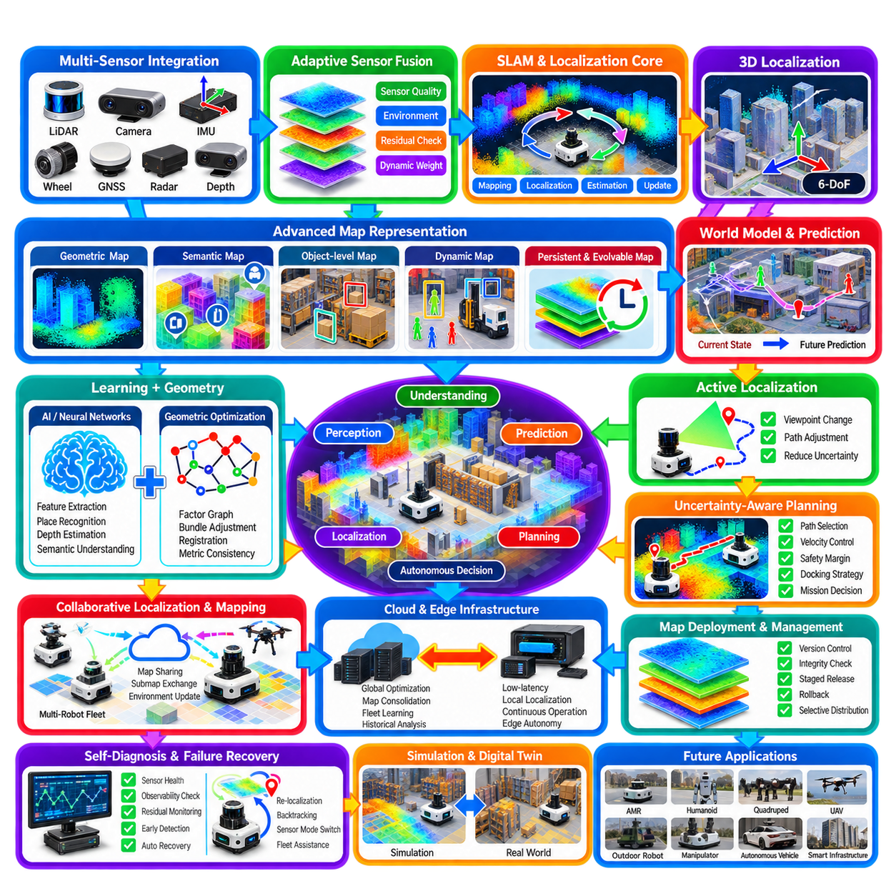

**Volume 13. Mapping Localization and SLAM**

# Chapter 12. Industrial SLAM Case Studies

## 12.01. Indoor AMR Fleet SLAM Toolbox Production Case

{width="7.268055555555556in" height="7.268055555555556in"}

A production indoor AMR fleet requires localization and mapping to operate reliably across warehouses, factories, hospitals, and logistics centers where layouts evolve continuously. A SLAM Toolbox-based architecture can provide the mapping and localization foundation while integrating with ROS 2 navigation, fleet management, safety controllers, and facility-level operational systems.

During initial deployment, one AMR can perform a controlled mapping mission through the facility while SLAM Toolbox processes laser scans, odometry, and transform information. Wheel encoders provide short-term motion estimates, while a 2D LiDAR supplies geometric observations of walls, columns, racks, and other persistent structures. The resulting pose graph represents both robot trajectory and spatial constraints.

Loop closure is particularly important in large industrial environments. As the mapping AMR returns to previously observed locations, SLAM Toolbox identifies compatible observations and introduces additional constraints into the pose graph. Graph optimization then distributes accumulated localization error across the trajectory, reducing drift that would otherwise become significant after long movements through corridors or repeated warehouse aisles.

Production mapping should distinguish permanent infrastructure from temporary objects. Walls, structural columns, fixed machinery, and stable rack boundaries are valuable localization references, whereas pallets, carts, workers, forklifts, and temporary inventory should not dominate the map. Mapping runs are therefore normally performed under controlled conditions, followed by engineering review before a map is released for fleet operation.

The approved occupancy map becomes a controlled production asset rather than merely an output of a SLAM experiment. Map resolution, coordinate origin, frame relationships, restricted regions, docking positions, charging stations, traffic zones, and navigation annotations should be versioned together. This allows the fleet management system to associate every operational robot with an explicitly approved map configuration.

Once the production map is established, AMRs normally operate primarily in localization mode instead of continuously modifying the shared reference map. Each robot compares current LiDAR observations with the established environment while odometry predicts short-term motion. This separation between controlled mapping and routine localization prevents temporary environmental changes from unintentionally corrupting the fleet\'s common spatial reference.

ROS 2 provides the integration layer between SLAM Toolbox and the remaining autonomy stack. The transform hierarchy typically connects the map, odom, and base frames, while sensor-specific transforms describe the positions of LiDARs and other devices. Navigation2 can consume the resulting robot pose and occupancy information to perform global planning, local obstacle avoidance, recovery behaviors, and goal execution.

A fleet introduces requirements beyond those of a single AMR. Every robot must interpret the same production coordinate system consistently so that fleet-level destinations correspond to identical physical locations. A command such as moving to Station A must therefore resolve to the same map location regardless of which AMR receives the task. Map distribution and configuration control consequently become fleet-management functions.

Localization quality should also be treated as an observable production variable. Pose uncertainty, scan matching quality, transform timing, odometry consistency, localization recovery events, and repeated navigation deviations can be collected as operational telemetry. A robot that repeatedly loses localization can then be identified before the problem develops into navigation failure, excessive recovery behavior, or mission interruption.

Industrial environments create difficult cases that must be considered during validation. Long feature-poor corridors, repetitive rack aisles, large open areas, reflective surfaces, glass partitions, and moving equipment can reduce geometric uniqueness. Wheel slip can further degrade odometry. Reliable deployment therefore depends on suitable LiDAR placement, accurate extrinsic calibration, robust odometry, and sufficient persistent environmental features.

Map changes require a controlled lifecycle. A moved pallet should normally be handled as a dynamic obstacle, while relocation of racks, installation of machinery, or structural modification may justify map revision. Engineers can perform a new mapping session or update an existing pose graph, validate navigation-critical regions, assign a new map version, and release it only after localization and route tests have passed.

Rolling out a new map to the fleet should resemble a software deployment rather than an uncontrolled file replacement. The fleet can retain the previous validated map, deploy the candidate version to selected AMRs, execute regression routes, verify docking and charging positions, and compare localization performance. If abnormalities appear, the system should support rapid rollback to the previously approved map and configuration.

Docking operations demand greater precision than ordinary corridor navigation. A global SLAM pose can guide an AMR into the docking region, but final alignment may use LiDAR geometry, fiducial markers, vision, reflectors, or dedicated docking sensors. This layered approach prevents the fleet from demanding unrealistic millimeter-level accuracy from the facility-wide SLAM system while still supporting repeatable charging and material-transfer operations.

Fleet-scale operation also requires clear separation between localization, navigation, traffic coordination, and mission orchestration. SLAM Toolbox determines the robot\'s relationship to the map, Navigation2 determines how the individual robot reaches a goal, and the fleet manager coordinates shared resources and prevents conflicting traffic. Higher-level orchestration assigns missions according to production priorities, robot state, and facility requirements.

Failure recovery must be designed before deployment. If localization confidence becomes unacceptable, the AMR should avoid continuing normal autonomous motion based on an unreliable pose. Depending on system design, it may stop safely, request relocalization, use a known recovery area, obtain an externally supplied initial pose, or request operator assistance. The fleet manager should recognize this state and redistribute pending missions when necessary.

Production acceptance should therefore evaluate complete operational scenarios rather than only mapping accuracy. Tests should include repeated routes, long-duration operation, localization after reboot, initialization at multiple positions, dynamic obstacle exposure, temporary aisle blockage, docking, map-server restart, network interruption, and recovery from localization loss. Performance should be evaluated statistically across repeated missions and multiple robots.

A mature deployment ultimately treats SLAM as shared infrastructure for the AMR fleet. The essential production capability is not simply generating an occupancy grid, but maintaining a trustworthy relationship among physical space, map versions, robot localization, navigation goals, and fleet-level operations. SLAM Toolbox can serve as the mapping and localization component within this broader architecture when supported by disciplined calibration, validation, monitoring, and map governance.

## 12.02. Outdoor AMR LIO SAM Large Campus Mapping Case

{width="7.268055555555556in" height="7.268055555555556in"}

Outdoor autonomous mobile robots operating across large campuses require localization that remains stable over long distances, uneven terrain, changing illumination, vegetation, buildings, and partially structured roads. LIO-SAM provides a practical foundation by tightly combining LiDAR and inertial measurements within a factor-graph framework, allowing an AMR to estimate motion while constructing a geometrically consistent three-dimensional map.

A typical campus mapping platform carries a 3D LiDAR, IMU, GNSS receiver, wheel odometry, and an onboard computing unit. The LiDAR captures surrounding geometry, while the IMU measures high-frequency angular velocity and linear acceleration. GNSS provides global position references when satellite visibility is sufficient, and wheel odometry can supply complementary vehicle-motion information, particularly during relatively stable ground contact.

Accurate sensor calibration is fundamental before mapping begins. The rigid-body transformation between LiDAR and IMU must be determined precisely, and their timestamps must be synchronized sufficiently for motion compensation. Incorrect extrinsic parameters or timing offsets can produce distorted point clouds, inconsistent scan alignment, and systematic trajectory errors that become increasingly visible as the AMR travels across a large campus.

LIO-SAM uses IMU measurements to estimate short-term motion and compensate for LiDAR motion distortion during each scan. This process is especially important for outdoor AMRs because vibration, acceleration, steering, and uneven terrain continuously change the sensor pose. Deskewed point clouds provide more reliable geometric observations for subsequent feature extraction, scan registration, and factor-graph optimization.

LiDAR observations contribute geometric constraints between robot poses. Edge-like and planar structures from buildings, curbs, walls, poles, road surfaces, and other persistent objects can support scan matching. Unlike indoor environments, however, outdoor campuses may contain vegetation, parked vehicles, pedestrians, delivery trucks, and construction equipment. Mapping quality therefore depends on emphasizing stable geometric structures while reducing dependence on transient objects.

The factor graph is the central estimation structure of LIO-SAM. Robot states are represented as graph variables, while IMU preintegration, LiDAR odometry, loop closures, and available GNSS observations introduce constraints between those states. Optimization combines these sources to estimate a trajectory that is more globally consistent than one obtained from continuously integrating local motion estimates alone.

Large campuses make accumulated drift particularly important. Even accurate LiDAR-inertial odometry gradually develops error over hundreds or thousands of meters. When the AMR revisits a previously mapped region, loop-closure detection can identify the correspondence and add a long-range constraint. Graph optimization then redistributes accumulated error through the trajectory and improves consistency between different sections of the campus map.

GNSS can complement loop closure by anchoring the locally accurate SLAM trajectory to a global geographic reference. Standard GNSS may provide useful coarse constraints, while RTK-GNSS can provide substantially higher positioning accuracy under suitable satellite and correction conditions. Global measurements should nevertheless be incorporated according to their uncertainty because multipath, buildings, trees, tunnels, and urban canyons can temporarily degrade GNSS reliability.

A useful production architecture therefore avoids treating GNSS as an unquestionable ground truth. LIO-SAM can combine relative LiDAR-inertial accuracy with appropriately weighted global observations, allowing the estimator to benefit from GNSS without blindly following corrupted measurements. Monitoring GNSS covariance, fix status, satellite geometry, and correction availability helps determine when global measurements should strongly or weakly influence the optimized trajectory.

Campus-scale mapping also requires careful coordinate management. The SLAM map commonly operates in a local Cartesian coordinate system, while GNSS observations originate from a geographic reference system. A defined transformation between geographic coordinates and a local frame such as East-North-Up enables maps, missions, infrastructure positions, and fleet destinations to share a consistent spatial reference without forcing every local computation to operate directly in latitude and longitude.

Terrain variation creates additional challenges for outdoor AMRs. Slopes, speed bumps, curbs, drainage channels, gravel, grass, and damaged pavement generate roll, pitch, vertical motion, and wheel slip that are largely absent from ideal planar navigation models. Three-dimensional LiDAR-inertial estimation preserves six-degree-of-freedom vehicle motion, making it more appropriate for such environments than localization architectures that assume a perfectly flat operating surface.

A production mapping mission should cover important roads and operational zones from multiple viewpoints rather than simply driving each path once. Revisiting intersections, building entrances, charging areas, narrow passages, and major loops creates redundant geometric constraints. These repeated observations strengthen loop closure and provide opportunities to identify map regions where localization quality is weak because of insufficient or repetitive environmental features.

Map density must be balanced against computational and storage requirements. Raw LiDAR data collected over a large campus can become extremely large, while autonomous navigation rarely requires every measured point. Voxel filtering, keyframe selection, local submaps, and optimized point-cloud representations can reduce data volume while preserving structures required for localization, obstacle interpretation, and engineering inspection.

The resulting three-dimensional map should be treated as a production asset with explicit versions and validation status. Buildings, roads, curbs, poles, fixed infrastructure, docking areas, charging stations, restricted regions, and mission landmarks can be associated with the geometric map. Changes caused by construction, landscaping, relocated equipment, or new buildings should trigger controlled assessment rather than automatic modification of the operational reference map.

Localization during routine operation can reuse the validated map instead of continuously rebuilding the entire campus. Current LiDAR and IMU measurements estimate local motion and align the AMR with the established environment, while GNSS provides global assistance where appropriate. This architecture reduces unnecessary map changes and allows multiple AMRs to operate against the same spatial reference while maintaining independent state estimates.

Operational monitoring should track more than whether the SLAM software is running. LiDAR registration quality, IMU bias, estimated covariance, GNSS residuals, loop-closure events, map matching performance, trajectory discontinuities, processing latency, and localization recovery frequency provide valuable indicators of system health. Long-term statistics can reveal deteriorating sensors, calibration shifts, environmental changes, or specific campus regions that repeatedly challenge localization.

Failure handling is equally important. Dense vegetation, heavy rain, dust, reflective surfaces, GNSS outages, sensor vibration, or temporary construction may reduce localization quality. The AMR should recognize degraded confidence and transition to an appropriate operational state, such as reduced speed, localization recovery, safe stopping, alternative-route execution, or remote assistance, instead of continuing normal autonomous motion with an unreliable pose.

Production validation should therefore include repeated campus loops, operation at different times of day, seasonal vegetation changes, GNSS-denied sections, slopes, high-vibration surfaces, dynamic traffic, and routes between buildings. Ground-truth checkpoints or surveyed landmarks can be used to quantify absolute and relative errors, while repeated mission results reveal whether localization remains sufficiently consistent for practical autonomous operation.

In a mature outdoor AMR system, LIO-SAM is not merely a point-cloud generation algorithm but part of a broader localization infrastructure. LiDAR provides geometric structure, the IMU maintains high-frequency motion awareness, GNSS supplies global reference, and factor-graph optimization integrates these constraints across time. Map governance, monitoring, recovery logic, navigation, and fleet coordination transform this estimation capability into a dependable campus-scale autonomy system.

## 12.03. Mobile Manipulator 3D Workspace Mapping Case

{width="7.268055555555556in" height="7.268055555555556in"}

A mobile manipulator combines autonomous navigation with robotic manipulation, requiring a spatial representation that supports both meter-scale base motion and centimeter- or millimeter-scale interaction near objects. Three-dimensional workspace mapping therefore extends conventional mobile-robot SLAM by representing shelves, tables, machines, containers, fixtures, and manipulation targets with sufficient geometric consistency for perception, planning, and control.

A typical platform integrates an AMR base, multi-axis manipulator, RGB-D or stereo cameras, 3D LiDAR, joint encoders, IMU, and onboard computing. LiDAR provides robust structural geometry over relatively large distances, while cameras capture dense local shape, color, and semantic information. Joint encoders determine manipulator configuration, allowing observations from wrist-mounted sensors to be transformed into the robot and map coordinate systems.

Coordinate-frame management is fundamental because the system contains multiple moving bodies. The map, odometry, mobile base, manipulator base, individual joints, end effector, cameras, and LiDAR must maintain consistent transformations. Errors in these relationships directly affect object position and grasp execution. A small extrinsic calibration error can become significant when projected through a long manipulator reach or when manipulating compact components.

The mobile base first requires reliable localization within the facility. LiDAR SLAM, visual-inertial SLAM, or multi-sensor localization can estimate the base pose relative to a persistent map. Once the base reaches a target workstation, local perception refines the geometry around the manipulation area. This hierarchical approach avoids requiring the facility-wide SLAM system to provide the precision needed for every grasp or insertion operation.

Three-dimensional workspace reconstruction begins by integrating observations acquired from different viewpoints. Depth cameras or LiDAR generate point clouds that are transformed into a common reference frame using estimated sensor poses. Multiple measurements can then be fused into voxel maps, occupancy representations, surfel maps, point-cloud models, or signed-distance fields depending on the requirements of collision checking, surface reconstruction, and manipulation planning.

Active perception becomes important when a single viewpoint cannot reveal enough of the workspace. Shelves, containers, machinery, and stacked objects frequently produce occlusions. The mobile base may reposition itself, the manipulator may move a wrist camera, or both may cooperate to observe hidden surfaces. The mapping system incrementally incorporates these measurements while maintaining the spatial relationship between previously observed and newly visible structures.

Workspace maps should distinguish static structures from movable objects. Walls, workbenches, fixed machines, racks, and safety barriers can remain part of a persistent geometric map, while boxes, tools, workpieces, trays, and human-operated equipment may change frequently. Treating all observations as permanent would rapidly produce inconsistent maps, so production systems often combine a stable background representation with continuously updated local object states.

Semantic perception adds operational meaning to geometry. A point cloud may describe a rectangular surface, but manipulation requires understanding whether that surface belongs to a table, pallet, storage bin, machine interface, or target component. Object detection, segmentation, pose estimation, and instance tracking can therefore be associated with the geometric map, producing a semantic workspace model that supports task-level reasoning and manipulation.

Object pose accuracy is especially important near the end effector. Global localization may be sufficient to bring the robot within reach of a workstation, but final manipulation should normally rely on local observations. RGB-D cameras, stereo vision, fiducial markers, structured light, or dedicated industrial vision can estimate the target relative to the manipulator. This reduces dependence on accumulated global map error during precise interaction.

The manipulator planning system converts the mapped workspace into collision information. Occupied voxels, reconstructed surfaces, or simplified collision meshes describe shelves, tables, machines, and nearby obstacles. Motion planning then searches for a joint trajectory that moves the end effector toward the target while avoiding collisions with the environment, the mobile base, and potentially the robot\'s own links.

A mobile manipulator introduces an additional planning problem because both the base and arm influence reachability. A target may be visible but unreachable from the current base pose, or an apparently convenient base position may leave insufficient arm clearance. Workspace mapping can therefore support base-placement planning by evaluating candidate robot positions according to reachability, visibility, collision risk, manipulability, and navigation accessibility.

Navigation and manipulation should be coordinated rather than treated as unrelated behaviors. The AMR can first navigate to a coarse approach pose, perform local workspace mapping, determine an improved manipulation pose, and make a small base adjustment before arm motion begins. After completing the task, the manipulator can return to a safe transport configuration before the mobile base resumes facility navigation.

Dynamic environments require continuous local map updates. Workers may enter the workspace, carts may move nearby, or objects may be removed while the robot is planning. Depth and LiDAR sensors should refresh collision information sufficiently quickly for the system to detect meaningful changes. A planned trajectory must be reconsidered when newly observed obstacles invalidate the assumptions used during motion planning.

Map resolution should vary according to task requirements. Large structural areas do not require the same geometric density as a grasping region containing small objects. Multi-resolution representations can preserve coarse facility geometry while maintaining finer information around manipulation targets. This reduces memory and computation without sacrificing the precision required for close-range collision avoidance and object interaction.

Uncertainty should also be represented explicitly. Sensor noise, calibration error, localization drift, reflective surfaces, transparent materials, and incomplete observations can make apparently precise geometry unreliable. Confidence measures associated with object poses, depth observations, or map regions allow the system to determine whether it can execute a manipulation directly or should collect additional observations before committing to motion.

Production operation requires monitoring of both mapping and manipulation quality. Localization confidence, depth completeness, object-pose uncertainty, calibration status, transform latency, collision-map age, planning success rate, grasp success, and repeated correction motions provide useful health indicators. Trends in these measurements can reveal sensor degradation, mechanical changes, or workstations whose geometry has changed since commissioning.

Failure recovery should exploit the mobility of the system. If an object cannot be detected reliably, the robot can change viewpoint rather than immediately terminating the task. If inverse kinematics fails, the base can move to a different position. If the workspace has changed substantially, the robot can rebuild the local map. Only when these recovery strategies fail should the system escalate to operator assistance or task reassignment.

Validation must evaluate complete mobile-manipulation missions rather than isolated SLAM accuracy. Tests should include navigation to multiple workstations, repeated base positioning, local reconstruction, object localization, grasping, placement, occlusion recovery, dynamic obstacle response, and operation after map or workstation changes. Repeatability across many missions is particularly important because small spatial errors can accumulate through the perception-to-action chain.

Fleet operation introduces another layer of spatial coordination. Multiple mobile manipulators may share a common facility map while maintaining individual local workspace models. The fleet manager can assign tasks according to robot availability, tool configuration, battery state, and workstation accessibility, while each robot independently refines the geometry required for its current manipulation task.

A mature 3D workspace mapping architecture therefore connects global SLAM, local reconstruction, semantic perception, object pose estimation, motion planning, and closed-loop manipulation. The global map brings the robot to the correct operational region, while high-resolution local sensing establishes the spatial accuracy required for interaction. Together, these layers transform a mobile platform and robotic arm into a system capable of autonomous physical work in changing industrial environments.

## 12.04. Quadruped Legged SLAM Rough Terrain Case

{width="7.268055555555556in" height="7.268055555555556in"}

Quadruped robots extend autonomous mobility into environments where wheels cannot reliably maintain contact, including rubble, stairs, rocks, steep slopes, industrial structures, construction sites, and natural terrain. SLAM for these platforms must estimate six-degree-of-freedom motion while tolerating rapid body oscillation, repeated impacts, changing footholds, and substantial roll, pitch, and vertical displacement.

A typical legged SLAM platform combines a 3D LiDAR, IMU, stereo or RGB-D cameras, joint encoders, and foot-contact information. LiDAR provides stable geometric observations over useful distances, cameras add texture and semantic information, and the IMU measures high-frequency body motion. Joint positions and contact states provide additional constraints that are unavailable to conventional wheeled robots.

Sensor placement is especially important because quadruped locomotion continuously changes the body attitude. A LiDAR mounted near the upper body can maintain broad visibility, while cameras may cover forward terrain and close-range footholds. Accurate extrinsic calibration between the body, LiDAR, cameras, and IMU is essential because small rotational errors can generate substantial spatial errors when observations are projected over distance.

Time synchronization is equally critical. Walking, trotting, climbing, and recovering from disturbances generate rapid rotational and translational motion. Even a modest timestamp mismatch between LiDAR and IMU measurements can distort point clouds and degrade scan registration. Hardware synchronization or carefully characterized software synchronization should therefore be considered part of the localization architecture rather than an optional refinement.

LiDAR-inertial odometry is well suited to rough-terrain locomotion because the IMU captures rapid motion between successive LiDAR observations. IMU integration predicts short-term orientation and displacement, while LiDAR registration corrects accumulated inertial drift using surrounding geometry. Motion compensation can deskew each scan so that points measured during body movement are represented within a consistent temporal reference.

Leg kinematics provide another useful source of motion information. When a foot is firmly contacting the ground without slipping, joint encoder measurements and the robot\'s kinematic model can constrain body movement relative to the contact point. Combining these constraints with LiDAR and IMU estimation can improve robustness, particularly when geometric features are temporarily weak or rapid body motion challenges scan matching.

Foot-contact constraints are not universally reliable. Loose gravel, mud, wet surfaces, vegetation, rubble, and unstable debris can cause slipping or moving footholds. A production estimator should therefore treat leg odometry according to contact confidence rather than assuming every stance foot is fixed. Force sensing, motor torque, kinematic consistency, and contact-state estimation can help determine whether a foothold should contribute strongly to localization.

Terrain geometry must support both localization and locomotion. The same 3D point cloud used for SLAM can be transformed into elevation maps, traversability maps, surface-normal estimates, slope measurements, and obstacle representations. These derived layers allow the robot to distinguish flat ground from steps, rocks, gaps, steep surfaces, and potentially unstable regions before selecting a body path and individual footholds.

Unlike a wheeled AMR, a quadruped cannot represent navigation only as a planar path through free space. The planner must consider whether the robot can physically establish stable contacts along the route. Terrain height, slope, roughness, step dimensions, clearance, friction assumptions, and body orientation can influence traversability. Localization and terrain mapping therefore become tightly coupled with locomotion planning.

Local terrain maps generally require higher resolution than the global SLAM map. A global point-cloud or voxel representation may provide sufficient information for long-range localization and route planning, while the area immediately surrounding the robot requires detailed geometry for foothold selection. Maintaining global and local representations at different resolutions reduces computational cost while preserving information needed for safe locomotion.

Loop closure remains important during long inspection or exploration missions. A quadruped returning to a previously visited corridor, building section, tunnel, or outdoor region can recognize geometric similarity and introduce a loop constraint. Pose-graph optimization then reduces accumulated drift and improves consistency across the mission map, particularly when GNSS is unavailable or unreliable.

GNSS and RTK-GNSS can provide global references during outdoor operation, but rough-terrain missions often include forests, structures, tunnels, industrial plants, and areas close to buildings. Satellite measurements may therefore become intermittent or degraded. A robust system should transition between globally aided and locally autonomous localization without introducing large pose discontinuities when GNSS quality changes.

Visual information can complement LiDAR in environments where geometry alone is ambiguous. Cameras may identify texture, structural features, doors, signs, equipment, or semantic landmarks. Visual-inertial and LiDAR-inertial estimates can be combined within a multi-sensor architecture, providing redundancy when dust, darkness, repetitive geometry, reflective materials, or limited sensor range reduces the reliability of one sensing modality.

Dynamic body motion introduces additional perception challenges. During a trot or rapid recovery maneuver, sensors can experience vibration, angular acceleration, and temporary occlusion by robot limbs. Mechanical isolation, rigid sensor mounting, high-rate inertial sensing, motion-aware filtering, and self-occlusion handling help maintain useful measurements. The mapping pipeline should also avoid treating moving legs as persistent environmental geometry.

Localization uncertainty should directly influence locomotion behavior. When pose confidence decreases, the robot may reduce speed, select more conservative footholds, increase sensing time, or stop at a stable stance. Continuing aggressive locomotion with uncertain terrain alignment can turn a localization problem into a physical stability problem, particularly near stairs, cliffs, gaps, machinery, or narrow elevated structures.

Failure recovery can exploit the quadruped\'s ability to change posture and viewpoint. If scan matching becomes unreliable, the robot can stop, adopt a stable stance, rotate its body or sensor field of view, and collect additional observations for relocalization. If a route becomes physically unsafe, it can retreat to a previously validated foothold region or request an alternative path rather than forcing forward motion.

Production monitoring should include localization quality, IMU bias, LiDAR registration residuals, visual tracking status, contact confidence, estimated foot slip, terrain-map freshness, loop closures, and pose uncertainty. Locomotion-related indicators such as unexpected body motion, repeated foothold correction, and abnormal joint loads can also reveal localization or terrain-model problems that are not obvious from SLAM metrics alone.

Validation must reproduce the physical conditions expected during deployment. Tests should include slopes, stairs, gravel, grass, wet surfaces, uneven rocks, narrow passages, low-feature areas, GNSS-denied sections, vibration, dynamic obstacles, and repeated transitions between terrain types. Ground-truth references can quantify trajectory error, while repeated missions reveal whether localization and locomotion remain consistently coupled.

For industrial inspection, the map can also become a reference for mission semantics. Equipment locations, inspection points, restricted zones, stairways, hazardous areas, communication dead zones, and recovery locations can be associated with the geometric representation. The robot can then reason not only about where it is, but also about which inspection task or locomotion behavior is appropriate at a particular location.

Multiple quadrupeds can share a validated global map while maintaining independent local terrain maps and state estimates. Fleet coordination can distribute inspection areas, avoid route conflicts, monitor localization health, and reassign missions when a robot encounters inaccessible terrain. Map updates discovered by one robot can be reviewed before being propagated to the remaining fleet rather than automatically altering the common reference.

A mature rough-terrain SLAM architecture therefore integrates LiDAR, inertial sensing, vision, joint kinematics, contact estimation, terrain reconstruction, and uncertainty-aware planning. SLAM establishes spatial consistency, but dependable legged autonomy emerges only when localization confidence is connected to foothold selection, body motion, recovery behavior, and mission management throughout the complete perception-to-action loop.

## 12.05. Humanoid Visual Inertial SLAM Case

{width="7.268055555555556in" height="7.268055555555556in"}

Humanoid robots require localization while walking, turning, climbing stairs, manipulating objects, and interacting with environments designed for people. Visual-inertial SLAM is particularly suitable because cameras provide rich geometric and semantic observations while an IMU captures rapid body motion. Together they can estimate six-degree-of-freedom pose without depending continuously on external infrastructure.

A typical humanoid perception system includes stereo or RGB-D cameras, wide-angle navigation cameras, an IMU, joint encoders, and foot-contact sensing. Cameras may be mounted in the head, torso, or wrists according to their function. Head cameras provide long-range environmental perception, while wrist cameras support manipulation. The IMU supplies high-rate angular velocity and acceleration during dynamic body motion.

Humanoid kinematics create localization challenges that differ from wheeled robots. The sensor platform continuously translates and rotates as the pelvis moves, the torso compensates for balance, and the head tracks targets. Walking introduces periodic vertical displacement and oscillation. Visual-inertial estimation must separate this legitimate body motion from sensor noise while preserving a stable estimate of the robot\'s position and orientation.

Accurate calibration between cameras and the IMU is fundamental. Extrinsic calibration determines their relative position and orientation, while temporal calibration aligns image exposure with inertial measurements. Even small timing errors can become significant during rapid head turns or walking. Camera intrinsic parameters, lens distortion, stereo geometry, and rolling-shutter characteristics must also be understood for reliable visual tracking.

Visual-inertial odometry combines complementary sensing properties. The IMU predicts short-term motion at high frequency but accumulates bias and drift, while visual observations provide geometric constraints by tracking features across images. Optimization jointly estimates robot motion, landmarks, velocity, and inertial biases, allowing visual measurements to correct inertial drift and inertial prediction to stabilize tracking during rapid movement.

Feature-based visual SLAM can detect corners, edges, and other distinctive image structures and associate them across frames. In environments with sufficient texture, these correspondences constrain camera motion and support map construction. Direct or semi-direct methods can additionally use image intensity information, potentially providing useful estimates where explicit feature extraction alone is insufficient.

Depth sensing improves geometric understanding around the humanoid. Stereo vision can estimate depth from image disparity, while RGB-D cameras provide direct depth measurements within their operating range. These observations can generate point clouds, voxel maps, occupancy models, or surface representations that support navigation, collision avoidance, stair detection, manipulation, and human-scale interaction with the environment.

Loop closure is necessary for long-duration operation. When the humanoid returns to a previously observed room, corridor, workstation, or building section, visual place recognition can identify the location and create a loop constraint. Pose-graph or bundle-adjustment optimization then reduces accumulated trajectory drift and improves consistency between spatial regions observed at different times.

Leg kinematics can provide additional motion constraints. During a stable stance phase, a supporting foot can temporarily serve as a reference relative to the ground. Joint encoder measurements and the robot\'s kinematic model can estimate body motion with respect to that contact. Combining this information with visual-inertial estimation increases redundancy and can improve localization when visual tracking becomes temporarily weak.

Foot-contact information must nevertheless be treated probabilistically. A humanoid may walk on slippery floors, carpets, ramps, stairs, debris, or compliant surfaces where the support foot does not remain perfectly fixed. Force-torque sensors, pressure sensors, joint torque estimates, and contact-state estimation can help determine whether a foot constraint is reliable enough to influence the localization solution strongly.

Head motion creates both an opportunity and a challenge. Unlike a fixed camera on an AMR, a humanoid can intentionally rotate its head to observe useful landmarks, inspect an uncertain region, or recover visual tracking. Active perception can select viewing directions that increase feature visibility or reduce uncertainty. However, the localization system must correctly account for the kinematic transformation between the moving head and the robot body.

Manipulation introduces additional coordinate relationships. The robot may localize globally using head cameras while wrist cameras estimate the pose of an object relative to the hand. A consistent transform hierarchy connects the global map, pelvis, torso, head, arms, end effectors, and sensors. Maintaining this hierarchy allows navigation-scale localization and manipulation-scale perception to coexist without requiring identical spatial resolution.

Semantic perception can transform a purely geometric SLAM map into a task-relevant world representation. Doors, stairs, elevators, tables, shelves, tools, machines, charging stations, people, and restricted regions can be associated with spatial locations. A humanoid can then reason about where actions should occur rather than treating the environment only as points, surfaces, and free space.

Dynamic environments require special handling because humanoids are expected to operate near people. Visual features belonging to walking humans, moving carts, opening doors, or manipulated objects should not be treated as permanent landmarks. Motion segmentation, semantic masks, object tracking, and robust estimation can reduce the influence of dynamic observations while preserving stable background structures for localization.

Lighting variation is another major challenge for visual SLAM. Industrial facilities and buildings may contain bright windows, dark corridors, reflective floors, flickering illumination, or transitions between indoor and outdoor areas. Exposure control, high-dynamic-range imaging, robust feature descriptors, image normalization, and complementary depth or inertial information can help maintain localization through these changes.

Localization uncertainty should influence humanoid behavior directly. If visual tracking quality decreases or inertial uncertainty grows, the robot can slow its walking speed, widen its stability margin, stop in a balanced stance, rotate its head to search for landmarks, or move toward a better-observed area. This prevents an estimation problem from becoming a balance, collision, or manipulation failure.

Relocalization is essential after tracking loss or system restart. A humanoid may compare current visual observations with previously stored keyframes or landmarks to recover its position within an existing map. Semantic landmarks can provide additional cues when geometric appearance is ambiguous. Once a reliable global pose is recovered, navigation and manipulation tasks can resume without rebuilding the entire environment.

Computational architecture must support multiple perception rates. IMU processing may operate at hundreds of measurements per second, visual tracking at camera frame rate, and global optimization at a slower frequency. Local estimation should remain responsive enough for balance and navigation, while background optimization improves global map consistency without blocking time-critical control and safety processes.

Production monitoring should include visual tracking quality, number and distribution of tracked features, reprojection error, IMU bias, pose covariance, loop closures, relocalization events, camera exposure status, transform latency, and foot-contact confidence. Correlating these indicators with walking stability and navigation performance can reveal localization degradation before it causes a mission-level failure.

Validation should reproduce complete humanoid operating conditions. Tests should include walking and turning, stair ascent and descent, crouching, head scanning, object manipulation, low-texture corridors, changing illumination, dynamic crowds, reflective surfaces, temporary occlusion, tracking loss, and restart-based relocalization. Repeated missions are necessary to evaluate both accuracy and operational repeatability.

Multiple humanoids can share a validated global map while maintaining independent local visual-inertial states. Fleet-level systems may distribute maps, assign missions, coordinate shared spaces, and monitor localization health. Changes detected by individual robots can be compared and validated before updating the common map, preventing transient objects or temporary environmental conditions from corrupting the fleet reference.

A mature humanoid visual-inertial SLAM architecture therefore combines cameras, inertial sensing, kinematics, contact estimation, depth perception, semantic understanding, and uncertainty-aware behavior. SLAM provides the spatial foundation, but dependable humanoid autonomy emerges when localization remains connected to balance, locomotion, active perception, manipulation, safety, and mission-level reasoning throughout the complete perception-to-action loop.

## 12.06. Cargo UAV GPS Denied LiDAR SLAM Case

{width="7.268055555555556in" height="7.268055555555556in"}

Cargo UAVs operating in GPS-denied environments require localization that remains reliable when satellite navigation becomes unavailable, degraded, jammed, or obstructed. Warehouses, tunnels, urban canyons, ports, mountainous corridors, industrial structures, and low-altitude flight near large buildings are representative cases. LiDAR SLAM provides an onboard geometric reference that allows the aircraft to estimate six-degree-of-freedom motion without continuous GNSS dependence.

A cargo UAV localization system typically combines 3D LiDAR, IMU, cameras, barometric altitude sensing, radar or range sensors, and GNSS when available. LiDAR provides geometric measurements of surrounding structures, while the IMU captures high-rate angular velocity and acceleration. Cameras can supplement geometric information, and independent altitude sensors provide additional constraints during takeoff, landing, and low-altitude flight.

Unlike ground robots, UAVs move freely in three dimensions and cannot rely on wheel odometry or persistent ground contact. Translation, rotation, vertical motion, acceleration, and aerodynamic disturbance can occur simultaneously. The SLAM estimator must therefore maintain full 6-DoF state estimation while remaining responsive enough to provide localization information to the flight controller during dynamic maneuvers.

Accurate sensor calibration is fundamental to this architecture. The rigid transformation between LiDAR and IMU must be known precisely, and timestamps must be synchronized sufficiently well to compensate for aircraft motion during each LiDAR scan. Calibration errors or temporal offsets can distort the point cloud and introduce systematic pose errors, particularly during rapid yaw changes, acceleration, vibration, or turbulent flight.

LiDAR-inertial odometry combines high-frequency inertial prediction with geometric correction. IMU measurements propagate the vehicle state between LiDAR observations, while scan registration aligns current geometric measurements with previous scans or a local map. This complementary relationship limits inertial drift while preserving fast state updates, making LiDAR-inertial estimation particularly useful when GNSS disappears unexpectedly.

Motion compensation is essential because a UAV can move significantly during a single LiDAR scan. Raw points acquired at different times represent different sensor poses and should not be treated as if they were captured simultaneously. IMU-based deskewing transforms measurements toward a common temporal reference, improving geometric consistency and increasing the reliability of scan matching during aggressive or disturbed flight.

The map representation must support three-dimensional flight rather than planar navigation. Point clouds, voxel maps, occupancy grids, surfel representations, or distance fields can describe walls, ceilings, structural beams, containers, vegetation, terrain, and other obstacles. The localization map can also provide geometric information for collision avoidance and route planning, allowing perception and navigation to share a consistent spatial representation.

GPS-denied flight often begins as a transition rather than a completely separate mission mode. A cargo UAV may initially navigate with GNSS or RTK-GNSS and then enter a warehouse, tunnel, covered logistics facility, or region affected by satellite blockage. The localization architecture should transfer smoothly from globally referenced navigation to LiDAR-inertial estimation without introducing sudden position or orientation discontinuities.

When GNSS becomes available again, global measurements should be reintegrated carefully. A direct position jump can destabilize navigation or produce an unsafe trajectory correction. Instead, the system can compare the SLAM trajectory with the recovered global reference, evaluate measurement integrity, and gradually reconcile accumulated drift through filtering or graph optimization while maintaining continuous control coordinates.

Loop closure helps control long-term drift during extended GPS-denied missions. When the UAV revisits a previously mapped structure, corridor, loading area, or waypoint region, geometric place recognition can identify the overlap. A loop constraint can then be introduced into the pose graph, allowing optimization to redistribute accumulated error and improve consistency across the complete flight trajectory.

Degenerate geometry is a significant challenge for airborne LiDAR SLAM. Long tunnels, large flat walls, open warehouses, repetitive container rows, or high-altitude areas with limited nearby structure may provide insufficient geometric constraints in one or more directions. The estimator should detect such observability loss rather than reporting unrealistically high confidence in a weakly constrained pose solution.

Sensor fusion can reduce this vulnerability. Visual features may provide constraints where LiDAR geometry is repetitive, while radar can remain useful in dust, fog, or adverse visibility. Barometric altitude, downward range sensing, and inertial measurements can provide additional vertical information. The objective is not simply to add sensors, but to ensure that their failure characteristics are sufficiently different to provide meaningful redundancy.

Cargo payload introduces additional localization challenges. Changes in payload mass and center of gravity affect acceleration response, vibration, attitude control, and structural dynamics. Suspended loads can generate oscillatory motion that differs substantially from rigid-body flight. Although SLAM estimates spatial motion rather than vehicle dynamics directly, these effects influence sensor stability and should be represented in validation and estimator tuning.

Vibration management is particularly important on large UAVs. Propellers, motors, gearboxes, structural modes, and payload motion can contaminate inertial measurements and mechanically disturb LiDAR or camera alignment. Rigid sensor mounting, characterized vibration isolation, appropriate IMU filtering, structural monitoring, and calibration verification are required so that vibration mitigation does not introduce unknown sensor motion or excessive latency.

The local map should remain computationally bounded during long missions. Maintaining every historical LiDAR point onboard is unnecessary and can increase memory and optimization cost. Keyframe selection, voxel filtering, sliding local maps, submaps, and hierarchical representations can preserve useful geometry while limiting processing requirements. Older map regions can remain available for loop closure without participating continuously in local scan registration.

Localization uncertainty must influence flight behavior directly. When geometric constraints weaken or sensor consistency decreases, the UAV can reduce speed, increase obstacle clearance, avoid narrow passages, hold position when feasible, or move toward a region with stronger observable structure. A localization system should therefore provide confidence information to navigation and flight management rather than only outputting a nominal pose.

Failure detection should distinguish temporary degradation from complete localization loss. Rising scan-matching residuals, increasing covariance, abnormal IMU bias, inconsistent sensor innovations, insufficient geometric features, or repeated registration failures can indicate deteriorating estimation. Monitoring these indicators allows the autonomy system to initiate recovery before pose error becomes large enough to threaten flight safety.

Recovery behavior depends on the available environment and remaining state confidence. The UAV may hover, reduce motion, rotate to acquire additional geometry, backtrack along a recently validated corridor, ascend or descend toward more observable structures, or switch to an alternative localization modality. If reliable localization cannot be restored, mission logic should transition toward a predefined contingency rather than continuing normal autonomous flight.

Takeoff and landing require special consideration because proximity to the ground and surrounding infrastructure changes the sensing geometry rapidly. Downward LiDAR, radar altimeters, cameras, or range sensors can provide complementary height and surface information. Landing-zone geometry should be validated independently from global position estimates so that a locally consistent SLAM solution can support precise terminal guidance even without GNSS.

Map semantics can extend the SLAM representation beyond geometry. Loading zones, landing areas, restricted volumes, tunnel entrances, structural hazards, emergency holding regions, and known communication-loss zones can be associated with mapped coordinates. This allows the autonomy system to reason about mission constraints while operating within the same spatial reference used for localization and obstacle avoidance.

Production monitoring should include LiDAR registration quality, IMU bias, pose covariance, map overlap, loop-closure status, processing latency, vibration indicators, GNSS integrity, sensor synchronization, and localization-mode transitions. Recording these variables together with flight-control data makes it possible to distinguish estimation failures from aerodynamic, mechanical, communication, or control problems during post-flight analysis.

Validation should deliberately reproduce GNSS degradation rather than treating it as an exceptional event. Flight tests should include controlled GNSS loss and recovery, tunnels, repetitive structures, sparse geometry, vibration, dynamic obstacles, varying payloads, altitude changes, aggressive turns, and transitions between indoor and outdoor environments. Repeated missions are necessary to characterize drift, recovery behavior, and operational repeatability.

For cargo UAVs, localization must ultimately be evaluated as part of the complete flight-safety architecture. LiDAR SLAM, inertial estimation, alternative sensing, navigation, flight control, health monitoring, and contingency management must exchange consistent state and confidence information. A technically accurate SLAM trajectory alone is insufficient if degradation cannot be detected or communicated to the systems responsible for safe vehicle behavior.

A mature GPS-denied cargo UAV architecture therefore treats LiDAR SLAM as a resilient navigation component rather than a replacement for GNSS. Global navigation provides absolute reference when trustworthy, while LiDAR-inertial SLAM maintains locally consistent autonomy when that reference disappears. Sensor redundancy, uncertainty awareness, recovery logic, and flight-level safety integration together enable dependable operation across transitions between globally referenced and GPS-denied environments.

## 12.07. Multi Robot Collaborative Mapping Warehouse Case

{width="7.268055555555556in" height="7.268055555555556in"}

Multi-robot collaborative mapping allows a warehouse fleet to construct and maintain a shared spatial representation by combining observations collected by multiple autonomous robots. Instead of requiring one dedicated mapping robot to traverse the entire facility, AMRs can explore different aisles, storage zones, loading areas, and production interfaces simultaneously while contributing locally generated map information to a common mapping framework.

A typical warehouse fleet equips each robot with 2D or 3D LiDAR, wheel encoders, IMU, and optionally cameras or depth sensors. Every robot performs local localization and mapping using its own sensor observations while maintaining an estimate of its trajectory. Local SLAM must remain operational even when communication with other robots or the central infrastructure is temporarily unavailable.

Collaborative mapping introduces a fundamental coordinate-frame problem because each robot can initially create its map within an independent local reference frame. Before these maps can be combined, the system must estimate transformations between robot coordinate systems. Overlapping observations, known initialization locations, fiducial landmarks, GNSS where available, or infrastructure references can provide constraints that connect independently generated maps.

Map overlap detection determines whether two robots have observed the same physical region. In a warehouse, repeated rack structures and visually similar aisles make this difficult because geometrically similar observations may originate from different locations. Reliable overlap detection therefore requires sufficient spatial context and consistency checking before a cross-robot correspondence is accepted as a valid map relationship.

Cross-robot loop closure extends conventional loop closure beyond a single trajectory. When Robot A observes a location previously mapped by Robot B, the mapping system can establish a relative pose constraint between their trajectories. This constraint connects previously independent pose graphs and enables the optimization system to estimate a common spatial relationship between the robots and their local maps.

Incorrect cross-robot loop closures can severely distort a shared map. Warehouses frequently contain repeated shelves, identical columns, uniform corridors, and symmetric layouts that can produce false place recognition. Candidate matches should therefore be verified using geometric registration, consistency with neighboring observations, transformation plausibility, and other available sensor or semantic information before they influence global optimization.

Once valid inter-robot constraints are established, pose-graph optimization can jointly refine the trajectories of multiple robots. Odometry, local scan matching, individual loop closures, and cross-robot constraints are combined within a common optimization problem. The resulting solution reduces accumulated drift and aligns local maps into a globally consistent warehouse representation rather than simply overlaying point clouds using uncertain initial estimates.

The shared map can be represented as a 2D occupancy grid for conventional indoor AMRs or as a 3D point-cloud, voxel, or hybrid representation when vertical structure is important. Warehouses containing high racks, mezzanines, ramps, automated storage systems, or mobile manipulators may benefit from maintaining both a navigation-oriented 2D layer and a richer 3D structural map.

Map merging should distinguish geometric alignment from map-content fusion. Two maps may be correctly aligned but still contain conflicting occupancy information because they were observed at different times. Pallets, carts, forklifts, temporary barriers, and inventory can move between observations. The fusion process must therefore avoid treating every difference between robot maps as evidence of mapping error.

Persistent infrastructure should receive greater importance than temporary warehouse content. Walls, structural columns, fixed rack frames, doors, charging infrastructure, and permanently installed machines provide stable references for localization. Pallets, packages, human-operated vehicles, and temporary staging areas should instead be represented through dynamic or short-term layers where appropriate.

Communication constraints strongly influence collaborative mapping architecture. Continuously transmitting raw LiDAR scans from every robot can consume substantial bandwidth, particularly for large fleets. Robots can instead exchange compressed submaps, selected keyframes, descriptors, pose-graph constraints, or map changes. This reduces communication requirements while preserving information needed for collaborative alignment and optimization.

A centralized architecture can collect robot observations at a map server and perform cross-robot matching, global optimization, and map distribution in one infrastructure component. This simplifies global consistency management but creates dependence on network connectivity and server availability. The robots should therefore retain enough local autonomy to continue safe navigation during temporary communication interruptions.

A decentralized or distributed architecture allows robots to exchange mapping information directly or through multiple computational nodes. This can improve resilience and reduce dependence on one server, but synchronization, consistency, bandwidth allocation, and distributed optimization become more difficult. Hybrid architectures are often practical, combining independent local SLAM with infrastructure-assisted global map optimization.

Warehouse mapping can be accelerated by assigning complementary exploration regions to different robots. One AMR may map receiving docks while others cover storage aisles, production interfaces, or shipping zones. Exploration planning should minimize unnecessary duplication while deliberately preserving enough overlap between regions to create reliable cross-robot constraints required for map merging.

The collaborative map should be version controlled once it becomes an operational fleet asset. A candidate map generated from multiple robots can undergo geometric validation, route testing, docking verification, and semantic review before release. The approved version should remain available for rollback so that an incorrect map update does not immediately affect every robot in the warehouse.

Map updates require conflict-resolution policies. If one robot observes a blocked aisle while another recently observed the same location as free, the system must determine whether the difference represents a temporary obstacle or a structural change. Observation time, persistence, robot agreement, semantic classification, and confidence can contribute to deciding whether information belongs in the permanent map or a dynamic layer.

Semantic information can make collaborative mapping more useful for warehouse operations. Storage zones, loading docks, charging stations, elevators, restricted areas, intersections, one-way aisles, docking points, and production cells can be associated with geometric coordinates. Robots then share not only an occupancy representation but also a common operational interpretation of warehouse space.

Localization can benefit from collaborative observations even after initial mapping is complete. If several robots repeatedly experience poor scan matching in the same aisle, the fleet can identify a weak localization region. Another robot equipped with richer sensors may collect additional observations, or infrastructure landmarks can be introduced to improve the shared reference in that location.

Operational monitoring should track map alignment residuals, cross-robot loop closures, optimization consistency, map conflicts, communication latency, localization quality, map version, and data freshness. Fleet-level visualization can reveal whether individual robots are gradually diverging from the common map or whether a particular region is producing repeated inconsistencies across multiple platforms.

Failure isolation is essential because one malfunctioning robot should not corrupt the entire fleet map. Incorrect calibration, damaged LiDAR, wheel-slip-induced odometry errors, or faulty timestamps can produce systematically distorted local maps. Contributions from each robot should therefore carry quality information, allowing suspicious data to be rejected or quarantined before global map integration.

Recovery mechanisms should support both robot-level and map-level failures. A robot that loses localization can use the shared map for relocalization, while a corrupted global update can be rolled back to a previously validated map version. If communication is lost, robots can continue local navigation and synchronize accumulated mapping information after connectivity is restored.

Validation should reproduce fleet-scale warehouse operation rather than evaluating robots independently. Tests should include simultaneous mapping, overlapping and non-overlapping trajectories, repetitive rack aisles, communication loss, robot restart, temporary obstacles, structural changes, false loop-closure candidates, map-server interruption, and reintegration of robots returning after extended offline operation.

As fleet size increases, collaborative mapping becomes a data-management problem as much as a SLAM problem. Map observations, keyframes, robot trajectories, semantic annotations, timestamps, confidence values, and map versions must remain traceable. Efficient storage and selective distribution are necessary so that hundreds of robots do not continuously exchange information irrelevant to their current operating regions.

A mature warehouse collaborative mapping architecture therefore combines independent local SLAM, cross-robot place recognition, map merging, pose-graph optimization, communication management, conflict resolution, and controlled map distribution. The objective is not simply to combine maps from many robots, but to maintain a trustworthy shared spatial reference that improves localization, navigation, fleet coordination, and long-term warehouse operation.

## 12.08. Long Term Map Management 2 Year Operation Case

{width="7.268055555555556in" height="7.268055555555556in"}

Long-term map management becomes a core operational function when autonomous robots remain deployed in the same facility for months or years. A map created during commissioning cannot be assumed to remain correct throughout a two-year operation. Equipment relocation, construction, new racks, changed traffic rules, seasonal effects, and infrastructure modifications gradually separate the operational environment from the original SLAM reference.

A production map should therefore be treated as a controlled system asset rather than a static SLAM output file. Each released map requires an identifiable version, creation date, validation state, compatible robot configuration, coordinate-frame definition, and change history. This allows localization problems to be traced to the exact spatial reference used by a robot at a particular point in its operational history.

The architecture should separate relatively permanent geometry from information expected to change frequently. Walls, columns, structural frames, fixed machines, and permanent infrastructure belong to a stable map layer. Pallets, carts, temporary barriers, parked vehicles, movable equipment, and short-term storage conditions should normally remain in dynamic or operational layers rather than continuously modifying the localization reference.

During normal missions, robots continuously generate observations that can be compared with the approved map. Persistent disagreement between current sensor measurements and expected geometry can indicate environmental change. However, a single mismatch should not automatically trigger a map update because temporary obstacles, people, sensor noise, localization error, or short-lived operational conditions can produce similar differences.

Change detection therefore requires temporal persistence and confidence. If many observations collected over hours, days, or repeated missions consistently show that a structure has appeared, disappeared, or moved, the system can classify the region as a candidate map change. Observations from multiple robots provide additional evidence and reduce the probability that one faulty sensor or poorly localized robot creates an incorrect update.

A useful two-year architecture maintains an approved production map separately from candidate changes. Robots continue localizing against the validated reference while newly detected differences accumulate within a staging layer. Engineers or automated validation processes can review these candidate modifications before they are promoted into the next production map version, preventing uncontrolled environmental observations from immediately affecting fleet navigation.

Map updates can be classified according to operational impact. Minor geometric changes may have little influence on localization or route planning, while relocated walls, modified rack layouts, new doors, changed docking stations, or reconstructed intersections can directly affect autonomous operation. Update priority should therefore consider not only geometric difference but also its relationship to localization, navigation, safety, and mission execution.

Semantic information requires the same lifecycle discipline as geometric data. Charging stations, docking points, restricted zones, one-way aisles, elevators, inspection locations, loading areas, and mission landmarks can change independently from physical geometry. A wall may remain unchanged while the traffic policy around it changes, meaning semantic and operational map layers need explicit versioning rather than being embedded invisibly inside geometry.

Long-term operation also reveals localization weak points that may not appear during initial commissioning. Repeated scan-matching failures, high pose covariance, frequent relocalization, or inconsistent loop closures in the same region indicate that the map may provide insufficient constraints there. These statistics can guide targeted remapping, additional landmarks, sensor improvements, or modification of the localization strategy for specific areas.

Environmental appearance can vary even when permanent infrastructure remains unchanged. Warehouses may experience changing inventory density, outdoor robots encounter vegetation and weather variation, and industrial sites can accumulate temporary structures. A robust long-term map should preserve features that remain useful across these variations instead of overfitting the localization reference to the exact environmental appearance observed during one mapping session.

Map aging can therefore be measured using operational evidence rather than calendar time alone. A two-year-old region that still produces stable localization may remain valid, while a map created only weeks earlier may already be obsolete after facility reconstruction. Map health indicators can combine observation mismatch, localization residuals, robot agreement, environmental-change persistence, and mission failure statistics to identify areas requiring attention.

Periodic remapping remains useful even when continuous change detection is available. Scheduled surveys can provide systematic coverage of regions that normal robot missions rarely visit. The frequency does not need to be identical across the facility: high-change logistics areas may require more frequent inspection, while structurally stable corridors or fixed production zones may remain valid for substantially longer periods.

When remapping is required, rebuilding the entire facility map is not always necessary. Local submaps can be regenerated for changed regions and aligned with unchanged portions of the validated global reference. This reduces validation effort and preserves stable coordinate relationships used by docking stations, mission databases, infrastructure interfaces, and other systems that depend on persistent map coordinates.

Coordinate-frame stability is especially important during long-term updates. Arbitrarily rebuilding a global map can shift coordinates even when the physical facility has barely changed. Such shifts can invalidate stored waypoints, semantic annotations, inspection locations, and external-system references. Map-update procedures should therefore preserve the established global frame whenever possible and explicitly manage transformations when frame changes are unavoidable.

Before release, a candidate map version should pass geometric and operational validation. Alignment quality, localization repeatability, navigation routes, docking accuracy, restricted regions, mission landmarks, and critical intersections should be checked. Fleet deployment should occur only after the candidate demonstrates that it maintains or improves required performance relative to the currently approved map.

Map deployment should be controlled in the same manner as a software release. A new version can first be distributed to a limited validation robot or small fleet subset, allowing real missions to expose unexpected problems before full deployment. If localization quality, navigation success, or operational metrics deteriorate, deployment can be stopped without immediately affecting every robot in the facility.

Rollback capability is essential for long-term map governance. The fleet should retain previously validated map versions together with their associated metadata and configuration dependencies. If a newly released map causes localization instability, route errors, or docking problems, robots can return to a known-good reference while the candidate version is investigated and corrected.

Compatibility must also be managed as robot hardware evolves during two years of operation. A fleet may receive new LiDAR models, cameras, computing platforms, firmware, calibration parameters, or localization algorithms. A map that works well with one sensing configuration may behave differently with another. Map versions should therefore record relevant sensor and localization dependencies instead of assuming that all fleet generations interpret the environment identically.

Multi-robot fleets provide valuable information for map-health assessment. If one robot reports a discrepancy while twenty others localize normally, the problem may belong to that robot rather than the environment. If many independent robots report consistent residuals at the same location, a real environmental change becomes more likely. Fleet-level statistics therefore provide an important mechanism for separating robot faults from map faults.

Failure isolation prevents corrupted observations from entering the map lifecycle. Robots with calibration problems, damaged sensors, abnormal timing, wheel-slip errors, or unstable localization should have their mapping contributions reduced, rejected, or quarantined. Data provenance should identify which robot, sensor configuration, software version, mission, and timestamp produced each significant candidate map change.

Long-term map storage should preserve more than the latest occupancy grid or point cloud. Production versions, candidate maps, submaps, keyframes, change records, semantic annotations, validation results, deployment history, and rollback references form an operational record. Retention policies can remove unnecessary raw data while preserving enough evidence to reproduce important map decisions and diagnose historical failures.

Map distribution must ensure that robots know exactly which version they are using. Version identifiers, integrity checks, compatibility metadata, and deployment status should accompany the map package. Interrupted transfers or partially updated map components must not leave a robot operating with inconsistent geometry and semantic layers. Update procedures should therefore support atomic activation or equivalent consistency protection.

Monitoring continues after deployment because successful installation does not guarantee successful operation. Localization residuals, relocalization frequency, route completion, docking accuracy, map mismatch, collision-map behavior, and operator interventions should be compared before and after each release. These observations provide evidence for accepting the new version permanently or initiating rollback and investigation.

Over a two-year lifecycle, map governance becomes closely connected to fleet operations and maintenance. Facility modifications should ideally enter the mapping workflow before robots encounter them unexpectedly. Planned construction, rack relocation, new machinery, changed safety zones, and revised traffic policies can generate scheduled map updates, while autonomous change detection remains responsible for identifying unplanned differences.

A mature long-term map management system therefore creates a closed operational loop: validated maps support localization, robot observations reveal environmental change, candidate updates are accumulated and verified, new versions are tested and deployed, and operational performance determines whether they remain active. This transforms SLAM mapping from a commissioning activity into a continuously governed infrastructure for dependable autonomous operation.

## 12.09. SLAM Failure Analysis and Recovery Case

{width="7.268055555555556in" height="7.268055555555556in"}

SLAM failure in a production robot rarely appears as a single instantaneous event. It often begins with gradual degradation in scan matching, visual tracking, inertial consistency, or map alignment before the estimated pose becomes unusable. Effective failure analysis therefore requires continuous observation of localization health so that abnormal behavior can be detected before it propagates into navigation, planning, or vehicle-control failures.

A useful failure model separates sensing, calibration, estimation, environment, computation, and map-related causes. LiDAR contamination, camera occlusion, IMU vibration, encoder errors, incorrect extrinsics, timestamp offsets, processor overload, corrupted maps, or environmental changes can produce similar localization symptoms. Diagnosis must therefore identify the underlying failure mechanism rather than reacting only to the final pose error.

Sensor degradation is one of the most common failure sources. Dust, rain, condensation, reflective surfaces, direct sunlight, damaged optics, loose connectors, or mechanical vibration can reduce measurement quality without completely stopping a sensor. A production SLAM system should monitor measurement rate, signal quality, missing data, abnormal noise, and sensor-specific diagnostics so that degraded observations can be distinguished from estimator instability.

Calibration errors can create persistent systematic failures that are difficult to recognize from individual measurements. Small errors in LiDAR-to-IMU, camera-to-body, or wheel-to-base transformations can generate distorted maps and biased trajectories. Mechanical impacts, maintenance work, sensor replacement, or mounting deformation can change previously valid calibration parameters, making periodic calibration verification important throughout the robot lifecycle.

Temporal synchronization failures can be equally damaging. A LiDAR scan, camera image, IMU measurement, and wheel encoder sample describe the robot at different moments unless their timestamps are correctly aligned. Network delay, clock drift, software buffering, or configuration errors can create time offsets that appear as geometric misalignment. The resulting failure often becomes more severe as robot speed or angular motion increases.

Environmental degeneracy occurs when the surroundings do not provide enough observable information to constrain motion. Long corridors, repetitive warehouse racks, featureless walls, open spaces, tunnels, glass surfaces, or uniform floors can weaken scan or visual registration. The estimator should recognize reduced observability and increase uncertainty rather than continuing to output a precise-looking pose that is poorly supported by measurements.

Dynamic environments introduce another failure mechanism. People, forklifts, vehicles, doors, machinery, vegetation, and moving inventory can dominate sensor observations and violate the assumption that mapped landmarks are stationary. Robust estimation, semantic filtering, temporal consistency, and dynamic-object rejection can reduce this influence, but the system must still detect situations where stable environmental information becomes insufficient for reliable localization.

Map inconsistency becomes increasingly important during long-term deployment. Construction, relocated equipment, changed racks, modified walls, or outdated semantic information can cause current observations to disagree with the reference map. The robot may initially interpret this disagreement as localization error even when its sensors are functioning correctly. Failure analysis should therefore distinguish an incorrect robot pose from an obsolete or locally corrupted map.

Estimator divergence can occur when erroneous measurements repeatedly enter the state solution. Incorrect loop closures, poor scan registration, underestimated sensor covariance, excessive inertial bias, or inconsistent constraints can gradually distort the trajectory. Monitoring innovation values, registration residuals, covariance, optimization cost, and constraint consistency helps identify divergence before the state estimate becomes catastrophically incorrect.

Loop-closure failure deserves special attention because a false closure can alter a large portion of the map or trajectory. Repetitive environments can cause two different places to appear geometrically or visually similar. Candidate closures should therefore pass geometric verification and consistency tests before being accepted. Large corrections produced by a newly introduced loop constraint should also trigger additional validation rather than being trusted automatically.

Computation can fail even when sensing and algorithms are correct. CPU or GPU saturation, memory exhaustion, thermal throttling, communication congestion, storage delays, or overloaded middleware can cause dropped frames and irregular processing latency. A SLAM system operating with stale sensor data may produce localization errors that resemble sensor failure, making resource utilization and end-to-end timing essential diagnostic signals.

Failure detection should combine multiple indicators instead of relying on one threshold. Scan-matching score, reprojection error, feature count, IMU residuals, wheel consistency, pose covariance, map overlap, loop-closure confidence, processing latency, and sensor health can collectively describe localization quality. A health manager can combine these signals into operational states such as normal, degraded, critical, or lost localization.

A degraded state should influence robot behavior before localization is completely lost. The robot may reduce speed, increase obstacle clearance, avoid narrow passages, suspend precision docking, or move toward a region containing stronger localization features. Such behavior limits the consequences of uncertainty and provides the SLAM system with additional time or improved observations from which to recover.

When confidence falls below a safe threshold, controlled stopping is often preferable to continuing autonomous motion. The robot should reach a stable configuration if possible, preserve recent sensor and estimator data, and prevent navigation commands from assuming that the last estimated pose remains valid indefinitely. Safety behavior should remain independent enough that a SLAM failure cannot disable the mechanisms responsible for preventing hazardous motion.

Relocalization is the primary recovery mechanism after pose tracking is lost. Current LiDAR scans or visual observations can be compared against previously stored maps, submaps, keyframes, or place descriptors. Multiple candidate poses may initially be generated, and geometric verification can determine which hypothesis is consistent with current measurements. Autonomous navigation should resume only after pose confidence becomes sufficiently strong.

Recovery can also exploit recent trajectory history. If localization fails after entering a difficult region, the robot may retain a short-term estimate of where reliable tracking was last available. Backtracking toward that region can restore stronger map overlap or environmental features. This strategy is particularly useful in repetitive corridors, temporary construction areas, vegetation, or locations where sensor visibility suddenly deteriorates.

Multi-sensor systems can continue operating through partial failures by changing sensor weighting or localization mode. A LiDAR failure may shift greater responsibility toward visual-inertial estimation, while poor lighting may increase reliance on LiDAR and IMU. Wheel odometry, GNSS, radar, depth sensing, or infrastructure landmarks can provide additional constraints, but transitions must avoid abrupt coordinate jumps or unjustified confidence.

A recovery manager should distinguish temporary degradation from persistent hardware or map faults. Repeated relocalization failure at one location may indicate a changed environment, while failures that follow one robot across many locations may indicate sensor or calibration problems. Fleet-level comparison is valuable because observations from other robots can determine whether the failure is location-specific or platform-specific.

Fault isolation prevents one failing component from corrupting the entire estimation chain. Measurements with abnormal timestamps, implausible motion, excessive residuals, or inconsistent covariance can be rejected or down-weighted. If a sensor is identified as unreliable, the estimator can temporarily exclude it while preserving diagnostic information for maintenance and later root-cause analysis.

Post-failure analysis requires synchronized logs rather than isolated error messages. Sensor data, estimated poses, transforms, covariance, optimization residuals, loop closures, CPU and GPU load, network latency, map version, software configuration, and navigation commands should share a consistent timeline. This allows engineers to reconstruct what happened before, during, and after localization degradation instead of examining disconnected subsystem records.

Root-cause analysis should separate the initiating event from secondary consequences. For example, vibration may corrupt IMU measurements, causing scan deskewing errors, which then reduce LiDAR registration quality and finally produce navigation oscillation. Treating navigation oscillation as the original failure would lead to an ineffective corrective action. A causal timeline is therefore essential for production debugging.

Recovery performance should be measured explicitly. Useful metrics include time to detect degradation, time to safe state, relocalization time, recovery success rate, distance traveled under degraded localization, pose error after recovery, and number of operator interventions. These measurements allow different recovery strategies to be compared and reveal whether software updates actually improve system resilience.

Validation should deliberately inject realistic failure conditions. Tests can include sensor disconnection, delayed timestamps, degraded LiDAR returns, camera occlusion, IMU vibration, wheel slip, false loop-closure candidates, outdated maps, processor overload, communication loss, and abrupt environmental changes. The objective is not merely to demonstrate nominal SLAM accuracy but to verify predictable behavior when assumptions fail.

Fleet operation provides an additional recovery resource. A robot that cannot localize may request a validated map region, recent environmental observations, or infrastructure information obtained by another robot. Fleet monitoring can also detect repeated failures at the same location and classify that area as a localization risk zone until mapping or infrastructure improvements are completed.

A mature SLAM failure-management architecture therefore forms a closed loop of health monitoring, degradation detection, safe-state transition, fault isolation, relocalization, recovery validation, and root-cause analysis. Reliable autonomy does not require SLAM to never fail; it requires failures to become observable, bounded, diagnosable, and recoverable without allowing localization uncertainty to propagate uncontrollably into robot behavior.

## 12.10. Future SLAM and Localization Roadmap

{width="7.268055555555556in" height="7.268055555555556in"}

Future SLAM and localization systems will evolve from isolated geometric estimators into integrated spatial-intelligence systems that support perception, prediction, planning, and autonomous decision-making. Classical localization will remain fundamental, but future robots will increasingly require maps that represent not only where objects and structures exist, but also what they are, how they change, and how they influence possible actions.

The near-term roadmap will continue improving multi-sensor localization through tighter integration of LiDAR, cameras, IMU, wheel odometry, GNSS, radar, depth sensing, and infrastructure references. Rather than depending on one dominant sensor, production systems will dynamically exploit complementary sensing characteristics so that localization remains available across lighting changes, weather, vibration, repetitive geometry, and temporary sensor degradation.

Sensor fusion will become increasingly adaptive instead of relying on fixed measurement weights and static noise assumptions. Localization systems can evaluate sensor quality, environmental observability, residual consistency, and operating context before determining how strongly each measurement should influence the state estimate. This allows the estimator to reduce dependence on sensors that are temporarily unreliable without immediately losing localization.

Three-dimensional localization will become increasingly important as autonomous systems expand beyond conventional planar AMRs. Outdoor robots, quadrupeds, humanoids, mobile manipulators, autonomous vehicles, and UAVs require full six-degree-of-freedom spatial reasoning. Future mapping architectures will therefore combine metric geometry, traversability, elevation, free space, structural information, and platform-specific motion constraints within common spatial representations.

Semantic SLAM will extend maps beyond points, grids, and surfaces. Robots will associate doors, shelves, machines, roads, stairs, elevators, workstations, people, loading zones, vegetation, and other meaningful entities with spatial coordinates. Such maps allow autonomy systems to reason about task-relevant places and objects while preserving the geometric accuracy required for navigation, manipulation, inspection, and safety.

Object-level mapping will further change the role of SLAM. Instead of representing every environment primarily as static geometry, robots can maintain persistent objects with identity, pose, dimensions, semantic class, and state. A robot may understand that a pallet moved, a door opened, or a machine changed configuration without interpreting every difference as corruption of the underlying geometric map.

Dynamic SLAM will become necessary as robots operate continuously in environments shared with people, vehicles, machinery, and other robots. Future estimators will explicitly distinguish static structure from moving or temporarily displaced objects. Tracking and motion prediction can allow dynamic entities to remain part of the world model without incorrectly becoming permanent localization landmarks.

Long-term autonomy will require maps that continuously evolve while preserving stable spatial references. Instead of periodically replacing one monolithic map with another, future systems can maintain persistent structural layers, dynamic layers, semantic layers, and historical changes. Map versioning, confidence, provenance, validation, and rollback will become normal infrastructure functions rather than secondary SLAM engineering tasks.

Learning-based methods will increasingly complement geometric estimation. Neural networks can improve feature extraction, place recognition, depth estimation, semantic understanding, dynamic-object filtering, and correspondence generation. However, production localization will continue to benefit from explicit geometric constraints because metric consistency, uncertainty, diagnosability, and predictable failure behavior remain essential for safety-critical autonomous systems.

The most practical architectures are therefore likely to combine learned perception with geometric optimization rather than replacing geometry completely. Learned components can propose correspondences, landmarks, descriptors, depth, or semantic relationships, while factor graphs, filtering, bundle adjustment, and registration provide physically interpretable spatial constraints. This hybrid approach combines adaptability with measurable geometric consistency.

Foundation models may extend spatial perception toward generalized scene understanding. Large visual and multimodal models can potentially recognize unfamiliar objects, interpret signs, understand functional regions, and connect language instructions with mapped locations. Localization can then become part of a broader reasoning system in which the robot understands both its metric position and the operational meaning of its surroundings.

World models will push this development further by representing how environments change over time and how robot actions influence future states. A spatial map describes the current or accumulated environment, while a world model can predict likely transitions. Combining localization with temporal prediction may allow robots to reason about moving obstacles, changing accessibility, human activity, and the consequences of alternative navigation actions.

Active localization will also become more important. Instead of passively accepting whatever observations occur along a planned trajectory, robots can deliberately move sensors or alter their path to reduce localization uncertainty. A humanoid may rotate its head toward useful landmarks, an AMR may slightly adjust its route, and a UAV may change viewpoint to recover stronger geometric constraints before entering a difficult region.

Localization uncertainty will increasingly become a first-class input to planning. Future autonomy stacks should not treat the estimated pose as an exact value. Route selection, velocity, obstacle clearance, docking strategy, manipulation precision, and mission decisions can adapt according to covariance, observability, map confidence, and sensor health. This connects estimation quality directly with operational risk.

Collaborative localization will expand from individual robots to fleets. Multiple robots can exchange submaps, place descriptors, environmental changes, localization confidence, and validated landmarks. A robot entering a weakly observable region may benefit from information collected earlier by another platform, while fleet statistics can distinguish location-specific mapping problems from faults affecting only one robot.

Heterogeneous collaborative mapping will become particularly valuable. AMRs, quadrupeds, humanoids, UAVs, and fixed infrastructure sensors observe the environment from different heights, viewpoints, and sensing modalities. Combining these observations can create richer shared maps than any single platform can generate, provided that coordinate alignment, confidence management, data provenance, and sensor-specific uncertainty are maintained.

Cloud and on-premise infrastructure can support computationally expensive global optimization, map consolidation, historical analysis, and fleet-wide learning, while edge computers maintain low-latency local localization. This separation enables robots to remain operational during network interruptions while still benefiting from larger computational resources when connectivity is available. Local autonomy and global spatial intelligence can therefore coexist.

Map distribution will increasingly resemble managed software deployment. Spatial representations will require version identifiers, compatibility information, integrity verification, staged release, rollback, and monitoring. Different robots may require different map resolutions or layers while still sharing a common global coordinate reference. Efficient selective distribution will become essential as maps and fleets grow larger.

Future localization systems will incorporate stronger self-diagnosis. Rather than simply reporting a pose until tracking fails, estimators will monitor observability, sensor consistency, residual patterns, computational latency, calibration health, and map agreement. These signals can support early degradation detection and allow autonomous systems to enter reduced-performance or recovery modes before localization becomes completely unreliable.

Automatic recovery will become an expected capability rather than an exceptional procedure. Robots will attempt relocalization, viewpoint change, backtracking, sensor-mode switching, fleet-assisted recovery, or navigation toward better-observed regions. Recovery success must be verified through independent measurements before normal autonomy resumes, ensuring that an apparently plausible but incorrect pose does not silently re-enter the control system.

Safety architectures will increasingly separate localization performance from localization trust. An estimator may continue producing numerical poses while the safety system independently evaluates whether those estimates are sufficiently reliable for the current maneuver. High-speed motion, narrow passages, precision docking, manipulation, and flight may require different localization-confidence thresholds because the consequence of position error varies with the task.

Simulation and digital twins will become central to localization development and validation. Large combinations of sensor faults, environmental changes, weather, lighting, dynamic objects, map errors, communication loss, and computational degradation can be tested before deployment. Real-world logs can then reproduce difficult failures in simulation, allowing localization algorithms and recovery logic to be evaluated systematically.

Continuous validation will replace the assumption that localization is fully verified at commissioning. Fleet telemetry can reveal new failure modes, environmental weak points, calibration drift, and map aging throughout operation. These observations can feed regression testing and controlled updates so that improvements are evaluated against both historical failures and representative current operating conditions.

Standardized interfaces between localization, mapping, planning, safety, and fleet management will become increasingly important as autonomy systems grow more complex. Pose alone is insufficient. Downstream systems also need uncertainty, reference-frame identity, map version, localization mode, sensor health, degradation state, and timestamp information to interpret spatial estimates correctly and make appropriate operational decisions.

The long-term direction is toward persistent spatial intelligence rather than standalone SLAM. Geometry, semantics, objects, dynamics, uncertainty, historical change, and predictive models will increasingly coexist within a shared representation. Different autonomous platforms can consume different portions of this representation while maintaining a consistent understanding of location and environmental structure.

Ultimately, future SLAM and localization will become an enabling layer for Physical AI rather than a self-contained navigation technology. Reliable spatial estimation will connect perception with world models, reasoning, planning, manipulation, locomotion, fleet coordination, and safety. The roadmap therefore progresses from accurate pose estimation toward continuously updated, uncertainty-aware, semantic, collaborative, and predictive spatial intelligence that supports long-term autonomous operation.
